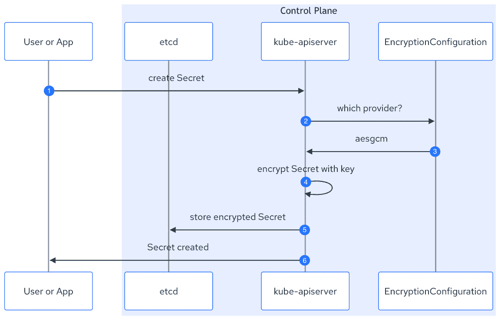

# 3

# 使用 Kubernetes 原生方式加密 Secrets

在前两章中，我们一起回顾了关于 Kubernetes 架构和设计中`Secret`对象的基础知识，包括其架构、实现和使用方式。我们还明确了，`Secret`对象由于其未加密的特性，无论是键值对还是 etcd 数据文件，都在 Kubernetes 平台中不安全，这给您的业务带来了严重的安全隐患。

在本章中，我们将深入了解 Kubernetes 和 etcd，理解它们相关的安全漏洞以及如何缓解或减少这些漏洞。虽然这些解决方案可能被认为与容器平台的部署紧密相关，但由于操作系统和 Kubernetes 分发版的开源特性，几乎所有的内容都可以广泛应用。

本章重点介绍一种平台内方法，首先介绍 Kubernetes 原生加密设计，包括与**密钥管理服务**（**KMS**）连接的可能性，并以 etcd 硬化概述作为结尾。

在本章中，我们将涵盖以下主题：

+   无需任何外部组件的原生加密

+   使用外部组件的原生加密

+   etcd 及其他组件的静态加密

# 技术要求

为了将概念与实际操作示例相结合，我们利用了一系列常用的工具和平台来与容器、Kubernetes 和密钥管理进行交互。在本章中，我们将继续使用在前面章节中使用的相同工具集：

+   在用户层面使用`systemd`自动启动容器/Pods。

+   **Podman Desktop** ([`podman-desktop.io`](https://podman-desktop.io)) 是一个开源软件，提供图形用户界面，用于构建、启动和调试容器，运行本地 Kubernetes 实例，简化从容器到 Pod 的迁移，甚至连接远程平台，如 Red Hat OpenShift、Azure Kubernetes Engine 等。

+   **Golang** ([`go.dev`](https://go.dev)) 或 Go 是一种在我们的示例中使用的编程语言。请注意，Kubernetes 及其大多数第三方组件都是用 Go 编写的。

+   **Git** ([`git-scm.com`](https://git-scm.com)) 是一种版本控制系统，我们将使用它来恢复书中的示例，并在探索 Secrets 管理解决方案时加以利用。

此外，以下工具也将被介绍：

+   **HashiCorp Vault** ([`www.vaultproject.io/community`](https://www.vaultproject.io/community)) 是一个社区版的 Vault，提供企业级服务，用于安全存储凭证、令牌等。

+   **Trousseau** ([`trousseau.io`](https://trousseau.io)) 是一个 KMS 提供程序插件，用于利用外部 KMS，例如 HashiCorp Vault、Azure Key Vault 或 AWS 等效服务

以下链接将为您提供与本书相关的数字材料：

+   GitHub 仓库：[`github.com/PacktPublishing/Kubernetes-Secrets-Handbook`](https://github.com/PacktPublishing/Kubernetes-Secrets-Handbook)

# Kubernetes 原生加密

*在 etcd 中写入的有效负载数据未加密，而是以 base64 编码，几乎等同于明文。加密有效负载中的数据将防护上述保护机制，但不会* *取代它们！*

有趣的是，我们已经确认 Kubernetes 键值存储（也称为 etcd）除了网络部分外，并未提供任何加密功能，Kubernetes 也不提供像 HashiCorp Vault 或 Azure Key Vault 那样的高级 KMS 功能

然而，Kubernetes 项目在 `kube-apiserver` 中设计了一个 KMS 框架，该服务用于验证和配置 API 对象的数据，以利用以下加密提供者之一：

+   `identity` 提供者是默认配置，这意味着不会对以 base64 编码的数据字段进行加密

+   `aes` 提供者，具有两个选项 `aesgcm` 或 `aescbc`，利用用户生成的随机加密密钥进行本地加密

+   `kms` 提供者插件将 `kube-apiserver` 连接到外部 KMS，以利用封装加密原理

配置 KMS 提供者框架的方式是通过在 `kube-apiserver` Pod（重新）启动时启用其功能

我们通过以下方式启用 `kube-apiserver` 的此功能：

+   我们通过两个配置标志引用 `kube-apiserver`；一个是启用此功能并引用配置文件，另一个是启用当配置文件发生更改时自动重新加载

+   配置文件需要部署在每个控制平面节点上，路径和名称在配置标志中定义

让我们从配置文件开始，该文件基于引用 `EncryptionConfiguration` API 对象的 YAML 清单，内容如下：

```
apiVersion: apiserver.config.k8s.io/v1
kind: EncryptionConfiguration
resources:
  - resources:
      - Secrets
      - ConfigMap
    providers:
      - identity: {}
```

这个 YAML 清单是 `kube-apiserver` 默认配置的实际显式版本，即使在该功能被禁用时也是如此。该清单可以按如下方式阅读：

+   `resources` 列表；引用要加密的 Kubernetes API 对象，可以是 `Secrets`、`ConfigMap` 或自定义资源，从 Kubernetes 版本 1.25 开始

+   `providers` 列表的优先级；引用加密机制，可以是 `identity`、`aesgcm`、`aescbc` 或 `kms`

如前所述，`providers` 列表具有优先级结构。这意味着 `kube-apiserver` 会按顺序解析列表，这可能会影响您的操作。将在实际操作示例中展示这一点

最简单的方式是使用前面的默认定义来设置我们的第一个 `EncryptionConfiguration` 文件，并确保它在每个控制平面节点上都正确部署

重要说明

此部署，除了位置和方法外，严重依赖于您的 Kubernetes 发行版，强烈建议您查阅相应的项目/供应商文档。

当使用来自 Kubernetes 项目的 Kind 时，它可以通过一个额外的卷定义进行简单引用，具体细节将在实践示例中展示。为了简化此过程，文件将被命名为 `configuration.yaml` 并部署在 `/etc/kubernetes/encryption` 文件夹中。

现在我们已经查看了 `EncryptionConfiguration` 文件，让我们来看看启用 `kube-apiserver` 并参考我们配置文件中提到的提供程序所需的标志。

以下是启用 `kube-apiserver` Pod 加密功能的标志概览：

+   启用并引用配置文件的标志如下：

    ```
    --encryption-provider-config=/etc/kubernetes/encryption/configuration.yaml
    ```

+   自 Kubernetes 1.26 起，自动重载配置文件更改的标志如下：

    ```
    --encryption-provider-config-automatic-reload=true
    ```

以下 Pod 定义代码片段显示了如何放置这两个标志：

```
apiVersion: v1
kind: Pod
...
spec:
  containers:
  - command:
    - kube-apiserver
    - --advertise-address=10.89.0.2
    - --allow-privileged=true
...
    - --encryption-provider-config=/etc/kubernetes/encryption/configuration.yaml
    - --encryption-provider-config-automatic-reload=true
```

现在我们已经了解了如何启用这些功能，让我们深入探讨提供程序选项。

## 独立的本地加密。

本地加密可以在无需任何额外软件的情况下启用，无论是在控制平面还是在 Kubernetes 集群之外。

### identity

该提供程序是默认的 `kube-apiserver` 配置，相当于在将数据字段有效负载存储到 etcd 中之前不进行加密处理。

以下图示提供了加密工作流的概览：


图 3.1 – Kubernetes KMS 身份提供程序工作流

图示流程可以按以下方式解读：

1.  用户创建一个 `Secret` 对象。

1.  `kube-apiserver` 检查 `EncryptionConfiguration` 提供程序列表。

1.  该提供程序指的是 `identity`。

1.  `kube-apiserver` 将 base64 编码的 `Secret` 存储在 etcd 中。

该提供程序不加密任何 `Secret` 数据字段有效负载，并且是 Kubernetes 安装时的默认行为。如果需要，它也可以用于用以下提供程序替换任何加密的 Secret。

### aesgcm 和 aescbc。

该提供程序使用 Golang AES 加密库将列出资源的数据字段有效负载转换为加密格式。

该提供程序使用 **高级加密标准**（**AES**）并提供两种模式：

+   CBC，虽然被认为较弱但速度较快。

+   GCM，被认为在启用密钥轮换时更快且不那么弱。

从实现角度来看，我们对两者遵循相同的原则：

+   生成一个 32 字节（或更多）随机加密密钥，并以 base64 编码。

+   设置您选择的提供程序，`aescbc` 或 `aesgcm`。

+   在 `EncryptionConfiguration` 配置文件中引用密钥。

+   如果未启用自动重载，请重启 `kube-apiserver`。

这相当简单，无论是从流程还是 `configuration.yaml` 的角度来看：

```
apiVersion: apiserver.config.k8s.io/v1
kind: EncryptionConfiguration
resources:
  - resources:
      - secrets
    providers:
      - aesgcm:
          keys:
            - name: key-20230616
              secret: DlZbD9Vc9ADLjAxKBaWxoevlKdsMMIY68DxQZVabJM8=
      - identity: {}
```

以下图表概述了在创建新 `Secret` 对象时的加密工作流：



图 3.2 – KMS aesgcm/aescbc 提供者的 Kubernetes 工作流

图表流程可以按以下方式解读：

1.  用户创建一个 `Secret` 对象。

1.  `kube-apiserver` 检查 `EncryptionConfiguration` 提供者列表。

1.  该提供者指的是 `aesgcm`。

1.  `kube-apiserver` 使用提供的密钥对数据字段负载进行加密，按照提供者定义的方式。

1.  `kube-apiserver` 将加密的 `Secret` 对象存储在 etcd 中。

`aesgcm` 和 `aescbc` 提供者是易于实现的解决方案，用于加密来自已列出资源的数据字段负载。

然而，这种简单性是有权衡的；此解决方案使用的加密密钥再次以 base64 编码，引用在 YAML 清单文件中，并存储在每个控制平面节点的本地文件系统上。如果系统或磁盘/文件系统遭到破坏，恶意黑客可以检索加密密钥并解密在 etcd 数据文件中的负载。

最后，这些提供者面临多种漏洞，从填充 oracle 攻击到生日攻击，或者根据密钥使用的次数*猜测*加密密钥，这增加了对适当自动化密钥轮换策略的需求。

## 与外部组件的原生加密

原生加密可以通过利用额外的软件来启用，无论是在控制平面上还是在 Kubernetes 集群外部。

### kms

Kubernetes `kms` 提供者是针对前述 `aescbc` 和 `aesgcm` 加密提供者的安全密钥暴露问题而提出的，提出了以下要求：

+   外部 KMS，如 Azure Key Vault、HashiCorp Vault 或 AWS Vault，用于利用信封加密方案的构造。

+   一个插件，称为 Kubernetes KMS 提供者插件，用于将 `kube-apiserver` 与一个或多个外部 KMS 相连接。这种方法减少了为了支持每个 KMS 供应商所需的 `kube-apiserver` 开发、集成和维护。

KMS 加密设计采用信封加密方案，使用两把密钥的方式：

+   一个 `kube-apiserver` 与 Kubernetes 集群相连接。

+   **密钥加密密钥**，也称为 **KEK**，用于加密 DEK。KEK 在 KMS 上生成并远程托管。

重要说明

虽然可以将一个单独的 KEK 托管在远程 KMS 上以服务多个 Kubernetes 集群，但不推荐这样做，因为如果远程 KMS 遭到入侵，它将成为单点故障和安全暴露的风险。建议为每个 Kubernetes 集群考虑一个专用的 KEK，并可能使用多个远程 KMS。

考虑到多租户需求，为每个租户拥有一个专用的 KEK 也是有意义的，这是一个在撰写本文时尚未实现的功能。

在本文写作时，Kubernetes 项目已经推出了 KMSv2，这是`kube-apiserver`的最新 KMS 提供者实现。

虽然高层次的功能目标相同，但设计和实现上略有不同。这些差异可能会影响你的合规性和监管需求：

+   在 KMSv1 中，每创建一个`Secret`对象就会在事务过程中生成一个专用的 DEK，每个 DEK 都通过调用 KMS 使用 KEK 加密，这会影响在大型 Kubernetes 集群环境中操作时的性能。

+   在 KMSv2 中，`kube-apiserver`在启动时（或在`EncryptionConfiguration`重新加载时）生成一个 DEK，调用 KMS 插件使用 KMS 服务器的远程 KEK 加密它，缓存 DEK，从内存中执行加密和解密，并且仅在重启或密钥轮换期间才会调用 KMS 进行加密。这种重新设计大大提高了大规模环境下的性能和弹性。

下图提供了 KMSv1 加密工作流的概述：


图 3.3 – KMS 插件 v1 提供者的 Kubernetes 工作流

图表流程可以按如下方式解读：

1.  用户创建一个`Secret`对象。

1.  `kube-apiserver`检查`EncryptionConfiguration`提供者列表。

1.  提供者指的是 KMSv1。

1.  `kube-apiserver`生成一个 DEK。

1.  `kube-apiserver`使用 DEK 加密数据字段负载。

1.  `kube-apiserver`请求 KMS 插件进行 DEK 加密。

1.  KMS 插件请求 KMS 使用 KEK 加密 DEK。

1.  KMS 使用 KEK 加密 DEK。

1.  KMS 插件将加密后的 DEK 返回给`kube-apiserver`。

1.  `kube-apiserver`将加密后的`Secret`和 DEK 存储在 etcd 中。

下图提供了 KMSv2 加密工作流的概述：


图 3.4 – KMS 插件 v2 提供者的 Kubernetes 工作流

图表流程可以按如下方式解读：

1.  用户创建一个`Secret`对象。

1.  `kube-apiserver`检查`EncryptionConfiguration`提供者列表。

1.  提供者指的是 KMSv2。

1.  如果没有现有的 DEK，`kube-apiserver`将生成一个。

1.  如果生成了 DEK，`kube-apiserver`将请求 KMS 插件进行 DEK 加密。

1.  KMS 插件请求 KMS 使用 KEK 加密 DEK。

1.  KMS 使用 KEK 加密 DEK。

1.  KMS 插件将加密后的 DEK 返回给`kube-apiserver`。

1.  `kube-apiserver`将加密后的 DEK 存储在 etcd 中。

1.  `kube-apiserver`使用 DEK 加密数据字段负载。

1.  `kube-apiserver`将加密后的`Secret`存储在 etcd 中。

`kms`提供者在配置方面增加了复杂性。此方法符合所有需要外部密钥管理的法规，同时解决了我们的大多数（如果不是全部）洋葱层次。

#### KMS 提供者插件示例

正如前面所述，`kms`提供程序需要额外的第三方软件，称为`kms`提供程序插件，以连接`kube-apiserver`与外部 KMS，如 HashiCorp Vault 或插件使用的任何其他受支持的 KMS。

该插件将部署在控制平面节点上，作为一个本地 UNIX 套接字，直接与`kube-apiserver`进行交互，而无需通过可能存在安全风险的网络传输。

诸如*Trousseau* ([`trousseau.io`](https://trousseau.io))等的社区项目提供了这种能力，可以通过 HashiCorp Vault、Azure Key Vault 和 AWS KMS 扩展`kube-apiserver`的功能。

#### 通过键值数据进行实际操作

在 Git 仓库中的`ch03`文件夹中，您将找到一个使用 Podman 或 Docker 部署新 Kind 集群的步骤说明，使用特定的集群配置文件可获得一个默认`EncryptionConfiguration`配置的可用实例。

操作指南包括一个简短的 Kind 配置文件介绍，允许我们为`kube-apiserver`启用特定标志，并解释如何通过配置文件将特定文件夹挂载到 Pod 中。这将帮助您未来与利用相同原则的其他 Kubernetes 发行版进行交互。

从那里开始，您将有机会实施每个提供程序，并创建和替换使用该提供程序加密的新修订版`Secret`对象。这种方法将突显从一个提供程序转移到另一个提供程序而不带来主要操作负担的能力。

最后，实际操作示例将帮助您验证每个`Secret`对象是否已使用适当的提供程序、密钥和版本加密，如果适用，可以直接从 etcd 数据存储中转储条目进行查看。

#### 优先级

如前所述，提供程序列表具有优先级评估或者说在实施过程中要考虑的顺序：

1.  创建新的`Secret`时，`kube-apiserver`将使用列出的第一个提供程序来加密指定资源的数据字段有效负载。

1.  读取现有的`Secret`时，`kube-apiserver`将检查 Secret 头以定义 KMS 提供程序、其版本和相关联的密钥：

    +   如果有匹配项，将尝试解密`Secret`数据字段的有效负载。

    +   如果没有匹配项，将返回错误。

1.  所有现有的 Secrets 可以通过更改提供程序列表顺序来替换为更新的修订版。最常见的例子是引入一个新的 KMS 提供程序，如`aesgcm`，并用新的修订版替换所有未加密的 Secrets，这将使用`aesgcm`提供程序进行加密。此特定案例在实际操作示例中有所说明。

这个`kms`提供程序的实现示例展示了如何使用外部 KMS 服务。请注意，`kms` v1 提供程序在 Kubernetes 1.28 版本中已被弃用，取而代之的是更具韧性的`kms` v2，它能够承受网络分区。

# 深入了解如何保护 etcd

上一节描述了 Kubernetes 在应用层提供的原生加密功能，换句话说，就是如何保护敏感数据，以防`Secret`和`ConfigMap`对象在 Kubernetes API 服务器处理中被暴露。

根据部署类型，是否是本地部署还是云端部署，其他层级也可以通过加密受益，以避免或减少安全暴露：

+   在本地或云端使用物理或虚拟机进行自部署时，Kubernetes 的`EncryptionConfiguration` API 对象以文件形式存储在磁盘上；访问此配置文件以及 etcd 数据文件，将导致所有在 etcd 中记录的敏感数据遭到泄露。

+   在使用云服务提供商的托管 Kubernetes 实例时，控制平面成为他们的责任。然而，并不是所有服务都是一样的，一些服务需要仔细检查配置，以确保您选择的云服务提供商在其基础设施层面处理了静态加密，并允许您启用 Kubernetes 的原生加密。

考虑到以下的洋葱图，我们可以将图示的组件列为潜在的暴露点，以应对未授权访问 etcd 中的数据，包括 Secrets 和 ConfigMaps。本节为您提供了关于每个组件的安全风险分析及相关的缓解措施：


图 3.5 – 将 etcd 安全暴露呈现为洋葱层

由于 Linux 和 Kubernetes 发行版的组合非常多，更不用说各种云服务提供商的选择，本章提供了一个关于关键值数据的广泛实践部分，并分享了其他组件的指南，以下参考资料将帮助您为系统实施安全和加固配置：

+   Tevault, Donald A. (2023). *精通 Linux 安全与加固：保护您的 Linux 系统免受网络攻击的实用指南*，由*Packt Publishing*出版。

+   Kalsi, Tajinder. (2018). *实用 Linux 安全食谱：使用实用的配方保护您的 Linux 环境免受现代攻击*，由*Packt Publishing*出版。

还值得注意的是，云服务提供商已经做了大部分的工作，负责加密静态磁盘和文件系统，以减轻相关的攻击向量。然而，他们都建议利用 Kubernetes 的`EncryptionConfiguration` API 服务器配置进行端到端加密。

## Linux 系统加固

*操作系统加固的艺术在于将访问漏洞的利用降到零。在我们的背景下，这意味着操作系统不允许远程访问到 etcd* *数据文件。*

重要的是要理解 Linux 发行版在系统安装的早期阶段就已包含安全配置文件的概念，利用像 SCAP 这样的标准，并根据你组织的需求帮助进行相关和一致的加固。部署时提供了一系列行业特定的配置文件，例如 CIS 基准和 NIST，帮助配置操作系统，使其符合所选的规定。这些规则在使用图形用户界面时会进行说明，或者可以在供应商文档中找到。无论你偏好的安装方式是文本、图形还是 kickstart，都可以从这种加固自动化中受益。

这种方法有助于减轻运维团队的压力。通过自动化相关的 100 多条具体配置规则，遵循像 PCI-DSS 这样的合规配置文件变得简单，而无需阅读其 360 页的要求。这将与 Red Hat 安全加固参考指南中的 190 多页内容相辅相成。

一旦系统部署了与你组织所在行业相关的适当安全策略，OpenSCAP 工具集可以用来扫描整个安装基础，为你提供以下内容：

+   每个 Linux 发行版的量身定制审计

+   一个可共享的审计文件，包含风险评分系统

+   一项缓解策略，涵盖最常见的工具集（Shell 脚本、Puppet、Ansible 等）

参见以下内容作为参考：

+   OpenSCAP: [`www.open-scap.org/`](https://www.open-scap.org/)

+   OpenSCAP PCI-DSS 规则: [`static.open-scap.org/ssg-guides/ssg-rhel9-guide-pci-dss.html`](http://static.open-scap.org/ssg-guides/ssg-rhel9-guide-pci-dss.html)

+   Red Hat Enterprise Linux 安全加固: [`access.redhat.com/documentation/en-us/red_hat_enterprise_linux/9/html-single/security_hardening`](https://access.redhat.com/documentation/en-us/red_hat_enterprise_linux/9/html-single/security_hardening)

加固 Linux 系统包括安装前和安装后的任务。为了避免重新部署操作系统，请在安装过程中启用适当的安全配置文件和磁盘加密。大多数 Linux 发行版，例如 Red Hat Enterprise Linux 9，都提供图形用户界面来设置特定的安全配置文件，并为你提供一份强制性的配置更改列表，以确保符合所选的配置文件。

GitHub 仓库在 `ch03` 文件夹中提供了两个示例，演示了使用安装程序图形界面和 kickstart 文件加固 Linux 系统。

## Linux 数据加密

*盗窃磁盘或服务器是一个严重问题，且发生的频率比我们想象的还要高。但这不仅仅是针对本地基础设施；云虚拟磁盘也可能被盗，原因是虚拟化程序的漏洞可能泄露磁盘文件，这意味着所有与你的业务关键系统相关的凭证* *也会被泄露*。

由于 etcd（截至本文撰写时）不提供任何加密功能，因此将存储在控制平面节点文件系统中的数据文件可以被访问并轻松读取，从而恢复我们的 `Secret` 对象负载，详见 *第一章*，*理解 Kubernetes 秘密管理*。这意味着任何本地部署和边缘计算的物理场景，都会在攻击者盗取磁盘或节点时导致安全漏洞。

为了解决这个问题，磁盘和文件系统需要加密。你可能会问，为什么两者都要加密？因为 `Secret` 对象用于访问你的云、应用程序和存储账户。

### 磁盘加密

FDE，有时称为**自加密磁盘**（**SED**），是一个有趣的起点，可以提供完全从主机卸载的加密过程，从而减少攻击面。它对操作系统和应用程序透明（无需维护驱动程序或库）。FDE 保证了在不同硬件和软件组合下的高兼容性、可支持性和可移植性。

所有 FDE/SED 磁盘都配有零长度认证密钥/密码，以便简化初始设置，尤其是在没有用户需求的情况下。定义认证密钥或密码时，DEK 会存储在磁盘上，并通过定义的自定义用户密钥进行保护。

该工作流程的好处如下：

+   防止磁盘被物理盗窃

+   在启动之前就保护数据

+   启用重新密钥选项以应对紧急事件和合规需求

陷阱如下：

+   启动时需要用户交互以输入认证密钥

+   丢失密钥意味着丢失数据

+   黑客攻击仍然是可能的

确实，这些磁盘的有效性可能受到挑战，不同的方法展示了如何访问并破坏这些磁盘上的数据，以下两个参考文献提供了相关信息：

+   由 Tilo Müller、Tobias Latzo 和 Felix C. Freilling（来自弗里德里希-亚历山大大学系统安全小组）编写的《*硬件基础的全磁盘加密（不）安全性*》：[`www.cs1.tf.fau.de/research/system-security-group/sed-insecurity/`](https://www.cs1.tf.fau.de/research/system-security-group/sed-insecurity/)

+   使用以下术语进行互联网搜索：`NSA 磁盘` `固件黑客`

请注意，大多数在服务器和存储阵列中提供的专业级磁盘（无论是机械磁盘还是基于芯片的）都配有此类技术。这是要考虑的第一层硬件保护。

### 文件系统加密

在加密 Linux 文件系统时，可以考虑多种方法，包括开源和专有选项。在本节中，我们将从需求的角度出发，探讨三种从简单到复杂的开源解决方案。

#### 普通设备映射加密

使用 `dm-crypt` 进行设备映射加密是一个明显且简单的选择，因为它对未分区的磁盘进行块级加密。该技术提供了磁盘级加密，并且可以通过所谓的垃圾随机数据访问，从而引入一种可否认的加密方法。

使用设备映射加密的好处如下：

+   提供全磁盘加密

+   不会暴露分区表，也不会暴露 UUID 或标签

+   在灾难发生时提供强大的解决方案（在 LUKS 设置中，如果头部被销毁，数据将丢失）

存在以下问题：

+   需要较高的设备映射掌握程度，以确保正确的配置

+   单一密码短语且没有密钥轮换，可能会在特定的合规/监管要求中产生潜在问题

+   没有密钥派生功能，这会降低在生成缺乏熵的密码短语时抵抗暴力破解攻击的能力

+   不支持固态硬盘上的 TRIM 命令

参考以下内容：

+   项目：[`www.kernel.org/doc/html/latest/admin-guide/device-mapper/dm-crypt.html`](https://www.kernel.org/doc/html/latest/admin-guide/device-mapper/dm-crypt.html)

+   在 Arch Linux 上的实现：[`wiki.archlinux.org/title/Dm-crypt`](https://wiki.archlinux.org/title/Dm-crypt)

#### Linux 统一密钥设置（LUKS）

LUKS 可以被认为是一款通用的磁盘加密软件，其核心实现了安全的密码管理。这使我们能够克服与密钥派生、轮换和多重密码功能相关的一些（如果不是全部的话）难题。除此之外，LUKS 与**逻辑卷管理**（**LVM**）和软件 RAID 场景兼容，适用于应对不同需求以及合规/监管要求的有趣解决方案。以下是一些可以将 LUKS 与其他解决方案集成的示例：

+   在分区上使用 LUKS

+   在 LUKS 上使用 LVM

+   在 LVM 上使用 LUKS

+   在软件 RAID 上使用 LUKS

LUKS 还可以与其他解决方案互补，以提供额外的安全应对措施。一个普通的设备映射器和一个没有头部的 LUKS 实现将建立一个可否认的加密设备（没有头部）。这种方法也能满足密钥轮换要求，并具备密钥派生和多重密码功能。这可能是两全其美的解决方案，是我在不需要外部 KMS 的情况下最为青睐的选择。

参考以下内容：

+   项目：[`gitlab.com/cryptsetup/cryptsetup/blob/master/README.md`](https://gitlab.com/cryptsetup/cryptsetup/blob/master/README.md)

+   在 Red Hat Enterprise Linux 上的实现： [`access.redhat.com/documentation/en-us/red_hat_enterprise_linux/9/html/security_hardening/encrypting-block-devices-using-luks_security-hardening`](https://access.redhat.com/documentation/en-us/red_hat_enterprise_linux/9/html/security_hardening/encrypting-block-devices-using-luks_security-hardening)

#### 设备映射器与 LVM 和 LUKS

如 LUKS 部分所列，使用 LUKS 实现磁盘加密有多种组合。然而，每种设置都有优点和折衷，甚至可能是重大的，比如以下几点：

+   LVM 在 LUKS 上简化了分区操作，并在加密时保护卷的布局，但它依赖于一个单一的加密密钥，所有卷都会被加密。

+   LUKS 在 LVM 上提供了灵活性，可以支持加密和未加密的卷，但由于暴露了卷的布局，它的维护复杂且安全性较低。

对于设备映射器和 LUKS 解决方案，使用 TRIM 配合固态硬盘可能会带来安全风险或作为一种安全响应。

在普通模式下使用 `dm-crypt`，如果启用了 TRIM，它最终会暴露加密方式，并可能泄露从已释放的块中获得的数据，进而发现加密模式。然而，如果没有对数据和不可否认加密的硬性要求，那么可以安全启用 TRIM，因为这样会显著提高性能。

使用 LUKS 时，头文件存储在设备的开始部分。如果需要更换密码，之前的密码将被撤销，TRIM 会帮助释放这些块。如果没有更换密码，攻击者可能会研究设备，获取旧的头文件并解密磁盘。

为了提高 LUKS 的安全性，可以使用（虚拟）**受信平台模块**（**TPM**）来存储并处理驱动器的自动解锁，从而在启动时避免手动输入密码。然而，如果服务器被盗，这可能会暴露密钥，进而暴露数据。

为了避免复杂性，可以依赖风险分析方法来定义在特定环境中的需求，并确保符合相关法规要求。然后，选择一种能够满足需求且与运营团队技能匹配的文件系统加密方法。

#### 网络绑定磁盘加密（NBDE）

密钥管理服务，也称为密钥托管，在此背景下将加密密钥转移到远程服务，以避免之前解决方案中列出的一些陷阱。密钥存储在类似金库的数据存储中，因此需要高可用性和备份策略，以保证加密密钥的可用性和生存性。如果没有，磁盘上的数据将永远丢失。需要注意的是，备份也必须受到保护，以避免通过旁道或机会性攻击泄漏密钥。

**网络绑定磁盘加密**（**NBDE**）解决方案通过引入多层安全性来解决这些挑战：

+   它使用 HTTP/HTTPS 协议简化网络配置。

+   一组具有预定义法定人数的服务器，用于提供加密/解密功能。如果未满足法定人数，则不会发生解密，直到该实例重新上线。这就创建了网络依赖关系的概念，即磁盘必须连接到网络上，才能访问所有 NBDE 服务器，从而允许其内容的暴露。

+   对称加密密钥被分割到所有 NBDE 服务器上，并通过易于（重新）分发的公钥进行管理。

+   减少密钥管理，无需保险库，也不需要高可用性和备份。

+   当所有条件满足时，允许透明重启。

+   防止磁盘或服务器及其磁盘被盗，除非整个 NBDE 设置被盗。

该解决方案的实施并不像听起来那么困难。这样的实施可以在短时间内完成，同时满足最严格的合规性和监管要求。

请参见以下参考资料：

+   一个为 NBDE 设计的强韧 KMS 项目示例：[`github.com/latchset/tang`](https://github.com/latchset/tang)

+   Red Hat Enterprise Linux 上 NBDE 实施的示例：[`access.redhat.com/documentation/en-us/red_hat_enterprise_linux/9/html/security_hardening/configuring-automated-unlocking-of-encrypted-volumes-using-policy-based-decryption_security-hardening`](https://access.redhat.com/documentation/en-us/red_hat_enterprise_linux/9/html/security_hardening/configuring-automated-unlocking-of-encrypted-volumes-using-policy-based-decryption_security-hardening)

+   在 Red Hat OpenShift 上使用 Tang 服务器实施的 NBDE 示例：[`docs.openshift.com/container-platform/4.13/security/network_bound_disk_encryption/nbde-about-disk-encryption-technology.html`](https://docs.openshift.com/container-platform/4.13/security/network_bound_disk_encryption/nbde-about-disk-encryption-technology.html)

## 传输

*整个 Kubernetes 设计基于 API 驱动的架构。这意味着任何有效负载的交换都需要通过安全通道（使用传输层安全性 TLS）进行。如果没有，交换到 etcd 的数据将会从网络中可读，包括来自* *Secrets* 的敏感数据。*

大多数 Kubernetes 发行版默认启用 TLS，并为操作员提供 TLS 安全配置文件选项，以确保相互交互的服务和应用程序之间的兼容性。在 Red Hat OpenShift 中，精细化的配置方法允许操作员为入口、kubelet 和控制平面组件（后者包括 etcd）配置特定的 TLS 安全配置文件。

请注意，服务端点也可以通过由外部网络设备或软件（如负载均衡器）处理的 TLS 终止来强制执行。虽然这种方法可以确保从最终用户通过完全限定域名访问 API 服务器时的网络流安全，但如果内部 Kubernetes 网络流没有任何 TLS 终止，它将无法保护。因此，应该同时考虑这两者，以确保提高的安全态势。

请参阅以下内容作为参考：

+   etcd 传输安全模型： [`etcd.io/docs/v3.5/op-guide/security/`](https://etcd.io/docs/v3.5/op-guide/security/)

+   Red Hat OpenShift: [`docs.openshift.com/container-platform/4.13/security/tls-security-profiles.html#tls-profiles-kubernetes-configuring_tls-security-profiles`](https://docs.openshift.com/container-platform/4.13/security/tls-security-profiles.html#tls-profiles-kubernetes-configuring_tls-security-profiles)

# 概述

虽然安全措施取决于组织的合规性和监管要求，但基于风险的评估将定义适当的行动，以加固您的信息系统。然而，保护 Kubernetes Secrets 不是可选的，而是必须的。

鉴于当前采用混合多云模式的趋势，无论是云端还是自管理的集群，一旦其中一个集群的 etcd 被攻破，可能会导致整个环境的安全受损。这类攻击利用集群内部的网络连接或一个集群管理工具，令令牌被记录在被攻破的 etcd 中。这样的场景将导致病毒式攻击，感染每一个连接的终端。

作为修复措施，原生 Kubernetes 加密——更具体地说，`kms` 提供程序——是所有主要云和软件提供商支持的最佳实践安全模式。

请记住，安全性不是一个有限的游戏，而是一个持续的努力。定期对您不断变化的环境进行审计和扫描，将为您提供最新的合规状态。它们还将帮助您建立一个任务积压列表，以减轻已知的漏洞和配置错误。

在下一章中，我们将讨论调试和故障排除技术，以分析在配置和使用 Kubernetes Secrets 时遇到的意外行为。
