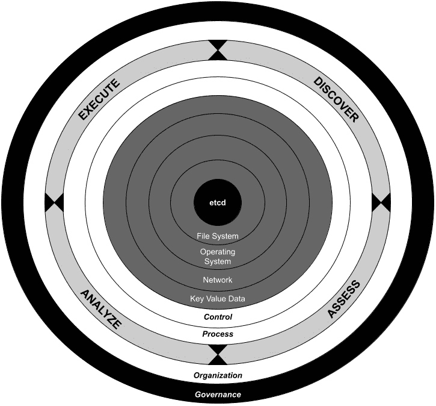

# 5

# 安全性、审计与合规性

在前几章中，我们从设计、实施和运营的角度，建立了应对 Kubernetes Secrets 管理挑战的基础。我们还通过逐层剖析完整的基础设施，突出了关键关注点，同时考虑减少或缓解安全暴露的路径。然而，无论我们投入多少努力，以下问题始终会浮现：

+   我们的 IT 环境如何才能足够安全？

+   从控制和审计的角度，最佳实践是什么？

+   我的 **首席信息安全官** (**CISO**) 要求是什么？

本章通过基于最后一个问题的逆向方法，开启本手册的高级主题，“*我的 CISO 团队的要求是什么？*” 这个问题的答案通常是以另一个问题的形式出现，比如“*我的组织必须遵守哪些规定？*”，这暗示了一个法律视角。

本章将扩展以下主题：

+   理解网络安全与网络风险管理的区别

+   最常见的合规标准

+   控制、审计和缓解安全风险的最佳实践

到本章结束时，你将知道如何通过一个简单的可重用蓝图，在人员、流程和技术层面解决安全问题。

# 技术要求

为了完成本章的实践部分，我们将利用一系列常用工具和平台，这些工具和平台通常用于与容器、Kubernetes 和 Secrets 管理进行交互。在本章中，我们将继续使用相同的工具集：

+   `systemd` 在用户级别用于自动启动容器/Pods。

+   **Podman Desktop** ([`podman-desktop.io`](https://podman-desktop.io)) 是一个开源软件，提供图形用户界面，用于构建、启动和调试容器，运行本地 Kubernetes 实例，简化从容器到 Pod 的迁移，甚至能够与远程平台如 Red Hat OpenShift、Azure Kubernetes Engine 等连接。

+   **Git** ([`git-scm.com`](https://git-scm.com)) 是一个版本控制系统，我们将用它来展示本书中的示例，并在发现 Secrets 管理解决方案的过程中加以利用。

+   **Kube-bench** ([`github.com/aquasecurity/kube-bench`](https://github.com/aquasecurity/kube-bench)) 是一个社区工具，用于根据 CIS 基准对 Kubernetes 集群进行测量。

+   **合规操作员** ([`github.com/ComplianceAsCode/compliance-operator`](https://github.com/ComplianceAsCode/compliance-operator)) 是一个社区工具，用于测量并修复 Kubernetes 集群上的安全控制。

+   **HashiCorp Vault** ([`www.vaultproject.io/community`](https://www.vaultproject.io/community)) 是一个社区版 Vault，提供企业版服务，用于安全存储凭证、令牌等信息。

+   **Trousseau** ([`trousseau.io`](https://trousseau.io)) 是一个 KMS 提供商插件，利用外部 KMS，如 HashiCorp Vault、Azure Key Vault 及其 AWS 等效服务。

本书的 GitHub 仓库包含与本书相关的数字资料：[`github.com/PacktPublishing/Kubernetes-Secrets-Handbook`](https://github.com/PacktPublishing/Kubernetes-Secrets-Handbook)。

# 网络安全与网络风险

尽管（网络）安全和网络风险的出版物多得足够，但它们常常被误认为是相同的概念。

本节的目的是帮助你反思如何将传统的*做*安全方式从以 IT 为中心的视角转变为*实践*安全，并全面理解组织的需求与要求。这将帮助你进行动态风险管理评估，以便实施适当的安全措施。

## 网络安全

大多数组织将安全领域划分给各自的 IT 部门，指定一组几乎是孤立工作的有限人员。这样做会给他们的网络安全任务带来三个限制：

+   仅限于与基础设施堆栈相关的有限范围，且对关键业务应用的考虑很少或没有考虑

+   对组织业务连续性计划的了解有限

+   运维团队应对安全事件的响应能力有限

该模型有双重方法：

+   以事件为驱动或反应式

+   封锁一切以应对监控和发现安全漏洞的能力减少

由于安全性被所有 IT 人员视为一种约束，从开发人员到各个领域的运维人员，都将会在内部事故发生时或当同一行业内有公开参考时做出剧烈的变化。

有些人认为他们已部署了监控和流程，能够帮助识别并推动事件解决。他们也同意缺少应急演练来训练 IT 人员，这与**灾难恢复**计划（**DRP**）类似。

在我们快速发展的数字经济中，这种网络安全模型无法有效回应我们的三个问题：

+   我们的 IT 环境能被安全到什么程度？

+   从控制和审计的角度来看，最佳实践是什么？

+   我的 CISO 有哪些要求？

确保该模型安全的一个典型例子是实施强密码政策，包括 30 天更换密码并附加多重身份验证，且与组织资源的集成有限。这种解决方案可能适用于开发团队，但不适用于主要使用短时效网页解决方案的业务团队。

## 网络风险

在这里必须考虑一种不同的方法：从业务角度进行风险管理，以应对各个组织部门的治理和合规要求。这将帮助在设计和实施安全措施时进行优先级排序，同时确保在组织层面获得适当的技能。这种方法要求对组织的运作有深入了解，从财务到售后支持，以防技术专家对安全工具的投资过少或过多，导致不同业务单位的安全工具效率低下。

像灾难恢复计划（DRP）一样，网络风险管理的目标是定义最小的要求集，以使组织能够在遭遇网络攻击时依然实现其业务目标。在构建这种治理框架时，我们不仅要回答前面提到的三个问题，还需要让董事会要求每个高管回答以下问题：

+   **首席执行官（CEO）**：安全漏洞会对品牌造成多大损害？

+   **首席财务官（CFO）**：安全漏洞会带来多大的财务影响？

+   **首席信息安全官（CISO）**：我们是否在优先投资以改善我们的安全态势？

+   **首席运营官（COO）**：我们的客户/合作伙伴是否愿意信任与我们组织做生意？

尽管网络安全被视为一项成本，网络风险管理通过提供报告能力，可以展示安全投资的商业价值以及与之相关的态势，并能提供接近实时的响应。

该模型中的一个典型安全示例是实施强大的登录凭证策略，采用一次性密码方法。此解决方案为使用基于 Web 的解决方案的组织员工提供了足够的安全性。员工如果需要访问或推送更改到应用程序源代码时，可以额外实施多因素认证并进行安全审计。

与传统网络安全方法相比，网络风险评估从安全、合规性和可用性的角度评估不同的风险级别，并根据与关键资产交互时的需要采取相应措施。

## 结论

单纯为了勾选安全（网络安全）选项而进行安全工作不会给组织带来任何好处，反而会让包括 IT 部门在内的所有员工感到沮丧，导致安全措施被禁用，影子基础设施被构建。

治理框架提供了关于如何在数字经济中应对网络攻击的愿景、使命和执行策略。添加一个风险管理框架将自然而然地将*安全*部分融入到你的 DevOps 实践中。此时，我们可以采用一种模型，帮助我们在考虑组织每个风险所需努力的同时，识别、保护、检测、响应并从安全漏洞中恢复。

作为本话题的后续，以下参考资料提供了有关此领域的更多框架细节：

+   国家标准与技术研究所（2018 年），*改善关键基础设施* *网络安全* 框架。自行出版。

+   欧洲网络安全局（2023 年），*供应链网络安全的良好实践*。自行出版。

+   Brown, J. (2023 年)，*高管网络安全计划手册*，Packt Publishing。

# 合规标准

合规概念是关于组织如何在尊重的基础上运作，考虑到特定行业、总部所在地和可能与之合作的国家的一套法律和政策，以确保隐私和安全。合规要求将决定组织治理的大部分要求。

任何企业可能需要遵守多个法规，取决于其活动。一个很好的例子是总部位于美国的软件公司，在全球医疗实践中利用**人工智能** (**AI**)，提供**软件即服务** (**SaaS**) 和本地解决方案。这意味着以下的法律合规：

+   美国**健康保险移植与责任法案** (**HIPAA**)，用于处理患者记录

+   **欧盟通用数据保护条例** (**GDPR**)，欧盟关于收集、处理和存储来自第三方的个人用户数据的法规

+   **支付卡行业数据安全标准** (**PCI-DSS**)，用于处理支付卡时的国际行业标准

+   额外的法律合规要求，如欧盟人工智能法案，规范人工智能使用，网络弹性法案，涉及安全软件供应链，数据法案，支持跨云服务提供商的数据可携带性，以及**网络信息系统 2** (**NIS2**) 指令，确保关键基础设施的安全和事件管理最佳实践

+   请勿（间接）（再）销售任何列入美国商务部制裁国家的解决方案

理解整体合规义务可能会令人不知所措。然而，大多数法规有重叠的安全控制规则，可用于简化或统一方法。这也是**互联网安全中心** (**CIS**) 针对数字平台（操作系统、移动设备、服务器软件、云、虚拟化、容器等）创建综合基准的原因。

CIS 基准帮助任何组织的 IT 部门从安全控制和相关技术配置的角度衡量当前的安全态势，包括漏洞和缓解措施的详细信息。这些控制措施与最常见的监管框架（如 HIPAA、PCI DSS、SWIFT、ISO 27000、SOC 2 和 NIST）相对应。以下是 CIS 基准与 NIST 800-53 的映射示例：[`www.cisecurity.org/insights/white-papers/cis-controls-v8-mapping-to-nist-800-53-rev-5`](https://www.cisecurity.org/insights/white-papers/cis-controls-v8-mapping-to-nist-800-53-rev-5)。

从 Kubernetes 的 CIS 基准视角（[`www.cisecurity.org/benchmark/kubernetes`](https://www.cisecurity.org/benchmark/kubernetes)），截至本文撰写时的版本为 1.7.0，以下是需要考虑的控制措施，用以保障机密数据的安全：

+   `--encryption-provider-config`参数已根据需要进行适当设置：

    +   此控制描述涉及通过使用我们在*第三章*中探索的修复方法来加密`etcd`键值存储，具体内容见*键值* *数据*部分，*以 Kubernetes 原生方式加密机密数据*。

    +   基准测试还包括通过检查`kube-apiserver`是否使用`--encryption-provider-config`标志运行的审计。

+   `aescbc`、`aesgcm`或`kms`

+   基准测试还包括一个审计，检查由`--encryption-provider-config`标志引用的文件中的配置内容。

+   `Secret`、`ConfigMap`和`TokenReview`通过`Pod`和`Service`*   `Secret`作为`Pod`环境变量，考虑到它在节点内存和应用日志中的潜在暴露*   基准测试还包括审计概览，帮助你在日志中执行与机密相关的环境变量搜索*   `etcd`键值存储，这个主题将在*第十一章*中探讨，*探索外部* *机密存储*  *基准测试还包括审计概览，帮助你审查使用第三方解决方案的适当机密管理实施*

请注意，一些法规可能包括物理安全控制措施，例如数据中心和物理服务器访问，这些内容不包括在 CIS 基准中。然而，从我们在*第三章*中对其安全性分析的洋葱视角出发，*以 Kubernetes 原生方式加密机密数据*，这些控制措施是相关的。

现在是更新我们的洋葱图表的时候了，以便新增表示持续努力以确保符合组织治理中描述的监管义务和标准的层级：



图 5.1 – Kubernetes 机密管理的安全态势框架

考虑到组织的治理结构和这个网络风险评估模型，这些附加层提供了持续的发现、评估、分析和（缓解）执行，因此我们可以定义并改善当前的安全性和合规性态势。

# 采用 DevSecOps 思维模式

在前面的章节中，我们起草了一系列最佳实践，可以通过以下关键点总结：

+   考虑组织的治理结构，包括他们必须遵守的监管框架

+   采用网络风险管理思维模式，定制适合每个业务单元的安全控制措施，而不是死板的一刀切的网络安全政策

+   将安全视为一种持续改进的努力，涵盖所有运营活动中的发现、分析和报告

我们在本手册中提到过几次*安全态势*这个术语。让我们在使用 NIST 800-37 规范时定义一下它：“*企业网络、信息和系统的安全状态，基于信息保障资源（例如人员、硬件、软件和政策）以及用于管理企业防御和应对变化情况的能力。这与* *安全状态*同义。*”

一旦你根据像 CIS Kubernetes 基准这样的框架建立了当前的安全态势，那么就更容易识别差距，并通过当前和未来缺失的控制措施不断改善你的安全态势。

接纳这种方法意味着思维方式的转变，有助于持续审查组织的安全态势并突出需要缓解的差距。这也被称为 DevSecOps 实践。

在这一阶段，DevSecOps 的采用将自然而然地将治理和合规要求融入到整个 DevOps 周期中。这将缩短相关团队的反馈循环，从而在部署到生产环境之前改善合规性、安全响应和安全态势。

不要将 DevSecOps 实践视为一个独立的框架；而是将其视为对 DevOps 模型的补充。所有安全实践在每个步骤中都紧密相连：

+   **规划**：这包括在初步项目范围内的安全性、治理和合规要求。误区是将这些要求视为发布应用程序前的最后验证。

+   **开发**：将安全性融入组织的编码治理中，帮助减轻常见的安全暴露风险。它包括代码分析工具，帮助在代码提交之前发现漏洞。

+   **CI/CD**：这涉及执行安全测试，扫描代码和容器镜像中的漏洞。这有助于在漏洞进入生产环境之前发现并修复这些暴露点。

+   **持续监控/审计**：有助于在近实时中检测和响应安全暴露。这也有助于基于风险的方法，其中某些安全暴露可能被认为是可以接受的，但应密切监控。

在 DevOps 流程中加入安全性将鼓励所有团队合作，并促进共享责任和问责文化，从而在开发过程中更早发现安全暴露，推动高质量和安全的软件交付。

# 工具

从 Kubernetes 的角度来看，并根据其专门的 CIS 基准，Secrets 管理部分需要我们执行以下操作：

+   启用 `etcd` 服务的加密功能。

+   为敏感数据负载（如 `Secret` 以及 `ConfigMap` 对象）定义并执行资源访问策略。

+   考虑采用外部 Secrets 管理解决方案，以增强平台的安全态势。

+   审计所有与这些对象的交互，包括平台内外的操作。

为此，您需要一套工具，帮助您发现、分析并缓解潜在的安全暴露。我们将探讨五种工具：

+   **Trivy，来自 Aqua Sec**：这不仅可以帮助您扫描容器镜像的漏洞，还能发现与 Secrets 相关的安全暴露。

+   **kube-bench**：用于评估 CIS 基准。

+   **合规操作员**：用于评估支持的 OpenSCAP 配置文件并提供缓解路径。

+   **StackRox**：用于评估集群、容器镜像和网络流量的安全配置文件。StackRox 提供了一个全面的用户界面，并带有一个有用的基于风险的仪表板，按风险级别对暴露进行排名。

+   **Kubernetes 日志记录**：用于收集与平台、应用程序和用户之间交互相关的所有信息和审计痕迹。

让我们来看看这些工具的功能，并展示它们的使用方式。所有这些工具都能帮助您遵守法规，并启动 DevSecOps 模型，同时不断提升您的安全态势。

## Trivy

由于容器镜像的不可变性，持续跟踪漏洞至关重要，可以使用像 Trivy 这样的扫描工具。该工具也特别关注 Secrets 管理，因为它能够针对与 Secrets 相关的特定安全严重性进行扫描。

使用 Trivy Kubernetes CLI，可以通过以下命令专门触发针对 Secrets 的扫描过程：

```
trivy k8s –severity-checks=secret –report=summary cluster
```

请参见本书 GitHub 仓库中的`第五章`文件夹，了解如何在本地 `kind` Kubernetes 集群上实现 Trivy 的示例。

## kube-bench

您的 IT 部门可能已经为整个组织的基础设施投资了一个安全套件，但我们还是要考虑使用外科工具与通用工具的区别。

在将您的环境与 CIS 基准进行对比时，来自 Aqua Security 软件的`kube-bench`可能是您在 Kubernetes 集群中运行的最有趣工具之一。基准作业可以通过标准的 YAML 清单进行配置；您可以自定义它，使其适应您组织的治理需求。

以下是检查的一个示例：

```
---
controls:
id: 1
text: "Master Node Security Configuration"
type: "master"
groups:
- id: 1.1
  text: API Server
  checks:
    - id: 1.1.1
      text: "Ensure that the --allow-privileged argument is set (Scored)"
      audit: "ps -ef | grep kube-apiserver | grep -v grep"
      tests:
      bin_op: or
      test_items:
      - flag: "--allow-privileged"
        set: true
      - flag: "--some-other-flag"
        set: false
      remediation: "Edit the /etc/kubernetes/config file on the master node and
        set the KUBE_ALLOW_PRIV parameter to '--allow-privileged=false'"
      scored: true
```

该控制示例评估特权容器——即绕过`cgroup`控制器限制的容器——是否能够提升为容器内的 root 用户，这也意味着操作系统中的 root 权限。

本示例展示了如何通过引入`skip`定义来禁用控制：

```
---
controls:
id: 1
text: "Master Node Security Configuration"
type: "master"
groups:
- id: 1.1
  text: API Server
  checks:
    - id: 1.1.1
      text: "Ensure that the --allow-privileged argument is set (Scored)"
      Type: "skip"
      scored: true
```

请参阅本书 GitHub 存储库中的`chapter 5`文件夹，了解如何在本地`kind` Kubernetes 集群上实现`kube-bench`的示例。

## Compliance Operator

另一种在支持操作符的 Red Hat OpenShift 容器平台和 Kubernetes 发行版上利用`kube-bench`功能的方法是**Compliance Operator**。此工具根据 CIS 基准和其他**安全内容自动化协议**（**SCAP**）配置文件进行合规性检查，例如**澳大利亚网络安全中心**（**ACSC**）的 Essential Eight。

该工具不仅评估安全暴露，还提供修复功能。与扫描类似，每个缓解都有一个 YAML 定义，可以逐一或批量应用，这允许进行详细的测试和验证阶段。这也可以在现有集群上进行，以便在后期实施安全规则。

重要说明

`kube-bench`和 Compliance Operator 都需要特定的提升权限才能运行，这可能不适合生产环境。一种好的做法是在一个反映生产环境的测试环境中运行这些扫描和修复，然后再将安全规则应用到生产环境中。

## StackRox

开源的 StackRox 项目旨在解决与 Kubernetes 编排的容器化应用程序使用增加相关的安全挑战。其快速采用创造了一个日益增长的安全暴露空间，这需要一个平台提供一系列全面的功能，以便能够做到以下几点：

+   通过修复路径管理容器镜像的漏洞。这在运行时减少已知的安全暴露。

+   通过监控应用模式并检测任何潜在的恶意进程迹象（也称为突变），来确保容器运行时的安全。响应可以是信息性的，或者与工作负载隔离。

+   通过提供图形化视图，确保网络流量的安全，展示同一命名空间和不同命名空间中的容器如何进行通信，并通过网络策略提供缓解路径，以限制恶意工作负载的横向移动。

+   通过扫描与顶级行业和监管标准进行对比进行审计和合规，帮助组织设定基准、改进并维持其安全姿态。

+   通过利用基于 API 的方法与开发管道进行集成，从而在开发过程中尽早启用持续的安全检查。

作为一个开源项目并集成在 Red Hat 的 OpenShift 容器平台中，StackRox 在综合平台中发挥着重要作用，帮助简化 DevSecOps 工作流中的安全部分。

请参阅本书 GitHub 仓库中的`chapter 5`文件夹，查看如何在`kind` Kubernetes 集群上实现 StackRox 的示例。

## Kubernetes 日志

从合规性和最佳实践的角度来看，这是必须做到的，然而，市场上有各种各样的解决方案来完成这些任务，令人感到不知所措。因此，我们将通过 Kubernetes 标准 API 中的 `Audit` 对象定义来讨论这个问题。

Kubernetes 提供了一种简单的方法，通过启用相关资源的监控，在其审计日志中提供与安全相关的记录。以下是`Secret`和`ConfigMap`对象的示例：

```
apiVersion: audit.k8s.io/v1
kind: Policy
rules:
  - level: Metadata
    resources:
    - group: ""
      resources: ["secrets", "configmaps"]
```

将前面的代码保存到名为`auditlog-secrets.yaml`的文件中，并使用`kubectl apply -f auditlog-secrets.yaml`命令将此配置应用于您的集群。

# 总结

虽然安全和合规性可能让人感到不知所措，并且被视为具有约束性，但本章草拟了一个组织在标准和集成工具支持下采纳 DevSecOps 思维方式的指导方针。

重要的是要认识到，安全性和合规性并不是一个固定的状态，没有单一且简单的方案可以保护您的组织免受数字威胁。 (网络)安全在使用风险评估方法量身定制并融入业务中时，会被整个组织所欢迎，从而消除了在所谓的安全环境中操作时所带来的约束感。当设计得当时，所有利益相关者将自然而然地参与到持续的评估、分析、执行和发现新政策、漏洞以及潜在持续攻击的工作中。

在下一章中，我们将通过介绍和实施 Kubernetes Secrets 的灾难恢复和备份策略来解决业务连续性问题。
