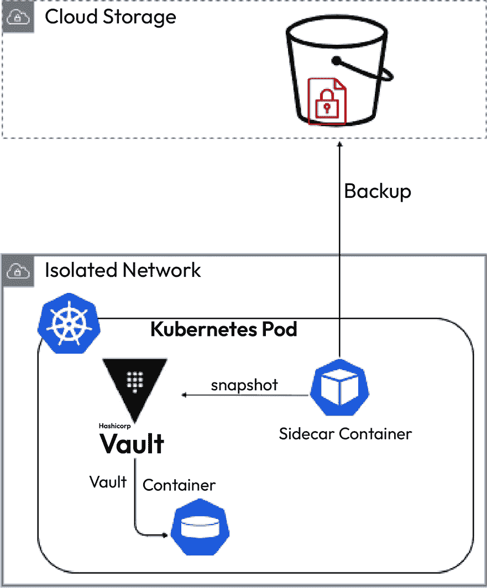
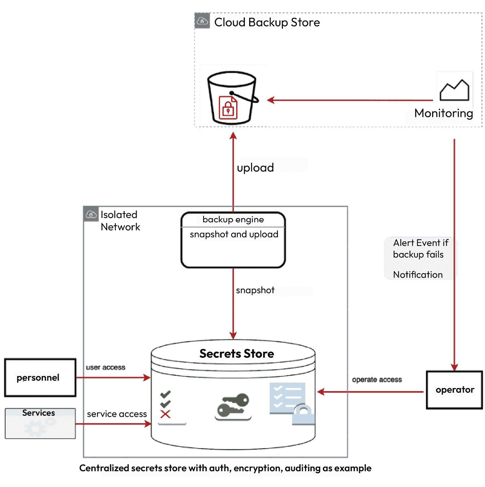

# 第六章：灾难恢复和备份

本章将深入探讨 Kubernetes Secrets 的灾难恢复和备份。考虑到 Secrets 的敏感性质以及数据完整性和可用性的需求，强大的备份和恢复策略的重要性不容忽视。本章结束时，你将理解灾难恢复和备份在 Secrets 管理中的关键作用，涵盖服务可用性、潜在的安全影响以及严格的合规要求。此外，你还将能够制定符合组织基础设施和战略的灾难恢复计划，提升应对潜在灾难和挑战的能力。

本章将涵盖以下主题：

+   为什么灾难恢复和备份很重要

+   备份策略

+   备份中的安全性

+   设计灾难恢复计划

本章结束时，你将深入理解最佳实践、策略和工具，能够有效地保护 Kubernetes Secrets 免受灾难影响。这些见解将帮助你确保 Secrets 的安全性、可用性和弹性，为构建一个更安全高效的 Kubernetes 环境奠定基础。

# 技术要求

本章将深入探讨 Kubernetes Secrets 的备份和恢复策略，这是构建弹性应用程序的重要组成部分。为了全面理解和执行所讨论的概念，我们将使用一套行业标准工具。这些工具代表了现实场景中常用的技术栈，了解如何利用它们进行 Secrets 管理将增强你设计一个强大、安全的 Secrets 系统的能力。

以下是我们需要的工具：

+   **minikube** ([`minikube.sigs.k8s.io/docs/):`](https://minikube.sigs.k8s.io/docs/):) 这个工具允许我们在个人计算机上运行单节点 Kubernetes 集群，非常适合学习和开发用途

+   **HashiCorp Vault** ([`www.vaultproject.io/):`](https://www.vaultproject.io/):) 我们将使用 Vault，这是一个安全的外部 Secrets 管理系统，演示如何备份和恢复 Secrets

+   **Helm** ([`helm.sh/):`](https://helm.sh/):) Helm 是 Kubernetes 的包管理工具，我们将用它来部署应用程序和服务

# Secrets 灾难恢复和备份简介

Kubernetes 生态系统提供了多种管理敏感数据和凭证信息的可能性，这些通常被称为 *Secrets*。在这个动态复杂的环境中，灾难恢复和备份的概念变得极为重要。在谈到备份时，根据 Secrets 管理架构的不同，可能涉及多种含义。

在 Kubernetes 中管理 Secrets 的一种方法是使用 Kubernetes 内置的 *键值存储*。所有集群数据，包括 Secrets，都存储在 etcd 中。如果发生灾难，etcd 的备份可以帮助恢复整个集群的状态，包括 Secrets。然而，在这种情况下，恢复过程可能会复杂，并且可能存在一些限制，尤其是在考虑到 Secrets 的敏感性质时。

另一种方法是使用集中式的 Secrets 管理系统，如 *Hashicorp Vault*，它可以与 Kubernetes 进行接口。在这种系统中，Secrets 不会存储在 etcd 中，而是存储在由相应工具保护和管理的中央存储中。在这种情况下，备份策略将涉及备份中央存储而不是 etcd。此方法提供了对 Secrets 更精细的控制，通常包括用于灾难恢复的复杂功能。

无论选择哪种 Secrets 管理方法，备份的本质都是相同的——在灾难发生时恢复 Kubernetes 系统到正常工作状态的方法。备份应该是全面的、定期更新的，并且安全存储，以确保在需要时能发挥作用。

## Secrets 管理中灾难恢复和备份的重要性

Secrets 在任何环境中通常被视为 tier-0 服务。这意味着它们的重要性至关重要，因为像 API 密钥、密码、令牌、证书等 Secrets 在 Kubernetes 集群内的服务交互和安全通信中起着关键作用。如果它们丢失或泄露，影响可能是显著的并且广泛的。

### 服务可用性

首先，运行在 Kubernetes 平台上的用户应用程序高度依赖这些 Secrets 来进行操作。它们需要 Secrets 来连接数据库、对内部或外部服务进行身份验证、与第三方 API 接口等。如果 Secrets 管理系统发生故障或 Secrets 丢失，这些应用程序可能无法正常工作。这可能导致操作完全停滞，直到 Secrets 恢复，从而造成严重的业务中断。如果没有专门为 Secrets 定制的灾难恢复计划，恢复过程可能会比可接受的时间更长，导致延长的停机时间。在某些情况下，这种延迟可能会导致显著的业务和财务影响。

注意事项

Kubernetes 的外部秘密存储可能仍然会创建 Kubernetes 本地的秘密资源，并且可以被应用程序使用。在这种情况下，秘密存储故障不应直接影响服务的短期可用性。

### 娱乐挑战

如果没有合适的备份，秘密可能会在灾难性事件中永久丧失，比如系统崩溃或灾难。重新创建秘密往往是一个具有挑战性的过程。在许多情况下，这些秘密不能简单地重新生成，而必须通过额外的复杂程序。例如，从第三方供应商获得的秘密通常需要经过某些手续和安全检查才能重新发行。有些秘密可能基于特定硬件或定时信息，无法轻易重建。这突出了拥有可靠备份的必要性，以便在丢失时能够快速恢复秘密。

### 安全影响

此外，从安全角度来看，一个强大的备份和灾难恢复策略至关重要。在发生安全漏洞，秘密被泄露的情况下，能够通过信任的备份恢复并动态更新秘密，或者基于短**有效期**（**TTL**）将其旋转至安全状态，是至关重要的。这可以最大限度地减少暴露窗口和由泄露秘密的滥用可能造成的损害。

### 监管要求

最后，在许多行业中，恢复关键系统的能力（包括秘密管理）不仅是良好的实践，还是监管要求。未能遵守规定可能导致巨额罚款，更不用说由严重故障或数据丢失引起的声誉损害。

## 实际案例研究 – 备份秘密的重要性

不充分的秘密备份策略可能会导致安全风险和漏洞。没有妥善管理秘密可能会引发可用性和安全性方面的问题。为了理解备份的重要性，让我们深入探讨一些实际的案例研究。

### 案例研究 1 – 由于缺乏适当的备份导致的服务中断

想象一家依赖 Kubernetes 来管理应用部署的快速增长的电子商务公司。它遭遇了一个严重的系统故障，导致其 Kubernetes 集群崩溃。尽管它设法从备份中恢复了大部分服务，但它意识到存储在 Kubernetes 中的秘密（如支付网关的 API 密钥和数据库凭证）并未单独备份。

结果，电子商务平台下线，导致成千上万的交易被中断。公司需要几天时间才能重新生成秘密、重新配置它们并让平台重新上线。在此期间，由于销售损失和客户信任下降，它遭受了重大财务损失。

### 案例研究 2 – 由于备份安全不足导致的安全漏洞

在另一个场景中，考虑一家全球技术 SaaS 公司，它使用了一个与其 Kubernetes 集群集成的集中式秘密管理系统。虽然公司有一个强大的备份策略，但备份本身并未得到加密或适当的保护。

在 2022 年，一群网络犯罪分子设法突破了其备份存储并获取了未加密的机密信息。这些黑客利用这些机密信息进行未经授权的操作，从数据盗窃到向公司服务注入恶意代码。此次事件导致了大规模的安全漏洞，严重损害了公司的声誉，并造成了显著的财务损失。

尽管公司已经制定了备份策略，但由于缺乏访问控制以及备份本身没有加密和安全措施，导致了严重的事件。这突显了在管理机密信息的同时，对备份过程进行适当安全防护的必要性。

在 Kubernetes 环境中，备份和灾难恢复策略是机密管理的关键组成部分。通过从备份中快速恢复丢失或无法访问的机密信息，应用程序可以在系统故障或灾难发生时，最小化干扰，迅速恢复正常运行。此外，安全性得到了增强：在发生安全漏洞的情况下，系统可以通过可信的备份恢复到安全状态，从而最小化潜在的损害。一个健全的备份和灾难恢复策略能够降低风险，确保机密信息的可用性、完整性和保密性，对维持整体系统的运营至关重要。

我们将继续下一部分，深入了解 Kubernetes Secrets 的备份策略。

# Kubernetes Secrets 的备份策略

在 Kubernetes 中，机密管理涉及处理高度敏感的数据，如 API 令牌、证书、密钥等。尽管这些数据的体量相对较小——例如，一个大型运输公司可能管理不到一 GB 的机密数据——但这些数据的敏感性和价值却非常巨大。

鉴于机密信息的至关重要性，拥有健全的备份策略至关重要，以最小化在备份过程中数据丢失的可能性。然而，值得注意的是，完全避免数据丢失可能具有挑战性，因此减轻策略应尽量将数据丢失降到最低。

需要做出一个重要的区分，即备份不应与审计日志混淆。备份策略专注于保持数据本身的价值，而审计日志则用于追踪谁访问了哪些数据，并提供一份事件的时间顺序记录，以确保问责制和可追溯性。在本节中，我们将探讨各种备份策略，并重点介绍它们的优势及潜在挑战。

## 地理复制/跨区域复制

**地理复制**确保数据在不同地理位置之间可用。主要有两种模式需要考虑：

+   **主动-主动复制**：在这种模式下，数据同时写入多个区域。它提供了高可用性，适用于拥有全球用户群的应用程序。它确保在灾难发生时能够快速恢复数据，并将数据丢失降到最低。

+   **主动灾难恢复（DR）复制**：在这种方式下，一个区域是主要活动区域，另一个是备用灾难恢复区域。如果活动区域发生故障，灾难恢复区域会被激活。与主动-主动复制相比，这种策略更具成本效益，但根据同步频率，可能会导致稍微更高的数据丢失。

在机密管理系统中，地理复制有几个优势，例如地理冗余，它可以防止特定区域的灾难，并提高可访问性，允许用户从最近的区域访问数据，从而改善延迟。然而，尽管有这些好处，地理复制也带来了挑战。跨多个区域管理数据可能会增加复杂性，特别是在主动-主动模式下，数据复制的成本可能相当高。

## 时间点快照到不可变存储

该策略包括在特定时间间隔拍摄机密快照，并将其存储在不可变存储系统中。这种方法在备份类型上提供了灵活性：

+   **完全备份**：每次备份时都会捕获整个数据集。尽管这是最全面的方法，但如果频繁进行，会消耗大量资源并增加成本，因为每次备份时都会备份所有数据。

+   **增量备份**：与完全备份不同，增量备份方法仅备份自上次备份以来发生变化的数据。这意味着，如果用户从增量备份恢复数据，用户需要最新的完全备份和所有后续的增量备份。它比完全备份在定期备份时更节省存储空间，但恢复过程可能更复杂。

+   **差异备份**：这种方法备份自上次完全备份以来所有的更改，无论在此期间是否进行了增量备份。它在前两种方法之间达到了平衡。恢复比增量备份更简单，因为用户只需要最新的完全备份和最新的差异备份。然而，随着时间的推移，存储的数据量可能会比增量备份更大。

数据管理中的时间点快照具有显著的优势，例如数据完整性，其中不可变存储确保一旦数据写入后，无法更改，从而防止恶意攻击或意外删除。此外，它们允许从任何先前的时间点恢复数据。然而，采用时间点方法也带来了挑战。该方法的粒度意味着恢复点仅限于最新的快照，这可能导致部分数据丢失。此外，随着时间推移，维护多个快照会显著增加存储成本。

## 在传输过程中写入多个位置

在秘密数据到达最终存储目的地之前，它会首先被加密并写入事件流（例如 Kafka 或 Pub/Sub 系统）。然后，这些数据会被批量持久化到不可变存储中。采用实时事件流的方式来管理秘密数据具有明显的优势，例如冗余，其中数据的多个副本确保了高可用性，以及事件驱动的备份，这确保所有对秘密的更改都能即时备份。然而，这种方法也带来了一些挑战。管理实时事件流和批处理过程可能比较复杂，并且存在数据重复的潜在风险，这可能导致由于数据存储在多个位置而增加存储成本。

# 秘密版本控制和备份考虑事项

**秘密版本控制**是在数据管理中面临的独特挑战，尤其考虑到秘密数据的敏感性以及它们可能频繁变化的特性。以下是关于在备份过程中对秘密进行版本控制的一些考虑因素和策略：

+   **版本控制的价值**：

    +   **审计与合规**：保留多个版本的秘密可以帮助更好的审计和合规性。它提供了不可变的变更历史，这在追踪未经授权的修改或理解变更时具有重要价值。

    +   **回滚**：如果发生配置错误或新的秘密值出现问题，保留以前的版本可以快速进行回滚。

+   **备份所有版本**：通过实施包括所有版本的全面备份策略，用户可以确保完整的历史记录。这种方法在那些需要保持详细审计记录以符合合规要求的环境中特别有价值。这种方法的主要缺点是增加了存储开销。然而，考虑到秘密数据通常比较小，这额外的存储需求对于大多数情况下来说可能是微不足道的。

+   **仅备份最新版本**：采用高效的存储策略可以减少存储需求并简化备份过程，但它也带来了可能丢失历史记录的风险。如果只备份最新版本的数据，那么所有先前的版本及其变更历史将在数据丢失事件中丢失。如果历史数据不被认为是至关重要的，这种妥协可能在某些环境中是可以接受的。

+   **混合方法**：选择性版本控制允许用户根据秘密的优先级定制备份策略，选择保留某些秘密的多个版本，同时只保留其他秘密的最新版本。此外，实施保留策略可以进一步细化这一过程，在特定时间段后或达到某个版本数量时，将较旧版本归档或删除。

+   **元数据和注释**：这些用于跟踪与 Secrets 相关的信息，具有跟踪、审计和使用分析等功能。在备份过程中，无论用户是归档最新版本还是仅归档特定版本，备份相关的元数据和注释都是有益的。这些备份在恢复过程中提供了必要的上下文和额外数据。元数据和注释能够提供有价值的上下文和见解，供跟踪、审计和分析使用，因此应包括在备份中，以确保有效的恢复。

总之，高效地管理秘密版本需要平衡审计合规性和存储问题。从全面备份所有版本以详细记录到针对特定需求的选择性或高效方法，策略各异，但始终需要考虑将元数据纳入备份，以确保有效的恢复。

## 选择备份策略

为 Kubernetes Secrets 设计一个强健的备份策略至关重要。一项有效的策略能够在灾难发生时保护 Secrets，帮助防止服务中断和潜在的安全漏洞。策略的选择主要取决于 Secrets 的存储位置。本节将概述在决定备份策略时需要考虑的因素，分为共享考虑因素和存储特定因素：

+   **备份粒度**：在某些情况下，能够单独恢复特定的 Secrets 而不影响其他 Secrets 是至关重要的。

+   **加密**：确保备份数据加密至关重要，这可以防止未授权访问和潜在的数据泄露。

+   **访问控制**：实施严格的访问控制。将备份的访问权限限制为仅对那些绝对需要访问的人员，如特定的管理员组。

+   **合规性要求**：某些法规，如**通用数据保护条例**（**GDPR**）或**健康保险流通与问责法案**（**HIPAA**），可能会规定具体的备份程序。在设计备份策略时，了解并遵守这些法规非常重要。

+   **存储开销**：完整备份使用更多存储空间，但它是全面的。增量/差异备份通过只捕获变化来节省存储，但恢复过程会稍微复杂一些。

+   **数据保留**：定期修剪超过法规或业务需求的旧备份，以管理存储，或者使用数据压缩和去重技术来减少备份的大小。

+   **长期存储成本**：定期备份（例如，每 10 分钟一次）并长期保存（例如，13 个月）会累积大量存储。根据机密的关键性和变更频率进行调整。值得定期分析存储费用，并在成本超出收益时调整备份策略。对于有多个版本的机密，定期删除较旧且不必要的版本。根据备份的年龄和重要性使用不同的存储层级。将较旧的备份转移到成本效益较高的存储中。选择提供可预测成本的存储解决方案，以有效管理预算。

我们备份机密的方式受到我们管理机密方式的深刻影响。无论是将机密存储在 etcd 中还是在外部机密存储中，解决方案都会有显著不同。

### 存储在 etcd 中的机密

默认情况下，Kubernetes 中的机密存储在 etcd 中，但备份方法将更加面向 Kubernetes：

+   **Kubernetes 集群备份**：当机密存储在 etcd 中时，备份整个 Kubernetes 集群将涵盖所有机密。像 *Velero* 这样的工具可以备份和恢复整个集群，包括机密。

+   **etcd 快照**：定期的 etcd 快照是另一种选择，尽管这需要更多的技术专长和谨慎，因为它可能对整个 Kubernetes 集群产生影响。

对于存储在 etcd 中的机密，有两种备份方法：完整集群备份和 etcd 快照，每种方法都有独特的技术特性和影响。

### 存储在外部机密存储中的机密

许多外部机密管理解决方案，如 HashiCorp Vault 或 AWS Secrets Manager，都具有自己的备份功能。了解这些功能并将其集成到策略中非常重要。如果机密存储是云服务，使用相同提供商的备份服务可能会提供更好的集成和支持。

# 备份的安全指导

一旦我们决定了备份策略，必须遵循一些准则，以确保备份的安全：

+   **隔离环境与访问控制**：为了防止未经授权的访问，限制对备份环境的访问。可以通过以下方式实现访问限制：

    +   **IP 白名单**：仅允许特定的 IP 地址访问备份存储，尤其是当它是外部存储时。

    +   **用户访问控制**：区分普通用户和管理员。使用角色和权限授予不同的访问权限。

    +   **通过 VPN 访问**：应该允许处于同一网络中的人员访问包含备份的资源。

    +   **零信任模型**：实施零信任安全模型，默认情况下不信任任何用户或设备，无论是内部还是外部网络。

+   **静态加密与可旋转的加密密钥**：存储时对备份进行加密。始终使用现代加密标准。定期旋转加密密钥，并确保用户拥有安全的密钥管理流程。

+   **传输中的安全性**：在备份传输过程中确保其安全。采用如 HTTPS 或 TLS 等协议对数据进行加密传输。使用 VPN 或专用线路确保连接的安全。

+   **审计和警报**：实施访问模式监控，并为异常活动设置警报。记录所有访问和修改尝试。为可疑行为设置即时警报。

+   **数据泄露的即时响应**：如果备份遭到泄露，执行以下操作：

    +   评估影响

    +   轮换并更改所有密钥和凭证以防止解密

+   **使用不可变存储保障**：确保备份数据保持不变，使其不可修改。使用如 AWS S3 的 Object Lock 或 WORM 存储等功能。考虑保护时长与存储成本之间的平衡。

现在我们已经了解了有关 Secrets 备份的安全指南，接下来将探讨我们可以使用的工具，以备份存储在 Kubernetes 集群中的 Secrets。

# 用于备份 Kubernetes Secrets 的工具和解决方案

存在多种工具和解决方案，可以帮助用户备份 Kubernetes 环境中的 Secrets。适合用户的工具取决于具体的设置、需求和偏好。我们将探讨可用的工具以及如何将它们与我们的基础设施决策相结合。

## Velero

**Velero**是一个流行的开源工具，用于管理灾难恢复和迁移 Kubernetes 集群资源与持久化卷。Velero 允许用户备份和恢复 Kubernetes 对象及持久化卷。

Velero 备份的示例配置如下：

```
apiVersion: velero.io/v1
kind: BackupStorageLocation
metadata:
  name: aws
  namespace: velero
spec:
  provider: aws
  objectStorage:
    bucket: myBucket
  config:
    region: us-west-2
```

有关更多详细信息，请参阅 Velero 文档（[`velero.io/docs/v1.11/`](https://velero.io/docs/v1.11/)）。

## etcdctl

**etcdctl**是一个命令行工具，用于与 etcd 配合使用，etcd 是一个分布式键值存储，提供可靠的方式在一组机器之间存储数据。Kubernetes 使用 etcd 来存储所有数据，包括 Secrets。

一个用于备份的 etcdctl 命令示例如下：

```
ETCDCTL_API=3 etcdctl snapshot save snapshot.db
```

查阅 etcdctl 文档（[`github.com/etcd-io/etcd/tree/main/etcdctl#snapshot-subcommand`](https://github.com/etcd-io/etcd/tree/main/etcdctl#snapshot-subcommand)）以了解更多信息。

## HashiCorp Vault

**HashiCorp Vault**是一个提供控制访问敏感数据和 Secrets 的产品，适用于分布式应用程序。它包括一个功能，用于快照其内部状态以进行备份。

对于 Vault 的开源版本，用户可以利用 Vault 操作员 Raft 快照功能。以下是创建 Vault 数据快照的示例命令：

```
vault operator raft snapshot save snapshot.hcl
```

然而，这需要额外的步骤，比如在 Vault 部署过程中将其集成到 sidecar 部署中。此外，必须手动实现一个周期性上传数据到指定存储位置的机制。

对于 Vault Enterprise，过程简化了，因为它包含了一个内置的备份功能。用户可以配置备份目标为 AWS S3、GCS 等。例如，在提供 AWS 凭证并设置间隔之后 ([`developer.hashicorp.com/vault/api-docs/system/storage/raftautosnapshots#interval`](https://developer.hashicorp.com/vault/api-docs/system/storage/raftautosnapshots#interval))，Vault Enterprise 会自动处理数据上传过程。有关更多详情，请参阅配置 [`developer.hashicorp.com/vault/api-docs/system/storage/raftautosnapshots#storage_type-aws-s3`](https://developer.hashicorp.com/vault/api-docs/system/storage/raftautosnapshots#storage_type-aws-s3)。

尽管如此，备份数据指标的监控依然至关重要。如果备份失败，应设置警报以触发提醒。有关更多信息，请参见 HashiCorp Vault 文档 ([`developer.hashicorp.com/vault/docs/commands/operator/raft#snapshot`](https://developer.hashicorp.com/vault/docs/commands/operator/raft#snapshot))。

以下是一个示例图，显示了备份侧车容器，它会拍摄快照并将其上传到 S3：



图 6.1 – Hashicorp Vault 备份侧车

因此，本节描述了 HashiCorp Vault 的备份功能；开源版本使用手动快照和数据上传，而 Vault Enterprise 通过 AWS S3 集成功能等来自动化这些过程。

## AWS Secrets Manager

**AWS Secrets Manager** 是一个密钥管理服务，帮助用户保护对应用程序、服务和 IT 资源的访问。在 2021 年 3 月 3 日，AWS 推出了 AWS Secrets Manager 的一项新功能，使用户能够在多个 AWS 区域之间复制密钥，这可以自动复制密钥，并从恢复区域访问它，以支持灾难恢复计划。有关更多信息，请参见如何在多个 AWS 区域之间复制密钥，访问 [`aws.amazon.com/blogs/security/how-to-replicate-secrets-aws-secrets-manager-multiple-regions/`](https://aws.amazon.com/blogs/security/how-to-replicate-secrets-aws-secrets-manager-multiple-regions/)。

## Azure Key Vault

`Backup-AzKeyVaultSecret` cmdlet 通过下载指定密钥并将其存储在文件中来备份 Azure Key Vault 中的密钥。如果该密钥有多个版本，则所有版本都包含在备份中。

HashiCorp Vault、AWS Secrets Manager 和 Azure Key Vault 都是密钥存储的形式。总体而言，它们具有相同的特性，可以通过下图呈现：



图 6.2 – 备份密钥存储

每个工具和解决方案都有其独特的优点，适用于不同的密钥存储。请选择最适合您需求的工具，并在配置这些工具时始终考虑安全性和合规性要求。

接下来，我们将讨论 Kubernetes Secrets 的灾难恢复程序。

# Kubernetes Secrets 的灾难恢复

Kubernetes Secrets 管理中的一个主要考虑因素是 *灾难恢复*。这包括为可能会极大影响 Kubernetes 环境，特别是其中存储的 Secrets，做准备并恢复。在本章中，我们讨论 **灾难恢复计划**（**DRPs**）、Secrets 恢复程序、相关工具和解决方案，并研究一个真实的灾难恢复场景。

## Kubernetes 环境中的灾难恢复计划（DRP）

灾难恢复计划（DRP）是一个预定义和文档化的指令集，旨在指导组织从潜在灾难事件中恢复。在管理的背景下，精心设计的 DRP 对于减轻 Secrets 丢失或泄露的影响至关重要。

一个完善的 Kubernetes 环境灾难恢复计划（DRP）应包含以下元素：

+   **明确的角色和职责**：这涉及到指定恢复团队，并明确每个成员的角色和任务。

+   **定义的通信策略**：必须拥有一套健全的通信计划，涵盖内部（恢复团队）和外部（利益相关者）的通信。

+   **准备的事件响应**：这包括一套协议，用于迅速有效地响应，以最小化停机时间并限制损害的程度。

+   **恢复程序**：这些是针对特定场景的步骤，旨在从各种来源（例如，etcd、外部秘密存储）恢复 Secrets。请记住，这些程序需要经常测试，以确认它们在实际灾难中的有效性。

此外，由于这些 Secrets 的敏感性，它们的恢复应仅限于授权人员，并且在恢复过程中的操作应可审计，以保持安全性和合规性标准。

## 定期测试和更新

在 Kubernetes 环境中管理 Secrets，无论是存储在 etcd 内部还是外部，都是一项敏感且至关重要的操作。确保备份和灾难恢复系统的功能、安全性和更新性至关重要。定期测试和更新这些系统有助于实现以下目标：

+   **确保系统的稳健性**：通过模拟真实世界故障场景的游戏日（gamedays），经常测试备份和灾难恢复计划（DRP）系统。这种方法有助于识别 Secrets 恢复过程中潜在的缺陷或低效之处。测试应涵盖一系列场景，例如存储在 etcd 中的 Secrets 整个集群故障、外部存储位置的灾难性事件，或者备份系统本身的故障。游戏日提供了一种实际操作的方法，用于评估和改善系统的弹性和响应策略。

+   **保持最新的备份**：Secrets 经常发生变化，因此备份系统应设计为在 Secrets 发生变化时自动更新。定期测试有助于确保最新版本的 Secrets 始终被备份并能够正确恢复。

+   **安全保障**：鉴于 Secrets 的敏感性质，安全性至关重要。应定期对 Secrets 存储和备份系统进行渗透测试和审计，以发现潜在的漏洞。同时，应设置警报，通知相关人员安全问题或系统故障。

+   **DRP 相关性**：Kubernetes 环境是动态的，变化可能影响现有 DRP 的有效性。定期审查和更新 DRP 是确保其与不断发展的环境保持相关性的必要措施。尽可能地，自动化更新备份的过程，以便在 Secrets 发生变化时及时更新。

+   **跨团队参与**：定期让相关团队（如 DevOps、安全、IT 等）参与测试和更新过程，以确保全面审查系统。

## Kubernetes 中的灾难恢复工具和解决方案

存在许多工具可以帮助 Kubernetes 中的灾难恢复。值得注意的包括 Velero、Kubestr 和 Kasten K10：

+   **Velero**：支持备份和恢复操作，并能够处理 etcd 数据，适用于备份 Kubernetes Secrets。

+   **Kubestr**：可以验证备份和恢复策略的有效性。

+   **Kasten K10**：提供一个全面的平台来管理 Kubernetes 应用数据，包括备份和恢复。

接下来，我们将通过检查灾难恢复场景来了解所有部分如何整合在一起。

## 有效的 Secrets 恢复场景：危机中的恢复

让我们来看一个简化的示例，描述一个成功管理灾难恢复场景的组织，*OrgX*，特别是处理 Kubernetes Secrets 的情况：

+   **DRP**：OrgX 已经制定了 DRP，并定期进行模拟或“演练日”，以验证其有效性。这一做法为团队应对实际灾难场景做好了准备。

+   **团队协作**：在灾难发生期间，一个跨职能团队激活了 DRP。不同部门的集体努力是有效执行恢复计划的关键。

+   **保护 Secrets**：作为恢复的一部分，团队从 AWS S3 存储桶中检索了加密的 Secrets 备份。由授权人员使用安全流程进行解密和恢复。Secrets 被恢复到密钥存储中，确保在整个过程中 Secrets 的完整性得到保持。

+   **服务连续性**：迅速采取行动并遵循 DRP，使 OrgX 能够迅速恢复其 Kubernetes Secrets。这一迅速响应最大限度地减少了服务中断，确保应用程序使用的是最新的密钥值。

*OrgX* 案例突出了在灾难恢复过程中，DRP、团队协作、安全措施和定期测试在恢复 Kubernetes Secrets 中的重要性。

# 总结

在本章中，我们深入探讨了 Kubernetes Secrets 的灾难恢复和备份。你了解了各种备份策略，如地理复制、时间点快照以及在传输过程中写入多个位置，并了解它们如何应用于不同的场景。我们讨论了在创建强健备份策略时，访问控制、加密和数据保留的重要性。我们强调了备份 Kubernetes Secrets 的关键安全措施，以及如何迅速有效地应对数据泄露事件。

通过我们的实践示例和详细讨论，你现在已经掌握了在 Kubernetes 环境中规划和执行全面灾难恢复计划（DRP）的知识。你还理解了定期测试和更新 DRP 以及备份系统的重要性。

随着我们进入下一章，我们将讨论在 Kubernetes 环境中管理 Secrets 时所面临的挑战和安全风险。这将帮助你了解潜在的陷阱，并为你提供克服这些挑战的策略，进一步增强应用程序的安全性和可靠性。
