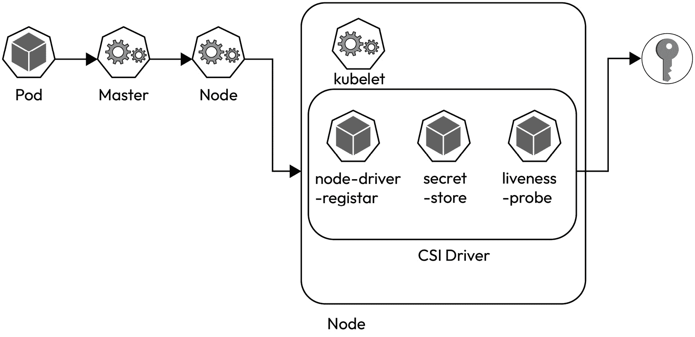
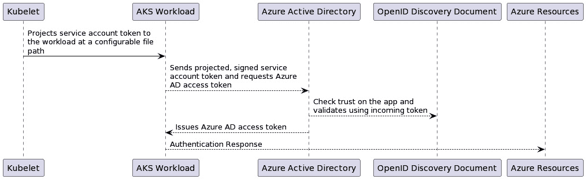

# 第九章：探索 Azure 上的云秘密存储

之前，我们深入探讨了 AWS 上的 Secrets Manager。本章中，我们将关注另一个受欢迎的云服务提供商——微软 Azure。我们将学习 Azure 提供的解决方案 Azure Key Vault，该方案用于存储 Secrets 并执行加密和解密操作。我们将利用 Azure Key Vault 来存储 Secrets，并在我们的 Kubernetes 工作负载中使用它们，还将使用 Key Vault 来加密存储在 etcd 上的 Secrets。

在本章中，我们将涵盖以下主题：

+   Azure Key Vault 概览

+   工作负载身份简介

+   AKS 集群与 Azure Key Vault 集成

+   审计和日志记录

+   Azure Key Vault 用于秘密加密

到本章结束时，我们应该能够在 Azure Key Vault 中存储我们的 Secrets，在 Kubernetes 部署中检索它们，通过审计监控秘密访问，并使用 Azure Key Vault 加密 Kubernetes Secrets。

# 技术要求

为了将概念与实践示例结合，我们使用了一系列常用的工具和平台，这些工具和平台通常用于与 Azure API 和 Kubernetes 交互：

+   **Azure (az) CLI** ([`learn.microsoft.com/en-us/cli/azure/`](https://learn.microsoft.com/en-us/cli/azure/)) 是一套多平台的命令行工具，用于创建和管理 Azure 资源

+   **Terraform** ([`www.terraform.io/`](https://www.terraform.io/)) 是一个基础设施即代码的软件解决方案，可用于在云中预配和管理基础设施

+   **kubectl** ([`kubernetes.io/docs/reference/kubectl/`](https://kubernetes.io/docs/reference/kubectl/)) 是用于通过 Kubernetes API 与 Kubernetes 集群通信的命令行工具

# Azure Key Vault 概览

Azure Key Vault 是一项多功能服务。它可以作为秘密存储。在 Azure Key Vault 上，我们可以存储加密密钥。同时，Azure Key Vault 还可以用于执行加密和解密操作。

由于它是一个托管的 Azure 服务，因此它享有 Azure 默认提供的服务特性。

关注的特性如下：

+   Azure RBAC 和访问策略

+   高可用性

+   日志记录、审计和监控

+   与其他 Azure 组件的集成

我们将花一些时间来审视这些对我们秘密安全至关重要的特性。

## Azure RBAC 和访问策略

Azure 上的每个服务都通过 Azure 提供的身份访问管理层来保护免受未经授权的使用。该层通过 Azure 的 RBAC 和访问策略形式提供。安全主体是一个在 Azure 上具有身份的实体，可以是用户账户、组账户或计算机账户。为安全主体分配权限的传统方法是通过 *访问策略*。推荐的权限分配方式是通过 **Azure 基于角色的访问控制**（**Azure RBAC**）。随着本章的进行，Azure RBAC 将是我们保护 Azure Key Vault 的选择。通过使用 Azure RBAC，我们将通过创建角色分配来控制对资源的访问。

## 高可用性

当我们创建一个 Key Vault 时，必须指定 Key Vault 所在的区域。Key Vault 的内容将在该区域内进行复制。同时，Key Vault 的内容还将复制到辅助区域。Azure Key Vault 的内容在区域内具有高可用性，同时也支持开箱即用的灾难恢复。

假设某个区域不可用的场景。一旦该区域不可用，指向 Azure Key Vault 的请求将会被自动路由到辅助区域。这一过程是自动发生的，无需额外配置任何 Azure Key Vault 资源或将 Key Vault 配置为在另一区域的备用。

## 日志记录、审计和监控

在 Azure 中，我们可以选择审计 Key Vault 的使用情况。通过启用审计，我们可以识别谁访问了托管在 Azure Key Vault 上的数据。我们可以通过 **诊断设置** 收集日志来实现这一点。Azure 上的资源会生成日志，这些日志包含有关资源及其相关操作的信息。根据资源的不同，日志的内容可能会有所不同。

**诊断设置** 让我们能够将这些日志流式传输到不同的位置。默认情况下，日志将流式传输到 Azure 存储账户。其他选项包括将日志流式传输到 Log Analytics 工作区或 Azure 事件中心。

## 与其他 Azure 组件的集成

Azure Key Vault 的一个重要优点是可以与其他 Azure 组件集成。Azure Key Vault 可以与 Azure 应用网关集成进行流量加密，或者与 Azure 的 SQL Server 服务集成，对数据进行加密。一个值得关注的组件是 Azure Kubernetes 服务。

这可以通过 Kubernetes Secrets Store CSI 驱动程序与 Azure Key Vault 配合启用。我们在上一章中已经了解了 CSI Secret Store 的工作原理。

以下图示展示了集成是如何工作的：



图 9.1 – Azure Key Vault 集成

在本章中，我们将利用 Azure CSI Key Vault 插件并将其与 Azure 安全集成。该集成将涉及 Azure 上的 Kubernetes 集群，使用 **Azure Kubernetes Service**（**AKS**）。要将这两个组件——Azure Key Vault 和 Kubernetes 集群——集成起来，必须确保集群对 Azure Key Vault 具有细粒度的权限。为此，Azure 为我们提供了工作负载身份的概念。

# 工作负载身份简介

在 Azure 上的 AKS 上使用工作负载身份可以让我们为 Kubernetes 工作负载分配权限，从而使它们能够与 Azure 资源进行交互。例如，我们有一个用于存储敏感信息的 Azure Key Vault。为了与 Azure Key Vault 进行交互，我们需要某种形式的凭证。工作负载身份是代表需要身份以与 Azure 资源交互的软件工作负载的机器身份。我们可以通过手动将凭证附加到服务上，使用工作负载身份，而无需创建身份或服务主体。这样，每个服务都可以拥有自己的身份并进行自我认证。

在 Kubernetes 中，我们可以为 Pod 分配工作负载身份。通过授予该身份 RBAC 权限，我们将能够与 Azure Key Vault 进行交互。

下面是工作负载身份（Workload Identity）如何工作的示例：



图 9.2 – 工作负载身份背后的机制（来源：[`learn.microsoft.com/en-us/azure/aks/workload-identity-overview?tabs=dotnet`](https://learn.microsoft.com/en-us/azure/aks/workload-identity-overview?tabs=dotnet)）

Azure 官方文档详细概述了工作负载身份如何从 Azure Active Directory 请求令牌，并使用该令牌与 Azure 资源进行交互（[`learn.microsoft.com/en-us/azure/aks/workload-identity-overview`](https://learn.microsoft.com/en-us/azure/aks/workload-identity-overview)）。

由于我们已经理解了工作负载身份（Workload Identity）的概念，现在可以继续了解 Azure 如何使 AKS 与其他 Azure 资源（例如 Azure Key Vault）之间的交互。

# 将 AKS 集群与 Azure Key Vault 集成

要将 Kubernetes 与 Azure Key Vault 集成，我们需要先设置一个集群。创建集群的选项有很多，每种选择适用于不同的场景。我们将创建一个简单的 AKS 集群；主节点将公开可用，但节点将位于虚拟网络的私有子网中。

我们将提供一些用于创建集群的 Terraform 代码。此外，如果 Terraform 不适用，我们也将提供所需的命令。

## 配置 Terraform 项目

在创建 Terraform 项目时，我们将配置状态。状态可以保存在存储账户中：

```
terraform {
...
      backend "azurerm" {
        resource_group_name  = "resource-group"
        storage_account_name = "storage-account"
        container_name       = "tfstate"
        key                  = "aks.tfstate"
    }
}
```

通过设置 Terraform 配置，我们可以继续在 Azure 上配置资源。

至关重要的是，在一个资源组下为本章配置资源：

```
resource "azurerm_resource_group" "ksm_resource_group" {
  name     = "ksm-resource-group"
}
```

通过使用资源组，我们可以将我们的资源从 Azure 账户中的其他资源逻辑上分开，专门用于我们要实现的解决方案。

同样，我们将创建一个存储账户，以持久化来自我们服务的日志：

```
resource "azurerm_storage_account" "ksm_storage_account" {
  name = "ksmlogs"
  resource_group_name = azurerm_resource_group.ksm_resource_group.name
  …
}
```

如*Azure Key Vault 概述*部分所述，通过**诊断设置**，我们可以启用将 Azure 资源的日志流式传输到存储账户的功能。我们所配置的存储账户将用于此目的。

我们现在可以继续创建网络。

## 配置网络

我们将创建一个虚拟网络，并分配一个子集的私有 IP。我们还将创建一个子网，在该子网上我们能够托管 Kubernetes 集群节点：

```
resource "azurerm_virtual_network" "ksm_virtual_network" {
  name                = "ksm-virtual-network"
  ...
  address_space       = ["10.1.0.0/16"]
}
resource "azurerm_subnet" "ksm_subnet" {
  name                 = "ksm-private-subnt"
  ...
  address_prefixes     = ["10.1.0.0/24"]
  enforce_private_link_endpoint_network_policies = true
}
```

启用了`enforce_private_link_endpoint_network_policies`选项。通过此选项，托管在此子网中的应用程序可以通过内部网络访问 Azure 组件。

## 配置 AKS 集群

我们将通过创建主节点并添加默认节点池来创建 AKS 集群：

```
resource "azurerm_kubernetes_cluster" "ksm_aks" {
  name = "ksm-aks"
  ...
  dns_prefix = "private-aks-cluster"
  private_cluster_enabled = false
  oidc_issuer_enabled = true
  workload_identity_enabled = true
  role_based_access_control_enabled = true
...
  default_node_pool {
    name           = "default"
    node_count     = 1
    vm_size        = "Standard_A2_v2"
    vnet_subnet_id = azurerm_subnet.ksm_subnet.id
  }
}
```

需要注意的一点是，我们启用了**OpenID Connect**（**OIDC**）功能和工作负载身份。这使我们能够为我们的 Kubernetes 工作负载分配角色，以便它们能够与 Azure Key Vault 交互。

使用`terraform apply`命令后，集群将被配置：

```
$ terraform init
...
$ terraform apply
```

我们有选择通过`private_cluster_enabled`选项实现完全私有的集群。在代码库中，您可以找到创建堡垒主机以启用此操作的设置（[`github.com/PacktPublishing/Kubernetes-Secrets-Handbook/blob/main/ch09/bastion.tf`](https://github.com/PacktPublishing/Kubernetes-Secrets-Handbook/blob/main/ch09/bastion.tf)）。

或者，如果我们不想通过 Terraform 配置集群，我们可以使用命令行：

```
$ az aks create -n ksm-aks -g ksm-resource-group --enable-addons azure-keyvault-secrets-provider --enable-oidc-issuer --enable-workload-identity
```

我们现在可以成功登录到集群：

```
$ az aks get-credentials --name ksm-aks \
    --resource-group ksm-resource-group \
    --subscription $subscription \
    --admin
```

通过执行上述命令，我们将为 `kubectl` 命令设置配置。该配置保存在用于执行 `kubectl` 命令的工作站的本地 `~/.kube/config` 路径中。现在我们应该能够向集群执行命令。

## 创建 Key Vault

我们将继续创建一个 Key Vault 资源；然后，在该 Key Vault 上，我们将创建一个密钥和一个机密。我们将分配细粒度的权限，使其能够通过 RBAC 权限与 Key Vault 进行交互。

首先，我们创建 Azure Key Vault：

```
resource "azurerm_key_vault" "ksm_key_vault" {
  name                       = "ksm-key-vault"
  ...
  sku_name                   = "standard"
  enable_rbac_authorization = true
  soft_delete_retention_days = 7
}
```

如您所见，我们启用了 RBAC 选项。由于启用了 RBAC，我们将创建一个可以与我们的 Kubernetes 工作负载一起使用的身份：

```
resource "azurerm_user_assigned_identity" "keyvault_reader" {
  name                = "keyvault-reader"
  ...
}
resource "azurerm_role_assignment" "ksm_key_vault_reader" {
  scope = azurerm_key_vault.ksm_key_vault.id
  role_definition_name = "Key Vault Reader"
  principal_id         = azurerm_user_assigned_identity.keyvault_reader.principal_id
}
...
```

我们已创建身份并附加了权限，允许我们使用机密并查看它们。下一步是为联邦身份设置凭据。我们需要使用我们之前配置的集群的 OIDC 发行者 URL：

```
resource "azurerm_federated_identity_credential" "cred" {
 name   = "ksm-reader-identity"
 ...
 Issuer =azurerm_kubernetes_cluster.ksm_aks.oidc_issuer_url
 audience  = ["api://AzureADTokenExchange"]
 parent_id = azurerm_user_assigned_identity.keyvault_reader.id
  subject = "system:serviceaccount:default:service-token-reader"
}
```

或者，我们可以通过命令行创建 Key Vault：

```
$ az keyvault create -n ksm-key-vault -g ksm-resource-group  -l eastus --enable-rbac-authorization
az identity create --name keyvault-reader --resource-group ksm-resource-group
...
az identity federated-credential create \
  --name "ksm-reader-identity" ...
```

通过配置身份凭证，我们现在可以通过 Kubernetes 与 Azure Key Vault 进行交互。联合身份凭证使我们能够访问受 Active Directory 保护的资源。我们使用的联合凭证建立了与 AKS 集群和 Active Directory 身份提供者之间的信任关系。我们允许`service-token-reader`服务账户模拟`ksm-reader-identity`。

### 从 Key Vault 读取 Secrets

我们已经设置好了 AKS 集群，并且我们的`kubectl`命令已准备好执行集群命令。到目前为止，我们没有安装任何插件。这是因为插件在创建 AKS 集群时已启用。

我们可以通过在 CSI 插件上运行以下命令来检查这一点：

```
kubectl get pods -n kube-system -l 'app in (secrets-store-csi-driver,secrets-store-provider-azure)'
NAME                                  READY   STATUS    RESTARTS  AGE
aks-secrets-store-csi-driver-t6n7h    3/3     Running   0         80m
aks-secrets-store-provider-azure-htmqk 1/1     Running   0        80m
```

可以使我们从 Key Vault 获取凭证的 CSI 驱动程序已经启用。与 CSI 驱动程序一起，我们在 Kubernetes 中创建了一个新的对象类型：`SecretProviderClass`。这个自定义资源用于为 CSI 驱动程序提供驱动程序配置和供应商特定的参数。在 Kubernetes 中，**自定义资源**是 Kubernetes API 的扩展。我们指定了一种新的对象类型，通过 Kubernetes API 访问，就像访问所有其他 Kubernetes 资源一样。我们可以通过官方文档了解有关自定义资源的更多信息（[`kubernetes.io/docs/concepts/extend-kubernetes/api-extension/custom-resources/`](https://kubernetes.io/docs/concepts/extend-kubernetes/api-extension/custom-resources/)）。

我们将创建`SecretProviderClass`：

```
apiVersion: secrets-store.csi.x-k8s.io/v1
kind: SecretProviderClass
metadata:
  name: keyvault-secrets
spec:
  provider: azure
  parameters:
    usePodIdentity: "false"
    clientID: #the identity provisioned
    keyvaultName: #keyvault name
    ...
    objects:  |
      array:
        - |
          objectName: secret1
          objectType: secret
        - |
          objectName: key1
          objectType: key
    tenantId: #kubernetes tenant id
```

我们现在可以配置将附加身份的服务账户：

```
apiVersion: v1
kind: ServiceAccount
metadata:
  annotations:
    azure.workload.identity/client-id: #identity with Key Vault access
  labels:
    azure.workload.identity/use: "true"
  name: service-token-reader
  namespace: default
```

本质上，所使用的身份是我们之前配置的身份，目的是与 Azure Key Vault 进行交互。

应用以下配置后，我们可以设置一个 Pod，使用 Key Vault 凭证：

```
kind: Pod
apiVersion: v1
metadata:
  name: nginx
spec:
  serviceAccountName: service-token-reader
  containers:
    - name: nginx
      image: nginx
      volumeMounts:
      - name: keyvault-secrets
        mountPath: "/mnt/secrets-store"
        readOnly: true
  volumes:
    - name: keyvault-secrets
      csi:
        driver: secrets-store.csi.k8s.io
        readOnly: true
        volumeAttributes:
          secretProviderClass: "keyvault-secrets"
```

到目前为止，我们已经实现了主要目标，即通过 Azure Key Vault 使用 Key Vault Secrets。我们确实已访问了 Key Vault Secrets，接下来要检查的是是否可以对 Key Vault 访问进行审计。

# 审计和日志记录

在前面的部分中，我们在 Azure 上创建了 Key Vault。Azure 提供了为我们所创建的资源启用审计的选项。

在我们的案例中，我们添加了一个块，使我们能够将 Key Vault 访问的审计日志存储到一个存储账户中。

让我们执行 Terraform 代码：

```
resource "azurerm_monitor_diagnostic_setting" "ksm_key_vault_logs" {
  name               = "ksm-key-vault-logs"
  target_resource_id = azurerm_key_vault.ksm_key_vault.id
  storage_account_id = azurerm_storage_account.ksm_storage_account.id
  log {
    category = "AuditEvent"
    enabled  = true
    retention_policy {
      enabled = false
    }
  }
...
}
```

我们已经启用了 Azure 通过存储账户捕获所需的审计日志。

重要提示

请注意，我们已经为日志设置了保留策略。撰写本文时，已宣布**诊断设置存储保留**功能将被弃用，因此，日志和指标的保留应通过 Azure 存储生命周期管理进行配置。

如果我们导航到存储桶，应该会在该存储帐户中创建一个容器。容器将命名为 `insights-logs-auditevent`，并且容器中的文件将是 JSON 格式。

让我们查看其中一个文件：

```
{
  "time": "2023-08-30T09:07:19.8593007Z",
  "category": "AuditEvent",
  "operationName": "KeyGet",
  "resultType": "Success",
  "correlationId": "fa11ea42-67c0-47cd-8a6b-f7bcb349414f",
  "identity": {
    "claim": {
      "oid": "80dd018c-ede7-42f4-99a8-00e278868a7c",
      "appid": "b1967275-af7b-4d75-9804-c935ecb22226",
      "xms_mirid": "/subscriptions/.../userAssignedIdentities/keyvault-reader",
      "xms_az_nwperimid": []
    }
  },
  "properties": {
    "id": "https://ksm-key-vault.vault.azure.net/keys/key1",
    "requestUri": "https://ksm-key-vault.vault.azure.net/keys/key1/?api-version=2016-10-01",
    "isRbacAuthorized": true,
    ...
  },
  ...
}
```

我们可以看到类别和操作。此外，身份是我们之前附加到 Kubernetes 的身份。通过审计日志，我们可以识别发生的操作、操作的执行者以及操作发生的资源，在我们的案例中是我们配置的 Key Vault。

# Azure 密钥库用于机密加密

到目前为止，我们已使用 Azure Key Vault 存储敏感机密。我们想要识别的是，是否可以使用 Azure Key Vault 对存储在 etcd 上的机密进行加密。

我们已经创建了一个 Key Vault。我们将使用该 Key Vault 创建一个用于 KMS 目的的*密钥*。

我们将首先创建一个密钥：

```
resource "azurerm_key_vault_key" "ksm_encryption_key" {
  name         = "ksm-encryption-key"
  key_vault_id = azurerm_key_vault.ksm_key_vault.id
  key_type     = "RSA"
  key_size     = 2048
    key_opts = [
    "decrypt",
    "encrypt",
    "sign",
    "unwrapKey",
    "verify",
    "wrapKey",
  ]
 }
```

请注意，我们还可以指定一个轮换策略：

```
rotation_policy {    automatic {      time_before_expiry = "P30D"    }    expire_after         = "P90D"    notify_before_expiry = "P29D"  }
```

当我们创建 Kubernetes 集群时，可以使用此密钥来加密我们创建的机密。

在 AKS 部分，我们将添加此选项：

```
resource "azurerm_kubernetes_cluster" "ksm_aks" {
  name = "ksm-aks"
  ...
  key_management_service {
    key_vault_key_id = azurerm_key_vault_key.ksm_encryption_key.id
    key_vault_network_access = "Public"
  }
  ...
}
```

我们已经成功地使用 Azure Key Vault 作为 KMS 在 etcd 上加密了我们的机密。我们还可以通过审计日志检查这一点：

```
{
  "time": "2023-09-03T11:46:27.5820050Z",
  "category": "AuditEvent",
  "operationName": "KeyDecrypt",
  "resultType": "Success",
  "identity": {
    "claim": {
      "xms_az_rid": "/subscriptions/.../managedClusters/ksm-aks",
      "xms_az_nwperimid": []
    }
  },
  "properties": {
    "id": "https://ksm-key-vault.vault.azure.net/keys/ksm-encryption-key/0c24b95c67534a3eb85c71854dc8a7bd",
    "algorithm": "RSA-OAEP-256",
    "clientInfo": "... k8s-kms-keyvault/v0.5.0 (linux/amd64) 84fa3b7/2023-05-17-21:13",
    "httpStatusCode": 200,
    ..
    "tlsVersion": "TLS1_2"
  },
}
```

如我们所见，Azure Key Vault 正在积极用于解密托管在 AKS 上的机密。`KeyDecrypt` 操作表示解密操作。加密机密的相应操作也会在 AKS 上执行。这增强了我们机密管理的安全性。

# 总结

在本章中，我们成功创建了一个能够从 Azure 密钥库读取机密的 AKS 集群。我们确定了实现机密加密和解密所需的 RBAC 权限。我们还通过将机密加密存储在 etcd 上，使用 Azure 密钥库作为 Kubernetes 的 KMS，从而增强了安全性。最后，我们可以通过审计日志识别 Azure 密钥库的使用情况。

在下一章中，我们将重点介绍另一家流行的云服务提供商——Google Cloud Platform（GCP）。我们将探索 GCP 上的机密存储选项及其与 GCP 的 Kubernetes 提供的集成，以及机密加密选项。
