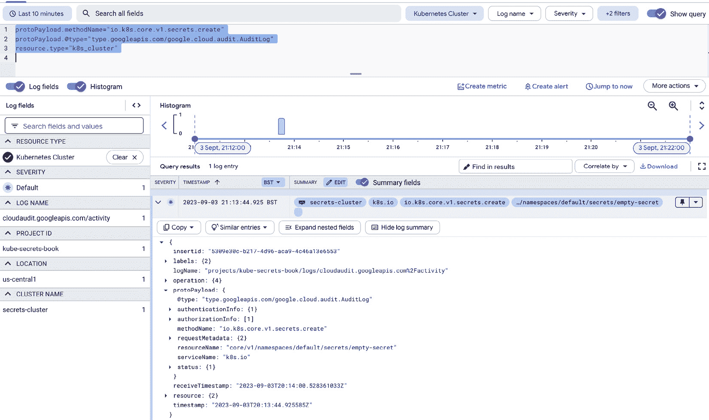
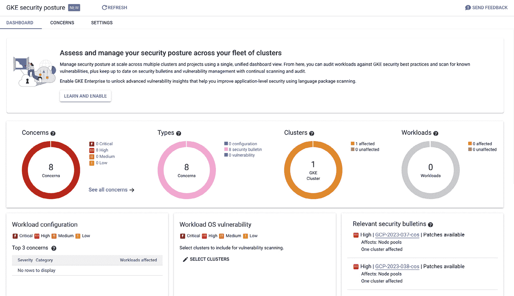

# 第十章：探索 GCP 上的 Cloud Secret Store

之前，我们深入研究了 Azure Key Vault。我们成功地将 Secrets 安全地存储在 Key Vault 中，并将其作为 Secrets 在 etcd 中存储的密钥管理服务。在本章中，我们将专注于 Google Cloud 平台，并将使用 Google Cloud 的 Secret Manager。

本章将涵盖以下主题：

+   GCP Secret Manager 概述

+   GKS 上的工作负载身份

+   GKE 和 GCP Secret Manager 集成

+   审计和日志记录

+   GKE 和 KMS 集成

到本章结束时，我们应该能够将我们的 Secrets 安全地存储到 GCP Secret Manager 中，通过审计监控密钥访问，并通过在 etcd 上加密 Secrets 来增加额外的安全层。

# 技术要求

为了将概念与实际操作示例联系起来，我们使用了一系列常见的工具和平台，这些工具和平台通常用于与 Google Cloud API 和 Kubernetes 进行交互：

+   **gcloud CLI** ([`cloud.google.com/sdk/gcloud#download_and_install_the`](https://cloud.google.com/sdk/gcloud#download_and_install_the)) 是一套工具，用于创建和管理 Google Cloud 资源。

+   **Terraform** ([`www.terraform.io/`](https://www.terraform.io/)) 是一种基础设施即代码的软件，可以用于在云端配置和管理基础设施。

+   **kubectl** ([`kubernetes.io/docs/reference/kubectl/`](https://kubernetes.io/docs/reference/kubectl/)) 是一个命令行工具，用于通过 Kubernetes API 与 Kubernetes 集群进行通信。

# GCP Secret Manager 概述

GCP Secret Manager 是 Google Cloud 提供的秘密管理解决方案。只要我们有一个需要存储 Secrets 的应用，Secret Manager 就可以被利用。该应用可以部署在 Compute Engine、Kubernetes、Cloud Functions 或任何其他 Google Cloud 上的合法部署形式中。

由于此服务由 Google Cloud 管理，默认提供了一些功能。我们可以总结如下：

+   IAM

+   高可用性

+   日志记录与审计

+   与其他 Google Cloud 组件的集成

让我们深入了解每一个内容。

## IAM

Google Cloud 提供了 **身份访问管理**（**IAM**）。某些 IAM 权限在组织级别生效，使我们能够管理组织的资源。然后，我们还有适用于项目范围的 IAM 权限，这些权限用于分配特定资源的访问权限。最细粒度的权限是基于资源的 IAM 权限。当我们创建一个资源时，可以为该特定资源分配权限。身份可以是用户、Google 群组或服务帐户。可以将特定资源的权限分配给特定身份。

## 高可用性

密钥管理器是一个高可用的解决方案，覆盖了灾难恢复场景。默认情况下，机密可以从 Google Cloud 的不同区域全球访问。在后台，机密会在多个区域进行复制，除非另有指定。指定区域的原因是数据驻留限制。如果某个机密不能存储在特定区域，我们可以定义要存储机密的区域，并排除任何不应包含我们数据的区域。

## 日志记录、审计和监控

Google Cloud 默认提供一个日志记录解决方案，既用于应用日志，也用于审计日志。应用日志与审计日志之间是有区别的。要访问 GCP 项目上的审计日志，您需要具有“Private Logs Viewer”权限。

## 与其他 Google Cloud 组件的集成

正如预期的那样，密钥管理器与其他 Google Cloud 组件集成。

我们可以使用**密钥管理服务**（**KMS**）对密钥管理器上的机密进行加密，并且可以将密钥管理器与 Kubernetes 集成。如我们在*第八章*中所见，*在 AWS 上探索云端秘密存储*，与 Kubernetes 上密钥管理器的集成是通过 CSI 插件实现的。

# 工作负载身份简介

GCP 上的 Kubernetes 引擎中的工作负载身份（Workload Identity）使我们能够将权限分配给能够与 Google Cloud 资源交互的 Kubernetes 工作负载。Google Cloud 有服务账户的概念。服务账户用于机器与资源进行交互。计算引擎、Lambda 函数甚至 Google Cloud 上的 App Engine 都可以分配一个服务账户，该账户具有与 Google Cloud 资源交互的权限。通过工作负载身份，我们可以将 GCP 上的服务账户映射到 Kubernetes 上的服务账户。

在 Kubernetes 中，我们可能会使用几种类型的部署来部署我们的应用程序。我们可以使用`Deployment`、`StatefulSet`、`DaemonSet`等。幕后将会创建一个 Pod，Pod 是 Kubernetes 上运行应用程序的基本组件。Pod 可以被分配一个服务账户。通过在 Kubernetes 上使用工作负载身份，并将 Kubernetes 服务账户绑定到 Google Cloud 服务账户，附加了 Kubernetes 服务账户的 Pod 将能够根据我们在 GCP 服务账户上授予的权限与 Google Cloud 资源进行交互。

因此，这一概念将帮助我们与 GCP 密钥管理器的集成。通过 Kubernetes CSI 和工作负载身份的集成，我们的 Kubernetes 工作负载访问密钥管理器将是授权且可行的。

现在我们理解了 Kubernetes 和 Google Cloud 上的密钥管理器如何协作，我们将重点实施一个 Kubernetes 集群。

# 集成 GKE 和 GCP 密钥管理器

借助 CSI Secret Store 插件，我们可以将 Secret Manager 解决方案与 Kubernetes 集群集成。Google Cloud 上的 Kubernetes 提供方案是 Google Kubernetes Engine。我们将使用该 Kubernetes 集群方案与 Secret Manager 集成。

创建集群有几种选择。我们将提供用于创建集群的 Terraform 代码。此外，我们还将提供其他所需的命令。

## 配置 Terraform 项目

我们需要配置 Terraform 提供程序。它将指向 GCP 凭证文件，还将指向 GCP 项目和区域。

提供程序配置应如下所示：

```
provider "google" {
  credentials = "/path/to/credentials/file"
  project     = "your-gcp-project"
  region      = "us-central1"
}
```

要初始化，我们需要运行 `init` 命令：

```
$ terraform init
```

当我们运行 `init` 命令时，如果没有指定凭证文件，默认凭证将是我们使用 `gcloud auth login` 命令登录的用户凭证。或者，我们可以指定服务账户文件。

## 网络配置

我们将继续进行网络的配置。在 Google Cloud 上，网络是全球资源，而网络的子网是区域资源。

我们将创建网络，正如预期的那样，由于 VPC 是全球资源，因此不会指定任何区域：

```
resource "google_compute_network" "vpc" {
  name                    = "${var.project_id}-vpc"
  auto_create_subnetworks = "false"
  project = var.project_id
}
```

子网络将被创建以托管 Kubernetes 上的节点。它将映射到指定的区域：

```
resource "google_compute_subnetwork" "subnet" {
  name          = "${var.project_id}-subnet"
  region        = var.region
  network       = google_compute_network.vpc.name
  ip_cidr_range = "10.10.0.0/24"
  project = var.project_id
}
```

现在我们可以专注于在 Secret Manager 上创建密钥。

## 在 Secret Manager 上配置密钥

GCP Secret Manager 是一种服务；在 GCP 上使用 Secret Manager 时，我们不需要创建资源。相反，我们创建将在 Secret Manager 上托管的密钥。

我们将从配置一个密钥开始：

```
resource "google_secret_manager_secret" "my_secret" {
  secret_id = "my-secret"
  user_managed {
      replicas {
        location = var.location
      }
      replicas {
        location = "us-east1"
      }
    }
}
```

我们故意指定了副本所在的区域。该密钥将托管在两个区域，这使得我们的密钥使用在区域故障时也能保持弹性。

我们已经创建了密钥，但尚未指定具体的值。对于一个密钥，我们需要指定该密钥的版本。现在让我们继续添加版本：

```
resource "google_secret_manager_secret_version" "my_secret_version" {
  secret = google_secret_manager_secret.my_secret.id
  secret_data = "secret-data"
}
```

此外，我们还希望配置一个具有权限的服务账户，以便检索密钥：

```
resource "google_service_account" "my_service_account" {
  account_id   = "read-secrets-service-account"
}
resource "google_secret_manager_secret_iam_binding" "my_secret_reader" {
  role   = "roles/secretmanager.secretAccessor"
  secret_id = google_secret_manager_secret.my_secret.id
  members = [
    "serviceAccount:${google_service_account.my_service_account.email}"
  ]
}
```

密钥已配置，我们也有一个服务账户可以用来进行检索。

现在，让我们继续创建 GKE 集群。

## 配置 GKE 集群

要创建 GKE 集群，我们需要创建主节点，并且还会创建一个默认的节点池：

```
resource "google_container_cluster" "gke_cluster" {
  name     = "secrets-cluster"
  location = var.region
  remove_default_node_pool = true
  initial_node_count       = 1
  network    = google_compute_network.vpc.name
  subnetwork = google_compute_subnetwork.subnet.name
  ...
  workload_identity_config {
    workload_pool = "kube-secrets-book.svc.id.goog"
  }
}
```

在创建集群时，GKE 默认要求我们创建一个初始节点池。我们可以使用 `google_container_node_pool` 资源创建另一个自定义节点池。这样，我们可以在 Terraform 中调整 GKE 节点池的更多参数，并将集群和节点池的定义分开。一旦创建了新的节点池，前提是我们将 `remove_default_node_pool` 设置为 `true`，Terraform 会删除初始的节点池。这将保持低成本，因为只有一个节点池会处于工作状态。

主要的节点池将以保持成本低为目标：

```
resource "google_container_node_pool" "primary_nodes" {
  name       = google_container_cluster.gke_cluster.name
  cluster    = google_container_cluster.gke_cluster.name
  version = data.google_container_engine_versions.gke_version.release_channel_latest_version["STABLE"]
  node_count = 1
  node_config {
    oauth_scopes = [
      "https://www.googleapis.com/auth/logging.write",
      "https://www.googleapis.com/auth/monitoring",
    ]
    machine_type = "n1-standard-1"
    tags         = ["gke-node", "${var.project_id}-gke"]
    disk_size_gb = 10
    metadata = {
      disable-legacy-endpoints = "true"
    }
  }
}
```

我们已经成功创建了集群。我们也可以登录集群并执行一些 `kubectl` 命令：

```
$ gcloud container clusters get-credentials secrets-cluster --region us-central1 --project kube-secrets-book
$ kubectl get node
NAME                    STATUS   ROLES    AGE     VERSION
gke-secrets-cluster-secrets-cluster-9e54b21e-5kxw   Ready    <none>   9m41s   v1.27.3-gke.1700
gke-secrets-cluster-secrets-cluster-b969915f-rfjz   Ready    <none>   9m35s   v1.27.3-gke.1700
...
```

我们的 GKE 集群已经投入使用，准备好为我们的工作负载提供服务。

## 为 Kubernetes Secrets 添加 CSI 插件

我们已经拥有一个可操作的集群，因此，我们将专注于设置 CSI 插件。在标准的 GKE 集群中，必须安装 CSI 插件。而在 GKE Autopilot（一个默认管理 Kubernetes 许多方面的 GKE 版本）中，CSI 插件已默认安装。

请注意，CSI 插件并未被 Google 官方支持。

首先，我们需要将插件安装到集群中：

```
$ helm repo add secrets-store-csi-driver https://kubernetes-sigs.github.io/secrets-store-csi-driver/charts
$ helm install csi-secrets-store secrets-store-csi-driver/secrets-store-csi-driver --namespace kube-system
$ kubectl apply -f https://raw.githubusercontent.com/GoogleCloudPlatform/secrets-store-csi-driver-provider-gcp/main/deploy/provider-gcp-plugin.yaml
```

然后我们应该创建一个服务账户。Kubernetes 服务账户将被注释上我们希望工作负载使用的 GCP 服务账户的 ID：

```
$ kubectl create serviceaccount read-secret --namespace=default
$ kubectl annotate serviceaccount read-secret \
    --namespace=default \
    iam.gke.io/gcp-service-account=read-secrets-service-account@test-gcp-project.iam.gserviceaccount.com
```

通过这种方式，Kubernetes 的服务账户将代表我们之前创建的服务账户执行操作。服务账户能够从 Secret Manager 中检索 Secrets。

`SecretProviderClass` 是一种自定义资源类型，提供 CSI 驱动程序的配置和参数。我们需要指定 `SecretProviderClass`：

```
apiVersion: secrets-store.csi.x-k8s.io/v1
kind: SecretProviderClass
metadata:
  name: app-secrets
spec:
  provider: gcp
  parameters:
    secrets: |
      - resourceName: "projects/project-i/secrets/my-secret/versions/latest"
        path: "good1.txt"
```

最后一步是创建一个 Pod。该 Pod 将使用工作负载身份并代表 `read-secrets-service-account` GCP 账户执行操作。同时，Pod 将使用我们之前创建的 `SecretProviderClass`，并将 Secrets 挂载为文件：

```
apiVersion: v1
kind: Pod
metadata:
...
spec:
  serviceAccountName: mypodserviceaccount
  containers:
  - ...
    volumeMounts:
      - mountPath: "/var/secrets"
        name: mysecret
  volumes:
  - name: mysecret
    csi:
      driver: secrets-store.csi.k8s.io
      readOnly: true
      volumeAttributes:
        secretProviderClass: "app-secrets"
```

我们实现的目标是通过 CSI 插件将秘密挂载到 Pod。现在，我们可以专注于监控 Secrets 的使用情况。审计和日志记录在识别云资源或 Kubernetes 上的操作中起着至关重要的作用。

# 审计和日志记录

Google Cloud 默认提供日志记录和审计功能。一旦我们配置了 Kubernetes 集群，所有操作都可以通过日志控制台查看。

假设我们在之前配置的集群中创建了一个秘密：

```
$ kubectl create secret generic empty-secret
```

该操作将记录在 GKE 的审计日志中，我们只需使用以下查询在 GCP 的日志控制台中搜索：

```
protoPayload.methodName="io.k8s.core.v1.secrets.create"
protoPayload.@type="type.googleapis.com/google.cloud.audit.AuditLog"
resource.type="k8s_cluster"
```

结果是，我们应该看到访问 Secrets 时的所有操作：



图 10.1 – GKE 上的 Kubernetes 审计日志

除了 Kubernetes 上的审计日志外，我们还可以利用 Secret Manager 上的审计日志。在 GCP 的日志页面上，我们可以专门搜索审计日志：

```
resource.type="audited_resource" AND
resource.labels.service="secretmanager.googleapis.com"
```

这个 GCP 日志查询过滤器将帮助我们查看与 Secret Manager 相关的日志。

## GKE 安全姿态仪表板

另一个由 GCP 提供的显著工具是 **GKE 安全姿态**仪表板，它能提升 GKE 集群的安全性。GKE 安全姿态仪表板是一组在 Google Cloud 控制台中扫描 GKE 集群和工作负载的功能，提供有针对性、可操作的建议。

GKE 安全姿态关注两个部分：

+   Kubernetes 安全姿态

+   工作负载漏洞扫描

通过 Kubernetes 安全态势仪表板，当发现漏洞时，它会自动在仪表板上显示，展示受影响的集群和工作负载，帮助我们进行后续操作：



图 10.2 – GKE 安全态势

通过工作负载漏洞扫描，集群中运行的容器镜像会被扫描出漏洞。此外，还支持扫描实际的编程语言包中的漏洞，从而使工作负载更加安全。

如预期所示，GKE 安全态势的结果与其他云组件（如日志记录和监控）集成，从而使得在处理任何安全事件时能够启用警报并实现自动化。

现在审计和日志记录已经到位，我们可以继续进行更高级的加密 Secrets 的操作，通过将 GKE 与 KMS 集成。

# 集成 GKE 与 KMS

使用 KMS 来加密 Google Kubernetes 容器引擎上的 Secrets 是可行的。默认情况下，GKE 会加密静态数据，且加密由 GCP 管理。除了对数据的安全处理外，我们可能希望对数据的加密过程有更多控制。在这种情况下，我们可以选择使用在 GCP 项目中我们自己配置和维护的 KMS 密钥来加密 Kubernetes 上的数据。我们将从配置 KMS 密钥开始：

```
resource "google_kms_key_ring" "ksm_key_ring" {
  name     = "ksm-key-ring"
  location = var.region
}
resource "google_kms_crypto_key" "ksm_secret_key" {
  name = "ksm-secret-encryption"
  key_ring = google_kms_key_ring.ksm_key_ring.id
  lifecycle {
    prevent_destroy = false
  }
}
```

我们还需要分配权限，以便 Kubernetes 服务账户能够执行加密和解密操作。请注意，在 GKE 上，主节点由 GCP 管理，主节点使用的服务账户并非我们 Google Cloud 项目中的服务账户，因此我们需要将权限分配给一个不属于我们项目的服务账户：

```
data "google_project" "project" {}
resource "google_kms_crypto_key_iam_binding" "ksm_secret_key_encdec" {
  crypto_key_id = google_kms_crypto_key.ksm_secret_key.id
  role          = "roles/cloudkms.cryptoKeyEncrypterDecrypter"
  members = [
 "serviceAccount:service-${data.google_project.project.number}@container-engine-robot.iam.gserviceaccount.com"
  ]
}
```

我们刚刚创建了 KMS。在我们的集群配置中，让我们启用数据库加密选项：

```
resource "google_container_cluster" "gke_cluster" {
  name     = "secrets-cluster"
  location = var.region
...
  database_encryption {
    key_name = google_kms_crypto_key.ksm_secret_key.id
    state = "ENCRYPTED"
  }
 }
```

我们没有使用 GCP 的 KMS 密钥，而是提供了我们自己的**客户管理密钥**（**CMK**）。我们的 Secrets 将使用我们提供的 KMS 密钥进行加密。

# 总结

在本章中，我们深入探讨了 Google Cloud 和 GKE 上的 Secrets 管理。我们了解了 Secret Manager，这是 GCP 提供的 Secrets 管理服务及其包含的功能，如可用性、审计和与其他 Google Cloud 组件的集成。然后，我们使用 GKE 服务在 GCP 上配置了 Kubernetes 引擎，并将其与 Secret Manager 集成。接着，我们使用 KMS 加密了 Kubernetes 上的静态 Secrets。最后，通过使用 Google Cloud 监控，我们成功地跟踪了 Kubernetes、Secret Manager 和 KMS 上的秘密操作。在下一章中，我们将专注于非云基础的秘密管理工具：HashiCorp Vault 和 CyberArk Conjur。
