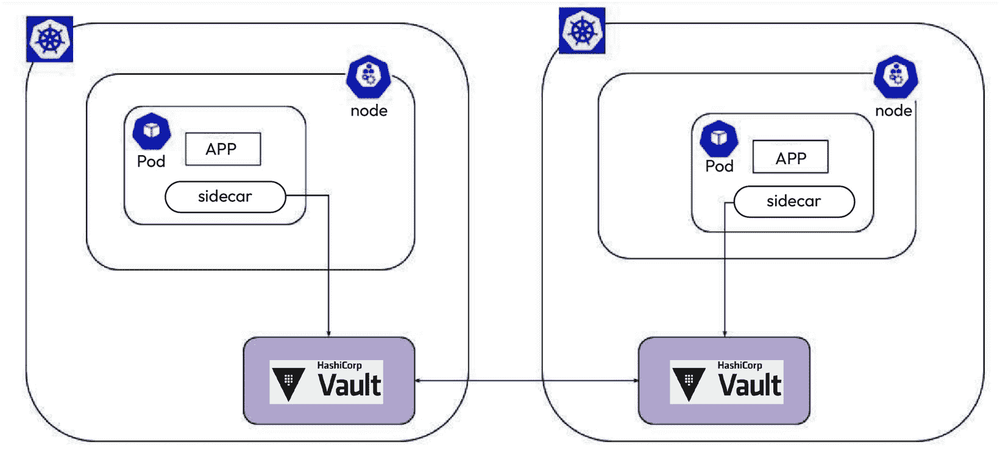
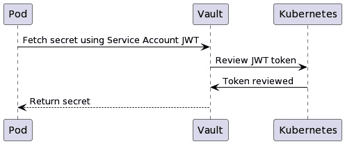
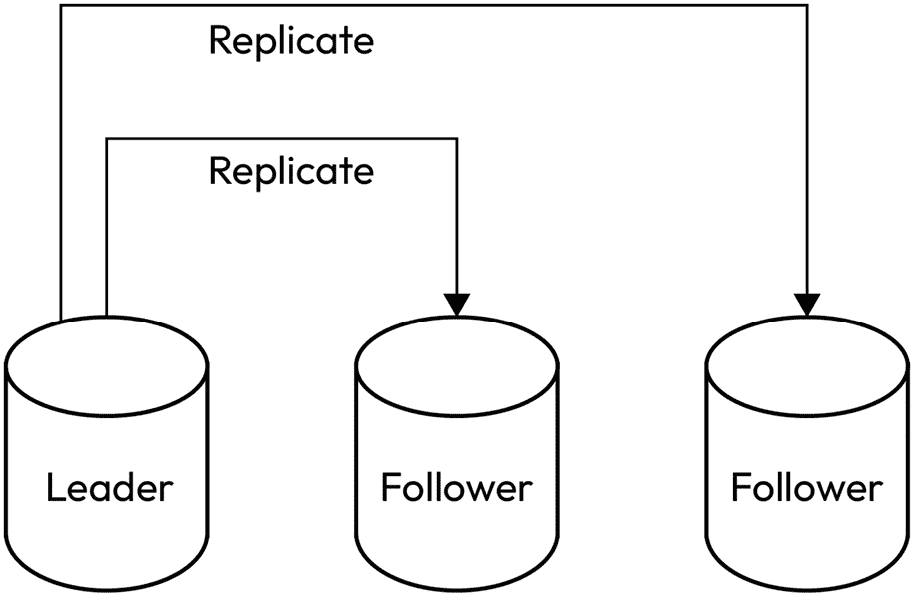
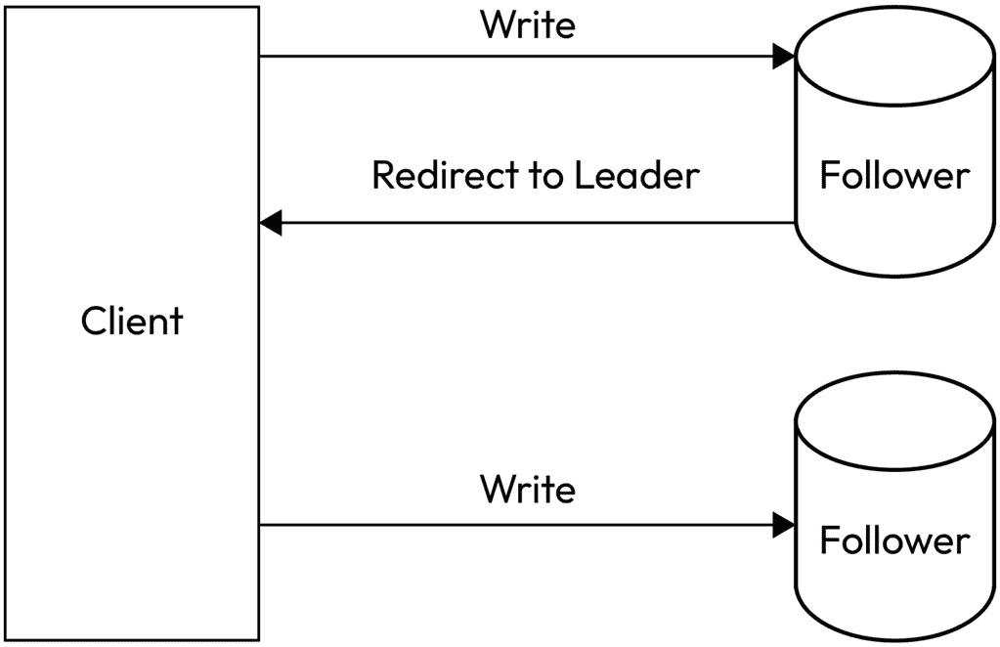

# 11

# 探索外部秘密存储

之前，我们与云服务提供商 AWS、Azure 和 GCP 一起工作。我们运行了应用程序，并将其与这些平台上提供的秘密提供商集成。我们使用了每个云服务商的 Secrets 管理设施，并受益于云服务商为我们提供的工具生态系统。这使得我们能够应对诸如审计、高可用性和灾难恢复等问题。在本章中，我们将探讨不属于云服务提供商产品的一些外部秘密存储。

我们将涵盖以下主题：

+   外部秘密存储提供商概述

+   外部秘密存储的不同类型，如 HashiCorp Vault 和 CyberArk Secrets Manager

+   在外部秘密存储中管理 Kubernetes 的 Secrets

# 技术要求

为了将概念与动手实践结合，我们使用了一系列常用工具和平台来与 Google Cloud API 和 Kubernetes 进行交互：

+   **kubectl**：这是用于通过 Kubernetes API 与 Kubernetes 集群通信的命令行工具 ([`kubernetes.io/docs/reference/kubectl/`](https://kubernetes.io/docs/reference/kubectl/))。

+   **minikube**：这是一个用于 Kubernetes 学习和开发的本地 Kubernetes 发行版。要在您的系统上安装 minikube，您可以参考官方文档中的安装说明 ([`minikube.sigs.k8s.io/docs/start/`](https://minikube.sigs.k8s.io/docs/start/))。

+   **Vault CLI**：用于与 HashiCorp Vault 安装进行交互 ([`developer.hashicorp.com/vault/docs/install`](https://developer.hashicorp.com/vault/docs/install))。

+   `kubectl` 命令 ([`jqlang.github.io/jq/`](https://jqlang.github.io/jq/)).

+   **Helm**：这是 Kubernetes 的一个包管理器，我们将使用它来简化 Kubernetes 资源的部署和管理 ([`helm.sh`](https://helm.sh))。

# 外部密钥提供商概述

默认情况下，Kubernetes 上的 Secrets 存储在**etcd**中，正如在*第一章*《理解 Kubernetes Secrets 管理》中所提到的那样，*理解 Kubernetes Secrets 管理*。将 Secrets 存储在 etcd 中会带来一些安全问题，正如在*第七章*《管理 Secrets 中的挑战与风险》一章中提到的那样。使用其他形式的秘密存储可以帮助我们增强安全性，并且分隔与秘密使用相关的关注点。我们将重点关注使外部密钥提供商可行的组件。

首先，让我们看一下可用的外部秘密存储提供商：

+   AWS Secrets Manager

+   Azure Key Vault

+   GCP Secret Manager

+   HashiCorp Vault

+   CyberArk Conjur

这些提供商与 Kubernetes 集成的方式可能有所不同。实现与密钥存储提供商集成的一种非常流行的方法是通过 Secrets Store CSI Driver。

## Secrets Store CSI Driver

Secrets Store CSI 驱动程序使得通过**容器存储接口**（**CSI**）卷集成 Kubernetes 秘密成为可能。Kubernetes Secrets Store 接口基于 Kubernetes CSI 插件。通过 CSI，我们可以通过实现 CSI 插件将外部存储提供者集成到 Kubernetes 中，从而扩展集群的存储能力，而无需更改 Kubernetes 的核心代码。

## 外部秘密存储提供者与 CSI 插件

有一些 CSI 提供者插件：

+   AWS 提供者

+   Azure 提供者

+   GCP 提供者

+   Vault 提供者

在前面的章节中，我们重点介绍了与云服务提供商解决方案一起提供的 CSI Secrets Store CSI 驱动程序。我们提到了一个新的提供者——Vault 提供者，它是 HashiCorp 的秘密存储解决方案。

列表中的所有秘密提供者都提供高可用性选项，并且所有的秘密提供者都提供审计和日志记录。这些元素确保了数据治理和安全性。除了 CSI 驱动程序解决方案外，还有其他可用的秘密管理集成方法。其中之一就是 Secrets Injector 组件，我们将在接下来介绍。

## Secrets Injector

Secrets Injector 组件提供了另一种方式，可以将秘密注入到应用程序以及托管在外部秘密存储提供者上的秘密。

像 HashiCorp Vault 和 CyberArk Conjur 这样的秘密管理器通过 Sidecar Injector 支持秘密存储的使用。这些 sidecar 注入器专注于在从秘密存储中接收秘密时的授权和认证方面。同时，它们也解决了与 Kubernetes 工作负载的集成问题。

然而，请注意，注入秘密并不是总需要一个与 Kubernetes 交互的复杂二进制文件。例如，我们可以考虑 GCP Secret Manager。没有官方的二进制文件可以从 Secret Manager 接收秘密并将其附加到 Pod 上。但这并不妨碍我们实现一个安全的解决方案来实现相同的结果。我们可以利用工作负载身份，如在*第十章*《探索 GCP 上的云秘密存储》中提到的那样，通过工作负载身份，我们的 Kubernetes 工作负载可以与秘密管理器进行交互。然后我们可以使用 GCP Secret Manager 的客户端库，并通过初始化容器，将秘密安全地挂载到 Pod 上。

这个方案可以应用于任何其他形式的存储。关键要点是使用了工作负载身份（Workload Identity）；通过它，安全性得到了保障。我们不需要在 etcd 上存储任何秘密，从而能够与秘密管理器进行交互。相反，Kubernetes 工作负载会被分配特定的权限，从而使得与秘密管理器的交互成为可能。

在其他形式的秘密管理系统中，如 HashiCorp Vault，身份验证和与秘密存储的交互与我们之前看到的有所不同，但其安全性特性保持一致。对秘密的访问是通过安全和授权的方式实现的，并遵循最小权限原则。我们将在接下来的章节中详细讨论这一点。

总结来说，我们概述了可以用来将 Secrets 注入 Kubernetes 的外部 Secrets 提供程序。接下来，我们将重点介绍 HashiCorp Vault 及其功能。

# HashiCorp Vault

在分布式计算迅速发展的背景下，保护敏感信息至关重要。Kubernetes，作为容器编排的领头羊，需要强大的解决方案来管理 Secrets——那些对应用程序配置和操作至关重要的敏感数据。HashiCorp Vault 凭借其全面的工具套件，成为解决这些挑战的核心，为 Kubernetes 集群中的 Secrets 管理提供了安全的方案。

HashiCorp Vault 提供了一个集中化的加密解决方案，确保 Secrets 保持机密，并且从不在应用程序代码或配置文件中暴露。它与 Kubernetes 的集成不仅简化了 Secrets 管理，还增强了容器化应用程序的安全性，引入了动态 Secrets、Pods 中的安全秘密注入和 Kubernetes 原生身份验证等功能。这些功能促进了 HashiCorp Vault 与 Kubernetes 之间的安全通信和 Secrets 检索，提升了管理 Secrets 的灵活性、安全性和效率。

HashiCorp Vault 能够按需动态生成短期凭证，这一点将其与本地 Kubernetes Secrets 区分开来。后者通常以未加密的形式存储在 etcd 中，并且随着应用程序的扩展，管理起来变得更加困难。HashiCorp Vault 的方法最小化了攻击面，增强了安全性，并解决了 Secrets 管理不当的潜在问题。

此外，HashiCorp Vault 的广泛审计日志功能确保了透明度和问责制，帮助合规并促进了对安全事件的迅速响应。通过将 HashiCorp Vault 集成到 Kubernetes 部署中，组织能够建立一个强大、安全且符合合规要求的容器化应用环境，克服本地 Kubernetes Secrets 的局限性，将 Secrets 管理提升到最高的安全标准。

它有开源版和企业版，我们接下来将重点介绍开源版。

## 使用 HashiCorp Vault 作为秘密存储

HashiCorp Vault 可以作为秘密存储，它可以包含我们应用程序的 Secrets。这使得将 Kubernetes Secrets 托管在 Vault 中成为可能。可以通过两种方式实现：要么将 Vault 托管在 Kubernetes 之外，要么将 Vault 与 Kubernetes 一起托管。

让我们看看如何将外部 HashiCorp Vault 与 Kubernetes 集成。为了满足我们的需求，我们将使用 minikube 安装。

### 外部 Vault 存储

我们将继续创建一个 Vault 实例，它将在 Docker 容器中运行。我们可以使用 Docker Compose 运行 Vault：

```
services:
  vault_node_1:
    image: vault:1.13.3
    container_name: vault_node_1
    ports:
      - "8200:8200"
    environment:
      VAULT_DEV_LISTEN_ADDRESS: "0.0.0.0:8200"
      VAULT_DEV_ROOT_TOKEN_ID: mytoken
      VAULT_LOG_LEVEL: debug
    volumes:
      - haproxy.cfg:/haproxy.cfg
```

我们可以使用以下命令运行 Vault：

```
$ docker compose up
```

另一种解决方案是通过使用普通的 Docker 命令运行 Vault：

```
$ docker run -p 8200:8200 --rm -v haproxy.cfg:/haproxy.cfg  --name vault_node_1  -e VAULT_DEV_ROOT_TOKEN_ID=mytoken -e VAULT_DEV_LISTEN_ADDRESS=0.0.0.0:8200 -e VAULT_LOG_LEVEL=debug vault:1.13.3
```

这两个命令的结果没有区别。Compose 的便利性在于它只有一个文件，而独立的 Docker 命令也可以正常工作。这完全是个人偏好问题。

需要理解的是，我们在开发模式下运行 Vault 是为了调试目的。这并不是一种安全的运行 Vault 的方式，我们将在本章的 *开发模式与生产模式* 部分看到这一点。开发模式将用于使我们的示例用例更简单。

让我们检查一下 Vault。我们指定了 root token，这是一个具有 root 权限的令牌。我们还将日志级别设置为 `debug`，以帮助我们进行安装故障排除。`VAULT_DEV_LISTEN_ADDRESS` 是在开发模式下绑定的地址。现在，这足以继续与 Kubernetes 集成。

#### 在 Kubernetes 上安装 Vault

为了能够将 Vault 与 Kubernetes 集成，我们需要安装 Vault 二进制文件。最简单的方式是通过 Helm 图表。

首先，我们将获取我们的 Vault 安装的参考：

```
$ EXTERNAL_VAULT_ADDR=$(minikube ssh "dig +short host.docker.internal" | tr -d '\r')
```

然后我们将在 Kubernetes 上安装 Vault：

```
$ helm repo add hashicorp https://helm.releases.hashicorp.com
$ helm repo update
$ helm install vault hashicorp/vault --set "global.externalVaultAddr=http://$EXTERNAL_VAULT_ADDR :8200" --set="csi.enabled=true"
```

我们在 Kubernetes 上安装了 Vault 包，并设置了 Kubernetes 将指向的外部 Vault 地址。此外，我们启用了 CSI，因为我们将在另一个示例中展示 CSI 功能。要检查我们的安装是否成功，我们可以检查 `vault-agent-injector` 是否已部署在我们的集群中。通过使用 `kubectl`，我们可以判断是否存在 `vault-agent-injector` 部署：

```
$ kubectl get deployment vault-agent-injector
NAME                   READY   UP-TO-DATE   AVAILABLE   AGE
vault-agent-injector   1/1     1            1           3h40m
```

让我们了解一下 Vault Agent Injector 的工作原理。

#### Vault Agent Injector

如果我们检查 Vault Agent Injector，将会看到它使用了一个特定的服务账户 `vault-agent-injector`。这个组件负责更改 Pod 规格，以便可以包含代理容器。这些 Vault Agent 容器将 Vault 中的 Secrets 渲染到共享内存卷中。

当一个使用 Vault Secrets 的 Pod 初始化时，以下操作将发生：

1.  代理将识别使用 Vault Secrets 的 Pod。

1.  Pod 规格将被更改，并将包括 Vault Agent 容器。

1.  Vault 初始化容器将提取 Secrets，并将它们附加到 Pod 作为共享内存卷。

1.  如果 Vault 中的 Secrets 发生变化，Vault Sidecar Injector 会改变这些 Secrets。

`vault-agent-injector` Pod 被分配了 `vault-agent-injector-clusterrole` 角色。

我们可以看到 `vault-agent-injector-clusterrole` 集群角色：

```
$ kubectl get clusterrole vault-agent-injector-clusterrole -o yaml
kind: ClusterRole
metadata:
...
  name: vault-agent-injector-clusterrole
rules:
- apiGroups:
  - admissionregistration.k8s.io
  resources:
  - mutatingwebhookconfigurations
  verbs:
  - get
  - list
  - watch
  - patch
```

`vault-agent-injector` 被注册到 Kubernetes，作为一个 `vault-agent-injector`，它将拦截创建请求并重写 Pod 定义。

Vault 注释将如下所示：

```
vault.hashicorp.com/agent-inject: 'true'
vault.hashicorp.com/role: 'webapp_admin_r'
vault.hashicorp.com/agent-inject-secret-credentials.txt: 'secret/data/webapp/admin'
```

如我们所见，我们启用了注入方法。然后，我们指定将用于获取密钥的 Vault 角色以及将要获取的密钥：



图 11.1 – Vault Injector 和托管在 Kubernetes 上的应用程序

通过重写 Pod 定义，Pod 现在将包含 Vault Agent 容器。Vault Agent 容器将与 Vault 交互以检索密钥并将其注入到 Pod 中。

#### Vault 服务账户和 Kubernetes 身份验证

为了让 Vault 与 Kubernetes 交互，它必须使用服务账户。通过安装 Vault Helm 包，也将创建一个服务账户。该服务账户命名为 `vault`。

我们需要为该服务账户创建一个 token。根据*第二章*《Kubernetes 密钥管理概念解析》，我们知道在 Kubernetes 的新版本中，我们必须自己为服务账户创建密钥。

让我们为服务账户创建密钥。我们将创建一个 YAML 文件，内容如下：

```
apiVersion: v1
kind: Secret
metadata:
  name: vault-sa-token
  annotations:
    kubernetes.io/service-account.name: vault
type: kubernetes.io/service-account-token
```

接下来，我们将应用 YAML 文件：

```
$ kubectl apply –f vault-secret.yaml
```

密钥将被创建，我们应该能够将其用于 Vault。现在我们应该配置 Vault 以启用 Kubernetes 身份验证。

#### Kubernetes 身份验证

我们可以通过使用 Kubernetes 服务账户 token 来验证 Vault。这是 Kubernetes 身份验证方法。实际上，我们在 Vault 上配置一个 Kubernetes 服务账户 token，然后使用该 token 与 Kubernetes API 交互。为了启用此功能，我们需要在 Vault 上启用身份验证方法。

以下步骤应按顺序执行：

```
# retrieve Kubernetes secret for the service account
$ VAULT_HELM_SECRET_NAME=$(kubectl get secrets --output=json | jq -r '.items[].metadata | select(.name|startswith("vault")).name')
# retrieve service account token
$ TOKEN_REVIEW_JWT=$(kubectl get secret $VAULT_HELM_SECRET_NAME --output='go-template={{ .data.token }}' | base64 --decode)
# retrieve Kubernetes certificate
$ KUBE_CA_CERT=$(kubectl config view --raw --minify --flatten --output='jsonpath={.clusters[].cluster.certificate-authority-data}' | base64 --decode)
# retrieve the Kubernetes host
$ KUBE_HOST=$(kubectl config view --raw --minify --flatten --output='jsonpath={.clusters[].cluster.server}')
# point to local vault address
$ export VAULT_ADDR=http://0.0.0.0:8200
# login to vault using the root token
$ vault login mytoken
# enabled kubernetes authentication on vault
$ vault auth enable kubernetes
# write Kubernetes authentication configuration
$ vault write auth/kubernetes/config token_reviewer_jwt="$TOKEN_REVIEW_JWT" kubernetes_host="$KUBE_HOST" kubernetes_ca_cert="$KUBE_CA_CERT" issuer="https://kubernetes.default.svc.cluster.local"
```

让我们看看它在后台是如何工作的：

+   在 Vault 上配置了一个服务账户。它具有与 Kubernetes API 交互并执行 TokenReview 请求的权限。

+   在 Vault 上创建一个角色，具有与 Vault 中的密钥交互的权限。该角色与一个 Kubernetes 服务账户映射。

+   创建一个 Pod，并为其分配我们在上一步创建的服务账户。Vault Injector 使用该服务账户的 JWT 发出请求，以便从 Vault 获取密钥。

+   Vault 向 Kubernetes API 发出 TokenReview 请求，以验证 JWT token。

+   Kubernetes 验证 token。

+   Vault 检查与 token 关联的服务账户是否与有权限访问所请求密钥的角色相匹配。

+   Vault 返回密钥值。

+   Vault Injector 将密钥注入到 Pod 中。

以下是我们到目前为止讨论的流程图：



图 11.2 – Kubernetes 身份验证流程

我们配置了 Kubernetes 身份验证。我们将面临的问题之一是 `$KUBE_HOST` 指向 `localhost`，因此证书映射到 `localhost`。这可能会成为一个问题，因为 Vault 可以通过 Docker 主机地址访问 minikube，而该地址与 `localhost` 不同。因此，我们将使用之前挂载的 `proxy` 文件。端口将根据 `$KUBE_HOST` 的端口动态变化而改变。

在另一个终端上，我们将执行以下命令并启用端口转发：

```
$ KUBE_HOST=$(kubectl config view --raw --minify --flatten --output='jsonpath={.clusters[].cluster.server}')
$ port=$(echo $KUBE_HOST | awk -F/ '{print $3}' | cut -d: -f2)
$ docker exec -it vault_node_1 sh
# apk add haproxy
# haproxy -f ./haproxy.cfg
```

由于这种身份验证方式涉及多个步骤，审计将有助于提高我们的可观察性：

```
$ vault audit enable file file_path=/tmp/vault_audit.log
```

`/tmp/vault_audit.log` 的审计日志文件可以通过以下命令查看：

```
$ docker exec -it  vault_node_1  tail –f /tmp/vault_audit.log
```

由于身份验证已启用并且我们已配置所需的服务账户，我们应该继续为 Vault 提供对某些服务账户的权限。

#### Vault 策略和绑定

使用像 Vault 这样的秘密提供者的好处在于，我们可以存储秘密并提供细粒度的策略。

例如，我们将在 Vault 中存储以下秘密：

```
$ vault kv put secret/webapp/admin username='john.doe' password='strong-password'
```

我们希望为该秘密设置一个严格的只读策略。

因此，我们将实现一个具有只读权限的策略，用于访问 `secret/webapp/admin` 秘密：

```
$ vault policy write webapp_admin_r  - <<EOF path "secret/data/webapp/admin" { capabilities = ["read"] } EOF
```

策略已经到位，因此，如果我们希望某些工作负载能够使用此策略，我们需要明确指定。在我们的例子中，我们将有一个 Kubernetes 服务账户映射到一个需要 Vault 中秘密的 Pod。服务账户的名称为 `simple-app`。我们的下一步是将之前创建的策略绑定到该服务账户：

```
$ vault write auth/kubernetes/role/webapp_admin_r \
     bound_service_account_names=simple-app \
     bound_service_account_namespaces=default \
     policies=webapp_admin_r \
     ttl=24h
```

现在我们应该在 Kubernetes 上创建该服务账户：

```
$ kubectl create sa simple-app
```

这个服务账户将被 Vault Injector 用来将秘密注入到应用程序中。仅仅配置服务账户不足以与 Vault 交互，还需要一个集群角色绑定：

```
apiVersion: rbac.authorization.k8s.io/v1
kind: ClusterRoleBinding
metadata:
  name: role-tokenreview-binding
  namespace: default
roleRef:
  apiGroup: rbac.authorization.k8s.io
  kind: ClusterRole
  name: system:auth-delegator
subjects:
  - kind: ServiceAccount
    name: simple-app
    namespace: default
```

`auth-delegator` 是一个角色，允许委托身份验证和授权检查。通过这种方式，我们在 Vault 上配置的服务账户可以发出一个 TokenReview 请求，以获取绑定到 `simple-app` 服务账户的 JWT token。

#### 在应用程序中使用 Vault 秘密

`simple-app` 服务账户将拥有 `auth-delegator` 集群角色。该角色启用委托身份验证和检查。Vault 将能够执行委托身份验证。

我们将创建一个应用程序来获取秘密：

```
apiVersion: v1
kind: Pod
metadata:
  name: webapp
  labels:
    app: webapp
  annotations:
    vault.hashicorp.com/agent-inject: 'true'
    vault.hashicorp.com/role: 'webapp_admin_r'
    vault.hashicorp.com/agent-inject-secret-credentials.txt: 'secret/data/webapp/admin'
spec:
  serviceAccountName: simple-app
  containers:
  - name: app
    image: nginx
```

使用的高亮注解对于 `vault-agent-injector` 来说至关重要，它会重写 Pod 配置，以便 Vault 初始化容器生效。

一旦我们的应用程序启动并运行，我们现在可以检查凭证：

```
$ kubectl exec -it webapp -c app -- cat /vault/secrets/credentials.txt
data: map[password:strong-password username:john.doe]
metadata: map[created_time:2023-10-08T19:23:50.814986175Z custom_metadata:<nil> deletion_time: destroyed:false version:1]
```

总体而言，我们成功地以安全的方式与 Vault 进行交互，而无需将任何 Vault 特定的凭据挂载到 Kubernetes Secrets 中，进而也不会出现在 etcd 上。相反，我们依赖于使用 Vault 支持的 Kubernetes 身份验证方法。现在，我们可以通过使用 Vault sidecar 容器最终将凭据注入到应用程序中。不过，Vault 也支持另一种将 Secrets 注入 Kubernetes 的方法：熟悉的 CSI Driver 方法。

## Vault 和 CSI Driver

多亏了前几章的内容，我们已经熟悉了 Secret Store CSI Driver。Vault 也让我们能够使用这种方式。使用 CSI Driver 是一种将 Vault 中的 Secrets 挂载到 Pod 上的不同方法；然而，它受益于相同的组件。由于我们已配置 Kubernetes 身份验证方法，我们已经解决了 Vault 身份验证的需求。

然而，我们确实需要安装`secrets-store-csi-driver`包。我们将执行以下 Helm 命令：

```
$ helm repo add secrets-store-csi-driver https://kubernetes-sigs.github.io/secrets-store-csi-driver/charts
$ helm install csi-secrets-store secrets-store-csi-driver/secrets-store-csi-driver --namespace kube-system
```

下一步是创建指向 Vault 中 Secrets 的 `SecretProviderClass`：

```
apiVersion: secrets-store.csi.x-k8s.io/v1alpha1
kind: SecretProviderClass
metadata:
  name: vault-up-creds
  namespace: default
spec:
  provider: vault
  parameters:
    roleName: 'devweb-app'
    objects: |
    - objectName: "username"
      secretPath: "secret/data/devwebapp/config"
      secretKey: "username"
    - objectName: "password"
      secretPath: "secret/data/devwebapp/config"
      secretKey: "password"
```

下一步是配置应用程序，它将使用 CSI 提供者：

```
apiVersion: apps/v1
kind: Deployment
metadata:
  name: nginx-deployment
spec:
  replicas: 1
  selector:
    matchLabels:
      app: nginx
  template:
    metadata:
      labels:
        app: nginx
    spec:
      serviceAccountName: simple-app
      containers:
      - name: nginx-container
        image: nginx:latest
        ports:
        - containerPort: 80
        volumeMounts:
        - name: 'vault-up-creds'
      mountPath: '/mnt/secrets-store'
      readOnly: true
    volumes:
    - name: vault-up-creds
      csi:
        driver: 'secrets-store.csi.k8s.io'
        readOnly: true
        volumeAttributes:
          secretProviderClass: 'vault-up-creds'
```

我们成功地将 Vault 安全地与 Kubernetes 集成。我们通过 CSI 和 Vault Injector 方法实现了这一点。还有一种将 Kubernetes 工作负载与 Vault 集成的方法，那就是在 Kubernetes 上运行 Vault 安装。

## Vault 托管在 Kubernetes 上

在某些情况下，Vault 集群可能会托管在 Kubernetes 上。这是一种具有多种优点的方式。从维护角度来看，你可以利用 Kubernetes 的优势，而从延迟角度来看，只要先前的 Vault 安装是在另一个网络上部署的，它会更快。

我们将通过 minikube 进行安装。

我们将为 Vault 安装配置值：

```
cat > helm-vault-raft-values.yml <<EOF
server:
  affinity: ""
  ha:
    enabled: true
    replicas: 3
    raft:
      enabled: true
EOF
```

由于 Vault 运行在 minikube 上，我们无法选择在多个节点上运行。因此，我们禁用了网络亲和性。同时，我们将启用高可用性并使用三个副本来运行 Vault：

```
$ helm repo add hashicorp https://helm.releases.hashicorp.com
$ helm repo update
$ helm install vault hashicorp/vault --values helm-vault-raft-values.yml
```

通过在高可用模式下运行 Vault，将使用 Raft 一致性算法。

请注意，Vault 是通过 `StatefulSet` 安装的，默认节点数为 `3` 个。

如果查看日志，我们会看到 Vault 尚未初始化：

```
$ kubectl logs -f vault-0
2023-10-11T21:01:25.268Z [INFO]  core: security barrier not initialized
```

我们现在需要初始化 Vault：

```
kubectl exec vault-0 -- vault operator init -key-shares=1 -key-threshold=1 -format=json > cluster-keys.json
```

这将创建 `cluster-keys.json` 文件。

让我们查看集群密钥的内容：

```
{
  "unseal_keys_b64": [
    "the-unseal-key"
  ],
  "unseal_keys_hex": [
    "the-unseal-key-hex"
  ],
  "unseal_shares": 1,
  "unseal_threshold": 1,
  "recovery_keys_b64": [],
  "recovery_keys_hex": [],
  "recovery_keys_shares": 0,
  "recovery_keys_threshold": 0,
  "root_token": "root-token"
}
```

我们的下一步是使用解封密钥来解封 Vault：

```
$ VAULT_UNSEAL_KEY=$(jq -r ".unseal_keys_b64[]" cluster-keys.json)
$ kubectl exec vault-0 -- vault operator unseal $VAULT_UNSEAL_KEY
```

接着我们需要逐个加入节点：

```
$ kubectl exec -ti vault-1 -- vault operator raft join http://vault-0.vault-internal:8200
$ kubectl exec -ti vault-2 -- vault operator raft join http://vault-0.vault-internal:8200
```

通过加入集群中的节点，领导者选举过程应该会开始进行。

现在我们必须解封其他节点：

```
$ kubectl exec vault-1 -- vault operator unseal $VAULT_UNSEAL_KEY
$ kubectl exec vault-2 -- vault operator unseal $VAULT_UNSEAL_KEY
```

解封操作完成后，我们可以开始向 Vault 中添加数据。

在 Kubernetes 上进行端口转发应该是有效的：

```
$ kubectl port-forward vault-0 8200:8200
```

接下来，执行以下命令：

```
#point Vault CLI to localhost
$ export VAULT_ADDR=http://0.0.0.0:8200
# extract vault root token
$ VAULT_ROOT_TOKEN=$(jq -r ".root_token" cluster-keys.json)
#login with root token
$ vault login $VAULT_ROOT_TOKEN
# use the kv-v2 secrets engine on path secret
$ vault secrets enable -path=secret kv-v2
# put secret
$ vault kv put secret/webapp/config username="static-user" password="static-password"
```

让我们停止转发到 `vault-0` 并转发到另一个节点：

```
$ kubectl port-forward vault-1 8200:8200
```

我们还会评估是否能够获取 Secrets：

```
$ vault kv get secret/webapp/config
```

正如预期的那样，我们得到了我们的 Secrets：

```
$ vault kv get secret/webapp/config
...
====== Data ======
Key         Value
---         -----
password    static-password
username    static-user
```

Secrets 已经通过节点存储并复制。

请注意，在这个示例中，我们启用了`kv-v2`引擎。该引擎允许我们拥有多个版本的机密。我们将在接下来的部分中探讨此功能。

我们阅读了关于在 Kubernetes 上运行 Vault 的概述，其中涉及了在生产模式下运行 Vault 的各个方面。因此，值得注意的是，在开发模式和生产模式下运行 Vault 的区别。

## 开发模式与生产模式

到目前为止，我们一直在开发模式下运行 Vault。开发模式有一些特征：

+   缺乏高可用性

+   默认解封

+   单一解封密钥

+   默认初始化

+   数据存储在内存中

当涉及到生产时，情况应该有所不同。

### 生产模式

在生产模式下，应该具备高可用性。这是通过 Raft 协议实现的。当 Vault 在生产环境中运行时，我们不是使用独立的 Vault 实例，而是基于 Raft 协议的 Vault 集群。这样可以提供高可用性；如果某个 Vault 节点出现故障，其他可用节点可以继续处理请求。同时，我们还可以设置性能备份节点，这些节点用于处理读取请求，从而实现读取操作的横向扩展。

在生产模式下，另一个非常不同的方面是初始化。当创建 Vault 集群时，必须进行初始化。

#### 密封和解封

为了能够使用 Vault 安装，Vault 需要进行初始化，以便存储后端准备好接收数据。

在初始化过程中，发生了以下情况：

+   生成根密钥

+   根密钥存储在存储后端

+   根密钥被加密

+   根密钥以加密形式存储

由于根密钥是加密的，它不能直接使用；需要解密。为了解密根密钥，需要使用解封密钥。

解封密钥不会以单一密钥的形式分发。它使用 Shamir 的秘密共享算法（[`en.wikipedia.org/wiki/Shamir%27s_secret_sharing`](https://en.wikipedia.org/wiki/Shamir%27s_secret_sharing)）。解封密钥被分为多个部分，称为*份额*，这些份额分散在集群中。为了重新组装密钥，需要多个份额的合成，这就是所谓的**阈值**。假设攻击者窃取了一些份额。如果被窃取的份额少于阈值，则无法重构解封密钥。通过使用 Shamir 的秘密共享算法，Vault 变得更加抗攻击，尤其是那些试图获取解封密钥的攻击。

当我们解封 Vault 时，我们使用解封密钥来检索未加密的根密钥。然后，根密钥将以未加密的形式存储在 Vault 内存中。Vault 通过使用根密钥，能够解密存储数据所需的加密密钥。

当我们在生产模式下运行 Vault 时，初始化是手动进行的。初始化是通过执行 `vault operator init` 命令来完成的。我们可以指定分割份数——解封密钥。结果，我们将打印出一些解封密钥和一个根令牌。解封密钥将用于重新组合根令牌。根令牌是附带根策略的令牌。它是一个可以使用根密钥执行操作的令牌。

在发生入侵时，可以封存 Vault。通过封存，根密钥将从 Vault 的内存中清除，Vault 将无法解密存储中存在的数据。此外，操作和 Vault 服务将停止。

#### 高可用性

如我们通过在 Kubernetes 上安装 Vault 所看到的，默认情况下，Vault 会在 StatefulSets 中部署三个实例。这是因为使用了 Raft。Vault 是一个分布式系统，Raft 是使用的共识算法。最小节点数为三个。拥有三个节点时，可以容忍一个节点的故障，前提是其他两个节点继续运行。要计算节点容忍度，可以使用公式 *(n-1)/2*，其中 *n* 是总节点数。例如，在由五个节点组成的 Vault 安装中，如果两个节点发生故障，Vault 仍将继续运行。一旦 Vault 启动并且节点达成共识，数据将写入领导节点。领导节点必须将写入的数据复制到跟随节点。



图 11.3 – 数据的复制

请注意，如果尝试在跟随节点上执行写操作，Vault 将响应调用者并提供领导节点的地址。这样，数据将被写入领导节点。



图 11.4 – 客户端重定向

Vault 上的 Raft 解决了状态同步问题，从而启用了集成存储选项。然而，Vault 也可以使用各种形式的外部存储。

#### 存储

Vault 提供了多种存储选项。包括外部存储的选项，例如 Cassandra、DynamoDB 等数据库。这些选项提供了底层外部存储所带来的所有好处。例如，在 DynamoDB 的情况下，Vault 可以利用 DynamoDB 提供的备份、审计、高可用性以及其他所有功能。

另一个推荐的存储是集成存储。集成存储由 HashiCorp 维护，和主机共同部署；这种方式由于避免了网络跳跃，使得操作更加高效。此外，使用集成存储可以减少操作复杂性，也不需要外部存储的额外专业知识。

#### KV-2 与 KV-1 存储引擎

`kv` 机密引擎用于将机密存储在 Vault 的物理存储中。`kv` 的最新版本 KV 版本 2 提供了机密存储的版本控制功能。默认情况下，保留 10 个版本的机密。这个数字是可配置的。可以检索机密的旧版本。版本控制会增加存储成本。删除某个版本会将其标记为已删除，但该版本并没有被物理删除；它可以恢复。要强制删除某个版本的物理存储，需要使用 `destroy` 命令。

下面是 `destroy` 命令的示例：

```
$ vault kv destroy -mount=secret -versions=5 secret/webapp/admin
```

`kv` 引擎的第一个版本，KV 版本 1，不具备版本控制功能，因此其存储需求比 KV 版本 2 少。

#### 策略

最小权限原则对确保我们的机密安全至关重要。这是通过 Vault 策略实现的。

通过使用策略，我们可以指定访问权限。以我们之前为 Kubernetes 应用程序创建的策略为例，我们创建了 `devwebapp` 策略，它将提供对 `secret/devwebapp/config` 路径的读取权限。该策略被附加到将使用该机密的 Kubernetes 应用程序的服务账户上。因此，为该服务账户生成的令牌将仅能读取指定的机密。

总结一下，我们回顾了 HashiCorp Vault 以及如何将其与 Kubernetes 集成。接下来，我们将重点介绍另一个机密管理提供商：CyberArk Conjur。

# CyberArk Conjur

CyberArk 的 Conjur 是一个机密管理解决方案。它有商业版和开源版。

Conjur 作为一个解决方案，具备以下优点：

+   **基于角色的访问** **控制**（**RBAC**）

+   日志记录和审计

+   与 Kubernetes 集成

+   高可用性

让我们更深入地了解 Conjur，并看看它是如何实现这些特性的。

## Conjur 的工作原理

Conjur 需要以下组件：

+   反向 Nginx 代理

+   Conjur 应用程序

+   数据库

反向代理用于处理 TLS 终止。它位于 Conjur 应用程序前面。Conjur 应用程序是基于 Ruby 的应用程序，负责安全存储机密。该应用程序由 PostgreSQL 数据库支持。

### 高可用性

Conjur 使用 Raft 协议实现高可用性。它采用领导者-跟随者架构。主节点将处理传入流量。如果主节点出现故障，跟随节点将提升为主节点。

### 服务器密钥

Conjur 使用数据密钥、Conjur UI 密钥和 SSL 密钥。这些密钥在 Conjur 服务器初始化时生成明文。为了增强初始化的安全性，这些密钥应进行加密。这是通过使用主密钥来实现的。

通过使用主密钥，密钥被加密。

在使用 Conjur 服务之前，我们需要使用主密钥解锁密钥。一旦使用主密钥解锁加密的密钥，它们将存储在 Linux 密钥链和基于内存的文件系统中。Conjur 提供了使用 AWS KMS 或硬件安全模块作为主密钥的选项。

### 存储

Conjur 用 PostgreSQL 数据库来存储秘密。Conjur 享受 PostgreSQL 数据库提供的所有功能，比如复制、审计和精细的权限管理。

例如，存储在 Conjur 中的一个秘密可以通过查询 Secrets 表在 PostgreSQL 数据库中找到：

```
# SELECT*FROM secrets;
resource_id           |version |value|expires_at
----------------------+--------+-----+------------
acccount:variable:test|1       |\x4..|
(1 row)
```

这个秘密是不可用的，因为它已经被加密。在发生泄露时，秘密的名称可能会泄露，但实际的秘密值不会泄露，因为需要解密密钥。

### 版本控制

Conjur 还具有秘密版本控制功能。它会保留一个秘密的最后 20 个版本。

### 策略

通过使用 Conjur 策略，我们可以定义安全规则，描述哪些角色有权限对 Conjur 资源执行特定操作。

下面是 Conjur 策略的示例：

```
- !policy
  id: ExamplePolicy
  body:
  - !host webApp
  - !variable secretVar
  - !permit
    role: !host webApp
    privileges: [read, execute]
    resource: !variable secretVar
```

如我们所见，`ExamplePolicy` 策略为非人类身份 `webApp` 提供了读取 `secretVar` 变量的权限。

### 审计日志

正如我们在前几章中所看到的，审计日志在秘密管理中至关重要。

从文档中，我们可以看到审计日志的 JSON 格式示例：

```
{
  "subject@43868": {
    "resource": "demo:group:security_ops"
  },
  "policy@43868": {
    "version": "1",
    "id": "demo:policy:root"
  },
  "auth@43868": {
    "user": "demo:user:admin"
  },
  "action@43868": {
    "operation": "add"
  },
  "PROGRAM": "conjur",
  "PID": "e9c07c05-4dc2-4809-b7e1-43f5d3a20599",
  "MSGID": "policy",
  "MESSAGE": "demo:user:admin added resource demo:group:security_ops",
  "LEVEL": "notice",
  "ISODATE": "2020-04-14T20:40:24.806+00:00",
  "FACILITY": "auth"
}
```

上述日志包含了我们识别 Conjur 服务器上发生事件所需的所有信息。`action` 显示了发生的操作，`auth` 显示了执行该操作的实体，`subject` 显示了受影响的资源。

### Kubernetes 集成

Conjur 提供了多种启用 Kubernetes 集成的选项，其中之一是 Kubernetes 认证客户端。

#### Kubernetes 认证客户端

Conjur 拥有 Kubernetes 认证客户端。使用 Conjur Secrets 的 Kubernetes 应用程序有一个侧车容器，里面有 Conjur 客户端。使用服务账户的客户端将与 Conjur 进行认证。然后，Conjur 将发放一个临时令牌。侧车容器将使用该临时令牌来检索秘密。

在本节中，我们更深入地了解了秘密管理器 Conjur，识别了它的功能以及它如何与 Kubernetes 集成。这些功能与我们在前几章中重点讨论的功能一起，构成了使用外部秘密存储来管理秘密的标准。

# 安全管理秘密的特性

正如我们所见，存储外部秘密时有一些特性。在本章中，我们深入探讨了 HashiCorp Vault 及其如何与 Kubernetes 集成。我们还了解了另一个秘密管理提供商——Conjur。

一个秘密管理器需要具备某些特性：

+   高可用性

+   数据加密

+   安全访问

+   版本控制

+   基于角色的访问控制（RBAC）

+   与 Kubernetes 的集成

+   审计

这些特性对于确保应用程序秘密的安全和稳健存储至关重要。

## 高可用性

高可用性是确保我们数据安全所必需的。它可以在服务中断的情况下保护我们免于丢失任何数据，确保业务的持续性。像 Vault 和 Conjur 这样的外部密钥存储通过利用 Raft（一种流行的共识方法）来实现高可用性。通过采用共识方法，集群方式的高可用性成为可能；我们可以向不同数据中心添加多个节点，形成集群并共享工作负载。由于这一选择，万一出现故障，数据将以能够容忍故障的方式进行分布。

## 数据加密

外部密钥存储中的数据应该进行加密。用于加密外部密钥存储中数据的加密密钥也应该加密。正如我们之前所见，提供者通过实现诸如 Shamir 秘密共享机制或使用主密钥加密数据加密密钥来实现这一点。然后，数据加密密钥被用来加密实际数据。

## 安全访问

访问通过适当的身份验证方法和最小权限原则来确保安全。我们可以通过策略实现这一点。像 Vault 和 Conjur 这样的外部密钥存储为我们提供了策略选项。通过策略，我们可以指定某个身份对密钥资源可以执行的操作。这使我们能够创建精细的权限，从而减少与过度授权帐户交互带来的风险。

## 版本控制

本书中我们使用的所有密钥存储提供者都提供了版本控制。版本控制对于防止意外删除和实现平滑的密钥轮换至关重要。由于秘密本质上是敏感的，这使得密钥轮换成为必要。拥有版本控制可以使开发团队以稳健且有韧性的方式进行密钥轮换操作。

## 与 Kubernetes 的集成

如我们所见，与 Kubernetes 的集成是通过使用最小权限来实现的，并且我们没有将任何敏感的密钥存储在 etcd 中。相反，HashiCorp Vault 或 Conjur 是通过 Kubernetes 服务帐户进行管理的。

秘密被注入到我们的应用程序中，而无需将其存储在 etcd 中。此外，我们不需要存储任何能够与秘密存储通信的秘密。

## 审计

审计对秘密管理至关重要。通过审计，我们能够记录对外部密钥存储资源的活动。在所有外部密钥存储选项中，审计功能都是存在的。在发生泄漏或任何恶意行为的情况下，审计可以帮助我们识别暴露的情况并采取补救措施。审计还可以帮助调试，并确保系统正常运行。

# 总结

在本章中，我们深入探讨了 HashiCorp Vault，它如何与 Kubernetes 集成，以及可以通过 Kubernetes 工作负载访问 Vault 秘密的不同方法。我们通过 `vault-agent-injector` 方法或 CSI 驱动程序来使用 Vault 中的秘密。此外，我们还在 Kubernetes 上进行了 Vault 安装，并确定了 Vault 生产部署的特性。我们还了解了另一个秘密提供者 CyberArk Conjur 及其功能。在下一章中，我们将重点关注秘密的整体使用案例以及可以采用的不同方法，以便与外部秘密存储集成。我们还将深入探讨与外部秘密存储集成的方法。
