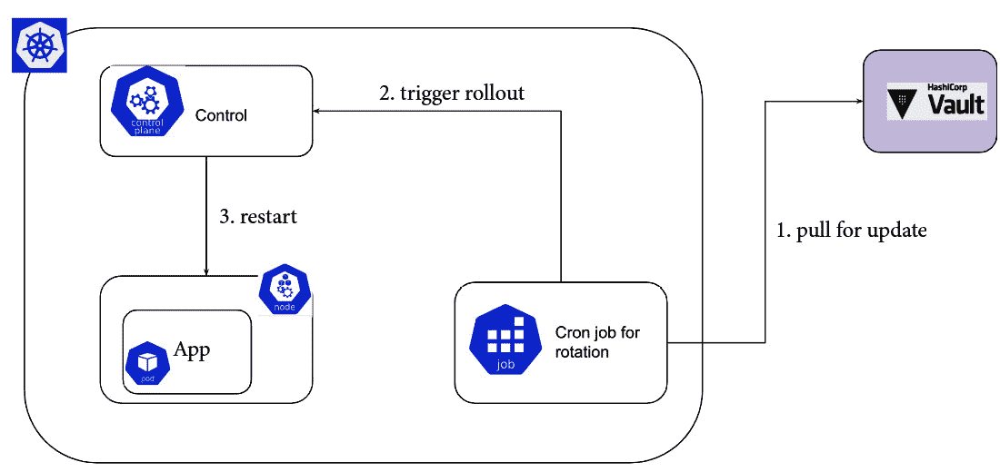

# 第十三章：案例研究与实际应用示例

在本章中，我们将展示 Kubernetes Secrets 在生产环境中的实际应用案例。本章将涵盖 Kubernetes 生产环境中 Secrets 管理的案例研究，并分享从实际部署中获得的经验教训。此外，您还将学习如何在 CI/CD 流水线中管理 Secrets，并将 Secrets 管理集成到 CI/CD 过程中。本章还将讲解如何使用 Kubernetes 工具管理流水线中的 Secrets，并介绍确保 CI/CD Secrets 管理安全的最佳实践。我们将扩展以下主题：

+   Kubernetes Secrets 在生产环境中的实际应用示例

+   从 CI/CD 角度的密钥管理

+   从实际部署中学到的经验

+   在 Kubernetes 生产系统中管理 Secrets 的生命周期

# 技术要求

为了将理论与实践结合起来，我们利用了一系列常用工具和平台，这些工具和平台通常用于与 Google Cloud API 和 Kubernetes 交互：

+   **gcloud CLI**：这是用于创建和管理 Google Cloud 资源的一套工具（[`cloud.google.com/sdk/gcloud#download_and_install_the`](https://cloud.google.com/sdk/gcloud#download_and_install_the)）

+   **kubectl**：这是用于通过 Kubernetes API 与 Kubernetes 集群通信的命令行工具（[`kubernetes.io/docs/reference/kubectl/`](https://kubernetes.io/docs/reference/kubectl/)）

+   **minikube**：这是一个本地 Kubernetes 发行版，用于 Kubernetes 学习和开发。要在系统上安装 minikube，可以按照官方文档中的指示操作（[`minikube.sigs.k8s.io/docs/start/`](https://minikube.sigs.k8s.io/docs/start/)）

+   `sealed-secrets` 在 Kubernetes 上的安装（[`github.com/bitnami-labs/sealed-secrets#kubeseal`](https://github.com/bitnami-labs/sealed-secrets#kubeseal)）

+   **argocd**：这是一个命令行工具，用于简化与 Argo CD 的交互（[`argo-cd.readthedocs.io/en/stable/cli_installation/`](https://argo-cd.readthedocs.io/en/stable/cli_installation/)）

# Kubernetes Secrets 在生产环境中的实际应用示例

到目前为止，我们已经看到了一些不同的 Kubernetes Secrets 管理方法。接下来，我们将查看一些在生产环境中如何管理 Secrets 的示例。我们将比较一些不同的方法，识别它们的差异，并分析它们的优缺点。

## 生产环境中密钥管理的特性

在生产环境中管理 Kubernetes Secrets 时，无论采取何种方式，都需要满足某些特性。这些特性使我们的生产部署更加可靠和安全。以下是这些特性：

+   高可用性

+   灾难恢复

+   加密

+   审计

让我们深入探讨每一个方法。

### 高可用性

Kubernetes 高可用；我们在 *第一章*《*理解 Kubernetes Secrets 管理*》中看到过这一点。存储在 Kubernetes 中的一个 Secret 会存储在 etcd 中，而 etcd 节点是 Kubernetes 集群的一部分。如果一个 etcd 节点出现故障，Secrets 仍然会保留在其他 etcd 节点上。这确保了 Kubernetes 会继续运行并且所有 Secrets 都能正常工作。最终，一旦丢失的 etcd 节点恢复，它将与其他节点一起恢复操作。高可用性确保了 Kubernetes 在节点丢失的情况下仍能保持稳定运行。除了节点的普通不可用外，高可用性还应解决数据中心宕机的风险。Kubernetes 集群的所有节点不应托管在同一个数据中心；相反，集群的节点应该分布在不同的数据中心中。如果失去对某个数据中心的连接，或者该数据中心出现问题，托管在其他数据中心的节点将能够继续工作。然而，我们可能会遇到更极端的情况，某些情况下，整个区域会变得无法连接，而不仅仅是某个节点或数据中心不可用。在这种情况下，能够在另一个区域执行灾难恢复变得至关重要。

### 灾难恢复

在 *第六章*《*灾难恢复与备份*》中，我们广泛讨论了灾难恢复。对于 Secrets，制定灾难恢复计划至关重要。从 Secrets 管理的角度来看，灾难恢复场景将根据管理 Secrets 的决策有所不同。Secrets 可以通过 Kubernetes etcd 或外部 Secret 存储进行管理。

#### 使用 etcd 的 Secret 存储

在 Kubernetes 集群中实施灾难恢复的方法将极大地影响通过 etcd 管理的 Secrets 的灾难恢复。

我们有以下几个选项：

+   在另一个区域按需创建的集群

+   在另一个区域的备用 Kubernetes 集群

+   多个区域的主动-主动 Kubernetes 集群

可以通过内部工具实现的选项，例如备份 etcd，或者使用如 Velero 之类的工具，可以在另一个区域按需创建集群。以云服务提供商 GCP 为例，您可以通过点击按钮复制 Kubernetes 集群。

在维护备用集群或主动-主动集群时，许多选择严重依赖于您在 Kubernetes 上执行部署的方式。CI/CD 非常重要。例如，对于您的备用集群能够正常运行，您的 CI/CD 作业可能需要将 Secrets 推送到两个集群。您还可以采用 GitOps 模型。在 GitOps 模型中，您可以利用诸如 Argo CD 的工具。在这些情况下，备用 Kubernetes 集群可以通过从 Git 存储库拉取更改来更新。这样，Secrets 就可以应用到可用集群上，而不需要直接将秘密更改推送到集群中。

当涉及到 Kubernetes 和灾难恢复时，有各种选项，正如我们在*第六章*，*灾难恢复和备份* 中所看到的那样。

#### 外部秘密存储

通过外部秘密存储，灾难恢复由秘密存储本身及其功能管理。我们检查的所有基于云的 Secrets 存储选项都支持跨区域可用性或跨区域复制选项。Azure Vault 和 Google Cloud Secret Manager 提供跨区域可用性，AWS Secrets Manager 提供跨区域复制。在 HashiCorp Vault Enterprise 中，还有跨区域复制选项。

### 加密

加密至关重要。我们深入研究了*第三章*，*以 Kubernetes 本地方式加密 Secrets*。在每个 Kubernetes 安装中，遵循磁盘存储以及 etcd Secrets 加密的加密是至关重要的。

### 审计

我们在*第五章*，*安全、审计和合规性* 中看到了为什么审计很重要以及为什么首先需要它。在我们所使用的每个云提供商中，审计选项始终存在。HashiCorp Vault 和 CyberArk Conjur 也提供了审计功能。

我们重点关注和概述了在生产环境中需要放置的 Secrets 管理的特性。接下来，我们将关注 Secrets 管理与 CI/CD 的结合以及需要避免的风险。

# 从 CI/CD 视角看 Secrets 管理

在 CI/CD 流水线中管理 Secrets 是一个有趣的概念。在之前的章节中，我们主要关注了基于 Git 的 Secrets 管理概念和基于 secret-storage 的 Secrets 管理。我们没有提到手动持久化 Secrets 到 Kubernetes。其中有许多原因：

+   您会失去对 Kubernetes 部署需求的跟踪

+   依赖关系不可见

+   没有清晰的应用描述

+   与基础设施即代码不兼容

接下来，我们将重点关注在我们的 CI/CD 流水线上与 Secrets 交互。

## 将 Secrets 管理集成到您的 CI/CD 流程中

根据管理 Secrets 所采用的方法，您的 CI/CD 策略将有显著差异。

### 基于 Git 的 Secrets 管理

通过基于 Git 的方法管理机密，CI/CD 应该能够与涉及的组件进行交互。

根据加密机制的不同，您需要在 CI/CD 账户中配置凭证，使其能够与加密凭证的 KMS 系统进行交互，或配置一个可以解密机密的 Kubernetes 服务账户。

让我们来看看封印机密的案例，这个概念我们在 *第十二章*，《与机密存储集成》中了解过，其中需要创建一个细粒度的 Kubernetes 角色和 Kubernetes 服务账户。原因在于封印操作发生在集群内部。封印后的机密可以存储在 Git 中。要检索实际的值，需要通过集群进行解密。封印操作也可以离线进行；在这种情况下，需要更多步骤来确保加密密钥的安全处理。

### 外部机密存储和 Workload Identity

到目前为止，我们已经使用了 Microsoft Azure Key Vault、Google Cloud Secret Manager 和 AWS Secrets Manager。它们都支持 Workload Identity 与 GitHub Actions 的集成。

在 CI/CD 流水线中与云组件交互的传统方式是将云提供商的凭证附加到 CI/CD 作业中。这种做法增加了安全风险。凭证，如服务账户或密钥机密，都是静态凭证；如果被泄露且没有适当的日志记录或审计系统，这些凭证可能会被长期使用，导致潜在的安全漏洞。

Workload Identity 是一种更安全的解决方案。通过 Workload Identity，我们可以为 CI/CD 作业分配精细化的权限，以便访问云组件。并不是所有的 CI/CD 提供商都支持 Workload Identity；然而，Workload Identity 方法的采用正在逐步增加，并预计将成为标准。

通过使用 Workload Identity，CI/CD 作业可以获得临时凭证与云提供商的机密存储进行交互。既然我们已经对 Workload Identity 有了初步了解，接下来我们将通过 GCP 实际演示。

#### GitHub Actions 和 GCP Workload Identity 集成

CI/CD 作业与云组件交互时的一个问题是权限问题。传统上，这个问题是通过将凭证上传到 CI/CD 作业变量来解决的，但这种解决方案带来了很多风险，我们将在本章后面讨论这些风险。

GitHub Actions 支持 **OpenID Connect** (**OIDC**) 。通过 OIDC，可以使用短期令牌在云提供商和 GitHub 之间进行身份验证。这样，我们就避免了在 GitHub 中存储长期有效的云机密。

在 *第十章*，《探索 GCP 上的云机密存储》中，我们将 GKE 集群与 GCP 的 Secret Manager 集成，因此我们已经对 GCP 这一平台有所了解。设想一下我们的 CI/CD 作业需要与已集成 GKE 的 Secret Manager 进行交互的场景。

如果没有 OIDC 的支持，我们将不得不将 GCP 服务帐户密钥存储在 CI/CD 作业中。得益于 OIDC，我们可以通过工作负载身份联合设置 GitHub 与 GCP 之间的身份验证。

首先，我们需要配置身份池：

```
$ gcloud iam workload-identity-pools create "ga-ksm-pool" --project="${GCP_PROJECT_ID}" --location="global" --display-name="GitHub actions Pool"
```

然后，我们将 GitHub 添加为身份提供者：

```
$ gcloud iam workload-identity-pools providers create-oidc "github" \
--project="${GCP_PROJECT_ID}" \
--location="global" \
--workload-identity-pool="ga-ksm-pool" \
--display-name="Github provider" \
--attribute-mapping="google.subject=assertion.sub,attribute.repository=assertion.repository" \
--issuer-uri="https://token.actions.githubusercontent.com"
```

身份池已配置，GitHub 是其中一个身份提供者。接下来的步骤是将 GCP 上的服务帐户与 GitHub 仓库绑定：

```
$ gcloud iam service-accounts create github-service-account --project="${GCP_PROJECT_ID}"
$ project_number=$(gcloud projects list --filter="$(gcloud config get-value project)" --format="value(PROJECT_NUMBER)")
$ gcloud secrets add-iam-policy-binding ksm-secret --member="serviceAccount:github-service-account@${GCP_PROJECT_ID}.iam.gserviceaccount.com" --role=roles/secretmanager.viewer
$ gcloud secrets add-iam-policy-binding ksm-secret --member="serviceAccount:github-service-account@${GCP_PROJECT_ID}.iam.gserviceaccount.com" --role=roles/secretmanager.secretAccessor
$ gcloud iam service-accounts add-iam-policy-binding "github-service-account@${GCP_PROJECT_ID}.iam.gserviceaccount.com" \
--project="${GCP_PROJECT_ID}" \
--role="roles/iam.workloadIdentityUser" \
--member="principalSet://iam.googleapis.com/projects/${project_number}/locations/global/workloadIdentityPools/ga-ksm-pool/attribute.repository/${github_organisation_or_username}/${github_repositoryname}"
```

通过此配置，我们允许来自工作负载身份提供者的身份验证来模拟所需的服务帐户。此外，注意当我们指定工作负载身份池为成员时，我们也指定了将托管需要 GCP 访问的操作的 GitHub 仓库。

我们已准备好继续进行 GitHub 作业配置：

```
name: Read from Secret Manager
on:
 push:
  branches:
   - 'main'
jobs:
 run:
  name: 'get secret'
  permissions:
   id-token: write
   contents: read
  runs-on: 'ubuntu-latest'
  steps:
  - id: 'auth'
    uses: 'google-github-actions/auth@v1'
    with:
      workload_identity_provider: 'projects/{project-id}/locations/global/workloadIdentityPools/ga-ksm-pool /providers/github'
      service_account: 'github-service-account@${GCP_PROJECT_ID}.iam.gserviceaccount.com'
  - id: fetch
    run: |-
      curl -H 'Bearer: ${{ steps.auth.outputs.access_token }}' https://secretmanager.googleapis.com/v1/projects/project-name/secrets/secret-name/versions/latest:access
```

在 GitHub Actions 控制台上，我们应该能够看到作业成功创建令牌并对创建的工作负载身份实例进行身份验证，同时从 Secret Manager 获取密钥。显然，这种身份验证方式也可以应用于我们与 GCP 交互时。

请注意，前述步骤故意打印了密钥，因为它们作为 GitHub Actions 与 GCP 工作负载身份集成的示例。你不应该在 CI/CD 控制台上打印任何检索到的密钥，如本章稍后提到的。

简而言之，通过利用工作负载身份，我们可以避免在 CI/CD 作业配置中存储长期有效的凭证。此外，我们与云提供商之间建立了无缝的集成，使得与云提供商组件（如 GCP 上的 Secret Manager）的交互更加简便。

### Vault 作为外部秘密存储

正如我们在 Vault 与 Kubernetes 集成中所看到的，交互 Vault 需要一个令牌。当我们使用长期有效的令牌时，可能会面临泄露的风险。为此，我们可以使用 GitHub OIDC 令牌来替代直接使用 Vault 令牌，采用 JWT 方法。

每个 GitHub Action 都会收到一个自动生成的 OIDC 令牌。我们可以使用 GitHub 的 OIDC 提供者来配置 GitHub Actions 工作流与 Vault 之间的信任。

一个类似的概念是 Kubernetes 身份验证。我们使用来自 Kubernetes 服务帐户的 JWT 来检索 Vault 中的密钥。由于 Vault 已经与我们的 Kubernetes 集群建立了信任，它可以验证密钥并返回凭证。

与 GitHub OIDC 提供者和 HashiCorp 集成时也发生了类似的过程。

### 在 Kubernetes 上执行 CI/CD 管道

另一种安全地将 CI/CD 管道与 Kubernetes 秘密存储集成的方法是将管道运行在 Kubernetes 内部。CI/CD 作业运行在 Kubernetes 内部，因此凭证和其他 Kubernetes 组件不会暴露到我们公司的外部。

许多主要的云服务提供商，如 GitHub Actions 和 GitLab，提供了在 GitHub 和 GitLab 上管理 CI/CD 管道编排的选项，但将 CI/CD 作业执行在 Kubernetes 内。采用这种方法有许多好处。

通过在本地运行 CI/CD 作业，你使得 CI/CD 作业能够与仅存在于本地的资源进行交互。例如，假设一个 HashiCorp Vault 安装在一个私有网络中，这个网络是不可公开访问的。为了将 Vault 实例与外部 CI/CD 提供商集成，我们必须使 Vault 实例可以公开访问，这就增加了我们的安全顾虑。

通过在本地运行管道，情况就不同了。在 Kubernetes 内运行 CI/CD 管道可以增强我们 CI/CD 管道的安全性。Tekton 是一个非常流行的开源框架，它使我们能够在 Kubernetes 环境中创建 CI/CD 系统。

接下来，我们来了解一种持续交付的方法，那就是通过 GitOps 模型。让我们通过使用 Argo CD 运行一个示例来看看 GitOps 模型是如何工作的。

#### GitOps

GitOps 是一套用于通过 Git 集中式方法管理基础设施和应用配置的实践。Argo CD 遵循 GitOps 模型。它监控我们指定的 Git 仓库，并确保应用程序处于所需的状态。Argo CD 是一个 Kubernetes 控制器，监控运行中的基础设施，并将其与 Git 仓库中指定的基础设施进行比较。

我们可以通过做一个简单的 Argo CD 安装来理解这个模型：

```
$ kubectl create namespace argocd
$ kubectl config set-context --current --namespace=argocd
$ kubectl apply -n argocd -f https://raw.githubusercontent.com/argoproj/argo-cd/v2.5.8/manifests/install.yaml
```

我们现在可以进行端口转发，以便与 Argo CD 交互，而无需通过入口暴露服务：

```
$ kubectl port-forward svc/argocd-server -n argocd 8080:443
```

在另一个会话中，我们可以检索默认的管理员自动生成的密码，以便登录到 `argocd`：

```
$ argocd admin initial-password -n argocd
$ argocd login 127.0.0.1:8080 --username admin --password ***-** --insecure
```

我们现在可以创建一个应用程序；我们将使用 Argo CD 仓库中的示例（[`github.com/argoproj/argocd-example-apps`](https://github.com/argoproj/argocd-example-apps)）：

```
$ argocd app create guestbook --repo https://github.com/argoproj/argocd-example-apps.git --path guestbook --dest-server https://kubernetes.default.svc --dest-namespace default
```

一个应用程序现在基于另一个 Git 仓库中的部署文件运行。

让我们来看看 GitOps 及其与我们到目前为止看到的 Secrets 管理方法的兼容性：

+   Sealed Secrets 可以得到支持，而无需额外的努力，因为 Sealed Secrets 控制器能够应用任何通过 Git 分发的新 Secrets。

+   由外部秘密存储驱动的解决方案不受影响，因为秘密信息存储在另一个组件中。

+   Helm Secrets 支持取决于用于 GitOps 的工具。Argo CD 可以支持 Helm Secrets；然而，它需要进行修改以便支持通过 Helm charts 分发的 Secrets 的加密和解密。

现在我们已经对 Secrets 管理和 CI/CD 有了概览，让我们继续讨论将 CI/CD 与 Secrets 集成所带来的风险。

## 在 CI/CD 管道中使用 Secrets 时需要避免的风险

当涉及到秘密时，CI/CD 流水线可能面临各种风险。配置错误的 CI/CD 流水线很容易导致泄露敏感信息、运行特权过高的流水线和供应链攻击等问题。

### 在流水线中泄露秘密

在流水线中泄露秘密比你想象的要容易得多。默认情况下，CI/CD 流水线会与其他配置变量区分对待秘密信息。例如，GitHub Actions 工作流。如果我们尝试在作业中打印一个秘密，秘密会被掩码，因此信息不会被泄露。这还不够。通过更改流水线的配置，我们可以将秘密值持久化到文件中。这样就可以打印文件并检索秘密信息。更糟糕的是，CI/CD 流水线会保留作业历史记录和日志。在某些情况下，历史记录无法被删除，或者会在一段时间后删除。

另一种泄露秘密的方式是将其作为 CI/CD 流水线生成的工件的一部分。在这种情况下，秘密可以通过 CI/CD 用户界面下载。

这些配置错误的流水线示例可能导致安全事件。秘密信息已经泄露，因此需要进行轮换。

### 生产秘密

另一个风险是将生产工作负载中使用的相同秘密与 CI/CD 流水线一起使用。生产环境中的秘密用于执行与 CI/CD 环境中的操作不同的操作。在 CI/CD 环境中使用生产秘密可能导致代码以比所需更高的权限运行，如果 CI/CD 配置错误，其使用可能会影响实际的生产系统。在秘密泄露的情况下，使用专门的秘密进行 CI/CD 作业的风险影响会更大。

### 恶意的贡献

CI/CD 可能成为攻击者窃取秘密的目标。触发流水线的仓库上的拉取请求为拉取请求作者提供了多种选项来获取秘密值。在这些情况下，保护与敏感信息交互的 CI/CD 作业至关重要。应该保护分支，并应将某些流水线进行隔离，以便实现细粒度的权限控制，并防止那些可能通过 CI/CD 作业试图检索秘密信息的人员访问。

在开源项目中，贡献可能旨在窃取秘密或成为供应链攻击尝试的一部分。我们以 GitHub Actions 为例，其中来自 Fork 的工作流无法访问秘密。此外，为了防止拉取请求中的滥用行为，GitHub Actions 提供了从公共 Fork 批准工作流运行的选项（[`docs.github.com/en/actions/managing-workflow-runs/approving-workflow-runs-from-public-forks`](https://docs.github.com/en/actions/managing-workflow-runs/approving-workflow-runs-from-public-forks)）。

### 不受信的软件

一个管道的安全性取决于用于实现它的软件。在互联网上，有各种各样的 CI/CD 软件工具，从库到 Docker 容器不等。这些软件组件可能是过时的，从而暴露管道于安全漏洞，或者其中一些可能已被攻击者攻破，目标是供应链攻击。

以一个 Jenkins 插件或 GitHub 工作流操作为例，它从管道中读取 Secrets 并将其发送到外部位置。任何不可信或甚至已被攻破的工具也可能发生类似情况。

只能使用来自可信源的软件，并且应验证其真实性，例如使用基于哈希的验证。同时，管道中使用的软件应为最新版本，并包含必要的安全补丁。

### 拥有额外权限的管道

CI/CD 对于每个需要构建、测试和发布软件的公司至关重要。由于其关键作用，它通常会与 Kubernetes 安装共享的 Secrets 进行交互。超出 CI/CD 作业范围的 Secrets 权限，在泄漏或配置错误的情况下，可能会导致严重事件的发生。

以一个用于测试的 CI/CD 作业与 Kubernetes 集群使用的外部密钥存储进行交互为例。假设该作业从密钥存储中删除 Secrets，目标是一个暂存环境。然而，分配给管道的权限足够广泛，允许它删除生产环境中的 Secrets。管道配置错误可能导致数据丢失，甚至生产环境宕机。

现在我们已经概述了与 Secrets 和 CI/CD 集成相关的风险，接下来让我们确定最佳实践。

## 安全 CI/CD Secrets 管理的最佳实践

我们概述了 CI/CD 作业与 Kubernetes Secrets 的交互。为了确保安全，我们需要遵循一些最佳实践：

+   不要提交明文的 Secrets

+   如果使用令牌，应定期更换令牌并使其具有短生命周期

+   如果可能，使用基于 OICD 的集成，因为它更加安全

+   将管道迁移到本地 Kubernetes 环境有助于增强安全性

+   应遵循最小权限原则

+   使用专用的 Secrets 进行测试

+   不要在测试和生产环境中使用相同的 Secrets

到目前为止，我们主要关注了如何在生产环境中处理 Kubernetes Secrets，以及 Kubernetes Secrets 与 CI/CD 的集成。接下来，我们将聚焦于一个在组织内实施 Secrets 管理系统的案例研究。

# 从实际部署中吸取的教训

现在让我们看看如何与 Kubernetes 上的 Secrets 进行交互，以及在与 Kubernetes 上的 Secrets 交互时，我们应该做什么和不应该做什么。

## 案例研究 – 开发 Secrets 管理

随着越来越多的组织采用容器编排，以下案例研究展示了在组织内部建立强大机密管理系统的过程。

## Square 的 Keywhiz 秘密管理系统

Keywhiz 是 Square 开发的一个系统，用于存储重要的数字密钥和密码，例如用于保护网站的密钥，确保它们安全并集中存放。这个系统非常有用，因为组织之前缺乏安全的方法来存储这些机密信息。Keywhiz 确保只有 Square 的正确部分在需要时才能访问这些机密，并通过安全的连接进行访问。

### 深入了解 Keywhiz 的机密管理系统

让我们深入了解 Keywhiz，看看 Square 是如何从头到尾构建这个系统的。

#### 商业正当性

Square 在构建 Keywhiz 时，设想重要的机密信息应该难以访问。它们不应该出现在任何人都能看到的地方，例如开发人员的计算机或互联网上。只有 Square 中需要这些机密的特定部分才能访问它们。对于使用安全连接保护数据的服务尤为重要。Square 的服务可以直接访问这些机密，而无需使用许多步骤或其他服务。即便是特殊情况，例如需要使用额外安全硬件时，Keywhiz 也有处理方法。

Keywhiz 还注重避免将过多的机密信息散布在各处，因为这可能带来风险。通过将所有机密信息集中在一个系统中，跟踪它们并确保其安全变得更加容易。此外，这个系统还允许 Square 检查其数字密钥和密码的健康状况，例如检查它们是否足够强大或是否需要尽快更换。

对 Square 来说，了解机密信息何时以及如何被使用是非常重要的。因此，Keywhiz 会详细记录每次机密被访问的情况。如果仅仅将机密信息存储在服务器上作为文件，是无法做到这一点的。虽然有一些工具可以帮助监控这些信息，但它们需要额外的设置工作。

Keywhiz 是为 Square 的许多不同服务而设计的。它已经被设置为处理各种需求，从保护网站到管理数据库。

该系统的可靠性至关重要。它必须始终有效，因为 Square 的服务依赖于这些机密信息来运行。

该系统还设计得易于使用。如果它不够易用，人们可能会尝试走捷径，这可能会降低安全性。

最后，Keywhiz 将密钥更换与软件更新的过程分开。这意味着 Square 可以在不更改整个系统的情况下更新其安全性，从而使系统更安全且更灵活。

#### 分类并集中存储机密信息

Square 的 Keywhiz 系统非常重视其数字机密的安全性。它首先将这些机密组织成明确的类别。这不仅仅是为了保持整洁——更重要的是，知道 Square 系统中的哪个部分需要哪些机密来操作。从此，所有机密都保存在一个中心位置。这意味着它们不会分散在不同的位置，以至于可能被遗忘，或者更糟糕的是，落入不当之手。

但是，Keywhiz 的亮点在于它如何锁定这些机密。在机密被保存在 Square 的数据库中之前，它会被加密层包裹——就像把一封信放入一个只有特定人员才能打开的保险箱。这涉及一种特定类型的加密，称为 **AES-GCM** （[`en.wikipedia.org/wiki/Galois/Counter_Mode`](https://en.wikipedia.org/wiki/Galois/Counter_Mode)）。它被 **国家标准与技术研究所** （**NIST**）在其《特别出版物 800-38D》中推荐为块密码（[`en.wikipedia.org/wiki/Block_cipher`](https://en.wikipedia.org/wiki/Block_cipher)）操作模式的首选方法，重点关注 **Galois/Counter Mode** （**GCM**）和 **Galois 消息认证码** （**GMAC**）。每个机密都有自己独特的加密密钥，该密钥通过一种叫做 **HKDF** （[`en.wikipedia.org/wiki/HKDF`](https://en.wikipedia.org/wiki/HKDF)）的方法创建，HKDF 是一种基于 HMAC 消息认证码的简单 **密钥派生函数**（**KDF**），它确保即使发现了一个密钥，其他密钥依然安全。Square 使用硬件安全模块来存储派生密钥。

现在，当涉及到传递这些机密时，Keywhiz 确保只有 Square 系统中的正确部分，即它们称之为 *客户端*，可以访问这些机密。访问控制的结构围绕三个关键元素：客户端、组和机密。“客户端”是指任何能够访问机密的证书。这些客户端可以属于多个组，组是客户端的集合。为了使客户端能够访问特定的机密，该机密必须与客户端所属的至少一个组相关联。通常，Keywhiz 通过创建三种主要类型的组来组织这一点：每个特定服务器上的每个服务一个组，每个独立服务一个组，以及包含所有客户端的通用组。

之前，人们尝试过其他方式来保护机密的安全，比如将其混入程序代码中，或手动添加到服务器中。但这些方式很有风险——机密可能不小心与外界共享，或者丢失。即使试图使用管理服务器设置的系统来保护机密也并不理想，因为这些系统的目的是在公司内部共享信息，这显然不是你想要的机密保护方式。

#### PKI 作为认证的真理来源

**公钥基础设施** (**PKI**) 是 Square 身份验证过程的核心。它就像一个验证系统，确保只有 Square 网络中的正确部分可以访问所需的秘密信息。为了建立这种信任，Square 使用 mTLS 和 X509 证书，后者是服务的数字身份验证凭证。Square 使用 **certstrap** 简化了这一任务，这是一个简单的证书管理工具。这个工具帮助 Square 创建自己的证书颁发机构，可以将其视为数字身份证明机构。通过 certstrap，Square 可以向其服务发放这些数字身份证，确保每个服务在其网络中得到识别和信任。

certstrap 使 Square 避免了传统工具（如 OpenSSL）的复杂性。它使 Square 能够创建一个信任链，其中每个服务的身份都得到了验证和保护。这种验证对 Square 至关重要，因为它保持了服务之间通信的安全，确保只有公司内部的授权实体可以访问秘密信息。

#### 授权数据模型

在 Square 的 Keywhiz 系统中，授权—决定谁可以访问什么—是一个结构化的过程。以下是 Square 设置的方法：

+   客户端是 Square 系统的组成部分，例如需要访问秘密信息以正常工作的服务或应用程序。它们通过所谓的客户端证书来证明自己的身份，就像系统的身份证。

+   秘密信息是客户端执行任务所需的敏感数据，例如配置文件或密码。每个秘密信息都有一个唯一的名称，避免混淆，并且一旦设置，就无法更改。然而，如果需要更新，Square 可以保留一个秘密的多个版本。

+   组作为客户端和秘密信息的交汇点。可以将组视为标签或标记。Square 用这些组标签标记客户端和秘密信息。当客户端和秘密信息拥有相同的组标签时，客户端就可以看到并使用该秘密信息。这是 Square 组织系统中哪些部分可以访问哪些秘密信息的方式。

+   用户是管理 Square Keywhiz 的人员。是他们设置系统并决定哪些客户端和秘密信息属于哪些组标签。他们通过安全的方法登录到 Keywhiz，并在登录后需要一个来自 Keywhiz 的特殊代码，以保持工作安全地继续进行。

Square 的 Keywhiz 通过结构化的授权模型管理访问权限，该模型涵盖客户端、秘密信息、组和用户管理，确保权限的安全与有序。

#### 秘密分发

Square 还维护一个名为 **Keysync** 的 Keywhiz 客户端实现。Keysync 是一个程序，它通过安全的方式连接到 Square 的 Keywhiz 服务器，并请求它需要的秘密信息，以保持 Square 服务的正常运行。它使用称为 **mTLS** 的技术进行安全通信，确保一切都安全和私密。

一旦 Keysync 获取了这些 Secrets，它会将其保存在服务器内存的安全区域，即**tmpfs**。这是一个临时空间，一旦服务器关闭，里面的内容不会保存。因此，如果发生停电或服务器需要重启，这些 Secrets 不会被遗留在可能被他人看到的地方。

Keysync 的巧妙之处在于它设计时就考虑到了应对突发问题。如果 Keywhiz 服务器出现问题，Keysync 仍然会保留它之前下载的 Secrets，因此 Square 的服务可以继续正常运行，直到进行完全的服务器重启，Keysync 才需要重新获取所有 Secrets。

为了处理这些 Secrets，Square 的管理员有一个管理员 CLI，允许他们直接在系统中输入命令，按需添加、删除或更改 Secrets。这是一种简便的方式，使他们能够保持系统的更新，并检查 Secrets 管理系统的健康状况，而不必通过复杂的界面进行操作。

Keysync，Square 的 Keywhiz 接口命令行工具，确保在不同场景下安全、机密地传递 Secrets。

### 从第三方视角来看，Keywhiz 的挑战和经验教训

考虑到 Keywhiz 已于 2023 年 9 月 18 日被弃用并停止维护，回顾它在服务期间所面临的挑战和所带来的经验教训，具有很大的启示意义。推荐转向 HashiCorp Vault，强调了需要一个强大且积极维护的 Secrets 管理解决方案。

#### Kubernetes 环境下的集中式管理很困难

Keywhiz 在 Kubernetes Secrets 管理中面临的核心挑战之一是，在像 Kubernetes 这样高度分布且动态的环境中，集中式管理本身的复杂性。Kubernetes 环境通常需要一种更加灵活和去中心化的 Secrets 管理方式。尽管 Keywhiz 提供了集中控制和强加密来保护 Secrets，但它可能没有针对 Kubernetes 工作负载的去中心化和短暂性质进行最佳配置。

例如，在 Kubernetes 中，必须有一个能够处理 Secrets 动态创建和删除的管理解决方案，这与 Kubernetes Pods 和 Services 的短暂特性相符。Kubernetes 中的 Secrets 管理还需要与 Kubernetes 的**基于角色的访问控制**（**RBAC**）紧密集成，并能够高效地跨多个集群和命名空间管理 Secrets。

虽然 Keywhiz 在集中式 Secrets 管理方面表现出色，提供强加密并安全地将 Secrets 分发到各种服务和平台，但将这些能力适配到 Kubernetes 的特性上可能会有挑战。Kubernetes 环境通常需要像 HashiCorp Vault 这样的工具，它提供了广泛的 Kubernetes 集成，包括动态 Secrets、与 Kubernetes 服务帐户的身份验证集成，以及为 Secrets 定义细粒度访问控制策略的能力。

#### 一个秘密管理系统不仅是一个系统，而是一个完整的生态系统

Keywhiz 在组织生态系统中的作用不仅仅是作为一个独立的秘密管理工具。其有效性在很大程度上依赖于与公司现有工作流程、政策和组织文化的集成。这个场景说明，秘密管理系统的效果不仅仅取决于其技术能力，还取决于它如何与组织的整体运营环境对接并提供支持。

例如，考虑一个采用 Keywhiz 来管理敏感数据的医疗保健组织，如患者记录和内部系统的登录凭证。在这种环境下，尽管 Keywhiz 作为这些秘密的存储库，但其有效性依赖于与组织现有医疗信息系统的无缝集成。这种集成可能涉及与员工目录服务同步，以便根据角色和部门管理访问权限。它还需要与医疗合规标准对接，在这种情况下，Keywhiz 的审计跟踪和加密功能对于满足监管要求至关重要。通过这种方式，Keywhiz 成为组织整体数据安全框架的一个不可或缺的部分，受到组织内外多种因素的影响。

#### 缺乏将审计作为故事的视角

Keywhiz 的一个显著局限性是它在审计方面的处理方式，特别是它如何处理秘密分发。Keysync 作为客户端工作，秘密被下载为 `tmpfs` 文件，然后由应用程序使用。然而，这种模式并没有本质上为每个操作提供详细的审计数据，具体来说，它缺乏对应用程序是否正在积极使用已下载秘密的可见性，因为这一互动发生在客户端，并且无法直接通过 Keywhiz 服务器观察到。

这可能导致审计过程中出现潜在的漏洞，例如以下几点：

+   确定访问秘密的具体用户或服务

+   记录每次访问的精确时间戳

+   理解访问的性质，例如是否读取或修改了秘密等

+   检测访问秘密的 IP 地址或机器

Keysync 过程无法满足与应用程序相关的秘密的实时需求，从而导致维护持续且全面的审计跟踪出现挑战。这一漏洞可能影响到全面记录组织内部秘密访问生命周期的能力，使得追踪所有与敏感数据的互动变得困难。

# 在 Kubernetes 生产集群中从头到尾管理秘密的生命周期

上一章涵盖了广泛的主题，但讨论的概念与在生产环境中管理秘密的实际例子之间存在明显的脱节。在本节中，我们将缩小焦点，深入探讨在 Kubernetes 生产集群中的秘密端到端管理，提供更具实践性、面向应用的视角。

在探索这种环境中秘密管理时，我们意识到这一过程不仅仅是安全存储。我们将关注点从单纯的存储库转向对整个系统生命周期中秘密使用的全面视角。秘密是运营流程的组成部分，嵌入到推动组织数字化运营的工作流中。

挑战在于有效管理整个秘密的生命周期，从创建到废弃，并严格强调精确性和安全性。这种全面的方法对于致力于高安全性和高运营标准的组织至关重要。有效管理秘密是了解它们的生成、分发、撤销和废弃在动态的 Kubernetes 生态系统中的过程。本节将引导你了解在维护安全高效的数字基础设施中，秘密管理所扮演的细致而重要的角色。

## 最终决定关于全面的秘密生命周期管理

在 Kubernetes 生产环境中管理秘密时，采用全面且系统的方法至关重要。秘密生命周期管理不仅仅是安全存储的一个方面，它涵盖了从最初的供应到最终的废弃和撤销的一系列关键过程。

配置涉及以安全和可控的方式创建或生成秘密，确保它们强大且唯一，并符合组织的安全政策。存储阶段需要一个强大且安全的存储库，例如 HashiCorp Vault 或云端秘密存储，确保秘密在静态时加密并保护免受未经授权的访问。分发是一个微妙的操作，秘密必须安全地传输到所需的服务或应用程序中，确保在传输过程中保持完整性和机密性。

废弃过程在秘密不再需要时发挥作用，必须有一个安全的流程将它们退役，确保它们不能被重新使用或被利用。最后，撤销是生命周期中的关键步骤，特别是在发生泄露或秘密完整性存疑的情况下。迅速有效的撤销机制确保立即切断访问，减轻潜在的损害。

采用全面的 Secrets 生命周期管理方法，确保 Secrets 不仅被安全存储，还能在整个生命周期中得到妥善管理。这种端到端的视角不仅是一种最佳实践，也是确保 Secrets 完整性以及整个生产系统完整性的组织需求。当我们在后续章节中深入探讨这些方面时，Kubernetes 中全面的 Secrets 管理方法的关键性将愈加明确，凸显其作为组织安全和运营环境中的关键组成部分的作用。

## 高 SLA 作为商业可持续性的关键

维持高 **服务水平协议** (**SLA**) 对于 Kubernetes 环境中的 Secrets 管理至关重要，强调系统的可靠性和可用性作为商业可持续性的基础性方面。这在生产环境中尤为重要，因为停机或安全漏洞可能会对财务和运营造成重大影响。

为了实现这一高可靠性，企业需要实施强大的监控和警报系统。定期对 Secrets 管理系统进行压力测试也至关重要，以识别和解决潜在的漏洞，确保系统能够应对各种操作压力，并保持其 SLA 承诺。

在云 Secrets 存储的背景下，服务提供商通常会提供符合大多数用例要求的承诺 SLA。然而，对于自部署的 Secrets 管理系统，需要采用不同的方法来评估和确保 SLA，尤其是在密钥检索对系统基础设施和平台使用至关重要时。

确保高 SLA 的一种策略是使用如 HashiCorp Vault 等解决方案中的主动-主动复制模型。该模型通过多个活动系统之间的持续同步，增强了容错性和可用性。然而，这并不是唯一的方法。

替代方法，如使用安全的 Redis 配置来缓存 Secrets，可以提供临时可用性（例如，持续几个小时），并提高平台的可靠性。在这种情况下，Secrets 被加密后以密文形式存储在 Redis 中，Redis 充当临时缓存。这种方法不仅确保了 Secrets 的安全性，还提供了额外的可靠性层，确保在关键时期或主要系统故障时，Secrets 能够保持可用。

总体而言，维持高 SLA 的方法应根据 Kubernetes 环境的具体需求和架构量身定制。

## 紧急恢复 - 备份和恢复

在 Kubernetes 生产集群中，为密钥管理制定有效的紧急恢复计划至关重要。一个强有力的恢复计划是迅速恢复操作的关键，能够在数据丢失、系统故障或安全事件发生时最小化停机时间。这种前瞻性的做法确保密钥管理系统能够迅速从意外中断中恢复，从而保持生产环境的连续性。

定期备份在保护密钥和配置的完整性及可用性方面发挥着至关重要的作用。这些备份为可靠的恢复机制奠定了基础，确保在遭遇数据丢失、硬件故障或安全漏洞后，能够可靠地恢复敏感信息和配置。

欲了解更多详细信息和见解，请参考 *第六章*，*灾难恢复* *与备份*。

## 不仅仅是存储密钥，而是配置密钥。

配置和存储密钥是管理 Kubernetes 环境中密钥的关键步骤，作为初始入口点，并为强制执行安全使用模型提供重要机会。通过控制密钥的来源并明确其目标资源，组织可以建立一个稳健的长期密钥管理框架。

在配置密钥时，确保透明性和可追溯性是至关重要的。强制执行清晰且标准化的密钥创建流程有助于追踪密钥的来源、预期用途和目标资源。这一做法有助于保持有序的密钥清单，简化日后管理和审计工作。

在 Kubernetes 中安全存储密钥时，采用最佳实践，如静态和传输加密、使用专用服务帐户和实施基于角色的访问控制至关重要。组织应充分利用 Kubernetes 的本地功能，如命名空间和网络策略，为密钥提供额外的隔离和保护层。

确保长远成功的密钥管理的一个关键方面是强制使用特定的密钥类型。Kubernetes 支持多种密钥类型，每种类型都针对特定的使用场景。通过强制使用这些类型，组织可以利用 Kubernetes 内建的验证机制，确保密钥符合预期结构，减少配置错误的风险。例如，强制使用 `kubernetes.io/dockerconfigjson` 类型来存储 Docker 注册表凭证，可以确保密钥内容符合预期格式，减少运行时错误的风险。

此外，利用特定类型的秘密有助于创建一个自描述且更易管理的环境。开发人员和管理员可以根据 Secrets 的类型轻松理解其目的和使用方式，从而提高整体清晰度并减少错误的可能性。这种做法还简化了审计和合规流程，因为在 Kubernetes 集群中追踪和报告不同类型 Secrets 的使用变得更加简单。

将这些实践融入到 Secrets 管理的供应和存储阶段，为安全高效的秘密处理奠定了坚实的基础。它确保 Secrets 的创建、存储和使用符合安全最佳实践，为安全、合规性和可管理性方面提供了显著的投资回报。通过执行明确的标准并利用 Kubernetes 的原生功能，组织可以创建一个强大而弹性的 Secrets 管理环境，能够安全高效地支持其应用程序。

## Secrets 轮换

Secrets 的轮换在维持安全的 Kubernetes 环境中至关重要，主要因为静态的、长期有效的凭证带来了固有的安全隐患。一旦 Secrets 被泄露，它们可能成为恶意实体的入口，导致未经授权的访问和潜在的数据泄露。为了减少这种风险，必须实施 Secrets 的定期轮换，确保即使一个秘密被泄露，其生命周期也会受到限制，从而减少可能造成的损害。

然而，轮换 Secrets 的任务并非没有挑战，尤其是在处理分布在各个服务中的大量 Secrets 时。此时，自动化便提供了一个精简高效的解决方案。通过利用自动化系统，组织可以确保按时进行轮换，符合最佳实践和合规要求。这些系统通过定期更新 Secrets 和凭证，分发更新版本到相应的服务，并确保将过时的 Secrets 安全地淘汰。

需要注意的是，虽然自动化在 Secrets 轮换中起着重要作用，但可能存在一些特殊情况，某些 Secrets 由于技术限制或特定用例而被豁免于轮换。在这种情况下，必须保持透明性和清晰的文档记录，标明这些 Secrets 的特殊情况以确保可见性。尽管如此，仍然必须具备强有力的事件响应计划，确保如果发生安全事件，这些豁免的 Secrets 可以及时轮换，从而减轻潜在风险并保障环境安全。这种全面的 Secrets 轮换方法不仅保证了 Secrets 本身的安全性，还确保了整个 Kubernetes 生态系统的韧性和完整性。

### 处理密钥更新和轮换

处理密钥更新和轮换是保持安全性的重要方面。正如 NIST 所推荐的，定期轮换密钥是减少安全风险的关键。

我们更新密钥的方法包括几种方式：

+   **监控和重载**：我们持续监控密钥的变化，将其更新到应用程序内存中，确保使用最新的值。

+   **密钥链模式**：这涉及维护多个版本的密钥，以防止停机。重要的是监控使用中的版本，并及时淘汰旧版本。

+   **重启作为重载方法**：实施一个自动系统，在密钥更改时重启 Pod，可能使用 Kubernetes 作业或其他工具来检测更改并启动重启。

每个应用程序的需求决定了选择的方法，重点关注以下几点：

+   **及时使用密钥**：根据服务器处理多个值的能力

+   **平滑密钥更改**：确保应用程序平稳管理新密钥，不丢失状态或导致停机。

+   **避免停机**：对于无法容忍停机的应用程序，使用多 Pod 副本和滚动更新等策略

+   **监控和警报**：保持一个强健的系统来监控密钥和 Pod，设有密钥轮换和 Pod 重启的警报

这一策略旨在同时确保安全性和操作效率，适应各种应用程序的密钥轮换需求。

### 用于自动密钥轮换的 Kubernetes 示例清单

以下是一个简化的示例，说明如何设置 Kubernetes 作业，以便在密钥轮换时触发 Pod 重启：

```
apiVersion: batch/v1
kind: Job
metadata:
  name: secret-rotator
spec:
  template:
    spec:
      containers:
      - name: secret-rotator
        image: user-implemented-rotator-image
        env:
        - name: VAULT_ADDR
          value: "http://vault:8200"
        - name: SECRET_PATH
          value: "secret/my-app"
        - name: KUBERNETES_NAMESPACE
          valueFrom:
            fieldRef:
              fieldPath: metadata.namespace
        - name: POD_SELECTOR
          value: "app=my-app"
      restartPolicy: Never
  backoffLimit: 0
```

这里是一个展示附加密钥轮换作业的图示：



图 13.1 – 密钥轮换的 Cron 作业

在这个例子中，作业运行一个容器，监视 Vault 中的密钥轮换，并在检测到轮换时重启 Kubernetes 中的相关 Pod。这确保受影响 Pod 的初始化容器再次运行，获取最新版本的密钥。通过采用这些策略，可以确保应用程序保持安全，使用最新的密钥，同时最小化停机并保持稳健且有弹性的部署。

## 授权泛滥问题

在 Kubernetes 中，管理对密钥的访问需要特别关注，因为涉及到微妙的平衡。

Kubernetes 中的**授权泛滥**问题发生在权限设置过于宽泛时，通常是无意间造成的，导致显著的安全风险。这通常出现在 RBAC 配置未充分定制的情况下，导致用户或服务获得超过必要的权限。

当然，像 Kubernetes RBAC 和与身份管理解决方案的集成等解决方案是众所周知的，但实际问题包括以下几点：

+   如何强制执行合规性并防止用户利用或规避配置源

+   如何有效监控并及时撤销任何政策违规行为

+   如何审计基于配置的访问策略更改并理解其影响

Kubernetes RBAC 中的典型配置错误可能会无意中允许意外的用户组访问所有 Secrets：

```
# serviceaccount.yaml
apiVersion: v1
kind: ServiceAccount
metadata:
  name: myapp-sa
---
# role.yaml
kind: Role
apiVersion: rbac.authorization.k8s.io/v1
metadata:
  name: myapp-role
rules:
  - apiGroups: [""]
    resources: ["pods", "secrets"]
    verbs: ["get", "watch", "list", "create", "update", "delete"]
---
# misconfigured-role-binding.yaml
kind: RoleBinding
apiVersion: rbac.authorization.k8s.io/v1
metadata:
  name: myapp-role-binding
roleRef:
  apiGroup: rbac.authorization.k8s.io
  kind: Role
  name: myapp-role
subjects:
  - kind: ServiceAccount
    name: myapp-sa
```

在此示例中，`myapp-sa`服务账户被创建时具有过于宽泛的 Pod 和 Secrets 访问权限。`myapp-role-binding`角色绑定通过引用`myapp-role`加剧了这一问题，`myapp-role`授予对这些资源的完全访问权限。因此，`myapp-sa`拥有超过必要权限的权限，存在未经授权访问敏感数据的风险。

解决这个问题需要实施细粒度的访问控制，精确地定义每个角色和用户的权限，遵循最小权限原则。这意味着仅授予用户执行特定任务所需的访问权限。定期审查和更新 RBAC 策略也是至关重要的。

## 客户端的标记、标签和屏蔽

在 Kubernetes 环境中，管理 Secrets 的方法应是整体性的，不仅要考虑 Secrets 如何存储，还要考虑它们在客户端如何管理和交互。在此背景下，标记、标签和屏蔽 Secrets 变得至关重要。采用这些实践的理由在于它们能够增强安全性、可管理性并遵守合规标准。通过标记和标签 Secrets，团队嵌入了关键的元数据，阐明了机密的目的、关联资源和生命周期阶段。这些元数据成为一项强大的工具，有助于实施精细的访问控制，并简化跨系统跟踪机密使用情况的过程。

在实施过程中，这些实践应无缝地集成到开发和部署工作流程中。应鼓励或甚至强制开发人员和操作人员在其部署配置中包含相关标签和标记，以确保每个机密从一开始就得到适当的注解。另一方面，屏蔽是指在日志或用户界面中遮蔽机密值，以防止意外暴露，这在调试场景中尤其常见。系统需要配置为自动识别和删除敏感信息，这一任务可以通过模式识别、校验和或在应用程序日志配置中明确标记敏感字段来实现。

从长远来看，这些实践的回报是巨大的。通过标记和标签提供的大量元数据促进了强大而持续的审计轨迹，使团队能够在较长时间内有效地追踪和管理机密。这不仅对日常操作的完整性至关重要，而且对于满足严格的安全性和合规性要求也至关重要。任何未经授权的访问或修改都可以迅速识别和纠正，确保组织的机密管理策略既安全又具有弹性。与此同时，掩码技术确保即使在日志或 UI 被暴露的情况下，机密值的机密性仍然得到保持，从而减少了意外暴露的风险。

通过采用这些客户端实践，组织为全面的机密管理策略奠定了基础，确保机密在其 Kubernetes 环境中被管理、追踪和保护。这种方法不仅增强了组织的安全态势，还确保其机密管理实践与行业最佳实践和合规标准相一致。

## 服务器端的审计和监控

在机密管理的服务器端，定期审计和强有力的监控在维护安全和合规的 Kubernetes 环境中发挥着至关重要的作用。审计作为一项必要的实践，确保所有与机密的交互——无论是访问、修改还是删除——都被细致地记录和审查。这一做法不仅对维护机密的完整性至关重要，还能够验证所有访问模式是否遵循既定的安全政策和合规要求。通过实施全面的审计，组织创建了安全的证据轨迹，促进了涉及敏感信息的所有操作的问责制和透明度。

要实现这种级别的监管，必须利用专为强大审计和监控量身定制的技术和工具。这包括实施能够提供实时警报和详细访问日志的解决方案，确保任何异常或未经授权的活动都能被及时检测和处理。像 Kubernetes 的审计日志以及 Prometheus 或 Grafana 等监控解决方案，可以被配置为在环境中无缝工作，为团队提供所需的可见性，以保障其机密。此外，将这些工具与现有的**安全信息和事件管理**（**SIEM**）系统集成，能够进一步增强组织对事件关联、模式识别以及迅速有效应对潜在威胁的能力。

一致性审计对于安全性和遵守法规的重要性，以及增强审计的策略和工具，确保了对机密访问和变更的适当监控。

## 确保安全的密钥分发

确保在 Kubernetes 环境中安全地分发密钥至关重要，因为不安全的做法可能导致严重的漏洞和安全漏洞。当密钥以明文形式存储时，无论是在主机的文件系统中还是在容器环境中，它们都容易受到未经授权的访问和潜在的滥用。如果攻击者获得了主机或容器的访问权限，他们就能轻松地检索并滥用这些密钥，这种漏洞尤为令人担忧。

理解并建立明确的安全边界对于缓解这些风险至关重要。组织必须采取主动立场，实施严格的控制措施并采用最小权限原则，以在发生安全事件时最小化爆炸半径。这种方法涉及限制密钥的访问，确保只有必要的人员可以访问，并且密钥不会不必要地暴露。

在密钥分发过程中建立信任链对于保持密钥的完整性和机密性至关重要。这涉及到在分发过程的每一个步骤中验证密钥的真实性和完整性，从它们生成或从密钥存储中检索的时刻开始，经过传输，最终到达预定的服务或应用程序进行使用。可以实施多种措施来确保这一信任链，包括在传输过程中使用加密技术、采用安全的密钥注入方法进行分发，并利用可信的平台和身份进行访问控制。

## 退役和撤销密钥

退役和撤销密钥是密钥生命周期管理的关键环节，确保过时、已泄露或其他不再需要的密钥被及时且安全地移除。实施退役最佳实践包括安全地退役密钥，并确保它们从密钥存储和可能存在的任何环境中彻底清除。这个过程必须彻底且系统化，以防止与残留密钥相关的潜在安全风险。

将密钥管理集成到更广泛的服务退役工作流中至关重要。当服务被退役或替换时，相关的密钥也应同时进行退役。这确保了一个协调一致、简化的过程，减少了疏漏和潜在安全漏洞的风险。通过将密钥考虑直接嵌入到服务退役过程中，组织可以加强一致性并遵守安全协议。

撤销协议在主动和被动的 Secrets 管理中都起着关键作用。主动管理中，Secrets 应按照预定义的计划或触发条件进行轮换和撤销，例如证书到期或服务生命周期结束。被动管理中，一旦发生安全事件或发现 Secrets 泄露，必须立即撤销以减轻风险并防止未经授权的访问。建立清晰高效的撤销协议能确保团队能够迅速响应，最大限度地减少安全漏洞的潜在影响。

这些实践共同加强了 Secrets 管理生命周期，确保 Secrets 不仅在生成和使用过程中保持安全，同时在退役和撤销时也保持同样的谨慎。这种全面的方法提升了 Kubernetes 环境的整体安全态势，保护敏感信息并维护生产系统的完整性。

## 责任、值班支持、渗透测试和风险评估

在 Kubernetes 生产环境中有效管理 Secrets，需要明确划分责任、健全的值班支持结构，并通过渗透测试和风险评估持续致力于安全性。

### 责任与值班支持

管理部署平台的团队必须明确划分并分配与 Secrets 分发和 Secrets 存储管理相关的责任。这不仅包括 Secrets 的初始设置和分发，还包括其持续管理、更新和轮换。值班责任是这一过程的关键组成部分，确保始终有具备专业知识和能力的团队成员可以应对可能出现的问题，从访问问题、配置错误到潜在的安全事件。这些团队成员必须熟练掌握 Secrets 管理工具的配置和调试工作，以及更广泛的 Kubernetes 环境，以有效地处理和解决事件。此外，他们还应积极参与系统的增强工作，不断提升系统的稳定性、安全性和效率。

### 渗透测试与风险评估

定期对生产环境中的 Secrets 存储进行渗透测试至关重要，能够识别和减轻潜在的安全风险。这种主动的安全方法有助于发现漏洞，评估访问策略的健壮性，并评估 Secrets 可能被暴露的路径。这些渗透测试的结果应直接纳入组织的更广泛风险评估工作中，帮助全面了解系统的安全态势，并为风险减缓提供有依据的决策指导。

渗透测试不应是一次性的努力，而应是一个持续的实践，不断演进，以应对新出现的威胁和漏洞。它应涵盖 Secrets 管理生命周期的各个方面，从 Secrets 的初步配置，到它们的存储、分发，直至最终的退役。

通过将这些实践整合到组织的整体风险评估框架中，团队可以确保不仅解决了当前的威胁，还建立了一个能够应对未来挑战的弹性系统。对责任、值班支持、渗透测试和风险评估的全面方法，是在 Kubernetes 生产环境中维持安全高效的 Secrets 管理框架的关键组成部分。

# 总结

在本章中，我们深入探讨了在生产集群中管理 Kubernetes Secrets 的复杂性。我们强调了有效的 Secrets 管理所需的品质，并审视了各种部署策略及其与 CI/CD 流程的整合。此外，我们还通过一个关于 Keywhiz 的详细案例研究，全面理解了 Secrets 管理的发展，强调了涵盖 Secrets 管理整个生命周期的整体方法。

下一章将总结我们在本书中获得的见解和知识，并对 Kubernetes Secrets 管理的演变及未来趋势提供前瞻性视角。
