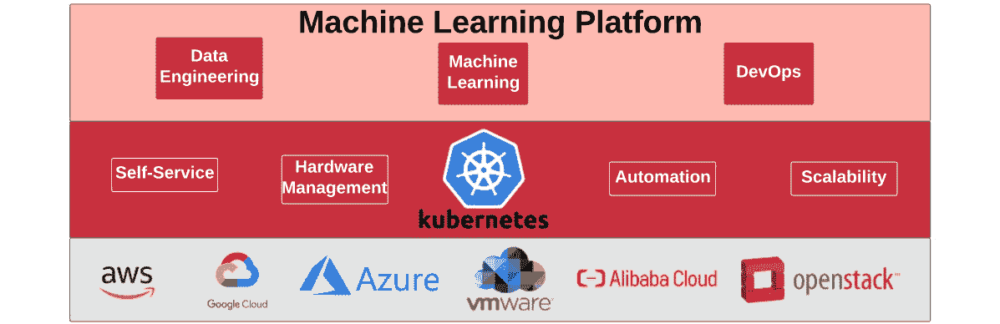

# *第二章*：理解 MLOps

大多数软件工程背景的人都知道**开发运维**（**DevOps**）这个术语。对我们来说，DevOps 是关于在**软件开发生命周期**（**SDLC**）中跨不同团队之间进行协作和共享责任。这些团队不仅限于少数**信息技术**（**IT**）团队，而是涉及到项目中的所有利益相关者。不再区分软件构建（开发者的责任）和在生产环境中运行它（运维的责任）。相反，团队共同*拥有*产品。DevOps 之所以流行，是因为它帮助团队提高了正在开发的软件的速度和可靠性。

在本章中，我们将涵盖以下主题：

+   将**机器学习**（**ML**）与传统编程进行比较

+   探讨 DevOps 的好处

+   理解**ML 运维**（**MLOps**）

+   **开源软件**（**OSS**）在 ML 项目中的作用

+   在 Kubernetes 上运行 ML 项目

在我们可以将 DevOps 应用于 ML 项目之前，我们必须首先了解传统软件开发和 ML 开发过程之间的区别。

# 将 ML 与传统编程进行比较

与传统应用程序开发类似，ML 项目也是一个软件项目，但它们在交付方式上有根本性的区别。让我们了解一下 ML 项目与传统软件应用程序的不同之处。

在传统软件应用程序中，软件开发人员编写一个程序，其中包含一组明确定义的手工制作的规则。在运行时或预测时，构建的软件将这些明确定义的规则应用于给定的数据，程序的输出是基于编码规则计算得出的结果。

下图显示了传统软件应用程序的**输入和输出**（**I/Os**）：

图 2.1 – 传统软件开发

在 ML 项目中，规则或模式并非完全已知，因此我们无法像在传统编程中那样在代码中明确描述规则。在 ML 中，有一个过程可以根据给定的数据样本对和其关联的预期结果提取规则。这个过程称为**模型训练**。在模型训练过程中，选择的 ML 算法根据给定的数据和验证的答案计算规则。这个过程的输出是**ML 模型**。生成的模型随后可用于在预测时推断答案。与传统软件开发不同的是，我们不使用明确编写的规则，而是使用生成的 ML 模型来获得结果。

下图显示了在训练时生成的 ML 模型，然后在预测时用于产生答案或结果：

图 2.2 – ML 开发

尽管传统软件开发和机器学习在本质上是不同的，但这两种方法的工程过程之间存在一些协同效应。考虑到传统软件开发在当今时代非常成熟，我们可以将其中的经验教训应用到我们的机器学习项目中。当然，最主要的是，传统编程和机器学习都属于软件开发。我们在传统领域中应用于构建软件的所有流程——例如版本控制、将软件打包成容器、自动化部署等——也可以应用到机器学习项目中。然而，我们也必须考虑到机器学习中额外的过程，如模型训练。

那么，为什么我们在机器学习项目中真的需要 DevOps 呢？它能带来什么好处？我们将在下一节中探讨这个问题。

# 探索 DevOps 的好处

DevOps 不仅仅是关于工具集。假设你有一个可以为你运行单元测试的工具。然而，如果团队没有编写测试用例的文化，那么这个工具就不会有任何用处。DevOps 关注的是我们如何在跨团队的任务上协作。所以，DevOps 需要专注的三个主要领域是：

+   **人员**：来自多个学科的团队，旨在实现共同目标

+   **过程**：团队合作的方式

+   **技术**：促进不同团队间协作的工具

DevOps 基于敏捷开发实践，旨在简化软件开发过程。DevOps 团队是跨职能的，并且拥有通过**持续集成/持续交付**（**CI/CD**）来构建软件的自主权。DevOps 鼓励团队通过快速反馈回路进行协作，以提高开发软件的效率和质量。

下图展示了传统软件开发项目中完整的 DevOps 生命周期：

图 2.3 – 展示 DevOps 过程的莫比乌斯环

通过 DevOps，团队可以拥有明确且简化的开发实践，用于构建、测试、部署和监控生产中的软件。所有这些都使得能够快速且可靠地将软件发布到生产环境中。以下是 DevOps 实践带来的一些好处：

+   **CI/CD**：CI 是一个阶段，软件在开发者将其推送到代码库时即进行合并和验证。CD 是一系列阶段，通过这些阶段，软件被构建、测试，并打包成准备部署的形式。**持续部署**（也称为 **CD**）是一个阶段，在这个阶段，准备部署的代码被选中并部署，以供最终用户使用。在 DevOps 中，所有这些流程都是自动化的。

+   **基础设施即代码**（**IaC**）：IaC 是一种自动化 IT 基础设施配置和供应的方法。这一方面使得团队可以根据需求随时请求并配置基础设施。想象一下，团队中的数据科学家需要一个 **图形处理单元**（**GPU**）来进行模型训练。如果我们遵循 IaC 的配置和供应实践，那么系统可以自动完成对 GPU 的请求。接下来的章节中，你将看到这一能力的实际应用。

+   **可观察性**：可观察性与我们如何理解正在运行系统的状态有关。DevOps 通过联邦日志记录来自不同组件的日志、监控系统（例如 **中央处理单元**（**CPU**）、内存、响应时间等），并通过调用追踪提供一种将系统的各个部分关联起来的方式，从而使系统可观察。所有这些能力共同为理解系统状态提供基础，帮助调试任何问题，而不需要修改代码。

+   **团队协作**：DevOps 不仅仅是关于技术。事实上，团队的关键关注点是协作。协作是指来自不同团队的多个个体共同朝着一个共同目标努力。业务、开发和运维团队的合作是 DevOps 的核心。对于基于 ML 的项目，团队中除了上述角色外，还会有数据科学家和数据工程师。由于团队成员的多样性，沟通对于构建集体理解和对既定结果的共同责任感至关重要。

那么，我们如何将 DevOps 方法的优势带入到 ML 项目中呢？答案就是 MLOps。

# 理解 MLOps

**MLOps** 是一个新兴领域，它利用了现有软件开发流程的成熟性——换句话说，就是将 DevOps 与数据工程和 ML 学科结合起来。MLOps 可以简化为将 DevOps 应用于 ML 项目的工程实践。让我们更详细地了解这些学科如何构成 MLOps 的基础。

## ML

ML 项目涉及一些传统编程中没有的活动。你在 *图 2.3* 中学习到，ML 项目中大部分的工作并不是模型开发，而是更多的数据收集与处理、数据分析、**特征工程**（**FE**）、过程管理、数据分析、模型服务等。实际上，根据 D. Sculley 等人的论文 *Hidden Technical Debt in Machine Learning Systems*，只有 5% 的工作是 ML 模型开发。因此，MLOps 不仅关注 ML 模型的开发任务，更多的是聚焦于大局——整个 ML 项目生命周期。

就像 DevOps 一样，MLOps 也关注人、流程和技术。但 MLOps 有一些复杂性是 DevOps 不需要处理的。我们在这里更详细地了解这些复杂性：

+   首先，与传统编程不同，你的输入不仅是代码，还包括数据。在 ML 中，模型开发阶段生成的 ML 模型高度依赖于数据。这意味着即使你没有改变代码，如果使用不同的数据集训练 ML 算法，生成的 ML 模型将不同，并且性能也会有所不同。在**版本控制**方面，这意味着不仅需要版本化促进模型训练的代码，还需要版本化数据。由于数据量巨大，数据版本控制相对较难。解决这个问题的一种方法是使用 Git 跟踪数据集版本，使用数据哈希存储实际数据在远程存储（如**简单存储服务**（**S3**）桶）中。一个名为**数据版本控制**（**DVC**）的开源工具可以做到这一点。

+   其次，在 ML 项目中涉及更多人物角色，需要*更多的协作*。你有数据科学家、ML 工程师和数据工程师与软件工程师、业务分析师和运营团队合作。有时，这些角色非常多样化。一个数据科学家可能完全不理解什么是真正的生产部署。另一方面，运营人员（有时甚至是软件工程师）不了解什么是 ML 模型。这使得在 ML 项目中进行协作比传统软件项目更加复杂。

+   第三，增加模型开发阶段为生命周期添加了更多的转折点。这使得整个过程变得更加复杂。与传统软件开发不同，你只需开发一组可工作的代码。在 ML 中，数据科学家或 ML 工程师可能会使用多个 ML 算法并生成多个 ML 模型，因为只有一个模型将被选中部署到生产环境中，这些模型将根据性能与其他模型属性进行比较。MLOps 适应了这种复杂的*测试、比较和选择模型*的工作流程。

传统编码生成可执行二进制文件通常需要几秒到几分钟。然而，*训练 ML 算法生成 ML 模型可能需要几个小时或几天*，有时甚至使用某些**深度学习**（**DL**）算法时可能需要几周。这使得建立敏捷的迭代时间限制节奏稍显复杂。MLOps 团队需要处理工作流中的这种延迟，一种方法是在等待其他模型完全训练完成时开始构建另一个模型。如果数据科学家或 ML 工程师在他们自己的笔记本电脑上训练他们的 ML 算法，这是非常难以实现的。这就是可扩展基础设施的用武之地。

+   最后，由于 ML 模型的性能依赖于训练过程中使用的数据，如果这些数据不再代表现实世界的情况，模型的准确性将会下降，从而导致预测性能变差。这被称为**模型漂移**，并且需要尽早检测。通常，这会作为 ML 项目生命周期监控过程的一部分进行。除了在生产中收集的传统指标外，使用 ML 模型时，你还需要监控模型漂移和异常值。然而，异常值检测的实现要困难得多，有时需要你训练并构建另一个 ML 模型。**异常值检测**是关于检测生产中进入的数据，这些数据与模型训练时使用的数据不相符：你不希望你的模型给出与这些无关问题的无关答案。另一个原因是，这可能是一次攻击或滥用系统的尝试。一旦你检测到模型漂移或异常值，你打算如何处理这些信息？这可能仅仅是触发警报，或者可能会触发其他自动化流程。

由于与传统编程相比，ML 增加了复杂性，因此必须解决这些复杂性，促使了 MLOps 的出现。

## DevOps

在部署方面，想一想你在 ML 项目中编写的所有代码：执行数据处理的代码、促进模型训练和前端工程的代码、运行模型推理的代码以及执行模型漂移和异常值检测的代码。这些代码集需要构建、打包并部署以便大规模使用。一旦这些代码在生产环境中运行，它们还需要被监控和维护。这就是 DevOps 的 CI/CD 实践发挥作用的地方。自动化软件打包、测试、安全、部署和监控的实践源自 DevOps。

### 数据工程

每个 ML 项目都涉及到**数据工程**，而且 ML 项目处理的数据远比代码要多。因此，确保你的基础设施包括数据处理能力，并且能够与组织中现有的数据工程管道集成，是强制性的。

数据工程是一个庞大的主题—可以写一本书来讲述它。但我们在这里想强调的是，MLOps 与数据工程实践交叉，特别是在**数据摄取**、**数据清洗**、**数据转换**和**大数据测试**方面。事实上，你的 ML 项目可能只是一个小型的 ML 分类模型，它是一个更大数据工程或数据分析项目的子部分。MLOps 采纳了数据工程和分析中的最佳实践。

以下图表展示了 MLOps 的表示：

图 2.4 – MLOps 作为 ML、数据工程和 DevOps 的交集

用另一种方式来说，MLOps，如*图 2.4*所示，是**ML**、**DevOps**和**数据工程**学科的融合，专注于在生产环境中运行 ML。它还涉及将 ML 项目封装在一个高度可扩展、可靠且可观测的基础设施中。最后，它还涉及为团队建立可重复的流程，以执行成功交付 ML 项目所需的任务，如*图 2.4*所示，同时支持团队之间的协作。

有了对 MLOps 的基本理解后，让我们更深入地探讨 ML 项目生命周期。我们将从定义 ML 项目的一般阶段开始。

## ML 项目生命周期

与 DevOps 类似，DevOps 提供了一系列活动，可以在 DevOps 周期中执行，你可以在*图 2.5*中看到一系列步骤，这些步骤可用于将你的 ML 项目从开始到结束。这些步骤或阶段将成为 ML 项目生命周期的一部分，并提供一种一致的方式将 ML 项目投入生产。你在本书中构建的 ML 平台是允许你实现这个流程的生态系统。在本书的后续章节中，你将使用这个流程作为平台的基础。ML 项目的各个阶段总结如下：

图 2.5 - 一个 ML 项目生命周期

以下是前面图表中呈现的每个阶段的定义：

+   **编码问题并定义成功指标**：在这个阶段，团队评估给定的业务问题是否可以通过 ML 来解决。请注意这里的“团队”一词，团队至少包括数据科学家和业务**领域专家**（**SME**）。团队将定义一个成功标准，以评估模型的预测结果。

+   **获取、清洗和标注数据**：在这个阶段，团队评估是否有可用的数据来训练模型。团队将扮演额外的角色——数据工程师，帮助推动项目在这一阶段及其后的进展。团队将构建组件，从各种来源获取数据，清洗获取的数据，可能会标注数据并存储它。这些数据将构成 ML 活动的基础。

+   **FE**：FE 是指将原始数据转化为与给定问题更相关的特征。假设你正在构建一个模型，用来预测任何给定的*泰坦尼克号*乘客是否会生还。假设你得到的数据集包含了乘客的票号。你认为票号与乘客的生还有关系吗？一位业务领域专家（SME）可能会提到，票号可能能提供乘客所在舱位的信息，而头等舱的乘客可能更容易获得船上的救生艇。

+   **模型构建和调优**：在这个阶段，团队开始尝试不同的模型和不同的超参数。团队会将模型与给定的数据集进行测试，并比较每次迭代的结果。然后，团队会根据给定的成功指标确定最佳模型，并将该模型存储在模型注册表中。

+   **模型验证**：在这个阶段，团队使用一个在训练时无法获取的新数据集来验证模型。这个阶段至关重要，因为它**决定**了模型是否足够泛化以应对未见过的数据，或者模型只在训练数据上表现良好，而无法处理未见过的数据——换句话说，就是避免**过拟合**。模型验证还包括识别**模型偏差**。

+   **模型部署**：在这个阶段，团队从模型注册表中选取模型，将其打包并部署以供使用。传统的 DevOps 流程可以在这里使用，将模型作为服务提供。在本书中，我们将专注于**模型即服务**（**MaaS**），即将模型作为**表现性状态转移**（**REST**）服务提供。然而，在某些情况下，模型可以作为库打包，供其他应用程序使用。

+   **监控和验证**：在这个阶段，模型将持续监控响应时间、预测的准确性，以及输入数据是否与模型训练时的数据相似。我们简要介绍了异常值检测。在实践中，它的运作方式是这样的：假设你已经为公共交通系统的高峰时段空车率训练了一个模型，且模型训练时的数据是市民使用公共交通系统超过一年的数据。数据会存在周末、公共假期和其他事件的变化。现在，假设由于 COVID-19 封锁，所有人都不允许使用公共交通系统。现实世界与我们模型训练时的数据**不同**。自然地，我们的模型在这种变化的世界中并不是特别有用。我们需要检测这种异常并生成警报，以便在可能的情况下，我们能够使用新的数据集重新训练模型。

你刚刚了解了机器学习项目生命周期的各个阶段。尽管这些阶段看起来很简单，但在现实世界中，确实有一些很好的理由在某些情况下需要回到之前的阶段。

## 快速反馈循环

一个敏锐的观察者可能已经注意到，在第一章中我们展示的敏捷和跨职能团队的一个关键特征，在本章目前展示的阶段中并没有出现。现代 DevOps 的核心就是快速反馈循环，以便在项目生命周期的早期进行调整。这个概念将为机器学习项目带来更多的价值，因为机器学习项目比传统的软件应用程序更为复杂。

让我们看看在哪些阶段可以评估和衡量团队的进展。评估后，团队可以决定通过回到早期阶段进行调整，或继续推进到下一个阶段。

下图展示了带有各个阶段反馈检查点的机器学习项目生命周期，用绿色箭头表示：

图 2.6 – 带有反馈检查点的机器学习项目生命周期

让我们在这里更详细地看看：

+   **数据摄取、清理和标注阶段的检查点**：在完成*第一阶段*后，你已经开始按第二阶段的定义处理数据。你可能会发现实际数据不完整或不正确。你可以根据这些反馈改进对数据的理解，并可能需要重新定义项目的成功标准，或者在最坏的情况下，由于所需的数据不可用而停止项目。在许多场景中，团队会寻找额外的数据来源来填补第二阶段中识别的数据空白。

+   **模型构建与调优阶段的检查点**：在这个阶段，团队可能会发现用于训练模型的特征不足以获得预期的指标。此时，团队可能会决定花更多时间寻找新特征，或者重新审视原始数据，以确定是否需要更多数据。

+   **模型验证阶段的检查点**：在这个阶段，模型将针对一个模型从未见过的新数据集进行验证。此时指标较差可能会触发模型的调优，或者你也可以决定回去寻找更多特征，以提升模型的性能。

+   **模型监控与验证阶段的检查点**：一旦模型进入生产阶段，就必须持续监控，以验证模型是否仍然与现实世界和变化中的世界相关。你需要找出模型是否仍然有效，如果无效，如何使模型变得更有用。这个结果可能会触发生命周期中的其他任何阶段；正如在*图 2.6*中所看到的，你可能最终会使用新数据重新训练现有模型，或者完全换用不同的模型，甚至重新思考是否应该用机器学习来解决这个问题。没有确定的答案能告诉你最终会到哪个阶段，就像现实世界一样，它是不可预测的。然而，重要的是具备重新评估和重新审视的能力，并持续为业务创造价值。

你已经看到了机器学习项目生命周期的各个阶段以及从这些阶段获得的反馈检查点，决定是否继续推进到下一个阶段或返回上一个阶段。现在，让我们来看看每个阶段涉及的角色以及他们的合作点。

## 在项目生命周期中的协作

我们已经定义了构建模型的简化流程。让我们尝试定义一个多角色、多能力的团队如何协作完成这个模型。回顾上一章，构建模型需要不同团队成员的共同努力，每个团队成员拥有不同的能力。值得注意的是，在小型项目中，可能同一个人同时扮演不同的角色。例如，在一个小项目中，同一个人既可以是数据科学家，也可以是数据工程师。

以下图表展示了一个带有反馈点和角色重叠的 ML 项目生命周期图：

图 2.7 – 一个包含反馈检查点和团队角色的 ML 项目生命周期

你们组织中的 ML 项目在第一阶段需要数据科学家与业务领域专家（SMEs）之间的协作。设想一下，团队希望根据一张图片预测某种皮肤病的概率。

+   在这个阶段，数据科学家和医生（在此案例中的业务领域专家）之间需要进行协作，以定义问题和性能指标。没有这种合作，项目将无法成功。

+   在第二阶段——数据摄取和清洗阶段——数据工程师需要与业务领域专家合作，了解哪些数据是可用的，并如何正确地清洗和标注数据。业务领域专家在这个阶段带来的知识至关重要，因为这将负责创建一个有用的数据集，以供后续阶段使用。

+   在第三阶段，数据科学家、数据工程师和业务领域专家将协作处理第二阶段的基础数据，提取有用的特征。数据科学家和业务领域专家将提供有关可以提取哪些数据的指导，数据工程师将编写处理逻辑来实现这一目标。

+   在第四和第五阶段，大部分工作将由数据科学家完成，以根据给定标准构建和调整模型。然而，根据模型是否达到了定义的指标，团队可能会决定返回到任何一个先前的阶段，以提高模型的性能。

一旦模型构建完成，DevOps 团队的专家可以对模型进行打包、版本管理，并将其部署到正确的环境中。

+   最后阶段至关重要：团队利用可观察性功能来监控模型在生产环境中的性能。在监控了模型在实际环境中的表现后，团队可以根据反馈决定是否返回任何前阶段，以使模型对业务更有价值。

现在你已经很好地理解了我们所提到的挑战，以及如何通过机器学习生命周期克服这些挑战，接下来的阶段是要有一个支持这一生命周期的平台，同时为大图中的每个组件提供解决方案（请参见*第一章*，*机器学习中的挑战*），并具备自服务和自动化能力。与开源社区合作，开始这段旅程，还有什么比这更好的方式呢？

# 开源软件在机器学习项目中的角色

现在你已经清楚地了解了机器学习平台需要解决的问题，接下来我们来看一下为什么开源是最好的起点。我们应该从一些定义开始，以便打好基础，对吧？

免费的开源软件（OSS）是指*用户有自由运行、复制、分发、研究、修改和改进软件*的地方。

开源软件

想了解更多关于开源软件的信息，请参阅以下链接：

[`www.gnu.org/philosophy/free-sw.html`](https://www.gnu.org/philosophy/free-sw.html)

开源无处不在。Linux 是最常见的操作系统，运行在数据中心并支持全球云计算。Apache Spark 和相关的开源技术是大数据革命的基础，帮助众多组织实现其目标。基于开源的**人工智能**（**AI**）技术，如 TensorFlow 和 MLflow，处于 AI 发展的前沿，并被成百上千的组织所使用。开源的容器编排平台 Kubernetes 已经成为容器平台的事实标准。

计算领域的顶级玩家——如亚马逊、苹果、Facebook、谷歌、微软和红帽等——已经为主要开源项目做出贡献并拥有这些项目，而且新的参与者也不断加入。全球各地的企业和政府每天都依赖开源软件来支持关键任务和高可扩展的系统。

云计算领域最成功的开源项目之一就是**Kubernetes**。Kubernetes 成立于 2014 年中期，2015 年中期发布了它的 1.0 版本。自那时以来，它已成为容器编排的事实标准。

此外，**云原生计算基金会**（**CNCF**）是由*Linux 基金会*创建的，使命是让云计算无处不在。CNCF 通过汇集世界顶级工程师、开发者、终端用户和供应商来实现这一目标。它们还举办世界上最大的开源会议。基金会的创建使用了**Kubernetes**作为种子项目。正是通过这个项目，Kubernetes 设定了**云原生**的标准定义。截至本文撰写时，基金会已经有 741 个会员组织，130 个认证的 Kubernetes 发行版和平台，并且已经毕业了 16 个非常成功的开源项目。当然，其中包括**Kubernetes**，还有**Operator Framework**，你将在下一章了解更多关于它的内容。

在**大数据**和**云计算**爆炸式发展的之前，机器学习（ML）项目主要是学术性质的。它们很少走出高校的范围，但这并不意味着人工智能（AI）、机器学习（ML）和**数据科学**没有向前发展。学术界实际上已经创造了数百个开源的 Python 库，用于数学、科学和统计计算。这些库已经成为现代机器学习框架的基础。目前最流行的机器学习框架——TensorFlow、PyTorch、scikit-learn 和 Spark ML——都是开源的。如今最流行的数据科学和机器学习开发环境——Jupyter Notebook、JupyterLab、JupyterHub、Anaconda 等——同样都是开源的。

机器学习是一个不断发展的领域，它需要超越任何单一组织的大型社区的愿景。社区合作模式的工作流程能够促进机器学习项目所需的合作与创造力，而开源正是机器学习快速发展的重要原因之一。

现在你已经对开源软件（OSS）在人工智能和机器学习领域的重要性有了基本了解。接下来，让我们更详细地看看为什么你应该在 Kubernetes 上运行机器学习项目。

# 在 Kubernetes 上运行机器学习项目

为了构建可靠且可扩展的机器学习系统，你需要一个稳固的基础。**Kubernetes**为构建可扩展且可靠的分布式系统提供了基础，并提供了平台所需的自助服务功能。Kubernetes 能够将硬件基础设施抽象为一个单一的单元进行消费，这对于我们的平台具有巨大的益处。

另一个关键因素是基于 Kubernetes 的软件能够在任何地方运行，从小型本地数据中心到大型超大规模云平台（**Amazon Web Services**（**AWS**）、**Google Cloud Platform**（**GCP**）、Azure）。这个能力将为你提供在任何你想要的地方运行机器学习平台的可移植性。它带给平台使用者的统一性非常出色，因为团队可以在云上以极低的初始成本进行实验，然后根据企业的更广泛需求定制平台。

选择 Kubernetes 的第三个也是最后一个理由是其能够运行不同类型的工作负载。你可能还记得在前一章中提到的，成功的机器学习项目不仅需要机器学习，还需要基础设施自动化、数据生命周期管理、有状态组件等。Kubernetes 提供了一个一致的基础，可以运行各种类型的软件组件，从而为业务用例创建一个**端到端**（**E2E**）的解决方案。

以下截图展示了一个 ML 平台的各个层次。Kubernetes 提供了一个扩展和抽象层，ML 平台就是在这个层次上构建的。Kubernetes 提供了抽象底层基础设施的自由。正因如此，我们可以在各种云服务商和本地解决方案上运行。你将在本书中构建的 ML 平台支持 ML 项目三个更广泛领域的运营化和自助服务——前端（FE）、模型开发和 DevOps：

图 2.8 – 基于开源软件的 ML 平台

就这样：你的 ML 平台将基于开源软件，并使用 Kubernetes 作为托管基础。开源 Kubernetes 社区的力量将帮助你使用最好的技术，而这些技术会随着领域的不断成熟而不断发展。

# 总结

本章中，我们定义了 *MLOps* 这一术语，并提出了一个协作型的 ML 项目生命周期，能够提供早期反馈。你已经了解到，通过这个项目生命周期，团队可以持续向业务提供价值。你还了解了为何基于开源软件构建平台是合理的，以及社区驱动软件的好处。

本书的这一部分介绍了设置背景、学习为何需要平台以及探索平台预期解决的各种问题。下一章我们将探讨 Kubernetes 系统的一些基本概念，它是我们 ML 平台的核心。

# 进一步阅读

有关本章所涵盖主题的更多信息，请查阅以下资源：

+   *DevOps：打破开发与运维的壁垒* [`www.atlassian.com/devops`](https://www.atlassian.com/devops)
