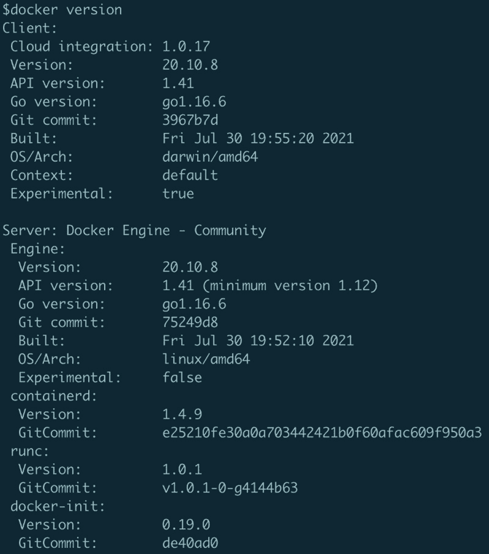
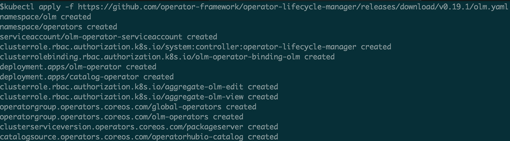
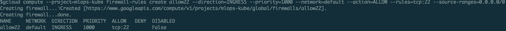

# *第三章*: 探索 Kubernetes

现在你已经看到，Kubernetes 将成为你在本地计算机或云端的 `minikube` 实例的基础。这个是一个单节点的 Kubernetes 集群，你将使用它作为构建和运行 ML 平台的基础设施。

我们将按以下顺序覆盖以下主题：

+   探索 Kubernetes 的主要组件

+   通过 Kubernetes 实现云中立性

+   理解操作符（Operators）

+   设置本地 Kubernetes 环境

+   （可选）在**谷歌云平台**（**GCP**）上配置**虚拟机**（**VM**）

# 技术要求

本章包括一些动手操作。你将设置一个 Kubernetes 集群，为此，你需要一台符合以下硬件规格的机器：

+   至少四个核心的**中央处理单元**（**CPU**）；推荐八个核心

+   至少 16 **吉字节**（**GB**）的内存；推荐 32 GB

+   至少 60 GB 可用空间的磁盘

这可以是物理机器，如笔记本电脑、服务器，或者是支持嵌套虚拟化的云端虚拟机（VM）。

# 探索 Kubernetes 主要组件

网络上有许多 Kubernetes 的定义。我们假设，作为 Kubernetes 用户，你已经有了自己偏好的定义。因此，在本节中，你将看到一些基本概念来刷新你对 Kubernetes 的知识。本节绝不是 Kubernetes 系统的参考资料或教程。

从*第二章*，《理解 MLOps》中，你已经看到 Kubernetes 为你的 ML 平台提供了以下能力：

+   **提供声明式的软件组件运行方式**：这一能力将帮助你的团队实现自主性。

+   **提供硬件资源的抽象层**：通过这个能力，你可以在各种硬件上运行 ML 平台，并提供按需的资源调度。

+   **提供应用程序接口（API）以进行交互**：这将使你能够将自动化引入到运行不同组件的 ML 平台中。

让我们从定义 Kubernetes 平台的主要组件开始：控制平面和工作节点。

## 控制平面

**控制平面**是一组组件，构成了 Kubernetes 的*大脑*。它由 API 服务器、键值数据库、调度器和一组控制器组成。让我们分别定义这些组件：

+   **API 服务器**：该组件提供了一组**表征状态传输**（**REST**）API，用于与 Kubernetes 系统交互。每个人都通过这个 API 与 Kubernetes 进行交互。作为开发人员或运维工程师，你使用 API，而 Kubernetes 内部组件通过 API 服务器进行通信，执行不同的活动。

+   `etcd`。Kubernetes 系统的其他组件不会直接与这个值存储交互——它只能通过 API 服务器访问。

+   **调度器**：调度器组件决定应用实例将在哪个节点上运行。调度器根据 Kubernetes 管理员定义的策略选择最合适的工作节点。

+   **控制器**：控制平面中运行着多个控制器。每个控制器都有一项特定任务；例如，节点控制器负责监控节点的状态。

以下图表显示了多个控制平面组件之间的交互：


图 3.1 – Kubernetes 控制平面组件

控制平面协调对象的创建、更新和删除。它监控并保持 Kubernetes 集群的健康状态。控制平面运行着保持集群运行的工作负载。那么，应用程序工作负载呢？

## 工作节点

正如其名称所示，工作节点是一组承载应用软件的节点。例如，所有 ML 平台组件将在工作节点上执行。然而，工作节点还运行一些 Kubernetes 组件，这些组件在控制平面与工作节点之间建立通信通道，并管理在工作节点上运行的应用程序。除应用程序外，这些是运行在工作节点上的关键组件：

+   **Kube proxy**：其主要作用是管理运行在节点上的应用程序的网络通信规则。

+   **Kubelet**：可以将 Kubelet 软件组件看作是运行在每个节点上的代理。这个代理的主要作用是与控制平面 API 服务器通信，并管理运行在节点上的应用程序。该代理还会捕获并通过 API 将节点和应用程序的状态反馈给控制平面。

+   **容器运行时**：容器运行时组件负责按照 Kubelet 的指示运行承载应用程序的容器。*Docker* 就是其中的一个例子；然而，Kubernetes 定义了**容器运行时接口**（**CRI**）。CRI 定义了 Kubernetes 使用的接口，Kubernetes 管理员可以选择与 CRI 兼容的任何容器运行时。

以下图表显示了多个工作节点组件之间的交互：


图 3.2 – Kubernetes 工作组件

工作节点，也称为计算节点，负责在集群中实际运行应用程序工作负载。运行应用程序工作负载需要你使用 Kubernetes 对象或资源与控制平面进行交互。

## 运行应用程序所需的 Kubernetes 对象

现在，让我们定义一组在 Kubernetes 系统上运行应用程序时常用的**对象**。当你为你的 ML 平台构建组件时，你将使用这些 Kubernetes 对象在 Kubernetes 上运行应用程序。以下是这些对象的列表：

+   **命名空间**：一个 Kubernetes 集群由多个团队和项目共享。命名空间提供了一种隔离 Kubernetes 资源的方式。通过这种隔离，不同的团队、不同的环境，甚至不同的应用程序可以共享同一个集群，同时保持不同的配置、网络策略、资源配额和访问控制。这就像在同一个 Kubernetes 集群内拥有一个逻辑上的子集群。

+   **容器镜像**：当你想在 Kubernetes 上运行一个应用程序时，你需要将应用程序打包成标准格式。这个打包格式包含了你的应用程序及其所有依赖项，称为容器镜像，而这个镜像的运行实例称为**容器**。它将你的应用程序及所有依赖项，包括操作系统资源和应用程序所需的资源，打包成一个共同的单元。

+   **部署**：这个 Kubernetes 对象代表了集群中应用程序的期望状态。一个部署对象包含了诸如你希望运行的容器镜像以及你需要多少个容器实例或*副本*等信息。Kubernetes 会定期将当前集群状态与部署对象中定义的期望状态进行对比。当 Kubernetes 发现当前状态与期望状态不符时，它会应用必要的更新来使集群达到期望状态。这些更新包括根据部署对象中定义的容器镜像启动新的容器、停止容器以及配置部署对象所需的网络和其他资源。

+   **Pod**：Pod 是 Kubernetes 中运行应用程序的基本单元。它也是最小的可调度部署单元。Pod 可以包含一个或多个容器。Pod 内的容器共享网络和磁盘资源。运行在同一个 Pod 中的容器会一起调度到同一个节点，并且能够彼此进行本地通信。

+   **服务**：Pod 之间是如何通信的呢？Pod 通过集群网络进行通信，每个 Pod 都有自己的**互联网协议**（**IP**）地址。然而，Pod 是可能会变动的。Kubernetes 可能会因为节点健康状况或调度变化而重启一个 Pod，当这种情况发生时，Pod 的 IP 地址会发生变化。此外，如果部署对象配置为运行多个相同 Pod 的副本，这意味着每个副本都会有自己的 IP 地址。

在 Kubernetes 中，服务将一组 Pod 暴露为一个抽象的网络服务。它提供一个一致的 IP 地址和**域名系统**（**DNS**）名称，可以对 Pod 进行流量路由并执行负载均衡。可以把服务看作是一个负载均衡的反向代理，指向你正在运行的 Pod。

+   **配置映射和密钥**：我们将应用程序打包成容器镜像并作为 pod 运行。相同的 pod 将在多个环境中部署，例如开发环境、测试环境和生产环境。然而，每个环境将有不同的配置，比如数据库位置等。将这种配置硬编码到容器镜像中不是正确的做法。一个原因是容器镜像可能会在多个环境中部署，而这些环境的设置是不同的。必须有一种方法可以在容器镜像之外定义配置，并在运行时将该配置注入到容器中！

配置映射和密钥提供了一种在 Kubernetes 中存储配置信息的方式。一旦定义了这些对象，它们可以作为文件或一组环境变量注入到运行中的 pod 中。

配置映射（ConfigMap）用于存储和访问配置信息。然而，对于敏感的配置，如密码和私钥，Kubernetes 提供了一种特殊的对象来处理这些内容，称为密钥（Secret）。与配置映射类似，密钥也可以作为文件或环境变量挂载到 pod 中。

下图展示了部署、pod、配置映射和服务之间的逻辑关系。部署对象提供了一个容器化应用程序的抽象，它隐藏了运行**副本控制器**和 pod 的复杂性。部署帮助你将应用程序作为单个 pod 或 pod 组运行，配置映射为你的 pod 提供环境特定的配置，而服务将部署中的 pod 作为一个单一的网络服务暴露出来：


图 3.3 – Kubernetes 中的存储配置

+   **存储（持久卷和持久卷声明（PV 和 PVC））**：Pod 是短暂的。一旦它们被销毁，所有本地资源都会丧失。通常，作为 pod 部署的应用程序可能需要访问存储，以读取和写入能够超越 pod 存活周期的持久数据。

Kubernetes 承诺成为许多硬件供应商和云提供商之上的基础设施抽象层。然而，不同云提供商和本地系统请求存储资源或配置磁盘的方式是不同的。这要求在不同的硬件供应商和云提供商之间以一致的方式请求存储资源。

Kubernetes 的解决方案是将存储资源分为两个 Kubernetes 对象。持久卷（PV）是定义物理存储卷的对象。它包含底层存储基础设施的详细信息。而持久卷声明（PVC）则是一个抽象的指针，指向一个 PV。PVC 表明所有者对特定 PV 的占用权。pod 的存储资源与 PVC 相关联，而不是直接与 PV 相关联；通过这种方式，底层存储定义从应用程序中抽象出来。

下图显示了 pod、PVC 和 PV 之间的关系。Pod 将 PVC 作为卷挂载；PVC 作为一个抽象层，用于为 pod 请求与 pod 关联的物理卷；PVC 绑定到提供磁盘具体信息的 PV：


图 3.4 - Kubernetes 中的存储供给（续）

+   **Ingress**：服务允许从 Kubernetes 集群内访问 pod。对于需要从 Kubernetes 集群外部访问 pod 的场景，Ingress 是答案。Ingress 提供了一种方式，使您可以将特定服务暴露给从集群外部访问的方式。这使您可以映射指向服务的基于 **HTTP** 的 **URL**。Ingress 还可以在暴露的 URL 上使用 **SSL**，并可以配置终止集群内部流量的 SSL。这样，传输层将在整个到达 Ingress 的过程中加密，同时将流量转发到 pod 中的明文 HTTP。值得注意的是，如果需要，Kubernetes 还允许流量加密一直到 pod。

下图显示了 Ingress 如何使 pod 可以从 Kubernetes 集群外部访问：


图 3.5 - Kubernetes 集群中的 Ingress 对象

现在您已经刷新了对 Kubernetes 的理解，让我们看看 Kubernetes 如何让您在任何地方运行您的平台。

# 通过 Kubernetes 实现云无关性

我们正在构建的 ML 平台的一个关键方面是，它使组织能够在任何云或数据中心上运行。然而，每个云都有自己专有的 API 来管理资源和部署应用程序。例如，**亚马逊网络服务**（**AWS**）API 在提供服务器时使用 **弹性计算云**（**EC2**）实例（即服务器），而谷歌云的 API 则使用 **Google 计算引擎**（**GCE**）虚拟机（即服务器）。甚至资源的名称也不同！这就是 Kubernetes 发挥关键作用的地方。

Kubernetes 的广泛采用迫使主要云供应商提供与 Kubernetes 紧密集成的解决方案。这使任何人都可以在几分钟内在 AWS、GCP 或 Azure 上创建一个 Kubernetes 集群。

Kubernetes API 允许您管理云资源。使用标准 Kubernetes API，您可以在任何主要云提供商上部署应用程序，而无需了解云提供商的 API。Kubernetes API 已经成为在云中管理工作负载的抽象层。本书中将构建的 ML 平台将完全使用 Kubernetes API 来部署和运行应用程序。这包括构成 ML 平台的软件组件。

下图展示了 Kubernetes 如何帮助你实现云无关性。你通过 Kubernetes API 与 Kubernetes 交互，从而避免或减少直接与云提供商 API 的交互。换句话说，Kubernetes 提供了一种一致的方式来与环境交互，无论它运行在哪个云平台或数据中心：


图 3.6 – Kubernetes 作为云提供商 API 的适配层

另一个 Kubernetes 社区推出的重要概念是 **操作员**。你将使用 Kubernetes 操作员来部署大多数机器学习平台的组件。我们来深入了解一下。

# 了解操作员

在传统的**信息技术**(**IT**) 组织中，需要专门的团队来维护应用程序和其他软件组件，如数据库、缓存和消息组件。这些团队不断监控软件生态系统，并执行特定任务，例如备份数据库、升级和修补软件组件的新版本等。

**操作员**就像系统管理员或工程师一样，持续监控 Kubernetes 环境中运行的应用程序，并执行与特定组件相关的运维任务。换句话说，操作员是一个自动化的软件管理器，负责管理 Kubernetes 上应用程序的安装和生命周期。

简而言之，操作员负责基于你提供的配置来创建和更新 Kubernetes 对象（如部署、入口等），而不是你自己来执行这些任务。指示操作员执行特定任务的配置叫做 **自定义资源** (**CR**)，而 CR 的结构或模式由一个叫做 **CR 定义** (**CRD**) 的对象来定义。

下图展示了操作员如何自动化应用程序的运维活动。在传统的方法中，开发人员构建和开发应用程序，然后由应用运维团队提供支持以运行该应用程序。Kubernetes 操作员的目标之一是自动化运维人员执行的任务：


图 3.7 – 操作员是一种自动化运维团队任务的软件

Kubernetes 操作员可能很复杂。有些操作员管理数据库实例，而有些则管理协同工作的 Pod 集群。一些操作员只拥有 1 或 2 个 CRD，而另一些则可能拥有超过 10 个 CRD。**操作员生命周期管理器** (**OLM**) 简化了 Kubernetes 操作员的安装和管理。我们来更深入地了解一下。

在 OLM 中，安装 Operator 需要多个步骤：为 Operator 创建部署对象，配置运行 Operator 所需的权限（因为它需要观察 Kubernetes 集群中的变化），以及创建 CRD。为了减少安装 Operator 的复杂性，可能需要一个管理层来帮助完成这些任务。OLM 就是完成这个角色的工具。

OLM 标准化了与 Operators 的交互。它要求所有与 Operator 的交互都通过 Kubernetes API 完成。OLM 使得通过单一标准接口——Kubernetes API 来管理多个 Operator 的生命周期变得更加简单。我们的 ML 平台将使用几个 Operators，因此了解 OLM 和与之相关的对象是很有用的。让我们在这里更详细地了解它们：

+   `ClusterServiceVersion`：此对象定义了有关 Operator 的元数据。它包括 Operator 的名称和版本，以及安装信息和所需权限。它还描述了 Operator 所拥有和所需的 CRD。

+   `Subscription`：`Subscription` 对象允许用户安装和更新 Operator。OLM 使用此对象来安装和配置 Operators、CRDs 以及相关的访问控制对象。

+   `OperatorGroup`：`OperatorGroup` 提供了一种将您的 Operator 与特定命名空间集合关联的方法。`OperatorGroup` 定义了一组命名空间，关联的 Operator 将对这些命名空间作出反应。如果我们在 `OperatorGroup` 定义中没有定义命名空间集合，那么 Operator 将在所有命名空间中全局运行。

在接下来的章节中，您将安装和配置本地的 Kubernetes 环境，并在 Kubernetes 集群上安装 OLM。

# 设置本地 Kubernetes 环境

现在，我们已经回顾了一些基础的 Kubernetes 概念，是时候开始实际操作了。在这一章节中，我们将准备并验证我们的本地 Kubernetes 集群。我们在这里设置的集群将用于在后续章节中托管 ML 平台。

## 安装 kubectl

`kubectl` 是一个命令行工具，帮助您在 Kubernetes 集群中运行命令。您可以通过这个工具创建 Kubernetes 对象、查看日志并监控操作进展。以下步骤将帮助您在机器上安装 `kubectl`。

### 在 Linux 上安装 kubectl

首先，让我们看看在运行 Linux 的机器上安装 `kubectl` 的过程。请按照以下步骤操作：

1.  创建或 **安全外壳**（**SSH**）到您 Linux 计算机的终端会话。

1.  下载 `kubectl`。本书中使用的 Kubernetes 版本为 `1.22.4`。以下两行代码是一条命令：

    ```
    curl -LO https://dl.k8s.io/release/v1.22.4/bin/linux/amd64/kubectl
    ```

1.  通过运行以下命令安装 `kubectl` CLI：

    ```
    sudo install kubectl /usr/local/bin/kubectl
    ```

1.  通过运行以下命令验证它是否已安装：

    ```
    kubectl version --client
    ```

您应该看到以下对 `version` 命令的响应：


图 3.8 – 在 Linux 中运行 kubectl version 命令的输出

现在你应该能够在 Linux 机器上运行 `kubectl`。

### 在 macOS 上安装 kubectl

首先，让我们了解在运行 macOS 的机器上安装 `kubectl` 的过程。请按照以下步骤操作：

1.  在你的 Mac 电脑上创建或`SSH`到一个终端会话。

1.  下载 `kubectl` Kubernetes CLI。本书中将使用 *1.22.4* 版本。

对于 Intel Mac，运行以下命令：

```
curl -LO https://dl.k8s.io/release/v1.22.4/bin/darwin/amd64/kubectl
```

对于 Apple M1 Mac，运行以下命令：

```
curl -LO https://dl.k8s.io/release/v1.22.4/bin/darwin/aa64/kubectl
```

1.  运行以下命令安装 `kubectl` CLI：

    ```
    sudo install kubectl /usr/local/bin/kubectl
    ```

1.  通过运行以下命令验证是否已安装：

    ```
    kubectl version --client
    ```

你应该看到以下对 `version` 命令的响应：


](img/B18332_03_009.jpg)

图 3.9 – macOS 中 `kubectl version` 命令的输出

现在你应该能够在 macOS 上运行 `kubectl`。

#### 在 Windows 上安装 kubectl

接下来，让我们了解 Windows 系统上的步骤：

1.  以 **管理员** 身份运行 **PowerShell**。

1.  通过运行以下命令下载 `kubectl` Kubernetes CLI 二进制文件。本书中将使用 *1.22.4* 版本：

    ```
    curl.exe -LO https://dl.k8s.io/release/v1.22.4/bin/windows/amd64/kubectl.exe
    ```

1.  通过运行以下命令，将 `kubectl.exe` 文件复制到 `c:\kubectl`：

    ```
    mkdir c:\kubectl 
    copy kubectl.exe c:\kubectl
    ```

1.  通过运行以下命令将 `c:\kubectl` 添加到 `PATH` 环境变量中，然后重新启动 PowerShell 终端：

    ```
    setx $ENV:PATH "$ENV:PATH;C:\kubectl" /M
    ```

1.  通过运行以下命令验证是否已安装：

    ```
    kubectl version –client
    ```

你应该看到以下对 `version` 命令的响应：


](img/B18332_03_010.jpg)

图 3.10 – Windows 中 `kubectl version` 命令的输出

你刚刚安装了 `kubectl` Kubernetes CLI。下一步是安装 `minikube`，一个本地单节点 Kubernetes 集群。

## 安装 minikube

`minikube` 提供了一种轻松运行本地 Kubernetes 集群的方法。这是一个最小化的集群，旨在仅用于本地开发或实验。将 Kubernetes 用于生产环境超出了本书的范围。

与`kubectl`类似，接下来让我们了解如何在不同类型的操作系统上进行安装。

### 在 Linux 上安装 minikube

按照以下步骤在 Linux 上安装 `minikube`：

1.  创建一个终端会话或通过 `SSH` 连接到你的 Linux 计算机。

1.  使用以下代码为 `minikube` 安装 `podman`：

    ```
    sudo dnf install podman -y
    ```

1.  从此位置下载 `minikube`。我们使用的是 `minikube` 的 `1.24.0` 版本：

    ```
    curl -LO https://storage.googleapis.com/minikube/releases/v1.24.0/minikube-linux-amd64
    ```

1.  按照以下步骤安装 `minikube` 工具：

    ```
    sudo install minikube-linux-amd64 /usr/local/bin/minikube
    ```

1.  验证 `minikube` 版本，如下所示：

    ```
    minikube version
    ```

你应该看到以下响应：


](img/B18332_03_011.jpg)

图 3.11 – Linux 上 `minikube version` 命令的输出

你刚刚在 Linux 上安装了 `kubectl` 和 `minikube`。这两个命令行工具将帮助你设置一个本地 Kubernetes 集群。

### 在 macOS 上安装 minikube

虽然本书的首选操作系统是 Linux，但我们也提供了如何在 macOS 上安装 `minikube` 的步骤。很多开发者使用 macOS 系统，因此提供 Apple 操作系统的详细步骤也会很有帮助。接下来的步骤如下：

1.  从 Docker 官网下载并安装 Docker Desktop，或者通过访问以下网页进行下载：[`www.docker.com/products/docker-desktop`](https://www.docker.com/products/docker-desktop)。

1.  一旦 Docker 安装完成，确保通过运行以下命令来验证其是否正确安装。运行此命令前，请确保 Docker 已经启动：

    ```
    docker version
    ```

你应该看到以下响应。如果收到错误信息，请确保 Docker 已经启动：



图 3.12 – macOS 上执行 docker version 命令的输出

1.  在 macOS 计算机上打开一个终端。

1.  通过运行以下命令之一来下载 `minikube`。你将使用版本 1.24.0 的 Minikube：

    +   如果你使用的是 Intel Mac，请运行以下命令：

        ```
        curl -Lo minikube https://storage.googleapis.com/minikube/releases/v1.24.0/minikube-darwin-amd64
        ```

    +   如果你有 M1 Mac（Apple Silicon），请运行以下命令：

        ```
        curl -Lo minikube https://storage.googleapis.com/minikube/releases/v1.24.0/minikube-darwin-arm64
        ```

1.  将下载的文件移动到 `/usr/local/bin` 文件夹，并通过以下命令将下载的文件设为可执行文件：

    ```
    sudo mv minikube /usr/local/bin
    sudo chmod +x /usr/local/bin/minikube
    ```

1.  验证 `minikube` 版本，方法如下：

    ```
    minikube version
    ```

你应该看到以下响应：


图 3.13 – minikube version 命令的输出

你刚刚在 macOS 上安装了 `kubectl` 和 `minikube`。这两个命令行工具将帮助你设置本地 Kubernetes 集群。

### 在 Windows 上安装 minikube

和 macOS 一样，许多开发者也使用 Windows。为 Microsoft 的强大操作系统 Windows 提供操作步骤是公平的。我们来探讨一下如何在 Windows 上使用 `Hyper-V`，Microsoft 的虚拟化层，来运行 `minikube`。请注意，`Hyper-V` 在除 Windows Home 外的所有 Windows 版本中均可用。按照以下步骤操作：

1.  以 **管理员** 身份运行 **PowerShell**。

1.  在 PowerShell 控制台中，运行以下命令以启用 `Hyper-V`：

    ```
    Enable-WindowsOptionalFeature -Online -FeatureName Microsoft-Hyper-V --All
    ```

如果 `Hyper-V` 未启用，你应该看到以下响应。如果已经启用，该命令将仅打印状态。按 *Y* 继续：


图 3.14 – Windows 上启用 Hyper-V 命令的输出

如有需要，请重启计算机。

1.  通过在浏览器中打开以下链接来下载 `minikube` 安装程序：[`github.com/kubernetes/minikube/releases/download/v1.24.0/minikube-installer.exe`](https://github.com/kubernetes/minikube/releases/download/v1.24.0/minikube-installer.exe)。

1.  运行已下载的安装程序，你应该会看到语言设置界面，如下图所示。点击 **OK**：


图 3.15 – minikube 安装程序的语言选择对话框

1.  安装程序将显示以下欢迎界面。点击**下一步 >**，如下面的截图所示：


图 3.16 – minikube 安装程序向导

1.  安装程序将显示以下**许可协议**界面。点击**我同意**：


图 3.17 – minikube 安装程序的许可协议界面

1.  在此界面中，选择你希望安装`minikube`的位置，然后点击**安装**，如下面的截图所示：


图 3.18 – minikube 安装程序的安装位置界面

1.  安装可能需要几分钟时间。一旦安装成功，你应该看到以下界面。点击**下一步 >**：


图 3.19 – minikube 安装程序的成功安装界面

1.  这是你`minikube`设置过程中的最后一个界面。点击**完成**以结束设置：


图 3.20 – minikube 安装程序的最终界面

1.  最后，在 PowerShell 控制台中，将`minikube`的虚拟化驱动程序设置为`hyperv`。你可以通过运行以下命令来完成：

    ```
    minikube config set driver hyperv
    ```

你应该会看到以下响应：


图 3.21 – minikube 配置命令的输出

恭喜你——你已经在 Windows 机器上成功设置了`minikube`程序！

在前面的章节中，你已经安装了`kubectl`和`minikube`工具以设置 Kubernetes 集群。在接下来的章节中，你将设置一个 Kubernetes 集群。

### 设置本地 Kubernetes 集群

现在，我们将在你的本地机器上设置 Kubernetes 集群。如技术要求中所述，我们需要至少 4 个 CPU 核心或**虚拟 CPU**（**vCPUs**）、60GB 的可用磁盘空间，并且至少需要分配 16GB 内存给 Kubernetes 集群。我们推荐的配置是 8 个 CPU 和 64GB 内存，并配备 60GB 磁盘空间。如果你本地没有这些资源，你可以在云中提供一个 Linux 主机。我们将在下一节中描述如何在 Google Cloud 上提供主机。请按以下步骤继续：

1.  通过以下命令设置`minikube`的 CPU、磁盘和内存配置：

    ```
    minikube config set cpus 8
    minikube config set memory 32GB
    minikube config set disk-size 60GB
    ```

1.  通过以下命令验证配置是否正确设置：

    ```
    minikube config view
    ```

你应该会看到以下响应：


图 3.22 – minikube 配置命令的输出

1.  现在，通过运行以下命令启动 Kubernetes 集群：

    ```
    minikube start --kubernetes-version=1.22.4
    ```

你应该会看到以下响应：


图 3.23 – minikube start 命令的部分输出

一旦启动过程完成，Kubernetes 平台可用后，你应该看到类似于以下的成功消息：


图 3.24 – minikube 启动成功后的输出

1.  通过在 Linux 或 macOS 上运行以下命令验证所有 pods 是否处于 **运行中** 状态。请注意，pods 可能需要几分钟才能处于 *运行中* 状态：

    ```
    watch kubectl get pods --all-namespaces
    ```

或者，在 Windows PowerShell 中运行以下命令：

```
while (1) {kubectl get pods --all-namespaces; sleep 5}
```

你应该看到以下响应：


图 3.25 – 验证 Kubernetes pods 已成功启动

恭喜！你刚刚成功安装并验证了新的 Kubernetes 集群。接下来的步骤是安装可以在新 Kubernetes 集群上运行的组件。

## 安装 OLM

在验证所有 pods 已在本地 Kubernetes 集群中运行后，你将安装 **OLM**。在 Kubernetes 中安装 OLM 或任何其他应用程序的过程对于所有操作系统类型都是相同的。按照以下步骤进行：

1.  运行以下命令安装 OLM 的 CRD：

    ```
    kubectl apply -f https://github.com/operator-framework/operator-lifecycle-manager/releases/download/v0.19.1/crds.yaml
    ```

你应该看到以下响应：


图 3.26 – 验证 OLM CR 已成功创建

1.  运行以下命令在 Kubernetes 上安装 OLM：

    ```
    kubectl apply -f https://github.com/operator-framework/operator-lifecycle-manager/releases/download/v0.19.1/olm.yaml
    ```

你应该看到以下响应：



图 3.27 – 在 Kubernetes 中创建 OLM 对象

1.  通过在 Linux 或 macOS 上运行以下命令验证所有 OLM pods 是否处于 *运行中* 状态：

    ```
    watch kubectl get pods -n olm
    ```

或者，在 Windows PowerShell 中运行以下命令：

```
while (1) {kubectl get pods -n olm; sleep 5}
```

你应该看到以下响应：


图 3.28 – 验证 OLM 的资源已成功创建

1.  通过发出以下命令验证 `catalogsource` 是否可用：

    ```
    kubectl get catalogsource -n olm
    ```

你应该看到以下响应：


图 3.29 – 验证 Operator 目录已安装

恭喜！你现在已经在本地运行了一个 Kubernetes 集群，并在其中安装了 OLM。你的集群现在准备好安装 Kubernetes Operators。一些人可能没有访问到满足 ML 平台运行所需最低硬件要求的机器，但不用担心——我们会为你提供帮助。接下来的部分将帮助你在 Google Cloud 中配置所需的虚拟机。

# 在 GCP 上配置虚拟机

最好能有一个本地环境，以便你能在其中进行本书的练习。然而，我们理解并非每个人的本地机器都具备所需的计算资源。那么，来使用云吧！你可以在云中按需配置适合本书练习的机器，而且是免费的。例如，Google Cloud 会为新账户提供 **300 美元**（**USD**）的信用额度。其他云服务提供商，如 AWS 和 Azure，也提供类似的免费套餐，具体选择哪个云服务商由你决定。然而，关于本书中所需的虚拟机配置，我们将使用 Google Cloud。

一旦你整理好账户信息，按照以下步骤在你的账户中配置虚拟机。只需记住，在完成会话后停止虚拟机实例，以避免在不使用机器时仍然被收费。

以下步骤将指导你通过 Google Cloud 配置虚拟机的过程：

1.  首先，在 [`cloud.google.com`](https://cloud.google.com) 注册一个新账户。

1.  按照 [`cloud.google.com/sdk/docs/install`](https://cloud.google.com/sdk/docs/install) 上的步骤安装 `gcloud` **软件开发工具包**（**SDK**）。

1.  使用以下命令登录 Google Cloud。该命令将打开一个浏览器实例，在其中输入你的 Google Cloud 账户登录凭据：

    ```
    gcloud auth login
    ```

你应该看到以下响应：


图 3.30 – 登录命令的输出

1.  然后，它会带你到浏览器，你需要在浏览器中进行身份验证。浏览器完成身份验证后，你将在命令行看到以下输出：


图 3.31 – 成功登录 gcloud 账户后的输出

1.  在 Google Cloud 中创建一个新项目，如下所示。你的虚拟机将属于此项目。请注意，项目名称在 GCP 中必须是全局唯一的，因此请根据个人喜好修改项目名称：

    ```
    gcloud projects create mlops-kube --name="MLOps on Kubernetes"
    ```

你应该看到以下响应：


图 3.32 – 创建项目命令在 Google Cloud 中的输出

GCP 中的项目

项目 `mlops-kube`。为使该命令生效，请选择你自己的项目名称。你还需要在后续的命令中使用你选择的项目名称，而不是 `mlops-kube` 项目名称。

1.  通过执行以下命令，确保你在正确的项目中：

    ```
    gcloud config set project mlops-kube
    ```

你应该看到以下响应：


图 3.33 – 设置当前项目上下文命令的输出

1.  根据你的所在位置设置正确的区域和可用区。你可以通过 `gcloud compute zones list` 命令获取所有可用区的列表，如下所示：

    ```
    gcloud config set compute/region australia-southeast1
    ```

你应该看到以下响应：


图 3.34 – 设置 gcloud 区域后的输出

运行以下命令：

```
gcloud config set compute/zone australia-southeast1-a
```

你应该看到以下响应：


图 3.35 – 设置 gcloud 区域后的输出

1.  启用计算引擎 API，如下所示。此步骤是通过 API 提供 Linux 虚拟机所必需的：

    ```
    gcloud services enable compute.googleapis.com
    ```

1.  禁用 **OS 登录**，因为你只通过 SSH 连接，如下所示：

    ```
    gcloud compute project-info add-metadata --metadata enable-oslogin=FALSE
    ```

1.  现在，通过运行以下命令在此项目中创建一个虚拟机（VM）：

    ```
    gcloud compute instances create mlopskube-cluster --project=mlops-kube --zone=australia-southeast1-a --machine-type=c2-standard-8 --network-interface=network-tier=PREMIUM,subnet=default --maintenance-policy=MIGRATE --service-account=702800110954-compute@developer.gserviceaccount.com --scopes=https://www.googleapis.com/auth/devstorage.read_only,https://www.googleapis.com/auth/logging.write,https://www.googleapis.com/auth/monitoring.write,https://www.googleapis.com/auth/servicecontrol,https://www.googleapis.com/auth/service.management.readonly,https://www.googleapis.com/auth/trace.append --create-disk=auto-delete=yes,boot=yes,device-name=instance-1,image=projects/centos-cloud/global/images/centos-8-v20211105,mode=rw,size=80,type=projects/mlops-kube/zones/australia-southeast1-b/diskTypes/pd-balanced --no-shielded-secure-boot --shielded-vtpm --shielded-integrity-monitoring --reservation-affinity=any
    ```

命令的输出应该显示机器的详细信息，如下所示：


图 3.36 – 在 Google Cloud 上创建 VM 命令的输出

1.  添加防火墙规则，允许通过端口 `22` 进行 SSH 访问实例，如下所示。这是一个宽松的规则，不应在生产环境中使用：

    ```
    gcloud compute --project=mlops-kube firewall-rules create allow22 --direction=INGRESS --priority=1000 --network=default --action=ALLOW --rules=tcp:22 --source-ranges=0.0.0.0/0
    ```

你应该看到以下响应：



图 3.37 – 防火墙规则命令的输出

1.  使用 `gcloud` SSH 功能连接到机器，如下所示。这将给你命令行，你可以执行前面章节中提到的 Kubernetes 命令：

    ```
    gcloud beta compute ssh --zone "australia-southeast1-a" "mlopskube-cluster"  --project "mlops-kube"
    ```

1.  完成会话后，请删除实例，如下所示：

    ```
    gcloud  compute instances delete --zone "australia-southeast1-a" "mlopskube-cluster"  --project "mlops-kube"
    ```

你应该看到以下响应：


图 3.38 – 在 Google Cloud 上删除机器

此时，你可以使用这个 `gcloud` 虚拟机作为 Kubernetes 集群的主机。按照之前的章节，你现在应该知道如何安装 `kubectl` 和 `minikube`，以及如何在这个虚拟机上设置本地 Kubernetes 集群。

# 总结

在本章中，你回顾了一些基础的 Kubernetes 概念，并了解了 Kubernetes 生态系统中的 Operator。如果你想深入了解 Kubernetes，*Packt 出版社的《Kubernetes Workshop》*是一个不错的起点。

你已经安装了设置本地 Kubernetes 集群所需的工具。你已经看过在其他环境（如 Linux、macOS 和 Windows）中进行设置的说明。你已经在 Google Cloud 上设置了一个虚拟机（VM），以防你不想使用本地计算机进行练习。你已配置 OLM 来管理 Kubernetes 集群上的操作员（Operators）。这些技术将构成我们机器学习平台的基础设施，接下来的章节你将开始构建这个平台。
