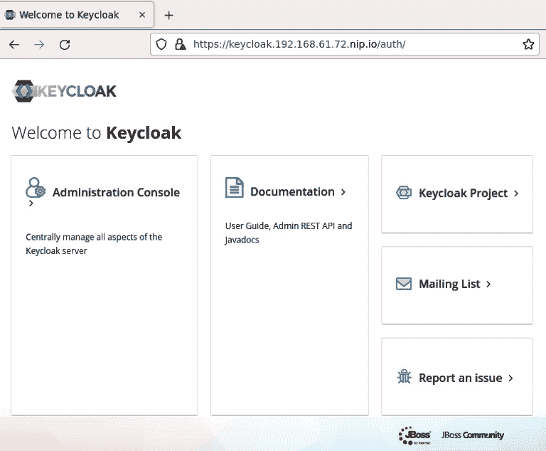

# *第四章*：机器学习平台的构成

在这一章及接下来的几章中，你将学习并安装构建在 Kubernetes 上的**机器学习**（**ML**）平台的各个组件。一个 ML 平台应当能够提供运行 ML 项目全生命周期所需的工具，如*第二章*《理解 MLOps》中所描述的那样。本章首先从技术无关的角度定义了 ML 平台的不同组件。在后续部分，你将看到一组开源软件，能够满足每个组件的要求。我们选择这种方式，是为了不将你束缚于特定的技术栈；相反，你可以根据自己的环境需要替换组件。

你将在本书中构建的解决方案将基于开源技术，并托管在你在*第三章*《探索 Kubernetes》中构建的 Kubernetes 平台上。

在本章中，你将学习以下主题：

+   定义自助平台

+   探索数据工程组件

+   探索 ML 模型生命周期组件

+   解决安全性、监控和自动化问题

+   探索 Open Data Hub

# 技术要求

本章包括一些实践设置。你将需要一个配置了**操作符生命周期管理器**（**OLM**）的运行中 Kubernetes 集群。如何构建这样的 Kubernetes 环境已在*第三章*《探索 Kubernetes》中介绍。在尝试本章的技术练习之前，请确保你有一个正在工作的 Kubernetes 集群。你可以选择使用与*第三章*《探索 Kubernetes》中描述的不同版本的 Kubernetes，只要该集群安装了 OLM。

# 定义自助服务平台

**自助服务**被定义为平台的一种能力，允许平台终端用户按需提供资源而无需其他人工干预。例如，数据科学家用户可能需要一个 Jupyter notebook 服务器实例，运行在一个具有 8 个 CPU 的主机容器上，以执行他的/她的工作。一个自助式的 ML 平台应当允许数据科学家通过一个终端用户友好的界面，提供容器并运行 Jupyter notebook 服务器实例。另一个自助服务的例子是，数据工程师请求提供一个新的 Apache Spark 集群实例，以运行他的/她的数据管道。最后一个例子是数据科学家希望将其 ML 模型打包并作为 REST 服务进行部署，以便应用程序可以使用该模型。

自助服务平台的一个好处是，它允许跨职能团队以最小的依赖关系共同工作。这种独立性带来了更好的团队动态、更少的摩擦和更高的团队速度。

然而，自服务模型需要治理。试想，每个数据科学家都请求 GPU，或者数据工程师请求数十 TB 的存储！自服务功能非常好，但如果没有适当的治理，也可能带来问题。为了避免此类问题，平台必须由平台团队进行管理，团队可以控制或限制最终用户的操作。资源配额就是这种限制的一个例子。团队和/或个人用户可以分配配额，并负责在分配的配额范围内管理自己的资源。幸运的是，Kubernetes 具有这种能力，我们的机器学习平台可以利用此能力为团队的资源应用限制。

作为治理的一部分，平台必须具备基于角色的访问控制。这是为了确保只有具有适当角色的用户才能访问他们管理的资源。例如，平台团队可以更改资源配额，而数据工程师只能启动新的 Spark 集群并运行数据管道。

自服务平台的另一个方面是工作负载的隔离。许多团队将共享同一个平台，尽管配额将使团队保持在预定义的边界内，但至关重要的是，平台必须具备隔离工作负载的能力，以确保在同一平台上运行的多个不相关的项目不会重叠。

# 探索数据工程组件

在本书的上下文中，数据工程是指从源系统中摄取原始数据，并生成可用于分析、业务报告和机器学习等场景的可靠数据的过程。数据工程师是构建软件来收集和处理原始数据，从而为数据分析师和数据科学家生成干净且有意义的数据集的人。这些数据集将成为组织机器学习计划的基础。

*图 4.1* 展示了典型的机器学习项目中数据工程阶段的各个步骤：


图 4.1 – 机器学习中的数据工程阶段

数据工程通常与**特征工程**有交集。虽然数据科学家决定哪些特征对机器学习用例更有用，但他或她可能会与数据工程师合作，以获取当前特征集中没有的数据点。这是数据工程师与数据科学家之间的主要合作点。数据工程师在数据工程阶段创建的数据集将成为机器学习阶段中的特征集。

一个支持团队进行特征工程的机器学习平台将包含以下组件和过程。

+   **数据摄取**：数据摄取是团队理解数据源并构建和部署收集来自一个或多个数据源的数据的软件的过程。数据工程师理解从源系统读取数据的影响。例如，在从源读取数据时，源系统的性能可能会受到影响。因此，机器学习平台必须具备工作流调度功能，以便在源系统不太活跃的时间安排数据收集。

一个机器学习平台使团队能够以多种方式从各种来源摄取数据。例如，某些数据源允许拉取数据，而其他数据源可能允许推送数据。数据可能来自关系型数据库、数据仓库、数据湖、数据池、数据流、API 调用，甚至是原始文件系统。平台还应具备理解不同协议的能力，例如，一个消息系统可能有多种协议，如**高级消息队列协议**（**AMQP**）、**消息队列遥测传输**（**MQTT**）和 Kafka。换句话说，机器学习平台应该具备从不同类型的数据源以各种方式收集不同形状和大小的数据的能力。*图 4.2*展示了平台应该能够摄取的各种数据来源：


图 4.2 – 数据摄取集成

+   **数据转换**：一旦数据从各种来源摄取，它需要从原始形式转化为对机器学习模型训练和其他应用场景更有用的形式。根据福布斯的一项调查，*80%的数据科学家工作都与为模型训练准备数据相关*；这通常是数据科学团队中被认为最枯燥的阶段。然而，如果数据没有转换为合适的形式，它将导致不那么有用和/或低效的机器学习模型。一个机器学习平台使团队能够轻松编写、构建和部署数据转换管道和作业。该平台抽象了运行和管理数据转换组件（如 Apache Spark 作业）的复杂性。平台不仅管理这些过程的执行，还管理运行这些组件所需的计算资源（如 CPU、内存和网络）的供应和清理。

+   **存储**：在特征工程过程中，您将在各个阶段读取和写入数据。您可能会创建数据集的临时表示以进行进一步处理，或者您可能会写入新数据集以供机器学习过程使用。在这些情况下，您将需要可以轻松访问并根据需要扩展的存储资源。一个机器学习平台提供按需存储，确保您的数据集能够以可靠的方式存储。

现在，让我们看看数据工程师将如何在他们的工作流中使用这些组件。

## 数据工程师工作流

前一节中提到的所有功能都由机器学习平台以自服务的方式提供。数据工程师在使用平台时通常会执行的工作流如下：

1.  *登录平台*：在此步骤中，数据工程师进行平台身份验证。

1.  *配置开发环境*：在此步骤中，数据工程师向平台请求开发环境所需的资源（如 CPU 数量、内存大小和特定的软件库）。平台随后会自动配置所请求的资源。

1.  *构建数据管道*：在此步骤中，数据工程师编写用于数据摄取和数据转换的代码。然后，数据工程师将在隔离环境中运行代码，验证其有效性，并进行必要的重构和调优。

1.  *运行数据管道*：在此步骤中，数据工程师按需安排代码运行。可以根据使用场景选择定期运行（如每小时或每日）或一次性运行。

从前面的步骤中可以看到，除了编写代码，其他所有步骤都是声明性的。数据工程师的重点将放在构建用于摄取和转换数据的代码上。流程的其他方面将由机器学习平台负责。这将提高团队的效率和工作速度。平台的声明式功能将帮助团队在整个组织内标准化流程，从而减少定制工具链的数量，并提升整体流程的安全性。

数据工程流程的主要输出是一个可用的、已转换并部分清理的数据集，可以用来开始构建和训练模型。

# 探索模型开发组件

一旦清理后的数据可用，数据科学家将对问题进行分析，尝试确定哪些模式对于该情况有帮助。关键是数据科学家的主要职责是从数据中找出模式。机器学习平台的模型开发组件会探索数据模式、构建和训练机器学习模型，并试验多种配置，找到最佳的配置和算法，以实现模型所需的性能。

在模型开发过程中，数据科学家或机器学习工程师基于多个算法构建多个模型。这些模型将使用数据工程流程中收集和准备的数据进行训练。数据科学家接着会调整几个超参数，通过模型测试得到不同的结果。然后，这些训练和测试的结果将与其他模型进行比较。这些实验过程将重复多次，直到达到预期的结果。

实验阶段将导致选择最合适的算法和配置。选定的模型将被标记以便打包和部署。

*图 4.3* 显示了机器学习项目中模型开发的各个阶段：


图 4.3 – 机器学习数据工程阶段

一个能够支持团队进行模型开发的机器学习平台将包含以下组件：

+   **数据探索**：我们人类在数据可视化时比仅仅查看原始数据集时更擅长发现模式。机器学习平台使你能够可视化数据。作为数据科学家，你需要与**领域专家**（**SMEs**）合作，后者拥有专业知识。假设你正在分析一组冠状病毒患者的数据集。如果你不是病毒学或医学领域的专家，你将需要与一个能够提供关于数据集、特征关系以及数据质量的见解的领域专家合作。机器学习平台允许你将自己创建的可视化图表分享给更广泛的团队，以便获得更好的反馈。平台还允许非技术人员以更图形化的方式查看数据，这有助于他们更好地理解数据。

+   **实验**：作为数据科学家，你将把数据分为训练集和测试集，然后开始为给定的指标构建模型。接下来，你将尝试多种机器学习算法，如决策树、XGBoost 和深度学习，并为每个算法应用不同的参数调优，例如深度学习模型中的层数或神经元数量。这就是我们所说的实验，平台使团队能够以自主的方式进行实验。请记住，对于每个实验，你可能需要不同的计算资源，如 GPU。因此，平台的自助服务配置能力至关重要。

+   **跟踪**：在进行多个实验时，你需要跟踪每个实验使用的参数以及它所取得的指标。一些算法可能需要不同的特征集，这意味着你还需要跟踪在训练中使用的数据集版本。这样做有两个原因。第一个原因是，你将需要保留实验历史，以便进行比较并挑选最佳组合。第二个原因是，你可能需要将结果与其他数据科学家共享。机器学习平台使你能够记录实验结果并无缝共享。

+   **模型构建与调优**：在实验阶段，你已经找到了最佳的算法和最佳参数。你已比较了模型的结果和相关指标，并选择了用于模型的算法和参数。在这个阶段，你将使用这些参数训练你的模型，并将其注册到模型注册表中：

    +   **模型注册表**：作为数据科学家，当你对模型感到满意时，你将与团队一起部署它。然而，现实世界会发生变化，你需要为新数据集、不同指标或仅仅为了提高指标而更新模型。新版本的模型不断出现，ML 平台使你能够追踪模型版本。模型版本控制功能将帮助团队比较新旧模型版本的效率，并在需要时允许团队将生产中的新模型回滚至以前的版本。

+   **存储**：存储不仅在数据工程阶段重要，在模型开发过程中同样至关重要。在模型开发过程中，你会在多个阶段读取和写入数据。你将数据集分成测试集和训练集，你可能选择只写入一次数据，这样你可以在相同数据集上进行不同模型参数的实验。实验追踪模块和模型注册表都需要存储。ML 平台为你的数据集提供按需存储，确保数据可靠存储。

现在，让我们看看数据科学家如何在他们的工作流程中使用这些组件。

## 理解数据科学家的工作流程

上一节中提到的所有功能都由 ML 平台以自助方式提供。数据科学家的典型工作流程如下：

1.  *登录平台*：数据科学家对平台进行身份验证。

1.  *开发环境的配置*：在这一步骤中，数据科学家向平台请求开发环境的资源要求，如 CPU 数量、内存大小和特定的软件库。平台会自动为你配置所需资源。

1.  *探索性数据分析*：在这个阶段，数据科学家进行多种数据转换和可视化技术，以理解数据中隐藏的模式。

1.  *尝试不同的算法*：在这个阶段，数据科学家将完整数据集拆分为训练集和测试集。然后，数据科学家应用不同的 ML 算法和超参数，以实现所需的指标。数据科学家接着比较每次训练运行的参数，选择最适合给定用例的参数。

1.  *模型训练*：数据科学家根据前一阶段找到的最优化参数训练模型，并将模型注册到模型注册表中。

1.  *运行模型部署管道*：在此步骤中，数据科学家将模型打包以作为服务消费，并构建自动化部署流程。根据用例，它可以定期调度或一次性运行。

您可以在前面的步骤中看到，除了编写便于模型构建和训练的代码之外，所有其他步骤都是声明性的。数据科学家的重点将放在构建更多的数据科学和 ML 工程任务上。流程的所有其他方面将由 ML 平台处理。这将提高团队的效率和速度，更不用说数据科学家的幸福感了。平台的声明能力还将允许团队在整个组织中标准化流程，从而减少使用定制工具链，提高一致性并改善整个流程的安全性。

在接下来的部分中，您将探讨 ML 平台的常见服务。这些服务对于使平台达到生产就绪状态并在企业环境中更易于采用至关重要。

# 安全性、监控和自动化

在本节中，您将看到适用于我们到目前为止讨论的所有组件和阶段的 ML 平台的一些常见组件。这些组件帮助您在组织中实现平台的操作化：

+   **数据管道执行**：数据工程的结果是一个数据管道，用于摄取、清理和处理数据。您已经用缩减版数据构建了这个管道以供开发目的使用。现在，您需要用生产数据运行这些代码，或者您希望定期运行新数据，比如每周。ML 平台允许您获取代码并在不同环境中自动执行它。这是一大进步，因为平台不仅允许您运行代码，还将管理代码的所有依赖项的打包，使其可以在任何地方运行。如果您构建的代码使用 Apache Spark，平台应允许您自动化提供 Spark 集群和运行数据管道所需的所有其他组件的过程。

+   **模型部署**：一旦模型准备好供使用，它应该可以作为服务供消费。如果没有 ML 平台的自动化模型打包和部署能力，将模型打包并将其托管为服务的过程需要一些软件工程工作。这项工作需要与软件工程师和运维团队紧密合作，并可能需要花费数天甚至数周的时间才能完成。ML 平台自动化了这个过程，通常只需几秒到几分钟的时间。这个过程的结果是在环境中部署的 ML 模型，并可以作为服务访问，通常以 REST API 的形式提供。

模型的部署是一个方面；随着时间的推移，你可能还需要用新数据集重新训练模型。该平台还使团队能够使用第一次训练模型时所编写的相同训练代码来自动化重新训练过程。重新训练的模型将自动重新部署。这项功能大大提高了团队的效率，允许更高效地利用时间，如处理新的挑战，同时为业务提供价值。

+   **监控**：监控不仅仅是指拥有观察生产环境中组件动态的能力，例如监控模型响应时间，它还使团队能够在问题发生之前响应事件。一个好的监控平台在整个机器学习项目生命周期中提供可观测性，而不仅仅是生产环境中的监控。当你编写代码处理数据时，你可能需要调整来自多个系统的数据集之间的连接表达式。这是你在开发过程中需要的信息之一。该平台允许你在开发过程中深入了解细节。平台还提供监控底层 IT 基础设施的能力。例如，在模型训练阶段运行代码时，平台提供硬件资源利用率的度量。

+   **安全性和治理**：你正在构建的平台使团队能够独立工作。团队可以随时使用平台中的工具进行工作。然而，谁可以访问什么资源、谁可以使用哪些工具，成为许多组织面临的挑战。为此，平台必须具备访问控制功能，只允许授权用户访问。平台的安全组件通过标准协议，如**OAuth2**或**OpenID Connect**，对用户进行认证和授权。你将使用开源组件将认证功能引入平台。平台还使用 Kubernetes 命名空间功能，在共享相同集群的不同团队之间提供工作负载隔离。Kubernetes 还提供将硬件资源使用限制分配给各个团队的能力。这些功能将使团队能够在组织内的多个单位之间共享平台，同时提供明确的隔离边界和硬件资源配额。

+   **源代码管理**：当你构建数据管道或训练模型时，你会编写代码。该平台提供与源代码管理解决方案的集成功能。**Git**是集成平台的默认源代码管理解决方案。

现在，让我们继续介绍**开放数据中心**（**ODH**）。

# 引入 ODH

ODH 是一个开源项目，提供了构建我们 ML 平台所需的大部分组件。它包括一个 Kubernetes 操作符和一套精心挑选的开源软件组件，这些组件构成了 ML 平台的大部分。在本书中，我们将主要使用 ODH 操作符。平台中还有其他一些组件，它们并非 ODH 原生提供的。ODH 操作符的一个优点是，您可以根据实际需求，随时将默认组件替换为其他组件。

为了构建平台，您将使用以下组件。在接下来的几章中，您将学习每个组件的详细信息及其使用方法。目前，您只需了解这些组件的高层次用途：

+   **ODH 操作符**：一个 Kubernetes 操作符，用于管理 ML 平台中不同组件的生命周期。它控制并管理 ML 平台中使用的软件组件的安装和维护。

+   **JupyterHub**：管理 Jupyter Notebook 服务器实例及其相关资源。

+   **Jupyter notebooks**：一个**集成开发环境**（**IDE**），是平台中主要的数据工程和数据科学工作区。数据科学家和工程师将使用这些工作区编写和调试数据工程及 ML 工作流的代码。

+   **Apache Spark**：一个分布式并行数据处理引擎和框架，用于处理大规模数据集。它提供了广泛的数据摄取连接器，能够从各种数据源中获取数据。

+   **Apache Airflow**：一个工作流引擎，用于自动化执行和调度数据管道和模型部署。Airflow 协调数据管道中的不同组件。

+   **Seldon Core**：一个将 ML 模型打包并部署为 REST 服务的库。它还具有监控已部署模型的功能。它支持流行的 ML 框架，能够将使用 TensorFlow、scikit-learn、XGBoost 和 PyTorch 等框架构建的 ML 模型包装成 REST 服务。

+   **Prometheus 和 Grafana**：这两个组件为我们的平台提供监控功能。Prometheus 提供度量数据库，用于记录平台组件提供的遥测数据，而 Grafana 提供**图形用户界面**（**GUI**）来可视化捕获的度量数据。

+   **Minio**：一个与 Amazon S3 API 兼容的对象存储提供者。Minio 组件并非 ODH 工具链的一部分，但我们将扩展并配置 ODH 操作符以管理平台上的 Minio 组件。

+   **MLFlow**：一个用于追踪不同模型实验的组件，同时也作为平台的模型注册中心。MLFlow 组件并非 ODH 工具链的一部分，但我们将扩展 ODH 操作符以管理 MLFlow 组件。

您还将安装一个开源身份提供者组件。该组件的目标是为所有平台组件提供一个通用的单点登录功能。我们将使用 **Keycloak** 作为身份管理系统，但在您的情况下，可以使用基于 OAuth2 的系统来替换 Keycloak。Keycloak 不是 ODH 的一部分，我们将展示如何将其作为独立组件安装到您的 Kubernetes 集群中。

*图 4.4* 显示了作为 ML 平台主要组件的主要开源软件。ODH 可扩展性模型允许您根据需求添加或选择使用的产品。您可以用其他开源产品替换任何组件。不过，在本书的练习中，我们将使用此处列出的产品：


图 4.4 – ML 平台的主要组件

在下一节中，您将部署 ODH 运算符和 Keycloak 服务器到您的 Kubernetes 集群中。您还将安装并配置入口控制器，以接受来自集群外部的流量。

## 在 Kubernetes 上安装 ODH 运算符

在本节中，您将把 ODH 运算符安装到 Kubernetes 集群中。此时，您还不会启用平台的任何组件。要安装运算符，您首先需要注册运算符的目录源，然后才能安装它。

首先，让我们注册 ODH 运算符的目录。目录源包含元数据，通过这些元数据，OLM 可以发现运算符及其依赖项。ODH 运算符不在默认的 OLM 目录中，因此我们需要注册一个包含 ODH 元数据的新目录，以供 OLM 使用：

1.  如果您使用的是 `minikube`，请验证您的 Kubernetes 集群是否正在运行：

    ```
    minikube status
    ```

您应该看到以下响应：


图 4.5 – 验证 Kubernetes 是否通过 minikube 正在运行

如果您的 Kubernetes 集群没有运行，请参考*第三章*，*探索 Kubernetes*，了解如何配置和启动 Kubernetes 集群。

1.  通过执行以下命令来验证 OLM 是否已安装并正在运行：

    ```
    kubectl get pods -n olm
    ```

您应该看到以下响应：


图 4.6 – 命令输出显示 OLM Pod 正在运行

确保所有 OLM Pod 都在运行。如果您遇到这种情况，请参考*第三章*，*探索 Kubernetes*，在 *如何在集群中安装 OLM* 部分。

1.  克隆 Git 仓库并导航到仓库的根目录。该仓库包含你在本书范围内构建平台所需的所有源文件、脚本和清单： https://github.com/PacktPublishing/Machine-Learning-on-Kubernetes.git cd Machine-Learning-on-Kubernetes。

使用本书源代码中提供的 YAML 文件注册一个新的 `catalog source` 操作员：

```
kubectl create -f chapter4/catalog-source.yaml
```

1.  几分钟后，验证操作员在你的集群中是否可用：

    ```
    kubectl get packagemanifests -o wide -n olm | grep -I opendatahub
    ```

你应该看到以下响应：


图 4.7 – 验证 ODH 操作员是否可用

在 Windows PowerShell 上，你可能需要将 `grep` 命令替换为 `findstr`。

1.  现在，创建 ODH 操作员的订阅。回想一下第三章，订阅对象通过 OLM 触发操作员的安装：

    ```
    kubectl create -f chapter4/odh-subscription.yaml 
    ```

你应该看到一个响应消息，显示订阅已创建。

1.  在创建订阅后，OLM 会自动安装操作员及其所有组件。通过执行以下命令验证 ODH pod 是否在运行。可能需要几秒钟才能看到 pod 出现。如果 pod 未列出，等待几秒钟并重新运行相同的命令：

    ```
    kubectl get pods -n operators
    ```

你应该看到以下响应：


图 4.8 – 验证 ODH pod 是否已启动并运行

你刚刚在 Kubernetes 集群上安装了 ODH 操作员。请注意，你并没有使用像 **Deployments** 这样的通用 Kubernetes 对象来运行你的操作员。OLM 允许你通过 **Subscription** 对象轻松管理操作员的安装。

在下一节中，你将安装 ingress 控制器，以允许流量进入 Kubernetes 集群。

## 在 Kubernetes 集群上启用 ingress 控制器

回想一下 *第三章*，*探索 Kubernetes* 中提到的，ingress 提供了一种方式，让你可以暴露特定的服务，使其可以从集群外部访问。Kubernetes 上有许多 ingress 提供商，我们将它留给你选择合适的 ingress 提供商来为你的集群提供服务。

如果你正在使用 `minikube`，需要按照以下步骤启用默认的 ingress：

1.  通过执行以下命令，为你的集群启用基于 NGINX 的 ingress 控制器：

    ```
    minikube addons enable ingress
    ```

你应该看到以下响应：


图 4.9 – 启用 minikube ingress 插件的输出

1.  验证你的集群中是否有 ingress pod 在运行：

    ```
    kubectl get pods -n ingress-nginx
    ```

你应该看到以下响应：


图 4.10 – 验证 Nginx ingress pod 是否处于运行状态

现在您已将外部流量启用到您的集群，下一步是为您的 ML 平台安装开源身份验证和授权组件。

## 在 Kubernetes 上安装 Keycloak

我们将使用 Keycloak ([`www.keycloak.org`](https://www.keycloak.org)) 作为我们的身份提供者，并为您的平台添加身份验证和访问管理功能。Keycloak 支持行业标准的安全机制，如**OAuth2**和**OpenID Connect**。在本节中，您将在 Kubernetes 集群上安装 Keycloak 服务器，并登录到 Keycloak UI 以验证安装：

1.  通过为 `keycloak` 应用程序创建一个新命名空间开始：

    ```
    kubectl create ns keycloak
    ```

你应该看到以下响应：


图 4.11 – 为 Keycloak 创建新命名空间的输出

1.  使用提供的 YAML 文件创建 Keycloak 清单：

    ```
    kubectl create -f chapter4/keycloak.yaml --namespace keycloak
    ```

1.  验证 `keycloak` pod 是否正在运行。请注意，`--namespace` 和 `-n` 标志在 `kubectl` 中是可以互换的：

    ```
    kubectl get pods -n keycloak
    ```

启动可能需要一些时间，因为它会从互联网上拉取容器镜像。第一次运行命令时，您可能会看到 `Keycloak` pod 正在运行，您应该看到以下响应：


图 4.12 – 验证 Keycloak pod 是否处于运行状态

在接下来的几个步骤中，您将定义并配置 Keycloak pod 的 ingress，使其能够从集群外部访问。

1.  通过运行以下命令获取 `minikube` 机器的 IP 地址：

    ```
    minikube ip
    ```

你应该看到以下响应：


图 4.13 – 您的 minikube 实例的 IP 地址

1.  打开 `chapter4/keycloak-ingress.yaml` 文件，并将 `KEYCLOAK_HOST` 字符串替换为 `keycloak.<YOUR_MINIKUBE_IP_ADDRESS>.nip.io` 字符串。所以，如果您的 `minikube` 的 IP 地址是 `192.168.61.72`，那么字符串值将是 `keycloak.192.168.61.72.nip.io`。

文件中有两个地方需要放入这个新字符串。文件将呈现 *图 4.14* 的样式。不要忘记保存此文件中的更改。


图 4.14 – 您的 minikube 实例的 IP 地址在 keycloak-ingress 文件中已更改

将修改后的文件应用到 Kubernetes 集群。这个 `ingress` 对象将为您创建所需的配置，使您能够从集群外部访问 Keycloak 服务器。运行以下命令以创建 ingress 对象：

```
kubectl create -f chapter4/keycloak-ingress.yaml --namespace keycloak
```

你应该看到以下响应：


图 4.15 – 修改后的 ingress 已应用

1.  通过运行以下命令验证 `ingress` 对象是否可用：

    ```
    kubectl get ingress --namespace keycloak
    ```

你应该看到以下响应：


图 4.16 – Ingress 对象已创建

1.  现在你已经验证 Keycloak 正在运行，并通过 `ingress` 对象暴露，打开你机器上的浏览器（`minikube` 运行的地方），并访问以下网址。你需要根据步骤 5 中的说明替换正确的 IP 地址：https://keycloak.192.168.61.72.nip.io/auth/。

你会收到一个警告，提示 *证书无效*。这是因为 Keycloak 服务器默认使用自签名证书。你只需要点击浏览器显示的 **高级** 按钮，然后选择继续访问该网站。

你应该看到以下页面；点击 **管理控制台** 链接继续操作：



图 4.17 – Keycloak 登录页

1.  在以下页面中使用凭据 *admin/admin* 登录。输入凭据后，点击 **登录**：


图 4.18 – Keycloak 登录页面

1.  验证 Keycloak 的主管理页面是否如以下所示：


图 4.19 – Keycloak 管理页面

恭喜你！你已成功将 ODH 操作员和 Keycloak 安装到你的 Kubernetes 集群中。

# 总结

在本章中，你已经了解了 ML 平台的主要组件，以及开源社区项目如何为这些组件提供软件产品。使用开源软件不仅使大量用户可以免费使用软件，同时也促进了对组件的持续改进，并为软件不断发展与新增功能做出贡献。

你已经安装了设置 ML 平台所需的操作员，并且已安装 ingress 控制器以允许流量进入你的集群，同时也安装了 Keycloak，为你的平台提供身份与访问管理功能。

基础已经搭建好，我们可以深入探讨 ML 生命周期中的每个组件。在下一章中，你将学习如何在你的平台上设置 Spark 和 JupyterHub，这将使数据工程师能够构建和部署数据管道。

# 进一步阅读

+   数据准备是数据科学中最不令人愉快的任务：[`www.forbes.com/sites/gilpress/2016/03/23/data-preparation-most-time-consuming-least-enjoyable-data-science-task-survey-says/?sh=1e5986216f63`](https://www.forbes.com/sites/gilpress/2016/03/23/data-preparation-most-time-consuming-least-enjoyable-data-science-task-survey-says/?sh=1e5986216f63)
