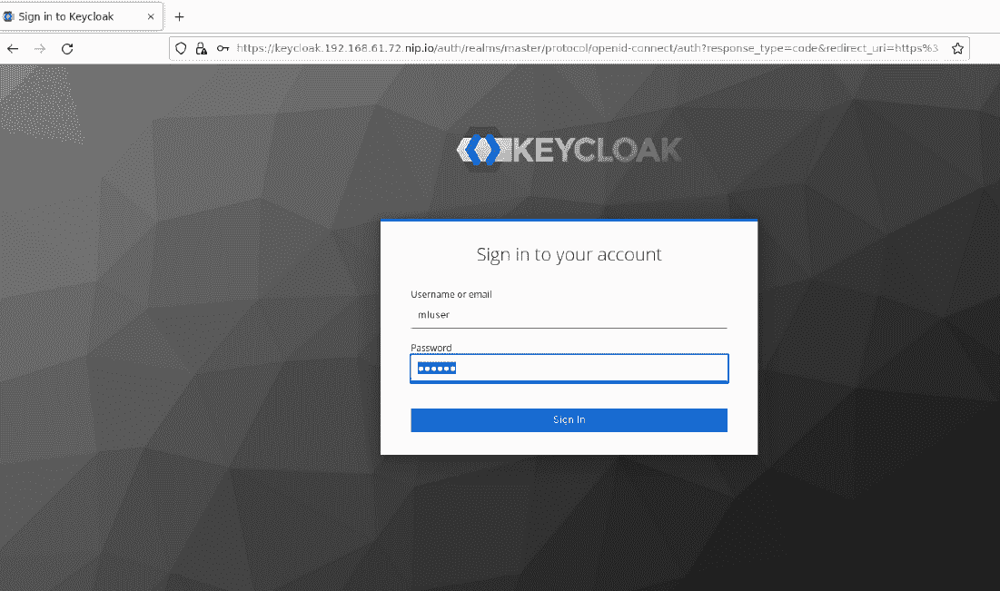

# 第四章：*第五章*：数据工程

数据工程通常是指在组织中管理和组织数据及数据流的过程。它涉及数据收集、处理、版本控制、数据治理和分析。这是一个庞大的主题，围绕数据处理平台、数据湖、数据集市、数据仓库和数据流的开发与维护展开。数据工程是一个重要的实践，它为**大数据**和**机器学习**（**ML**）项目的成功做出了贡献。本章将介绍数据工程在机器学习中的具体应用。

许多机器学习教程/书籍从一个干净的数据集和 CSV 文件开始，构建您的模型。现实世界则不同。数据呈现出多种形态和规模，因此您需要有一个明确的策略来收集、处理并大规模准备数据。本章将讨论开源工具，这些工具可以为机器学习项目中的数据工程奠定基础。您将学习如何在 Kubernetes 平台上安装这些开源工具集，以及这些工具如何帮助您和您的团队提高效率和灵活性。

在本章中，您将学习以下内容：

+   配置 Keycloak 进行身份验证

+   配置 Open Data Hub 组件

+   理解并使用 JupyterHub IDE

+   理解 Apache Spark 的基础知识

+   理解 Open Data Hub 如何按需提供 Apache Spark 集群

+   从 Jupyter Notebook 编写并运行 Spark 应用程序

# 技术要求

本章包括一些动手设置和练习。您将需要一个已配置好**操作生命周期管理器（Operator Lifecycle Manager）**的 Kubernetes 集群。如何构建这样的 Kubernetes 环境已在*第三章*《探索 Kubernetes》中介绍。在进行本章的技术练习之前，请确保您已经在 Kubernetes 集群上搭建了运行中的 Kubernetes 集群，并安装了**Open Data Hub**（**ODH**）。ODH 的安装可参考*第四章*《机器学习平台的构成》。您可以在[`github.com/PacktPublishing/Machine-Learning-on-Kubernetes`](https://github.com/PacktPublishing/Machine-Learning-on-Kubernetes)找到本书的所有相关代码。

# 配置 Keycloak 进行身份验证

在开始使用平台的任何组件之前，您需要配置与平台组件相关联的身份验证系统。如在*第四章*《机器学习平台的构成》中所述，您将使用 Keycloak，这是一款开源软件，用于提供身份验证服务。

首先，从 `chapter5/realm-export.json` 导入配置，该文件可在本书关联的代码库中找到。此文件包含将 OAuth2 功能关联到平台组件所需的配置。

虽然本书不是 Keycloak 的指南，但我们会提供一些基本定义，以帮助你理解 Keycloak 服务器的高级分类：

+   **Realm**：Keycloak 领域是一个管理属于同一域的用户、角色、组和客户端应用程序的对象。一个 Keycloak 服务器可以有多个领域，因此你可以有多个配置集，例如一个领域用于内部应用程序，另一个用于外部应用程序。

+   **Clients**：客户端是可以请求用户认证的实体。一个 Keycloak 客户端对象与一个领域相关联。我们平台中所有需要**单点登录**（**SSO**）的应用程序都将作为**客户端**注册到 Keycloak 服务器中。

+   **用户和组**：这两个术语不言而喻，在接下来的步骤中，你将创建一个新用户，并使用它登录到平台的不同软件中。

下一步是配置 Keycloak，为我们的 ML 平台组件提供 OAuth 功能。

## 导入 Keycloak 配置以供 ODH 组件使用

在本节中，你将把客户端和组配置导入到运行在 Kubernetes 集群上的 Keycloak 服务器中。以下步骤将把所有配置导入到 Keycloak 服务器的主领域：

1.  使用用户名`admin`和密码`admin`登录到你的 Keycloak 服务器。在左侧边栏的**管理**标题下点击**导入**链接：


图 5.1 – Keycloak 主领域

1.  点击屏幕上的**选择文件**按钮，如下所示：


图 5.2 – Keycloak 导入配置页面

1.  从弹出窗口中选择`chapter5/realm-export.json`文件。之后，选择**跳过**，在**如果资源已存在**下拉选项中，然后点击**导入**：


图 5.3 – Keycloak 导入配置页面

1.  验证记录是否已成功导入到你的 Keycloak 服务器：


图 5.4 – Keycloak 导入配置结果页面

1.  验证是否已创建四个客户端，方法是点击左侧菜单中的**Clients**项。应该存在以下客户端 ID：**aflow**、**mflow**、**grafana**和**jhub**。**aflow**客户端用于平台的工作流引擎，是**Apache Airflow**的一个实例。**mflow**客户端用于模型注册和训练跟踪工具，是**MLflow**的一个实例。**grafana**客户端用于监控 UI，是**Grafana**的一个实例。最后，**jhub**客户端用于**JupyterHub**服务器实例。


图 5.5 – Keycloak 客户端页面

1.  验证是否已创建名为 **ml-group** 的组，方法是在左侧面板点击 **Groups** 链接：


图 5.6 – Keycloak 组页面

你将使用该用户组来创建平台用户。

很棒！你刚刚为 ML 平台配置了多个 Keycloak 客户端。下一步是在 Keycloak 中创建一个用户，你将使用该用户进行本书余下部分的操作。需要注意的是，Keycloak 可以与企业目录或任何其他数据库集成，并将其用作用户源。请记住，我们在这里使用的领域配置非常基础，不建议用于生产环境。

## 创建 Keycloak 用户

在本节中，你将创建一个新用户，并将新创建的用户与前一节中导入的组关联。将用户与组关联将授予不同 ODH 软件所需的角色：

1.  在 Keycloak 页面左侧，点击 **Users** 链接进入该页面。要添加新用户，点击右侧的 **Add user** 按钮：


图 5.7 – Keycloak 用户列表

1.  添加用户名 `mluser`，确保 **User Enabled** 和 **Email Verified** 切换按钮设置为 **ON**。在 **Groups** 中，选择 **ml-group** 组，并填写 **Email**、**First Name** 和 **Last Name** 字段，如 *图 5.8* 所示，然后点击 **Save** 按钮：


图 5.8 – Keycloak 添加用户页面

1.  点击 **Credentials** 标签页为你的用户设置密码：


图 5.9 – Keycloak 凭证页面

1.  输入你选择的密码，然后禁用 **Temporary** 标志，点击 **Set Password** 按钮。

你刚刚在 Keycloak 中创建并配置了一个用户。现在你的 Keycloak 服务器已经可以被 ML 平台组件使用。下一步是探索平台中为所有角色提供主要编码环境的组件。

# 配置 ODH 组件

在*第四章*《机器学习平台的构成》中，你已经安装了 ODH 操作符。使用 ODH 操作符，你将配置一个 ODH 实例，该实例将自动安装 ML 平台的组件。ODH 执行 **Kustomize** 脚本来安装 ML 平台的组件。作为本书代码的一部分，我们提供了模板来安装和配置运行平台所需的所有组件。

你还可以通过 `manifests` 文件配置 ODH 操作员为你安装哪些组件。你可以将特定的配置传递给清单文件，并选择所需的组件。一本书的代码仓库中有一个这样的清单，路径为 `manifests/kfdef/ml-platform.yaml`。这个 YAML 文件为 ODH 操作员配置了所需的安装软件，使其成为平台的一部分。你需要对这个文件进行一些修改，接下来你将看到具体操作。

该文件定义了平台的组件以及这些组件获取设置的位置：

+   **名称**：定义组件的名称。

+   `path` 属性定义了配置此组件所需文件的相对路径位置。

+   `KEYCLOAK_URL` 和 `JUPYTERHUB_HOST` 需要根据你的配置进行更改。

+   `manifests/jupytherhub/overlays` 文件夹在代码仓库中。

+   **Repos**：此配置部分特定于每个清单文件，并适用于清单中的所有组件。它定义了包含所有被清单文件引用文件的 Git 仓库的位置和版本。如果你希望清单引用你自己的安装文件，需在此处指定正确的 Git 仓库（包含你文件的仓库）。

*图 5.10* 展示了清单文件中定义 JupyterHub 组件的部分：


图 5.10 – ODH 清单文件中的组件

你将使用提供的清单文件来创建 ML 平台的实例。你也可以根据需要修改此文件，通过调整配置或添加、移除平台组件来进行个性化设置。但是，在书中的练习中，我们不建议你进行更改，除非有特别指示。

现在你已经看到了 ODH 清单文件，是时候充分利用它来创建你的第一个 Kubernetes 上的 ML 平台了。

## 安装 ODH

在我们安装平台的数据工程组件之前，我们首先需要创建一个 ODH 实例。ODH 实例是一个经过精心策划的相关工具集的集合，作为 ML 平台的组件。尽管 ML 平台可能包含 ODH 提供之外的组件，但可以公平地说，ODH 实例就是 ML 平台的一个实例。你也可以在同一个 Kubernetes 集群上运行多个 ODH 实例，只要它们运行在各自隔离的 Kubernetes 命名空间中。这在组织中的多个团队或部门共享单一 Kubernetes 集群时非常有用。

以下是你需要按照的步骤，以在 Kubernetes 集群上创建 ODH 实例：

1.  使用以下命令在 Kubernetes 集群中创建一个新命名空间：

    ```
    kubectl create ns ml-workshop
    ```

你应该看到以下响应：


图 5.11 – 你的 Kubernetes 集群中的新命名空间

1.  确保 ODH 操作符正在运行，执行以下命令：

    ```
    kubectl get pods -n operators
    ```

你应该看到以下响应。确保状态显示为`Running`：


图 5.12 – ODH 操作符的状态

1.  获取你`minikube`环境的 IP 地址。这个 IP 地址将用于为平台的不同组件创建入口，就像我们为 Keycloak 所做的那样。请注意，依据你的底层基础设施，每个`minikube`实例的 IP 可能会不同：

    ```
    minikube ip
    ```

这个命令应该会给出你`minikube`集群的 IP 地址。

1.  打开`manifests/kfdef/ml-platform.yaml`文件，并将以下参数的值更改为你`minikube`实例的 NIP（`nip.io`）域名。只需要替换域名中的 IP 地址部分。例如，`KEYCLOAK_URL keycloak.<IP Address>.nip.io`应该改为`keycloak.192.168.61.72.nip.io`。注意，这些参数在文件中可能会被多次引用。在完整的 Kubernetes 环境中，`<IP Address>`应该是你的 Kubernetes 集群的域名：

    1.  `KEYCLOAK_URL`

    1.  `JUPYTERHUB_HOST`

    1.  `AIRFLOW_HOST`

    1.  `MINIO_HOST`

    1.  `MLFLOW_HOST`

    1.  `GRAFANA_HOST`

1.  使用以下命令将清单文件应用到你的 Kubernetes 集群：

    ```
    kubectl create -f manifests/kfdef/ml-platform.yaml -n ml-workshop
    ```

你应该看到以下响应：


图 5.13 – 应用 ODH 组件清单后的结果

1.  使用以下命令开始监控在`ml-workshop`命名空间中创建的 Pods。安装所有组件需要一些时间。几分钟后，所有 Pods 将进入运行状态。在 Pods 创建过程中，你可能会看到一些 Pods 抛出错误。这是正常现象，因为某些 Pods 依赖于其他 Pods。耐心等待，所有组件最终会安装完毕，Pods 将进入运行状态：

    ```
    watch kubectl get pods -n ml-workshop
    ```

当所有 Pods 都在运行时，你应该看到以下响应：


图 5.14 – CLI 响应，展示 ODH 组件在 Kubernetes 集群上运行的情况

那么，这个命令是做什么的呢？`kfdef` `ml-workshop`命名空间：

```
kubectl get all -n ml-workshop
```

你应该看到 ODH 操作符在`ml-workshop`命名空间中创建的所有对象。

恭喜！你刚刚创建了一个新的 ODH 实例。现在你已经看过了从清单文件创建 ML 平台实例的过程，是时候看看数据工程师将用来开展工作的平台各个组件了。

使用 Podman 驱动的 Minikube

请注意，对于某些使用 `podman` 驱动程序的 `minikube` 设置（在 Linux 上），由于线程数的限制，Spark 操作符可能会失败。为了解决这个问题，你需要在 `minikube` 配置中使用 `kvm2` 驱动程序。你可以通过在 `minikube start` 命令中添加 `--driver=kvm2` 参数来实现。

# 理解和使用 JupyterHub

Jupyter Notebook 已成为编写机器学习项目代码的极受欢迎的工具。JupyterHub 是一款软件，它便于自助提供计算环境，包括启动预配置的 Jupyter Notebook 服务器并在 Kubernetes 平台上提供相关的计算资源。数据工程师和数据科学家等按需终端用户可以为自己提供专用的 Jupyter Notebook 实例。如果请求的用户已经有了自己运行的 Jupyter Notebook 实例，Hub 将直接将用户引导到现有实例，从而避免重复的环境。对终端用户而言，整个过程是无缝的。你将在本章的下一部分看到这一点。

当用户请求 JupyterHub 中的一个环境时，他们还可以选择预配置的硬件资源（如 CPU、内存和存储）大小。这为开发者、数据工程师和数据科学家提供了一种灵活的方式，使他们能够为特定任务分配合适的计算资源。这种资源的动态分配是通过底层的 Kubernetes 平台来实现的。

不同的用户可能需要不同的框架、库和编程环境的版本。一些数据科学家可能想使用 TensorFlow，而其他人可能想使用 scikit-learn 或 PyTorch。一些数据工程师可能更喜欢使用 pandas，而其他人可能需要在 PySpark 中运行数据管道。在 JupyterHub 中，他们可以为这些场景配置多个预定义的环境。用户在请求新环境时，可以选择一个预定义的配置。这些预定义的环境实际上是容器镜像。这意味着平台操作员或管理员可以准备多个预定义的容器镜像，作为终端用户的计算环境。此功能还支持环境的标准化。你有多少次在不同开发者计算机上处理不同版本库的情况？环境的标准化可以减少与库版本不一致相关的问题，并通常减少 *它在我的机器上能运行* 的问题。

*图 5.15* 展示了为 JupyterHub 环境配置的新环境的三步流程：

![图 5.15 – 创建 JupyterHub 新环境的工作流程]

](img/B18332_05_015.jpg)

图 5.15 – 创建 JupyterHub 新环境的工作流程

现在你知道了 JupyterHub 能做什么，我们来看看它是如何运作的。

## 验证 JupyterHub 安装

团队中的每个数据工程师都遵循一个简单而标准的环境配置工作流。不再需要手动安装和调试工作站配置。这对于自主团队来说非常好，肯定能提高团队的效率。

ODH 运维人员已经为你在之前的部分安装了 JupyterHub。现在，你将以数据工程师身份启动一个新的 Jupyter Notebook 环境，并编写数据管道：

1.  使用以下命令获取在 Kubernetes 环境中创建的 ingress 对象。我们运行此命令以查找 JupyterHub 的 URL：

    ```
    kubectl get ingress -n ml-workshop
    ```

你应该看到以下示例响应。请注意在 `HOSTS` 列中显示的 JupyterHub URL：


图 5.16 – 集群中的所有 ingress

1.  从与 minikube 运行在同一台机器上的浏览器中，访问 JupyterHub URL。该 URL 看起来像是 https://jupyterhub.<MINIKUBE IP ADDRESS>.nip.io。此 URL 会将你带到 Keycloak 登录页面进行 SSO 认证。确保在这个 URL 中将 IP 地址替换为你 minikube 的 IP 地址：



图 5.17 – JupyterHub 的 SSO 挑战

1.  输入 `mluser` 作为用户名，然后输入你为该用户设置的密码，点击 **Sign In**。

你将看到 JupyterHub 服务器的登录页面，允许你选择你想使用的 notebook 容器镜像，以及你所需的预定义计算资源大小。

notebook 镜像部分包含了你通过 ODH 清单文件从代码库中的 `manifests/jupyterhub-images` 文件夹中配置的标准 notebooks。

容器大小下拉菜单允许你选择适合你需求的环境大小。此配置也通过 `manifests/jupyterhub/jupyterhub/overlays/mlops/jupyterhub-singleuser-profiles-sizes-configmap.yaml` 清单文件进行控制。

我们鼓励你查看这些文件，了解你可以为每个清单配置哪些设置。


图 5.18 – JupyterHub 登录页面

选择 **Base Elyra Notebook Image** 和 **Default** 容器大小，然后点击 **Start server**。

1.  通过执行以下命令验证是否为你的用户创建了一个新的 Pod。Jupyter Notebook 实例的名称以 `jupyter-nb-` 开头，并以用户名作为后缀。这使得每个用户的 notebook pod 拥有独特的名称：

    ```
    kubectl get pods -n ml-workshop | grep mluser 
    ```

你应该看到以下响应：


图 5.19 – JupyterHub 创建的 Jupyter Notebook pod

1.  恭喜！你现在正在 Kubernetes 平台上运行自己的自供给 Jupyter Notebook 服务器。


图 5.20 – Jupyter Notebook 登录页面

1.  现在，让我们停止 notebook 服务器。点击 **File > Hub Control Panel** 菜单选项，进入以下所示的 **Hub 控制面板** 页面：


图 5.21 – 查看 Hub 控制面板的菜单选项

1.  点击 **Stop My Server** 按钮。这是停止你 Jupyter Notebook 实例的方式。你可能稍后想要重新启动它以继续下一步。


图 5.22 – Hub 控制面板

1.  通过发出以下命令验证新 pod 是否已为你的用户销毁：

    ```
    kubectl get pods -n ml-workshop | grep mluser 
    ```

此命令应该没有输出，因为 Jupyter Notebook pod 已被 JupyterHub 销毁。

我们将留给你自己探索在你环境中 notebook 的不同配置。你将在本章和接下来的几章中使用这个 Jupyter notebook 编写代码，所以如果你只是想继续阅读，你不会错过任何重要内容。

## 运行你的第一个 Jupyter notebook

现在你的 Jupyter notebook 已经运行，是时候编写 `Hello World!` 程序了。在本书的代码仓库中，我们提供了这样的一个程序，在接下来的步骤中，你将使用 Git 检出代码并运行该程序。在开始这些步骤之前，请确保你可以通过浏览器访问你的 Jupyter notebook，如前一节所述：

1.  点击 Jupyter notebook 左侧菜单中的 Git 图标。该图标是从顶部数起的第三个。它会显示三个不同操作的按钮。点击 **Clone a Repository** 按钮：


图 5.23 – Jupyter notebook 中的 Git 操作

1.  在 **Clone a repo** 弹出框中，输入本书的代码仓库位置，[`github.com/PacktPublishing/Machine-Learning-on-Kubernetes.git`](https://github.com/PacktPublishing/Machine-Learning-on-Kubernetes.git)，然后点击 **CLONE**。


图 5.24 – 在 Jupyter notebook 中克隆 Git 仓库

1.  你会看到代码仓库已被克隆到 Jupyter notebook 的文件系统中。如 *图 5.25* 所示，导航到 `chapter5/helloworld.ipynb` 文件并在 notebook 中打开它。点击顶部栏上的小播放图标运行该单元：


图 5.25 – 在你的 Jupyter 环境中的 notebook

1.  Voilà！你刚刚在自己配置的 Kubernetes 上运行的 Jupyter Notebook 服务器中执行了 Python 代码。

1.  通过选择 **文件 > Hub 控制面板** 菜单选项关闭你的笔记本。点击 **停止我的服务器** 按钮来关闭你的环境。请注意，ODH 会保存你的磁盘，下次启动笔记本时，所有保存的文件都会可用。

恭喜！现在，你可以在平台上运行你的代码。接下来，我们将回顾一下 Apache Spark 引擎的一些基础知识。

# 理解 Apache Spark 的基础知识

Apache Spark 是一个开源的数据处理引擎，旨在分布式大规模数据处理。这意味着，如果你处理的是较小的数据集，比如 10s 或者几百 GB，经过优化的传统数据库可能会提供更快的处理时间。Apache Spark 的主要特点是其能够在内存中进行中间计算，这使得 Apache Spark 比 Hadoop MapReduce 更加高效。

Apache Spark 的设计目标是速度、灵活性和易用性。Apache Spark 提供了超过 70 个高级数据处理操作符，使数据工程师可以轻松构建数据应用程序，因此使用 Apache Spark API 编写数据处理逻辑变得非常简单。灵活性意味着 Spark 作为一个统一的数据处理引擎，可以处理多种数据工作负载，如批处理应用程序、流处理应用程序、交互式查询，甚至是机器学习算法。

*图 5.26* 显示了 Apache Spark 组件：

![图 5.26 – Apache Spark 组件]

](img/B18332_05_027.jpg)

图 5.26 – Apache Spark 组件

## 理解 Apache Spark 作业执行

现在大多数数据工程师都知道 Apache Spark 是一个大规模并行数据处理引擎。它是 Apache 软件基金会最成功的项目之一。Spark 通常运行在多个 **虚拟机**（**VMs**）或裸金属服务器的集群上。然而，随着容器和 Kubernetes 的流行，Spark 增加了对在 Kubernetes 上运行 Spark 集群的支持。

在 Kubernetes 上运行 Spark 的两种最常见方式如下。第一种，也是原生方式，是通过 Kubernetes 引擎本身来协调 Kubernetes 工作节点。在这种方法中，Spark 集群实例始终运行，Spark 应用程序被提交到 Kubernetes API，然后 Kubernetes API 调度提交的应用程序。我们不会深入探讨这部分实现。第二种方法是通过 Kubernetes 运维工具（operators）。运维工具利用 Kubernetes CRD 来在 Kubernetes 中本地创建 Spark 对象。在这种方法中，Spark 集群是通过 Spark 运维工具动态创建的。与其将 Spark 应用程序提交到现有的集群，不如通过运维工具按需启动 Spark 集群。

Spark 集群采用管理/工作架构。Spark 集群管理器知道工作节点的位置，以及工作节点可用的资源。Spark 集群管理着将运行应用程序的工作节点集群的资源。每个工作节点都有一个或多个执行进程，通过执行进程运行分配的任务。

Spark 应用程序有两部分：驱动程序组件和数据处理逻辑。驱动程序组件负责执行数据处理操作的流程。驱动程序首先与集群管理器交互，找出哪些工作节点将运行应用程序逻辑。驱动程序将所有应用操作转换为任务，调度它们，并将任务直接分配给工作节点上的执行进程。一个执行进程可以运行多个与相同 Spark 上下文相关的任务。

如果你的应用程序需要收集计算结果并进行合并，驱动程序将负责此项工作。作为数据工程师，这一切操作都通过 SparkSession 对象进行了抽象，你只需要编写数据处理逻辑。我们提到过 Apache Spark 旨在简化操作吗？

*图 5.27* 显示了 Spark 驱动程序、Spark 集群管理器和 Spark 工作节点之间的关系：


图 5.27 – Apache Spark 组件关系

# 了解 ODH 如何按需提供 Apache Spark 集群

我们已经讨论了 ODH 如何帮助你创建一个动态灵活的开发环境，使用 Jupyter Notebook 编写代码，如数据管道。我们注意到，数据开发人员需要与 IT 部门互动，以便获得数据处理集群（如 Apache Spark）上的时间。这些互动降低了团队的敏捷性，而这是 ML 平台解决的一个问题。为了符合这一场景，ODH 提供了以下组件：

+   一个 Spark 操作符，用于启动 Apache Spark 集群。本书中，我们基于 ODH 和 radanalytics 提供的原始 Spark 操作符进行了分支，以适应 Kubernetes API 的最新变化。

+   JupyterHub 中的一项功能，当用户创建特定的笔记本环境时，向 Spark 操作符发出请求，要求创建一个新的 Spark 集群。

作为数据工程师，当你使用某些笔记本镜像启动新的笔记本环境时，JupyterHub 不仅会启动一个新的笔记本服务器，还会通过 Spark 操作符为你创建一个专用的 Apache Spark 集群。

## 创建 Spark 集群

让我们首先看看 Spark 操作符在 Kubernetes 集群中的工作方式。ODH 创建了 Spark 控制器。你可以在 `chapter5/ml-platform.yaml` 文件中查看配置，文件名为 `radanalyticsio-spark-cluster`，如 *图 5.28* 所示。你可以看到，这是另一组 Kubernetes YAML 文件，定义了本书代码库中的 `manifests/radanalyticsio` 文件夹。


图 5.28 – 安装 Spark 操作符的清单部分代码片段

当你需要启动一个 Apache Spark 集群时，可以通过创建一个名为**SparkCluster**的 Kubernetes 自定义资源来实现。收到请求后，Spark 操作符将根据所需的配置来配置一个新的 Spark 集群。以下步骤将向你展示如何在你的平台上配置 Spark 集群：

1.  验证 Spark 操作符 Pod 是否正在运行：

    ```
    kubectl get pods -n ml-workshop | grep spark-operator
    ```

你应该看到如下响应：


图 5.29 – Spark 操作符 Pod

1.  使用`chapter5/simple-spark-cluster.yaml`文件创建一个包含一个工作节点的简单 Spark 集群。你可以看到该文件请求一个包含一个主节点和一个工作节点的 Spark 集群。通过这个自定义资源，你可以设置多个 Spark 配置，正如我们将在下一节中看到的那样：


图 5.30 – Spark 自定义资源

在你的 Kubernetes 集群中通过运行以下命令创建这个 Spark 集群自定义资源。Spark 操作符会不断扫描 Kubernetes 平台上的此资源，并为每个指定的 Spark 集群自定义资源自动创建一个新的 Apache Spark 集群实例：

```
kubectl create -f chapter5/simple-spark-cluster.yaml -n ml-workshop
```

你应该看到如下响应：


图 5.31 – 创建 Spark 集群后的响应

1.  验证 Spark 集群的 Pod 是否在你的集群中运行：

    ```
    kubectl get pods -n ml-workshop | grep simple-spark
    ```

你应该看到如下响应。Spark 操作符已创建两个 Pod，一个用于 Spark 主节点，另一个用于工作节点。工作节点的 Pod 数量取决于`SparkCluster`资源中的`instances`参数值。首次启动时，Pod 可能需要一些时间才能进入运行状态：


图 5.32 – 正在运行的 Spark 集群 Pod 列表

现在，你已经了解了 Spark 操作符在 Kubernetes 集群中的工作原理。下一步是查看 JupyterHub 是如何配置以动态请求集群，并在为你配置新笔记本时提供 Spark 集群的。

## 了解 JupyterHub 如何创建 Spark 集群

简而言之，JupyterHub 执行了你在前一节中所做的操作。JupyterHub 在 Kubernetes 中创建一个`SparkCluster`资源，以便 Spark 操作符可以为你配置 Apache Spark 集群。这个`SparkCluster`资源配置是一个 Kubernetes `ConfigMap`文件，位于`manifests/jupyterhub/jupyterhub/base/jupyterhub-spark-operator-configmap.yaml`。请查找文件中的`sparkClusterTemplate`，如*图 5.33*所示。你可以看到它看起来与前一节中你创建的文件相似：


图 5.33 – JupyterHub 用于 Spark 资源的模板

你们中的一些人可能已经注意到这是一个模板，它需要填写模板中提到的特定变量的值。诸如`{{ user }}`和`{{ worker_nodes }}`等变量。回想一下，我们提到过 JupyterHub 在为你的笔记本配置容器时，会创建`SparkCluster`请求。JupyterHub 使用这个文件作为模板，并在创建笔记本时填充相应的值。JupyterHub 是如何决定创建 Spark 集群的呢？这个配置文件在`manifests/jupyterhub/jupyterhub/overlays/spark3/jupyterhub-singleuser-profiles-configmap.yaml`中，称为`ConfigMap`文件。它看起来像*图 5.33*所示的文件。

你可以看到，`image`字段指定了该配置文件将触发的容器镜像名称。因此，作为数据工程师，当你从 JupyterHub 登录页选择该笔记本镜像时，JupyterHub 将应用此配置文件。配置文件中的第二部分是`env`部分，它指定了将被推送到笔记本容器实例的环境变量。`configuration`对象定义了将应用于在`resources`键中提到的模板的值：


图 5.34 – JupyterHub 针对 Spark 资源的配置文件

正如你可能已经感受到的那样，在后台有很多工作在进行，旨在为你和你的团队提供一个流畅的体验，并且从开源的真正意义上讲，你可以配置所有内容，甚至如果你有任何修改或新功能，也可以回馈项目。

在下一节中，你将看到如何在运行这些组件的平台上编写和运行 Spark 应用程序是多么容易。

# 从 Jupyter Notebook 编写和运行 Spark 应用程序

在执行以下步骤之前，请确保你理解了我们在本章前面部分介绍的组件及其相互关系：

1.  通过运行以下命令，验证 Spark 操作员 Pod 是否正在运行：

    ```
    kubectl get pods -n ml-workshop | grep spark-operator
    ```

你应该会看到以下响应：


图 5.35 – Spark 操作员 Pod

1.  通过运行以下命令，验证 JupyterHub Pod 是否正在运行：

    ```
    kubectl get pods -n ml-workshop | grep jupyterhub
    ```

你应该会看到以下响应：


图 5.36 – JupyterHub Pod

1.  在启动笔记本之前，让我们通过运行以下命令删除你在前面部分创建的 Spark 集群。这样可以演示 JupyterHub 将自动为你创建一个新的 Spark 集群实例：

    ```
    kubectl delete sparkcluster simple-spark-cluster -n ml-workshop
    ```

1.  登录到你的 JupyterHub 服务器。参考本章前面提到的*验证 JupyterHub 配置*部分。你将看到服务器的登录页面。选择`manifests/jupyterhub/jupyterhub/overlays/spark3/jupyterhub-singleuser-profiles-configmap.yaml`文件。

1.  点击 **启动服务器**：


](img/B18332_05_038.jpg)

图 5.37 – 显示 Elyra Notebook 图像与 Spark 的 JupyterHub 登录页面

你刚刚启动的笔记本也会触发为你创建一个专用的 Spark 集群。启动笔记本可能需要一些时间，因为它需要等待 Spark 集群准备好。

此外，你可能已经注意到，在 `jupyterhub-singleuser-profiles-configmap.yaml` 文件中配置的镜像是 `quay.io/ml-aml-workshop/elyra-spark:0.0.4`，而我们选择的文件名称是 `manifests/jupyterhub-images/elyra-notebook-spark3-imagestream.yaml`。你会发现显示在 JupyterHub 登录页面上的描述性文本来自该文件的 *annotations* 部分。如果你想添加包含特定库的自定义镜像，只需在这里添加另一个文件，它就会对你的团队可用。JupyterHub 的这一功能使笔记本容器镜像的标准化成为可能，从而使团队中的每个人都能拥有相同的环境配置和相同的库集。

1.  启动笔记本后，验证 Spark 集群是否已经为你配置好。请注意，这是为该笔记本用户专用的 Spark 集群，仅限于该用户使用：

    ```
    kubectl get pods -n ml-workshop | grep mluser
    ```

你应该看到以下响应。该响应包含一个笔记本 Pod 和两个 Spark Pod；其中带有 `-m` 字符的是主节点，另一个是工作节点。注意，你的用户名（`mluser`）是如何与 Pod 名称关联的：


](img/B18332_05_039.jpg)

图 5.38 – Jupyter Notebook 和 Spark 集群 Pod

现在，你团队中的每个人都会获得自己的开发环境，并配备专用的 Spark 实例来编写和测试数据处理代码。

1.  Apache Spark 提供了一个用户界面，通过该界面你可以监控应用程序和数据处理作业。ODH 提供的 Spark 集群提供了这个图形用户界面，并且它可以通过 `https://spark-cluster-mluser.192.168.61.72.nip.io` 访问。确保将 IP 地址更改为你自己的 minikube IP 地址。你可能还会注意到，登录 JupyterHub 使用的用户名 `mluser` 是 URL 的一部分。如果你使用了不同的用户名，可能需要相应地调整 URL。


](img/B18332_05_040.jpg)

图 5.39 – Spark 用户界面

前面的用户界面提到你在集群中有一个工作节点，你可以点击该工作节点查看在其中运行的执行器。如果你想刷新你对 Spark 集群的了解，请参考本章前面的 *理解 Apache Spark 基础知识* 部分。

1.  打开 notebook 中的 `chapter5/hellospark.ipynb` 文件。这是一个非常简单的作业，计算给定数组的平方。记住，Spark 会自动调度作业并将其分发给执行器。这里的 notebook 是 Spark 驱动程序，它与 Spark 集群进行通信，所有这一切都通过 `SparkSession` 对象进行抽象。

在此 notebook 的第二个代码单元格中，你正在创建一个 `SparkSession` 对象。`getOrCreateSparkSession` 实用函数将连接到平台为你配置的 Spark 集群。

最后一格单元格是你数据处理逻辑所在的位置。在这个例子中，逻辑是获取数据并计算数组中每个元素的平方。一旦数据处理完成，`collect`方法会将响应带回到你 notebook 中运行的 Spark 应用程序的驱动程序。


图 5.40 – 一个包含简单 Spark 应用程序的 notebook

点击**运行 > 运行所有单元格**菜单选项，notebook 将连接到 Spark 集群，提交并执行你的作业。

1.  在作业进行时，打开 Spark UI，网址是[`spark-cluster-mluser.192.168.61.72.nip.io`](https://spark-cluster-mluser.192.168.61.72.nip.io)。记得根据你的设置调整 IP 地址，并点击页面中**运行中的应用程序**标题下的**应用程序 ID**表格。


图 5.41 – Apache Spark UI

1.  进入 Spark 应用程序的详情页。请注意，应用程序标题**Hello from ODH**已在你的 notebook 中设置。点击**应用程序详情 UI**链接：


图 5.42 – Spark UI 显示已提交的 Spark 作业

你应该看到一个页面，显示你刚刚在 Spark 集群上通过 Jupyter notebook 执行的作业的详细指标：


图 5.43 – Spark UI 显示已提交的作业详情

1.  完成工作后，转到**文件 > Hub 控制面板**菜单选项，并点击**停止我的服务器**按钮：


图 5.44 – Jupyter Notebook 控制面板

1.  通过执行以下命令来验证 Spark 集群是否已被终止：

    ```
    kubectl get pods -n ml-workshop | grep mluser
    ```

你不应该看到响应，因为这些 pods 已被集群中的 Spark 操作员终止。

你终于在一个按需的、运行在 Kubernetes 上的临时 Spark 集群中运行了一个基本的数据处理作业。请注意，你是通过在 Kubernetes 上运行的 Jupyter notebook 完成了这一切。

通过平台的这一功能，数据工程师可以直接从浏览器执行大规模的数据处理任务。这一功能还使他们能够轻松地协作，提供转换、清洗过的高质量数据，以支持你的 ML 项目。

# 总结

在这一章节中，你刚刚创建了你的第一个 ML 平台。你通过 ODH Kubernetes 操作员配置了 ODH 组件。你已经看到，数据工程师如何使用 JupyterHub 来配置 Jupyter notebook 和 Apache Spark 集群实例，同时平台自动提供环境的配置。你还看到，平台如何通过容器镜像实现操作环境的标准化，确保一致性和安全性。你也看到了，数据工程师如何从 Jupyter notebook 中运行 Apache Spark 作业。

所有这些功能使得数据工程师能够自主工作，并以自服务的方式操作。你已经看到，所有这些组件都是自主且按需提供的。平台的弹性和自服务特性将使团队在应对数据和 ML 领域不断变化的需求时更加高效和敏捷。

在下一章节中，你将看到数据科学家如何从平台中受益并提高效率。
