# 第五章：*第六章*：机器学习工程

在本章中，我们将把讨论转向 **机器学习**（**ML**）工程生命周期中的模型构建和模型管理活动。您将学习 ML 平台在为数据科学家提供自服务解决方案中的角色，以便他们能够更高效地工作，并与数据团队和其他数据科学家进行合作。

本章的重点不在于构建模型，而是展示平台如何在不同环境和团队成员之间提供一致性和安全性。您将学习平台如何简化数据科学家在准备和维护数据科学工作空间方面的工作。

在本章中，您将学习以下主题：

+   理解机器学习工程？

+   使用自定义笔记本镜像

+   介绍 MLflow

+   使用 MLflow 作为实验跟踪系统

+   使用 MLflow 作为模型注册系统

# 技术要求

本章包含一些动手设置和练习。您需要一个配置了 **操作员生命周期管理器**（**OLM**）的运行中 Kubernetes 集群。构建这样的 Kubernetes 环境在 *第三章*《探索 Kubernetes》中已有介绍。在尝试本章的技术练习之前，请确保您已经有一个正常运行的 Kubernetes 集群，并且 **开放数据中心**（**ODH**）已安装在您的 Kubernetes 集群上。ODH 的安装方法在 *第四章*《机器学习平台的构造》中有详细说明。您可以在 [`github.com/PacktPublishing/Machine-Learning-on-Kubernetes`](https://github.com/PacktPublishing/Machine-Learning-on-Kubernetes) 找到与本书相关的所有代码。

# 理解机器学习工程

机器学习工程是将软件工程原则和实践应用于机器学习项目的过程。在本书的上下文中，机器学习工程也是一种学科，它有助于将应用开发实践应用于数据科学生命周期。当你编写传统应用程序，如网站或银行系统时，有一系列流程和工具帮助你从一开始就编写高质量的代码。例如，智能 IDE、标准化环境、持续集成、自动化测试和静态代码分析等，都是一些常见的工具。自动化和持续部署实践使得组织能够在一天内多次部署应用程序，且不会出现停机时间。

机器学习工程是一个宽泛的术语，它将传统软件工程实践的好处带入到模型开发领域。然而，大多数数据科学家并非开发人员。他们可能不熟悉软件工程实践。此外，数据科学家使用的工具可能并不是执行机器学习工程任务的最佳工具。话虽如此，模型只是另一种软件。因此，我们也可以将现有的软件工程方法应用于机器学习模型。使用容器打包和部署机器学习模型就是一个例子。

一些团队可能会雇佣机器学习工程师来补充数据科学家的工作。虽然数据科学家的主要职责是构建能够解决业务问题的机器学习或深度学习模型，但机器学习工程师更多地关注软件工程方面的工作。数据工程师的一些职责包括：

+   模型优化（也包括确保构建的模型针对将托管模型的目标环境进行了优化）。

+   模型打包（使机器学习模型可移植、可交付、可执行并进行版本控制）。模型打包还可能包括模型服务和容器化。

+   监控（建立收集性能指标、日志记录、警报和异常检测（如漂移和离群点检测）基础设施）。

+   模型测试（包括促进和自动化 A/B 测试）。

+   模型部署。

+   构建和维护 MLOps 基础设施。

+   实现机器学习模型的持续集成和持续部署流水线。

+   自动化机器学习生命周期过程。

机器学习工程师还有其他职责，虽然这些职责没有列在前面，但这个列表应该能让您对如何区分数据科学与机器学习工程有个大致的了解。

您正在构建的机器学习平台将减少需要手动完成的机器学习工程任务的数量，直到即使是数据科学家也能独立完成大部分机器学习工程任务。

在接下来的章节中，您将看到数据科学家如何跟踪模型开发的迭代，以提高模型质量并与团队分享学习成果。您将看到团队如何将版本控制应用于机器学习模型，以及如何将其他软件工程实践应用于机器学习领域。

我们将在接下来的章节中继续我们的机器学习工程之旅，您将看到如何以标准化方式打包和部署模型，并了解如何自动化部署过程。

让我们从为数据科学团队构建标准开发环境开始。

# 使用自定义笔记本镜像

正如你在*第五章*《数据工程》中看到的那样，JupyterHub 允许你以自助服务的方式启动基于 Jupyter Notebook 的开发环境。你已启动 **Base Elyra Notebook Image** 容器镜像，并使用它编写了基于 Apache Spark 的数据处理代码。这种方法使你的团队能够使用一致或标准化的开发环境（例如，相同的 Python 版本和相同的库来构建代码），并对你的团队使用的已知软件集应用安全策略。然而，你可能还希望创建自己的自定义镜像，使用不同的库或不同的 ML 框架。平台允许你做到这一点。

在接下来的子章节中，你将构建并部署一个自定义容器镜像，以供你的团队使用。

## 构建自定义笔记本容器镜像

假设你的团队希望使用特定版本的 Scikit 库以及其他一些支持库，例如 `joblib`。然后，你希望你的团队在开发数据科学代码时使用此库：

1.  打开本书代码库中提供的 `Dockerfile`，路径为 `chapter6/CustomNotebookDockerfile`。该文件使用了 ODH 提供并使用的基础镜像，然后添加了所需的库。文件如 *图 6.1* 所示：

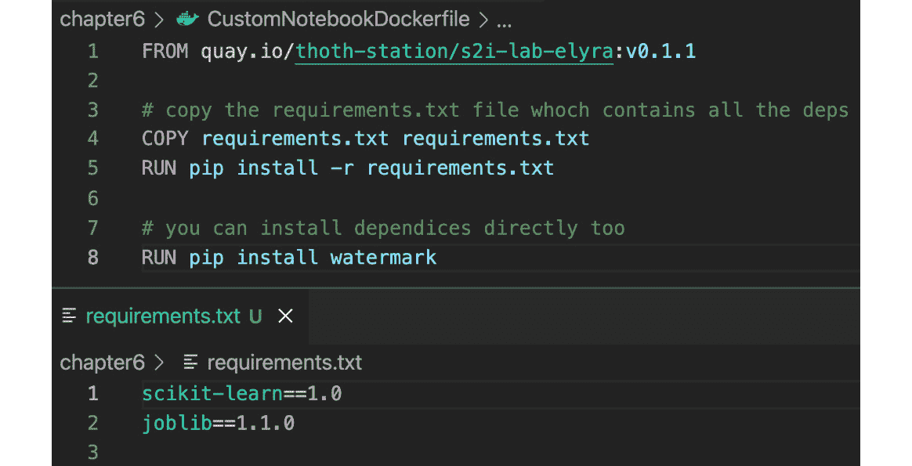

图 6.1 – 自定义笔记本镜像的 Dockerfile

请注意第一行，它指的是写作时最新的镜像。这个镜像由 ODH 使用。第 4 行和第 5 行安装了 `requirements.txt` 文件中定义的 Python 包。第 8 行安装了 `requirements.txt` 文件中未包含的依赖项。如果你希望将其他包添加到镜像中，只需在 `requirements.txt` 中插入一行即可。

1.  使用前一步提供的文件构建镜像。运行以下命令：

    ```
    docker build -t scikit-notebook:v1.1.0 -f chapter6/CustomNotebookDockerfile ./chapter6/. 
    ```

你应该看到以下响应：

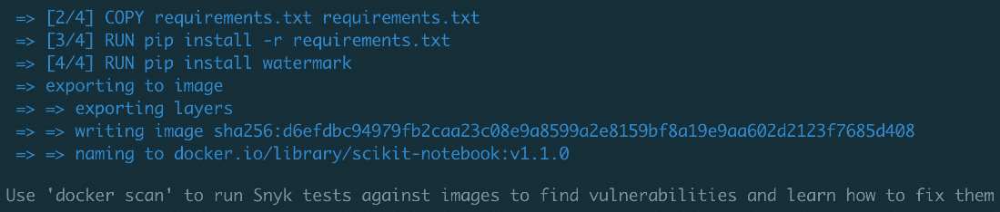

图 6.2 – 容器构建命令的输出

1.  根据你的喜好标记构建好的镜像。你需要将此镜像推送到一个注册表，Kubernetes 集群可以从该注册表访问它。我们使用 `quay.io` 作为首选的公共 Docker 仓库，你也可以在这里使用你偏好的仓库。请注意，在执行命令之前，你需要调整以下命令并更改 `quay.io/ml-on-k8s/` 部分：

    ```
    docker tag scikit-notebook:v1.1.0 quay.io/ml-on-k8s/scikit-notebook:v1.1.0
    ```

前面的命令没有输出。

1.  将镜像推送到你选择的 Docker 仓库。使用以下命令，并确保按照 *第 3 步* 更改仓库位置。根据你的网络连接速度，推送该镜像到互联网仓库可能需要一些时间，请耐心等待：

    ```
    docker push quay.io/ml-on-k8s/scikit-notebook:v1.1.0
    ```

你应该看到如下所示的命令输出，参见 *图 6.3*。等待推送完成。

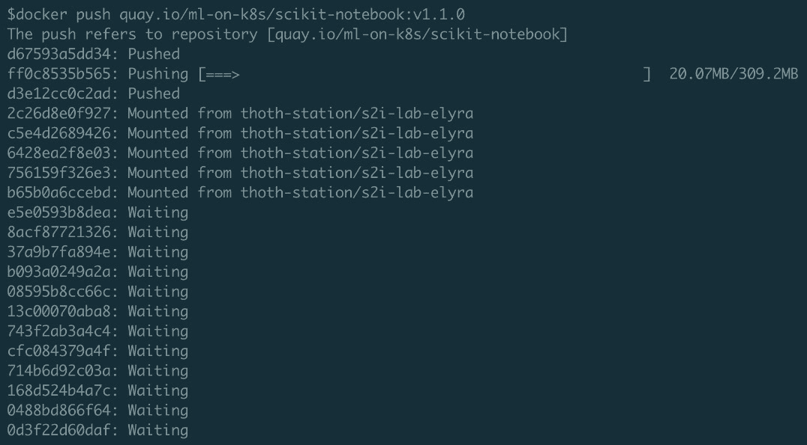

图 6.3 – 将自定义 notebook 镜像推送到 Docker 仓库

现在，镜像已可以使用。接下来的步骤中，您将配置 ODH manifests 以使用此镜像。

1.  打开 `manifests/jupyterhub-images/base/customnotebook-imagestream.yaml` 文件。该文件如下所示：

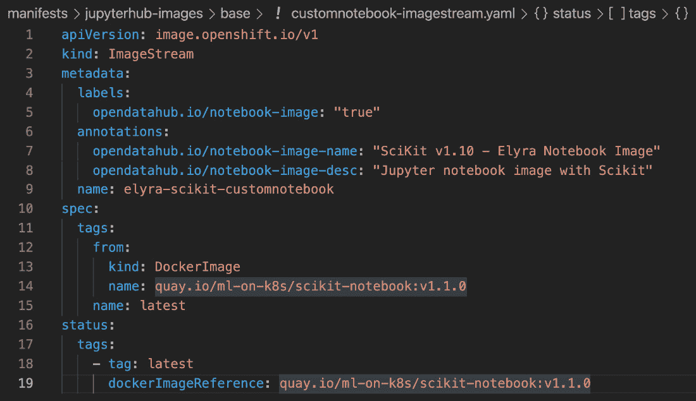

图 6.4 – ImageStream 对象

ODH 中的 JupyterHub 使用一个名为 `manifests/odh-common/base/imagestream-crd.yaml` 的 CRD。

请注意第 7 行和第 8 行，我们定义了一些注释。JupyterHub 会读取所有 `imagestream` 对象，并使用这些注释在 JupyterHub 登陆页面上显示。JupyterHub 还会查看名为 `dockerImageReference` 的字段，以便在请求时加载这些容器镜像。

我们鼓励您将本书的代码仓库 fork 到您自己的 Git 账户中，并添加更多镜像。请记得在 `manifests/kfdef/ml-platform.yaml` 文件中更改 Git 仓库的位置。

1.  为了让 JupyterHub 服务器看到新创建的镜像，您需要重启 JupyterHub pod。您可以通过以下命令找到该 pod 并删除它。几秒钟后，Kubernetes 将重启此 pod，您的新镜像将在 JupyterHub 登陆页面上显示：

    ```
    kubectl get pods -n ml-workshop | grep jupyterhub
    ```

您应该看到如下响应。请注意，pod 名称将根据您的设置有所不同：

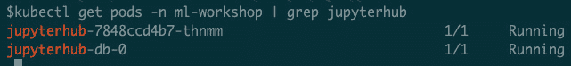

图 6.5 – 名称中包含 jupyterhub 的 Pods

1.  通过运行以下命令删除 JupyterHub pod。请注意，您在此练习中不需要删除此 pod，因为我们的 manifest 文件中已经包含了自定义镜像。当您按照本节中的步骤添加新的客户 notebook 镜像时，此步骤才是必需的：

    ```
    kubectl delete pod jupyterhub-7848ccd4b7-thnmm -n ml-workshop
    ```

您应该看到如下响应。请注意，pod 名称将根据您的设置有所不同：


图 6.6 – 删除 pod 命令的输出

1.  登录到 JupyterHub 后，您将看到新的 notebook 镜像列在其中：

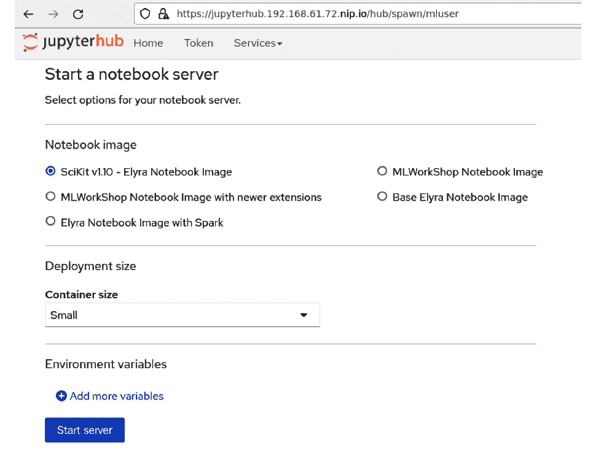

图 6.7 – 显示新 notebook 镜像的 JupyterHub 登陆页面

在下一节中，您将了解 MLflow，这是一款帮助团队记录和共享模型训练与调优实验结果的软件。

# 介绍 MLflow

简单来说，MLflow 旨在简化模型开发生命周期。数据科学家会花费大量时间寻找适合给定数据集的正确算法和超参数。作为数据科学家，你会尝试不同的参数和算法组合，然后回顾并比较结果，从中做出正确的选择。MLflow 使你能够记录、跟踪和比较这些参数、它们的结果以及相关的度量。捕获每个实验细节的 MLflow 组件称为 **跟踪服务器**。跟踪服务器捕获你的笔记本环境细节，例如 Python 库及其版本，以及实验生成的工件。

跟踪服务器允许你比较不同实验运行之间捕获的数据，例如性能指标（例如准确率）以及使用的超参数。你还可以与团队共享这些数据进行协作。

MLflow 跟踪服务器的第二个关键功能是模型注册。假设你已经为给定的数据集运行了十个不同的实验，每个实验都得到了一个模型。最终，只有一个模型会用于解决给定的问题。模型注册功能允许你为选择的模型打上三个阶段标签之一（**Staging**、**Production** 和 **Archived**）。模型注册有 API，允许你通过自动化作业访问这些模型。在生产环境中，版本控制模型注册中的模型将使你在需要时可以使用自动化工具回滚到模型的先前版本。

*图 6.8* 显示了 MLflow 软件的两个主要功能：

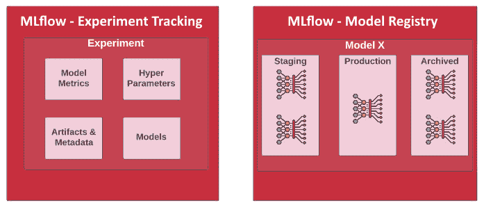

图 6.8 – MLflow 主要功能

现在你了解了 MLflow 的用途，让我们来看看组成 MLflow 的各个组件。

## 理解 MLflow 组件

让我们来看看 MLflow 系统的主要组件是什么，它是如何融入我们机器学习平台的生态系统中的。

### MLflow 服务器

MLflow 以容器的形式部署，包含一个后端服务器、一个图形用户界面（GUI）和一个 API 用于与之交互。在本章的后续部分，你将使用 MLflow API 将实验数据存储到其中。你将使用 GUI 组件来可视化实验跟踪和模型注册部分。你可以在 `manifests/mlflow/base/mlflow-dc.yaml` 文件中找到此配置。

### MLflow 后端存储

MLflow 服务器需要一个后端存储来存储关于实验的元数据。ODH 组件会自动配置一个 PostgreSQL 数据库，用作 MLflow 的后端存储。你可以在 `manifests/mlflow/base/mlflow-postgres-statefulset.yaml` 文件中找到此配置。

### MLflow 存储

MLflow 服务器支持多种类型的存储，如 S3 和数据库。这些存储将作为持久存储，用于存放工件，如文件和模型文件。在我们的平台上，您将配置一个开源的 S3 兼容存储服务，称为 `manifests/minio/base/minio-dc.yaml`。

### MLflow 认证

MLflow 在编写时没有现成的认证系统。在我们的平台中，我们在 MLflow GUI 前面配置了一个代理服务器，它将在将请求转发到 MLflow 服务器之前进行认证。我们使用的是开源组件 [`github.com/oauth2-proxy/oauth2-proxy`](https://github.com/oauth2-proxy/oauth2-proxy) 来实现这一目的。代理已配置为与平台的 **Keycloak** 服务进行 **单点登录**（**SSO**）认证。

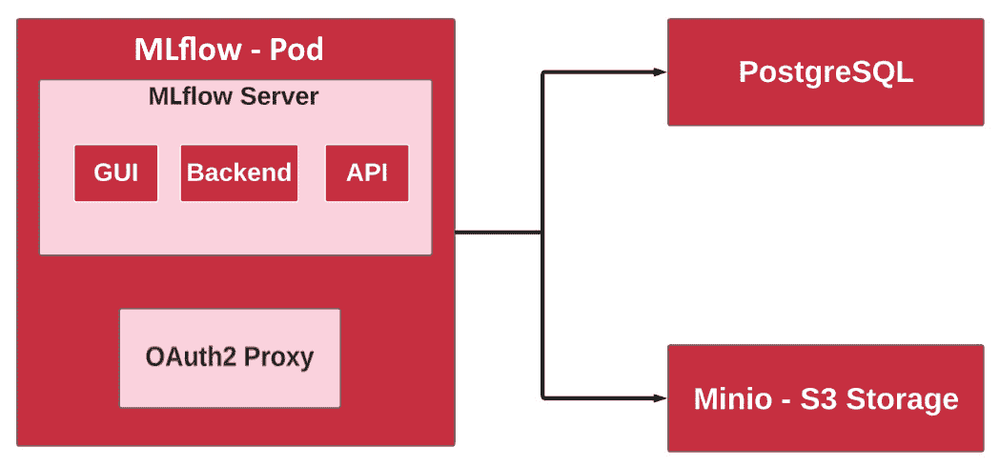

图 6.9 – 平台中的 MLflow 及相关组件

如*图 6.9*所示，MLflow pod 中有两个容器：MLflow 服务器和 OAuth2 代理。OAuth2 代理已配置为使用您安装的 Keycloak 实例。

当您在*第五章*“数据工程”中创建了 ODH 的新实例时，它安装了许多平台组件，包括 MLflow 和 Minio。现在，让我们验证 MLflow 的安装。

## 验证 MLflow 安装

ODH 已为您安装了 MLflow 和相关组件。现在，您将使用 MLflow 图形用户界面（GUI）来熟悉该工具。您可以想象，所有团队成员都可以访问实验和模型，这将提高团队的协作：

1.  使用以下命令在您的 Kubernetes 环境中创建入口对象。这是为了获取我们服务部署的端点的 URL：

    ```
    kubectl get ingress -n ml-workshop
    ```

您应该看到以下响应：

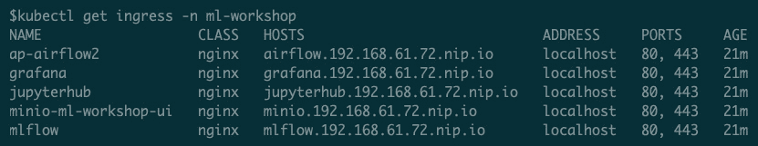

图 6.10 – 您集群命名空间中的所有入口对象

1.  打开 Minio 图形用户界面，这是我们的 S3 组件，验证是否有一个存储桶可供 MLflow 使用作为其存储。Minio 组件的 URL 将类似于 `https://minio.192.168.61.72.nip.io`，您需要根据您的环境调整 IP 地址。密码已在 manifests 文件中配置，默认为 `minio123`。我们已将 Minio 添加到 manifests 中，展示了可以使用开源技术的选项，但将其适配生产环境超出了本书的范围。点击屏幕左侧的存储桶菜单项，您将看到可用的存储桶：

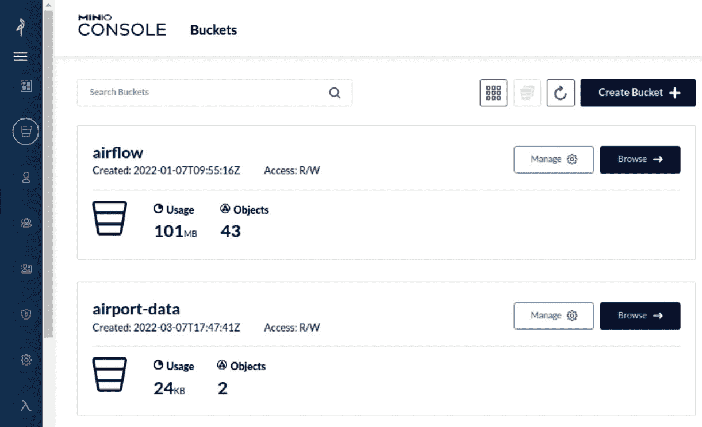

图 6.11 – Minio 存储桶列表

这些桶是如何创建的？在清单中，我们有一个 Kubernetes 作业来创建这些桶。你可以在 `manifests/minio/base/minio-job.yaml` 文件中找到该作业。该作业使用 Minio 命令行客户端 `mc` 来创建桶。你可以在该文件的 `command` 字段下找到这些命令。

MLflow 使用的 S3 配置已在 `manifests/mlflow/base/mlflow-dc.yaml` 文件中配置。

你可以看到如下设置：

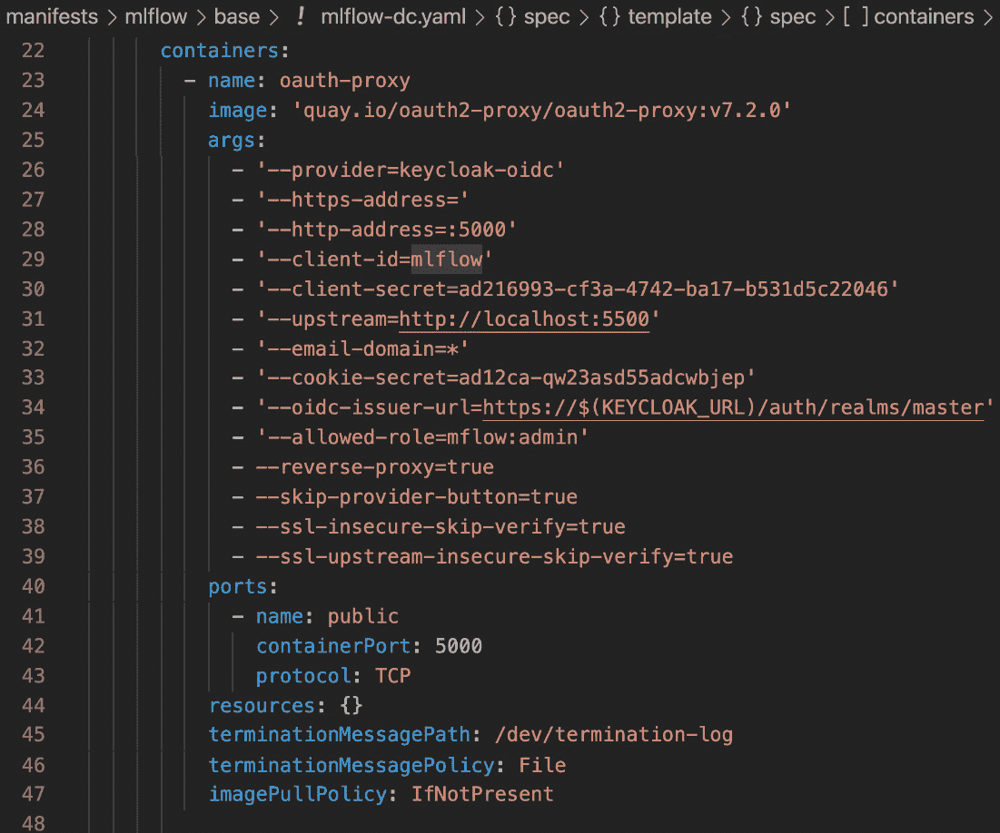

](img/B18332_06_012.jpg)

图 6.12 – 配置 MLflow 使用 Minio

1.  打开浏览器，将`jupyterhub`入口的`HOSTS`值粘贴到浏览器中。对我来说，它是 [`mlflow.192.168.61.72.nip.io`](https://mlflow.192.168.61.72.nip.io)。这个 URL 会将你带到 Keycloak 登录页面，这是如图所示的单点登录（SSO）服务器。确保将这个 URL 中的 IP 地址替换为你自己的。回想一下，MLflow 的认证部分是由你在 `manifests/mlflow/base/mlflow-dc.yaml` 中配置的代理管理的。

1.  你可以看到如下的 OAuth 代理配置。由于 `oauth-proxy` 和 MLflow 属于同一个 pod，我们所做的就是将流量从 `oauth-proxy` 路由到 MLflow 容器。这是通过 `–upstream` 属性进行设置的。你还可以看到 `oauth-proxy` 需要身份提供者服务器的名称，这里是 Keycloak，并且它被配置在 `–oidc-issuer` 属性下：

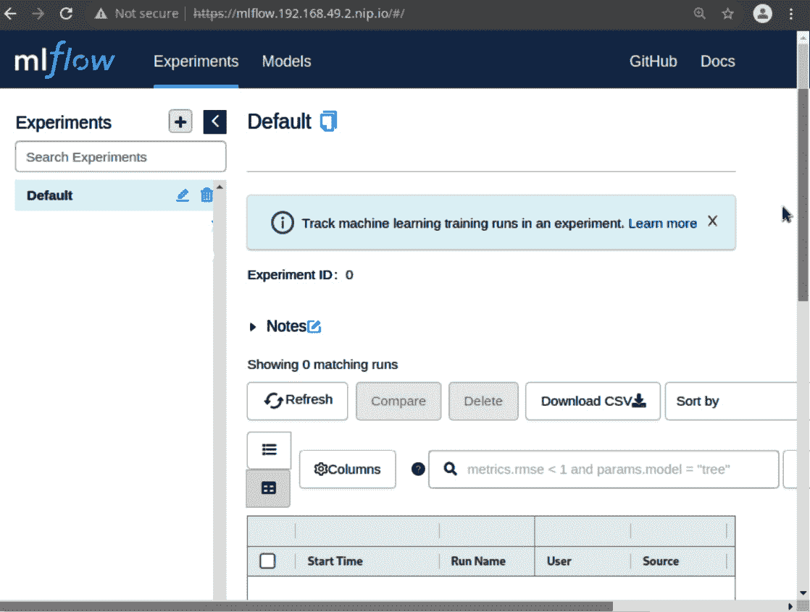

](img/B18332_06_013.jpg)

图 6.13 – 配置 MLflow 的 OAuth 代理

MLflow 的登录页面如下图所示 *图 6.14*。你会注意到顶部栏菜单有两个部分，一个是标有 **实验**，另一个是 **模型**。

1.  在你看到此页面之前，SSO 配置将显示登录页面。输入用户 ID 为 `mluser`，密码为 `mluser` 以登录。用户名和密码是在 *第四章* 中配置的，*机器学习平台的构成*，在 *创建 Keycloak 用户* 部分。


](img/B18332_06_014.jpg)

图 6.14 – MLflow 实验追踪页面

**实验**页面的左侧显示实验列表，右侧显示实验运行的详细信息。可以把实验看作是你正在进行的数据科学项目，比如消费者交易中的欺诈检测，**备注**部分则记录了运行实验时使用的参数、算法及其他信息的组合。

1.  点击 **模型** 选项卡，查看模型注册表的登录页面。

**模型**选项卡包含注册表中模型的列表、它们的版本以及对应的阶段，显示了这些模型被部署的环境。

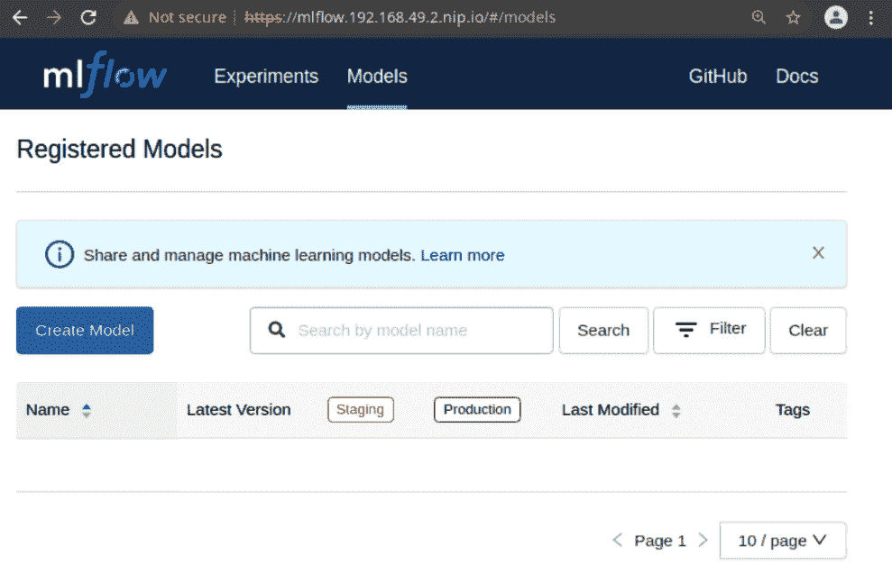

](img/B18332_06_015.jpg)

图 6.15 – MLflow 模型注册页面

如果你能打开 MLflow 的 URL 并查看前述步骤中描述的页面，那么你就验证了 MLflow 已在你的平台中配置成功。下一步是编写一个笔记本，训练一个基本模型并将详细信息记录到你的 MLflow 服务器中。

# 使用 MLFlow 作为实验跟踪系统

在这一部分，你将看到 MLflow 库如何允许你将实验记录到 MLflow 服务器中。你在本章第一部分看到的自定义笔记本映像已经将 MLflow 库打包进容器中。请参考 `chapter6/requirements.txt` 文件，以确认 MLflow 库的确切版本。

在我们开始此活动之前，理解两个主要概念非常重要：**实验** 和 **运行**。

实验是一个逻辑名称，MLflow 会在其中记录和归类元数据，例如，实验可以是你项目的名称。假设你正在为你的零售客户构建一个预测信用卡欺诈的模型，这个名称就可以作为实验的名称。

运行是对实验的单次执行，MLflow 会跟踪它。每次运行都属于一个实验。每个运行可能有稍微不同的配置、不同的超参数，有时甚至使用不同的数据集。你将在 Jupyter 笔记本中调整这些实验参数。每次模型训练的执行通常被视为一次运行。

MLflow 记录实验详情的方式有两种。第一种，也是我们推荐的方式，是启用 MLflow 的自动记录功能，使其与 ML 库一起使用。它与 Scikit、TensorFlow、PyTorch、XGBoost 等库都有集成。第二种方式是手动记录所有内容。你将在接下来的步骤中看到这两种方法。

这些步骤将展示如何在执行 Jupyter 笔记本时，将实验运行或模型训练记录到 MLflow：

1.  登录到 JupyterHub，并确保选择自定义容器，例如 **Scikit v1.10 - Elyra 笔记本映像**。

在点击 **启动服务器** 按钮之前，通过点击 **添加更多变量** 链接，添加一个环境变量。这个变量可能包含敏感信息，如密码。MLflow 需要这些信息来上传工件到 Minio S3 服务器。

登录页面将呈现出如 *图 6.16* 所示的截图：

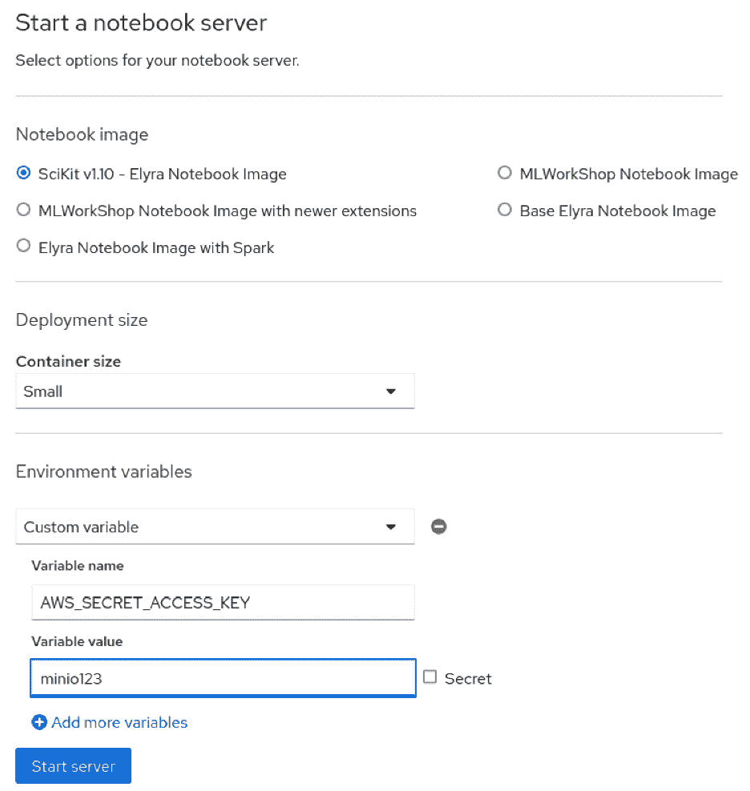

图 6.16 – 带有环境变量的 JupyterHub

1.  打开 `chapter6/hellomlflow.ipynb` 笔记本。这个笔记本展示了如何将你的实验数据记录到 MLflow 服务器中。

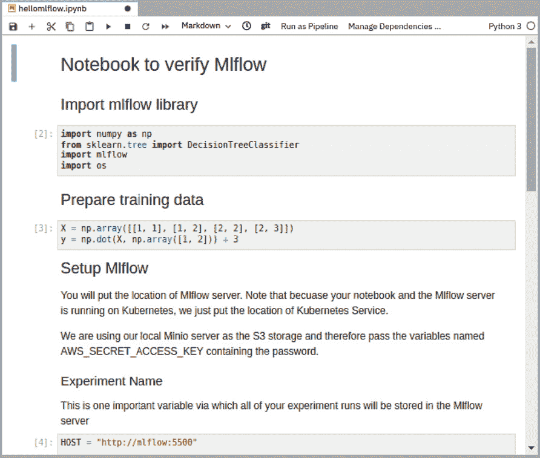

图 6.17 – 带有 MLflow 集成的笔记本

请注意，在第一个代码单元中，您已导入了 MLflow 库。在第二个代码单元中，您通过`set_tracking_uri`方法设置了 MLflow 服务器的位置。请注意，因为您的笔记本和 MLflow 服务器都在 Kubernetes 上运行，所以我们仅仅将存储在`HOST`变量中的 Kubernetes 服务位置放在此方法中使用。

然后，您通过`set_experiment`方法设置实验名称。这是一个重要的变量，通过它，所有的实验运行将被存储在 MLflow 服务器中。

此单元格中的最后一个方法是`sklearn.autolog`，它是告诉 MLflow 我们正在使用 Scikit 库进行训练的一种方式，MLflow 将通过 Scikit API 记录数据。

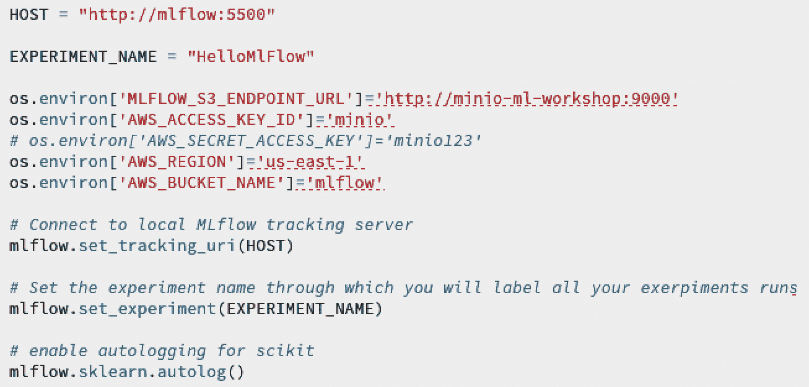

图 6.18 – 带有 MLflow 配置的笔记本单元

在此笔记本的最后一个单元格中，您使用了一个简单的`DecisionTreeClassifier`来训练您的模型。请注意，这是一个相当简单的模型，旨在突出显示 MLflow 服务器的功能。

1.  通过选择**运行 > 运行所有单元**菜单选项来运行笔记本。

1.  登录 MLflow 服务器并点击实验名称`HelloMlFlow`。MLflow 的 URL 将类似于[`mlflow.192.168.61.72.nip.io`](https://mlflow.192.168.61.72.nip.io)，其中的 IP 地址根据您的环境进行替换。正如本章前面提到的，您可以通过列出 Kubernetes 集群的*ingress*对象来获得此 URL。

您将看到如*图 6.19*所示的屏幕：

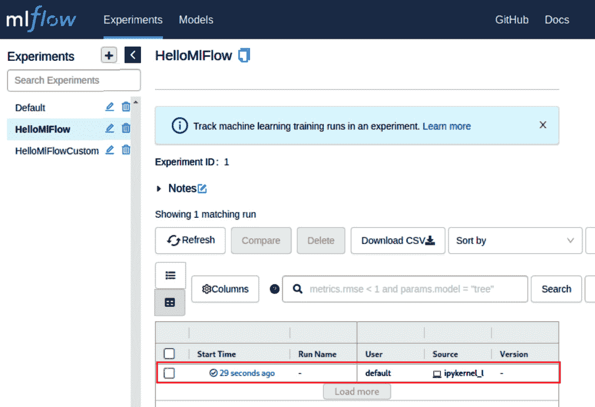

图 6.19 – MLflow 实验跟踪屏幕，显示实验运行

您会注意到右侧的表格中包含一条记录。这是您在*第 6 步*中执行的实验运行。如果您使用不同的参数多次执行笔记本，每次运行都会作为一行记录在此表格中。

1.  点击表格的第一行。

您将看到您在上一步中选择的运行的详细信息。屏幕将显示如*图 6.20*所示的截图：

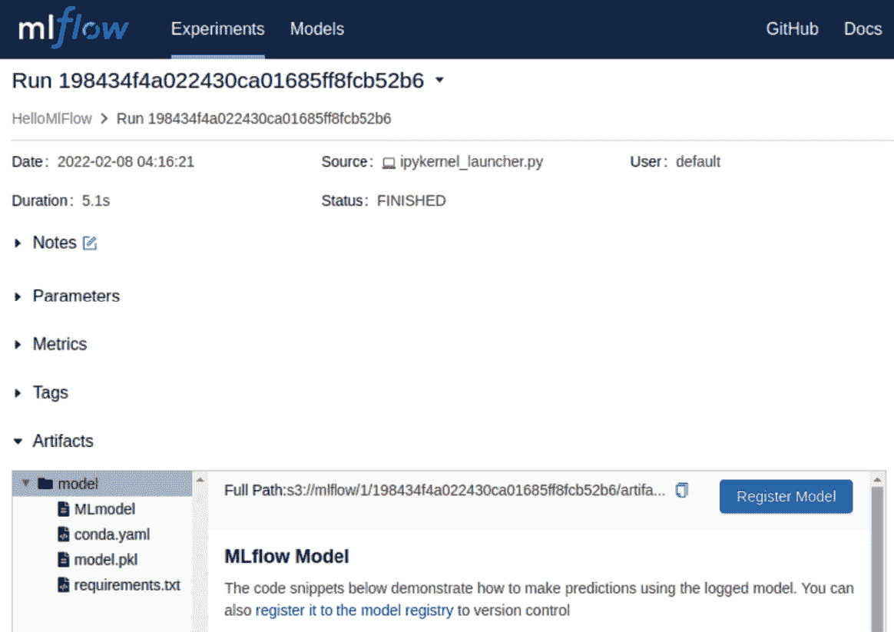

图 6.20 – MLflow 运行详情

让我们理解一下此屏幕上可用的信息：

+   `4`，您将看到我们为`DecisionTreeClassifier`使用的参数也记录在这里。一个这样的例子是`max_depth`参数，如*图 6.21*所示：

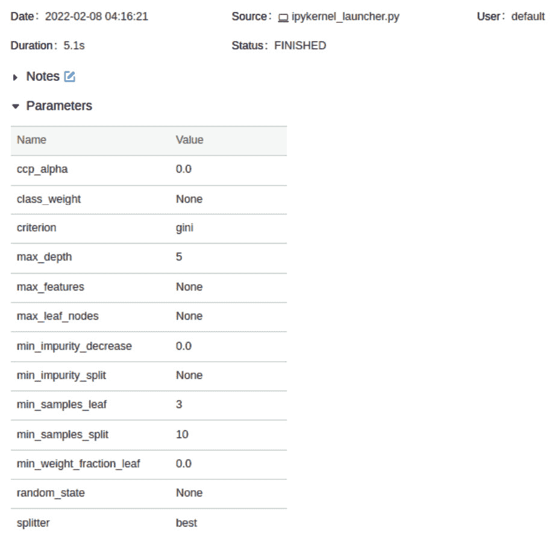

图 6.21 – MLflow 运行参数

+   截图中的`training_accuracy`，如*图 6.22*所示：

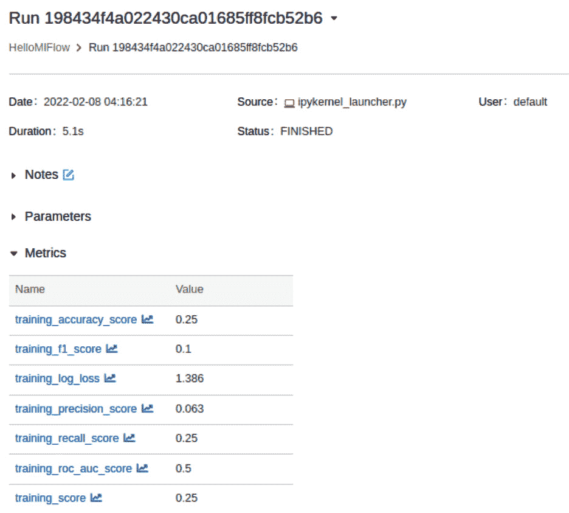

图 6.22 – MLflow 运行指标

+   `estimator_class`)，它定义了你使用的 ML 算法的类型。请注意，如果需要，你可以添加自己的标签。在接下来的部分中，我们将展示如何为你的运行关联一个自定义标签。*图 6.23* 展示了标签的示例：

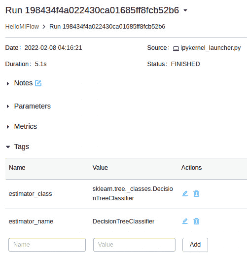

图 6.23 – MLflow 运行标签

+   `model.pkl` 文件。

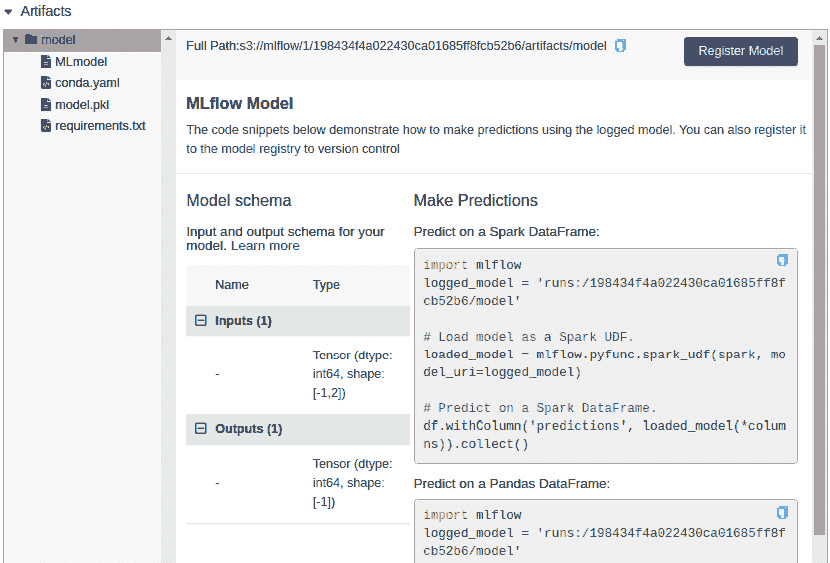

图 6.24 – MLflow 运行工件

1.  为了验证这些文件确实存储在 S3 服务器中，请登录 Minio 服务器，选择 **Buckets**，然后点击 MLflow 存储桶的 **Browse** 按钮。你会发现一个以运行名称命名的文件夹。这个名称显示在实验屏幕的左上角；查看前一个屏幕的左上角，你会看到一个由 32 个字母数字字符组成的标签。这个长数字就是你的 **运行 ID**，你可以在 S3 存储桶中看到一个由 32 个字母数字字符组成的文件夹标签，如下图所示。你可以点击此链接查看存储在 S3 存储桶中的工件：

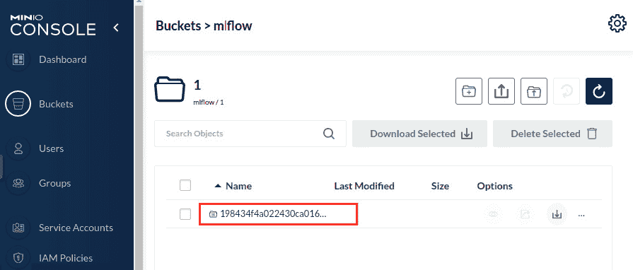

图 6.25 – Minio 存储桶位置

你刚刚在 JupyterHub 中成功训练了一个模型，并在 MLflow 中跟踪了训练过程。

你已经看到了 MLflow 如何将数据与每次运行关联。你甚至可以通过从 *步骤 6* 中选择多个运行并点击 **Compare** 按钮，比较多个运行之间的数据。

## 向实验运行添加自定义数据

现在，让我们看看如何为每次运行添加更多数据。你将学习如何使用 MLflow API 将自定义数据与实验关联：

1.  从启动 Jupyter 笔记本开始，方法和上一节一样。

1.  打开 `chapter6/hellomlflow-custom.ipynb` 笔记本。这个笔记本展示了如何将你的实验数据记录到 MLflow 服务器上。这个笔记本与之前的笔记本相似，唯一的区别是第`6`号单元格的代码，见*图 6.26*。这个代码单元包含了展示如何将数据与实验关联的函数：

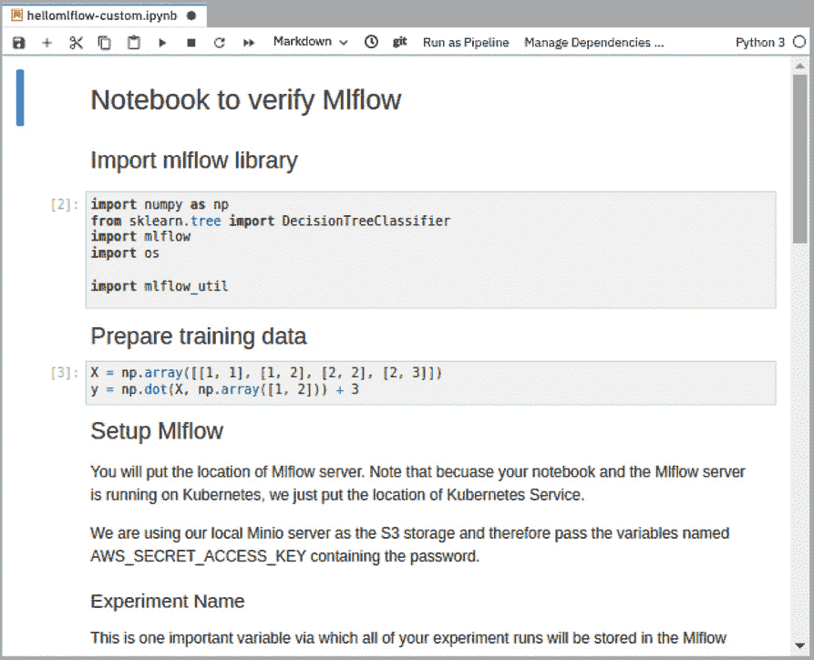

图 6.26 – MLflow 自定义数据收集笔记本

让我们在接下来的几步中理解这些函数。第`6`号代码单元中的代码片段如下：

```
with mlflow.start_run(tags={    "mlflow.source.git.commit" : mlflow_util.get_git_revision_hash() ,    "mlflow.source.git.branch": mlflow_util.get_git_branch(),    "code.repoURL": mlflow_util.get_git_remote()    }) as run:        model.fit(X, y)    mlflow_util.record_libraries(mlflow)    mlflow_util.log_metric(mlflow, "custom_mteric", 1.0)    mlflow_util.log_param(mlflow, "docker_image_name", os.environ["JUPYTER_IMAGE"])
```

上述代码将包括一个名为 `code.repoURL` 的自定义标签。这样可以更轻松地追溯生成某次实验运行模型的原始源代码。

1.  在调用 `start_run` 函数时，你可以关联任何标签。以 *mlflow* 开头的标签键是保留用于内部使用的。你可以看到我们将 GIT 提交哈希与第一个属性关联。这将帮助我们跟踪哪些实验属于代码仓库中的哪个代码版本。

你会发现`code.repoURL`标签包含了 Git 仓库的位置。你可以根据需要添加任意数量的标签。通过进入 MLflow UI 并打开实验，你可以看到这些标签。请注意，笔记本使用了不同的实验名称，它被引用为`HelloMlFlowCustom`。

请注意`code.repoURL`位于**标签**部分：

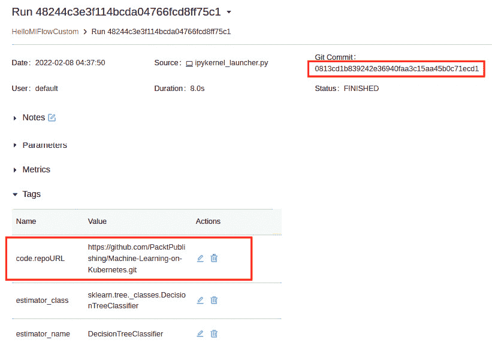

图 6.27 – MLflow 自定义标签

1.  我们使用的第二个函数是`record_libraries`。这是一个封装函数，内部使用`mlflow.log_artifact`函数将文件与运行关联。这个工具函数捕获了`pip freeze`命令的输出，该命令列出了当前环境中的库。然后，该工具函数将其写入文件并将文件上传到 MLflow 实验。你可以查看这个函数以及其他所有函数，位于`chapter6/mlflow_util.py`文件中。

你可以看到在`pip_freeze.txt`中记录了`pip freeze`命令的输出：

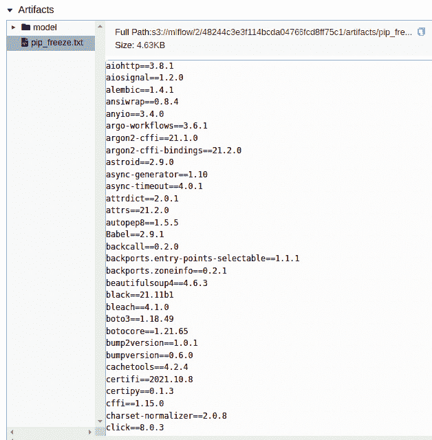

图 6.28 – MLflow 自定义工件

1.  `log_metric`函数记录指标名称及其相关值。请注意，指标的值应为数字。在示例代码中，我们只是放入了一个硬编码的值（`1`），然而，在实际应用中，这将是一个动态值，指向与每次实验运行相关的内容。你可以在页面的**指标**部分找到自定义的指标：

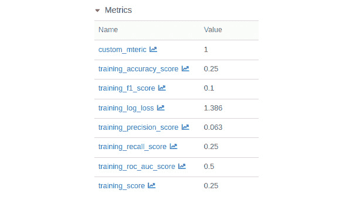

图 6.29 – MLflow 自定义指标

1.  `log_param`函数与`log_metric`函数类似，但它可以接受任何类型的值与给定的参数名称。例如，我们记录了 Jupyter 笔记本使用的 Docker 镜像。请记住，这是你为数据科学团队构建的自定义镜像。你可以看到下面的`docker_image_name`参数，它包含了所需的值：

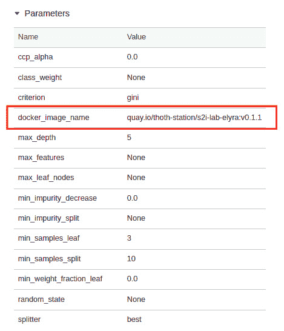

图 6.30 – MLflow 自定义参数

你已经使用 MLflow 跟踪、添加自定义标签和自定义工件到实验运行中。在下一部分中，你将看到 MLflow 作为模型注册组件的功能。让我们深入了解。

# 使用 MLFlow 作为模型注册系统

请记住，MLflow 具有模型注册功能。该注册表为你的模型提供版本控制功能。自动化工具可以从注册表中获取模型来进行部署，甚至在不同环境间回滚你的模型。在后续章节中，你将看到我们的平台中的自动化工具通过 API 从这个注册表中获取模型。现在，让我们来看一下如何使用注册表：

1.  通过访问 UI 并点击**模型**链接，登录到 MLflow 服务器。你应该能看到以下屏幕。点击**创建模型**按钮：

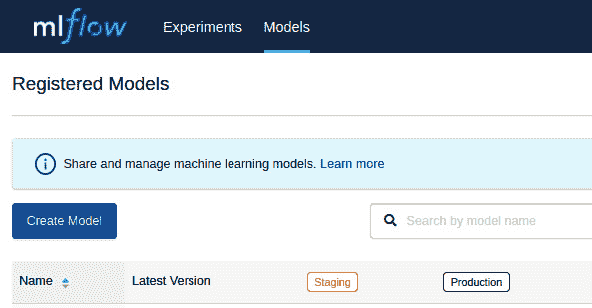

图 6.31 – MLflow 注册新模型

1.  在弹出窗口中输入模型名称，如下图所示，然后点击**创建**按钮。这个名称可以提到该模型所服务的项目名称：

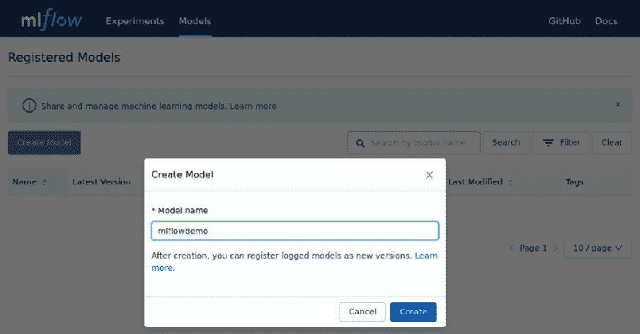

图 6.32 – MLflow 模型名称提示

1.  现在，你需要将模型文件附加到这个注册的名称上。回想一下前面的部分，你在*实验*中有多个*运行*。每次运行都定义了一组配置参数并将模型与之关联。选择你想注册模型的实验和运行。

1.  你将看到如下屏幕。选择**工件**部分中的**模型**标签，你会注意到右侧有一个**注册模型**按钮。点击这个按钮：

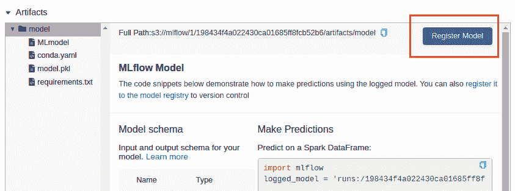

图 6.33 – MLflow 显示注册模型按钮

1.  从弹出窗口中，选择你在*步骤 1* 中创建的模型名称，然后点击**注册**。

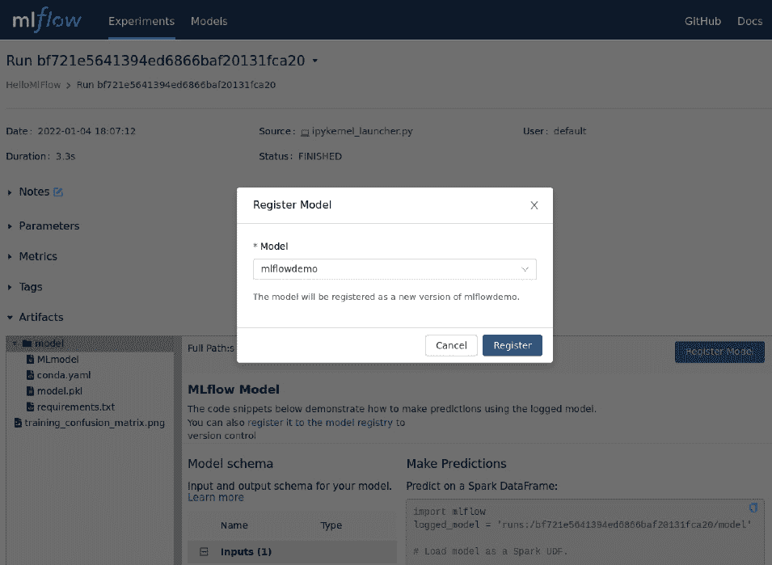

图 6.34 – 在 MLflow 中注册模型时的模型名称对话框

1.  前往 `mlflowdemo`：

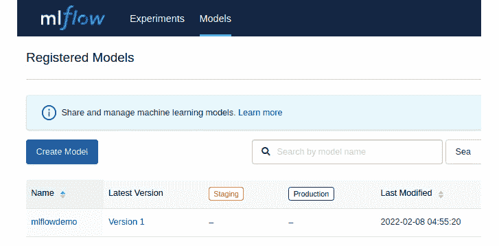

图 6.35 – MLflow 显示已注册模型及其版本的列表

1.  你将看到详细信息屏幕，在这里你可以附加模型的阶段，如**阶段**标签所示。你还可以编辑其他属性，我们将留给你去探索与此模型相关的数据：

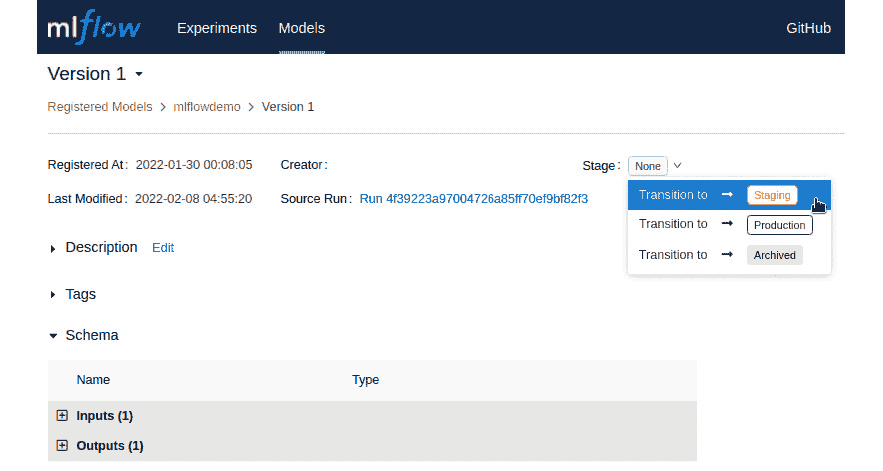

图 6.36 – MLflow 显示用于将已注册模型提升到更高环境的按钮

恭喜你！你刚刚体验了使用 MLflow 作为模型注册表！你还看到了如何将模型版本提升到生命周期的不同阶段。

# 总结

在本章中，你对 ML 工程有了更深入的了解，并且了解了它与数据科学的区别。你还了解了一些 ML 工程师的职责。你必须注意，ML 工程学的定义和 ML 工程师的角色仍在不断发展，因为越来越多的技术正在浮现。我们本书中不会讨论的一项技术是**在线 ML**。

你还学会了如何创建自定义的笔记本镜像，并使用它来标准化笔记本环境。你已经在 Jupyter 笔记本中训练了一个模型，同时使用 MLflow 跟踪和比较模型开发的参数、训练结果和指标。你还了解了 MLflow 如何作为模型注册表使用，以及如何将模型版本提升到生命周期的不同阶段。

下一章将继续讲解机器学习工程领域，你将学习如何将机器学习模型打包并部署，以便作为 API 进行使用。然后，你将使用机器学习平台提供的工具来自动化打包和部署过程。
