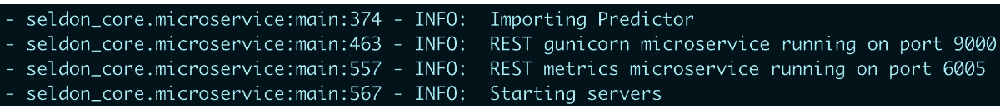
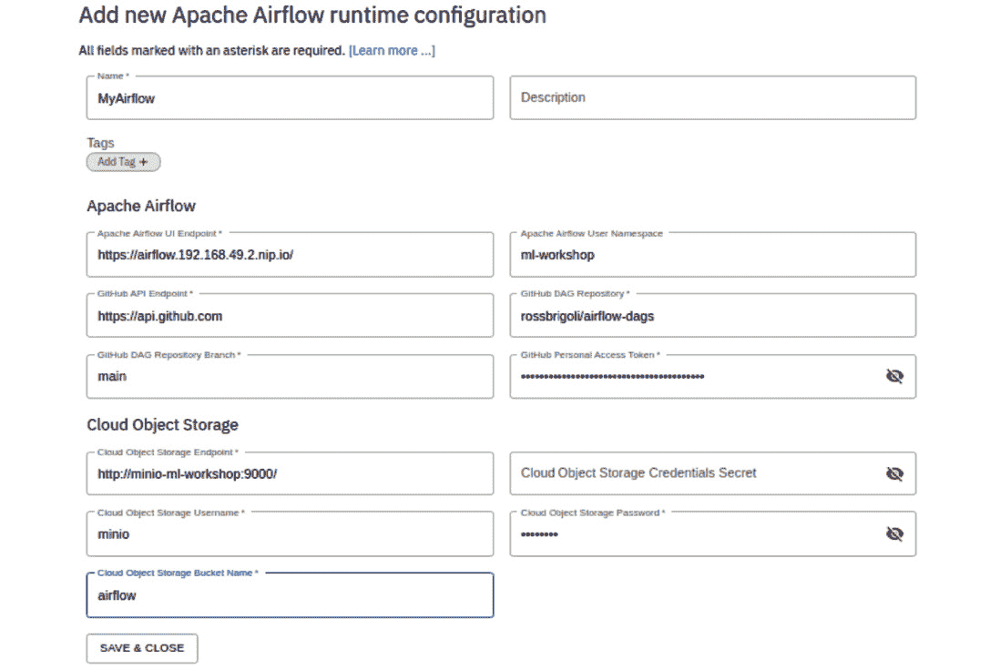

# 第六章：*第七章*：模型部署与自动化

在上一章中，你了解了平台如何使你能够以自主管理的方式构建和注册模型。在本章中，我们将扩展 **机器学习** (**ML**) 工程领域，涵盖模型部署、监控和部署活动的自动化。

你将了解平台如何提供模型打包和部署功能，以及如何自动化这些过程。你将从注册表中获取模型，将其打包成容器，并将模型部署到平台上，作为 API 提供服务。接着，你将使用平台提供的工作流引擎自动化所有这些步骤。

一旦你的模型部署完成，它将在其训练数据上表现良好。然而，现实世界是不断变化的。你将看到平台如何让你观察模型的性能。本章将讨论监控模型性能的工具和技术。这些性能数据可以帮助决定模型是否需要基于新的数据集重新训练，或者是否该为给定问题构建一个新的模型。

在本章中，你将学习以下主题：

+   理解使用 Seldon Core 的模型推理

+   使用 Seldon Core 打包、运行和监控模型

+   理解 Apache Airflow

+   在 Airflow 中自动化 ML 模型部署

# 技术要求

本章包含一些动手设置和练习。你将需要一个运行中的 Kubernetes 集群，并且已配置 **Operator Lifecycle Manager**。如何构建这样的 Kubernetes 环境将在*第三章*中讨论，*探索 Kubernetes*。在尝试本章的技术练习之前，请确保你已经有一个可用的 Kubernetes 集群，并且 **Open Data Hub** (**ODH**) 已经安装在你的 Kubernetes 集群上。安装 ODH 的过程将在*第四章*中讨论，*机器学习平台的结构*。

# 理解使用 Seldon Core 的模型推理

在上一章中，你已经构建了模型。这些模型是由数据科学团队构建的，用于生产环境并处理预测请求。有多种方式可以将模型投入生产使用，比如将模型嵌入到面向客户的程序中，但最常见的方式是将模型作为 REST API 公开。然后，任何应用程序都可以使用这个 REST API。通常，运行和提供生产中的模型被称为 **模型服务**。

然而，一旦模型进入生产环境，它需要被监控其性能，并且需要更新以满足预期标准。托管的模型解决方案不仅可以让你提供模型服务，还能监控其性能并生成警报，用以触发模型的重新训练。

Seldon 是一家总部位于英国的公司，创建了一套用于管理模型生命周期的工具。Seldon Core 是一个开源框架，帮助将机器学习模型暴露为 REST API 以供使用。Seldon Core 会自动暴露 REST API 的监控统计信息，这些信息可以被平台的监控组件**Prometheus**使用。要在平台中将模型暴露为 REST API，您需要完成以下步骤：

1.  为您的模型编写特定语言的包装器，将其暴露为服务。

1.  将您的模型容器化。

1.  使用 Seldon 部署 **自定义资源**（**CR**）在 Kubernetes 中定义并部署模型，利用模型的推理图。

接下来，我们将详细了解这三个步骤。

## 使用 Python 封装模型

让我们来看一下如何应用前面的步骤。在 *第六章*，*机器学习工程* 中，您已将实验细节和模型注册到 MLflow 服务器。回忆一下，模型文件被存储在 MLflow 的工件中，并命名为 `model.pkl`。

接下来，我们将以模型文件为基础，写一个简单的 Python 包装器。包装器的作用是使用 Seldon 库将模型便捷地暴露为 REST 服务。您可以在 `chapter7/model_deploy_pipeline/model_build_push/Predictor.py` 的代码中找到包装器的示例。这个包装器的关键组件是一个名为 `predict` 的函数，它会从 Seldon 框架创建的 HTTP 端点被调用。*图 7.1* 显示了一个使用 `joblib` 模型的简单 Python 包装器：


图 7.1 – 用于模型预测的 Python 语言包装器

`predict` 函数接收一个 `numpy` 数组（`data_array`）和一组列名（`column_names`），这些都是从 HTTP 请求中序列化过来的。该方法返回预测结果，结果可以是一个 `numpy` 数组，或者是一个值或字节的列表。对于语言包装器，还有许多其他方法可以使用，完整的方法列表可以在 [`docs.seldon.io/projects/seldon-core/en/v1.12.0/python/python_component.html#low-level-methods`](https://docs.seldon.io/projects/seldon-core/en/v1.12.0/python/python_component.html#low-level-methods) 中找到。请注意，在本书的后续章节中，您将看到更为详细的推理示例，其中会有额外的包装器用于数据转换。但在本章中，我们尽量保持简单。

语言包装器已准备好，下一步是将模型和语言包装器容器化。

## 容器化模型

你会把什么放入容器中？我们从一份清单开始。你需要模型和包装器文件。你还需要容器中可用的 Seldon Python 包。获取这些包后，你将使用 Seldon 服务来暴露模型。*图 7.2*展示了一个构建此类容器的`Docker`文件。该文件位于`Chapter 7/model_deployment_pipeline/model_build_push/Dockerfile.py`。


图 7.2 – 用于将模型打包为容器的 Docker 文件

现在，让我们理解 Docker 文件的内容：

+   *第 1 行*指示了你模型服务的基础容器镜像。我们选择了来自 Red Hat 的免费镜像，但你可以根据自己的需要选择。这张镜像可以是你公司基础镜像，包含标准版本的 Python 及相关软件。

+   在*第 3 行*，我们创建了一个`microservice`目录，将所有相关的文件放入我们的容器中。

+   在*第 4 行*，我们构建容器所需的第一个文件是`base_requirements.txt`。该文件包含 Seldon Core 系统的包和依赖项。你可以在`chapter7/model_deployment_pipeline/model_build_push/base_requirements.txt`中找到此文件。在该文件中，你会看到已添加了 Seldon Core 包和`joblib`包。

*图 7.3*展示了`base_requirements.txt`文件：


图 7.3 – 向容器中添加 Seldon 和 Joblib 文件

+   *第 5 行*使用`base_requirements.txt`文件将 Python 包安装到容器中。

+   在*第 7 行*和*第 8 行*，当你训练模型时，可能会使用不同的包。在推理时，某些包可能会需要；例如，如果你在模型训练之前使用某个库进行了输入数据缩放，你可能需要相同的库来在推理时应用缩放。

在*第六章*，*机器学习工程*中，你将实验详情和模型注册到 MLflow 服务器。回想一下，模型文件与包含训练模型所用包的文件`requirements.txt`一起存储在工件中。使用 MLflow 生成的`requirements.txt`文件，你可以安装运行模型所需的包，或者你也可以选择将这些依赖项添加到自己的自定义文件中。*图 7.4*展示了在*第六章*，*机器学习工程*中提到的 MLflow 快照。你可以在这里看到与`model.pkl`文件并排的`requirements.txt`文件。


图 7.4 – MLflow 运行工件

*第 10 行*：你将语言包装器文件和模型文件添加到容器中。

*第 11 行*：在这里，您使用 `seldon-core-microservice` 服务器启动推理服务器。请注意，参数已经在这里传递，接下来您将看到如何传递这些参数：

+   **MODEL_NAME**：这是包含模型的语言包装器中的 Python 类名称。

+   `MODEL`。

+   **GRPC_PORT**：**Google 远程过程调用**（**gRPC**）端点将监听模型推理的端口。

+   **METRICS_PORT**：暴露服务性能数据的端口。请注意，这里指的是服务的性能数据，而非模型的数据。

+   **HTTP_NAME**：您将通过 HTTP 提供模型的 HTTP 端口。

现在，我们有一个以 Docker 文件形式的容器规格。接下来，我们将看到如何使用 Seldon 控制器在 Kubernetes 平台上部署容器。

## 使用 Seldon 控制器部署模型

我们的机器学习平台提供了一个 Seldon 控制器，它作为一个 Pod 运行，并协助部署您在前一部分构建的容器。请注意，我们平台中的控制器是现有 Seldon 操作符的扩展。在撰写本文时，Seldon 操作符不兼容 Kubernetes 版本 1.22，因此我们扩展了现有操作符，以便与最新及未来版本的 Kubernetes 平台兼容。

请参阅 *第四章*，*机器学习平台的构成*，在那里您学习了如何安装 ODH 以及它如何在 Kubernetes 集群上工作。以同样的方式，Seldon 控制器也是由 ODH 操作符安装的。`manifests/ml-platform.yaml` 文件包含了安装 Seldon 控制器的配置。*图 7.5* 展示了这些设置：


图 7.5 – 清单文件的 MLFlow 部分

让我们验证 Seldon 控制器是否在集群中正确运行：

```
kubectl get pods –n ml-workshop | grep –i seldon
```

您应该看到以下响应：


图 7.6 – Seldon 控制器 Pod

Seldon 控制器 Pod 是由 ODH 操作符安装的，这些操作符会监视 Seldon 部署 CR。该资源的架构由 Seldon 部署 `manifests/odhseldon/cluster/base/seldon-operator-crd-seldondeployments.yaml` 定义。一旦创建 Seldon 部署 CR，控制器将部署与该 CR 关联的 Pod。*图 7.7* 展示了这种关系：


图 7.7 – 用于部署 Seldon 服务的平台组件

让我们看看 Seldon 部署 CR 的不同组件。您可以在 `chapter7/manual_model_deployment/SeldonDeploy.yaml` 中找到一个简单的示例。

Seldon 部署 CR 包含了 Seldon 控制器部署模型到 Kubernetes 集群所需的所有信息。Seldon 部署 CR 主要有三个部分：

+   `apiVersion`、`kind` 以及其他与 Kubernetes 相关的信息。你将像定义其他 Kubernetes 对象一样定义 Seldon 部署的标签和名称。你可以在以下截图中看到它包含了对象的标签和注释：


图 7.8 – Seldon 部署 – 与 Kubernetes 相关的信息

+   包含该信息的 `chapter7/manual_model_deployment/SeldonDeploy.yaml` 文件。

请注意，`containers` 为 `image` 对象提供了一个数组，因此你可以向其中添加更多的镜像。`image` 键将包含你的容器位置。`env` 数组定义了将可用于 pod 的环境变量。回想一下，在前一部分的 Docker 文件中，这些变量已被使用。`MODEL_NAME` 的值为 `Predictor`，即你用作封装器的类名。`SERVICE_TYPE` 的值为 `MODEL`，表示此容器提供的服务类型。

最后一部分包含 `hpaSpec`，Seldon 控制器会将其转换为 `maxReplicas` 设置为 `1`，因此不会创建新的 pods，但你可以为每次部署控制此值。如果 CPU 使用率超过 80%（对于以下示例中的 pods），可扩展性将启动；然而，由于 `maxReplica` 设置为 `1`，因此不会创建新的 pods。


图 7.9 – Seldon 部署 – Seldon 服务容器

+   `graph` 键为你的服务构建推理图。推理图将有多个节点，你将定义每个节点使用的容器。你会看到有一个 `children` 键，它接受一个对象数组，你通过该数组定义推理图。在此示例中，`graph` 只有一个节点，`children` 键没有与之关联的信息；然而，在后续章节中，你将看到如何构建具有更多节点的推理图。

图表下方的其余字段定义了推理图的第一个节点。`name` 字段的值与 `containers` 部分中你所定义的名称相对应。请注意，这是 Seldon 知道在推理图的该节点处提供服务的容器的关键。

另一个重要部分是 `logger` 部分。Seldon 可以自动将请求和响应转发到 `logger` 部分下提到的 URL。转发请求和响应的功能可以用于多种场景，例如出于审计/法律原因存储负载，或者应用数据漂移算法触发重新训练，或其他用途。请注意，Seldon 也可以在需要时将请求转发到 Kafka，但这超出了本书的讨论范围。


图 7.10 – Seldon 部署 – 推理图

一旦你使用常规的 `kubectl` 命令创建 Seldon 部署 CR，Seldon 控制器将部署 pods，并且模型将作为服务供消费。

接下来，我们将继续打包并部署你在*第六章*中构建的基础模型，*机器学习工程*。

# 使用 Seldon Core 打包、运行和监控模型

在本节中，你将打包并构建容器，使用你在*第六章*中构建的模型文件。然后，你将使用 Seldon 部署来部署并访问该模型。稍后在本书中，你将自动化这一过程，但手动完成，如本节所做的那样，将进一步加深你对组件及其工作原理的理解。

在开始此练习之前，请确保你已经在公共 Docker 注册表上创建了一个帐户。我们将使用免费的 `quay.io` 作为我们的注册表，但你也可以使用你偏好的其他注册表：

1.  让我们首先验证 MLflow 和 Minio（我们的 S3 服务器）是否在集群中运行：

    ```
    kubectl get pods -n ml-workshop | grep -iE 'mlflow|minio' 
    ```

你应该看到以下响应：


图 7.11 – MLflow 和 Minio 正在平台上运行

1.  获取 MLflow 的 ingress 列表，并通过以下输出中提供的 `mlflow` URL 登录 MLflow：

    ```
    kubectl get ingresses.networking.k8s.io -n ml-workshop 
    ```

你应该看到以下响应：


图 7.12 – 你的 Kubernetes 集群中的 ingress

1.  一旦进入 MLflow UI，导航到你在*第六章*中记录的实验，*机器学习工程*。该实验的名称是**HelloMIFlow**。


图 7.13 – MlFlow 实验跟踪

1.  从右侧面板选择第一个运行，进入该运行的详细页面。从`model.pkl`文件中，你会看到右侧有一个小的下载箭头图标。点击该图标下载`requirements.txt`文件。


图 7.14 – MLflow 实验跟踪 – 运行详情

1.  进入你克隆的代码仓库所在文件夹。如果还没克隆，请在本地机器上克隆[`github.com/PacktPublishing/Machine-Learning-on-Kubernetes.git`](https://github.com/PacktPublishing/Machine-Learning-on-Kubernetes.git)仓库。

1.  然后，进入`chapter7/model_deploy_pipeline/model_build_push`文件夹，并将上一步骤中下载的两个文件复制到此文件夹。最终，这个文件夹将包含以下文件：


图 7.15 – 示例文件，用于将模型打包为容器

注意

最后两个文件就是你刚才复制的文件。所有其他文件来自你克隆的代码仓库。

好奇的人会注意到，你从 MLFlow 服务器下载的`requirements.txt`文件包含了在运行笔记本进行模型训练时所需的包。并不是所有这些包（例如`mlflow`）都需要用来执行保存的模型。为了简单起见，我们将它们全部添加到我们的容器中。

1.  现在，让我们在本地机器上构建容器：

    ```
    docker build -t hellomlflow-manual:1.0.0 .
    ```

你应该看到以下响应：


图 7.16 – 将模型打包为容器

1.  下一步是标记容器并将其推送到你选择的仓库。在将镜像推送到仓库之前，你需要拥有一个镜像注册表账户。如果没有，可以在[`hub.docker.com`](https://hub.docker.com) 或 [`quay.io`](https://quay.io) 创建一个账户。创建好注册表后，你可以运行以下命令来标记并推送镜像：

    ```
    docker tag hellomlflow-manual:1.0.0 <DOCKER_REGISTRY>/hellomlflow-manual:1.0.0
    docker push <DOCKER_REGISTRY> /hellomlflow-manual:1.0.0
    ```

你应该看到以下响应。你会注意到，在以下截图中，我们将`quay.io/ml-on-k8s`称为我们的注册表：


图 7.17 – 将模型推送到公共仓库

1.  现在你的容器已经在一个注册表中可用，你需要使用 Seldon 部署 CR 将其部署为服务。打开`chapter7/manual_model_deployment/SeldonDeploy.yaml`文件，并调整镜像的位置。

你可以看到我修改后的文件，它显示了*第 16 行*（根据我的镜像位置）如下：


图 7.18 – 带有镜像位置的 Seldon 部署 CR

1.  我们通过部署`chapter7/manual_model_deployment/SeldonDeploy.yaml`文件来将模型作为服务部署。运行以下命令：

    ```
    kubectl create -f chapter7/manual_model_deployment/SeldonDeploy.yaml -n ml-workshop
    ```

你应该看到以下响应：


图 7.19 – 创建 Seldon 部署 CR

1.  验证容器是否处于运行状态。运行以下命令：

    ```
    kubectl get pod -n ml-workshop | grep model-test-predictor
    ```

你会注意到，你在 `SeldonDeploy.yaml` 文件的 `graph` 部分中填写的名称（`model-test-predictor`）是容器名称的一部分。

你应该看到以下响应：


图 7.20 – 在 Seldon 部署 CR 后验证 pod

1.  很好！你已经有一个模型作为服务在运行。现在，让我们看看 Seldon 控制器为我们创建的 pod 中包含什么内容。运行以下命令来获取 pod 中容器的列表：

    ```
    export POD_NAME=$(kubectl get pod -o=custom-columns=NAME:.metadata.name -n ml-workshop | grep model-test-predictor) 
    kubectl get pods $POD_NAME -o jsonpath='{.spec.containers[*].name}' -n ml-workshop 
    ```

你应该看到以下响应：


图 7.21 – Seldon pod 中的容器

你会看到有两个容器。一个是 `model-test-predictor`，它是我们构建的镜像，另一个是 `seldon-container-engine`，它是 Seldon 服务器。

`model-test-predictor` 容器包含模型，并使用语言包装器通过 HTTP 和 gRPC 暴露模型。你可以使用以下命令查看日志以及从 `model-test-predictor` 暴露了哪些端口：

```
kubectl logs -f $POD_NAME -n ml-workshop -c model-test-predictor
```

你应该看到以下响应（以及其他日志）：



图 7.22 – 显示端口的容器日志

你可以看到，服务器已准备好在 `9000` 端口接收 HTTP 请求，在 `6005` 端口接收指标服务器请求。这个指标服务器将通过 `/prometheus` 端点暴露基于 Prometheus 的监控数据。你可以在以下日志部分看到这一点：


图 7.23 – 显示 Prometheus 端点的容器日志

第二个容器是 `seldon-container-engine`，它负责推理图的编排，并将负载转发到你在 Seldon 部署 CR 的 `logger` 部分配置的服务。

1.  在此步骤中，你将了解 Seldon 部署 CR 为你创建了哪些 Kubernetes 对象。查看这些对象的一种简单方法是运行以下命令。此命令依赖于 Seldon 控制器使用标签键 `seldon-deployment-id` 对它所创建的对象进行标记，并且值是你的 Seldon 部署 CR 的名称，即 `model-test`：

    ```
    kubectl get all  -l seldon-deployment-id=model-test -n ml-workshop
    ```

你应该看到以下响应：


图 7.24 – Seldon 控制器创建的 Kubernetes 对象

你可以看到，Seldon 控制器根据你在 Seldon 部署 CR 中提供的配置，为你创建了 Deployment 对象、服务和**水平 Pod 自动扩展器**（**HPA**）对象。最终，部署会创建 pod 和为你的 pod 创建副本集。Seldon 控制器使我们在 Kubernetes 平台上部署模型变得更加简单。

1.  你可能已经注意到，Seldon 部署 CR 没有创建入口对象。让我们创建入口对象，以便通过运行以下命令从集群外部调用我们的模型。入口对象是通过`chapter7/manual_model_deployment/Ingress.yaml`中的文件创建的。确保根据你的配置调整`host`值，正如你在前面的章节中所做的那样。你还会注意到，入口将流量转发到端口`8000`。Seldon 提供了对该端口的监听器，负责协调推理调用。此服务可在名为`seldon-container-engine`的容器中使用：

    ```
    kubectl create -f chapter7/manual_model_deployment/Ingress.yaml -n ml-workshop
    ```

你应该看到以下响应：


图 7.25 – 为我们的服务创建入口对象

通过执行以下命令来验证入口是否已创建：

```
kubectl get ingress -n ml-workshop | grep model-test
```

你应该看到以下响应：


图 7.26 – 验证我们服务的入口

1.  由于我们的 Seldon 部署 CR 已引用了日志记录器 URL，你将部署一个简单的 HTTP 回显服务器，它只会打印收到的请求。这将帮助我们验证负载是否已转发到 Seldon 部署 CR 中`logger`部分配置的 URL。可以通过以下命令创建一个非常简单的回显服务器：

    ```
    kubectl create -f chapter7/manual_model_deployment/http-echo-service.yaml -n ml-workshop
    ```

你应该看到以下响应：


图 7.27 – 创建一个简单的 HTTP 回显服务器以验证负载日志记录

通过执行以下命令来验证 Pod 是否已创建：

```
kubectl get pods  -n ml-workshop | grep logger
```

你应该看到以下响应：


图 7.28 – 验证一个简单的 HTTP 回显服务器

1.  让我们调用模型进行预测。我们在上一章中开发的模型并不是非常有用，但它将帮助我们理解并验证整体的模型打包和部署过程。

回想一下 *第六章*，*机器学习工程*，`hellomlflow`笔记本的模型输入形状是 `(4,2)`，输出形状是 `(4,)`。


图 7.29 – 模型的输入和输出

因此，如果我们要向模型发送数据，它将是一个整数对数组，例如[`2,1`]。当你调用模型时，输入数据必须位于一个名为`data`的字段下，并使用`ndarray`格式。输入数据将如下所示。这是 Seldon 服务期望发送给它的数据格式：


图 7.30 – 作为 HTTP 负载的模型输入

1.  接下来是模型的 REST 端点。它将是你在 *第 13 步* 中创建的 ingress 和标准的 Seldon URL。最终形式如下：http://<INGRESS_LOCATION>/api/v1.0/predictions。

这将转换为我的情况下的[`model-test.192.168.61.72.nip.io/api/v1.0/predictions`](http://model-test.192.168.61.72.nip.io/api/v1.0/predictions)。

现在，你已经有了负载和要发送此请求的 URL。

1.  在此步骤中，你将调用你的模型。我们使用的是常用的命令行选项来进行此调用；不过，你也可以选择使用其他软件，如 Postman，来进行此 HTTP 调用。

你将使用 `POST` HTTP 动词进行调用，并提供服务的地址。你需要传递 `Content-Type` 头部来标明 JSON 内容，并使用 curl 程序的 `data-raw` 标志来传递请求体：

```
curl -vvvv -X POST 'http://<INGRESS_LOCATION>/api/v1.0/predictions' \--header 'Content-Type: application/json' \--data-raw '{  "data": {    "ndarray": [[2,1]]  }}'
```

最终的请求应如下所示。在发出此请求之前，请确保根据你的 ingress 位置修改 URL：

```
curl -vvvv -X POST 'http://model-test.192.168.61.72.nip.io/api/v1.0/predictions' \--header 'Content-Type: application/json' \--data-raw '{  "data": {    "ndarray": [[2,1]]  }}'
```

你应该看到以下响应。注意，命令的输出显示了与我们模型相同形状的数组，即`(4,)`，并且它位于以下截图中的`ndarray`键下：


](img/B18332_07_031.jpg)

图 7.31 – 模型推理调用的输出负载

1.  现在，让我们验证模型负载是否已记录到我们的 echo 服务器上。你正在验证 Seldon 捕获输入和输出并将其发送到目标位置以进行进一步处理（例如漂移检测或审计日志记录）的能力：

    ```
    export LOGGER_POD_NAME=$(kubectl get pod -o=custom-columns=NAME:.metadata.name -n ml-workshop | grep logger)
    kubectl logs -f $LOGGER_POD_NAME -n ml-workshop
    ```

你会看到输入和输出负载有单独的记录。你可以使用 `ce-requestid` 键来关联日志中的两个记录。以下截图显示了推理调用的捕获输入负载的主要字段：


](img/B18332_07_032.jpg)

图 7.32 – 捕获的输入负载转发到 echo pod

以下截图显示了推理调用输出负载的主要字段：


](img/B18332_07_033.jpg)

图 7.33 – 捕获的输出负载转发到 echo pod

1.  现在，让我们验证 Seldon 引擎是否已捕获服务监控数据，并且我们可以使用并记录这些数据。请注意，Prometheus 的工作方式是通过重复抓取，因此这些数据处于当前状态，Prometheus 服务器负责调用此 URL 并将其记录在其数据库中。

该信息的 URL 格式如下。Ingress 是你在 *第 13 步* 中创建的相同：

```
http://<INGRESS_LOCATION>/prometheus
```

这将转换为我 ingress 的以下内容：

```
http://model-test.192.168.61.72.nip.io/prometheus
```

打开浏览器并访问其中的 URL。你应该看到以下响应：


](img/B18332_07_034.jpg)

图 7.34 – 以 Prometheus 格式访问监控数据

你会发现收集了很多信息，包括响应时间、每个状态码的 HTTP 响应数量（`200`、`400`、`500` 等）、数据捕获、服务器性能以及暴露 Go 运行时指标。我们鼓励你深入了解这些参数，以便理解可用的数据。在后续章节中，你将看到如何收集和绘制这些数据，以便可视化模型推理服务器的性能。

你在这个练习中做得非常棒。本节的目的是展示使用 Seldon Core 部署模型的步骤和组件。在接下来的章节中，你将介绍平台的工作流组件 Airflow，并且接下来的几章中，所有这些步骤将通过 ML 平台中的组件进行自动化。

# 介绍 Apache Airflow

Apache Airflow 是一款开源软件，旨在以编程方式创建、执行、调度和监控工作流。工作流是一个任务序列，可以包括数据管道、ML 工作流、部署管道，甚至基础设施任务。它由 Airbnb 开发，作为一个工作流管理系统，后来在 Apache 软件基金会的孵化项目中开源。

虽然大多数工作流引擎使用 XML 来定义工作流，但 Airflow 使用 Python 作为定义工作流的核心语言。工作流中的任务也都是用 Python 编写的。

Airflow 具有许多功能，但本书只介绍 Airflow 的基础部分。本节绝不是 Airflow 的详细指南。我们的重点是介绍 ML 平台的软件组件。让我们从 DAG 开始。

## 理解 DAG

工作流可以简单地定义为一系列**任务**。在 Airflow 中，任务序列遵循一种称为**有向无环图**（**DAG**）的数据结构。如果你还记得计算机科学中的数据结构，DAG 由节点和单向顶点组成，这些节点和顶点按一定方式组织，以确保没有循环或环路。因此，Airflow 中的工作流被称为 DAG。

*图 7.35* 显示了一个典型的数据管道工作流示例：


图 7.35 – 典型的数据管道工作流

*图 7.36* 中的示例工作流由表示任务的框组成。任务的执行顺序由箭头的方向决定：


图 7.36 – 带有并行执行的示例工作流

另一个工作流示例显示在*图 7.36*中。在这个示例中，有些任务是并行执行的。**生成报告**任务将在两个**转换数据**任务完成后才会开始执行。这被称为**执行依赖性**，它是 Airflow 解决的问题之一。任务只有在上游任务完成后才能执行。

只要图中没有循环，你可以根据需求配置工作流，如*图 7.37*所示：


图 7.37 – 带有循环的示例工作流

在*图 7.37*中的例子中，**清理数据**任务永远不会执行，因为它依赖于**存储数据**任务，而后者也不会执行。Airflow 只允许非循环图。

如图所示，DAG 是一系列任务，Airflow 中有三种常见的任务类型：

+   **操作符**：预定义的任务，你可以用来执行某些操作。它们可以串联起来形成一个管道或工作流。你的 DAG 主要由操作符组成，甚至完全由操作符组成。

+   **传感器**：操作符的子类型，用于基于外部事件触发一系列其他操作符。

+   `@task`。这允许你将常规的 Python 函数作为任务运行。

Airflow 操作符是可扩展的，这意味着社区已经创建了许多预定义的操作符，你可以直接使用。在接下来的练习中，你将主要使用的操作符之一是**Notebook 操作符**。这个操作符允许你将任何 Jupyter 笔记本作为 DAG 中的任务来运行。

那么，使用 DAG 执行任务序列的优势是什么呢？仅仅编写一个能够按顺序执行其他脚本的脚本就足够了吗？答案在于 Airflow 所提供的特性，我们将继续探讨这些特性。

## 探索 Airflow 特性

与`cron`作业和脚本相比，Airflow 带来的优势可以通过其特性详细说明。让我们首先来看一下这些特性：

+   **故障和错误管理**：在任务失败时，Airflow 能够优雅地处理错误和失败。可以配置任务在失败时自动重试，并且可以配置重试次数。

就执行顺序而言，典型工作流中有两种任务依赖关系，它们在 Airflow 中比编写脚本更容易管理。

+   **数据依赖性**：某些任务可能需要先处理其他任务，因为它们需要其他任务生成的数据。这可以在 Airflow 中进行管理。此外，Airflow 允许将一个任务的输出中的小量元数据作为输入传递给另一个任务。

+   **执行依赖性**：你可能能够在小型工作流中编写执行依赖性脚本。然而，想象一下用 Bash 编写一个有一百个任务的工作流，其中一些任务可以并行运行，而其他任务只能顺序执行。我想这会是一个相当令人生畏的任务。Airflow 通过创建 DAG 帮助简化了这一过程。

+   **可扩展性**：Airflow 可以水平扩展到多个机器或容器。工作流中的任务可以在不同节点上执行，同时由一个共同的调度器集中协调。

+   `git`仓库包含你的 DAG。这使你能够实现 DAG 的持续集成。

下一步是了解 Airflow 的不同组件。

## 理解 Airflow 组件

Airflow 包含多个作为独立服务运行的组件。*图 7.38* 显示了 Airflow 组件及其相互作用：


图 7.38 – Airflow 组件

Airflow 中有三个核心服务。**Airflow Web** 提供用户界面，用户可以在其中直观地监控和与 DAG 及任务交互。**Airflow Scheduler** 是负责调度 Airflow Worker 任务的服务。调度不仅仅是根据预定时间执行任务，还包括按照特定顺序执行任务，考虑到执行依赖关系和失败管理。**Airflow Worker** 是执行任务的服务。这也是 Airflow 的主要可扩展性点。运行的 Airflow Worker 越多，可以并行执行的任务就越多。

DAG 仓库是文件系统中的一个目录，存储并由调度器检索用 Python 编写的 DAG 文件。我们平台中配置的 Airflow 实例包括一个侧车容器，它将 DAG 仓库与远程 `git` 仓库同步。这简化了 DAG 的部署，只需将 Python 文件推送到 Git。

本书中我们不会深入探讨 Airflow。目标是让你学到足够的内容，以便能够使用最少的 Python 编码在 Airflow 中创建管道。你将使用 Elyra 笔记本管道构建器功能，以图形方式构建 Airflow 管道。如果你想了解更多关于 Airflow 的内容，以及如何在 Python 中以编程方式构建管道，建议你从 Apache Airflow 的丰富文档开始，网址是 [`airflow.apache.org/docs/apache-airflow/stable/concepts/overview.html`](https://airflow.apache.org/docs/apache-airflow/stable/concepts/overview.html)。

现在你对 Airflow 有了基本了解，是时候看看它的实际操作了。在 *第四章*，《机器学习平台的架构》中，你安装了一个新的 ODH 实例。这个过程也为你安装了 Airflow 服务。现在，让我们验证这个安装。

## 验证 Airflow 安装

要验证 Airflow 是否在你的集群中正常运行，你需要执行以下步骤：

1.  通过执行以下命令检查所有 Airflow pod 是否都在运行：

    ```
    kubectl get pods -n ml-workshop | grep airflow
    ```

你应该会看到三个 Airflow 服务 pod 处于运行状态，如 *图 7.39* 所示的截图。验证所有 pod 是否都处于 `Running` 状态：


图 7.39 – 运行状态下的 Airflow pod

1.  通过查看 `ap-airflow2` 的入口主机，获取 Airflow Web 的 URL。你可以通过执行以下命令来完成：

    ```
    kubectl get ingress -n ml-workshop | grep airflow
    ```

你应该看到类似于 *图 7.39* 的结果。注意 `ap-airflow2` ingress 的主机值。你的环境中的 IP 地址可能不同：


图 7.40 – ml-workshop 命名空间中的 Airflow ingress

1.  访问 [`airflow.192.168.49.2.nip.io`](https://airflow.192.168.49.2.nip.io)。请注意，域名是 `ap-airflow2` ingress 的主机值。你应该能看到 Airflow Web UI，如 *图 7.41* 所示：


图 7.41 – Apache Airflow 的主页

如果你能够加载 Airflow 着陆页，则说明 Airflow 安装有效。你还应该注意到，在列出 DAG 的表格中，已经有现有的 DAG 正处于失败状态。这些是已经存在的 DAG 文件，位于默认配置的 DAG 仓库 [`github.com/airflow-dags/dags/`](https://github.com/airflow-dags/dags/) 中。你需要为你的实验创建自己的 DAG 仓库。下一部分将提供如何执行此操作的详细信息。

## 配置 Airflow DAG 仓库

DAG 仓库是一个 Git 仓库，Airflow 从中获取表示管道或工作流的 DAG 文件。要配置 Airflow 指向你自己的 DAG 仓库，你需要创建一个 Git 仓库，并将 Airflow 调度器和 Airflow Web 指向该 Git 仓库。你将使用 **GitHub** 创建这个仓库。以下步骤将指导你完成此过程：

1.  通过访问 [`github.com`](https://github.com) 创建一个 GitHub 仓库。这要求你已经有一个 GitHub 帐号。为了本次练习，我们将这个仓库命名为 `airflow-dags`。请记下你新创建的 Git 仓库的 URL，它应类似于：[`github.com/your-user-name/airflow-dags.git`](https://github.com/your-user-name/airflow-dags.git)。我们假设你已经知道如何在 GitHub 上创建新的仓库。

1.  通过编辑 `kfdef`（**Kubeflow 定义**）对象来编辑你的 ODH 实例。你可以通过执行以下命令来完成：

    ```
    kubectl edit kfdef opendatahub-ml-workshop -n ml-workshop
    ```

你应该会看到一个 `vim` 编辑器，显示 `kfdef` 清单文件，如 *图 7.42* 所示。按 *i* 开始编辑。


图 7.42 – vim 编辑器显示定义 Airflow 实例的部分

1.  替换 `DAG_REPO` 参数的值为你在 *步骤 1* 中创建的 Git 仓库的 URL。编辑后的文件应如 *图 7.43* 中的截图所示。按 *Esc*，然后 *:*，输入 `wq` 并按 *Enter* 保存你对 `kfdef` 对象所做的更改。


图 7.43 – 编辑后 `DAG_REPO` 参数的值

更改将被 ODH 操作符拾取，并应用到受影响的 Kubernetes 部署对象，在这种情况下，是 Airflow Web 和 Airflow 调度器部署。这个过程需要几分钟才能完成。

1.  通过检查 Airflow 部署来验证更改。你可以运行以下命令来查看部署对象的应用清单：

    ```
    kubectl get deployment app-aflow-airflow-scheduler -o yaml -n ml-workshop | grep value:.*airflow-dags.git
    ```

这应该返回一行，包含你 GitHub 仓库的 URL。

1.  由于这个仓库是新的且为空，当你打开 Airflow Web UI 时，你应该看不到任何 DAG 文件。要验证 Airflow web 应用程序，导航到你的 Airflow URL，或刷新现有的浏览器标签，你应该看到一个空的 Airflow DAG 列表，类似于*图 7.44*中的截图：


图 7.44 – 空的 Airflow DAG 列表

现在你已经验证了 Airflow 安装并将 DAG 仓库更新为自己的 `git` 仓库，是时候充分利用 Airflow 了。

## 配置 Airflow 运行时镜像

Airflow 流水线，或 DAG，可以通过编写 Python 文件并使用 Airflow 库来创建。然而，也可以从 Elyra 笔记本中图形化创建 DAG。在本节中，你将从 Elyra 创建一个 Airflow DAG，将其推送到 DAG 仓库，并在 Airflow 中执行它。

为了进一步验证 Airflow 设置并测试配置，你需要运行一个简单的 `Hello world` 流水线。按照步骤创建一个包含两个任务的流水线。你将创建 Python 文件、一个流水线，并配置整个过程使用的运行时镜像：

1.  如果你没有运行的笔记本环境，请通过导航到 JupyterHub，点击**启动我的服务器**，并选择要运行的笔记本镜像，如*图 7.45*所示，这时我们使用**Base Elyra 笔记本镜像**，因为我们不需要任何特殊库。


图 7.45 – 显示已选择 Base Elyra 笔记本镜像的 JupyterHub 登陆页面

1.  在你的 Elyra 浏览器中，导航到 `Machine-Learning-on-Kubernetes/chapter7/model_deploy_pipeline/` 目录。

1.  打开一个新的流水线编辑器。你可以通过选择菜单项 `untitled.pipeline` 来实现。


图 7.46 – Elyra 笔记本

1.  右键点击 `untitled.pipeline` 文件并将其重命名为 `hello_world.pipeline`。

1.  创建两个内容相同的 Python 文件，包含以下行：`print('Hello airflow!')`。你可以通过选择菜单项 `hello.py` 和 `world.py` 来实现。你的目录结构应类似于*图 7.47*中的截图：


图 7.47 – 显示 hello.pipeline 文件的 Elyra 目录结构

1.  通过将 `hello.py` 文件拖动到管道编辑器窗口中，创建一个包含两个任务的管道。对 `world.py` 执行相同操作。通过将任务框右侧的小圆圈拖动到另一个框中，连接这些任务。最终的管道拓扑应该类似于*图 7.48*中的插图。通过点击顶部工具栏中的**保存**图标来保存管道。


图 7.48 – 任务拓扑

1.  在我们运行这个管道之前，需要配置每个任务。因为每个任务将作为容器在 Kubernetes 上运行，我们需要指定该任务将使用哪个容器镜像。选择左侧工具栏上的**运行时镜像**图标。然后，点击**+**按钮添加一个新的运行时镜像，如*图 7.49*所示：


图 7.49 – 在 Elyra 中添加新运行时镜像

1.  在**添加新运行时镜像**对话框中，添加**Kaniko 容器构建器**镜像的详细信息，如*图 7.50*所示，然后点击**保存并关闭**按钮。

这个容器镜像（[`quay.io/repository/ml-on-k8s/kaniko-container-builder`](https://quay.io/repository/ml-on-k8s/kaniko-container-builder)）包含了在 Kubernetes 中构建 Docker 文件并将镜像推送到镜像仓库所需的工具。这个镜像也可以从 MLflow 模型仓库中拉取机器学习模型和元数据。你将在下一部分使用这个镜像构建容器，以托管你的机器学习模型。此容器镜像是为本书的目的创建的。你可以使用任何能够在 Kubernetes 上运行的容器镜像作为管道任务的运行时镜像。


图 7.50 – 为 Kaniko 构建器添加新的运行时镜像对话框

1.  添加另一个名为**Airflow Python Runner**的运行时镜像。容器镜像位于 [`quay.io/repository/ml-on-k8s/airflow-python-runner`](https://quay.io/repository/ml-on-k8s/airflow-python-runner)。该镜像可以运行任何 Python 3.8 脚本，并与 Kubernetes 和 Spark 操作符进行交互。你将在下一部分使用此镜像将容器镜像部署到 Kubernetes。请参阅*图 7.51*中的**添加新运行时镜像**对话框字段值，然后点击**保存并关闭**按钮：


图 7.51 – 为 Airflow Python Runner 添加新运行时镜像对话框

1.  从远程仓库将镜像拉取到你的 Kubernetes 集群的本地 Docker 守护进程中。这将有助于通过使用已经拉取到本地 Docker 实例的运行时镜像，加快 Airflow 任务的启动速度。

你可以通过在运行 Minikube 的同一台机器上运行以下命令来实现这一点。此命令允许你将 Docker 客户端连接到 Minikube **虚拟机**（**VM**）内部的 Docker 守护进程：

```
eval $(minikube docker-env)
```

1.  通过在与你的 Minikube 运行的同一台机器上运行以下命令来拉取**Kaniko Container Builder**镜像。这将从[quay.io](http://quay.io)拉取镜像到你 Minikube 内的 Docker 守护进程：

    ```
    docker pull quay.io/ml-on-k8s/kaniko-container-builder:1.0.0
    ```

1.  通过在与你的 Minikube 运行的同一台机器上运行以下命令来拉取**Airflow Python Runner**镜像：

    ```
    docker pull quay.io/ml-on-k8s/airflow-python-runner:0.0.11
    ```

1.  分配`hello.py`任务。你可以通过右键点击任务框并选择**属性**上下文菜单项来完成此操作。任务的属性将在管道编辑器的右侧窗格中显示，如*图 7.52*所示。使用**运行时镜像**下拉框，选择**Kaniko Container Builder**。


图 7.52 – 在管道编辑器中设置任务的运行时镜像

注意

如果你在下拉列表中没有看到新添加的运行时镜像，你需要关闭并重新打开管道编辑器。这将刷新运行时镜像的列表。

1.  分配`world.py`任务。这与*步骤 10*相似，但针对的是`world.py`任务。参见*图 7.53*中的**运行时镜像**值：


图 7.53 – 在管道编辑器中设置任务的运行时镜像

1.  你刚刚创建了一个 Airflow 管道，其中包含两个任务，每个任务使用不同的运行时。但在我们运行这个管道之前，我们需要告诉 Elyra Airflow 的位置。为此，请点击 Elyra 左侧工具栏中的**运行时**图标，如*图 7.54*所示：


图 7.54 – 运行时工具栏

1.  点击`ml-workshop`。这是你所有 ML 平台工作负载的命名空间。

1.  `github-username/airflow-dags`格式。将`github-username`替换为你的 GitHub 用户名。

1.  `minio`。

1.  `minio123`。

填写所有字段后，点击**保存并关闭**按钮。



图 7.55 – 添加新的 Apache Airflow 运行时配置

1.  通过点击管道编辑器顶部工具栏中的**播放**按钮来运行 Airflow 管道。这将弹出**运行管道**对话框。选择**Apache Airflow 运行时**作为运行时平台，并选择**MyAirflow**作为运行时配置，然后点击**确定**。参见*图 7.56*：


图 7.56 – 运行管道对话框

此操作会生成一个 Airflow DAG 文件并将文件推送到配置为 DAG 仓库的 GitHub 仓库。你可以通过检查你的 GitHub 仓库中是否有新推送的文件来验证这一点。

1.  打开 Airflow 网站。你应该能看到新创建的 DAG，如*图 7.57*所示。如果看不到，刷新 Airflow 页面几次。有时候 DAG 在 UI 中出现需要几秒钟。


图 7.57 – Airflow 显示正在运行的 DAG

DAG 应该会在几分钟内成功运行。如果失败，你需要检查步骤，确保设置了正确的值，并且没有遗漏任何步骤。

你刚刚使用 Elyra 的图形管道编辑器创建了一个基本的 Airflow DAG。生成的 DAG 默认配置为仅运行一次，通过`@once`注解表示。在实际应用中，你可能不希望直接从 Elyra 运行 DAG。你可能想要对 DAG 文件进行额外的自定义。在这种情况下，使用导出功能而不是点击播放按钮来运行 DAG。这将把管道导出为一个 DAG 文件，你可以进一步自定义，比如设置计划任务。然后，你可以将自定义的 DAG 文件推送到 DAG 仓库并提交给 Airflow。

你刚刚验证了 Airflow 设置，添加了 Airflow 运行时配置，并将 Elyra 与 Airflow 集成。现在是时候构建一个真正的部署管道了！

# 在 Airflow 中自动化 ML 模型部署

你已经在前面的章节中了解了如何手动将 ML 模型打包成运行在 Kubernetes 上的 HTTP 服务。你还了解了如何在 Airflow 中创建和运行基础管道。在本节中，你将通过创建一个 Airflow DAG 来自动化模型部署过程，从而将这些新知识结合起来。你将创建一个简单的 Airflow 管道，用于将 ML 模型从 MLflow 模型注册中心打包并部署到 Kubernetes。

## 使用管道编辑器创建管道

类似于上一节，你将使用 Elyra 的管道编辑器来创建模型构建和部署的 DAG：

1.  如果你没有运行中的 Elyra 环境，可以通过导航到 JupyterHub，点击**启动我的服务器**，并选择一个笔记本镜像来启动笔记本环境，如*图 7.45*所示。我们这次使用**基础 Elyra 笔记本镜像**，因为这次我们不需要任何特殊的库。

1.  在 Elyra 浏览器中，导航到`Machine-Learning-on-Kubernetes/chapter7/model_deploy_pipeline/`目录。

1.  打开一个新的管道编辑器。你可以通过选择菜单项`untitled.pipeline`来完成此操作。

1.  右键点击`untitled.pipeline`文件，将其重命名为`model_deploy.pipeline`。你的目录结构应当像*图 7.58*中截图所示：


图 7.58 – Elyra 显示空的管道编辑器

1.  你将构建一个包含两个任务的管道。第一个任务将从 MLflow 模型注册中心拉取模型工件，使用 Seldon Core 将模型打包成容器，并将容器镜像推送到镜像仓库。要创建第一个任务，拖动并将`build_push_image.py`文件从`model_build_push`目录拖放到管道编辑器的工作区。此操作将在管道编辑器窗口中创建一个新任务，如*图 7.59*所示：


图 7.59 – Elyra 管道编辑器显示 build_push_image 任务

1.  第二个任务将从镜像仓库拉取容器镜像，并将其部署到 Kubernetes。通过将 `model_deploy directory` 中的 `deploy_model.py` 文件拖放到管道编辑器工作区来创建第二个任务。这将会在管道编辑器中创建一个第二个任务，如 *图 7.60* 所示：


图 7.60 – Elyra 管道编辑器显示 deploy_model 任务

1.  通过拖动 `build_push_image.py` 任务右侧的小圆圈到 `deploy_model.py` 任务框，连接这两个任务。任务拓扑应如下图所示 *图 7.61*。注意红框中箭头的方向。


图 7.61 – DAG 任务拓扑

1.  通过右击框并选择 **属性** 来配置 `build_push_image.py` 任务。一个属性面板将出现在编辑器的右侧，如 *图 7.62* 所示。选择 **Kaniko Container Builder** 作为此任务的运行时镜像。


图 7.62 – 显示属性面板的管道编辑器，展示 Kaniko Builder 运行时

1.  通过点击 `Dockerfile` 来向 `build_push_image.py` 添加文件依赖 – 这是将要构建的 Docker 文件，用于生成包含 ML 模型和预测器 Python 文件的容器镜像。

1.  `Predictor.py` – 这是 Seldon 用来定义推理图的 Python 文件。你在前面的章节中已经看到过这个文件。

1.  `Base_requirements.txt` – 这是一个常规文本文件，包含运行此模型所需的 Python 包列表。它由 Docker 文件中的 `pip install` 命令使用。

1.  到目前为止，你应该对整个管道的工作原理有一个大致的了解。因为管道需要将容器镜像推送到注册中心，你将需要一个容器注册中心来存放你的 ML 模型容器。在你选择的容器注册中心中创建一个新的仓库。在本书的练习中，我们将使用 `mlflowdemo`。

1.  一旦你创建了镜像仓库，设置 `build_push_image.py` 任务，如 *图 7.63* 所示。以下是你需要设置的六个变量：

    +   `MODEL_NAME` 是在 MLflow 中注册的 ML 模型名称。在前面的章节中，你使用了名称 `mlflowdemo`。将此变量的值设置为 `mlflowdemo`。

    +   `MODEL_VERSION` 是在 MLflow 中注册的 ML 模型的版本号。将此变量的值设置为 `1`。

    +   `CONTAINER_REGISTRY` 是容器注册表的 API 端点。对于 Docker Hub，地址为 [`index.docker.io/v1`](https://index.docker.io/v1)。将此变量的值设置为 `https://index.docker.io/v1/`。

    +   `CONTAINER_REGISTRY_USER` 是将镜像推送到镜像注册表的用户的用户名。将其设置为你的 Docker Hub 用户名。

    +   `CONTAINER_REGISTRY_PASSWORD` 是你 Docker Hub 用户的密码。在生产环境中，你不应该这样做。你可以使用密钥管理工具来存储你的 Docker Hub 密码。然而，为了简单起见，在本练习中，你将把 Docker Hub 密码作为环境变量。

    +   `CONTAINER_DETAILS` 是镜像将被推送到的仓库名称，包括镜像名称和标签。这包括 Docker Hub 用户名，格式为 `your-username/mlflowdemo:latestv`。

通过点击管道编辑器顶部工具栏的**保存**图标来保存更改：


图 7.63 – build_push_image.py 任务的示例环境变量

1.  配置 `deploy_model.py` 任务，设置运行时镜像、文件依赖和环境变量，如*图 7.64*所示。你需要设置四个环境变量，具体如下：

    1.  `MODEL_NAME` 是在 MLflow 中注册的 ML 模型名称。你在前面的章节中使用了 `mlflowdemo` 这个名称。将此变量的值设置为 `mlflowdemo`。

    1.  `MODEL_VERSION` 是在 MLflow 中注册的 ML 模型的版本号。将此变量的值设置为 `1`。

    1.  `CONTAINER_DETAILS` 是镜像将被推送到的仓库名称，包括镜像名称和标签。这包括 Docker Hub 用户名，格式为 `your-username/mlflowdemo:latest`。

    1.  `CLUSTER_DOMAIN_NAME` 是你 Kubernetes 集群的 DNS 名称，在本例中是 Minikube 的 IP 地址，即 `<Minikube IP>.nip.io`。例如，如果 `minikube ip` 命令的响应是 `192.168.49.2`，那么集群域名就是 `192.168.49.2.nip.io`。此项用于配置 ML 模型 HTTP 服务的入口，以便它可以在 Kubernetes 集群外部访问。

通过点击管道编辑器顶部工具栏的**保存**图标来保存更改。


图 7.64 – deploy_model.py 任务的属性

1.  现在你已经准备好运行管道了。点击管道编辑器顶部工具栏的**播放**按钮。这将弹出**运行管道**对话框，如*图 7.65*所示。在**运行平台**下选择**Apache Airflow 运行时**，在**运行配置**下选择**MyAirflow**。点击**确定**按钮。这将生成 Airflow DAG Python 文件并将其推送到 Git 仓库。


图 7.65 – 运行管道对话框

1.  一旦 DAG 成功生成并推送到 `git` 仓库，你应该会看到一个对话框，如 *图 7.66* 所示。点击 **确定**。


图 7.66 – DAG 提交确认对话框

1.  导航到 Airflow 的 GUI。你应该能在 DAG 表格中看到一个新的 DAG，标签为 **model_deploy-some-number**，它应该会很快开始运行，如 *图 7.67* 所示。任务的薄荷绿色表示它正在运行，深绿色表示它已经成功。

    注意

    如果你没有看到新的 DAG，请刷新页面直到看到它。Airflow 可能需要几秒钟的时间与 Git 仓库同步。


图 7.67 – Airflow GUI 显示 model_deploy DAG

1.  同时，你可以通过点击 DAG 名称并选择 **图形视图** 标签来探索 DAG。它应该会显示你在 Elyra 流水线编辑器中设计的任务拓扑，如 *图 7.68* 所示。你还可以通过选择 **<> 代码** 标签进一步探索 DAG。这将显示生成的 DAG 源代码。


图 7.68 – Airflow 中 model_deploy DAG 的图形视图

1.  几分钟后，任务应该会成功，你应该能看到 **图形视图** 中所有任务的轮廓变成深绿色。你还可以通过查看 Kubernetes 中的 pod 来探索这些任务。运行以下命令，你应该能看到两个 **完成** 状态的 pod，如 *图 7.69* 所示。这些 pod 是流水线中两个已经成功执行的任务：

    ```
    kubectl get pods -n ml-workshop\
    ```

你应该看到以下响应：


图 7.69 – Kubernetes pod 完成状态

你刚刚使用 Seldon Core、Elyra 的流水线编辑器、Airflow 编排并部署到 Kubernetes，成功创建了一个完整的 ML 模型构建和部署流水线。

Seldon Core 和 Airflow 是功能强大的工具，它们有更多的功能，我们在本书中没有涉及，也不会完全覆盖。我们已经为你提供了开始进一步探索这些工具的基本知识和技能，作为你 ML 平台的一部分。

# 总结

恭喜！你已经走到了这一步！

到目前为止，你已经使用过 JupyterHub、Elyra、Apache Spark、MLflow、Apache Airflow、Seldon Core 和 Kubernetes。你已经学会了这些工具如何解决 MLOps 所要解决的问题。而且，你已经看到所有这些工具都在 Kubernetes 上良好运作。

我们还想在平台上向你展示更多的内容。然而，我们能写的内容有限，因为你已经看到的每个工具的功能足以填满一本书。

在下一章，我们将退一步，从整体上回顾到目前为止所构建的内容。接下来，你将开始在一个示例用例中全面使用平台。在接下来的章节中，你将扮演不同的角色，例如数据科学家、机器学习工程师、数据工程师以及运维工程师。
