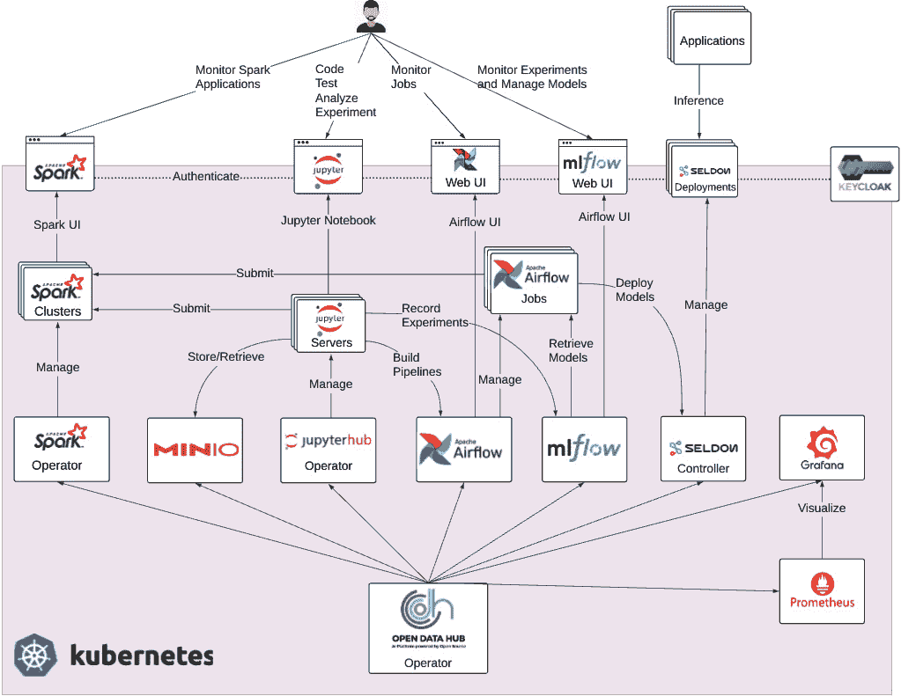
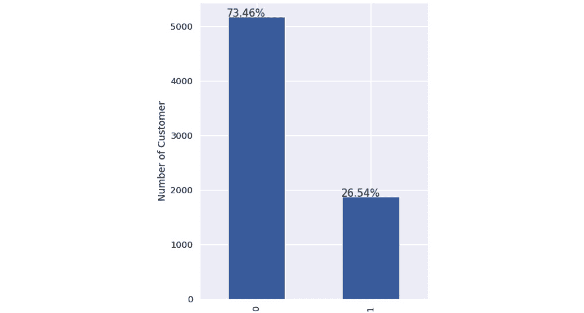
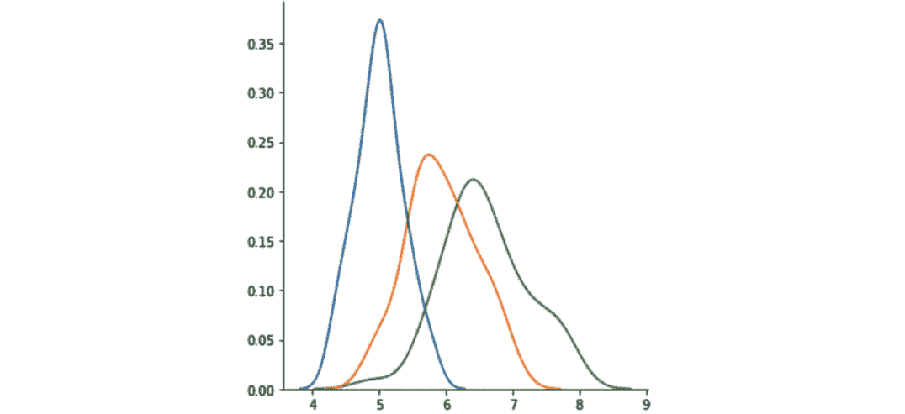
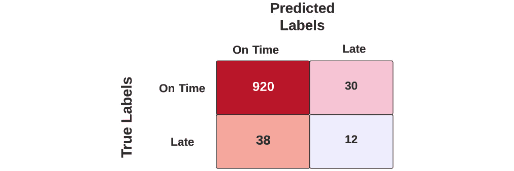

# 第七章：*第八章*：使用平台构建完整的机器学习项目

到目前为止，你已经了解了平台的一些组件及其工作原理。本章将从宏观层面理解平台，全面的视角将帮助你看到这些组件如何为你的**机器学习**（**ML**）需求编织出完整的解决方案。

在本章的后半部分，你将看到如何通过一个简单的示例启动机器学习项目，以及团队和平台如何帮助实现你的目标。

在本章中，你将学习以下内容：

+   审视机器学习平台的完整图景

+   理解业务问题

+   数据收集、处理和清洗

+   执行探索性数据分析

+   理解特征工程

+   构建和评估机器学习模型

+   可复现性

# 审视机器学习平台的完整图景

在前几章中，你已经在 Kubernetes 上构建了一个完整的机器学习平台。你安装、配置并探索了平台的不同组件。在开始使用平台之前，让我们退后一步，从工具的角度来看你构建的平台。*图 8.1* 展示了平台的完整逻辑架构：



图 8.1 – 逻辑平台架构

*图 8.1* 中的图示也展示了每个平台组件的交互。整个平台运行在 Kubernetes 内，并完全由 `Kfdef` 文件进行管理。还需要注意的是，ODH 操作符允许你添加或删除工具，或将一种工具替换为另一种工具。例如，你可以使用 Argo CD 来进行模型部署，而不是使用 Airflow。Keycloak 也不属于 ODH 项目的一部分。然而，组件必须通过单点登录机制进行保护，而 Keycloak 是一种非常适合为平台添加单点登录功能的开源工具。

从图表的顶部开始，你可以看到最终用户与 Jupyter notebooks、Spark、Airflow 和 MLflow 的用户界面进行交互。你在前面的章节中已经见识并体验了这些交互。部署的机器学习模型随后可以通过 REST API 调用供应用进行推理使用。

在图表的中间，你可以看到各个组件之间的交互以及它们之间执行的交互类型。Jupyter 服务器和 Airflow 作业可以向托管的 Spark 集群提交 Spark 应用程序。Airflow 与 MLflow 模型注册表进行交互，而 Jupyter notebooks 可以与 MLflow 进行交互，记录实验运行。Airflow 还会创建 Seldon 部署对象，Seldon 控制器将其转换为运行的 Pods，并将机器学习模型暴露为 REST 服务。一个组件与其他平台组件的交互方式没有限制。

在图表的底部，ODH 操作员管理和操作平台组件。ODH 操作员负责这些组件的安装和更新。Spark、JupyterHub 和 Seldon 控制器也是 Kubernetes 操作员，分别管理 Spark 集群、Jupyter notebook 服务器和 Seldon 部署实例。

最后，ODH 操作员还管理 Prometheus 和 Grafana 实例。Prometheus 用于收集每个组件的指标，包括 Seldon 部署的统计数据。Grafana 可以可视化这些指标，并可以配置为触发警报。

ODH 项目仍在发展中。未来可能会有一些组件的增减变化。一些官方支持的组件可能会随着时间的推移被其他组件替代。因此，理解架构和 ODH 操作员的工作原理是非常重要的，这样你才能保持它的最新状态。

在接下来的章节中，我们将退后一步，深入了解机器学习项目，从识别适合机器学习解决方案的机会开始。你将会跟随一个场景，逐步创建一个完整的机器学习项目。

# 理解业务问题

和任何软件项目一样，首先要做的是明确你试图解决的业务问题。我们为本书选择了一个虚构的场景，以便简化内容，集中关注过程。你也可以将这种方法应用于更复杂的项目。

假设你在一家航空公司预订公司工作，担任首席数据分析师。公司业务团队报告称，许多客户抱怨航班延误，导致公司客户体验差，电话客服花费大量时间向客户解释细节。业务方希望你提供一个解决方案，识别哪些航空公司、航班和时段的延误概率较低，以便网站可以优先展示这些航空公司，从而减少客户的延误。

让我们稍作休息，分析一下如何解决这个问题。我们需要在这里使用机器学习吗？如果我们拿历史数据，将航空公司分为 *延误* 和 *准时* 两类，并将每家航空公司放入正确的类别，那么在客户搜索航空公司时，这个属性就可以作为参考，帮助他们找到准时性更好的航空公司。一组数据分析师将分析数据并给出评级。工作完成！

在探索这组数据时，业务方提到每个航空公司一个桶的数据可能无法提供解决方案所需的粒度。他们希望从航司级别之外的其他因素进行性能评估，例如起点和终点机场，以及一天中的时间。因此，航空公司 A 的悉尼至墨尔本航班可能会进入*准时*桶，而同一航空公司从东京飞往大阪的航班则可能进入*延误*桶。这一下就扩大了问题的范围。如果你需要在这种粒度上分析数据，处理和分配正确的类别会花费大量时间，而且你可能需要频繁地分析这些数据。

你是否已经开始考虑如何自动化这个过程？业务方接着提到天气在这个问题中起着至关重要的作用，气象局的预报数据需要被提取并预处理，以进行分析。你意识到，如果依赖人工团队来完成这个任务，会非常缓慢且复杂，且无法提供业务方所需的解决方案。于是你向业务方提到，你需要调查现有的数据，这些数据可以用来预测某个航班的正确类别。你和业务方一致认为，目标是在航班计划时间前 10 天预测延误，并且至少达到 75%的准确率，以改善客户体验。你还将讨论模型的响应时间要求，并了解该模型如何在整体业务流程中使用。

你刚刚定义了这个项目的成功标准。你已将信息传达给业务方，说明你的团队将分析可用数据以评估其是否适用于项目，然后再规划下一步的工作。你已要求业务方指派一位**主题专家**(**SME**)来协助此阶段的数据探索。

总结来说，你已经概述了业务目标和项目范围。你还定义了评估标准，用以衡量项目的成功。至关重要的是，你需要在机器学习生命周期的每个阶段都记录业务价值。

一旦定义了评估标准，下一步就是开始查看可用的数据。对于此用例，数据可以在[`www.kaggle.com/usdot/flight-delays?select=flights.csv`](https://www.kaggle.com/usdot/flight-delays?select=flights.csv)找到。

# 数据收集、处理和清洗

在这个阶段，你将开始从已识别的数据源收集原始数据。你将编写数据管道，以准备和清理原始数据，供分析使用。

## 理解数据来源、位置和格式

你已开始与领域专家合作，访问一部分航班数据。你将了解数据格式以及访问这些数据所需的集成过程。数据可能是 CSV 格式，或者它可能存储在某些**关系型数据库管理系统**（**RDBMS**）中。了解这些数据如何为你的项目所用，以及这些数据最终是如何被维护的至关重要。

从识别易于获取的数据开始。领域专家提到，包含航班信息、计划和实际出发时间、计划和实际到达时间的航班记录数据可以轻松获得。这些信息存储在你们组织的对象存储中。这可以作为一个良好的起点。

## 理解数据处理与清理

从原始数据源收集的数据可能存在许多问题。收集的数据可能存在重复、缺失值和/或无效记录。例如，你可能会发现某一列的`string`类型数据中竟然包含了数字。你将与领域专家合作，找出处理这些异常数据的方法。

你将如何处理缺失数据？从现有的数据集中选择一个估算值来填充缺失数据。或者，如果缺失值很多且你无法找到任何方式来填补这些缺失值，你可能决定完全删除该列。

实现数据验证检查，确保清理后的数据集具有一致性，并且适当处理此处描述的数据质量问题。假设年龄列的值为`250`。虽然我们都希望能活这么长或者更长，但显然这个数据是无效的。在这个阶段，你将发现数据中的不一致性，并思考如何处理它。

你可能会发现航班的到达和出发时间是以当地时区表示的，你可能选择新增一个列，将这些时间转换为 UTC 格式，以便于进行比较。

数据清理可以发生在数据工程阶段和模型开发阶段。与领域或业务逻辑相关的数据异常可以在数据工程阶段发现并处理，而数据增强和数据编码则是在模型开发阶段完成的。这是因为数据科学家或机器学习工程师最了解模型训练所需的数据格式，而数据工程师则与业务领域专家的合作更为紧密。

实现数据验证的一种方法是在数据工程阶段通过 Apache Spark。Spark 提供了一组内置函数，可以用于数据清理。以下代码示例展示了如何在从数据源读取数据时，过滤掉无效行或包含格式错误数据的行：

```
dataframe = spark.read.option("header", True).option("mode", 'DROPMALFORMED').csv('flights.csv')
```

另一个示例是 `fillna()` 函数。它用于用其他值替换空值。以下示例展示了如何用零替换数据框中的所有空值：

```
dataframe = dataframe.fillna(value=0)
```

在模型开发方面，有几种技术可以使用 pandas 来执行相同的操作，以处理数据框架。你将在接下来的章节中看到这些技术的实际应用。

一旦你执行了数据清理流程并创建了一个可以用于下一阶段的中间数据集，接下来的步骤是看看现有数据是否有助于实现业务目标。

# 执行探索性数据分析

在此阶段，你需要分析数据，以评估其是否适合给定的问题。数据分析对于构建机器学习模型至关重要。在创建机器学习模型之前，你需要理解数据的背景。分析大量的公司数据并将其转化为有用的结果是极其困难的，而且没有单一的方法来实现这一点。找出哪些数据是有意义的，哪些数据对业务至关重要，是构建机器学习模型的基础。

这是一项初步分析，不能保证模型会带来预期的结果。然而，它提供了一个机会，可以在更高层次上理解数据，并在需要时进行调整。

## 理解样本数据

当你获得一组数据时，你首先通过简单地查看数据来理解它。接着，你会深入了解业务问题，尝试确定哪些模式对当前情况有帮助。很多时候，你将需要与具有相关领域知识的专家进行合作。

在此阶段，你可以选择将数据转换为表格形式，以便更好地理解它。根据数据值对列进行分类。理解数据集中的每个变量，并找出这些值是连续的，还是表示某一类别。然后，你将使用描述性统计来总结列，以了解列中包含的值。这些统计数据可以是均值、中央値，或任何有助于你理解数据的指标。

了解**数据方差**。例如，你的数据中只有 5%的航班记录是延误的，剩下的航班都是准时的。这个数据集对于你期望的结果会有帮助吗？你需要获取一个更好的数据集，代表更平衡的分布。如果数据集严重不平衡，你可以选择通过减少多数类别的样本来对数据集进行下采样。

人类擅长可视化数据，因此，为了更好地理解数据，你需要使用图表将列可视化。有一系列不同的图表可以帮助你可视化数据。我们在这里展示的平台将帮助你编写代码，使用流行的库，如 Matplotlib 或 Seaborn，来可视化数据。在你选择使用图表可视化数据之前，思考一下你希望从图表中获得什么信息，以及它如何帮助你理解数据。

作为示例，我们定义了以下小节中给出的三种基本图表及其特性。

### 箱型图

箱线图（[`www.khanacademy.org/math/statistics-probability/summarizing-quantitative-data/box-whisker-plots/a/box-plot-review`](https://www.khanacademy.org/math/statistics-probability/summarizing-quantitative-data/box-whisker-plots/a/box-plot-review)）是一个可视化并理解数据方差的极好方法。箱线图将结果以四分位数的形式展示，每个四分位数包含数据集的 25%的值；这些值会被绘制出来，显示数据的分布情况。*图 8.2* 显示了一个示例箱线图。注意黑点是一个**离群值**：


图 8.2 – 箱线图

箱线图的第一个组成部分是数据集的最小值。接下来是下四分位数，即最小的 25%的值。之后，我们得到的是数据集的中位数，即 50%的位置。接下来是上四分位数，即最大的 25%的值。最上面是数据集的最大值。最后，我们有离群值。离群值是极端的数据点——无论是高端还是低端——它们可能会对分析结果产生影响。

### 直方图

**直方图**表示数值数据的分布情况。要创建直方图，首先将数值范围划分为多个区间，这些区间称为**箱子（bins）**。在确定了用于存储数据的箱子数量后，数据会被放入适当的箱子中。直方图图表显示了按预定义的箱子进行分布的数据。*图 8.3* 显示了一个示例直方图。注意箱子位于图表的*x*轴上。以下图表显示了仅在两个箱子中的分布。你可以看到，分布偏向第一个箱子。



图 8.3 – 直方图

### 密度图

直方图的一个缺点是它们对箱子边界和箱子数量比较敏感。箱子的定义会影响分布的形状。如果你的数据包含更多离散的值（如性别或邮政编码），直方图可能会更适合。否则，可以考虑使用**密度图**，它是直方图的平滑版本。*图 8.4* 显示了一个示例密度图：



图 8.4 – 密度图

一旦你完成了探索性数据分析，你可以选择回去从现有的资源中收集更多数据，或者寻找新的数据源。如果你在此阶段确信你收集到的数据能够帮助你实现业务目标，那么你就可以进入下一阶段——特征工程。

# 理解特征工程

机器学习的核心是数据。无论我们的算法有多先进，如果数据不准确或不足，我们的模型就无法达到预期效果。特征工程将输入数据转换为与模型目标紧密对接的特征，并将数据转化为有助于模型训练的格式。

有时，某些数据对于给定的训练问题可能无用。我们如何确保算法仅使用正确的信息集？那些单独不实用的字段如何在我们将函数应用于一组字段时变得特别有用？

使数据对算法有用的行为称为特征工程。大多数情况下，数据科学家的工作是为给定问题找到正确的数据集。特征工程需要掌握特定领域的技术，您将与业务 SME 合作，以更好地理解数据。

特征工程不仅仅是从现有数据中找到正确的特征，而且您可能需要从现有数据中创建新特征。这些特征被称为**工程特征**。

想象一下，在您的航班数据集中，有提到`scheduled_departure_time`和`departure_time`的字段。这两个字段将告诉您航班是否晚点。然而，您的业务希望对航班是否晚点进行分类。您和业务部门同意将延误分类为以下三个类别：

+   准时

+   短延误

+   长延误

短延误捕捉最多 30 分钟延误起飞的航班。所有其他延误航班将根据延误列中的长延误值进行分类。您需要将此列或特征添加到数据集中。

您可能最终会放弃对给定问题无用的列。您认为`Cancellation Reason`列对预测航班延误有用吗？如果不是，您可以选择放弃此列。

您还将表示您的数据，使其易于 ML 算法消化。许多 ML 算法操作的是数值值；然而，并非所有数据都以数值格式存在。您将应用诸如**独热编码**之类的技术，将列转换为数值格式。

通常，ML 算法在值范围在`–1`和`1`之间的情况下表现良好，因为它收敛更快，训练时间更短。即使您有数值数据，将其转换为这个范围可能也会有益，这个过程称为**缩放**。在此阶段，您可以编写代码来缩放数据集。

## 数据增强

在某些情况下，您可能希望出于几个原因在数据集中创建额外的记录。一个原因是当您没有足够的数据来训练有意义的模型时，另一个原因是当您有意地想影响模型的行为，以支持一个答案而不是另一个答案，如纠正**过拟合**。这种创建合成数据的过程称为**数据增强**。

所有与数据收集、处理、清理、数据分析、特征工程和数据增强相关的活动都可以通过使用 Jupyter 笔记本和可能的 Apache Spark 平台来完成。

一旦你清理、分析并转换了数据，下一阶段就是构建和训练机器学习模型。

# 构建和评估机器学习模型

恭喜！你现在准备好训练你的模型了。你将首先评估哪些算法集适合当前问题。是回归问题还是分类问题？你如何评估模型是否达到了业务描述中的 75%正确预测率？

## 选择评估标准

我们从准确度作为模型评估标准开始。这记录了预测值与测试数据集中标签相同的次数。然而，如果数据集的方差不够，模型可能会对每个样本猜测大多数类别，这实际上没有学习到关于少数类的任何信息。

你决定使用混淆矩阵来查看每个类别的准确度。假设你有 1,000 条数据记录，其中 50 条被标记为*延迟*，其余 950 条标记为*准时*。现在，如果模型正确预测了 950 条数据中有`920`条是*准时*，并且 50 条数据中有`12`条是*延迟*，那么混淆矩阵将如下所示，如*图 8.5*所示：



图 8.5 – 混淆矩阵

对于不平衡的数据集，建议选择**召回率**、**精确率**或 F-score 等指标，以全面了解情况。在这种情况下，精确率为 31%（12/38），召回率为 24%（12/50），而准确度为 93.2%（932/1000），但在你的场景中，准确度可能会导致误导。

## 构建模型

你将开始将数据拆分为训练集、验证集和测试集。考虑一种情景，你将数据拆分为这些集合并训练一个模型；我们称之为*实验 1*。现在，你想使用不同的超参数重新训练模型，并再次拆分数据用于这一新的迭代并训练模型；我们称之为*实验 2*。如果两个实验中的数据拆分不一致，你能比较两个实验的结果吗？确保数据拆分是可重复的，这对于比较训练过程中的不同运行至关重要。

你将尝试不同的算法或算法的集成，来评估数据验证集的表现，并检查预测的质量。在这个阶段，每次你对模型进行新的调整（例如，超参数或不同的算法）时，你都将衡量并记录与业务专家在*理解业务问题*阶段共同设定的评估指标。

模型阶段的大多数步骤是迭代的。根据实验的结果，你可能会意识到模型的表现没有达到预期。在这种情况下，你可能想回到生命周期的前面步骤，比如特征工程。或者，你可能希望重新做一次数据分析，以确保你正确理解数据。在训练过程中，你将重新审视商业目标和数据，以找到正确的平衡。你可能会决定需要来自新源的额外数据点来增强训练数据。在这个阶段，强烈建议你将结果展示给业务相关方。这种沟通会在初期阶段向业务展示模型的价值，收集早期反馈，并为团队提供必要时调整方向的机会。

下一阶段是部署模型以进行推理。

## 部署模型

一旦你训练好了模型，下一阶段就是在 MLflow 中为模型版本控制，并将其部署到可以用来对传入请求进行预测的环境中。模型的版本控制将使你能够跟踪模型，并在需要时回滚到旧版本。

本书中，我们将使用在线模型推理的方法。模型已经通过平台的 Seldon 组件进行了容器化，并作为 REST API 暴露。每次调用这个 REST API 都会产生一个预测。运行在 Kubernetes 上的无状态容器将能够处理数十万次请求，因为容器本身具备扩展能力。

另一种方式是将传入的请求按批处理。假设有数十万条标记数据记录，并且你想测试这些记录上模型的表现。在这种情况下，单独进行 REST API 调用可能并不是正确的做法。相反，批量推理提供了一种异步的方法，可以为数百万条记录进行预测。Seldon 具备对数据批量推理的能力，但这超出了本书的范围。

你为航班延误预测所暴露的 REST API 可以被网页应用程序利用，从而进一步提升客户体验。

# 可重现性

现在，你已经知道了一个机器学习生命周期的样子，以及平台如何在你每一步旅程中提供帮助。作为个人，你可能能够在一个单一的笔记本中编写数据管道和模型训练与调优的每个步骤。然而，在团队中，可能会有人负责生命周期的不同部分，这样做可能会造成问题。假设某人想运行模型训练部分，但整个过程彼此相互关联。使用这种方法，团队可能无法扩展。

一种更好且更具可扩展性的方法是，为项目生命周期的各个阶段（如数据处理和模型训练）编写不同的笔记本，并使用工作流引擎将它们关联起来。使用 Kubernetes 平台，所有阶段将通过容器执行，并为您的项目在不同运行之间提供一致的环境。该平台提供了 Airflow，这是一个可以用于创建和执行工作流的引擎。

# 总结

在本章简短的内容中，我们希望回顾并向您展示平台和模型生命周期的整体图景。我们鼓励您参考*第二章*，*理解 MLOps*，在该章中我们展示了一个典型的机器学习生命周期，进行更为详细的讨论。请回想一下跨多个团队合作的重要性，以及在理解可用数据上投入更多时间将如何导致一个能够提供预期商业价值的模型。

现在您已经了解了项目的各个阶段将如何进行。在接下来的两章中，您将使用本书中展示的机器学习平台实现航班延误预测服务，并执行我们在本章中描述的每一个阶段。我们的目的是向您展示平台如何满足项目的每个阶段，以及您如何在组织中实施该平台。
