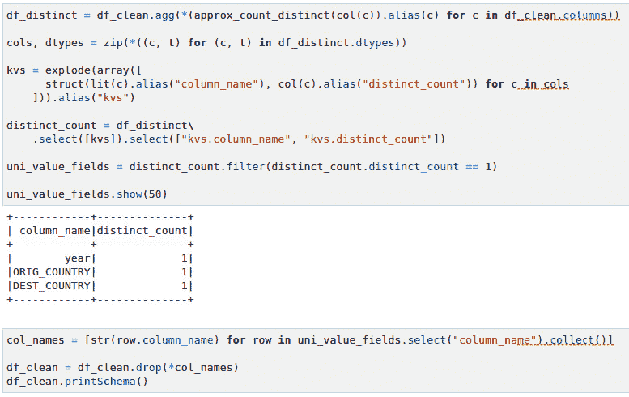
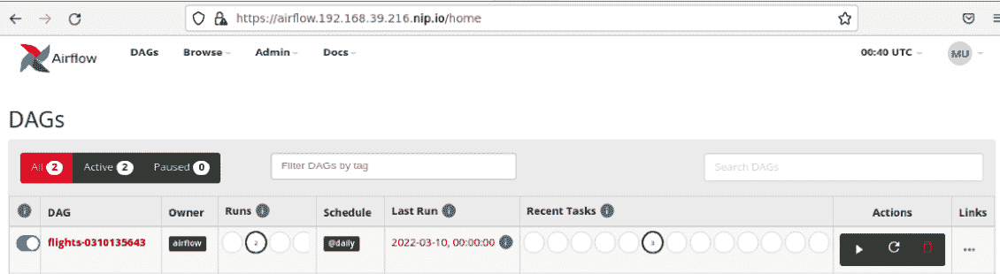

# *第九章*：构建您的数据管道

在上一章中，您了解了通过推荐具有更高准时率的航班来改善用户体验的示例业务目标。您已经与业务 **领域专家**（**SME**）合作，了解了可用数据。在本章中，您将看到平台如何帮助您从各种来源收集和处理数据。您将看到如何按需创建 Spark 集群，以及如何使用平台在共享环境中隔离工作负载。新的航班数据可能会频繁更新，您将看到平台如何帮助您自动执行数据管道。

本章中，您将学习以下内容：

+   自动化配置用于开发的 Spark 集群

+   编写 Spark 数据管道

+   使用 Spark UI 监控您的任务

+   使用 Airflow 构建并执行数据管道

# 技术要求

本章包括一些动手设置和练习。您将需要一个已启动的 Kubernetes 集群，并且已配置 **Operator Lifecycle Manager**（**OLM**）。构建此类 Kubernetes 环境的过程可以参考 *第三章*，*探索 Kubernetes*。在进行本章的技术练习之前，请确保您拥有一个可工作的 Kubernetes 集群，并且 **Open Data Hub**（**ODH**）已安装在您的 Kubernetes 集群上。安装 ODH 的过程可以参考 *第四章*，*机器学习平台的构成*。

# 自动化配置用于开发的 Spark 集群

在本节中，您将学习平台如何使您的团队按需配置 Apache Spark 集群。这种按需配置新的 Apache Spark 集群的能力使得您的组织能够在共享的 Kubernetes 集群上运行多个由多个团队使用的隔离项目，而不会发生重叠。

该组件的核心是平台中可用的 Spark 操作符。Spark Kubernetes 操作符允许您声明性地启动 Spark 集群。您可以在本书的 Git 仓库中的 `manifests/radanalyticsio` 文件夹找到必要的配置文件。该操作符的详细内容超出了本书的范围，但我们会向您展示该机制是如何工作的。

Spark 操作符定义了一个 Kubernetes **自定义资源定义**（**CRD**），它提供了您可以向 Spark 操作符发出的请求的架构。在此架构中，您可以定义许多内容，例如集群的工作节点数量以及分配给集群主节点和工作节点的资源。

通过此文件，您可以定义以下选项。请注意，这不是一个详尽无遗的列表。完整列表请参阅该开源项目的文档：[`github.com/radanalyticsio/spark-operator`](https://github.com/radanalyticsio/spark-operator)：

+   `customImage` 部分定义了提供 Spark 软件的容器名称。

+   `master` 部分定义了 Spark 主实例的数量以及分配给主 Pod 的资源。

+   `worker` 部分定义了 Spark 工作实例的数量以及分配给工作 Pod 的资源。

+   `sparkConfiguration` 部分使你能够添加任何特定的 Spark 配置，例如广播连接的阈值。

+   `env` 部分使你能够添加 Spark 所使用的变量，例如 `SPARK_WORKER_CORES`。

+   `sparkWebUI` 部分启用标志，并指示操作员为 Spark UI 创建一个 Kubernetes Ingress。在接下来的部分中，你将使用这个 UI 来调查你的 Spark 代码。

你可以在 `manifests/radanalyticsio/spark/cluster/base/simple-cluster.yaml` 找到其中一个文件，并且它在以下截图中展示。*图 9.1* 显示了 `simple-cluster.yaml` 文件的一个部分：


图 9.1 – Spark 操作符使用的简单 Spark 自定义资源

现在，你已经了解了在平台上配置 Spark 集群的基本过程。然而，在接下来的章节中，你会看到，当你选择**Elyra Notebook Image with Spark**笔记本镜像时，Spark 集群会自动为你配置。这是因为在平台中，JupyterHub 被配置为在你选择特定笔记本时提交 Spark 集群**自定义资源**（**CR**）。此配置通过两个文件提供。

第一个文件是 `manifests/jupyterhub/jupyterhub/overlays/spark3/jupyterhub-singleusers-profiles-configmap.yaml`，它定义了一个名为 `Spark Notebook` 的配置文件。在这一部分中，平台会在 `images` 键下配置容器镜像的名称，因此每当 JupyterHub 启动该镜像的新实例时，它会应用这些设置。`configuration` 和 `resources` 部分指向将在该镜像实例创建时一起创建的资源。*图 9.2* 显示了 `jupyterhub-singleusers-profiles-configmap.yaml` 文件的一个部分：


图 9.2 – jupyterhub-singleusers-profiles-configmap.yaml 文件的一个部分

注意，`resources` 中有一个属性值为 `sparkClusterTemplate`，这将引出我们第二个文件的内容。

第二个文件 `manifests/jupyterhub/jupyterhub/base/jupyterhub-spark-operator-configmap.yaml` 包含 `sparkClusterTemplate`，它定义了 Spark CR。请注意，`jupyterhub-singleusers-profiles-configmap.yaml` 文件中可用的参数将在此处使用。*图 9.3* 显示了 `jupyterhub-spark-operator-configmap.yaml` 文件的一个部分：


图 9.3 – jupyterhub-spark-operator-configmap.yaml 文件的一个部分

在本节中，你已经看到平台如何将不同组件连接在一起，使你的团队和组织的工作变得更轻松，你可以根据需要更改和配置这些组件，这就是开源软件的真正力量。

让我们编写一个数据管道来处理我们的航班数据。

# 编写一个 Spark 数据管道

在本节中，你将构建一个真实的数据管道，用于收集和处理数据集。处理的目标是格式化、清理和转换数据，使其成为可用于模型训练的状态。在编写数据管道之前，我们首先来了解数据。

## 准备环境

为了执行以下练习，我们首先需要设置一些内容。你需要设置一个 PostgreSQL 数据库来存储历史航班数据。并且你需要将文件上传到 MinIO 的 S3 桶中。我们同时使用关系型数据库和 S3 桶，以更好地展示如何从不同的数据源收集数据。

我们已准备好一个 Postgres 数据库容器镜像，你可以在 Kubernetes 集群上运行。该容器镜像可以在[`quay.io/repository/ml-on-k8s/flights-data`](https://quay.io/repository/ml-on-k8s/flights-data)获取。它运行一个 PostgreSQL 数据库，并在名为`flights`的表中预加载了航班数据。

按照以下步骤运行此容器，验证数据库表，并将 CSV 文件上传到 MinIO：

1.  在与 minikube 运行的机器上运行以下命令以启动 Postgres 数据库容器：

    ```
    kubectl create -f chapter9/deployment-pg-flights-data.yaml -n ml-workshop
    ```

你应该看到一条消息，告诉你`deployment`对象已被创建。

1.  通过运行以下命令，通过服务公开此部署的 Pods：

    ```
    kubectl create -f chapter9/service-pg-flights-data.yaml -n ml-workshop
    ```

你应该看到一条消息，表示服务对象已创建。

1.  探索数据库的内容。你可以通过进入 Pod，运行 Postgres 客户端`psql`并执行 SQL 脚本来实现。执行以下命令以连接到 Postgres Pod 并运行 Postgres 客户端界面：

    ```
    POD_NAME=$(kubectl get pods -n ml-workshop –l app=pg-flights-data)
    ```

1.  连接到 Pod。你可以通过执行以下命令来实现：

    ```
    kubectl exec -it $POD_NAME -n ml-workshop -- bash
    ```

1.  运行 Postgres 客户端 CLI，`psql`，并验证表格。运行以下命令从命令行登录到 Postgres 数据库：

    ```
    psql –U postgres
    ```

这将运行客户端 CLI 并连接到默认数据库。

1.  验证表格是否存在。应该有一个名为`flights`的表。运行以下命令从`psql` shell 验证表格的正确性：

    ```
    select count(1) from flights;
    ```

这应该给你提供`flights`表中的记录数量，超过 580 万，如*图 9.4*所示：


图 9.4 – 来自航班表的记录数量

1.  将其余的数据上传到 MinIO 的 S3 桶中。打开与 minikube 运行的机器相同的浏览器窗口，并导航到。使用用户名`minio`和密码`minio123`。记得将`<minikube_ip>`替换为你的 minikube 实例的 IP 地址。

1.  导航到`airport-data`并点击**创建存储桶**按钮，如*图 9.5*所示：


图 9.5 – MinIO 创建存储桶对话框

1.  在存储桶内，从`chapter9/data/`文件夹上传两个 CSV 文件到`airport-data`存储桶，如*图 9.6*所示：


图 9.6 – 机场和航空公司数据文件

在现实世界中，你不需要执行上述步骤。数据源应该已经存在，你只需要知道在哪里获取它们。然而，为了进行接下来的练习，我们必须将数据加载到环境中，以便在后续步骤中使用。

现在你已经将数据加载到平台上。让我们进一步探索和理解这些数据。

## 理解数据

理解数据包括以下活动。理解所有涉及的数据集的特性非常重要，以便制定管道策略和设计：

+   *知道数据将从哪里收集*。数据可能来自多种来源。它可能来自关系数据库、对象存储、NoSQL 数据库、图形数据库、数据流、S3 存储桶、HDFS、文件系统或 FTP。掌握这些信息后，你将能够准备数据管道所需的连接。在你的案例中，你需要从 PostgreSQL 数据库和 S3 存储桶中收集数据。

+   *理解数据的格式*。数据可以有多种形式和结构。无论是 CSV 文件、SQL 表、Kafka 流、MQ 流、Parquet 文件、Avro 文件，还是 Excel 文件，你都需要具备能够读取这种格式的工具。理解数据格式有助于你准备读取这些数据集所需的工具或库。

+   *清理不重要或无关的数据*。了解哪些数据是重要的，哪些是无关的，有助于你更高效地设计管道。例如，如果你有一个包含`airline_name`和`airline_id`字段的数据集，你可能希望在最终输出中去掉`airline_name`，只保留`airline_id`。这意味着减少一个字段的编码，从而提高模型训练的性能。

+   *理解不同数据集之间的关系*。识别标识符字段或主键，理解连接键和聚合级别。你需要了解这些，以便你可以将数据结构扁平化，使数据科学家更容易使用你的数据集。

+   *知道处理后的数据存储在哪里*。你需要知道将处理后的数据写入哪里，以便准备连接要求并理解接口。

鉴于前述活动，你需要一种方法来访问和探索数据源。接下来的章节将展示如何在 Jupyter 笔记本中读取数据库表。

### 从数据库读取数据

使用 Jupyter 笔记本，我们来查看数据。请按照以下步骤开始数据探索，从读取 PostgreSQL 数据库中的数据开始。

整个数据探索笔记本可以在本书的 Git 仓库中找到，路径为`chapter9/explore_data.ipynb`。我们建议您使用此笔记本进行额外的数据探索。可以通过简单地显示字段、统计某一列中相同值的出现次数，以及寻找数据源之间的关系来进行探索：

1.  通过访问`https://jupyterhub.<minikube_ip>.nip.io`来启动 Jupyter 笔记本。如果系统提示登录凭据，您需要使用已创建的 Keycloak 用户进行登录。用户名是`mluser`，密码是`mluser`。启动**Elyra Notebook Image with Spark**笔记本，如*图 9.7*所示。由于我们将读取一个包含 580 万条记录的大型数据集，因此请选择**Large**容器大小。确保您的环境中有足够的容量来运行大型容器。如果容量不足，请尝试使用中型容器。


图 9.7 – JupyterHub 启动页面

1.  创建一个 Python 3 笔记本。您将使用此笔记本来探索数据。可以通过选择**文件** | **新建** | **笔记本**菜单选项来创建。然后，选择**Python 3**作为内核，如*图 9.8*所示：


图 9.8 – Elyra 笔记本的内核选择对话框

1.  您可以通过查看数据库中的`flights`表格来开始。访问数据库的最基本方式是通过 PostgreSQL Python 客户端库。在练习中使用`psycopg2`。您也可以选择其他客户端库来连接 PostgreSQL 数据库。*图 9.9*中的代码片段是最基本的示例：


图 9.9 – 使用 psycopg2 连接 PostgreSQL 的基本示例

1.  另一种更优雅的访问数据的方式是通过**pandas**或**PySpark**。pandas 和 PySpark 都允许您通过数据框架利用函数式编程方法访问数据，而不是像*步骤 3*中那样的过程式方法。pandas 和 Spark 之间的区别在于，Spark 查询可以通过分布式方式执行，利用多个机器或 Pods 来执行查询。这对于大数据集来说非常理想。然而，pandas 提供的可视化效果比 Spark 更具美观性，因此 pandas 更适合探索小型数据集。*图 9.10*展示了如何通过 pandas 访问数据库的代码片段：


图 9.10 – 使用 pandas 连接 PostgreSQL 的基本示例

1.  如果你需要转换一个巨大的数据集，PySpark 将是理想的选择。例如，假设你需要转换并聚合一个有 1 亿条记录的表。你需要将这项工作分配给多台机器，以便更快地得到结果。这时 Spark 发挥了重要作用。*图 9.11*中的代码片段展示了如何通过 PySpark 读取 PostgreSQL 表：


图 9.11 – 通过 PySpark 读取 PostgreSQL 表

由于 Spark 的分布式架构，你在从任何关系型数据库读取表时，需要提供分区信息，特别是分区的数量和分区列。当你提供分区信息时，每个分区将在 Spark 的术语中成为一个任务，每个任务可以由单个 CPU 核心独立执行。如果没有提供分区信息，Spark 将尝试将整个表当作一个单一分区来处理。你不希望这样做，因为该表有 580 万个记录，可能无法在单个 Spark 工作节点的内存中容纳。

你还需要提供一些关于 Spark 集群的信息，比如主节点的 URL 以及运行 Spark 应用所需的包。在*图 9.12*的示例中，我们包括了`org.postgresql:postgresql:42.3.3`包。这个包是 Spark 连接数据库所需的 PostgreSQL JDBC 驱动程序。Spark 将在应用启动时自动从 Maven 下载此包。

### 从 S3 桶中读取数据

现在你已经了解了从 Jupyter 笔记本访问 PostgreSQL 数据库的不同方式，让我们来探索其余的数据。虽然数据库中的`flights`表包含航班信息，但我们也有作为 CSV 文件提供的*airport*和*airline*信息，这些文件托管在 MinIO 的 S3 桶中。

Spark 可以通过`hadoop-aws`库与任何 S3 服务器进行通信。*图 9.12*展示了如何从笔记本使用 Spark 访问 S3 桶中的 CSV 文件：


图 9.12 – 从笔记本中读取 S3 桶的 Spark 代码

请注意，我们添加了几个 Spark 提交参数。这是为了告诉 Spark 引擎 S3 服务器在哪里以及使用哪个驱动程序库。

在你探索完数据集后，你应该已经了解了以下关于数据的事实：

+   *flights*表包含 5,819,079 条记录。

+   `airports.csv`文件中有 322 个机场。

+   `airlines.csv`文件中有 22 家航空公司。

+   机场和航空公司之间没有直接的关系。

+   `flights`表使用来自`airport` CSV 文件中的`IATA_CODE`机场信息作为某个航班的起始和目的机场。

+   `flights`表使用来自`airlines` CSV 文件中的`IATA_CODE`航空公司信息来指示某个航班由哪家航空公司提供服务。

+   所有的机场都位于美国。这意味着“国家”列对**机器学习**（**ML**）训练来说是无用的。

+   `flights`表有`SCHEDULED_DEPARTURE`、`DEPARTURE_TIME`和`DEPARTURE_DELAY`字段，这些字段可以用来判断航班是否延误，并且我们可以用它们生成一个`label`列来进行 ML 训练。

基于这些事实，我们可以说，我们可以使用机场和航空公司数据，为原始`flights`数据添加额外的机场和航空公司信息。这个过程通常称为**增强**，可以通过数据框连接来实现。我们还可以利用行数信息来优化我们的 Spark 代码。

现在你已经理解了数据，可以开始设计和构建你的数据管道了。

## 设计和构建数据管道

理解数据是一回事，设计管道是另一回事。从你在前面部分探索的数据中，你学到了几个事实。我们将基于这些事实来决定如何构建我们的数据管道。

目标是生成一个包含所有可能对 ML 训练有用的关键信息的单一扁平数据集。我们说“所有关键信息”，因为在实际进行 ML 训练之前，我们无法确定哪些字段或特征是重要的。作为数据工程师，你可以根据对数据的理解，并借助领域专家（SME）的帮助，做出一个有根据的猜测，来判断哪些字段重要，哪些不重要。在 ML 生命周期中，数据科学家可能会回头找你，要求增加更多字段、删除某些字段或对数据进行某些转换。

以生成单一数据集为目标，我们需要用机场和航空公司数据来增强航班数据。为了将原始航班数据与机场和航空公司数据结合，我们需要执行数据框的`join`操作。我们还需要注意，航班数据有数百万条记录，而机场和航空公司数据不到 50 条。我们可以利用这些信息来优化 Spark 的`join`算法。

### 为数据框连接准备笔记本

首先，创建一个新的笔记本来执行连接操作，然后将这个笔记本作为管道的一个阶段。接下来的步骤将展示如何操作：

1.  创建一个新的笔记本，命名为`merge_data.ipynb`。

1.  使用 Spark 从 Postgres 和 S3 桶中获取数据。运用你在前面部分学到的知识。*图 9.13*展示了笔记本中数据读取的部分。我们还提供了一个实用的 Python 文件，`chapter9/spark_util.py`，它封装了 Spark 上下文的创建，使你的笔记本更加易读。*图 9.13*中的代码片段展示了如何使用这个工具：


图 9.13 – 准备数据框的 Spark 代码

注意这里有一个新的`import`语句，用于`broadcast()`。你将在下一步中使用这个函数进行优化。

1.  在 Spark 中执行数据框连接，如*图 9.14*所示。你需要连接在*步骤 2*中准备的所有三个数据框。从我们在前一节中的理解，机场和航空公司数据应该通过`IATA_CODE`作为主键进行合并。但首先，让我们先连接航空公司数据。注意连接后的结果模式；与原始模式相比，底部多了两个额外的列。这些新列来自`airlines.csv`文件：


图 9.14 – Spark 代码实现基本数据框连接

1.  连接机场数据稍微有点复杂，因为你必须进行两次连接：一次连接到`origin_airport`，另一次连接到`destination_airport`。如果我们按照*步骤 3*中的相同方法进行操作，连接将成功，并且列会被添加到模式中。问题是，很难判断哪些机场字段代表目的地机场，哪些字段代表出发地机场。*图 9.15*显示了字段名是如何重复的：


图 9.15 – 连接后重复的列

1.  最简单的解决方法是创建带有前缀字段名的新数据框（`ORIG_`用于出发机场，`DEST_`用于目的地机场）。你也可以对航空公司字段做同样的操作。*图 9.16*展示了如何实现：


图 9.16 – 向字段名添加前缀

1.  将`df_airports`数据框替换为`df_o_airports`和`df_d_airports`，如*图 9.17*所示。现在，你得到了一个更易读的数据框：


图 9.17 – 带有前缀数据框的更新连接语句

在`join`语句中有一点需要注意，就是`broadcast()`函数。在前一节中，我们讨论了了解数据集大小的重要性，这样你可以优化代码。`broadcast()`函数给 Spark 引擎一个提示，告诉它该数据框应该被广播，并且`join`操作必须使用广播`join`算法。这意味着，在执行之前，Spark 会将`df_airlines`、`df_o_airports`和`df_d_airports`数据框的副本分发给每个 Spark 执行器，以便它们可以与每个分区的记录进行连接。为了使广播`join`有效，你需要选择*较小的数据框*进行广播。如果你想了解更多信息，请参考 Spark 的性能调优文档，网址：[`spark.apache.org/docs/latest/sql-performance-tuning.html`](https://spark.apache.org/docs/latest/sql-performance-tuning.html)。

你刚刚学习了如何使用 PySpark 连接数据框。由于 PySpark 语句是惰性求值的，因此 `join` 操作的实际执行尚未发生。这就是为什么 `printSchema()` 执行速度很快的原因。Spark 只会在实际需要数据时执行处理。一个典型的场景就是当你将实际数据持久化到存储中时。

### 持久化数据框

要获取连接结果，你需要将数据框转化为物理数据。你将把数据框写入 S3 存储，以便数据管道的下一个阶段可以读取它。*图 9.18* 显示了一个代码片段，该代码片段将连接后的航班数据框写入 MinIO 中的 CSV 文件：


图 9.18 – 将数据框写入 S3 存储桶

执行此操作需要一些时间，因为这是处理 580 万条记录的实际过程所在。此操作正在运行时，你可以查看 Spark 集群中发生的情况。当你启动笔记本时，它在 Kubernetes 中创建了一个 Spark 集群，并将用户 `mluser` 分配给你。Spark GUI 在 https://spark-cluster-mluser.<minikube_ip>.nip.io 上公开。请访问此网址以监控 Spark 应用程序并检查应用程序作业的状态。你应该会看到一个名为 **Enrich flights data** 的正在运行的应用程序。点击该应用程序名称，将带你到一个更详细的视图，显示正在处理的作业，如 *图 9.19* 所示：


图 9.19 – Spark 应用程序 UI

*图 9.19* 显示了来自数据库的 `flights` 数据的详细信息，包括列重命名、数据框连接以及将输出写入 S3 存储桶。这对于数据框的每个分区执行，表示按“日”划分的 `flights` 数据框，总共有 31 个分区。Spark 还创建了 31 个并行处理任务。每个任务都被安排在 **Spark 执行器** 上运行。在 *图 9.19* 中，详细信息显示，在过去 1.2 分钟的处理时间里，31 个任务中有 13 个成功完成，当前有四个任务正在运行。

你也可能会在某些情况下发现任务失败。Spark 会自动将失败的任务重新调度到另一个执行器。默认情况下，如果同一任务连续失败四次，整个应用程序将被终止并标记为失败。任务失败有多种原因，其中一些包括网络中断或资源拥塞，如内存不足异常或超时。这就是为什么理解数据非常重要，因为你可以调整分区逻辑。这里有一个基本规则需要注意：分区数量越多，分区大小越小。较小的分区大小会减少内存溢出异常的可能性，但也会增加调度时的 CPU 开销。Spark 的机制比这要复杂得多，但理解分区、任务、作业和执行器之间的关系是个不错的起点。

数据工程的工作中，实际上近一半的时间都花费在优化数据管道上。优化 Spark 应用程序有很多技术，包括代码优化、分区和执行器大小调整。我们在本书中不会详细讨论这个话题。不过，如果你想了解更多相关内容，可以随时参考 Spark 的性能调优文档。


图 9.20 – 包含 Parquet 文件的 S3 存储桶

在 Spark 应用程序完成后，数据应以多个文件的形式写入 S3，每个文件表示一个分区，格式为 Parquet，如 *图 9.20* 所示。**Parquet** 文件格式是一种列式数据格式，意味着数据是按列组织的，而不是像传统的 CSV 文件那样按行组织。Parquet 的主要优势是你可以选择性地读取需要的列，而无需扫描整个数据集。这使得 Parquet 非常适合分析、报告以及数据清理，这也是你接下来需要做的。

你可以在本书的 Git 仓库中的 `chapter9` 文件夹里找到完整的 `merge_data.ipynb` 笔记本。然而，我们强烈建议你从头开始创建自己的笔记本，以最大化学习体验。

### 清理数据集

现在你已经拥有了一个扁平化并且丰富的 `flights` 数据集。下一步是清理数据，删除不需要的字段，丢弃不需要的行，同化字段值，推导新字段，并且可能还需要转换某些字段。

首先，创建一个新的笔记本，使用这个笔记本读取我们生成的 Parquet 文件，并将其写成清理后的数据集。以下步骤将带你完成这个过程：

1.  创建一个新的笔记本，命名为 `clean_data.ipynb`。

1.  从`flights-data/flights` S3 桶中加载`flights`数据的 Parquet 文件，如*图 9.21*所示。验证模式和行数。行数应该略少于原始数据集。这是因为在之前的`join`操作中，使用的是内连接，而原始`flights`数据中存在没有机场或航空公司引用的记录。


图 9.21 – 从 S3 读取 Parquet 数据

1.  删除不需要或重复的字段，去除整个数据集中值相同的字段，并创建一个派生的布尔字段`DELAYED`，对于延迟的航班值为`1`，对于未延迟的航班值为`0`。假设只有当航班延迟超过 15 分钟时，我们才认为它是延迟的。你可以根据需求随时更改这一点。让我们慢慢来，首先删除不需要的列，如*图 9.22*所示：


图 9.22 – 删除不需要的列

我们不需要`AI_IATA_CODE`、`ORIG_IATA_CODE`和`DEST_IATA_CODE`，因为它们分别与`airline`、`origin_airport`和`destination_airport`列相同。

1.  查找数据集中所有值相同的列是一个昂贵的操作。这意味着你需要统计每列在 500 万条记录中的不同值。幸运的是，Spark 提供了`approx_count_distinct()`函数，它的运行速度非常快。*图 9.23*中的代码片段展示了如何找到值相同的列：



图 9.23 – 删除所有行中值相同的列

1.  最后，创建`label`字段来判断航班是否延迟。数据科学家可以将此字段作为训练的标签。然而，数据科学家也可以根据选择的算法使用类似的范围，比如`departure_delay`。因此，我们将`departure_delay`字段与基于 15 分钟延迟阈值的新布尔字段一起保留。我们将这个新字段称为`DELAYED`：


图 9.24 – 创建 DELAYED 列

*图 9.24*展示了创建派生列的代码片段。通过运行一个简单的查询并使用`show()`函数来测试列创建逻辑。

1.  现在，将物理数据写入同一 S3 桶中的`flights-clean`路径。我们还希望将输出以 Parquet 格式写入（见*图 9.25*）：


图 9.25 – 将最终数据框写入 S3

作为数据工程师，你需要与数据科学家达成一致关于输出格式。一些数据科学家可能希望得到一个巨大的 CSV 文件数据集，而不是多个 Parquet 文件。在我们的案例中，假设数据科学家更倾向于读取多个 Parquet 文件。

1.  *第 6 步* 可能会花费相当长的时间。你可以访问 Spark UI 来监控应用程序的执行情况。

你可以在本书的 Git 仓库中的 `chapter9` 文件夹下找到完整的 `clean_data.ipynb` 笔记本。但是，我们强烈建议你从头开始创建自己的笔记本，以最大化学习体验。

## 使用 Spark UI 监控数据管道

在运行 Spark 应用程序时，你可能想深入了解 Spark 实际在做什么，以便优化你的管道。Spark UI 提供了非常有用的信息。主节点的着陆页显示了工作节点和应用程序的列表，如 *图 9.26* 所示：


图 9.26 – Spark 集群着陆页

着陆页还显示了历史应用程序运行记录。你可以通过点击某个已完成的应用程序 ID 查看已完成应用程序的一些详细信息。然而，在监控应用程序时，我们更关注正在运行的应用程序。让我们进一步了解 UI 中的信息。

### 探索 workers 页面

Worker 是 Spark 集群中的机器。它们的主要责任是运行执行器。在我们的案例中，**工作节点** 是带有工作 **Java 虚拟机** (**JVM**) 的 Kubernetes Pods。每个 Worker 可以托管一个或多个执行器。然而，在 Kubernetes 上运行 Spark Worker 时，这并不是一个好主意，因此你应该配置执行器，使得每个 Worker 只运行一个执行器：


图 9.27 – Spark Worker 视图

点击 UI 中的一个 worker 将带你到 worker UI，在那里你可以看到该 worker 已经运行或正在运行的所有执行器。你还可以看到哪些应用程序拥有这些执行器。你可以看到分配给它的 CPU 或内存量，甚至可以查看每个执行器的日志。

### 探索 Executors 页面

执行器是运行在工作节点中的进程。它们的主要责任是执行任务。执行器实际上就是在工作节点上运行的 Java 或 JVM 进程。工作 JVM 进程管理同一主机内的执行器实例。访问 http://spark-cluster-mluser.<minikube_ip>.nip.io/proxy/<application_id>/executors/ 将带你到 **Executors** 页面，该页面将列出当前应用程序的所有执行器，如 *图 9.28* 所示：


图 9.28 – Spark Executors 页面

在这一页，你会找到对微调和优化应用程序非常重要的有用指标。例如，你可以看到资源使用情况、垃圾回收时间和数据交换（**Shuffles**）。**Shuffles** 是在多个执行器之间交换数据，通常会在你执行聚合函数时发生。你希望将其保持在尽可能小的范围内。

### 探索应用程序页面

Spark 中的应用程序是拥有 Spark 上下文的任何进程。它可以是一个正在运行的 Java、Scala 或 Python 应用程序，这些应用程序创建了一个 Spark 会话或 Spark 上下文，并将其提交给 Spark 主 URL。应用程序不一定要在 Spark 集群中运行，它可以位于网络的任何地方，只要它能连接到 Spark 主节点。然而，还有一种模式，其中应用程序（也称为驱动程序应用程序）在 Spark 执行器之一内执行。在我们的例子中，驱动程序应用程序是运行在 Spark 集群外的 Jupyter 笔记本。这就是为什么在*图 9.28*中你看到的是一个执行器，称为**driver**，而不是实际的执行器 ID。

从着陆页面点击正在运行的应用程序名称会带你进入应用程序 UI 页面。该页面显示属于当前应用程序的所有作业。作业是修改数据框的操作。每个作业由一个或多个任务组成。任务是操作与数据框分区的配对。这是分配给执行器的工作单元。在计算机科学中，这相当于一个**闭包**。这些任务作为二进制文件通过网络传输到工作节点，供执行器执行。*图 9.29*展示了应用程序 UI 页面：


图 9.29 – Spark 应用程序 UI

在*图 9.29*中的示例中，你可以看到活跃作业*5*有五个任务，其中四个任务正在运行。**任务**级别的并行度取决于分配给应用程序的 CPU 核心数。你还可以进一步深入查看特定的作业。如果你访问 http://spark-cluster-mluser.<minikube_ip>.nip.io/proxy/<application_id>/jobs/job/?id=<job_id>，你应该能看到该作业的各个阶段以及每个阶段的 DAG（有向无环图）。


图 9.30 – Spark 作业详细页面

Spark 的图形用户界面在执行诊断和微调复杂的数据处理应用程序时非常有用。Spark 也有很好的文档，我们建议你访问以下链接查看 Spark 的文档：[`spark.apache.org/docs/3.0.0`](https://spark.apache.org/docs/3.0.0)。

现在，你已经创建了一个用于丰富`flights`数据的笔记本，以及另一个用于清理数据集以为机器学习项目生命周期的下一个阶段做准备的笔记本，让我们看看如何自动化这些笔记本的执行。

# 使用 Airflow 构建并执行数据管道

在上一部分中，您已经构建了数据管道以摄取和处理数据。假设新的`flights`数据每周更新一次，您需要反复处理这些新数据。一个方法是手动运行数据管道；然而，随着数据管道数量的增长，这种方法可能无法扩展。数据工程师的时间应该更多地用在编写新的管道，而不是反复运行旧的管道。第二个问题是安全性。您可能是基于样本数据编写的数据管道，而您的团队可能没有访问生产数据的权限来执行该数据管道。

自动化提供了解决这两个问题的方案。您可以按需调度数据管道的运行，而数据工程师则可以从事更有趣的工作。您的自动化管道可以连接到生产数据，而无需开发团队的参与，从而提高安全性。

机器学习平台包含 Airflow，可以自动化数据管道的执行和调度。请参考*第七章*，*模型部署与自动化*，了解 Airflow 简介以及**可视化编辑器**如何帮助数据工程师从相同的 IDE 中构建数据管道，正是他们用来编写数据管道的工具。集成提供了数据工程团队可以自助独立工作的能力，从而进一步提高了团队的效率。

在下一部分中，您将自动化上一部分中构建的项目数据管道。

## 理解数据管道 DAG

首先让我们了解执行您已构建的数据管道的过程。一旦您拥有了正确的信息，自动化过程就会变得简单。

当您开始在 JupyterHub 中编写数据管道时，您从 JupyterHub 登陆页面开始使用**带 Spark 的 Elyra Notebook 镜像**。在笔记本中，您连接到 Apache Spark 集群并开始编写数据管道。机器学习平台*知道*对于**带 Spark 的 Elyra Notebook 镜像**，它需要启动一个新的 Spark 集群，以便在笔记本中使用。一旦完成工作，您可以关闭 Jupyter 环境，这将导致机器学习平台关闭 Apache Spark 集群。

以下是执行`flights`数据管道过程中的三个主要阶段：

1.  启动 Spark 集群。

1.  运行数据管道笔记本。

1.  停止 Spark 集群。

*图 9.31* 显示了 DAG 的各个阶段：


图 9.31 – 用于航班项目的 Airflow DAG

这些阶段中的每一个都将由 Airflow 作为独立的步骤执行。Airflow 启动一个 Kubernetes Pod 来运行这些阶段中的每一个，同时您提供运行每个阶段所需的 Pod 镜像。Pod 运行 Airflow 管道中为该阶段定义的代码。

让我们来看一下 DAG 中每个阶段的职责。

### 启动 Spark 集群

在这个阶段，一个新的 Spark 集群将被配置。这个集群将专门用于运行一个 Airflow DAG。自动化的作用是向 Kubernetes 提交一个新 Spark 集群的请求作为 CR。然后，Spark 操作符将提供该集群，可用于 DAG 中的下一个步骤。

一旦 Airflow 引擎提交了创建 Spark 集群的请求，它将进入运行第二阶段。

### 运行数据管道

在这个阶段，你之前在本章编写的笔记本（`merge_data` 和 `clean_data`）将通过 Airflow DAG 执行。回顾 *第七章*，*模型部署与自动化*，Airflow 使用不同的操作符来运行自动化管道的各个阶段（请注意，Airflow 操作符与 Kubernetes 操作符不同）。Airflow 提供了一个笔记本操作符来运行 Jupyter 笔记本。

自动化的作用是通过笔记本操作符运行你的数据管道笔记本。当数据管道完成执行你的代码后，Airflow 引擎将进入下一个阶段。

### 停止 Spark 集群

在这个阶段，一个 Spark 集群将被销毁。自动化的作用是删除在 DAG 的第一阶段创建的 Spark 集群 CR。然后，Spark 操作符将终止用于执行前一个阶段数据管道的集群。

接下来是定义容器镜像，这些镜像将被 Airflow 用来执行每个阶段的任务。

### 注册容器镜像以执行你的 DAG

你刚刚构建了用于运行数据管道的自动化 DAG，并且该 DAG 的每个阶段都将通过为每个阶段运行一个独立的 Pod 来执行：

1.  要注册容器镜像，首先打开 JupyterHub IDE，点击左侧菜单栏中的 **Runtime Images** 选项。你将看到以下屏幕：


图 9.32 – 在你的 JupyterHub IDE 中注册容器运行时镜像

1.  点击右上角的 **+** 图标注册一个新容器。你将看到以下屏幕：


图 9.33 – 在你的 JupyterHub IDE 中注册容器运行时镜像的详细信息

对于 `flights` 数据管道 DAG，你将需要以下两个容器：

1.  第一个容器镜像将使 Airflow 能够运行 Python 代码。填写屏幕（见 *图 9.33*）中的以下细节，并点击标有 `AirFlow Python Runner` 的按钮

1.  `一个带 Python 运行时的容器`

1.  `quay.io/ml-on-k8s/airflow-python-runner:0.0.11`

1.  **镜像拉取策略**: **IfNotPresent**

1.  第二个容器镜像将使 Airflow 运行数据管道笔记本。请按如下所示填写 *图 9.33* 中显示的屏幕，并点击标有 **保存并关闭** 的按钮：

+   `AirFlow PySpark Runner`

+   `一个包含笔记本和 pyspark 的容器，用于启用 PySpark 代码的执行`

+   `quay.io/ml-on-k8s/elyra-spark:0.0.4`

+   **镜像拉取策略**：**IfNotPresent**

在下一节中，您将使用 Airflow 构建并执行这三个阶段。

## 构建并运行 DAG

在本节中，您将使用 ML 平台构建并部署 DAG。您将首先使用拖放编辑器构建 DAG，然后修改生成的代码以进一步自定义 DAG。

### 使用可视化编辑器构建 Airflow DAG

在本节中，您将为数据处理流程构建 DAG。您将看到 JupyterHub 如何通过拖放功能帮助您构建 DAG：

1.  从登录 JupyterHub 开始。

1.  通过选择 **文件** | **新建** | **PipelineEditor** 菜单选项创建一个新管道。您将获得一个新的空管道：


图 9.34 – 一个空的 Airflow DAG

1.  如前面的截图所示，您可以从编辑器左侧的文件浏览器中开始拖动所需的文件到您的管道中。对于我们的 `flights` DAG，第一步是启动一个新的 Spark 集群。您将在浏览器中看到一个名为 `pipeline-helpers/start-spark-cluster` 的文件。将其从浏览器中拖动并放入您的管道中：


图 9.35 – 使用拖放构建 DAG 阶段

1.  通过添加所需的文件来完成您的管道。`flights` 数据的完整 DAG 在下一步中提供。

1.  我们已经为您添加了一个预构建的示例，您可以用它作为参考。请前往名为 `Chapter 9/` 的文件夹，打开 `flights.pipeline` 文件。您将看到有三个阶段用于处理 `flights` 数据：


图 9.36 – JupyterHub IDE 中的 DAG 视图

1.  点击 DAG 中名为 **start-spark-cluster** 的第一个元素。右键点击此元素并选择 **属性**：


图 9.37 – 选择 DAG 中第一个阶段的属性

1.  在右侧窗口中，您可以看到此阶段的属性：


图 9.38 – start-spark.py 阶段的属性

以下列表描述了每个属性：

+   `start-spark-cluster.py` 文件将在此阶段由 Airflow 执行。

+   **运行时镜像**部分定义了将在上一步中提到的文件执行时使用的镜像。这是你在之前部分注册的容器镜像。对于 Python 阶段，你将使用 **AirFlow Python Runner** 容器镜像。

+   `spark-cluster.yaml` 定义了 Spark 集群的配置。`spark_util.py` 文件是我们创建的辅助工具文件，用于与 Spark 集群进行通信。请注意，DAG 中与此阶段相关的文件将被打包在 DAG 中，并在 Airflow 执行该阶段时可供使用。所有这些文件都可以在仓库中找到。

+   在这种情况下，`start-spark-cluster.py` 将访问这些环境变量。可以将这些变量视为用于管理文件行为的配置。例如，`SPARK_CLUSTER` 变量用于命名创建的 Spark 集群。`WORKER_NODES` 定义了将作为 Spark 工作节点创建的工作 Pod 数量。因此，对于较大的作业，你可以选择更改此参数以增加节点数量。打开 `start-spark-cluster.py` 文件，你会看到这两个环境变量正被读取。*图 9.39* 显示了文件：


图 9.39 – start-spark.py 文件读取环境变量

`spark_util.py` 文件打印了 Spark 集群的位置；可以将其视为集群正在监听的网络名称。其他阶段（例如数据管道笔记本）可以使用此名称连接到 Spark 集群。Airflow 还提供了其他选项，用于在各阶段之间共享数据，你可以探索并决定最适合你用例的选项。

1.  单击名为 **merge_data.ipynb** 的 DAG 第二个元素。右键单击此元素并选择 **属性**。你会看到，对于此阶段，**运行时镜像**已更改为 **AirFlow PySpark Runner**。你会注意到，与此阶段相关的文件是 Jupyter 笔记本文件。这就是这种集成的真正灵活性，它会照常运行你的代码，无论在哪种环境中。


图 9.40 – DAG 中的 Spark 笔记本阶段

将第二个笔记本 `clean_data.ipynb` 添加为 DAG 的下一个阶段，设置与 `merge_data.ipynb` 类似。我们将数据管道拆分为多个笔记本，以便于维护和代码管理。

1.  此 DAG 的最后一个阶段是停止 Spark 集群。注意，此阶段的 **运行时镜像** 再次是 **AirFlow Python Runner**，因为该代码是基于 Python 的。


图 9.41 – stop-spark-cluster.py 阶段的属性

1.  如果对 `flights.pipeline` 文件进行了任何更改，请确保保存该文件。

现在，你已完成第一个 DAG。重要的是，作为数据工程师，你自己构建了 DAG，并且你所构建的数据管道代码在管道中得到了实际应用。这种能力将提升工作效率，使你的数据工程团队更加自主和自给自足。

在下一阶段，你将在平台上运行此 DAG。

### 运行并验证 DAG

在本节中，你将运行前一节中构建的 DAG。我们假设你已经完成了*第七章*，《模型部署与自动化》一节中的步骤：

1.  在 JupyterHub IDE 中加载 `flights.pipeline` 文件并点击**运行管道**图标。该图标是图标栏上的一个*播放*按钮。你将看到以下**运行管道**界面：


图 9.42 – Airflow DAG 提交对话框

为管道命名，选择 `MyAirflow`。

1.  提供信息后，点击**确定**。

1.  你将看到以下界面，验证管道已经成功提交到平台上的 Airflow 引擎：


图 9.43 – Airflow DAG 提交确认

1.  打开 Airflow 用户界面。你可以通过 `https://airflow.<IP 地址>.nip.io` 访问该界面。IP 地址是你 minikube 环境的地址。你会看到在 Airflow 图形用户界面中显示了该管道：


图 9.44 – Airflow 图形用户界面中的 DAG 列表

1.  点击 DAG，然后点击**图形视图**链接。你将看到已执行 DAG 的详细信息。这与前一节中构建的图形相同，包含了三个阶段。

请注意，屏幕显示可能会因你的 DAG 执行阶段而有所不同：


图 9.45 – DAG 执行状态

在本节中，你已经看到数据工程师如何构建数据管道（`merge_data` 笔记本），然后能够使用 Airflow（`flights.pipeline`）从 JupyterHub IDE 打包并部署它。该平台提供了一个集成解决方案，用于在大规模环境下构建、测试和运行数据管道。

该 IDE 提供了构建 Airflow DAG 的基础。如果你想改变 DAG，使用 Airflow 引擎的高级功能怎么办？在下一节中，你将看到如何修改 IDE 生成的 DAG 代码，以便处理更复杂的用例。

### 通过编辑代码增强 DAG

你可能注意到你构建的 DAG 只运行了一次。如果你希望它按周期运行怎么办？在本节中，你将通过改变运行频率使 DAG 每天运行一次，从而增强你的 DAG：

1.  在 JupyterHub IDE 中打开 `flights.pipeline` 文件。你将看到以下熟悉的界面：


图 9.46 – flights.pipeline 文件

1.  点击顶部栏中的 **导出管道** 图标，您将看到一个导出管道的对话框。点击 **确定** 按钮：


图 9.47 – 导出管道对话框

1.  您将收到一条消息，显示管道导出成功，并且会创建一个新的文件 `flights.py`。通过从左侧面板中选择该文件打开它。您应该看到生成的 DAG 的完整代码：


图 9.48 – 导出后的 DAG 代码

1.  您将看到您的 DAG 代码，使用 Python 编写。从这里，您可以根据需要修改代码。对于本练习，我们要更改 DAG 执行的频率。在代码中找到 DAG 对象；它大约在 *第 11 行*：

    ```
    dag = DAG(
        "flights-0310132300",
        default_args=args,
        schedule_interval="@once",
        start_date=days_ago(1),
        description="Created with Elyra 2.2.4 pipeline editor using flights.pipeline.",
        is_paused_upon_creation=False,
    )
    ```

1.  更改 DAG 对象的计划。将 `schedule_interval="@once"` 的值更改为 `schedule_interval="@daily"`。

1.  更改后，DAG 代码将如下所示：

    ```
    dag = DAG(
        "flights-0310132300",
        default_args=args,
        schedule_interval="@daily",
        start_date=days_ago(1),
        description="Created with Elyra 2.2.4 pipeline editor using flights.pipeline.",
        is_paused_upon_creation=False,
    )
    ```

1.  在 IDE 中保存文件，并将文件推送到您的 DAG 的 Git 仓库。这是您在*第七章*《模型部署与自动化》中配置的 Git 仓库，在配置 Airflow 时使用的。

1.  现在，加载 Airflow GUI，您将能够看到新的 DAG，其中 **Schedule** 列包含 **@daily** 标签。这意味着作业将每天运行：



图 9.49 – 显示每日计划的 Airflow DAG 列表

恭喜！您已成功构建数据管道并使用 DAG 自动化了管道的执行。这个抽象的一个重要部分是由平台管理的 Apache Spark 集群的生命周期。由于 IDE、自动化（Airflow）和数据处理引擎（Apache Spark）都由平台管理，您的团队将拥有更高的开发效率。

# 摘要

呼！这是又一章马拉松式的内容，您已经构建了用于预测航班准时表现的数据处理管道。您已经看到，您所构建的平台使您能够使用 Apache Spark 编写复杂的数据管道，而无需担心 Spark 集群的配置和维护。事实上，您在没有 IT 团队特定帮助的情况下完成了所有练习。您已经使用平台提供的技术自动化了数据管道的执行，并且已经看到从 IDE 中集成了 Airflow 管道，那个您用于编写 Spark 数据管道的同一个 IDE。

记住，本书的主要目的是帮助您提供一个平台，让数据和机器学习团队能够以自服务和独立的方式工作，您刚刚实现了这一目标。您和您的团队拥有数据工程的完整生命周期，并负责安排管道的执行。

在下一章中，你将看到如何将相同的原则应用到数据科学生命周期中，以及团队如何利用这个平台构建和自动化该项目的数据科学组件。
