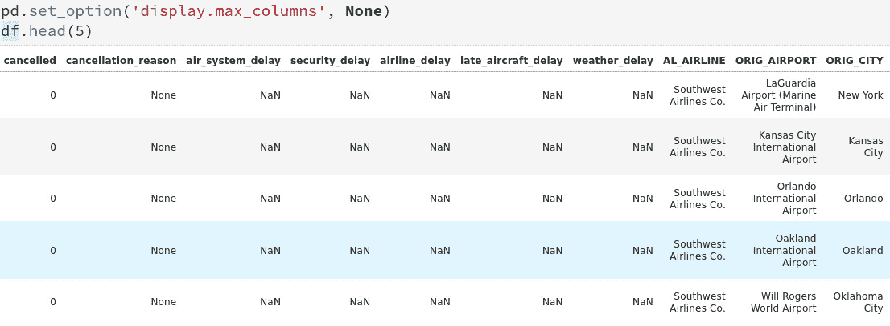
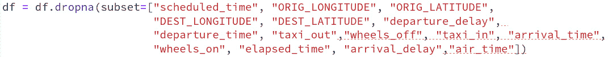
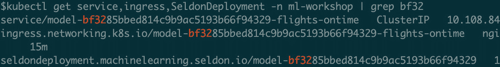

# *第十章*：构建、部署和监控你的模型

在上一章，你已经构建了数据管道，并创建了一个基础的航班数据集，供你的数据科学团队使用。在本章中，你的数据科学团队将使用该航班数据集来构建 **机器学习** (**ML**) 模型。该模型将用于预测航班的准点表现。

在这一章，你将看到平台如何帮助你可视化和实验数据，以构建正确的模型。你将学习如何调整超参数，并比较不同训练过程的结果。你还将看到如何使用平台提供的组件注册和管理模型版本。你将把模型作为 REST 服务进行部署，并开始使用平台提供的组件来监控已部署的模型。

请记住，本书并不是关于数据科学的，重点在于使团队能够自主高效地工作。你可能会看到一些概念和步骤在前面的章节中被重复。这是故意的，目的是向你展示前面章节中提供的概念如何帮助你构建完整的生命周期。

保持目标清晰，你将学习以下内容：

+   使用 JupyterHub 可视化和探索数据

+   使用 JupyterHub 构建和调整你的模型

+   使用 MLflow 跟踪模型实验和版本管理

+   通过 Seldon 和 Airflow 将你的模型部署为服务

+   使用 Prometheus 和 Grafana 监控你的模型

# 技术要求

本章包含一些实践设置和练习。你需要一个已配置**Operator Lifecycle Manager**（**OLM**）的运行中的 Kubernetes 集群。如何构建这样的 Kubernetes 环境，已在*第三章*，*探索 Kubernetes* 中进行了介绍。在尝试本章的技术练习之前，请确保你拥有一个工作中的 Kubernetes 集群，并且**Open Data Hub**（**ODH**）已安装在你的 Kubernetes 集群上。ODH 的安装内容已在*第四章*，*机器学习平台的构成* 中进行了详细讲解。

# 使用 JupyterHub 可视化和探索数据

回顾一下*第九章*，*构建你的数据管道*，数据工程师与业务领域专家（SME）合作，准备了可用于预测航班准点表现的航班数据。

在本节中，你将了解数据工程团队产生的数据。这是数据科学家的职责，他们负责构建模型。你将看到平台如何使数据科学团队和数据工程团队进行协作，以及数据科学家如何利用平台为给定问题构建模型。

让我们使用平台进行一些基础数据探索。请记住，本书的重点是帮助你的团队高效工作。重点不在于数据科学或数据工程，而是在于构建和使用平台：

1.  启动 JupyterHub，但这次请选择与数据科学生命周期相关的图像。SciKit 是平台上可用的一个图像。现在不要点击 **启动服务器** 按钮。


图 10.1 – JupyterHub 登录页面

1.  在 JupyterHub 登录页面，添加一个 `AWS_SECRET_ACCESS_KEY` 变量，并将其填入 S3 环境的密码。此练习中的密钥值为 `minio123`。请注意，我们使用了 **中等** 容器大小以适应数据集。现在，点击 **启动服务器** 按钮来启动你的 JupyterHub IDE。


图 10.2 – JupyterHub 登录页面

1.  在你的 JupyterHub IDE 中打开 `chapter10/visualize.ipynb` 文件笔记本。

1.  第一步是读取数据工程团队提供的数据。请注意，数据已经在同一平台上可用，这提高了团队的工作效率。笔记本中的 *单元格 2* 使用了 `PyArrow` 库将数据读取为 pandas 数据框。你将从数据团队放置数据的 `flights-data` 存储桶中读取数据。你可以看到数据读取代码如下：


图 10.3 – 第十章/可视化笔记本中的单元格 2

1.  第一步是查看数据。尝试理解它，并熟悉其中的内容是理想的做法。你可以在 *单元格 3* 中看到，已经使用了 DataFrame 的 `head` 函数来查看前几行。你会注意到字段名和其中的数据，看看是否能够理解一条记录。注意，有些字段是 `NaN`，有些是 `None`。这提示数据集可能还未准备好用于构建模型。以下屏幕截图显示了部分输出，预计你需要在自己的环境中运行此代码以获取完整的结果：



图 10.4 – 第十章/可视化笔记本中的单元格 3

1.  下一步是进行简单的验证，看看有多少数据可用，是否能够读取所有记录。你可以在 *单元格 4* 中看到，已经使用了 DataFrame 的 `count` 函数。以下屏幕截图显示了部分输出，预计你需要在自己的环境中运行此代码以获取完整的结果：


图 10.5 – 第十章/可视化笔记本中的单元格 4

1.  *单元格 5* 和 *单元格 6* 使用了 DataFrame 的形状功能，列的功能也一目了然。

1.  *第 7 单元格*使用了 DataFrame 的`describe`函数来生成数据集的一些基本统计信息。你可以使用这个方法验证是否有一些数据不合逻辑。例如，`taxi_in`时间的最大值可能过高。在这种情况下，你需要与主题专家（SME）合作，澄清并根据需要调整记录。以下截图显示了部分输出，建议你在自己的环境中运行这段代码以查看完整内容：


图 10.6 – 第十章/可视化笔记本的第 7 单元格

1.  接下来，你想查看数据是否有空值。你在*步骤 3*中已经看到数据中存在一些`NaN`和`None`值，并发现有许多列存在缺失数据的问题。以下截图显示了部分输出，建议你在自己的环境中运行这段代码以查看完整内容：


图 10.7 – 第十章/可视化笔记本的第 8 单元格

1.  你将使用 Dataframe 的`isnull`函数来查找有多少记录缺失数据。通过运行`df.isnull().sum().sort_values(ascending = False)`代码输出，你会发现数据分为两组。输出的前六行显示了缺失数据率非常高的列，对于这些列，你可以与数据工程团队和主题专家（SME）沟通，找出可以从中获取数据的资源。对于本示例，我们将删除这些列。


图 10.8 – 第十章/可视化笔记本的第 9 单元格

1.  在第二组数据中，从`wheels_on`列开始，你可以选择删除没有数据的行，或者尝试使用适当的统计函数填充数据。例如，缺失的`taxi_in`列可以用同一机场和相同时间的均值来填补。此策略需与团队讨论。对于本次练习，我们将直接删除这些行。


图 10.9 – 第十章/可视化笔记本的第 9 单元格

1.  通常，调查某一列缺失数据的示例行是一个不错的主意。你可能会在数据中发现某些模式，这对进一步理解数据可能非常有用。你选择查看`tail_number`字段没有值的行，并查看是否能发现任何模式。以下截图显示了部分输出，建议你在自己的环境中运行这段代码以查看完整内容：


图 10.10 – 第十章/可视化笔记本的第 10 单元格

1.  然后，你将运行 Dataframe 的`info`函数，以找出列的数据类型。很多时候，列的数据类型并不是你所预期的。然后你将与 SME 和数据团队合作，改善数据质量。以下截图展示了部分输出，预计你会在自己的环境中运行这段代码以获取完整信息：


](img/B18332_10_011.jpg)

图 10.11 – 第十章/可视化笔记本中的单元格 11

1.  可视化是理解数据的一个特别重要的工具。你可以使用任何你熟悉的库。例如，在这个笔记本的最后一个单元格中，你构建了一个图表来找出`DELAYED`列的数据分布。假设 99%的记录中，`DELAYED`列为`0`。如果是这样，数据可能不足以预测航班的准点表现，你需要与 SME 和数据团队合作，获取更多的数据。对于这个练习，我们将使用现有的数据分布。


](img/B18332_10_012.jpg)

图 10.12 – 第十章/可视化笔记本中的单元格 12

现在我们对航班数据有了更好的理解，让我们开始构建模型。在现实世界中，你需要投入更多的时间来理解数据。本书的重点是展示如何执行模型开发生命周期，因此我们将示例保持在最低限度。

# 使用 JupyterHub 构建和调优模型

作为一名数据科学家，你将希望尝试不同的模型和参数，以找到最合适的模型。在你开始构建模型之前，请回忆一下在*第八章*《使用平台构建完整的机器学习项目》中提到的，你需要定义评估标准，而且**准确率（accuracy）**可能对于很多使用案例来说是一个具有误导性的标准。

对于航班使用案例，假设你的团队和 SME（主题专家）一致同意使用**精准度（PRECISION）**指标。请注意，精准度衡量的是提供的数据集中正确正向识别的比例。

让我们开始编写我们的模型，看看平台如何使数据科学家高效地完成工作：

1.  在你的 JupyterHub 环境中打开`chapter10/experiments.ipynb`文件笔记本。

1.  在*单元格 2*中，添加 MLflow 的连接信息。请回想一下，MLflow 是平台中的组件，用于记录模型实验并充当模型注册中心。在代码中，你将配置`EXPERIMENT_NAME`，它为你的实验运行提供一个名称。该单元格的最后一行提到了 MLflow 如何记录实验运行。`autolog`功能使得 MLflow 在训练过程中注册自动回调，以记录参数以供以后使用。

你还需要提供 S3 桶的配置，该桶将由 MLflow 用于存储你的实验结果：


图 10.13 – 第 2 单元，位于第十章/实验笔记本中

1.  *第 3 单元* 从数据工程团队读取可用数据，*第 4 单元* 再次提供了多列缺失数据的信息。在这本笔记本中，你将使用这些信息来删除你认为不实用的列。以下是部分输出的屏幕截图，建议在你的环境中运行此代码以获取完整的图像：


图 10.14 – 第 3 单元，位于第十章/实验笔记本中

1.  *第 5 单元* 删除了两组列。第一组是那些在大多数行中没有数据的列。你根据前一步骤选择了这些列。在这里，我们简单地删除了这些列；然而，强烈建议你与数据团队合作，找出这种异常的原因，并尽可能获取更多数据。你正在删除的列包括 `"cancellation_reason"`, `"late_aircraft_delay"`, `"weather_delay"`, `"airline_delay"`, `"security_delay"`, 和 `"air_system_delay"`, 并显示在以下截图中：


图 10.15 – 第 5 单元，位于第十章/实验笔记本中

第二个 `drop` 语句删除了 `tail_number` 列。在实际场景中，你需要与专家讨论这一列是否对航班延误起到任何作用。


图 10.16 – 第 5 单元，位于第十章/实验笔记本中

1.  *第 6 单元* 使用 Dataframe 的 `dropna` 函数删除数据不可用的行。回想一下，从 *步骤 3* 中，与总行数相比，这些列缺失数据的行数较少。`air_time`, `arrival_delay` 和 `elapsed_time` 是 *步骤 5* 中的示例列。我们采用了这种方法来保持简单；更好的方法是找到获取缺失数据的途径或从现有值创建此数据。



图 10.17 – 第 6 单元，位于第十章/实验笔记本中

1.  在 *第 7 单元*，你正在删除那些未来航班没有数据的列。回想一下，该模型旨在预测未来航班的准时性。然而，诸如 `departure_time` 和 `arrival_time` 这样的列包含实际的出发和到达时间。对于预测未来航班，你在预测时将无法使用这些数据，因此在训练模型时需要删除这些列。


图 10.18 – 第 7 单元，位于第十章/实验笔记本中

1.  在数据集中，计划的出发和到达时间以 HHMM 格式表示，其中 HH 是小时，MM 是分钟。在 *第 8 单元格* 中，作为数据科学家，你可以选择将这个数据拆分成两列，一列表示小时，另一列表示分钟。这样做可能简化数据集，并提高模型性能，如果期望的分类与拆分数据之间存在某种相关性。你可以凭直觉做出这个选择，或者与领域专家讨论这个选项。

你选择将 `scheduled_departure` 和 `scheduled_arrival` 列拆分：


图 10.19 – 第 8 单元格，章节 10/实验笔记本

1.  在 *第 9 单元格* 中，你删除了更多列。第一组包含需要将时间拆分为小时和分钟的列，例如 `scheduled_arrival`：


图 10.20 – 第 9 单元格，章节 10/实验笔记本

第二组包含在其他列中表示的列。例如，`origin_airport` 列包含机场的键值，而 `ORIG_AIRPORT` 列则是一个描述性名称。这两列表示相同的信息：


图 10.21 – 第 9 单元格，章节 10/实验笔记本

1.  在 *第 10 单元格* 中，你再次通过 `head` 语句查看数据集。你已经注意到某些数据是字符串格式，比如 `airline` 列：


图 10.22 – 第 10 单元格，章节 10/实验笔记本

你选择对数据进行编码，将其转换为数字。有许多可用的技术，如 `OrdinalEncoder`。该编码器将分类值编码为整数数组。在 *第 12 单元格* 中，你对选定的字段，如 `airline` 和 `origin_airport`，应用了类别编码：


图 10.23 – 第 12 单元格，章节 10/实验笔记本

这意味着这些字段的输入字符串数据将被转换为整数。这对于训练是有益的；然而，在推理时，调用者可能并不知道你刚刚进行的编码。一种方法是保存这个编码器，并在推理时使用它将值从字符串转换为整数。因此，你的推理管道将包含两个步骤。第一步是应用编码，第二步是使用保存的模型预测响应。在 *第 12 单元格* 的最后四行，你已经保存了编码器，并需要将其注册到 MLflow 中：


图 10.24 – 第 12 单元格，章节 10/实验笔记本

1.  在*第 13 单元格*中，您使用`head`语句对数据进行了验证。请注意，`airline`列（您已对其应用类别编码的列之一）已发生变化。例如，比较*第 10 单元格*和*第 13 单元格*中的`airline`列的值，可以发现`airline`列的值已更改为`1`。这确认了编码已成功应用到数据集：


图 10.25 – 第 13 单元格，chapter10/experiments 笔记本

1.  在*第 14 单元格*中，您使用`dftype`语句验证了数据集中每列的数据类型。许多算法需要数据以数值格式呈现，依据可用的模型，您可能需要将所有字段转换为数值格式。

1.  在*第 15 单元格*中，您将数据划分为训练集和测试集。您将使用`X_Train`和`y_train`集来训练模型，并使用`X_Test`和`y_test`来验证模型的性能。您可以执行交叉验证，进一步评估模型在未见数据上的表现。我们假设您作为数据科学家已经了解这些概念，因此不再提供更多细节。


图 10.26 – 第 15 单元格，chapter10/experiments 笔记本

1.  在*第 16 单元格*中，您可视化了数据集的数据分布。以下截图捕获了部分输出，预计您将在自己的环境中运行此代码以获得完整的输出：


图 10.27 – 第 16 单元格，chapter10/experiments 笔记本

从前面的图表中，您可以看到数据偏向准时航班。这可能会影响模型的表现。幸运的是，`SciKit`库中的`RandomForestClassifier`对象提供了一个`class_weight`参数。它可以接受一个 Python `字典`对象，您可以在其中为各个标签提供所需的权重。例如，您可以为`DELAYED`列中表示准时航班的`0`值分配较小的权重。`class_weight`的另一种值可以是`balanced`，它将指导算法根据标签出现频率的逆比例对标签加权。简单来说，对于我们的情况，`balanced`值将比`0`更重视`DELAYED`列中的`1`值。

1.  在*第 19 单元格*中，您定义了一个随机森林分类模型，在*第 20 单元格*中，您对该模型进行了训练。您会注意到，我们仅定义了最基本的超参数，并使用`GridSearchCV`来找到适合给定数据集的最佳估计器。我们在该单元格的注释中列出了另外一组超参数，建议您尝试不同的组合。


图 10.28 – 第 19 单元格，来自 chapter10/experiments 笔记本

*图 10.29*展示了通过执行`model.fit()`函数来进行模型训练：

![图 10.29 – 第 20 单元格，来自 chapter10/experiments 笔记本]

](img/B18332_10_029.jpg)

图 10.29 – 第 20 单元格，来自 chapter10/experiments 笔记本

训练将需要一些时间，因此对于*第 20 单元格*，即您正在训练模型的单元格，请耐心等待。

1.  在*第 21 单元格*中，您使用了`predict`方法来捕获模型对测试数据的预测。请注意，`rf_best_model`模型是`GridSearchCV`对象的输出：

![图 10.30 – 第 21 单元格，来自 chapter10/experiments 笔记本]

](img/B18332_10_030.jpg)

图 10.30 – 第 21 单元格，来自 chapter10/experiments 笔记本

1.  在*第 22 单元格*中，您使用了`confusion_matrix`函数来计算矩阵并验证模型的性能：

![图 10.31 – 第 22 单元格，来自 chapter10/experiments 笔记本]

](img/B18332_10_031.jpg)

图 10.31 – 第 22 单元格，来自 chapter10/experiments 笔记本

1.  在*第 23 单元格*中，您使用了`precision_score`函数来计算模型在测试数据集上的`recallscore`。您可以看到，您在第一次实验运行中达到了 72%的精度，这对于第一次实验运行来说是不错的。您可以通过平台运行更多实验并提升模型的指标：

![图 10.32 – 第 23 单元格，来自 chapter10/experiments 笔记本]

](img/B18332_10_032.jpg)

图 10.32 – 第 23 单元格，来自 chapter10/experiments 笔记本

您已经完成了一个带有多个参数的实验运行，并使用了`RandomForestClassifier`模型。在此阶段，您可能想检查 MLflow，查看网格搜索执行的所有运行、捕获的参数以及模型性能数据。

通常，数据科学家会尝试多种算法，以找到适合给定问题的最佳算法。您可以执行并优化代码，并使用 MLflow 比较不同的算法。

让我们看看 MLflow 为我们记录了什么。

# 使用 MLflow 跟踪模型实验和版本控制

在本节中，您将使用 MLflow 来跟踪您的实验并对您的模型进行版本控制。此小节是对*第六章*的回顾，*机器学习工程*，我们在其中详细讨论了 MLflow。

## 跟踪模型实验

在本节中，您将看到 MLflow 为您的实验记录的数据。请注意，您刚刚注册了 MLflow 并调用了`autolog`函数，MLflow 会自动记录您的所有数据。这是您平台的一项强大功能，您可以通过它比较多个实验并与团队成员共享您的发现。

以下步骤展示了如何在 MLflow 中执行实验跟踪：

1.  登录到平台的 MLflow UI。

1.  在左侧，你会看到 **Experiments** 部分，里面包含你名为 **FlightsDelay-mluser** 的实验。点击它，你将看到以下界面。右侧显示所有的运行。回想一下，我们使用了 GridSearchCV，因此会有多个运行：


图 10.33 – MLflow 中的模型追踪详情

1.  点击`autolog`功能，MLflow 将自动捕获大部分指标。选择所有四个运行并点击**比较**按钮。

*图 10.34* 显示了每次运行的比较以及与运行相关的超参数：


图 10.34 – 在 MLflow 中比较模型

1.  点击 `FlightsDelayOrdinalEncoder.pkl` 旁边的运行：


图 10.35 – MLflow 捕获的文件和数据

在本节中，你已经看到 MLflow 捕获了训练运行的所有指标，并通过提供比较功能帮助你选择了合适的模型。

下一阶段是对模型进行版本控制。

## 对模型进行版本控制

在对模型性能进行一些思考并与其他团队成员共享数据后，你已经选择了可以用于此项目的模型。在本节中，你将对模型进行版本控制。请参考*第六章*，*机器学习工程*，我们在其中详细讨论了模型版本控制。

以下步骤将指导你如何对模型进行版本控制：

1.  进入 MLflow，点击左侧的 **FlightDelay-mluser** 实验。

1.  然后，在屏幕右侧，点击你运行的**+**图标。你将看到以下界面：


图 10.36 – MLflow 捕获的文件和数据

1.  点击 **model** 文件夹下的 artifacts，一个蓝色按钮将显示，按钮上标有 **注册模型**：


图 10.37 – 在 MLflow 中对模型进行版本控制

1.  点击 `flights-ontime`：


图 10.38 – 在 MLflow 中注册模型

作为数据科学家，你已经将用于预测航班延误的模型注册到了模型注册表。下一步是部署你的模型。

# 将模型部署为服务

在本节中，你将把模型部署为一个 REST 服务。你将看到，使用*第七章*中提到的详细信息，*模型部署与自动化*，团队可以将模型打包并作为服务部署。该服务将由你的模型用户使用。我们强烈建议你在继续本节之前，复习一下*第七章*中的知识，*模型部署与自动化*。

在*第七章*《模型部署与自动化》中，你已经使用 `Predictor` 类部署了模型，将模型暴露为 REST 服务。你将在这里使用相同的类，然而，在航班项目中，你在用于模型训练之前对数据应用了类别编码。这意味着你需要在推理时对输入数据应用相同的编码。回想一下，在本章早些时候，你将文件保存为`FlightsDelayOrdinalEncoder.pkl`，并且它可在 MLflow 仓库中找到。

下一步是编写一个简单的类，用于将转换应用到输入数据。一旦定义了这个类，你将使用 Seldon 定义推理管道，然后将模型打包为容器。因此，推理管道将包含两个阶段；第一阶段是应用编码，第二阶段是使用模型进行分类预测。

听起来很难吗？你会看到平台已经抽象化了大部分细节，你只需要提供一些配置参数，就能将模型打包并作为服务部署。

让我们先来看一下 `Transformer` 类，它将加载 `FlightsDelayOrdinalEncoder.pkl` 文件，并将编码应用到输入数据。打开 `chapter10/model_deploy_pipeline/model_build_push/Transformer.py` 文件。你会看到 `__init__` 函数加载编码器文件，`transform_input` 函数使用标准的 `transform` 函数对输入数据进行转换。这与模型训练时使用的函数相同。*图 10.39* 显示了代码文件：


图 10.39 – Transformer 类

第二个工件是定义模型推理图。回顾*第七章*《模型部署与自动化》，你已经使用`SeldonDeploy.yaml`文件定义了一个容器和推理图中的一个阶段。在本节中，你将扩展推理图，以适应推理管道中的转换和预测部分。自然地，当你在图中定义一个新组件时，你还需要定义相应的容器，作为图节点的服务。

请注意，你可以选择在`Predict.py`中执行转换逻辑，以保持简单。然而，我们希望展示 Seldon 如何构建复杂的图形，每个图形都可以是容器的一个单独实例。这种方法为以弹性方式运行生产模型带来了多样性。

现在，让我们来看一下`chapter10/model_deploy_pipeline/model_deploy/SeldonDeploy.yaml`文件。该文件已从*第七章*《模型部署与自动化》中复制过来，并对其进行了以下修改。

第一个变化是构建推理图。你需要先应用转换操作，然后运行模型预测。*图 10.40* 显示了这个图。注意，图的根元素是 `TRANSFORMER` 类型，名称为 `transformer`，并且图中有一个 `children` 节点。`children` 节点将在根节点之后执行。这个设置允许你根据模型要求拥有不同的图。这个示例中的子节点是实际的预测：


图 10.40 – Seldon 部署 YAML

对 `chapter10/model_deploy_pipeline/model_deploy/SeldonDeploy.yaml` 文件的第二个变化是为根节点和子节点注册容器。图中的 `name` 字段是将容器与图节点关联的字段。因此，我们将有两个容器实例，一个是 `transformer`，另一个是 `predictor`。`transformer` 实例将执行 `Transformer.py` 文件，而 `predictor` 实例将执行 `Predictor.py` 文件。我们所做的工作是创建一个包含所有这些文件的单一容器镜像，因此我们的容器镜像是相同的。你可以查看 `chapter10/model_deploy_pipeline/model_build_push/Dockerfile.py` 文件，在其中将所有文件打包成容器镜像。*图 10.41* 突出了 `SeldonDeploy.yaml` 中配置容器的部分。

注意，第一个容器的名称是 `transformer`。`MODEL_NAME` 变量表示 Python 文件的名称，而 `SERVICE_TYPE` 变量表示 Seldon 调用的回调类型。回想一下，`Transformer.py` 有一个 `transform_input` 方法，`SERVICE_TYPE` 引导 Seldon 系统调用正确的函数。对 `predictor` 容器实例同样适用，注意 `MODEL_NAME` 和 `SERVICE_TYPE` 对于 `predictor` 实例是不同的：


图 10.41 – Seldon 部署 YAML

就这样！对于你们中的一些人来说，这可能有些令人不知所措，但一旦你为项目定义了结构，这些文件就可以标准化，数据科学家将不需要为每个项目更改它们。你已经看到，ML 平台不仅允许你构建模型，还能将它们打包，从而实现自给自足。

下一步是编写一个简单的 Airflow 管道来部署你的模型。在开始这一部分之前，我们建议你复习一下使用 Airflow 部署模型的知识，详见*第七章*，*模型部署与自动化*。你构建的管道无需更改，你只需更改几个配置参数，为管道提供正确的模型名称和版本。

我们已经为您预构建了此管道，因此，打开 `chapter10/model_deploy_pipeline/flights_model.pipeline` 文件。打开此文件并验证它是否与 *第七章**，模型部署与自动化* 中提到的两个阶段相同。第一个阶段构建并推送容器镜像到容器注册表，第二个阶段使用 Seldon 部署模型。

*图 10.42* 显示了构建和推送容器镜像时使用的参数的第一阶段。**运行时镜像**和**文件依赖项**与前面显示的值相同。请注意**环境变量**部分，您会看到相同的变量名，但值不同：


图 10.42 – Flights 模型部署管道

我们来逐一看看它们：

+   `MODEL_NAME` 的值为 `flights-ontime`。这是您在将模型注册到 MLflow 时分配给该模型的名称。

+   `MODEL_VERSION` 的值为 `1`。这是您希望部署的模型版本。该版本会被记录在 MLflow 系统中。

+   `CONTAINER_DETAILS` 的值为 `flights-ontime`。这是您在将模型注册到 MLflow 时分配给该模型的名称。

+   `CONTAINER_REGISTRY` 是容器注册表 API 端点。对于 DockerHub，这个端点是 [`index.docker.io/v1`](https://index.docker.io/v1)。将此变量的值设置为 [`index.docker.io/v1/`](https://index.docker.io/v1/)。在本示例中，我们使用了 [quay.io](http://quay.io) 作为注册表。这是您可以使用的另一个免费的注册表。

+   `CONTAINER_REGISTRY_USER` 是将镜像推送到镜像注册表的用户的用户名。将此设置为您的 DockerHub 用户名或 Quay 用户名。

+   `CONTAINER_REGISTRY_PASSWORD` 是容器注册表用户的密码。在生产环境中，您不应该这样做。您可以使用秘密管理工具来存储您的密码。

`CONTAINER_DETAILS` 还是镜像将被推送到的仓库的名称，以及镜像名称和镜像标签。*图 10.43* 显示了第二阶段，使用 Seldon 部署容器镜像时使用的参数。`MODEL_NAME`，`MODEL_VERSION`，`CONTAINER_DETAILS` 和 `CLUSTER_DOMAIN`。您已经看到了前面一段中提到的所有变量，但 `CLUSTER_DOMAIN` 是您 Kubernetes 集群的 DNS 名称。在本例中，minikube 的 IP 地址是 `<Minikube IP>.nip.io`。


图 10.43 – Flights 模型部署管道

保存并部署此 DAG 到你的 Airflow 环境，当 Airflow DAG 执行完成时，模型将可供使用。通过登录 Airflow 并检查 DAG 的状态来验证此 DAG 是否已正确执行。*图 10.44* 显示了你已验证 DAG 状态的 Airflow 用户界面。请注意，我们已将 DAG 保存为 `flights-model-deploy`；如果你选择了其他名称，DAG 名称将相应地反映出来。


图 10.44 – 飞行管道的 Airflow DAG

回想一下，MLflow 会为每个实验关联一个运行 ID。你将其中一个实验注册到模型注册表中，以便可以进行部署。参考*图 10.34*，该图展示了此模型的运行 ID 截图。

这个模型运行将与已部署的模型相关联，因此你的团队可以将环境中运行的模型追踪到单个运行。这一功能提供了追溯不同环境中运行的模型版本的能力。运行以下命令查看模型创建的资源：

```
kubectl get service,ingress,SeldonDeployment -n ml-workshop | grep bf32
```

你应该得到以下响应。如你所见，Kubernetes 服务和 Ingress 的运行 ID 在此示例中以 `bf32` 开头。请注意，在你的情况下，它将具有不同的值，你需要在前面的命令中调整运行 ID：



图 10.45 – 平台创建的 Kubernetes 对象

现在，模型已部署；你可以通过对模型进行 RESTful 调用来测试它。

## 调用你的模型

回想一下，模型是通过 Kubernetes Ingress 暴露的，而 Ingress 是通过自动化创建的。为了测试模型是否作为 RESTful API 正常运行，请按照以下步骤操作：

1.  运行以下命令以获取`ingress`对象。注意，`ingress`对象的名称将在你的设置中有所不同：

    ```
    kubectl get ingress <INGRESS_NAME> –n ml-workshop
    ```

1.  现在，发起 HTTP 调用到你的模型可用于推理的位置。运行以下命令。`chapter10/inference` 文件夹包含航班数据的负载，模型将返回预测航班延误的概率。

1.  首先，切换到 `chapter10/inference` 文件夹：

    ```
    cd chapter10/inference
    ```

1.  然后，运行`curl`命令将负载发送到模型。请根据你的设置更改 HTTP 地址：

    ```
    curl -vvvvk --header "content-type: application/json" -X POST -d @data.json https://flights-ontime.192.168.39.216.nip.io/api/v1.0/predictions; done
    ```

Windows 用户可以选择使用优秀的 Postman 应用程序（[`www.postman.com/`](https://www.postman.com/)）来发起 HTTP 调用。

1.  打开 `chapter10/inference/data.json` 文件，查看我们发送给模型的有效载荷。你会注意到，`json` 有效载荷中有两个部分。第一部分是带有 `names` 键的部分，用于捕获你在训练模型时使用的特征列。注意这里没有 `DELAYED` 列，因为模型将预测 `DELAYED` 列的概率。第二部分是带有 `ndarrray` 键的部分，包含了特征列的值。需要注意的是，类别列的值是以原始形式存在的，推理管道会在执行模型之前将其转换为类别值。*图 10.46* 显示了以下文件：


图 10.46 – 航班模型推理的示例有效载荷

现在你已经成功地通过 HTTP 进行推理调用，让我们看看监控系统是如何捕获这些信息的。

# 监控你的模型

在最后一节中，你将看到平台如何自动开始捕获模型的典型性能指标。平台还帮助你可视化推理的性能。平台使用 Seldon 打包模型，Seldon 会暴露默认的指标以供捕获。Seldon 还允许你为特定模型编写自定义指标；不过这部分内容不在本书的范围之内。

让我们首先理解一下指标捕获和可视化是如何工作的。

## 理解监控组件

指标捕获的工作方式是，模型由 Seldon 封装。然后 Seldon 将这些指标暴露到一个定义良好的 URL 端点，详细信息请参见 *第七章*，*模型部署与自动化*。Prometheus 收集这些信息并将其存储在其数据库中。平台的 Grafana 连接到 Prometheus，并帮助你可视化记录的指标。

*图 10.47* 总结了模型与监控组件之间的关系：


图 10.47 – ML 平台监控组件

让我们理解一下这个图中的每个组件：

+   **开放数据中心（ODH）操作员**：这是我们平台的基础操作员。它的作用是为平台提供所有不同的组件。在本书的多个章节中，我们已经讨论过这个操作员，因此在本节中不再详细描述。

+   `manifests/prometheus/base/subscription.yaml`。以下代码片段展示了它如何使用 OLM 机制来安装 Prometheus 操作员：


图 10.48 – Prometheus 操作员的订阅

+   `manifests/prometheus/base/prometheus.yaml`。以下代码片段展示了该文件：


图 10.49 – Prometheus 服务器配置

+   `manifests/prometheus/base/prometheus.yaml`。以下代码片段展示了该文件。请注意，配置使用了端口 `8000`，这是 Seldon 用于暴露指标信息的端口。`selector` 对象定义了 Prometheus 用来决定从哪些 Pod 抓取数据的过滤器：


图 10.50 – Prometheus 服务器监控 Seldon Pod

+   `manifests/grafana/base/deployment.yaml` 文件。

在本节中，你已经看到平台如何提供和连接不同的组件，为你提供一个可视化框架，以满足你的可观察性需求。

接下来是配置 Grafana。

## 配置 Grafana 和仪表板

在本节中，你将配置 Grafana 连接到 Prometheus，并构建一个仪表板来可视化模型的指标。什么是仪表板？它是你的模型的图表、表格和其他可视化元素的集合。你将为航班模型创建一个仪表板。

请注意，这只是一次性配置，不需要为每个模型重复此过程。这意味着一旦你有了仪表板，就可以在多个模型中使用它。你的团队可能会创建一些标准仪表板，一旦新的模型被部署，平台会自动找到它并将其用于监控。

让我们开始配置 Grafana 实例：

1.  使用 https://grafna.192.128.36.219.nip.io 登录 Grafana。请注意，你需要根据你的设置更改 IP 地址。在登录页面，点击 **使用 KeyCloak 登录** 按钮，它位于登录窗口的底部：


图 10.51 – Grafana 登录页面

1.  首先，你需要添加一个数据源。数据源是一个系统，它将提供 Grafana 帮助你可视化的数据。Prometheus 是数据提供者，它从你的模型中抓取指标数据。选择左侧菜单中的 **配置** | **数据源** 选项：


图 10.52 – Grafana 数据源菜单选项

1.  点击 **添加数据源** 按钮，如下图所示：


图 10.53 – 添加新的 Grafana 数据源

1.  选择数据源类型，在你的案例中为 Prometheus。你可能会注意到，Grafana 可以与多种数据源进行通信，包括 InfluxDB 和 YYYY 等。


图 10.54 – 添加新的 Prometheus Grafana 数据源

1.  现在，你需要添加 Prometheus 服务器的详细信息。Grafana 将使用这些详细信息连接并从 Prometheus 服务器获取数据。在提到的屏幕中添加以下属性：

    +   `Prometheus`

    +   **URL**: http://prometheus-operated:9090

1.  然后点击**保存并测试**按钮。URL 是由平台创建的 Prometheus 服务的地址。由于 Grafana pod 将通过 Kubernetes 内部网络与 Prometheus pod 通信，因此这个 URL 对你的设置也是相同的：


图 10.55 – Prometheus Grafana 数据源的配置

你可以通过执行以下命令来查看`prometheus`服务的详细信息：

```
kubectl get service –n ml-platform | grep prometheus
```

1.  在你配置 Grafana 连接到 Prometheus 后，下一步是构建仪表盘。如前所述，仪表盘是一组可视化内容，每个可视化内容都由查询支持。Grafana 会运行这些查询并为你绘制数据。构建仪表盘超出了本书的范围，但我们提供了一个你可以使用的仪表盘。请从左侧菜单中选择**导入**选项：


图 10.56 – 在 Grafana 中添加新仪表盘

1.  打开`chapter10/grafana-dashboard/sample-seldon-dashboard.json`文件，将其粘贴到**通过面板 JSON 导入**文本框中。点击**加载**按钮导入仪表盘：


图 10.57 – 在 Grafana 中导入 Seldon 仪表盘

1.  设置导入的仪表盘名称，并点击`Flights Prediction Analytics`，如下面的截图所示：


图 10.58 – 在 Grafana 中导入 Seldon 仪表盘

1.  导入仪表盘后，Grafana 将立即开始显示仪表盘。你可以看到一些指标，比如响应时间、成功率以及其他与已部署模型相关的指标。你可能需要多次调用你的模型，才能开始填充这个仪表盘。请参考本章前面提到的*调用你的模型*部分，了解如何调用已部署的模型。


图 10.59 – Seldon 模型仪表盘

你可以看到仪表盘捕获了由你包装在 Seldon 中的模型所发出的指标。随着更多模型的部署，它们将出现在这个仪表盘中，你可以通过仪表盘顶部的过滤器来筛选模型。

现在，你的航班准时预测服务已经可以使用。接下来，你将与产品开发团队和网站团队合作，帮助他们集成这个功能，为客户提供更好的服务。你的工作并不会在此结束；你需要持续监控模型的表现，并通过新的数据和/或进一步优化模型来提升服务。该平台将帮助你加速这个循环，并不断改进对客户的服务。

# 总结

这是另一个长章节，涵盖了航班准点率项目的模型开发和部署生命周期。你已经看到平台如何帮助你和你的团队在 EDA、模型实验与追踪、模型注册以及模型部署方面实现自主。

在下一章，我们将退后一步，总结整体平台的旅程，并讲解如何将其作为适合你行业的解决方案。你可以利用这些概念和工具为你的团队构建一个平台，帮助你的业务实现 AI 的强大力量。
