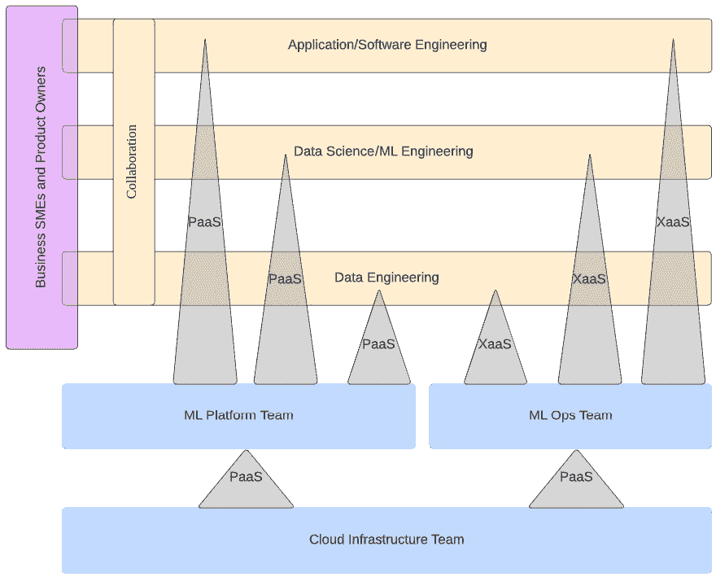
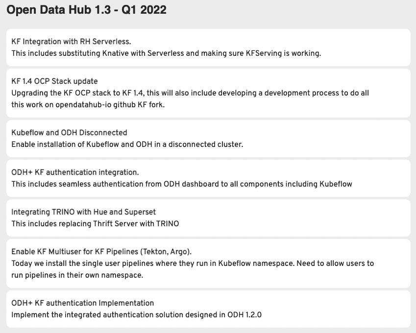

# *第十一章*：在 Kubernetes 上进行机器学习

在各章中，您已经学习了传统软件开发过程与**机器学习**（**ML**）之间的差异。您了解了 ML 生命周期，并意识到它与传统软件开发生命周期有很大的不同。我们向您展示了如何使用开源软件在 Kubernetes 上构建完整的 ML 平台。我们还展示了 ML 项目的生命周期，通过相关活动，您已经体验了项目生命周期每个阶段的执行方式。

在本章中，我们将展示一些关键概念，帮助您进一步理解该主题。以下是本章将涉及的内容：

+   确定 ML 平台的应用场景

+   机器学习的操作化

+   在 Kubernetes 上运行

这些内容将帮助您决定何时以及如何使用我们在本书中介绍的 ML 平台，并帮助您为在生产环境中运行和维护平台设置合适的组织结构。

# 确定 ML 平台的应用场景

正如前面几章所讨论的，理解什么是 ML 以及它与数据分析和数据科学等相关学科的区别至关重要。数据科学可能是 ML 的前置条件。在研究和探索阶段，您不确定 ML 算法是否能解决问题时，数据科学非常重要。在前面的章节中，您使用了数据科学方法，如问题定义、业务指标隔离和算法对比。虽然数据科学是必不可少的，但也有一些 ML 的应用场景不需要那么多数据科学活动。一个例子就是使用 AutoML 框架，我们将在下一节中讨论。

确定 ML 是否能最好地解决问题并选择 ML 平台，实际上是一个“先有鸡还是先有蛋”的问题。因为，为了确定 ML 算法能否最好地解决某个业务问题，需要进行一些数据科学工作，比如数据探索，而这又需要一个平台来支持。如果您处于这种情况，最好的选择是选择一个像**Open Data Hub**（**ODH**）这样的开源平台，正如我们在本书中所介绍的那样。因为它完全开源，您可以在没有任何商业协议和许可证的情况下开始安装和使用平台，而且您已经看到这个平台的强大功能。一旦您有了平台，便可以利用它启动研究和数据探索，直到您能够得出结论，是否 ML 是解决业务问题的正确方法。然后，您可以继续使用该平台进行项目生命周期的剩余部分，或者在没有任何平台费用的情况下放弃它。

在某些情况下，你可能已经知道商业问题可以通过机器学习来解决，因为你曾在其他地方看到过类似的实现。在这种情况下，选择我们所介绍的机器学习平台也是一个不错的选择。然而，你也可能面临没有强大数据科学团队的情况。你可能只有一些数据工程师和机器学习工程师，他们了解模型开发的过程，但对自己的数据科学技能不太自信。这时，AutoML 就成为一个值得考虑的选项。

## 考虑 AutoML

简单来说，AutoML 是指自动生成机器学习模型，几乎不需要数据科学的工作。更详细地说，它涉及自动算法选择、自动超参数调优和自动模型评估。

AutoML 技术作为框架或软件库出现，可以从给定的数据集生成机器学习模型。截至本书写作时，市场上已经有多种 AutoML 框架可用。以下列表展示了一些当前流行的 AutoML 框架，还有许多其他未列出的 AutoML 框架，我们鼓励你去探索它们：

+   **BigML** – 一个端到端的 AutoML 企业平台，商业化销售。

+   **MLJAR** – 一个开源的 AutoML 框架。

+   **H2O.ai** – 一个开源的全功能机器学习平台，包含一个 AutoML 框架。

+   **TPOT** – 将自己视为数据科学家的助手。它是由宾夕法尼亚大学计算遗传学实验室开发的开源 AutoML 框架。

+   **MLBox** – 一个开源的 AutoML Python 库。

+   **Ludwig** – 一个零代码机器学习模型开发工具箱，包含 AutoML。

+   **Auto-sklearn** – 基于 scikit-learn 机器学习库的开源 AutoML 工具包。

+   **Auto-PyTorch** – 一个开源的 AutoML 框架，具有自动神经网络架构搜索功能。它可以自动优化神经网络架构。

+   **AutoKeras** – 基于 Keras 机器学习库的开源 AutoML 框架。

还需要注意的是，这些框架和库中的一些可以在我们的机器学习平台内，或者与任何机器学习平台一起使用。

## 商业平台

机器学习平台的商业供应商，包括云服务提供商，也在他们的产品组合中提供 AutoML 产品和服务。谷歌有 Google Cloud AutoML，微软有 Azure Machine Learning，亚马逊有 Sagemaker Autopilot，IBM 有 Watson Studio，其中包含 AutoML 和 AutoAI 组件。然而，这些供应商将他们的 AutoML 产品和服务作为机器学习平台产品的一部分出售，这意味着你必须使用他们的机器学习平台才能利用 AutoML 功能。

## ODH

你已经看到 ODH 如何让你选择安装哪些组件，它还允许你通过更新`kfdef`清单文件将一个组件替换为另一个。这增加了你选择将哪些组件作为平台一部分的灵活性。例如，假设你只需要 JupyterHub 和 MLflow，以便你的数据科学团队开始探索使用 ML 解决业务问题的可能性。那么，你可以选择仅安装这些组件。这样可以节省计算资源，从而减少云计算账单。

无论你选择哪种 ML 平台，明确操作化 ML 平台的路径同样至关重要。这包括找到合适的人来在生产环境中运行平台，并将 ML 生命周期中的角色映射到现有组织中。这还包括建立一些流程和沟通渠道，这也是我们接下来要讨论的话题。

# 操作化 ML

正如之前章节所讨论的，如果你的模型被部署并在生产环境中使用，你就能在业务中充分利用 ML 的全部好处。操作化不仅仅是部署 ML 模型。还需要解决其他一些问题，才能在生产中成功运行支持 ML 的应用程序。让我们深入探讨一下。

## 设定业务预期

确保业务相关方理解使用 ML 模型预测做出商业决策的风险极为重要。你不希望你的组织因为 ML 而失败。Zillow，这家在其产品*Zestimate*上投入大量资金的房地产公司，由于错误的房地产价格估算，损失了 5 亿美元。他们最终以 ML 模型设定的价格购买了房产，但这些房产最终以远低于购入价格的价格出售。

ML 模型并不完美；它们会犯错。业务必须接受这个事实，不能完全依赖 ML 模型的预测而忽视其他数据源。如果业务未能接受这一事实，可能会导致由于错误预期而造成的不可挽回的损失。这些损失包括声誉损失、业务信任丧失，甚至是监管罚款和处罚。

另一个案例是，一些算法，特别是深度学习，无法解释其决策过程。必须向业务方传达这一点，因为在某些情况下，可能需要一个可解释的算法以符合监管要求。有些监管机构可能要求你解释业务决策背后的原因。例如，假设一个机器学习模型判定一个新银行客户不是高风险客户，但这个客户最终被某些监管机构列入了黑名单或受到制裁；金融机构可能需要在调查和事后分析过程中向监管机构解释这个决策背后的原因。更糟糕的是，组织可能会因此被罚款数百万美元。

避免向业务方做出过度承诺。IBM Watson 曾提出机器学习能够通过分析来自多个医疗机构的诊断数据来诊断癌症，并可能在未来帮助或甚至替代医生，进行更可靠的癌症诊断。这一想法吸引了大量关注，许多组织也投入了大量资金。然而，事实证明，这项任务非常困难。它不仅导致了损失，还在某种程度上损害了品牌形象。

总结来说，在决定是否使用机器学习模型来预测业务决策之前，确保业务方理解如果模型表现不如预期，可能带来的风险和后果。设定正确的期望值。明确哪些是可能的，哪些是困难的。一些机器学习模型可能在某些业务流程中替代人工，但并非所有机器学习模型都能达到超人的能力。

## 处理脏数据的实际情况

你用于模型训练的数据通常是经过准备并在受控环境中测试过的数据集。然而，在实际环境中情况并非如此。模型部署到生产环境后，你必须预期会接收到脏数据。你可能会收到结构错误的数据，而且大部分数据是新的，在训练时模型从未见过。为了确保模型适用于生产环境，要避免过拟合，并使用与生产环境中看到的数据尽可能接近的数据集进行彻底测试。如果可能，使用数据增强技术或甚至是制造的数据来模拟生产场景。例如，一个在诊断使用胸部 X 光片的患者时表现良好的模型，可能在一个诊所效果很好，但在另一个使用旧设备的诊所中可能就无法工作。这个案例背后有一个真实的故事，原因是 X 光扫描仪生成的图像中显示了机器传感器上的灰尘颗粒。

总结来说，要避免过拟合。确保数据清洗过程作为推理管道的一部分。通过拥有来自不同来源的合适数据集，为最糟糕的输入数据做准备。当模型没有返回预期结果时，要做好准备。

## 处理错误结果

假设你有一个信用卡欺诈检测模型，它将一笔常规交易标记为欺诈交易。这可能有很多原因，例如模型可能没有意识到圣诞节期间的消费高于正常水平。你需要能够调查此类场景，因此，至关重要的是要有日志记录功能。这将使你能够回溯模型在生产环境中对特定问题的回答。你将需要此功能来调查模型问题。

当这种情况发生时，你必须准备好面对模型返回错误信息的后果。但同样，你还必须能够通过定期用新的数据集更新模型来解决未来的错误结果。你还必须能够跟踪模型随时间变化的表现。在上一章中你已经看到过如何进行监控。模型表现随时间的变化也被称为**漂移**。漂移有两种类型。**数据漂移**发生在模型开始接收它未经过训练的新类型数据时。例如，一个保险欺诈检测模型在正常工作时，突然开始看到包含新保险产品的数据，而该模型之前未见过该产品。这种情况下，模型将无法产生可靠的结果。换句话说，你的模型表现已经退化。另一个例子是，你的模型是基于某一特定的人群或年龄组进行训练的，随后突然出现了一个新年龄组。类似地，机器学习模型返回不可靠结果的概率会更高。**概念漂移**指的是输入数据和标签之间的功能关系发生了变化。例如，在一个欺诈检测模型中，原本不被视为欺诈的交易，现在根据新的法规被标记为欺诈或异常。这意味着模型将产生更多的假阴性结果，从而使模型变得不可靠。

在这些情况下，你必须为解决这些问题制定一个流程。你必须有一个流程来决定何时手动重新训练模型，或者在模型检测到漂移时自动重新训练模型。你可能还希望在输入数据中实现异常检测。这样可以确保模型只在输入数据合理的情况下给出结果。这也能避免对模型的滥用或攻击。这些自动化要求可以作为你持续集成和部署流水线的一部分进行集成。

## 维护持续交付

你已经看到了如何手动在平台上运行模型构建和模型部署。你也看到过如何使用 Airflow 自动化部署工作流。尽管团队中的数据科学家或 ML 工程师可以手动执行或触发这些操作，但在现实世界中，你仍然需要有人或一个团队来维护这些管道，以确保它们始终在工作。你可能希望有一个专门的团队来维护执行管道的底层平台，或者你可以将这个责任分配给数据工程团队。无论你选择哪种方式，重要的是必须有人负责确保部署管道始终正常运行。

尽管 ODH 操作员完全管理 ML 平台，但你仍然需要有人负责维护它。确保 Kubernetes 操作员是最新的，并在必要时应用安全补丁。

对于某些关键工作负载，你可能无法自动将其部署到生产环境中。在将更新发布到生产环境中的模型之前，需要手动批准。在这种情况下，你需要通过将此过程嵌入到平台中或通过与手动批准流程的相互协议来建立此审批工作流。不过，目标是确保有人负责维护持续交付服务。

总结一下，持续交付必须始终有效，以便模型开发生命周期能够有更快速的反馈周期。此外，如果检测到漂移，你将始终有一个随时可用的交付管道，可以发布一个更新的模型版本。

## 管理安全

安全性是将 ML 项目投入生产时需要关注的另一个关键领域。你在前几章中已经看到，ML 平台可以通过使用**OpenID Connect**（**OIDC**）或**OAuth2**，一种标准的认证机制，来进行安全保护。不同的平台组件可以利用相同的认证机制，提供更加无缝的用户体验。你已经使用了一个开源工具 Keycloak，它是一个行业标准的**身份与访问管理**（**IAM**）系统的实现，主要支持 OIDC、**安全声明标记语言**（**SAML**）等。Seldon Core API 允许将 REST 暴露的 ML 模型保护在相同的认证机制后面。有关更多细节，请参阅 Seldon Core 文档。

总结来说，ML 平台必须通过认证机制进行保护，最好使用 OIDC。这也允许实现**单点登录**（**SSO**）。此外，你还需要保护已部署的模型，确保只有目标用户才能访问你的 ML 模型。最后，必须有人负责维护平台所使用的 Keycloak 实例，并且有人或团队负责管理平台资源的访问权限。

## 遵守合规性政策

在一些商业环境中，合规性是运营的核心。金融机构有一个专门的部门来管理合规性。这些合规规则通常来自监管机构，负责监督金融机构的运营。根据你的机器学习平台将要使用和托管的国家，监管政策可能会禁止你将数据从本地数据中心迁出，或者可能要求对静态数据进行加密。

好消息是，你的平台足够灵活，可以配置为符合这些合规性措施。得益于 Kubernetes，它可以在本地或任何云提供商上运行。你也可以在云中运行机器学习平台，同时将存储保存在本地，或利用混合云策略。

另一个问题是，平台中的每个组件都是可替换和可插拔的。例如，你可以使用一个现有的、经过监管机构批准的 OIDC 提供者，而不是使用专用的 Keycloak 实例。

合规性通常可能成为推进机器学习项目的障碍。如果你打算使用商业平台而不是本书中构建的那个，始终在做出决定之前考虑合规性或监管要求。某些云中的商业平台可能无法遵守数据主权要求，尤其是在主要云提供商尚未在当地拥有数据中心的国家。

换句话说，在规划你的机器学习平台架构时，始终考虑合规性要求。

## 应用治理

在考虑了前述因素之后，另一个需要明确的问题是如何使你的机器学习平台具备可操作性，即**治理**。在这一部分，你将设计组织结构、角色和责任、协作模式以及上报点。作者提倡一个跨职能的团队，具有非常高的协作水平。然而，这在现实世界中并不总是可能的。有些组织拥有非常明确的等级制度和职能孤岛，不愿意改变现有的工作方式。如果你所在的组织是这种类型，你可能会在实施我们所介绍的机器学习平台时遇到一些障碍。

该平台的主要特点之一是它是一个自助式平台。它允许数据科学家、机器学习工程师和数据工程师启动他们的笔记本服务器和 Spark 集群。然而，这也会导致云账单或运营成本的不可预测性。如果你是该项目的数据架构师，你的部分工作就是说服领导团队和平台团队信任他们的数据科学家和机器学习工程师。

理想情况下，围绕 ML 项目设计组织结构的最佳方式是拥有一个平台团队。该团队负责运行 ML 平台。然后，这个团队作为服务提供商，向数据和应用团队提供服务，这些团队也被称为**流对齐团队**，并采用**软件即服务**（**SaaS**）模式。平台团队的目标是确保流对齐团队可以在平台上尽可能顺利、快速地完成他们的工作。数据科学团队和数据工程团队可以是流对齐团队，它们是平台的主要用户，也是平台团队的主要客户。DevSecOps 或 DevOps 团队可能会在同一个组织单元内，因为平台团队为流对齐团队提供 DevOps 服务。*图 11.1* 展示了你可以实施的一个组织结构示例，用于使用 Team Topologies 标注来运行 ML 项目：

图 11.1 – 示例 ML 项目团队结构

在*图 11.1*中，总共有三个流对齐团队，即数据科学团队、数据工程团队和软件工程团队。所有三个流对齐团队都在相互协作，目标是交付一个在生产环境中运行的 ML 驱动的应用程序。还有三个平台团队。云基础设施团队为另外两个平台团队提供云**平台即服务**（**PaaS**）：ML 平台团队和 MLOps 团队。ML 平台团队和 MLOps 团队为所有三个流对齐团队提供 ML PaaS 和 MLOps 即服务。紫色框表示一个支持团队。这里是 SME 和产品负责人所在的地方。这个团队为所有流对齐团队提供支持和帮助。

你必须注意，这只是一个示例；你也可以将 ML 平台团队和 MLOps 团队合并，或者将数据科学团队和数据工程团队合并，这完全没问题。

如果你想了解更多关于这种组织设计标注的内容，你可能想阅读关于 Team Topologies 的资料。

我们可以总结如下：

+   使用你在*图 2.7*中看到的 ML 生命周期图，结合 *第二章*《理解 MLOps》中的内容，来映射当前团队的组织结构。

+   清晰地传达角色和责任。

+   设置协作渠道和反馈点，例如设计冲刺会议和聊天组。

假设你无法打破团队之间的壁垒；可以设立定期会议，促进壁垒之间的沟通，并建立更加流畅的交接流程。然而，如果你想充分发挥 ML 平台的潜力，我们强烈建议你组建一个跨职能的自组织团队来交付你的 ML 项目。

# 在 Kubernetes 上运行

使用 ODH 操作符，ML 平台真正释放了 Kubernetes 作为 ML 平台基础设施层的全部潜力。**操作符生命周期管理**（**OLM**）框架使 ODH 操作符能够简化 ML 平台的操作和维护。几乎所有操作工作都以 Kubernetes 原生方式进行，您甚至可以通过几次点击启动多个 ML 平台。Kubernetes 和 OLM 还允许您实施 **平台即代码**（**PaC**）方法，从而使您能够实施 GitOps 实践。

本书中展示的 ML 平台与原生 Kubernetes 实例或其他任何类型的 Kubernetes 平台，甚至是基于 Kubernetes 的平台，都能很好地配合使用。事实上，原始的 ODH 仓库主要是为 Red Hat OpenShift 设计和构建的。

## 避免供应商锁定

Kubernetes 保护您免受供应商锁定的困扰。由于额外的容器化和容器编排层，所有工作负载都不会直接运行在基础设施层上，而是通过容器运行。这使得 ML 平台可以托管在任何具有能力的基础设施上。无论是本地部署还是云端，操作都是一样的。这也使得您可以在需要时无缝切换到不同的云供应商。这是使用此 ML 平台与云供应商提供的商业平台相比的一个优势。您不受供应商锁定的限制。

例如，如果您选择 Azure ML 作为您的平台，您将被限制使用 Azure 作为基础设施提供商。您将无法在不更改平台和部署架构的情况下将整个 ML 项目迁移到另一个云供应商。换句话说，切换到不同的云供应商的成本非常高，基本上您会被原供应商“锁定”。

## 考虑其他 Kubernetes 平台

这个 ML 平台不必仅仅在原生 Kubernetes 平台上运行。如前一部分所述，原始的 ODH 是为在 Red Hat OpenShift 上运行而设计的，而在本书中，您已成功使其在 minikube（一个单节点原生 Kubernetes）上运行。

市面上还有许多其他 Kubernetes 平台，包括主要云供应商提供的。以下是按非特定顺序列出的最常见的一些，但在撰写本文时，其他新兴的基于 Kubernetes 的平台刚刚进入市场，或者正在处于 Beta 测试或开发阶段：

+   **Kubernetes**

+   **Red Hat** **OpenShift 容器平台**（**OCP**）

+   **Google Kubernetes 引擎**（**GKE**）

+   **亚马逊** **弹性 Kubernetes 引擎**（**EKS**）

+   **Azure Kubernetes 服务**（**AKS**）

+   **VMware Tanzu**

+   **Docker 企业版**（**Docker EE**）

尽管我们在 Kubernetes 和 Red Hat OpenShift 上测试了该平台，但您在 minikube 上构建的 ML 平台也可以在上述任何 Kubernetes 平台以及其他平台上构建。但是，未来会如何呢？ODH 的发展方向是什么？

# 路线图

ODH 是一个活跃的开源项目，主要由全球最大的开源公司 Red Hat 维护。ODH 将不断更新，带来越来越多的功能。然而，由于 ML 和 MLOps 领域相对较新且仍在发展中，看到项目随时间发生显著变化和调整并不奇怪。

在本书编写时，ODH 的下一个版本包括以下更改（如*图 11.2*所示）：

图 11.2 – ODH 的下一个发布版本

ODH 还有一些你尚未探索的功能，它们更多地面向数据工程和数据分析领域。一个例子是使用 Trino 和 Superset 进行数据虚拟化和可视化。如果你想了解这些功能，可以通过更新`kfdef`文件，将 Trino 和 Superset 作为你机器学习平台的组件，来在你构建的同一平台上进行探索。你可以在 ODH 的 GitHub 项目中找到这些`kfdef`文件的示例。

你可以在以下网址查看 ODH 的未来路线图：[`opendatahub.io/docs/roadmap/future.html`](https://opendatahub.io/docs/roadmap/future.html)。

未来，可能会有另一个开源机器学习平台项目在市场上出现。保持开放的心态，永远不要停止探索其他开源项目。

# 总结

你在本书中学到的关于机器学习（ML）、数据科学与数据工程、MLOps 和机器学习生命周期的知识同样适用于其他任何机器学习平台。你不仅获得了关于在 Kubernetes 中运行机器学习项目的重要见解和知识，还积累了从零开始构建平台的经验。在接下来的章节中，你能够获得实践经验，并同时扮演数据工程师、数据科学家和 MLOps 工程师的角色。

在撰写本书的过程中，我们意识到这个主题非常广泛，深入探讨书中涉及的每个主题可能对某些读者来说信息量过大。虽然我们已触及机器学习平台的大部分组件，但关于每个组件仍有很多内容值得学习，特别是关于 Seldon Core、Apache Spark 和 Apache Airflow 的知识。为了进一步了解这些应用，我们建议查阅它们的官方文档页面。

机器学习（ML）、人工智能（AI）和 MLOps 仍在发展之中。另一方面，尽管 Kubernetes 已经有近 8 年历史，但对于大多数企业组织来说，它仍然相对较新。因此，这一领域的大多数专业人士仍在学习的同时，也在建立新的标准。

保持对最新的机器学习（ML）和 Kubernetes 趋势的关注。你已经掌握了足够的知识，可以独立推进在这一领域的学习。

# 深入阅读

+   *Seldon 核心文档*：[`docs.seldon.io/projects/seldon-core/en/latest/index.html`](https://docs.seldon.io/projects/seldon-core/en/latest/index.html)

+   *团队拓扑*: [`teamtopologies.com`](https://teamtopologies.com)

+   *开放数据中心*: [`opendatahub.io`](https://opendatahub.io)
