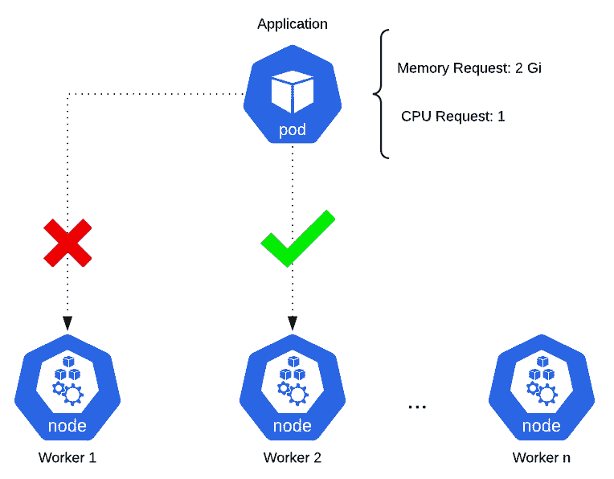
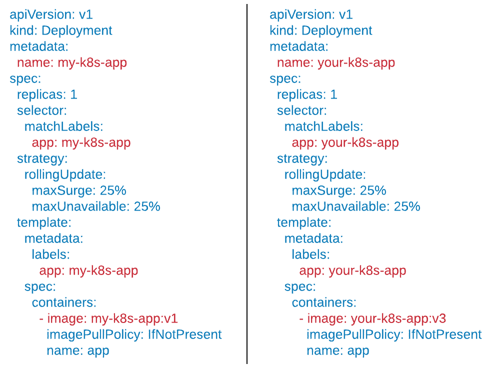
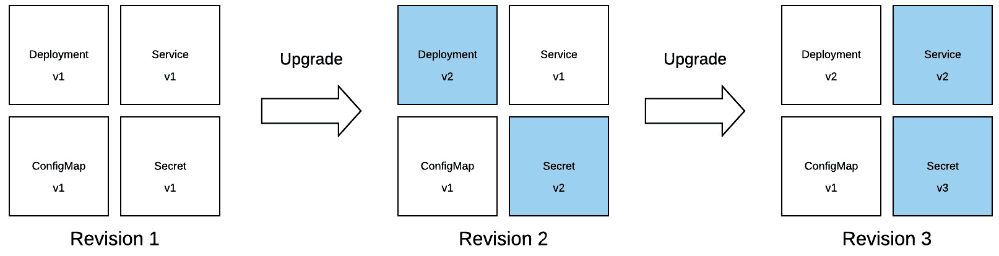

# 1

# 理解 Kubernetes 和 Helm

感谢你选择本书《学习 Helm》。如果你对本书感兴趣，那么你可能已经意识到现代应用所带来的挑战。团队面临巨大的压力，必须确保应用是轻量且可扩展的。应用还必须具有高度可用性，能够承受不同的负载。历史上，应用通常以单体或大型单一层次的应用形式部署在单一系统上。随着时间的推移，行业逐渐转向微服务架构，或者将应用拆分成多个小型的多层次应用，部署在多个系统上。行业中开始采用容器技术，并利用 Kubernetes 等工具来编排和扩展其容器化的微服务。

然而，Kubernetes 也带来了自己的挑战。虽然它是一个有效的容器编排工具，但它有一个陡峭的学习曲线，团队可能难以克服。这时，Helm 就能帮助简化在 Kubernetes 上运行工作负载的挑战。Helm 让用户可以更加简单地部署和管理 Kubernetes 应用的生命周期。它抽象了配置 Kubernetes 应用时的许多复杂性，使团队在该平台上变得更加高效。

本书将带你探索 Helm 所提供的每一项优势，并发现 Helm 如何简化在 Kubernetes 上的应用部署。你将首先扮演终端用户的角色，使用社区编写的 Helm charts，并学习如何作为包管理器利用 Helm 的最佳实践。随着本书的深入，你将转变为 chart 开发者，学习如何以易于使用且高效的方式打包 Kubernetes 应用。在本书的最后，你将了解关于应用管理和安全的 Helm 高级模式。

本章将涵盖以下主要内容：

+   从单体架构到现代微服务

+   什么是 Kubernetes？

+   部署 Kubernetes 应用

+   资源管理的方法

+   资源配置挑战

+   Helm 来拯救我们！

# 从单体架构到现代微服务

软件应用是现代科技中大多数技术的核心组成部分。无论它们是文字处理软件、网页浏览器还是流媒体服务，应用程序都使得用户能够完成一个或多个任务。应用程序有着悠久而丰富的历史，从**电子数值积分与计算机**（**ENIAC**）——第一台通用计算机——到载人登月的阿波罗太空任务，再到**万维网**（**WWW**）、社交媒体和在线零售的兴起。

这些应用程序可以在广泛的各种平台和系统上运行，利用物理或虚拟计算资源。根据它们的目的和资源需求，整个机器可能专门用于为应用程序提供计算和/或存储需求。幸运的是，部分归功于摩尔定律的实现，微处理器的性能和处理能力最初随着每年的推移不断提高，同时与所使用的物理资源相关的总体成本也在降低。尽管这种趋势在近年来有所减缓，但这一趋势的出现及其在处理器存在的前 30 年中的持续性对技术进步起到了重要作用。

软件开发人员充分利用了这一机会，将更多的功能和组件捆绑到他们的应用程序中。结果，单一应用程序可能包含多个小型组件，每个组件本身都可以作为单独的服务来编写。最初，将组件捆绑在一起带来了多个好处，包括简化的部署过程。然而，随着行业趋势的变化，企业越来越关注更快速交付功能的能力，单一可部署应用程序的设计带来了许多挑战。每当需要更改时，整个应用程序及其所有基础组件都需要重新验证，以确保更改不会引入不良特性。这个过程可能需要多个团队之间的协调，从而减缓了整体功能交付的速度。

提供更快速的功能交付，尤其是在组织内部的传统部门之间，也是组织所期望的。这种快速交付的概念是**开发运维**（**DevOps**）的基础，该概念在 2010 年左右开始流行。DevOps 鼓励对应用程序进行更多的迭代性更改，而不是在开发之前进行大量的规划。为了在这种新模式中保持可持续性，架构从单一的大型应用程序演变为更倾向于多个小型应用程序，这些应用程序可以更快速地交付。由于这种思维方式的变化，传统的应用程序设计被标记为**单体式**。这种将组件拆分成独立应用程序的新方法为这些组件创造了一个名字：**微服务**。微服务应用程序所固有的特征带来了几个可取的特点，包括能够并行开发和部署各个服务，并且可以独立地进行扩展（增加实例数量）。

从单体架构到微服务架构的转变，还导致了重新评估如何在运行时打包和部署应用程序。传统上，整个机器要么专门用于一个应用程序，要么专门用于两个应用程序。而现在，随着微服务减少了单个应用程序所需的资源，将整台机器专门用于一两个微服务变得不再可行。

幸运的是，一种名为**容器**的技术应运而生，并在填补许多创建微服务运行环境所需缺失的功能方面变得非常流行。Red Hat 将容器定义为“*一组与系统其余部分隔离的进程，并包括运行所需的所有文件*”（https://www.redhat.com/en/topics/containers/whats-a-linux-container#:~:text=A%20Linux%C2%AE%20container%20is,testing%2C%20and%20finally%20to%20production.）。容器化技术在计算领域有着悠久的历史，追溯到 1970 年代。许多基础的容器技术，包括**chroots**（能够将进程及其子进程的根目录更改到文件系统中的新位置）和**jails**，至今仍在使用。

简单且可移植的打包模型与能够在每台物理机器或**虚拟机**（**VM**）上创建多个隔离沙箱的能力相结合，推动了容器在微服务领域的快速采用。2010 年代中期容器受欢迎的增长，亦可归因于 Docker，它通过简化的打包和运行时，使得容器技术得以在 Linux、macOS 和 Windows 上普及。容器镜像的分发变得更加容易，推动了容器技术的普及。这是因为初次使用者无需了解如何创建镜像，而是可以使用其他人创建的现成镜像。

容器和微服务成就了天作之合。应用程序有了打包和分发机制，同时可以共享相同的计算资源，并且能享受彼此隔离的好处。然而，随着越来越多的容器化微服务被部署，整体管理也成为了一个问题。如何确保每个运行中的容器的健康状况？如果容器失败，应该怎么办？如果底层机器没有足够的计算能力该怎么办？于是，Kubernetes 应运而生，帮助解决了容器编排的需求。

在下一节中，我们将讨论 Kubernetes 如何工作以及它如何为企业创造价值。

# 什么是 Kubernetes？

**Kubernetes**，常简称为**k8s**（发音为*kaytes*），是一个开源的容器编排平台。Kubernetes 起源于谷歌的专有编排工具 Borg，该项目在 2015 年开源并更名为 Kubernetes。随着 2015 年 7 月 21 日 v1.0 版本的发布，谷歌与 Linux 基金会合作，成立了**云原生计算基金会**（**CNCF**），该基金会是 Kubernetes 项目的当前维护者。

*Kubernetes*这个词源自希腊语，意思是*舵手*或*驾驶员*。舵手是负责操控船只的人，他与船上的官员密切合作，以确保航行安全和稳妥，同时保障船员的整体安全。Kubernetes 在容器和微服务方面承担着类似的责任，负责容器的编排和调度。它负责*引导*这些容器到合适的工作节点，以便能够处理其工作负载。Kubernetes 还通过提供**高可用性**（**HA**）和健康检查来确保这些微服务的安全。

让我们回顾一下 Kubernetes 如何简化容器化工作负载的管理。

## 容器编排

Kubernetes 最显著的特性是容器编排。这是一个相当复杂的术语，因此我们将其拆解为不同的部分。

容器编排是根据容器的需求，将容器部署到一组计算资源中的特定机器上。容器编排的最简单用例是将容器部署到能够满足其资源需求的机器上。在下图中，某个应用程序请求 2 **Gibibytes**（**Gi**）的内存（Kubernetes 资源请求通常使用*二次幂*值，在本例中大致相当于 2 **gigabytes**（**GB**））和一个**中央处理单元**（**CPU**）核心。这意味着容器将从其被调度到的底层机器上分配 2 Gi 内存和 1 个 CPU 核心。Kubernetes 负责跟踪哪些机器或**节点**拥有所需的资源，并将传入的容器调度到这些机器上。如果某个节点没有足够的资源来满足请求，容器将不会被调度到该节点。如果集群中没有任何节点有足够的资源来运行该工作负载，容器将不会被部署。一旦某个节点有足够的空闲资源，容器将被部署到具有足够资源的节点上：



图 1.1 – Kubernetes 编排与调度

容器编排让你不再需要跟踪机器上可用资源的工作。Kubernetes 和其他监控工具提供了这些指标的洞察。因此，开发者只需声明容器预计使用的资源数量，Kubernetes 会在后台处理剩下的工作。

## 高可用性（HA）

Kubernetes 的另一个好处是，它提供了帮助处理冗余和高可用性的功能。高可用性（HA）是一种防止应用程序停机的特性。它通过负载均衡器来执行，将传入的流量分配到应用程序的多个实例上。高可用性的前提是，如果某个应用实例出现故障，其他实例仍然可以接受传入的流量。在这种情况下，可以避免停机，最终用户——无论是人类还是另一个微服务——都不会意识到有一个应用实例出现了故障。Kubernetes 提供了一种称为*服务*的网络机制，允许应用程序进行负载均衡。我们将在本章的*部署 Kubernetes 应用程序*部分详细讨论服务。

## 可扩展性

鉴于容器和微服务的轻量级特性，开发者可以使用 Kubernetes 快速扩展他们的工作负载，进行水平和垂直扩展。

水平扩展是部署更多容器实例的过程。如果一个团队在 Kubernetes 上运行其工作负载并预计负载增加，他们可以简单地告诉 Kubernetes 部署更多实例的应用程序。由于 Kubernetes 是一个容器编排工具，开发者无需担心应用程序将部署在哪些物理基础设施上。它会在集群中找到一个具有可用资源的节点，并在那里部署额外的实例。每个额外的实例都会被添加到负载均衡池中，从而使应用程序继续保持高可用性。

垂直扩展是为应用程序分配额外的内存和 CPU。开发者可以在应用程序运行时修改其资源需求。这将促使 Kubernetes 重新部署正在运行的实例，并将它们重新调度到可以支持新资源需求的节点上。根据配置的方式，Kubernetes 可以重新部署每个实例，避免在新实例部署期间发生停机。

## 活跃的社区

Kubernetes 社区是一个非常活跃的开源社区。因此，Kubernetes 经常收到补丁和新特性。社区还对文档做出了许多贡献，包括官方 Kubernetes 文档以及专业或业余博客网站。除了文档外，社区还积极参与全球范围内的规划、聚会和会议，这有助于提高对平台的教育和创新。

Kubernetes 大型社区的另一个好处是，许多不同的工具被构建出来以增强所提供的能力。Helm 就是其中一个工具。正如我们在本章和本书中将看到的那样，Helm——一个由 Kubernetes 社区成员构建的工具——通过简化应用程序部署和生命周期管理，极大地改善了开发人员的体验。

了解了 Kubernetes 在管理容器化工作负载中的优势后，接下来我们将讨论如何在 Kubernetes 中部署应用程序。

# 在 Kubernetes 中部署应用程序

在 Kubernetes 上部署应用程序的基本方式与在 Kubernetes 外部部署应用程序类似。所有应用程序，无论是否容器化，都必须考虑以下配置细节：

+   网络

+   持久存储和文件挂载

+   资源分配

+   可用性与冗余

+   运行时配置

+   安全性

在 Kubernetes 上配置这些细节是通过与 Kubernetes **应用程序编程接口**（**API**）进行交互来完成的。Kubernetes API 作为一组端点，可以通过这些端点查看、修改或删除不同的 Kubernetes 资源，其中许多资源用于配置应用程序的不同细节。

Kubernetes 有许多不同的 API 资源，但下表展示了一些最常见的资源：

| **资源名称** | **定义** |
| --- | --- |
| Pod | Kubernetes 中最小的可部署单元。封装一个或多个容器。 |
| `Deployment` | 用于部署和管理一组 Pod。保持所需数量的 Pod 副本（默认 1 个）。 |
| `StatefulSet` | 类似于 Deployment 资源，不同之处在于 StatefulSet 为每个 Pod 副本维护一个粘性身份，并且可以为每个 Pod 提供独特的 PersistentVolumeClaim 资源（在下文表格中进一步解释）。 |
| `Service` | 用于在 Pod 副本之间进行负载均衡。 |
| `Ingress` | 提供集群内部服务的外部访问。 |
| `ConfigMap` | 存储应用程序配置，以将配置与代码解耦。 |
| `Secret` | 用于存储敏感数据，如凭证和密钥。存储在 Secrets 资源中的数据仅通过 Base64 编码进行模糊化，因此管理员必须确保实施了适当的访问控制。 |
| `PersistentVolumeClaim` | 用户请求的存储。用于为运行中的 Pod 提供持久化。 |
| `Role` | 表示一组允许在 Kubernetes API 上执行的权限。 |
| `RoleBinding` | 将角色中定义的权限授予一个或一组用户。 |

表 1.1 – 常见的 Kubernetes 资源

创建资源是部署和管理 Kubernetes 上应用程序的核心，但用户需要做些什么来创建这些资源呢？我们将在下一部分进一步探讨这个问题。

# 资源管理方法

为了在 Kubernetes 上部署一个应用程序，我们需要与 Kubernetes API 交互来创建资源。`kubectl`是我们用来与 Kubernetes API 沟通的工具。`kubectl`是一个**命令行界面**（**CLI**）工具，用于将 Kubernetes API 的复杂性抽象化，让最终用户更高效地在平台上工作。

让我们讨论一下如何使用`kubectl`来管理 Kubernetes 资源。

## 命令式和声明式配置

`kubectl`工具提供了一系列子命令，以命令式的方式创建和修改资源。以下是这些命令的一小部分：

+   `create`

+   `describe`

+   `edit`

+   `delete`

`kubectl`命令遵循一种常见格式，如下所示：

```
kubectl <verb> <noun> <arguments>
```

`verb`指的是`kubectl`子命令中的一个动词，`noun`指的是特定的 Kubernetes 资源。例如，以下命令可以用于创建一个部署：

```
kubectl create deployment my-deployment --image=busybox
```

这将指示`kubectl`与部署 API 端点通信，使用来自 Docker Hub 的`busybox`镜像创建一个名为`my-deployment`的新部署。

你可以使用`kubectl`通过`describe`子命令获取关于已创建部署的更多信息，如下所示：

```
kubectl describe deployment my-deployment
```

该命令将获取关于部署的信息，并以易读的格式显示结果，允许开发人员检查 Kubernetes 上正在运行的`my-deployment`部署。

如果需要更改部署，开发人员可以使用`edit`子命令在原地修改它，如下所示：

```
kubectl edit deployment my-deployment
```

该命令会打开文本编辑器，允许你修改该部署。

当需要删除资源时，用户可以运行`delete`子命令，如下所示：

```
kubectl delete deployment my-deployment
```

这将调用相应的 API 端点来删除`my-deployment`部署。

Kubernetes 资源一旦创建，就会以**JavaScript 对象表示法**（**JSON**）资源文件的形式存在于集群中，这些文件可以导出为**YAML 不是标记语言**（**YAML**）格式文件，以提高人类可读性。以下是 YAML 格式的示例资源：

```
apiVersion: apps/v1
kind: Deployment
metadata:
  name: busybox
spec:
  replicas: 1
  selector:
    matchLabels:
      app: busybox
  template:
    metadata:
      labels:
        app: busybox
    spec:
      containers:
        - name: main
          image: busybox
          args:
            - sleep
            - infinity
```

上述 YAML 格式展示了一个非常基础的用例。它从 Docker Hub 部署`busybox`镜像，并运行`sleep`命令，保持 Pod 处于运行状态。

尽管使用我们刚刚描述的`kubectl`子命令以命令式方式创建资源可能更为简单，但 Kubernetes 也允许你以声明式方式直接管理 YAML 资源，从而获得更高的资源创建控制力。`kubectl`子命令并不总是允许你配置所有可能的资源选项，但直接创建 YAML 文件则能让你更灵活地创建资源，并填补`kubectl`子命令可能存在的空白。

在声明式创建资源时，用户首先以 YAML 格式编写要创建的资源。然后，他们使用 `kubectl` 工具将该资源应用到 Kubernetes API 上。而在命令式配置中，开发人员使用 `kubectl` 子命令来管理资源，声明式配置则主要依赖一个子命令——`apply`。

声明式配置通常呈现以下形式：

```
kubectl apply -f my-deployment.yaml
```

该命令向 Kubernetes 提供一个包含资源规范的 YAML 资源，尽管也可以使用 JSON 格式。Kubernetes 根据资源是否存在来推断执行的操作（创建或修改）。

可以通过以下步骤声明性地配置应用：

1.  首先，用户可以创建一个名为 `deployment.yaml` 的文件，并提供一个 YAML 格式的部署规范。我们将使用之前的相同示例，如下所示：

    ```
    apiVersion: apps/v1
    kind: Deployment
    metadata:
      name: busybox
    spec:
      replicas: 1
      selector:
        matchLabels:
          app: busybox
      template:
        metadata:
          labels:
            app: busybox
        spec:
          containers:
            - name: main
              image: busybox
              args:
                - sleep
                - infinity
    ```

1.  可以使用以下命令来创建部署：

    ```
    kubectl apply –f deployment.yaml
    ```

执行该命令后，Kubernetes 将尝试按照你指定的方式创建部署。

1.  如果你想通过将副本数更改为 `2` 来修改部署，首先需要修改 `deployment.yaml` 文件，如下所示：

    ```
    apiVersion: apps/v1
    kind: Deployment
    metadata:
      name: busybox
    spec:
      replicas: 2
      selector:
        matchLabels:
          app: busybox
      template:
        metadata:
          labels:
            app: busybox
        spec:
          containers:
            - name: main
              image: busybox
              args:
                - sleep
                - infinity
    ```

1.  然后，你可以使用 `kubectl apply` 应用更改，如下所示：

    ```
    kubectl apply –f deployment.yaml
    ```

执行该命令后，Kubernetes 会将提供的部署声明应用到之前已应用的部署上。此时，应用将从副本数量 `1` 扩展到 `2`。

1.  在删除应用时，Kubernetes 文档实际上推荐采用命令式方式，即使用 `delete` 子命令而不是 `apply`，如图所示：

    ```
    kubectl delete –f deployment.yaml
    ```

如你所见，`delete` 子命令使用 `–f` 标志从指定的文件中删除资源。

了解了 Kubernetes 资源的创建方式后，我们现在来讨论一些资源配置中涉及的挑战。

# 资源配置挑战

在前面的部分中，我们讨论了 Kubernetes 有两种不同的配置方法——命令式和声明式。一个需要考虑的问题是：*在使用命令式和声明式方法创建 Kubernetes 资源时，用户需要意识到哪些挑战？*

让我们讨论一些最常见的挑战。

## Kubernetes 资源的多种类型

首先，正如在 *部署 Kubernetes 应用* 部分所述，Kubernetes 中有许多不同类型的资源。为了在 Kubernetes 上有效运行，开发人员需要能够确定部署应用所需的资源，并且需要在足够深入的层次上理解它们，以便适当配置。这需要大量的平台知识和培训。虽然理解并创建资源可能听起来已经是一个很大的障碍，但这实际上只是许多不同操作挑战的开始。

## 保持实时和本地状态同步

我们建议的 Kubernetes 资源配置方法是将其配置保存在源代码管理中，供团队编辑和共享，这也使得源代码管理仓库成为“真理之源”。源代码管理中定义的配置（称为*本地状态*）通过应用到 Kubernetes 环境中来创建，然后这些资源变得*活跃*，或进入可以称之为*活跃状态*的状态。听起来似乎很简单，但当开发者需要对其资源进行修改时会发生什么？正确的做法是修改源代码管理中的文件并应用更改，以便将本地状态与活跃状态同步。然而，实际情况往往不是这样。短期内，更简单的做法是直接在活跃资源上使用`kubectl edit`或`kubectl patch`进行修改，完全跳过修改本地文件。这会导致本地状态与活跃状态之间的不一致，从而使得在 Kubernetes 上进行扩展变得困难。

## 应用程序生命周期难以管理

生命周期管理是一个含义丰富的术语，但在此背景下，我们将其定义为安装、升级和回滚应用程序的概念。在 Kubernetes 的世界里，安装包括部署和配置应用程序的 API 资源。初次安装将创建我们这里称为应用程序版本 1 的内容。

升级可以被看作是对一个或多个 Kubernetes 资源的修改。每一批编辑可以看作是一次单独的升级。开发者可以修改单一的服务资源，这样版本号就会提升到版本 2。开发者随后可以同时修改部署、配置映射和服务，将版本号提升到版本 3。

随着新版应用程序不断在 Kubernetes 上发布，跟踪相关 API 资源发生的变化变得更加困难。Kubernetes 在大多数情况下没有内建的方式来保留变更历史。虽然这使得升级更难跟踪，但也使得恢复先前版本的应用程序变得更加困难。例如，假设开发者之前在某个资源上进行了错误编辑。团队如何知道应该回滚到哪个版本？`n-1`的情况相对容易解决，因为它是最近的版本。然而，如果最新的稳定版本是在五个版本之前呢？团队往往会因为无法快速识别之前曾经有效的最新稳定配置而陷入混乱。

## 资源文件是静态的

这是一个主要影响声明式配置风格应用 YAML 资源的挑战。遵循声明式方法的困难部分在于，Kubernetes 资源文件本身并不是为了参数化而设计的。资源文件大多设计为在应用之前先完全编写好，且文件内容在修改之前始终是**事实来源**（**SOT**）。在处理 Kubernetes 时，这可能是一个令人沮丧的现实。一些 API 资源可能非常长，包含许多不同的可定制字段，编写和配置完整的 YAML 资源可能非常繁琐。

静态文件容易变成模板。**模板**指的是在不同但相似的上下文中基本保持一致的文本或代码。如果开发者管理多个不同的应用程序，并且可能管理多个不同的部署资源、多个不同的服务等，那么这就成为了一个问题。在比较不同应用程序的资源文件时，你可能会发现它们之间有大量相似的 YAML 配置。

以下截图展示了两个资源示例，它们之间有大量相似的模板配置。蓝色文本表示模板行，红色文本表示独特的行：



图 1.2 – 两个资源的模板示例

注意，在这个例子中，两个文件几乎完全相同。在管理如此相似的文件时，模板成为了团队以声明式方式管理应用程序的一大难题。

# Helm 来救场了！

随着时间的推移，Kubernetes 社区发现创建和维护 Kubernetes 资源以部署应用程序是一项困难的任务。这促使了一个简单但强大的工具的开发，该工具可以帮助团队克服在 Kubernetes 上部署应用程序所带来的挑战。这个工具叫做 Helm。**Helm** 是一个开源工具，用于在 Kubernetes 上打包和部署应用程序。由于其与任何你最喜欢的**操作系统**（**OS**）中的包管理器类似，它通常被称为 **Kubernetes 包管理器**。Helm 在 Kubernetes 社区中被广泛使用，是一个 CNCF 毕业项目。

鉴于 Helm 与传统包管理器的相似性，让我们先从回顾包管理器的工作原理开始，来探索 Helm。

## 理解包管理器

包管理器用于简化安装、升级、回滚和删除系统应用程序的过程。这些应用程序被定义为包含目标软件及其依赖关系元数据的包。

包管理器背后的思想很简单。首先，用户将软件包的名称作为参数传递。然后，包管理器会对仓库进行查找，看看该包是否存在。如果找到，包管理器会安装由该软件包定义的应用程序及其依赖项，并将其安装到系统中指定的位置。

包管理器使得软件管理变得非常容易。举个例子，假设你想要在 Fedora 系统上安装 `htop`，一个 Linux 系统监控工具。安装这个软件只需要输入一条命令，如下所示：

```
dnf install htop --assumeyes
```

这条命令指示 Fedora 包管理器 `dnf` 在 Fedora 包仓库中查找 `htop` 并安装它。`dnf` 还会处理安装 `htop` 包的依赖项，因此你不必担心提前安装其要求。在 `dnf` 从上游仓库找到 `htop` 包后，它会询问你是否确定要继续操作。`--assumeyes` 标志会自动回答“是”，并对 `dnf` 可能提出的其他任何提示作出回应。

随着时间的推移，`htop` 的新版本可能会出现在上游仓库中。`dnf` 和其他包管理器允许用户高效地升级到软件的最新版本。允许用户使用 `dnf` 升级的子命令是 `upgrade`，如下所示：

```
dnf upgrade htop --assumeyes
```

这条命令指示 `dnf` 将 `htop` 升级到最新版本，同时也将其依赖项升级到包元数据中指定的版本。

尽管向前推进通常更好，但包管理器也允许用户回退并在必要时将应用程序恢复到先前的版本。`dnf` 使用 `downgrade` 子命令来实现这一点，如下所示：

```
dnf downgrade htop --assumeyes
```

这是一个强大的过程，因为包管理器允许用户在报告出关键错误或漏洞时快速回滚。

如果你想完全删除一个应用程序，包管理器也可以帮你处理。`dnf` 提供了 `remove` 子命令来实现这一目的，如下所示：

```
dnf remove htop --assumeyes
```

在本节中，我们回顾了如何使用 Fedora 上的 `dnf` 包管理器来管理软件包。作为 Kubernetes 的包管理器，Helm 与 `dnf` 相似，无论是其目的还是功能。`dnf` 用于管理 Fedora 上的应用程序，而 Helm 用于管理 Kubernetes 上的应用程序。接下来我们将深入探讨这一点。

## Kubernetes 包管理器

由于 Helm 的设计目标是提供类似于包管理器的体验，`dnf`或类似工具的经验用户将立即理解 Helm 的基本概念。然而，谈到具体的实现细节时，事情变得更加复杂。`dnf`操作的是**RPM 包管理器**（**RPM**）包，这些包提供可执行文件、依赖关系信息和元数据。而 Helm 则使用**图表**。可以将 Helm 图表视为 Kubernetes 包。图表包含了部署应用所需的声明性 Kubernetes 资源文件。类似于 RPM 包，它还可以声明应用运行所需的一个或多个依赖项。

Helm 依赖于仓库来提供对图表的广泛访问。图表开发人员创建声明性的 YAML 文件，将其打包成图表，并将其发布到图表仓库。最终用户然后使用 Helm 搜索现有的图表，并将其部署到 Kubernetes，类似于`dnf`的最终用户搜索 RPM 包并将其部署到 Fedora。

让我们看一个基本示例。Helm 可以通过使用来自上游仓库的图表将 Redis（一个内存缓存）部署到 Kubernetes。可以使用 Helm 的`install`命令来执行此操作，如下所示：

```
helm install redis bitnami/redis --namespace=redis
```

这将从`bitnami`仓库安装`redis`图表到名为`redis`的 Kubernetes 命名空间。此安装将被称为初始修订版，或者 Helm 图表的初始安装。

如果`redis`图表发布了新版本，用户可以使用`upgrade`命令升级到新版本，如下所示：

```
helm upgrade redis bitnami/redis --namespace=redis
```

这将升级`redis`，以满足新版`redis`图表定义的规范。

对于操作系统，如果发现 bug 或漏洞，用户应该关注回滚问题。Kubernetes 上的应用也存在相同的担忧，Helm 提供了`rollback`命令来处理这种用例，如下所示：

```
helm rollback redis 1 --namespace=redis
```

此命令将`redis`回滚到其第一个修订版。

最后，Helm 提供了使用`uninstall`命令完全删除`redis`的功能，如下所示：

```
helm uninstall redis --namespace=redis
```

比较`dnf`和 Helm 的子命令，以及它们在下表中所执行的功能。请注意，`dnf`和 Helm 提供了类似的命令，提供类似的**用户体验**（**UX**）：

| `dnf`子命令 | Helm 子命令 | 目的 |
| --- | --- | --- |
| `install` | `Install` | 安装应用程序及其依赖项。 |
| `upgrade` | `Upgrade` | 将应用程序升级到较新版本。根据目标软件包的要求升级依赖项。 |
| `downgrade` | `rollback` | 将应用程序恢复到先前的版本。根据目标软件包的要求恢复依赖项。 |
| `remove` | `uninstall` | 删除应用程序。每个工具对处理依赖项有不同的哲学。 |

表 1.2 – dnf 和 Helm 子命令的目的

了解 Helm 作为包管理器的功能后，让我们更详细地讨论 Helm 为 Kubernetes 带来的好处。

## Helm 的好处

在本章之前，我们回顾了 Kubernetes 应用程序是如何通过管理 Kubernetes 资源来创建的，并讨论了其中的一些挑战。以下是 Helm 如何克服这些挑战的几种方式。

### 抽象 Kubernetes 资源的复杂性

假设开发人员被要求将 WordPress 实例部署到 Kubernetes 上。开发人员需要创建配置其容器、网络和存储所需的资源。要从头开始配置此类应用程序所需的 Kubernetes 知识很高，这是新手甚至中级 Kubernetes 用户需要跨越的一个大障碍。

使用 Helm，负责部署 WordPress 实例的开发人员可以简单地从上游 chart 仓库中搜索 WordPress chart。这些 chart 已经由社区中的 chart 开发者编写，并且已经包含了部署 WordPress 和后端数据库所需的声明式配置。供应商拥有的 chart 仓库通常也会得到很好的维护，因此使用这些仓库中的 chart 的团队无需担心保持 Kubernetes 资源的最新状态。在这方面，承担此类任务的开发人员将像使用任何其他包管理器一样，充当简单的终端用户，消费 Helm。

### 维护修订历史的持续更新

Helm 有一个叫做**发布历史**的概念。当 Helm chart 第一次安装时，Helm 会将该初始修订版本添加到历史记录中。随着修订版本通过升级不断增加，历史记录会进一步修改，保留不同修订版本下应用程序配置的快照。

以下图表展示了修订历史的持续过程。蓝色的方框表示已经从先前版本修改过的资源：



Figure 1.3 – 修订历史的示例

跟踪每次修订的过程提供了回滚的机会。Helm 中的回滚非常简单。用户只需将 Helm 指向先前的修订版本，Helm 会将实时状态还原为所选修订版本的状态。Helm 允许用户根据需要将应用程序回滚到任何时间点，甚至是最初的安装版本。

### 以动态方式配置声明式资源

创建声明式资源时最大的麻烦之一是 Kubernetes 资源是静态的，无法参数化。如您从之前所述，资源在应用程序和类似配置之间变得一成不变，这使得团队更难将应用程序配置为代码。Helm 通过引入**值**和**模板**来缓解这些问题。

值可以被视为图表的参数。模板是基于一组给定的值动态生成的文件。这两个构造为图表开发人员提供了根据最终用户提供的值生成 Kubernetes 资源的能力。通过这样做，Helm 管理的应用程序变得更加灵活，减少了冗余代码，并且更易于维护。

值和模板允许用户执行类似以下操作：

+   参数化常见字段，例如部署中的镜像名称和服务中的端口。

+   根据用户输入生成长篇的 YAML 配置，例如在部署中的卷挂载或 ConfigMap 中的数据。

+   根据用户输入包含或排除资源。

动态生成声明性资源文件的能力使得创建基于 YAML 的资源变得更加简单，同时确保应用程序以易于重现的方式进行部署。

### 简化本地状态和实时状态的同步。

包管理器防止用户需要管理应用程序及其依赖关系的所有复杂细节。Helm 也遵循相同的理念。使用 Helm 的`values`构造，用户可以通过管理少量参数而不是多个完整的 YAML 资源，提供应用程序生命周期中的配置更改。当本地状态（值/参数）更新时，Helm 会将配置更改传播到 Kubernetes 中相关的资源。这种工作流程使 Helm 控制 Kubernetes 细节的管理，并鼓励用户在本地管理状态，而不是直接更新实时资源。

### 以智能的顺序部署资源。

Helm 通过预定的顺序简化了应用程序部署，该顺序规定了 Kubernetes 资源需要创建的先后顺序。这一顺序确保依赖的资源优先部署。例如，Secret 实例和 ConfigMap 实例应在部署之前创建，因为部署很可能会将这些资源作为卷使用。Helm 在无需用户干预的情况下执行这一顺序，因此这种复杂性被抽象化，防止用户需要理解资源应当以何种顺序应用。

### 提供自动化的生命周期挂钩。

与其他包管理器类似，Helm 提供了定义生命周期挂钩的能力。生命周期挂钩是在应用程序生命周期的不同阶段自动执行的操作。它们可以用于执行以下任务：

+   在升级时执行数据备份。

+   在回滚时恢复数据。

+   在安装之前验证 Kubernetes 环境。

生命周期钩子非常有价值，因为它们抽象了可能不是 Kubernetes 特有的任务的复杂性。例如，Kubernetes 用户可能不熟悉备份数据库的最佳实践，或者不知道何时应该执行此类任务。生命周期钩子允许专家编写自动化程序，处理各种生命周期任务，避免用户需要自行处理这些任务。

# 总结

本章开始时，我们探讨了采用基于微服务的架构将单体应用拆解为更小型应用的趋势。创建更加轻量、易于管理的微服务，推动了容器作为打包和运行时格式的使用，从而实现了更频繁的发布。通过采用容器，引入了额外的运维挑战，并通过使用 Kubernetes 作为容器编排平台来管理容器生命周期，解决了这些挑战。

我们讨论了 Kubernetes 应用程序可以配置的不同方式。这些资源可以通过两种不同的应用配置风格来表达：命令式和声明式。这两种配置风格各自带来了部署 Kubernetes 应用程序时所面临的一些挑战，包括理解 Kubernetes 资源如何工作的知识量，以及管理应用生命周期的挑战。

为了更好地管理构成应用程序的各项资产，引入了 Helm 作为 Kubernetes 的包管理器。通过其丰富的功能集，可以轻松管理应用程序的完整生命周期，包括安装、升级、回滚和删除。

在下一章中，我们将介绍 Helm 安装过程，并准备一个可以跟随本书示例的环境。

# 进一步阅读

有关构成应用程序的 Kubernetes 资源的更多信息，请参阅 Kubernetes 文档中的*理解 Kubernetes 对象*页面：`kubernetes.io/docs/concepts/overview/working-with-objects/kubernetes-objects/`。

为了强化本章中讨论的 Helm 的一些优势，请参阅 Helm 文档中的*使用 Helm*页面：`helm.sh/docs/intro/using_helm/`。（此页面还深入探讨了 Helm 的一些基本用法，本书将在后续章节中详细讨论。）

# 问题

以下是一些测试你对本章知识掌握情况的问题：

1.  单体应用和微服务应用有什么区别？

1.  什么是 Kubernetes？它是为解决什么样的问题而设计的？

1.  在向 Kubernetes 部署应用程序时，常用的 `kubectl` 命令有哪些？

1.  在向 Kubernetes 部署应用程序时通常会遇到哪些挑战？

1.  Helm 如何作为 Kubernetes 包管理器运作？它如何解决 Kubernetes 带来的挑战？

1.  假设你想回滚一个部署在 Kubernetes 上的应用程序。哪个 Helm 命令可以执行这个操作？Helm 如何跟踪你的更改以使得回滚成为可能？

1.  Helm 的四个主要命令是什么？
