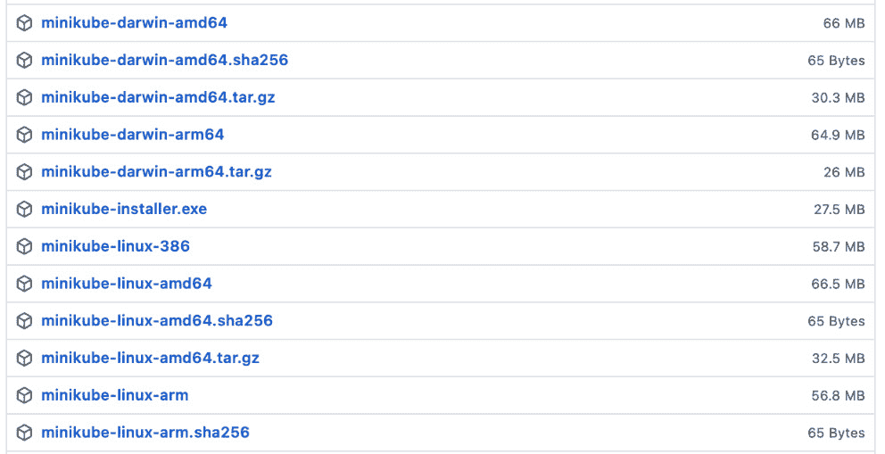
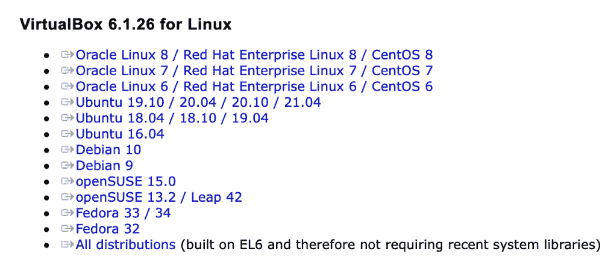
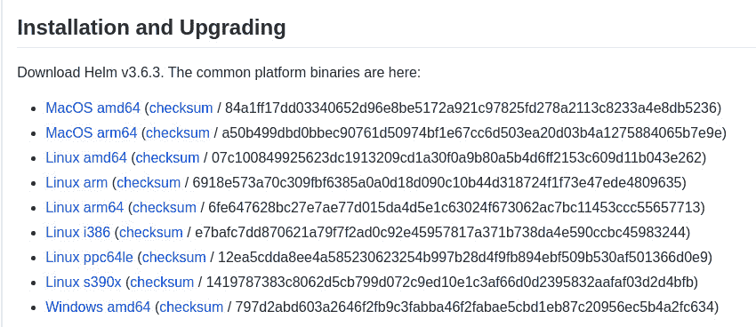

# 第二章：准备 Kubernetes 和 Helm 环境

**Helm** 是一个工具，提供了多种帮助用户更轻松部署和管理 **Kubernetes** 应用程序的好处。在用户开始体验这些好处之前，必须满足几个前提条件。首先，用户必须能够访问 Kubernetes 集群。接下来，用户应该拥有 Kubernetes 和 Helm 的命令行工具。最后，用户应了解 Helm 的基本配置选项，以便尽可能减少摩擦，提高生产力。

在本章中，我们将概述开始使用 Helm 所需的工具和概念。本章将涉及以下主题：

+   使用 minikube 准备本地 Kubernetes 环境

+   设置 kubectl

+   设置 Helm

+   配置 Helm

# 技术要求

在本章中，您需要在本地工作站上安装以下技术：

+   minikube

+   VirtualBox

+   Helm

+   kubectl

这些工具可以通过包管理器安装，也可以直接从源代码下载。我们将提供在 Windows 上使用 `Chocolatey` 包管理器、在 macOS 上使用 `Homebrew` 包管理器、在基于 Debian 的 Linux 发行版上使用 `apt-get` 包管理器、在基于 RPM 的 Linux 发行版上使用 `dnf` 包管理器的安装说明。

# 使用 minikube 准备本地 Kubernetes 环境

如果没有访问 Kubernetes 集群的权限，Helm 将无法部署应用程序。因此，我们讨论了一个选项，用户可以在自己的机器上运行本地集群——**minikube**。

minikube 是一个社区驱动的工具，使用户能够轻松地将一个小型单节点的 Kubernetes 集群部署到本地机器上。使用 minikube 创建的集群运行在容器或 **虚拟机** (**VM**) 中，方便创建和后续丢弃。minikube 为我们提供了一个绝佳的方式来实验 Kubernetes，它也可以与本书中提供的示例一起用来学习 Helm。

在接下来的几节中，我们将介绍如何安装和配置 minikube，以便在学习如何使用 Helm 时，您可以拥有一个可用的 Kubernetes 集群。有关更全面的说明，请参阅官方 minikube 网站上的 *入门！* 页面，网址：https://minikube.sigs.k8s.io/docs/start/

## 安装 minikube

与本章中将安装的其他工具一样，minikube 为 Windows、macOS 和 Linux 操作系统编译了二进制文件。安装 minikube 最新版本在 Windows 和 macOS 上最简单的方式是通过包管理器，如 Windows 上的 `Chocolatey` 和 macOS 上的 `Homebrew`。Linux 用户可以通过从 minikube 的 GitHub 发布页面下载最新的 `minikube` 二进制文件来轻松安装，虽然这种方法也可以在 Windows 和 macOS 上使用。

以下步骤描述了如何根据您的机器和安装偏好安装 minikube。请注意，本书编写时使用的是 minikube 版本 v1.22.0，并且用于开发本书中的示例。

要通过包管理器安装（适用于 Windows 和 macOS），请根据您的操作系统运行以下命令之一：

+   对于 Windows，运行以下命令：

    ```
    choco install minikube
    ```

+   对于 macOS，运行以下命令：

    ```
    brew install minikube
    ```

以下步骤展示了如何使用直接下载链接安装 minikube（适用于 Windows、macOS 和 Linux）：

1.  访问 GitHub 上 minikube 的 *releases* 页面：`github.com/kubernetes/minikube/releases/`。

1.  找到 **Assets** 部分，其中包含给定版本的 minikube 二进制文件：



图 2.1 – 来自 GitHub 发布页面的 minikube 二进制文件片段

1.  在 `minikube` 下。如果您正在下载 Linux 二进制文件，例如，您将运行以下命令：

    ```
    mv minikube-linux-amd64 minikube
    ```

1.  要执行 minikube，Linux 和 macOS 用户可能需要通过运行 `chmod` 命令添加可执行权限：

    ```
    chmod u+x minikube
    ```

1.  然后，`minikube` 应该被移动到由 `PATH` 变量管理的位置，以便可以在命令行的任何位置执行。`PATH` 变量包含的位置会有所不同，具体取决于您的操作系统。对于 macOS 和 Linux 用户，可以通过在终端运行以下命令来确定这些位置：

    ```
    echo $PATH
    ```

Windows 用户可以通过在 PowerShell 中运行以下命令来确定 `PATH` 变量的位置：

```
$env:PATH
```

1.  使用 `mv` 命令将 `minikube` 二进制文件移动到 `PATH` 位置。以下示例将 `minikube` 移动到 Linux 上的常见 `PATH` 位置：

    ```
    mv minikube /usr/local/bin/
    ```

1.  您可以通过运行 `minikube version` 来验证 minikube 是否已正确安装，并确保显示的版本与下载的版本相符：

    ```
    $ minikube version
    minikube version: v1.22.0
    commit: a03fbcf166e6f74ef224d4a63be4277d017bb62e
    ```

下一步是安装容器或虚拟机管理器，以便运行本地 Kubernetes 集群。本书中，我们将选择通过 VirtualBox 在虚拟机中运行 Kubernetes，因为它灵活且可在 Windows、macOS 和 Linux 操作系统上使用。接下来我们将解释如何安装 VirtualBox。

## 安装 VirtualBox

像 minikube 一样，VirtualBox 也可以通过 Chocolatey 或 Homebrew 轻松安装：

+   使用以下命令在 Windows 上安装 VirtualBox：

    ```
    choco install virtualbox
    ```

+   使用以下命令在 macOS 上安装 VirtualBox：

    ```
    brew install --cask virtualbox
    ```

VirtualBox 也可以通过 Linux 包管理器安装，但您需要先从 VirtualBox 的官方网站（https://www.virtualbox.org/wiki/Linux_Downloads）下载一个包：



图 2.2 – VirtualBox 包下载链接

下载完分发包后，您可以通过 `apt-get` 或 `dnf` 安装 VirtualBox：

+   使用以下命令在基于 Debian 的 Linux 系统上安装 VirtualBox：

    ```
    apt-get install ./virtualbox-*.deb
    ```

+   使用以下命令在基于 RPM 的 Linux 上安装 VirtualBox：

    ```
    dnf install ./VirtualBox-*.rpm
    ```

可以在其官方下载页面 https://www.virtualbox.org/wiki/Downloads 上找到安装 VirtualBox 的替代方法。

安装了 VirtualBox 后，minikube 必须配置为使用 VirtualBox 作为默认的虚拟化程序。我们将在下一部分进行配置。

## 配置 VirtualBox 为默认驱动程序

可以通过将 `driver` 选项指定为 `virtualbox` 来将 VirtualBox 设置为 minikube 的默认驱动程序：

```
minikube config set driver virtualbox
```

请注意，此命令可能会产生以下警告：

```
❗  These changes will take effect upon a minikube delete and then a minikube start
```

如果你的机器上没有活动的 minikube 集群，可以安全忽略此消息。

可以通过检查 `driver` 配置选项的值来确认是否已更改为 VirtualBox：

```
minikube config get driver
```

如果配置更改成功，将显示以下输出：

```
virtualbox
```

除了配置默认驱动程序外，你还可以配置分配给 minikube 实例的资源，我们将在下一部分进行讨论。

## 配置 minikube 资源分配

默认情况下，minikube 会为虚拟机分配 2 个 CPU 和 2 GB 内存，但如果你的机器资源允许，我们建议将内存分配增加到 4 GB。这样可以避免在执行练习时遇到内存限制。

运行以下命令将虚拟机内存分配增加到 4 GB：

```
minikube config set memory 4000
```

可以通过运行以下命令来验证此更改：

```
minikube config get memory.
```

让我们继续通过讨论 minikube 的基本用法来深入了解它。

## 探索 minikube 的基本用法

本书中，我们将介绍一些典型的 minikube 操作中常用的关键命令。理解这些命令非常重要，尤其是在执行本书提供的示例时。幸运的是，minikube 是一个非常容易上手的工具。

minikube 有三个主要的子命令：

+   `start`

+   `stop`

+   `delete`

`start` 子命令用于创建一个单节点 Kubernetes 集群。它会创建一个虚拟机并在其中初始化集群。集群准备好后，命令会结束：

```
$ minikube start
😄  minikube v1.22.0 on Redhat 8.4
✨  Using the virtualbox driver based on user configuration
👍  Starting control plane node minikube in cluster minikube
🔥  Creating virtualbox VM (CPUs=2, Memory=4000MB, Disk=20000MB) ...
🐳  Preparing Kubernetes v1.21.2 on Docker 20.10.6 ...
    ▪ Generating certificates and keys ...
    ▪ Booting up control plane ...
    ▪ Configuring RBAC rules ...
🔎  Verifying Kubernetes components...
    ▪ Using image gcr.io/k8s-minikube/storage-provisioner:v5
🌟  Enabled addons: storage-provisioner, default-storageclass
🏄  Done! kubectl is now configured to use "minikube" cluster and "default" namespace by default
```

`stop` 子命令用于关闭集群和虚拟机。集群和虚拟机的状态会保存到磁盘中，允许用户再次运行 `start` 子命令快速恢复工作，而不必从头开始构建新的虚拟机。你应该养成在完成集群工作并希望稍后继续时运行 `minikube stop` 的习惯：

```
$ minikube stop
✋  Stopping node "minikube"  ...
🛑  1 nodes stopped.
```

`delete` 子命令用于删除集群和虚拟机。此命令会清除集群和虚拟机的状态，释放先前分配的磁盘空间。下次执行 `minikube start` 时，将创建一个全新的集群和虚拟机：

```
$ minikube delete
🔥  Deleting "minikube" in virtualbox ...
💀  Removed all traces of the "minikube" cluster.
```

还有更多的 minikube 子命令可用，但这些是你需要了解的主要子命令。

在本地机器上安装并配置了 minikube 后，你现在可以安装 **kubectl**，即 Kubernetes 命令行工具，并满足使用 Helm 所需的其余前提条件。

# 设置 kubectl

正如我们在 *第一章* 中提到的，*理解 Kubernetes 和 Helm*，Kubernetes 是一个暴露不同 API 端点的系统。这些 API 端点用于对集群执行各种操作，例如创建、查看或删除资源。为了提供更简便的用户体验，开发人员需要一种与 Kubernetes 交互的方式，而无需管理底层的 API 层。

虽然你将在本书中主要使用 Helm 命令行工具来安装和管理应用程序，但 kubectl 是执行常见任务的必备工具。

继续阅读以了解如何在本地工作站上安装 kubectl。请注意，撰写本文时使用的 kubectl 版本是 v1.21.2。

## 安装 kubectl

kubectl 可以通过 minikube 安装，也可以通过包管理器获取或通过直接下载获取。首先，让我们描述一下如何通过 minikube 获取 kubectl。

### 通过 minikube 安装 kubectl

通过 minikube 安装 kubectl 非常简单。minikube 提供了一个名为 `kubectl` 的子命令，它会为你下载 kubectl 二进制文件。首先，使用 `minikube kubectl` 运行一个 `kubectl` 命令：

```
minikube kubectl version
```

此命令将 kubectl 安装到 `$HOME/.minikube/cache/linux/v1.21.2` 目录中。请注意，路径中包含的 kubectl 版本将取决于所使用的 minikube 版本。安装完 kubectl 后，使用以下语法访问 kubectl：

```
minikube kubectl -- <subcommand> <flags>
```

这是一个示例命令：

```
$ minikube kubectl -- version --client
Client Version: version.Info{Major:"1", Minor:"21", GitVersion:"v1.21.2", GitCommit:"092fbfbf53427de67cac1e9fa54aaa09a28371d7", GitTreeState:"clean", BuildDate:"2021-06-16T12:59:11Z", GoVersion:"go1.16.5", Compiler:"gc", Platform:"linux/amd64"}
```

虽然使用 `minikube kubectl` 调用 kubectl 可行，但语法比直接调用 kubectl 更繁琐。可以通过将 `kubectl` 可执行文件从本地 minikube 缓存复制到由 `PATH` 变量管理的位置来克服这一问题。在每个操作系统中执行此操作的方式相似，下面是如何在 Linux 机器上实现这一点的示例：

```
$ sudo cp ~/.minikube/cache/linux/v1.21.2/kubectl /usr/local/bin/
```

完成后，`kubectl` 可以作为独立的二进制文件调用，如下所示：

```
$ kubectl version –client
Client Version: version.Info{Major:"1", Minor:"21", GitVersion:"v1.21.2", GitCommit:"092fbfbf53427de67cac1e9fa54aaa09a28371d7", GitTreeState:"clean", BuildDate:"2021-06-16T12:59:11Z", GoVersion:"go1.16.5", Compiler:"gc", Platform:"linux/amd64"}
```

`kubectl` 也可以在没有 `minikube` 的情况下安装，正如我们在接下来的章节中将看到的那样。

### 在没有 minikube 的情况下安装 kubectl

Kubernetes 上游文档提供了多种不同的机制来实现这一目标，适用于各种目标操作系统，具体内容请参见 https://kubernetes.io/docs/tasks/tools/install-kubectl/。

### 使用包管理器

另一种不通过 minikube 安装 kubectl 的方式是使用本地包管理器。以下列表演示了在不同操作系统上如何实现：

+   使用以下命令在 Windows 上安装 kubectl：

    ```
    choco install kubernetes-cli
    ```

+   使用以下命令在 macOS 上安装 kubectl：

    ```
    brew install kubernetes-cli
    ```

+   使用以下命令在基于 Debian 的 Linux 上安装 kubectl：

    ```
    sudo apt-get update
    sudo apt-get install -y apt-transport-https ca-certificates curl
    sudo curl -fsSLo /usr/share/keyrings/kubernetes-archive-keyring.gpg https://packages.cloud.google.com/apt/doc/apt-key.gpg
    echo "deb [signed-by=/usr/share/keyrings/kubernetes-archive-keyring.gpg] https://apt.kubernetes.io/ kubernetes-xenial main" | sudo tee /etc/apt/sources.list.d/kubernetes.list
    sudo apt-get update
    sudo apt-get install -y kubectl
    ```

+   使用以下命令在基于 RPM 的 Linux 上安装 kubectl：

    ```
    cat <<EOF > /etc/yum.repos.d/kubernetes.repo[kubernetes]name=Kubernetesbaseurl=https://packages.cloud.google.com/yum/repos/kubernetes-el7-x86_64enabled=1gpgcheck=1repo_gpgcheck=1gpgkey=https://packages.cloud.google.com/yum/doc/yum-key.gpg https://packages.cloud.google.com/yum/doc/rpm-package-key.gpgEOF
    yum install -y kubectl
    ```

接下来我们将讨论最终的 kubectl 安装方法。

### 直接从链接下载

也可以通过直接从下载链接下载 kubectl。以下列表解释了如何下载版本 v1.21.2，这是本书中将使用的 kubectl 版本：

+   从 `storage.googleapis.com/kubernetes-release/release/v1.21.2/bin/windows/amd64/kubectl.exe` 下载适用于 Windows 的 kubectl。

+   从 `storage.googleapis.com/kubernetes-release/release/v1.21.2/bin/darwin/amd64/kubectl` 下载适用于 macOS 的 kubectl。

+   从 `storage.googleapis.com/kubernetes-release/release/v1.21.2/bin/linux/amd64/kubectl` 下载适用于 Linux 的 kubectl。

然后，kubectl 二进制文件可以移动到 `PATH` 变量管理的路径中。在 macOS 和 Linux 操作系统上，确保授予文件可执行权限：

```
chmod u+x kubectl
```

可以通过运行以下命令来验证安装是否成功。

```
$ kubectl version --client
Client Version: version.Info{Major:"1", Minor:"21", GitVersion:"v1.21.2", GitCommit:"092fbfbf53427de67cac1e9fa54aaa09a28371d7", GitTreeState:"clean", BuildDate:"2021-06-16T12:59:11Z", GoVersion:"go1.16.5", Compiler:"gc", Platform:"linux/amd64"}
```

现在我们已经介绍了如何设置 kubectl，接下来可以深入本书的核心技术——Helm。

# 设置 Helm

一旦 minikube 和 kubectl 安装完成，下一个需要配置的工具就是 Helm。请注意，本书写作时使用的 Helm 版本为 v3.6.3。

## 安装 Helm

Helm 的安装包可以通过 `Chocolatey` 和 `Homebrew` 获取，从而让您在 Windows 或 macOS 上轻松安装它。在这些系统上，可以运行以下命令使用适当的软件包管理器安装 Helm：

+   使用以下命令在 Windows 上安装 Helm：

    ```
    > choco install kubernetes-helm     
    ```

+   使用以下命令在 macOS 上安装 Helm：

    ```
    $ brew install helm
    ```

Linux 用户，或希望从直接下载链接安装 Helm 的用户，可以通过以下步骤从 Helm 的 GitHub 发布页面下载归档文件：

1.  在 Helm 的 GitHub 发布页面上找到 **安装与升级** 部分，网址为 https://github.com/helm/helm/releases：



图 2.3 – Helm GitHub 发布页面上的安装与升级部分

1.  下载与您的操作系统相关的归档文件。

1.  下载完成后，文件需要解压。可以通过在 PowerShell 中使用 `Expand-Archive` cmdlet 或在 Bash 中使用 `tar` 工具来实现：

对于 Windows/PowerShell，请使用以下示例代码：

```
Expand-Archive -Path helm-v3.6.3-windows-amd64.zip -DestinationPath $DEST
```

对于 Linux，请使用以下示例代码：

```
tar -zxvf helm-v3.6.3-linux-amd64.tar.gz
```

对于 Mac，请使用以下示例代码：

```
tar -zxvf helm-v3.6.3-linux-amd64.tar
```

`helm` 二进制文件可以在解压后的文件夹中找到，应该将其移动到 `PATH` 变量管理的路径中。

以下示例展示了如何将 `helm` 二进制文件移动到 Linux 系统中的 `/usr/local/bin` 文件夹：

```
sudo mv ~/Downloads/linux-amd64/helm /usr/local/bin
```

无论 Helm 是通过何种方式安装的，都可以通过运行`helm version`命令进行验证。如果结果输出类似于以下代码，则表示 Helm 已成功安装：

```
$ helm version
version.BuildInfo{Version:"v3.6.3", GitCommit:"d506314abfb5d21419df8c7e7e68012379db2354", GitTreeState:"clean", GoVersion:"go1.16.5"}
```

在你的机器上安装了 Helm 后，让我们学习基本的 Helm 配置主题。

# 配置 Helm

Helm 是一个具有合理默认设置的工具，允许用户在安装后无需执行大量操作即可提高生产力。话虽如此，用户可以更改或启用几种不同的选项，以修改 Helm 的行为。我们将在以下各节中介绍这些选项，首先从配置上游仓库开始。

## 添加上游仓库

用户可以开始配置他们的 Helm 安装的一种方法是通过添加上游图表仓库。在 *第一章*，*理解 Kubernetes 和 Helm* 中，我们描述了图表仓库包含 Helm 图表，这些图表可以更广泛地供使用。作为 Kubernetes 包管理器，Helm 可以连接到各种图表仓库以安装 Kubernetes 应用程序。

Helm 提供了`repo`子命令，允许用户管理已配置的图表仓库。此子命令包含其他子命令，可用于对指定的仓库执行操作。

以下是五个`repo`子命令：

+   `add`：添加一个图表仓库

+   `list`：列出图表仓库

+   `remove`：删除一个图表仓库

+   `update`：从图表仓库本地更新可用图表的信息

+   `index`：根据包含打包图表的目录生成索引文件

使用前面的列表作为指南，可以通过使用`add repo`子命令来添加一个图表仓库，如下所示：

```
$ helm repo add $REPO_NAME $REPO_URL
```

在安装包含的图表之前，需要添加图表仓库。本书将在后续章节中详细讨论从仓库安装图表的具体步骤。

你可以通过使用`list repo`子命令来确认仓库是否已成功添加：

```
$ helm repo list
NAME      URL                  
bitnami   https://charts.bitnami.com
```

已添加到 Helm 客户端的仓库将在此输出中显示。前面的示例显示名为`bitnami`的图表仓库已被添加，因此它出现在 Helm 客户端已知仓库的列表中。如果添加了其他仓库，它们也会出现在此输出中。

随着时间的推移，图表的更新将发布并发布到这些仓库中。仓库的元数据会被本地缓存。因此，Helm 不会自动意识到图表何时更新。你可以通过运行`update repo`子命令来指示 Helm 检查每个配置仓库的更新。一旦执行了此命令，你将能够从每个仓库安装最新的图表：

```
$ helm repo update
Hang tight while we grab the latest from your chart repositories...
...Successfully got an update from the "bitnami" chart repository
Update Complete. ⎈ Happy Helming!⎈
```

你可能还需要删除先前配置的仓库。可以通过使用`repo remove`子命令来完成：

```
$ helm repo remove bitnami
"bitnami" has been removed from your repositories
```

最后一个剩余的 `repo` 子命令形式是 `index`。该子命令由仓库和图表维护者用于发布新的或更新的图表。此任务将在 *第八章*，*发布到 Helm 图表仓库* 中进行更详细的讲解。

接下来，我们将讨论 Helm 插件的配置。

## 添加插件

插件是可供 Helm 使用的附加功能，提供额外的特性。大多数用户不需要担心 Helm 插件及其管理。Helm 本身就是一个强大的工具，具备了完整的功能集。尽管如此，Helm 社区仍然维护着多种插件，可以在核心代码之外扩展 Helm 的能力。部分流行的 Helm 插件在 Helm 文档中列出，网址为 https://helm.sh/docs/community/related/。

Helm 提供了一个 `plugin` 子命令用于管理插件，插件包含进一步的子命令，具体内容如下表所示：

| **插件子命令** | **描述** | **用法** |
| --- | --- | --- |
| `install` | 安装一个或多个 Helm 插件 | `helm plugin install $URL` |
| `list` | 列出已安装的 Helm 插件 | `helm plugin list` |
| `uninstall` | 卸载一个或多个 Helm 插件 | `helm plugin uninstall $PLUGIN` |
| `update` | 更新一个或多个 Helm 插件 | `helm plugin update $PLUGIN` |

表 2.1 – Helm 插件子命令

插件可以提供多种不同的生产力增强功能。

以下是一些上游插件的示例：

+   **Helm Diff**：执行已部署发布与提议的 Helm 升级之间的差异比较

+   **Helm Secrets**：用于帮助隐藏 Helm 图表中的密钥

+   **Helm Monitor**：用于监控发布并在发生某些事件时执行回滚

+   **Helm Unittest**：用于对 Helm 图表执行单元测试

我们将继续讨论 Helm 配置选项，通过回顾可以设置的不同环境变量来改变 Helm 行为的各个方面。

## 环境变量

Helm 依赖环境变量的存在来配置一些底层选项。你可以配置许多变量，每个变量都可以在 `helm help` 输出中查看。

有几个环境变量用于存储 Helm 元数据：

+   `HELM_CACHE_HOME``XDG_CACHE_HOME`：设置 Helm 缓存文件的替代存储位置

+   `HELM_CONFIG_HOME``XDG_CONFIG_HOME`：设置 Helm 配置的替代存储位置

+   `HELM_DATA_HOME``XDG_DATA_HOME`：设置 Helm 数据的替代存储位置

Helm 遵循 **XDG 基本目录规范**，该规范旨在提供一种标准化方式来定义操作系统文件系统中不同文件的位置。基于 XDG 规范，Helm 会根据需要在每个操作系统上自动创建三个不同的默认目录：

| **操作系统** | **缓存路径** | **配置路径** | **数据路径** |
| --- | --- | --- | --- |
| Windows | `%TEMP%\helm` | `%APPDATA%\helm` | `%APPDATA%\helm` |
| macOS | `$HOME/Library/Caches/helm` | `$HOME/Library/Preferences/helm` | `$HOME/Library/helm` |
| Linux | `$HOME/.cache/helm` | `$HOME/.config/helm` | `$HOME/.local/share/helm` |

表 2.2 – Helm 元数据的默认位置

Helm 使用 `helm repo update` 命令。

**配置路径** 用于保存存储库信息，如 URL 和身份验证所需的凭据。当安装一个 chart 但该 chart 尚未位于本地缓存中时，Helm 使用配置路径查找 chart 存储库的 URL，然后从该 URL 下载 chart。

`helm plugin install` 命令，该插件本身存储在此位置。

除了 Helm 元数据路径之外，还有其他环境变量用于配置常规的 Helm 使用：

+   `secret`，它以 Base64 编码 Kubernetes `secret` 中发布的状态。其他选项包括 `configmap`，它将状态存储在明文的 Kubernetes 配置映射中，`memory`，它将状态存储在本地进程的内存中，以及 `sql`，它将状态存储在关系型数据库中。

+   `HELM_NAMESPACE` 环境变量用于设置 Helm 操作所发生的命名空间。这个环境变量非常方便，因为它避免了在每次调用 Helm 时都需要传递 `--namespace` 或 `-n` 标志。

+   `KUBECONFIG` 环境变量用于设置用于 Kubernetes 集群身份验证的文件。如果未设置，该值默认为 `~/.kube/config`。在大多数情况下，用户无需修改该值。

Helm 的另一个可以配置的组件是 Tab 补全，如下所述。

## Tab 补全

Bash、Zsh 和 Fish 用户可以启用 Tab 补全功能，从而简化 Helm 使用。Tab 补全允许在按下 *Tab* 键时自动完成 Helm 命令，使用户可以更快地执行任务，并帮助防止输入错误。

这个过程类似于大多数现代终端仿真器默认的行为。当按下 *Tab* 键时，终端会通过观察命令和环境的状态来猜测接下来需要的参数。例如，`cd /usr/local/b` 输入可以在 Bash shell 中通过自动补全变为 `cd /usr/local/bin`。类似地，像 `helm upgrade hello-` 这样的输入可以通过自动补全变为 `helm upgrade hello-world`。

通过运行以下命令，可以根据所选的 shell 启用 Tab 补全：

+   对于 Bash 用户，运行以下命令：

    ```
    source <(helm completion bash)
    ```

+   对于 Zsh 用户，运行以下命令：

    ```
    source <(helm completion zsh)
    ```

+   对于 Fish 用户，运行以下命令：

    ```
    helm completion fish | source
    ```

请注意，自动补全功能只会在执行了前述命令的终端窗口中生效，因此其他打开的窗口也需要运行该命令才能体验到自动补全功能。

## 身份验证

Helm 需要能够与 Kubernetes 集群进行身份验证，以便部署和管理应用程序。它通过引用一个 `kubeconfig` 文件进行身份验证，该文件指定了不同的 Kubernetes 集群及如何与它们进行交互。

如果你使用的是 minikube，则无需配置身份验证，因为 minikube 每次创建新集群时都会自动配置 `kubeconfig` 文件。如果你没有使用 minikube，则可能需要创建一个 `kubeconfig` 文件，或者根据你使用的 Kubernetes 发行版提供一个。`kubeconfig` 文件由三个主要组件组成：

+   **clusters**: 主机名或 IP 地址，以及证书颁发机构

+   **users**: 身份验证详细信息

+   **contexts**: 集群、用户与活动命名空间之间的绑定

`kubeconfig` 文件及其三个主要组件可以通过三个不同的 `kubectl` 命令创建：

+   第一个命令是 `set-cluster`：

    ```
    kubectl config set-cluster
    ```

`set-cluster` 命令将在 `kubeconfig` 文件中定义一个 `cluster` 条目。`set-context` 用于将凭证与集群关联。一旦凭证与集群之间建立了关联，你就可以使用凭证的身份验证方法进行集群身份验证。

+   下一个命令是 `set-credentials`：

    ```
    kubectl config set-credentials
    ```

`set-credentials` 命令将定义用户的名称以及其身份验证方法和详细信息。此命令可以配置用户名和密码对、客户端证书、承载令牌或身份验证提供程序，以允许用户和管理员指定不同的身份验证方法。

+   然后，我们有 `set-context` 命令：

    ```
    kubectl config set-context
    ```

如前所述，`set-context` 命令指定了 `cluster`、`credential`（用户）和活动命名空间之间的名称映射。所有引用 `kubeconfig` 文件的调用都指向特定的上下文。

`kubectl config view` 命令可用于查看 `kubeconfig` 文件。请注意，`kubeconfig` 文件的 `clusters`、`contexts` 和 `user` 部分如何与之前描述的命令对应，如下例所示：

```
$ kubectl config view
apiVersion: v1
clusters:
- cluster:
    certificate-authority: /home/helm-user/.minikube/ca.crt
    extensions:
    - extension:
        last-update: Mon, 13 Dec 2021 17:26:45 EST
        provider: minikube.sigs.k8s.io
        version: v1.22.0
      name: cluster_info
    server: https://192.168.49.2:8443
  name: minikube
contexts:
- context:
    cluster: minikube
    extensions:
    - extension:
        last-update: Mon, 13 Dec 2021 17:26:45 EST
        provider: minikube.sigs.k8s.io
        version: v1.22.0
      name: context_info
    namespace: default
    user: minikube
  name: minikube
current-context: minikube
kind: Config
preferences: {}
users:
- name: minikube
  user:
    client-certificate: /home/helm-user/.minikube/profiles/minikube/client.crt
    client-key: /home/helm-user/.minikube/profiles/minikube/client.key
```

启动 minikube 实例将自动填充 `kubeconfig` 文件的内容。一旦此文件存在，kubectl 和 Helm 就能够与 Kubernetes 集群进行交互。

在下一节中，我们将讨论如何处理对 Kubernetes 集群的授权。

## 授权/RBAC

身份验证是确认身份的手段，而授权定义了身份验证用户可以执行的操作。Kubernetes 使用 **基于角色的访问控制** (**RBAC**) 来执行 Kubernetes 的授权。RBAC 是一个设计角色和权限的系统，可以分配给特定的用户或用户组。用户在 Kubernetes 上被允许执行的操作取决于其被分配的角色。

Kubernetes 提供了多种不同的角色。这里列出了三个常见的角色：

+   `cluster-admin`：允许用户对集群中的任何资源执行任何操作。

+   `edit`：允许用户对命名空间或 Kubernetes 资源的逻辑分组内的大多数资源进行读写操作。

+   `view`：这会阻止用户修改现有资源。它仅允许用户读取命名空间内的资源。

由于 Helm 使用 `kubeconfig` 文件中定义的凭证进行 Kubernetes 身份验证，因此 Helm 拥有相同级别的访问权限。如果允许 `edit` 访问权限，通常可以认为 Helm 拥有足够的权限来安装应用程序。对于 `view` 访问权限，Helm 将无法安装应用程序，因为这种访问级别是只读的。它可能也无法列出已安装版本的详细信息，因为 `secrets` 被用作默认存储驱动程序。

运行 minikube 的用户在实例创建后默认被赋予 `cluster-admin` 角色。虽然在生产环境中这种访问级别不是最佳实践，但对于学习和实验来说是可以接受的。如果您在使用 Minikube，您不需要担心配置授权即可跟随本书中的概念和示例。如果您与没有使用 minikube 的 Kubernetes 用户一起工作，您需要确保他们至少被授予 `edit` 角色，以便能够使用 Helm 部署应用程序。可以通过请求管理员运行以下命令来实现此目的（其中 `$USER` 是您的 Kubernetes 用户）：

```
kubectl create clusterrolebinding $USER-edit --clusterrole=edit --user=$USER
```

关于 RBAC 的最佳实践将在*第十二章*，*Helm 安全性注意事项*中进行讨论，我们将在该章节详细讨论与安全性相关的概念，包括如何正确地应用角色，以防止集群中的错误和恶意行为。

# 总结

开始使用 Helm 需要具备多种不同的组件。在本章中，您学习了如何安装 minikube 以提供一个本地的 Kubernetes 集群，这个集群可以在本书中使用。您还学习了如何安装 kubectl，这是与 Kubernetes API 交互的官方工具。最后，您学习了如何安装 Helm 客户端，并探索了 Helm 可以配置的各种方式，包括添加仓库和插件、修改环境变量、启用标签补全以及配置与 Kubernetes 集群的身份验证和授权。

现在您已经安装了所需的工具，可以开始学习如何使用 Helm 部署第一个应用程序。在下一章中，您将从上游图表仓库安装 Helm 图表，并学习生命周期管理和应用程序配置。在完成该章节后，您将了解 Helm 如何作为 Kubernetes 的包管理器。

# 进一步阅读

查看以下链接，了解有关 minikube、kubectl 和 Helm 的安装选项：

+   Minikube：[`kubernetes.io/docs/tasks/tools/install-minikube/`](https://kubernetes.io/docs/tasks/tools/install-minikube/)

+   kubectl：[`kubernetes.io/docs/tasks/tools/install-kubectl/`](https://kubernetes.io/docs/tasks/tools/install-kubectl/)

+   Helm：`helm.sh/docs/intro/install/`

我们已经介绍了多种安装后配置 Helm 的方法。查看以下链接，了解更多关于这些主题的信息：

+   仓库管理：`helm.sh/docs/intro/quickstart/#initialize-a-helm-chart-repository`

+   插件管理：[`helm.sh/docs/topics/plugins/`](https://helm.sh/docs/topics/plugins/)

+   环境变量和`helm help`输出：`helm.sh/docs/helm/helm/`

+   标签补全：`helm.sh/docs/helm/helm_completion/`

+   通过`kubeconfig`文件进行身份验证和授权：[`kubernetes.io/docs/tasks/access-application-cluster/configure-access-multiple-clusters/`](https://kubernetes.io/docs/tasks/access-application-cluster/configure-access-multiple-clusters/)

# 问题

回答以下问题，以测试你对本章内容的理解：

1.  Helm 如何进行 Kubernetes 集群身份验证？

1.  为 Helm 客户端提供授权的机制是什么？管理员如何管理这些权限？

1.  `helm repo add`命令的作用是什么？

1.  用于存储 Helm 元数据的三个文件路径是什么？每个路径包含什么内容？

1.  Helm 如何管理状态？有哪些选项可以更改状态存储方式？
