# 第三章：使用 Helm 安装你的第一个应用

在本书早些时候，我们提到 Helm 是 **Kubernetes 包管理器**，并将其与操作系统的包管理器进行比较。包管理器允许用户快速、轻松地安装各种复杂度的应用，并管理应用可能依赖的其他组件。Helm 的工作方式类似。

用户只需确定要在 Kubernetes 上部署的应用，Helm 会完成其余的工作。一个 Helm chart——Kubernetes 资源的封装——包含了安装应用所需的逻辑和组件，允许用户在不需要了解特定资源的情况下执行安装。用户还可以向 Helm chart 传递参数（称为值），以定制应用的不同方面。在本章中，你将通过利用 Helm 作为包管理器来将 WordPress 实例部署到 Kubernetes 上，探索这些功能。

在本章中，我们将涵盖以下主要内容：

+   理解 WordPress 应用

+   查找 WordPress chart

+   创建一个 Kubernetes 环境

+   安装 WordPress chart

+   选择 `--set` 和 `--values` 之间的区别

+   访问 WordPress 应用

+   升级 WordPress 发布版本

+   回滚 WordPress 发布版本

+   卸载 WordPress 发布版本

+   关闭你的环境

# 技术要求

本章将使用以下软件技术：

+   minikube

+   kubectl

+   Helm

我们假设这些组件已在你的系统上安装。有关每个工具的更多信息，包括它们的安装和配置，请参考 *第二章*，*准备 Kubernetes 和 Helm 环境*。

# 理解 WordPress 应用

WordPress 是一个开源的 **内容管理系统**（**CMS**），用于创建网站和博客。它有两个不同的版本——WordPress.com 和 WordPress.org。WordPress.com 是 CMS 的 **软件即服务**（**SaaS**）版本，意味着 WordPress 应用及其组件由 WordPress 托管和管理。在这种情况下，用户无需担心安装 WordPress 实例，他们只需访问已提供的实例即可。而 WordPress.org 则是自托管选项，它要求用户自行部署 WordPress 实例，并且需要一定的专业知识来维护。

由于 WordPress.com 更易于上手，可能看起来是一个更理想的选择。然而，这个 SaaS 版本的 WordPress 相比自托管的 WordPress.org，有许多缺点，如下所示：

+   它没有提供像 WordPress.org 那样多的功能

+   它没有给用户完全的控制权来管理他们的网站

+   它要求用户支付高级功能的费用

+   它不提供修改网站后端代码的能力

而自托管的 WordPress.org 版本则让用户对他们的网站和 WordPress 实例拥有完全的控制权。它提供了完整的 WordPress 功能集，从安装插件到修改后台代码。

自托管的 WordPress 实例要求用户部署一些不同的组件。WordPress 需要 MySQL 或 MariaDB 数据库来保存网站和管理数据，而 WordPress UI 则作为 PHP 前端进行部署。在 Kubernetes 中，部署这些组件意味着要创建各种不同的资源：

+   用于数据库和管理员控制台认证的`Secrets`

+   一个用于外部化数据库配置的`ConfigMap`

+   用于网络的`Services`

+   用于数据库存储的`PersistentVolumeClaim`

+   用于以有状态的方式部署数据库的`StatefulSet`

+   用于部署前端的`Deployment`

创建这些 Kubernetes 资源需要具备 WordPress 和 Kubernetes 的专业知识。需要 WordPress 专业知识，因为用户需要了解所需的物理组件以及如何配置它们。需要 Kubernetes 专业知识，因为用户需要了解如何将 WordPress 依赖项部署为 Kubernetes 资源。鉴于所需组件的复杂性和数量，在 Kubernetes 上部署 WordPress 可能是一项艰巨的任务。

这一任务所面临的挑战非常适合使用 Helm。与其关注创建和配置我们所描述的每一个 Kubernetes 资源，用户可以利用 Helm 作为包管理器来部署和配置 Kubernetes 上的 WordPress。首先，我们将探索一个名为**Artifact Hub**的平台，寻找一个合适的 WordPress Helm chart。然后，我们将使用 Helm 将 WordPress 部署到你的 Kubernetes 集群中，并在过程中探索基本的 Helm 功能。

# 查找 WordPress chart

Helm charts 可以通过将它们发布到 chart 仓库来供用户使用。chart 仓库是存储和共享打包好的 charts 的位置。仓库通常作为 HTTP 服务器托管，可以采取多种形式，包括 GitHub Pages、Amazon S3 桶或简单的 Web 服务器，如 Apache HTTPD。最近，仓库还可以采取 OCI 注册表的形式，允许用户从托管服务（如 Docker Hub 和 Quay）保存和检索 Helm charts。

要使用仓库中的 charts，Helm 需要配置为使用该仓库。这可以通过使用`helm repo add`来添加仓库来实现。添加仓库时的一个挑战是，市场上有许多不同的 chart 仓库可供使用，可能很难找到适合你使用场景的特定仓库。为了更容易地找到 chart 仓库（以及其他与 Kubernetes 相关的工件），Kubernetes 社区创建了一个名为 Artifact Hub 的平台。

Artifact Hub 是上游 Kubernetes 艺术品（如 Helm 图表、操作员、插件等）的集中位置。在本章中，我们将使用 Artifact Hub 平台来搜索 WordPress Helm 图表。一旦找到合适的图表，我们将添加此图表所属的存储库，以便安装。

可以通过命令行或 Web 浏览器完成与 Artifact Hub 的交互。当使用命令行搜索 Helm 图表时，返回的结果提供了一个到 Artifact Hub 的 URL，该 URL 可以用于查找有关图表的更多信息以及如何添加其图表存储库的说明。

让我们按照这个工作流程来添加一个包含 WordPress 图表的图表存储库。

## 从命令行搜索 WordPress 图表

一般来说，Helm 包含两个不同的搜索命令，以帮助我们查找 Helm 图表：

+   要在 Artifact Hub 中搜索图表，请使用以下命令：

    ```
    $ helm search hub
    ```

请注意，在 Helm 的先前版本中，`helm search hub`引用的是由 Helm 社区维护的 Helm Hub 的集中管理公共图表存储库，而不是 Artifact Hub。通过使用`--endpoint`参数保留了向后兼容性，该参数允许用户指定任何基于单眼的实例位置，这是支持 Helm Hub 的网络搜索和发现 Web 应用程序。

+   要搜索图表中存在的关键字，请使用以下命令：

    ```
    $ helm search repo
    ```

如果之前未添加过存储库，则用户应运行`helm search hub`命令来定位所有公共图表存储库中可用的 Helm 图表。一旦添加了存储库，用户可以运行`helm search repo`来跨这些存储库搜索。

让我们在 Artifact Hub 中搜索现有的 WordPress 图表。Artifact Hub 中的每个图表都有一组可以针对其进行搜索的关键字。执行以下命令来查找包含`wordpress`关键字的图表：

```
$ helm search hub wordpress
```

运行此命令后，应显示类似以下内容的输出：

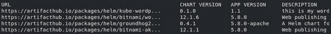

Figure 3.1 – 运行 helm search hub wordpress 的输出

此命令返回的输出每一行都是来自 Artifact Hub 的一个图表。输出显示了每个图表 Artifact Hub 页面的 URL。还显示了图表版本，该版本表示 Helm 图表的最新版本，以及应用程序版本，默认情况下部署该图表的应用程序版本。`helm search hub`命令还打印了每个图表的简要描述。

正如您可能已经注意到的那样，返回的某些值已被截断。这是因为`helm search hub`的默认输出是`table`，导致结果以表格格式返回。默认情况下，超过 50 个字符宽度的列会被截断。可以通过使用`--max-col-width=0`标志来避免此截断。

尝试运行以下命令，并包括 `--max-col-width` 标志，以表格格式查看未截断的结果：

```
$ helm search hub wordpress --max-col-width=0
```

或者，用户可以传递 `--output` 标志，并指定 `yaml` 或 `json`，这样可以完整打印搜索结果。

尝试再次运行先前的命令，并使用 `--output yaml` 标志：

```
$ helm search hub wordpress --output yaml
```

结果将以 YAML 格式显示，类似于此处显示的输出：

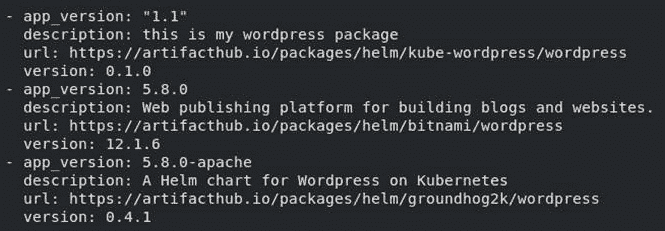

图 3.2 – helm search hub wordpress --output yaml 命令的输出

在本例中，我们将选择安装在前述示例输出中返回的第二个图表。要了解更多关于该图表及其安装方式的信息，请访问 `artifacthub.io/packages/helm/bitnami/wordpress`。我们将在下一节中深入探讨这个链接。

## 在浏览器中查看 WordPress 图表

使用 `helm search hub` 是在 Artifact Hub 上搜索图表的最快方法。然而，它没有提供安装所需的所有详细信息。具体来说，用户需要知道图表的仓库 URL，以便添加该仓库并安装图表。图表的 Artifact Hub 页面可以提供此 URL，以及其他安装细节。

一旦您将 WordPress 图表的 URL 输入到浏览器窗口中，将显示类似以下内容的页面：

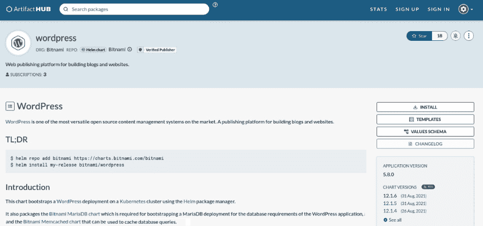

图 3.3 – 来自 Artifact Hub 的 WordPress Helm 图表

来自 Artifact Hub 的 WordPress 图表页面提供了许多详细信息，包括图表的维护者（**Bitnami**，这是一家提供可部署到不同环境的软件包的公司）以及图表的简要介绍（说明该图表将把 WordPress 实例部署到 Kubernetes，并且作为依赖项包含 Bitnami MariaDB 图表）。该网页还提供了安装细节，包括图表支持的值，这些值用于配置安装，同时还提供了 Bitnami 的图表仓库 URL。这些安装细节使用户能够添加该仓库并安装 WordPress 图表。

在 `helm repo add` 命令下。这是您需要运行的命令，用来添加 Bitnami 图表仓库，这是包含我们感兴趣安装的 WordPress 图表的仓库。

## Bitnami 仓库图表保留策略

最近，Bitnami Helm 社区的变化导致图表在发布后 6 个月被移除出 Bitnami 仓库。与最新版本的软件包保持一致是一种推荐的做法，这样可以包含最新的功能和安全修复。然而，由于其余的练习指定了特定的图表版本，以支持已测试集成的稳定性，因此必须使用一个替代的仓库。

幸运的是，已经提供了另一个仓库索引，其中包括所有 Bitnami 图表，而不受默认索引的保留政策限制，具体内容将在下一节中介绍。你将通过在*第七章*《*Helm 生命周期钩子*》中创建和管理自己的仓库，了解更多关于仓库索引的信息。

## 添加完整的 Bitnami 仓库

了解了与 Bitnami 仓库中的图表相关的注意事项后，让我们添加一个允许我们指定特定图表版本的仓库，而不必担心它们将来可能会被删除。在 `helm repo add` 命令中唯一的区别是仓库的 URL。

现在让我们添加仓库，并验证我们是否可以与其内容进行交互：

1.  添加完整的 Bitnami 图表仓库：

    ```
    $ helm repo add bitnami https://raw.githubusercontent.com/bitnami/charts/archive-full-index/bitnami 
    ```

1.  通过运行 `helm repo list` 命令，验证该图表是否已被添加：

    ```
    $ helm repo list
    NAME       URL                   
    bitnami     https://raw.githubusercontent.com/bitnami/charts/archive-full-index/bitnami
    ```

现在我们已经添加了仓库，可以做更多的操作。

1.  运行以下命令，查看本地配置的仓库中包含 `bitnami` 关键字的图表：

    ```
    $ helm search repo bitnami --output yaml
    ```

以下是返回结果的简化列表，显示在下列输出中：

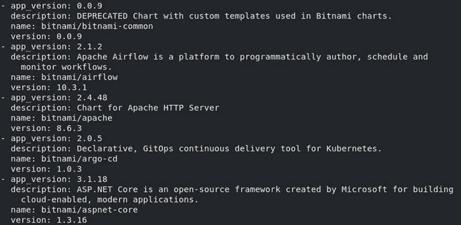

图 3.4 – helm search repo bitnami --output yaml 命令的输出

与 `helm search hub` 命令类似，`helm search repo` 命令接受关键字作为参数。使用 `bitnami` 作为关键字，将返回 `bitnami` 仓库中的所有图表，以及可能包含 `bitnami` 关键字的其他仓库中的图表。

为确保你现在可以访问 WordPress 图表，请运行以下带有 `wordpress` 参数的 `helm search repo` 命令：

```
$ helm search repo wordpress
```

输出将显示你在 Artifact Hub 上找到并在浏览器中查看的 WordPress 图表：

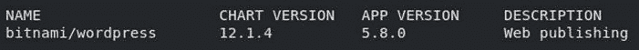

图 3.5 – helm search repo wordpress 命令的输出

在斜杠 (`/`) 前面的 `NAME` 字段中的值表示包含返回 Helm 图表的仓库名称。在写作时，`bitnami` 仓库中的最新版本 WordPress 图表为版本 `12.1.6`。这是将用于安装的版本。通过在 `search` 命令中传递 `--versions` 标志，可以查询以前的版本：

```
helm search repo wordpress --versions
```

然后你应该能看到每个可用 WordPress 图表的新行：

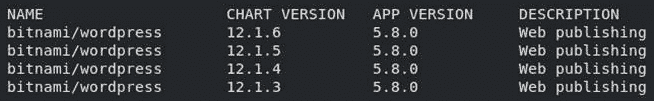

图 3.6 – bitnami 仓库中 WordPress 图表的版本列表

现在已经识别出 WordPress 图表并添加了该图表的仓库，我们将探索如何使用命令行进一步了解该图表，以便安装它。

## 显示命令行中的 WordPress 图表信息

您可以在 Helm 图表的 Artifact Hub 页面找到很多重要细节。一旦图表的仓库被本地添加，这些信息（以及更多）也可以通过以下四个 `helm show` 子命令从命令行查看：

+   显示图表的元数据（或图表定义）：

    ```
    helm show chart
    ```

+   显示图表的 README 文件：

    ```
    helm show readme
    ```

+   显示图表的值：

    ```
    helm show values
    ```

+   显示图表的定义、README 文件和值：

    ```
    helm show all
    ```

让我们使用这些命令与 Bitnami 的 WordPress 图表。在每个命令中，图表应该引用为 `bitnami/wordpress`。请注意，我们将传递 `--version` 标志来获取该图表版本 12.1.6 的信息。如果省略此标志，将返回图表最新版本的信息。

运行 `helm show chart` 命令以检索图表的元数据：

```
$ helm show chart bitnami/wordpress --version 12.1.6
```

此命令的结果将是 WordPress 图表的 **图表定义**。图表定义描述了诸如图表的版本、依赖项、关键词和维护者等信息：

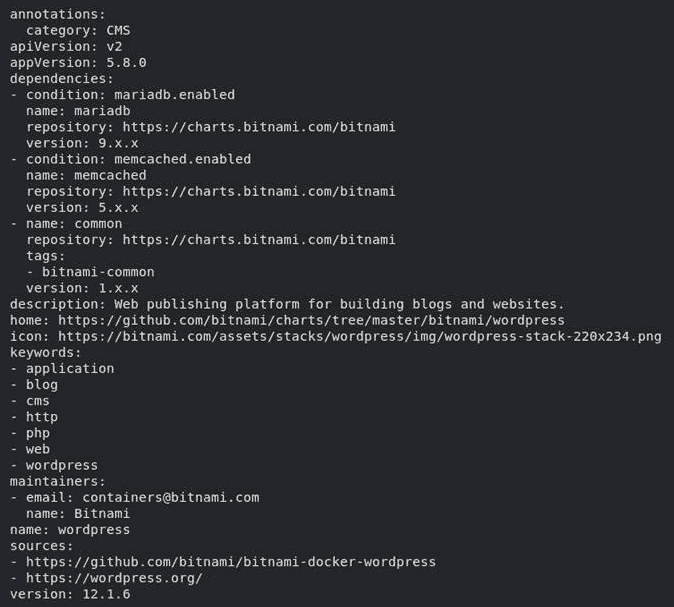

图 3.7 – WordPress 图表定义

运行 `helm show readme` 命令以从命令行查看图表的 README 文件：

```
$ helm show readme bitnami/wordpress --version 12.1.6
```

该命令的结果可能看起来很熟悉，因为图表的 README 文件也显示在其 Artifact Hub 页面上。从命令行使用此选项提供了一种快速查看 README 文件的方式，而无需打开浏览器：

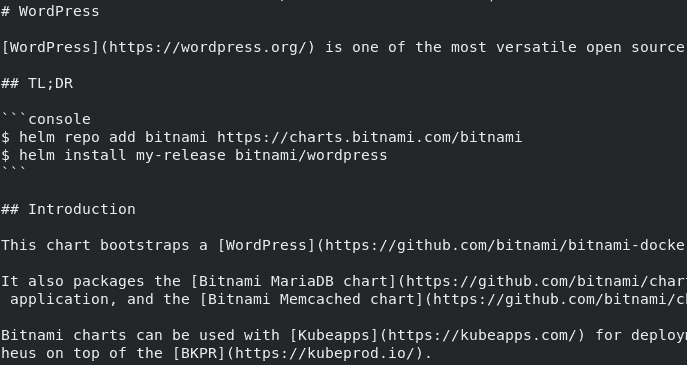

图 3.8 – 在命令行中显示的 WordPress 图表的 README 文件

我们可以使用 `helm show values` 来查看图表的值。值作为用户可提供的参数，用于自定义图表的安装。我们将在本章 *创建配置文件* 部分安装 WordPress 图表时运行此命令。

最后，`helm show all` 将之前三个命令的信息聚合在一起。如果您想一次性查看图表的所有详细信息，可以使用此命令。

现在我们已经找到并检查了一个 WordPress 图表，让我们设置一个 Kubernetes 环境，之后可以在其中安装该图表。

# 创建 Kubernetes 环境

为了在本章创建 Kubernetes 环境，我们将使用 minikube。我们已经在 *第二章*，*准备 Kubernetes 和 Helm 环境* 中学习了如何安装 minikube。

按照以下步骤设置 Kubernetes：

1.  通过运行以下命令启动 Kubernetes 集群：

    ```
    $ minikube start
    ```

1.  几分钟后，您应该会看到输出中类似以下内容的一行：

    ```
    Done! kubectl is now configured to use "minikube" cluster and "default" namespace by default
    ```

1.  一旦 minikube 集群启动并运行，创建一个专用的命名空间用于本章的练习。运行以下命令创建一个名为 `chapter3` 的命名空间：

    ```
    $ kubectl create namespace chapter3
    ```

现在集群设置完成，让我们开始将 WordPress 图表安装到 Kubernetes 集群中的过程。

# 安装 WordPress 图表

安装 Helm 图表是一个简单的过程，应该从检查图表的值开始。在接下来的部分，我们将检查 WordPress 图表中可用的值，并描述如何创建一个文件来定制安装过程。最后，我们将安装图表并访问 WordPress 应用程序。

## 为配置创建一个 values 文件

你可以通过提供一个 YAML 格式的 `values` 文件来覆盖图表中定义的值。要创建 `values` 文件，你需要检查图表所支持的值。这可以通过运行之前解释过的 `helm show values` 命令来完成。

运行以下命令检查 WordPress 图表的值：

```
$ helm show values bitnami/wordpress --version 12.1.6
```

这个命令的结果应该是一个包含你可以设置的各种可能值的长列表，其中许多值已经设置了默认值：

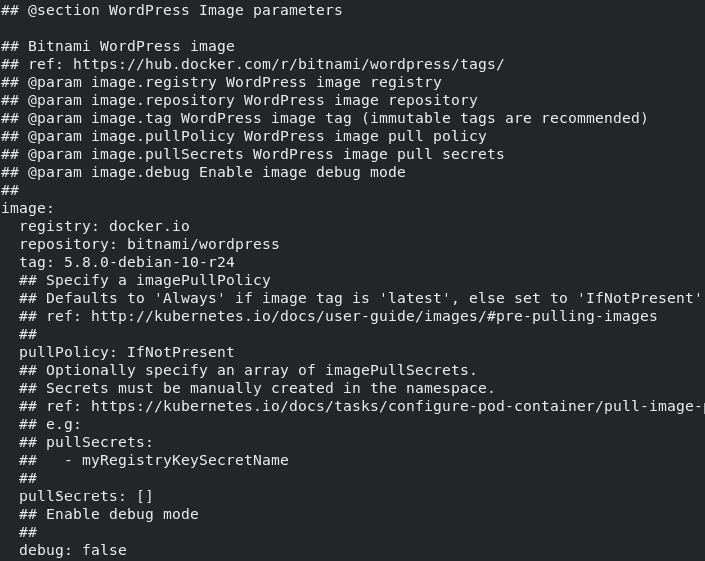

图 3.9 – 运行 helm show values 返回的值列表

上面的输出显示了部分 WordPress 图表的值。这些属性中的许多值已经设置了默认值，这意味着如果这些值没有被覆盖，它们将代表图表的配置。例如，如果 `image` 映射下的值没有被覆盖，WordPress 图表将使用来自 `docker.io` 注册表的 `bitnami/wordpress` 容器镜像，标签为 `5.8.0-debian-10-r24`。

图表中以井号（`#`）开头的行是注释。注释可以用来解释某个值或一组值，或者用于取消设置这些值。如前面的示例所示，注释用于记录与图像相关的每个值。

如果我们进一步探索 `helm show values` 输出，我们可以找到与配置 WordPress 博客的元数据相关的值：

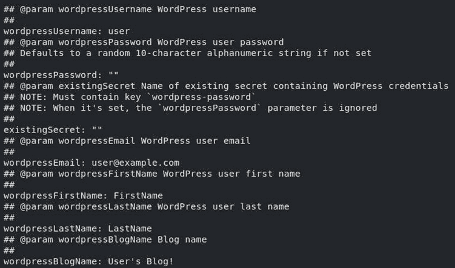

图 3.10 – 运行 helm show values 命令返回的值

如你所见，这些值用于创建一个 WordPress 用户并为你的博客命名。我们可以通过创建一个 `values` 文件来覆盖这些值。请在你的机器上创建一个名为 `wordpress-values.yaml` 的新文件。在该文件中输入以下内容：

```
wordpressUsername: helm-user
wordpressPassword: my-password
wordpressEmail: helm-user@example.com
wordpressFirstName: Helm_is
wordpressLastName: Fun
wordpressBlogName: Learn Helm!
```

如果你愿意，可以更加灵活地使用这些值。在继续查看 `helm show values` 的值列表时，有一个重要的值应该在开始安装之前添加到你的 `values` 文件中，如下所示：

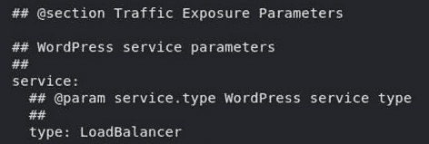

图 3.11 – 运行 helm show values 后返回的 LoadBalancer 值

为了简化安装，我们将更新此值（称为 `service.type`）为 `NodePort`。我们也可以将其保持为 `LoadBalancer`，但那样需要使用 `minikube tunnel` 命令才能访问该服务。将其设置为 `NodePort`，你将能够直接通过本地端口访问 WordPress。

将此值添加到你的 `wordpress-values.yaml` 文件中：

```
service:
  type: NodePort
```

一旦这个值被添加到 `values` 文件中，你完整的 `wordpress-values.yaml` 文件应如下所示：

```
wordpressUsername: helm-user
wordpressPassword: my-password
wordpressEmail: helm-user@example.com
wordpressFirstName: Helm_is
wordpressLastName: Fun
wordpressBlogName: Learn Helm!
service:
  type: NodePort
```

现在 `values` 文件已经完成，让我们开始安装。

## 运行安装

我们使用 `helm install` 来安装 Helm 图表。标准语法如下：

```
helm install [NAME] [CHART] [flags]
```

`NAME` 参数是你希望给 Helm 发布指定的名称。**发布** 捕获了使用图表安装的 Kubernetes 资源，并跟踪应用程序的生命周期。我们将在本章中探讨发布的工作原理。

`CHART` 参数是要安装的 Helm 图表的名称。可以使用 `<repo name>/<chart name>` 来安装仓库中的图表。

`helm install` 中的 `flags` 选项允许你进一步自定义安装。`flags` 允许用户定义和覆盖值，指定要操作的命名空间等。可以通过运行 `helm install --help` 查看所有可用的标志列表。我们还可以将 `--help` 参数传递给其他命令，以查看它们的用法和支持的选项。

现在我们已经正确理解了 `helm install` 的用法，让我们运行以下命令：

```
$ helm install wordpress bitnami/wordpress --values=wordpress-values.yaml --namespace chapter3 --version 12.1.6
```

此命令使用 `bitnami/wordpress` Helm 图表安装一个名为 `wordpress` 的新发布。它使用 `wordpress-values.yaml` 文件中定义的值来定制安装，并将图表安装到 `chapter3` 命名空间。安装的是图表的 `12.1.6` 版本，具体由 `--version` 标志定义。如果没有该标志，Helm 会安装 Helm 图表的最新缓存版本。

如果图表的安装成功，你应该会看到以下输出：

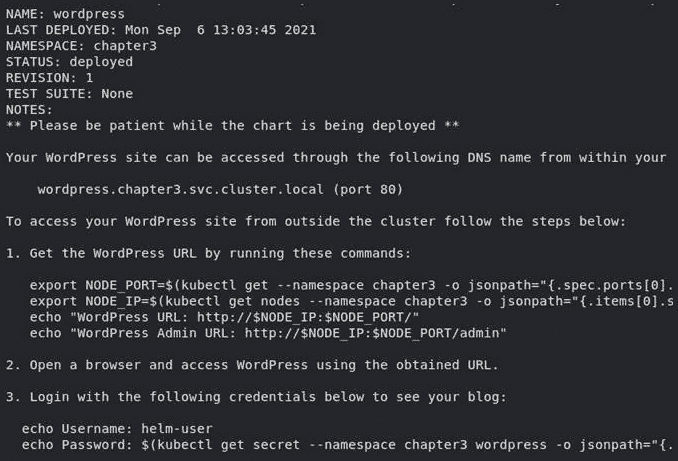

图 3.12 – 成功安装 WordPress 图表的输出

该输出显示了有关安装的信息，包括发布的名称、部署时间、安装的命名空间、部署状态（即 `deployed`）以及修订号（由于这是发布的初始安装，因此设置为 `1`）。

输出还会显示与安装相关的说明列表。说明用于向用户提供有关其安装的附加信息。对于 WordPress 图表，这些说明提供了如何访问 WordPress 应用程序的信息。虽然这些说明会在安装后直接显示，但你可以随时通过运行 `helm get notes` 命令来检索这些说明，具体方法将在下一节中说明。

完成第一次 Helm 安装后，让我们检查发布内容，观察所应用的资源和配置。

## 检查您的发布

检查发布并验证其安装的最简单方法之一是列出给定命名空间中的所有 Helm 发布。为此，Helm 提供了 `list` 子命令。

运行以下命令查看 `chapter3` 命名空间中的发布列表：

```
$ helm list --namespace chapter3
```

您应该只在此命名空间中看到一个发布，如下所示：

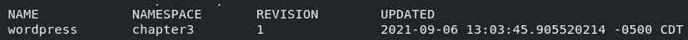

图 3.13 – helm list 命令的输出，列出了 Helm 发布

`list` 子命令提供以下信息：

+   发布名称

+   发布命名空间

+   发布的最新修订号

+   最新修订的时间戳

+   发布状态

+   图表名称

+   应用程序版本

请注意，前面的输出中，状态、图表名称和应用程序版本已被截断。

虽然 `list` 子命令对于提供高层次的发布信息很有用，但用户可能还想了解某个特定发布的其他项目。Helm 提供了 `get` 子命令以提供更多关于发布的信息。

以下命令可用于提供一组详细的发布信息：

+   若要返回命名发布的所有钩子，请运行以下命令：

    ```
    helm get hooks
    ```

+   若要返回命名发布的清单，请运行以下命令：

    ```
    helm get manifest
    ```

+   若要返回命名发布的注释，请运行以下命令：

    ```
    helm get notes
    ```

+   若要返回命名发布的值，请运行以下命令：

    ```
    helm get values
    ```

+   若要返回命名发布的所有信息，请运行以下命令：

    ```
    helm get all
    ```

上述命令列表中的第一个命令，`helm get hooks`，用于显示给定发布的钩子。钩子将在构建和测试 Helm 图表时在*第七章*中更详细地介绍，*Helm 生命周期钩子*。暂时可以将钩子理解为 Helm 在应用程序生命周期的某些阶段执行的操作。此 WordPress 安装未创建任何钩子，因此我们继续查看下一个命令。

`helm get manifest` 命令可用于获取作为安装一部分创建的 Kubernetes 资源列表。运行以下命令：

```
$ helm get manifest wordpress --namespace chapter3
```

执行此命令后，您将看到以下 Kubernetes 清单：

+   两个用于 MariaDB 和 WordPress 凭据的 `Secrets`

+   两个 `ConfigMaps`（第一个用于配置 WordPress 应用程序，第二个用于测试，由图表开发人员执行，可以忽略）。

+   一个用于持久化 MariaDB 数据的 `PersistentVolumeClaim`。

+   两个用于 MariaDB 和 WordPress 的 `Services`

+   一个用于 WordPress 的 `Deployment`

+   一个用于 MariaDB 的 `StatefulSet`

+   一个 MariaDB 用的 `ServiceAccount`

从此输出中，您可以观察到在配置 Kubernetes 资源时，您的值是如何产生影响的。一个值得注意的例子是 WordPress 服务中，`type`已设置为`NodePort`：

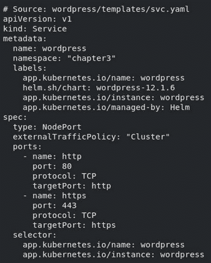

图 3.14 – 将服务类型设置为 NodePort

您还可以观察到我们为 WordPress 用户设置的其他值。这些值作为环境变量定义在 WordPress 部署中，如下截图所示：

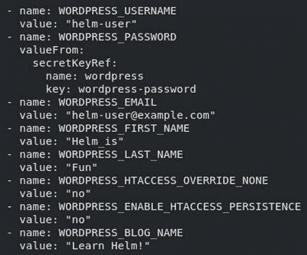

图 3.15 – 设置为环境变量的值

图表提供的其余默认值没有被更改。这些默认值已经应用于 Kubernetes 资源，并且可以通过`helm get manifest`命令查看。如果这些值被更改，Kubernetes 资源将会被不同地配置。

让我们继续执行下一个`get`命令。`helm get notes`命令用于显示 Helm 发布的注释。如您所记得，在安装 WordPress 图表时曾显示过发布说明。说明是特定于图表的，对于 WordPress 而言，提供了有关如何访问应用程序的重要信息，您可以再次通过运行以下命令来显示这些说明：

```
$ helm get notes wordpress --namespace chapter3
```

下一个命令是`helm get values`，它对于回顾给定发布所使用的值非常有用。运行以下命令以查看在`wordpress`发布中提供的值：

```
$ helm get values wordpress --namespace chapter3
```

该命令的结果应该很熟悉，因为它们应该与`wordpress-values.yaml`文件中指定的值匹配：

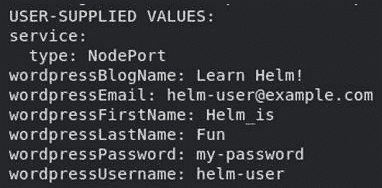

图 3.16 – WordPress 发布中的用户提供的值

虽然回顾用户提供的值很有用，但有时可能需要返回发布所使用的所有值，包括默认值。这可以通过传入额外的`--all`标志来完成，如以下命令所示：

```
$ helm get values wordpress --all --namespace chapter3
```

对于这个图表，输出将会非常长。前几个值显示在以下输出中：

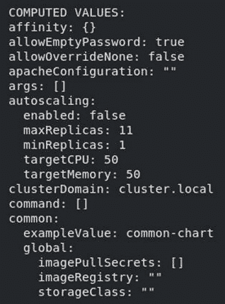

图 3.17 – WordPress 发布的所有值的子集

最后，Helm 提供了一个`helm get all`命令，可以用于汇总来自不同`helm get`命令的所有信息：

```
$ helm get all wordpress –n chapter3
```

在前面的命令中，我们偷偷地将`-n`标志替换了`--namespace`。从现在开始，我们将使用`-n`标志来提供 Helm 应该操作的命名空间。

除了 Helm 提供的命令外，`kubectl`命令行工具也可以用于更仔细地检查安装。例如，您可以通过运行以下命令来返回 Helm 创建的部署：

```
$ kubectl get deployments -l app.kubernetes.io/name=wordpress -n chapter3
```

您将会发现以下部署存在于`chapter3`命名空间中：

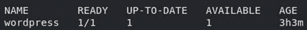

图 3.18 – Chapter3 命名空间中的 WordPress 部署

在上述命令中，我们通过使用 `-l app.kubernetes.io/name=wordpress` 参数来过滤部署。许多 Helm 图表会在它们创建的资源上添加 `app.kubernetes.io/name` 标签（或类似标签）。您可以使用这个标签来过滤资源，使用 `kubectl` 命令，只返回 Helm 创建的资源。

# 选择 `--set` 和 `--values` 之间的区别

当我们之前安装 WordPress 时，我们使用了 `--values` 标志将参数传递给 Helm 图表。然而，传递值有两种方式：

+   要显式地从命令行传递一个值，请使用以下命令：

    ```
    --set
    ```

+   要从 YAML 文件或 URL 中指定值，请使用以下命令：

    ```
    --values
    ```

在本书中，我们将 `--values` 标志视为配置图表值的首选方法。这样做的原因是，当值包含在 YAML 文件中时，配置多个值会更容易。维护一个 `values` 文件还可以简化将这些资源保存在 `Git` 中，从而使得安装可以轻松复现。然而，请注意，敏感值（如密码）绝不应存储在源代码控制仓库中。当需要提供机密值时，推荐的方法是使用 `--set` 标志，以防止它们被提交到源代码控制中。我们将在*第十二章*中详细讨论安全问题，*Helm 安全考虑*。

`--set` 标志用于直接从命令行传递值。这是处理简单值的可接受方法，适用于需要配置的值数量较少的情况。当需要输入复杂值，如列表和映射时，使用 `--set` 标志可能会比较困难，因此不推荐使用此方法。还有其他相关的标志，如 `--set-file` 和 `--set-string`。`--set-file` 标志用于传递包含已配置值的文件，文件格式为 `key1=val1` 和 `key2=val2`，而 `--set-string` 标志则用于将所有提供的值（格式为 `key1=val1` 和 `key2=val2`）设置为字符串。

现在，让我们来探索我们刚刚安装的 WordPress 应用程序。

# 访问 WordPress 应用程序

WordPress 图表的发布说明提供了四个命令，您可以运行这些命令来访问您的 WordPress 应用程序（您可以使用 `helm get notes wordpress -n chapter3` 查看完整的发布说明）。请按照发布说明中提供的四个命令运行：

+   对于 macOS 或 Linux，请运行以下命令：

    ```
    export NODE_PORT=$(kubectl get --namespace chapter3 -o jsonpath="{.spec.ports[0].nodePort}" services wordpress)
    export NODE_IP=$(kubectl get nodes --namespace chapter3 -o jsonpath="{.items[0].status.addresses[0].address}")
    echo "WordPress URL: http://$NODE_IP:$NODE_PORT/"
    echo "WordPress Admin URL: http://$NODE_IP:$NODE_PORT/admin"
    ```

+   对于 Windows PowerShell，请运行以下命令：

    ```
    $NODE_PORT = kubectl get --namespace chapter3 -o jsonpath="{.spec.ports[0].nodePort}" services wordpress | Out-String
    $NODE_IP = kubectl get nodes --namespace chapter3 -o jsonpath="{.items[0].status.addresses[0].address}" | Out-String
    echo "WordPress URL: http://$NODE_IP:$NODE_PORT/"
    echo "WordPress Admin URL: http://$NODE_IP:$NODE_PORT/admin"
    ```

在基于一系列`kubectl`查询定义了这两个环境变量后，生成的`echo`命令将显示访问 WordPress 的 URL。第一个 URL 是查看主页的地址，访客将通过此链接访问你的网站。第二个 URL 是进入管理员控制台的地址，网站管理员可以通过它配置和管理站点内容。

将第一个 URL 粘贴到浏览器中。你将看到类似以下内容的页面：

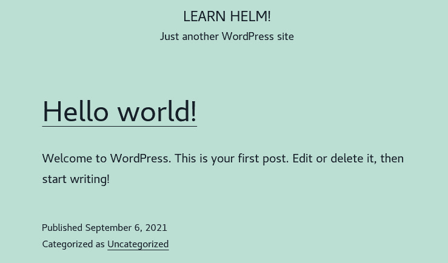

图 3.19 – WordPress 博客页面

这页面的几个部分可能对你来说很熟悉。首先，在屏幕顶部，博客的标题是安装时提供的`wordpressBlogName`值。你也可以在页面的左下角看到该值。

另一个影响主页自定义的值是`wordpressUsername`。如果你点击`helm-user`：

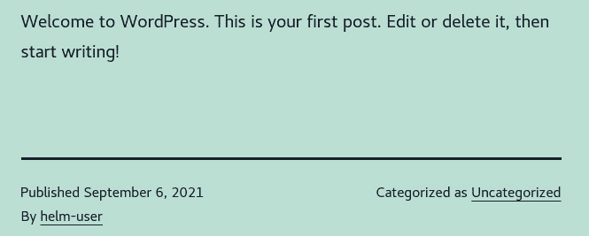

图 3.20 – “Hello world!” 帖子

如果你提供了不同的`wordpressUsername`值，那么这里的作者名称也会有所不同。

上一组命令提供的第二个链接用于访问管理员控制台。将第二个`echo`命令中的链接粘贴到浏览器中，你将看到以下登录页面：

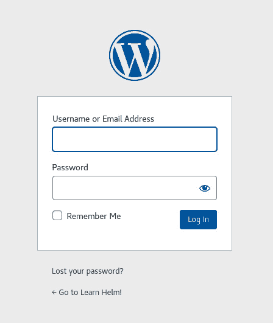

图 3.21 – WordPress 管理控制台登录页面

要登录管理员控制台，输入安装过程中提供的`wordpressUsername`和`wordpressPassword`值。如果你使用了我们之前指定的相同值，那么用户名将是`helm-user`，密码将是`my-password`。

一旦你完成身份验证，管理员控制台仪表板将显示，如下所示：

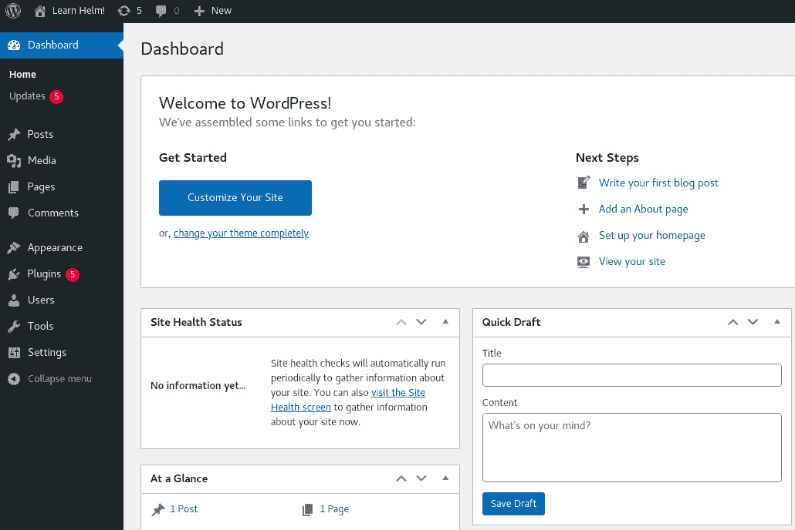

图 3.22 – WordPress 管理控制台页面

如果你是 WordPress 管理员，便可以在此配置你的网站、编写文章并管理插件。如果你点击右上角的链接，进入`helm-user`个人资料页面，你将看到在安装过程中提供的其他几个值，如下图所示：

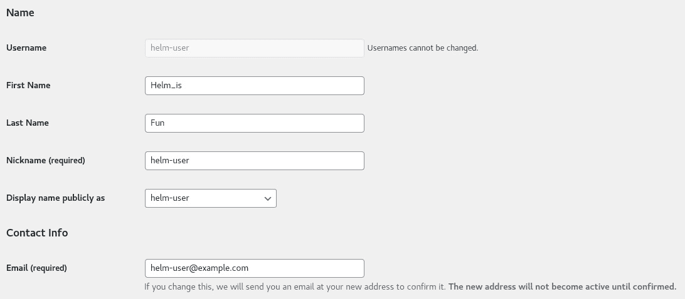

图 3.23 – WordPress 个人资料页面

`wordpressFirstname`、`wordpressLastname` 和 `wordpressEmail` 这些 Helm 值。

随时继续探索你的 WordPress 实例。完成后，继续下一节，了解如何升级 Helm 版本。

# 升级 WordPress 版本

升级版本是指修改版本的值或将图表更新到较新版本的过程。在本节中，我们将通过添加更多值来升级 WordPress 版本。

## 修改 Helm 值

在将应用程序部署到 Kubernetes 时，你通常希望运行多个副本以提供高可用性，并减少单个实例的负载。Helm charts 通常提供某种与副本相关的值，用于配置要部署的 Pod 副本数。快速浏览`helm show values bitnami/wordpress --version 12.1.6`命令的输出，你可以看到可以通过使用`replicaCount`值来增加 WordPress 的副本数：

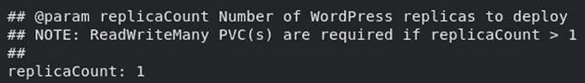

图 3.24 – helm show values 命令中的 replicaCount

将以下行添加到你的`wordpress-values.yaml`文件中，以将副本数从`1`增加到`2`：

```
replicaCount: 2
```

让我们再添加一个值来设置资源请求。在查看`helm show values`输出时，你可以看到此 chart 在其值集中提供了一个`resources`映射：

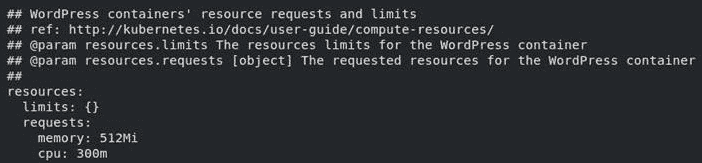

图 3.25 – 资源部分下的值

像`resources`这样的嵌套值是 YAML 映射（或对象），它们有助于提供属性的逻辑分组。在`resources`映射下是一个`requests`映射，用于配置 Kubernetes 将分配给 WordPress 应用程序的`memory`和`cpu`值。让我们修改这些值，将内存请求减少到`256Mi`（256 MiB）和 CPU 请求减少到`100m`（100 毫核）。将这些修改添加到`wordpress-values.yaml`文件中，如下所示：

```
resources:
  requests:
    memory: 256Mi
    cpu: 100m
```

在定义这两个新值后，你的整个`wordpress-values.yaml`文件将如下所示：

```
wordpressUsername: helm-user
wordpressPassword: my-password
wordpressEmail: helm-user@example.com
wordpressFirstName: Helm_is
wordpressLastName: Fun
wordpressBlogName: Learn Helm!
service:
  type: NodePort
replicaCount: 2
resources:
  requests:
    memory: 256Mi
    cpu: 100m
```

一旦`wordpress-values.yaml`文件更新了这些新值，你可以运行`helm upgrade`命令来升级发布，如我们将在下一节中讨论的那样。

## 运行升级

`helm upgrade`命令在基本语法上几乎与`helm install`命令相同，如下例所示：

```
helm upgrade [RELEASE] [CHART] [flags]
```

虽然`helm install`要求你提供一个新发布的名称，但`helm upgrade`要求你提供一个已经存在的发布名称进行升级。或者，你可以传递`--install`标志，如果你提供的发布名称不存在，它会指示 Helm 执行安装操作。

在`values`文件中定义的值可以通过`--values`标志提供，这与`helm install`命令相同。运行以下命令以使用新的值集升级 WordPress 发布：

```
$ helm upgrade wordpress bitnami/wordpress --values wordpress-values.yaml -n chapter3 --version 12.1.6
```

执行此命令后，你应该看到与`helm install`类似的输出。你还应该注意到`REVISION`字段现在显示为`2`：

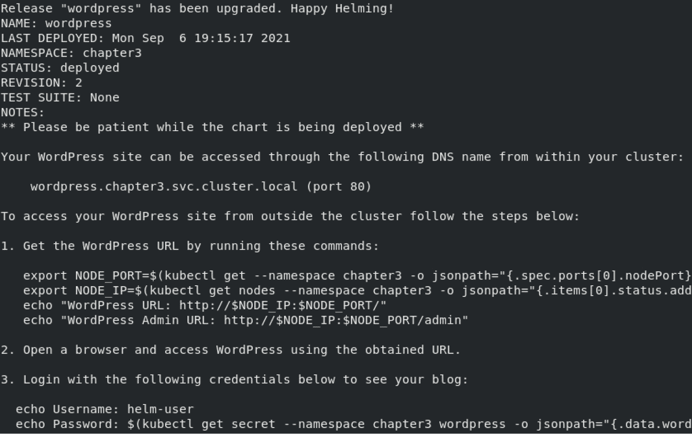

图 3.26 – helm upgrade 的输出

如果你运行以下命令，你还应该看到`wordpress` Pod 已经重启：

```
$ kubectl get pods -n chapter3
```

在 Kubernetes 中，当修改其 pod 模板时，会创建新的 pod。在 Helm 中也可以观察到相同的行为。升级过程中添加的值引入了对 WordPress pod 模板的配置更改。因此，新的 WordPress pods 被创建，并使用更新后的配置。可以使用本章前面提到的 `helm get manifest` 和 `kubectl get deployment` 命令来观察这些更改。

在接下来的章节中，我们将进行更多的升级操作，以演示在升级过程中值有时会有不同的表现。

## 在升级过程中重用和重置值

除了在 `helm install` 和 `helm upgrade` 中都存在的 `--set` 和 `--values` 参数，`helm upgrade` 命令还包括两个与值相关的附加标志。

现在我们来看看这些标志：

+   `--reuse-values`：在升级时，重用上次发布的值

+   `--reset-values`：在升级时，将值重置为 chart 的默认值

如果在升级时没有通过 `--set` 或 `--values` 标志提供值，则默认会应用 `--reuse-values` 标志。换句话说，如果没有提供任何值，将使用上次发布时的相同值进行升级。或者，如果通过 `--set` 或 `--values` 提供了至少一个值，则默认会应用 `--reset-values` 标志。让我们通过一个示例来演示：

1.  运行另一个不指定任何值的 `upgrade` 命令：

    ```
    $ helm upgrade wordpress bitnami/wordpress -n chapter3 --version 12.1.6
    ```

1.  运行 `helm get values` 命令检查升级中使用的值：

    ```
    $ helm get values wordpress -n chapter3
    ```

请注意，显示的值与上次升级时的值完全相同：

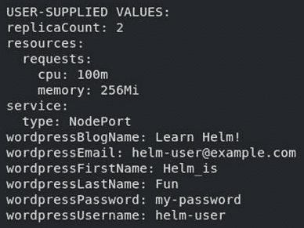

图 3.27 – helm 获取值命令的输出

在升级过程中提供值时，可以观察到不同的行为。如果通过 `--set` 或 `--values` 标志传递了值，则所有未提供的 chart 值将被重置为默认值。让我们来看一下实际操作。

1.  通过提供一个较小的值集来运行另一次升级，使用 `--set` 标志：

    ```
    $ helm upgrade wordpress bitnami/wordpress --set replicaCount=1 --set wordpressUsername=helm-user --set wordpressPassword=my-password -n chapter3 --version 12.1.6
    ```

1.  升级完成后，运行 `helm get values` 命令：

    ```
    $ helm get values wordpress -n chapter3
    ```

输出将声明你仅提供了三个值，而不是你最初在 `wordpress-values.yaml` 文件中声明的多个值：

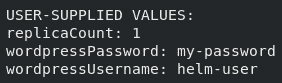

图 3.28 – 更新后的用户提供值

为了防止在升级过程中产生混淆，并简化值的管理方式，建议将所有值管理在一个 `values` 文件中。这提供了一种声明式的方法，并明确每次升级时将应用哪些值。

如果你一直在跟随本章提供的每个命令，你现在应该在你的环境中有四个 WordPress 发布的修订版。第四个修订版并不是我们希望应用程序配置的样子，因为大多数值已经被最近的升级重置为默认值。在下一节中，我们将探讨如何将 WordPress 发布回滚到包含所需值的稳定版本。

# 回滚 WordPress 发布

虽然前进通常是首选，但在某些情况下，返回到应用程序的先前版本更为合理。`helm rollback` 命令就是为了满足这个需求。让我们来描述如何将 WordPress 发布回滚到先前的状态。

## 检查 WordPress 历史

每个 Helm 发布都有一个历史记录（`HELM_DRIVER` 环境变量）。这使得不同的用户可以在 Kubernetes 集群中管理和交互 Helm 发布，前提是他们拥有包含修订版的适当 `Secrets`，可以使用 `kubectl` 从 `chapter3` 命名空间中获取它们：

```
$ kubectl get secrets -n chapter3
```

此命令将返回命名空间中的所有机密，但你应该在输出中看到这四个：

```
sh.helm.release.v1.wordpress.v1
Sh.helm.release.v1.wordpress.v2
sh.helm.release.v1.wordpress.v3
sh.helm.release.v1.wordpress.v4
```

每个 `Secrets` 都对应发布修订历史中的一个条目，可以通过运行 `helm history` 命令来查看：

```
$ helm history wordpress -n chapter3
```

此命令将显示每个修订版的表格，类似于以下内容（为了可读性，部分列已省略）：

| **修订版** | **状态** | **描述** |
| --- | --- | --- |
| 1 | 被取代 | 安装完成 |
| 2 | 被取代 | 升级完成 |
| 3 | 被取代 | 升级完成 |
| 4 | 已部署 | 升级完成 |

表 3.1 – 表格标题

在此输出中，每个修订版都有一个编号，以及更新时间、状态、图表名称、应用版本和描述。状态为 `superseded` 的修订版不再是最新的，而状态为 `deployed` 的修订版是当前已部署的版本。其他状态包括 `pending` 和 `pending_upgrade`，表示安装或升级正在进行中。`failed` 表示某个修订版安装或升级失败，`unknown` 表示遇到了一个 bug，可能需要提交问题或通知维护者。你不太可能遇到 `unknown` 状态的发布。

前面描述的 `helm get` 命令可以通过指定 `--revision` 标志来针对某个修订版进行使用。对于这次回滚，我们来确定哪个发布包含了完整的所需值。正如你可能记得的，当前的修订版 `修订版 4` 仅包含我们所需值的一个子集，但 `修订版 3` 应该包含所有我们需要的值。可以通过运行带有 `--revision` 标志的 `helm get values` 命令来验证这一点：

```
$ helm get values wordpress --revision 3 -n chapter3
```

可以通过检查此修订版来查看所有值的完整列表：

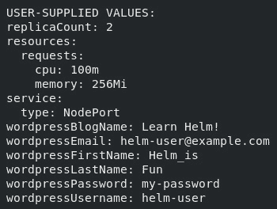

图 3.29 – 检查特定修订版的输出

可以针对修订号执行其他 `helm get` 命令，以进行进一步检查。如果需要，还可以针对 `revision 3` 执行 `helm get manifest` 命令，以查看将要恢复的 Kubernetes 资源的状态。

在下一节中，我们将执行回滚操作。

## 执行回滚

`helm rollback` 命令的语法如下：

```
helm rollback <RELEASE> [REVISION] [flags]
```

用户提供发布的名称和期望的修订版本号，以将 Helm 发布回滚到先前的时间点。执行以下命令，将 WordPress 回滚到 `revision 3`：

```
$ helm rollback wordpress 3 -n chapter3
```

`rollback` 子命令提供了简单的输出，打印出以下消息：

```
Rollback was a success! Happy Helming!
```

可以通过运行 `helm history` 命令，在发布历史中查看此回滚：

```
$ helm history wordpress -n chapter3
```

在发布历史中，你会注意到增加了第五个修订版本，状态为 `deployed`，描述为 `Rollback to 3`。当应用被回滚时，它会向发布历史中添加一个新的修订版本。请不要将其与升级混淆。最高修订版本号只是表示当前已部署的发布。务必检查修订版本的描述，以确定它是由升级还是回滚操作创建的。

你可以通过再次运行 `helm get values` 命令获取该发布的值，以确保回滚时使用的是期望的值：

```
$ helm get values wordpress -n chapter3
```

输出将显示最新稳定版本的值：

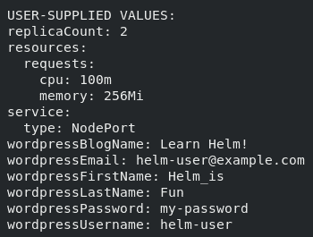

图 3.30 – 最新修订版的值

你可能会注意到，我们没有在 `rollback` 子命令中明确设置 chart 版本或发布的值。这是因为 `rollback` 子命令并不设计为接受这些输入。它是为了将 chart 回滚到先前的修订版，并利用该修订版的 chart 版本和值。请注意，`rollback` 子命令不应成为日常 Helm 操作的一部分，它应该仅限于紧急情况下使用，当应用的当前状态不稳定，需要回滚到先前稳定的状态时使用。

如果你成功地回滚了 WordPress 版本，那么你就接近本章练习的结束。最后一步是通过使用 `uninstall` 子命令从 Kubernetes 集群中移除 WordPress 应用，我们将在下一节中详细描述该步骤。

# 卸载 WordPress 发布

卸载 Helm 发布意味着删除它管理的 Kubernetes 资源。此外，`uninstall` 命令还会删除发布的历史记录。虽然这通常是我们想要的效果，但如果指定 `--keep-history` 标志，Helm 会保留发布的历史记录。

`uninstall` 命令的语法非常简单：

```
helm uninstall RELEASE_NAME [...] [flags]
```

通过运行 `helm uninstall` 命令卸载 WordPress 发布：

```
$ helm uninstall wordpress -n chapter3
```

一旦 WordPress 被卸载，你将看到以下消息：  

```
release "wordpress" uninstalled
```

你还会注意到，`wordpress` 发布版本在 `chapter3` 命名空间中不再存在：  

```
$ helm list -n chapter3
```

输出将是一个空表。你还可以通过尝试使用 `kubectl` 获取 WordPress 部署来确认发布版本不再存在：  

```
$ kubectl get deployments -l app.kubernetes.io/name=wordpress -n chapter3
No resources found in chapter3 namespace.
```

如预期的那样，已经没有可用的 WordPress 部署了。然而，仍然有一个 `PersistentVolumeClaim` 留下：  

```
$ kubectl get pvc -n chapter3
NAME                       STATUS   
data-wordpress-mariadb-0   Bound
```

`PersistentVolumeClaim` 没有被删除，因为它是由 MariaDB StatefulSet 在后台创建的。在 Kubernetes 中，StatefulSet 创建的 `PersistentVolumeClaim` 资源如果 StatefulSet 被删除，是不会自动删除的。在 `helm uninstall` 过程中，StatefulSet 被删除了，但相关的 `PersistentVolumeClaim` 并没有被删除，正如预期的那样。可以使用以下命令手动删除 `PersistentVolumeClaim`：  

```
$ kubectl delete pvc data-wordpress-mariadb-0 -n chapter3
```

现在我们已经完成了使用 Helm 安装、升级、回滚和卸载应用程序的示例，接下来让我们关闭 Kubernetes 环境。  

# 关闭你的环境  

首先，你可以通过运行以下命令来删除本章的命名空间：  

```
$ kubectl delete namespace chapter3
```

在删除 `chapter3` 命名空间后，停止 minikube 虚拟机：  

```
$ minikube stop
```

这将关闭虚拟机，但会保留其状态，以便你在下一个练习中可以迅速开始工作。  

# 总结  

本章中，你学会了如何安装 Helm chart 并管理其生命周期。我们从在 Artifact Hub 搜索并安装 WordPress chart 开始。在找到一个 chart 后，我们按照 Artifact Hub 页面上的说明将包含该 chart 的仓库添加到 Helm 中。接着，我们检查了 WordPress chart，创建了一组覆盖其默认值的值。这些值被保存在一个名为 `wordpress-values.yaml` 的 `values` 文件中，并在安装时提供。

在安装 chart 后，我们使用 `helm upgrade` 通过提供额外的值来升级发布版本。然后我们使用 `helm rollback` 执行回滚，将 chart 恢复到先前的状态。最后，在练习结束时，我们使用 `helm uninstall` 删除了 WordPress 发布版本。  

本章介绍了如何作为最终用户使用 Helm，以及如何使用已有的 Helm chart。在下一章，我们将更详细地探讨 Helm chart 的概念和结构，开始学习如何创建我们自己的 Helm charts。  

# 深入阅读  

若要了解更多关于本地添加仓库、检查 charts 和使用本章中提到的四个生命周期命令（`install`、`upgrade`、`rollback` 和 `uninstall`），请访问 `helm.sh/docs/intro/using_helm/`。  

# 问题  

1.  什么是 Artifact Hub？用户如何与其互动以查找 charts 和 chart 仓库？  

1.  `helm get` 和 `helm show` 命令有什么区别？  

1.  `helm install`和`helm upgrade`命令中的`--set`和`--values`参数有什么区别？使用其中一个相较于另一个有什么好处？

1.  可以使用什么命令来提供发布的版本列表？

1.  默认情况下，当你升级一个发布而没有提供任何值时会发生什么？当你为升级提供了值时，这种行为有何不同？

1.  假设你有五个版本的发布。将发布回滚到`revision 3`后，`helm history`命令会显示什么？

1.  假设你想查看部署到某个 Kubernetes 命名空间中的所有发布。你应该运行什么命令？

1.  假设你运行`helm repo add`来添加一个 chart 仓库。你可以运行什么命令来列出该仓库中的所有 charts？

# 第二部分：Helm Chart 开发

你已经从公共仓库部署了第一个 Helm chart。现在，是时候通过学习 Helm 模板和 Helm chart 结构，开发自己的 Helm chart 了。

在本部分，我们将涵盖以下主题：

+   *第四章**，搭建一个新的 Helm Chart*

+   *第五章**，Helm 依赖管理*

+   *第六章**，理解 Helm 模板*

+   *第七章**，Helm 生命周期钩子*

+   *第八章**，发布到 Helm Chart 仓库*

+   *第九章**，测试 Helm Charts*
