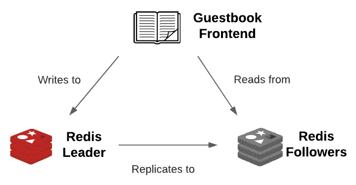

# 第四章：搭建一个新的 Helm Chart

在上一章中，你从最终用户的角度学习了如何使用 Helm，利用它作为包管理器将应用程序安装到 Kubernetes 中。以这种方式使用 Helm 需要你理解如何使用 Helm 生命周期命令（`install`、`upgrade`、`rollback` 和 `uninstall`），但并不需要你理解 Helm chart 本身是如何构建的。虽然理解 Helm CLI 命令对于安装和管理由 Helm 安装的应用程序是必要的，但仅凭这些知识并不足以让你将自己的应用程序打包成 Helm charts。

在本书的第二部分，从本章开始，我们将不再作为 Helm chart 的最终用户，而是转向成为 Helm chart 的开发者。我们将通过在接下来的几章中从零开始构建一个 Helm chart 来完成这一目标，部署一个 Guestbook 应用程序实例，这是 Kubernetes 社区中常用的示例应用程序。到第二部分结束时，你将理解编写稳健的 Helm charts 所需的概念和经验。

在本章中，我们将开始探索 Helm chart 开发，讨论以下主题：

+   理解 Guestbook 应用程序

+   理解 YAML 格式

+   使用 `helm create` 来搭建一个新的 Helm chart

+   部署搭建好的 Guestbook chart

+   探索 `Chart.yaml` 文件

+   更新 `Chart.yaml` 文件

# 技术要求

本节需要在本地机器上安装 `minikube` 和 `helm` 二进制文件。这些工具的安装和配置可以在 *第二章*，*准备 Kubernetes 和 Helm 环境* 中找到。

# 理解 Guestbook 应用程序

由于本书的第二部分将集中于开发 Helm chart 来部署 Guestbook 应用程序，首先让我们了解一下这个应用程序的功能以及它的架构。

Guestbook 应用程序是一个简单的 **PHP: 超文本预处理器**（**PHP**）前端，旨在将消息持久化到 Redis 后端。前端由一个对话框和一个 **提交** 按钮组成，如下图所示：


图 4.1 – Guestbook PHP 前端

要与该应用程序交互，用户可以按照以下步骤操作：

1.  在 **消息** 对话框中输入一条消息。

1.  点击 **提交** 按钮。

1.  当点击 **提交** 按钮时，消息将被保存到 Redis 数据库并显示在页面底部，如下图所示：


图 4.2 – 提交新消息后，Guestbook 前端界面

Redis 是一个内存中的键值数据存储，在我们的 Helm 图表中，它将被集群化以提供数据复制。该集群将由一个领导节点组成，Guestbook 前端将向该节点写入数据。数据持久化后，领导节点会在每个跟随节点之间进行复制，Guestbook 副本将从这些节点读取数据，以检索并显示之前提交的消息列表。

以下图示说明了前端与 Redis 的交互方式：



图 4.3 – Guestbook 前端与 Redis 的交互

在了解应用程序如何工作后，让我们专注于启动我们的 Guestbook Helm 图表。我们将从 YAML 格式的入门开始，因为作为 Helm 图表开发人员，你将与许多使用这种格式的文件交互。

# 理解 YAML 格式

**YAML 不是标记语言**（**YAML**）是一种用于创建人类可读配置的文件格式。它是配置 Kubernetes 资源时最常用的文件格式，也是 Helm 图表中许多文件使用的格式。

YAML 文件遵循**键值对**格式来声明配置。让我们来探讨一下 YAML 的键值构造。

## 定义键值对

一个最基本的 YAML 键值对示例如下所示：

```
name: LearnHelm
```

在前面的示例中，`name` 键被赋予了 `LearnHelm` 的值。在 YAML 中，键和值通过冒号（`:`）分隔。冒号左边的字符代表键，冒号右边的字符代表值。

在 YAML 格式中，空格非常重要。以下行不是一个有效的键值对：

```
name:LearnHelm
```

请注意，冒号和 `LearnHelm` 字符串之间缺少空格。这将导致解析错误。冒号和值之间必须有空格。

虽然前面的示例展示了一个简单的键值对，但 YAML 允许用户配置更复杂的配对，这些配对包含嵌套元素，称为映射。下面是一个示例：

```
resources:
  limits:
    cpu: 100m
    memory: 512Mi
```

上面的示例展示了一个包含两个键值对的 `resources` 对象：

| **键** | **值** |
| --- | --- |
| `resources.limits.cpu` | `100m` |
| `resources.limits.memory` | `512Mi` |

键是通过在 YAML 块中遵循缩进来确定的。每次缩进都会在键的名称中添加一个点（`.`）分隔符。当 YAML 块中不再有任何缩进时，即表示已经到达了键的值。根据常规做法，YAML 中的缩进应使用两个空格，但用户可以根据需要使用任意数量的空格，只要文档中的缩进一致即可。

重要提示

**制表符**在 YAML 中不受支持，使用它会导致解析错误。

了解了 YAML 键值对后，让我们现在来探索一下值可以定义为的常见类型。

## 值类型

YAML 文件中的值可以是不同类型的。最常见的类型是字符串，它是文本值。字符串可以通过将值用引号括起来来声明，但这并不总是必要的。如果一个值包含至少一个字母或特殊字符，那么这个值被认为是字符串，无论是否用引号括起来。多行字符串可以通过使用管道符号（`|`）来设置，如下所示：

```
configuration: |
  server.port=8443
  logging.file.path=/var/log
```

值也可以是整数。当一个值是数字字符并且没有用引号括起来时，它就是整数。以下 YAML 声明了一个整数值：

```
replicas: 1
```

将此与以下 YAML 进行比较，该 YAML 将 `replicas` 设置为字符串值：

```
replicas: "1"
```

布尔值也常常被使用，可以通过 `true` 或 `false` 来声明：

```
ingress:
  enable: true
```

这个 YAML 将 `ingress.enable` 设置为 `true` 布尔值。其他可接受的布尔值包括 `yes`、`no`、`on`、`off`、`y`、`n`、`Y` 和 `N`。

值也可以设置为更复杂的类型，例如列表。YAML 中列表的项通过破折号（`-`）符号来标识。

以下演示了一个 YAML 列表：

```
servicePorts:
  - 8080
  - 8443
```

这个 YAML 将 `servicePorts` 设置为整数列表（例如 `8080` 和 `8443`）。这种语法也可以用来描述一个对象列表：

```
deployment:
  env:
    - name: MY_VAR
      value: MY_VALUE
    - name: SERVICE_NAME
      value: MY_SERVICE
```

在这种情况下，`env` 设置为一个包含 `name` 和 `value` 字段的对象列表。列表在 Kubernetes 和 Helm 配置中经常使用，理解它们对于充分利用 Helm 非常有价值。

虽然 YAML 因其易于阅读在 Kubernetes 和 Helm 的世界中更为常见，但 **JavaScript 对象表示法**（**JSON**）格式也可以使用。让我们简要描述一下这个格式。

## JSON 格式

YAML 是另一种广泛使用格式——JSON 的超集。这是一串键值对，类似于 YAML。主要的区别是，YAML 依赖于空格和缩进来正确配置键值对，而 JSON 则依赖于大括号和方括号。

以下示例将之前的 YAML 示例转换为 JSON 格式：

```
{
  "deployment": {
    "env": [
      {
        "name": "MY_VAR",
        "value": "MY_VALUE"
      },
      {
        "name": "SERVICE_NAME",
        "value": "MY_SERVICE"
      }
    ]
  }
```

JSON 中的所有键都被引号括起来，并且位于冒号之前：

+   花括号（`{`）表示一个块，类似于 YAML 中缩进表示块的方式。

+   方括号（`[`）表示一个列表，类似于破折号在 YAML 中表示列表的方式。

YAML 和 JSON 格式有更多的构造，但这个介绍提供了足够的信息，帮助理解它们如何在 Helm 图表中使用。

在下一节中，我们将开始开发我们的 Guestbook Helm 图表，首先学习如何构建 Helm 图表。

# 构建 Guestbook Helm 图表

在从头开始开发一个新的 Helm 图表时，通常有用的是运行 `helm create` 命令，语法如下：

```
helm create NAME [flags]
```

`helm create` 命令为你的 Helm 图表提供一个新的项目文件夹。在这个文件夹中，包含了一个基本的 Helm 图表骨架，你可以用它开始开发你的图表。

让我们运行 `helm create` 命令来构建我们的 Guestbook Helm 图表：

1.  在终端中，进入您希望存储 Helm charts 的目录，然后运行 `helm create` 命令：

    ```
    $ helm create guestbook
    Creating guestbook
    ```

1.  查看已创建的文件列表：

    ```
    $ ls –al guestbook
    .
    ..
    charts/
    Chart.yaml
    .helmignore
    templates/
    values.yaml
    $ ls –l guestbook/templates/
    deployment.yaml
    _helpers.tpl
    hpa.yaml
    ingress.yaml
    NOTES.txt
    serviceaccount.yaml
    service.yaml
    tests/
    ```

如您所见，`helm create` 命令为您生成了一个名为 `guestbook` 的新文件夹，代表了 Helm chart 的名称。这个文件夹不一定非得叫做 `guestbook`，但由于这是我们要创建的 Helm chart 的名称，所以确保文件夹名称与之匹配是个好主意。

在 `guestbook` 文件夹下，有几个不同的文件和文件夹组成了您的 Helm chart。刚开始时可能会让人感觉有些复杂，但随着我们在接下来的章节中逐步开发 Guestbook chart，您会更深入地了解每个组件。到第二部分结束时，这些文件将变得更加清晰，您将能够轻松地开始下一个 Helm chart 的开发！

现在，让我们从高层次了解一下 `helm create` 为我们生成的每个文件。正如您将在下表中看到的那样，虽然一些文件在新建 Helm chart 时并不是严格要求的，但 `helm create` 为我们提供了它们作为最佳实践：

| **文件/目录** | **定义** | **是否必需？** |
| --- | --- | --- |
| `charts/` | 一个包含父 chart 所依赖的依赖项或 Helm charts 的目录。 | 否 |
| `Chart.yaml` | 包含 Helm chart 元数据的文件。 | 是的 |
| `.helmignore` | 包含应该从 Helm chart 打包中排除的文件和目录的文件。 | 否 |
| `templates/` | 一个包含 Golang 模板的目录，主要用于生成 Kubernetes 资源。 | 是的，除非 chart 包含依赖项 |
| `templates/*.yaml` | 用于生成 Kubernetes 资源的模板文件。 | 是的，除非 chart 包含依赖项 |
| `templates/_*.tpl` | 包含模板助手的文件。 | 否 |
| `templates/NOTES.txt` | 用于在 chart 安装后生成使用说明的模板文件。 | 否 |
| `templates/tests/（或更通用地，templates/*/）` | 用于分组不同模板的文件夹。这个目录纯粹是为了美观，不会影响 Helm chart 的运行方式——例如，`templates/tests` 用于分组用于测试的模板。 | 否 |
| `values.yaml` | 包含 chart 默认值的文件。 | 否，但每个 chart 应该包含此文件作为最佳实践 |

表 4.2 – 使用“helm create”命令创建的文件

除了前面表格中列出的文件外，Helm chart 还可以包含一些 `helm create` 没有为我们包含的其他文件。让我们在以下表格中高层次地了解这些文件：

| **文件/目录** | **定义** | **是否必需？** |
| --- | --- | --- |
| `Chart.lock` | 用于保存或 *锁定* 先前应用的依赖项版本的文件。 | 否 |
| `crds/` | 一个包含 `templates/` 的目录。 | 否 |
| `README.md` | 一个包含 Helm chart 安装和使用信息的文件。 | 不是，但每个 Helm chart 都应该包含这个文件作为最佳实践 |
| `LICENSE` | 一个包含 chart 许可证的文件，提供有关使用和再分发权的信息。 | 否 |
| `values.schema.json` | 一个包含 chart 值模式的 JSON 格式文件，用于提供输入验证。 | 否 |

表 4.3– 其他 Helm chart 文件

同样，我们将在本章及接下来的几章中，当这些文件变得与我们的讨论主题相关时，深入探讨每个文件的详细内容。

现在，让我们专注于`helm create`为我们生成的`guestbook`目录中的内容。你可能会感到惊讶的是，运行`helm create`后，你已经在`guestbook`文件夹中拥有一个完全可用的 Helm chart！让我们以当前状态安装 Guestbook chart，看看它部署了什么。

# 部署生成的 Guestbook chart

在安装 chart 之前，让我们按照以下步骤设置你的 Kubernetes 环境：

1.  通过运行`minikube start`命令启动 Minikube：

    ```
    $ minikube start
    ```

1.  创建一个名为`chapter4`的新命名空间：

    ```
    $ kubectl create namespace chapter4
    ```

现在，让我们继续安装你生成的 chart，并查看已部署的资源。在*第三章*，*使用 Helm 安装你的第一个应用*中，我们通过提供`bitnami/wordpress`这个名称安装了一个远程仓库中的 Helm chart，这个名称引用了远程仓库和其中包含的 chart。或者，你也可以通过提供一个有效的 Helm chart 项目文件夹的本地路径来安装一个 chart。这使得你可以轻松测试你的 Helm charts 并查看进展，而无需先将 chart 发布到仓库中。

1.  通过运行以下命令安装你的 chart，其中`./guestbook`表示由`helm create`生成的文件夹：

    ```
    $ helm install guestbook ./guestbook -n chapter4
    NAME: guestbook
    LAST DEPLOYED: Sun Sep 19 10:39:40 2021
    NAMESPACE: default
    STATUS: deployed
    REVISION: 1
    NOTES:
    1\. Get the application URL by running these commands:
      export POD_NAME=$(kubectl get pods --namespace default -l "app.kubernetes.io/name=guestbook,app.kubernetes.io/instance=guestbook" -o jsonpath="{.items[0].metadata.name}")
      export CONTAINER_PORT=$(kubectl get pod --namespace default $POD_NAME -o jsonpath="{.spec.containers[0].ports[0].containerPort}")
      echo "Visit http://127.0.0.1:8080 to use your application"
      kubectl --namespace default port-forward $POD_NAME 8080:$CONTAINER_PORT
    ```

1.  运行`helm get manifest`来查看已部署的资源：

    ```
    $ helm get manifest guestbook –n chapter4
    ```

如输出所示，你生成的 Guestbook chart（应用了默认值）包含一个服务账户、一个服务和一个部署。如果仔细查看部署，你会发现有关已部署的镜像有些有趣的地方：

```
image: "nginx:1.16.0"
```

确实，使用`helm create`生成的新的 Helm chart 从一个基本的 NGINX chart 开始。**NGINX**是一个流行的开源 Web 服务器和反向代理。由于它的安装需要许多与其他 Kubernetes 应用程序相同的资源，它是编写新 Helm charts 时的一个很好的起点。

继续访问 NGINX 应用程序，以验证它是否正确安装。

1.  由于 Helm chart 创建了一个`ClusterIP`服务，让我们运行`kubectl port-forward`，以便我们可以访问 NGINX pod。请记住，尽管我们的 Guestbook chart 已安装 NGINX，但部署的资源仍被称为`guestbook`，因为那是我们 chart 的名称：

    ```
    $ kubectl -n chapter4 port-forward svc/guestbook 8080:80
    ```

1.  在新的终端窗口中（因为当前窗口会在 `kubectl port-forward` 命令激活时阻塞），使用 `curl` 命令访问 NGINX：

    ```
    $ curl localhost:8080
    <!DOCTYPE html>
    <html>
    <head>
    <title>Welcome to nginx!</title>
    <style>
        body {
            width: 35em;
            margin: 0 auto;
            font-family: Tahoma, Verdana, Arial, sans-serif;
        }
    </style>
    </head>
    <body>
    <h1>Welcome to nginx!</h1>
    ```

如你所见，我们已经成功访问了 NGINX。现在，让我们继续清理这个 Helm 发布。

1.  在运行 `kubectl port-forward` 命令的终端窗口中，按 *Ctrl* + *c*。或者，你可以关闭窗口。

1.  卸载 `guestbook` Helm 发布：

    ```
    $ helm uninstall guestbook –n chapter4
    release "guestbook" uninstalled
    ```

1.  接下来，你可以删除 `chapter4` 命名空间，因为在本章余下部分我们不再需要它：

    ```
    $ kubectl delete namespace chapter4
    namespace "chapter4" deleted
    ```

1.  最后，你可以关闭你的 `minikube` 集群：

    ```
    $ minikube stop
    ```

你可能会在完成这项练习后发现，我们的 Guestbook 图表与本章开始时展示的架构并不完全相符。然而，通过提供一个我们将用作起点的框架，我们已经在为部署所需架构创建 Helm 图表的过程中迈出了重要一步。在下一章，我们将继续完善我们的 Guestbook 图表，并学习如何管理依赖关系。届时，我们将声明一个依赖关系来安装 Redis 以及 Guestbook 架构的后端。

在接下来的部分中，我们将深入探讨 Helm 图表中最重要的文件之一，`Chart.yaml`。然后，在本章末尾，我们将更新此文件，以提供与我们的 Guestbook 图表对齐的新设置。

# 理解 Chart.yaml 文件

`Chart.yaml` 文件，也称为**图表定义文件**，用于存储有关 Helm 图表的不同元数据。此文件是必需的，如果图表中没有包含它，你将收到以下错误：

```
Error: Chart.yaml file is missing
```

当你运行 `helm create` 时，系统会为你创建一个 `Chart.yaml` 文件。我们可以通过运行以下命令来查看此文件：

```
$ cat guestbook/Chart.yaml
```

将显示如下输出：


图 4.4 – Guestbook Chart.yaml 文件

一个 `Chart.yaml` 文件可以包含许多不同的字段，其中一些是必需的，而大多数其他字段是可选的。让我们仔细看看我们 Guestbook 图表的 `Chart.yaml` 文件中提供的每个字段。

| **字段** | **描述** | **是否必需** |
| --- | --- | --- |
| `apiVersion` | 图表的 API 版本 | 是 |
| `name` | Helm 图表的名称 | 是 |
| `description` | Helm 图表的简短描述 | 否 |
| `type` | Helm 图表的类型（可以是 `Application` 或 `Library`） | 否 |
| `version` | Helm 图表的版本，使用 SemVer 格式。 | 是 |
| `appVersion` | Helm 图表部署的应用程序版本。无需使用 SemVer 格式。 | 否 |

表 4.4 – 从生成的 Chart.yaml 文件中提取的字段

正如你从 Guestbook 的 chart 定义中看到的那样，我们的 chart 的 `apiVersion` 值设置为 `v2`。`apiVersion` 为 `v2` 的 chart 仅与 Helm 3 兼容。另一个可能的 `apiVersion` 值是 `v1`，但这是针对 Helm 2 的旧版本。`apiVersion` 为 `v1` 的 chart 在处理依赖项时方式不同，且不支持 library charts（我们将在本书后面更详细地讨论这些话题）。Helm 3 事实上与 `apiVersion v1` 向后兼容，但为了利用 Helm 的最新功能并避免弃用，新的 Helm chart 应使用 `apiVersion v2` 创建。

根据 `Chart.yaml` 文件，我们搭建的 Helm chart 类型是 `application` chart。Helm chart 可以是 `application` chart 或 `library` chart。`application` chart 用于将应用部署到 Kubernetes，而 `library` chart 用于提供可重用的帮助模板。我们将在*第六章*《理解 Helm 模板》中详细讨论 library charts。`Chart.yaml` 文件中的 `type` 字段是可选的，默认值为 `application`。

在我们的 chart 定义中，`name`、`description`、`version` 和 `appVersion` 字段用于提供标识我们 chart 的元数据。例如，回想一下在 *第三章*《用 Helm 安装你的第一个应用》中，我们从命令行使用 Artifact Hub 搜索 WordPress charts。我们运行了 `helm search hub wordpress` 命令，并看到了如下输出：


图 4.5 – 名称、版本、appVersion 和描述的示例

这些字段来自于 `Chart.yaml` 文件中的对应字段。请注意，你也可以在任何 chart 的 Artifact Hub 页面上查看这些信息。

除了我们搭建的 `Chart.yaml` 文件中包含的字段外，还有许多其他字段用于描述你的 chart，如下表所示：

| **字段** | **描述** | **是否必填？** |
| --- | --- | --- |
| `kubeVersion` | 兼容的 Kubernetes 版本范围，采用 SemVer 格式。 | 否 |
| `keywords` | 描述 Helm chart 的关键词列表。关键词也用于为 `helm search` 命令提供搜索词。 | 否 |
| `home` | Helm chart 的主页 URL。 | 否 |
| `sources` | 一个 URL 列表，指向 Helm chart 使用的源代码。 | 否 |
| `dependencies` | 列出你的 Helm chart 所依赖的其他 chart。 | 否 |
| `maintainers` | Helm chart 的维护者列表。 | 否 |
| `icon` | 用于表示 Helm chart 的图标，格式可以是 SVG 或 PNG。会在 chart 的 Artifact Hub 页面上显示。 | 否 |
| `deprecated` | 表示该 Helm chart 是否已被弃用。 | 否 |
| `annotations` | 用于提供自定义元数据的注释列表。 | 否 |

表 4.5 – 其他 Chart.yaml 字段

`kubeVersion` 字段用于针对目标 Kubernetes 集群版本提供验证。如果您的 Helm 图表使用的资源仅与某些 Kubernetes 版本兼容，则此字段非常有用。您可以将 `kubeVersion` 设置为诸如 `>= 1.18.0 < 1.20.0` 的字符串，Helm 将确保仅在 Kubernetes 版本大于或等于 `1.18.0` 且小于（排除）`1.20.0` 时安装该图表。您还可以使用 `OR`（`||`）运算符，例如 `>= 1.15.0 <= 1.17.0 || >= 1.18.0 < 1.20.0`。

`dependencies` 字段是这些可选字段中最实用的。在 `dependencies` 字段下添加的图表将与您的 Helm 图表资源一起安装。我们将在下一章中更详细地探讨依赖关系。

正如前面展示的 `name`、`version`、`appVersion` 和 `description` 字段一样，`Chart.yaml` 的每个其他属性也会影响 Helm 图表在 Artifact Hub 中的显示。查看以下截图，取自 Bitnami 的 WordPress 页在 Artifact Hub 中的展示：


图 4.6 – 在 Artifact Hub 上显示的 Chart.yaml 元数据

让我们将其与 WordPress 的 `Chart.yaml` 文件进行比较，通过运行 `helm show values bitnami/wordpress` 获取：


图 4.7 – Bitnami/WordPress 的 Chart.yaml 文件

注意 `Chart.yaml` 中的 `home`、`sources`、`maintainers`、`dependencies` 和 `keywords` 也在 Artifact Hub 中显示。

虽然不需要提供所有 `Chart.yaml` 字段的完整内容，但如果要将您的图表发布到 Artifact Hub 或其他可以显示图表元数据的存储库中，则这样做是件好事。否则，可以自行决定并提供您认为相关且必要的字段。除了 `apiVersion`、`name` 和 `version` 外，我们建议至少提供 `appVersion` 和 `description`，因为这些字段提供了应用程序的高级概览。如果您正在编写供公共使用的 Helm 图表，还应考虑添加 `maintainers`、`home` 和 `sources`，如果要发布到 Artifact Hub，则还应包括 `keywords`，以便轻松发现图表。

了解了 `Chart.yaml` 字段后，让我们通过更新我们的脚手架图表定义来更好地适应我们的 Guestbook 应用程序，来完成本章。

# 更新 Guestbook 的 Chart.yaml 文件

通过 `helm create` 生成的脚手架 `Chart.yaml` 文件围绕 NGINX 而不是我们期望的 Guestbook 进行了定制。让我们进行一些快速更改来改进内容：

1.  首先，让我们更新图表描述，以更好地描述我们的图表将部署的应用程序。将 `Chart.yaml` 的 `description` 字段更新为以下内容（或随意提供您自己的内容）：

    ```
    description: An application used for keeping a running record of guests
    ```

1.  接下来，让我们提供一个更合适的`appVersion`设置，以更好地适应我们的 chart 将要部署的 Guestbook 版本。Guestbook 的最新版本是`v5`，所以我们将这个版本作为我们的`appVersion`：

    ```
    appVersion: v5
    ```

我们的`Chart.yaml`文件现在应该像这样（去除了注释）：


图 4.8 – 更新后的 Guestbook Chart.yaml 文件

欢迎添加其他的`Chart.yaml`字段，但这些更改至少能让我们处于一个良好的状态，其中`Chart.yaml`元数据准确地反映了我们将要部署的应用程序。

我们将在下一章中重新审视`Chart.yaml`字段，当我们添加一个用于部署 Redis 的 chart 依赖时。

# 摘要

在这一章中，我们开始窥探 Helm chart 开发的世界，通过介绍 Helm chart 和 chart 定义结构。一个 Helm chart 由 chart 定义（一个`Chart.yaml`文件）和用于生成 Kubernetes 资源的模板文件组成。chart 定义用于为 chart 提供身份信息，包括元数据，如 chart 名称、版本、描述以及 chart 所部署的应用程序版本。

我们还介绍了一个名为 Guestbook 的应用程序，并开始编写一个 Helm chart，用于部署此应用程序。我们运行了`helm create`命令来生成一个新的 Helm chart，并更新了`Chart.yaml`文件，以更好地反映我们将要部署的应用程序。在下一章中，当我们为安装 Redis（我们的 Guestbook 前端依赖的后端服务）添加依赖项时，我们将再次回到`Chart.yaml`文件。

# 进一步阅读

要了解更多关于 Helm chart 结构和`Chart.yaml`文件的信息，请访问 Helm 文档：[`helm.sh/docs/topics/charts/`](https://helm.sh/docs/topics/charts/)。有关 Guestbook 应用程序的更多信息，请访问[`kubernetes.io/docs/tutorials/stateless-application/guestbook/`](https://kubernetes.io/docs/tutorials/stateless-application/guestbook/)。

# 问题

1.  Kubernetes 和 Helm 中最常用的文件格式是什么？

1.  用于生成新 Helm chart 的命令是什么？

1.  Helm chart 的名称和版本在哪里定义？

1.  `Chart.yaml`文件中需要的三个必填字段是什么？

1.  Helm charts 可以由许多不同的文件组成。哪些文件是必需的？

1.  哪个 Helm chart 文件夹用于包含 Kubernetes 资源模板？

1.  哪个`Chart.yaml`字段用于描述 Helm chart 所部署的应用程序版本？
