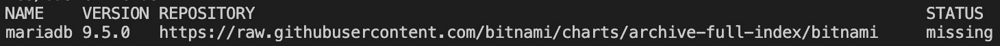
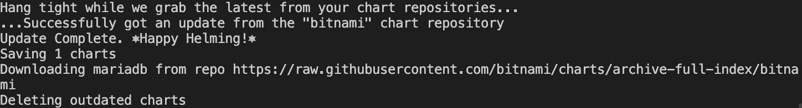
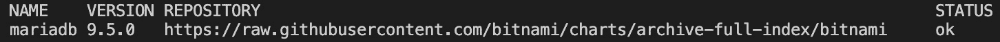
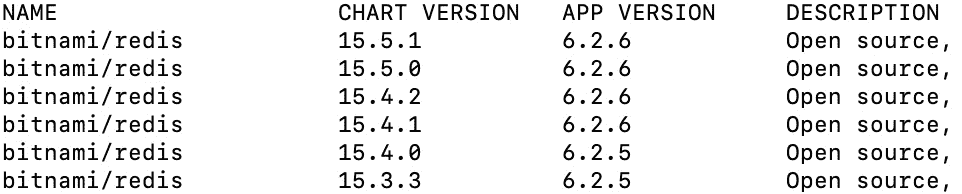

# 5

# Helm 依赖管理

正如您可能记得的，*第四章*，《搭建一个新的 Helm 图表》中，我们正在开发的 Helm 图表 `guestbook` 将部署两个主要组件。第一个是 Redis 后端，用于持久化消息列表。第二个组件是前端，用户在其中输入消息。在本章中，我们将重点更新 Helm 图表，部署第一个主要组件——Redis。

要部署 Redis，您可能会认为我们需要对现有的 `guestbook` 图表进行大量修改。然而，事实并非如此。Artifact Hub 上有许多 Redis Helm 图表，因此我们可以利用 Helm 的依赖管理功能，将其中一个图表声明为依赖项。然后，当 `guestbook` 图表安装到 Kubernetes 集群中时，依赖项也会被安装。通过将 Redis 声明为依赖项，我们可以减少为应用程序创建后端所需的工作量。

在本章中，我们将探讨 Helm 如何管理依赖项。然后，我们将利用所学的内容将 Redis 依赖项加入到我们的 Helm 图表中。

在本章中，我们将涵盖以下主题：

+   声明图表依赖项

+   依赖项映射

+   下载图表依赖项

+   条件依赖项

+   修改依赖项名称和值

+   更新 guestbook Helm 图表

+   清理工作

# 技术要求

本章需要以下工具：

+   `minikube`

+   `kubectl`

+   `helm`

+   `git`

我们将在本章中使用 minikube 来探索几个示例，现在是启动您的 minikube 环境的好时机：

```
$ minikube start
```

一旦 minikube 启动，请为本章创建一个新的命名空间：

```
$ kubectl create namespace chapter5
```

在本章中，我们将跟随几个示例，以更好地理解图表依赖项在实践中的工作原理。确保您克隆了示例仓库，以便跟随示例进行操作。克隆仓库时，请运行以下命令：

```
$ git clone https://github.com/PacktPublishing/Managing-Kubernetes-Resources-using-Helm.git
```

仓库克隆完成后，让我们继续到下一部分，开始学习 Helm 图表依赖项。

# 声明图表依赖项

图表依赖项用于安装另一个图表的资源，例如 Helm 图表（称为 `wordpress` 图表，用于安装 WordPress 应用实例和 MariaDB 后端）。您可能会惊讶地发现，安装的 MariaDB 数据库并不是一个本地的 WordPress 图表资源——它是一个依赖项！我们可以通过运行 `helm show chart` 命令来确认这一点，查看 `wordpress Chart.yaml` 文件中声明的依赖项：

```
$ helm show chart bitnami/wordpress --version 12.1.4
```

在输出中，您将看到如下的 `dependencies` 映射：

```
dependencies:
- condition: mariadb.enabled
  name: mariadb
  repository: https://raw.githubusercontent.com/bitnami/charts/archive-full-index/bitnami 
  version: 9.x.x
- condition: memcached.enabled
  name: memcached
  repository: https://raw.githubusercontent.com/bitnami/charts/archive-full-index/bitnami 
  version: 5.x.x
- name: common
  repository:  https://raw.githubusercontent.com/bitnami/charts/archive-full-index/bitnami
  tags:
  - bitnami-common
  version: 1.x.x
```

在这里，你可以看到`mariadb`是第一个列出的依赖项。第二个依赖项，`memcached`，是一个内存中的键/值对数据库，在我们部署 WordPress 时没有安装 *第三章* ，*使用 Helm 安装你的第一个应用*，因为它依赖于将`memcached.enabled`值设置为`true`（默认情况下该值为`false`）。第三个依赖项，`common`，是一个库图表。我们将在 *第六章* ，*理解 Helm 模板*中更详细地探讨库图表。

之前列出的 WordPress 依赖项是你可能在其他`Chart.yaml`文件中看到的例子。让我们来看一下所有可能的与依赖项相关的`Chart.yaml`字段，以理解如何声明图表依赖项。

# 依赖项映射

`Chart.yaml`中的`dependencies`映射支持许多不同的字段来声明依赖项并改变它们的行为。让我们来看一下这个映射中包含的字段：

| **字段** | **描述** | **是否必需** |
| --- | --- | --- |
| 名称 | 依赖项图表的名称 | 是 |
| 仓库 | 依赖项图表所在的位置 | 是 |
| 版本 | 图表依赖项的版本 | 是 |
| 条件 | 一个布尔值，决定是否包含该依赖项 | 否 |
| 标签 | 一个布尔值列表，用来决定图表是否应当被包含 | 否 |
| import-values | 源值到父级值的映射 | 否 |
| 别名 | 给依赖项指定的替代名称 | 否 |

表 5.1 – Chart.yaml 中的依赖项字段

`dependencies`映射中必需的最小字段是`name`、`repository`和`version`。我们可以看到这些字段在 WordPress 的`Chart.yaml`文件中被使用，其中第一个依赖项叫做`mariadb`，仓库是[`protect-eu.mimecast.com/s/ax_4C5lrwTkYXJhOWg2e?domain=raw.githubusercontent.com`](https://protect-eu.mimecast.com/s/ax_4C5lrwTkYXJhOWg2e?domain=raw.githubusercontent.com)，版本是`9.x.x`。我们将在*下载图表依赖项*一节中进一步了解这三个字段。

`condition`和`tags`字段用于根据特定值的设置有条件地包含依赖项。WordPress 图表的第一个依赖项`mariadb`将`condition`字段设置为`mariadb.enabled`，而其第三个依赖项（`common`）使用了一个名为`bitnami-common`的标签。我们将在*条件依赖项*一节中使用这些设置来探讨条件依赖项。

剩余的字段，`alias`和`import-values`，提供了操控依赖项图表值的方法。我们将在*更改依赖项名称和值*一节中进一步了解这些字段。

现在我们已经概述了与依赖项相关的每个字段，让我们学习如何下载在`Chart.yaml`中声明的依赖项。然后，我们将深入探讨如何使用每个字段，并涵盖多个示例场景。

# 正在下载图表依赖

可以使用以下表格中列出的`helm dependency`子命令查看并下载图表依赖：

| **命令** | **描述** |
| --- | --- |
| `helm dependency list` | 列出给定图表的依赖项。 |
| `helm dependency update` | 下载`Chart.yaml`中列出的依赖并生成`Chart.lock`文件。 |
| `helm dependency build` | 下载`Chart.lock`中列出的依赖。如果找不到`Chart.lock`文件，则此命令将模拟`helm dependency update`命令的行为。 |

让我们通过使用本书 GitHub 仓库中`chapter5/examples`文件夹中的示例 Helm 图表来探索这些命令；我们在本章开始时克隆了这些图表。我们将从使用`basic-fields`图表开始：

1.  使用位于`chapter5/examples/basic-fields`中的`basic-fields`图表，列出图表声明的依赖：

    ```
    $ helm dependency list chapter5/examples/basic-fields
    ```

你将看到类似于以下的输出：



图 5.1 – 示例 helm 依赖列表输出

`helm dependency list`命令用于快速查看图表声明的依赖及其下载状态。从前面的输出中，你可以看到`basic-fields`图表声明了一个依赖`mariadb`，并且其状态当前为`missing`。当状态标记为`missing`时，表示你还没有下载该依赖，因此图表无法安装。现在，让我们下载这个依赖。

1.  使用`helm dependency update`命令下载`basic-fields`图表的依赖：

    ```
    $ helm dependency update chapter5/examples/basic-fields
    ```

你将看到以下输出：



图 5.2 – helm dependency update 的输出

1.  运行`helm dependency list`命令确认依赖已下载。为了简洁，你可以使用`helm dep list`来运行此命令，因为`helm dep`是`helm dependency`的简写。为了清晰起见，本书将继续使用`helm dependency`，但你可以自由使用简写来减少输入工作。

回到手头的任务，让我们通过运行以下命令来确认下载是否成功：

```
$ helm dependency list chapter5/examples/basic-fields
```

你将看到与我们之前看到的输出类似，只不过状态已更新为`ok`：



图 5.3 – 更新后的 helm 依赖列表状态

当`helm dependency update`成功时，你将看到依赖的状态变为`ok`，并且你还会看到几个新文件出现在图表目录中。首先，你会看到依赖图表已下载到新创建的`charts/`文件夹下，并且你还会看到一个`Chart.lock`文件。

让我们来看一下这些新文件。

1.  使用`ls`命令查看已下载的依赖：

    ```
    $ ls chapter5/examples/basic-fields/charts
    mariadb-9.5.0.tgz
    ```

如你所见，依赖项以 `.tgz` 文件扩展名的 gzip 压缩包形式下载。文件名包含了依赖名称和其版本。

1.  使用 `cat` 命令查看生成的 `Chart.lock` 文件：

    ```
    $ cat chapter5/examples/basic-fields/Chart.lock
    ```

你将看到如下输出：


图 5.4 – 生成的 `Chart.lock` 文件

`Chart.lock` 文件是在运行 `helm dependency update` 时生成的，包含了一个依赖列表，类似于 `Chart.yaml` 文件。然而，与 `Chart.yaml` 不同，`Chart.lock` 文件用于锁定依赖版本，以确保在其他机器上可以下载到相同版本的依赖。

在 `basic-fields` chart 中，`Chart.lock` 的影响不大，因为 MariaDB 版本已经静态设置为 `9.5.0`。然而，看看位于 `chapter5/examples/wildcard-version` 下的 `wildcard-version` chart。在这个目录中，MariaDB 的版本被设置为 `9.x.x`，如下所示的代码片段：

```
dependencies:
  - name: mariadb
    repository: https://raw.githubusercontent.com/bitnami/charts/archive-full-index/bitnami 
    version: 9.x.x
```

版本 `9.x.x` 是一个通配符，它告诉 Helm 下载 9 主版本下的最新次版本和修补版本，假设采用 `major.minor.patch` 的语义化版本格式。如果版本指定为 9.5.x，Helm 将下载 9 主版本和 5 次版本下的最新修补版本。

让我们使用 `wildcard-version` chart 来理解通配符在 `Chart.lock` 文件中的重要作用。

1.  使用 `helm dependency update` 命令下载 `wildcard-version` chart 的依赖：

    ```
    $ helm dependency update chapter5/examples/wildcard-version
    ```

1.  查看生成的 `Chart.lock` 文件：

    ```
    $ cat chapter5/examples/wildcard-version/Chart.lock
    ```

请注意，`Chart.lock` 中的 MariaDB 版本 `9.8.1` 与 `Chart.yaml` 中的版本 `9.x.x` 不同：


图 5.5 – 使用通配符依赖版本时的 `Chart.lock` 文件

在这里，你可以更清楚地看到 `Chart.lock` 的影响。由于在 `Chart.yaml` 文件中指定了 9.x.x 版本，Helm 下载了最新的 9.x.x 版本，并生成了 `Chart.lock` 来锁定版本 9.8.1，这是在运行 `helm dependency update` 时的最新版本。然而，如果需要重新下载依赖项，或者需要重新生成 `charts/` 文件夹会发生什么呢？如果再次运行 `helm dependency update`，就有可能出现最新的 9.x.x 版本与 9.8.2 不同的情况，这可能导致兼容性问题。为了解决这一风险，你可以使用 `helm dependency build` 命令。让我们看看这个命令的实际效果：

1.  删除 `wildcard-version` 下的 `charts/` 目录：

    ```
    $ rm –rf chapter5/examples/wildcard-version/charts
    ```

1.  运行 `helm dependency build` 重新下载 `Chart.lock` 中指定的 MariaDB 版本：

    ```
    $ helm dependency build chapter5/examples/wildcard-version
    ```

1.  验证版本 9.8.1 是否已重新下载到 `charts/` 目录：

    ```
    $ ls chapter5/examples/wildcard-version/charts
    mariadb-9.8.1.tgz
    ```

在本节中，我们介绍了使用`helm dependency`子命令下载依赖项。然而，到目前为止，我们看到的例子总是导致依赖项被下载。有时，你可能需要根据用户输入有条件地包含或排除依赖项。我们将在下一节探讨这一概念。

# 创建条件

可以通过使用`dependencies`映射中的`condition`和`tags`字段来创建条件依赖项。`condition`字段用于列出`Boolean`值，如果这些值存在，将切换依赖项的包含。我们首先通过查看位于`chapter5/examples/condition-example`的`condition-example` chart 来探索这个字段：

1.  查看位于`chapter5/examples/condition-example/Chart.yaml`的`Chart.yaml`文件：

    ```
    $ cat chapter5/examples/condition-example/Chart.yaml
    <output omitted>
    dependencies:
      - name: mariadb
    repository: https://raw.githubusercontent.com/bitnami/charts/archive-full-index/bitnami 
        version: 9.5.0
        condition: mariadb.enabled
    ```

请注意，前面代码段中的`Chart.yaml`的最后一行使用了`condition: mariadb.enabled`设置。这个设置允许用户将一个名为`mariadb.enabled`的值设置为`true`或`false`。如果该值为`true`，MariaDB 依赖项将被包含。如果为`false`，则 MariaDB 将不会被包含。默认情况下，如果`mariadb.enabled`不存在，那么此条件将不起作用，MariaDB 将被包含。

设置条件的最佳实践是遵循`chartname.enabled`值格式，其中每个依赖项都有一个独特的条件，具体取决于依赖项的名称。这种方式可以实现更直观的值架构。然而，如果有必要，你可以通过使用逗号分隔的表达式来为一个条件指定多个值，如下所示：

```
condition: example.enabled, example2.enabled
```

当条件是一个以逗号分隔的列表时，如果第一个值存在，则使用第一个值，其余值将被忽略。否则，如果第一个值不存在，则会使用列表中的后续值作为后备。

让我们继续这个例子，看看`condition`属性的实际应用。

1.  查看`condition-example` chart 的`values.yaml`文件，该文件默认包含`mariadb.enabled`值：

    ```
    $ cat chapter5/examples/condition-example/values.yaml
    <output omitted>
    mariadb:
      enabled: true
    ```

如你所见，`mariadb.enabled`默认设置为`true`，因此我们可以预期在 Helm 的输出中看到 MariaDB 资源。让我们来验证这一点。

1.  使用`helm dependency update`命令下载`condition-example` chart 的依赖项：

    ```
    $ helm dependency update chapter5/examples/condition-example
    ```

1.  在你的 minikube 集群中安装`condition-example` chart：

    ```
    $ helm install conditional-example chapter5/examples/condition-example –n chapter5
    ```

1.  验证安装过程中是否创建了 MariaDB 相关资源：

    ```
    $ helm get manifest conditional-example –n chapter5 | grep mariadb
    ```

你应该看到一长串包含`mariadb`的字符串输出。

正如预期的那样，MariaDB 被安装了，因为`mariadb.enabled`值被设置为`true`。接下来，我们将这个值设置为`false`，并验证 MariaDB 是否已被排除。

1.  通过将`mariadb.enabled`设置为`false`来升级`conditional-example`发布：

    ```
    $ helm upgrade conditional-example chapter5/examples/condition-example --set mariadb.enabled=false –n chapter5
    ```

1.  升级后验证 MariaDB 相关资源是否已被排除：

    ```
    $ helm get manifest conditional-example –n chapter5 | grep mariadb
    ```

你不应该看到任何输出。

`condition` 设置是最常用的在 Helm 图表中有条件地包含依赖项的方式。然而，还有另一种设置可以使用，我们将在此展示，称为 `tags`。`condition` 最适用于使用 `chartname.enabled` 格式启用单个依赖项，而 `tags` 用于通过将每个依赖项与描述性标签关联，来启用或禁用一个或多个依赖项。

让我们使用位于 `chapter5/examples/tags-example` 的 `tags-example` 图表来了解标签如何定义条件依赖。

1.  查看位于 `chapter5/examples/tags-example/Chart.yaml` 的 `tags-example` 图表的 `Chart.yaml` 文件：

    ```
    <output omitted>
    dependencies:
      - name: mariadb
        repository: https://raw.githubusercontent.com/bitnami/charts/archive-full-index/bitnami 
        version: 9.5.0
        tags:
          - backend
          - database
      - name: memcached
        repository: https://raw.githubusercontent.com/bitnami/charts/archive-full-index/bitnami 
        version: 5.15.6
        tags:
          - backend
          - cache
    ```

如您所见，`tags-example` 图表定义了两个不同的依赖项：`mariadb` 和 `memcached`。`mariadb` 和 `memcached` 都共享 `backend` 标签，而 `mariadb` 还具有 `database` 标签；`memcached` 则单独具有 `cache` 标签。让我们通过查看图表的 `values.yaml` 文件来探索这些标签的使用。

1.  查看 `tags-example` 图表的 `values.yaml` 文件。注意文件末尾使用的 `tags` 映射：

    ```
    $ cat chapter5/examples/tags-example/values.yaml
    <output omitted>
    tags:
      backend: true
    ```

根据 `tags-example` 图表的值文件，您可以看到已启用后端标签。由于 `mariadb` 和 `memcached` 都共享相同的 `backend` 标签，因此这两个依赖项默认都启用（类似地，如果省略了 `tags` 映射，这两个依赖项也会被包含）。为了验证这一点，我们可以使用 `tags-example` 图表升级之前的 `conditional-example` 发布。

1.  使用 `helm upgrade` 命令通过 `tags-example` 图表中的内容升级 `conditional-example`：

    ```
    $ helm upgrade conditional-example chapter5/examples/tags-example –n chapter5
    ```

1.  验证 `mariadb` 和 `memcached` 是否都已安装：

    ```
    $ helm get manifest conditional-example –n chapter5 | grep mariadb
    $ helm get manifest conditional-example –n chapter5 | grep memcached
    ```

虽然这两个命令应该显示大量输出，但匹配项的存在表明这两个依赖项都已安装。

通过在多个依赖项中使用相同的标签，您可以方便地在图表中包含或排除依赖项。然而，假设您只想在 `tags-example` 图表中包含 `mariadb`。虽然直觉上可能认为只需将 `tags.database` 设置为 `true`，将 `tags.cache` 设置为 `false`，但这不会产生任何效果，因为 `tags.backend` 默认已设置为 `true`。如果某个标签为 `true`，即使其他标签设置为 `false`，该依赖项也会被包含。

为了解决此问题，您可以将 `tags.backend` 重写为 `false`。

1.  升级 `conditional-example` 发布，以便它包含 `mariadb` 并排除 `memcached`：

    ```
    $ helm upgrade conditional-example chapter5/examples/tags-example --set tags.backend=false --set tags.database=true –n chapter5
    ```

注意，我们首先传递了 `--set tags.backend=false`，以确保 `memcached` 的条件不会被评估为 `true`。

1.  验证升级过程中是否包含了 `mariadb`：

    ```
    $ helm get manifest conditional-example –n chapter5 | grep mariadb
    ```

该命令应返回大量输出。

1.  验证升级过程中是否排除了 `memcached`：

    ```
    $ helm get manifest conditional-example –n chapter5 | grep memcached
    ```

该命令不应返回任何输出。

`condition`和`tags`字段都提供了强大的选项集，用于在你的 Helm 图表中有条件地包含依赖项。请记住，你也可以将这两个选项一起使用，但`condition`始终会覆盖`tags`。这意味着，如果所有标签的评估结果为真，而任何条件评估结果为假，则条件将覆盖标签，依赖项将不会被包含。

在进入下一个话题之前，卸载`conditional-example`发布：

```
$ helm uninstall conditional-example –n chapter5
```

接下来，让我们讨论如何更改引用依赖项及其值的选项。

# 更改依赖项的名称和值

当你在图表中包含依赖项时，你很可能需要更改其一些值。更改依赖项值的一种方式是通过一个映射来覆盖这些值，映射的根名称与依赖项的名称相同。

例如，考虑位于`chapter5/examples/basic-fields`下的`basic-fields`图表。这个图表在`Chart.yaml`文件中包含一个依赖项：

```
dependencies:
  - name: mariadb
    repository: https://raw.githubusercontent.com/bitnami/charts/archive-full-index/bitnami 
    version: 9.5.0
```

要覆盖`mariadb`图表中的值，你可以采用类似以下的值结构：

```
mariadb:
  image:
    registry: my-registry.example.com
    repository: my-mariadb
    tag: my-tag
```

这将覆盖`mariadb`图表中的`image.registry`、`image.repository`和`image.tag`值。

让我们通过完成一个实际示例来尝试覆盖依赖项值：

1.  安装位于`chapter5/examples/basic-fields`的`basic-fields`图表。覆盖 MariaDB 的`image.tag`值，以便为`mariadb`镜像部署不同于默认的标签：

    ```
    $ helm install override-example chapter5/examples/basic-fields --set mariadb.image.tag=latest –n chapter5
    ```

1.  验证是否应用了`latest`标签：

    ```
    $ helm get manifest override-example –n chapter5 | grep latest
    image: docker.io/bitnami/mariadb:latest
    ```

1.  卸载 Helm 发布：

    ```
    $ helm uninstall override-example –n chapter5
    ```

以这种方式嵌套值是覆盖依赖项值最简单和最常见的方法。然而，`dependencies`映射提供了一个配置，用于更改根名称——`alias`。

让我们通过一个示例来了解如何使用`alias`。

查看位于`chapter5/examples/alias-example/Chart.yaml`的`alias-example`图表的`Chart.yaml`文件：

```
$ cat chapter5/examples/alias-example/Chart.yaml
<output omitted>
dependencies:
  - name: mariadb
repository: https://raw.githubusercontent.com/bitnami/charts/archive-full-index/bitnami 
    version: 9.5.0
    alias: db1
  - name: mariadb
repository: https://raw.githubusercontent.com/bitnami/charts/archive-full-index/bitnami 
    version: 9.5.0
    alias: db2
```

从前面的`Chart.yaml`片段中，你可以看到`alias-example`有两个几乎相同的 MariaDB 依赖项。这是使用`alias`的最佳场景。由于有多个 MariaDB 依赖项，Helm 需要能够区分它们。通过使用`alias`，你可以为每个相同的依赖项赋予一个唯一的名称。然后，你可以覆盖每个特定依赖项的值。让我们探索`alias`：

1.  通过覆盖每个 MariaDB 实例的`image.tag`值来安装 Helm 图表：

    ```
    $ helm install alias-example chapter5/examples/alias-example --set db1.image.tag=latest --set db2.image.tag=10.4 -n chapter5
    ```

1.  验证每个数据库的标签是否已应用：

    ```
    $ helm get manifest alias-example –n chapter5 | grep latest
    image: docker.io/bitnami/mariadb:latest
    $ helm get manifest alias-example –n chapter5 | grep 10.4
    image: docker.io/bitnami/mariadb:10.4
    ```

1.  卸载 Helm 发布：

    ```
    $ helm uninstall alias-example –n chapter5
    ```

一般来说，当你处理唯一的依赖项时，不需要使用`alias`。但是，当你处理同一依赖项的多个调用时，`alias`是管理和覆盖每次调用的值的绝佳方法。

除了 `alias` 外，`Chart.yaml` 文件中的 `dependencies` 映射还提供了一个额外的属性来改变依赖项值的管理方式——`import-values`。`import-values` 设置用于改变依赖值如何传播到父图表。它有两种不同的格式：`exports` 和 `child-parent`。`exports` 格式仅在依赖图表的值文件中包含 `exports` 映射时适用。假设一个依赖图表包含以下值：

```
exports:
  image:
    registry: my-registry
    repository: my-repository
    tag: my-tag
```

使用父图表上的 `import-values` 设置，你可以导入每个位于 `exports` 下的图像相关值：

```
dependencies:
  - name: dependency
    repository: http://localhost:8080
    version: 1.0.0
    import-values:
      - image
```

使用 `import-values` 以 `exports` 格式时，图像相关的值将被传播，如下所示：

```
registry: my-registry
repository: my-repository
tag: my-tag
```

将此与默认情况下这些依赖值的传播方式进行比较，`import-values` 未使用时的情况：

```
dependency:
  exports:
    image:
      registry: my-registry
      repository: my-repository
      tag: my-tag
```

如你所见，使用 `import-values` 使得传播变得更加简洁，减少了深层嵌套的值。

`import-values` 的另一种格式是 `child-parent` 格式。此格式不需要依赖图表（称为 `exports`），并且对于导入深层嵌套的值特别有用。考虑以下依赖图表，其中包含以下值：

```
common:
  deployment:
    image:
      registry: my-registry
      repository: my-repository
      tag: my-tag
```

在父图表中，你可以使用 `import-values` 的 `child-parent` 格式导入图像相关的值：

```
dependencies:
  - name: dependency
    repository: http://localhost:8080
    version: 1.0.0
    import-values:
      - child: common.deployment.image
        parent: image
```

这将传播依赖值，使得 `common.deployment.image` 下的每个值都直接映射到父图表中的 `image` 下：

```
image:
  registry: my-registry
  repository: my-repository
  tag: my-tag
```

再次通过使用 `import-values` 设置，你可以简化依赖值如何传播到父图表中的过程。

一个需要注意的重要细节是，当使用 `import-values` 时，你无法覆盖正在导入的值。如果需要覆盖来自依赖项的值，那么这些值不应该使用 `import-values` 导入。

现在我们已经探讨了涉及 Helm 依赖管理的不同设置，让我们通过将 Redis 依赖项更新到 `guestbook` 图表中，以创建后端来结束本章内容。

# 更新 guestbook Helm 图表

类似于我们在*第三章*《使用 Helm 安装你的第一个应用》中如何搜索 Artifact Hub 以定位 WordPress 图表，我们需要搜索一个 Redis 图表，以便将其作为依赖项使用。让我们来搜索 Redis 图表：

1.  执行以下命令从 Artifact Hub 搜索 Redis 图表：

    ```
    $ helm search hub redis
    ```

1.  显示的第一个图表是 Bitnami 的 Redis 图表。我们将使用这个图表作为我们的依赖项。如果你在*第三章*《使用 Helm 安装你的第一个应用》中没有添加 `bitnami` 图表库，现在可以通过使用 `helm repo add` 命令添加该图表库：

    ```
    $ helm repo add bitnami https://raw.githubusercontent.com/bitnami/charts/archive-full-index/bitnami
    ```

1.  接下来，确定你希望使用的 Redis 图表版本。可以通过运行以下命令找到版本号列表：

    ```
    $ helm search repo redis --versions
    ```

你将看到类似以下的输出：




图 5.6 – Redis 图表版本

对于我们的依赖项，我们使用通配符版本 `15.5.x`，这样我们可以锁定当前可用的最新补丁 `15.5.1`，同时也能方便地在未来下载更新的补丁版本。

让我们还使用 `condition` 属性，这样 Redis 就可以根据需要启用或禁用。虽然我们的 `guestbook` 图表确实需要 Redis，但 `condition` 会让用户禁用内置的 Redis 选项，以便在需要时使用自己的 Redis。

1.  更新你的 `guestbook` 图表的 `Chart.yaml` 文件以声明 Redis 依赖项。更新后的 `Chart.yaml` 文件可以在本书的 GitHub 仓库中的 `chapter5/guestbook/Chart.yaml` 找到，供参考：

    ```
    dependencies:
      - name: redis
        repository:  https://raw.githubusercontent.com/bitnami/charts/archive-full-index/bitnami
        version: 15.5.x
        condition: redis.enabled
    ```

你的完整 `Chart.yaml` 文件应如下所示：

```
apiVersion: v2
name: guestbook
description: An application used for keeping a running record of guests
type: application
version: 0.1.0
appVersion: v5
dependencies:
  - name: redis
    repository:  https://raw.githubusercontent.com/bitnami/charts/archive-full-index/bitnami
    version: 15.5.x
    condition: redis.enabled
```

更新了 `Chart.yaml` 文件后，使用 `helm dependency update` 下载 Redis 依赖项。现在，我们可以部署 `guestbook` 图表，以确保依赖项已正确安装。

1.  运行 `helm dependency update` 下载最新的 Redis `15.5.x` 版本：

    ```
    $ helm dependency update guestbook
    ```

1.  在你的 minikube 环境中安装 `guestbook` 图表：

    ```
    $ helm install guestbook guestbook -n chapter5
    ```

1.  验证 Redis StatefulSets 是否已创建：

    ```
    $ kubectl get statefulsets –n chapter5
    NAME                       READY   AGE
    guestbook-redis-master     1/1     3m24s
    guestbook-redis-replicas   3/3     3m24s
    ```

如果你看到类似于此处显示的 StatefulSets 输出，那么你已经成功创建了 Redis 依赖项！正如你所看到的，通过使用 Helm 的依赖管理，部署后端所需的工作量相对较低。在下一章中，我们将继续开发 `guestbook` 图表，编写用于创建前端资源的模板。

在我们结束之前，让我们清理 minikube 环境。

# 清理环境

首先，删除 `chapter5` 命名空间：

```
$ kubectl delete namespace chapter5
```

现在，你可以关闭你的 minikube 环境。

```
$ minikube stop
```

现在，让我们总结一下这一章。

# 小结

依赖项可以大大减少在 Kubernetes 中部署复杂应用所需的工作量。正如我们在 `guestbook` 图表中所看到的，要部署一个 Redis 后端，我们只需要在 `Chart.yaml` 文件中添加五行 YAML。相比之下，从头开始编写一个完全独立的 Redis 图表，将需要较高的 Kubernetes 和 Redis 专业知识。

Helm 依赖管理支持多种不同的配置来声明和配置依赖项。要声明依赖项，可以在 `Chart.yaml` 文件中的 `dependencies` 映射下指定图表的 `name`、`version` 和 `repository`。你可以使用 `condition` 和 `tags` 属性允许用户切换启用或禁用每个依赖项。在引入相同依赖项的多个实例时，可以使用 `alias` 为每个实例提供唯一标识符，处理具有复杂值的依赖项时，可以使用 `import-values` 简化值从依赖项传递到父图表的方式。要列出并下载依赖项，Helm 提供了一组 `helm dependency` 子命令，这些子命令在管理图表依赖项时会经常使用。

在下一章中，我们将深入探讨 Helm 图表开发领域中的下一个关键主题——模板。

# 进一步阅读

要了解更多关于 Helm 依赖管理的信息，请访问 Helm 文档中的*Chart Dependencies*部分，网址为[`helm.sh/docs/topics/charts/#chart-dependencies`](https://helm.sh/docs/topics/charts/#chart-dependencies)。

# 问题

回答以下问题，测试您对本章的知识掌握情况：

1.  声明图表依赖关系所用的文件是什么？

1.  `helm dependency update`和`helm dependency build`命令之间有什么区别？

1.  `Chart.yaml`和`Chart.lock`文件之间有什么区别？

1.  假设您希望允许用户在您的图表中启用或禁用依赖项，可以使用什么`dependencies`属性？

1.  如果您需要声明同一依赖项的多个调用，应该使用什么`dependencies`属性？

1.  如果您的依赖项具有复杂值，可以使用哪个`dependencies`属性来简化传播的值？

1.  如何覆盖依赖项的值？

1.  作为图表开发者，使用图表依赖项有什么价值？
