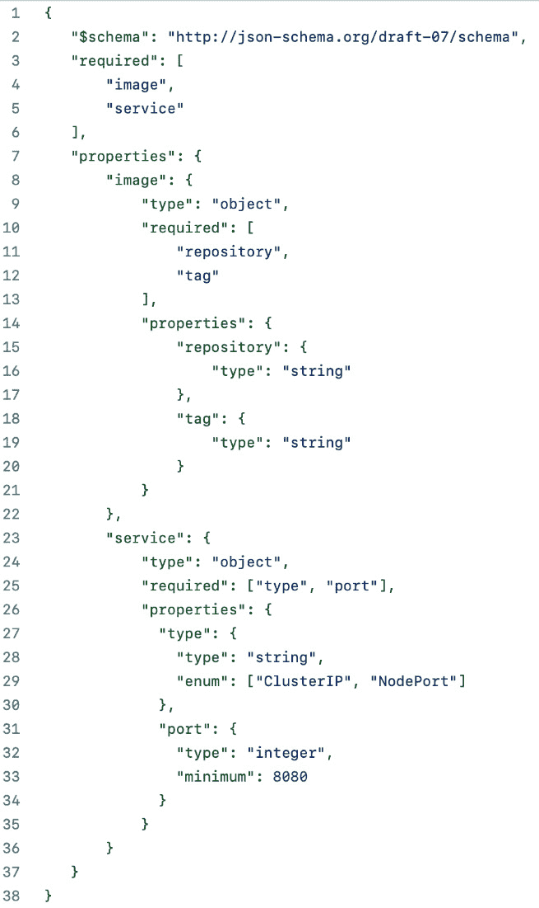
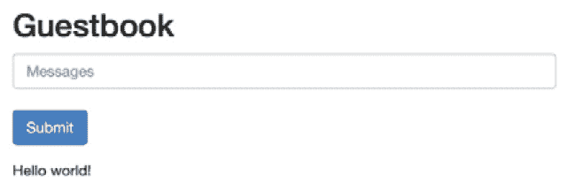

# 6

# 理解 Helm 模板

Helm 的一个基本功能是创建和维护构成应用程序的 Kubernetes 资源。Helm 通过一个名为 **模板** 的概念来实现这一点。模板代表 Helm Charts 的核心组件，因为它们用于根据给定的一组 **值** 配置 Kubernetes 资源。

在 *第四章*中，*搭建新的 Helm Chart*，你使用 `helm create` 命令搭建了一个新的 Helm Chart，并在 chart 的 `templates/` 文件夹下创建了基本模板。在本章中，我们将深入探讨 Helm 模板的世界，最后我们将回顾搭建的模板，进行改进并部署 Guestbook 前端。在本章结束时，你的 Helm Chart 将能够部署完整的 Guestbook 架构——从 *第五章* 中添加的 Redis 后端，到本章稍后将添加的前端。

以下是本章的主要内容：

+   Helm 模板基础

+   模板值

+   内置对象

+   Helm 模板函数

+   Helm 模板控制结构

+   生成发布说明

+   Helm 模板变量

+   Helm 模板验证

+   通过命名模板和库 chart 启用代码重用

+   创建 **自定义资源定义** (**CRDs**)

+   后渲染

+   更新并部署 Guestbook Chart

# 技术要求

本章需要以下工具：

+   minikube

+   kubectl

+   Helm

+   Git

我们将使用 minikube 在本章中探索多个示例，所以请随时通过运行以下命令启动你的 minikube 环境：

```
$ minikube start
```

一旦 minikube 启动完成，为本章创建一个新的命名空间，如下所示：

```
$ kubectl create namespace chapter6
```

如果你在前面的章节中尚未克隆示例 Git 仓库，请通过运行以下命令进行克隆：

```
$ git clone https://github.com/PacktPublishing/Managing-Kubernetes-Resources-using-Helm.git
```

现在你的环境已经设置好了，让我们来探索本章的第一个主题——Helm 模板。

# Helm 模板基础

Helm 模板用于动态生成 Kubernetes `helm create` 命令，生成一组启动模板。在之前克隆的 Git 仓库中，这些模板位于 `chapter6/guestbook/templates/`。以下是 `chapter6/guestbook/templates/deployment.yaml` 文件中 Helm 模板的一个简短片段：

```
apiVersion: apps/v1
kind: Deployment
metadata:
  name: {{ include "guestbook.fullname" . }}
  labels:
    {{- include "guestbook.labels" . | nindent 4 }}
spec:
  {{- if not .Values.autoscaling.enabled }}
  replicas: {{ .Values.replicaCount }}
  {{- end }}
  selector:
    matchLabels:
      {{- include "guestbook.selectorLabels" . | nindent 6 }}
  template:
    metadata:
      {{- with .Values.podAnnotations }}
      annotations:
        {{- toYaml . | nindent 8 }}
      {{- end }}
      labels:
        {{- include "guestbook.selectorLabels" . | nindent 8 }}
```

你可能会觉得前面的代码片段的语法有些奇怪，因为它类似于 YAML 文件，但包含了一些在 YAML 规范中无效的字符。要理解这种语法，我们首先需要谈谈**Go**。Go 是 Google 在 2009 年开发的一种编程语言。它是 Kubernetes、Helm 以及许多容器社区工具使用的编程语言。Go 编程语言的核心组件之一是**模板**，它们用于生成多种不同格式的文件。Helm 的模板引擎基于 Go 构建，可以看作是 Go 模板的超集。Go 模板提供了基本的语法和控制结构，而 Helm 添加了额外的功能，以增强模板引擎的能力。

Helm 模板包含各种不同的操作或字符串，它们以两个左花括号（ `{{` ）开始，并以两个右花括号（ `}}` ）结束。操作标记了数据处理发生的地方或控制结构（如条件语句和循环）被实现的位置。你可以在代码片段中以及 `templates/` 目录下的其他 Helm chart 模板中看到不同的操作。尽管操作出现在本地模板文件中，但它们在处理过程中会被处理并移除，例如在安装或升级过程中，以生成有效的 Kubernetes YAML 资源。

在 Helm chart 模板中，你可以利用许多不同的组件，如对象、函数和控制结构来编写操作。我们将在本章中探讨这些内容。让我们从讨论如何在 chart 模板中使用 `values` 组件开始。

# 模板值

在前几章中，我们将值描述为用于配置 Helm chart 的参数。现在，我们将理解值是如何集成到 chart 模板中的，从而动态生成 Kubernetes 资源。

这是来自 Git 仓库的基本 `ConfigMap` 模板，位于 `chapter6/examples/values-example/templates/configmap.yaml`：

```
apiVersion: v1
kind: ConfigMap
metadata:
  name: values-example
data:
  config.properties: |-
    chapterNumber={{ .Values.chapterNumber }}
    chapterName={{ .Values.chapterName }}
```

该模板的最后两行包含 `{{ .Values.chapterNumber }}` 和 `{{ .Values.chapterName }}` 操作，这些操作用作 `chapterNumber` 和 `chapterName` 值的占位符。这样，ConfigMap 就可以基于默认 chart 值和用户在安装或升级过程中提供的值进行参数化。

让我们来看一下位于 `chapter6/examples/values-example/values.yaml` 的默认 chart 值。你可以在这里看到这些内容：

```
chapterNumber: 6
chapterName: Understanding Helm Templates
```

给定这个 `Values` 文件，我们预计默认的 ConfigMap 会像这样渲染：

```
apiVersion: v1
kind: ConfigMap
metadata:
  name: values-example
data:
  config.properties: |-
    chapterNumber=6
    chapterName=Understanding Helm Templates
```

你可以通过运行 `helm install` 命令来自行验证这一点，正如我们在前几章中所演示的那样，但使用一个新的命令 `helm template` 可能更为方便，该命令用于本地渲染模板资源，而不是将它们安装到 Kubernetes 集群中。`helm template` 命令，如下所示，语法与 `helm install` 相同：

```
helm template <RELEASE_NAME> <CHART_NAME> [flags]
```

让我们使用此命令在本地渲染 `values-example` 图表模板。请按以下步骤操作：

1.  运行 `helm template` 命令，指向 `<CHART_NAME>` 参数为 `values-example` 文件夹，如下所示：

    ```
    $ helm template example chapter6/examples/values-example
    ```

1.  你应该看到配置图表按之前的方式渲染，其中的操作被 `chapterNumber` 和 `chapterName` 的值替换，示例如下代码片段所示：

    ```
    <skipped for brevity>
    data:
      config.properties: |-
        chapterNumber=6
        chapterName=Understanding Helm Templates
    ```

除非我们打算将资源安装到 minikube 环境中，否则我们将在本章中使用 `helm template` 命令快速演示模板构造。这样，你就不必担心每个练习后的清理工作。我们将在本章末尾安装更新版的 Guestbook Helm 图表时，返回使用 `helm install`。

如你在前面的示例中所看到的，每次使用占位符表示图表值时，模板都会引用一个名为 `.Values` 的构造。`.Values` 是你作为 Helm 图表开发者可以使用的几个内建对象之一。接下来我们将进一步探索这些内建对象。

# 内建对象

内建对象是你编写 Helm 图表时可以使用的基本构建块。如前所述，它们通过 `.Values` 对象提供对图表值的访问，但还有许多其他对象可供探索，它们提供对额外信息和功能的访问。

下表列出了这些内建对象：

| **对象** | **定义** |
| --- | --- |
| `.Values` | 用于访问 `values.yaml` 文件中的值或通过 `--values` 和 `--set` 标志提供的值 |
| `.Release` | 用于访问 Helm 发布的元数据，如名称、命名空间和修订号 |
| `.Chart` | 用于访问有关 Helm 图表的元数据，如其名称和版本 |
| `.Template` | 用于访问有关图表模板的元数据，如文件名和路径 |
| `.Capabilities` | 用于访问有关 Kubernetes 集群的信息 |
| `.Files` | 用于访问 Helm 图表目录中的任意文件 |
| `.` | 根对象 |

表 6.1 – 内建 Helm 对象

每个对象包含可以通过点表示法访问的字段和函数。点表示法用于访问对象的属性。例如，假设提供了以下 `Values` 文件：

```
books:
  harryPotter:
    - The Sorcerer's Stone
    - The Chamber of Secrets
    - The Prisoner of Azkaban
  lotr:
    - The Fellowship of the Ring
    - The Two Towers
    - Return of the King
```

`.Values` 对象现在将包含以下属性：

+   `.Values.books.harryPotter`（字符串列表）

+   `.Values.books.lotr`（字符串列表）

在 Helm（以及 Go 模板）中，点（`.`）也用于表示对象作用域。点表示全局作用域，从中可以访问所有对象。点后跟对象名称会限制该对象的作用域。例如，`.Values` 作用域限制了对图表值的可见性，而 `.Release` 作用域限制了对发布元数据的可见性。作用域在循环和控制结构中起着重要作用，接下来我们将在本章中详细探讨。

虽然 `.Values` 对象是你在 Helm chart 开发过程中最常用的对象，但还有其他一些内置对象我们将会讨论。接下来我们将从 `.Release` 对象开始。

## `.Release` 对象

`.Release` 对象用于检索关于正在安装的 Helm release 的元数据。从 `.Release` 对象中常用的两个属性是 `.Release.Name` 和 `.Release.Namespace`，它们允许 chart 开发者在 chart 模板中替换 release 的名称和命名空间。

请考虑以下示例模板，该模板位于 Git 仓库中的 `chapter6/examples/release-example/templates/configmap.yaml`：

```
apiVersion: v1
kind: ConfigMap
metadata:
  name: {{ .Release.Name }}
data:
  config.properties: |-
    namespace={{ .Release.Namespace }}
```

在模板中，我们将 ConfigMap 的名称设置为 Helm release 的名称，并将命名空间属性设置为 release 的命名空间。

在运行 Helm 的 `install`、`upgrade` 或 `template` 命令时，你可以看到 `{{ .Release.Name }}` 和 `{{ .Release.Namespace }}` 操作被替换为它们的实际值，如下代码片段所示：

```
$ helm template release-example chapter6/examples/release-example
---
# Source: release-example/templates/configmap.yaml
apiVersion: v1
kind: ConfigMap
metadata:
  name: release-example
data:
  config.properties: |-
    namespace=default
```

如你所见，ConfigMap 的名称被生成为 `release-example`，`namespace` 属性被生成为 `default`（如果我们使用 `-n` 标志选择了其他命名空间，则该值会被相应反映）。通过使用 `.Release` 对象，我们能够利用在调用 Helm 时提供的名称和命名空间，而不是在 `values.yaml` 中为名称和命名空间创建重复的值。

在 `.Release` 下，除了 `name` 和 `namespace` 之外，还有多个其他对象可以在你的 chart 模板中使用。下表列出了每个 `.Release` 对象，描述内容引用自 Helm 文档：[`helm.sh/docs/chart_template_guide/builtin_objects/#helm`](https://helm.sh/docs/chart_template_guide/builtin_objects/#helm)：

| **对象** | **描述** |
| --- | --- |
| `.Release.Name` | release 名称 |
| `.Release.Namespace` | 要发布到的命名空间 |
| `.Release.IsUpgrade` | 如果当前操作是升级或回滚，则设置为 `true` |
| `.Release.IsInstall` | 如果当前操作是安装，则设置为 `true` |
| `.Release.Revision` | 此 release 的修订号 |
| `.Release.Service` | 渲染模板的服务（这个值始终等于字符串 `"Helm"`） |

表 6.2 – `.Release` 对象

接下来我们将探索 `.Chart` 对象。

## `.Chart` 对象

`.Chart` 对象用于从正在安装的 Helm chart 的 `Chart.yaml` 文件中检索元数据。它通常用于为 chart 资源标注 chart 名称和版本。我们来看一下 Git 仓库中 `chapter6/examples/chart-example/templates/configmap.yaml` 的示例模板。你可以在这里查看：

```
apiVersion: v1
kind: ConfigMap
metadata:
  name: {{ .Release.Name }}
  labels:
    helm.sh/chart: {{ .Chart.Name }}-{{ .Chart.Version }}
    app.kubernetes.io/version: {{ .Chart.AppVersion }}
data:
  config.properties: |-
    chapterNumber={{ .Values.chapterNumber }}
    chapterName={{ .Values.chapterName }}
```

正如你在 `metadata.labels` 部分看到的，模板正在使用 `{{ .Chart.Name }}`、`{{ .Chart.Version }}` 和 `{{ .Chart.AppVersion }}` 动作，这些动作从 `Chart.yaml` 文件中检索 `name`、`version` 和 `appVersion` 字段。在这里，你可以看到这个示例图表的 `Chart.yaml` 文件：

```
apiVersion: v2
name: chart-example
description: A Helm chart for Kubernetes
type: application
version: 1.0.0
appVersion: 0.1.0
```

当我们使用 `helm template` 命令在本地渲染此模板时，我们看到来自 `Chart.yaml` 文件的字段被用在了 ConfigMap 资源中，如下所示：

```
$ helm template chart-example chapter6/examples/chart-example
---
# Source: chart-example/templates/configmap.yaml
apiVersion: v1
kind: ConfigMap
metadata:
  name: chart-example
  labels:
    helm.sh/chart: chart-example-1.0.0
    app.kubernetes.io/version: 0.1.0
data:
  config.properties: |-
    chapterNumber=6
    chapterName=Understanding Helm Templates
```

`.Chart` 对象可以引用 `Chart.yaml` 文件中的任何字段。有关 `Chart.yaml` 字段的完整列表，请参考 *第四章*，*创建新的 Helm 图表*。

## .Template 对象

`.Template` 对象用于检索当前正在渲染的模板的元数据。它是最简单的内置对象（除了 `.Values`），并且只有两个下级对象，如下所示：

+   `.Template.Name`—正在渲染的模板的文件路径（例如 `mychart/templates/mytemplate.yaml`）

+   `.Template.BasePath`—指向 `templates` 目录的路径（例如 `mychart/templates`）

根据我们的经验，`.Template` 对象很少使用，但如果您需要在图表中引用模板的文件路径，它会很有用。

## .Capabilities 对象

`.Capabilities` 对象用于获取关于目标 Kubernetes 集群的信息。`.Capabilities` 下有许多对象，但最常见的是 `.Capabilities.APIVersions.Has` 和 `.Capabilities.KubeVersion`。

`.Capabilities.APIVersions.Has` 对象是一个函数，根据 Kubernetes 集群是否具有给定的 **应用程序编程接口**（**API**）版本返回布尔值。以下是一个示例调用：

```
{{ .Capabilities.APIVersions.Has "batch/v1" }}
```

该操作将根据集群是否包含 "`batch/v1`” API 版本返回 `true` 或 `false`。`.Capabilities.APIVersions.Has` 最常用于条件逻辑中，只在集群包含特定 API 版本时才安装资源。条件逻辑将在本章后续的 *Helm 模板控制结构* 部分中介绍。

另一个常用的 `.Capabilities` 对象是 `.Capabilities.KubeVersion`。使用该属性可以检索 Kubernetes 集群的版本。例如，以下操作将返回一个 `v1.21.2` 字符串（或类似的字符串，具体取决于使用的 Kubernetes 版本）：

```
{{ .Capabilities.KubeVersion }}
```

其他 `.Capabilities` 对象，如 `.Capabilities.KubeVersion.Major` 和 `.Capabilities.KubeVersion.Minor`，允许图表开发人员仅获取 Kubernetes 集群的主版本或次版本（与整个 `.Capabilities` 相对，访问 Helm 文档 [`helm.sh/docs/chart_template_guide/builtin_objects/#helm`](https://helm.sh/docs/chart_template_guide/builtin_objects/#helm)）。

## .Files 对象

有时，你可能会遇到需要在图表模板中包含文件内容的情况。你可以使用 `.Files` 对象来包含文件内容。这主要用于 ConfigMap 和 Secret 资源，其中 `data` 部分由单独的配置文件提供或补充。请注意，文件必须位于 Helm 图表目录内（但在 `templates/` 文件夹外），才能通过 `.Files` 引用。

`.Files` 对象下包含了几个其他的对象。最基础的是 `.Files.Get`，这是一个函数，用于检索提供的文件名的内容。假设有如下的 ConfigMap 模板（此模板也位于 Git 仓库中的 `chapter6/examples/files-example/get` 目录下）：

```
apiVersion: v1
kind: ConfigMap
metadata:
  name: {{ .Release.Name }}
data:
  config.properties: |-
    {{ .Files.Get "files/config.properties" }}
```

示例中的 `.Files.Get` 函数用于获取 `files/config.properties` 文件的内容，这个路径是相对于 Helm 图表根目录的。该文件位于 Git 仓库中的 `chapter6/examples/files-example/get/files/config.properties`，其内容如下：

```
chapterNumber=6
```

现在，当我们渲染此模板时，我们将看到以下输出：

```
$ helm template basic-files-example chapter6/examples/files-example/get
---
# Source: files-example/templates/configmap.yaml
apiVersion: v1
kind: ConfigMap
metadata:
  name: basic-files-example
data:
  config.properties: |-
    chapterNumber=6
```

`.Files` 下有三个其他重要的对象：`.Files.Glob`、`.Files.AsConfig` 和 `.Files.AsSecret`。首先，`.Files.Glob` 是一个函数，返回与提供的 `*` 模式匹配的文件对象列表。例如，`files/*` 通配符将匹配 `files/` 文件夹下的每个文件。

`.Files.Glob` 对象通常与 `.Files.AsConfig` 和 `.Files.AsSecrets` 对象一起使用。`.Files.AsConfig` 是一个函数，用于将文件作为 YAML 字典返回，其中键是文件名，值是文件内容。它被称为 `AsConfig`，因为它在格式化不同的 ConfigMap 数据条目时非常有用。`.Files.AsSecrets` 函数类似，但除了将文件作为 YAML 映射返回，`AsSecrets` 还会对文件内容进行 Base64 编码——这对于创建 Kubernetes Secrets 数据非常有用。请记住，敏感文件绝不应该以明文形式被提交到 Git 仓库中（尽管我们在示例 Git 仓库中有一个这样的文件用于演示目的）。

以下模板展示了这些对象的用法，并且也位于 Git 仓库中的 `chapter6/examples/files-example/glob` 目录下：

```
---
apiVersion: v1
kind: ConfigMap
metadata:
  name: {{ .Release.Name }}
data:
{{ (.Files.Glob "files/chapter*").AsConfig | indent 2 }}
---
kind: Secret
<skipped for brevity>
Data:
{{ (.Files.Glob "files/secret*").AsSecrets | indent 2 }}
```

`files` 文件夹包含以下文件：

+   `chapter.properties`

+   `secret.properties`

当渲染此模板时，两个文件的内容会作为 YAML 映射生成在 ConfigMap 的 `data` 下，如以下代码片段所示：

```
$ helm template glob-example chapter6/examples/files-example/glob
---
# Source: files-example/templates/configmap.yaml
apiVersion: v1
kind: ConfigMap
metadata:
  name: glob-example
data:
  chapter.properties: |
    chapterNumber=6
    chapterName=Understanding Helm Templates
---
# Source: files-example/templates/secret.yaml
apiVersion: v1
kind: Secret
<skipped for brevity>
  secret.properties: dXNlcm5hbWU9bXl1c2VyMTIzCnBhc3N3b3JkPW15cGFzczEyMwo=
```

在前面的示例中，你可能注意到了 `| indent 2` 的使用。这代表着一个管道操作和一个函数，我们将在下一节中详细探讨，*Helm 模板函数*。现在，你只需关心输出会被缩进两个空格，以便生成格式正确的 ConfigMap 和 Secret 资源。

其他`.Files`对象包括`.Files.GetBytes`，它返回一个字节数组形式的文件，以及`.Files.Lines`，用于逐行遍历文件。

# Helm 模板函数

任何模板语言的一个常见特征是能够转换数据。到目前为止，当我们提到`.Values`或 Helm 中的其他内置对象时，我们只是引用了资源本身，并未进行任何数据处理。Helm 真正展现其强大之处的是其通过模板函数和管道在模板中执行复杂数据处理的能力。

由于 Helm 使用 Go 作为其模板语言的基础，它继承了 Go 提供的函数能力。Go 模板函数类似于你在其他编程语言中可能接触过的任何函数。函数包含逻辑，旨在消耗特定的输入并根据提供的输入提供输出。

使用 Go 模板时，函数使用以下语法：

```
functionName arg1 arg2 . .
```

在 Helm 图表中常用的一个函数是`quote`函数，它会将输入字符串用引号括起来。以下是来自 Git 存储库中`chapter6/examples/functions-example/templates/configmap.yaml`的 ConfigMap 示例：

```
apiVersion: v1
kind: ConfigMap
metadata:
  name: {{ .Release.Name }}
  labels:
    helm.sh/chart: {{ .Chart.Name }}-{{ .Chart.Version }}
    app.kubernetes.io/version: {{ .Chart.AppVersion }}
  annotations:
    {{- toYaml .Values.annotations | nindent 4 }}
data:
  path: {{ .Values.fs.path }}
  config.properties: |-
    {{- (.Files.Get "files/chapter-details.cfg") | nindent 4}}
```

上述 ConfigMap 中的`path`属性表示应用程序使用的文件系统位置，如以下代码片段所示。该属性引用的值位于`values.yaml`文件中：

```
fs:
  path: /var/props/../configs/my app/config.cfg
```

渲染后的模板如下所示（为了简洁，省略了一些字段）：

```
...
data:
  path: /var/props/../configs/my app/config.cfg
...
```

如果消费应用程序未包含适当的逻辑来管理输入中是否可能存在空格，那么可能会导致潜在的下游问题。

为了避免这些潜在问题，添加`quote`函数，它会将属性用引号括起来，如以下代码片段所示：

```
apiVersion: v1
kind: ConfigMap
metadata:
  name: {{ .Release.Name }}
  labels:
    helm.sh/chart: {{ .Chart.Name }}-{{ .Chart.Version }}
    app.kubernetes.io/version: {{ .Chart.AppVersion }}
  annotations:
    {{- toYaml .Values.annotations | nindent 4 }}
data:
  path: {{ quote .Values.fs.path }}
...
```

使用`helm template`命令在本地渲染图表以查看其功能，方法如下：

```
$ helm template functions-example chapter6/examples/functions-example
```

模板渲染后的结果是`/var/props/../configs/my app/config.cfg`字符串，这不仅增强了属性的可读性，还保护了任何使用该属性的应用程序。

`quote`是 Helm 中超过 60 个函数之一。虽然一些函数来自 Go 模板，但大多数函数是`Sprig`模板库的一部分。`Sprig`库包含用于在图表中实现更复杂功能的函数，如执行数学公式、转换操作以及管理数据结构，包括列表和字典。

从 Go 和 Sprig 继承的函数可以在 Go 文档中找到，链接为[`pkg.go.dev/text/template#hdr-Functions`](https://pkg.go.dev/text/template#hdr-Functions)，在 Sprig 模板库中也可以找到，链接为[`masterminds.github.io/sprig/`](http://masterminds.github.io/sprig/)。

Helm 中最近添加的一个功能是通过使用`lookup`函数从正在运行的 Kubernetes 环境中查询资源。Helm chart 开发人员可以引用单个资源或跨命名空间或集群的指定类型的引用，并将结果注入到他们的模板中。

`lookup`函数的形式如下：

```
lookup <apiVersion> <kind> <namespace> <name>
```

例如，要查询`chapter6`命名空间中的名为`props`的 ConfigMap，请使用以下函数：

```
lookup "v1" "ConfigMap" "chapter6" "props"
```

`lookup`函数的结果是一个字典，可以根据需要进一步导航，以检索返回资源上的单个属性。

所以，要提取一个名为`author`的 ConfigMap 中的属性，该属性包含所有 WordPress 文章的默认作者姓名，可以在 Helm 模板中添加以下代码：

```
{{ (lookup "v1" "ConfigMap" "chapter6" "props").data.author }}
```

如你所见，我们首先检索包含`props` ConfigMap 的值的字典，然后导航到 ConfigMap 数据结构中的`author`属性。

使用`lookup`函数时，你不仅限于查询单个资源，还可以在单一命名空间内或所有命名空间内搜索所有给定类型的资源。这可以通过将命名空间和/或资源名称替换为空引号来实现，如下模板所示：

```
lookup "v1" "ConfigMap" "chapter6" ""
```

使用`lookup`函数时的一个重要注意事项是，它仅在资源被部署到 Kubernetes 集群时才能使用，例如通过`helm install`和`helm upgrade`命令。这是因为执行过程中需要与 Kubernetes 集群保持活动连接。对于像`helm template`这样的命令，模板是在本地渲染的，并且没有与 Kubernetes 集群的交互，因此`lookup`函数不会返回任何有意义的结果。

Helm 函数及其对 Helm 模板命令的影响只是向 chart 模板中添加更多动态机制的第一步。多个模板命令也可以通过使用**管道**（pipelines）连接在一起，执行一系列复杂的操作。

管道是一个借用自 Unix 的概念，其中一个命令的结果作为另一个命令的输入。你可以在以下代码片段中看到这个概念的示例：

```
cat file.txt | grep helm
```

命令通过管道（`|`）字符分隔（因此得名*管道*），在这种情况下，`file.txt`文件的内容作为输入提供给`grep`命令。`grep`处理输入，过滤掉输入中任何`helm`的出现，并将其作为输出打印到屏幕上。

管道可以以类似的方式应用于 Helm。让我们回到之前的示例，我们介绍了 `quote` 函数来为文件系统路径添加引号。与其直接将 `value` 属性作为函数参数，不如反过来将值的内容通过管道传入 `quote` 函数，如下所示：

```
{{ .Values.fs.path | quote }}
```

无论是直接调用函数还是使用管道方法，最终结果是相同的。然而，在实际应用中，你会发现，管道通常是首选的方式，因为它具有扩展性，可以连锁模板命令。

你可能还注意到，`fs.path` 值中包括对相对路径（由 `..` 表示）的引用。如果某些人不熟悉语法，这可能会让他们感到难以阅读或理解。幸运的是，Sprig 库中包含了一个名为 `clean` 的函数，可以完全解析路径并自动去除任何相对路径。可以将此函数添加到现有管道中，如下所示：

```
{{ .Values.fs.path | clean | quote }}
```

在 Git 仓库中的 `functions-example` Helm chart 的 ConfigMap 中，应用之前的更改，然后使用 `helm template` 命令查看更改后的效果。实例化后，渲染的模板将如下所示：

```
"/var/configs/my app/config.cfg"
```

函数和管道在 Helm 中被广泛使用，作为一个 chart 开发者，了解可用选项非常重要，这样才能有效地设计 charts。让我们花点时间来看一些更常用的函数。

如我们所见，`Values` 文件包含一个键/值对的字典。虽然可以引用单个的键/值对，但在许多情况下，可能需要注入一个深度嵌套的结构。幸运的是，有几个 Helm 函数可以在这种情况下提供帮助。

正如你记得的那样，YAML 语言对内容的缩进和间距非常讲究。为了应对这一点，Helm 提供了 `toYaml` 函数，它允许提供一个值的字典，并根据需要正确地格式化它，无论它嵌套得多深。在我们这一节中一直在使用的 ConfigMap 中，你可以看到一个从 `Values` 文件中定义的属性中注入的注解字典，以下代码片段展示了这一点：

```
apiVersion: v1
kind: ConfigMap
metadata:
  name: {{ .Release.Name }}
  labels:
    helm.sh/chart: {{ .Chart.Name }}-{{ .Chart.Version }}
    app.kubernetes.io/version: {{ .Chart.AppVersion }}
  annotations:
    {{- toYaml .Values.annotations | nindent 4 }}
data:
…
```

以下内容在 chart 的 `values.yaml` 文件中定义：

```
annotations:
  publisher: "Packt Publishing"
  title: "Managing Kubernetes Resources Using Helm"
```

你可能还会注意到，`toYaml` 函数的结果被传递到另一个名为 `nindent` 的函数中。使用该函数是管理内容格式化的必要要求；否则会发生渲染错误。`indent` 和 `nindent` 都提供通过缩进一定数量的空格来格式化内容的功能，这在处理 YAML 时至关重要。`indent` 和 `nindent` 的区别在于，`nindent` 在每行输入后会添加一个换行符，这在我们的使用场景中是必需的，因为 `Values` 文件中定义了多个注解属性。

使用 `helm template` 命令处理图表，查看这些值如何被渲染，如下所示：

```
$ helm template functions-example chapter6/examples/functions-example
apiVersion: v1
kind: ConfigMap
metadata:
  name: functions-example
  labels:
    helm.sh/chart: functions-example-0.1.0
    app.kubernetes.io/version: 1.16.0
  annotations:
    publisher: Packt Publishing
    title: Managing Kubernetes Resources Using Helm
```

我们将详细讨论的最后一个 Helm 函数用于执行更复杂的模板渲染。在本章前面，你已经了解了如何在图表中引用外部文件，并使用内置的 `.Files` 对象将它们的值注入模板。虽然 Helm 的模板功能可以用于评估模板文件中的资源，但也有需要对外部源文件进行评估的情况。请再次查看 ConfigMap，并注意 `config.properties` 键：

```
  config.properties: |-
    {{- (.Files.Get "files/chapter-details.cfg") | nindent 4}}
```

值并非直接包含在 ConfigMap 中，而是来自位于 `files/chapter-details.cfg` 的文件，如下代码片段所示：

```
chapterNumber={{ .Values.book.chapterNumber }}
chapterName={{ .Values.book.chapterName }}
```

然而，当使用 `helm template` 渲染图表时，期望的值并未如预期替换，正如我们在这里所见：

```
  config.properties: |-
    chapterNumber={{ .Values.book.chapterNumber }}
    chapterName={{ .Values.book.chapterName }}
```

这种情况发生是因为模板处理默认只在 `templates` 文件夹中的文件内进行，而不会处理任何外部源的内容。要将模板应用于引入模板的外部源，可以使用 `tpl` 函数，如下所示：

```
...
  config.properties: |-
    {{-  tpl (.Files.Get "files/chapter-details.cfg") . | nindent 4}}
```

当你查看更新后的 ConfigMap 内容时，可能会对管道前的句点（`.`）感到疑惑。这个字符表示将传递给模板引擎的作用域。我们将在下一节中详细介绍这个话题。

使用 `helm template` 命令确认由于包含了 `tpl` 函数，值被适当地替换，如下所示：

```
$ helm template functions-example chapter6/examples/functions-example
...
  config.properties: |-
    chapterNumber=6
    chapterName=Understanding Helm Templates
```

本节讨论的模板函数仅仅是 Helm 提供的函数的冰山一角。下表列出了一些图表开发人员应该了解的其他重要函数，以便充分利用 Helm 的功能：

| **函数** | **描述** | **示例** |
| --- | --- | --- |
| `printf` | 根据格式字符串和参数返回一个字符串 | `printf "一只名叫 %s 的猫有 %d 条命。" $name $numLives` |
| `default` | 如果 `$value` 的内容为 `nil` 或为空，则赋值为字符串 “placeholder” | `default "placeholder" $value` |
| `list` | 基于一系列输入返回一个新列表 | `list "ClusterIP" "NodePort" "LoadBalancer"` |
| `has` | 确定列表中是否存在某个元素 | `has 4 $list` |
| `b64enc`/`b64dec` | 使用 Base64 编码或解码。适用于处理 Secrets。 | `b64enc $mySecret` |
| `atoi` | 将字符串转换为整数 | `atoi $myIntegerString` |
| `add` | 添加一组整数 | `add 1 2 3` |
| `upper`/`lower` | 将整个字符串转换为大写或小写 | `upper $myString` |
| `now` | 获取当前日期和时间 | `Now` |
| `date` | 以指定格式格式化日期 | `now &#124; date "2006-01-02"` |

表 6.3 – 常见 Helm 函数列表

在更好地理解如何使用 Helm 操作和格式化模板中的内容后，让我们来看看如何引入流程控制来管理将要渲染的内容。

# Helm 模板控制结构

模板的生成方式可以通过 chart 开发者管理，这得益于控制结构提供的功能。控制结构作为`Go`模板中的`actions`组件的一部分，使得能够精细控制流，以确定应生成哪些资源及其渲染方式。

以下控制结构关键字可用：

+   `if`/`else`—为资源生成创建条件块

+   `with`—修改正在生成的资源的*作用域*

+   `range`—遍历一组资源

在某些情况下，模板的某些部分需要根据某种条件被包含或排除。在这种情况下，可以使用`if`/`else`操作。以下是一个基本示例，用于条件性地确定是否将就绪探针作为部署资源的一部分：

```
{{- if .Values.readinessProbe.enabled }}
readinessProbe:
  httpGet:
    path: /healthz
    port: 8080
    scheme: HTTP
  initialDelaySeconds: 30
  periodSeconds: 10
{{- end }}
```

`readinessProbe`部分仅在条件求值为`true`时才会包含。然而，值得注意的是，该条件实际上是一个管道，可以将多个语句链在一起，以帮助创建复杂的条件。`if`/`else`操作背后的逻辑也可以这样理解：

```
{{ if PIPELINE }}
  # Do something
{{ else if OTHER PIPELINE }}
  # Do something else
{{ else }}
  # Default case
{{ end }}
```

条件语句及其关联的`if`/`else`操作对任何具有编程经验的人来说应该都很熟悉。但是，确定管道是`true`还是`false`的逻辑是什么呢？

当返回以下内容时，管道未能求值为`true`：

+   一个`false`布尔值

+   一个数字`0`

+   一个空字符串

+   `nil`（无论是空的还是`null`）

+   一个空集合

因此，在前面的场景中，当条件逻辑应用于就绪探针时，只有在值为`readinessProbe.enabled=true`时，探针才会被包含。

条件嵌套也可以在模板中应用。以下代码片段演示了如何使用条件判断来确定应应用于`readinessProbe`的探针类型：

```
 {{- if .Values.readinessProbe.enabled }}
readinessProbe:
{{- if eq .Values.readinessProbe.type "http" }}
  httpGet:
    path: /healthz
    port: 8080
    scheme: HTTP
  initialDelaySeconds: 30
  periodSeconds: 10
{{- else }}
  tcpSocket:
    port: 8080
{{- end }}
{{- end }}
```

当`readinessProbe.type`属性等于`"http"`时，将应用`httpGet`探针类型。否则，将使用**传输控制协议**（**TCP**）探针。

`eq`（*等于*的缩写）在`if`语句中是用于测试两个参数是否相等的布尔函数之一。当`readinessProbe.type`等于`http`时，将应用`httpGet`探针类型。否则，将使用 TCP 探针类型。

提供了完整的可用布尔函数列表：

+   `and`

+   `or`

+   `not`

+   `eq`（*等于*的缩写）

+   `ne`（*不等于*的缩写）

+   `lt`（*小于*的缩写）

+   `le`（*小于或等于*的缩写）

+   `gt`（*大于*的缩写）

+   `ge`（*大于或等于*的缩写）

图表开发者可以使用的另一种流控制方法是修改正在渲染的资源的作用域。句点（`.`）表示*当前作用域*，到目前为止，我们一直在根作用域或顶级作用域下操作。本章前面介绍的每个内置对象都可以在这个级别上使用。然而，当处理具有深度嵌套结构的对象时，可能需要修改应用的作用域，以避免较为笨重的属性引用。

`with`动作提供了这些必要的功能来修改当前作用域。

查看位于 Git 仓库中`chapter6/examples/flowcontrol-example`的`flowcontrol-example` Helm 图表。在`values.yaml`文件中包含了一个深度嵌套的属性字典，如下所示：

```
book:
  chapter6:
    props:
      chapterNumber: 6
      chapterName: Understanding Helm Templates
```

这些值应该看起来很熟悉，因为在本章中它们已经被多次使用，但请注意，它们现在被放置在一个深度嵌套的字典中。它们可以通过以下方式引用：

```
chapterNumber: {{ .Values.book.chapter6.props.chapterNumber }} 
chapterName: {{ .Values.book.chapter6.props.chapterName }}
```

然而，通过使用`with`动作，当前作用域会发生变化，从而使得该块内的引用从`.Values.book.chapter6.props`开始，大大提高了可读性并减少了复杂性。你可以在以下代码片段中看到这个示例：

```
{{- with .Values.book.chapter6.props }}
  chapterNumber: {{ .chapterNumber }} 
  chapterName: {{ .chapterName }}
{{- end }}
```

这在位于`chapter6/examples/flowcontrol-example/templates/configmap.yaml`的 ConfigMap 中进行了说明。使用`helm template`命令渲染图表，以确认 ConfigMap 中的值是否正确生成，如下所示：

```
$ helm template flowcontrol-example chapter6/examples/flowcontrol-example
```

修改作用域时有一个非常重要的注意事项，那就是图表开发者在尝试引用任何内置对象（如`.Release`或`.Chart`）时，可能会感到意外，尤其是在作用域发生变化的块中。

尝试在 ConfigMap 中使用以下模板时，在实例化时会导致错误：

```
{{- with .Values.book.chapter6.props }}
  chapterNumber: {{ .chapterNumber }} 
  chapterName: {{ .chapterName }}
  ChartName: {{ .Chart.Name }}
{{- end }}
Error: template: flowcontrol-example/templates/configmap.yaml:12:22: executing "flowcontrol-example/templates/configmap.yaml" at <.Chart.Name>: nil pointer evaluating interface {}.Name
```

这是因为`with`语句中的当前作用域不再位于根作用域，根作用域是内置对象所在的位置。幸运的是，Helm 提供了一种通过使用`$`引用根作用域的方法。通过在`.Chart.Name`引用前加上`$`，就不会再发生渲染错误。你可以在以下代码片段中看到这个用法：

```
{{- with .Values.book.chapter6.props }}
  chapterNumber: {{ .chapterNumber }} 
  chapterName: {{ .chapterName }}
  ChartName: {{ $.Chart.Name }}
{{- end }}
```

图表开发人员需要注意的最终流控制操作是`range`—当对列表和字典进行`foreach`风格的迭代时，这个操作非常有用。与`with`操作类似，`range`操作也会修改正在渲染的资源范围。

例如，假设以下内容作为`values.yaml`文件中的值，表示与服务资源相关联的端口：

```
service:
  ports:
    - name: http
      port: 80
      targetPort: 8080
    - name: https
      port: 443
      targetPort: 8443
```

通过使用`range`操作，这些值可以应用于服务，如以下示例所示：

```
apiVersion: v1
kind: Service
metadata:
  name: {{ .Release.Name }}
  labels:
    helm.sh/chart: {{ .Chart.Name }}-{{ .Chart.Version }}
    app.kubernetes.io/version: {{ .Chart.AppVersion }}
spec:
  type: ClusterIP
  ports:
  {{- range .Values.service.ports }}
    - port: {{ .port }}
      targetPort: {{ .targetPort }}
      protocol: TCP
      name: {{ .name }}
  {{- end }}
  selector:
    app: {{ .Release.Name }}
```

`range`操作的作用类似于`with`操作，在块内，当前范围代表`ports`列表中每个端口在每次迭代中的值，并可以相应地引用它。这个实践示例可以在 Git 仓库中的`flowcontrol-example`图表中找到，路径是`chapter6/examples/flowcontrol-example`。

# 生成发布说明

Helm 模板的一种特殊类型是`NOTES.txt`文件，位于 Helm 图表的`templates/`文件夹中。这个文件用于在通过 Helm 安装应用程序后动态生成使用说明（或其他细节）。

`NOTES.txt`文件使用与 Kubernetes 资源模板完全相同的模板语法，如以下示例所示：

```
Follow these instructions to access your application.
{{- if eq .Values.serviceType "NodePort" }}
export NODE_PORT=$(kubectl get --namespace {{ .Release.Namespace }} -o jsonpath="{.spec.ports[0].nodePort}" services {{.Release.Name }})
export NODE_IP=$(kubectl get nodes --namespace {{ .Release.Namespace }} -o jsonpath="{.items[0].status.addresses[0].address}")
echo "URL: http://$NODE_IP:$NODE_PORT
{{- else }}
export SERVICE_IP=$(kubectl get svc --namespace {{ .Release.Name }} wordpress --template "{{ range (index .status.loadBalancer.ingress 0) }}{{.}}{{ end }}")
echo "URL: http://$SERVICE_IP"
{{- end }}
```

这些示例将提供有关如何访问由图表部署的应用程序的说明。在安装、升级和回滚阶段，这些信息将会显示出来，并且可以通过运行`helm get notes`命令来调用。通过提供一个`NOTES.txt`文件，图表开发人员可以为刚刚部署的应用程序提供更多的使用建议。

在下一节中，我们将讨论 Helm 模板变量。

# Helm 模板变量

除了利用值和其他内置对象外，图表开发人员还可以在图表模板中创建自己的变量，以提供额外的处理选项。这种方法的常见用例是流控制，但模板变量也可以用于其他用例。

图表模板中的变量定义如下：

```
{{ $myvar := "Hello World!" }}
```

上述示例创建了一个名为`myvar`的变量，并将其值设置为等于`Hello World!`的字符串。变量也可以赋值给对象，如图表的值，如这里所示：

```
{{ $myvar := .Values.greeting }}
```

一旦定义了变量，可以通过以下方式引用它：

```
data:
  greeting.txt: |-
    {{ $myvar }}
```

使用变量的另一个例子是在`range`块中，变量捕获列表迭代的索引和值，如以下代码片段所示：

```
data:
  greetings.txt
{{- range $index, $value := .Values.greetings }}
    Greeting {{ $index }}: {{ $value }}
{{- end }}
```

`index`表示当前循环迭代的编号，而`value`表示迭代中来自列表的值。前面的代码片段渲染结果如下：

```
data:
  greetings.txt
    Greeting 0: Hello
    Greeting 1: Hola
    Greeting 2: Hallo
```

变量还可以简化映射迭代的处理，如下所示：

```
data:
  greetings.txt
{{- range $key, $val := .Values.greetings }}
    Greeting in {{ $key }}: {{ $val }}
{{- end }}
```

可能的结果可能如下所示：

```
data:
  greetings.txt
    Greeting in English: Hello
    Greeting in Spanish: Hola
    Greeting in German: Hallo
```

Helm 变量的另一个常见用例是引用当前范围之外的值。

考虑以下`with`块：

```
{{- with .Values.application.configuration }}
My application is called {{ .Release.Name }}
{{- end }}
```

像这样的模板会失败处理，因为`.Release.Name`不在`.Values.application.configuration`的作用域下。解决这个问题的一种方法是在`with`块上方设置一个变量为`.Release.Name`，如下所示：

```
{{ $appName := .Release.Name }}
{{- with .Values.application.configuration }}
My application is called {{ $appName }}
{{- end }}
```

虽然这是一个可能的解决方案，但使用美元符号（`$`）引用全局作用域的方法更为推荐，因为它配置的行数较少，随着复杂度增加，它的可读性更好。在这种情况下，这个模板可以重写为如下：

```
{{- with .Values.application.configuration }}
My application is called {{ $.Release.Name }}
{{- end }}
```

接下来我们将探索模板验证。

# Helm 模板验证

当使用 Kubernetes 和 Helm 时，输入验证会在创建新资源时由 Kubernetes API 服务器自动执行。这意味着如果 Helm 创建了一个无效资源，API 服务器会返回错误信息，导致安装失败。尽管 Kubernetes 执行输入验证，仍然可能存在一些情况下，图表开发人员希望在资源到达 API 服务器之前执行验证，例如返回简单的错误信息或限制用户的选择范围。

在 Helm 中，输入验证指的是验证用户提供的值，以确保用户提供了适当的值集。你可以通过以下三种方式（或它们的组合）来执行这种验证：

+   使用`fail`函数

+   使用`required`函数

+   使用`values.schema.json`文件

让我们首先通过查看`fail`函数来开始探索输入验证。

## `fail`函数

`fail`函数用于立即使 Helm 安装失败，通常用于用户提供了无效值的情况。在本节中，我们将探索一个`fail`函数的示例用例，该函数限制用户输入，并在用户提供的值不在预期值集之外时停止安装。

许多 Helm 图表支持为设置 Kubernetes 服务类型提供值。用户可以选择多种服务类型，以下是一些常见类型：

+   `ClusterIP`：为 Service 分配一个**Internet 协议**（**IP**）地址，仅在集群内可访问。

+   `NodePort`：在每个 Kubernetes 节点上公开一个端口。集群外部可以访问。

+   `LoadBalancer`：如果适用，创建一个负载均衡器，在 Kubernetes 部署的云提供商上创建。

假设我们希望限制用户只能创建`ClusterIP`或`NodePort`类型的 Service。如果 Service 类型不是这两种类型中的任何一种，我们可以使用`fail`函数使其失败并提供错误信息。

位于`chapter6/examples/fail-example`的 Git 仓库中的示例演示了这个用例。在`values.yaml`文件中，我们看到如下的值：

```
service:
  type: ClusterIP
```

在`service.yaml`模板（位于图表的`templates/`文件夹中）中，我们看到以下代码行：

```
{{- $serviceTypes := list "ClusterIP" "NodePort" }}
{{- if has .Values.service.type $serviceTypes }}
  type: {{ .Values.service.type }}
{{- else }}
  {{- fail "value 'service.type' must be either 'ClusterIP' or 'NodePort'" }}
{{- end }}
```

在前面的模板片段中，我们首先创建了一个名为 `serviceTypes` 的变量，并将其设置为一个字符串列表，包含 `ClusterIP` 和 `NodePort` 类型。然后，在 `if` 操作中，我们使用 `has` 函数来确定 `service.type` 值是否包含在 `serviceTypes` 列表中，表示允许的值集。如果找到提供的值，则我们假设输入有效，并渲染服务类型并继续安装。否则，将调用 `fail` 函数，失败安装，并向用户显示解释失败原因的消息。

由于默认服务已经是 `ClusterIP`（如在 `values.yaml` 文件中所见），我们知道运行 `helm template` 或 `helm install` 而不提供任何额外值将会成功。但让我们看看如果尝试将 `service.type` 值设置为无效设置（例如 `LoadBalancer`）会发生什么：

```
$ helm template fail-example chapter6/examples/fail-example --set service.type=LoadBalancer
Error: execution error at (fail-example/templates/service.yaml:10:6): value 'service.type' must be either 'ClusterIP' or 'NodePort'
```

如您在错误消息中所见，`fail` 函数导致渲染提前失败，并显示在服务模板中编码的错误消息。

让我们看一下执行输入验证的下一个方式 —— `required` 函数。

## required 函数

与 `fail` 不同，`required` 函数也用于停止模板渲染。不同之处在于，与 `fail` 不同，`required` 函数用于确保在渲染图表模板时不会留空值。它被命名为此，因为当指定时它要求用户提供一个值。

看一下图表中 `chapter6/examples/required-example` 的 `values.yaml` 文件的片段：

```
service:
  type:
```

在此图表的 `service.yaml` 模板中，我们看到以下输出：

```
spec:
  type: {{ required "value 'service.type' is required" .Values.service.type }}
```

此次调用的 `required` 检查`service.type` 值所表示的字符串是否为空。如果为空，则渲染失败并显示错误消息。否则，它将渲染 `service.type` 值。

通过使用 `helm template` 命令，我们可以看到它的实际效果，如下所示：

```
$ helm template required-example chapter6/examples/required-example
Error: execution error at (required-example/templates/service.yaml:6:11): value 'service.type' is required
```

正如预期的那样，我们收到了一个错误消息，指出 `service.type` 值是必需的。用户可以通过使用 `--set` 或 `--values` 标志为 `service.type` 提供一个值来解决此错误。

让我们探索一下我们将涉及的最终验证方法 —— `values.schema.json` 文件。

## `values.schema.json` 文件

`values.schema.json` 文件用于定义和强制执行图表值的模式。而 `required` 和 `fail` 函数是从图表模板内调用的，`values.schema.json` 文件允许您在单个位置设置值要求和约束。此文件还添加了其他验证功能，如设置整数值的最小值和最大值。

`values.schema.json` 文件基于**JSON Schema**词汇。关于 JSON Schema 的详细概述超出了本书的范围，但您可以访问 [`json-schema.org/specification.html`](http://json-schema.org/specification.html) 来探索词汇表。

让我们回顾一下位于 Git 仓库 `chapter6/examples/schema-example` 中的示例 `values.schema.json` 文件。您可以在这里看到它的表示：



图 6.1 – 示例 `values.schema.json` 文件

此模式为`.Values`下的以下对象提供验证：

| **对象** | **验证** |
| --- | --- |
| `.Values.image` | 确保`image`对象存在 |
| `.Values.image.repository` | 确保`image.repository`值存在并且是字符串类型 |
| `.Values.image.tag` | 确保`image.tag`值存在并且是字符串类型 |
| `.Values.service` | 确保服务对象存在 |
| `.Values.service.type` | 确保`service.type`值存在并设置为`ClusterIP`或`NodePort` |
| `.Values.service.port` | 确保`service.port`值存在且大于或等于`8080` |

表 6.4 – 在示例 `values.schema.json` 文件中验证的值

如前表所示，通过提供`values.schema.json`文件，执行了大量的强大验证。可以向模式文件中添加更多值，但我们这里只包含了少量内容用于演示。有时，将所有支持的值都包含在`values.schema.json`文件中是有用的，目的是为了自我文档化或确保所有值都经过严格验证。

使用`values.schema.json`文件时，错误消息会自动处理。例如，我们可以看到如果尝试将`service.type`设置为`LoadBalancer`（这是模式中**枚举器**（**enum**）未支持的值）会发生什么。以下是结果：

```
$ helm template schema-example chapter6/examples/schema-example --set service.type=LoadBalancer
Error: values don't meet the specifications of the schema(s) in the following chart(s):
schema-example:
- service.type: service.type must be one of the following: "ClusterIP", "NodePort"
```

请注意，我们不需要指定返回给用户的具体错误信息—JSON Schema 库会自动提供。

在本节中，我们回顾了三种不同的输入验证策略。接下来，我们将探讨如何通过命名模板和库图表启用模板重用。

# 通过命名模板和库图表启用代码重用

在创建模板文件时，可能会在不同的 Kubernetes 资源之间出现冗余或重复的 YAML 代码块。

例如，您可能会努力为每个资源使用一致的标签集，如下所示：

```
labels:
  "app.kubernetes.io/instance": {{ .Release.Name }}
  "app.kubernetes.io/managed-by": {{ .Release.Service }}
  "helm.sh/chart": {{ .Chart.Name }}-{{ .Chart.Version }}
  "app.kubernetes.io/version": {{ .Chart.AppVersion }}
```

之前的标签可以手动复制粘贴到您的模板中，但这会显得繁琐，特别是当您想在未来更新这些标签时。为了帮助减少冗余代码并启用重用，Helm 提供了一个构造机制，称为**命名模板**。

命名模板与常规的 Kubernetes 模板一样，都是在`templates/`目录下定义的。它们以下划线开头，并以`.tpl`文件扩展名结尾。许多图表（包括我们的 Guestbook 图表）利用一个名为`_helpers.tpl`的文件，其中包含这些命名模板，尽管文件不需要叫做`helpers`。使用`helm create`命令创建新图表时，这个文件将包含在生成的资源集中。

要创建一个命名模板，图表开发者可以利用`define`操作。以下示例创建了一个命名模板，用于封装资源标签：

```
{{- define "mychart.labels" }}
labels:
  "app.kubernetes.io/instance": {{ .Release.Name }}
  "app.kubernetes.io/managed-by": {{ .Release.Service }}
  "helm.sh/chart": {{ .Chart.Name }}-{{ .Chart.Version }}
  "app.kubernetes.io/version": {{ .Chart.AppVersion }}
{{- end }}
```

`define`操作接受模板名称作为参数。在上面的示例中，模板名称称为`mychart.labels`。命名模板的常见约定是`$CHART_NAME.$TEMPLATE_NAME`，其中`$CHART_NAME`是 Helm 图表的名称，`$TEMPLATE_NAME`是描述模板用途的简短描述性名称。`mychart.labels`名称意味着该模板是`mychart` Helm 图表特有的，并且将为应用它的资源生成标签。

要在 Kubernetes YAML 模板中使用命名模板，可以使用`include`函数，其用法如下所示：

```
include [TEMPLATE_NAME] [SCOPE]
```

`TEMPLATE_NAME`参数是应该处理的命名模板的名称。`SCOPE`参数是应该处理值和内置对象的范围。大多数情况下，这个参数是一个点（`.`），表示当前顶层范围，但可以提供任何范围，包括美元符号（`$`），如果命名模板引用当前范围外的值，则应使用美元符号。

以下示例演示了如何使用`include`函数来处理命名模板：

```
metadata:
  name: {{ .Release.Name }}
{{- include "mychart.labels" . | indent 2 }}
```

此示例首先将资源的名称设置为发布的名称。然后，它使用`include`函数来处理标签，并将每行缩进两个空格，如流水线所声明的。处理完成后，渲染的资源可能会如下所示，用于名为`template-demonstration`的发布：

```
metadata:
  name: template-demonstration
  labels:
    "app.kubernetes.io/instance": template-demonstration
    "app.kubernetes.io/managed-by": Helm
    "helm.sh/chart": mychart-1.0.0
    "app.kubernetes.io/version": 1.0
```

Helm 还提供了一个`template`操作，可以展开命名模板。这个操作与`include`的用法相同，但有一个主要限制——它不能在流水线中用于提供额外的格式化和处理能力。`template`操作用于简单地内联显示数据。因此，图表开发者应该优先使用`include`函数而不是`template`操作，因为`include`不仅具有与`template`相同的功能对等性，还提供了额外的处理选项。

命名模板对于减少单个 Helm chart 中的样板代码非常有用，但假设你想在多个 Helm chart 中共享通用的样板代码（如标签）。为此，你可以利用在 `Chart.yaml` 中将 `type` 字段设置为 `library`。库 chart 与其他 chart 的不同之处在于它不能被安装——库 chart 的目的是提供一组帮助模板，然后可以通过依赖管理在不同的应用程序 chart 中导入这些模板。

一个库 chart 的示例是 Bitnami 的 `common` chart，可以在以下链接找到：[`github.com/bitnami/charts/tree/master/bitnami/common`](https://github.com/bitnami/charts/tree/master/bitnami/common)。在这里，你会发现该 chart 的每个模板实际上都是一个包含命名模板的 `tpl` 文件。以下是来自 Bitnami common 库 chart 的一个简化列表：

+   `_affinities.tpl`

+   `_capabilities.tpl`

+   `_errors.tpl`

+   `_images.tpl`

这些命名模板可以通过将以下依赖项添加到任何应用程序 Helm chart 中来使用：

```
dependencies:
  - name: common
    version: 0.x.x
    repository: https://raw.githubusercontent.com/bitnami/charts/archive-full-index/bitnami 
```

然后，任何导入此依赖项的 chart 都可以通过使用 `include` 函数引用模板名称来使用任何模板——例如，`{{ include "common.names.fullname" . }}`。

在接下来的部分，我们将探讨 Helm 如何处理 Kubernetes **自定义资源**（**CR**）的创建。

# 创建 CRD（自定义资源定义）

虽然 Helm 通常用于创建传统的 Kubernetes 资源，但它也可以用于创建 CRD 和 CR。CRD 用于定义 Kubernetes API 中没有的资源。你可能希望使用这个功能来扩展 Kubernetes 提供的能力。CR 是实现 CRD 规范的资源。因此，确保在创建实现它的 CR 之前总是先创建 CRD 非常重要。

当 CRD 被包含在 Helm chart 的 `crds/` 文件夹中时，Helm 能够确保在 CR 包含在 Helm chart 中之前，CRD 已经在 Kubernetes 中创建并注册。该文件夹下定义的所有 CRD 会在 `templates/` 文件夹中的 CRD 之前创建。

下面是一个 `crds/` 文件夹的示例：

```
crds/
  my-custom-resource-crd.yaml
```

`my-custom-resource-crd.yaml` 文件可能包含以下内容：

```
apiVersion: apiextensions.k8s.io/v1
kind: CustomResourceDefinition
metadata:
  name: my-custom-resources.learnhelm.io
spec:
  group: learnhelm.io
  names:
    kind: MyCustomResource
    listKind: MyCustomResourceList
    plural: MyCustomResources
    singular: MyCustomResource
  scope: Namespaced
  version: v1
```

然后，`templates/` 目录可以包含 `MyCustomResource` 资源的一个实例（即 CR），如下所示：

```
templates/
  my-custom-resource.yaml
```

在使用 Helm 创建 CRD 时，有几个重要的注意事项。首先，CRD 不能被模板化，因此它们会按在 CRD 文件夹中定义的方式创建。其次，CRD 不能使用 Helm 删除，因此也无法升级或回滚。第三，创建 CRD 需要 Kubernetes 集群中的 `cluster-admin` 权限。请注意，这些限制仅适用于 CRD，而不是 CR。由于 CR 是在 `templates/` 文件夹中创建的，它们会被 Helm 视为普通的 Kubernetes 资源模板。CR 通常也不需要提升到 `cluster-admin` 级别的权限，因此通常可以由普通用户安装。

在本章中，我们讨论了如何使用模板通过 Helm 渲染 Kubernetes 资源。在下一节中，我们将讨论高级 Helm 图表用户如何在运行安装时进一步处理 Kubernetes 资源。

# 后渲染

在开发 Helm 图表时，你应仔细考虑图表中需要包含的每一个不同值。例如，如果你知道用户可能需要修改 Service 模板中的 Service 类型，那么你应该暴露一个值来实现这一点，以保持图表的灵活性。对于镜像名称、资源、健康检查以及其他用户需要根据使用案例配置的设置，采用相同的思路。

然而，有时用户仍然需要一些 Helm 图表未提供的额外灵活性。这时，后渲染功能就派上用场了。后渲染是 Helm 的一个高级功能，它允许用户在安装图表时对渲染后的模板进行进一步修改。如果用户需要的修改是 Helm 图表不支持的，后渲染通常被视为最后的解决方案。

后渲染通过将 `--post-renderer` 标志添加到 `install`、`upgrade` 或 `template` 命令来应用。以下是一个示例：

```
$ helm install <release-name> <path-to-chart> --post-renderer <path-to-executable>
```

`<path-to-executable>` 参数是一个可执行文件，它调用后渲染器。该可执行文件可以是从 Go 程序到调用其他工具（如 **Kustomize**）的 shell 脚本。Kustomize 是一个用于修补 YAML 文件的工具，因此它通常用于后渲染。

我们不会深入讨论 Kustomize，因为它超出了本书的范围。然而，我们在 Git 仓库中提供了一个使用 Kustomize 作为后渲染器的示例，位置在 `chapter6/examples/post-renderer-example`，可以按照以下方式调用，假设本地机器上已安装 `kustomize` 命令行工具：

```
$ cd chapter6/examples/post-renderer-example/post-render
$ helm template nginx ../nginx --post-renderer ./hook.sh
```

`hook.sh` 文件调用 Kustomize，它将使用自定义环境变量和在 `kustomization.yaml` 文件中定义的 `NodePort` 服务类型来修补部署和服务 YAML 资源。

在本节中，我们讨论了后渲染。在我们结束这个话题之前，有一点需要说明：后渲染不应被视为 Helm 的常规使用方式。作为图表开发者，你应确保你的图表足够灵活，让用户可以开箱即用，直接利用图表。而作为图表用户，除非绝对必要，否则应该尽量避免使用后渲染。这是因为你需要记得在每次 Helm 升级时使用 `--post-renderer` 标志，否则补丁可能会被遗漏。后渲染还需要用户额外的维护工作，因为可能需要工具或其他先决条件。

在本章中，我们已经介绍了 Helm 模板的每个关键组件。接下来，我们将通过返回到我们的 Guestbook 图表来将这些内容整合在一起。我们将对脚手架生成的 `values.yaml` 文件和 `deployment.yaml` 模板进行小幅更新，并部署我们的 Guestbook Helm 图表。

# 更新并部署 Guestbook 图表

为了成功部署我们的 Guestbook 应用程序，我们需要添加配置以下详细信息的值：

+   配置 Redis 服务名称并禁用 Redis 身份验证

+   创建环境变量以定义 Redis 主节点和从节点的名称

我们将首先处理 Redis 的值。

## 更新 Redis 值

在 *第五章*，《*Helm 依赖管理*》中，我们为创建后端创建了一个 Redis 依赖项。现在，我们将在 `values.yaml` 文件中添加一些值，以完成配置。

我们需要添加的值位于 Git 仓库的 [`github.com/PacktPublishing/Managing-Kubernetes-Resources-using-Helm/blob/main/chapter6/guestbook/values.yaml#L5-L8`](https://github.com/PacktPublishing/Managing-Kubernetes-Resources-using-Helm/blob/main/chapter6/guestbook/values.yaml#L5-L8) 中，并显示在以下代码片段中：

```
redis:
  fullnameOverride: redis
  auth:
    enabled: false
```

`redis.fullnameOverride` 值用于确保部署的 Redis 实例以 `redis` 为前缀。这将帮助确保 Guestbook 应用程序始终与一致命名的实例进行通信。

将 `redis.auth.enabled` 设置为 `false` 将禁用 Redis 身份验证。这样做是必要的，因为 Guestbook 前端没有配置与 Redis 的身份验证。

这就是 Redis 所需的所有更改。接下来，让我们更新 Guestbook 的值和模板。

## 更新 Guestbook 的部署模板和 values.yaml 文件

我们在 *第四章*，《*创建新的 Helm 图表*》中使用的 `helm create` 命令为我们提供了几乎所有此应用程序所需的模板功能，但为了部署 Guestbook，有一个缺口需要填补。我们需要能够在 Guestbook 部署中设置环境变量，以告诉前端如何连接到 Redis。

如果我们查看 [`github.com/GoogleCloudPlatform/kubernetes-engine-samples/blob/main/guestbook/php-redis/guestbook.php`](https://github.com/GoogleCloudPlatform/kubernetes-engine-samples/blob/main/guestbook/php-redis/guestbook.php) 中的 Guestbook 源代码，我们可以看到需要设置的三个不同环境变量，具体如下：

+   `GET_HOSTS_FROM`：通知 Guestbook 是否应该从环境中检索 Redis 主机名。我们将其设置为 `env`，以便从接下来定义的两个环境变量中检索主机名。

+   `REDIS_LEADER_SERVICE_HOST`：提供 Redis 主节点的主机名。由于我们使用的 Redis 依赖项指定主节点为 `redis-master`，我们将把该值设置为 `redis-master`。

+   `REDIS_FOLLOWER_SERVICE_HOST`：提供 Redis 从节点的主机名。我们正在使用的 Redis 依赖项指定从节点为 `redis-replicas`，因此我们将这个值设置为 `redis-replicas`。

由于框架生成的 `deployment.yaml` 模板未能创建环境变量，我们需要将这一逻辑自己写入模板。我们可以通过添加位于[`github.com/PacktPublishing/Managing-Kubernetes-Resources-using-Helm/blob/main/chapter6/guestbook/templates/deployment.yaml#L50-L51`](https://github.com/PacktPublishing/Managing-Kubernetes-Resources-using-Helm/blob/main/chapter6/guestbook/templates/deployment.yaml#L50-L51)的代码行来实现这一点，这里也展示了这些代码：

```
env:
  {{- toYaml .Values.env | nindent 12 }}
```

在这里，我们添加了一个新的 `env` 对象。在其下方，我们使用 `toYaml` 函数将 `env` 值（我们稍后会添加）格式化为 YAML 对象。然后，我们使用管道和 `nindent` 函数形成新的一行，并缩进 12 个空格。

接下来，我们需要将带有相关内容的 `env` 对象添加到我们的 `values.yaml` 文件中。一个示例位于[`github.com/PacktPublishing/Managing-Kubernetes-Resources-using-Helm/blob/main/chapter6/guestbook/values.yaml#L10-L16`](https://github.com/PacktPublishing/Managing-Kubernetes-Resources-using-Helm/blob/main/chapter6/guestbook/values.yaml#L10-L16)并且这里也展示了这个示例：

```
env:
  - name: GET_HOSTS_FROM
    value: env
  - name: REDIS_LEADER_SERVICE_HOST
    value: redis-master
  - name: REDIS_FOLLOWER_SERVICE_HOST
    value: redis-replicas
```

随着 Guestbook 图表的值和模板更新，我们可以进入下一部分。

## 部署 Guestbook 图表

现在，是时候使用我们的 Helm 图表部署一个功能完整的 Guestbook 实例了！首先，启动你的 minikube 环境并为本章创建一个新的命名空间，如下所示。如果你在本章开始时已经创建了 `chapter6` 命名空间，你可以跳过接下来的两个命令：

```
$ minikube start
$ kubectl create namespace chapter6
```

然后，使用 `helm install` 命令来部署 Guestbook 实例，如下所示。你还应该监视该命名空间中的 pod，等待 Redis pod 准备就绪：

```
$ helm install guestbook chapter6/guestbook -n chapter6
$ kubectl get pods –n chapter6 –w
```

一旦 Redis 实例准备就绪，按 *Ctrl+C* 停止监视资源，然后使用 `kubectl port-forward` 命令将 Guestbook 前端暴露到本地 `8080` 端口：

```
$ kubectl port-forward svc/guestbook 8080:80 -n chapter6
```

一旦 Guestbook 服务被暴露，你可以在浏览器中导航到 `http://localhost:8080` **统一资源定位符**（**URL**）。Guestbook 前端页面应该会出现。尝试输入一条信息，例如 **Hello world!**，并且一条信息应出现在蓝色 **Submit** 按钮下方，如下所示：



图 6.2 – 提交 Hello world! 消息后的 Guestbook 前端

如果你能够在浏览器中加载页面并输入消息，那么恭喜你！你已经成功构建并部署了你的第一个 Helm 图表！然而，和任何软件产品一样，你总是可以继续改进。我们将在下一章中通过添加升级和回滚钩子来增强这个图表，从而实现 Redis 数据库的备份和恢复。

现在，当你完成工作后，可以随时清理你的环境并停止 minikube 实例，操作如下：

```
$ kubectl delete ns chapter6
$ minikube stop
```

本节到此结束。

# 总结

模板代表了 Helm 功能的核心。它们通过启用动态 YAML 生成，允许你创建各种不同的 Kubernetes 资源配置。基于 Go 模板的 Helm 模板引擎包含多个内置对象，图表开发者可以基于这些对象构建图表，例如 `.Values` 和 `.Release` 对象。模板还提供了许多不同的函数，用于提供强大的格式化和操作功能，以及启用条件逻辑和循环的控制结构。除了渲染 Kubernetes 资源外，模板还可以通过使用命名模板和库图表来抽象化模板代码。

通过结合模板提供的功能，我们能够在本章末尾对 Guestbook 图表进行小的修改，通过增强值和 `deployment.yaml` 图表模板的内容，成功部署了 Guestbook 应用程序。在下一章中，我们将继续探索模板，并通过学习和利用生命周期钩子来增强我们的 Helm 图表。

# 进一步阅读

要了解更多关于创建 Helm 图表的基础知识，请参考 Helm 文档中的*图表模板开发者指南*页面，网址：[`helm.sh/docs/chart_template_guide/`](https://helm.sh/docs/chart_template_guide/)。

# 问题

看看你是否能回答以下问题：

1.  你可以利用哪种 Helm 模板构造来生成重复的 YAML 部分？

1.  `with` 动作的目的是什么？

1.  Helm 模板中有哪些不同的内置对象？

1.  Kubernetes 资源模板与命名模板有什么不同？

1.  应用图表与库图表有什么区别？

1.  图表开发者可以做些什么来执行输入验证？

1.  在 Helm 模板中常用的不同函数有哪些例子？

1.  模板变量和数值之间有什么区别？
