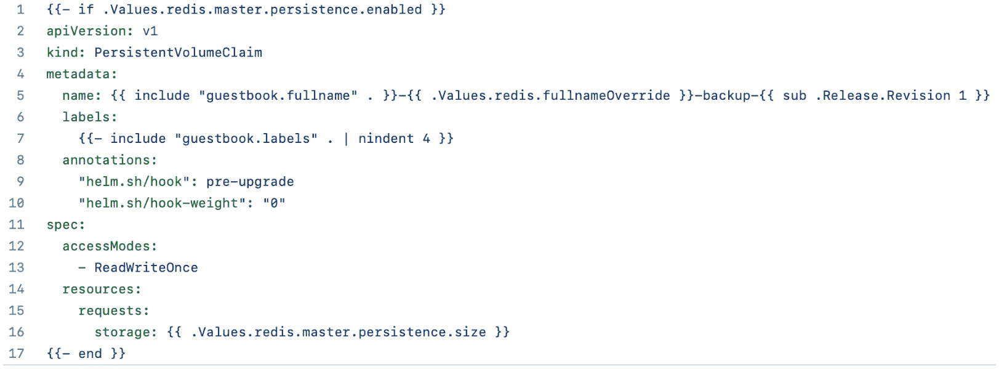
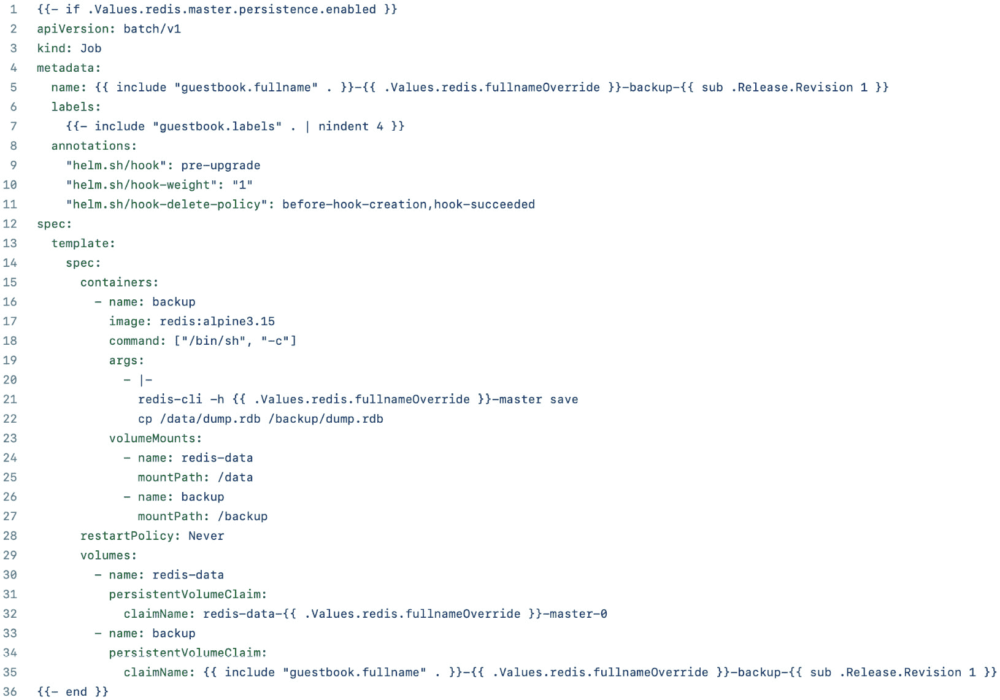
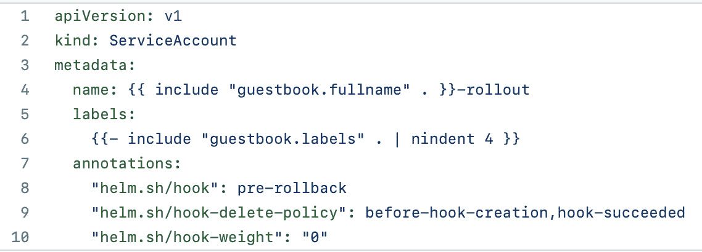
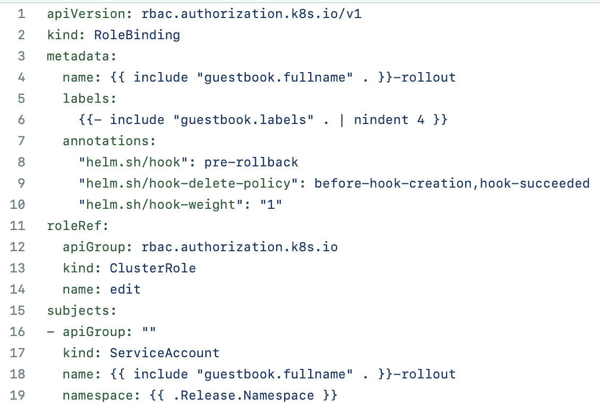
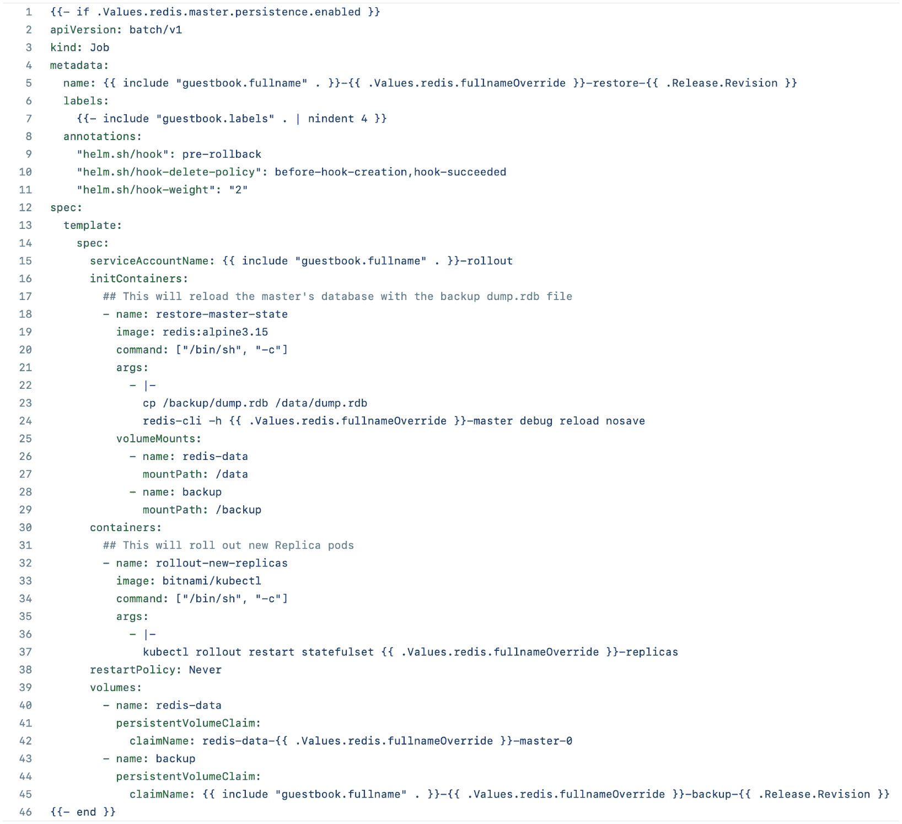
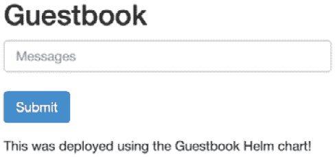
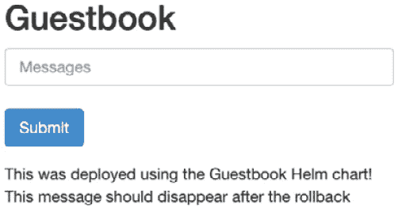

# 7

# Helm 生命周期钩子

Helm 发布在其生命周期中经历多个不同的阶段。第一个阶段是**安装**，当 Helm 图表首次安装时发生。第二个阶段是**升级**，当通过更新值或 Helm 图表本身来更新 Helm 发布时发生。在稍后的某个时刻，Helm 用户可能需要执行**回滚**阶段，这将 Helm 发布恢复到先前的状态。最后，如果用户需要删除 Helm 发布及其关联的资源，则必须执行**卸载**阶段。

每个阶段本身都非常强大，但为了在发布生命周期中提供额外的功能，Helm 提供了一个**钩子**机制，允许在发布周期的不同点执行自定义操作。例如，您可以使用钩子来执行以下操作：

+   在升级后对数据库执行操作，例如备份，或者在回滚期间从先前的快照恢复图表。

+   在安装图表后从秘密管理引擎获取秘密。

+   卸载图表后清理外部资源。

在本章中，我们将探索 Helm 钩子，并了解它们如何增强 Helm 图表的功能。然后，我们将在 Guestbook Helm 图表中实现钩子，以便在 Helm 发布升级和回滚时备份和恢复 Redis 数据库。

在本章中，我们将涵盖以下主题：

+   Helm 钩子的基础

+   钩子生命周期

+   钩子清理

+   在 Guestbook Helm 图表中编写钩子

+   清理

# 技术要求

本章中，您将需要以下工具：

+   minikube

+   kubectl

+   Helm

+   Git

我们将在本章中使用 minikube 探索多个示例，因此请随时使用以下命令启动你的 minikube 环境：

```
$ minikube start
```

一旦 minikube 启动完成，创建一个新的命名空间以供本章使用：

```
$ kubectl create namespace chapter7
```

如果您在前几章中还没有克隆示例的 `git` 仓库，请运行以下命令来克隆仓库：

```
$ git clone https://github.com/PacktPublishing/Managing-Kubernetes-Resources-using-Helm.git
```

接下来，让我们了解 Helm 钩子的基础知识，并探索一个执行钩子的示例。

# Helm 钩子的基础知识

钩子是在发布生命周期中的指定时间点作为一次性操作执行的。钩子作为 Kubernetes 资源实现，更具体地说，是在容器内实现的。虽然 Kubernetes 中的大多数工作负载是设计为长时间运行的进程，例如提供 API 请求的应用程序，但钩子由一个单独的任务或一组任务组成，返回 0 表示成功，返回非 0 表示失败。

在 Kubernetes 环境中创建短期任务时，通常使用的是裸`restartPolicy`属性。默认情况下，该字段配置为`Always`，这意味着如果 Pod 完成（无论是成功还是失败），Pod 将会被重启。尽管有些场景下会运行裸 Pod，但更推荐将生命周期钩子作为作业运行，这相比裸 Pod 有优势，包括当节点故障或不可用时，可以重新调度钩子。

由于钩子仅被定义为 Kubernetes 资源，因此它们像其他 Helm 模板一样创建，并放置在`templates/`文件夹中。然而，钩子有所不同，它们总是带有`helm.sh/hook`注解。钩子使用此注解来确保在标准处理过程中不会像其他资源那样被渲染。相反，它们的渲染和应用是基于`helm.sh/hook`注解中指定的值，该值决定了钩子在 Kubernetes 中作为 Helm 发布生命周期的一部分何时执行。

以下是一个钩子的示例。这个示例也可以在本书的 GitHub 仓库中找到，路径为`chapter7/examples/hook-example/templates/hooks/job.yaml`：

```
apiVersion: batch/v1 
kind: Job 
metadata: 
  name: {{ .Release.Name }}-hook
  annotations: 
    "helm.sh/hook": post-install 
spec: 
  template: 
    metadata: 
      name: {{ .Release.Name }}-hook
    spec: 
      restartPolicy: Never 
      containers: 
      - name: {{ .Release.Name }}-hook
        command: ["/bin/sh", "-c"]
        args:
          - echo "Hook executed at $(date)"
        image: alpine
```

这个简单的例子在图表安装后打印出当前的日期和时间。这类钩子的一个使用场景是与审计系统集成，用于跟踪应用程序在 Kubernetes 环境中安装的时间。请注意，尽管钩子保存在`template/hooks/`文件夹下，但它也可以直接保存在`templates/`下。额外的`hooks/`子目录仅用于将特定应用的模板与钩子模板分开。

为了演示 Helm 钩子的行为，我们通过安装位于`chapter7/examples/hook-example`中的 Helm 图表来查看这个钩子：

1.  首先，安装`hook-example` Helm 图表：

    ```
    $ helm install my-app chapter7/examples/hook-example –n chapter7
    ```

请注意，这个命令的执行时间可能会比过去调用的 Helm 命令要长。这是因为 Helm 正在等待钩子被创建并完成后才返回。

接下来，查看命名空间中的 Pod。你将看到两个 Pod，第一个是应用程序，第二个是钩子：

```
$ kubectl get pods –n chapter7
NAME                                  READY   STATUS
my-app-hook-example-6747bfbb6-dd9xz   1/1     Running
my-app-hook-p8rrd                     0/1     Completed
```

1.  状态为`Completed`的 Pod 是钩子。让我们查看 Pod 的日志，查看钩子输出的结果：

    ```
    $ kubectl logs jobs/my-app-hook –n chapter7
    Hook executed at Mon Jan 17 21:40:38 UTC 2022
    ```

正如你所看到的，钩子在 Helm 图表安装后记录了时间。

1.  卸载发布并检查剩余的 Pod。你会看到钩子仍然存在于命名空间中：

    ```
    $ helm uninstall my-app –n chapter7
    $ kubectl get pods –n chapter7
    NAME                                  READY   STATUS
    my-app-hook-p8rrd                     0/1     Completed
    ```

一旦钩子被创建并执行，它们就变得不可管理。（除非应用了`helm.sh/hook-delete-policy`注解。我们将在本章的*高级钩子概念*部分详细讲解。）因此，我们需要自己清理钩子。现在我们通过删除作业来完成此操作：

```
$ kubectl delete job my-app-hook –n chapter7
```

此时，所有与图表安装相关的资源已被清理。

由于钩子可能包含长时间运行的任务，因此发布可能会超时。默认情况下，Helm 设置了 5 分钟的超时值来完成与发布相关的所有步骤。当希望使用不同的值时，可以在执行 `helm install` 或 `helm upgrade` 时使用 `--timeout` 标志来控制与发布相关的超时。如果钩子需要较长时间运行，且可能超出默认的超时值，则可能需要修改此值。

现在我们对 Helm 钩子有了基本的理解，让我们来看一下不同的钩子生命周期选项。

# Helm 钩子生命周期

正如你在上一节中看到的关于作业钩子的内容，作业执行的时机是基于 `helm.sh/hook` 注解的值。由于指定了 `post-install`，作业在所有相关资源作为发布的一部分被创建后执行。`post-install` 选项表示 Helm chart 生命周期中的一个执行钩子的时机。

下表描述了 `helm.sh/hook` 注解的可用选项。每个钩子的描述可以在官方 Helm 文档中找到，文档地址为[`helm.sh/docs/topics/charts_hooks/#the-available-hooks`](https://helm.sh/docs/topics/charts_hooks/#the-available-hooks)：

| **注解值** | **描述** |
| --- | --- |
| `pre-install` | 在模板渲染后，但在 Kubernetes 中创建任何资源之前执行。 |
| `post-install` | 在 Kubernetes 中创建所有资源后执行。 |
| `pre-delete` | 在 Kubernetes 中删除任何资源之前，由删除请求触发执行。 |
| `post-delete` | 在删除所有发布资源后，由删除请求触发执行。 |
| `pre-upgrade` | 在模板渲染后，但在更新任何资源之前，由升级请求触发执行。 |
| `post-upgrade` | 在所有资源已升级后，由升级请求触发执行。 |
| `pre-rollback` | 在模板渲染后，但在回滚资源之前，由回滚请求触发执行。 |
| `post-rollback` | 在所有资源已修改后，由回滚请求触发执行。 |
| `test` | 在调用 `helm test` 子命令时执行。详情请参见*第九章*，*测试 Helm Charts*。 |

有时，你可能会有多个资源使用相同的`helm.sh/hook`设置。例如，你可能会有一个 ConfigMap 资源和一个作业资源，都标记为在同一阶段（如`pre-upgrade`）运行钩子。在这种情况下，你可以通过使用`helm.sh/weight`注解来定义这些资源的创建顺序。此注解用于为每个标记为在同一阶段执行的钩子资源分配权重值。权重按升序排序，因此权重最低的资源首先执行。如果没有应用权重，而 Helm 图表包含多个在同一阶段执行的钩子，那么 Helm 会通过按资源类型和名称的字母顺序对模板进行排序来推断执行顺序。

以下示例展示了如何将钩子权重的注解值设置为`0`：

```
annotations:
  "helm.sh/hook": pre-upgrade
  "helm.sh/weight": "0"
```

该钩子将在图表升级过程中执行，并且在必要的资源被渲染之后，但在它们应用到 Kubernetes 集群之前执行。

除了能够将钩子定位在单一生命周期阶段外，我们还可以使用`helm.sh/hook`注解来指定多个阶段。这可以通过指定一个用逗号分隔的生命周期阶段列表来完成。以下示例定义了一个钩子，应该在图表安装前后都执行：

```
annotations:
  "helm.sh/hook": pre-install,post-install
```

在此示例中，当选择了`pre-install`和`post-install`选项时，`helm install`命令将如下执行：

1.  用户启动 Helm 图表的安装（例如，运行`helm install wordpress bitnami/wordpress`）。

1.  如果`crds/`文件夹中存在任何 CRD，它们将被安装到 Kubernetes 环境中。

1.  图表模板会被验证，并且资源被渲染。

1.  `pre-install`钩子按权重排序，然后被渲染并应用到 Kubernetes 环境中。

1.  Helm 会等待直到钩子资源被创建，并且对于 Pods 和作业，会报告它们已处于`Completed`或`Error`状态。

1.  模板资源会被渲染并应用到 Kubernetes 环境中。

1.  `post-install`钩子按权重排序后执行。

1.  Helm 会等待直到`post-install`钩子执行完成。

1.  `helm install`命令的结果被返回。

在本节中，我们回顾了在不同生命周期阶段运行钩子的选项。接下来，我们将讨论与钩子相关的资源清理过程。

# Helm 钩子清理

在*Helm 钩子基础*部分，我们提到，默认情况下，Helm 钩子不会在执行`helm uninstall`命令时与其他资源一起删除。相反，我们必须手动清理这些资源。幸运的是，有几种策略可以在发布生命周期中自动删除钩子。这些选项包括配置删除策略和为作业设置**生存时间**（**TTL**）。

`helm.sh/hook-delete-policy`注解用于设置钩子资源的删除策略。该注解决定了何时将资源从 Kubernetes 中移除。下表列出了可用的选项。你可以在 Helm 文档中找到这些选项的详细说明，网址为[`helm.sh/docs/topics/charts_hooks/#hook-deletion-policies`](https://helm.sh/docs/topics/charts_hooks/#hook-deletion-policies)：

| **注解值**          | **描述**                                       |
| --- | --- |
| `before-hook-creation` | 在钩子启动之前删除先前的资源（这是默认选项）        |
| `hook-succeeded`     | 如果钩子成功执行，则删除资源                      |
| `hook-failed`        | 如果钩子执行失败，则删除资源                      |

如果没有提供`helm.sh/hook-delete-policy`注解，则默认应用`before-hook-creation`策略。这意味着如果有任何现有的钩子资源被删除（如果存在），在执行钩子时会重新创建它们。这对于作业尤其有用，因为如果作业使用相同的名称被重新创建，可能会发生冲突。通过使用`before-hook-create`注解，我们可以避免这种情况。

还有一些情况可以使用其他类型的钩子清理策略。例如，你可能希望应用`hook-succeeded`值，该值在钩子成功执行后清理钩子，以避免保留过多的资源。然而，如果在执行钩子时发生错误，资源将会保留，以便帮助排查错误原因。`hook-failed`清理类型，顾名思义，在钩子执行失败时会删除关联的钩子资源。如果你不希望保留与钩子相关的资源，无论它是成功执行还是失败，这个选项可能会很有用。与`helm.sh/hook`注解类似，可以通过设置`helm.sh/hook-delete-policy`注解并使用逗号分隔的字符串来应用多个删除策略：

```
annotations:
  "helm.sh/hook-delete-policy": before-hook-creation,hook-succeeded
```

Helm 删除策略是清理钩子后资源的最全面方式，但你也可以利用作业的`ttlSecondsAfterFinished`配置来定义作业在自动删除前应保留的 TTL。这将限制作业在完成后在命名空间中保留的时间。以下代码展示了如何使用`ttlSecondsAfterFinished`作业设置：

```
apiVersion: batch/v1
kind: Job
metadata:
  name: {{ .Release.Name }}-hook
  annotations:
    "helm.sh/hook": post-install
spec:
  ttlSecondsAfterFinished: 60
  <omitted>
```

在这个例子中，作业将在完成或失败后 60 秒被删除。

在本节中，我们讨论了自动清理资源的方法以及常规图表资源（即不与钩子关联的资源）在执行 `helm uninstall` 时如何自动删除。然而，有些情况下，你可能希望某些特定的图表资源遵循钩子的行为，即使在执行 `helm uninstall` 命令时仍然保留在集群中。这种情况的一个常见用例是，当你的图表通过独立的 `PersistentVolumeClaim` 资源（而不是由 `StatefulSet` 对象管理的 `PersistentVolumeClaim` 资源）创建了持久存储时。你可能希望这些存储在发布的正常生命周期之外被保留。你可以通过将 `helm.sh/resource-policy` 注解应用于该资源来启用这种行为，如下所示：

```
annotations:
  "helm.sh/resource-policy": keep
```

请注意，当在非钩子资源上使用此注解时，如果重新安装图表，可能会发生命名冲突。

到目前为止，我们已经介绍了 Helm 钩子以及与之相关的各种选项。现在，让我们通过在 Guestbook Helm 图表中编写钩子来看看钩子带来的强大功能。

# 在 Guestbook Helm 图表中编写钩子

正如你可能记得的，Guestbook Helm 图表使用 Redis 数据库来持久化用户创建的消息。通过使用 Helm 钩子，我们可以在图表生命周期的不同阶段创建一个过程，执行 Redis 数据库的简单备份和恢复操作。让我们来看一下在本节中我们将创建的两个钩子：

+   第一个钩子将在`pre-upgrade`生命周期阶段触发。这个阶段发生在执行 `helm-upgrade` 命令之后，但在修改任何 Kubernetes 资源之前。这个钩子将用于在升级执行之前对 Redis 数据库进行数据快照，确保在升级过程中出现错误时能够备份数据库。

+   第二个钩子将在 pre-rollback 生命周期阶段触发。这个阶段发生在执行 `helm-rollback` 命令之后，但在任何 Kubernetes 资源被回滚之前。此钩子将 Redis 数据库恢复到先前拍摄的快照，并确保 Kubernetes 资源被回滚，以便它们与拍摄快照时的配置保持一致。

到本节结束时，你将对生命周期钩子和一些可以用钩子执行的强大功能更加熟悉。请务必记住，本节中创建的钩子是简单的，仅用于演示目的。建议不要直接在可能使用 Redis 的应用程序中使用这些钩子。

我们首先来创建`pre-upgrade`钩子。

## 创建 pre-upgrade 钩子以进行数据快照

在 Redis 中，数据快照保存在名为 `dump.rdb` 的文件中。我们可以通过创建一个 hook，将 Kubernetes 命名空间中创建一个新的 PVC（持久卷声明）来存储数据库备份内容，从而备份该文件。接着，hook 可以创建一个 `Job` 资源，将 `dump.rdb` 文件复制到新创建的 `PersistentVolumeClaim` 中。

尽管 `helm create` 命令生成了一些强大的资源模板，能够快速创建初始的 `guestbook` chart，但它并没有自动生成可以用于此任务的任何 hooks。因此，你可以按照以下步骤从头开始创建 pre-upgrade hook：

1.  首先，你应该创建一个新的文件夹，用于存放 hook 模板。虽然这不是一个技术要求，但它有助于你组织 Helm chart 的结构，将 hook 模板与常规的 chart 模板分开。它还允许你按功能对 hook 模板进行分组（备份与恢复）。

在你的 `guestbook` Helm chart 中创建一个新的文件夹 `templates/backup`，如图所示：

```
$ mkdir -p guestbook/templates/backup
```

1.  接下来，你应该创建两个执行备份所需的模板文件。第一个模板是 `PersistentVolumeClaim` 模板，因为它将用于存放备份的 `dump.rdb` 文件。第二个模板是一个 job 模板，用于执行复制操作。

创建两个空的模板文件作为占位符，如下所示：

```
$ touch guestbook/templates/backup/persistentvolumeclaim.yaml
$ touch guestbook/templates/backup/job.yaml
```

你可以通过参考本书的 GitHub 仓库来再次检查你的工作。文件结构应当与[`github.com/PacktPublishing/Managing-Kubernetes-Resources-using-Helm/tree/main/chapter7/guestbook/templates/backup`](https://github.com/PacktPublishing/Managing-Kubernetes-Resources-using-Helm/tree/main/chapter7/guestbook/templates/backup)中的示例一致。

1.  现在，让我们填写 `persistentvolumeclaim.yaml` 模板的内容。由于模板的内容相对较长，我们将从 GitHub 仓库中复制每个模板，并深入探讨它们的创建过程。

1.  将以下截图所示文件的内容复制到你的 `backup/persistentvolumeclaim.yaml` 文件中。你可以在 https://github.com/PacktPublishing/Managing-Kubernetes-Resources-using-Helm/blob/main/chapter7/guestbook/templates/backup/persistentvolumeclaim.yaml 找到这个文件：



图 7.1 – 备份/persistentvolumeclaim.yaml 模板

+   `backup/persistentvolumeclaim.yaml` 文件的第 1 行和第 17 行是一个 `if` 动作。由于这个动作封装了整个文件，它表示只有在 `redis.master.persistence.enabled` 值设置为 `true` 时，才会包含此资源。该值在 Redis chart 中默认为 `true`，可以通过 `helm show values` 命令查看。

+   第 5 行确定了新备份 PVC（`PersistentVolumeClaim`）的名称。此名称基于发布名称、Redis 名称和从中备份的修订号。注意`sub`函数的使用，它有助于计算修订号。该函数用于从修订号中减去`1`，因为`helm upgrade`命令在模板渲染之前会增加该值。

+   第 9 行创建了一个注释，用于声明该资源为`pre-upgrade`钩子。最后，第 10 行创建了一个`helm.sh/hook-weight`注释，用于确定该资源与其他升级前钩子相比的创建顺序。权重按升序执行，因此此资源将在其他升级前资源之前创建。

1.  现在，`persistentvolumeclaim.yaml`文件已经创建，我们必须创建最终的升级前模板——即`job.yaml`。将以下内容复制到您之前创建的`backup/job.yaml`文件中。也可以从本书的 GitHub 仓库复制该内容，链接如下：[`github.com/PacktPublishing/Managing-Kubernetes-Resources-using-Helm/blob/main/chapter7/guestbook/templates/backup/job.yaml`](https://github.com/PacktPublishing/Managing-Kubernetes-Resources-using-Helm/blob/main/chapter7/guestbook/templates/backup/job.yaml)：



图 7.2 – backup/job.yaml 模板

+   再次强调，第 9 行定义了该模板为升级前钩子，第 10 行将钩子权重设置为`1`，表示该资源将在`persistentvolumeclaim.yaml`模板之后创建。

+   第 11 行设置了`helm.sh/hook-delete-policy`注释，用于指定何时删除该任务。在这里，我们应用了两种不同的策略。第一种是`before-hook-creation`，表示如果该任务已存在于命名空间中，则在后续的`helm upgrade`命令中会删除该任务，以便创建一个新的任务替代它。第二种策略是`hook-succeeded`，即任务成功完成后将删除该任务。我们本可以添加另一种策略`hook-failed`，即任务失败时删除该任务。然而，考虑到我们希望保留失败记录以便于故障排除，因此没有实现这一策略。

+   第 19 行至第 22 行包含了用于备份 Redis 数据库的命令。首先，使用`redis-cli`保存当前状态。然后，将`dump.rdb`文件从主节点复制到在`backup/persistentvolumeclaim.yaml`模板中创建的备份 PVC 中。

+   最后，第 29 行至第 35 行定义了引用主节点和备份 PVC 的卷。

在这一部分中，我们创建了两个`pre-upgrade`钩子——一个用于创建备份 PVC，另一个用于将 Redis 的`dump.rdb`文件复制到 PVC 中。在下一部分中，我们将创建`pre-rollback`钩子，用于恢复 Redis 到先前的备份。之后，我们将部署`guestbook`图表，看看这些钩子的实际效果。

## 创建 pre-rollback 钩子以恢复数据库

与 `pre-upgrade` 钩子将 `dump.rdb` 文件从 Redis 主 PVC 复制到备份 PVC 不同，`pre-rollback` 钩子可以执行相反的操作——即将数据库恢复到之前的快照。

这个钩子可以通过将 `dump.rdb` 文件从备份 PVC 复制到主 Redis 实例来实现。然后，必须执行 Redis 的滚动更新操作，以创建新的 Redis 副本 pod。当副本重新连接到主节点时，它们将加载备份的 `dump.rdb` 文件，供 Guestbook 前端读取。

按照以下步骤创建 `pre-rollback` 钩子：

1.  创建 `templates/restore` 文件夹，用于存放 `pre-rollback` 钩子：

    ```
    $ mkdir guestbook/templates/restore
    ```

1.  接下来，构建这个钩子所需的模板。我们需要创建一个 `serviceaccount.yaml` 模板和一个 `rolebinding.yaml` 模板，然后再创建一个 `job.yaml` 模板来执行恢复任务：

    ```
    $ touch guestbook/templates/restore/serviceaccount.yaml
    $ touch guestbook/templates/restore/rolebinding.yaml
    $ touch guestbook/templates/restore/job.yaml
    ```

你可以通过参考本书的 GitHub 仓库来检查是否已正确创建结构，链接为：[`github.com/PacktPublishing/Managing-Kubernetes-Resources-using-Helm/tree/main/chapter7/guestbook/templates/restore`](https://github.com/PacktPublishing/Managing-Kubernetes-Resources-using-Helm/tree/main/chapter7/guestbook/templates/restore)。

1.  现在，让我们创建第一个 `pre-rollback` 钩子，`serviceaccount.yaml`。将以下屏幕截图中的内容复制到 `restore/serviceaccount.yaml` 文件中。该代码也可以在本书的 GitHub 仓库中找到，链接为：[`github.com/PacktPublishing/Managing-Kubernetes-Resources-using-Helm/blob/main/chapter7/guestbook/templates/restore/serviceaccount.yaml`](https://github.com/PacktPublishing/Managing-Kubernetes-Resources-using-Helm/blob/main/chapter7/guestbook/templates/restore/serviceaccount.yaml)：



](img/Figure_7.03_B17979.jpg)

图 7.3 – restore/serviceaccount.yaml 模板

第 8 行将此模板定义为 `pre-rollback` 钩子。由于钩子的权重为 `0`（第 10 行），因此它将在其他 pre-rollback 模板之前创建。

1.  上一个模板创建了一个 ServiceAccount，我们将在后续的 job 中使用它，但现在，我们需要授予 ServiceAccount 权限，以便它与 Kubernetes API 通信时能够部署新的 Redis 副本 pod。为了简单起见，在本例中，我们将为 ServiceAccount 在 `chapter7` 命名空间中授予 `edit` 权限。

将以下屏幕截图中的内容复制到 `restore/rolebinding.yaml` 模板中。该代码也可以在本书的 GitHub 仓库中找到，链接为：[`github.com/PacktPublishing/Managing-Kubernetes-Resources-using-Helm/blob/main/chapter7/guestbook/templates/restore/rolebinding.yaml`](https://github.com/PacktPublishing/Managing-Kubernetes-Resources-using-Helm/blob/main/chapter7/guestbook/templates/restore/rolebinding.yaml)：



](img/Figure_7.04_B17979.jpg)

图 7.4 – 还原/rolebinding.yaml 模板

第 11 行到第 14 行引用了我们希望授予的 `edit` ClusterRole，而第 15 行到第 19 行则针对我们将发布到的命名空间中的 ServiceAccount（即 `chapter7` 命名空间）。

1.  最后，我们需要向 `job.yaml` 文件添加内容。将以下内容复制到你的 `restore/job.yaml` 模板中。该内容也可以在 [`github.com/PacktPublishing/Managing-Kubernetes-Resources-using-Helm/blob/main/chapter7/guestbook/templates/restore/job.yaml`](https://github.com/PacktPublishing/Managing-Kubernetes-Resources-using-Helm/blob/main/chapter7/guestbook/templates/restore/job.yaml) 中找到：



图 7.5 – 还原/job.yaml 钩子

这个 `job.yaml` 模板是核心回滚逻辑所在的地方。第 18 行到第 29 行定义了一个 `initContainer`，它将备份的 `dump.rdb` 文件复制到 Redis 主节点，并执行重载操作，恢复主节点的状态，正如备份的 `dump.rdb` 文件所表示的那样。`initContainer` 是在任何列在 `containers` 部分下的容器运行之前完成执行的容器。我们首先创建这个容器，以确保主节点在我们继续下一步之前已经被恢复。

第 30 行到第 37 行表示回滚的下一步。在这里，我们重启 Redis 副本的 `StatefulSet`。当副本重新连接到主节点时，它们将提供由备份 `dump.rdb` 文件表示的数据。

创建了 `pre-upgrade` 和 `pre-rollback` 钩子后，让我们在 minikube 环境中查看它们的实际运行情况。

## 执行生命周期钩子

要运行你创建的生命周期钩子，必须通过运行 `helm install` 命令来安装你的 chart：

```
$ helm install guestbook chapter7/guestbook -n chapter7 --dependency-update
```

当每个 pod 报告 `1/1 Ready` 状态时，通过运行以下 `port-forward` 命令来访问你的访客簿应用：

```
$ kubectl port-forward svc/guestbook 8080:80 –n chapter7
```

接下来，访问 `http://localhost:8080` 上的访客簿前端，写一条消息，并点击 **提交**。以下截图显示了示例消息：



图 7.6 – 在访客簿前端输入消息

一旦输入了消息，运行 `helm upgrade` 命令以触发 `pre-upgrade` 钩子。`helm upgrade` 命令会短暂挂起，直到备份完成：

```
$ helm upgrade guestbook guestbook –n chapter7
```

当命令返回时，你应该会看到一个新创建的 PVC，其中包含备份。这个 PVC 名为 `guestbook-redis-backup-1`：

```
$ kubectl get pvc -n chapter7
NAME                                 STATUS
redis-data-redis-master-0            Bound
redis-redis-backup-1                 Bound
```

备份完成后，我们继续添加另一条消息。我们计划在输入此消息后进行回滚。以下截图显示了添加了两条消息后的 `guestbook` 应用示例：



图 7.7 – 在访客簿前端输入第二条消息

现在，让我们运行 `helm rollback` 命令，回滚到第一个修订版本。此命令会暂时挂起，直到 `helm rollback` 命令返回：

```
$ helm rollback guestbook 1 –n chapter7 
```

当此命令完成时，Redis 副本应该会滚动部署。可以通过以下命令观察此滚动部署：

```
$ kubectl get pods –n chapter7 –w
```

一旦新副本部署完成，刷新浏览器中的 Guestbook 前端。你将看到在升级后你添加的消息消失，如下图所示：


图 7.8 – 回滚前阶段的 Guestbook 前端

希望这个示例能让你更好地理解 Helm 钩子。我们再次强调，这只是一个简单的示例，并不是一个生产级的解决方案。

请注意，虽然本章专注于开发和运行生命周期钩子，但通过在 `helm install`、`helm upgrade`、`helm rollback` 和 `helm delete` 命令中添加 `--no-hooks` 标志，可以跳过钩子。添加此标志将导致 Helm 跳过与执行的生命周期阶段相关的钩子。

让我们通过清理 minikube 环境来结束本章内容。

# 清理

首先，删除 `chapter7` 命名空间，以删除 `guestbook` 发布和相关的 PVC：

```
$ kubectl delete ns chapter7
```

接下来，停止 minikube 环境：

```
$ minikube stop
```

到此为止，一切都已经清理完毕。

# 总结

生命周期钩子通过允许图表开发人员在不同生命周期阶段安装资源，开启了额外的功能。钩子通常包括执行钩子内操作的作业资源，但它们也经常包含其他资源，如 ServiceAccounts、包括 `RoleBindings` 的策略以及 `PersistentVolumeClaims`。在本章结尾，我们为 Guestbook 图表添加了生命周期钩子，并演示了 Redis 数据库的备份与恢复。

在下一章中，我们将讨论如何将 Helm 图表发布到图表仓库。

# 深入阅读

要了解更多关于生命周期钩子的内容，请访问 Helm 文档：[`helm.sh/docs/topics/charts_hooks/`](https://helm.sh/docs/topics/charts_hooks/)。

# 问题

请回答以下问题，测试你对本章内容的理解：

1.  生命周期钩子有哪九种不同类型？

1.  用于定义钩子的注解是什么？

1.  用于定义钩子创建顺序的注解是什么？

1.  图表开发人员可以添加什么内容来确保钩子在成功后总是被删除？

1.  Helm 用户如何跳过生命周期钩子？

1.  最常用来执行生命周期钩子的 Kubernetes 资源是什么？
