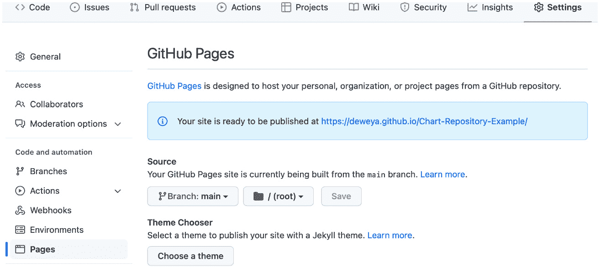
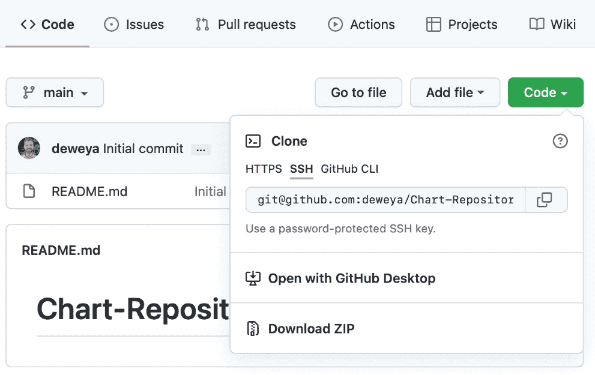
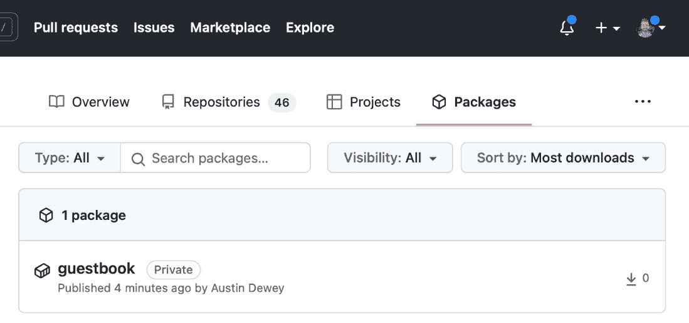

# 8

# 发布到 Helm 图表存储库

**Helm**如果没有**Helm chart repository**的概念，不能被视为**Kubernetes**的包管理工具。存储库用于将 Helm 图表发布到社区。在本章中，我们将了解创建 Helm 图表存储库的不同方法。随后，我们将通过将我们的 Guestbook Helm 图表发布到基于 HTTP 的存储库和 OCI 注册表，进行不同存储库实现的实践操作。

本章将涉及以下主题：

+   理解 Helm 图表存储库

+   发布到 HTTP 存储库

+   发布到 OCI 注册表

# 技术要求

对于本章内容，您需要一个 GitHub 账户。如果您已有 GitHub 账户，可以在[`github.com/login`](https://github.com/login)登录。否则，您可以在[`github.com/join`](https://github.com/join)创建一个新账户。

您还应该将 Packt Git 存储库克隆到本地：

```
$ git clone https://github.com/PacktPublishing/Managing-Kubernetes-Resources-using-Helm.git
```

首先，让我们了解 Helm 图表存储库的基本概念。

# 理解 Helm 图表存储库

Helm 图表存储库用于发布 Helm 图表，并使其对广泛的 Helm 用户社区可用。这在概念上类似于 Linux 包管理中使用的存储库，如 RPM 或 Debian 存储库，包通过`dnf`或`apt-get`等工具进行安装。公共 Helm 图表存储库可以在 Artifact Hub 上找到([`artifacthub.io`](https://artifacthub.io))。

Helm 图表存储库是通过两种高层次实现之一创建的：

+   一个 HTTP 服务器

+   一个 OCI 注册表

使用 HTTP 服务器是发布图表的最常见实现方式，因为它是支持时间最长的。要使用 HTTP 服务器创建 Helm 图表存储库，可以使用如**Apache httpd**、**NGINX**、**Amazon S3**和**GitHub Pages**等工具。**ChartMuseum**([`github.com/helm/chartmuseum`](https://github.com/helm/chartmuseum))是另一个受欢迎的选择，因为它提供了一个 API 来执行更高级的操作。在*发布到 HTTP 存储库*部分，我们将使用 GitHub Pages 来创建我们的存储库。

使用 HTTP 服务器创建的存储库必须包含以下组件：

+   打包为`.tgz`归档的 Helm 图表

+   一个`index.yaml`文件，包含有关存储库中图表的元数据。

基本的图表存储库要求维护者使用`helm repo index`命令生成`index.yaml`文件，稍后我们将探讨这个命令，但更高级的解决方案，如 ChartMuseum，可以在新图表上传到存储库时自动生成`index.yaml`文件。

除了 HTTP 之外，Helm chart 维护者可以将 chart 发布到的另一个类型的仓库是 **开放容器倡议**（**OCI**）注册表。OCI 是一个开放治理结构，用于创建容器运行时和格式的开放标准。Artifacts 是一个 OCI 项目，允许你在容器注册表中存储和提供额外的内容，如 Helm charts，除了容器镜像之外。由于镜像及其注册表已成为 Kubernetes 和 Helm 中的基本构件，因此能够利用同一个注册表存储容器镜像和 Helm charts，减少了 Helm 维护者发布 charts 所需的工作量。我们将在 *发布到 OCI 注册表* 部分更详细地探讨如何使用 OCI 注册表发布 Helm charts。

在接下来的部分，我们将把我们的 Guestbook Helm chart 发布到 GitHub Pages。在这里，你将了解如何创建和交互操作一个基础的 Helm chart 仓库。

# 发布到 HTTP 仓库

GitHub Pages 是 GitHub 中的一个功能，允许你从一个仓库提供静态内容。在这一部分，我们将创建一个启用了 Pages 的新 GitHub 仓库，以发布我们的 Guestbook Helm chart。

要跟随本节的示例，你必须拥有一个 GitHub 账户。创建 GitHub 账户或登录现有账户的步骤已在 *技术要求* 部分提供。

一旦你登录到 GitHub，继续到下一个部分来创建你的仓库。

## 创建一个 GitHub Pages 仓库

按照以下步骤创建一个 GitHub Pages 仓库：

1.  访问 [`github.com/new`](https://github.com/new)，进入 **创建新仓库** 页面。

1.  为你的 chart 仓库提供一个名称。我们建议使用 `Chart-Repository-Example`。

1.  选中 **初始化这个仓库并添加 README** 复选框。这是必需的，因为如果仓库中没有任何内容，GitHub 不允许你创建静态网站。你可以将其余设置保留为默认值。请注意，为了使用 GitHub Pages，除非你拥有付费的 GitHub Pro 账户，否则必须将隐私设置保持为 **公开**。

你的 **创建新仓库** 页面现在应该如下所示：

![图 8.1 – 创建一个新的 GitHub 仓库]

](img/Figure_8.01_B17979.jpg)

图 8.1 – 创建一个新的 GitHub 仓库

1.  点击 **创建仓库** 按钮以创建你的仓库。

虽然你的仓库已经创建，但在启用 GitHub Pages 之前，它不能用于提供 Helm charts。

1.  点击仓库中的 **设置** 选项卡以访问仓库设置。从那里，选择左侧栏中的 **Pages** 选项卡。然后，在 **源** 下拉列表中，选择 **main** 选项。最后，点击 **保存** 按钮。这将指示 GitHub 创建一个静态网站，提供你的主分支内容。

此时，你的界面应该类似于以下内容：



图 8.2 – 查找 GitHub Pages 设置

现在你已经配置了 GitHub 仓库，应该将其克隆到本地机器，以便稍后将 Guestbook Helm 图表添加到其中。按照以下步骤克隆仓库：

1.  通过选择页面顶部的 **Code** 标签，导航到仓库的根目录。

1.  选择绿色的**Clone or download**按钮。点击后会显示你的 GitHub 仓库的 URI（请注意，这与静态网站的 URL 不同）。你可以参考以下截图来找到你的仓库 URI：



图 8.3 – 查找 git URI

1.  一旦你获得了仓库的 URI，克隆该仓库到你的本地机器。你可能希望确保首先进入你的主目录，以避免不小心克隆到一个已有的 git 仓库：

    ```
    $ cd ~
    $ git clone <repository URI>
    ```

现在你已经克隆了仓库，你可以发布你的 Guestbook 图表。

## 发布 Guestbook 图表

将 Helm 图表发布到 HTTP 仓库包括三个步骤：

1.  将 Helm 图表打包成 `.tgz` 压缩包

1.  生成 `index.yaml` 文件

1.  将 `.tgz` 压缩包和 `index.yaml` 文件上传到服务器

Helm 提供了几个不同的命令来简化发布过程。我们将在本节中讲解这些命令。

首先，你可以使用 `helm package` 命令将图表打包成 `.tgz` 压缩包。我们将使用位于 Packt Git 仓库 `chapter8/guestbook` 的 Guestbook 图表作为此示例的一部分：

```
$ helm dependency update chapter8/guestbook
$ helm package guestbook chapter8/guestbook
```

如果这些命令成功执行，将会创建一个名为 `guestbook-0.1.0.tgz` 的文件。

请注意，我们在运行 `helm package` 之前执行了 `helm dependency update` 命令。这是因为 Guestbook 图表必须先下载依赖项才能包含在归档文件中。为了简化这一过程，我们可以通过为 `helm package` 命令提供额外的标志，将前两个命令合并为一个步骤：

```
$ helm package chapter8/guestbook --dependency-update
```

这将确保依赖项被包含在最终的包中。

一旦你的图表被打包，生成的 `.tgz` 文件应当被复制到本地的 GitHub Pages 仓库克隆中。可以通过使用 `cp` 命令来完成此操作：

```
$ cp guestbook-0.1.0.tgz <GitHub Pages repository clone>
```

当复制此文件时，你可以使用 `helm repo index` 命令生成 `index.yaml` 文件。该命令需要你的图表仓库克隆的位置作为参数。运行以下命令生成 `index.yaml` 文件：

```
$ helm repo index <GitHub Pages repository clone>
```

命令会静默成功执行，但你会在 GitHub Pages 克隆目录中看到新的 `index.yaml` 文件。该文件的内容提供了 Guestbook 图表的元数据，内容如下：

```
apiVersion: v1
entries:
  guestbook:
  - apiVersion: v2
    appVersion: v5
    created: "2022-02-20T04:13:36.052015-05:00"
    dependencies:
    - condition: redis.enabled
      name: redis
      repository:  https://raw.githubusercontent.com/bitnami/charts/archive-full-index/bitnami
      version: 15.5.x
    description: An application used for keeping a running record of guests
    digest: 983dee22d05be37fb73cf6a06fa5a2b2c320c1678ad6a8 df3d198a403f467343
    name: guestbook
    type: application
    urls:
    - guestbook-0.1.0.tgz
    version: 0.1.0
generated: "2022-02-20T04:13:36.045492-05:00"
```

如果该仓库中添加了其他图表，它们的元数据也将列在此文件中。

你的 Helm chart 仓库现在应包含 `.tgz` 压缩包和 `index.yaml` 文件，内容类似于以下命令的输出：

```
$ ls <GitHub Pages repository clone>
README.md guestbook-0.1.0.tgz index.yaml
```

为了完成发布过程，你应该使用以下命令将这些文件提交并推送到 GitHub：

```
$ cd <GitHub Pages repository clone>
$ git add --all
$ git commit –m "publishing the guestbook helm chart"
$ git push origin main
```

一旦你将 chart 推送到远程仓库，你的 Guestbook Helm chart 将通过 GitHub Pages 静态站点提供服务。我们可以通过添加我们的仓库并执行搜索来验证它是否正常工作。

首先，找到你的 GitHub Pages 站点的 URL。该 URL 在 `https://<github username>.github.io/Chart-Repository-Example/` 中显示。一旦确定了 URL，就可以使用它来添加 chart 仓库：

```
$ helm repo add example <GitHub Pages Site URL>
```

该命令将允许 Helm 与你的仓库进行交互。你可以通过在本地配置的仓库中搜索 Guestbook chart 来验证 chart 是否已成功发布。这可以通过运行以下命令完成：

```
$ helm search repo guestbook
```

你应该能在搜索结果中找到返回的示例 Guestbook chart。

恭喜！你已经将 Guestbook chart 发布到 Helm chart 仓库。请注意，尽管我们在本章中将 chart 发布到了一个未经身份验证的仓库，但我们将在*第十二章*中详细探讨身份验证和安全性，*Helm 安全性考虑*。

在下一部分，我们将探讨 OCI 注册表的支持，并将我们的 Guestbook chart 发布到一个容器注册表。

# 将 chart 发布到 OCI 注册表

将 Helm chart 发布到 OCI 注册表的流程与处理标准容器镜像时的流程类似。像 `docker login`、`docker pull` 和 `docker push` 这样的命令，在 Helm 中有类似的命令。下表中列出了这些命令及其描述：

| **命令** | **描述** |
| --- | --- |
| `helm registry login` | 登录到一个注册表 |
| `helm registry logout` | 从注册表登出 |
| `helm push` | 将打包好的 chart 推送到一个注册表 |
| `helm pull` | 从注册表拉取一个 chart |

表 8.1 – OCI 管理的 Helm 命令

请注意，OCI 基础的 charts 从 3.8.0 版本开始获得完全支持。在此版本之前，它作为实验性功能提供，并需要设置环境变量来启用该功能。如果你使用的是 3.8.0 之前的版本，则必须设置 `HELM_EXPERIMENTAL_OCI=1` 环境变量，如下所示：

```
$ export HELM_EXPERIMENTAL_OCI=1
```

`helm pull` 命令只是一个例子，展示了基于 OCI 的 charts 可以与来自不同位置（例如 HTTP 仓库或本地文件系统）的 charts 互换使用。可以以这种方式使用的其他 Helm 命令包括：

+   `helm show`

+   `helm template`

+   `helm install`

+   `helm upgrade`

基于 OCI 的图表可以通过在图表位置中指定 OCI 协议（`oci://`）来与其他来源区分。例如，源自注册表`localhost:5000/helm-charts/mychart`的图表，在 Helm 中被引用为`oci://localhost:5000/helm-charts/mychart`。

还需要注意的是，虽然 OCI 制品可以与容器镜像一起存储在同一注册表中，但并非每个注册表都完全支持 OCI 制品规范，因此无法存储基于 OCI 的 Helm 图表。请事先查阅注册表分发的文档。

为了演示如何与基于 OCI 的 Helm 图表进行交互，我们可以使用 Guestbook 图表并将其存储在 OCI 注册表中。首先，我们必须确定应该存储图表的注册表。由于我们不仅使用 GitHub 来存储图表的原始源代码，而且 GitHub 还充当我们的 Helm 仓库，因此作为 GitHub 包服务的一部分提供的容器注册表可以作为 Helm 图表的 OCI 注册表。容器注册表完全支持 OCI 制品，这意味着我们不必再为此担忧。

要将内容发布到容器注册表，必须创建**个人账户令牌**（**PAT**）。请按照以下步骤创建一个具有推送和拉取镜像所需权限的 PAT：

1.  登录 GitHub 后，在页面右上角选择您的个人资料图片，然后从下拉菜单中点击**设置**。

1.  点击**开发者设置**并选择**个人账户令牌**。

1.  点击**生成新令牌**按钮以启动令牌创建过程。

1.  为令牌输入一个唯一名称，例如`Learn Helm`。

1.  选择令牌的过期日期。

1.  选择将授予令牌的作用域（权限）。以下作用域是管理容器注册表内内容所需的：

    +   `read:packages`

    +   `write:packages`

    +   `delete:packages`

1.  点击**生成令牌**按钮以创建令牌。

请确保复制生成的令牌，因为一旦离开此页面，就无法再次获取该令牌。

在与容器注册表交互之前，重要的是要了解注册表中内容的组织方式。虽然这些细节特定于 GitHub 服务，但这些概念可以应用于任何容器注册表。内容按`ghcr.io/<OWNER>/<ARTIFACT>`格式存储。`OWNER`在此表示用户账户或 GitHub 组织的名称。

这些细节如此重要的主要原因是 Helm 对基于 OCI 的图表施加了严格的命名约定。与将其他制品发布到容器注册表不同，后者可以指定仓库名称和标签，基于 OCI 的图表的仓库名称和标签是根据图表名称和语义版本（在`Chart.yaml`文件中定义）自动确定的。例如，一个名为`mychart`、版本为 0.1.0 的图表，将存储在 GitHub 容器注册表中，属于用户名为`jdoe`的用户，地址为`ghcr.io/jdoe/mychart:0.1.0`。

现在我们了解了图表在 OCI 注册表中的组织方式，接下来让我们将之前创建的图表推送到 GitHub 注册表。第一步是使用之前创建的 PAT 登录注册表，通过 `helm registry login` 命令实现。

`helm registry login` 命令的格式如下：

```
$ helm registry login <registry>
```

要登录 GitHub 注册表，请执行以下命令：

```
$ helm registry login ghcr.io
```

在提示时输入你的 GitHub 用户名和 PAT 作为密码。可以使用`–-username`，并结合`--password`或`--password-stdin`标志来进行非交互式认证。

现在我们已经登录到远程注册表，可以使用`helm push`命令将之前创建的 Helm 图表推送到远程注册表。`helm push`要求提供已经打包的图表的位置，以及目标注册表，如下所示：

```
$ helm push <location_of_tgz_helm_package> <registry/reference>
```

也支持签名图表，只要源文件（`.prov`）位于与打包图表相同的目录中。无需为 `helm push` 命令添加额外的配置或标志。源文件和图表签名将在 *第十二章* 中详细讨论，*Helm 安全性考虑*。

将打包好的 Guestbook 图表推送到 GitHub 的容器注册表：

```
$ helm push guestbook-0.1.0.tgz oci://ghcr.io/<OWNER>
Pushed: ghcr.io/<OWNER>/guestbook:<version>
Digest: sha256:<SHA>
```

一旦图表被推送，它可以通过用户个人资料中的**Packages**选项卡在 GitHub 内查看。在 GitHub 的任何页面上，选择页面右上角的个人资料图片，然后选择**Your Profile**。**Packages**选项卡位于页面顶部。

点击**Packages**选项卡后，之前推送的图表应该能够看到，如下图所示：



图 8.4 – GitHub 中的 Packages 选项卡

默认情况下，新创建的包是私有的，其他人无法访问。可以通过选择该包并在**Details**页面中选择右侧的**Package Settings**来更改此配置。在**Danger Zone**部分选择**Change Visibility**，然后选择**Public**。

或者，如果你希望限制访问 Helm 图表，可以指定个人用户或团队，而不是更改可见性。

## 拉取 OCI Guestbook 图表

从 OCI 注册表拉取 Helm 图表和发布图表一样简单，可以使用 `helm pull` 命令来执行。`helm pull` 命令中的选项与在图表仓库或文件系统中找到的图表一样。多种可用选项中，`--version` 标志允许用户指定要接收的图表。否则，将选择符合 SemVer 约定的最新版本。

从 GitHub 容器注册表中拉取之前发布的图表，如下所示：

```
$ helm pull oci://ghcr.io/<OWNER>/guestbook --version 0.1.0
```

将从注册表中检索到图表的最新版本，并将打包的图表（`.tgz`）存储在本地。

# 总结

在经过一番辛苦的努力开发 Helm chart 后，最终将你的 Helm chart 发布到一个仓库供全世界查看的感觉是无与伦比的！在这一章中，我们了解了 HTTP 和 OCI Helm chart 仓库。HTTP 仓库允许你将 chart 发布到简单的 Web 服务器，而 OCI 注册表允许你将 Helm chart 与容器镜像一起发布。作为练习，我们将 Guestbook Helm chart 发布到了 GitHub Pages（一个 HTTP 服务器）和 GitHub 的容器注册表（一个 OCI 注册表）。

在下一章中，我们将学习有关 Helm chart 测试的工具和策略。

# 进一步阅读

要了解更多关于 Helm chart 仓库的内容，请访问 Helm 文档中的 *Chart Repository Guide* 部分：[`helm.sh/docs/topics/chart_repository/#helm`](https://helm.sh/docs/topics/chart_repository/#helm)。

要了解更多关于 OCI 支持的内容，请访问文档中的 *Registries* 部分：[`helm.sh/docs/topics/registries/`](https://helm.sh/docs/topics/registries/)。

# 问题

回答以下问题以测试你对本章的知识掌握情况：

1.  创建 HTTP 仓库的三种不同工具是什么？

1.  你可以运行什么命令以确保依赖项始终包含在 `.tgz` 压缩包中？

1.  发布到 HTTP 服务器时需要哪些文件？

1.  将 Helm chart 发布到 HTTP 仓库与发布到 OCI 注册表的过程有何不同？

1.  用于发布到 OCI 注册表的 Helm 命令是什么？

1.  用于从 OCI 注册表下载 Helm chart 的 Helm 命令是什么？
