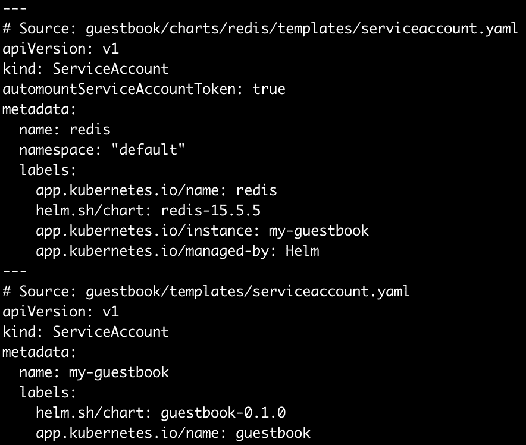
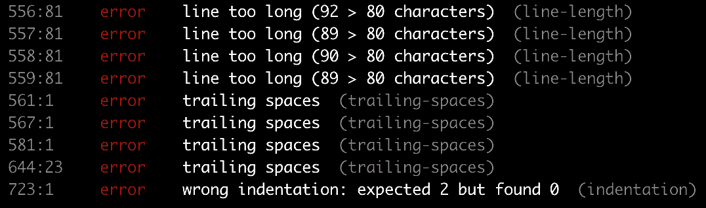
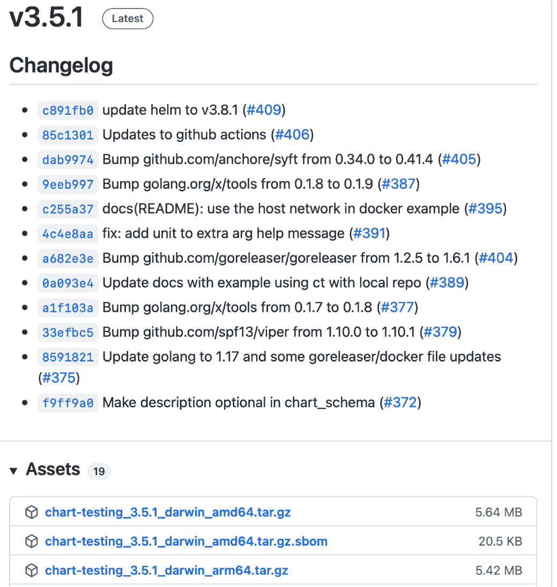
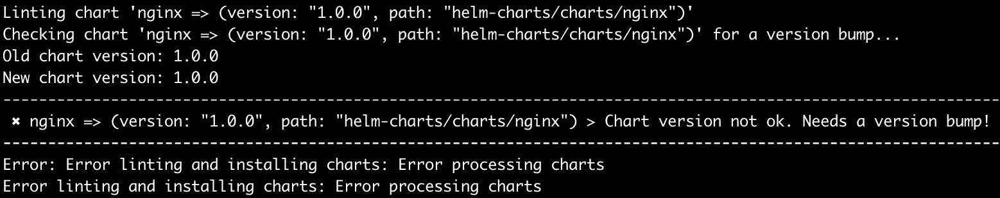

# 9

# 测试 Helm Charts

测试是工程师在软件开发过程中必须执行的常见任务。测试用于验证产品的功能，并防止产品在演进过程中出现回归问题。经过充分测试的软件更易于维护，并且使开发人员能够自信地向最终用户提供新版本。

应该适当地测试 Helm chart，以确保它提供的功能达到预期的质量标准。在本章中，我们将讨论如何将测试应用于 Helm charts，以验证预期的能力。

在本章中，我们将讨论以下主题：

+   设置您的环境

+   验证 Helm 模板

+   在实时集群中进行测试

+   使用 Chart Testing 工具改进 chart 测试

+   清理

# 技术要求

本章中，您将需要以下内容：

+   `minikube`

+   `kubectl`

+   `helm`

+   `git`

+   `yamllint`

+   `yamale`

+   `ct` (chart-testing)

此外，您应该在本地克隆 Packt 的 GitHub 仓库：$ git clone [`github.com/PacktPublishing/Managing-Kubernetes-Resources-using-Helm.git`](https://github.com/PacktPublishing/Managing-Kubernetes-Resources-using-Helm.git)。

在本章中，我们将广泛使用`minikube`环境。在下一节中，您将设置该环境。

# 设置您的环境

执行以下步骤来设置您的`minikube`环境：

1.  通过运行`minikube start`命令来启动`minikube`：

    ```
    $ minikube start
    ```

1.  然后，创建一个名为`chapter9`的新命名空间：

    ```
    $ kubectl create namespace chapter9
    ```

在准备好`minikube`环境后，让我们首先讨论如何测试 Helm charts。我们将从概述您可以使用的方法来验证 Helm 模板开始。

# 验证 Helm 模板

Helm 的主要用途之一是创建**Kubernetes**资源。因此，在开发和测试 Helm chart 时，您应该确保资源正确生成。我们将在下一节中讨论实现这一目标的多种方法。

## 使用 helm template 在本地验证模板生成

验证 chart 模板的第一种方法是使用`helm template`命令。我们在*第六章*中首次介绍了此命令，*理解 Helm 模板*。在本章中，我们将描述如何使用`helm template`命令在本地渲染 chart 模板。

`helm template`命令的语法如下：

```
$ helm template [NAME] [CHART] [flags]
```

您可以通过演示以下命令来查看其实际效果，该命令适用于 Packt 仓库中`chapter9/guestbook`目录下的 Helm chart：

```
$ helm template my-guestbook guestbook
```

此命令的结果将显示如果将它们应用于集群，将创建的每个 Kubernetes 资源，如下所示：



图 9.1 – helm 模板输出

上述输出显示了`helm template`输出的开始部分。如您所见，显示了一个完全渲染的`ServiceAccount`，以及另一个将在发布时创建的`ServiceAccount`的开头部分。渲染这些资源使您能够了解如果在 Kubernetes 集群中安装发布时，资源将如何被创建。

在图表开发过程中，您可能需要定期使用`helm template`命令验证 Kubernetes 资源是否正确生成。

以下是您可能希望在整个过程中验证的一些常见图表开发方面：

+   参数化字段已成功替换为默认值或覆盖值

+   控制结构如`if`、`range`和`with`成功地根据提供的值生成 YAML。

+   资源包含适当的空格和缩进。

+   函数和管道被正确使用，以正确格式化和操作 YAML。

+   输入验证机制，如`required`和`fail`函数或`values.schema.json`文件，能够根据用户输入正确验证值。

+   依赖项已正确声明，并且它们的资源定义出现在`helm template`输出中。

在下一部分中，我们将讨论如何在使用`helm template`渲染资源时启用服务器端验证。

## 为图表渲染添加服务器端验证

虽然`helm template`命令在图表开发过程中非常重要，应该经常使用来验证图表渲染效果，但它也有一个关键的限制。`helm template`命令的主要目的是提供客户端渲染，这意味着它不会与 Kubernetes API 服务器通信以进行资源验证。如果您希望在生成资源后确保它们有效，可以使用`--validate`标志指示`helm template`与 Kubernetes API 服务器进行通信：

```
$ helm template my-release <chart_name> --validate
```

使用`--validate`标志时，任何生成的模板如果没有生成有效的 Kubernetes 资源，都会输出错误信息。例如，假设使用了一个错误的`apiVersion`的部署模板。看起来在本地是有效的，但应用`--validate`标志后会被认为是无效的。以下是 Kubernetes 在遇到无效内容时，通过`--validate`标志触发的示例错误消息：

```
Error: unable to build kubernetes objects from release manifest: unable to recognize "": no matches for kind "Deployment" in version "v1"
```

虽然`helm template`确实提供了通过`--validate`标志进行服务器端验证的功能，但这并不是判断图表是否生成有效 Kubernetes 资源的唯一方法。作为替代方法，您可以在`install`、`upgrade`、`rollback`和`uninstall`命令中使用`--dry-run`标志。以下是使用此标志与`install`命令的示例：

```
$ helm install my-chart <chart_name> --dry-run
```

`--dry-run` 标志主要供最终用户在执行安装之前进行检查，以确保提供了正确的值，并且安装会产生预期的结果。这是一个很好的*最后一道防线*，可以用来验证在执行相关命令之前不会抛出错误。

虽然验证模板是否按预期生成是必要的，但执行代码检查（linting）以确保 Helm 图表和生成的资源遵循最佳格式化实践也同样重要。有几种方法可以实现这一目标。我们来看看。

## 对 Helm 图表和模板进行 linting

对 Helm 图表进行 linting 包括两个高层步骤：

1.  确保 Helm 图表有效

1.  确保 Helm 图表遵循一致的格式化实践

为了确保 Helm 图表有效，我们可以使用`helm lint`命令，其语法如下：

```
$ helm lint <chart-name> [flags]
```

`helm lint`命令用于验证 `Chart.yaml` 文件，确保 Helm 图表不包含任何重大问题。请注意，该命令不会验证渲染的资源或执行 YAML 风格的 linting。

你可以对位于 Packt 仓库中的 `guestbook` 图表运行 `helm lint` 命令，如下所示：

```
$ helm lint chapter9/guestbook
==> Linting chapter9/guestbook
[INFO] Chart.yaml: icon is recommended
1 chart(s) linted, 0 chart(s) failed
```

上述输出显示该图表有效，`0 chart(s) failed`消息说明了这一点。[INFO] 消息报告指出 `Chart.yaml` 文件中的图标字段是推荐的，但不是必需的。其他类型的消息包括 `[WARNING]`，表示图表不符合约定，以及 `[ERROR]`，表示图表在安装时会失败。

让我们通过几个例子来演示每种可能的结果。考虑位于`chapter9/no-chart-yaml`中的图表，它包含以下文件结构：

```
no-chart-yaml/
  templates/
  Values.yaml
```

正如你可能从名称中猜到的，这个图表缺少一个`Chart.yaml`定义文件。当我们对这个图表运行`helm lint`时，会出现一个错误：

```
$ helm lint chapter9/no-chart-yaml
==> Linting chapter9/no-chart-yaml
Error unable to check Chart.yaml file in chart: stat chapter9/no-chart-yaml/Chart.yaml: no such file or directory
Error: 1 chart(s) linted, 1 chart(s) failed
```

这个错误表明 Helm 找不到`Chart.yaml`文件，导致图表无效。

如果我们添加一个空的 `Chart.yaml` 文件，可以看到不同的错误。让我们在 `chapter9/empty-chart-yaml` 图表上运行 `helm lint`：

```
$ helm lint chapter9/empty-chart-yaml
==> Linting chapter9/empty-chart-yaml
[ERROR] Chart.yaml: name is required
[ERROR] Chart.yaml: apiVersion is required. The value must be either "v1" or "v2"
[ERROR] Chart.yaml: version is required
[INFO] Chart.yaml: icon is recommended
[ERROR] templates/: validation: chart.metadata.name is required
[ERROR] : unable to load chart
validation: chart.metadata.name is required
Error: 1 chart(s) linted, 1 chart(s) failed
```

输出会列出 `Chart.yaml` 文件中缺少的所有必需字段。

Linter 还会检查其他文件的存在，如 `values.yaml` 文件和 `templates` 目录。它还确保 `templates` 目录下的文件具有有效的 `.yaml`、`.yml`、`.tpl` 或 `.txt` 文件扩展名。

`helm lint`命令非常适合检查您的图表是否包含适当的内容，但它并不会对您的图表的 YAML 格式进行全面的语法检查。要执行此类语法检查，您可以使用另一种工具`yamllint`，它可以在[`github.com/adrienverge/yamllint`](https://github.com/adrienverge/yamllint)找到。该工具可以通过`pip3（或 pip）`包管理器在多个操作系统上安装，使用以下命令：

```
$ pip3 install yamllint –user
```

它也可以通过您系统的包管理器安装，详细信息可以参考`yamllint`快速入门指南：[`yamllint.readthedocs.io/en/stable/quickstart.html`](https://yamllint.readthedocs.io/en/stable/quickstart.html)。

要在您的图表资源上使用`yamllint`，您必须将其与`helm template`命令结合使用，将渲染模板的输出作为输入传递给`yamllint`。让我们对`chapter9/guestbook` Helm 图表运行`yamllint`：

```
$ helm template my-guestbook chapter9/guestbook | yamllint -
```

这里展示了部分结果：



图 9.2 – yamllint 输出

左侧提供的行号反映了整个`helm template`的输出，这可能使得确定`yamllint`输出中的哪一行对应于模板文件中的哪一行变得困难。您可以通过将`helm template`输出重定向来简化这一点，以确定其行号：

```
$ cat -n <(helm template my-guestbook chapter9/guestbook)
```

`yamllint`工具根据许多不同的规则进行语法检查，包括以下内容：

+   缩进

+   行长度

+   行尾空格

+   空行

+   注释格式

您可以通过在以下文件之一中编写规则来定义自己的规则：

+   当前工作目录中的`.yamllint`、`.yamllint.yaml`或`.yamllint.yml`

+   `$XDG_CONFIG_HOME/yamllint/config`

+   `~/.config/yamllint/config`

一个示例的`.yamllint.yaml`文件可以在`chapter9/yamllint-override`中找到。在这里，我们定义了以下内容：

```
rules:
  indentation:
    indent-sequences: whatever
```

这个示例创建了一个规则，指示`yamllint`不强制执行任何特定的缩进方法。

深入配置`yamllint`规则的内容超出了本章的范围，但您可以参考`yamllint`文档中的规则部分，了解更多信息：[`yamllint.readthedocs.io/en/stable/rules.html`](https://yamllint.readthedocs.io/en/stable/rules.html)。

在本节中，我们讨论了如何通过使用`helm template`、`helm lint`和`yamllint`命令验证您 Helm 图表的本地渲染。然而，这并不能验证您的图表功能或应用程序是否能正常运行。在下一节中，我们将通过学习如何在实时 Kubernetes 集群中创建测试来解决这个问题。

# 在实时集群中进行测试

了解如何在实时 Kubernetes 集群中执行测试是开发和维护 Helm 图表的重要组成部分。实时测试有助于确保你的图表按预期功能运行，并能帮助防止随着图表中新增内容而引入的回归问题。

测试可能涉及但不限于以下两种不同的结构：

+   就绪探针和`helm install --wait`命令

+   测试钩子和`helm test`命令

就绪探针是一种 Kubernetes 中的健康检查类型，在成功时，会将 Pod 标记为`Ready`，使其能够接收入口流量。一个就绪探针的示例位于`chapter9/guestbook/templates/deployment.yaml`中：

```
readinessProbe:
  httpGet:
    path: /
    port: http
```

当 HTTP `GET`请求成功访问`/`路径时，这个就绪探针将把 Pod 标记为`Ready`。

就绪探针可以与`--wait`标志一起使用，该标志强制 Helm 仅在探针通过时才返回成功。如果就绪探针超时，Helm 将返回退出代码`1`，表示安装未成功。默认情况下，超时发生在安装开始后的 5 分钟内。这个超时时间可以通过`--timeout`标志进行配置。

以下是使用`--wait`标志调用`helm install`的示例：

```
$ helm install my-guestbook chapter9/guestbook --wait
```

其他也支持`--wait`标志的命令包括`upgrade`、`rollback`和`uninstall`。但是，当与`uninstall`一起使用时，Helm 会等待每个资源被删除。

除了就绪探针，Helm 中的测试还可以通过使用测试钩子和`helm test`命令来执行。测试钩子是安装 Helm 图表后执行自定义测试的 Pod，以确认它们成功执行。它们定义在`templates`目录下，并包含`helm.sh/hook: test`注解。当运行`helm test`命令时，带有测试注解的模板会被创建并执行它们定义的函数。

我们可以在`chapter9/guestbook/templates/tests/test-connection.yaml`中看到一个示例测试：

```
apiVersion: v1
kind: Pod
metadata:
  name: "{{ include "guestbook.fullname" . }}-test-connection"
  labels:
    {{- include "guestbook.labels" . | nindent 4 }}
  annotations:
    "helm.sh/hook": test
spec:
  containers:
    - name: wget
      image: busybox
      command: ['wget']
      args: ['{{ include "guestbook.fullname" . }}:{{ .Values.service.port }}']
  restartPolicy: Never
```

如我们所见，这个测试尝试向 guestbook 前端发起请求。

让我们在我们的`minikube`环境中运行这个 Helm 测试。

## 运行图表测试

要运行图表的测试，必须使用`helm install`命令将图表安装到 Kubernetes 环境中。因为`guestbook`图表包含前端和 Redis 实例的就绪探针（由 Redis 依赖提供），我们可以在`helm`命令中添加`--wait`标志，以阻止直到所有 Pod 准备就绪。运行以下命令以安装`guestbook`图表：

```
$ helm install guestbook chapter9/guestbook -n chapter9 –wait
```

一旦图表安装完成，你可以使用`helm test`命令来执行测试生命周期钩子。`helm test`命令的语法如下：

```
helm test [RELEASE] [flags]
```

运行`helm test`命令对`guestbook`发布进行测试：

```
$ helm test guestbook –n chapter9
```

如果你的测试成功，你将在输出中看到以下结果：

```
NAME: guestbook
LAST DEPLOYED: Sun Mar 13 17:18:51 2022
NAMESPACE: chapter9
STATUS: deployed
REVISION: 1
TEST SUITE:     guestbook-test-connection
Last Started:   Sun Mar 13 17:26:00 2022
Last Completed: Sun Mar 13 17:26:03 2022
Phase:          Succeeded
```

在运行测试时，你还可以使用`--logs`标志显示测试 pod 的日志。让我们再次运行测试，并通过添加`--logs`标志来检查日志：

```
$ helm test guestbook --logs –n chapter9
<skipped>
POD LOGS: guestbook-test-connection
Connecting to guestbook:80 (10.98.198.86:80)
saving to 'index.html'
index.html           100% |********************************|   920  0:00:00 ETA
'index.html' saved
```

从我们测试 pod 的日志中可以看出，我们的应用程序已成功启动并运行！作为最后一步，你可以使用`helm uninstall`删除你的发布版本：

```
$ helm uninstall guestbook –n chapter9
```

在本节中，我们运行了一个测试钩子，作为对 chart 安装的冒烟测试。在下一部分，我们将讨论如何通过利用一个名为**ct**的工具来改进测试过程。

# 使用 Chart Testing 工具改进 chart 测试

上一部分描述的测试方法足够确定 Helm chart 是否可以成功安装。然而，标准的 Helm 测试过程固有的一些关键限制仍然需要讨论。

第一个需要考虑的限制是测试 chart 值中可能出现的不同组合的难度。因为`helm test`命令不提供修改发布版本的值的功能，超出安装或升级时设置的值，因此在对不同值运行`helm test`时，必须遵循以下工作流程：

1.  使用初始值集安装你的 chart。

1.  对你的发布版本运行`helm test`。

1.  删除你的发布版本。

1.  使用不同的值集安装 chart。

1.  重复*第 2 步*到*第 4 步*，直到测试了大量的值组合。

每一个手动步骤都存在出错的风险。

除了测试不同的值组合外，你还应该确保在修改 chart 时不会发生回归。防止回归的最佳方法是将`helm upgrade`的使用纳入你的测试工作流程：

1.  安装之前的 chart 版本。

1.  将你的发布版本升级到更新的 chart 版本。

1.  删除发布版本。

1.  安装更新的 chart 版本。

应该针对每一组值重复此工作流程，以确保没有回归或无意的破坏性变化。

这些过程听起来可能很繁琐，但想象一下在维护 Helm chart **单一仓库**时，chart 开发者所面临的额外压力，因为多个 chart 需要同时进行测试和维护。当多个不同的工件或模块包含在同一个仓库中时，仓库就被认为是单一仓库。单一仓库设计是 chart 开发者或组织开发和维护其 chart 的最常见方式。

一个 Helm chart 单一仓库可能具有以下文件结构：

```
helm-charts/
  guestbook/
    Chart.yaml
    templates/
    README.md
    values.yaml
 redis/         # Contains the same file structure as 'guestbook'
 wordpress/     # Contains the same file structure as 'guestbook'
```

在一个维护良好的单一仓库中的 Helm chart 应遵循适当的`MAJOR.MINOR.PATCH`版本格式。使用以下列表作为如何增加 SemVer 版本的指南：

+   如果你对 chart 做了破坏性修改，应该增加`MAJOR`版本。破坏性修改指的是与先前的 chart 版本不兼容的修改。

+   如果你正在添加功能但不进行破坏性更改，则应增加 `MINOR` 版本。如果你所做的更改与以前的 chart 版本向后兼容，则应增加此版本。

+   如果你正在修复 bug 或解决安全漏洞，而这些更改不会导致破坏性更改，则应增加 `PATCH` 版本。如果该更改与之前的 chart 版本向后兼容，则应增加此版本。

由于 chart 测试和版本管理的责任，Helm chart 的维护者可能会发现，确保 charts 正确测试并按时增加版本越来越困难，特别是当维护一个包含多个 Helm charts 的 monorepo 时。这个挑战促使 Helm 社区创建了一个名为 ct 的工具，以便为 Helm charts 的测试和维护提供结构化和自动化的支持。接下来我们将讨论这个工具。

## 介绍 Chart Testing 项目

Chart Testing 项目可以在 [`github.com/helm/chart-testing`](https://github.com/helm/chart-testing) 找到，旨在用于 Git monorepo 中的 charts，执行自动化的 lint 检查、验证和测试。这个自动化测试是通过 Git 来检测 charts 相对于指定分支的变化来实现的。已更改的 charts 应该进行测试，而未更改的 charts 不需要测试。

该项目的 **命令行界面** (**CLI**)，ct，提供了四个主要命令：

+   `lint`：对已修改的 charts 进行 lint 检查和验证

+   `install`：在运行的 Kubernetes 集群中安装 chart，并对已修改的 charts 运行测试钩子

+   `lint-and-install`：结合了 `lint` 和 `install` 命令

+   `list-changed`：列出已修改的 charts

`lint-and-install` 命令是 ct 的主要功能。它执行 lint 检查，安装你 Kubernetes 集群中的 charts，并运行任何存在的测试钩子。它还会检查你是否在 `Chart.yaml` 文件中增加了已修改 chart 的 `version` 字段。此验证帮助维护者强制执行 Helm charts 的适当版本控制。

ct 工具还允许你对多个不同的 values 文件进行 Helm charts 测试。在执行 `lint`、`install` 和 `lint-and-install` 命令时，ct 会遍历每个测试 `values` 文件，并根据提供的不同 values 组合进行 lint 检查和测试。ct 使用的测试 `values` 文件位于 `ci/` 文件夹下，并以 `values.yaml` 格式结尾。以下是包含 `ci` 文件夹的 Helm chart 结构示例：

```
guestbook/
  Chart.yaml
  ci/
    nodeport-service-values.yaml
    ingress-values.yaml
  templates/
  values.yaml
```

`ci/` 下的每个 `values` 文件应根据其测试功能命名。例如，`nodeport-service-values.yaml` 可能用于确保 `ingress-values.yaml` 会测试 Ingress。

你最常使用的 ct 命令可能是`lint-and-install`命令。当这个命令运行时，会执行一系列步骤：

1.  检测在 Git 单一仓库中已修改的图表。确保图表的版本已递增。

1.  对于每个已修改的图表，检查图表及`ci/`文件夹下的每个`values`文件。

1.  对于每个已修改的图表，在 Kubernetes 集群中安装该图表并等待就绪探针通过。一旦探针通过，运行测试钩子（如果存在）。对于`ci/`文件夹中的每个`values`文件，重复*第 3 步*。

1.  卸载 Helm 发布。

如你所见，这个命令执行了多种步骤，以确保你的图表已正确检查和测试。然而，默认情况下，`lint-and-install`命令不会检查向后兼容性。通过添加`--upgrade`标志，可以启用此功能。

当提供`--upgrade`标志时，ct 会检查图表版本的`MAJOR`版本号是否已递增。如果不期望出现重大更改，ct 会先部署先前的图表版本，然后升级到新版本。这有助于确保没有回归问题。接着，ct 会直接使用标准发布安装新版本。我们建议在使用`lint-and-install`命令时添加`--upgrade`标志。

让我们继续在本地安装 ct 及其依赖项。然后，我们将看一个如何使用 ct 的示例。

## 安装 Chart Testing 工具

要使用 ct，你必须在本地机器上安装以下工具：

+   `helm`

+   `git`（版本 2.17.0 或更高）

+   `yamllint`

+   `yamale`

+   `kubectl`

安装`helm`和`kubectl`的说明已在*第二章*《准备 Kubernetes 和 Helm 环境》中提供，而`yamllint`在本章前面已经安装。现在，我们将安装`yamale`，这是一款用于验证 YAML 模式的工具。ct 使用它来验证`Chart.yaml`文件。

`yamale`可以通过`pip3`包管理器安装，如下所示：

```
$ pip3 install yamale –user
```

你也可以通过从[`github.com/23andMe/Yamale/archive/master.zip`](https://github.com/23andMe/Yamale/archive/master.zip)下载档案手动安装 Yamale。下载后，解压档案并运行`setup.py`脚本：

```
$ python3 setup.py install
```

一旦你安装了必要的工具，应该从项目的 GitHub 发布页面下载 ct，地址是[`github.com/helm/chart-testing/releases`](https://github.com/helm/chart-testing/releases)。每个发布版本都包含一个*Assets*部分，其中列出了与每个发布版本相关的档案。

下载与本地机器平台类型对应的档案。**v3.5.1** 版本是本书使用的版本：



图 9.3 – GitHub 上的 Helm 发布页面

从 GitHub 发布页面下载适当的压缩包后，解压该发布包。一旦解压，你会看到以下内容：

```
LICENSE
README.md
etc/chart_schema.yaml
etc/lintconf.yaml
ct
```

`LICENSE` 和 `README.md` 文件可以删除，因为它们不需要。

`etc/chart_schema.yaml` 和 `etc/lintconf.yaml` 文件可以移动到本地机器上的 `$HOME/.ct/` 或 `/etc/ct/` 位置。这些文件提供了用于 lint 检查和模式验证的 `yamllint` 和 `yamale` 规则。将其移动到建议位置后，它们为任何 ct 调用提供默认规则，无论它们在文件系统中的位置如何。

你还应该将 ct 移动到系统的 `PATH` 变量中包含的位置。可以通过以下命令移动 ct 以及位于 `etc` 目录下的文件：

```
$ mkdir $HOME/.ct
$ mv $HOME/Downloads/etc/* $HOME/.ct/
$ mv $HOME/Downloads/ct /usr/local/bin/
```

现在所有必需的工具已经安装好，让我们克隆 Packt 仓库——如果你之前没有克隆过的话。我们将与这个仓库交互，演示如何使用 ct：

```
$ git clone https://github.com/PacktPublishing/Managing-Kubernetes-Resources-using-Helm.git
```

克隆完成后，你会注意到这个仓库包含了几个与 ct 相关的文件：

+   `lintconf.yaml`：这是与 ct 压缩包中包含的相同文件的副本。添加到仓库后，ct 使用此本地引用，而不是位于 `$HOME/.ct/` 的默认文件。

+   `chart_schema.yaml`：这是与 ct 压缩包中包含的相同文件的副本。添加到仓库后，ct 使用此本地引用，而不是位于 `$HOME/.ct/` 的默认文件。

+   `ct.yaml`：此文件包含 ct 的配置。

以下是包含在 `ct.yaml` 文件中的几个配置：

```
chart-dirs:
  - helm-charts/charts
chart-repos:
  - bitnami=https://raw.githubusercontent.com/bitnami/charts/archive-full-index/bitnami 
```

`chart-dirs` 字段表示相对于 `ct.yaml` 文件的 `helm-charts/charts` 目录是 Helm 图表单仓库的根目录。`chart-repos` 字段提供了 ct 应该添加以下载依赖项的仓库列表。可以向此文件添加多种其他配置，以自定义 ct 的执行。可用选项的完整列表可以在 [`github.com/helm/chart-testing`](https://github.com/helm/chart-testing) 上的 Chart Testing 文档中查看。

现在，让我们通过运行 `lint-and-install` 命令来看看 ct 的实际效果。

## 运行 lint-and-install 命令

在 `helm-charts/charts` 文件夹中，这是我们 Helm 图表单仓库的位置，我们有两个图表：

+   在 *第二部分* 中我们编写的 `guestbook` 图表。

+   `helm create` 用于部署 `nginx` 反向代理。

`guestbook` 和 `nginx` Helm 图表是将与 ct 一起测试的图表。首先，让我们导航到 Git 仓库的顶层：

```
$ cd Managing-Kubernetes-Resources-using-Helm
$ ls
LICENSE           chapter4          chapter6          chapter8           chart_schema.yaml helm-charts
README.md         chapter5          chapter7          chapter9           ct.yaml           lintconf.yaml
```

由于 ct 应该在与 `ct.yaml` 文件相同的文件夹中运行，我们可以简单地从仓库的顶层运行 `ct lint-and-install`：

```
$ ct lint-and-install
```

运行此命令后，你应该会看到以下消息：

```
Linting and installing charts...
--------------------------------------------
No chart changes detected.
--------------------------------------------
All charts linted and installed successfully
```

由于没有修改任何图表，ct 并未对您的图表进行任何测试。我们应该至少修改 `helm-charts/charts` 目录中的一个图表，以便进行测试。由于正常的开发流程可能涉及功能分支，让我们创建一个新的 Git 分支，在该分支上进行修改。通过运行以下命令创建一个名为 `chart-testing-example` 的新分支：

```
$ git checkout –b chart-testing-example
```

修改可以是任何大小和类型，因此在本例中，我们将仅修改 `nginx` 图表的 `Chart.yaml` 文件。修改 `helm-charts/charts/nginx/Chart.yaml` 文件中的描述字段，使其如下所示：

```
description: Deploys an NGINX instance to Kubernetes
```

之前，该值为 `A Helm chart for Kubernetes`。通过运行 `git status` 命令验证 `nginx` 图表是否已被修改：

```
$ git status
```

您应该看到类似以下的输出：


图 9.4 – Git 状态，显示了 `Chart.yaml` 的变化

现在，尝试再次运行 `lint-and-install` 命令：

```
$ ct lint-and-install
```

这次，ct 显示了在 monorepo 中发生变化的图表：

```
Linting and installing charts...
----------------------------------------------------------------
Charts to be processed:
----------------------------------------------------------------
nginx => (version: "1.0.0", path: "helm-charts/charts/nginx")
----------------------------------------------------------------
```

然而，过程稍后失败，因为 `nginx` 图表版本没有被修改：



图 9.5 – 当图表版本未更新时，ct 输出

这可以通过递增 `nginx` 图表的版本来修复。由于此更改并未引入新特性，我们将递增 `PATCH` 版本。在 `Chart.yaml` 文件中将 `nginx` 图表的版本修改为 `1.0.1`：

```
version: 1.0.1
```

一旦版本更新，重新运行 `lint-and-install` 命令：

```
$ ct lint-and-install
```

现在，图表版本已经递增，`lint-and-install` 命令将按照完整的测试流程进行。您将看到 `nginx` 图表已被 lint 检查并部署到自动创建的命名空间（尽管可以通过使用 `--namespace` 标志来指定特定的命名空间）。一旦部署的 Pod 被报告为已准备好，ct 将自动运行由带有 `helm.sh/hook test` 注解的资源表示的测试钩子。ct 还将打印每个测试 Pod 的日志以及命名空间事件。

您可能会注意到 `nginx` 图表被多次部署。这是因为 `nginx` 图表包含一个 `ci/` 文件夹，该文件夹位于 `helm-charts/charts/nginx/ci` 目录中。该文件夹包含两个不同的值文件，因此 `nginx` Helm 图表被安装了两次，以测试这两组值。这可以从 `lint-and-install` 的输出中看到：

```
Linting chart with values file 'nginx/ci/nodeport-values.yaml'...
Linting chart with values file 'nginx/ci/ingress-values.yaml'...
Installing chart with values file 'nginx/ci/nodeport-values.yaml'...
Installing chart with values file 'nginx/ci/ingress-values.yaml'...
```

虽然这个过程对测试更新后的图表功能非常有用，但它并未验证升级到新版本是否会成功。要进行此验证，我们需要提供 `--upgrade` 标志。再次运行 `lint-and-install` 命令，但这次我们将添加 `--upgrade` 标志：

```
$ ct lint-and-install --upgrade
```

这一次，将对 `ci/` 目录下的每个 `values` 文件进行就地升级。这可以从以下输出中看到：

```
Testing upgrades of chart 'nginx => (version: "1.0.1", path: "nginx")' relative to previous revision 'nginx => (version: "1.0.0", path: "ct_previous_revision216728160/nginx")'...
```

记住，只有当版本之间的`MAJOR`版本相同，才会测试就地升级。如果指定了`--upgrade`标志并且`MAJOR`版本发生了变化，你将看到类似以下的消息：

```
Skipping upgrade test of 'nginx => (version: "2.0.0", path: "helm-charts/charts/nginx")' because: 1 error occurred:
* 2.0.0 does not have same major version as 1.0.0
```

现在你已经了解了如何稳健地测试 Helm 图表，接下来我们将通过清理`minikube`环境来结束。

# 清理

如果你已经完成本章中的示例，你可以从`minikube`集群中删除`chapter9`命名空间：

```
$ kubectl delete ns chapter9
```

最后，通过运行`minikube stop`来关闭你的`minikube`集群。

# 总结

在本章中，你学习了不同的方法来测试你的 Helm 图表。测试图表的最基本方式是使用`helm template`命令针对本地图表目录运行，并确定是否生成了相应的资源。你还可以使用`helm lint`命令来确保图表遵循 Helm 资源的正确格式，并且可以使用`yamllint`命令来检查图表中使用的 YAML 格式。

除了本地模板化和代码检查外，你还可以使用`helm test`命令和 ct 工具在 Kubernetes 环境中执行实时测试。除了执行基本的图表测试功能外，ct 还提供了一些功能，使得在单一代码库中维护 Helm 图表变得更加容易。

在下一章节中，你将学习如何在**持续交付**（**CD**）和 GitOps 环境中使用 Helm。

# 进一步阅读

关于`helm template`和`helm lint`命令的更多信息，请参考以下资源：

+   `helm template`: [`helm.sh/docs/helm/helm_template/`](https://helm.sh/docs/helm/helm_template/)

+   `helm lint`: [`helm.sh/docs/helm/helm_lint/`](https://helm.sh/docs/helm/helm_lint/)

以下是 Helm 文档中讨论图表测试和`helm test`命令的相关页面：

+   图表测试： [`helm.sh/docs/topics/chart_tests/`](https://helm.sh/docs/helm/topics/chart_tests/)

+   `helm test`命令：[`helm.sh/docs/helm/helm_test/`](https://helm.sh/docs/helm/helm_test/)

最后，查看 Chart Testing GitHub 仓库，获取关于 ct CLI 的更多信息：[`github.com/helm/chart-testing`](https://github.com/helm/chart-testing)

# 问题

回答以下问题以测试你对本章内容的理解：

1.  `helm template`命令的目的是什么？它与`helm lint`命令有何不同？

1.  可以利用什么工具来检查渲染后的 Helm 模板的 YAML 格式？

1.  如何创建图表测试？如何执行图表测试？

1.  `helm test`和`ct lint-and-install`之间有什么区别？

1.  当与 ct 工具一起使用时，`ci/`文件夹的目的是什么？

1.  `--upgrade`标志如何改变`ct lint-and-install`命令的行为？

# 第三部分：高级部署模式

Helm **命令行界面** (**CLI**) 是一个强大的工具包，但通过自动化可以进一步提高效率。在 *第三部分* 中，您将学习如何将 Helm 融入行业标准的部署方法。您还将深入了解在日常 Helm 使用过程中需要考虑的重要安全因素。

在本部分中，我们将涵盖以下主题：

+   *第十章**，使用 CD 和 GitOps 自动化 Helm*

+   *第十一章**，使用 Helm 与 Operator 框架*

+   *第十二章**，Helm 安全性考虑*
