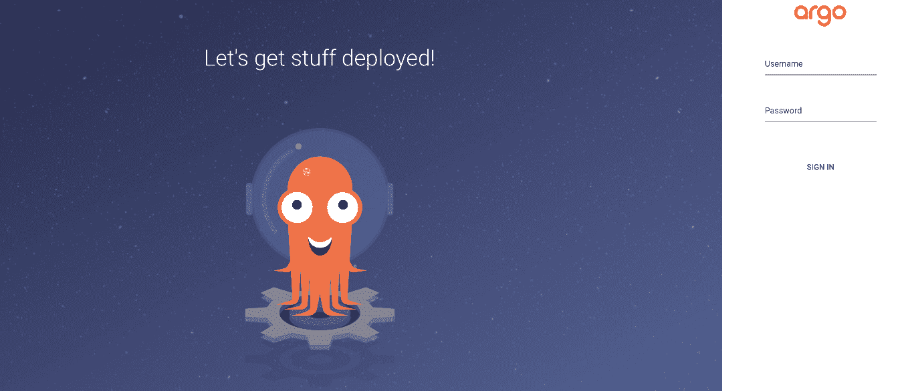
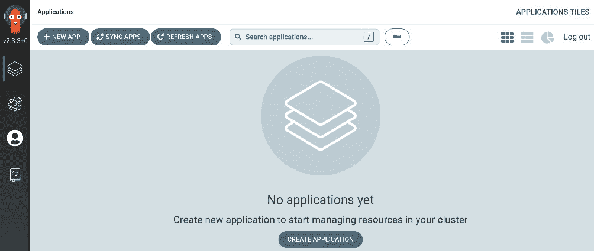
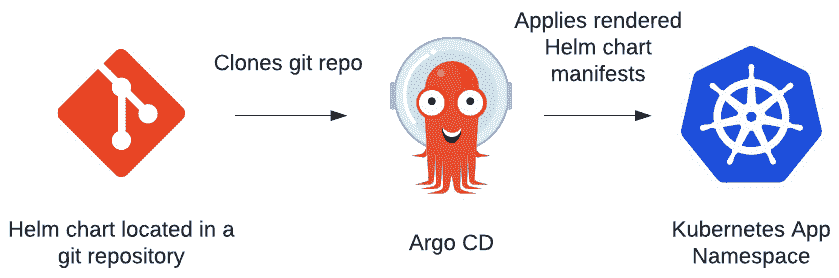
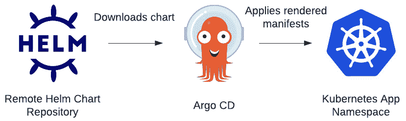
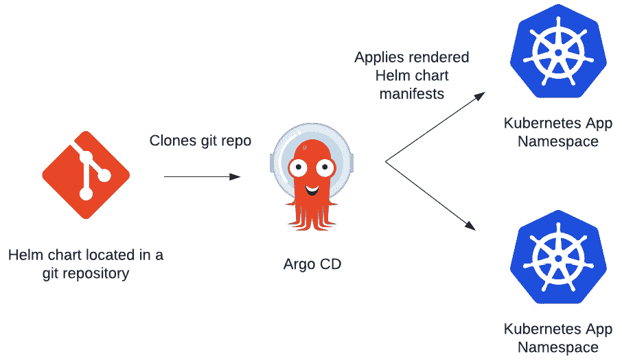

# 第十章：使用 CD 和 GitOps 自动化 Helm

在本书中，我们展示了如何使用不同的 Helm 命令来管理 Kubernetes 资源和应用。虽然这些命令（即 `install`、`upgrade`、`rollback` 和 `uninstall`）在执行各自的任务时非常有效，但我们一直是在命令行中手动调用它们。手动调用在管理多个不同的应用时可能成为痛点，也会使企业难以扩展。因此，我们应该探索自动化 Helm 部署的机会。

在本章中，我们将研究与**持续交付**（**CD**）和**GitOps**相关的概念。这些方法论涉及自动调用 Helm **命令行界面**（**CLI**）来基于 Git 仓库的内容执行自动化图表安装。通过实施 CD 和 GitOps 概念，你可以进一步提高使用 Helm 的效率。

在本章中，我们将涵盖以下主题：

+   理解 CI/CD 和 GitOps

+   设置你的环境

+   安装 Argo CD

+   从 Git 仓库部署 Helm 图表

+   从远程 Helm 图表仓库部署 Helm 图表

+   将 Helm 图表部署到多个环境

+   清理

# 技术要求

本章要求你在本地计算机上安装以下技术：

+   minikube

+   Helm

+   kubectl

+   Git

除了这些工具外，你还可以在 GitHub 上找到包含本章示例相关资源的 Packt 仓库，地址是 [`github.com/PacktPublishing/Managing-Kubernetes-Resources-using-Helm`](https://github.com/PacktPublishing/Managing-Kubernetes-Resources-using-Helm)。在本章中，我们将会引用该仓库。

# 理解 CI/CD 和 GitOps

到目前为止，我们已经讨论了手动调用 Helm CLI 来安装和管理 Helm 图表。虽然在开始使用 Helm 时这种方式是可以接受的，但当你在类似生产的环境中管理图表时，你需要考虑一些问题，包括以下内容：

+   我如何确保强制执行 Helm 图表部署的最佳实践？

+   参与部署过程的协作者会有什么影响？

你可能已经熟悉了部署 Helm 图表的最佳实践和流程；然而，任何新的协作者或团队成员可能没有相同的知识或专业技能。更不用说，随着你管理的应用数量增加，你在为他人提供支持时可能会受到限制。通过使用自动化和可重复的流程，我们可以解决这些挑战。

本章将主要关注 CD 和 GitOps，但如果我们不介绍与 CD 常常搭配的**持续集成**（**CI**），那将是一个遗憾。我们将在下一节讨论**持续集成/持续交付**（**CI/CD**）和 GitOps。

## CI/CD

随着企业多年来努力加速软件开发生命周期，自动化开发过程的需求应运而生，进而催生了 CI。CI 通过使用编排工具自动构建和测试应用程序代码来实现。当新的提交被推送到 Git 仓库时，编排工具会自动检索源代码，并执行预定的一系列步骤来构建应用程序（包括代码质量扫描、漏洞扫描等任务）。通过在新的提交添加时进行自动构建，可以在软件开发生命周期的早期发现回归和破坏性变更。CI 还通过提供一个共同的构建环境，帮助解决 *“它在我的机器上能工作”* 这一问题。

将 CI 的许多概念应用到整个软件开发生命周期中，随着应用程序向生产环境推进，最终导致了 CD 的诞生。CD 是一组定义好的步骤，用于推动软件通过发布过程。CD 已经在许多组织中获得了接受和流行，尤其是在执行适当的变更控制并要求批准才能让软件推进到下一个阶段的组织中。由于 CI/CD 相关的许多概念都以可重复的方式自动化，团队可以着手完全消除手动审批步骤，一旦他们确信已经建立了可靠的框架。

实现一个完全自动化的构建、测试、部署和发布过程而无需人工干预的过程，称为持续部署。虽然许多软件项目可能永远无法完全实现持续部署，但能够实施 CI/CD 强调的概念的团队，比那些采用较少自动化方法的团队能够更快地创造实际的商业价值。

在接下来的章节中，我们将介绍 GitOps 作为一种机制，以改善应用程序及其配置的管理方式。

## 使用 GitOps 将 CI/CD 提升到一个新水平

Kubernetes 是一个采用声明式配置的平台。虽然应用程序可以使用命令式的 `kubectl` 命令进行管理，但我们在*第一章*《理解 Kubernetes 和 Helm》中提到的首选方法是通过使用清单来声明性地指定资源。就像应用程序通过 CI/CD 管道运行一样，Kubernetes 清单也可以实现许多相同的 CI/CD 模式。像应用程序代码一样，Kubernetes 清单也应存储在源代码仓库中，如 Git，并且可以进行相同类型的构建、测试和部署实践。

将 Kubernetes 应用程序和集群配置的生命周期管理放入 Git 仓库的做法逐渐流行，这也促生了 GitOps 的概念。GitOps 首次由软件公司 *WeaveWorks* 于 2017 年提出，随着 GitOps 被作为一种管理 Kubernetes 配置的方式，逐渐获得越来越多的关注。虽然 GitOps 在 Kubernetes 背景下最为人知，但其原则也可以应用于任何类型的环境。

类似于 CI/CD，已经开发出了一些工具来管理 GitOps 流程。这些工具包括 **Argo CD**（来自 Intuit）和 **Flux**（来自 WeaveWorks）。不过，您不需要使用专门为 GitOps 设计的工具，因为任何自动化工具或 CI/CD 协调器都可以使用。传统的 CI/CD 工具和为 GitOps 设计的工具之间的主要区别在于，GitOps 工具能够持续监控目标环境的状态，并在实时状态与 Git 中定义的清单所规定的期望状态不匹配时应用期望的配置。在 Kubernetes 的背景下，这些工具利用了控制器模式，这也是 Kubernetes 本身的基础。

由于 Helm charts 最终会被渲染为 Kubernetes 资源，它们也可以用于参与 GitOps 流程。在本章中，我们将利用 Argo CD 以 GitOps 方式将 Helm chart 资源部署到 Kubernetes。请注意，这并不是 Argo CD 的全面概述，但它会让您了解如何将 Argo CD 与 Helm 集成，从而为 Helm 部署提供 GitOps 方法。

# 设置您的环境

在本章中，我们将创建几个命名空间来安装 Argo CD，并在不同的命名空间中部署示例 Helm chart。

运行以下命令以准备您的环境：

1.  通过运行 `minikube start` 命令启动 `minikube`：

    ```
    $ minikube start
    ```

1.  接着，创建一个新的命名空间 `argo`，稍后我们将在该命名空间中安装 Argo CD：

    ```
    $ kubectl create namespace argo
    ```

1.  接下来，创建一个名为 `chapter10` 的命名空间，在这个命名空间中我们将从 Argo CD 部署一个示例的 Helm chart：

    ```
    $ kubectl create namespace chapter10
    ```

1.  最后，创建两个命名空间，分别为 `chapter10-dev` 和 `chapter10-prod`。我们将使用这些命名空间来演示如何使用 Argo CD 在多个环境中部署 Helm chart：

    ```
    $ kubectl create namespace chapter10-dev
    $ kubectl create namespace chapter10-prod
    ```

在您的 `minikube` 环境准备好并创建好命名空间后，让我们从部署 Argo CD 开始。然后，我们将通过示例展示如何使用 Argo CD 使用 Helm 将应用程序部署到 Kubernetes。

# 安装 Argo CD

可以通过使用一组清单文件或安装 Helm chart 来在 Kubernetes 中安装 Argo CD。当然，我们将选择使用社区提供的 Helm chart 来安装 Argo CD。

Argo CD Helm chart 的仓库 URL 为 [`argoproj.github.io/argo-helm`](https://argoproj.github.io/argo-helm)（该链接可以在 Artifact Hub 中找到，具体过程见 *第三章*，*使用 Helm 安装您的第一个应用*）。

让我们使用 Helm CLI 添加这个仓库：

```
$ helm repo add argo https://argoproj.github.io/argo-helm
```

一旦仓库已添加，您可以进行安装。我们提供了一个 `values` 文件，您可以在 Packt 仓库中用于安装，地址为 [`github.com/PacktPublishing/Managing-Kubernetes-Resources-using-Helm/blob/main/chapter10/argo-values/values.yaml`](https://github.com/PacktPublishing/Managing-Kubernetes-Resources-using-Helm/blob/main/chapter10/argo-values/values.yaml)。提供的 `values` 文件禁用了 Dex（一个 OpenID Connect 提供者）以及 Argo 的通知系统，因为我们在本章中不会使用这些组件。

让我们通过运行以下命令在 `argo` 命名空间中安装 Argo CD：

```
$ helm install argo argo/argo-cd –-version 4.5.0 --values chapter10/argo-values/values.yaml -n argo
```

Helm 图表会在 `argo` 命名空间中安装以下组件：

+   `Application` 自定义资源。当创建 `Application` 资源时，Argo CD 会将资源创建到目标集群和命名空间。

+   `ApplicationSet` 自定义资源。`ApplicationSet` 提供了一种便捷的方式来部署多个不同但相关的 `Application` 资源。在演示如何将 Helm 图表部署到多个不同环境或命名空间时，我们将使用 ApplicationSets。

+   **Redis**，用于缓存后端数据。

+   **Argo CD Repo Server**，提供克隆 Git 仓库的本地实例。

+   **Argo CD Server**，提供与 Argo CD 交互的 API。此组件还提供前端 Web 界面。

一旦 `argo` 命名空间中的每个 pod 报告 1/1 就绪状态（通过运行 `kubectl get pods –n argo` 可以看到），我们就可以访问 Argo CD Web UI。首先，我们需要获取在 Helm 安装期间随机生成的管理员密码。我们可以通过访问 `argo` 命名空间中的 Kubernetes `secret` 来实现：

```
$ kubectl get secret argocd-initial-admin-secret –n argo –o jsonpath='{.data.password}' | base64 –d
```

访问 Web UI 的用户名将是 `admin`，密码是从 `the argocd-initial-admin-secret` 中获取的字符串。

最后，我们可以运行 `port-forward` 来访问 Web UI。在一个单独的终端中，运行以下 `port-forward` 命令：

```
$ kubectl port-forward svc/argo-argocd-server 8443:443 –n argo
```

运行 `port-forward` 命令后，在 Web 浏览器中导航到 [`localhost:8443`](https://localhost:8443)。接受自签名证书异常；您将看到 Argo CD 登录页面：



图 10.1 – Argo CD 登录页面

对于用户名，输入 `admin`，对于密码，提供在获取密码时显示的字符串，来自 `argocd-initial-admin-secret`。成功登录后，您应该看到以下标题为 **APPLICATIONS TILES** 的页面：



图 10.2 – Argo CD 应用程序面板页面

本页面可用于创建新应用，这些应用表示应用部署（或任何一组 Kubernetes 资源）。然而，遵循更具声明式配置方法的精神，我们将在本章中通过应用 `Application` YAML 资源来进行部署。话虽如此，当我们使用 `kubectl` 直接应用 `Application` 资源时，UI 将会填充应用图块。可以在本章中随时参考此 UI，查看其如何可视化。

Argo CD 成功部署后，让我们继续从 Git 仓库部署 Helm 图表。

# 从 Git 仓库部署 Helm 图表

按照真正的 GitOps 风格，Argo CD 可用于从 Git 仓库部署 Helm 图表。下图展示了使用 Argo CD 从 Git 仓库部署 Helm 图表时的流程：



图 10.3 – 从 Git 仓库部署 Helm 图表

在这里，你可以看到 Argo CD 克隆了包含所需 Helm 图表的 Git 仓库。然后，Argo CD 将该仓库解释为一个包含 Helm 图表的仓库，因为它注意到 `Chart.yaml` 文件和周围的 Helm 图表结构的存在。从那里，Argo CD 继续渲染 Helm 图表清单并将其应用到指定的 Kubernetes 命名空间。

请注意，Argo CD *渲染* Helm 图表模板并将其应用，而不是直接安装 Helm 图表。这是因为 Argo CD 只会应用 Kubernetes 清单，因此它首先会在内部运行 `helm template` 以根据提供的 Helm 值生成完整的 Kubernetes 清单。如果你在使用 Argo CD 部署图表后运行 `helm list` 命令，你将看不到任何发布项。不过，你仍然可以看到应用的资源。

你可能会好奇，渲染的 Kubernetes 清单在应用回滚时的影响，因为无法使用 `helm rollback` 命令。在 GitOps 思想中，你理想的回滚方式是通过在 Git 仓库中进行更改来撤销这些操作。然后，Argo CD 会检测到任何对目标分支的新提交，并应用所需的更改。话虽如此，Argo CD 确实具有本地回滚功能，可以回滚到以前的历史 ID。这使得用户无需回滚到 Git 仓库即可进行回滚。

让我们通过观察位于 Packt 仓库的 `chapter10/local-chart/application.yaml` 中的 `Application` 资源，开始从 Git 部署 Helm 图表 ([`github.com/PacktPublishing/Managing-Kubernetes-Resources-using-Helm/blob/main/chapter10/local-chart/application.yaml`](https://github.com/PacktPublishing/Managing-Kubernetes-Resources-using-Helm/blob/main/chapter10/local-chart/application.yaml))。我们可以将此资源拆分为不同的组件：

+   首先，我们必须定义资源的`kind`并提供资源的元数据：

    ```
    apiVersion: argoproj.io/v1alpha1
    kind: Application
    metadata:
      name: nginx
      namespace: argo
      finalizers:
          resources-finalizer.argocd.argoproj.io
    ```

请注意最终器`resources-finalizer.argocd.argoproj.io`。**最终器**在 Kubernetes 中用于触发管理控制器的删除前操作。通过这个最终器，我们告诉应用程序控制器，如果我们删除此应用程序资源，控制器应该首先删除渲染的 Kubernetes 资源。如果省略了最终器，应用程序控制器将直接删除应用程序资源，而不删除渲染的 Kubernetes 资源。

+   接下来，我们必须定义应用程序源。在此，我们指定 Git 仓库 URL 和 Helm 图表的路径：

    ```
    source:
      path: helm-charts/charts/nginx/
      repoURL: https://github.com/PacktPublishing/Managing-Kubernetes-Resources-using-Helm.git
      targetRevision: HEAD
      helm:
        values: |-
          resources:
            limits:
              cpu: 50m
              memory: 128Mi
            requests:
              cpu: 50m
              memory: 128Mi
    ```

从配置中可以看到，Argo CD 将在最新的提交（`HEAD`）处克隆仓库（https://github.com/PacktPublishing/Managing-Kubernetes-Resources-using-Helm.git）。克隆完成后，它会导航到`helm-charts/charts/nginx`路径，该路径包含一个 Nginx Helm 图表。

+   在这里，我们还指定了一组 Helm 值，在`helm.values`部分设置了资源限制和请求。值也可以通过使用`helm.parameters`设置来提供，如下所示：

    ```
    source:
      helm:
        parameters:
          - name: resources.limits.cpu
            value: 50m
           - name: resources.limits.memory
             value: 128Mi
    ```

这类似于在命令行中传递`--set`标志。

最后，值也可以通过`helm.valueFiles`设置提供。我们将在*将 Helm 图表部署到多个环境*部分中更详细地描述此用例。

+   `Application`资源的最后部分定义了目标和同步（sync）策略：

    ```
    destination:
       server: https://kubernetes.default.svc
       namespace: chapter10
    syncPolicy:
       automated:
         prune: true
         selfHeal: true
    ```

`destination`定义了目标集群的 Kubernetes 服务器 API 以及资源应该部署到的命名空间。`syncPolicy`决定了应用程序应该如何同步。在此上下文中，`sync`表示将集群中的资源应用或更新为应用源中的资源。同步可以手动进行，但在此示例中，我们选择自动化同步，这样当应用程序资源创建时，Nginx 就会自动部署。

在`syncPolicy.automated`部分下，可以指定几个其他配置项。`prune`字段是一个布尔值，决定了如果 Kubernetes 资源从源中移除，是否应该删除该资源。`selfHeal`设置指示 Argo CD 确保期望状态和实际状态的一致性。如果 Kubernetes 集群中的资源被修改，`selfHeal`将导致 Argo CD 还原该修改，使其与源配置匹配。

现在我们理解了定义 Nginx 应用程序的应用程序资源，我们可以使用`kubectl apply`命令安装此`Application`资源：

```
$ kubectl apply –f chapter10/local-chart/application.yaml -n argo
```

结果会在`argo`命名空间中创建`Application`资源，在那里 Argo CD 能够看到应用程序资源。

创建应用程序资源后，可以通过运行以下命令查看部署状态：

```
$ kubectl get applications –n argo
NAME    SYNC STATUS   HEALTH STATUS
nginx   Synced        Healthy
```

`SYNC STATUS` 显示期望状态是否已与实时状态同步，而 `HEALTH STATUS` 显示发布是否已完成，或者 pods 是否仍在启动中。由于 `nginx` 图表和相关资源正在集群中安装，`SYNC STATUS` 和 `HEALTH STATUS` 可能需要一段时间才能显示这些值。我们可以通过更传统的方式查看部署状态——即，在 `chapter10` 命名空间中运行 `kubectl get pods` 命令：

```
$ kubectl get pods –n chapter10
NAME                     READY   STATUS    RESTARTS   AGE
nginx-7bf8646cff-qjv9h   1/1     Running   0          2m5s
```

当 `Application` 显示为已同步并且健康时，说明你已经成功通过 Argo CD 从 Git 仓库部署了 Helm 图表！接下来，让我们删除该应用资源（这也会从 `chapter10` 命名空间中移除 `nginx` pod）：

```
$ kubectl delete –f chapter10/remote-registry/application.yaml
```

在我们离开这个话题之前，需要注意的是，正如 GitOps 模型所预期的那样，对 Git 中 `nginx` Helm 图表的更改将自动传播到 Kubernetes 环境。如果你更新了 `nginx` 图表并将新提交发布到目标分支的 Git 仓库中，Argo CD 会在下次轮询间隔中注意到这个变化，并根据仓库中定义的期望状态更新 Kubernetes 命名空间。为了更快地同步，可以在 Git 仓库上配置 webhook，以事件驱动的方式触发 Argo CD 同步。有关配置 webhook 的信息，请参见 Argo CD 文档：[`argo-cd.readthedocs.io/en/stable/operator-manual/webhook/`](https://argo-cd.readthedocs.io/en/stable/operator-manual/webhook/)。

接下来，我们将学习如何使用 Argo CD 从远程图表仓库部署 Helm 图表。

# 从远程 Helm 图表仓库部署应用程序

在安装 Helm 图表时，用户通常会与远程仓库进行交互。同样，我们可以使用 Argo CD 从指定的 Helm 图表仓库部署应用程序。

以下图表显示了通过 Argo CD 从远程 Helm 图表仓库部署应用程序的流程：



图 10.4 – 从远程 Helm 图表仓库部署应用程序

首先，Argo CD 下载在 `Application` 资源中配置的 Helm 图表。然后，它渲染该 Helm 图表并将清单应用到目标集群和命名空间。

我们在 Packt 仓库的 `chapter10/remote-registry/application.yaml` 中提供了一个示例 `Application` 资源 ([`github.com/PacktPublishing/Managing-Kubernetes-Resources-using-Helm/blob/main/chapter10/remote-registry/application.yaml`](https://github.com/PacktPublishing/Managing-Kubernetes-Resources-using-Helm/blob/main/chapter10/remote-registry/application.yaml))。该资源的配置与上一节中的 `Application` 类似，但我们可以在 `source` 部分观察到一个关键的不同点：

```
source:
  chart: nginx
  targetRevision: 9.7.6
  repoURL: https://raw.githubusercontent.com/bitnami/charts/archive-full-index/bitnami 
```

在这里，我们没有提供 Git 仓库，而是提供了远程 Helm 图表仓库的位置，以及图表的名称和版本。如您所见，此`Application`将指示 Argo CD 从 Bitnami 图表仓库部署`nginx`图表的版本`9.7.6`。

从图表仓库部署 Helm 图表的过程与从 Git 仓库部署是相同的——只需将`Application`资源应用到`argo`命名空间。您可以自由地按照前一节提供的相同步骤，将应用程序部署到`chapter10`命名空间。

当我们讨论将 Helm 图表部署到多个环境时，过程会有所变化，这个话题我们将在下一节中讨论。

# 将 Helm 图表部署到多个环境

在前面的章节中，我们使用 Argo CD 将 Helm 图表部署到单一环境（或命名空间）。然而，在企业中部署应用程序时，您通常会期望将应用程序部署到多个不同的环境，达到类似下图所示的过程：



图 10.5 – 部署到多个命名空间

您可能希望将图表部署到不同的环境（独立的命名空间甚至是独立的集群），原因多种多样，包括高可用性，或是将应用程序部署到管道的多个阶段，如开发、测试和生产环境。幸运的是，我们可以在 Argo CD 中使用`ApplicationSet`构建来实现这一目标。

假设我们有两个独立的命名空间——一个用于开发（dev），另一个用于生产（prod）。我们可以创建两个独立的`Application`资源，每个资源在目标部分中指向一个独立的命名空间：

+   Dev 环境将如下所示：

    ```
    destination:
      server: https://kubernetes.default.svc
      namespace: dev
    ```

+   生产环境（Prod）将非常相似，但我们会在`namespace`属性中指定`prod`：

    ```
    destination:
      server: https://kubernetes.default.svc
      namespace: prod
    ```

使用两个不同的`Application`资源——每个环境一个——是处理这种类型部署的完全有效的选项。然而，Argo CD 引入了`ApplicationSet`，作为一种将多个`Application`实例包装成单个资源的方法，使您可以在不管理多个资源 YAML 文件的情况下定义多个目标。

`ApplicationSet`的示例可以在 Packt 仓库中的`chapter10/multiple-envs/applicationset.yaml`找到（[`github.com/PacktPublishing/Managing-Kubernetes-Resources-using-Helm/blob/main/chapter10/multiple-envs/applicationset.yaml`](https://github.com/PacktPublishing/Managing-Kubernetes-Resources-using-Helm/blob/main/chapter10/multiple-envs/applicationset.yaml)）。让我们来分析一下该资源的不同部分：

+   `ApplicationSet`的第一个组件是`generators`部分，它生成用于后续动态配置应用程序详细信息（如源和目标）的参数。生成器有许多不同类型，可以在 Argo CD 文档中获得更详细的说明，文档链接为[`argocd-applicationset.readthedocs.io/en/stable/Generators/`](https://argocd-applicationset.readthedocs.io/en/stable/Generators/)。在我们的示例中，我们使用了`list`生成器，它允许提供一组简单的键值对：

    ```
    generators:
       - list:
           elements:
            - env: dev
            - env: prod
    ```

如你所见，定义我们不同环境的两个元素已经指定——`dev`和`prod`。我们将在`ApplicationSet`的其余部分中引用这些环境，将`nginx`图表部署到我们的部署管道的两个阶段。

+   接下来，我们必须定义`Application`模板。我们首先提供一个名称，`ApplicationSet`将把该名称注入到生成的`Applications`中：

    ```
    metadata:
       name: nginx-{{ env }}
    ```

`{{ env }}`语法表示一个占位符，它将被`generators`部分中描述的`env`元素替换。因此，当我们创建`ApplicationSet`时，我们可以期望会创建两个不同的应用程序：`– nginx-dev`和`nginx-prod`。

+   现在我们已经指定了将要创建的应用程序的名称，接下来可以配置源。这将与我们在之前的章节中看到的内容类似：

    ```
    source:
      path: chapter10/multiple-envs/nginx
      repoURL: https://github.com/PacktPublishing/Managing-Kubernetes-Resources-using-Helm.git
      targetRevision: HEAD
       helm:
        releaseName: nginx
         valueFiles:
          - values/common-values.yaml
          - values/{{ env }}/values.yaml
    ```

这个源表示 Argo CD 将部署位于[`github.com/PacktPublishing/Managing-Kubernetes-Resources-using-Helm.git`](https://github.com/PacktPublishing/Managing-Kubernetes-Resources-using-Helm.git)的`chapter10/multiple-envs/nginx`下的 Helm 图表。然而，我们并不是在每个环境中部署相同的配置，而是会根据环境应用稍微不同的值。这可以在`helm.valueFiles`设置中看到，它提供了一个值文件列表供应用（类似于在命令行中使用`--values`标志）。无论环境如何，我们始终会应用在`values/common-values.yaml`文件中定义的通用值集，但根据环境的不同，我们还会应用`values/dev/values.yaml`文件或`values/prod/values.yaml`文件。

这些值文件可以在 `chapter10/multiple-envs/nginx/values` 目录中查看（[`github.com/PacktPublishing/Managing-Kubernetes-Resources-using-Helm/tree/main/chapter10/multiple-envs/nginx/values`](https://github.com/PacktPublishing/Managing-Kubernetes-Resources-using-Helm/tree/main/chapter10/multiple-envs/nginx/values)）。请注意，由于 Argo CD 已配置为使用 `chapter10/multiple-envs/nginx` chart 路径，因此值文件必须位于此路径下。同样需要注意的是，这种应用值文件的方法仅适用于从 Git 部署 Helm chart。当从远程 Helm chart 仓库部署时，可以使用 `helm.values` 或 `helm.parameters` 方法提供值，正如 *从 Git 仓库部署 Helm chart* 章节中所描述的那样。

+   最后，我们必须定义 Argo CD 应该将资源部署到的目标：

    ```
    destination:
      server: https://kubernetes.default.svc
      namespace: chapter10-{{ env }}
    ```

这将把 Helm chart 部署到 `chapter10-dev` 和 `chapter10-prod` 命名空间。在此示例中，我们通过命名空间将环境分开，出于简化的考虑，但您也可以通过参数化 `destination.server` 部分来指示 Argo CD 部署到不同的集群，就像我们参数化命名空间一样。

现在我们已经知道了如何创建 `ApplicationSet`，让我们将其应用到我们的 Kubernetes 集群中，将 Helm chart 部署到不同的环境。首先，应用位于 `chapter10/multiple-envs/applicationset.yaml` 的 `ApplicationSet`（[`github.com/PacktPublishing/Managing-Kubernetes-Resources-using-Helm/blob/main/chapter10/multiple-envs/applicationset.yaml`](https://github.com/PacktPublishing/Managing-Kubernetes-Resources-using-Helm/blob/main/chapter10/multiple-envs/applicationset.yaml)）：

```
$ kubectl apply –f chapter10/multiple-envs/applicationset.yaml -n argo
```

不久后，我们应该在 `argo` 命名空间中看到两个不同的应用：

```
$ kubectl get applications –n argo
NAME         SYNC STATUS   HEALTH STATUS
nginx-dev    Synced        Healthy
nginx-prod   Synced        Healthy
```

我们还可以观察到在不同环境中运行的部署：

```
$ kubectl get pods –n chapter10-dev
NAME                     READY   STATUS    RESTARTS   AGE
nginx-6d948d7f48-kkr4j   1/1     Running   0          75s
$ kubectl get pods –n chapter10-prod
NAME                     READY   STATUS    RESTARTS   AGE
nginx-6d948d7f48-76p22   1/1     Running   0          107s
nginx-6d948d7f48-bf76x   1/1     Running   0          107s
nginx-6d948d7f48-rcq4z   1/1     Running   0          107s
```

您可以在 `chapter10-prod` 中观察到三个不同的 `nginx` pod，因为 `chapter10/multiple-envs/nginx/values/prod/values.yaml` 中的值文件指定了三个副本，而 `dev values` 文件仅指定了一个副本。

如果您在 minikube 环境中观察到类似于之前展示的输出，恭喜您！您已经成功地通过 Argo CD 以 GitOps 方式将 Helm chart 部署到多个环境中。

让我们通过清理环境来结束这一章。

# 清理环境

首先，让我们删除这一章和 Argo 安装中的命名空间：

```
$ kubectl delete namespace chapter10-prod
$ kubectl delete namespace chapter10-dev
$ kubectl delete namespace chapter10
$ helm uninstall argo –n argo
$ kubectl delete namespace argo
```

然后，您可以使用 `minikube stop` 命令停止 minikube 集群。

# 总结

CD 和 GitOps 提供了可扩展的方法，进一步抽象化了 Helm 所提供的功能，允许通过 Git 仓库或远程 Chart 仓库的内容来控制部署。在本章中，我们介绍了 CI/CD 和 GitOps 的概念，并通过使用 Argo CD 作为实现这些模型的解决方案，探索了在 Helm 环境下的实现方式。接着，我们学习了如何安装 Argo CD 以及如何创建`Application`和`ApplicationSet`资源，它们是启用 Argo CD 部署并与指定的 Helm 图表和配置同步的基本组件。最后，我们学习了如何在多个不同环境中部署 Helm 图表。

在下一章中，我们将探索另一个抽象概念——Helm 操作符。

# 问题

请回答以下问题，测试你对本章内容的掌握情况：

1.  CI 和 CD 有什么区别？

1.  CD 和 GitOps 之间有什么关系？

1.  `Argo CD`的`Application`和`ApplicationSet`之间有什么区别？

1.  在 Argo CD 中，如何等价于在命令行中传递`--values`标志？

1.  在 Argo CD 中，如何等价于在命令行中传递`--set`标志？

1.  什么是`ApplicationSet`生成器？为什么在部署到多个环境时，生成器非常有用？
