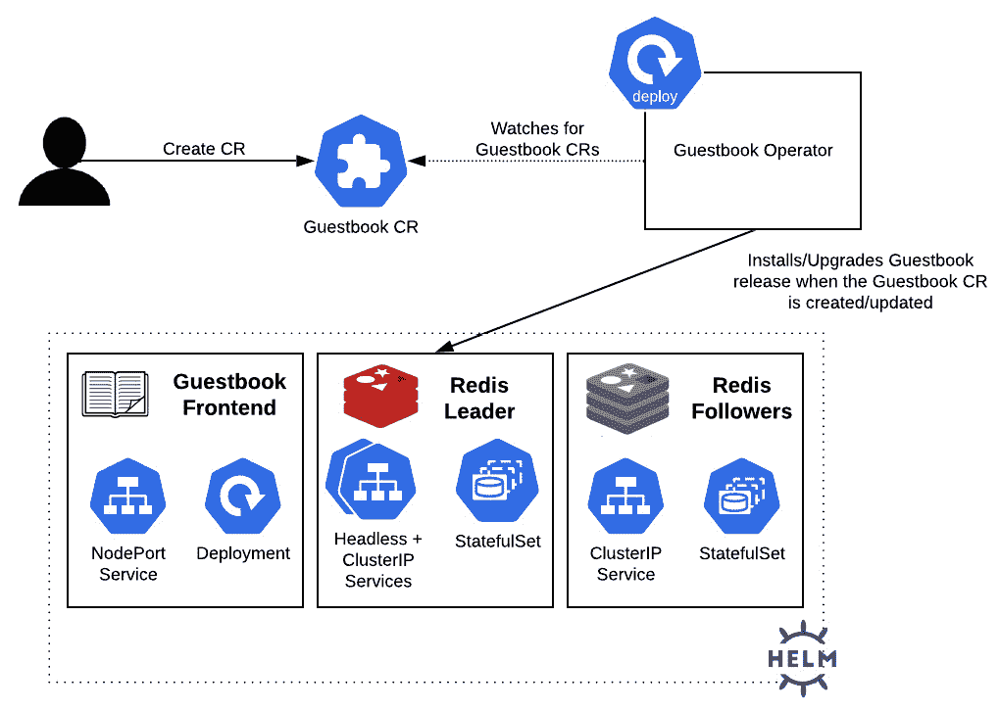
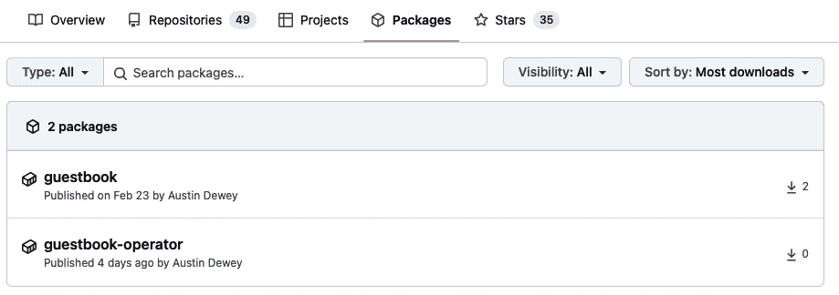

# 11

# 使用 Helm 与操作符框架

使用 Helm 的一个优势是能够声明式地定义应用程序的期望状态。通过 Helm，期望的状态通过模板和 Helm 值进行管理，当通过 `install` 或 `upgrade` 命令提供时，这些值会应用于同步 Kubernetes 集群中的实时状态。在前面的章节中，这是通过手动调用这些命令来执行的。最近，在 *第十章*，*使用 CD 和 GitOps 自动化 Helm* 中，我们使用 Argo CD 作为一种状态同步的方法。

另一种将更改同步到 Kubernetes 集群的方法是使用一个控制器，该控制器定期检查期望的状态是否与环境中的当前配置匹配。如果状态不匹配，应用程序可以自动修改环境以匹配期望的状态。这个控制器是应用程序的基础，通常被称为**Kubernetes 操作符**。

在本章中，我们将创建一个基于 Helm 的操作符，帮助确保期望的状态始终与集群的实时状态匹配。如果不匹配，操作符将执行相应的 Helm 命令以协调环境的状态。

本章将涵盖以下主题：

+   理解 Kubernetes 操作符

+   理解 Guestbook 操作符控制循环

+   使用 Helm 管理操作符，**自定义资源定义**（**CRDs**）和**自定义资源**（**CRs**）

+   清理

# 技术要求

本章你需要在本地机器上安装以下技术：

+   minikube

+   Helm

+   kubectl

除了这些工具之外，你还应该在 GitHub 上找到包含与示例相关资源的 Packt 仓库，网址为 [`github.com/PacktPublishing/Managing-Kubernetes-Resources-using-Helm`](https://github.com/PacktPublishing/Managing-Kubernetes-Resources-using-Helm)。本章将会多次引用这个仓库。

# 理解 Kubernetes 操作符

Kubernetes 的基本原则之一是集群中资源的当前状态与期望状态相匹配，这个过程被称为**控制循环**。控制循环是一种持续不断的模式，通过使用控制器监控集群的状态。Kubernetes 包含多个原生控制器，例子包括从拦截请求的准入控制器到确保 Pod 副本配置的复制控制器。

随着 Kubernetes 兴趣的不断增长，提供用户扩展平台功能的能力，以及围绕管理应用生命周期的更多智能方式，促使了几个重要功能的创建，以支持 Kubernetes 开发。首先，引入 CRD 使用户能够扩展默认的 Kubernetes API，从而创建并注册新的资源类型。注册新的 CRD 会在 Kubernetes API 服务器上创建一个新的资源路径。例如，注册一个名为 `kubectl get Guestbook` 的对象类型 CRD，现在可以用来查看当前所有可用的 Guestbook 对象。随着这一新能力的实现，开发者现在可以创建自己的控制器来监控这些 CR 类型，并通过使用 CRD 来管理应用的生命周期。

另一个有助于塑造 Kubernetes 中开发者体验的重要功能是对部署到 Kubernetes 的应用类型的改进。与小型和简单的应用程序不同，越来越多复杂且有状态的应用程序被频繁部署。通常，这些类型的高级应用程序需要更高水平的管理和维护，例如包括备份、恢复和升级等 *第二天* 活动。这些任务超出了 Kubernetes 原生控制器的典型类型，因为需要将与被管理应用程序相关的深入知识嵌入其中。使用 CR 来管理应用及其组件的模式被称为 **操作符** 模式。该模式最早由软件公司 **CoreOS** 于 2016 年提出，操作符旨在捕获人类操作员管理应用程序生命周期时所具备的知识。操作符作为普通的容器化应用程序打包，部署在 pod 中，针对 CR 的 API 变更做出反应。

操作符通常使用名为 **kubebuilder** 的框架编写，该框架包含简化 CR 创建和与 Kubernetes 环境交互的功能。此后，已创建几个额外的框架，以进一步扩展支持操作符开发的能力。其中一个流行的工具包是 **Operator Framework**，它为最终用户提供了使用以下三种技术之一创建操作符的能力：

+   **Go**

+   **Ansible**

+   **Helm**

基于 Go 的操作符利用 Go 编程语言实现控制循环逻辑。基于 Ansible 的操作符利用 Ansible CLI 工具和 Ansible 剧本来管理资源的状态。Ansible 是一个流行的开源配置管理工具。

在本章中，我们将重点讨论基于 Helm 的操作符。Helm 操作符将其控制循环逻辑基于 Helm 图表和 Helm CLI 提供的子集功能。因此，它们为 Helm 用户提供了一种简单的方式来实现自己的操作符。

理解了 operators 后，让我们继续通过使用 Helm 创建我们自己的 operator。

# 理解 Guestbook operator 控制循环

在本章中，我们将编写一个基于 Helm 的 operator，用于安装 Guestbook Helm 图表。该图表可以在 Packt 仓库中找到，网址为 [`github.com/PacktPublishing/Managing-Kubernetes-Resources-using-Helm/tree/main/helm-charts/charts/guestbook`](https://github.com/PacktPublishing/Managing-Kubernetes-Resources-using-Helm/tree/main/helm-charts/charts/guestbook)。

下图演示了 Guestbook operator 部署后将如何运作：



图 11.1 – Guestbook operator 控制循环

Guestbook operator 会不断监控 Guestbook CR 的创建、删除或修改。当创建一个 Guestbook CR 时，operator 会安装 Guestbook Helm 图表；当 CR 被修改时，它会相应地升级发布，以确保集群的状态与 CR 定义的目标一致。同样，当 CR 被删除时，operator 会卸载该发布。

了解了 operator 的控制循环如何运作后，让我们设置一个可以构建和部署 operator 的环境。

## 准备本地开发环境

要创建 Helm operator，您至少需要以下 CLI 工具：

+   `operator-sdk`

+   一个容器管理工具，如 `docker`、`podman` 或 `buildah`

`operator-sdk` CLI 是一个用于帮助开发 Kubernetes operator 的工具包。它包含简化 operator 开发过程的内在逻辑。在底层，`operator-sdk` 需要一个容器管理工具来构建 operator 镜像。支持的容器管理工具有 `docker`、`podman` 和 `buildah`。

安装 `operator-sdk` CLI 非常简单，您可以从 GitHub 下载一个版本，网址为 [`github.com/operator-framework/operator-sdk/releases`](https://github.com/operator-framework/operator-sdk/releases)。然而，安装 `docker`、`podman` 或 `buildah` 的过程因操作系统不同而大不相同；更重要的是，Windows 用户将无法原生使用 `operator-sdk` 工具包。

幸运的是，可以将 minikube `operator-sdk` 工具包安装到 minikube 中，并使用 minikube 虚拟机作为创建 operator 的环境。

首先，启动 minikube 虚拟机：

```
$ minikube start
```

一旦虚拟机启动，请按照以下步骤操作：

1.  通过运行`minikube ssh`命令访问虚拟机：

    ```
    $ minikube ssh
    ```

1.  一旦进入虚拟机，您需要下载 `operator-sdk` CLI。可以使用 `curl` 命令来完成此操作。请注意，写本文时使用的 `operator-sdk` 版本是 `v1.20.0`。

要下载此版本的`operator-sdk` CLI，请运行以下命令：

```
$ curl –o operator-sdk –L https://github.com/operator-framework/operator-sdk/releases/download/v1.20.0/operator-sdk_linux_amd64
```

1.  下载后，您需要更改 `operator-sdk` 二进制文件的权限，使其可由用户执行。运行 `chmod` 命令进行此修改：

    ```
    $ chmod u+x operator-sdk
    ```

1.  接下来，将`operator-sdk`二进制文件移动到`PATH`变量管理的目录中，例如`/usr/local/bin`。由于此操作需要 root 权限，你需要使用`sudo`运行`mv`命令：

    ```
    $ sudo mv operator-sdk /usr/local/bin
    ```

1.  最后，通过运行`operator-sdk version`命令验证你的`operator-sdk`安装：

    ```
    $ operator-sdk version
    operator-sdk version: "v1.20.0", commit: "deb3531ae20a5805b7ee30b71f13792b80bd49b1", kubernetes version: "1.23", go version: "go1.17.9", GOOS: "linux", GOARCH: "amd64"
    ```

1.  作为额外的步骤，你还应该在 minikube 虚拟机中克隆 Packt 仓库，因为稍后我们需要它来构建我们的 Helm 操作器。运行以下命令来安装`git`并在虚拟机中克隆仓库（注意，我们还将安装`make`，它对于稍后构建操作器镜像是必要的）：

    ```
    $ sudo apt update
    $ sudo apt install git make
    $ git clone https://github.com/PacktPublishing/Managing-Kubernetes-Resources-using-Helm.git
    ```

现在你已经在 minikube 虚拟机中创建了本地开发环境，让我们开始编写 Guestbook 操作器。请注意，操作器代码的示例位于 Packt 仓库中，链接为[`github.com/PacktPublishing/Managing-Kubernetes-Resources-using-Helm/tree/main/chapter11/guestbook-operator`](https://github.com/PacktPublishing/Managing-Kubernetes-Resources-using-Helm/tree/main/chapter11/guestbook-operator)。

## 搭建操作器文件结构

与 Helm 图表本身类似，通过`operator-sdk`二进制文件构建的 Helm 操作器具有特定的文件结构，必须遵循该结构。文件结构在下表中有说明：

| **文件/文件夹** | **定义** |
| --- | --- |
| `Dockerfile` | 用于构建操作器镜像 |
| `Makefile` | 提供了一组便捷的目标，用于构建操作器镜像并将其部署到 Kubernetes |
| `PROJECT` | 提供`operator-sdk`的元数据 |
| `config/` | 包含 CRD、CR 和操作器实例的 Kubernetes 资源清单文件 |
| `helm-charts/` | 包含操作器负责安装的 Helm 图表 |
| `watches.yaml` | 定义了操作器负责监视的 CRs |

表 11.1 – operator-sdk 文件结构

这个文件结构可以通过使用`operator-sdk init`和`operator-sdk create api`命令轻松创建。让我们一起走一遍这个过程，创建一个`Guestbook`类型的自定义 API 版本`demo.example.com/v1alpha1`：

1.  首先，为操作器创建一个新文件夹并`cd`进入新创建的目录：

    ```
    $ mkdir guestbook-operator
    $ cd guestbook-operator
    ```

1.  接下来，使用`operator-sdk init`命令初始化项目：

    ```
    $ operator-sdk init --plugins helm --domain example.com
    ```

注意使用了`--plugins helm`参数。它指定我们的项目是一个 Helm 操作器，并提供了必要的项目框架。`–domain example.com`参数指定了将用于 CR 的 Kubernetes API 组。然而，这个命令还没有创建 Guestbook CRD 和控制循环逻辑，接下来的步骤将处理这一部分。

1.  运行`operator-sdk create api`命令来创建 Guestbook CRD 和相关的清单文件：

    ```
    $ operator-sdk create api --group demo --version v1alpha1 --kind Guestbook --helm-chart ../Managing-Kubernetes-Resources-using-Helm/helm-charts/charts/guestbook
    ```

你可能会看到关于 RBAC 规则的警告，但对于这个示例来说，可以安全忽略。实际上，你应该始终确保 RBAC 规则遵循最小权限原则。

通过成功创建 Guestbook 操作员框架，让我们构建操作员并将其推送到容器注册表，稍后我们将在那里拉取镜像以进行部署。

## 构建操作员镜像

`operator-sdk`生成的文件之一是`Makefile`，它包含了构建操作员镜像并将其推送到容器注册表的目标。然而，在我们构建镜像之前，需要先访问一个容器注册表。

在*第八章*中，*发布到 Helm Chart 仓库*，我们使用了位于`ghcr.io`的 GitHub 容器注册表来发布镜像。我们将使用相同的注册表来发布我们的 Guestbook 操作员。

为了发布到`ghcr.io`，你需要先创建一个**个人访问令牌**（**PAT**）。如果你已经在*第八章*中创建过一个令牌，即*发布到 Helm Chart 仓库*，则不需要重新创建（除非令牌已经过期或你丢失了令牌）。

如果确实需要创建 PAT，你可以按照以下步骤操作：

1.  登录 GitHub。登录后，在页面的右上角选择你的个人资料图片，并从下拉菜单中点击**设置**。

1.  点击**开发者设置**并选择**个人账户令牌**。

1.  点击**生成新令牌**按钮，开始创建令牌。

1.  为令牌输入一个唯一的名称，例如`Learn Helm`。

1.  选择令牌的过期日期。建议指定过期日期，因为这符合安全最佳实践。

1.  选择授予令牌的作用域（权限）。以下作用域是管理容器注册表内容所必需的：

    1.  `read:packages`

    1.  `write:packages`

    1.  `delete:packages`

1.  点击**生成令牌**按钮来创建令牌。

在离开页面之前，请务必复制令牌。如果在记下令牌内容之前离开了页面，令牌可以随时重新生成。但是，之前指定的值将不再有效。

一旦你创建了 PAT 并复制了访问令牌，你可以通过在 minikube 虚拟机中使用`docker login`命令登录`ghcr.io`注册表。在`Username`提示框中输入你的 GitHub 用户名，在`Password`提示框中粘贴 PAT 令牌：

```
$ docker login ghcr.io
Username: <user>
Password: <Paste your PAT token here>
```

一旦你登录到注册表，就可以继续构建并部署操作员镜像。为此，我们可以使用`make`工具运行不同的 Makefile 目标：

1.  首先，我们需要定义镜像名称。Makefile 默认的镜像名称是`controller:latest`。我们可以通过设置`IMG`环境变量来为其指定一个更具描述性的名称：

    ```
    $ export IMG=ghcr.io/<GITHUB_USERNAME>/guestbook-operator:1.0.0
    ```

设置`IMG`变量时，请确保替换为你的 GitHub 用户名。

1.  接下来，我们可以使用`docker-build` Makefile 目标开始镜像构建：

    ```
    $ make docker-build
    ```

如果构建成功，你将看到 `Successfully tagged` 消息，后面跟着容器镜像的名称和标签。另外，你可以使用 `docker images` 命令验证镜像是否创建成功：

```
$ docker images
REPOSITORY                                 TAG
Ghcr.io/<GITHUB_USERNAME>/guestbook-operator          1.0.0
```

1.  最后，我们可以使用 `docker-push` 目标推送我们的镜像：

    ```
    $ make docker-push
    . . .
    1.0.0: digest: sha256:1f73c8f37afea7c7f4eabaa741d5505880b 5f1bda4de4fad15862acd7d16fb23 size: 1779
    ```

默认情况下，成功推送到 `ghcr.io` 后，您的镜像将是私有的。为了避免需要指定 Kubernetes 拉取密钥来访问镜像，我们可以更新镜像设置，使镜像公开可用。

首先，在 GitHub 上，选择页面右上角的个人头像，选择 `guestbook-operator` 镜像（在截图中可以看到来自 *第八章* 的 Guestbook 镜像，*发布到 Helm 图表仓库*，也可以看到）：



图 11.2 – GitHub Packages 页面

接下来，选择 `guestbook-operator` 包。在屏幕的最右侧，选择 **Package Settings**，然后更新 **Change Visibility** 设置为 **Public**。

如果你已经成功将镜像的可见性更新为 **Public**，那么你就成功推送了镜像，现在可以在无需凭证的情况下访问它。接下来，让我们继续将操作器部署到 Kubernetes。

## 部署 Guestbook 操作器

类似于构建操作器，我们可以使用一组 Makefile 目标来部署我们的 Guestbook 操作器。由 `operator-sdk` 生成的 Makefile 包含四个与操作器安装或移除相关的目标：

+   `install`: 该目标将 CRD 安装到 Kubernetes 集群中。此目标会将 Guestbook API 添加到集群中。

+   `uninstall`: 该目标卸载 Kubernetes 集群中的 CRD。此目标会从集群中移除 Guestbook API。

+   `deploy`: 该目标安装 CRD 并将 Guestbook 操作器部署到 Kubernetes 集群中。稍后我们将使用此目标进行部署。

+   `undeploy`: 该目标从 Kubernetes 集群中撤销（或移除）CRD 和 Guestbook 操作器实例。

在后台，每个目标都使用 `kubectl` 和一个名为 `config` 文件夹的配置管理工具。Kustomize 是一个高层次的工具，使用 `kustomization.yaml` 文件来指定将要应用的 Kubernetes 清单文件。此外，它还会向每个清单添加补丁和公共配置，例如目标命名空间和资源名称。

`config` 文件夹的内容如下面的表格所示：

| **文件夹** | **定义** |
| --- | --- |
| `config/crd/` | 包含用于扩展 Kubernetes API 的 CRD。对于我们的 Guestbook 操作器，只有一个 CRD。 |
| `config/default/` | 包含一个父级 `kustomization.yaml` 文件，用于应用 CRD、RBAC 和操作器（也称为 *manager*）资源。 |
| `config/manager/` | 包含创建操作器（或 `manage`r）实例的部署资源。 |
| `config/manifests/` | `config/default/` 文件夹的超集。在这里，`config/manifests` 应用 CRD、RBAC 和操作器资源，还应用了一个示例 Guestbook CR 和一个 *scorecard*，用于测试操作器。 |
| `config/prometheus/` | 包含用于跟踪指标的 Prometheus `ServiceMonitor` 资源。默认情况下禁用，但可以在位于 `config/default/` 下的 `kustomization.yaml` 文件中启用。 |
| `config/rbac/` | 包含 `Role`、`RoleBinding` 和 `ServiceAccount` 资源。这些资源授予操作器管理 Guestbook 资源的权限。它们还为 Kubernetes 集群中的用户创建 Guestbook 编辑和查看角色。 |
| `config/samples/` | 包含一个示例 Guestbook 清单。 |
| `config/scorecard/` | 包含用于测试操作器的清单。默认情况下未使用。 |

图 11.4 – 配置文件夹的内容

当我们运行 `make deploy` 命令时，Kustomize 会定位 `config/default/` 中的 `kustomization.yaml` 文件，并应用 `config/crd/`、`config/manager/` 和 `config/rbac/` 目录中的资源。然后，当操作器安装完成后，我们将应用位于 `config/samples/demo_v1alpha1_guestbook.yaml` 的 Guestbook CR。让我们来看一下 `demo_v1alpha1_guestbook.yaml` 文件中的一个片段：

```
apiVersion: demo.example.com/v1alpha1
kind: Guestbook
metadata:
  name: guestbook-sample
spec:
  # Default values copied from <project_dir>/helm-charts/guestbook/values.yaml
  affinity: {}
  autoscaling:
    enabled: false
    maxReplicas: 100
    minReplicas: 1
    targetCPUUtilizationPercentage: 80
  env:
  - name: GET_HOSTS_FROM
    value: env
  - name: REDIS_LEADER_SERVICE_HOST
    value: redis-master
  - name: REDIS_FOLLOWER_SERVICE_HOST
    value: redis-replicas
  fullnameOverride: ""
  image:
    pullPolicy: IfNotPresent
    repository: gcr.io/google_samples/gb-frontend
    tag: ""
```

上述的 YAML 看起来熟悉吗？`spec` 部分下的每个条目引用了 Guestbook chart 中 `values.yaml` 文件中的默认值。这是使用 Helm 操作器时提供值的方式。用户并不提供一个 `values.yaml` 文件，而是在 Guestbook CR 中写入值。然后，当资源应用时，操作器会消费这些值并相应地部署应用程序。

基于对操作器 `config/` 文件夹和 `Makefile` 目标的基本理解，我们可以通过以下步骤部署 Guestbook 操作器：

1.  为了部署 Guestbook 操作器，我们需要认证到 Kubernetes 集群。由于 minikube 虚拟机中没有安装 `kubectl`，也没有 `kubeconfig`，我们可以用来进行身份验证，因此从主机机器部署操作器会更简单。

通过运行以下命令退出 minikube 虚拟机：

```
$ exit
```

1.  我们在 minikube 虚拟机中创建的资源也位于 Packt 仓库中的 `chapter11/guestbook-operator/` 文件夹。你可以克隆该仓库并通过运行以下命令进入 `guestbook-operator` 文件夹：

    ```
    $ git clone https://github.com/PacktPublishing/Managing-Kubernetes-Resources-using-Helm.git
    $ cd Managing-Kubernetes-Resources-using-Helm/chapter11/guestbook-operator
    ```

来自 Packt 仓库的文件与你在 minikube 虚拟机中创建的文件相同，唯一的例外是。如你可能从前面的章节中回忆的那样，Guestbook Helm 图表包含用于备份和恢复 Redis 数据库的钩子。这些钩子要求操作符具有管理 `Job` 和 `PersistentVolumeClaim` 资源的权限。由于 `operator-sdk` 生成的角色不包含这些资源，因此我们在位于 `chapter11/guestbook-operator/config/rbac/role.yaml` 的角色定义末尾添加了它们。以下是我们添加的权限：

```
- apiGroups:
  - ""
  resources:
  - persistentvolumeclaims
  verbs:
  - create
  - delete
  - get
  - list
  - patch
  - update
  - watch
- apiGroups:
  - batch
  resources:
  - jobs
  verbs:
  - create
  - delete
  - get
  - list
  - patch
  - update
  - watch
```

1.  接下来，我们将使用 `make` 命令将 Guestbook CRD 和操作符部署到 Kubernetes 集群中。请注意，Windows 用户可能需要先安装 `make`，可以通过使用 Chocolatey 包管理器来完成：

    ```
    $ choco install make
    ```

通过设置 `IMG` 环境变量并运行以下 `make` 命令，继续操作符部署：

```
$ export IMG=ghcr.io/<GITHUB_USERNAME>/guestbook-operator:1.0.0
$ make deploy
```

1.  操作符已安装在名为 `guestbook-operator-system` 的命名空间中。请验证该 Pod 是否已成功部署到此命名空间：

    ```
    $ kubectl get pods –n guestbook-operator-system
    NAME                                       READY   STATUS
    guestbook-operator-controller-manager...   2/2     Running
    ```

现在操作符已被部署，接下来让我们使用它来安装 Guestbook Helm 图表。

## 部署 Guestbook 应用

通常使用 Helm 作为独立 CLI 工具时，你会通过运行 `helm install` 命令来安装 Helm 图表。使用 Helm 操作符时，你可以通过创建 CR 来安装 Helm 图表。

首先，为我们的部署创建一个新的命名空间：

```
$ kubectl create namespace chapter11
```

然后，使用位于 Packt 仓库的 `chapter11/guestbook-operator/config/samples/demo_v1alpha1_guestbook.yaml` 文件中的 CR 安装 Guestbook Helm 图表：

```
$ kubectl apply –f chapter11/guestbook-operator/config/samples/demo_v1alpha1_guestbook.yaml -n chapter11
```

安装完成后，你将看到每个 Pod 都处于就绪状态：

```
$ kubectl get pods –n chapter11
NAME                                READY   STATUS
guestbook-sample-76d48ccddb-dfrkr   1/1     Running
redis-master-0                      1/1     Running
redis-replicas-0                    1/1     Running
redis-replicas-1                    1/1     Running
redis-replicas-2                    1/1     Running
```

当你创建 CR 时，操作符会执行 `helm install` 命令来安装 Guestbook Helm 图表。你可以通过运行 `helm list` 来确认发布是否已经创建：

```
$ helm list –n chapter11
NAME               NAMESPACE   REVISION
guestbook-sample   chapter11   1
```

升级通过重新应用 CR 并使用一组不同的值来执行。修改后的 CR 位于 Packt 仓库的 `chapter11/guestbook-operator/config/samples/upgrade-example.yaml` 文件中。在此文件中，`replicaCount` 的值已从原始 CR 中的 `1` 修改为 `2`。

通过运行以下命令应用更新后的 CR：

```
$ kubectl apply –f chapter11/guestbook-operator/config/samples/upgrade-example.yaml -n chapter11
```

这个 Guestbook CR 的修改使得操作符触发了针对 `guestbook-sample` 发布的 `helm upgrade`。正如你可能从 *第七章* 中回忆的那样，*Helm 生命周期钩子*，Guestbook 图表包含一个升级钩子，用于启动 Redis 备份。如果你在修改 CR 后观察 `chapter11` 命名空间中的 Pod，你将看到备份任务开始，然后很快会看到两个 Guestbook Pod 出现。你还会注意到发布的修订号增加到了 `2`：

```
$ helm list –n chapter11
NAME               NAMESPACE   REVISION
guestbook-sample   chapter11   2
```

尽管修订版本号已增加到`2`，但在撰写时，Helm 操作符的一个限制是你无法像使用 CLI 时那样启动回滚到先前的版本。如果你尝试对 `guestbook-sample` 发布运行 `helm history`，你会发现发布历史中只包含当前的修订版本：

```
$ helm history guestbook-sample –n chapter11
REVISION   UPDATED                   STATUS     CHART        
2          Sun May 8 22:44:41 2022   deployed   guestbook-0.1.0
```

这是使用 Helm 与 CLI 常规操作和使用 Helm 作为操作符之间的一个重要区别。由于不会保留发布历史，Helm 操作符不允许你执行显式的回滚。然而，在升级失败的情况下，`helm rollback` 会被隐式执行。这也会触发 chart 中可能定义的任何回滚钩子。

尽管 Helm 操作符不会保留发布历史，但它们在同步应用程序的期望状态和实时状态方面表现出色。这是因为操作符不断监视 Kubernetes 环境的状态，并确保应用程序始终配置为与 CR 匹配。换句话说，如果 Guestbook 应用程序的某个资源被修改，操作符会立即将其更改恢复，以便与 CR 中定义的配置同步。你可以通过修改一个实时资源来看它的实际效果。例如，我们将 Guestbook 部署的副本数从 `2` 更改为 `3`，并观察操作符立即将其恢复为 `2`，以重新同步状态与 CR 匹配。运行以下 `kubectl patch` 命令，将部署的副本数从 `2` 更改为 `3`：

```
$ kubectl patch deployment guestbook-sample –p '{"spec":{"replicas":3}}' -n chapter11
```

通常，这将创建一个额外的 Guestbook pod 副本。然而，由于 Guestbook CR 当前只定义了 `2` 个副本，操作符会迅速将副本数改回 `2`，并终止已创建的额外 pod。如果你真的希望将副本数增加到 `3`，你需要更新 CR 中的 `replicaCount` 值。这个过程的优点是确保期望的状态始终与实时状态匹配。

卸载由 Helm 操作符创建的发布非常简单，只需删除 CR 即可。删除 `guestbook-sample` CR 以卸载发布：

```
$ kubectl delete –f chapter11/guestbook-operator/config/samples/demo_v1alpha1_guestbook.yaml -n chapter11
```

你还可以删除 Guestbook 操作符及其资源，因为在下一节中我们不再需要它们。你可以通过运行另一个 `make` 命令来完成此操作：

```
$ make undeploy
```

通常，在删除操作符之前，你应该始终确保先删除 CR。如果你在 CR 之前删除了操作符，操作符将无法自动运行 `helm uninstall`，你必须手动从命令行运行它。

在本章过程中，你创建了一个 Helm 操作符，并学习了如何使用基于操作符的方法安装 Helm chart。在接下来的部分，我们将继续讨论操作符，探讨如何通过 Helm 管理操作符。

# 使用 Helm 管理操作符、CRD 和 CR

在本章中，我们使用由`operator-sdk`生成的`Makefile`实例来安装了访客留言操作员和 CRD。然后，我们使用`kubectl apply`安装了一个访客留言 CR。虽然这是创建这些资源的可接受方法，但我们也可以使用 Helm 图表来安装和管理操作员提供一个更可重复的解决方案，来安装操作员、CRD 和 CR。

Helm 允许您通过将它们添加到 Helm 图表中名为`crds/`的目录来创建 CRD。Helm 在定义了`templates/`文件夹下的任何其他资源之前创建 CRD，从而简化了安装依赖于 CRD 的操作员应用程序等应用程序。

以下是用于安装访客留言操作员的 Helm 图表的文件结构：

```
guestbook-operator/
  Chart.yaml
  crds/
    guestbooks_crd.yaml
  templates/
    deployment.yaml
    role_binding.yaml
    role.yaml
    service_account.yaml
  values.yaml
```

安装时，这个 Helm 图表将首先安装访客留言定制资源定义（CRD）。如果 CRD 已经存在于集群中，它将跳过 CRD 的创建并直接安装模板。请注意，虽然 CRD 可以方便地包含在 Helm 图表中，但有几个限制需要注意。首先，Helm 不允许 CRD 包含任何 Go 模板化内容，因此 CRD 无法像典型资源那样从参数化中受益。此外，CRD 不能被升级、回滚或删除。最后，包括 CRD 在您的图表中将要求用户在 Kubernetes 集群中拥有提升的集群级权限。通常，执行操作员安装的是管理员，因此这可能是一个可接受的方法。

我们之前描述的 Helm 图表可以用于安装访客留言操作员，但这只是方程的一半，因为最终用户仍然必须能够创建部署访客留言应用程序的 CR。为解决这个限制，可以创建一个单独的 Helm 图表，用于模板化访客留言 CR。这种类型的 Helm 图表的示例布局如下所示：

```
guestbook/
  Chart.yaml
  templates/
    Guestbook.yaml
  values.yaml
```

与 CRD 不同，位于`templates/`文件夹下的 CR 从 Go 模板化和生命周期管理中受益，与所有其他资源一样。当 CR 包含复杂字段或必须与 CR 并行安装其他资源时，这种方法提供了最大的价值。您还可以使用此方法管理 CR 的生命周期，并维护修订版本的历史记录。

然而，用户需要被授予安装访客留言定制资源的权限，因为这个权限在 Kubernetes 默认情况下不包含在内。可以通过在操作员的`config/rbac/`文件夹下应用`guestbook_editor_role.yaml`文件来轻松添加这些权限。然后，您可以创建一个`RoleBinding`资源将编辑角色分配给适当的用户或组。

现在您已经了解了如何使用 Helm 管理操作员、CRD 和 CR，让我们通过清理 Kubernetes 环境来结束本章。

# 清理

首先，删除`chapter11`命名空间：

```
$ kubectl delete namespace chapter11
```

最后，运行 `minikube stop` 命令来停止你的 minikube 虚拟机。

# 总结

operator 对于确保期望状态始终与实时状态匹配非常重要。这样的成就使得用户更容易维护资源配置的真实来源。用户可以利用 Helm operator 提供这种资源调解，而且它很容易上手，因为它使用 Helm charts 作为部署机制。当 CR 被创建时，Helm operator 会安装相关的 Helm chart 来创建一个新的发布版本。之后，当 CR 被修改时，会进行升级，而当 CR 被删除时，发布版本会被卸载。

为了管理 operator，集群管理员可以创建一个单独的 Helm chart 来创建 operator 的资源和 CRD。此外，最终用户可以创建一个单独的 Helm chart 来创建 CR 和其他相关资源。

在下一章中，我们将讨论 Helm 生态系统中的最佳实践和安全性相关话题。

# 进一步阅读

+   要了解更多关于 operator 及其起源的信息，请查看 Kubernetes 文档：[`kubernetes.io/docs/concepts/extend-kubernetes/operator/`](https://kubernetes.io/docs/concepts/extend-kubernetes/operator/)。

+   要发现社区中已开发的其他操作符，请访问 *OperatorHub*：[`operatorhub.io`](https://operatorhub.io) 或 *ArtifactHub* 的 *Operators* 部分：[`artifacthub.io`](https://artifacthub.io)。

# 问题

1.  什么是 operator？在高层次上，operator 是如何工作的？

1.  使用 Helm CLI 安装 Helm chart 与使用 Helm operator 安装 Helm chart 有什么区别？

1.  你可以使用什么工具包来创建 Helm operator？

1.  `install`、`upgrade`、`rollback` 和 `uninstall` 钩子在 Helm operator 中如何工作？

1.  Helm chart 中 `crds/` 文件夹的作用是什么？
