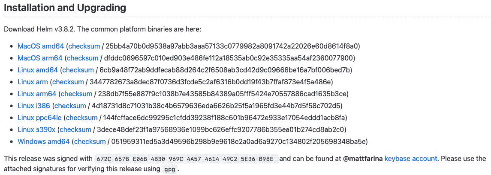
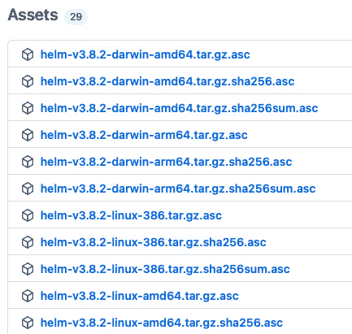

# 12

# Helm 安全性考虑

正如你在本书中可能已经意识到的，Helm 是一个强大的工具，使得在 Kubernetes 上部署应用程序变得简单高效。话虽如此，我们需要确保在使用 Helm 时不忽视安全最佳实践。幸运的是，Helm 提供了多种方式来将良好的安全实践融入到日常使用中，这些做法从下载 Helm CLI 的那一刻起，到将 Helm 图表安装到 Kubernetes 集群中的每一步都可以轻松实现。

在本章中，我们将覆盖以下主题：

+   数据来源和数据完整性

+   开发安全且稳定的 Helm 图表

+   配置 RBAC 规则

# 技术要求

本章将使用以下技术：

+   `minikube`

+   `kubectl`

+   `helm`

+   `gpg`（GNU 隐私保护）

你已经学会了如何在*第二章*《准备 Kubernetes 和 Helm 环境》中安装和配置`minikube`、`kubectl`和`helm`**命令行接口**（**CLIs**）。

我们还将使用位于[`github.com/PacktPublishing/Managing-Kubernetes-Resources-using-Helm`](https://github.com/PacktPublishing/Managing-Kubernetes-Resources-using-Helm)的 Packt 仓库中的 guestbook 图表，作为本章后续练习的一部分。如果你还没有克隆该仓库，可以使用以下命令进行克隆：

```
$ git clone https://github.com/PacktPublishing/Managing-Kubernetes-Resources-using-Helm.git
```

让我们从讨论数据来源和数据完整性开始。

# 数据来源和数据完整性

在处理任何类型的数据时，应考虑两个常被忽视的问题：

+   数据来自可靠的源吗？

+   数据是否包含你预期的所有内容？

第一个问题与**数据来源**的话题有关。数据来源是指确定数据的起源，并确定数据来自何处。

第二个问题涉及到**数据完整性**的话题。数据完整性是指确定你从远程位置接收到的内容是否与预期收到的内容一致。它有助于判断数据在传输过程中是否被篡改。

数据来源和数据完整性都可以通过一个叫做**数字签名**的概念来验证。作者可以基于加密技术创建一个唯一的签名来签署数据，数据的消费者可以使用加密工具来验证签名的真实性。如果真实性得到验证，那么消费者就可以确保数据来源于预期的源头，并且在传输过程中没有被篡改。

作者可以使用多种工具创建数字签名。一个方法是使用**Pretty Good Privacy**（**PGP**）。在此背景下，PGP 指的是 OpenPGP，它是一组基于加密的标准。PGP 的重点是建立非对称加密，基于使用两个不同的密钥——私钥和公钥。

私钥是用来保密的，而公钥是用于共享的。在 PGP 中，私钥用于加密数据，公钥则由消费者用于解密数据。PGP 密钥对通常通过一个名为 GPG 的工具来创建，这是一个实现 OpenPGP 标准的开源工具。

要开始使用 PGP，第一步是创建密钥对，这将生成一组公钥和私钥。一旦 PGP 密钥对被创建，作者就可以使用 GPG 对数据进行签名。当数据被签名时，GPG 在后台执行以下步骤：

1.  基于数据的内容计算哈希。输出结果是一个固定长度的字符串，称为**消息摘要**。

1.  消息摘要是使用作者的私钥进行加密的。输出结果即为数字签名。

为了验证签名，消费者必须使用作者的公钥来解密它。此验证过程也可以使用 GPG 来执行。

数字签名在 Helm 中扮演着两个角色：

+   首先，每个 Helm 二进制文件都有一个数字签名，该签名由其中一位 Helm 维护者拥有。此签名可以用来验证下载的来源以及其完整性。

+   其次，Helm charts 也可以进行数字签名，以便享受相同形式的验证。Helm charts 的作者可以在打包时对 chart 进行签名，chart 用户则可以使用作者的公钥验证 chart 的真实性。

现在你已经理解了数据来源和完整性如何与数字签名相关联，在下一部分中，你将会在本地机器上创建一个 GPG 密钥对，用来详细说明前面提到的概念。

## 创建一个 GPG 密钥对

要创建一个密钥对，你必须在本地机器上安装 GPG。请按照以下说明作为指南，在你的机器上安装 GPG。请注意，本章基于`gpg`版本 2.3.6：

+   对于 Windows，你可以使用 Chocolatey 包管理器：

    ```
    > choco install gnupg
    ```

你还可以从[`gpg4win.org/download.html`](https://gpg4win.org/download.html)下载 Windows 安装程序。

+   对于 macOS，你可以使用 Homebrew 包管理器，通过以下命令来安装：

    ```
    $ brew install gpg
    ```

你还可以从[`sourceforge.net/p/gpgosx/docu/Download/`](https://sourceforge.net/p/gpgosx/docu/Download/)下载基于 macOS 的安装程序。

+   对于基于 Debian 的 Linux 发行版，你可以使用`apt`包管理器：

    ```
    $ sudo apt install gnupg
    ```

+   对于基于 RPM 的 Linux 发行版，你可以使用`dnf`包管理器：

    ```
    $ sudo dnf install gnupg
    ```

一旦你安装了 GPG，你就可以创建你自己的 GPG 密钥对，我们将在整个数据来源和完整性的讨论中使用它。

按照以下步骤配置你的密钥对：

1.  首先，我们需要通过运行`gpg --full-generate-key`命令来开始生成过程：

    ```
    $ gpg --full-generate-key
    ```

1.  对于`Please select what kind of key you want`提示，选择`(1) RSA and RSA`：

    ```
    Please select what kind of key you want:
       (1) RSA and RSA
       (2) DSA and Elgamal
       (3) DSA (sign only)
       (4) RSA (sign only)
       (9) ECC (sign and encrypt) *default*
      (10) ECC (sign only)
      (14) Existing key from card
    Your selection? 1
    ```

我们使用 RSA 而不是默认选项（ECC）的原因是 ECC 不被 Helm 源代码中使用的加密库支持。

1.  接下来，系统将提示您输入密钥大小。在本示例中，我们可以简单地选择默认值，因此按*Enter*键继续：

    ```
    RSA keys may be between 1024 and 4096 bits long.
    What keysize do you want? (3072) <enter>
    Requested keysize is 3072 bits
    ```

1.  在您输入密钥大小后，系统将询问密钥的有效期。由于此密钥仅用于通过示例，我们建议设置较短的过期时间，例如 1 周（`1w`）：

    ```
    Please specify how long the key should be valid.
             0 = key does not expire
          <n>  = key expires in n days
          <n>w = key expires in n weeks
          <n>m = key expires in n months
          <n>y = key expires in n years
    Key is valid for? (0) 1w
    Key expires at Sun May 22 12:26:09 2022 EDT
    Is this correct? (y/N) y
    ```

1.  现在，系统将提示您输入姓名和电子邮件地址。这些信息将用于标识您为密钥对的拥有者，并且将在接收您公钥的人那里显示您的姓名和电子邮件地址。系统还会提示您提供一个评论，您可以将其留空：

    ```
    GnuPG needs to construct a user ID to identify your key.
    Real name: John Doe
    Email address: jdoe@example.com
    Comment: <enter>
    You selected this USER-ID:
        "John Doe <jdoe@example.com>"
    ```

1.  按下*O*键继续。

1.  最后，系统将提示您输入私人密钥的密码短语。提供强密码短语对于保护您的身份至关重要，以防您的私人密钥被盗。因为每次您尝试访问密钥时，都必须提供密码短语。

为了保持示例简洁，我们将创建一个空字符串密码短语，以避免密码短语提示。虽然在本演示中这样做是可以接受的，但您应该在实际使用中为任何私人密钥设置强密码进行保护。

要继续，只需按*Enter*键提交一个空的密码短语。当提示时，选择`<是的，不需要保护>`。

一旦您的 GPG 密钥对创建完成，您将看到类似以下内容的输出：

```
pub   rsa3072 2022-05-15 [SC] [expires: 2022-05-22]
      D2557B1EDD57BBC41A5D4DA7161DADB1C5AC21B5
uid                      John Doe <jdoe@example.com>
sub   rsa3072 2022-05-15 [E] [expires: 2022-05-22]
```

上述输出显示了公钥（`pub`）和私钥（`sub`）的信息，以及公钥的指纹（输出的第二行）。指纹是一个唯一的标识符，用于识别您为该密钥的所有者。第三行以`uid`开头，显示了您在生成 GPG 密钥对时输入的姓名和电子邮件地址。

密钥对创建完成后，让我们继续下一部分，了解如何验证 Helm 二进制文件。

## 验证 Helm 下载

如在*第二章*中讨论的，*准备 Kubernetes 和 Helm 环境*，Helm 可以通过从 GitHub 下载存档来安装。这些存档可以通过访问 Helm 的 GitHub 发布页面（[`github.com/helm/helm/releases`](https://github.com/helm/helm/releases)）并选择以下截图中显示的链接来安装：



图 12.1 – Helm GitHub 发布页面的安装和升级部分

在前面截图的底部，你会看到一段说明，解释了该版本已被签名。每个 Helm 发布版本都会由一个 Helm 维护者签名，并且可以通过与下载版本对应的数字签名进行验证。每个签名位于**Assets**部分，如下所示：



图 12.2 – Helm GitHub 发布页面的 Assets 部分

要验证 Helm 下载的来源和完整性，除了下载二进制文件本身外，你还应该下载相应的 `.asc` 文件。请注意，`sha256` 文件仅用于验证完整性。在此示例中，我们将下载 `.tar.gz.asc` 文件，它用于验证来源和完整性。

让我们演示如何验证一个 Helm 发布版本。首先，我们应该下载一个 Helm 压缩包，并获取相应的 `.asc` 文件：

1.  下载与你操作系统相对应的 Helm 压缩包。对于本示例，我们将使用 3.8.2 版本。如果你使用的是基于 AMD64 的 Linux 系统，可以从 GitHub 发布页面下载该版本，或者使用以下 `curl` 命令：

    ```
    $ curl -LO https://get.helm.sh/helm-v3.8.2-linux-amd64.tar.gz
    ```

1.  接下来，下载与你操作系统相对应的 `.asc` 文件。当运行基于 AMD64 的 Linux 系统时，`helm-v3.8.2-linux-amd64.tar.gz.asc` 将是下载的文件。你可以从 GitHub 发布页面下载此文件，或使用以下 `curl` 命令：

    ```
    $ curl -LO https://github.com/helm/helm/releases/download/v3.8.2/helm-v3.8.2-linux-amd64.tar.gz.asc
    ```

下载完这两个文件后，你应该能够在命令行中看到它们位于同一目录中：

```
$ ls –l
helm-v3.8.2-linux-amd64.tar.gz
helm-v3.8.2-linux-amd64.tar.gz.asc
```

下一步是将 Helm 维护者的公钥导入到你的本地 GPG 密钥环中。这将允许你解密 `.asc` 文件中的数字签名，从而验证你下载的二进制文件的来源和完整性。GPG 公钥保存在公钥服务器中，例如 `keyserver.ubuntu.com` 和 `pgp.mit.edu`。因此，我们可以使用 `gpg --recv-key` 命令从公钥服务器下载维护者的密钥。

让我们导入维护者的公钥并继续验证过程：

1.  首先，回想一下维护者的公钥指纹（见*图 12.1*）：

    ```
    672C657BE06B4B30969C4A57461449C25E36B98E
    ```

1.  使用 `gpg --recv-key` 命令下载并导入公钥到你的本地密钥链中：

    ```
    $ gpg --recv-key 672C657BE06B4B30969C4A57461449C25E36B98E
    gpg: key 461449C25E36B98E: public key "Matthew Farina <matt@mattfarina.com>" imported
    gpg: Total number processed: 1
    gpg:               imported: 1
    ```

1.  现在公钥已经导入，你可以使用 GPG 的 `--verify` 子命令来验证 Helm 发布版本。该命令的语法为 `gpg --verify <signature> <data>`：

    ```
    $ gpg --verify helm-v3.8.2-linux-amd64.tar.gz.asc helm-v3.8.2-linux-amd64.tar.gz
    ```

该命令解密 `.asc` 文件中的数字签名。如果成功，说明该 Helm 下载（以 `.tar.gz` 结尾的文件）是由你预期的人（本次版本为 Matt Farina）签署的，并且下载文件没有被修改或篡改。成功的输出类似于以下内容：

```
gpg: Signature made Wed Apr 13 14:00:32 2022 EDT
gpg:                using RSA key 711F28D510E1E0BCBD5F6BFE9436E80BFBA46909
gpg: Good signature from "Matthew Farina <matt@mattfarina.com>" [unknown]
gpg: WARNING: This key is not certified with a trusted signature!
gpg:          There is no indication that the signature belongs to the owner.
Primary key fingerprint: 672C 657B E06B 4B30 969C  4A57 4614 49C2 5E36 B98E
     Subkey fingerprint: 711F 28D5 10E1 E0BC BD5F  6BFE 9436 E80B FBA4 6909
```

经过进一步检查，你可能会注意到 `WARNING` 消息，表示密钥尚未被认证，这可能会让你怀疑验证是否成功。在这种情况下，验证确实成功，但你还没有认证维护者的密钥，所以 GPG 返回了这个警告。

`This key is not certified` 消息通常不是问题，但如果你希望确保将来不再出现此警告，可以按照以下步骤认证维护者的公钥：

1.  检查公钥的指纹（也称为 `gpg --verify` 输出中的主密钥）是否与 Helm 发布页面上显示的指纹匹配。如你所记得，*图 12.1* 中已经显示了该指纹，如下所示：

    ```
    This release was signed with 672C 657B E06B 4B30 969C 4A57 4614 49C2 5E36 B98E and can be found at @mattfarina keybase account.
    ```

1.  因为我们导入的密钥与 GitHub 上显示的指纹匹配，我们知道可以信任该密钥。通过使用 `gpg --sign-key` 子命令，可以将信任与此密钥关联：

    ```
    $ gpg --sign-key 672C657BE06B4B30969C4A57461449C25E36B98E
    ```

在 `Really sign?` 提示中，输入 `y`。

现在你已经签署了维护者的公钥，该密钥已被认证。下次你使用该密钥进行验证时，应该不再看到警告消息：

```
$ gpg --verify helm-v3.8.2-linux-amd64.tar.gz.asc helm-v3.8.2-linux-amd64.tar.gz
gpg: assuming signed data in 'helm-v3.8.2-linux-amd64.tar.gz'
gpg: Signature made Wed Apr 13 14:00:32 2022 EDT
gpg:                using RSA key 711F28D510E1E0BCBD5F6BFE9436E80BFBA46909
gpg: Good signature from "Matthew Farina <matt@mattfarina.com>" [full]
```

数字签名在签署和验证 Helm 图表中也起着重要作用。我们将在下一节中探讨这一主题。

## 签署和验证 Helm 图表

与 Helm 维护者签署发布版本的方式类似，你也可以签署你的 Helm 图表，以便用户可以验证其来源并确认其内容符合预期。要签署一个图表，你必须在本地工作站上拥有一对 GPG 密钥（我们在 *创建 GPG 密钥对* 部分中已创建了 GPG 密钥对）。

在我们开始签署图表之前，有一个重要的警告需要注意。如果你使用的是 GPG 版本 2 或更高版本，你必须将公钥和私钥导出为旧版格式。早期版本的 GPG 将密钥环存储在 `.gpg` 文件格式中，这是 Helm 所期望的密钥环格式（在撰写本文时）。较新的 GPG 版本将密钥环存储在 `.kbx` 文件格式中，这在撰写本文时并不兼容。

幸运的是，我们可以通过以下步骤将密钥导出为 `.gpg` 格式：

1.  首先，通过运行以下命令找到你的 GPG 版本：

    ```
    $ gpg --version
    gpg (GnuPG) 2.3.6
    libgcrypt 1.10.1
    Copyright (C) 2021 Free Software Foundation, Inc.
    ```

1.  如果你的 GPG 版本是 2 或更高版本，使用 `gpg --export` 和 `gpg --export-secret-keys` 命令导出你的公钥和私钥：

    ```
    $ gpg --export > ~/.gnupg/pubring.gpg
    $ gpg --export-secret-keys > ~/.gnupg/secring.gpg
    ```

一旦你的密钥环已被导出，你将能够使用 `helm package` 命令签署图表。`helm package` 命令提供了三个关键标志，允许你签署并打包图表：

+   `--sign`：这允许你使用 PGP 私钥签署图表。

+   `--key`：签名时使用的密钥名称。

+   `--keyring`：包含 PGP 私钥的密钥环位置。

让我们运行 `helm package` 命令，签署来自 Packt 仓库的 guestbook Helm 图表：

```
$ helm package --sign --key <key_name> --keyring ~/.gnupg/secring.gpg helm-charts/charts/guestbook
```

`<key_name>`占位符指的是与所需密钥相关的电子邮件、名称或指纹。这些细节可以通过使用`gpg --list-keys`命令找到。

如果`helm package`命令成功，你将在当前目录中看到以下文件：

```
guestbook-0.1.0.tgz
guestbook-0.1.0.tgz.prov
```

`guestbook-0.1.0.tgz`文件是包含 Helm chart 的归档文件。无论是否签署 chart，这个文件总是由`helm package`创建的。

`guestbook-0.1.0.tgz.prov`文件称为**证明文件**。证明文件包含一个证明记录，记录内容包括以下内容：

+   文件中的 chart 元数据

+   `guestbook-0.1.0.tgz`文件的 sha256 哈希值

+   PGP 数字签名

Helm chart 的使用者利用证明文件来验证他们下载的 chart 的数据来源和完整性。因此，chart 开发人员应确保将`.tgz`归档文件和`.tgz.prov`证明文件都发布到 Helm chart 仓库中。

虽然你已经成功签署了 guestbook chart 并创建了`.tgz.prov`文件，但这还不足以让用户验证 chart，因为他们仍然需要访问你的公钥来解密你的签名。你可以通过`gpg --send-key`命令将此密钥发布到 PGP 密钥服务器，以便用户获取：

```
$ gpg --send-key <key_name>
```

最终用户可以使用`gpg --recv-key`命令下载并导入此密钥：

```
$ gpg --recv-key <key_name>
```

一旦用户导入了你的公钥（并将其导出到`~/.gnupg/pubring.gpg`密钥环，如本节前面所示），他们可以通过使用`helm verify`命令验证你的 Helm chart，前提是`.tgz` chart 归档文件和`.tgz.prov`证明文件都已下载到同一目录：

```
$ helm verify --keyring ~/.gnupg/pubring.gpg guestbook-0.1.0.tgz
Signed by: John Doe <jdoe@example.com>
Using Key With Fingerprint: D2557B1EDD57BBC41A5D4DA7161DADB1C5AC21B5
Chart Hash Verified: sha256:c8089c7748bb0c8102894a8d70e641010b90abe9bb45962a 53468eacfbaf6731
```

如果验证成功，你将看到签名者、签名者的公钥和 chart 已经被验证。否则，会返回一个错误。验证可能失败的原因包括：

+   `.tgz`和`.tgz.prov`文件不在同一目录中。

+   `.tgz`或`.tgz.prov`文件已损坏。

+   文件哈希不匹配，表示完整性丧失。

+   用于解密签名的公钥与最初用于加密签名的私钥不匹配。

`helm verify`命令旨在运行在本地下载的 charts 上，因此用户可能会发现使用`helm install --verify`命令更为方便，该命令在一个命令中执行验证和安装，前提是`.tgz`和`.tgz.prov`文件都可以从 chart 仓库下载。

以下命令描述了如何使用`helm install --verify`命令：

```
$ helm install guestbook <chart_repo>/guestbook --verify --keyring ~/.gnupg/pubring.gpg
```

通过本节中描述的方法，chart 开发人员和使用者可以确保内容来自可信的来源，并且未被篡改。

了解数据溯源和完整性在 Helm 中的作用后，让我们继续讨论 Helm 安全性问题，转到下一个话题——关于 Helm 图表及其开发的安全性。

# 开发安全且稳定的 Helm 图表

虽然溯源和完整性在 Helm 安全性中扮演着重要角色，但它们并不是你需要考虑的唯一问题。在开发过程中，图表开发者应确保他们遵循安全最佳实践，以防止在用户将图表安装到 Kubernetes 集群时引入漏洞。在本节中，我们将讨论与 Helm 图表开发相关的许多安全问题，以及作为开发者，你可以做些什么，将安全性作为编写 Helm 图表的优先事项。

我们将首先讨论关于 Helm 图表可能引用的任何容器镜像的安全性。

## 使用安全的镜像

由于 Helm（和 Kubernetes）的目标是部署容器镜像，因此镜像本身涉及多个安全方面的考虑。首先，图表开发者应该了解镜像标签和镜像摘要之间的区别。

标签是对给定镜像的可读引用，为开发人员和使用者提供了一个便捷的方式来引用镜像。然而，标签可能带来安全隐患，因为无法保证给定标签的内容始终保持不变。镜像所有者可能会选择使用相同的标签推送更新的镜像，这会导致在运行时执行的是不同的底层镜像（即使标签相同）。在相同标签下执行这些操作，会引入回归的可能性，这可能会给最终用户带来意想不到的不良影响。与其通过标签引用镜像，不如通过摘要来引用镜像。镜像摘要是一个计算出的`SHA-256`值，它不仅提供了一个不可变的标识符来精确标识镜像，还允许容器运行时验证从远程注册表获取的镜像的完整性。这消除了部署包含意外回归的镜像的风险，同时也能消除中间人攻击的风险，其中标签的内容被恶意篡改。

举个例子，图表模板中引用的镜像`quay.io/bitnami/redis:5.0.9`可以通过摘要引用为`quay.io/bitnami/redis@sha256:70b816f2127afb5d4af7ec9d6e8636b2f0f973a3cd8dda7032f9dcffa38ba11f`。请注意，镜像名称后面不是指定标签的名称，而是明确指定了`SHA-256`摘要。这确保了即使标签发生变化，镜像内容也不会改变，从而增强了你的安全性。

随着时间的推移，某个标签或摘要可能变得不适合部署，因为最终可能会发现底层包或基础组件存在漏洞。有许多不同的方法可以确定给定镜像是否存在漏洞。一种方法是利用该镜像所属镜像库的原生功能。许多不同的镜像库解决方案都包含有关镜像漏洞扫描的功能，可以帮助提供何时镜像存在漏洞的洞察。

例如，Quay 容器镜像库可以在指定的时间间隔内自动扫描镜像，以确定给定镜像中可能存在的漏洞。Nexus 和 Artifactory 容器镜像库也是具备类似功能的容器镜像库的例子。在容器镜像库提供的原生扫描功能之外，还可以使用其他工具，如**Vuls**和**OpenSCAP**。当你的镜像库或独立扫描工具报告镜像存在漏洞时，应立即将图表中的镜像更新为较新版本（如果有的话），以防止漏洞进入用户的 Kubernetes 集群。

为了简化更新容器镜像的过程，你可以制定一个定期检查镜像更新的计划。这有助于防止目标镜像中出现漏洞，进而使其不适合部署。许多团队和组织也将镜像的来源限制为受信任的镜像库，以减少运行包含漏洞的镜像的风险。此设置可以在容器运行时层面配置，或在应用到 Kubernetes 集群的策略中进行配置。具体的位置和配置会根据具体的实现方式有所不同。

除了镜像漏洞扫描和内容来源外，你还应该避免部署以**root**或**privileged**身份运行的镜像。以 root 用户（UID 0）身份运行容器是危险的，因为如果容器能够突破隔离，它将获得对底层主机的 root 访问权限。你的应用程序可能并不需要 root 提供的权限级别，因此你应该改为以非 root 用户身份运行容器，以限制其可用的权限。

虽然以 root 身份运行容器是危险的，但由于容器提供的进程隔离功能，它默认并不会授予所有可用的 Linux 能力。因此，一些用户往往错误地通过以特权模式运行容器来进一步提升权限。以特权模式运行容器会授予容器所有能力，允许它在容器内部与底层主机进行交互。如果你的应用程序确实需要额外的能力，可以通过在 pod 的 `securityContext` 中选择所需的具体能力列表，而不是以特权模式运行容器。可以在 Linux 手册页的*CAPABILITIES(7)* 页面中找到能力的列表（[`man7.org/linux/man-pages/man7/capabilities.7.html`](http://man7.org/linux/man-pages/man7/capabilities.7.html)）。

除了已经部署的容器镜像外，chart 开发者应关注已授予应用程序的资源，以确保 Kubernetes 集群的完整性。我们将在下一节中深入探讨这个话题。

## 设置资源请求和限制

Pods 从它们运行的主机（节点）中消耗资源。资源通过**请求**（分配的最小资源量）和**限制**（pod 允许使用的最大资源量）来定义。没有定义请求的 pods 有可能被调度到不能满足其最小资源需求的节点上。没有定义限制的 pods 有可能会耗尽节点资源，导致 pod 被驱逐，并与其他工作负载发生资源争用。由于未设置资源请求和限制可能会导致的问题，chart 开发者应确保他们的 charts 定义了这些资源约束，并允许用户根据需要通过 Helm 值进行覆盖。

例如，作为一个 chart 开发者，你可能会编写你的 chart，使其包括以下默认值来配置资源：

```
resources:
  limits:
    cpu: "1"
    memory: 4Gi
  requests:
    cpu: 500m
    memory: 2Gi
```

然后，如果没有明确设置应用程序的资源需求，chart 被安装时会应用这些默认值，以避免集群资源的过度或不足利用。

除了资源请求和限制外，Kubernetes 管理员还可以创建 `LimitRange` 和 `ResourceQuota` 对象，以限制在命名空间内应用程序请求和消耗的资源数量。`LimitRange` 和 `ResourceQuota` 对象通常与 Helm 分开应用，通常作为命名空间配置过程的一部分。

`LimitRanges` 用于限制容器或 pod 在给定命名空间内允许消耗的资源数量。它们也用于为那些没有已定义资源限制的容器设置默认资源。以下是一个 `LimitRange` 定义的示例：

```
apiVersion: v1
kind: LimitRange
metadata:
  name: limits-per-container
spec:
  limits:
    - max:
        cpu: 4
        memory: 16Gi
      default:
        cpu: 500m
        memory: 2Gi
      defaultRequest:
        cpu: 50m
        memory: 128Mi
      type: Container
```

在该示例中，`LimitRange` 将允许的最大容器资源限制设置为 4 个 CPU 核心和 16 Gi 内存。对于资源限制未定义的容器，将自动应用 500 毫核 CPU 和 2 Gi 内存的限制。对于资源请求未定义的容器，将自动应用 50 毫核 CPU 和 128 Mi 内存的请求。通过将 `type` 字段设置为 `Pod`，`LimitRanges` 也可以在 pod 级别应用。此设置确保 pod 中所有容器的资源使用总和满足指定的限制。

除了设置对 CPU 和内存使用率的限制外，您还可以配置 `LimitRange` 来限制存储消耗，通过将 `type` 字段设置为 `PersistentVolumeClaim`。以下是一个 `LimitRange` 示例，用于将存储请求限制为 8 Gi 或更少：

```
apiVersion: v1
kind: LimitRange
metadata:
  name: limits-per-pvc
spec:
  - max:
      storage: 8Gi
    type: PersistentVolumeClaim
```

虽然 `LimitRange` 对象用于限制 `Container`、`Pod` 或 `PersistentVolumeClaim` 级别的资源，`ResourceQuotas` 则由集群管理员在命名空间级别限制资源使用。它们用于定义一个命名空间可以使用的最大资源数量，并限制可以创建的 Kubernetes 对象的数量，例如 Secrets 和 ConfigMaps。以下是一个 `ResourceQuota` 定义示例：

```
apiVersion: v1
kind: ResourceQuota
metadata:
  name: pod-and-pvc-quota
spec:
  hard:
    limits.cpu: "32"
    limits.memory: 64Gi
    requests.cpu: "24"
    requests.memory: 48Gi
    requests.storage: 20Gi
```

该 `ResourceQuota` 确保所有 CPU 和内存请求及限制的总和保持在定义的限制范围内。它还设置了在命名空间内可以请求的 `PersistentVolumeClaims` 存储的限制。

通过为资源限制设置合理的默认值，并使用 `LimitRange` 和 `ResourceQuotas`，您可以确保使用您的 Helm charts 的用户不会耗尽集群资源。您还可以帮助确保应用程序请求足够的最小资源以确保正常运行。

了解资源请求和限制后，让我们进入下一个话题——在 Helm charts 中处理密钥。

## Helm charts 中的密钥处理

处理密钥是使用 Helm charts 时常见的关注点。考虑到 *第三章* 中的 WordPress 应用程序，*使用 Helm 安装第一个应用程序*，在此过程中，您需要提供密码以配置管理员用户。此密码默认不在 `values.yaml` 文件中提供，因为如果您忘记覆盖 `password` 值，应用程序将变得易受攻击。Chart 开发者应该养成不为密钥值（如密码）提供默认值的习惯，而应要求用户提供显式值。这可以通过利用 `required` 函数轻松实现。Helm 还可以使用 `randAlphaNum` 函数生成随机字符串。

注意

注意，`randAlphaNum`函数每次升级图表时都会生成一个新的随机字符串。因此，开发人员应该设计图表时预期用户会提供自己的密码或其他密钥，并使用`required`函数作为门槛，确保提供了一个值。

在使用原生 Kubernetes 资源存储秘密信息时，图表开发人员应确保将这些敏感资产保存在 Kubernetes Secret 中，而不是 ConfigMap 中。Secrets 和 ConfigMaps 类似，但 Secrets 是专门用于存储敏感数据的。由于秘密数据和非秘密数据存储在不同的对象中，集群管理员可以相应地设置 RBAC 策略，限制对秘密数据的访问，同时允许对非秘密数据的访问（RBAC 将在稍后的*配置 RBAC 规则*部分进一步说明）。

图表用户应该确保像凭证这样的秘密值以安全的方式提供。值通常通过`--values`标志提供，其中属性在`values`文件中配置。当处理非秘密值时，这是一种合适的方法，但在处理秘密时，应该谨慎使用此方法。用户应确保包含秘密的`values`文件没有被检查到 Git 仓库或其他公开位置，这样这些秘密就不会被暴露。用户避免暴露秘密的一种方法是利用`--set`标志从命令行传递秘密。这降低了凭证暴露的风险，但用户应该注意，这可能会在 bash 历史中暴露凭证。

用户避免暴露秘密的另一种方法是利用加密工具加密包含秘密的`values`文件。此方法仍然允许用户使用`--values`标志，并使`values`文件能够存储在远程位置，如 Git 仓库中。然后，只有拥有适当解密密钥的用户才能解密`values`文件，其他用户则保持加密状态，仅允许可信实体访问数据。用户可以简单地使用 GPG 加密`values`文件，或者使用一个专门的工具，如**Secrets OPerationS**（**SOPS**）。SOPS（[`github.com/mozilla/sops`](https://github.com/mozilla/sops)）是一个设计用来加密 YAML 或 JSON 文件中的值，但保留键未加密的工具。以下代码展示了一个来自 SOPS 加密文件的秘密键/值对：

```
password: ENC[AES256_GCM,data:xhdUx7DVUG8bitGnqjGvPMygpw==,iv:3LR9KcttchCvZNpRKqE5L cXRyWD1I00v2kEAIl1ttco=,tag:9HEwxhT9s1pxo9lg19wyNg==,type:str]
```

注意，`password`键是未加密的，但其值是加密的。这使得你可以轻松查看文件中包含的值的类型，而不会暴露其敏感值。

还有其他工具可以加密包含秘密的`values`文件。一些示例包括`--set`标志。

现在你已经理解了安全性在 Helm 图表开发中的作用，接下来让我们讨论如何在 Kubernetes 中应用**基于角色的访问控制**（**RBAC**），以为用户提供更高的安全性。

# 配置 RBAC 规则

在 Kubernetes 中，经过身份验证的用户执行操作的能力由一组 RBAC 策略来管理。如在*第二章*《准备 Kubernetes 和 Helm 环境》中介绍的，策略（即角色）可以与用户或服务账户关联，Kubernetes 在任何安装中都包含多个角色。自版本 `1.6` 起，Kubernetes 默认启用 RBAC。当在 Helm 使用的背景下考虑 Kubernetes RBAC 时，需要考虑两个因素：

+   安装 Helm 图表的用户

+   与运行工作负载的 pod 关联的服务账户

在大多数情况下，负责安装 Helm 图表的个人与 Kubernetes 用户相关联。然而，Helm 图表也可以通过其他方式安装，例如由具有关联服务账户的 Kubernetes 操作员安装。

默认情况下，用户和服务账户在 Kubernetes 集群中具有最小权限。通过使用角色（这些角色已被限定在特定命名空间内）或集群角色（授予集群级别的访问权限），可以授予额外的权限。然后，使用角色绑定或集群角色绑定将这些角色与用户或服务账户关联，具体取决于目标策略的类型。虽然 Kubernetes 包含几个内置角色，但可以创建 `Role` 或 `ClusterRole`，只授予应用程序所需的必要权限。由于大多数 Kubernetes 集群的典型用户无法在集群级别创建资源，我们将创建一个角色，应用于 Helm 图表部署所在的命名空间。

可以使用 `kubectl create role` 命令来创建一个 Kubernetes `Role`。或者，可以使用 YAML 定义来创建 `Role` 和 `RoleBinding` 资源。基本角色包含两个关键元素：

+   对 Kubernetes API 执行的操作类型（动词）

+   要目标的 Kubernetes 资源列表

作为示例，为了演示如何在 Kubernetes 中配置 RBAC，我们将配置一组 RBAC 规则，允许经过身份验证的用户查看命名空间中的 Pods：

1.  首先，请确保启动您的 minikube 集群并为此练习创建一个新的命名空间：

    ```
    $ minikube start
    $ kubectl create namespace chapter12
    ```

1.  接下来，使用 `kubectl` 命令行工具创建一个名为 `pod-viewer` 的新角色：

    ```
    $ kubectl create role pod-viewer --resource=pods --verb=get,list –n chapter12
    ```

创建了这个新角色后，需要将其与用户或服务账户关联。由于我们希望将角色与 Kubernetes 中运行的应用程序关联，因此我们将角色应用于服务账户。为了遵循最小权限原则，建议为应用程序创建一个唯一的服务账户（否则将使用默认服务账户）。这样可以确保同一命名空间中没有其他工作负载被意外地继承相同的权限。

1.  通过运行以下命令创建一个名为 `example` 的新服务账户：

    ```
    $ kubectl create sa example –n chapter12
    ```

1.  最后，创建一个名为 `pod-viewers` 的 `RoleBinding`，并将其与 `example` 服务账户关联：

    ```
    $ kubectl create rolebinding pod-viewers --role=pod-viewer --serviceaccount=chapter12:example –n chapter12
    ```

创建了角色和角色绑定后，`example` 服务账户具有列出和获取 pods 的适当权限。为了验证这个假设，我们可以使用 `kubectl auth can-i` 命令：

```
$ kubectl auth can-i list pods --as=system:serviceaccount:chapter12:example –n chapter12
yes
```

`--as` 标志利用了 Kubernetes 中的用户模拟功能，允许你调试授权策略。

为了确认服务账户无法访问它不应访问的资源，例如列出 Deployments，你可以运行以下命令：

```
$ kubectl auth can-i list deployments --as=system:serviceaccount:chapter12:example –n chapter12
no
```

从 `no`（列出 Deployments）和 `yes`（列出 pods）的输出中可以看出，预期的策略已生效。该服务账户现在可以被 Helm chart 引用。或者，可以编写一个 Helm chart 来原生创建 `ServiceAccount`、`Role` 和 `RoleBinding` 资源，前提是安装该 chart 的用户拥有所需的适当权限。

如果使用得当，Kubernetes RBAC 有助于为 Helm chart 开发者提供必要的工具，以执行最小权限访问，保护用户和应用程序免受潜在错误或恶意行为的威胁。

为了清理本次练习，你可以使用 `kubectl delete ns chapter12` 删除你的命名空间，并使用 `minikube stop` 停止你的 minikube 集群。

接下来，让我们讨论如何访问安全的 Helm chart 仓库。

## 访问安全的 chart 仓库

Chart 仓库允许你发现 Helm charts 并将其安装到你的 Kubernetes 集群中。仓库在*第八章*，*发布到 Helm Chart 仓库*中进行了探讨。在那里，你学习了如何使用 HTTP 服务器（通过 GitHub Pages 演示）和 OCI 注册表（通过 GitHub 的容器注册表 `ghcr.io` 演示）提供 charts。

大多数 chart 仓库都可以供有兴趣的人访问并且是开放的。然而，chart 仓库和托管服务确实为与存储在仓库中的内容进行交互提供了额外的安全措施，包括以下内容：

+   身份验证

+   **传输层安全性** (**TLS**)

基于 HTTP(S)的图表仓库支持基本认证和基于证书的认证。对于基本认证，可以在使用`helm repo add`命令添加仓库时，通过使用`--username`和`--password`标志提供用户名和密码。例如，如果您想访问一个通过基本认证保护的仓库，添加该仓库的命令将如下所示：

```
$ helm repo add <repo_name> <repo_url> --username <username> --password <password>
```

在某些情况下，您可能还需要在`--username`和`--password`之外使用`--pass-credentials`标志。回想一下，`index.yaml`文件包含了图表仓库中所有 Helm 图表的索引。在`index.yaml`文件中，有一个名为`urls`的属性字段，指向相关 Helm 图表的位置。通常，`urls`字段包含图表仓库中的相对路径，但在某些情况下，可以指定一个完全不同域名的位置。如果没有`--pass-credentials`标志，Helm 不会将您的用户名和密码传递给这些域名，这是 Helm 3.6.1 中实现的安全功能，用来防止您的信息被暴露。但是，如果您确实需要将凭证传递到另一个域以对其进行身份验证，您可以在使用`helm repo add`命令时提供`--pass-credentials`标志。

OCI 注册表也支持使用`helm registry login`命令进行基本认证。用户名通过`--username`标志提供，但有两种方式可以指定密码：

+   `--password`：将密码作为参数提供。这可能会在 bash 历史记录中以明文形式泄露密码。

+   `--password-stdin`：通过`stdin`提供密码。这允许您通过从`stdin`重定向密码来隐藏密码，避免其出现在 bash 历史记录中。

建议使用`--password-stdin`标志以避免密码暴露在 bash 历史记录中。通过这种方式，您可以使用以下命令对 OCI 注册表进行基本认证：

```
$ cat <password_file> | helm registry login <registry_host> --username <username> --password-stdin
```

虽然基本认证是最常用的方式，但基于证书的认证也是验证客户端身份的另一种方式。当前 Helm 并未提供 OCI 证书认证的标志，但对于传统的 Helm 仓库，`helm repo add`命令提供了`--cert-file`和`--key-file`标志，用于分别指定客户端证书和密钥。

在图表仓库本身启用基本认证和证书认证取决于所使用的仓库实现。例如，`--basic-auth-user`和`--basic-auth-pass`标志，可以在启动时配置基本认证的用户名和密码。它还提供`--tls-ca-cert`标志，用于配置**证书颁发机构**（**CA**）证书，以便进行证书认证。其他图表仓库实现可能会提供类似或额外的功能。

即使在启用身份验证的情况下，Helm 客户端与图表仓库之间发送的数据包也必须使用基于 TLS 的加密进行安全传输。虽然对于基于证书的身份验证，这一点是理所当然的，因为它本身就使用 TLS，但使用基本身份验证的仓库仍然可以通过加密网络流量来获得安全性。为图表仓库配置 TLS 取决于所使用的仓库实现，但对于 ChartMuseum，可以使用 `--tls-cert` 和 `--tls-key` 标志来提供证书链和密钥文件。更常见的 Web 服务器，如 NGINX，通常需要一个配置文件，提供证书和密钥文件在服务器上的位置。像 GitHub Pages 这样的服务已经配置了 TLS。

到目前为止，我们使用的每个 Helm 仓库都使用了由公开的 CA 签发的证书，这些证书存储在你的 Web 浏览器和操作系统中。因此，我们不需要特别去信任它们的证书。然而，许多大型组织有自己的 CA，用于为图表仓库生成证书。由于该证书可能不是来自公开的 CA，Helm CLI 可能无法信任该证书，从而导致以下错误：

```
Error: looks like "<repo_url>" is not a valid chart repository or cannot be reached: Get <repo_url>/index.yaml: x509: certificate signed by unknown authority
```

要使 Helm CLI 信任图表仓库的证书，可以将 CA 证书或包含证书链的 CA 包添加到操作系统的信任存储中。或者，对于 HTTPS 图表仓库，可以在 `helm repo add` 命令中添加 `--ca-file` 标志。

最后，根据图表仓库的配置方式，可以获取额外的指标，以执行请求级别的审计和日志记录，确定谁尝试访问该仓库。

通过使用身份验证和 TLS，可以实现额外的功能，以增强 Helm 仓库的安全性。

# 概述

本章中，你学习了与 Helm 使用相关的各种安全主题。首先，你学习了如何验证 Helm 发布和 Helm 图表的数据来源和完整性。接着，你学习了 Helm 图表的安全性，以及图表开发者如何利用安全最佳实践来编写稳定且安全的 Helm 图表。然后，我们重点介绍了如何使用 RBAC 创建基于最小权限原则的环境，最后，我们讨论了如何使用身份验证和 TLS 来保护图表仓库的安全。现在，通过应用这些概念，你已经具备了创建安全 Helm 架构和工作环境的能力。

感谢阅读 *使用 Helm 管理 Kubernetes 资源*！我们希望本书能帮助你在使用 Helm 在 Kubernetes 生态系统中工作时充满信心和高效。

# 进一步阅读

要了解更多本章所涵盖的主题，请查阅以下资源：

+   若要了解有关 Helm chart 上下文中数据来源和完整性的更多信息，请访问[`helm.sh/docs/topics/provenance/`](https://helm.sh/docs/topics/provenance/)。

+   若要了解更多关于 Kubernetes RBAC 的信息，请查看 Kubernetes 文档中的*Using RBAC Authorization*部分：[`kubernetes.io/docs/reference/access-authn-authz/rbac/`](https://kubernetes.io/docs/reference/access-authn-authz/rbac/)。

+   查看 Helm 文档中的 chart 仓库指南，了解更多关于 chart 仓库的信息：[`helm.sh/docs/topics/chart_repository/`](https://helm.sh/docs/topics/chart_repository/)。

+   最后，访问 Helm 文档中的*Registries*页面，了解更多关于 OCI 支持的信息：[`helm.sh/docs/topics/registries/`](https://helm.sh/docs/topics/registries/)。

# 问题

回答以下问题以测试你对本章节的理解：

1.  数据来源和数据完整性是什么？数据来源和数据完整性有什么区别？

1.  用户可以运行哪些命令来验证 Helm chart 的数据来源和完整性？需要哪些文件才能实现这个过程？

1.  使用和维护安全容器镜像时需要考虑哪些因素？

1.  为什么在 Helm chart 中利用资源请求和限制很重要？还有哪些其他 Kubernetes 资源可以用来配置请求和限制？

1.  最小权限原则是什么？哪些 Kubernetes 资源允许你配置授权并实现最小权限？

1.  你可以使用哪些标志来验证 HTTP(S) 仓库的身份？

1.  你可以使用哪些标志来验证 OCI 注册表的身份？
