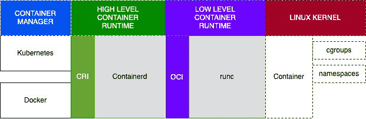
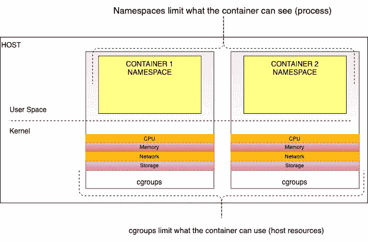
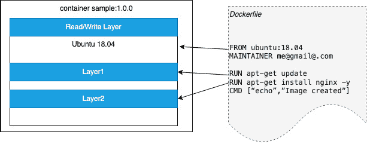
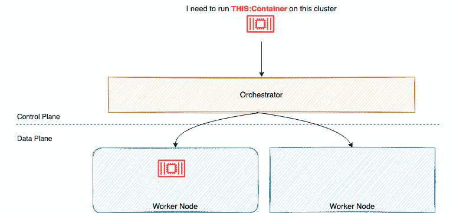
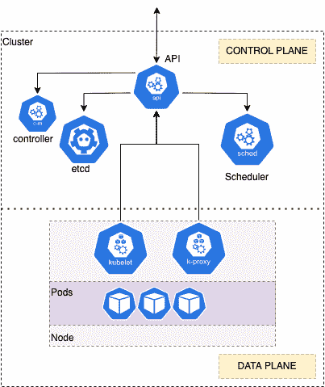

# 第一章：Kubernetes 和容器的基础知识

随着越来越多的组织采用敏捷开发和现代（云原生）应用架构，需要一个能够部署、扩展和提供可靠容器服务的平台已成为许多中型和大型公司的关键。Kubernetes 已成为托管容器工作负载的事实标准平台，但安装、配置和管理可能会很复杂。

**弹性 Kubernetes 服务**（**EKS**）是 AWS 平台上的托管服务，使用户能够专注于使用 Kubernetes 集群，而不是花费时间进行安装和维护。

在本章中，我们将回顾 Kubernetes 的基本构建块。具体而言，我们将涵盖以下主题：

+   Docker、containerd 和 runc 的简要历史

+   对容器的深入探讨

+   什么是容器编排？

+   Kubernetes 是什么？

+   理解 Kubernetes 部署架构

为了更深入地理解本章内容，建议您对 Linux 命令和架构有一定了解。

重要提示

本书内容适用于具有在本地或其他云平台上构建和/或运行 Kubernetes 经验的 IT 专业人员。我们意识到，并非每个具备先决条件经验的人都了解 Kubernetes 的背景，因此本书的第一章（可选）旨在提供一个一致的视角，阐明 Kubernetes 的起源及其支持技术。如果您认为您已经对本章讨论的主题有清晰的理解，请随意跳过此章节，转而阅读下一章节。

# Docker、containerd 和 runc 的简要历史

IT 行业经历了多次变革：从上世纪 70-80 年代的大型专用主机和 UNIX 系统，到上世纪初 Solaris Zones、VMware 的虚拟化运动，以及 Linux 内核中 **cgroups** 和 **namespaces** 的开发。2008 年，发布了 LXC。它提供了一种在 Linux 内核中本地管理 cgroups 和 namespaces 的一致方式，以允许虚拟化。主机系统对 *容器* 没有概念，因此 LXC 编排底层技术来创建一组隔离的进程，即容器。

**Docker** 于 2013 年发布，最初是建立在 LXC 之上，并围绕容器管理引入了整个生态系统，包括一个打包格式（**Dockerfile**），该格式利用联合文件系统使开发者能够构建轻量级的容器镜像，以及一个管理 Docker 容器、容器存储和 CPU、RAM 限制等的运行时环境，同时管理和传输镜像（**Docker 守护进程**），并提供一个可以被 Docker CLI 消耗的**应用程序接口**（**API**）。Docker 还提供了一套注册中心（**Docker Hub**），允许操作系统、中间件和应用程序供应商在容器中构建和分发他们的代码。

2016 年，Docker 将这些运行时功能提取到一个独立的引擎 **containerd** 中，并将其捐赠给了 **Cloud Native Compute Foundation**（**CNCF**），使得其他容器生态系统如 Kubernetes 可以部署和管理容器。Kubernetes 最初使用 Docker 作为其容器运行时，但在 Kubernetes 1.15 中引入了**容器运行时接口**（**CRI**），这使得 Kubernetes 可以使用不同的运行时，例如 containerd。

**开放容器倡议**（**OCI**）由 Docker 和容器行业成立，旨在提供一个低级接口来管理容器。他们开发的第一个标准之一是 OCI 运行时规范，该规范采用 Docker 镜像格式作为所有镜像规范的基础。**runc** 工具由 OCI 开发，用于实现其运行时规范，并被大多数运行时引擎（如 containerd）采纳，作为管理容器和镜像的低级接口。

以下图示展示了我们在本节中讨论的所有概念如何结合在一起：



图 1.1 – 容器运行时

在本节中，我们讨论了容器的历史以及用于创建和管理容器的各种技术。在下一节中，我们将深入探讨容器的实际构成。

# 深入了解容器

容器是一个纯粹的逻辑构造，由一组技术组成，*通过*容器运行时将它们“粘合”在一起。本节将提供关于在 Linux 内核中用于创建和管理容器的技术的更详细视图。两个基础性的 Linux 服务是命名空间和控制组：

+   **命名空间（在 Linux 上的上下文）**：命名空间是 Linux 内核的一个特性，用于将内核资源进行分区，使得在命名空间内运行的进程可以与其他进程隔离。每个命名空间将拥有自己的**进程 ID**（**PIDs**）、主机名、网络访问权限等。

+   **控制组**：控制组（cgroup）用于限制进程或进程集对 CPU、RAM、磁盘 I/O 或网络 I/O 等资源的使用。最初由 Google 开发，这项技术已被纳入 Linux 内核。

Linux 中命名空间和控制组的结合使得容器可以定义为一组隔离的进程（命名空间）和有资源限制（控制组）的进程：



图 1.2 – 作为 cgroup 和命名空间组合的容器

容器运行时镜像的创建方式非常重要，因为它直接影响容器的工作方式和安全性。**联合文件系统**（**UFS**）是一种用于容器镜像的特殊文件系统，接下来将讨论它。

## 了解联合文件系统

UFS 是一种文件系统，可以将多个目录/文件合并/覆盖为一个统一的视图。它还呈现出一个可写的单一文件系统的外观，但实际上是只读的，不允许修改原始内容。最常见的例子是 **OverlayFS**，它包含在 Linux 内核中，并且 Docker 默认使用它。

UFS 是一种非常高效的方式来合并容器镜像的内容。每组独立的内容被视为一个层，层可以在容器镜像之间复用。例如，Docker 会使用 Dockerfile 根据基础镜像创建一个分层文件。以下示例图显示了这一过程：



图 1.3 – 示例 Docker 镜像

在 *图 1.3* 中，`FROM` 命令从 `ubuntu 18.04` 镜像创建一个初始层。两个 `RUN` 命令的输出创建了独立的层，而最后一步是 Docker 添加一个薄的读写层，所有对运行中容器的修改都写入该层。`MAINTAINER` 和 `CMD` 命令不会生成层。

Docker 是最流行的容器运行时环境，支持在 Windows、macOS 和 Linux 上使用，因此它提供了一种简单的方式来学习如何构建和运行容器（但请注意，Windows 和 Linux 操作系统本质上是不同的，因此目前无法在 Linux 上运行 Windows 容器）。尽管 Docker 二进制文件已经从当前版本的 Kubernetes 中移除，但接下来的概念和技术将帮助你理解容器在基础层面的工作原理。

## 如何使用 Docker

开始使用容器的最简单方法是在开发机上使用 Docker。由于 OCI 已经为 Docker 镜像制定了标准化，本地创建的镜像可以在任何地方使用。如果你已经安装了 Docker，以下命令将运行一个简单的容器，使用官方的 `hello-world` 示例镜像并显示其输出：

```
$ docker run hello-world
Unable to find image 'hello-world:latest' locally
latest: Pulling from library/hello-world
2db29710123e: Pull complete
...
Status: Downloaded newer image for hello-world:latest
Hello from Docker!
```

上述消息显示你的安装似乎工作正常。你可以看到 `hello-world` 镜像已“拉取”自仓库。默认情况下，它会从公共 Docker Hub 仓库中获取该镜像，网址为 [`hub.docker.com/`](https://hub.docker.com/)。我们将在 *第十一章*中讨论仓库，特别是 AWS **Elastic Container Registry**（**ECR**），内容包括 *构建应用并推送到 Amazon ECR*。

重要提示

如果你想了解如何安装和使用 Docker，可以参考 Docker 官方文档中的 *入门* 指南：[`docs.docker.com/get-started/`](https://docs.docker.com/get-started/)。

同时，你可以使用以下命令列出主机上的容器：

```
$ docker ps -a
CONTAINER ID   IMAGE  COMMAND      CREATED       STATUS  PORTS     NAMES
39bad0810900   hello-world
"/hello"                  10 minutes ago   Exited (0) 10 minutes ago             distracted_tereshkova
...
```

尽管前面的命令很简单，但它们演示了构建和运行容器的便捷性。当你使用 Docker CLI（客户端）时，它会与运行时引擎——Docker 守护进程进行交互。当守护进程接收到来自 CLI 的请求时，Docker 守护进程会执行相应的操作。在 `docker run` 示例中，这意味着从 `hello-world` 镜像创建一个容器。如果镜像已存储在你的机器上，它会使用该镜像；否则，它会尝试从公共 Docker 仓库如 *Docker Hub* 中*拉取*该镜像。

如前一节所述，Docker 现在使用 containerd 和 runc。你可以使用 `docker info` 命令查看这些组件的版本：

```
$ docker info
…
  buildx: Docker Buildx (Docker Inc., v0.8.1)
  compose: Docker Compose (Docker Inc., v2.3.3)
  scan: Docker Scan (Docker Inc., v0.17.0)
……
containerd version: 2a1d4dbdb2a1030dc5b01e96fb110a9d9f150ecc
 runc version: v1.0.3-0-gf46b6ba
 init version: de40ad0
...
```

在本节中，我们回顾了 Linux 中支持容器的底层技术。在接下来的章节中，我们将更详细地探讨容器编排和 Kubernetes。

# 什么是容器编排？

Docker 在单一机器上运行良好，但如果你需要在多个不同的机器上部署成千上万个容器呢？这正是容器编排所要做的：调度、部署和管理跨环境的成百上千个容器。现在有多个平台尝试做到这一点：

+   **Docker Swarm**：Docker 提供的集群管理和编排解决方案 ([`docs.docker.com/engine/swarm/`](https://docs.docker.com/engine/swarm/))。

+   **Kubernetes**（**K8s**）：一个开源的容器编排系统，最初由 Google 设计，现在由 CNCF 维护。得益于开源社区的积极贡献，Kubernetes 拥有强大的生态系统，涵盖了部署、调度、扩展、监控等一系列解决方案（https://kubernetes.io/）。

+   **Amazon Elastic Container Service**（**ECS**）：AWS 提供的高度安全、可靠且可扩展的容器编排解决方案。ECS 的概念与许多其他编排系统类似，它也能轻松地运行、停止和管理容器，并与其他 AWS 服务如 CloudFormation、IAM 和 ELB 等集成（更多信息请参见 https://ecs.aws/）。

控制/数据平面，这是容器编排器常见的架构，见下图：



图 1.4 – 容器编排概述

容器编排通常由决定容器放置位置的 *大脑* 或调度器/编排器（控制平面）组成，而 *工作节点* 则运行实际的容器（数据平面）。编排器提供了一些附加功能：

+   维护整个集群系统的期望状态

+   配置并调度容器

+   当工作节点不可用时，重新调度容器

+   故障恢复

+   根据工作负载指标、时间或某些外部事件，横向或纵向扩展容器

我们已经从概念层面讨论了容器编排，现在让我们看看 Kubernetes，使这个概念变得更加 *真实*。

# 什么是 Kubernetes？

Kubernetes 是一个开源容器编排工具，最初由 Google 开发，但现在被许多组织视为事实上的容器平台。Kubernetes 被部署为包含一个控制平面，该控制平面提供一个 API，暴露 Kubernetes 操作；一个调度器，它负责将容器（下文将讨论 Pods）调度到工作节点上；一个数据存储，用于存储所有集群数据和状态（**etcd**）；以及一个控制器，它管理作业、故障和重启。



图 1.5 – Kubernetes 概述

集群还由许多工作节点组成，这些节点构成数据平面。每个节点运行 **kubelet** 代理，确保容器在特定节点上运行，并且运行 **kube-proxy**，管理节点的网络。

Kubernetes 的主要优势之一是，所有资源都被定义为可以创建、读取、更新和删除的对象。下一节将回顾主要的 K8s 对象，或者说它们通常被称为“**种类**”，这些是你通常会操作的对象。

## Kubernetes 关键 API 资源

容器化的应用程序将通过 API 在工作节点上部署并启动。API 提供了一个抽象对象，称为 **Pod**，它定义为一个或多个共享相同 Linux 命名空间、cgroups、网络和存储资源的容器。让我们来看一个简单的 Pod 示例：

```
apiVersion: v1
kind: Pod
metadata:
  name: nginx
spec:
  containers:
  - name: nginx
    image: nginx:1.14.2
    ports:
    - containerPort: 80
```

在这个示例中，`kind` 定义了 API 对象，一个单独的 `Pod`，而 `metadata` 包含了 Pod 的名称，这里是 `nginx`。`spec` 部分包含一个容器，它将使用 `nginx 1.14.2` 镜像并暴露一个端口（`80`）。

在大多数情况下，您希望将多个 Pod 部署到多个节点上，并在节点故障时保持这些 Pod 的数量。为此，您可以使用 Deployment，它会保持您的 Pod 运行。Deployment 是一个 Kubernetes `kind`，允许您定义所需的副本数或 Pod 数量，并且结合之前看到的 Pod 规格。让我们看一个基于我们之前讨论的 `nginx` Pod 的示例：

```
ApiVersion: apps/v1
kind: Deployment
metadata:
  name: nginx-deployment
  labels:
    app: nginx
spec:
  replicas: 3
  selector:
    matchLabels:
      app: nginx
  template:
    metadata:
      labels:
        app: nginx
    spec:
      containers:
      - name: nginx
        image: nginx:1.14.2
        ports:
        - containerPort: 80
```

最后，您希望将您的 Pod 公开到集群外部！这是因为，默认情况下，Pod 和 Deployment 仅能从集群内的其他 Pod 访问。有多种服务，但在这里我们讨论的是 `NodePort` 服务，它在集群中的所有节点上公开一个动态端口。

为此，您将使用 `Service` 的 `kind`，一个示例如下所示：

```
kind: Service
apiVersion: v1
metadata:
  name: nginx-service
spec:
  type: NodePort
  selector:
    app: nginx
  ports:
  port: 80
  nodePort: 30163
```

在前面的示例中，`Service` 在集群中的任何主机上公开端口 `30163`，并将其映射回任何具有 `label` `app=nginx`（在 Deployment 中设置）的 Pod，即使某个主机上没有运行该 Pod。它将 `port` 值转换为端口 `80`，这是 `nginx` Pod 正在监听的端口。

在本节中，我们已经了解了基本的 Kubernetes 架构和一些基本的 API 对象。在最后一节中，我们将回顾一些标准的部署架构。

# 理解 Kubernetes 部署架构

部署 Kubernetes 有多种方式，取决于您是在笔记本/工作站上进行开发、部署到非生产环境或生产环境，还是您自己构建它或使用像 EKS 这样的托管服务。

接下来的几节将讨论如何为不同的开发环境部署 Kubernetes，例如在本地笔记本上进行测试或为生产工作负载进行部署。

## 开发者部署

对于本地开发，您可能希望使用一个简单的部署方式，比如 minikube 或 Kind。这些工具在虚拟机（minikube）或 Docker 容器（Kind）上部署完整的控制平面，并允许您在本地机器上部署 API 资源，本地机器既充当控制平面也充当数据平面。这种方法的优点是所有内容都在您的开发机器上运行，您可以轻松构建和测试应用程序，并且可以使用 Deployment 清单。然而，您只有一个工作节点，这意味着无法实现复杂的多节点应用场景。

## 非生产部署

在大多数情况下，非生产部署具有不可恢复的控制平面。这通常意味着只有一个主节点托管控制平面组件（API 服务器、etcd 等），而多个工作节点。这样有助于测试多节点应用程序架构，但不会增加复杂控制平面的开销。

唯一的例外是集成和/或运营性的非生产环境，在这种环境下，您可能希望在控制平面故障的情况下测试集群或应用程序操作。在这种情况下，您可能希望至少拥有两个主节点。

## 自建生产环境

在生产环境中，你需要一个具备韧性的控制平面，通常遵循 *三节点法则*，即部署 3、6 或 9 个控制节点，以确保在发生故障事件时使用奇数个节点来获得多数决策权。控制平面组件主要是无状态的，而配置则存储在 etcd 中。可以在 API 控制器之间部署负载均衡器，以提供 K8s API 请求的韧性；然而，一个关键的设计决策是如何提供一个具备韧性的 **etcd** 层。

在第一种模型中，*堆叠式* etcd，etcd 被直接部署在主节点上，使得 etcd 和 Kubernetes 拓扑紧密耦合（参见 https://d33wubrfki0l68.cloudfront.net/d1411cded83856552f37911eb4522d9887ca4e83/b94b2/images/kubeadm/kubeadm-ha-topology-stacked-etcd.svg）。

这意味着，如果一个节点出现故障，API 层和数据持久性（etcd）层都会受到影响。解决这一问题的方法是使用一个外部 etcd 集群，将其托管在与其他 Kubernetes 组件分开的机器上，从而有效地解耦它们（参见 https://d33wubrfki0l68.cloudfront.net/ad49fffce42d5a35ae0d0cc1186b97209d86b99c/5a6ae/images/kubeadm/kubeadm-ha-topology-external-etcd.svg）。

在外部 etcd 模型中，API 或 etcd 集群中的任何一个故障都不会影响另一个集群。然而，这意味着你将需要管理和维护两倍数量的机器（无论是虚拟机还是物理机）。

## 托管服务环境

AWS EKS 是一项托管服务，AWS 提供控制平面，你可以使用自我管理或 AWS 管理的节点组将工作节点连接到它（参见 *第八章*，*在 EKS 上管理工作节点*）。你只需创建一个集群，AWS 会配置并管理至少两个 API 服务器（位于两个不同的可用区）以及一个分布在三个可用区的独立 etcd 自动扩展组。

该集群支持 99.95% 的服务级别可用性，AWS 会修复控制平面中的任何问题。这种模式意味着你无法灵活地调整控制平面架构，但同时，你也不需要自己管理它。EKS 可以用于测试、非生产环境和生产工作负载，但请记住，每个集群都有一定的费用（这将在 *第二章*，*介绍 Amazon EKS* 中讨论）。

现在你已经了解了从开发到生产中构建 Kubernetes 集群时可以实现的几种架构。在本书中，你不必自己知道如何构建整个 Kubernetes 集群，因为我们将使用 EKS。

# 总结

本章中，我们探讨了容器和 Kubernetes 的基本概念。我们讨论了 Docker、containerd 和 runc 在 Linux 系统上使用的核心技术概念，以及如何使用容器编排系统（如 Kubernetes）来扩展部署。

我们还介绍了什么是 Kubernetes，回顾了几个组件和 API 资源，并讨论了开发和生产环境的不同部署架构。

在下一章，我们将更详细地讨论托管的 Kubernetes 服务——**Amazon Elastic Kubernetes Service**（**Amazon EKS**），并了解其关键优势。

# 进一步阅读

+   *理解* *EKS SLA*

https://aws.amazon.com/eks/sla/

+   *理解* *Kubernetes API*

https://kubernetes.io/docs/concepts/overview/kubernetes-api/

+   *开始使用* *minikube*

https://minikube.sigs.k8s.io/docs/start/

+   *开始使用* *Kind*

https://kind.sigs.k8s.io/docs/user/quick-start/

+   *EKS 控制平面* *最佳实践*

https://aws.github.io/aws-eks-best-practices/reliability/docs/controlplane/

+   *开放容器* *倡议文档*

https://opencontainers.org/
