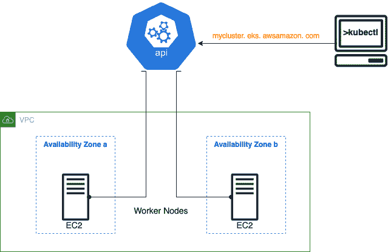
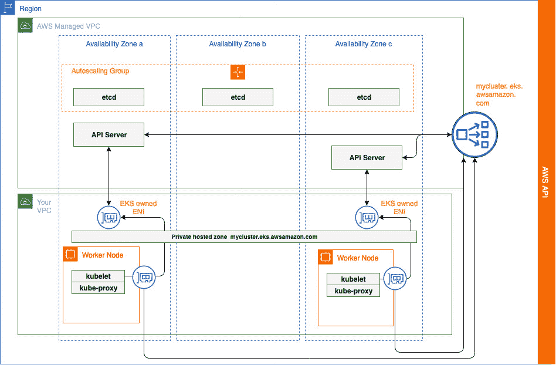
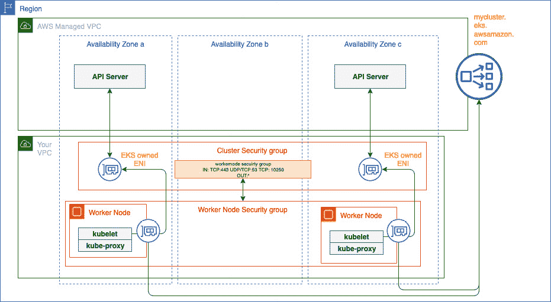

# 第二章：介绍 Amazon EKS

在上一章中，我们讨论了容器、容器编排和 Kubernetes 的基本概念。自己构建和管理 Kubernetes 集群可能是一项非常复杂且耗时的任务，但使用托管 Kubernetes 服务可以去除这些繁重的工作，使用户能够专注于应用程序的开发和部署。

本章将高层次地探讨 **弹性 Kubernetes 服务** (**EKS**) 及其技术架构，以便更好地理解其优点和缺点。

总结来说，本章涵盖以下主题：

+   什么是 Amazon EKS？

+   理解 EKS 架构

+   调查 Amazon EKS 定价模型

+   使用 EKS 时常见的错误

# 技术要求

你应该对以下内容有所了解：

+   什么是 Kubernetes 及其工作原理（参考 *第一章*，*Kubernetes 和容器的基础知识*）

+   AWS 基础服务，包括 **虚拟私有云** (**VPC**)、**弹性计算云** (**EC2**)、**弹性块存储** (**EBS**)、和 **弹性负载均衡器** (**ELB**)

+   对标准 Kubernetes 部署工具的基本了解

# 什么是 Amazon EKS？

根据 **云原生计算基金会** (**CNCF**) 的数据，到 2017 年底，近 57% 的 Kubernetes 环境运行在 AWS 上。最初，如果你想在 AWS 上运行 Kubernetes，必须使用 Rancher 或 Kops 等工具，在 EC2 实例上构建集群。你还需要持续监控和管理集群，部署开源工具如 Prometheus 或 Grafana，并且有一个运营团队确保集群的可用性，并管理升级过程。Kubernetes 还有定期发布的周期：截至 2021 年 6 月，每年发布三次！这也导致了升级集群的持续运营压力。

由于 AWS 服务路线图主要由客户需求推动，构建和运行 Kubernetes 在 AWS 上的工作量促使 AWS 服务团队在 2018 年 6 月发布了 EKS。

Amazon EKS 就是 Kubernetes！AWS 将开源代码进行修改，添加了特定于 AWS 的插件，用于身份验证和网络管理（本书后面会讨论），并允许你在 AWS 账户中部署 Kubernetes。AWS 随后管理控制平面，并允许你将计算和存储资源连接到其中，运行 Pods 并存储 Pod 数据。

如今，Amazon EKS 已被全球许多领先企业采用——如 Snap Inc.、汇丰银行（HSBC）、外卖英雄（Delivery Hero）、富达投资（Fidelity Investments）等。它简化了在 AWS 上构建、保护和遵循最佳实践的 Kubernetes 管理过程，为组织带来好处，使他们能够专注于构建基于容器的应用，而不是从零开始创建 Kubernetes 集群。

云原生计算基金会

CNCF 是一个成立于 2015 年的 Linux 基金会项目，负责推动 Kubernetes 开发以及其他云原生项目的发展。CNCF 目前拥有 600 多名成员，包括 AWS、Google、Microsoft、Red Hat、SAP、华为、Intel、Cisco、IBM、Apple 和 VMware。

## 为什么选择 Amazon EKS？

使用 EKS 的主要优点是您无需再管理控制平面；即使是升级，也只需要单击一下操作。虽然听起来很简单，但让 AWS 负责部署、扩展、修复和升级控制平面在生产环境中或当您有多个集群时所带来的运营节省是无法低估的。

由于 EKS 是一个托管服务，它也与 AWS 生态系统深度集成。这意味着：

+   Pods 是一级网络实体，具有 VPC 网络地址，并且可以像其他 AWS 资源一样进行管理和控制。

+   可以为 Pods 分配特定的**身份与访问管理**（**IAM**）角色，从而简化基于 Kubernetes 的应用程序如何连接和使用 AWS 服务，如 DynamoDB。

+   Kubernetes 的控制平面和数据平面日志及度量可以发送到 AWS CloudWatch，在那里可以进行报告、管理和可视化，而无需额外的服务器或软件。

+   运营和开发团队可以混合使用计算（EC2 和/或 Fargate）和存储服务（EBS 和/或 EFS）来支持各种性能、成本和安全需求。

重要说明

重要的是要理解，EKS 主要是一个托管控制平面。数据平面使用标准的 AWS 服务（如 EC2 和 Fargate）提供 Pods 的运行环境。在大多数情况下，数据平面由运营或开发团队管理。

在后续章节中，我们将深入探讨这些领域，并说明如何使用和配置它们。但现在，让我们继续讨论自管 K8s 集群和 EKS 之间的区别。

## 自管 Kubernetes 集群与 Amazon EKS

以下表格比较了自建集群与 EKS 的两种方式：

|  | **自管** **Kubernetes 集群** | **EKS** |
| --- | --- | --- |
| 完全控制 | 是 | 大部分（无法直接访问底层控制平面服务器） |
| Kubernetes 版本 | 社区发布 | 社区发布 |
| 版本支持 | Kubernetes 项目维护最近三个小版本的发布分支。从 Kubernetes 1.19 开始，版本将获得大约 1 年的补丁支持。Kubernetes 1.18 及更早版本的补丁支持大约为 9 个月。 | Kubernetes 版本在首次在 Amazon EKS 上可用后支持 14 个月，即使该版本不再由 Kubernetes 项目/社区支持。 |
| 网络访问控制 | 手动设置和配置 VPC 控制 | EKS 创建标准安全组并支持公共 IP 白名单。 |
| 身份验证 | 手动设置和配置 Kubernetes RBAC 控制 | 与 AWS IAM 集成 |
| 可扩展性 | 手动设置和配置扩展 | 管理的控制平面和标准计算/存储扩展 |
| 安全性 | 手动打补丁 | 控制平面的补丁由 AWS 进行 |
| 升级 | 手动更新和替换组件 | 单击一下即可升级控制平面，同时管理的节点组支持更简便的升级 |
| 监控 | 需要自行监控并支持监控平台 | EKS 会进行监控并替换不健康的主节点，集成了 CloudWatch |

表 2.1 – 自管理 Kubernetes 和 EKS 的比较

在下一部分，我们将深入探讨 EKS 架构，让你开始真正理解自管理集群和 EKS 之间的差异。

# 理解 EKS 架构

每个 EKS 集群都有一个用于工具（如 kubectl，主要的 Kubernetes 客户端）的单一端点 URL。此 URL 隐藏了在 AWS 管理的 VPC 中跨多个可用区部署的所有控制平面服务器，且构成控制平面的服务器对集群的用户或管理员不可访问。

数据平面通常由部署在多个可用区的 EC2 工作节点组成，并且配置了**kubelet**和**kube-proxy**代理，这些代理指向集群端点。下图展示了标准的 EKS 架构：



图 2.1 – EKS 架构的高级概览

下一部分将探讨 AWS 如何配置和保护 EKS 控制平面，并介绍你可以用来与之交互的具体命令。

## 理解 EKS 控制平面

当创建新集群时，会在 AWS 所有的 VPC 中创建一个新的控制平面，且该 VPC 位于一个独立账户中。每个控制平面至少有两个 API 服务器，分布在两个可用区以增强弹性，并通过公共**网络负载均衡器**（**NLB**）暴露。etcd 服务器分布在三个可用区，并配置为自动扩展组，同样是为了增强弹性。

集群的管理员和/或用户无法直接访问集群的服务器；他们只能通过负载均衡器访问 K8s API。API 服务器通过在两个可用区中创建**弹性网络接口**（**ENIs**）与在客户拥有的不同账户/VPC 下运行的工作节点集成。运行在工作节点上的 kubelet 代理使用附加到工作节点 VPC 的 Route 53 私有托管区来解析与 ENIs 相关联的 IP 地址。下图展示了这一架构：



图 2.2 – 详细的 EKS 架构

重要提示

这个架构的一个关键 *陷阱* 是，目前没有私有的 EKS 端点，因此工作节点需要互联网访问权限才能通过 AWS EKS DescribeCluster API 获取集群详情。这通常意味着带有工作节点的子网需要有互联网/NAT 网关或通向互联网的路由。

## 理解集群安全性

当创建新集群时，系统会同时创建一个新的安全组，并控制对 API 服务器 ENI 的访问。集群安全组必须配置为允许需要访问 API 服务器的任何网络地址。如果是公共集群（在 *第七章* 中讨论的 *EKS 网络*），这些 ENI 仅由工作节点使用。当集群是私有的时，这些 ENI 也用于客户端（kubectl）访问 API 服务器；否则，所有 API 连接都通过公共端点进行。

通常，为工作节点配置独立的安全组，并允许访问与数据平面相关的节点之间的通信。AWS 提供了一项名为 *安全组引用* 的功能，允许你从另一个安全组中引用现有的安全组。这简化了通过引用集群安全组中的任何工作节点安全组来将工作节点连接到集群 ENI 的过程。你需要从工作节点安全组中允许的最小访问权限是 HTTPS（TCP 443）、DNS（TCP/UDP 53）以及 kubelet 命令和日志（TCP 10250）。以下图示说明了这种架构。



图 2.3 – EKS 安全组

## 通过命令行了解你的集群

让我们使用 AWS 和 kubectl 的 `aws eks` `list-clusters` 命令：

```
$ aws eks list-clusters
{
    "clusters": [
        "mycluster13DCA0395 "
    ]}
```

在前面的输出中，我们可以看到列出了一个集群。我们可以使用 `aws eks describe-cluster --name` 命令获取更多细节：

```
$ aws eks describe-cluster --name mycluster13DCA0395
{
    "cluster": {
        "status": "ACTIVE",
        "endpoint": "https://12.gr7.eu-central-1.eks.amazonaws.com",
………..
        "name": "mycluster13DCA0395 ",
……
            "endpointPublicAccess": true,
            "endpointPrivateAccess": true
…………}
```

前面的输出已被截断，但显示了位于 `eu-central-1` 区域的端点。我们可以看到集群的名称，并且端点已设置为允许 `PublicAccess`（互联网访问）和 `PrivateAccess`（VPC 内部访问）。这意味着你的客户端（例如 kubectl）可以通过互联网或从任何可以路由到 VPC 的连接中访问集群（前提是访问列表、防火墙规则和安全组允许访问）。

在我们可以使用 kubectl 之前，需要做一个额外的步骤，即使用 `aws eks update-kubeconfig` 命令设置配置文件中的相关证书和上下文，以允许 **kubectl** 与集群通信。这个过程可以手动完成，但使用 AWS CLI 命令会更简单：

```
$ aws eks update-kubeconfig --name mycluster13DCA03950b0
Updated context arn:aws:eks:eu-central-1:676687:cluster/mycluster13DCA0395 in /../.kube/config
```

重要注意事项

你需要拥有 AWS EKS 的 IAM 权限来执行这些命令，同时需要 K8s RBAC 权限来执行 kubectl 命令，即使你已经拥有对集群端点的网络访问权限。

如果您使用 `kubectl cluster-info` 和 `kubectl version` 命令，您将看到与 `aws eks describe-cluster` 命令类似的信息。集群节点、存储和 Pod 的详细信息可以通过 kubectl 命令 `get nodes`、`get pv` 和 `get po` 来确定，如下所示。命名空间和排序命令修饰符可用于帮助输出：

```
$ kubectl get nodes
NAME           STATUS   ROLES    AGE   VERSION
ip-x.x.x.x.    Ready    <none>   25d   v1.21.5-eks-9017834
ip-x.x.x.x.    Ready    <none>   25d   v1.21.5-eks-9017834
$kubectl get pv --sort-by=.spec.capacity.storage
No resources found
$ kubectl get po --all-namespaces
NAMESPACE     NAME    READY   STATUS    RESTARTS   AGE
kube-system   aws-node-d2vpk    1/1     Running   0  1d
kube-system   aws-node-ljdz6  1/1     Running   0 1d
kube-system   coredns-12   1/1     Running   0 1d
kube-system   coredns-12   1/1     Running   0   1d
kube-system   kube-proxy-bhw6p 1/1 Running   0   1d
kube-system   kube-proxy-fdqlb  1/1 Running   0          1d
```

之前的输出告诉我们，集群有两个工作节点，没有配置物理卷，并且仅托管 `coredns`（集群 DNS 服务）、`kube-proxy`（集群网络）和 `aws-node`（AWS VPC CNI）等关键集群服务。

现在我们已经了解了什么是 EKS，让我们看看它在 AWS 中的定价。

# 调查 Amazon EKS 定价模型

在本节中，我们将简要概述 Amazon EKS 定价模型。由于 AWS 的定价模型会时常变动，建议您查看最新的 Amazon EKS 定价页面，以获取更多详细信息：

+   亚马逊 EKS 定价：[`aws.amazon.com/eks/pricing/`](https://aws.amazon.com/eks/pricing/)

+   AWS 定价计算器：[`calculator.aws`](https://calculator.aws)

单个集群将产生两种类型的费用：

+   EKS 控制平面的固定月度费用

+   来自计算、网络和存储资源的可变成本

## 固定的控制平面费用

控制平面定价固定为每小时 0.10 美元，相当于每个集群每月 73 美元（如以下计算所示）。这与控制平面由 AWS 管理的任何扩展或故障恢复活动无关。

*1 集群 x 每小时 0.10 美元 x 每月 730 小时 =* *73.00 美元*

## 可变成本

控制平面本身无法真正工作。它需要计算资源，以便可以实际调度和托管 Pods。反过来，计算平台需要存储和网络才能正常运行，但这些资源是基于可变成本模型的，成本会根据使用量波动。

EKS 工作节点有两种计算选项，稍后我们会详细讨论（EC2 和 Fargate）：

+   使用 EC2 时，费用将根据以下因素波动：

    +   EC2 实例的大小和数量

    +   附加到实例的存储量

    +   它们部署的区域

    +   定价模型的类型：按需、预留实例、抢占实例或您拥有的任何节省计划

+   使用 Fargate 时，费用将根据以下因素波动：

    +   Fargate 实例的数量

    +   实例操作系统/CPU 处理器

    +   它们部署的区域

    +   每个实例/每小时的 CPU/RAM 费用

    +   每个实例的存储量（以 GB 为单位）

EC2 工作节点将彼此通信，控制平面和 Pods 也将进行通信，跨工作节点互相传输数据，在某些情况下，还会涉及到 VPC 外部的通信。AWS 会对外发流量、跨可用区流量以及像 Transit 或 NAT 网关这样的网络服务收费。估算网络流量成本是最具挑战性的活动之一，因为在大多数情况下，你几乎不了解流量将在应用中如何路由，也不了解数据包大小、每秒数据包数等技术细节。网络流量估算超出了本书的范围，但有一些最佳实践是你应该尝试并遵守的：

+   设计和部署应用程序时，尽量让尽可能多的流量留在*工作节点内部*。例如，如果两个服务需要相互通信，可以使用 Pod **亲和性** 标签（仅限 EC2）确保它们共存于同一个节点/节点上。

+   设计你的 AWS VPC，确保流量留在相同的可用区内；例如，如果你的工作节点分布在两个可用区中以增强可靠性，可以部署两个 NAT 网关（每个可用区一个）以减少跨可用区的网络费用。当然，如果你的互联网流量非常少，这可能会变得更昂贵，因此仍然需要充分了解你的应用网络配置。

+   与 AWS 服务（如 DynamoDB 等）进行通信时，使用私有端点来减少网络外发费用。

我们已经了解了理论，接下来的部分将通过一些具体的示例使其更加清晰。

## 估算 EKS 集群的费用

为了更好地帮助你理解如何估算运行 EKS 集群时的费用，以下是一些在 AWS 上测量费用的示例。

### 示例 1 – 通过启动 EC2 实例运行带有工作节点的 EKS 集群

假设你选择在 AWS 美国东部区域（北弗吉尼亚，us-east-1）创建 EKS 集群，并使用以下设置：

+   3 个按需 Linux EC2 实例，使用 **m5.large** 作为工作节点，每个实例附带 20 GB 的 EBS 存储 gp2 卷（通用型 SSD）

+   一个整月都可用的集群（30 天，730 小时）

每月费用可以通过以下公式估算：

*1 集群 x 0.10 USD 每小时 x 730 小时每月 =* *73.00 USD*

*3 实例 x 0.096 USD x 730 小时每月 = 210.24 USD （每月* *按需费用）*

*30 GB x 0.10 USD x 3 实例 = 9.00 USD（**EBS 费用）*

所有这些费用加总后，每月费用为 292.24 美元。

重要提示

这只是一个简单示例；实际上，这些费用可以（并且应该）通过使用节省计划或预留实例，以及像 gp3 这样的存储选项大幅减少。

### 示例 2 – 使用 AWS Fargate 运行 EKS 集群

在前面的例子中，每个 **m5.large** 实例支持 8GB 的 RAM 和 2 个 vCPU，因此我们可以将许多 Pods 部署到每个工作节点。如果我们现在选择使用 Fargate 作为计算层，我们需要考虑支持多少 Pods，因为一个 Fargate 实例只能支持一个 Pod。

假设我们有相同的集群控制平面/区域，但有以下情况：

+   15 个 Pods 运行，并由 15 个 Fargate 实例支持，每个实例配有 1 个 vCPU 和 2 GB 内存，以及 20GB 的临时存储

+   每天 15 个任务或 Pods（每月 730 小时 / 每天 24 小时）= 每月 456.25 个任务

月度费用可以通过以下公式估算：

*1 个集群 x 每小时 0.10 美元 x 每月 730 小时 =* *73.00 美元*

*456.25 个任务 x 1 vCPU x 1 小时 x 0.04048 美元每小时 = 18.47 美元用于* *vCPU 小时*

*456.25 个任务 x 2.00 GB x 1 小时 x 0.004445 美元每 GB 每小时 = 4.06 美元用于* *GB 小时*

*20 GB - 20 GB（无需额外收费） = 0.00 GB 可计费的临时存储* *每个任务*

所有这些成本总和每月为 95.53 美元。

如你所见，EC2 和 Fargate 之间的成本差异显著（292.24 美元 vs 95.53 美元）。然而，在 Fargate 的例子中，有 15 个 Pods/实例，并且这些 Pods 每天只执行 1 小时。如果你的应用程序不是这样运行的，那么成本会发生变化，可能会更高。另一方面，在 EC2 上，你是为计算节点付费，因此 Pods 的数量以及它们执行的时间并不重要。实际上，你可能会看到一个混合的计算环境，EC2 为长时间运行的 Pods 提供计算资源，而 Fargate 用于更多的批处理类型操作或需要增强安全性的场景。

# 使用 EKS 时常见的错误

最后，让我们通过讨论如何高效地配置和管理 EKS 来结束这一章，并在可能的情况下应用最佳实践。以下是一些我们常见的错误，尤其是当人们刚开始使用 EKS 时：

+   **集群一直运行**：如果你不需要你的 EKS 集群，关闭它，或者至少删除或缩减节点组。为开发或测试环境创建集群（甚至仅仅是为了尝试书中的代码）会花费你真实的金钱，因此如果不使用它，关掉它。

+   `aws-auth` ConfigMap。请阅读 *第六章*，*EKS 上的集群安全与访问*，了解更多信息。

+   **Pod IP 地址耗尽**：使用 AWS CNI，每个 Pod 都会分配一个 VPC IP 地址。如果你没有正确配置你的 VPC 和 EKS 集群，你将耗尽 IP 地址，集群将无法调度更多的 Pods。请阅读 *第七章*，*EKS 中的网络*，了解更多信息。

+   **我的集群 IP 地址无法从我的工作站访问**：集群可以是私有的（仅能从 AWS 和连接的私有网络访问）或公共的（可以从互联网访问），因此根据集群的配置，以及客户机与 API 服务器之间的防火墙设置，您可能无法访问 API 服务器。

# 概要

在本章中，我们描述了 EKS 只是 Kubernetes 的托管版本，主要的区别在于 AWS 会为您管理和扩展控制平面（API 服务器、etcd 等），而集群的用户/管理员负责部署计算和存储资源以托管 Pods。

我们还查看了 AWS 管理控制平面的技术架构，以及如何与其进行交互。然而，我们指出，由于它是 AWS 管理的服务，您几乎没有能力修改构成控制平面的服务器。

接着，我们查看了几种 EKS 成本模型，帮助您理解虽然控制平面成本大多是固定的，但计算和存储的成本将根据您拥有的 Pods 或 EC2 工作节点数量而变化。最后，我们讨论了首次使用 EKS 的用户常见的一些错误。

在下一章中，我们将学习如何创建 EKS 集群并设置环境。我们还将介绍如何使用不同的工具创建自己的 Amazon EKS 集群。

# 进一步阅读

+   EKS 价格降低: [`aws.amazon.com/about-aws/whats-new/2020/01/amazon-eks-announces-price-reduction/`](https://aws.amazon.com/about-aws/whats-new/2020/01/amazon-eks-announces-price-reduction/)

+   深入了解 Amazon EKS: [`www.youtube.com/watch?v=cipDJwDWWbY`](https://www.youtube.com/watch?v=cipDJwDWWbY)

+   AWS EKS SLA: [`aws.amazon.com/eks/sla/`](https://aws.amazon.com/eks/sla/)
