# 3

# 构建您的第一个 EKS 集群

在前几章中，我们详细讨论了 Kubernetes 和 EKS。本章将开始探索如何配置和构建一个基本集群。

虽然 EKS 是 AWS 提供的托管服务，但您可以使用多种方式创建集群，包括控制台、**命令行界面**（**CLI**）和**基础设施即代码**（**IaC**）。集群还可以应用不同的配置，包括网络、存储和应用程序配置。本章将重点介绍构建集群的先决条件以及构建集群所需的基本配置。具体来说，我们将涵盖以下主题：

+   理解构建 EKS 集群的先决条件

+   理解 EKS 集群的不同配置选项

+   列举自动化选项

+   创建您的第一个 EKS 集群

让我们从创建第一个集群前需要做的工作开始。

# 技术要求

您应该对云自动化有所了解，最好熟悉 CloudFormation，并且具备一定的编程语言或软件开发经验。

为了跟上进度，您还需要一个 AWS 账户来启动 EKS 资源。如果您没有账户，请前往 AWS 并创建一个：[`aws.amazon.com/`](https://aws.amazon.com/)。

重要说明

这些活动将导致 AWS 费用，因此在构建完资源后，请确保删除所有资源。

# 理解构建 EKS 集群的先决条件

默认情况下，用于创建 AWS 账户的电子邮件地址和密码属于根用户，并且它们拥有在 AWS 账户中执行任何操作的权限。AWS 的最佳实践是为此账户启用**多因素身份验证**（**MFA**），并且*仅在紧急情况下*使用此账户。

在创建 EKS 集群之前，您需要在拥有 AWS 账户和根用户访问凭证后执行以下活动：

1.  使用临时根凭证配置您的 AWS CLI 环境。

1.  作为根用户，您应该：

    1.  创建 EKS 管理员策略，使用最小权限来部署和管理 EKS 集群

    1.  创建一个 EKS 集群管理员组并将 EKS 管理员角色分配给该组

    1.  创建一个新用户并将其添加到 EKS 集群管理员组

    1.  创建访问凭证并将其添加到您的 AWS CLI 配置中

1.  使用以下指南在您的工作站上安装 kubectl：[`docs.aws.amazon.com/eks/latest/userguide/install-kubectl.html`](https://docs.aws.amazon.com/eks/latest/userguide/install-kubectl.html)。

## 使用临时根凭证配置您的 AWS CLI 环境

通常，您只需运行 `$ aws configure` 命令，它会要求您输入默认的访问凭证、区域和输出格式，但我们不希望永久保存根凭证，因此我们将使用环境变量暂时保存它们：

```
export AWS_ACCESS_KEY_ID=<root access key>
export AWS_SECRET_ACCESS_KEY=<root secret access key>
export AWS_DEFAULT_REGION=<working region>
```

## 创建 EKS 管理员策略

为 EKS 管理员提供正确权限的最简单方法是授予他们访问 AWS 管理的 `AdministratorAccess` 管理角色的权限。你可以使用以下命令获取角色的唯一身份 **AWS 资源名称** (**ARN**)：

```
$ export EKSARN=$(aws iam list-policies --query 'Policies[?PolicyName==`AdministratorAccess`].{ARN:Arn}' --output text)
```

`AdministratorAccess` 角色非常宽泛，允许资源获得分配的权限和大量不必要的权限。理想情况下，创建的 EKS 管理员角色应该按照最小权限安全模型定义，减少权限。创建此角色相当复杂，因为它需要多个资源权限。以下表格列出了 EC2、EKS、KMS 和 IAM 所需的最小权限。然而，如果你需要创建 VPC/子网等，可能需要向此角色添加权限。

| **AWS** **资源** | **最小** **权限集** |
| --- | --- |
| EC2 API | `"ec2:RunInstances"`, `"ec2:RevokeSecurityGroupIngress"`, `"ec2:RevokeSecurityGroupEgress"`, `"ec2:DescribeRegions"`, `"ec2:DescribeVpcs"`, `"ec2:DescribeTags"`, `"ec2:DescribeSubnets"`, `"ec2:DescribeSecurityGroups"`, `"ec2:DescribeRouteTables"`,`"ec2:DescribeLaunchTemplateVersions"`, `"ec2:DescribeLaunchTemplates"`, `"ec2:DescribeKeyPairs"`, `"ec2:DescribeInternetGateways"`, `"ec2:DescribeImages"`, `"ec2:DescribeAvailabilityZones"`, `"ec2:DescribeAccountAttributes"`, `"ec2:DeleteTags"`, `"ec2:DeleteSecurityGroup"`, `"ec2:DeleteKeyPair"`, `"ec2:CreateTags"`, `"ec2:CreateSecurityGroup"`, `"ec2:CreateLaunchTemplateVersion"`, `"ec2:CreateLaunchTemplate"`, `"ec2:CreateKeyPair"`, `"ec2:AuthorizeSecurityGroupIngress"`, `"ec2:AuthorizeSecurityGroupEgress"` |
| EKS API | `"eks:UpdateNodegroupVersion"`, `"eks:UpdateNodegroupConfig"`, `"eks:UpdateClusterVersion"`, `"eks:UpdateClusterConfig"`, `"eks:UntagResource"`, `"eks:TagResource"`, `"eks:ListUpdates"`, `"eks:ListTagsForResource"`, `"eks:ListNodegroups"`, `"eks:ListFargateProfiles"`, `"eks:ListClusters"`, `"eks:DescribeUpdate"`, `"eks:DescribeNodegroup"`, `"eks:DescribeFargateProfile"`, `"eks:DescribeCluster"`, `"eks:DeleteNodegroup"`, `"eks:DeleteFargateProfile"`, `"eks:DeleteCluster"`, `"eks:CreateNodegroup"`, `"eks:CreateFargateProfile"`, `"eks:CreateCluster"` |
| KMS API | `"kms:ListKeys"` |
| IAM API | `"iam:PassRole"`, `"iam:ListRoles"`, `"iam:ListRoleTags"`, `"iam:ListInstanceProfilesForRole"`, `"iam:ListInstanceProfiles"`, `"iam:ListAttachedRolePolicies"`, `"iam:GetRole"`, `"iam:GetInstanceProfile"`, `"iam:DetachRolePolicy"`, `"iam:DeleteRole"`, `"iam:CreateRole"`, `"iam:AttachRolePolicy"` |

表 3.1 – EKS 管理员示例权限

一旦你设置了所需的权限集，你就可以创建一个策略文档。下面的 JSON 示例只包含了 KMS 权限，便于简化展示：

```
{    "Version": "2012-10-17",
    "Statement": [
        {"Sid": "KMSPermisssions",
            "Effect": "Allow",
            "Action": ["kms:ListKeys"],
            "Resource": "*"
        }]}
```

使用 `aws iam create-policy --policy-name bespoke-eks-policy --policy-document file://<mypolicyfile.json>` 命令根据你创建的 JSON 文件创建 IAM 策略，然后你可以使用以下命令检索 ARN：

```
$ export EKSARN=$(aws iam list-policies --query 'Policies[?PolicyName==`bespoke-eks-policy`].{ARN:Arn}' --output text)
```

## 创建 EKS 管理组

使用 CLI 创建组是非常简单的，使用以下命令：

```
$ aws iam create-group --group-name EKS-Admins.
```

然后，你需要使用以下命令附加在前一步中创建的策略：

```
$ aws iam attach-group-policy --policy-arn $EKSARN --group-name EKS-Admins.
```

## 创建一个新用户

现在我们已经拥有了权限，并且组已经创建，我们可以使用以下命令创建一个新用户并将其分配到该组：

```
$ aws iam create-user --user-name <MYUSERNAME>
```

然后，你可以使用以下命令将刚创建的用户添加到组中：

```
$ aws iam add-user-to-group --user-name <MYUSERNAME> --group-name EKS-Admins
```

你还需要使用以下方法创建密码：

```
$ aws iam update-login-profile --user-name <MYUSERNAME> --password <password>
```

现在你需要创建访问凭证并使用以下方法存储它们：

```
$ aws iam create-access-key --user-name <MYUSERNAME>
{ "AccessKey": {
        "UserName": "<MYUSERNAME>",
        "Status": "Active",
        "CreateDate": "2022-08-19T11:01:07Z",
        "SecretAccessKey": "67ghjghjhjihk",
        "AccessKeyId": "hgjgjgjhgjhgj"}}
```

你应该复制此命令输出的凭证（`SecretAccessKey` 和 `AccessKeyId`），使用 `$aws configure` 命令将它们添加到你的 CLI 配置中，并在接下来的示例中使用此账户/凭证。

重要提示

你仍然需要授予控制台访问权限。请参阅此链接：[`docs.aws.amazon.com/IAM/latest/UserGuide/console_controlling-access.html`](https://docs.aws.amazon.com/IAM/latest/UserGuide/console_controlling-access.html)。

你还应该启用 MFA。请参阅此链接：[`docs.aws.amazon.com/IAM/latest/UserGuide/id_credentials_mfa.html`](https://docs.aws.amazon.com/IAM/latest/UserGuide/id_credentials_mfa.html)。

现在我们已经具备了所有前提条件，我们需要考虑如何配置 EKS 集群。

# 了解 EKS 集群的不同配置选项

Kubernetes 默认是可扩展的，这是它如此受欢迎的原因之一。除了我们已经讨论过的标准 API 对象，如 **Pods** 和 **Services**，你还可以扩展 API 来支持自定义资源、控制器、操作器以及用于网络和存储的标准插件。所有这些元素都可以作为集群创建过程的一部分添加到 EKS 集群中；然而，在本章中，我们将介绍如何配置基本的设置，以便启动并运行一个简单的集群。下表定义了将要配置的内容，并提供了指向其他章节的链接，后者展示了更多的配置步骤：

| **EKS** **配置域** | **描述** |
| --- | --- |
| 控制 plane | 正如我们所提到的，EKS 实际上是一个托管的控制 plane，所以这必须始终完成，接下来的部分将重点讲解如何创建它。 |
| 基本网络配置 | 我们将在本节中简要介绍使用默认 AWS EKS VPC 插件（CNI）的配置，但在 *第七章*中会有更详细的讲解。 |
| 基础节点组 | 在下一部分，我们将使用 EC2 资源创建一个小的节点组，用于托管关键的集群资源，如 VPC 网络插件。 |
| Pod 存储服务 | 我们不会在本节中讨论这一点，但将在*第十二章*中详细介绍。 |
| 额外节点组 | 我们不会在本节中讨论这一点，但将在*第八章*中详细介绍。 |
| Fargate 配置文件 | 我们不会在本节中讨论这一点，但将在*第十五章*中详细介绍。 |
| Kubernetes 应用程序 | 我们不会在本节中讨论这一点，但将在*第十一章*、*第十三章*和*第十四章*中详细介绍。 |
| 高级网络概念 | 我们不会在本节中讨论这一点，但将在*第八章*中详细介绍。 |
| 服务网格 | 我们不会在本节中讨论这一点，但将在*第十六章*中详细介绍。 |

表 3.2 – EKS 配置区域

在我们实际创建一个由托管控制平面、基本网络和基础节点组组成的集群之前，先回顾一下我们可以选择的不同方式来部署和自动化它，以及为什么会选择某种方式而不是其他方式。

# 枚举自动化选项

以下图示（*图 3.1*）展示了 AWS 中基础设施自动化的发展历程。大多数用户最初是通过使用 playbooks 或维基和 AWS 控制台进行手动配置。这样做的挑战是很难重复，如果需要更改或添加某些内容，则需要手动操作。

下一步是使用 Shell 脚本来自动化 AWS 资源的部署，例如，使用 AWS CLI。这样并不完美，因为如果你运行相同的命令两次，可能会得到不同的结果。因此，AWS CLI 并不是（必然）幂等的。所以，在 2011 年，AWS 发布了 CloudFormation，这是一个 IaC 框架，可以安全地创建基础设施资源。

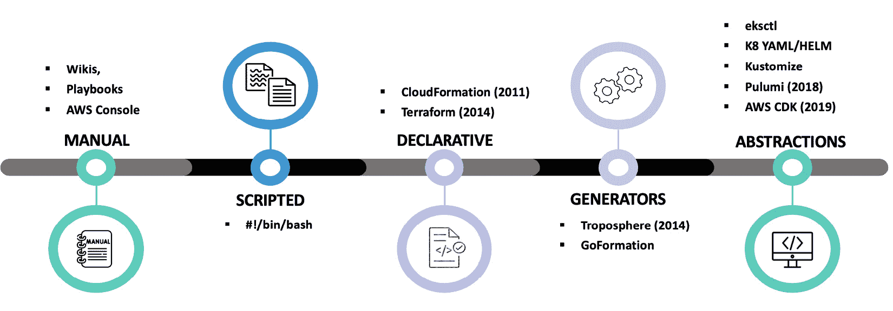

图 3.1 – 自动化选项

IaC 已成为部署 AWS 资源的最佳实践，2014 年 HashiCorp 发布了 Terraform，它变得非常流行，再次允许你安全地自动化和部署 AWS 资源。CloudFormation 和 Terraform 的挑战在于，它们各自有自己的标记语言，需要学习，并且可能比较复杂。

多年来，已经开发出各种生成器，允许你无需理解如何编写脚本就能创建 CloudFormation 和 Terraform 脚本。这个概念进一步扩展为抽象，如 AWS **Cloud Development Kit**（**CDK**），它允许你使用常规编程语言（如 Python、TypeScript 等）生成和部署 CloudFormation。

在 Kubernetes 中，这种额外的抽象层是集群的一部分，清单、Helm 图表和 Kustomize 被用来抽象 Kubernetes 资源，工具如 eksctl 提供了一个简单的接口来配置 EKS 集群。

## 我应该使用哪种自动化工具/框架？

对于任何自动化操作，一条常规的经验法则是 **不要重复自己** (**DRY**)，所以如果你打算定期创建或删除集群，使用自动化，并尽可能使用最高级别的抽象。像 CDK 和 eksctl 这样的工具意味着你不需要学习 CloudFormation，但仍然可以依赖 *安全* 的部署实践，如声明式配置和幂等操作。

Terraform 支持这些 *安全* 操作，这意味着你还可以支持其他云服务，如 Microsoft Azure 和 Google Cloud Platform，以及其他本地资源。

在接下来的部分中，我们将向你展示如何使用控制台和 AWS CLI 创建一个基本的集群，然后通过以下 IaC 工具简化操作：Terraform、eksctl 和 AWS CDK。

# 创建你的第一个 EKS 集群

请使用以下命令验证你是否使用了在前提条件中创建的用户名的凭证：

```
$ aws sts get-caller-identity
{    "UserId": <MYUSERNAME>",
    "Account": "11112222333",
    "Arn": "arn:aws:sts::11112222333<MYUSERNAME>/IAM_ROLE>"}
```

## 选项 1：使用 AWS 控制台创建 EKS 集群

要开始此练习，请打开浏览器，访问 [`aws.amazon.com/`](https://aws.amazon.com/)，并使用你在前提条件中创建的用户名/凭证登录到你的帐户。

登录后，完成以下步骤：

1.  在搜索框中输入 `IAM`，然后从搜索结果中选择 **IAM** | **角色**。

1.  现在，你应该通过点击 **创建角色** 按钮来创建一个集群服务角色，这将允许集群调用其他 AWS 服务。这是一个简单的策略，定义在 [`docs.aws.amazon.com/eks/latest/userguide/service_IAM_role.html`](https://docs.aws.amazon.com/eks/latest/userguide/service_IAM_role.html) 中，应该与 AmazonEKSClusterPolicy 管理策略关联。

1.  创建服务角色后，选择你希望启动 Amazon EKS 集群的区域，在搜索框中输入 `EKS`，并选择 **弹性** **Kubernetes 服务**。

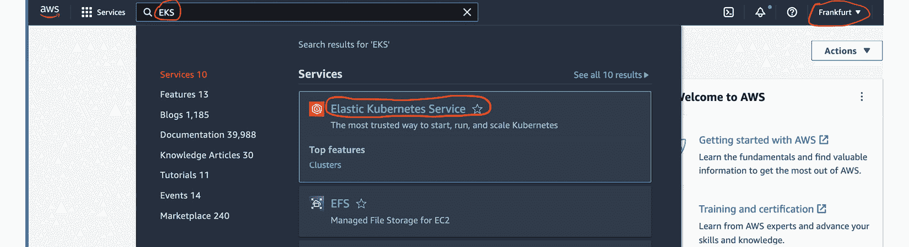

图 3.2 – 选择 EKS

1.  在 EKS 启动屏幕上，点击 **添加集群** | **创建** 按钮。

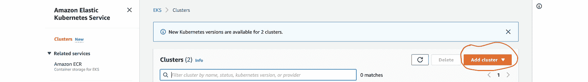

图 3.3 – 添加集群

1.  在弹出的屏幕上，在 **名称** 字段中输入集群名称，从 **Kubernetes 版本** 字段中选择你要部署的 Kubernetes 版本，选择在 *第 2 步* 中创建的服务角色，然后点击 **下一步**。

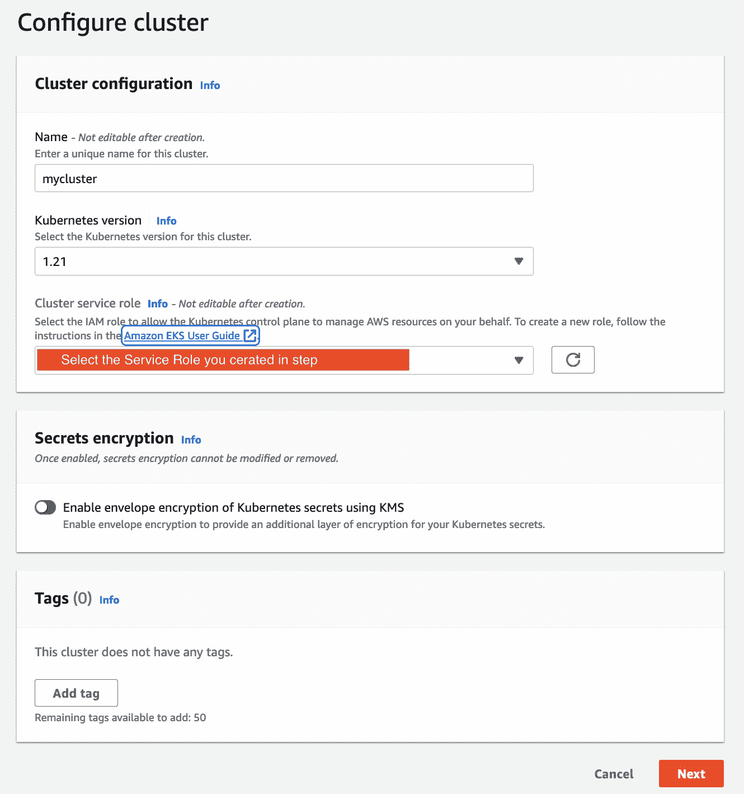

图 3.3 – 配置集群

1.  在 EKS 网络屏幕的第一个面板中，你需要选择控制平面将使用的 VPC 和子网，以及任何工作节点使用的安全组。如果这些资源不存在，你可以使用 VPC 控制台链接添加它们（确保在浏览器标签页或窗口中打开该链接）。

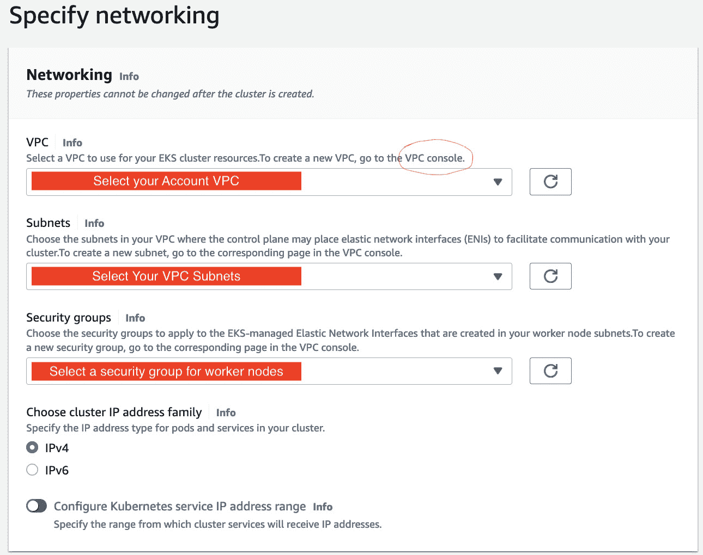

图 3.4 – 输入 VPC 和安全组详细信息

1.  在下一个面板中，选择集群端点的类型。在本示例中，我们将保持默认的**公共**选项，这意味着集群 API 可以通过互联网访问。

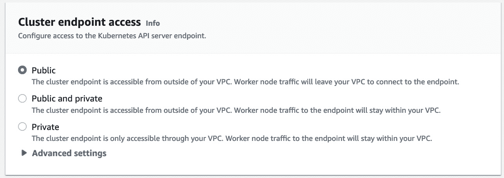

图 3.5 – 集群端点

1.  在最后一个网络配置面板中，您可以保留默认值，这些值与*步骤 5*中选择的 Kubernetes 版本相关，然后点击**下一步**。

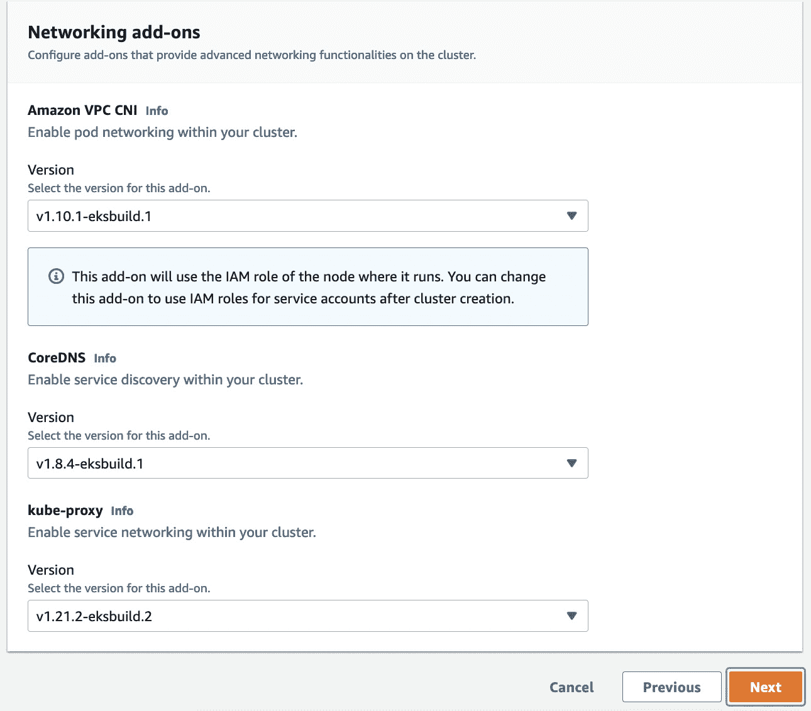

图 3.6 – 完整的网络配置部分

1.  通过选择按钮并点击**下一步**，启用将**审计**日志记录到 CloudWatch 日志。

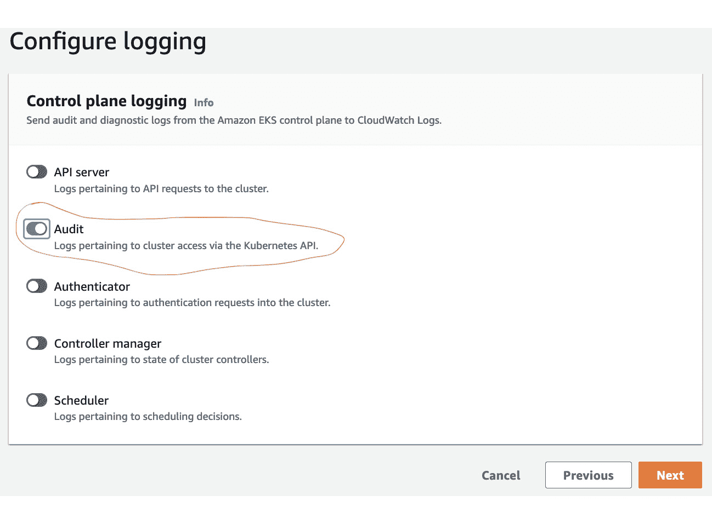

图 3.7 – 控制平面日志记录

1.  审查您的集群设置并点击**创建**按钮。此过程需要 20-30 分钟才能完成，涉及在 AWS 所有的 VPC 中设置控制平面（API 和 etcd 服务器），并通过**弹性网络接口**（**ENIs**）将其连接到您的 VPC。完成后，您将看到一个状态为**活动**的新集群，如下图所示：


图 3.8 – 活动集群

1.  由于这是一个公共集群，您可以运行`aws eks update-kubeconfig --cluster <CLUSTERNAME> --region <YOURREGION>`命令来更新您的`kubeconfig`文件。我们已经创建了 EKS 控制平面并设置了网络，但目前我们没有任何节点连接到它。我们可以使用`kubectl get nodes`命令来验证这一点。您应该会收到**未找到资源**的消息。

1.  如果点击集群名称链接（在*步骤 10*中为**mycluster**），您将进入下图所示的集群配置页面。点击**计算**选项卡，然后点击**添加节点** **组**按钮。

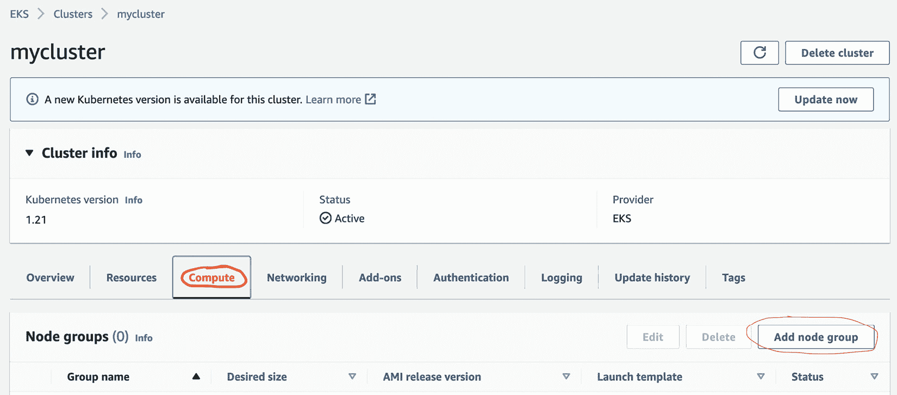

图 3.9 – 计算

1.  在第一个**节点组配置**面板中，为节点组输入名称和 EC2 工作节点 IAM 角色。如果该角色不存在，您可以通过 VPC 控制台链接添加它（确保在浏览器标签页或窗口中打开该链接）。角色应根据以下链接创建：[`docs.aws.amazon.com/eks/latest/userguide/create-node-role.html`](https://docs.aws.amazon.com/eks/latest/userguide/create-node-role.html)。

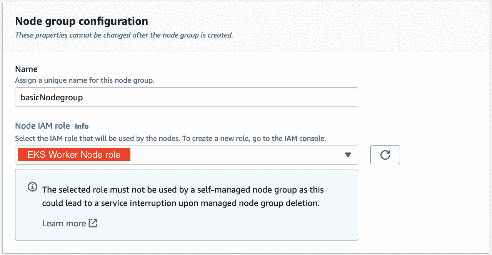

图 3.10 – 节点组配置

1.  您可以接受使用 EKS 优化的 Amazon Linux **操作系统**（**OS**）镜像在自动扩展组中启动` t3.medium` EC2 实例的所有默认设置。点击**下一步**。

1.  选择您将在 VPC 中用于 EC2 工作节点的子网；您应该选择至少两个子网/可用区。点击**下一步**。

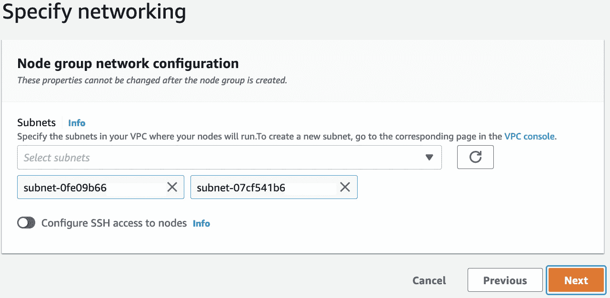

图 3.11 – 节点组网络配置

1.  审查您的节点组设置，然后点击`kubelet`和`kubeproxy`，并重新连接到控制平面。一旦作业完成，节点组应为**活跃**，并且两个 EC2 实例应为**准备就绪**。

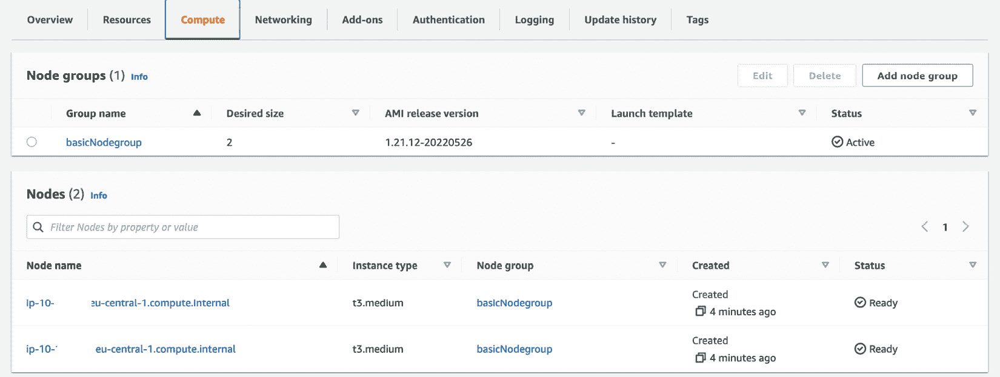

图 3.12 — 活跃节点组

1.  我们可以使用`kubectl get nodes`命令来验证这一点。输出现在应该显示您刚刚创建的两个节点。

1.  完成集群设置后，请删除节点组，然后您可以删除集群。

重要提示

由于 AWS 控制台界面可能发生更改，如果您有任何问题，您可以随时查阅 AWS 文档，以获取有关创建 EKS 集群（[`docs.aws.amazon.com/eks/latest/userguide/create-cluster.html`](https://docs.aws.amazon.com/eks/latest/userguide/create-cluster.html)）和创建托管节点组（[`docs.aws.amazon.com/eks/latest/userguide/create-managed-node-group.html`](https://docs.aws.amazon.com/eks/latest/userguide/create-managed-node-group.html)）的最新步骤。

在本小节中，我们已经创建了一个带有托管控制平面的基础集群、一个 AWS VPC 网络和一个包含两个 EC2 工作节点的基础节点组。在下一小节中，我们将看到如何使用 AWS CLI 创建相同的集群。

## 选项 2：使用 AWS CLI 创建 EKS 集群

AWS CLI 是一个用于管理 AWS 资源的工具。您可以通过此链接安装它：[`docs.aws.amazon.com/cli/latest/userguide/getting-started-install.html`](https://docs.aws.amazon.com/cli/latest/userguide/getting-started-install.html)。

要使用 AWS CLI 创建 EKS 集群，请按照此处详细说明的步骤操作：

1.  我们将重用集群服务角色和*选项 1*中使用的相同子网。如果它们不存在，请按照*选项 1*中的步骤创建它们。

1.  然后，您可以使用您在先决条件中创建的用户名/凭证，使用以下命令在您的账户中创建托管控制平面。子网和安全组可以与*选项 1*中使用的相同：

    ```
    $ aws eks create-cluster --region <MYREGION> --name mycluster --kubernetes-version 1.22 --role-arn <MYSERVICEROLEARN> --resources-vpc-config subnetIds=subnet-1,subnet-2,securityGroupIds=sg-a
    ```

1.  现在，这将需要 20 到 30 分钟完成，并涉及在 AWS 拥有的 VPC 中设置控制平面（API 和 etcd 服务器），并通过 ENI 将其连接到您的 VPC。当它完成时，您将看到一个状态为**活跃**的新集群，如以下截图所示。

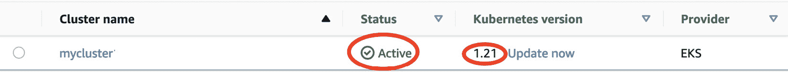

图 3.13 – 活跃集群

1.  同样，我们已经创建了 EKS 控制平面并设置了网络，但目前我们没有任何节点连接到它。我们可以通过更新`kubeconfig`文件后使用`kubectl get nodes`命令来验证此情况。您应该会看到**未找到资源**消息。

1.  您可以使用以下命令创建基础节点组，该命令将使用 EKS 优化的 Amazon Linux 操作系统镜像并使用在*选项 1*中创建的 EC2 角色，在自动扩展组中创建两个 t3.medium EC2 实例。

    ```
    $ aws eks create-nodegroup --region <MYREGION>   --cluster-name mycluster --nodegroup-name basicCLI --scaling-config minSize=2,maxSize=2,desiredSize=2 --subnets subnet-1  subnet-2 --ami-type AL2_x86_64 --node-role <EKSWORKERNODEROLEARN>
    ```

1.  这将需要 10 到 20 分钟，并将创建两个 EC2 实例，配置 Kubernetes 代理（`kubelet` 和 `kubeproxy`），并与控制平面连接。任务完成后，节点组应显示为 **Active**，两个 EC2 实例应显示为 **Ready**。

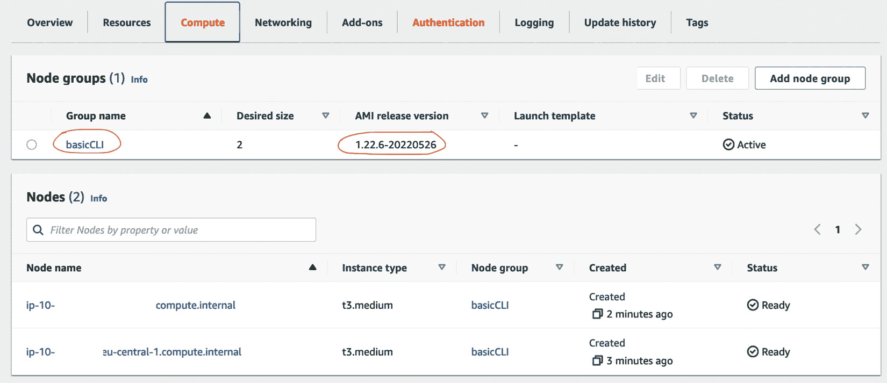

图 3.14 – 一个 CLI 节点组

1.  我们可以通过使用 `kubectl get nodes` 命令来验证这一点。输出现在应该显示你刚刚创建的两个节点。

1.  一旦你完成了集群的操作，删除节点组后，你可以使用以下命令删除集群：

    ```
    $ aws eks delete-nodegroup --cluster-name <CLUSTER_NAME> --nodegroup-name <NODEGROUP_NAME> --region <REGION>
    $aws eks delete-cluster --name <CLUSTER_NAME> --region <REGION>
    ```

如你所见，这个过程比通过 AWS 控制台点击操作要简单得多。这些命令可以放入一个 shell 脚本中，并且你可以使用环境变量来参数化输入，例如更改集群名称。然而，并不能保证每个命令都能*安全*地重复执行，如果出现失败，脚本执行可能会出现问题。一种更好的方法是使用 IaC，我们将在接下来的子节中探讨这一点。

## 选项 3：使用 Terraform 创建 EKS 集群

Terraform 是由 HashiCorp 创建的一个开源项目，它由一个单一的二进制文件组成，可以用来验证、部署和删除（销毁）AWS 基础设施资源。你可以按照[`learn.hashicorp.com/tutorials/terraform/install-cli`](https://learn.hashicorp.com/tutorials/terraform/install-cli) 上的说明来安装 Terraform。

为了使用 Terraform 创建你的第一个 EKS 集群，我们将克隆 HashiCorp 提供的官方示例，包含用于创建 EKS 集群的配置文件。这是一个非常完整的解决方案（创建 53 个资源），将创建一个新的 VPC、两个托管工作节点组，以及所有相关的角色和权限。使用以下命令克隆并进入克隆目录：

```
$ git clone https://github.com/hashicorp/learn-terraform-provision-eks-cluster
$ cd learn-terraform-provision-eks-cluster
```

Terraform 通过将所有 `.tf` 文件汇总为一个单一的配置文件，然后使用你的本地凭证将其部署到 AWS。你需要修改某些 `.tf` 文件以适应你的 AWS 账户；下表解释了哪些文件需要修改：

| **Terraform (.****tf) 文件** | **更改** |
| --- | --- |
| `./``vpc.tf` | 将区域变量更改为你想使用的区域，例如：`variable "``region" {`  `default`     `= "``eu-central-1"`  `description = "``AWS 区域"``}` |
| `./``eks-cluster.tf` | 将 EKS 版本更改为所需版本，例如：`module "``eks" {`        `cluster_version = "``1.22" }` |

表 3.3 – Terraform 更改

现在你已经对 Terraform 文件进行了更改，可以使用 Terraform 创建 EKS 集群和环境。你应该按照这里详细描述的步骤进行操作：

1.  运行`$ terraform init`命令以创建本地状态并下载所有远程模块文件，例如用于创建新 VPC 的 VPC 模块。下载所有模块文件可能需要一些时间。如果此命令成功，您将看到**Terraform 已经成功** **初始化！**消息。

1.  运行`$ terraform plan`命令查看在实际部署资源之前将要创建的资源。这是与控制台和 CLI 方法相比的一个主要优势，因为您还可以使用此命令查看当您更改`.tf`文件时会发生什么变化。

1.  运行`$ terraform apply -auto-approve`命令来创建/部署资源。这将需要 20 到 30 分钟完成（所以请坐好）。完成后，您将拥有一个新的 IAM 角色，一个位于新 VPC 中的 EKS 集群，新的互联网和 NAT 网关，以及两个托管节点组和三个 EC2 实例。

1.  在这个选项中，我们实际上创建了托管节点组，我们可以通过使用`$ kubectl get nodes`命令来验证它们。在更新`kubeconfig`文件后，您将看到三个工作节点。

1.  完成集群后，使用`$ terraform destroy -auto-approve`命令删除所有资源。Terraform 将自动确定删除的顺序。

如您所见，Terraform 是一个非常强大的工具，简化了您配置和部署资源的方式。您仍然需要配置或创建 Terraform 模块，这需要您学习 Terraform 语法和标记语言。

在下一个子章节中，我们将看到如何使用 eksctl 创建 EKS 集群，在幕后使用 CloudFormation，而无需学习任何 CloudFormation 语法。

## 选项 4：使用 eksctl 创建 EKS 集群

eksctl 是一个开源项目，托管在 GitHub 上（[`github.com/weaveworks/eksctl`](https://github.com/weaveworks/eksctl)），由 Weaveworks 和 AWS 共同开发。它类似于 Terraform，以单个二进制文件运行并创建 AWS 资源；但是，它只能用于创建、更新和管理 EKS 集群（以及任何相关的资源）。

您可以按照[`docs.aws.amazon.com/eks/latest/userguide/eksctl.html`](https://docs.aws.amazon.com/eks/latest/userguide/eksctl.html)上的说明安装 eksctl。安装二进制文件到您的工作站后，您可以使用`eksctl info`命令测试安装。创建集群的最简单方法是运行以下命令：

```
$ eksctl create cluster --name mycluster --region eu-central-1
```

这种方式与 Terraform 类似，它将创建 VPC、EKS 集群、一个节点组以及所有相关的资源，例如 IAM 角色。在后台，eksctl 使用 CloudFormation，并将创建两个 CloudFormation 堆栈，来创建（29+）个 AWS 资源。如果您运行`$ aws cloudformation list-stacks`命令，您将看到名为*eksctl-xx*的堆栈，它们部署所有 EKS 资源：一个用于主资源（包括 VPC），另一个专门用于节点组。CloudFormation 堆栈管理资源的状态，还可以用来检测漂移并进行更改。

再次使用此选项，我们已创建了托管节点组，可以通过使用`kubectl get nodes`命令验证它们。更新`kubeconfig`文件后，您将看到两个工作节点。

您还可以通过添加命令行选项来修改默认配置。以下命令将更改作为默认节点组一部分正在部署的实例类型和数量：

```
$ eksctl create cluster --name mycluster --instance-types m5.xlarge --nodes 2 --region eu-central-1
```

eksctl 支持多种集群创建选项。您可以使用`--help`标志列出其他支持的选项，以获取更多详细信息。

完成集群配置后，您可以使用`$ eksctl delete cluster --name mycluster --region eu-central-1`命令删除所有资源。由于 eksctl 是一个特定的 EKS 配置工具，因此它具有一些内置功能，例如节点排空。

如您所见，eksctl 为 Terraform 提供了更高层次的抽象，但由于它是一个 EKS 工具，因此不如 Terraform 灵活。在下一小节中，我们将简要介绍 AWS CDK，它使用像 Python 这样的编程语言，完全摆脱了任何 IaC 标记语言。

## 选项 5：使用 CDK 创建您的 EKS 集群

AWS CDK 类似于 Terraform 和 eksctl，它通过一组二进制文件来部署 AWS 基础设施。它在后台使用 CloudFormation，但与 eksctl 相比，它有四个主要优势：

+   IaC 代码使用标准编程语言编写，如 Python、TypeScript、Golang 等，因此开发人员可以在不学习 Terraform 或 CloudFormation 标记语言的情况下编写代码。

+   您可以利用现有的语言控制结构，如`IF-THEN-ELSE`、`FOR`循环等，以及现有的库，将复杂逻辑构建到您的 IaC 脚本中。

+   您还可以创建与 EKS 无关的资源，如 DynamoDB。

+   可以使用标准语言工具，如 pylint 或 pytest，测试和校验模板。

CDK 的详细探索超出了本书的范围（事实上，它可以成为一本全新的书）。如果您想深入了解 CDK，[`cdkworkshop.com/`](https://cdkworkshop.com/)是一个很好的资源。相反，以下表格显示了创建 EKS 集群所需的基本命令：

| **Python 行** | **描述** |
| --- | --- |
| `my_vpc =` `ec2.Vpc.from_lookup(self,"clusterVPC",vpc_id=params['VPC'])` | 这行代码使用 CDK 中的 `ec2.Vpc` 对象，通过 `params['VPC']` 字典从 AWS 账户中检索 VPC 详情。 |
| `eks_master_role =` `iam.Role.from_role_arn(self,"iderole",params['IDEROLE'])` | 这行代码使用 CDK 中的 `iam.Role` 对象，通过 `params['IDEROLE']` 字典从 AWS 账户中检索角色详情，作为集群的主要管理员角色。 |
| `security_group =` `ec2.SecurityGroup.from_lookup_by_id(self,"idesg",params['IDESG'])` | 这行代码使用 CDK 中的 `iam.SecurityGroup` 对象，通过 `params['IDESG']` 字典从 AWS 账户中检索现有的安全组，作为集群的附加安全组。 |
| `my_subnets=[]``for subnet` `in params['SUBID']:``my_subnets.append(ec2.Subnet.from_subnet_id(self,f"1{subnet.split('-')[1]}",subnet_id=subnet))` | 这些代码行创建了一个空的子网列表，然后使用标准的 `FOR` 循环遍历存储在 `params['SUBID']` 中的子网 ID 列表，通过 CDK 中的 `ec2.Subnet` 对象创建子网对象，并将其添加到子网列表中。 |
| `eks.Cluster(self,params['CLUSTERNAME'],``masters_role=eks_master_role,``security_group=security_group,``version=eval(f"eks.KubernetesVersion.{params['VERSION']}"),vpc=my_vpc,``vpc_subnets=my_subnets,``endpoint_access= eval(f"eks.EndpointAccess.{params['CLUSTERTYPE']}"))` | 这行代码将使用前面几行中获取的角色、VPC 和子网来创建一个集群，并从 `params` Python 字典中设置端点类型和版本，该字典包含了所有的配置信息。 |

表 3.4 – Python EKS CDK 示例

一旦代码编写完成，CDK 二进制文件可以用于执行以下操作：

+   使用 `cdk` `bootstrap` 命令初始化 AWS 区域进行 CDK 部署

+   使用 `cdk` `synth` 命令创建 CloudFormation 模板

+   使用 `cdk` `diff` 命令了解将要部署或更改的内容

+   使用 `cdk` `deploy` 命令创建并部署 CloudFormation 模板

CDK 提供了所有部署工具中最高级别的抽象，因此应当作为 EKS 自动化和部署的一个良好起点，但像 eksctl 和 Terraform（Terraform 也有 CDK 变体）这样的工具也提供了很好的选项。本节概述了部署基本 EKS 集群的不同方式。

# 总结

在本章中，我们讨论了配置和部署一个基本的 Amazon EKS 集群之前需要的前提条件，如设置部署用户。我们回顾了在 EKS 中需要配置的不同 EKS 配置和自动化选项，以及可用的框架和工具。

然后，我们逐步介绍了五种选项，从使用 AWS 控制台和 CLI 到不同的 IaC 框架，来创建一个基本的 EKS 集群。

完成本课程后，你已经学会了如何配置你的 EKS 集群，并且在 AWS 账户下拥有一个正在运行的集群，同时也安装了 kubectl 和 AWS CLI，以便与 EKS 集群进行交互。

在下一章中，我们将开始学习如何在 Amazon EKS 上部署和运行容器化应用程序。

# 进一步阅读

+   安全地进行 AWS API 调用：[`docs.aws.amazon.com/AWSEC2/latest/APIReference/Run_Instance_Idempotency.html`](https://docs.aws.amazon.com/AWSEC2/latest/APIReference/Run_Instance_Idempotency.html)

+   CDK 深入讲解：[`cdkworkshop.com/`](https://cdkworkshop.com/)

+   CloudFormation 概述：[`docs.aws.amazon.com/AWSCloudFormation/latest/UserGuide/Welcome.html`](https://docs.aws.amazon.com/AWSCloudFormation/latest/UserGuide/Welcome.html)

+   Terraform 概述：[`www.terraform.io/intro`](https://www.terraform.io/intro)

+   开始使用 eksctl：[`eksctl.io/`](https://eksctl.io/)
