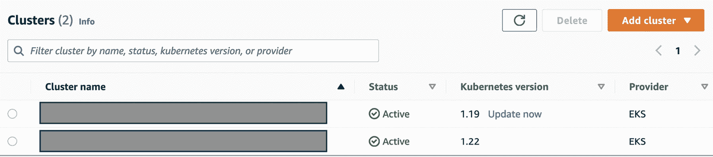
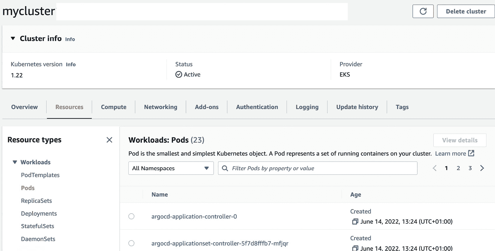
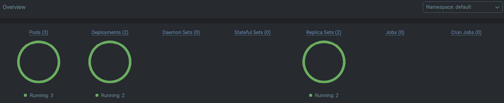
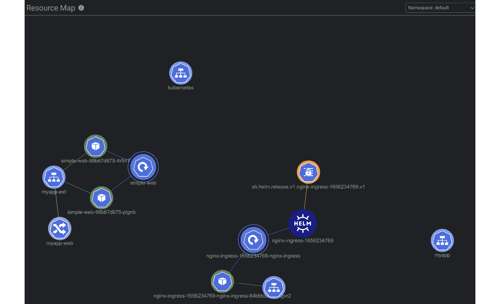

# 第四章：在 EKS 上运行你的第一个应用程序

在前面的章节中，我们讨论了如何配置和构建基本集群。在本章中，我们将探讨如何在该集群上部署我们的第一个应用程序。

Kubernetes 的流行程度部分源于其灵活的构建和部署服务及应用程序的方式，以及如何利用 Kubernetes 的关键功能从故障中恢复并扩展应用程序的能力。在 2021 年的 CNCF 年度调查中，96% 的受访者表示他们正在使用或评估 Kubernetes。

在本章中，我们将介绍在 EKS 上部署简单应用程序的不同方式，以及可视化工作负载的工具。具体来说，我们将涵盖以下内容：

+   了解应用程序的不同配置选项

+   创建你的第一个 EKS 应用程序

+   使用 AWS 管理控制台和第三方工具（例如 Lens）可视化你的工作负载

你应该熟悉 YAML、基础网络知识以及 EKS 架构。让我们首先确定在部署第一个应用程序之前需要完成的准备工作。

# 技术要求

在开始本章之前，请确保完成以下内容：

+   你拥有一个 EKS 集群并且能够执行管理任务

+   你有至少两个工作节点连接到集群

+   你与 EKS API 端点之间有网络连接

+   已在工作站上安装 AWS CLI 和 `kubectl` 二进制文件

# 了解应用程序的不同配置选项

Kubernetes 上的应用程序由一个或多个容器组成，分布在工作节点上，并通过不同的方法暴露到集群外部。以下表格定义了将配置的内容，并提供了指向其他章节的地图，展示了额外的配置步骤：

| **应用程序** **配置领域** | **描述** |
| --- | --- |
| **单个 Pod** | 在此示例中，可以从支持的仓库镜像中拉取单个 Pod，并部署到特定的命名空间。 |
| **弹性部署** | 在此示例中，将使用 Kubernetes 部署在不同的工作节点上部署多个 Pods，调度器将保持所需的数量。 |
| **更新** **你的部署** | 在此示例中，部署容器镜像被更新，新的镜像将遍布整个部署。 |
| **外部服务** | 在此示例中，部署将作为简单的节点端口服务进行暴露。 |
| **入口控制器** | 在此示例中，部署将使用 NGINX 入口控制器进行暴露，从而提供更高的访问控制。 |
| **多容器 Pod** | 通常使用 sidecar 进行健康检查或服务网格。这将在*第十六章*中详细讨论。 |
| **负载均衡器** | 这将在*第十四章*中详细讨论。 |
| **自动扩展 Pods** | 这将在*第十八章*中讨论。 |
| **Pods 的存储** | 这在 *第十二章* 中讨论。 |

表 4.1 – 应用配置区域

现在让我们看看将第一个应用部署到 EKS 所需的内容。

# 引入 kubectl 配置

**kubectl** 是一个 Kubernetes 命令行管理工具，允许用户与 Kubernetes API 服务器进行交互，并执行任何管理任务，包括部署、更新或删除应用（前提是他们有权限执行这些操作）。

为了与集群通信，集群的详细信息，如 API 端点 DNS 名称和服务器证书，都需要添加到`kubeconfig`文件中。可以使用以下命令（你需要安装 AWS CLI）来更新配置文件，该文件通常存储在`$HOME/.kube`中的`config`文件中：

```
$ aws eks update-kubeconfig --name mycluster  --region eu-central-1
```

重要提示

用于运行 CLI 命令的 AWS 用户需要具备 IAM 权限，才能成功执行此操作并访问 AWS EKS API。

该文件现在将在`cluster`部分包含一个新集群的引用，带有证书数据、API 端点（*服务器*）和名称。示例如下：

```
clusters:
- cluster:
    certificate-authority-data: xxxxxx
    server: https://hfjhf.gr7.eu-central-1.eks.amazonaws.com
    name: arn:aws:eks:eu-central-1:334:cluster/mycluster
```

它还会包含一个`user`部分。默认情况下，EKS 会使用 IAM 身份，因此没有实际的用户数据。相反，CLI 命令`aws eks get-token`（带有支持参数）用于获取身份令牌，该令牌用于 EKS 将 IAM 用户映射到 Kubernetes 身份（更多信息请参见 *第六章*）。在配置文件中看到的配置示例如下：

```
users:
- name: arn:aws:eks:eu-central-1:334:cluster/mycluster
  user:
    exec:
      apiVersion: client.authentication.k8s.io/v1beta1
      args:
      - --region
      - eu-central-1
      - eks
      - get-token
      - --cluster-name
      - education-eks-D20eNmiw
      command: aws
      env: null
      provideClusterInfo: false
```

最后，还会创建一个 Kubernetes `context`，它将`cluster`和`user`配置连接在一起。下面展示了一个示例：

```
contexts:
- context:
    cluster: arn:aws:eks:eu-central-1:334:cluster/mycluster
    user: arn:aws:eks:eu-central-1:334:cluster/mycluster
    name: arn:aws:eks:eu-central-1:334:cluster/mycluster
```

上下文允许在配置文件中配置多个集群和身份，并允许用户在它们之间切换。切换上下文可以通过使用`kubectl config --kubeconfig=<CONFIGDIR> use-context <CONTEXT>`命令或使用开源工具，如 [`github.com/ahmetb/kubectx`](https://github.com/ahmetb/kubectx)。

现在我们已经设置了与集群通信所需的基本配置。在下一节中，我们将使用`kubectl`进行一些基本的集群连接性验证，并部署我们的第一个 Pod。

## 使用 kubectl 验证连接性

验证是否与集群连接的最简单方法是使用`kubectl version`命令。你应该看到类似下面的输出：

```
$ kubectl version
Client Version: version.Info{Major:"1", Minor:"22+", GitVersion:"v1.22.6-eks-7d68063", GitCommit:"f24e667e49fb137336f7b064dba897beed639bad", GitTreeState:"clean", BuildDate:"2022-02-23T19:32:14Z", GoVersion:"go1.16.12", Compiler:"gc", Platform:"linux/amd64"}
Server Version: version.Info{Major:"1", Minor:"20+", GitVersion:"v1.20.15-eks-18ef993", GitCommit:"77b5697130c2dea4087e1009638e21cc93f5c5b6", GitTreeState:"clean", BuildDate:"2022-07-06T18:04:29Z", GoVersion:"go1.15.15", Compiler:"gc", Platform:"linux/amd64"}
```

以下表格列出了你在运行此命令时可能遇到的一些错误及其解决方法：

| **错误输出** | **描述** |
| --- | --- |
| **无法连接到服务器：获取凭证时失败：exec：可执行的 aws 失败，退出** **代码 253** | 在这种情况下，`kubectl`无法获取 AWS IAM 凭证以从 EKS API 请求令牌；请更新或添加 AWS 凭证到工作站。 |
| **无法连接到服务器：拨号 tcp 10.1.3.51:443：** **i/o 超时** | 在这种情况下，IP 地址是一个私有地址，`kubectl` 客户端无法访问它。此错误通常表示网络问题，例如 IP 路由问题或与客户端 IP 相关的防火墙/IP 白名单问题。 |
| **错误：必须登录到服务器（服务器要求客户端提供凭证）** | 在这种情况下，`kubectl` 有凭证并可以连接到服务器端点，但凭证没有权限获取版本信息。这是一个 RBAC 问题，通常意味着正在使用的 IAM 用户没有正确的 Kubernetes 权限。 |

表 4.2 – 常见的 kubectl 连接错误示例

kubectl 备忘单

`kubectl` 备忘单包含非常有用的内容，可以帮助你快速学习使用哪个 `kubectl` 命令。你可以在官方 Kubernetes 文档中学习常用的 `kubectl` 命令和标志：[`kubernetes.io/docs/reference/kubectl/cheatsheet/`](https://kubernetes.io/docs/reference/kubectl/cheatsheet/)。

现在我们已经验证了从 kubectl 到集群的连接，我们开始部署我们的第一个应用。

# 创建你的第一个 EKS 应用

Kubernetes 中的最低抽象层是 Pod，它表示一个或多个共享同一命名空间的容器。你可以选择在 Pod 中添加额外的容器，以提供额外的功能，例如服务网格或缓存。因此，虽然许多 Pod 仅包含一个容器，但你并不限于一个容器。

在接下来的章节中，我们将部署一个 Pod，然后在此基础上使用更高级的 Kubernetes 对象。作为开发者或 DevOps 工程师，你将花费大量时间构建和部署应用，因此理解你需要做的事情非常重要。

## 使用 kubectl 命令在 Amazon EKS 上部署你的第一个 Pod

你可以使用 `kubectl run` 命令快速部署并将 CLI 会话附加到 Pod，命令如下：

```
$ kubectl run -it busybox --image=busybox --restart=Never
```

当你执行此命令时，会发生一些事情，但在我们回顾之前，让我们先看看通过 `kubectl run busybox --image=busybox --restart=Never` **--dry-run=client -o yaml** 命令创建的清单，它显示了正在创建的 API 对象/类型，*但*不会将其发送到 Kubernetes API。命令的输出如下：

```
apiVersion: v1
kind: Pod
metadata:
  creationTimestamp: null
  labels:
    run: busybox
  name: busybox
spec:
  containers:
  - image: busybox
    name: busybox
    resources: {}
  dnsPolicy: ClusterFirst
  restartPolicy: Never
status: {}
```

如我们所见，清单定义了一个 `Pod` 规格，包含 `name`、`busybox` 镜像（将从公共仓库中拉取）和 `restartPolicy`，这意味着一旦完成，调度器不会尝试重新启动它。

部署过程如下：

1.  `kubectl run` 命令将创建 Pod 的清单并将其提交到 Kubernetes API。

1.  API 服务器将持久化 Pod 规格。

1.  调度器将接收新的 Pod 规格，审查它，并通过筛选和评分的过程，选择一个工作节点将资源部署到该节点，并将 Pod 规格标记给这个节点。

1.  在节点上，kubelet 代理监控集群数据存储（etcd），如果发现有新的 Pod 规格，代理将使用该规格在节点上创建 Pod。

1.  一旦 Pod 启动，你的 kubectl 会话将连接到 Pod（正如我们使用`-it`标志所指定的）。你将能够使用 Linux 命令与 Pod 进行交互。你可以通过输入`exit`离开会话。

一旦你退出会话，你可以如下验证 Pod 的状态：

```
$ kubectl get pods
NAME      READY   STATUS      RESTARTS   AGE
busybox   0/1     Completed   0          20s
```

重要提示

Pod 的状态为`Completed`，因为我们指定了`restartPolicy: Never`，所以一旦交互会话结束，容器将不再可访问。你可以使用`$ kubectl delete pod` `busybox`命令删除 Pod。

在下一节中，我们将看到如何将 Pod 的概念扩展到 Deployment。

## 使用 Kubernetes Deployment 部署一个 Pod

Deployment 在 Pod 之上增加了另一层抽象；它允许你部署 Pod 规格，并支持对这些 Pods 进行扩展以及更新 Pod 镜像。相比基本的 Pod 规格，Deployment 可以更高效地管理应用程序的生命周期。以下 Deployment 清单将用于部署两个运行版本 1.34.1 的 BusyBox 的 Pods。我们还包括一个简单的命令`execute sleep 3600`，它会让容器*保持活动*状态 3,600 秒：

**chapter4-deployment.yaml**

```
---
apiVersion: apps/v1
kind: Deployment
metadata:
  name: simple-deployment
spec:
  replicas: 2
  selector:
    matchLabels:
      app: simple-deployment-app
  template:
    metadata:
      labels:
        app: simple-deployment-app
    spec:
      containers:
        - name: busybox
          image: busybox:1.34.1
          command:
            - sleep
            - "3600"
```

你可以使用`$ kubectl create -f chapter4-deployment.yaml`命令来创建 Deployment。你还会看到响应中出现`deployment.apps/busybox-deployment created`消息。

你可以使用`$ kubectl get deployment simple-deployment`命令验证 Deployment；以下是一个示例输出：

```
NAME                READY   UP-TO-DATE   AVAILABLE   AGE
simple-deployment   2/2     2            2           106m
```

Deployment 是一个复合类型，它包含 Deployment 本身、Pods 和一个*ReplicaSet*，该 ReplicaSet 用于保持每个 Deployment 中两个 Pods 的期望状态。你可以使用`kubectl get all`命令来获取当前命名空间中的所有资源。以下是一个示例输出：

```
$ kukectl get all
…………
NAME                         READY   STATUS    RESTARTS   AGE
pod/simple-deployment-123-5mbpb   1/1     Running   1          108m
pod/simple-deployment-432-74kxf   1/1     Running   1          108m
NAME                     READY   UP-TO-DATE   AVAILABLE   AGE
deployment.apps/simple-deployment   2/2     2     2      108m
NAME                        DESIRED   CURRENT   READY   AGE
replicaset.apps/simple-deployment-6995f6966   2  2 2  108m
```

Deployment 提供了一种便捷的方式来进行变更。让我们看看如何修改这个 Deployment。

## 修改你的 Deployment

现在我们有了一个 Deployment，我们可以使用`kubectl scale deployment simple-deployment --replicas=3`命令来扩展它，这将把期望的 Pod 数量增加到三，从而添加另一个 Pod。

我们还可以使用`kubectl set image deployment simple-deployment busybox=busybox:1.35.0`命令更新 Deployment 镜像，这将触发滚动更新（默认机制）。

你可以使用`kubectl rollout` `status`命令验证部署状态：

```
$ kubectl rollout status deployment/simple-deployment
deployment "simple-deployment" successfully rolled out
```

你会看到，Pods 都被新版本替换，你可以使用 `$ kubectl exec --stdin --tty <POD ID> -- /bin/sh` 命令进入 Pod shell (`/bin/sh`)，然后在 Pod shell 中运行 `busybox |head -``1` 命令。

接下来，让我们看看如何让这个部署对集群外部的用户可见。

## 暴露你的 Deployment

虽然我们已经通过 Deployment 部署了 Pods，但为了让其他 Pods/Deployments 能与这些 Pods 通信，它们必须使用 Pods 的 IP 地址。一种更好的方法是通过使用服务来暴露这些 Pods，这意味着其他集群 Pods 或外部系统可以使用该服务，Kubernetes 会对所有可用 Pods 进行负载均衡。接下来是一个服务的示例：

**chapter4-basic-service.yaml**

```
---
apiVersion: v1
kind: Service
metadata:
   name: myapp 
spec:
   type: ClusterIP
   ports:
     - protocol: TCP
       port: 80
       targetPort: 9376
   selector:
     app: simple-deployment-app
```

我们创建的服务是一个 `ClusterIP` 服务，这意味着它只能从集群内部访问。它会暴露 `80` 端口，并将其映射到任何具有 `app=simple-deployment-app` 标签的 Pod 的 `9376` 端口（即我们通过 Deployment 创建的 Pods）。

我们可以使用 `kubectl get` `service` 命令来验证服务：

```
$ kubectl get svc -o wide
NAME  TYPE  CLUSTER-IP EXTERNAL-IP   PORT(S)   AGE   SELECTOR
myapp  ClusterIP   172.20.124.66   <none>   80/TCP    16m   app=simple-deployment-app
```

如果我们通过 `kubectl describe service myapp` 命令更深入地查看服务，可以看到 `Endpoints` 配置项，其中包含了具有 `app=simple-deployment-app` 标签的 Pods 的 IP 地址。我们可以通过 `kubectl get po -o wide` 命令验证这一点，示例如下：

```
$ kubectl describe service myapp
Name:              myapp
Namespace:         default
……………………
Selector:          app=simple-deployment-app
Type:              ClusterIP
IP Family Policy:  SingleStack
IP Families:       IPv4
IP:                172.20.124.66
…………………..
Endpoints:  10.1.3.27:9376,10.1.30.176:9376,10.1.30.38:9376
Session Affinity:  None
Events:            <none>
$ k get po -o wide
NAME  READY   STATUS    RESTARTS   AGE   IP  NODE  NOMINATED NODE   READINESS GATES
simple-deployment-111-5gq92   1/1     Running   0   52m   10.1.30.38 ip-3.eu-central-1.compute.internal   <none>     <none>
simple-deployment-222-8chg8   1/1     Running   0          52m   10.1.30.176 ip-1.eu-central-1.compute.internal   <none>           <none>
simple-deployment-333-wpdwl   1/1     Running   0          52m   10.1.3.27 ip-2.eu-central-1.compute.internal    <none>           <none>
```

该服务在集群中可以通过集群 DNS 可见，因此 `myapp.default.svc.cluster.local` 将解析为 `172.20.124.66`，这是分配给 `clusterIP` 的 IP 地址。为了将服务暴露到集群外部，我们需要使用不同的服务、Ingress 或 Ingress 控制器，或负载均衡器。我们接下来会讨论这些。

### 使用 NodePort 服务

`NodePort` 服务暴露一个静态端口，默认在集群中每个工作节点上使用 `30000-32768` 之间的端口，然后将流量映射回 `80` 端口（在接下来的配置中，只定义了一个端口，因此目标端口和服务的端口值相同）映射到匹配选择器的任何 Pod 上。

**chapter4-basic-nodeport-service.yaml**

```
---
apiVersion: v1
kind: Service
metadata:
   name: myapp-ext
spec:
   type: NodePort
   ports:
     - protocol: TCP
       port: 80
   selector:
     app: simple-nginx-app
```

我们创建的服务是一个 `NodePort` 服务，它选择了具有 `app=simple-nginx-app` 标签的 Pod，这是另一个 NGINX Pods 的 Deployment。我们可以使用 `kubectl get` `service` 命令看到 `NodePort` 已经成功创建：

```
$ kubectl get service
NAME  TYPE  CLUSTER-IP       EXTERNAL-IP   PORT(S)        AGE
myapp-ext NodePort 172.20.225.210 <none>  80:30496/TCP   12m
```

如果你使用 **curl** 浏览服务端点，你将看到 NGINX 标准页面（前提是所有工作节点的安全组已经配置为允许流量）。

### 使用 Ingress

Ingress 在服务之上构建，提供了暴露 HTTP/HTTPS 路由（例如 `/login` 或 `/order`）到集群外部的机制。Ingress 独立于底层服务，因此典型的用例是使用单个 Ingress 为多个（微）服务提供一个中央入口点。要使用 Ingress，您需要一个 Ingress 控制器；这个控制器 Kubernetes 并不自带，因此必须安装。我们将使用 NGINX Ingress 控制器。

要安装没有云/AWS 扩展的 NGINX Ingress 控制器，您可以使用以下命令来部署裸金属控制器：

```
$ kubectl apply -f https://raw.githubusercontent.com/kubernetes/ingress-nginx/controller-v1.2.0/deploy/static/provider/baremetal/deploy.yaml
```

我们可以通过以下命令验证新的 Ingress 控制器：

```
$ kubectl get service ingress-nginx-controller --namespace=ingress-nginx
NAME  TYPE   CLUSTER-IP     EXTERNAL-IP    PORT(S)   AGE
ingress-nginx-controller   NodePort   172.20.150.207   <none>        80:31371/TCP,443:31159/TCP   5m27s
```

我们可以看到 Ingress 控制器作为 `NodePort` 服务暴露，监听 `31371` 端口用于 HTTP 连接，监听 `31159` 端口用于 HTTPS 连接。通常情况下，我们会将负载均衡器放在该 `NodePort` 服务之前（我们将在下一个示例中探讨这个问题），但暂时我们只使用简单的 `NodePort` 服务。

我们可以使用之前的服务，并通过以下清单简单地在服务上暴露一个 URL，命令为 `$ kubectl create -f` `chapter4-@ingress.yaml`：

**chapter4-ingress.yaml**

```
---
apiVersion: networking.k8s.io/v1
kind: Ingress
metadata:
  name: myapp-web
  annotations:
      kubernetes.io/ingress.class: nginx
      nginx.ingress.kubernetes.io/rewrite-target: /
spec:
  rules:
   - host: "myweb.packt.com"
     http:
      paths:
      - pathType: Prefix
        path: "/login"
        backend:
          service:
            name: myapp-ext
            port:
              number: 80
```

我们创建的 Ingress 使用 `annotations` 来配置我们之前创建的 Ingress 控制器，并在 `spec` 部分定义路径规则。该规则指出，当请求到达 `myweb.packt.com/login` 时，需将其发送到 `myapp-ext` 服务的 `80` 端口，并将 `/login` 重写为 `/`。

我们可以通过以下命令进行测试，应该会返回 NGINX 欢迎页面：

```
curl -H 'Host: myweb.packt.com' http://<WORKERNODEIP>:31371/login
```

### 使用 AWS 负载均衡器

由于我们有一个暴露为 `NodePort` 的 Ingress 控制器和底层服务，我们可以简单地创建一个负载均衡器，并为工作节点和 Ingress 控制器的 `NodePort` 端口创建目标组。然而，我们希望将 Ingress 控制器与 `loadbalancer` 集成，以便在 Ingress 控制器扩展和变化时，`loadbalancer` 配置也会相应变化。

重要提示

确保您已经删除了前一节中的 Ingress（`$ kubectl delete -f chapter4-ingress.yaml`）和 Ingress 控制器（`$ kubectl delete -f https://raw.githubusercontent.com/kubernetes/ingress-nginx/controller-v1.2.0/deploy/static/provider/baremetal/deploy.yaml`）。

我们现在将使用以下命令重新部署与 AWS 负载均衡器集成的 NGINX Ingress 控制器：

```
$ kubectl apply -f https://raw.githubusercontent.com/kubernetes/ingress-nginx/controller-v1.2.0/deploy/static/provider/aws/deploy.yaml
```

部署控制器后，我们可以通过以下命令查看 Ingress 控制器。从输出中，我们可以看到将创建一个 AWS **网络负载均衡器**（**NLB**）以及为运行在 EKS 中的 Ingress 控制器创建的目标组：

```
$ kubectl describe service ingress-nginx-controller --namespace=ingress-nginx
Name:                     ingress-nginx-controller
Namespace:                ingress-nginx
……….
Annotations:
service.beta.kubernetes.io/aws-load-balancer-backend-protocol: tcp
service.beta.kubernetes.io/aws-load-balancer-cross-zone-load-balancing-enabled: true
service.beta.kubernetes.io/aws-load-balancer-type: nlb
………
LoadBalancer Ingress: 111-22.elb.eu-central-1.amazonaws.com
Port:                     http  80/TCP
TargetPort:               http/TCP
NodePort:                 http  32163/TCP
Endpoints:                10.1.30.38:80
Port:                     https  443/TCP
TargetPort:               https/TCP
NodePort:                 https  31484/TCP
Endpoints:                10.1.30.38:443
Session Affinity:         None
External Traffic Policy:  Local
HealthCheck NodePort:     31086
…………
```

我们可以看到通过下面展示的 AWS CLI 命令创建的负载均衡器：

```
$ aws elbv2 describe-load-balancers
{"LoadBalancers": [{
  IpAddressType": "ipv4",
  "VpcId": "vpc-56567",
 "LoadBalancerArn": "arn:aws:elasticloadbalancing:eu-central-1:11223:loadbalancer/net/111/22",
            "State": {"Code": "active"},
            "DNSName": "111-22.elb.eu-central-1.amazonaws.com",
            "LoadBalancerName": "111-22",
            "CreatedTime": "2022-06-19T07:31:52.901Z",
            "Scheme": "internet-facing",
            "Type": "network",
            "CanonicalHostedZoneId": "Z3F0SRJ5LGBH90",
………
}]}
```

这是一个公共负载均衡器（`internet-facing`），因此服务现在可以通过 Ingress 控制器从互联网上访问。你可以使用负载均衡器的 `DNSName` 来访问链接。现在我们可以重新部署 Ingress 清单（没有任何更改，因为我们刚刚在 Ingress 控制器上方添加了一个 NLB），使用 `$ kubectl create -f chapter4-ingress.yaml` 命令以通过 NLB 启用对我们服务的访问。

你现在可以通过在任何可以访问互联网的工作站上使用以下命令来测试对服务的访问。该命令将显示 NGINX 欢迎屏幕：

```
$ curl -H 'Host: myweb.packt.com' http://111-22.elb.eu-central-1.amazonaws.com/login
```

重要说明

确保你已经移除了 Ingress（`$ kubectl delete -f chapter4-ingress.yaml`）和 Ingress 控制器（`$ kubectl delete -f` [`raw.githubusercontent.com/kubernetes/ingress-nginx/controller-v1.2.0/deploy/static/provider/aws/deploy.yaml`](https://raw.githubusercontent.com/kubernetes/ingress-nginx/controller-v1.2.0/deploy/static/provider/aws/deploy.yaml)）。

在这一节中，我们已经了解了不同的方法来部署 Pods，并通过服务、Ingress 和负载均衡器将其暴露。到目前为止，所有示例都是通过命令行操作的。在下一节中，我们将探讨如何使用 AWS 控制台和第三方工具来可视化你的工作负载和应用程序。

# 可视化你的工作负载

在本书的整个过程中以及在现实中，你主要会通过命令行或 CI/CD 管道与 EKS 进行交互。然而，有时能够以可视化的形式查看你在集群上运行的内容也是很有用的。Kubernetes 提供了一个网页仪表板，但在 EKS 中，你可以通过主要的 EKS 控制台和 CloudWatch（在 *第十九章*，*在 EKS 上开发* 中讨论）看到大部分集群配置，这样就无需部署一个单独的仪表板了。要访问控制台，登录 [`aws.amazon.com`](http://aws.amazon.com)，并使用具有查看集群权限的凭证登录（请参见 *第三章*，*构建你的第一个 EKS 集群*）。然后，你可以选择 Amazon **弹性 Kubernetes 服务** | **集群**，这时会显示一个你所在区域中运行的集群列表（现在你也可以添加本地集群）。从主视图中，你可以查看集群、其版本，以及是否需要更新（在 *第十章*，*升级* *EKS 集群* 中讨论）。



图 4.1 – 主集群面板

你可以通过点击集群名称的超链接来选择集群，这样会带你进入一个更详细的视图，在那里你可以执行以下操作：

+   通过单击即可升级集群控制平面

+   删除集群（你可能需要先删除节点组）

+   查看并修改集群配置



图 4.2 – mycluster 详细面板

上面的图显示了 **mycluster** | **资源** 窗口，可以用于获取当前正在运行的 Pods、Deployments 和 Services 列表，但请记住，你在控制台中使用的 IAM 用户/角色必须至少具有集群（RBAC）权限，以读取/获取资源。你还可以在这里创建节点组，并管理配置项，如 **公共端点** IP 白名单和附加组件。

通常，最好通过基础设施即代码或通过 CI/CD 流水线进行更改，但你也可以通过控制台管理集群。还有许多其他工具可以从工作站运行，它们在你试图排查问题时非常有用。我经常使用[`k8slens.dev/`](https://k8slens.dev/)，但也有其他选项！

所有这些工具都需要一个网络路由/路径连接到 EKS API 端点（无论是公共的还是私有的），并且需要具有管理 EKS 集群权限的 AWS IAM 凭证（如果你想进行更改，需要拥有 `system:masters` 权限）。

在你的 `.kube/config` 文件中，你需要对 `users` 部分进行更改，加入 `AWS_PROFILE` 环境变量，以指向具有访问集群权限的 AWS 凭证配置文件。下面是一个示例：

```
users:
- name: arn:aws:eks:eu-central-1:11222:cluster/mycluster
………………
      env:
      - name: AWS_PROFILE
        value: eksprofile
```

配置好工作站后，你需要安装并启动 Lens。如果你使用的是临时凭证，那么在 macOS 上从命令行启动 Lens 可能会更方便。我推荐使用 `$ open -a lens` 命令，启动后，你将拥有一个工作站环境，便于从工作站可视化集群。下一个截图展示了 Lens 提供的集群视图：



图 4.3 – Lens 集群视图

我非常喜欢 Lens 的一项功能，就是可以添加扩展。例如，如果你安装了 Lauri Nevala 提供的资源地图扩展（[`github.com/nevalla/lens-resource-map-extension`](https://github.com/nevalla/lens-resource-map-extension)），你可以可视化集群的资源及其相互关联的方式。要查看完整的扩展列表，请访问 [`github.com/lensapp/lens-extensions/blob/main/README.md`](https://github.com/lensapp/lens-extensions/blob/main/README.md)。

以下截图显示了资源地图的示例：



图 4.4 – 示例资源地图

现在，你已经熟悉了如何使用 AWS 控制台和 Lens 等第三方工具来可视化集群中的工作负载。

总的来说，我们已经查看了如何验证与集群的连接，如何部署并可视化集群中的 Pods。现在，让我们回顾一下本章的关键学习点。

# 总结

在本章中，我们检查了不同的应用程序部署方式，从创建一个简单的 Pod 开始，并在此基础上构建部署、服务、Ingress，最后部署 AWS NLB 和 NGINX Ingress 控制器，将服务暴露到互联网。我们讨论了如何通过 Deployment 和 Service 提供更强的弹性和抽象，以及如何使用服务、Ingress 和负载均衡器以安全/弹性的方式将服务暴露到集群/VPC 外部。

在本章中，我们使用 Kubernetes YAML 清单来说明如何通过 kubectl 构建和部署这些对象。现在，你可以使用基本的 YAML 清单和 kubectl 在 EKS 中部署应用程序。在下一章中，我们将探讨如何使用 Helm 来创建灵活的清单，这些清单可以在部署时进行参数化，以支持不同的需求和/或环境。

# 进一步阅读

+   理解 Deployments：

[`kubernetes.io/docs/concepts/workloads/controllers/deployment/`](https://kubernetes.io/docs/concepts/workloads/controllers/deployment/)

+   理解服务：

[`kubernetes.io/docs/concepts/services-networking/service/`](https://kubernetes.io/docs/concepts/services-networking/service/)

+   使用 NGINX Ingress 控制器和 AWS NLB：

[`aws.amazon.com/blogs/opensource/network-load-balancer-nginx-ingress-controller-eks/`](https://aws.amazon.com/blogs/opensource/network-load-balancer-nginx-ingress-controller-eks/)

+   NGINX Ingress 控制器：

[`kubernetes.github.io/ingress-nginx/examples/`](https://kubernetes.github.io/ingress-nginx/examples/)

+   Kubernetes Lens：

[`k8slens.dev/`](https://k8slens.dev/)

+   部署和使用 Kubernetes Dashboard：

[`kubernetes.io/docs/tasks/access-application-cluster/web-ui-dashboard/`](https://kubernetes.io/docs/tasks/access-application-cluster/web-ui-dashboard/)
