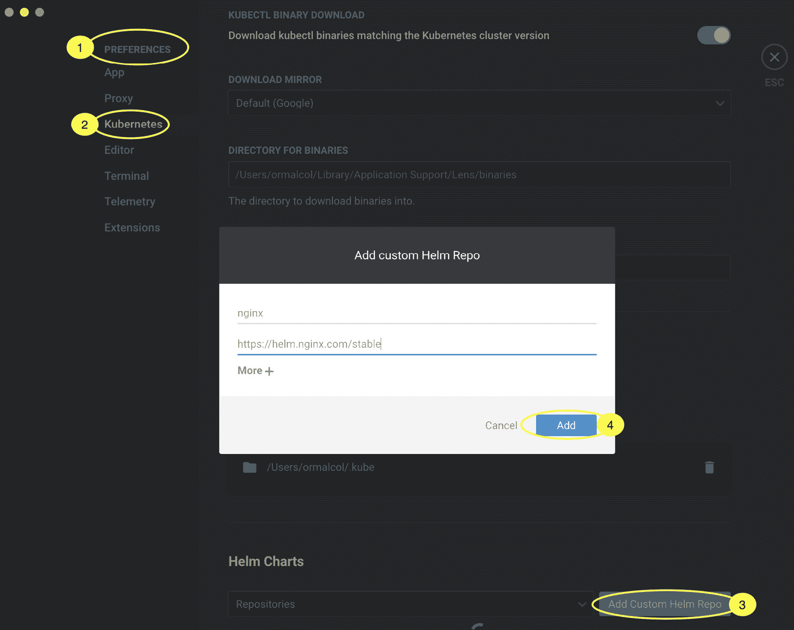
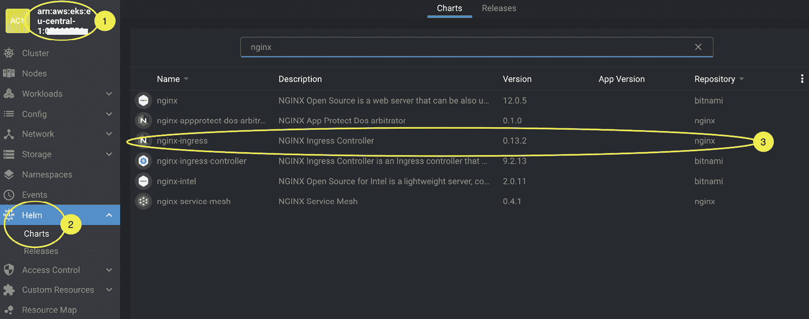
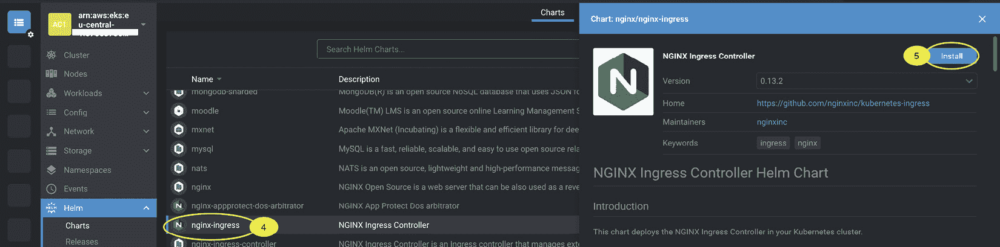
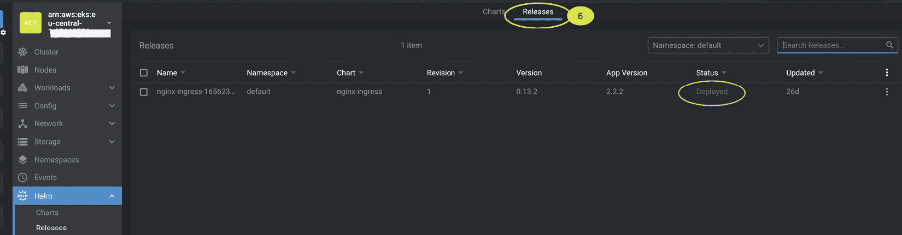

# 5

# 使用 Helm 管理 Kubernetes 应用程序

在上一章中，我们描述了如何使用 kubectl 和标准 Kubernetes 清单部署简单应用程序。使用这种方法的挑战在于，清单文件是固定的。如果您想在不同环境（开发、测试、生产等）中更改 Web 服务器的标签，您需要有多个清单文件，或者每次部署时都需要修改清单内容。

在本章中，我们将介绍 **Helm**，这是一款可以用于定义、安装和升级复杂应用程序的工具，能够轻松地为不同环境自定义部署。具体来说，我们将覆盖以下主题：

+   理解 Helm 及其架构

+   安装 Helm 二进制文件

+   使用 Helm 部署示例 Kubernetes 应用程序

+   创建、部署、更新和回滚 Helm 图表

+   通过 Helm 删除应用程序

+   使用 Lens 部署 Helm 图表

重要说明

Helm 是 Kubernetes 上的一个抽象工具，因此在 EKS 或其他 Kubernetes 发行版或部署中使用 Helm 没有区别。本章将重点介绍 Helm 的基本功能。更多高级操作/配置可以在 *进一步* *阅读* 部分找到链接。

# 技术要求

在开始本章之前，请确保以下事项已完成：

+   您有一个正常工作的 EKS 集群，并能够执行管理任务

+   您的工作站上已安装并正确配置了 kubectl

+   您已连接到 EKS API 端点

+   您熟悉 YAML、基础网络和 EKS 架构

# 理解 Helm 及其架构

正如我们在前几章中看到的，Kubernetes 的 YAML 模板适用于简单的应用程序。然而，当您面对多组件的复杂应用程序时，这些组件之间有多个依赖关系，并且需要频繁地使用如蓝绿部署等技术来部署和更新这些组件时，您需要更多的东西；您需要一个包管理工具。

包管理不是一个新概念；您可以在 Linux 上的 APT/YUM、Mac 上的 Homebrew 或 Windows 上的 Chocolatey 等软件中看到类似的概念和关键的软件包管理工具。同样，Helm 可以被视为 Kubernetes 的包管理工具。

Helm 由以下组件组成：

+   **图表**：一包预配置的 Kubernetes 资源

+   **发布**：使用 Helm 部署到集群中的图表的特定实例

+   **仓库**：一组已发布的图表，可以提供给其他人使用

+   **Helm 二进制文件**：用于部署图表/发布的工具

在接下来的几节中，我们将更详细地探讨这些组件。

## Helm 的优点

使用 Helm 的主要好处是简化 Kubernetes 资源的创建和部署方式。Helm 允许开发者采用 **不要重复自己**（**DRY**）的方法，允许设置默认属性，但仍然允许根据不同的用例或环境进行修改（覆盖）。

开发者还可以通过 *Helm Chart 仓库* 轻松分享模板。例如，如果你想在开发环境中安装 Prometheus（一个在 Kubernetes 上的开源监控系统），你可以手动创建清单，指定标准镜像，设置任何支持资源——如 ingress、deployment 和 service——配置任何环境变量，并为生产环境重复此过程。

你可以通过以下命令简单地添加 Prometheus 的 Helm Chart 仓库，然后进行部署，避免了所有这些复杂的工作：

```
$ helm repo add prometheus-community https://prometheus-community.github.io/helm-charts
$ helm install stable/prometheus
```

Helm 也有一些替代方案，譬如 Kustomize（[`kustomize.io/`](https://kustomize.io/)），它在 YAML 层上构建，并为你的应用程序创建一个自定义操作符来管理其生命周期；例如，Kafka 操作符。然而，Helm 仍然是定制和部署应用程序的最简单方法。

## 了解 Helm charts

Helm 的基本配置项是 chart。一个包含 Kubernetes 应用程序的模板，可以通过 `$ helm create <mychartname>` 命令创建该结构：

```
mychartname/
|
|- .helmignore
|
|- Chart.yaml
|
|- values.yaml
|
|- charts/
|
|- templates/
```

让我们来看一下 chart 的每个组件：

+   `.helmignore` 文件类似于 `.gitignore` 文件，用于指定 Helm 命令应忽略的文件或目录。

+   `Chart.yaml` 文件包含有关你正在打包的 chart 的元数据，例如你自己的 chart 版本。

+   `values.yaml` 文件存储用于部署的任何值。你通常会看到一个文件，默认值，但也可以使用多个值文件来适应不同的环境。

+   `charts` 目录用于存储你的 chart 可能依赖的其他 charts。

+   `templates` 目录包含你为支持应用程序部署所创建的实际清单。它可能包含多个 YAML 文件，用于部署 pod、配置映射、秘密等。

值通过 `{{ define }}` 指令转入 chart 中，这意味着模板比标准的 Kubernetes 清单更灵活。以下是一个 Helm 清单的示例，展示了资源（在这个例子中是 ConfigMap）如何被修改：

```
apiVersion: v1
kind: ConfigMap
metadata:
  name: {{ .Release.Name }}-configmap
data:
  myvalue: "Hello World"
```

在这个例子中，ConfigMap 的名称将是 `Release.Name` 和 `-configmap` 字符串的组合。例如，如果你的 chart 名称是 *CM1*，那么生成的 ConfigMap 将被命名为 `CM1-configmap`。

现在我们已经讨论了基本配置，让我们来看看如何实际安装和使用 Helm。

# 安装 Helm 二进制文件

Helm 可以轻松安装，并且能够与许多不同的操作系统兼容。你可以参考以下说明在系统中设置 Helm：

[`helm.sh/docs/intro/install/`](https://helm.sh/docs/intro/install/)

您必须配置 kubectl 以便与 Amazon EKS 一起使用。如果您还没有这样做，请参考*第三章*，*构建您的第一个 EKS 集群*，以帮助您正确配置 kubectl。

在 Linux 上，您可以使用以下命令下载并安装 Helm 二进制文件：

```
$ curl -L https://git.io/get_helm.sh | bash -s -- --version v3.8.2
```

在编写本书时，Helm 3.9.x 存在使用 AWS 身份验证插件的一些问题，因此使用 v3.8.2 版本。您需要确保`/usr/local/bin/`目录在您的`PATH`中。

# 使用 Helm 部署示例 Kubernetes 应用程序

在上一章中，我们使用以下命令部署了 NGINX 入口控制器：

```
$ kubectl create -f https://raw.githubusercontent.com/kubernetes/ingress-nginx/I
```

如果我们想使用 Helm 安装它，需要执行以下任务：

1.  将公共稳定仓库添加到您的 Helm 配置中：

    ```
    $ helm repo add nginx-stable https://helm.nginx.com/stable
    ```

1.  刷新仓库信息：

    ```
    $ helm repo update
    ```

1.  然后我们可以显示仓库中的图表：

    ```
    $ helm search repo nginx-stable
    ```

1.  其中一个图表是`nginx-ingress`，可以使用以下命令进行安装：

    ```
    $ helm install my-release nginx-stable/nginx-ingress
    ```

1.  图表发布可以使用以下任意命令查看：

    ```
    $ helm list
    $ helm history my-release
    ```

1.  您还可以使用以下命令查看 Kubernetes 资源：

    ```
    $ kubectl api-resources --verbs=list -o name | xargs -n 1 kubectl get --show-kind -l app.kubernetes.io/instance=my-release --ignore-not-found -o name
    ```

让我们看看如何从头开始创建一个新的 Helm 图表。

# 创建、部署、更新和回滚 Helm 图表

如您从前面的示例中看到的，使用 Helm 部署预打包的应用程序非常简单。部署您自己的应用程序也很容易。我们从以下命令开始，这将会在您当前的目录下创建一个名为`myhelmchart`的目录，并填充相关文件和模板：

```
$ helm create myhelmchart
```

默认情况下，由此命令创建的`values.yaml`文件包含对单个 NGINX Pod 的引用，并创建一个仅在集群内可访问的`ClusterIP`服务。默认文件中的关键值如下所示：

```
replicaCount: 1
image:
  repository: nginx
service:
  type: ClusterIP
```

我们可以使用以下命令轻松部署这个新的 Helm 图表：

```
$ helm install example ./myhelmchart --set service.type=NodePort
```

这将覆盖`values.yaml`文件中看到的`service.type`值，并设置为`NodePort`服务，因此它现在会暴露在集群外部。然后我们可以使用以下命令验证图表部署，并查看创建的`NodePort`服务的名称以及其他 Kubernetes 资源：

```
$ kubectl api-resources --verbs=list -o name | xargs -n 1 kubectl get --show-kind -l app.kubernetes.io/instance=example --ignore-not-found -o name
endpoints/example-myhelmchart
pod/example-myhelmchart-cb76665d4-sq4lk
serviceaccount/example-myhelmchart
service/example-myhelmchart
deployment.apps/example-myhelmchart
replicaset.apps/example-myhelmchart-cb76665d4
endpointslice.discovery.k8s.io/example-myhelmchart-8kw8t
```

如果您使用前一步中的服务名称运行以下命令，您将能够提取服务的 IP 地址和端口，并通过 curl 访问`NodePort`服务：

```
$ export NODE_PORT=$(kubectl get --namespace default -o jsonpath="{.spec.ports[0].nodePort}" services example-myhelmchart) | curl http://$NODE_IP:$NODE_PORT
```

要更新 Helm 部署，我们将执行以下步骤：

1.  修改`values.yaml`文件，并将`replicaCount:`增加到`2`。我们还可以将`service.type`的值更改为`NodePort`。

1.  修改`Chart.yaml`文件，并将`version`更新为`0.2.0`。

1.  验证更改：

    ```
    $ helm lint
    ```

1.  然后推出更改：

    ```
    $ helm upgrade example ./myhelmchart
    ```

1.  然后我们可以验证部署：

    ```
    $ helm history example
    ```

当您运行前面的命令时，您会注意到下一个显示的修订版本号：

```
$ helm history example
REVISION  UPDATED STATUS   CHART   APP VERSION     DESCRIPTION
1 Sat xx superseded  myhelmchart-0.1.0 1.16.0 Install complete
2 Sat xx deployed  myhelmchart-0.2.0  1.16.0 Upgrade complete
```

1.  我们还可以验证是否存在两个 Pod 用于该部署：

    ```
    kubectl get pod | grep example
    ```

你可以使用`helm rollback example 1`命令轻松回滚到先前的版本，其中`1`表示你想要回滚的版本。这是 Helm 相较于基础 Kubernetes 清单的主要优势之一，每次对清单的更改都可以被版本化并作为新的版本进行部署，如果发生问题，你可以轻松回滚到先前的版本/修订。

`helm list`命令可以显示集群中所有的版本，这些版本作为 Kubernetes Secrets 存储在发布部署的命名空间中。接下来，我们来看看如何移除我们的 Helm 应用程序。

# 通过 Helm 命令删除应用程序

Helm 提供了一个简单的`uninstall`命令来删除应用程序发布。第一步是使用`helm list`命令确定要删除的 Helm 部署：

```
$ helm list --all-namespaces
NAME  NAMESPACE REVISION  UPDATED     STATUS          CHART                    APP VERSION
cm1             default             1          2022- deployed        myhelmchart-0.1.0       1.16.0
example         default         4           2022- deployed        myhelmchart-0.2.0       1.16.0
my-release      default        1          2022- deployed        nginx-ingress-0.13.2    2.2.2
```

在这个示例中，我们要删除示例部署，因此我们可以简单地运行`$ helm uninstall example`命令，所有由 Chart 或 Charts 创建的资源将被删除。

重要提示

这也会删除所有的部署历史。请确保你已经使用`$ helm uninstall`命令删除了所有 Helm Chart。

在这一节中，我们回顾了使用 Helm 二进制文件来部署公共 Chart，以及创建、更新、回滚和删除自己的 Chart。在下一节中，我们将展示如何使用 Lens 来部署 Chart。

# 使用 Lens 部署 Helm Chart

在上一章中，我们讨论了如何使用 Lens 可视化 Kubernetes 资源。然而，你也可以使用 Lens 来管理 Helm Chart。请参考*第四章*，*在 EKS 上运行你的第一个应用程序*（*可视化你的工作负载*部分），获取关于 Lens 设置的指导。

默认情况下，Lens 会从公共 Artifact Hub（[`artifacthub.io/`](https://artifacthub.io/)）和 Bitnami 拉取可用的 Helm 仓库。由于我们将重新部署通过 Helm **命令行接口**（**CLI**）部署的 NGINX Ingress Controller，我们需要添加一个自定义仓库。为此，请参照*图 5.1*，按照以下步骤操作：

1.  从主工具栏中选择**Lens** | **首选项**。

1.  然后选择**Kubernetes**。

1.  从 Kubernetes 面板中选择**添加自定义 Helm 仓库**。

1.  这将显示一个弹出框，工作方式与`helm repo add`命令相同。在这里，我们将添加之前示例中使用的 NGINX 仓库：[`helm.nginx.com/stable`](https://helm.nginx.com/stable)。



图 5.1 – 在 Lens 中添加自定义 Helm 仓库

一旦仓库被添加，我们现在可以从中部署 Chart。为此，请按照以下步骤操作，并参照*图 5.2*：

1.  选择你的集群。

1.  选择**Helm** | **Charts**。这将显示基于你所添加仓库的所有可用 Chart。

1.  如下图所示，过滤掉 NGINX，你将看到两个 NGINX Ingress 控制器图表：一个来自 Bitnami，另一个来自 NGINX。



图 5.2 – 在 Lens 中找到所需的图表

1.  点击 NGINX 图表。

1.  这将弹出另一个面板，在那里你必须点击 **安装**。填写详情（或保持不变）并再次点击 **安装**。图表将被部署，如下图所示：



图 5.3 – 在 Lens 中安装图表

1.  现在你可以点击 **发布** 标签，看到所有已部署的 Helm 图表。在以下示例中，我们只部署了 NGINX Ingress 控制器。从 **发布** 标签中，你还可以通过点击图表右侧的三个点（即 kebab 菜单）来升级或删除发布。



图 5.4 – 在 Lens 中查看发布

如你所见，Lens 执行与 Helm 二进制文件相同的功能，只是以图形化视图呈现。正如前一章所讨论的，Lens 还允许你查看正在运行的工作负载，而这在过去我们需要使用 Kubectl 来完成。因此，Lens 帮助将这些工具整合在一起，但如果你要在生产环境中使用多个集群，仍然推荐你了解如何使用 Kubectl 和 Helm。

# 总结

在本章中，我们学习了如何使用 Helm 加速 Kubernetes 上的应用部署，并提高模板创建的效率。这包括如何安装 Helm CLI，并使用它部署托管在公共仓库中的应用（图表）。接着我们创建了自己的图表，进行了自定义，部署，修改配置，部署新版本，回滚到以前的版本，最后从集群中删除它。

接着我们讨论了如何使用第三方工具 Lens 执行类似的操作，以及它如何实现相同的功能，同时提供图形用户界面，并集成了多个视图，如 Kubernetes 资源（kubectl）和 Helm 发布。

在下一章中，我们将更深入地了解如何访问和保护 EKS 集群，重点讲解如何访问 EKS 集群端点并进行用户身份验证。

# 深入阅读

+   示例操作员：[`docs.confluent.io/5.5.1/installation/operator/index.html`](https://docs.confluent.io/5.5.1/installation/operator/index.html)

+   更详细地了解 Helm：[`helm.sh/docs/`](https://helm.sh/docs/)

# 第二部分：深入 EKS

在这一部分，我们将深入探讨 EKS 及其各种组件。本部分旨在揭开安全性、网络和节点组等关键方面的神秘面纱，帮助你全面理解每个功能。最后，你将学到如何升级 EKS 集群版本，并跟随上游 Kubernetes 发布节奏的策略。

本部分包含以下主题：

+   *第六章*，*在 EKS 上保护和访问集群*

+   *第七章*，*EKS 中的网络配置*

+   *第八章*，*在 EKS 上管理工作节点*

+   *第九章*，*EKS 中的高级网络配置*

+   *第十章*，*升级 EKS 集群*
