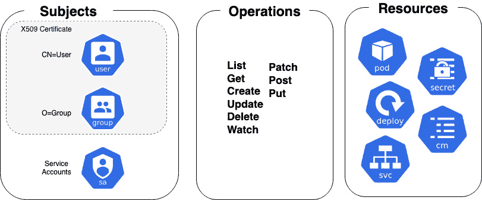
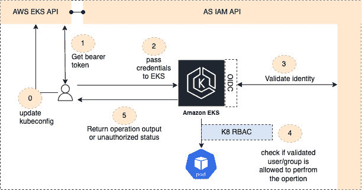
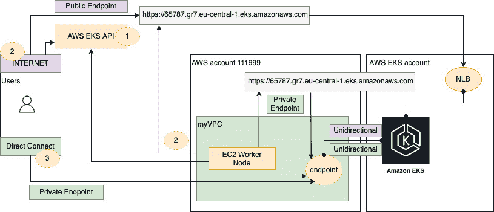

# 6

# 在 EKS 上保护和访问集群

本章将介绍 Kubernetes 中认证和授权的一般概念，还将讨论这些概念与**弹性 Kubernetes 服务**（**EKS**）之间的差异。我们还将了解如何配置 EKS 和客户端工具以安全地进行通信。

认证验证用户或服务的身份，授权则管理他们可以执行的操作。在本章中，我们将回顾 EKS 中实现认证和授权的机制，以便你可以利用这些机制构建安全的集群。具体而言，我们将讨论以下主题：

+   理解关键的 Kubernetes 概念

+   配置 EKS 集群访问

# 理解关键的 Kubernetes 概念

Kubernetes 集群有两类用户：由 Kubernetes 管理的服务账户和普通用户（如管理员、开发人员等）。**Kubernetes**（**K8s**）具有可扩展性，支持多个认证插件。我们将重点讨论最常见的客户端证书，同时讨论 Kubernetes 中的通用用户认证/授权。

使用客户端证书插件时，用户在提供由集群**证书** **授权机构**（**CA**）签名的有效证书时会被视为已认证。

拥有有效证书后，Kubernetes 从`/CN=bob`中的常用名称字段确定用户名，而组信息则提供在`/O=dev`中。从此时起，**基于角色的访问控制**（**RBAC**）子系统将决定用户是否有权限在资源上执行特定操作。

以下图示说明了这一概念。请注意，服务账户将在*第十三章*中讨论，*使用 IAM 授予应用程序访问权限*。



图 6.1 – 标准 Kubernetes RBAC 子系统

为了为普通用户生成证书，你需要使用操作系统工具（如 OpenSSL）生成 PKI 私钥和 CSR（见下例），然后将 CSR 请求以 base64 编码导出，由集群 CA 进行签名：

```
$ openssl genrsa -out myuser.key 2048
$ openssl req -new -key myuser.key -out myuser.csr
$ cat myuser.csr | base64 | tr -d "\n"
```

生成的编码字符串可以通过`CertificateSigningRequest`类型提交给 K8s 集群进行签名。以下是一个示例：

```
apiVersion: certificates.k8s.io/v1
kind: CertificateSigningRequest
metadata:
  name: myuser
spec:
  request: <BASE64.csr>
  signerName: kubernetes.io/kube-apiserver-client
  expirationSeconds: 86400  # one day
  usages:
  - client auth
```

现在我们已经了解了标准 K8s 认证的工作原理，接下来让我们看看它在 EKS 中的默认工作方式。

## 理解默认的 EKS 认证方法

管理一个或多个 K8s 集群的用户、组和证书可能是一个运营挑战。幸运的是，EKS 默认将此任务转交给 AWS **身份和访问管理**（**IAM**）服务。IAM 是一个全球分布的服务，允许你创建用户和组，并分配包括 AWS EKS API 在内的 AWS 权限。

默认情况下，当你创建一个 EKS 集群时，创建该集群的 IAM 实体会自动被授予 `system:masters` 权限，实际上使其成为 EKS 集群的系统管理员角色。这意味着没有额外配置的情况下，用于集群创建的 IAM 身份是唯一能够对 EKS 集群执行任何操作的身份。

这是开始使用 EKS 时的典型错误，因为可能使用 CI/CD 管道来创建集群，但其 IAM 身份与常规用户不同。因此，当他们与集群交互时，他们没有 K8s 权限。EKS 集群已预先集成 AWS IAM。下图说明了用户和 EKS 集群如何与 IAM 服务交互。



图 6.2 – EKS 身份验证流程

我们将详细讨论 *图 6.2* 中显示的 EKS 身份验证流程的每个步骤：

0. 起始点是客户端检索集群配置，更新 `update-kubeconfig` CLI 命令是最简单的方法，它会使用 `DescribeCluster` API 操作。任何使用此 API 调用的用户必须具备一个 IAM 身份，并且有权限使用该 API 自动更新配置文件。下面是名为 `mycluster` 的集群示例：

```
$ aws eks update-kubeconfig --name mycluster
```

1.  现在需要生成并在每个 EKS API 中使用一个持有者令牌（`get-token` CLI 命令或使用 AWS IAM 身份验证器自动生成）：

    ```
    $ aws eks get-token --cluster-name mycluster
    ```

1.  持有者令牌要么手动添加到请求中（例如，在 `kubectl` 命令行中），要么由 IAM 身份验证器/`kubectl` 命令自动添加。

1.  这个持有者令牌现在通过一个令牌——`authentication-webhook`——在 AWS IAM 服务中进行验证，该令牌由 EKS 中的 IAM 身份验证器服务使用。如果验证通过，则请求会传递到 K8s RBAC 子系统。

1.  通过与经过身份验证的 IAM 身份关联的 IAM 策略授予的权限集对 EKS 集群权限没有影响。IAM 和 RBAC 子系统之间的桥梁是 `aws-auth` ConfigMap，它提供 IAM 主体（角色/用户/组）与 Kubernetes 实体（用户/组）之间的映射。

1.  操作（在授权的情况下）会返回给客户端，或者他们会收到“未授权”响应。

到目前为止，我们已经讨论了用户身份是如何通过身份验证的。下一部分将描述经过身份验证的用户的请求是如何被授权的。

## 配置 aws-auth ConfigMap 以进行授权

我们将在本节稍后介绍如何配置和维护 `aws-auth` ConfigMap，但需要理解的是，这个 ConfigMap 管理着 AWS IAM 身份与 Kubernetes 身份和权限之间的关系。如果在 `aws-auth` ConfigMap 中没有相应的条目，IAM 用户或用户组将无法执行任何 K8s 操作，无论 IAM 角色或策略中分配了什么权限。

EKS 使用 **OpenID Connect** (**OIDC**) 身份提供者作为一种方法来验证/授权用户访问你的集群。这意味着每个集群都会被赋予一个唯一的 OIDC 身份，可以作为 AWS IAM 策略中的受信实体使用。你可以通过以下命令验证集群的身份：

```
$ aws eks describe-cluster --name my-cluster --query "cluster.identity.oidc.issuer" --output text
```

OIDC 身份提供者可以与 AWS IAM 一起使用，也可以与其他符合 OIDC 标准的身份提供者一起使用。这意味着你可以在像 GitHub Enterprise 或 GitLab 这样的平台中管理用户/密码和权限，而不是使用 AWS IAM，并通过 OIDC 提供者来验证/授权用户。你可以将一个 OIDC 身份提供者关联到你的集群，因此不能同时使用 IAM 和另一个身份提供者。

## 访问集群端点

到目前为止，我们已经讨论了如何验证和授权在 EKS 集群上的操作；然而，要做到这一点，你需要能够通过 HTTPS 与集群的端点进行通信。一旦你更新了 `certificate-authority-data`，如何访问该端点将取决于你如何配置 EKS 端点，无论是仅公开、仅私有，还是两者都支持。

如前所述，EKS 是一个托管服务，因此控制平面（API/etcd）服务器运行在 AWS 管理的 VPC 中。工作节点（通常是 EC2）运行在客户的 VPC 中，并使用通过 DNS 查找服务器返回的任何 IP 地址与控制平面进行通信。以下图示说明了用户如何访问公共或私有 EKS 端点：



图 6.3 – EKS 端点访问

如前图所示，访问 EKS 端点所需的步骤如下：

1.  初步要求是获取 EKS 集群的 DNS 名称。在大多数用户访问场景中，这个步骤已经通过 `update-kubeconfig` CLI 命令完成，但当工作节点被创建时，它们会调用 AWS EKS API 获取集群配置和 DNS 信息。写作时，AWS EKS API 仅是一个公共 API（没有私有端点），因此所有工作节点需要通过 NAT、互联网和/或传输网关访问公共 API。

1.  对于公共端点，DNS 名称解析为 AWS 管理的 VPC 中托管的公共 **网络负载均衡器** (**NLB**)。这意味着所有用户和工作节点的通信都会经过这个公共端点（尽管工作节点流量不会离开 AWS 主干网）。

1.  对于私有端点，DNS 名称解析到附加到客户 VPC 的私有端点（这使用由 AWS 管理的私有托管 Route 53 区域）。更具体地说，它解析到 VPC 私有 IP 地址，这意味着它只能在 VPC 内部或通过使用传输网关、VPN 和/或 Direct Connect 的私有连接进行访问。在这种情况下，客户的 VPC 和 AWS 管理的 VPC 之间的私有连接是双向的，由控制平面和用户/工作节点共同使用。

可以启用公共和私有端点，在这种情况下，用户可以通过公共 NLB 访问 K8s API，也可以通过私有端点访问。在此模型中，所有 API 服务器/工作节点通信都通过私有端点进行。

# 配置 EKS 集群访问

在本节中，我们将更详细地查看访问集群所需的两个关键文件的配置：`kubeconfig`和`aws-auth`，以及如何使用 IP 控制来保护 EKS 端点。

## 配置.kube/config

`clusters`列表中包含每个要访问的集群条目，包含 DNS 名称和 TLS 证书以允许通信。这些条目可以手动添加或通过`update-kubeconfig` CLI 命令添加。以下是一个示例`kubeconfig`文件：

```
clusters:
- cluster:
  certificate-authority-data: xx==
  server: https://65787.gr7.eu-central-1.eks.amazonaws.com
  name: arn:aws:eks:eu-central-1:111999:cluster/mycluster
```

`kubeconfig`文件中的`context`部分用于将访问参数分组到一个客户端工具中，例如 kubectl。你可以为访问单个集群创建不同的上下文。在以下示例中，我们将`myuser`用户和`mycluster`集群组合到`mycontext`上下文中：

```
contexts:
- context:
    cluster: arn:aws:eks:eu-central-1:111999:cluster/mycluster
    user: arn:aws:eks:eu-central-1:111999:cluster/myuser
    name: arn:aws:eks:eu-central-1:111999:cluster/mycontext
```

最后，`kubeconfig`文件中的`users`部分保存与上下文相关的用户特定参数。在以下示例中，用户使用`aws eks get-token`命令基于为`mycluster`集群调用者配置的 IAM 身份自动提供承载令牌，该集群位于`eu-central-1`区域，账户 ID 为`111999`：

```
users:
- name: arn:aws:eks:eu-central-1:111999:cluster/myuser
  user:
    exec:
      apiVersion: client.authentication.k8s.io/v1alpha1
      args:
      - --region
      - eu-central-1
      - eks
      - get-token
      - --cluster-name
      - mycluster
      command: aws
```

配置你的`kubeconfig`文件是与 EKS 集群建立通信的关键部分，以下命令可用于验证/查看配置：

```
$ kubectl config view
$ kubectl config view -o template --template='{{ index . "current-context" }}'
```

到目前为止，我们已经回顾了 K8s 客户端（如 kubectl）如何向 API 服务器提供用户身份。下一部分将回顾如何使用`aws-auth`配置映射授权该用户身份。

## 配置 aws-auth 配置映射

正确配置的客户端`kubeconfig`文件提供承载令牌，使 EKS 能够识别和验证用户。一旦验证了身份，RBAC 子系统和`aws-auth`配置映射将验证用户是否具有正确的权限。我们通过在配置映射的`data`部分中的角色详细信息来添加用户权限。每个条目支持以下参数：

+   `groups`：角色映射到的 Kubernetes 组列表。

+   `rolearn`：与用户持有的令牌关联的 IAM 角色的 ARN。

+   `username`：Kubernetes 中的用户名，用于映射到 IAM 角色。如前所述，这个字段并没有被使用，因此无需映射到现有的用户。

在以下示例中，账户 `111999` 中的 `myIAMRole` IAM 角色被映射到 `system:masters` 组，并分配了 K8s 用户名 `creator-account`。这是你在 `aws-auth` ConfigMap 中将看到的默认配置示例：

```
- groups:
  - system:masters
  rolearn: arn:aws:iam::111999:role/myIAMrole
  username: creatorAccount
```

你可以使用 `kubectl` 或像 `eksctl` 这样的 IAC 工具直接修改 ConfigMap，如下所示：

```
$ kubectl edit cm aws-auth -n kube-system
eksctl create iamidentitymapping --cluster  mycluster --region=eu-central-1 --arn arn:aws:iam::111999:role/myIAMrole --group system:masters --username creatorAccount
```

不建议使用这种方法，因为没有版本/变更控制。更好的方法是将 ConfigMap 清单放入 Git 仓库，然后使用 CI/CD 管道来推动/拉取变更。你仍然可以使用 `kubectl` 或 `eksctl` 来进行更改，但这是通过版本控制下的文件完成的，并通过经过审计的管道进行管理，该管道可以进行任意数量的构建检查或测试。通常，部署 EKS 集群和增量管理 ConfigMap 时将遵循以下步骤：

1.  使用你首选的基础设施即代码工具和/或管道部署 EKS 集群。

1.  将默认的 `aws-auth` ConfigMap 导出到一个独立的版本控制仓库/清单，并拥有自己的部署管道。可以通过运行以下命令完成此操作：

    ```
    kubectl get cm aws-auth -n kube-system -o yaml > xx.yaml
    ```

1.  利用合适的代码审查流程，添加新组/用户和角色映射。请注意，配置中引用的 IAM 角色必须存在，因此它必须首先在 AWS IAM 服务中创建。

1.  使用以下命令，通过推送（CI/CD）或拉取（GitOps）方法更新你的集群：

    ```
    kubectl patch configmap/aws-auth -n kube-system –patch "$(cat /tmp/xx.yml)"
    ```

1.  步骤 3 和步骤 4 需要在你不断添加和删除用户/组到 `aws-auth` 文件时反复执行。

到目前为止，我们已经讨论了当请求到达 K8s API 服务器端点时，用户如何进行身份验证/授权。在下一节中，我们将讨论如何保护 API 端点的访问。

## 保护 EKS 端点

总体来说，最好使用私有 EKS 端点。尽管访问任何 EKS 端点需要有效的 TLS 证书（如果使用客户端证书）和适当的 IAM/RBAC 权限，但如果这些被泄露且你有一个公共端点，那么你的集群将可以从世界任何地方访问。如果需要使用公共端点，请确保配置公共访问 CIDR 范围，以限制哪些公共 IP 地址可以访问。在以下示例中，访问 `mycluster` 公共集群已被限制为单个 `/32` IP 地址：

```
$ aws eks describe-cluster --name mycluster
{    "cluster": {
…….
            "endpointPublicAccess": true,
            "publicAccessCidrs": ["203.0.113.5/32 "]}}
```

EKS API 网络接口由一个单独的安全组保护，提供有状态的 IP 入站保护。因此，尽管 EKS 私有端点只能从 VPC 或连接的私有网络访问，但与 API 端点关联的安全组（在以下示例中显示为`securityGroupIds`）可以作为附加控制来限制对特定 IP 地址的访问：

```
$ aws eks describe-cluster --name mycluster
{"cluster": {
………..
            "securityGroupIds": ["sg-5656576d"],
            "clusterSecurityGroupId": "sg-5657657s"}}
```

请注意，API 安全组与`clusterSecurityGroupId`安全组不同，后者用于保护工作节点。

到此为止，你已经理解或至少对 EKS 如何进行认证和授权、以及如何保护 API 端点有了一定的了解。接下来，我们将回顾本章的关键学习点。

# 总结

在本章中，我们探讨了原生 Kubernetes 中的认证和授权的基本概念，以及 EKS 的不同之处。我们描述了 EKS 如何默认与 AWS IAM 集成，并且为了使 EKS 认证用户，需要通过像`kubectl`这样的客户端工具生成一个承载令牌。这个承载令牌可以通过手动使用`get-token`命令行操作生成，或通过`kubeconfig`文件自动生成，并将在每个 API 请求中提交，并由 EKS 自动验证。

我们还描述了`aws-auth` ConfigMap 如何被 Kubernetes RBAC 子系统用来接受或拒绝任何 API 请求。重要的是，将此文件放在版本控制下，并使用 CI/CD 管道管理更改，因为默认情况下，只有集群创建者才有权限对集群进行任何操作。

最后，我们讨论了如何通过 IP 白名单和/或安全组保护 API 端点的访问，以及通常情况下，使用私有集群更为安全。

在下一章，我们将讨论 Kubernetes 网络及如何配置 EKS 使用**AWS 虚拟私有****云**（**VPC**）。

# 深入阅读

+   AWS IAM 认证器概述：

[`docs.aws.amazon.com/eks/latest/userguide/install-aws-iam-authenticator.html`](https://docs.aws.amazon.com/eks/latest/userguide/install-aws-iam-authenticator.html)

+   K8s 中 Webhook 认证概述：

[`kubernetes.io/docs/reference/access-authn-autWhz/authentication/#webhook-token-authentication`](https://kubernetes.io/docs/reference/access-authn-autWhz/authentication/#webhook-token-authentication)

+   AWS OIDC 提供商集成概述：

[`github.com/awsdocs/amazon-eks-user-guide/blob/master/doc_source/authenticate-oidc-identity-provider.md`](https://github.com/awsdocs/amazon-eks-user-guide/blob/master/doc_source/authenticate-oidc-identity-provider.md)
