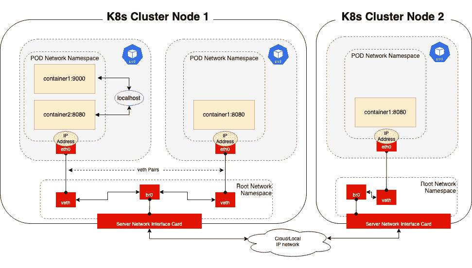

# 7

# EKS 中的网络

**Kubernetes**（**K8s**）对外部网络配置没有严格规定。这意味着在 Kubernetes 中可以使用多个网络插件和配置，以满足安全性、延迟和操作要求。

在本章中，我们将重点讨论标准 K8s Pod 和集群网络的工作原理，然后讨论 **AWS 虚拟私有云**（**VPC**）中的相似性和差异性。具体来说，我们将覆盖以下内容：

+   理解 Kubernetes 中的网络

+   掌握基本的 AWS 网络知识

+   理解 EKS 网络

+   使用 VPC CNI 配置 EKS 网络

+   常见的网络问题

读者应该熟悉 TCP/IP 网络、AWS 中的网络工作原理以及 NAT 的概念。本章旨在使读者具备配置和管理 EKS 网络（适用于一个或多个集群）的技能。

# 理解 Kubernetes 中的网络

Kubernetes 被设计为可扩展的，因此它支持多种网络实现，所有这些实现都符合明确定义的网络模型。K8s 有一些基本的网络规则，所有网络插件必须遵循：

+   每个 Pod 都有自己的 IP 地址

+   Pod 中的容器共享 Pod 的 IP 地址

+   Pods 可以通过 Pod IP 地址（无需 NAT）与集群中所有其他 Pods 通信

+   网络策略用于在网络层面上对 Pods 进行隔离

出于合规性原因，任何 K8s 网络实现必须支持 **容器网络接口**（**CNI**）规范，这是 **云原生计算基金会**（**CNCF**）的一个项目。CNI 规范包括用于编写插件以配置容器中网络接口的指南和库。虽然在单一集群中可以拥有多个 CNI，但默认情况下，一个 K8s 集群只会配置为支持单个 CNI。有许多类型和提供商的 CNI 插件，但它们都允许 Pods 连接到外部网络和/或分配 Pod IP 地址。

在深入讨论 EKS 网络之前，了解 K8s 中网络的一般工作原理是非常重要的，因为大多数 CNI 实现都遵循这一模式。

## Kubernetes 中的网络实现

Pod 是 Kubernetes 中可以部署和管理的最小单位。一个 Pod 可以包含多个容器。Pod 中的容器共享网络命名空间，这意味着它们共享相同的 IP 地址、网络端口空间和以太网接口。下图展示了同一节点内以及同一集群中跨节点的 Pod 间连接。



图 7.1 – 基本 Pod 网络

K8s 网络通信有多种方式，取决于源和目标：

+   由于 Pod 中的容器共享相同的网络命名空间和端口空间，它们可以使用本地主机（`127.0.0.1`）地址进行相互通信。

+   每个 Pod 在主机的根网络命名空间中都有一个对应的接口（veth），并且在其自己的网络命名空间中也有一个接口。这被称为 veth 对，它充当 Pod 网络命名空间和主机网络（具有实际以太网接口）之间的虚拟网络电缆。希望互相通信的 Pod 使用集群 DNS 解析服务名称到 IP 地址，并使用 ARP 协议将 IP 地址映射到 Pod 以太网地址。

+   如果 Pod 位于另一个节点，集群 DNS 将解析 IP 地址。在 ARP 请求失败的情况下，数据包将被路由出主机到网络中，希望它能找到通向目标 IP 地址的路由。

CNI 与 kubelet 集成，kubelet 是在所有工作节点上运行的主要 K8s 代理。当创建一个新的 Pod 时，它没有网络接口。kubelet 会向 CNI 发送一个 `ADD` 命令，然后 CNI 负责以下操作：

1.  将网络接口插入到容器网络命名空间中（`eth0`）

1.  对主机进行必要的更改，如创建 `veth` 接口并将其附加到 `Bridge0` 和 `eth0` 接口上

1.  为接口分配 IP 地址并设置相关的路由

Kubernetes 在基本 Pod 网络之上添加了进一步的抽象。一个 Kubernetes 集群允许多个相同的 Pod 副本在多个主机上部署，并允许入口流量路由到这些主机中的任何一台。服务有不同类型；在这个示例中，我们将重点关注 `NodePort` 服务。当创建一个服务时，它通常会基于标签选择 Pods。它会创建一个新的 DNS 名称、虚拟 IP 地址，为每个节点分配一个动态端口，并保持一个节点与其托管的 Pods 之间的映射，映射依据服务规格中定义的标签。这在下面的图中有所显示。


图 7.2 – Nodeport 服务

当流量到达服务时（使用服务的 DNS 名称或*主机：动态端口*组合），iptables 或 IP 虚拟服务器（IPVS）被用来将请求服务地址重写为相关的 Pod 地址（由 kube-proxy 控制），然后应用前述的基本 Pod 网络规则。在服务 1（*图 7.2*）的情况下，流量可以发送到每个节点，并且目标地址将被重写为运行在该节点上的 Pod。在服务 2 的情况下，到达节点 3 的流量没有本地 Pod，因此流量将被发送到节点 1 或节点 2。

默认情况下，流量将从节点 3 进行源地址转换（SNAT），因此无论 Pods 位于何处，流量总是流入并流出节点 3。Kubernetes 网络代理（kube-proxy）在每个节点上运行，负责管理服务、请求（包括 SNAT）以及 Pod 的负载均衡。

SNAT 表示将 IP 数据包的源 IP 地址替换为另一个地址。在大多数情况下，这将是节点以太网地址的 IP 地址。**目标 NAT**（**DNAT**）是指将目标 IP 地址替换为另一个地址，通常是 Pod 的 IP 地址。下图展示了这些概念。


图 7.3 – K8s 源/目标 NAT

在*图 7.3*中，以 nodePort 服务为例：

1.  客户端（`10.2.3.4`）发送的流量在节点 3 上接收，目标是通过 nodeport 服务端口 `3124` 暴露的服务。

1.  kube-proxy 将执行 SNAT，将源 IP 映射到本地节点的以太网地址，并使用 DNAT 将服务地址映射到 Pod IP 地址（位于节点 1 上）。

1.  数据包被发送到节点 1（因为它会响应 Pod IP 地址的 ARP 请求）。K8s 端点（包含与服务选择器匹配的任何 Pod 的 IP 地址）用于将数据包发送到 Pod。

1.  Pod 响应会根据源 IP 地址返回给节点 3，然后根据 kube-proxy 维护的源端口映射将其映射回客户端。

AWS 网络是规定性的，它将 K8s 网络配置为与 AWS VPC 网络协同工作，这对默认情况下 EKS 网络的工作方式有很大影响。下一节将快速回顾 AWS VPC 网络如何工作，以及在深入了解 EKS 网络时需要理解的一些概念。

# 理解基本的 AWS 网络

在讨论 EKS 网络之前，我们将快速回顾 AWS 中的基本 VPC 网络。当你注册 AWS 账户时，你将获得一个可以跨多个区域以及每个区域内多个**可用区**（**AZ**）部署服务的账户。区域是一个地理位置，如伦敦、法兰克福或俄勒冈，每个区域由多个 AZ 组成，每个 AZ 包含两个或多个通过高速网络互联的 AWS 数据中心。AZ 是 AWS 网络可靠性的基本单位。


图 7.4 – 基本 VPC 结构

VPC 是一个区域构造，它由一个 IP `10.1.0.0/16` 定义。子网是从 VPC 中分配的，并映射到一个可用区（AZ）。具有 IP 地址的服务，如 EKS，分配到一个子网（或多个子网），AWS 平台将从子网范围内分配一个可用的 IP 地址，并在该子网中创建一个**弹性网络接口**（**ENI**）。在大多数 AWS VPC 中，使用 RFC1918，即私有地址，这意味着 VPC 的 CIDR 范围来自以下子网：

+   `10.0.0.0` – `10.255.255.255`（`10/8` 前缀）

+   `172.16.0.0` – `172.31.255.255`（`172.16/12` 前缀）

+   `192.168.0.0` – `192.168.255.255`（`192.168/16` 前缀）

此外，VPC 现在可以使用非 RFC1918 地址，即`100.64.0.0/10`和`198.19.0.0/16`范围，EKS 支持这些地址。在大型企业中，这些地址范围会在现有的数据中心和办公地点之间共享，因此通常会将一小部分地址分配给 AWS 平台，然后在多个 VPC 和 AWS 服务（包括 EKS）之间共享。可以向 VPC 添加额外的 IP 范围，即二级地址，但一旦范围设置完成，就不能更改。在前面的示例中，添加了一个额外的范围`100.64.0.0/10`，并在三个不同的可用区（AZ）中从该范围创建了三个额外的子网。在 VPC 中，任何 IP 范围，无论是主地址还是次级地址，都是可路由的。在前面的示例中，子网`10.1.1.0/24`上的主机可以路由到任何其他子网，包括`100.64.0.0/16`；然而，AWS 的**安全组**（**SGs**）和/或**网络访问控制列表**（**NACLs**）控制哪些系统可以与其他系统进行通信。

需要三个额外的服务来允许访问互联网以及从互联网访问。**互联网网关**（**IGW**）允许公共 IP 地址与 VPC 地址之间的映射（进入和退出流量）。

**NAT 网关**（**NATGW**）可以使用 IGW 提供仅出站的访问，当应用程序/系统需要访问公共 AWS API（例如 EKS API）或公共服务（如 Docker Hub）以拉取容器镜像，但不希望被互联网上的任何事物访问时，会使用 NATGW。也可以使用私有 NATGW，简单地将私有子网的 NAT 地址转换为私有地址，而与 IGW 无关。这通常用于在其他地方（本地或 AWS 云的其他部分）重复使用的地址范围之间进行转换，或者用于不在本地路由的地址范围。

**传输网关**（**TGW**）用于在其他 VPC（同一账户或其他 AWS 账户中的 VPC）之间进行路由，并连接到本地工作负载和服务（通过 VPN 或 Direct Connect 专用连接）。

# 理解 EKS 网络

现在我们已经理解了基本的 K8s 网络模型、CNI 是什么以及 VPC 网络是如何工作的，我们可以探讨 EKS 网络是如何工作的。VPC CNI 有几个配置选项；本节将不会覆盖所有可能的配置，仅讨论最常见的配置。

EKS 是一个托管服务，控制平面由 AWS 在单独的 VPC 中管理。配置集群时，您需要问的两个主要网络问题是：如何从 kubectl（和其他）客户端访问 API 端点？以及我的 Pods 如何访问或被访问其他系统？我们在*第六章*中讨论了公共和私有端点，因此在本章的其余部分，我们将重点关注 Pod 网络。让我们从一个基本的 EKS 部署开始，这是一个拥有两个 EC2 实例的私有集群，属于同一节点组。该集群已配置为连接到两个私有 VPC 子网；节点组也被部署到这两个子网中。


图 7.5 – EKS 网络 (基础)

如果你查看*图 7.5*中的 VPC，可以看到四个接口（ENI）——每个工作节点一个，两个（通常）用于 EKS 集群——以及一个映射服务器名称到这两个集群 ENI 的私有托管区域。还有两个安全组，一个用于工作节点，一个用于 EKS 控制平面/API。目前，这一切都是默认的 AWS 平台行为。每个 ENI 都已从其所附加的子网中分配了一个 IP 地址。安全组将相互引用，并允许工作节点与 API 之间的访问。

EKS 部署时默认使用 AWS VPC CNI 作为集群的 CNI。可以使用其他 CNI，其中一些在*第九章*《EKS 高级网络》中有所介绍。**vpc-cni** 与 kubelet 代理协同工作，从 VPC 请求并映射 IP 地址到主机使用的 ENI，然后将其分配给 Pod。每种 EC2 实例类型可以分配的 EC2 ENI 数量以及可分配给 Pod 的 IP 地址数量是有限的。例如，**m4.4xlarge** 节点最多可以有 8 个 ENI，每个 ENI 可以有最多 30 个 IP 地址，这意味着理论上每个工作节点可以支持最多 120 个地址（稍后我们将看到，这个数字也有一些限制）。

这种方法的优势在于 Pod 是 AWS VPC 中的第一类公民。Pod 和 EC2 实例之间没有区别；Pod 网络的行为与本章中描述的完全一致。另一个好处是，当流量离开节点时：流量可以通过 AWS 的网络网关和控制来路由和控制，这些网关和控制也用于 AWS 中的所有其他服务。

这种方法的缺点是，由于 Pods/容器的临时性质，EKS 集群可能会迅速*耗尽*所有可用的子网地址，导致无法部署新的 Pods 和/或其他 AWS 服务（如数据库 RDS）。如果你拥有较小的 VPC 或子网 IP（CIDR）范围，这将特别成问题。有几种方法可以缓解这个问题。

## 不可路由的次级地址

*不可路由*的概念是使用本地已有的范围，或理想情况下使用 AWS 用于 Pod 地址的新非 RFC1918 范围，这些范围在本地没有路由，从而允许使用更大的地址范围。这一点在*图 7.6*中有展示。


图 7.6 – 不可路由的 Pod 网络

在*图 7.6*中，展示了两个不同的 IP 区域或路由域。`10.1.0.0/16` 和第二个范围 `100.64.0.0/10` 都可以与 `10.0.0.0/8` 企业网络进行通信。

`100.64.0.0/10` 范围内的地址是私有的且不可路由的。它们通过 NATGW 使用，这意味着所有出站流量在离开 `100.64.0.0` 子网时都会基于源地址进行 NAT，因此这些 IP 地址永远不会出现在 VPC 之外。

任何分配了`100.64.x.x`范围地址（**路由域 2**）的 Pods 都无法从企业网络访问，TGW 也不会广告这十条路由。

## 前缀寻址

EC2 工作节点的默认行为是根据分配给 ENI 的 IP 地址数量以及附加到 Amazon EC2 节点的网络接口数量来分配可用于分配给 Pods 的地址数量。例如，**m5.large** 节点最多可以有 3 个 ENI，每个 ENI 可以有最多 10 个 IP 地址，因此根据以下计算，它可以支持最多 29 个 Pods：

*3 个 ENI*（10 个 IP 地址 -1）+ 2（每个节点的 AWS CNI 和 kube-proxy Pods）= 每个节点 *29 个 Pods*

版本 1.9.0 或更高版本的 Amazon VPC CNI 支持 *前缀分配模式*，允许你在 `/28` IPv4 地址前缀上为每个主机 ENI 运行更多的 Pods，只要你的 VPC CIDR 范围中有足够的空间：

*3 个 ENI*（每个 ENI 9 个前缀 *每个前缀 16 个 IP 地址）+ 2 = 每个节点 *434 个 Pods*

然而，请注意，Kubernetes 可扩展性指南建议每个节点的最大 Pod 数为 110 个，在大多数情况下，这将是 CNI 强制执行的最大值。前缀寻址可以与不可路由地址一起使用，因为它仅在 VPC CIDR 能够从 VPC CIDR 中分配连续的 `/28` 子网时有效。

## IPv6

另一种选择是使用 IPv6 替代 IPv4。关于 IPv6 和 IPv4 之间差异的详细讨论超出了本文的范围，但在 VPC 中，如果启用 IPv6，则会自动获得一个公共的 `/56` IPv6 CIDR 块，并且每个子网都会分配一个 `/64` 范围。这提供了每个子网 2⁶⁴（大约 18 千万亿）个 IPv6 地址，因此你永远不会耗尽 IP 范围。如果集群配置为使用 IPv6，则每个 Pod 都会分配一个原生的 IPv6 地址，用于 Pod 到 Pod 之间的通信，IPv6 IGW（仅出口）则用于 IPv6 的互联网访问。

由于大多数环境将支持 IPv6 和 IPv4 的混合使用，EKS 实现了一个 **主机本地 CNI** 插件，与 **VPC CNI** 配合使用，支持只有 IPv6 地址的 Pods 连接到集群外部的 IPv4 端点（仅出口）。IPv6 明确解决了 IP 分配问题，但也引入了更多的复杂性，因为你需要管理 IPv4 NAT，并且需要仔细考虑。IPv6 的详细讨论请参见 *第九章*，*EKS 高级网络*。

在本节中，我们概述了原生 K8s 网络的工作原理，以及 EKS/VPC 网络的不同之处。在接下来的章节中，我们将详细回顾如何配置和管理 EKS 网络。

# 使用 VPC CNI 配置 EKS 网络

如前所述，AWS VPC CNI 默认安装，但你可能需要升级 CNI 以使用前缀分配模式，或者更改配置参数。以下部分将引导你完成常见任务的配置步骤。

## 管理 CNI 插件

执行 CNI 升级到新集群的最简单方法是应用新的 Kubernetes 清单。以下代码片段将版本 v1.9.1 安装到你的集群中，并根据需要更改版本。然而，请注意，降级 CNI 版本可能会非常棘手，在某些情况下，可能无法成功降级！

在脚本或 CI/CD 流水线中，能够导出当前运行的 CNI 版本（只要它已经部署）通常是一个好主意。以下代码片段可以帮助你做到这一点：

```
$ export CNI_VER=$(kubectl describe daemonset aws-node --namespace kube-system | grep Image | cut -d "/" -f 2 | sed -e 's/amazon-k8s-cni-init:\(.*\)-eksbuild.1/\1/')
$ echo $CNI_VER
v1.11.3 amazon-k8s-cni:v1.11.3-eksbuild.1
```

现在我们可以使用以下命令部署 CNI：

```
$ kubectl apply -f https://raw.githubusercontent.com/aws/amazon-vpc-cni-k8s/v1.9.1/config/v1.9/aws-k8s-cni.yaml
```

要在 CNI 配置中启用前缀分配，可以使用以下命令（这对于任何 CNI 配置参数都有效）：

```
$ kubectl set env daemonset aws-node                            -n kube-system ENABLE_PREFIX_DELEGATION=true
```

EKS 集群还支持使用附加组件，这使你能够配置、部署和更新操作软件，或者提供支持 Kubernetes 应用程序的关键功能，如 VPC CNI。附加组件是构建完成后以及当你有正在运行的工作负载时管理集群的首选方式。创建附加组件最简单的方法是使用 `eksctl` 工具，如下所示：

```
$ eksctl create addon --name vpc-cni --version $CNI_VER --cluster $CLUSTERNAME –force
```

这将创建一个附加组件（在 AWS 控制台中可见）。如果你运行 `kubectl get` 命令，如下所示，你可以看到管理字段：

```
$ kubectl get daemonset/aws-node --namespace kube-system --show-managed-fields -o yaml
```

你应该能够在 YAML 中看到由 EKS 控制平面管理的字段，即 `managedFields` 键下的输出，如下所示：

```
..
managedFields:
  - apiVersion: apps/v1
    fieldsType: FieldsV1
    fieldsV1:
```

查看插件的更简单方式是使用 `eksctl` 命令：

```
$ eksctl get addons --cluster $CLUSTERNAME --region $AWS_REGION
```

这将输出类似以下代码的内容：

```
vpc-cni v1.9.1-eksbuild.1       ACTIVE  0       arn:aws:iam::119991111:role/eksctl-mycluster-addon-vpc-cni-Role1-4454        v1.10.2-eksbuild.1,v1.10.1-eksbuild.1,v1.9.3-eksbuild.1
```

这告诉我们有可用的更新版本：v1.10.2、v1.10.1 和 v1.9.3。所以，如果我们想要升级 CNI，可以执行以下命令：

```
$ eksctl update addon --name vpc-cni --version 1.9.3 --cluster $CLUSTERNAME --region $AWS_REGION --force
```

## 禁用 CNI 源 NAT

当 Pod 网络流量的目标是 VPC 外的 IPv4 地址时，默认情况下，`AWS_VPC_K8S_CNI_EXTERNALSNAT` 变量的值默认为 **false**。

如果你想使用外部 NAT 设备，例如 AWS NATGW，你需要使用以下命令禁用此行为：

```
$ kubectl set env daemonset aws-node -n kube-system AWS_VPC_K8S_CNI_EXTERNALSNAT=true
```

## 配置自定义网络

当 Pod 被创建时，它们的 ENI 将使用节点的主网络接口的安全组和子网。自定义网络允许在同一个 VPC 内使用不同的安全组或子网，我们已经描述了一个需要此配置的用例（不可路由的二级地址）。要启用自定义网络，首先需要在 VPC 中配置所需的安全组和子网。然后你可以运行以下命令：

```
$ kubectl set env daemonset aws-node -n kube-system AWS_VPC_K8S_CNI_CUSTOM_NETWORK_CFG=true
```

您需要创建一个 `ENIConfig` 文件来定义所需的子网和安全组；下面显示了一个示例。请注意，名称设置为子网所在的 AZ；这是一种最佳实践，允许 EKS 根据节点/AZ 组合自动分配正确的子网：

```
apiVersion: crd.k8s.amazonaws.com/v1alpha1
kind: ENIConfig
metadata:
  name: eu-central-1a
spec:
  securityGroups:
    - sg-67346437643864389
  subnet: subnet-7847489798437
```

此配置使用 `kubectl apply -f eu-central-1a.yaml` 命令应用（假设你已经将文件命名为文件中 `metadata` 部分中的相同资源）。然后，您可以应用以下命令自动映射到正确的 `topology.kubernetes.io/zone` 标签：

```
$ kubectl set env daemonset aws-node -n kube-system ENI_CONFIG_LABEL_DEF=topology.kubernetes.io/zone
```

让我们看看一些常见的 EKS 网络问题以及如何解决它们。

# 常见的网络问题

网络通常是一个复杂的问题，尽管 K8s 定义了一个标准模型，每个 CNI 引入了不同的问题。接下来，我们将看看如何解决与 VPC CNI 相关的一些更常见的问题。

| **问题** | **解决方案** |
| --- | --- |
| 我的 worker nodes 无法加入集群。 | 检查 worker nodes 子网是否具有访问互联网的 IP（通过 IGW 或 NATGW）以及访问 EKS API ENI 的权限。检查路由表和相关的安全组以确保。 |
| 我的 Pods 无法从 VPC 分配 IP 地址。 | 检查 VPC 中是否有足够的空闲 IP 地址，如果没有，请分配一个次要 CIDR 范围。一旦有了 IP 地址，启用前缀寻址，或者增加 EC2 实例的大小（更多 ENIs）。 |
| Pods 无法解析 K8S DNS 名称。 | 确保所有 worker node 子网没有阻止出站或入站 UDP 端口 `53` 的安全组或网络 ACL，并确保你的 VPC 的 `enableDNSHostnames` 和 `enableDNSSupport` 设置为 `true`。 |
| AWS 负载均衡器无法部署。 | 确保 worker node 子网标记为 `kubernetes.io/role/elb` 或 `kubernetes.io/role/internal-elb` 中的一个。 |

在本节中，我们看了配置和管理 VPC CNI 所需的详细命令。现在我们将回顾本章的关键学习要点。

# 概要

在本章中，我们探讨了网络的基本概念和原生 Kubernetes 中的网络模型，以及 EKS 的不同之处。我们描述了 EKS 如何配置 AWS VPC CNI，该 CNI 与 AWS VPC 集成，从 VPC 为 Pod 分配 ENI 和 IP 地址。

我们还学到，在 EKS 中，Pod 是本地 VPC 的成员，流量可以使用 VPC 网络设备，如 Internet Gateway、Transit Gateway 和 NAT Gateway，并且可以通过 VPC 网络控制（如 SG 和/或 NACLs）进行控制。然而，这可能会带来一些挑战，比如 VPC IP 耗尽问题。我们讨论了一些处理 IP 耗尽的方法，包括非路由子网、前缀寻址和 IPv6。

最后，我们讨论了执行常见任务，如管理和升级 CNI，禁用 CNI 源 NAT，以便使用外部 NAT 设备（例如 AWS NATGW），以及配置自定义网络，以便 Pods 可以使用其他 SG 或子网连接到主工作节点，从而帮助提高安全性或应对 IP 耗尽问题。

在下一章中，我们将讨论 EKS 托管节点组，它们是什么，以及如何配置和管理它们。

# 进一步阅读

+   AWS VPC CNI 仓库: [`github.com/aws/amazon-vpc-cni-k8s`](https://github.com/aws/amazon-vpc-cni-k8s)

+   什么是 EC2 ENI？: [`docs.aws.amazon.com/AWSEC2/latest/UserGuide/using-eni.html`](https://docs.aws.amazon.com/AWSEC2/latest/UserGuide/using-eni.html)

+   EKS 与 IPv6 概述: [`aws.amazon.com/blogs/containers/amazon-eks-launches-ipv6-support/`](https://aws.amazon.com/blogs/containers/amazon-eks-launches-ipv6-support/)

+   EKS 上支持的 CNI: [`docs.aws.amazon.com/eks/latest/userguide/alternate-cni-plugins.html`](https://docs.aws.amazon.com/eks/latest/userguide/alternate-cni-plugins.html)

+   私有 NAT 网关: [`aws.amazon.com/about-aws/whats-new/2021/06/aws-removes-nat-gateways-dependence-on-internet-gateway-for-private-communications/`](https://aws.amazon.com/about-aws/whats-new/2021/06/aws-removes-nat-gateways-dependence-on-internet-gateway-for-private-communications/)

+   使用 Transit Gateway: [`docs.aws.amazon.com/whitepapers/latest/building-scalable-secure-multi-vpc-network-infrastructure/transit-gateway.html`](https://docs.aws.amazon.com/whitepapers/latest/building-scalable-secure-multi-vpc-network-infrastructure/transit-gateway.html)

+   EC2 最大 Pods 详情按实例类型: [`github.com/awslabs/amazon-eks-ami/blob/master/files/eni-max-pods.txt`](https://github.com/awslabs/amazon-eks-ami/blob/master/files/eni-max-pods.txt)

+   Kubernetes 扩展限制: [`github.com/kubernetes/community/blob/master/sig-scalability/configs-and-limits/thresholds.md`](https://github.com/kubernetes/community/blob/master/sig-scalability/configs-and-limits/thresholds.md)

+   EKS 插件概述: [`aws.amazon.com/blogs/containers/introducing-amazon-eks-add-ons/`](https://aws.amazon.com/blogs/containers/introducing-amazon-eks-add-ons/)
