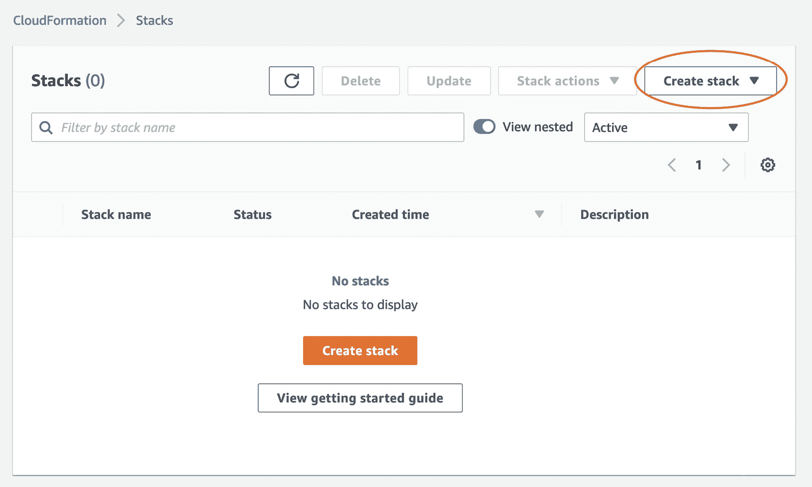
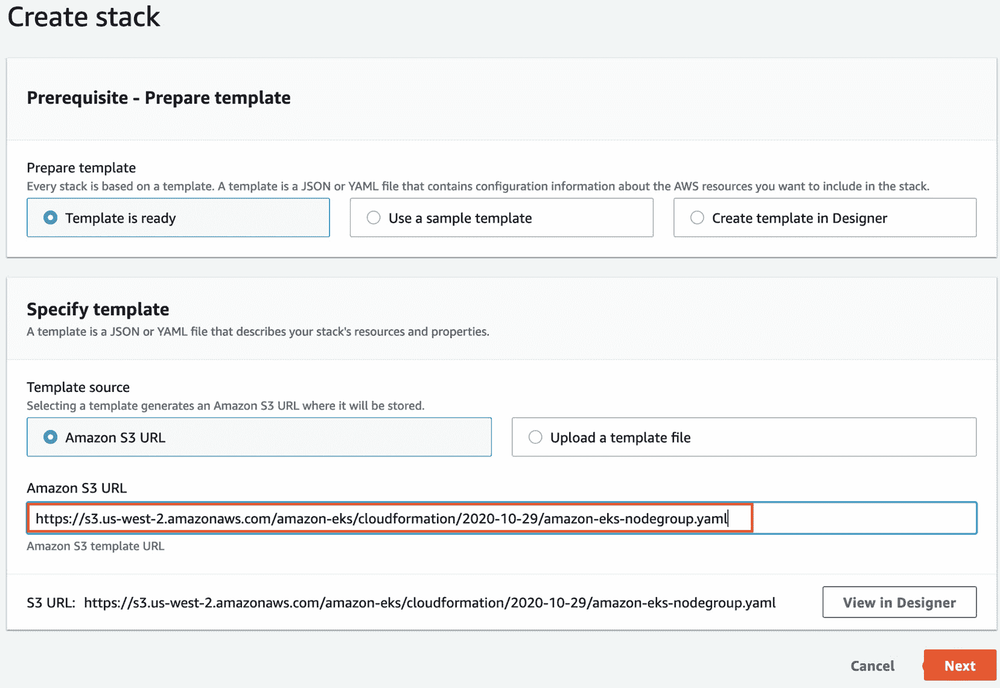

# 8

# 在 EKS 上管理工作节点

在前几章中，我们重点介绍了 **弹性 Kubernetes 服务** (**EKS**) 架构和 API，使用 kubectl 和 Helm 部署工作负载。EKS 可以使用 EC2 和 Fargate 托管这些工作负载。在本章中，我们将重点讨论如何配置、部署和管理在 EKS 中看到的不同 **弹性计算云** (**EC2**) 配置。我们还将讨论使用 EKS 优化镜像和托管节点组相较于自管镜像和实例的优势。Fargate 配置将在 *第十五章* 中详细讨论。

但现在，我们将介绍以下主题：

+   使用 Amazon Linux 启动节点

+   使用 CloudFormation 启动自管的 Amazon Linux 节点

+   使用 eksctl 启动自管 Bottlerocket 节点

+   使用 eksctl 理解托管节点

+   为 EKS 构建自定义 **Amazon Machine Image** (**AMI**)

# 技术要求

读者应具备 YAML、基础网络知识和 EKS 架构的基础知识。在开始本章之前，请确保以下内容：

+   您有一个 EKS 集群，并且能够执行管理任务

+   您可以连接到 EKS API 端点的网络

+   您的工作站已安装 **Amazon Web Services** (**AWS**) CLI 和 **kubectl** 二进制文件

# 使用 Amazon Linux 启动节点

在本节中，我们将讨论启动单个 EC2 实例并将其连接到集群所需的内容。然后，我们将在讨论托管节点组时进一步扩展这一点。

## 使用 Amazon Linux 启动节点的前提条件

工作节点只是一个 EC2 实例，EKS 使用它来实际托管部署在集群上的 Pods。任何 EC2 实例都需要以下内容：

+   一个 **身份与访问管理** (**IAM**) 角色，允许它与 AWS API（EKS、EC2 等）进行通信

+   一个安全组，至少允许与 EKS 控制平面通信

+   一个已安装 Kubernetes 代理（kubelet 等）的操作系统镜像

+   一个 `init`/`boot` 脚本，用于注册到特定的 EKS 集群

### IAM 角色和权限

每个工作节点和 EC2 实例都需要附加一个 IAM 角色，允许与 AWS EKS API、**弹性容器注册表** (**ECR**) 和 EC2 API 进行通信。需要应用三种 AWS 管理策略：

+   `AmazonEKSWorkerNodePolicy`

+   `AmazonEKS_CNI_Policy`

+   `AmazonEC2ContainerRegistryReadOnly`

此外，如果您希望通过 Systems Manager SSH 访问工作节点，您还需要添加以下策略：

+   `AmazonSSMManagedInstanceCore`

重要提示

必须将工作节点角色添加到 `aws-auth` ConfigMap 中，以允许实例与集群注册。如果您正在创建自管节点，您需要自己修改 ConfigMap；像 eksctl 或 AWS 控制台这样的工具会为您完成这些更改。

### 安全组

每个 EC2 **弹性网络接口**（**ENI**）都需要至少与一个安全组关联。工作节点通常会分配自己的安全组，从而确保可以控制对这些节点的网络访问。

通常，EC2 工作节点会在主 EKS 集群的安全组中引用一个安全组，该安全组控制对控制平面 ENI 的访问，并允许`创建 Pod`。

### AWS AMI

EC2 AMI 是任何 EC2 实例使用的基础镜像，包含操作系统（Windows 或基于 Linux 的系统），通常还包括一组工具，用于使 EC2 实例在 AWS 中正常工作。EKS 支持多种 AMI，但在本节中，我们将讨论两种：**Amazon Linux**和**Bottlerocket**。

#### 亚马逊 EKS 优化的 Amazon Linux AMI

亚马逊 EKS 优化的 Amazon Linux AMI 建立在 Amazon Linux 2 之上，并配置为与 Amazon EKS 一起使用，包括 Docker（在 AMI 的后续版本中，Docker 被 containerd 替代）、kubelet 和 AWS IAM 认证器。

您需要将 AMI 与 Kubernetes 的版本对齐；可以使用以下网址来查找正确的镜像 ID：https://docs.aws.amazon.com/eks/latest/userguide/eks-optimized-ami.html。例如，对于 x86 架构，Kubernetes 1.21 版本，在`eu-central-1`区域，AMI ID 是`ami-03fa8a7508f8f3ccc`。

#### 亚马逊 EKS 优化的 Bottlerocket AMI

Bottlerocket 是一个基于 Linux 的开源操作系统，由 AWS 专为运行容器而设计。与容器一样，它仅包含运行容器所需的最小包，从而减少了节点本身的攻击面。EKS 优化的 Bottlerocket 已配置为与 Amazon EKS 一起使用，并包括 containerd，在`eu-central-1`区域，AMI ID 是`ami-0674d57b3d6b6ef14`。

### 引导脚本

需要一个引导脚本来配置各种代理和 EC2 元数据，并且只需运行一次。引导脚本由 AWS 发布，可以在以下链接找到：[`github.com/awslabs/amazon-eks-ami/blob/master/files/bootstrap.sh`](https://github.com/awslabs/amazon-eks-ami/blob/master/files/bootstrap.sh)。它需要集成到 EC2 启动过程中或手动运行。

## 将所有内容整合在一起并创建一个独立的工作节点

可以仅创建一个单独的 EC2 工作节点，但在实际操作中，您始终需要使用 EC2 自动扩展来恢复故障并扩展工作节点。以下步骤仅用于说明您需要执行的活动，以使工作节点启动并运行，并且仅应作为示例使用：

1.  假设我们已经有一个运行中的集群并且有一些工作节点（如果没有，请参见*第三章*），请记下现有节点组/EC2 实例所使用的安全组、IAM 角色、VPC 和子网。

1.  运行以下命令，替换掉 *步骤 1* 中收集的属性值，以创建 EC2 工作节点。请注意，`image-id` 的值是与区域和 Kubernetes 版本相关的，因此你可能需要对其进行修改：

    ```
    $ aws ec2 run-instances --image-id ami-03fa8a7508f8f3ccc
    --count 1 --instance-type t3.large --key-name <my-key> \
    --security-group-ids <worker-node-sg-id> \
    --subnet-id <subnet-id> --iam-instance-profile Name=<instance-profile-name> \
    --tag-specifications \
     'ResourceType=instance,Tags=[{Key=Name,Value=standalone-worker}]'
    ```

1.  一旦实例启动并可用，你可以使用 AWS 会话管理器或使用你在 *步骤 2* 中指定的 SSH 密钥通过 SSH 连接到它。接着，你应该验证是否有权限获取集群描述，使用以下命令：

    ```
    $ export AWS_DEFAULT_REGION=<myregion>
    $ aws eks describe-cluster --name <clustername>
    ```

重要提示

运行 `aws configure` 命令并指定默认区域（仅此项）可能更为简便，这样可以确保不同 shell 或登录之间的设置保持一致。

1.  作为 root 用户，你现在可以下载并运行引导脚本来配置工作节点，使用以下命令：

    ```
    $ curl -o bootstrap.sh https://raw.githubusercontent.com/awslabs/amazon-eks-ami/master/files/bootstrap.sh
    $ chmod +x bootstrap.sh
    $ ./bootstrap.sh <clustername>
    ```

1.  退出 SSH 会话，回到 Kubernetes 管理机上，运行 `kubectl get nodes --watch` 命令。你应该看到的是原始工作节点，而不是你刚刚创建的新工作节点。

1.  在 Kubernetes 管理机上，使用以下命令验证新创建的工作节点是否已在 `aws-auth` ConfigMap 中配置了角色：

    ```
     $ kubectl get cm aws-auth -n kube-system -o json
    ```

1.  为了让特定的 EKS 集群能够声明一个工作节点并监控诸如自动扩展事件等事项，你需要在 EC2 实例上添加一个 `kubernetes.io/cluster/<clustername>` 实例标签。在 AWS 控制台中，导航到你的实例，进入 `kubernetes.io/cluster/…` 标签，并将其值设置为 `owned`，然后点击 `--watch` 命令，应该可以看到新的工作节点正在注册并变为就绪状态。

请参考 [`docs.aws.amazon.com/eks/latest/userguide/worker.html`](https://docs.aws.amazon.com/eks/latest/userguide/worker.html) 获取有关自管理工作节点及其配置的更多详细信息。通常你会使用自动扩展组来支持你的工作节点，因此下一个示例将使用一个预创建的 CloudFormation 模板，结合我们在本示例中使用的 Amazon Linux AMI 来进行配置。

# 使用 CloudFormation 启动自管理的 Amazon Linux 节点

AWS 提供了一个托管在 [`s3.us-west-2.amazonaws.com/amazon-eks/cloudformation/2020-10-29/amazon-eks-nodegroup.yaml`](https://s3.us-west-2.amazonaws.com/amazon-eks/cloudformation/2020-10-29/amazon-eks-nodegroup.yaml) 的 CloudFormation 脚本，它也可以用来创建自管理节点组。让我们来看一下它是如何工作的！

1.  在 AWS 控制台中，选择 **CloudFormation** 服务并点击 **创建堆栈** 按钮，如下图所示：



图 8.1 – 启动 CloudFormation 堆栈

1.  在 `nodegroup.yaml` 文件的 **Amazon S3 URL** 框中输入，并点击 **下一步**：



图 8.2 – 创建堆栈窗口

1.  现在，系统将要求你配置堆栈属性；这些属性大多数与之前的示例相同。接下来展示的是常用参数的子集：

| **参数名称** | **描述** |
| --- | --- |
| `ClusterName` | 现有集群的名称。如果名称不正确，节点将无法加入集群。 |
| `ClusterControlPlaneSecurityGroup` | 集群控制平面使用的安全组。 |
| `NodeGroupName` | 节点组的唯一名称。 |
| `NodeAutoScalingGroupMinSize` | 自动伸缩组中的最小节点数量。 |
| `Desired capacity of Node` `Group ASG`。 | 自动伸缩组中所需的节点数量。 |
| `NodeAutoScalingGroupMaxSize` | 自动伸缩组中节点的最大数量。设置为至少比所需容量大 1 个。 |
| `NodeInstanceType` | 工作节点的 EC2 实例类型。 |
| `NodeVolumeSize` | 工作节点**弹性块存储**（**EBS**）卷的大小。 |
| `KeyName` | 允许 SSH 访问实例的 EC2 密钥对。 |
| `DisableIMDSv1` | 设置为`true`或`false`。 |
| `VpcId` | 工作实例的 VPC。 |
| `Subnets` | 可以创建工作节点的子网。 |

表 8.1 – CloudFormation 参数列表

由于此模板使用了自动伸缩组，你需要指定自动伸缩组的最小、最大和所需容量（更多细节请参考[`docs.aws.amazon.com/autoscaling/ec2/userguide/asg-capacity-limits.html`](https://docs.aws.amazon.com/autoscaling/ec2/userguide/asg-capacity-limits.html)）。请注意，安全组是为集群 API 定义的，因为模板为自动伸缩组中的实例创建了新的安全组。

4. 输入参数（使用之前示例中的参数），然后通过堆栈工作流程点击，直到堆栈开始部署。一旦堆栈部署完成，你可以使用`kubectl get nodes`命令来验证节点是否已经注册。同样，节点不应当*可见*，但这次是一个不同的问题。

5. 此模板会创建一个新的 IAM 角色，需要将其添加到`aws-auth`文件中。你可以从 Kubernetes 管理员工作站使用`kubectl edit cm aws-auth -n kube-system`命令编辑 ConfigMap，并将以下条目添加到`mapRoles`键中，其中`<rolearn>`是分配给 EC2 实例的角色：

```
mapRoles: |
- groups:
 - system:bootstrappers
 - system:nodes
 rolearn: arn:aws:iam::<ACCOUNTID>:role/<instanceROLE>
 username: system:node:{{EC2PrivateDNSName}}
```

6. 一旦你添加了角色并部署了 ConfigMap，你可以使用以下命令查看节点注册并准备好供调度器使用：

```
$ kubectl get nodes --watch
```

Amazon Linux 基于标准 Linux 内核，而 Bottlerocket 是从零开始构建的，旨在支持容器。在下一节中，我们将探讨如何基于 Bottlerocket 操作系统部署自管节点，它提供了更好的容器支持。

# 启动自管 Bottlerocket 节点与 eksctl

Bottlerocket 正因其作为运行容器工作负载的安全平台而日渐流行。其关键优势之一是运行两个操作系统分区，这意味着更简单地进行升级并将停机时间最小化。这在*第十章*，*升级 EKS 集群*中详细讨论。

到目前为止，我们已经使用 AWS CLI、控制台和预制的 CloudFormation 模板创建了托管节点。**eksctl**是由*Weaveworks*和 AWS 联合开发的工具，它将基于配置文件或 CLI 选项生成和部署 CloudFormation 堆栈。您可以使用以下 URL 安装它：[`docs.aws.amazon.com/eks/latest/userguide/eksctl.html`](https://docs.aws.amazon.com/eks/latest/userguide/eksctl.html)。

在 eksctl 版本 0.40.0 之前，您只能修改使用 eksctl 创建的集群。然而，较新的版本允许对未使用 eksctl 创建的集群执行一些操作——这包括添加节点组。

我们将使用现有集群（见*第三章*，*构建您的第一个 EKS 集群*）并添加两个自管理的 Bottlerocket 节点。使用以下配置文件；请注意，它被分成多个部分以提高可读性：

```
---
apiVersion: eksctl.io/v1alpha5
kind: ClusterConfig
metadata:
  name: myclusterName
  region: eu-central-1
  version: '1.21'
vpc:
  id: "vpc-123454"
  subnets:
     private:
        private1:
           id:  "subnet-11222"
        private2:
           id:  "subnet-11333"
  securityGroup: "sg-4444444"
```

在前面的部分中，我们定义了集群`name`、`region`和`version`值，以及 VPC 详细信息，因为我们将重用现有的 VPC。在接下来的部分中，我们定义一个节点组。如果您使用的是一组私有子网（没有**Internet 网关**（I**GW**）），请确保将`privateNetworking`键设置为`true`；否则，部署将失败！

```
iam:
  withOIDC: true
nodeGroups:
  - name: ng-bottlerocket
    instanceType: m5.large
    privateNetworking: true
    desiredCapacity: 2
    amiFamily: Bottlerocket
    ami: auto-ssm
    iam:
       attachPolicyARNs:
          - arn:aws:iam::aws:policy/AmazonEKSWorkerNodePolicy
          - arn:aws:iam::aws:policy/AmazonEC2ContainerRegistryReadOnly
          - arn:aws:iam::aws:policy/AmazonSSMManagedInstanceCore
          - arn:aws:iam::aws:policy/AmazonEKS_CNI_Policy
    ssh:
        allow: true
        publicKeyName: mykeypair
    subnets:
      - subnet-11222
      - subnet-11333
```

重要提示

由于这是使用现有集群，必须包含`vpc:`部分。`securityGroup`键指的是集群安全组，而不是工作节点安全组。由于这也是一个私有集群，必须包含`privateNetworking: true`键值对。`nodegroups`关键字用于自管理节点。请调整配置文件（键以`code style`表示）并将其保存为`bottlerocket.yaml`。

安装了 eksctl 并保存了配置文件后，可以运行以下命令使用配置文件创建集群：

```
$ eksctl create nodegroup --config-file=bottlerocket.yaml
```

然后，使用以下命令查看节点注册并准备好调度：

```
$ kubectl get nodes --watch
```

请注意，eksctl 将标记节点并修改`aws-auth` ConfigMap，因此只要`eksctl`命令成功，节点将自动注册并变为可用。

自我管理的节点组适用于你有很多自定义操作系统配置或需要特定 AMI 的情况。如果你需要进行任何节点更新，你将负责排空节点、移动 Pods、调整调度程序逻辑和替换节点。而托管节点组则可以让你通过点击一个按钮（或通过 API 调用）完成这些操作，因此通常应该优先选择托管节点组。在下一部分中，我们将看看如何改用托管节点组。

# 使用 eksctl 理解托管节点

托管节点组利用自动伸缩组提供执行工作节点升级和修改的基本功能。每个自动伸缩组指定一个启动模板，启动模板定义了配置选项。

如果你更换启动配置——例如更改 EKS AMI ID——那么创建的任何新实例将使用新的启动模板，从而使用新的 AMI。你可以终止旧实例，自动伸缩组将自动使用新的启动模板替换它们。对于托管节点组，此过程是自动化的，EKS 控制平面为托管节点组执行以下步骤：

1.  它会随机选择一个节点并排空该节点上的 Pods。

1.  它会在每个 Pod 被驱逐后对节点进行隔离，以确保 Kubernetes 调度程序不会向该节点发送新的请求，并将该节点从活跃节点列表中移除。

1.  它会向自动伸缩组发送该节点的终止请求，这将触发使用新的启动模板/AMI 部署新节点。

1.  它会重复执行*步骤 1-3*，直到节点组中没有使用早期版本启动模板部署的节点。

让我们使用以下命令部署一个新的托管节点组：

```
$ eksctl create nodegroup --config-file=managed-ng.yaml
```

然后，使用以下命令查看节点是否被注册并准备好供调度程序使用：

```
$ kubectl get nodes --watch
```

以下配置文件应使用；为了可读性，这里将其分成多个部分：

重要提示

你可以使用先前的模板，但确保将 `nodeGroups:` 键更改为 `managedNodeGroups:`。你还需要移除特定于 Bottlerocket 的 `amiFamily:` 和 `ami:` 键，并（可选地）添加 `labels:` 键。

```
---
apiVersion: eksctl.io/v1alpha5
kind: ClusterConfig
metadata:
  name: myclusterName
  region: eu-central-1
  version: '1.21'
vpc:
  id: "vpc-123454"
  subnets:
     private:
        private1:
           id:  "subnet-11222"
        private2:
           id:  "subnet-11333"
  securityGroup: "sg-4444444"
iam:
  withOIDC: true
```

上述部分与非托管节点组没有不同；我们定义集群和 VPC 信息（使用现有的 VPC）。在下一部分，我们将 `nodeGroups` 键替换为 `managedNodeGroups` 键，并添加一个标签：

```
managedNodeGroups:
  - name: managed-ng
    labels: { role: workers }
    instanceType: m5.large
    privateNetworking: true
    desiredCapacity: 2
    iam:
       attachPolicyARNs:
          - arn:aws:iam::aws:policy/AmazonEKSWorkerNodePolicy
          - arn:aws:iam::aws:policy/AmazonEC2ContainerRegistryReadOnly
          - arn:aws:iam::aws:policy/AmazonSSMManagedInstanceCore
          - arn:aws:iam::aws:policy/AmazonEKS_CNI_Policy
    ssh:
        allow: true
        publicKeyName: mykeypair
    subnets:
      - subnet-11222
      - subnet-11333
```

一旦节点注册完成，如果你进入 AWS 控制台，选择 **EKS** | **集群** | **mycluster**，并进入 **计算** 标签页，你将看到托管节点组已注册并显示为 **活动** 状态。在下面的截图中，你可以看到新节点组和旧节点组，后者使用较旧的 AMI 版本：


图 8.3 – 节点组窗口

现在，您可以通过点击**立即更新**链接自动升级（包括 kubelet、containerd 等）。该过程在*第十章*，*升级* *EKS 集群*中有更详细的讨论。

到目前为止，我们一直使用标准 AMI，没有进行任何定制。在本章的最后部分，我们将探讨如何为 EKS 构建一个自定义 AMI，如果您需要加固操作系统或进行某些内核更改时，可能需要使用该自定义 AMI。

# 为 EKS 构建自定义 AMI

有许多原因可能需要您使用自定义 AMI，例如安全加固、Kubernetes 代理二进制文件更新等。您可以通过多种方式实现这一点，但我们将讨论如何使用 HashiCorp 的 Packer（https://learn.hashicorp.com/packer），它是一个开源工具，可用于创建多种类型的操作系统镜像。以下是步骤：

1.  在第一步中，我们需要使用以下链接在工作站上安装 Packer：[`learn.hashicorp.com/collections/packer/aws-get-started`](https://learn.hashicorp.com/collections/packer/aws-get-started)。这将使我们能够创建自定义 AMI。

1.  然后，您可以克隆以下 Git 仓库并切换到新的`amazon-eks-ami`目录：[`github.com/awslabs/amazon-eks-ami`](https://github.com/awslabs/amazon-eks-ami)。这是创建官方 AMI 时使用的相同过程。

1.  从克隆的仓库根目录，您现在可以运行接下来的`make`命令来创建一个基本的`1.21` AMI（确保您使用的区域已配置了默认的 VPC）：

    ```
    $ make 1.21 aws_region=<yourRegion>
    ```

1.  启动一个新的 EC2 实例需要 15-20 分钟。使用 SSH 从 Packer 机器连接，然后使用`/scripts`目录中的脚本配置该实例。配置完成后，将 EBS 卷转换为 AMI，并终止该实例。

1.  您可以使用以下命令验证镜像是否存在：

    ```
     $ aws ec2 describe-images --owners self --output json --region <yourRegion>
    ```

为了定制构建，您可以修改 makefile、Packer 构建文件（`eks-worker-al2.json`），以及/或添加/修改`/scripts`目录中的脚本。这需要详细了解 Packer 和 Linux，因此超出了本书的范围，但在以下链接中有一篇有用的文章，详细描述了部分定制内容（您需要 AWS 登录才能访问）：[`aws.amazon.com/premiumsupport/knowledge-center/eks-custom-linux-ami/`](https://aws.amazon.com/premiumsupport/knowledge-center/eks-custom-linux-ami/)。

现在我们已经查看了配置和部署 EC2 工作节点的多种方式，接下来我们将回顾本章的关键学习点。

# 总结

在本章中，我们探讨了任何基于 EC2 的工作节点的基本要求，包括配置 IAM 角色、Kubernetes 代理（kubelet 等）以及安全组以允许与 EKS 控制平面端点的通信。

接着，我们学习了如何使用 Amazon Linux 和 Bottlerocket（AWS 开发的安全容器操作系统）AMI，通过 AWS 控制台/CLI、CloudFormation 和 eksctl 创建自管理节点组。理解选择操作系统时有多个选项非常重要，从 Amazon EKS 优化的 Linux 和 Bottlerocket 到完全自定义的操作系统。Amazon Linux 是最简单的操作系统选择，因为这些镜像是由 AWS 创建和管理的，并且如果需要更改，它还允许访问标准 Linux 内核。Bottlerocket 更加安全，但其架构与标准 Linux 内核有很大不同，因此需要更多的培训和设计投资。如果你有一些非常具体的加固要求或使用特定的管理工具，那么你需要使用自定义 AMI。接着，我们讨论了托管节点组如何简化更新工作节点操作系统和 Kubernetes 代理的操作负担，并展示了如何通过一些简单的更改，使用 eksctl 部署它们。

最后，我们简要探讨了如何使用 HashiCorp 的 Packer 和 AWS 存储库创建自定义 AMI，以支持更加定制化的基于 EC2 的工作节点。

在下一章中，我们将探讨升级集群的整体过程，并在此基础上扩展前几章中讨论的一些概念。

# 进一步阅读

+   深入了解 Amazon Linux EKS 优化的 AMI: https://docs.aws.amazon.com/eks/latest/userguide/eks-optimized-ami.html

+   深入了解 Bottlerocket EKS 优化的 AMI: https://docs.aws.amazon.com/eks/latest/userguide/eks-optimized-ami-bottlerocket.html

+   eksctl 用户指南: https://eksctl.io/

+   深入了解 EC2 自动扩展: https://docs.aws.amazon.com/autoscaling/ec2/userguide/what-is-amazon-[ec2-auto-scaling.html](https://ec2-auto-scaling.html)
