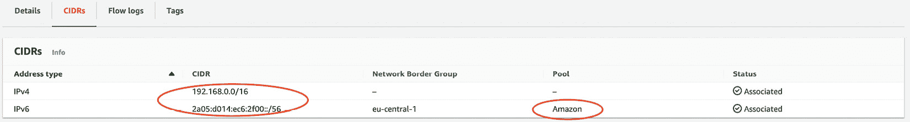
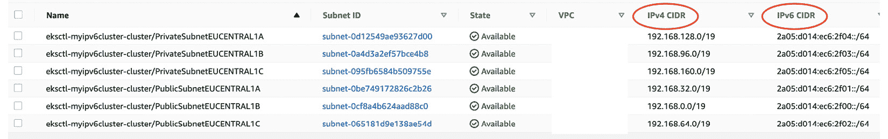
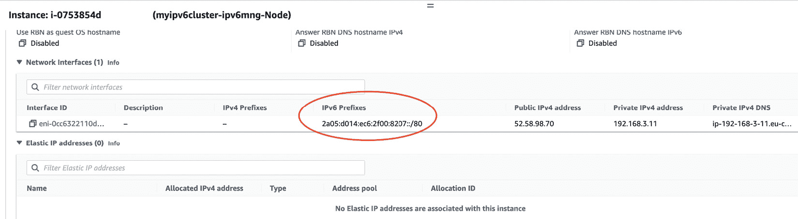
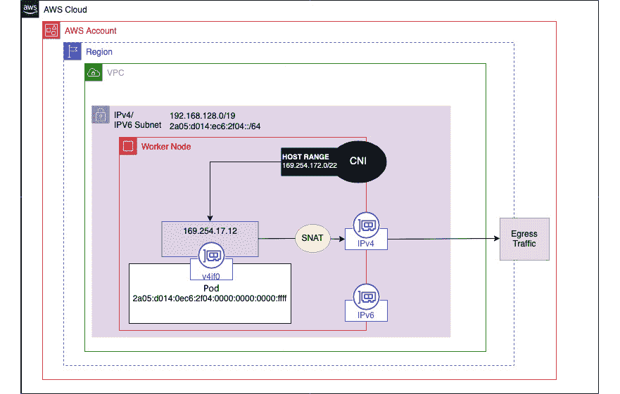
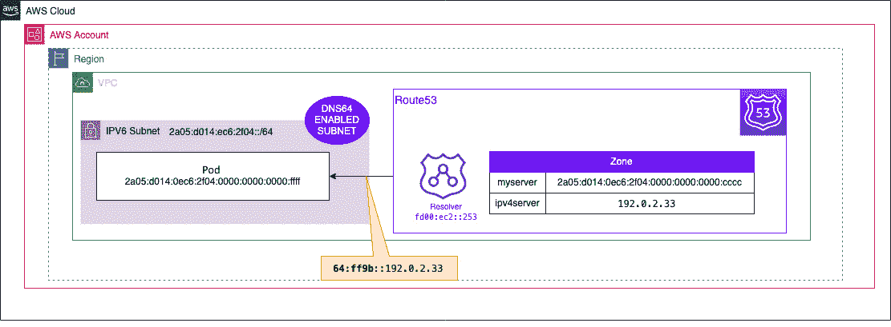
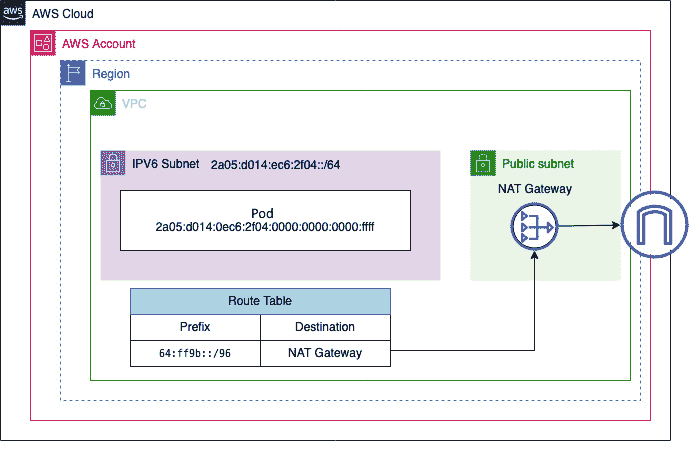
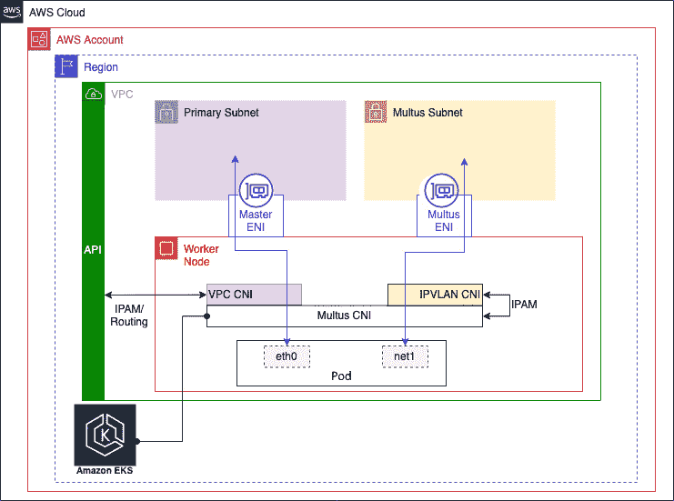
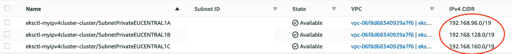
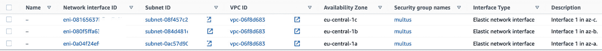

# 第九章：与 EKS 的高级网络配置

在前几章中，我们回顾了标准的 AWS 和 EKS 网络配置（*第七章*）。然而，在某些情况下，你需要使用本章中将描述的一些更高级的网络功能。

本章将探讨一些使用案例，例如如何管理 Pod 地址耗尽问题，使用**互联网协议版本 6**（**IPv6**），以及如何使用网络策略强制实施第三层网络控制以管理 Pod 流量。我们还将讨论如何使用不同的**复杂网络信息系统**（**CNI**）在 EKS 中支持多个 Pod 网络接口，利用 Multus CNI，以及如何支持加密和网络加速的覆盖网络，如**数据平面开发工具包**（**DPDK**）或**扩展伯克利数据包过滤器**（**eBPF**）。这些都是复杂的主题，本章的目标是为集群管理员提供基础知识，以便他们能够评估是否需要配置这些解决方案以及它们对 EKS 部署的影响。

本章将具体涵盖以下内容：

+   在 EKS 集群中使用 IPv6

+   安装和使用 Calico 网络策略

+   选择和使用 EKS 中的不同 CNI

# 技术要求

你应该熟悉 YAML、基础网络知识以及 EKS 架构。在开始本章之前，请确保你已经具备以下条件：

+   连接到你的 EKS API 端点的网络连接

+   AWS CLI 和 `kubectl` 二进制文件已安装在你的工作站上

+   对 IPv6 地址分配和使用的基础理解

+   对**虚拟私有云**（**VPC**）网络以及如何创建网络对象，如**弹性网络接口**（**ENI**）等有较好的理解

# 在 EKS 集群中使用 IPv6

IPv6 相较于 IPv4 有一些明显的优势，即它提供了更大的地址空间（包括公共 IP 地址），通过移除**网络地址转换**（**NAT**）跳数来减少一些延迟，并且可以简化整体路由网络配置。它也有一些局限性（不仅限于 EKS，还包括其他 AWS 服务），因此在采用 IPv6 时需要小心。在生产环境中实施之前，请仔细查看 [`aws.amazon.com/vpc/ipv6/`](https://aws.amazon.com/vpc/ipv6/) 和 [`docs.aws.amazon.com/eks/latest/userguide/cni-ipv6.html`](https://docs.aws.amazon.com/eks/latest/userguide/cni-ipv6.html)。

目前无法在现有集群上启用 IPv6，因此我们需要做的第一件事是创建一个使用 IPv6 地址族的新集群，该集群至少运行 Kubernetes 1.21。我们将使用 `eksctl` 和以下配置文件 `myipv6cluster.yaml`：

```
---
apiVersion: eksctl.io/v1alpha5
kind: ClusterConfig
metadata:
  name: myipv6cluster
  region: "eu-central-1"
  version: "1.21"
kubernetesNetworkConfig:
  ipFamily: IPv6
addons:
  - name: vpc-cni
    version: latest
  - name: coredns
    version: latest
  - name: kube-proxy
    version: latest
iam:
  withOIDC: true
managedNodeGroups:
  - name: ipv6mng
    instanceType: t3.medium
```

然后，我们可以运行以下 `eksctl` 命令来创建和部署集群：

```
$ eksctl create cluster -f myipv6cluster.yaml
```

重要提示

这个过程可能需要 15 到 25 分钟才能完成。

由于我们没有指定现有的 VPC，`eksctl` 将为我们创建一个，并从 Amazon 池中分配额外的 IPv6 **无类域间路由** (**CIDR**) 范围（每个 VPC 需要一个 IPv4 CIDR 范围），如下所示：



图 9.1 – eksctl VPC

如果我们查看分配给此 VPC 的子网，我们可以看到 `eksctl` 创建了六个子网，其中三个是公共的，三个是私有的（每个 **可用区**（**AZ**）有两个子网）。它还从 VPC 分配的主范围中为 IPv4（必需）和 IPv6 分配了 CIDR 范围：



图 9.2 – eksctl IPv4/v6 子网

集群将与两个工作节点一起创建（默认情况下在公共子网上）。每个工作节点都有 IPv4 和 IPv6 地址，因为 VPC 需要 IPv4：

```
$ kubectl get nodes -o wide
```

输出类似于以下内容：

```
NAME  STATUS   ROLES    AGE   VERSION  INTERNAL-IP EXTERNAL-IP
ip-192-168-3-11.eu-central-1.compute.internal Ready <none>   27h   v1.21.12-eks-5308cf7   2a05:d014:ec6:2f00:4e36:b47b:c13f:cb1f   52.58.98.70
ip-192-168-90-100.eu-central-1.compute.internal   Ready    <none>   27h   v1.21.12-eks-5308cf7   2a05:d014:ec6:2f02:2d4c:d5df:4eb5:cb86   18.195.1.196
```

IPv6 前缀分配发生在每个工作节点启动时。每个工作节点的 ENI 被分配一个 `IPv6 /80` 前缀（`/80 => ~10¹⁴` 地址），这个前缀足够支持拥有数百万个 Pod 的大规模集群，尽管当前 Kubernetes 推荐每个主机不超过 110 个 Pod。

您可以通过查看 EC2 实例并点击网络选项卡来查看前缀分配。在以下示例中，已分配了 `2a05:d014:ec6:2f00:8207::/80` 前缀，且没有分配 IPv4 前缀：



图 9.3 – IPv6 前缀分配

一旦在集群级别启用了 IPv6，您将无法为您的 Pod 分配 IPv4 地址；只能分配 IPv6 地址，因为 EKS 当前不支持同时具有 IPv4 和 IPv6 地址的 Pod（就像它们对待工作节点一样）。然而，如果我们使用 `kubectl get pods` 命令列出 `kube-system` 命名空间中的系统 Pod，我们可以看到这些 Pod 被分配了 IPv6 地址：

```
$ kubectl get pods -n kube-system -o wide
NAME     READY   STATUS    RESTARTS   AGE   IP   …
aws-node-qvqpx  1/1     Running   0   15h   2a05:d014:ec6:2f00:4e36:b47b:c13f:cc1f
aws-node-wkr9g  1/1     Running   1   15h   2a05:d014:ec6:2f02:2d4c:d5df:4eb5:c686
coredns-745979c988-7qqmr 1/1 Running   0   15h   2a05:d014:ec6:2f00:8207::
coredns-745979c988-hzxx8 1/1 Running   0   15h   2a05:d014:ec6:2f00:8207::1
kube-proxy-2rh47        1/1 Running   0   15h   2a05:d014:ec6:2f02:2d4c:d5df:4eb5:c686
kube-proxy-vwzp9     1/1 Running   0   15h   2a05:d014:ec6:2f00:4e36:b47b:c13f:cc1f
```

我们可以使用 *第四章* 中的部署 `.yaml` 文件，*在 EKS 上运行您的第一个应用程序*，来部署一个简单的 Web 应用。如果我们查看生成的 Pod，我们可以看到它们也有一个 IPv6 地址。以下是一个示例输出：

```
NAME    READY   STATUS    RESTARTS   AGE
simple-web-99b67d675-4t68q   1/1     Running   0          11s   2a05:d014:ec6:2f00:8207::2
simple-web-99b67d675-vl6hk   1/1     Running   0          11s   2a05:d014:ec6:2f02:b49c::
```

我们已经了解了如何创建具有 IPv6 地址族的集群，以及如何部署 Pod。然而，Pod 在 VPC 内外如何与 IPv6 通信存在一些基本的差异。接下来的部分将更详细地描述这些网络场景，重点介绍流量如何路由。

重要说明

安全组配置至少需要*允许*流量。因此，我们将在下一节仅讨论 VPC 路由表的配置。

## Pod 到外部 IPv6 地址

IPv6 地址非常大，具有全球唯一性，因此不会执行 NAT。运行在公共子网中并分配了来自子网前缀的 IP 地址的任何 Pod，将能够直接通过**互联网网关**（**IGW**）路由到互联网，而无需地址转换。这也意味着它们可以从互联网访问（访问由安全组控制）。如果子网是私有的，则可以使用**仅出站 IGW**（**EIGW**）提供对外部 IPv6 地址的访问，但不允许任何直接的入站 IPv6 流量（与常规 IGW 不同）。

## VPC 路由

由于任何 IPv6 Pod 总是使用其 IPv6 地址作为源 IP 地址，因此可以使用标准 Kubernetes 服务发现和路由机制以及 VPC 路由表来访问另一个 Pod。任何 VPC 内部的 IPv6 流量都不会进行源 NAT（与默认的 IPv4 不同），因此目标 Pod 总是能够看到源 Pod 的*真实 VPC* IPv6 地址。

由于 Pod 仅具有 IPv6 栈，因此只能与其他运行 IPv6 栈并在 VPC 路由表中有条目的元素进行通信。这包括以下内容：

+   其他具有 IPv6 地址的 Pod

+   一个具有 IPv6 地址（单栈或双栈）的 EC2 主机

+   支持 IPv6 端点的 AWS 服务（参考[`docs.aws.amazon.com/general/latest/gr/aws-ipv6-support.html`](https://docs.aws.amazon.com/general/latest/gr/aws-ipv6-support.html)）

要与 IPv4 端点通信，需要一个转换服务；可以通过多种方式实现：

+   使用主机本地 CNI 插件

+   使用 NAT64（AWS NAT 网关）

+   使用 DNS64（AWS Route 53）

接下来，我们将详细回顾这些选项。

### 使用主机本地 CNI 插件

这种方法至今仍在使用，即扩展 VPC CNI 以支持一个内部 IPv4 地址范围`169.254.172.0/22`，该范围分配给每个工作节点，并用于在每个 Pod 中创建一个辅助 IPv4 接口。这个配置包含在我们创建的 IPv6 集群中，可以通过 SSH 进入工作节点并以*root*身份运行`cat /etc/cni/net.d/10-aws.conflist`命令查看。

由于 IPv4 `169.254.172.0/22`范围在 VPC 中不可见，并且被每个工作节点重用，因此所有 IPv4 出站流量都会被**源 NAT**（**SNAT**）到分配给工作节点的 IPv4 ENI；否则，会发生 IP 地址冲突。下图展示了这一解决方案：



图 9.4 – 主机本地解决方案

为了查看这个是如何工作的，我们可以创建一个新的容器，并使用以下命令进入它：

```
$ kubectl run -i --tty busybox --image=busybox --restart=Never -- sh
```

进入容器 shell 后，可以使用`iptables`和`netstat`命令查看容器中的辅助接口和路由表。输出的内容类似于这里显示的块：

```
$ ifconfig
eth0
Link encap:Ethernet  HWaddr AA:1D:5F:F0:B6:C7
inet6 addr: 2a05:d014:ec6:2f02:b49c::2/128 Scope:Global
……
v4if0
Link encap:Ethernet  HWaddr 5A:FE:0E:46:EC:D9
inet addr:169.254.172.4  Bcast:169.254.175.255  Mask:255.255.252.0
$ netstat -rn
Kernel IP routing table
Destination     Gateway         Genmask         … Iface
0.0.0.0         169.254.172.1   0.0.0.0         … v4if0
169.254.172.0   169.254.172.1   255.255.252.0   … v4if0
169.254.172.1   0.0.0.0         255.255.255.255 … v4if0
```

这意味着当一个 Pod 尝试与 IPv4 地址通信时，它将使用 `v4if0` 接口，该接口会进行 SNAT 操作，将流量转换到宿主机的 IPv4 ENI。接下来我们将看看 AWS 在 2021 年宣布的一些增强功能，这些功能能够简化配置并消除宿主机 SNAT 的需求。

### 使用 DNS64 与 AWS Route 53

每个 VPC 都有内置于子网中的 DNS 解析器（通常位于子网 CIDR 的第二个 IP 地址）。通常它会解析 IPv4 DNS 请求，但现在你可以在子网中添加 DNS64，它会应用于该子网内的所有 AWS 资源。

使用 DNS64 时，AWS Route 53 解析器会根据客户端请求查找 DNS 条目，并根据响应执行以下两种操作之一：

+   如果 DNS 响应包含 IPv6 地址，解析器会将 IPV6 地址返回给客户端，然后客户端将直接使用 IPv6 地址建立 IPv6 网络会话。

+   如果响应中没有 IPv6 地址，只有 IPv4 地址，则解析器会通过在记录中的 IPv4 地址上添加常见的 `/96` 前缀（在 `RFC6052` 中定义，`64:ff9b::/96`），将其转换为支持与 NAT64 一起工作的格式（接下来会描述）。

这个图示说明了这一点：



图 9.5 – VPC 上的 DNS64

让我们来看看如何使用常见的 `64:ff9b::/96` 前缀与 IPv4 端点进行通信。

### 使用 NAT64 与 NATGW

在 *第七章*，*EKS 中的网络*，我们讨论了如何使用 **NAT 网关**（**NATGW**）来允许私有子网的出站网络访问。它通过将私有地址（IPv4）映射到分配给 NATGW 的公共 IP 地址来实现这一点。

NAT64 在任何现有或新的 NATGW 上都会自动启用。一旦你为子网启用了 DNS64，并为 `64:ff9b::/96` 前缀添加了一条路由到 NATGW，接下来会发生以下步骤：

1.  如前所述，如果没有匹配的 IPv6 记录，VPC 的 DNS 解析器会返回 IPv4 地址和 `RFC6052` 前缀，客户端会使用此信息建立 IPv6 会话。VPC 路由表会将流量发送到 NAT64 网关，后者通过将 IPv6（Pod）地址替换为 NATGW 的 IPv4 地址来将 IPv6 包转换为 IPv4。

1.  NAT64 网关通过与其子网关联的路由表将 IPv4 数据包转发到目标。

1.  IPv4 目标会将 IPv4 响应包返回给 NATGW。NATGW 会将响应的 IPv4 包转换回 IPv6，通过将其 IP（目标 IPv4）替换为 Pod 的 IPv6 地址，并在源 IPv4 地址前加上 `64:ff9b::/96` 前缀。然后，数据包将按照路由表中的本地路由声明流向 Pod：



图 9.6 – VPC 上的 NAT64

重要说明

如果您不打算在接下来的部分中使用 IPv6 集群，别忘了使用`eksctl delete cluster myipv6cluster`命令删除它。

现在让我们看看如何通过网络策略控制集群内部的流量。

# 安装并使用 Calico 网络策略

默认情况下，集群中所有命名空间的所有 Pod 可以相互通信。这可能是可取的，但在许多情况下，您可能希望采取*最小权限*的网络访问方式。幸运的是，Kubernetes 提供了网络策略来限制 Pod 之间的访问（东西向通信）。网络策略操作在 OSI 模型的第 3 层和第 4 层，因此相当于传统的本地防火墙或 AWS 安全组。更多详情请参见[`kubernetes.io/docs/concepts/services-networking/network-policies/`](https://kubernetes.io/docs/concepts/services-networking/network-policies/)。

EKS 的 VPC CNI 不支持网络策略，因此需要网络插件或不同的 CNI。在本节中，我们使用`eksctl`与以下配置文件`myipv4cluster.yaml`：

```
---
apiVersion: eksctl.io/v1alpha5
kind: ClusterConfig
metadata:
  name: myipv4cluster
  region: "eu-central-1"
  version: "1.19"
kubernetesNetworkConfig:
  ipFamily: IPv4
addons:
  - name: vpc-cni
    version: latest
  - name: coredns
    version: latest
  - name: kube-proxy
    version: latest
iam:
  withOIDC: true
managedNodeGroups:
  - name: ipv4mng
    instanceType: t3.medium
```

重要提示

我们注意到在与 IPv6 集群和较新的 Tigera Operator 兼容性方面遇到了一些挑战，因此在使用这两者时需要小心。

然后，我们可以运行以下`eksctl`命令来创建并部署集群：

```
$ eksctl create cluster -f myipv4cluster.yaml
```

一旦集群激活，如果需要，将集群添加到本地管理员机器中：

```
$ aws eks update-kubeconfig --name myipv4cluster
```

接着使用以下命令将`calico-operator`添加到集群中：

```
$ kubectl apply -f https://raw.githubusercontent.com/aws/amazon-vpc-cni-k8s/master/config/master/calico-operator.yaml
```

然后，我们可以使用`kubectl`配置 Calico 插件，部署`calico-install.yaml`配置文件：

```
apiVersion: operator.tigera.io/v1
kind: Installation
metadata:
  name: default
  annotations:
    "helm.sh/hook": post-install
spec:
  cni:
    type: AmazonVPC
```

我们可以使用以下命令验证插件是否已安装：

```
$ kubectl get tigerastatus/calico
NAME     AVAILABLE   PROGRESSING   DEGRADED   SINCE
calico   True        False         False      11m
```

我们已经具备了支持网络策略的所有先决条件，接下来让我们使用`simple-deployments.yaml`清单部署两个简单的部署。文件的这一部分将创建两个命名空间：

```
---
apiVersion: v1
kind: Namespace
metadata:
  name: deploy1
---
apiVersion: v1
kind: Namespace
metadata:
  name: deploy2
```

以下代码部分将在`deploy1`命名空间中创建部署`deploy1`：

```
---
apiVersion: apps/v1
kind: Deployment
metadata:
  name: deploy1
  namespace: deploy1
spec:
  replicas: 1
  selector:
    matchLabels:
      app: deploy1
  template:
    metadata:
      labels:
        app: deploy1
    spec:
      containers:
        - name: busybox
          image: busybox
          imagePullPolicy: IfNotPresent
          command: ['sh', '-c', 'echo Running ; sleep 3600']
```

接下来的代码部分将在`deploy2`命名空间中创建第二个部署`deploy2`：

```
---
apiVersion: apps/v1
kind: Deployment
metadata:
  name: deploy2
  namespace: deploy2
spec:
  replicas: 1
  selector:
    matchLabels:
      app: deploy2
  template:
    metadata:
      labels:
        app: deploy2
    spec:
      containers:
        - name: busybox
          image: busybox
          imagePullPolicy: IfNotPresent
          command: ['sh', '-c', 'echo Running ; sleep 3600']
```

部署完成后，使用以下命令记下`deploy1`命名空间中 Pod 的 IP 地址（在本示例中为`192.168.42.16`）：

```
$ kubectl get po -o wide -n deploy1
NAME  READY   STATUS    RESTARTS   AGE   IP    …
deploy1-111  1/1  Running   0 69s   192.168.42.16 ….
```

现在，您可以使用以下命令进入`deploy2`命名空间中的 Pod：

```
$ kubectl exec --stdin --tty <pod-name> -n deploy2 -- sh
```

如果您在 Shell 中运行以下命令，它会成功执行（将 IP 地址替换为`deploy1`命名空间中 Pod 的 IP 地址）：

```
$ ping -c 5 192.168.42.16
PING 192.168.42.16 (192.168.42.16): 56 data bytes
64 bytes from 192.168.42.16: seq=0 ttl=254 time=0.110 ms
…..
```

一旦 ping 操作完成，我们可以部署`deny-all.yaml`网络策略，该策略会拒绝`deploy2`命名空间的所有出站流量（出口流量）：

```
---
apiVersion: networking.k8s.io/v1
kind: NetworkPolicy
metadata:
  name: default-deny-ingress
  namespace: deploy2
spec:
  podSelector:
    matchLabels: {}
  policyTypes:
  - Egress
```

如果您在`deploy2` Pod 命名空间中运行以下命令，由于网络策略的原因，它将*失败*：

```
$ ping -c 5 192.168.42.16
PING 192.168.42.16 (192.168.42.16): 56 data bytes
```

我们现在已经了解了如何通过 Calico 策略引擎扩展 EKS 以支持网络策略。接下来的部分，让我们看看如何进一步修改 CNI，甚至完全替换它。

# 在 EKS 中选择和使用不同的 CNI

我们已经看到 AWS CNI 如何与 VPC 集成，以提供**IP 地址管理**（**IPAM**）服务以及 Pod 网络接口的创建和管理。以下是你可能希望替换默认 AWS VPC CNI 的一些原因：

+   如果你想拥有多个 Pod 接口

+   如果你想使用覆盖网络进行加密

+   如果你想使用网络加速，比如 DPDK 或 eBPF

由于 EKS 控制面由 AWS 管理，目前支持的 CNI 数量有限；请参考[`docs.aws.amazon.com/eks/latest/userguide/alternate-cni-plugins.html`](https://docs.aws.amazon.com/eks/latest/userguide/alternate-cni-plugins.html)获取最新的插件列表。

你需要做出的最重要决定是是否可以像我们使用 Calico 时那样扩展现有的 VPC CNI，但继续使用 VPC CNI 来管理 IP 地址和 Pod 接口。这被称为 CNI 插件链式连接，其中一个主 CNI 通过附加功能得到增强。因此，如果我们查看 EC2 主机上`/etc/cni/net.d/10-aws.conflist`文件中的默认 CNI 配置文件，我们可以看到默认启用了三个插件：

```
{"cniVersion": "0.4.0",
  "name": "aws-cni",
  "disableCheck": true,
  "plugins": [
    {
      "name": "aws-cni",
      "type": "aws-cni",
…
pluginLogFile": "/var/log/aws-routed-eni/plugin.log",
…},
    {
      "name": "egress-v4-cni",
      "type": "egress-v4-cni",
      …},
    {
      "type": "portmap",
      "capabilities": {"portMappings": true},
      "snat": true }]
```

Kubernetes 在添加或删除 Pod 网络接口时会首先调用`aws-cni`插件，因为它在列表中的位置排在最前面。然后它会调用链中的下一个插件；在默认情况下，这是`egress-v4-cni`（即在*在 EKS 集群中使用 IPv6*部分讨论的 IPv4 主机本地分配器），将命令和传递给第一个 CNI 插件的参数加上最后一个插件的结果传递给它，依此类推，直到链完成。这允许通过 CNI 插件配置不同的功能，因此在 EKS 的默认情况下，第一个插件配置 Pod 接口并提供一个 VPC 可路由的 IP 地址。第二个插件用于执行 IPv6 到 IPv4 的转换或源 NAT。

让我们来看一下如何使用 Multus，这是支持的 EKS CNI 之一，它可以在不丧失 VPC 连接的情况下拥有多个 Pod 网络接口。在这种情况下，Multus 将充当一个*元插件*，并调用其他 CNI 来进行 Pod 网络配置。

这非常有用，因为我们不需要替换标准的 VPC-CNI，因此 IP 地址和路由由 AWS CNI 使用 VPC API 在 VPC 中设置。我们可以使用 Multus 创建第二个 Pod 接口，作为管理接口或用于交换心跳信息，如果 Pods 希望作为集群运行。

## 配置多个 Pod 网络接口

如下图所示，我们通常将其他 ENI 附加到工作节点，由 Multus 管理，而主（master）EC2 接口始终由 VPC CNI 管理：



图 9.7 – Multus CNI 与 EKS 的集成

我们应该做的第一件事是使用以下命令在我们为网络策略使用的集群上安装 Multus：

```
$ kubectl apply -f https://raw.githubusercontent.com/aws/amazon-vpc-cni-k8s/master/config/multus/v3.7.2-eksbuild.1/aws-k8s-multus.yaml
```

这将创建一个`kube-multus-ds` DaemonSet，运行在您的工作节点上，在此案例中为`2`个节点。可以使用以下命令查看：

```
$ kubectl get ds kube-multus-ds -n kube-system
NAME             DESIRED   CURRENT   READY   …
kube-multus-ds   2         2         2       …
```

如果我们查看主机的`/etc/cni/net.d/` CNI 配置目录，可以看到有一个新的`00-multus.conf`配置文件。Kubernetes 在启动时会首先使用这个文件，因为它的数值较小（`00`）。

更详细地查看新的 CNI 配置文件，我们可以看到 Multus 现在是主要的 CNI（由`type`关键字定义）。它还使用了`delegates`关键字调用其他 CNI；在此案例中，仅使用了 AWS VPC CNI，它的行为与之前相同，因为插件列表没有变化。以下输出显示了新配置文件的简略视图，除了最初的部分外，其他部分与默认的 AWS VPC CNI 相同：

```
{
      "cniVersion": "0.3.1",
      "name": "multus-cni-network",
      "type": "multus",
      "capabilities": {
           "portMappings": true},
…
      "delegates": [{
           "cniVersion": "0.4.0",
           "name": "aws-cni",
           "disableCheck": true,
            "plugins": [{
                "name": "aws-cni",
                "type": "aws-cni",
                 ….
           }, {
                "name": "egress-v4-cni",
                "type": "egress-v4-cni",
               …
           }, {
                "type": "portmap",
…
                 },
                 "snat": true }]}]}
```

如果您还记得，当我们使用`eksctl`创建集群时，它也创建了一个 VPC 和一些私有子网，接下来展示了这些子网的示例。我们将使用这些子网来托管 Multus 管理的 ENI：



图 9.8 – eksctl 创建的私有子网

在启用 Multus 后，我们需要进行一些网络*布线*，才能确保 Multus 正确工作。我们需要执行以下操作：

+   为 Multus 创建一些 ENI，给它们打上标签，以便 EKS 忽略它们

+   将它们附加到我们的工作节点，并整理 IP 地址分配和路由，以便 VPC 可以将流量路由到 Pod 的辅助接口。

### 创建 Multus ENIs

我们需要做的第一件事是在不同的私有子网中创建 ENI。下面展示的 CloudFormation 脚本提供了如何通过编程方式创建 ENI 的示例，但您也可以使用其他方法。您需要特别注意标签；我们明确声明了接口连接的集群和可用区（zone），并且接口不应由 EKS 控制平面管理。我们还创建了一个安全组，因为这是 ENI 的强制性参数：

```
AWSTemplateFormatVersion: "2010-09-09"
Resources:
   multusSec:
      Type: AWS::EC2::SecurityGroup
      Properties:
         GroupDescription: Multus security group
         GroupName: multus
         VpcId: <MYVPC>
```

在接下来的部分，我们将在第一个子网中创建第一个 ENI：

```
   private1:
      Type: AWS::EC2::NetworkInterface
      Properties:
         Description: Interface 1 in az-a.
         Tags:
          - Key: multus
            Value: true
          - Key: Zone
            Value: <AZ-a>
          - Key:  node.k8s.amazonaws.com/no_manage
            Value: true
          - Key: cluster
            Value: <myclustername>
         SourceDestCheck: 'false'
         GroupSet:
         - !Ref multusSec
         SubnetId: <private subnet ID>
```

在下一部分，我们将在第二个子网中创建第二个 ENI：

```
   private2:
      Type: AWS::EC2::NetworkInterface
      Properties:
         Description: Interface 1 in az-b.
         Tags:
          - Key: multus
            Value: true
          - Key: Zone
            Value: <AZ-b>
          - Key:  node.k8s.amazonaws.com/no_manage
            Value: true
          - Key: cluster
            Value: <myclustername>
         SourceDestCheck: 'false'
         GroupSet:
         - !Ref multusSec
         SubnetId: <private subnet ID>
```

在最后一部分，我们将在第三个子网中创建最后一个 ENI：

```
   private3:
      Type: AWS::EC2::NetworkInterface
      Properties:
         Description: Interface 1 in az-c.
         Tags:
          - Key: multus
            Value: true
          - Key: Zone
            Value: <AZ-c>
          - Key:  node.k8s.amazonaws.com/no_manage
            Value: true
          - Key: cluster
            Value: <myclustername>
         SourceDestCheck: 'false'
         GroupSet:
         - !Ref multusSec
         SubnetId: <private subnet ID>
```

成功部署此脚本后，应该会创建三个新的接口；示例如下：



图 9.9 – Multus 的新 ENIs

### 将 ENI 附加到工作节点并配置 VPC 路由

您现在需要将接口附加到 EC2 实例使用的工作节点上。您可以通过控制台选择工作节点，然后选择**操作** | **网络** | **附加网络接口**，或者您也可以自动附加它们（稍后会详细介绍）。

由于我们仅在 AZ 中创建了一个接口，因此你将只看到与该实例所在 AZ 对应的接口。这将会在你的工作节点上创建一个新的以太网接口，并从私有子网中分配一个地址。你可以通过连接到主机并运行以下命令来查看配置：

```
$ ifconfig -a
```

这将输出类似下面的块，其中我们可以看到第二个 ENI（本例中的 `eth1`），但根据已分配给工作节点的接口数量，接口号可能会有所不同：

```
eth0: flags=4163<UP,BROADCAST,RUNNING,MULTICAST>  mtu 9001
inet 192.168.27.63  netmask 255.255.224.0  broadcast 192.168.31.255
…..
eth1: flags=4098<BROADCAST,MULTICAST>  mtu 1500
ether 02:4f:d3:c2:fb:0e  txqueuelen 1000  (Ethernet)
……
lo: flags=73<UP,LOOPBACK,RUNNING>  mtu 65536
inet 127.0.0.1  netmask 255.0.0.0
….
```

由于接口名称在每个工作节点上可能不同，我们需要对其进行规范化，以便使用 `ip link` 命令重命名它们。再次提醒，这可以通过以下命令按主机进行操作：

```
$ sudo ip link set eth1 name multus
```

到目前为止，这看起来可能有点繁琐，但我们仍然需要解决一个主要问题，那就是如何将流量路由到这个辅助接口以及从它路由回去。Multus 使用 `NetworkAttachmentDefinition` 来定义辅助接口使用的网络：

```
apiVersion: "k8s.cni.cncf.io/v1"
kind: NetworkAttachmentDefinition
metadata:
  name: ipvlan-private-a
spec:
  config: '{
      "cniVersion": "0.3.0",
      "type": "ipvlan",
      "master": "multus",
      "mode": "l3",
      "ipam": {
        "type": "host-local",
        "subnet": "192.168.96.0/19",
        "rangeStart": "192.168.96.20",
        "rangeEnd": "192.168.96.40",
        "gateway": "192.168.96.1"
      }
    }'
```

`NetworkAttachmentDefinition` 在 Pod 或 Deployment 中被引用；下文给出了一个示例。Pod 将通过 Multus 附加一个第二个接口，IP 地址在 `NetworkAttachmentDefinition` 文件的 `config` 部分中定义的 `192.168.96.20` 和 `192.168.96.40` 之间。

重要提示

这里使用的范围只是将由 Multus 使用的子网 CIDR 的一个子集。

我们将使用 `nodeSelector` 标签，根据 `NetworkAttachmentDefinition` 中定义的 AZ 分配 IP 地址：

```
apiVersion: v1
kind: Pod
metadata:
  name: multus-pod
  annotations:
      k8s.v1.cni.cncf.io/networks: ipvlan-private-a
spec:
  nodeSelector:
    topology.kubernetes.io/zone: eu-central-1a
  containers:
        - name: busybox
          image: busybox
          imagePullPolicy: IfNotPresent
          command: ['sh', '-c', 'echo Container 1 is Running ; sleep 3600']
```

如果你运行以下命令，你可以看到 Pod 被托管在 `eu-central-1a` AZ 中的工作节点上：

```
$ kubectl get pod -o=custom-columns=NODE:.spec.nodeName,NAME:.metadata.name
```

如果我们使用以下命令进入 Pod，你可以看到该 Pod 有两个接口：

```
$ kubectl exec --stdin --tty multus-pod  -- sh
# ip addr
1: lo: <LOOPBACK,UP,LOWER_UP> mtu 65536 qdisc noqueue qlen 1000
    link/loopback 00:00:00:00:00:00 brd 00:00:00:00:00:00
    inet 127.0.0.1/8 scope host lo
3: eth0@if23: <BROADCAST,MULTICAST,UP,LOWER_UP,M-DOWN> mtu 9001 qdisc noqueue
    link/ether 96:f4:8f:ef:82:92 brd ff:ff:ff:ff:ff:ff
    inet 192.168.14.60/32 scope global eth0
4: net1@if15: <BROADCAST,MULTICAST,NOARP,UP,LOWER_UP,M-DOWN> mtu 1500 qdisc noqueue
    link/ether 02:4f:d3:c2:fb:0e brd ff:ff:ff:ff:ff:ff
    inet 192.168.96.20/19 brd 192.168.127.255 scope global net1
```

现在进入问题的核心！VPC 是一个第三层网络构造，一切都需要 IP 地址才能通信，而 VPC 维护着路由表中所有 IP 地址/范围的路由。VPC 还维护着 MAC 地址映射，以将 IP 地址映射到正确的 ENI，确保流量指向正确的接口。

这一切都能正常工作，因为 IP 地址是从 VPC 请求的。但在 Multus 的情况下，它是分配 IP 地址的，而且由于它创建的是基于 ipvlan 的接口，因此 MAC 地址实际上是分配给 Multus 接口的（在 `NetworkAttachmentDefinition` 中是 `eth2`）。所以，VPC 并不知道 IP 地址已被分配，或者需要将它们映射到哪个 ENI。你需要使用以下命令将分配给 Pod 的 IP 地址与 Multus ENI 关联起来：

```
$ aws ec2 assign-private-ip-addresses --network-interface-id <multus ENI-ID> --private-ip-addresses 192.168.96.30
```

你可以通过几种方式来自动化其中的一些操作：

+   AWS 管理的仓库，[`github.com/aws-samples/eks-automated-ipmgmt-multus-pods`](https://github.com/aws-samples/eks-automated-ipmgmt-multus-pods)，建议使用 `init` 容器或 sidecar 来调用 `AssignPrivateIpAddresses` EC2 API（或等效的 IPv6 API 调用）

+   Joe Alford 写了一篇很棒的博客，[`joealford.medium.com/deploying-multus-into-amazons-eks-42269146f421`](https://joealford.medium.com/deploying-multus-into-amazons-eks-42269146f421)，探讨了如何解决 AWS 脚本的一些不足之处，推荐阅读。

+   使用 AWS Lambda 和自动扩展事件等工具构建自己的解决方案，以创建、附加接口并配置可以用于部署的前缀

部署这些解决方案超出了本书的范围，但希望你能看到，VPC CNI 是在集群中实现原生 AWS 网络连接的最简单方式，无论是对于 IPv4 还是 IPv6。

如果你想做以下操作，仍然可能需要使用不同的 CNI：

+   使用基于 IPsec、VXLAN 或 IP 内的覆盖网络

+   支持增强型网络用例，如源 IP 地址保留、直接服务器返回和使用 eBPF 的低延迟网络

+   支持 Windows **主机网络** **服务** (**HNS**)

+   BGP 集成

使用另一种 CNI 的主要原因之一是 VPC 地址耗尽，这仍然是一个使用案例，但在*第七章*中讨论的前缀寻址，*在 EKS 中的网络*，解决了这个问题，只要你能将前缀分配给接口。如果你确实没有 VPC 地址，那么这仍然可能是使用另一种 CNI 的原因。

在这一部分，我们探讨了如何扩展和替换 VPC CNI。现在我们将回顾本章的关键学习点。

# 总结

我们首先描述了如何在新集群中配置 IPv6，以提供几乎无限的 IP 地址，并且不需要 NAT。我们还讨论了 IPv6 在通信方面的限制，以及如何使用主机本地插件、DNS64 和 NAT64 等技术来提供 IPv6 到 IPv4 的转换。

然后，我们探讨了如何使用 Calico 策略引擎通过提供 IPv4 L3/L4 网络策略（就像传统防火墙一样）来增强 EKS 的功能，这些策略可以用来限制 Pods 与外部 IP 地址之间的访问。

最后，我们探讨了 CNI 如何与插件和链式工作，并以 Multus 为例，展示了如何替换 AWS VPC CNI 及其带来的优势，但也可能增加的复杂性。我们还简要讨论了有一些有效的使用场景，需要使用不同的 CNI，但曾经是主要驱动因素的 VPC IP 耗尽问题，现在可以通过前缀地址来解决。

在下一章中，我们将查看升级集群的整体过程，并在之前章节讨论的一些概念基础上进行扩展。

# 进一步阅读

+   配置 Multus CNI: [`aws.amazon.com/blogs/containers/amazon-eks-now-supports-multus-cni/`](https://aws.amazon.com/blogs/containers/amazon-eks-now-supports-multus-cni/)

+   CNI 链接: [`karampok.me/posts/chained-plugins-cni/`](https://karampok.me/posts/chained-plugins-cni/)

+   AWS 上的 IPv6: [`aws.amazon.com/vpc/ipv6/`](https://aws.amazon.com/vpc/ipv6/)
