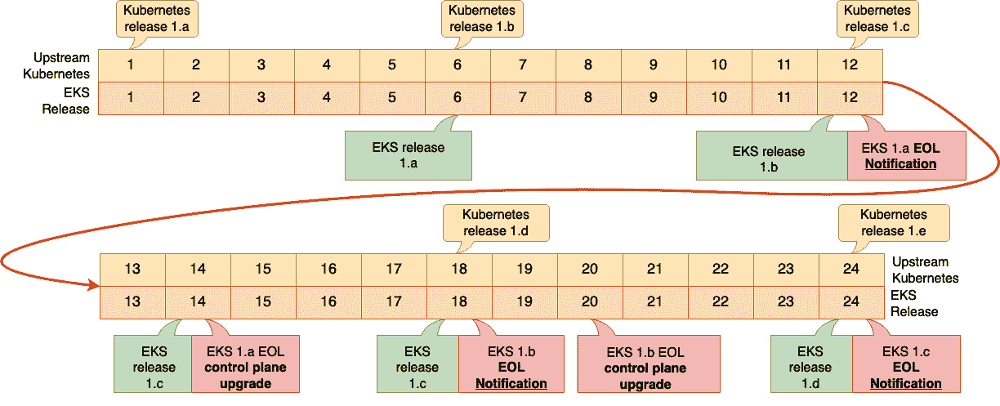
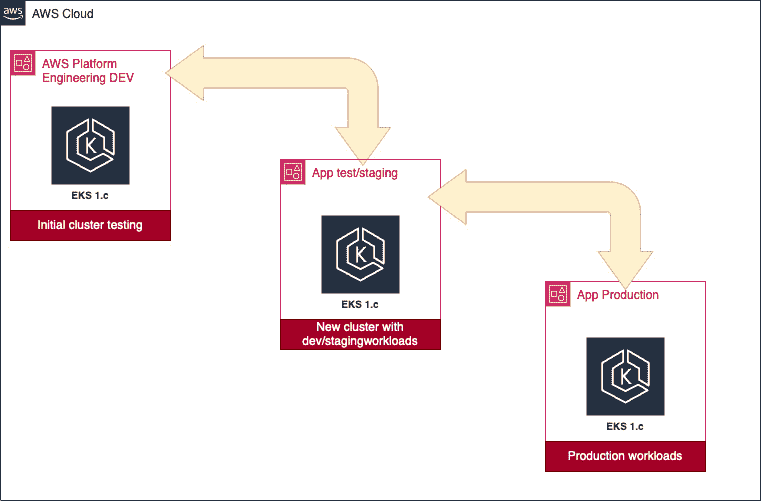
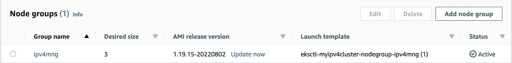
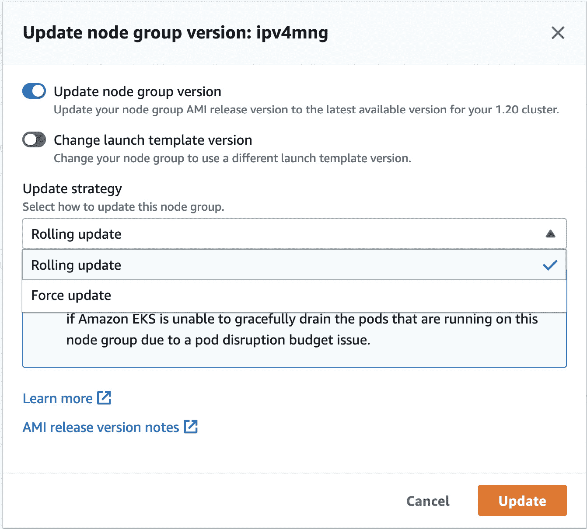
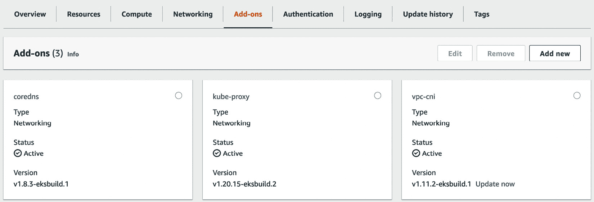
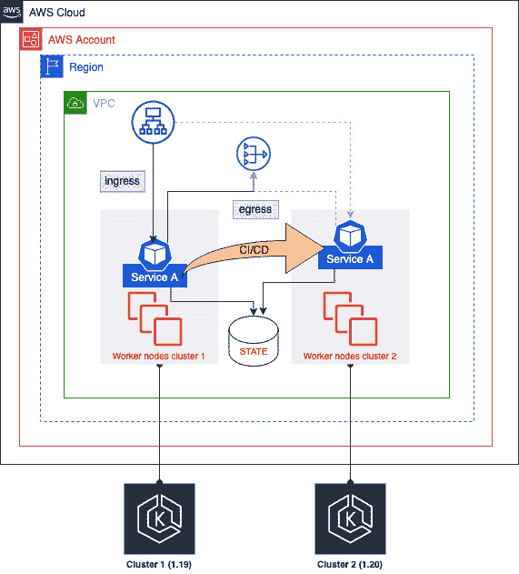

# 第十章：升级 EKS 集群

Kubernetes 社区每年大约发布三个新版本，并且会维护最近三个小版本的发布分支。此外，AWS 会在任何给定时刻维护至少四个生产就绪的 Kubernetes 版本；目前这些版本为 1.24、1.23、1.22 和 1.21。鉴于这两种不同的发布计划，您最终需要升级 EKS 集群，原因可能是您希望使用 Kubernetes 社区开发的新特性，或者因为 AWS 不再支持您正在使用的版本。好消息是，由于 EKS 是托管服务，AWS 会为您完成大部分升级工作！

本章将探讨最佳的操作方式以及它对正在运行的工作负载可能产生的影响。具体来说，我们将涵盖以下内容：

+   升级 EKS 的原因及重点关注领域

+   如何进行控制平面的就地升级

+   升级节点及其关键组件

+   创建新集群并迁移工作负载

# 技术要求

读者应对 YAML、基础网络和 EKS 架构有所了解。在开始本章之前，请确保您已具备以下内容：

+   需要与您的 EKS API 端点进行网络连接

+   您的工作站上已安装 AWS CLI 和 kubectl 二进制文件

+   对 VPC 网络和如何创建 ENI 等网络对象有较好的理解

# 升级 EKS 的原因及重点关注领域

EKS 是一个社区项目，因此它不断发展；目前大版本大约每年发布三次，并且通常包含至少一个重大变更。例如，2021 年 4 月发布的 1.21 版本废弃了 Pod 安全策略，转而支持外部准入控制。这意味着您最终需要利用更新的 Kubernetes 特性。此外，Kubernetes 社区仅支持最近的三个小版本（例如 1.25、1.24 和 1.23），较旧版本通常会得到 1 年的补丁更新，之后您就需要自行处理了！

亚马逊会从上游 Kubernetes 版本发布中获取代码，进行测试并与 AWS 平台及组件（如 AWS VPC CNI 等）验证，然后将其打包并发布为 EKS 版本。这个过程大约需要 6 个月，通常支持 14 个月。以下图示说明了这一过程：



图 10.1 – 示例 Kubernetes 发布计划

12 个月后，AWS 会通过控制台和 AWS 健康仪表板通知客户，某个版本即将达到 **生命周期结束**（**EOL**）日期——有时也称为 **支持结束**（**EOS**）日期，并且在 EOS 日期后的 14 个月内，AWS 将通过渐进式部署过程自动将控制平面升级到最早支持的版本。

作为集群拥有者，你可以在 EOS 日期之前随时选择升级控制平面，但你始终需要负责升级工作节点、插件以及任何核心组件，如`kube-proxy`。

升级时有一些关键领域需要考虑，因为你不能回滚版本。如果想回滚，必须重新部署一个先前版本的集群。关键考虑因素如下：

+   Kubernetes API 或关键功能是否已弃用，可能需要更改部署清单或进行 Kubernetes 组件升级，例如替换 kubelet？

+   插件、第三方 DaemonSets 等是否需要升级以支持新版本？

+   是否有需要设计的新功能，例如使用**Open Policy Agent**（**OPA**）来替代 Pod 策略？

+   是否有需要应用的安全补丁？

总体来说，除非工作负载与 Kubernetes 控制平面*相关*或交互，否则对运行中的工作负载几乎没有影响，但在修改生产环境之前，始终值得先阅读发布说明并在较低环境中进行升级。

现在我们已经讨论了*为什么*需要升级，让我们来讨论*如何*进行集群升级。

# 如何进行控制平面的就地升级

如果你什么都不做，AWS 最终会升级你的控制平面，但如前所述，这可能会影响其他组件。因此，采取主动的升级方法是最好的。升级控制平面实际上是一个*单击*操作，AWS 将逐步升级 API 和 etcd 服务器。在大多数情况下，这样做是可以的，但正如前一部分所讨论的，它可能会导致*服务*中断。

因此，推荐采用结构化方法。在以下示例中，负责`eksctl`配置文件的团队，或者可能是更详细的插件开发团队，如 Argo CD、Flux 等。在以下图示中，这由平台工程团队负责，但在较小的公司中，这可能是 DevOps 或**站点可靠性工程**（**SRE**）团队或应用开发团队的责任：



图 10.2 – 结构化升级方法

一旦主 IaC 模板创建完成，开发团队可以利用该模板在较低环境（测试/预生产）中测试工作负载，最终在生产环境中使用。

假设你已经使用`eksctl`创建了集群，你可以通过一个简单的一行命令来升级控制平面。如果我们使用前一章中的 IPv4 集群，可以使用以下命令进行升级：

```
$ eksctl upgrade cluster myipv4cluster --version=1.20 --approve
```

重要提示

如果你省略了`--approve`关键字，`eksctl`将不会做任何更改。还值得注意的是，通常你不能直接从 1.19 这样的次要版本跳跃到 1.22，必须先升级到 1.20，然后是 1.21！

该过程可能需要最多 20 分钟，因此值得规划一个变更窗口，因为在升级过程中，Kubernetes API 访问可能会间歇性中断（现有工作负载不应受到影响）。一旦控制平面升级完成，您应升级工作节点以匹配集群版本，然后再进行下一个版本的升级（`eksctl` 强制要求此步骤）。接下来我们来看看如何执行这个升级。

# 升级节点及其关键组件

简化升级过程是使用托管节点组的关键原因之一。如果我们想手动升级活动集群中的单个工作节点，我们需要执行以下操作：

1.  如果我们希望在升级过程中保持整体集群容量（能够运行活动 Pods 的工作节点总数），可以添加一台新工作节点来运行那些将从旧版 Kubernetes 代理（kubelet 等）运行的节点中逐出的 Pods。

1.  从我们正在处理的节点中排出 Pods，并将它们从调度过程中移除，以确保不会分配新的 Pods。

1.  升级操作系统二进制文件并应用必要的补丁。

1.  更新和配置 Kubernetes 代理（kubelet 等）。

1.  一旦升级后的节点注册并准备就绪，将其重新添加到调度程序中。

1.  更新任何关键组件，如`kube-proxy`、`coreDNS`等。

如果我们的节点组包含 10 个或 20 个节点，您将会看到这会变得非常麻烦。

现在我们来看看，在集群控制平面升级后，我们如何升级工作节点。

## 升级托管节点组

升级集群后，如果查看该集群的托管节点组，您将看到**立即更新**链接。可以使用此链接，利用*第八章*中描述的自动扩展启动模板过程自动升级节点组，*EKS 中的工作节点管理*。下面显示了示例：



图 10.3 – 节点组更新

使用该链接将自动替换节点组中的所有 EC2 工作节点；您将看到一个弹出窗口（下面会显示示例），提供更多选项：



图 10.4 – 节点组更新策略

前面显示的升级节点对话框允许您执行以下操作：

+   通过设置**更新节点组** **版本**切换，用最新的 AMI 替换节点。

+   使用**更改启动模板** **版本**切换，替换当前的自动扩展启动模板为另一个模板。

+   使用**滚动更新**策略（默认）从运行节点中排空 Pods。此策略会遵循定义的任何 Pod 中断预算，因此如果 Pods 无法平滑排空，更新将失败。另一种选择是**强制更新**策略，它将按滚动更新尝试排空 Pods，但如果失败，将简单地终止节点而不是使更新失败。

点击 `eksctl`：

```
$ eksctl upgrade nodegroup   --name=ipv4mng   --cluster=myipv 4cluster  --kubernetes-version=1.20
```

你可以使用以下命令查看替换的状态。在以下示例中，可以看到较旧的 1.19 AMI 已设置为 `SchedulingDisabled`：

```
$ kubectl get nodes --watch
NAME       STATUS       ROLES    AGE   VERSION
ipx.eu-central-1.compute.internal   Ready                      <none>   15m   v1.20.15-eks-ba74326
ip-192-168-40-12.eu-central-1.compute.internal    Ready,SchedulingDisabled   <none>   26d   v1.19.15-eks-9c63c4
ipy.eu-central-1.compute.internal    Ready                      <none>   15m   v1.20.15-eks-ba74326
ipz.eu-central-1.compute.internal   Ready                      <none>   15m   v1.20.15-eks-ba74326
```

## 升级自管节点组

升级自管节点将取决于你如何进行升级（先排空 Pods、替换节点或就地升级），以及安装了哪些额外组件。

通常，节点组应视为不可变的；因此，作为自动伸缩组的一部分的非托管节点组，您可以更改 AMI 并使用新的启动模板来强制替换，但作为操作员，你将负责将节点从调度器中移除（`SchedulingDisabled`），排空 Pods，然后进行扩展和收缩（实际上，所有这些都是托管组为你完成的）。

更简单的方法可能是直接创建一个新的节点组，将 Pods 移动到新的节点组，并删除旧的节点组。

## 更新核心组件

节点组将拥有更新后的 kubelet 代理，但像 `kube-proxy`、`coreDNS` 和 `vpc-cni` 等关键组件通常需要升级才能与特定的 Kubernetes 版本配合使用。

如果你使用以下命令查看升级后的集群和节点组中当前版本的 `kube-proxy`，你会看到它仍然是之前集群的版本（`v1.19.16`）：

```
$ kubectl get daemonset kube-proxy --namespace kube-system -o=jsonpath='{$.spec.template.spec.containers[:1].image}'
1122334.dkr.ecr.eu-central-1.amazonaws.com/eks/kube-proxy:v1.19.16-eksbuild.2
```

我们可以使用 `eksctl` 或其他 IaC 工具进行升级。下一个示例展示了如何使用 `eksctl utils` 更新 `kube-proxy`：

```
$ eksctl utils update-kube-proxy --cluster=myipv4cluster –approve
2022-09-11 10:27:07 "kube-proxy" is now up-to-date
$ kubectl get daemonset kube-proxy --namespace kube-system -o=jsonpath='{$.spec.template.spec.containers[:1].image}'
1122334.dkr.ecr.eu-central-1.amazonaws.com/eks/kube-proxy:v1.20.15-eksbuild.2
```

为简化此过程，AWS 引入了 EKS 附加组件，允许更新如 `kube-proxy` 等操作软件或监控守护进程，例如**AWS Distro for** **OpenTelemetry** (**ADOT**)。

如果我们使用 AWS 控制台并点击 `vpc-cni` 附加组件来升级实现 CNI 的 `aws-node` DaemonSet：



图 10.5 – 集群附加组件

你也可以使用你选择的 IaC 工具以编程方式执行此操作。下一个示例展示了如何使用 `eksctl` 执行相同操作：

```
$ eksctl update addon --name vpc-cni --cluster myipv4cluster --version 1.11.3 --force
2022-09-11 10:47:40 []  Kubernetes version "1.20" in use by cluster "myipv4cluster"
2022-09-11 10:47:41 []  new version provided v1.11.3-eksbuild.1
2022-09-11 10:47:41 []  updating addon
2022-09-11 10:50:50 []  addon "vpc-cni" active
```

重要提示

使用 `--force` 会强制配置应用到集群。这些操作应该在低环境中进行测试，以确保在生产环境中执行时不会导致停机。

让我们看一下使用替代集群和/或节点组，在集群级别提供蓝绿部署方法。

# 创建新集群并迁移工作负载

如你所见，典型的升级通常涉及至少三个步骤：

1.  升级控制平面

1.  升级/替换工作节点，使用更新的 AMI 和 kubelet

1.  至少升级核心组件，`kube-proxy`，`coreDNS` 和 `vpc-cni`

在这种方法中，Pod 必须首先被排空，并重新分配到工作节点，因为它们将被替换。如果管理不当，这可能会导致中断。另一种选择是部署新集群，然后迁移工作负载；这种方法有时被称为蓝绿集群部署。

重要提示

这是成本效益最差的方法，因为你将需要为两个控制平面付费，但如果你希望尽量减少中断，这种方法可能适合。我们在本书中只会在高层次上讨论这种方法，因为最常见的方法是升级 EKS 控制平面，然后使用托管工作节点升级工作节点，这样可以大大降低成本和复杂性。

多集群解决方案提出了一些不同的挑战：如何迁移工作负载？集群上是否已应用任何手动更改？如何提供入口和出口连接性？如何管理状态？以下图示说明了这些挑战的解决方案：



图 10.6 – 多集群解决方案

现在，为了理解一些挑战，让我们看一下将工作负载迁移到两个集群之间的一个方法。

## 你如何迁移工作负载？

使用 kubectl 或 Helm 时，当前上下文定义了你将使用哪个集群。通过切换上下文，可以在任一集群上部署相同的清单。在 *图 10.6* 中，CI/CD 管道可以自动化在任一集群上部署服务。例如，**集群 1**（v1.19）正在运行 **Service A**；**集群 2** 可以使用 v1.20 创建，这可以触发在 **集群 2** 上部署 **Service A**。

## 你如何提供一致的入口和出口网络访问？

出口（Pod 发起外部连接）可以使用内部或外部的 `VPC NAT` 网关来隐藏两个集群的 Pod 的 IP 地址，避免 Pod IP 地址发生变化。

`TargetGroupBinding` 实例，它将复用为两个集群配置的现有 ALB 或 NLB 目标组，这些集群使用基础设施即代码（IaC）在 EKS 集群外配置。以下是一个示例，并引用了 `testapp` 服务，端口为 `80`：

```
apiVersion: elbv2.k8s.aws/v1beta1
kind: TargetGroupBinding
metadata:
  name: testappt
  namespace: mynamespace
spec:
  serviceRef:
    name: testapp
    port: 80
  targetGroupARN: arn:aws:elasticloadbalancing:eu-west-1:1122224:targetgroup/example/fc3409bc5e613beb
```

现在，让我们看看应用程序通常如何管理状态。

## 你如何管理状态？

你的应用程序可能需要在数据库或文件系统中维护状态。只要这些服务通过 AWS 服务（如 **关系型数据库服务** (**RDS**) 或 **弹性文件系统** (**EFS**)）配置在集群外部，它们就可以被任一集群引用。

在这些解决方案到位后，你可以轻松地在集群之间切换。通过先部署到新集群，并确保服务已注册到 ELB，你可以使过渡几乎无缝；然而，你将为这种配置支付更多费用。

在本节中，我们探讨了如何升级关键的 EKS 组件以及托管和非托管节点组所需的不同方法。现在我们将回顾本章的关键学习点。

# 总结

在本章中，我们探讨了为什么需要升级集群：要么是想使用新的 Kubernetes 特性，或者是修复一个 bug，或者是 AWS 正在弃用您使用的版本。我们确定了需要对每个集群执行三项操作：升级控制平面，升级工作节点，升级核心组件如 `kube-proxy` 和 `coreDNS`。

我们还讨论了控制平面升级相对简单，因为它是一个托管服务，但节点组和组件的升级可能更具挑战性。使用托管节点组和附加组件可以简化这一过程，但你也可以使用第二个集群，并在它们之间移动工作负载，升级非活动集群。这种方法——有时称为蓝绿集群部署——会增加成本和复杂性，因此不推荐使用，但它可以最小化因升级而导致的应用程序停机。

在下一章中，我们将探讨如何使用 AWS **弹性容器仓库**（**ECR**）作为应用和 Pods 的源。

# 进一步阅读

+   Pod 中断预算: [`kubernetes.io/docs/concepts/workloads/pods/disruptions/`](https://kubernetes.io/docs/concepts/workloads/pods/disruptions/)

)

+   托管节点组更新过程: [`docs.aws.amazon.com/eks/latest/userguide/managed-node-update-behavior.html`](https://docs.aws.amazon.com/eks/latest/userguide/managed-node-update-behavior.html)

+   AWS 负载均衡器控制器 TargetGroupBinding: [`kubernetes-sigs.github.io/aws-load-balancer-controller/v2.1/guide/targetgroupbinding/targetgroupbinding/`](https://kubernetes-sigs.github.io/aws-load-balancer-controller/v2.1/guide/targetgroupbinding/targetgroupbinding/)

)

+   EKS 附加组件: [`docs.aws.amazon.com/eks/latest/userguide/eks-add-ons.html`](https://docs.aws.amazon.com/eks/latest/userguide/eks-add-ons.html)

)

+   Kubernetes 升级: [`kubernetes.io/docs/tasks/administer-cluster/cluster-upgrade/`](https://kubernetes.io/docs/tasks/administer-cluster/cluster-upgrade/)

# 第三部分：在 EKS 上部署应用

本部分将涵盖与帮助您在 EKS 上部署应用相关的功能。本节包括如何将容器镜像存储在 Amazon ECR 上的完整指南，如何通过 AWS 存储服务（如 EBS 和 EFS）为应用提供持久卷，如何定义 Pod 安全性并通过 IAM 授予权限，以及如何暴露和负载均衡您的 Kubernetes 应用。在接下来的两章中，我们将探讨更高级的主题，例如如何使用 AWS Fargate，以及如何使用 App Mesh 来控制和监控我们的部署。

本节包含以下章节：

+   *第十一章*，*构建应用并将其推送到 Amazon ECR*

+   *第十二章*，*使用 Amazon 存储部署 Pods*

+   *第十三章*，*使用 IAM 授予应用程序访问权限*

+   *第十四章*，*在 EKS 上为应用程序设置负载均衡*

+   *第十五章*，*与 AWS Fargate 一起工作*

+   *第十六章*，*与服务网格一起工作*
