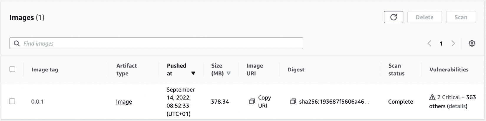
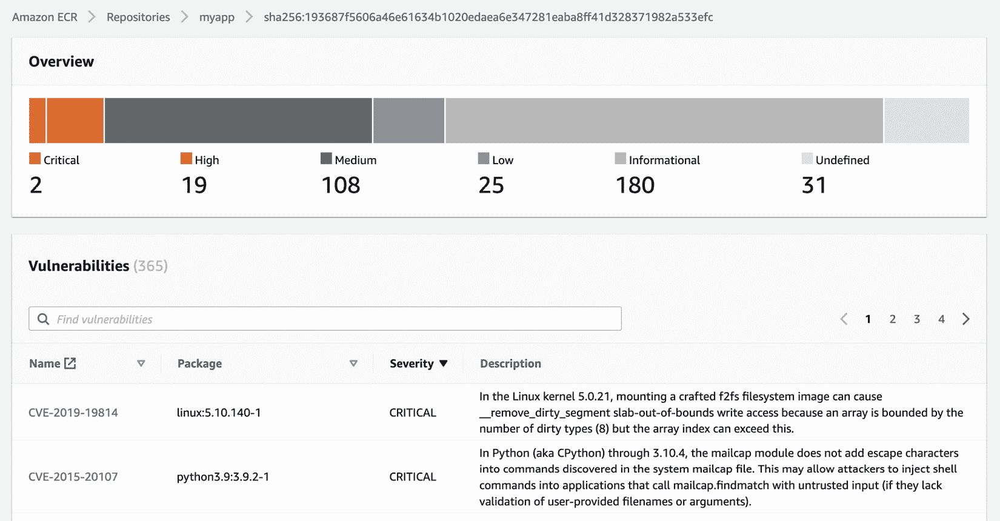
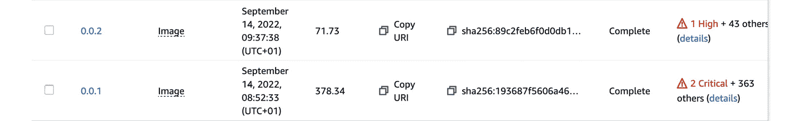
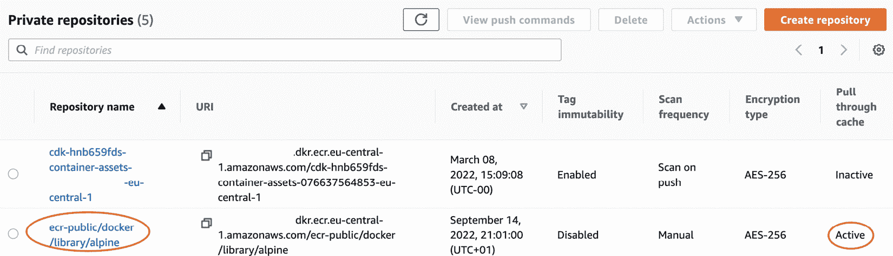
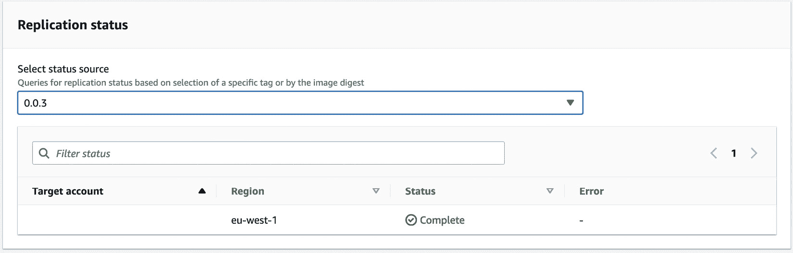

# 第十一章：构建应用并将其推送到 Amazon ECR

一个 Kubernetes Pod 至少由一个容器组成。这些容器存储在公共或私有仓库中，并在工作节点接收到 Pod 规范并需要部署容器时被拉取。本章将介绍如何使用 AWS **弹性容器注册表**（**ECR**）安全地存储容器镜像，使用多个仓库，并允许 EKS 在部署 Pod 时使用这些镜像。

具体来说，我们将讨论以下主题：

+   介绍 Amazon ECR

+   理解仓库认证

+   构建并将容器镜像推送到 ECR

+   使用高级 ECR 功能

+   在 EKS 集群中使用 ECR 镜像

# 技术要求

读者应该对 YAML、基础网络以及 EKS 架构有一定了解。在开始本章之前，请确保以下几点：

+   你能够访问 EKS 集群 API 端点

+   你的工作站上已安装 AWS CLI、Docker 和 kubectl 二进制文件

+   你对 Docker 和 Dockerfile 有基本了解

# 介绍 Amazon ECR

在 *第一章* 中，我们讨论了容器的一般结构以及它如何使用联合文件系统来创建分层镜像。这个镜像格式已成为 **开放容器倡议**（**OCI**）镜像规范，Podman 或 BuildKit 等各种开源构建工具都支持这一格式。

当你使用 `docker build` 命令构建镜像时，镜像会在本地创建，这对于本地机器来说是可以的，但当你需要在 EKS 或其他 Kubernetes 分发版/服务中使用该镜像时，你需要将其推送到一个仓库，以便其他系统能够访问，进而组成你的 EKS 集群。

如果你浏览 [Docker Hub](https://hub.docker.com/) 并登录，你可以看到多个容器镜像，比如 Postgres、Redis、Python 等。每个镜像都会有一个版本标签，如 13.8，以及可能的最新标签，这通常（但不总是）表示容器镜像的最新版本。Docker Hub 是一个公共仓库，意味着可以从互联网上访问。它们被认为是公共仓库，任何拥有 Docker Hub ID 的人都可以访问。

ECR 托管多个仓库，这些仓库又托管多个版本的容器镜像（以及其他符合 OCI 标准的工件），就像 Docker Hub 一样，但访问控制通过 IAM 和仓库控制来管理，这些控制由你掌握，通常用于托管包含私有代码或配置的容器。

理解 ECR 最简单的方法是创建一个仓库。下面的示例展示了一个简单的 Terraform 配置，它将在当前 AWS 账户/区域中创建一个名为 `myapp` 的私有仓库：

```
resource "aws_ecr_repository" "myapp" {
  name                 = "myapp"
  image_tag_mutability = "MUTABLE"
  image_scanning_configuration {
    scan_on_push = true }}
output "repo-url" {
  value = aws_ecr_repository.myapp.repository_url}
```

ECR 配置中的两个关键属性是`image_tag_mutability`（允许使用现有标签的镜像上传，替换原有镜像）和`scan_on_push`，后者会在上传（推送）镜像后扫描该镜像的基本漏洞。

Terraform 代码将输出新创建的存储库 URL（例如，`1122334.dkr.ecr.eu-central-1.amazonaws.com/myapp`），我们稍后将使用该 URL 将本地镜像推送到 ECR。

ECR 的收费依据是存储在注册表中的镜像大小以及任何离开 AWS 的数据传输费用。例如，假设你存储了总共 60GB 的软件镜像，你将按每 GB $0.10 的价格收费，总计每月$6，但数据传入不收费。任何在同一地区的 EKS 集群拉取这些镜像时，不会收取数据传出费用。因此，总费用为每月$6。

实际上，您的费用可能会更低，因为在第一个年度对于私有存储库有免费层折扣，并且还包括一些免费的存储和传输出限额。有关更多信息，请参阅[`aws.amazon.com/ecr/pricing/`](https://aws.amazon.com/ecr/pricing/)。

让我们看看 ECR 如何提供对存储库的安全访问。

# 理解存储库认证

正如我们所讨论的，ECR 存储库可以是私有的或公共的，您用来访问这些存储库的安全凭证将根据您创建的存储库类型而有所不同。

## 访问 ECR 私有存储库

对私有存储库的访问通过 AWS IAM 和存储库权限进行控制。如果您使用原生 AWS API，则可以使用 API 客户端（如 AWS CLI 或 Python 的`boto3`库）使用的标准签名版本 4 签名过程。

在本章中，我们将使用 Docker 命令与 ECR 存储库进行交互，因此我们需要将 AWS 的访问密钥和私密密钥转换为 Docker 能够理解的格式。这是通过`aws ecr get-login-password`命令实现的，并将输出传递给`docker login`命令。以下是一个示例：

```
$ aws ecr get-login-password --region eu-central-1 | docker login --username AWS --password-stdin 1122334.dkr.ecr.eu-central-1.amazonaws.com/myapp
WARNING! Your password will be stored unencrypted in /home/ec2-user/.docker/config.json.
……
Login Succeeded
```

重要说明

请注意，凭证的有效期为 12 小时，过后需要重新运行`docker login`命令。

这意味着，像`docker pull`或`docker push`这样的 Docker 命令将带有一个认证令牌，允许它们与 ECR 进行交互。为了使用`aws ecr get-login-password`命令，所用的用户账户必须具有适当的 IAM 权限。

以下 IAM 策略是 EKS 工作节点用于访问和拉取镜像的默认策略，以及获取授权令牌（`GetAuthorizationToken`是`get-login-password`命令调用的底层 API）。

```
{ "Version": "2012-10-17",
    "Statement": [
        {
            "Effect": "Allow",
            "Action": [
                "ecr:BatchCheckLayerAvailability",
                "ecr:BatchGetImage",
                "ecr:GetDownloadUrlForLayer",
                "ecr:GetAuthorizationToken"
            ],
            "Resource": "*"}]}
```

除了 IAM 权限，每个注册表还可以应用单独的策略。通常，如前所示的 IAM 角色用于授予对 ECR 服务的广泛访问权限，而仓库策略则用于限制对特定仓库的访问。例如，以下 Terraform 资源会添加一个策略，允许账户`22334455`将镜像推送到我们的仓库：

```
resource "aws_ecr_repository_policy" "apppolicy" {
  repository = aws_ecr_repository.myapp.name
  policy = <<EOF
{
    "Version": "2012-10-17",
    "Statement": [
        {
            "Sid": "AllowCrossAccountPush",
            "Effect": "Allow",
            "Principal": {
                "AWS": "arn:aws:iam::22334455:root"
            },
            "Action": [
                "ecr:BatchCheckLayerAvailability",
                "ecr:CompleteLayerUpload",
                "ecr:InitiateLayerUpload",
                "ecr:PutImage",
                "ecr:UploadLayerPart"
            ]}]}
EOF
}
```

重要提示

还有一些可以应用的注册表级权限，这些权限用于限制访问复制和拉取缓存功能，后续章节会详细讨论这些内容。

另外，请注意`aws_ecr_repository.myapp.name`引用的是之前创建的仓库，如果你以不同的方式结构化你的 Terraform 仓库或代码，这个引用需要修改。

最后一条提示——私有和公共 ECR 仓库之间没有实际区别，它们的管理和计费方式相同。关键的区别在于，公共仓库允许匿名用户从中拉取镜像，并且在 Amazon ECR 公共画廊中可见。这意味着任何人都可以拉取镜像，而且由于仓库的费用基于数据传输，因此，*匿名用户拉取你的镜像将会增加你的* *整体账单*！

我们将仅为 EKS 使用私有 ECR 仓库，因此如果你需要进一步了解公共仓库，请参考[`docs.aws.amazon.com/AmazonECR/latest/public/what-is-ecr.html`](https://docs.aws.amazon.com/AmazonECR/latest/public/what-is-ecr.html)。

现在我们已经理解了如何通过认证访问私有仓库，接下来让我们看看如何构建并将镜像推送到我们的 ECR 仓库。

# 构建并推送容器镜像到 ECR

如果我们考虑一个使用 Python 和 FastAPI 的简单 API，如下所示，首先需要将其打包成一个本地的 Docker 镜像。然后我们可以在本地测试它是否正常工作，再将其推送到 ECR。我选择 Python 和 FastAPI 是因为它们非常简单，可以快速启动，但你也可以使用任何语言或框架来创建容器。

以下是`main.py`文件中的 Python 代码：

```
#!/usr/bin/env python3
'''simple API server that returns Hello World'''
from fastapi import FastAPI
app = FastAPI()
@app.get("/")
async def root():
    return {"message": "Hello World"}
```

我们还需要一个`requirements.txt`文件，里面包含以下条目：

```
nyio==3.6.1
click==8.1.3
fastapi==0.83.0
h11==0.13.0
httptools==0.5.0
idna==3.3
importlib-metadata==4.12.0
pydantic==1.10.2
python-dotenv==0.21.0
PyYAML==6.0
sniffio==1.3.0
starlette==0.19.1
typing-extensions==4.3.0
uvicorn==0.18.3
uvloop==0.16.0
watchfiles==0.17.0
websockets==10.3
zipp==3.8.1
```

我们将使用一个简单的 Dockerfile（如下所示），它使用非 root 用户创建一个镜像，通过`pip`（在此情况下为 FastAPI 和 Uvicorn）安装必要的库，然后使用 Docker 的`CMD`关键字启动服务器：

```
FROM python:3.9
RUN pip install --upgrade pip
RUN adduser worker
USER worker
WORKDIR /home/worker
ENV PATH="/home/worker/.local/bin:${PATH}"
COPY ./requirements.txt /home/worker/requirements.txt
RUN pip install --no-cache-dir --upgrade -r /home/worker/requirements.txt
COPY ./main.py /home/worker/main.py
CMD ["uvicorn", "main:app", "--host", "0.0.0.0", "--port", "8080", "--reload"]
```

然后，我们可以使用以下 Docker 命令来构建并运行容器：

```
$ docker build -t myapi:0.0.1 .
$ docker run -p 8080:8080 --rm myapi:0.0.1
……
INFO:     Uvicorn running on http://0.0.0.0:8080
INFO:     Application startup complete.
```

现在你可以通过`http://127.0.0.1:8080`发起 curl 请求获取回复，或者通过`http://127.0.0.1:8080/docs`获取 API 定义。现在我们有了一个可运行的应用程序，可以使用以下命令登录、标记并将镜像推送到我们在上一节中创建的 ECR 仓库：

```
$ aws ecr get-login-password --region eu-central-1 | docker login --username AWS --password-stdin 1122334.dkr.ecr.eu-central-1.amazonaws.com/myapp
WARNING! Your password will be stored unencrypted in /home/ec2-user/.docker/config.json.
……
$ docker tag myapi:0.0.1 1122334.dkr.ecr.eu-central-1.amazonaws.com/myapp:0.0.1
$ docker images
REPOSITORY  TAG IMAGE ID       CREATED         SIZE
1122334.dkr.ecr.eu-central-1.amazonaws.com/myapp   0.0.1        c163cea7a037   9 hours ago     1.01GB
$ docker push 1122334.dkr.ecr.eu-central-1.amazonaws.com/myapp   :0.0.1
The push refers to repository [1122334.dkr.ecr.eu-central-1.amazonaws.com/myapp]
e6aadc5ffa3e: Pushed
……
54b354c15c5a: Pushed
0.0.1: digest: sha256:193687f5606a46e61634b1020edaea6e347281ea ba8ff41d328371982a533efc size: 3264
```

如果我们现在进入 AWS 控制台，我们将能够查看我们仓库中的镜像。由于我们启用了`scan_on_push`，我们还可以查看基本扫描检测到的任何漏洞。此扫描使用开源 Clair 项目来执行扫描：



图 11.1 – ECR 中初始镜像详情

如果我们点击右下角的**详情**链接，我们将看到问题的更详细视图，并附有指向**常见漏洞和暴露**（**CVE**）编号的链接。接下来的示例引用了我镜像中发现的两个严重问题：



图 11.2 – 初始镜像扫描输出

在我所工作的多数公司中，所有**严重**问题都需要在镜像被认为是*安全*之前修复。这可能是开发人员、DevOps 或平台工程师的责任，但实际上，确保镜像尽可能安全是每个人的责任。镜像修复可能是一个耗时的过程，但有一些简单的操作可以帮助你做到这一点！

通过简单地将 Dockerfile 中的基础镜像从`python:3.9`更改为`python:3.10-slim-bullseye`，并将其标记为版本 0.0.2，我已经去除了所有严重漏洞，减少了整体漏洞数，*并*将镜像的大小减少了近四分之一，这将显著提高下载速度并节省成本。如下所示：



图 11.3 – 改进的容器安全态势和大小

所以，我们已经将镜像上传到 ECR，**严重**漏洞已被修复，镜像大小也得到了优化。接下来，在演示如何在 EKS 中使用该镜像之前，让我们先看看 ECR 的一些更高级功能。

# 使用高级 ECR 功能

ECR 具有两个在管理大型 EKS 环境时非常有用的高级功能：**拉取缓存**，允许私有仓库缓存公共镜像，以及**跨区域复制**，将镜像复制到另一区域以供使用。让我们一起来探索这两个选项。

## 拉取缓存解释

拉取缓存允许私有仓库缓存来自公共 ECR 仓库或来自 Quay 的镜像（请注意，目前 Docker Hub 不被支持）。我们将在这个示例中使用公共 ECR 仓库，这样我们就可以在不向公共互联网开放工作节点的情况下提供公共镜像。

让我们使用以下 Terraform 代码在 ECR 中配置一个规则；请注意，它是在注册表级别配置的，而不是在仓库级别：

```
resource "aws_ecr_pull_through_cache_rule" "example" {
  ecr_repository_prefix = "ecr-public"
  upstream_registry_url = "public.ecr.aws"
}
```

一旦部署完成，我们可以登录并使用 `ecr-public` 前缀来拉取镜像。以下示例拉取最新的 Alpine 镜像：

```
$ aws ecr get-login-password --region eu-central-1 | docker login --username AWS --password-stdin 1122334.dkr.ecr.eu-central-1.amazonaws.com/ecr-public
WARNING! Your password will be stored unencrypted in /home/ec2-user/.docker/config.json.
……
$ docker pull  1122334.dkr.ecr.eu-central-1.amazonaws.com/ecr-public/docker/library/alpine:latest
latest: Pulling from ecr-public/docker/library/alpine
Digest: sha256:bc41182d7ef5ffc53a40b044e725193bc10142a1243f395 ee852a8d9730fc2ad
Status: Downloaded newer image for 1122334.dkr.ecr.eu-central-1.amazonaws.com/ecr-public/docker/library/alpine:latest
1122334.dkr.ecr.eu-central-1.amazonaws.com/ecr-public/docker/library/alpine:latest
```

一个相应的私有仓库现在已创建（见下图），并启用了拉取缓存：



图 11.4 – 启用拉取缓存的仓库

现在我们了解了如何在单一区域内使用仓库，让我们来看看如何在不同的 AWS 区域之间工作。

## 跨区域复制

你可能希望出于 **灾难恢复**（**DR**）原因或全球覆盖的需求，在多个区域部署你的应用程序。你可以使用跨区域复制，将一个、多个或所有镜像从一个区域复制到另一个区域，或者多个区域。你可以在同一账户内操作，也可以跨不同账户进行操作，但请记住，如果你想从一个账户复制到另一个账户，你需要设置跨账户角色。

查看下图所示的 Terraform 配置，我们可以看到它由两部分组成。第一部分是一个 `destination` 规则，指定哪个区域和账户将作为复制的目标。请注意，您可以拥有多个目标规则。第二部分是可选的，指定一个 `filter` 规则，用于选择要复制的仓库。

在下图示例中，我们将使用 `myapp` 前缀。如果未使用此前缀，则所有镜像都会被复制：

```
data "aws_caller_identity" "current" {}
resource "aws_ecr_replication_configuration" "euwest1" {
  replication_configuration {
    rule {
      destination {
        region      = "eu-west-1"
        registry_id = data.aws_caller_identity.current.account_id
      }
      repository_filter {
        filter      = "myapp"
        filter_type = "PREFIX_MATCH"
      }
    }
  }
}
```

由于只有在配置了复制之后推送到仓库的内容才会被复制，现在我们需要推送一个新的标签，以便查看镜像是否成功复制到 `eu-west-1`。

如果你遵循 *构建并推送容器镜像到 ECR* 部分中的命令，你可以为 `myapp` 仓库创建一个新镜像并将其推送到 ECR。

你将看到它被复制到该区域。如果你使用 AWS 控制台并进入相关的 `repo/tag`，你可以查看复制状态。在下图示例中，`myapp:0.0.3` 已成功复制到 `eu-west-1`：



图 11.5 – 新镜像标签的复制状态

到此为止，我们已经探讨了 ECR 的功能和特性。让我们来看最后一部分，看看如何在 EKS 中使用 ECR 镜像。

# 在你的 EKS 集群中使用 ECR 镜像

EKS 工作节点可以从 ECR 拉取镜像，因为它们应该已应用 `AmazonEC2ContainerRegistryReadOnly` 管理角色。

因此，唯一需要做的就是在你的 Kubernetes 清单或 Helm 图表中指定完整的 `<aws_account_id>.dkr.ecr.aws_region.amazonaws.com/<image-name>:<tag>` ECR 路径。

基于 *第四章*，*在 EKS 上运行你的第一个应用程序*，我们创建一个使用 `myapp` 容器的部署，并且创建一个暴露该服务到集群外的 `NodePort` 服务。唯一的实际区别是在 Pod 规范中，我们引用了完全限定的镜像名称。下面是示例。第一部分定义了 Kubernetes 部署：

```
---
apiVersion: apps/v1
kind: Deployment
metadata:
  name: my-deployment
spec:
  selector:
    matchLabels:
      app: fastapi
  replicas: 1
  template:
    metadata:
      labels:
        app: fastapi
    spec:
      containers:
      - name: fastapi
        image: "1122334.dkr.ecr.eu-central-1.amazonaws.com/myapp:0.0.2"
```

现在，我们定义服务：

```
---
apiVersion: v1
kind: Service
metadata:
 name: fastapi-dev
spec:
 type: NodePort
 selector:
   app: fastapi
 ports:
 - nodePort: 32410
   protocol: TCP
   port: 8080
   targetPort: 8080
```

由于这是一个 `NodePort` 服务，我们可以通过运行以下命令获取 Pod 所在主机的 IP 地址：

```
$ kubectl get pod <podname> -o jsonpath={.status.hostIP}
```

然后，我们可以使用`curl http://<hostIP>:32410`，并将看到 FastAPI 响应信息。

重要提示

请确保正确配置路由和安全组规则，以允许您的客户端通过端口`32410`连接到工作节点的 IP 地址。

在本节中，我们已经讨论了如何托管私有镜像，并将其最小化修改后部署到 EKS。接下来，我们将回顾本章的关键学习点。

# 总结

在本章中，我们探讨了如何使用 ECR 存储、缓存和复制容器镜像。使用 ECR 会产生费用，这些费用包括您仓库中所有镜像的总大小以及外出流量费用，但通过使用 ECR 的推送扫描功能，我们可以识别并解决关键依赖问题，同时优化镜像大小，支持更好的安全性和更具成本效益的镜像。

ECR 还有更多高级功能，允许我们支持灾难恢复（DR）策略或使用跨区域复制部署跨多个区域的应用程序，还可以从 ECR 公共仓库或 Quay 缓存公共镜像。最后，我们探讨了如何配置 IAM 和仓库策略来控制对镜像的访问，并将这些镜像拉入 EKS。

在下一章中，我们将探讨如何使用 AWS 存储驱动程序为 Pod 提供有状态存储，以作为应用程序和 Pod 的数据源。

# 进一步阅读

+   AWS 签名 V4 签名过程的工作原理：[`docs.aws.amazon.com/general/latest/gr/signature-version-4.html`](https://docs.aws.amazon.com/general/latest/gr/signature-version-4.html)

+   使用 ECR 公共库：[`docs.aws.amazon.com/AmazonECR/latest/public/public-gallery.html`](https://docs.aws.amazon.com/AmazonECR/latest/public/public-gallery.html)

+   使用 Clair 扫描您的容器：[`github.com/quay/clair`](https://github.com/quay/clair)
