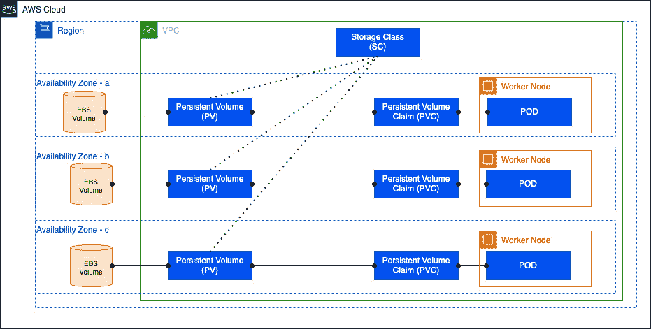
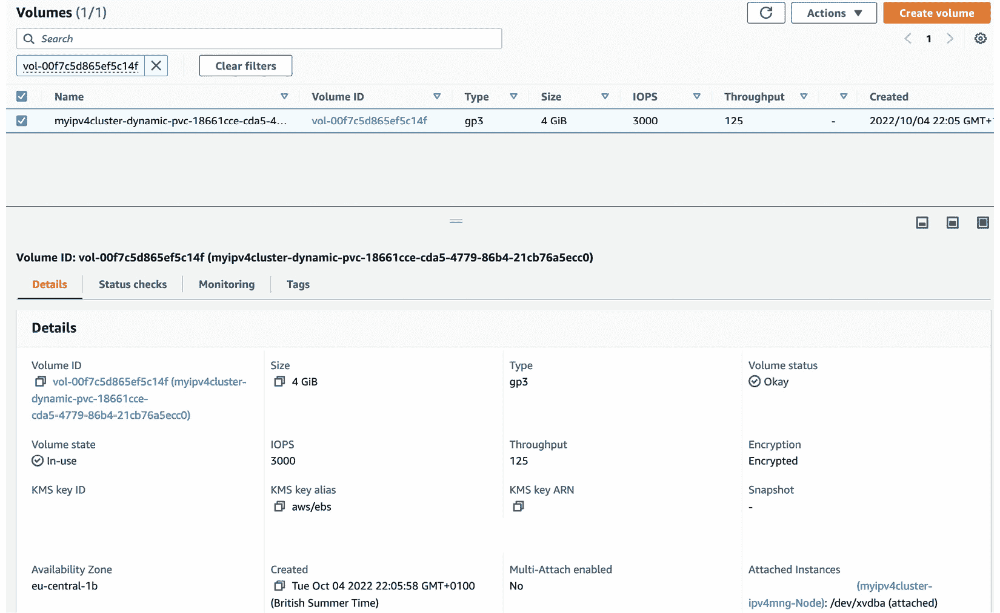
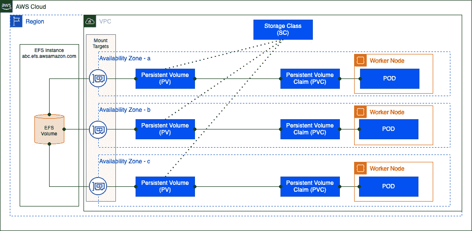

# 12

# 使用 Amazon 存储部署 Pods

在大多数分布式或云原生应用程序中，一个指导原则是尽量减少状态的保存，因此到目前为止，我们已经部署了无状态的 Pods，这意味着当它们被销毁和重新创建时，它们所包含的任何数据都会丢失。在某些情况下，您可能希望在 Pod 中的容器之间共享数据、在重启/重新部署/崩溃之间保持状态或内容，或者在 Pods 之间共享数据，这时您就需要某种形式的持久化存储。

本章将探讨如何使用**弹性块存储** (**EBS**)和**弹性文件系统** (**EFS**)在多个容器、Pods 或部署之间保持容器的状态或内容。具体来说，我们将涵盖以下关键主题：

+   了解 Kubernetes 卷、**容器存储接口** (**CSI**)驱动程序以及 AWS 上的存储

+   在您的集群中安装和配置 AWS CSI 驱动程序

+   在应用程序中使用 EBS 卷

+   在应用程序中使用 EFS 卷

# 技术要求

您应该熟悉 YAML、基本的网络知识和**弹性 Kubernetes 服务** (**EKS**)架构。在开始本章之前，请确保您已具备以下条件：

+   与 EKS 集群 API 端点的网络连接

+   您的工作站上安装了 AWS **命令行接口** (**CLI**)、Docker 和 kubectl 二进制文件

+   基本理解块存储和文件存储系统

# 了解 Kubernetes 卷、CSI 驱动程序以及 AWS 上的存储

Kubernetes 中的基本存储对象是**卷**，它表示一个目录（可能有数据，也可能没有数据），可以被 Pod 中的容器访问。您可以有临时卷，它们在容器重启时仍然存在，但与 Pod 的生命周期保持一致，并在 Pod 被销毁时被 Kubernetes 调度器销毁。持久卷则不会被 Kubernetes 销毁，它们与使用它们的 Pod 或 Pods 是独立存在的。

临时卷的最简单示例是`emptyDir`卷类型。下面是一个示例，它使用`mountPath`键将主机存储挂载到容器内部。由于两个容器使用相同的卷，它们即使挂载到不同的挂载点，也能看到相同的数据。当 Pod 死亡、崩溃或从节点中移除时，`emptyDir`卷中的数据会被删除并丢失：

```
apiVersion: v1
kind: Pod
metadata:
  name: empty-dir-example
spec:
  volumes:
  - name: shared-data
    emptyDir: {}
  containers:
  - name: nginx-container
    image: nginx
    volumeMounts:
    - name: shared-data
      mountPath: /usr/share/nginx/html
  - name: debian-container
    image: debian
    volumeMounts:
    - name: shared-data
      mountPath: /pod-data
    command: ["/bin/sh"]
    args: ["-c", "echo Hello from Debian > /pod-data/index.html"]
```

重要提示

在运行`echo`命令后，Pod 会崩溃，但这是预期的，所以请放心。

您还可以使用下面显示的`hostPath`类型创建一个持久化主机卷。在此示例中，创建一个卷并将其映射到主机的`/data`目录，该目录又通过`mountPath`键挂载到 nginx 容器中。这种配置与之前的`emptyDir`卷类型的主要区别在于，存储在卷中的任何数据都会在 Pod 被删除后仍保留在主机的`/data`目录中：

```
apiVersion: v1
kind: Pod
metadata:
  name: host-path-example
spec:
  containers:
  - image: nginx
    name: test
    volumeMounts:
    - mountPath: /usr/share/nginx/html
      name: shared-data
  volumes:
  - name: shared-data
    hostPath:
            path: /data
```

这些存储卷的主要挑战是它们是主机特定的，因此，如果主机出现任何问题，或者 Pod 被调度到另一台主机上，数据将丢失或无法访问。

Kubernetes 最初支持更多的存储卷类型，例如`awsElasticBlockStore`，它使用外部/非主机的 AWS 资源，并去除了一些限制。这些支持外部存储卷类型的插件被称为*in-tree*插件，因为它们是由 Kubernetes 社区开发的。然而，支持卷配置变更和不同存储卷类型所需的工作量变得过于繁重，因此在 Kubernetes 1.13 版本中，CSI 被广泛引入并可供使用。

CSI 规范作为一种方式，能够一致地暴露基于块和文件的存储，无论存储类型或供应商如何。CSI 允许 AWS（以及其他供应商）为其存储服务（即 EBS 和 EFS）开发和支持存储驱动程序。

让我们更深入地了解 AWS 上的这些存储系统。

## EBS

EBS 是基于块的存储，通常附加到单个**弹性计算云**（**EC2**）实例或单个**可用区**（**AZ**）中的 Pod 上。它有多种性能类型，从通用型（gp3 和 gp2）到高性能型（io1 和 io2），以及 SSD 和 HDD（磁性）类型。Amazon EBS 卷按**千兆字节月**（**GB-month**）计费，即计算帐户中配置的 EBS 存储的千兆字节数以及使用时长。

重要说明

虽然 EBS 现在支持将最多 16 个基于 Nitro 的 EC2 实例连接到同一个 AZ 中的单个 EBS 卷，但这是一个相对较新的配置选项。

## EFS

EFS 是基于 NFS（NFSv4.1 和 NFSv4.0）的文件存储，它允许多个 EC2 实例或 Pod 在多个 AZ 之间共享存储。EFS 提供的存储可以是区域性的（多 AZ）或仅跨单一 AZ，并支持标准存储和不常访问的数据模式。Amazon EFS 按每月使用的存储量计费，按 GB-月计量，还包括使用的存储类别以及存储在帐户中的使用时长。

选择 EBS 或 EFS 的标准因子有所不同，但通常，如果您需要一个可以跨多个 AZ 使用的共享存储解决方案，那么 EFS 是一个不错的选择。EBS 通常用于在单一 AZ 内提供高吞吐量的持久化卷。

让我们来看一下如何在集群中安装和配置 EBS 和 EFS 的不同 CSI 驱动程序。

# 在集群中安装和配置 AWS CSI 驱动程序

在本节中，我们将安装 EBS 和 EFS 驱动程序。两者的安装过程相似，详细步骤如下：

1.  创建一个**身份和访问管理**（**IAM**）策略，允许插件执行针对 EBS 或 EFS 的 AWS API 调用。

1.  创建并将 IAM 角色映射到 EKS 服务账户（详细讨论请参见*第一章*）。

1.  部署插件并配置它以使用在*第 2 步*中创建的服务帐户。

## 安装和配置 EBS CSI 驱动程序

驱动程序可以在[`github.com/kubernetes-sigs/aws-ebs-csi-driver`](https://github.com/kubernetes-sigs/aws-ebs-csi-driver)找到。让我们开始安装它吧！

1.  您可以从头开始创建 IAM 策略，或者使用`AmazonEBSCSIDriverPolicy` AWS 托管的策略。

1.  我们现在可以创建角色了。我们将使用`–role-only`命令行选项，这样就不会创建 EKS 服务帐户。使用以下`eksctl`命令，根据需要调整命令行参数：

    ```
    $ eksctl create iamserviceaccount  --name ebs-csi-controller-sa --namespace kube-system --cluster myipv4cluster   --override-existing-serviceaccounts --attach-policy-arn arn:aws:iam::aws:policy/service-role/AmazonEBSCSIDriverPolicy  --approve --role-name AmazonEKS_EBS_CSI_DriverRole --role-only
    ```

重要提示

在前面的示例中，我们使用了在*第九章*中创建的集群。如果您使用的是不同的集群，则需要更改`--cluster`参数，以反映您的集群名称。

1.  您可以使用以下`eksctl`命令为 EBS CSI 控制器创建一个附加组件，该命令将部署 CSI Pods，并创建访问 AWS API 所需的服务帐户，使用的是*第 2 步*中创建的角色：

    ```
    $ eksctl create addon --name aws-ebs-csi-driver --cluster myipv4cluster  --service-account-role-arn arn:aws:iam::11223344:role/AmazonEKS_EBS_CSI_DriverRole  --force
    2022-09-22 19:59:19 []  Kubernetes version "1.20" in use by cluster "myipv4cluster"
    ………
    2022-09-22 20:00:28 []  addon "aws-ebs-csi-driver" active
    ```

1.  您可以使用以下命令验证控制器和 DaemonSets 是否已部署：

    ```
    $ kubectl get pods -n kube-system | grep ebs
    ebs-csi-controller-2233-p75xg   6/6     Running   1
    ebs-csi-controller-3444-rb9zg   6/6     Running   0
    ebs-csi-node-94pgc              3/3     Running   0
    ebs-csi-node-mwdqc              3/3     Running   0
    ebs-csi-node-t9h77              3/3     Running   0
    $ kubectl logs deployment/ebs-csi-controller -n kube-system -c csi-provisioner
    ………
    I0922 19:59:53.169651       1 leaderelection.go:258] successfully acquired lease kube-system/ebs-csi-aws-com
    ………
    ```

在*使用 EBS 卷与您的应用程序*部分，我们将看到如何将 EBS 卷直接附加到 Pods，但在此之前，让我们先安装 EFS 驱动程序。

## 安装和配置 EFS CSI 驱动程序

驱动程序可以在[`github.com/kubernetes-sigs/aws-efs-csi-driver`](https://github.com/kubernetes-sigs/aws-efs-csi-driver)找到。让我们开始安装它吧！

1.  您可以从头开始创建 IAM 策略，或者使用此处找到的示例策略：[`raw.githubusercontent.com/kubernetes-sigs/aws-efs-csi-driver/master/docs/iam-policy-example.json`](https://raw.githubusercontent.com/kubernetes-sigs/aws-efs-csi-driver/master/docs/iam-policy-example.json)。可以使用以下命令下载并创建 IAM 策略：

    ```
    $ curl -o iam-policy-example.json https://raw.githubusercontent.com/kubernetes-sigs/aws-efs-csi-driver/master/docs/iam-policy-example.json
    $ aws iam create-policy --policy-name AmazonEKS_EFS_CSI_Driver_Policy --policy-document file://iam-policy-example.json
    ```

1.  我们现在可以使用以下`eksctl`命令创建角色及相关 EKS 服务帐户，并根据需要调整命令行参数（您需要指定在*第 1 步*中创建的策略的**Amazon 资源名称**（**ARN**），以及集群名称和区域）。最重要的是要验证新服务帐户是否有新 IAM 角色的注解：

    ```
    $ eksctl create iamserviceaccount  --cluster myipv4cluster     --namespace kube-system  --name efs-csi-controller-sa --attach-policy-arn arn:aws:iam::11223344:policy/AmazonEKS_EFS_CSI_Driver_Policy     --approve  --region eu-central-1
    2022-09-22 20:32:29 []  3 existing iamserviceaccount(s) (kube-system/ebs-csi-controller-sa,kube-system/eni-allocator,kube-system/multus) will be exclude
    ………
    022-09-22 20:32:59 []  created serviceaccount "kube-system/efs-csi-controller-sa"
    $ kubectl describe sa efs-csi-controller-sa -n kube-system
    Name:                efs-csi-controller-sa
    ……
    Annotations:         eks.amazonaws.com/role-arn: arn:aws:iam::076637564853:role/eksctl-myipv4cluster-addon-iamserviceaccount-Role1-P08589EN3NY7
    …..
    ```

1.  我们将使用 Helm 安装这个 EFS CSI 驱动程序，因为与 EBS 驱动程序不同，截至写作时，EFS 驱动程序不支持作为附加组件。以下命令将把 EFS 仓库添加到 Helm，并部署 Helm 图表，重用在*第 2 步*中创建的 EKS 服务帐户：

重要提示

`Image.repository`是区域特定的，相关仓库可以在[`docs.aws.amazon.com/eks/latest/userguide/add-ons-images.html`](https://docs.aws.amazon.com/eks/latest/userguide/add-ons-images.html)找到。

```
$ helm repo add aws-efs-csi-driver https://kubernetes-sigs.github.io/aws-efs-csi-driver/
$ helm repo update
$ helm search repo aws-efs-csi-driver
NAME CHART VERSION   APP VERSION     DESCRIPTION
aws-efs-csi-driver/aws-efs-csi-driver   2.2.7 1.4.0 A Helm chart for AWS EFS CSI Driver
$ helm upgrade -i aws-efs-csi-driver aws-efs-csi-driver/aws-efs-csi-driver --namespace kube-system --set image.repository=602401143452.dkr.ecr.eu-central-1.amazonaws.com/eks/aws-efs-csi-driver --set controller.serviceAccount.create=false --set controller.serviceAccount.name=efs-csi-controller-sa
$ kubectl get pod -n kube-system -l "app.kubernetes.io/name=aws-efs-csi-driver,app.kubernetes.io/instance=aws-efs-csi-driver"
NAME                 READY   STATUS    RESTARTS   AGE
efs-csi-controller-122-hrzfg          3/3     Running   0
efs-csi-controller-1234-q8wpt         3/3     Running   0
efs-csi-node-2g46k                    3/3     Running   0
efs-csi-node-59rsx                    3/3     Running   0
efs-csi-node-ncsk8                    3/3     Running   0
$ kubectl logs deployment/efs-csi-controller -n kube-system -c csi-provisioner
………
I0922 20:51:53.306805       1 leaderelection.go:253] successfully acquired lease kube-system/efs-csi-aws-com
……
```

重要提示

EFS 插件需要预先配置好的 EFS 集群可用；我们将在*使用 EFS 卷与您的应用*部分讨论如何创建该集群。

现在我们已经安装并运行了这两个驱动程序，我们可以查看它们如何被 Pod 使用来存储数据。

# 在应用程序中使用 EBS 卷

Kubernetes 有三种主要的`kinds`用于持久化存储。**PersistentVolume**（**PV**）代表实际的存储，在附加的存储系统中，在本例中是 EBS 卷。其他组件包括**StorageClass**（**SC**），它定义了存储的特性，以及**PersistentVolumeClaim**（**PVC**），它代表对存储的请求，该请求由根据 SC 的 PV 来满足。

PVC 存在的原因是不同的 Pod 可能需要不同类型的存储，例如，多个 Pod 共享的存储或仅专门为一个 Pod 提供的存储。PVC 提供了一种抽象，它位于开发人员或 DevOps 工程师为其应用所需的存储和集群管理员提供的存储类型之间。

下图说明了 EBS 卷、PV、PVC 和 Pod 之间的关系：



图 12.1 – EBS 卷

重要的是要知道，EBS 卷是特定于区域（Region）和可用区（AZ）的；你不能在不同的可用区之间移动 EBS 卷。相反，你需要创建一个快照，然后在新的可用区创建一个新卷。PV（EBS 卷）可以由 AWS 管理员静态创建，也可以在你消费 PVC 时动态创建，但它只能被与卷本身位于同一可用区的工作节点消费。

我们将重点介绍卷的动态创建方法，因为这是最简单的实现方式。最新的 EBS CSI 驱动程序会自动创建一个`gp2`存储类，可以使用以下命令查看它：

```
$ kubectl get storageclass
NAME  PROVISIONER  RECLAIMPOLICY   VOLUMEBINDINGMODE      ALLOWVOLUMEEXPANSION   AGE
gp2 (default)   kubernetes.io/aws-ebs   Delete          WaitForFirstConsumer   false                  50d
```

我们想要使用`gp3`，它是 AWS 上成本效益更高且性能更好的存储类型，因此让我们使用以下清单创建一个新的存储类，并通过`$ kubectl create -f` `SC-config.yaml`命令将其部署：

```
kind: StorageClass
apiVersion: storage.k8s.io/v1
metadata:
  name: gp3
provisioner: ebs.csi.aws.com # Amazon EBS CSI driver
parameters:
  type: gp3
  encrypted: 'true'
volumeBindingMode: WaitForFirstConsumer
reclaimPolicy: Delete
```

现在我们可以创建一个 PVC，利用新的存储类（SC）。由于我们使用的是动态配置，我们不需要创建 PV，因为它将在我们部署一个引用新 PVC 的 Pod 时自动创建。

以下清单将创建 PVC，并可以通过`$ kubectl create -f VC-config.yaml`命令进行部署。该清单包含我们将使用的存储类（在本例中为`gp3`）以及要创建的卷的大小（4 Gi）。我们没有在 PVC 中指定任何加密要求，但由于这在存储类中已设置，因此卷将被加密；如果我们希望允许开发人员选择未加密的卷，我们也可以创建一个不加密的`gp3`存储类：

```
apiVersion: v1
kind: PersistentVolumeClaim
metadata:
  name: ebs-claim
spec:
  accessModes:
    - ReadWriteOnce
  storageClassName: gp3
  resources:
    requests:
      storage: 4Gi
```

`accessModes`定义了卷的挂载方式，以下是这些方式；但是，EBS 仅支持`ReadWriteOnce`：

+   `ReadWriteOnce(RWO)`：此卷只能由单个节点以读写方式挂载。

+   `ReadOnlyMany(ROX)`：此卷可以被多个节点以只读方式挂载。

+   `ReadWriteMany(RWX)`：此卷可以被多个节点以读写方式挂载。

+   `ReadWriteOncePod(RWOP)`：此卷可以被单个 Pod 以读写方式挂载。

以下命令展示了 PVC 处于挂起状态（因为没有 Pod 对其进行声明），并且没有创建关联的 EBS 卷（PV），因为 PVC 仍处于挂起状态：

```
$ kubectl create -f ebs-pvc.yaml
persistentvolumeclaim/ebs-claim created
$ kubectl get pvc
NAME STATUS VOLUME CAPACITYACCESS MODES STORAGECLASS   AGE
ebs-claim   Pending          gp3            10s
$ kubectl get pv
No resources found
```

我们现在可以部署一个使用该 PVC 的 Pod，进而，利用 EBS CSI 驱动程序创建一个新的 EBS 卷（动态配置），并根据 Pod 规格中的 `mountPath` 将其挂载到 Pod 上。

重要说明

值得注意的是，由于需要先创建 EBS 卷，因此 Pod 部署时间会更长。如果需要更快的启动时间，则可以使用静态配置，在 Pod 部署前先创建 PV。

以下清单将创建 Pod，并引用之前创建的 PVC。可以使用 `$ kubectl create -f` `ebs-pod.yaml` 命令进行部署：

```
apiVersion: v1
kind: Pod
metadata:
  name: app
spec:
  containers:
  - name: app
    image: debian
    command: ["/bin/sh"]
    args: ["-c", "while true; do echo $(date -u) >> /data/out.txt; sleep 5; done"]
    volumeMounts:
    - name: persistent-storage
      mountPath: /data
  volumes:
  - name: persistent-storage
    persistentVolumeClaim:
      claimName: ebs-claim
```

我们使用以下命令来验证 Pod 的成功部署和 EBS 卷的创建。一旦 Pod 被创建，我们可以看到 PVC 现在处于 `Bound` 状态，并且一个新的 PV 也在 `Bound` 状态：

```
$ kubectl create -f ebs-pod.yaml
pod/app created
$ kubectl get pvc
NAME STATUS VOLUME CAPACITY ACCESS MODES STORAGECLASS AGE
ebs-claim   Bound    pvc-18661cce-cda5-4779-86b4-21cb76a5ecc0   4Gi        RWO            gp3            30m
$ kubectl get pv
NAME CAPACITY   ACCESS MODES   RECLAIM POLICY   STATUS   CLAIM
pvc-1 4Gi RWO Delete  Bound    default/ebs-claim   gp3     17s
```

如果我们详细查看 PV，可以看到通过查看 `VolumeHandle` 键来查看 AWS 中创建的卷 ID：

```
$ kubectl describe pv pvc-1
Name:              pvc-1
Labels:            <none>
…
StorageClass:      gp3
Status:            Bound
Claim:             default/ebs-claim
Reclaim Policy:    Delete
Access Modes:      RWO
VolumeMode:        Filesystem
Capacity:          4Gi
Node Affinity:
  Required Terms:
    Term 0: topology.ebs.csi.aws.com/zone in [eu-central-1b]
Message:
Source:
    Type:  CSI ( (CSI) volume source)
    Driver:            ebs.csi.aws.com
    FSType:            ext4
    VolumeHandle:      vol-00f7c5d865ef5c14f
    ReadOnly:          false
    …
```

当 PVC 被移除时，回收策略（默认为动态配置中 SC 定义的值）决定了发生什么。在前面的示例中，`回收策略` 是 `Delete`，这意味着 Kubernetes 资源（PV 和 PVC）将被删除，同时也会删除关联的 EBS 卷。如果你希望保留 EBS 卷，则应在 SC 中设置 `Retain` 值。

现在，进入 AWS 控制台并搜索卷 ID。下面的示例展示了卷、已配置的大小和类型，以及 **密钥管理服务**（**KMS**）的详细信息和吞吐量：



图 12.2 – AWS 控制台中的 EBS 卷

现在我们已经通过 EBS 设置了基于块的存储，让我们来看一下如何使用 EFS 实现多个 Pod 共享的基于文件系统的存储。

# 使用 EFS 卷与应用程序

EFS 是一个共享存储平台，不同于 EBS，因此在 Kubernetes 层面，虽然你有相同的对象，SC、PV 和 PVC，但存储的访问方式以及存储的创建方式是完全不同的。

下图展示了 EFS 实例/卷与 Kubernetes 的 PV、PVC 和 Pod 之间的关系：



图 12.3 – EFS 卷

尽管我们已经安装了 CSI 驱动程序，但没有 EFS 实例和在所需子网中的挂载目标，我们无法配置卷。接下来让我们看看如何创建它们。

## 创建 EFS 实例和挂载目标

你可以通过多种方式完成此操作，但我们将使用 AWS CLI。首先创建 EFS 文件系统并获取文件系统 ID。以下命令将创建 EFS 实例，并筛选响应仅返回`FileSystemId`。请根据你使用的区域调整`–region`参数：

```
$ aws efs create-file-system --region eu-central-1  --performance-mode generalPurpose --query 'FileSystemId' --output text
fs-078166286587fc22
```

下一步是确定我们希望用于挂载目标的子网。理想情况下，我们将挂载目标放置在与工作节点相同的子网中。以下命令将列出给定**虚拟私有云**（**VPC**）的所有子网（你需要提供正确的 VPC-ID），并列出托管节点组正在使用的子网和安全组：

```
$ aws ec2 describe-subnets  --filters "Name=vpc-id,Values=vpc-123" --query 'Subnets[*].{SubnetId: SubnetId,AvailabilityZone: AvailabilityZone,CidrBlock: CidrBlock}'  --output table
+------------------+--------------------+-----------------+
| AvailabilityZone |     CidrBlock      |   SubnetId         |
+------------------+--------------------+-----------------+
|  eu-central-1a   |  192.168.96.0/19   |  subnet-1  |
|  eu-central-1b   |  192.168.32.0/19   |  subnet-2  |
|  eu-central-1a   |  192.168.0.0/19    |  subnet-3  |
|  eu-central-1c   |  192.168.160.0/19  |  subnet-4  |
|  eu-central-1c   |  192.168.64.0/19   |  subnet-5  |
+------------------+--------------------+-----------------+
$ aws ec2 describe-instances --filters "Name=tag:aws:eks:cluster-name,Values=myipv4cluster"   --query "Reservations[*].Instances[*].{Instance:InstanceId,Subnet:SubnetId,PrivateIP:PrivateIpAddress}"  --output table
+---------------------+------------------+----------------+
|      Instance       |    PrivateIP     |          Subnet   |
+---------------------+------------------+-------- -------+
|  i-01437f1b219217d8a|  192.168.12.212  |  subnet-3  |
|  i-0f74d4d5b7e5dc146|  192.168.70.114  |  subnet-5  |
|  i-04c48cc4d2ac11ca6|  192.168.63.61   |  subnet-2  |
+---------------------+------------------+----------------+
```

从之前的输出中我们可以看到，我们应该在子网 3、5 和 2 中创建挂载点，因为这些子网中包含属于`myipv4cluster`的工作节点。

重要提示

这些子网也覆盖了三个 AZ，以确保高可用性。

我们现在可以使用下一个命令识别这些实例使用的安全组。在我们的例子中，所有实例都属于同一个安全组，因为它们属于同一个托管节点组。为了简便，我们将使用这个安全组作为 EFS 挂载目标，但你可能希望为 EFS 创建一个单独的安全组。然而，确保你使用的任何安全组都允许`TCP/2049`端口在 Pods 和 EFS 挂载目标之间通信：

```
$ aws ec2 describe-instances --filters "Name=tag:aws:eks:cluster-name,Values=myipv4cluster"    --query "Reservations[*].Instances[*].SecurityGroups[*]"  --output table
|GroupId  |                GroupName                 |
+-----------------------+--------------------------------+
|  sg-123 |  eks-cluster-sg-myipv4cluster-940370103  |
|  sg-123 |  eks-cluster-sg-myipv4cluster-940370103  |
|  sg-123 |  eks-cluster-sg-myipv4cluster-940370103  |
+-----------------------+---------------------------------+
```

我们现在可以使用以下命令创建并验证挂载点，每个子网/AZ 一个。验证挂载目标时，你将看到分配给**弹性网络接口**（**ENI**）的 IP 地址被放置在子网中，并将由 Pods 使用：

```
$ aws efs create-mount-target --file-system-id fs-078166286587fc22--security-groups sg-123 --subnet-id subnet-3
<repeat for remaining subnets>
$ aws efs describe-mount-targets --file-system-id fs-078166286587fc22 --query "MountTargets[*].{id:MountTargetId,az:AvailabilityZoneName,subnet:SubnetId,EFSIP:IpAddress}" --output
+----------------+----------------+-----------+-----------+
| EFSIP          |      az        |     id    | subnet     |
+----------------+----------------+-----------------------+
|  192.168.10.59 |  eu-central-1a |  fsmt-22  |  subnet-3  |
|  192.168.66.201|  eu-central-1c |  fsmt-33  |  subnet-4  |
|  192.168.34.140|  eu-central-1b |  fsmt-44  |  subnet-5  |
+----------------+----------------+-----------+-----------+
```

我们现在已经设置好 EFS 并将其提供给 Pods；接下来的步骤几乎与 EBS 相同，包括设置 Kubernetes 对象以使用 EFS。

## 创建你的 EFS 集群对象

我们需要创建 SC 和示例清单，如以下代码片段所示。你需要替换`fileSystemId`键，然后使用`$ kubectl create -f` `SC-config.yaml`命令进行部署：

```
kind: StorageClass
apiVersion: storage.k8s.io/v1
metadata:
  name: efs-sc
provisioner: efs.csi.aws.com
parameters:
  provisioningMode: efs-ap
  fileSystemId: fs-078166286587fc22
  directoryPerms: "700"
```

我们现在可以使用以下清单创建消耗 SC 的 PVC，然后使用`$ kubectl create -f pvc.yaml`命令进行部署。请注意，`accessMode`现在设置为`ReadWriteMany`，因为这是共享存储：

```
apiVersion: v1
kind: PersistentVolumeClaim
metadata:
  name: efs-claim
spec:
  accessModes:
    - ReadWriteMany
  storageClassName: efs-sc
  resources:
    requests:
      storage: 5Gi
```

如果我们检查使用下列命令创建的 PVC 和 PV，可以看到新的 PVC 和 PV 被创建并绑定，因为我们使用的是动态供给。这与 EBS 不同，EBS 只有在 PVC 被*使用*时才会创建 PV。而对于 EFS，只有在使用时才会收费，和 EBS 卷不同，EBS 卷在创建时就开始收费，因此在 PVC 创建后立即创建 PVC/PV 组合不会有任何问题：

```
$ kubectl get pvc
NAME STATUS VOLUME CAPACITY ACCESS MODES   STORAGECLASS   AGE
ebs-claim Bound  pvc-1   4Gi    RWO     gp3            14h
efs-claim Bound  pvc-2   5Gi   RWX      efs-sc         4s
$kubectl get pv
NAME CAPACITY ACCESS MODES RECLAIM STATUS CLAIM SC REASON AGE
pvc-1 4Gi RWO Delete Bound default/ebs-claim gp3 16h
pvc-2 5Gi RWX Delete Bound default/efs-claim efs-sc  2m1s
```

如果查看控制器日志（以下展示了一个示例），你可以看到 CSI 驱动程序发起了创建卷的调用：

```
$ kubectl logs efs-csi-controller-xx -n kube-system  -c csi-provisioner   --tail 10
………
I1005 10:55:45.301869   1 event.go:282] Event (v1.ObjectReference {Kind:"PersistentVolumeClaim", Namespace:"default", Name:"efs-claim", UID:"323", APIVersion:"v1", ResourceVersion:"15905560", FieldPath:""}): type: 'Normal' reason: 'Provisioning' External provisioner is provisioning volume for claim "default/efs-claim"
I1005 10:55:46.515609       1 controller.go:838] successfully created PV pvc-2 for PVC efs-claim and csi volume name fs-078166286587fc22::fsap-013a6156108263624
```

最后一步是为 Pod 配置使用 PVC，并将 EFS 卷挂载到容器内的挂载点。下一个清单将创建一个基于 CentOS 的单一容器，并将卷挂载到`/data`目录下，可以通过`$ kubectl create -f` `pod2.yaml`命令进行部署：

```
apiVersion: v1
kind: Pod
metadata:
  name: efs-app
spec:
  containers:
    - name: app
      image: centos
      command: ["/bin/sh"]
      args: ["-c", "while true; do echo $(date -u) >> /data/out; sleep 5; done"]
      volumeMounts:
        - name: persistent-storage
          mountPath: /data
  volumes:
    - name: persistent-storage
      persistentVolumeClaim:
        claimName: efs-claim
```

您可以使用以下命令验证数据是否正在生成并存储在 EFS 中。如果您删除并重新创建 Pod，先前 Pod 的数据将被保留：

```
$ kubectl exec -it efs-app -- tail /data/out
Wed Oct 5 20:56:03 UTC 2022
Wed Oct 5 20:56:08 UTC 2022
```

由于`Reclaim Policy`的默认设置为`Delete`，如果删除 PVC，您将删除 PV 及其对应的 EFS 数据。总而言之，在本节中，我们探讨了如何安装和配置 EBS 和 EFS CSI 驱动程序，以及如何使用它们为 Pod 创建持久化存储。接下来，我们将回顾本章的关键学习点。

# 总结

本章中，我们探讨了 EBS（块存储）与 EFS（文件系统存储）的区别。我们发现，EBS 通常用于需要为每个 Pod 提供专用卷的场景，它的大小是固定的，并且一旦创建就开始收费。而 EFS 是共享存储，可以跨多个 Pods 挂载，按需扩展，且只对实际使用的部分收费。

我们还讨论了 EFS 相比 EBS 需要更多的配置，因为在 EKS 中使用 EFS 之前，需要先部署 EBS 文件系统和挂载目标。EFS 作为共享存储平台，设置起来较为复杂，而 EBS 只是为单个节点提供的网络附加存储。EBS 通常更便宜，但它主要用于附加到单个实例（EC2）的卷。

接着，我们回顾了如何安装 CSI 驱动程序，创建 EBS CSI 驱动程序的附加组件，并为 EFS CSI 驱动程序使用 Helm。驱动程序安装完成后，我们探讨了 Kubernetes 对象（SC、PVC 和 PV）及如何通过动态供应在 Kubernetes 中创建 EBS 和 EFS 卷，而不是让管理员为我们预先创建这些卷。

在下一章中，我们将讨论如何为您的应用程序/Pods 授予 IAM 权限，使其能够使用 AWS 服务。

# 深入阅读

+   EBS 卷类型: [`docs.aws.amazon.com/AWSEC2/latest/UserGuide/ebs-volume-types.html`](https://docs.aws.amazon.com/AWSEC2/latest/UserGuide/ebs-volume-types.html)

+   EFS 存储类: [`docs.aws.amazon.com/efs/latest/ug/storage-classes.html`](https://docs.aws.amazon.com/efs/latest/ug/storage-classes.html)

+   何时使用 EFS: [`aws.amazon.com/efs/when-to-choose-efs/`](https://aws.amazon.com/efs/when-to-choose-efs/)

+   EBS 多附加与 EFS: [`www.youtube.com/watch?v=3ORzqOjtsmE`](https://www.youtube.com/watch?v=3ORzqOjtsmE)

+   EFS 故障排除: [`docs.aws.amazon.com/efs/latest/ug/troubleshooting-efs-general.html`](https://docs.aws.amazon.com/efs/latest/ug/troubleshooting-efs-general.html)
