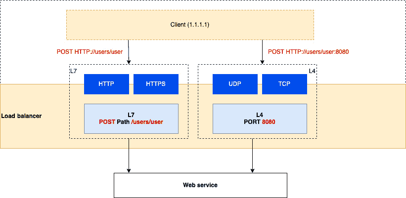
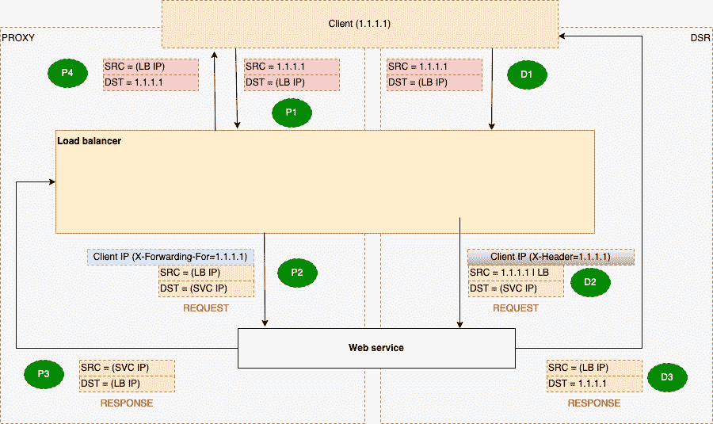

# 14

# 在 EKS 上为应用设置负载均衡

在 *第四章* 中，我们探讨了如何使用 NodePort、Ingress 和/或 AWS **负载均衡器** (**LB**) 来暴露一个简单的应用。在本章中，我们将更详细地讨论如何使用 **AWS 弹性负载均衡器** (**ELB**) 扩展和提升应用的弹性。

在大多数现代 Web 或云原生应用中，你需要确保应用对客户端可用（具备弹性），并且当 Kubernetes 调度器通过替换、移除和添加 Pods 来扩展应用时，应用能够应对这种变化。在应用前面放置负载均衡器可以将这些 Kubernetes 操作隐藏起来，使客户端无论 Pods 的位置或数量如何，都能通过一个一致的端点访问应用。因此，在本章中，我们将专门讨论以下主题：

+   在 AWS 中有哪些负载均衡器（LB）可用，以及如何选择适合你需求的负载均衡器

+   如何在 EKS 中创建和使用 AWS 负载均衡器

# 技术要求

你应该熟悉 YAML、AWS **身份与访问管理** (**IAM**) 和 **弹性 Kubernetes 服务** (**EKS**) 架构。在开始本章之前，请确保你已经具备以下条件：

+   连接到 EKS 集群 API 端点的网络

+   AWS `kubectl` 二进制文件已安装在你的工作站上

+   对 AWS 网络的基本理解

# 为你的需求选择合适的负载均衡器

现代云应用的一个关键特性是能够横向扩展（增加更多实例以满足需求或从故障中恢复）。在 *第四章* 中，我们探讨了如何使用部署来创建和管理多个 Pods，但你还需要将用户流量分配到这些 Pods 上。这正是负载均衡器（LB）所做的事情，我们将在 EKS 中处理两种主要类型：**应用程序负载均衡器** (**ALB**) 和 **网络负载均衡器** (**NLB**)，它们都是 ELB 类型。在接下来的两节中，我们将探讨适用于任何负载均衡器的两个关键概念。

## 概念 1 – 理解第四层和第七层负载均衡器的网络

当我们谈论网络中的层次时，我们指的是 **开放系统互联** (**OSI**) 模型，该模型是在 1980 年代开发的，用以简化不同网络之间的互联。OSI 模型描述了一个七层模型，其中最上层，第七层（应用层），描述了应用程序使用的接口。第四层（传输层）描述了低层协议，如 **用户数据报协议** (**UDP**)/**传输控制协议** (**TCP**) 的行为。OSI 模型的完整描述超出了本书的范围，但值得注意的是，第三层（网络层）可用于描述底层网络，这在 99% 的情况下将是 IPv4 或 IPv6（除非你描述的是 **广域网** (**WAN**)）。

在 Layer 7 层运行的负载均衡器理解应用层协议，如 HTTP/HTTPS，并会使用 HTTP 路径/URL 检查并分发流量，还可以执行重定向和健康检查等操作。值得注意的是，由于 HTTPS 是加密的，负载均衡器必须充当代理（见 *概念 2 – 理解代理和 DSR 模式*），并且在大多数情况下，会在将流量转发到（后端）服务之前终止客户端的流量。

在 Layer 3/4 层运行的负载均衡器无法理解更高层的协议，如 HTTP/HTTPS，它们工作在较低层。这意味着它们可以支持 web 应用程序和其他流量，如 **安全外壳协议**（**SSH**）或 **简单邮件传输协议**（**SMTP**）。由于这些负载均衡器工作在较低层，因此无法检查 HTTP 头信息，因此它们检查和分发网络流量的方式相对简单，而且通常速度较快。这也意味着它们既可以作为 **代理** 运行，也可以在 **直接服务器返回**（**DSR**）模式下运行。

下图展示了两种类型的负载均衡器。两种负载均衡器都能看到客户端流量（图示中的 `1.1.1.1` IP 地址表示），并能执行以下操作：

+   将 web 流量提供给 Layer 7 负载均衡器，并理解 HTTP 动词（图示中的 `POST`）以及路径或 URL（图示中的 `/users/user`）

+   在这些负载均衡器上分发流量，而 Layer 4 负载均衡器仅查看流量类型（在 HTTP/HTTPS TCP 的情况下）和端口（图示中的 `8080`）



图 14.1 – L7 与 L4 负载均衡器比较

现在我们已经了解了不同网络层之间的差异，让我们回顾一下代理模式和 **DSR** 模式之间的差异。

## 概念 2 – 理解代理和 DSR 模式

要检查 HTTPS 流量（该流量是加密的），负载均衡器需要终止它，因此通常意味着它持有加密证书。这种模式被称为 **反向代理模式**，因为负载均衡器将代表客户端代理请求到后端服务器(s)。这一点可以从下图中看到，客户端的源 IP 地址被负载均衡器替代，这意味着请求和响应流量都通过负载均衡器：



图 14.2 – 代理和 DSR 模式比较

在 DSR 中，返回/响应流量直接发送到客户端。这意味着负载均衡器处理的请求较少，并且由于引入的延迟较低，理论上可以更好地扩展。这也意味着后端（web 服务）需要知道客户端的 IP 地址，并能够将流量路由回去。以下表格描述了上图中每个步骤：

|  | **代理请求-响应** | **DSR 请求-响应** |
| --- | --- | --- |
| 1 | **域名系统**（**DNS**）请求服务的 IP 地址解析为负载均衡器的 IP 地址，流量从客户端的 IP 地址发送到负载均衡器的 IP 地址。 |
| 2 | HTTP/HTTPS 流量会被检查，并根据协议类型/URL/端口，流量会被发送到一组已注册的后端服务器（目标），通常基于其健康状况/负载或使用轮询方式。客户端 IP 地址通常会被添加到**X-Forwarded-For**头部，以便后端服务器可以识别请求来自何处，但这是可选的。 | UDP/TCP 流量会被检查，并根据协议类型/端口，流量会被发送到一组已注册的后端服务器（目标），通常使用轮询方式，通过 Layer 2 地址（如`X-header`）进行，因此后端知道如何返回流量，但该方法会根据负载均衡器的实现方式有所不同。 |
| 3 | 请求由后端处理，`X-Forwarded-for`头部可用于验证请求。响应被发送回 LB。 | 请求由后端处理。响应通过保留的源 IP 地址的`X-header`或模仿 LB IP 返回给客户端。 |
| 4 | LB 将响应返回给客户端。 | 对于 DR 路由器，这一步不需要，因为响应已经在上一步返回给客户端。 |

表 14.1 – 请求/响应步骤

现在我们已经了解了一个通用负载均衡器是如何工作的，让我们来看看 AWS 中可用的选项。

## 在 AWS 中有哪些负载均衡器可用？

AWS 中有多种类型的负载均衡器，但我们将重点讨论 EKS 常用的两种 ELB 类型：ALB 和 NLB。ELB 可以是外部的，也可以是内部的，但不能同时是两者。外部表示它可以从互联网访问，内部表示只能从**虚拟私有云**（**VPC**）或具有路由访问该 ELB 所在 VPC 的内部地址访问。下图展示了 AWS 中可用的两种 ELB 选项：


图 14.3 – AWS ELB

这两种负载均衡器（LB）是通过三个关键概念来配置的：

+   你创建一个 NLB 或 ALB 的实例，并将其连接到一个 VPC。

+   你需要配置监听器，定义负载均衡器将接受流量的协议以及端口（NLB）或 URL 路径（ALB）。

+   你配置一个目标组，定义从 LB 监听器发送到它的流量的目标。它还定义了需要的健康检查，以确保目标是健康的并且能够响应流量。

ALB 作为第 7 层代理工作，因此它可以处理 HTTP/HTTPS 和 HTTPv2。因此，如果你的应用程序使用 RESTful 或基于 gRPC 的 API，ALB 将能够支持这些流量。ALB 可以根据 *注册* 的 IP 地址（包括 VPC 地址和本地地址，在 RFC 1918 地址范围内，只要有 VPC 路由），EC2 实例和 Lambda 函数来将流量发送到目标。ALB 附加到 VPC 的可用区，并根据流量需求进行扩展。因此，AWS 提供了一个 DNS **规范名称**（**CNAME**）记录作为参考，因为它可能在 VPC 中有多个网络接口，而与 ALB 相关联的 IP 地址可能会发生变化。ALB 有一个相关联的安全组，意味着你可以控制对其公共或私有接口的访问。

重要提示

对 gRPC 的支持有限，因此虽然 ALB 可以转发 gRPC 流量，但它无法像处理 RESTful API 那样做流量分发决策。

NLB 位于 AWS **软件定义网络**（**SDN**）架构中，因此它的工作方式与 ALB 完全不同。NLB 作为一个第 4 层负载均衡器工作，根据后端服务器和协议的类型，支持代理模式和 DSR 模式。以下是这些模式的示例：

+   如果后端服务是通过 EC2 实例 ID 来指定的，那么客户端的 IP 会被保留并显示在你的后端服务中。

+   如果后端服务通过 IP 地址指定，那么我们会看到以下情况：

    +   如果目标组协议是 TCP/**传输层安全**（**TLS**），客户端 IP 保持功能被禁用，后端服务将把负载均衡器视为流量的源（客户端 IP 地址可以通过代理协议头访问）

    +   如果目标组协议是 UDP/TCP_UDP，客户端 IP 会被保留并在后端服务中可见

即使后端看到客户端的 IP 地址，由于 NLB 是 SDN 构造，返回流量会通过 NLB 返回，而无需任何额外配置。这意味着客户端只会看到 NLB 的地址，并且不会出现不对称路由，即响应从一个 IP 发出，而返回的响应来自另一个 IP。

这种 *返回流量魔法* 并未由 AWS 解释，但它确保任何在 VPC 中的流量都会被路由回 NLB，即使客户端的 IP 地址是源 IP；如果是在 VPC 外部，你可能会遇到不同的不对称路由。

NLB 可以根据*注册*的 IP 地址（包括 VPC 地址和在 RFC 1918 地址范围内的本地地址，只要有 VPC 路由），EC2 实例和 ALB 将流量发送到目标。NLB 通过固定的**弹性网络接口**（**ENIs**）附加到 VPC，因此 AWS 提供这些 IP 地址（公有或私有），一旦分配，IP 地址将保持不变且不会更改。NLB 没有*关联*的安全组，因此外部的 NLB 是*开放*的，能接入互联网。正如你所见，尽管这两种 ELB 有相似之处，但也存在差异。在接下来的部分，我们将看看如何选择适合的 ELB。

## 选择合适的 ELB

想象一下你想将运行在 EKS 上的简单微服务以可扩展和弹性的方式暴露给外部世界。你会选择哪个 ELB？当然，我们假设你想要的区域中两种 ELB 类型都可用！以下是一些你可能需要问的问题，帮助你做出决定：

+   你要暴露的是哪种类型的接口？如果不是基于 HTTP/HTTPS 或 HTTPv2，你将需要使用 NLB。

+   你是否希望卸载加密？如果是，在大多数情况下，你会想使用 SSL/TLS，而且在很多情况下，你会将加密/解密过程卸载到 ELB 上。NLB 和 ALB 都支持这一点，但如果你希望 Pod 进行加密/解密（端到端加密），你将需要一个 NLB，因为它可以将流量传递到 Pod。

+   你需要高级的 Web 安全性吗？只有 ALB 与 AWS 的**Web 应用防火墙**（**WAF**）和**AWS Shield**集成，后者作为**分布式拒绝服务**（**DDoS**）保护服务。NLB 如果启用了 Shield Advanced 也可以进行保护，但它不与 WAF 集成，并且如前所述，没有关联的安全组。

+   你需要静态 IP 地址来进行白名单管理吗？NLB 提供静态 IP 地址，而 ALB 使用 DNS 名称，可能会返回不同的 IP 地址。你可以将 NLB*放在*ALB 前面以提供静态 IP 地址，但这会增加一个网络跳跃，并增加延迟。

+   你需要低延迟，还是可以应对大流量突发？由于 NLB 是 SDN 构建的，它的延迟非常低，且扩展速度远快于 ALB。

+   在部署时，我是否想使用 Kubernetes 的 Ingress 或 Service？类似于 NLB，Kubernetes 服务（例如**NodePort**）是一个简单的构造，它将流量分配到一组 Pods。而 Ingress 则提供更多的路由控制，通过不同的路径将负载分配到你的 Pods 上，它类似于 ALB。所以，如果你希望不同的 Pods 处理用户和小组的更新，你可以使用基于路径的路由，将用户操作指向一个 Pod，将小组操作指向另一个 Pod。如果你需要一个 Pod 处理所有操作并暴露一个单一端口，那么你需要使用 NLB/Service。

当然，还有其他一些方面你可能需要考虑，但在选择使用哪种 ELB 时，这些是我认为有用的主要因素。在下一部分，我们将看看如何使用**AWS 负载均衡器控制器**（**ALBC**）来创建和使用 ELB。

# 使用 EKS 创建并使用 AWS 负载均衡器

我们可以使用 ALBC，这是一个开源项目，来创建 ALB/NLB，或者使用我们 AWS 账户中已有的负载均衡器。让我们从安装控制器和配置正确的权限来访问 AWS API 开始。

## 在你的集群中安装 ALBC

成功安装 ALBC 所需的步骤如下：

1.  首先，你需要确保你的 VPC 正确设置，以便如果你想创建一个内部或外部 ELB，它会部署到正确的子网中。你可以通过标记你的公共子网为`kubernetes.io/role/elb`，将私有子网标记为`kubernetes.io/role/internal-elb`并将`Value`设置为`1`来完成此操作。以下命令展示了如何标记并验证一个公共子网：

    ```
    $ aws ec2 create-tags --resources "subnetid-12" --tags Key=kubernetes.io/role/elb,Value=1
    $ aws ec2 describe-subnets  --subnet-ids subnetid-12 --query 'Subnets[].Tags[]'
    [{
            "Value": "myipv4cluster",
            "Key": "eksctl.cluster.k8s.io/v1alpha1/cluster-name"
        },
        ………
        {
            "Value": "1",
            "Key": "kubernetes.io/role/elb"
    ]
    ```

1.  现在你已经标记了所有的子网，我们可以将控制器部署到你的集群中。我们将使用`eksctl`和 Helm。接下来我们需要做的是为控制器创建一个角色和服务账号（我们将使用 v2.4.5 版本，但这个版本可能会有所变化）：

    ```
    $ curl -o iam-policy.json https://raw.githubusercontent.com/kubernetes-sigs/aws-load-balancer-controller/v2.4.5/docs/install/iam_policy.json
    $ aws iam create-policy --policy-name AWSLoadBalancerControllerIAMPolicy --policy-document file://iam-policy.json
    { "Policy": {"PolicyName": "AWSLoadBalancerControllerIAMPolicy",
    "Arn": "arn:aws:iam::112233:policy/AWSLoadBalancerControllerIAMPolicy",
            ……….}}
    ```

1.  现在我们已经有了策略，我们可以使用前一个命令中提供的`Arn`来创建服务账号：

    ```
    $ eksctl create iamserviceaccount   --cluster myipv4cluster   --namespace kube-system   --name aws-load-balancer-controller   --attach-policy-arn arn:aws:iam::112233:policy/AWSLoadBalancerControllerIAMPolicy   --override-existing-serviceaccounts   --approve
    ………
    2022-12-12 18:46:51 [i]  created serviceaccount "kube-system/aws-load-balancer-controller"
    ```

1.  现在我们已经创建了服务账号，我们可以部署控制器并使用刚刚创建的 Kubernetes 服务账号。为此，我们使用以下 Helm 命令，并且在之前的步骤中创建了服务账号：

    ```
    $ helm repo add eks https://aws.github.io/eks-charts
    $ helm repo update
    Hang tight while we grab the latest from your chart repositories...
    ...Successfully got an update from the "eks" chart repository
    ….
    Update Complete.
    $ helm install aws-load-balancer-controller eks/aws-load-balancer-controller -n kube-system \
      --set clusterName=myipv4cluster \
      --set serviceAccount.create=false \
      --set serviceAccount.name=aws-load-balancer-controller \
      --set image.repository=602401143452.dkr.ecr.eu-central-1.amazonaws.com/amazon/aws-load-balancer-controller \
      --set region=eu-central-1 \
      --set vpcId=vpc-6575786587
    ```

1.  接下来，我们使用以下命令验证部署和版本：

    ```
    $ kubectl get deployment -n kube-system aws-load-balancer-controller
    NAME      READY   UP-TO-DATE   AVAILABLE   AGE
    aws-load-balancer-controller   2/2 2     2           37s
    $ kubectl describe deployment  -n kube-system  aws-load-balancer-controller | grep Image
    Image: 602401143452.dkr.ecr.eu-central-1.amazonaws.com/amazon/aws-load-balancer-controller:v2.4.5
    ```

现在我们已经部署了控制器，让我们看看如何使用它。

## 使用 ALB 与应用程序

在这一部分，我们将使用官方示例，示例位于[`raw.githubusercontent.com/kubernetes-sigs/aws-load-balancer-controller/v2.4.7/docs/examples/2048/2048_full.yaml`](https://raw.githubusercontent.com/kubernetes-sigs/aws-load-balancer-controller/v2.4.7/docs/examples/2048/2048_full.yaml)。要将 ALB 与应用程序一起使用，请按照以下步骤操作：

1.  我们做的第一件事是使用以下部分的 YAML 文件为应用组件创建命名空间：

    ```
    ---
    kind: Namespace
    apiVersion: v1
    metadata:
      name: game-2048
      labels:
        name: game-2048
    ```

1.  接下来，我们将使用官方 Docker 镜像创建一个包含三个副本（Pod）的部署（请注意，你的工作节点必须能够访问互联网以拉取镜像），并使用以下代码片段在每个 Pod 的部署中暴露端口`80`：

    ```
    apiVersion: apps/v1
    kind: Deployment
    metadata:
      namespace: game-2048
      name: deployment-2048
    spec:
      selector:
        matchLabels:
          app.kubernetes.io/name: app-2048
      replicas: 3
      template:
        metadata:
          labels:
            app.kubernetes.io/name: app-2048
        spec:
          containers:
          - image: public.ecr.aws/l6m2t8p7/docker-2048:latest
            imagePullPolicy: Always
            name: app-2048
            ports:
            - containerPort: 80
    ```

1.  最后，我们创建一个`NodePort`服务，将 Pod 暴露到 EKS 集群之外，使用以下代码片段：

    ```
    ---
    apiVersion: v1
    kind: Service
    metadata:
      namespace: game-2048
      name: service-2048
    spec:
      ports:
        - port: 80
          targetPort: 80
          protocol: TCP
      type: NodePort
      selector:
        app.kubernetes.io/name: app-2048
    ```

1.  到目前为止，我们并没有做任何不同于书中其他已部署服务的事情。关键的区别在于以下代码段，其中 Ingress 使用 `alb.ingress` 注释来定义要创建的 ALB 类型，在这种情况下，是一个基于 IP 地址的目标组的外部 ALB。如果你记得，ALB 是一个第七层代理，因此我们还需要定义要注册的路径和端口。在这种情况下，我们定义的是 [`loadbalancername:80/`](http://loadbalancername:80/)：

    ```
    apiVersion: networking.k8s.io/v1
    kind: Ingress
    metadata:
      namespace: game-2048
      name: ingress-2048
      annotations:
        alb.ingress.kubernetes.io/scheme: internet-facing
        alb.ingress.kubernetes.io/target-type: ip
    spec:
      ingressClassName: alb
      rules:
        - http:
            paths:
            - path: /
              pathType: Prefix
              backend:
                service:
                  name: service-2048
                  port:
                    number: 80
    ```

1.  控制器（ALBC）将看到清单中的注释，并调用 AWS API 来创建一个监听端口 `80` 的外部 ALB，以及一个将 Pod 的 IP 地址定义为目标的目标组，这些目标将与我们在清单中创建的服务一起注册。

1.  如果我们使用以下 `kubectl` 命令查看已部署的 Pods，可以看到已分配的 VPC IP 地址（输出已被截断）：

    ```
    $ kubectl get po -o wide -n game-204
    NAME  READY   STATUS    RESTARTS   AGE   IP
    deployment-2048-7ff458c9f-fwx6h   1/1     Running   0      26m   192.168.9.154    ….
    deployment-2048-7ff458c9f-k5ns5   1/1     Running   0     26m   192.168.42.16    ….
    deployment-2048-7ff458c9f-v6mqw   1/1     Running   0          26m   192.168.87.245   …
    ```

1.  现在，如果我们进入 AWS 控制台的 **EC2** | **负载均衡器** 部分，你将看到为游戏应用程序创建的 ALB 以及与之关联的 **DNS 名称** 值（请记住，IP 地址可能会变化，因此你需要始终使用提供的 DNS 名称）。以下截图展示了一个例子：


图 14.4 – 游戏应用程序 ALB

1.  如果我们查看关联的 `80`，以下截图展示了一个例子：


图 14.5 – 游戏应用程序 ALB 目标组

1.  如果我们打开目标组并查看 `kubectl` 命令，以下截图展示了一个例子：


图 14.6 – 游戏应用程序的已注册目标

你可以看到，所有的目标都在 **15 秒** 内显示 `80`，以确保每个 Pod 都能够接收流量：


图 14.7 – 游戏应用程序的健康检查

1.  如果你现在访问 ALB 的 DNS 名称，你将看到游戏界面并可以开始玩游戏，游戏内容包括在屏幕上移动方块：


图 14.8 – 游戏应用程序服务

现在，让我们看一下如何修改之前的 Kubernetes 配置，改用 NLB。

## 使用 NLB 与应用程序配合

我们可以重用之前示例中的 `namespace` 和 `Deployment` 配置，在 *使用 ALB 与你的* *应用程序* 部分：

1.  由于 NLB 是一个 L4 负载均衡器，我们不需要 Ingress 对象，但我们需要修改 `Service` 的定义。第一个区别是，我们使用的注解定义了与 ALB 注解相同的内容，即 NLB 类型和目标组。由于这是一个服务，我们定义的是端口而不是路径。在下面的代码块示例中，将创建一个外部 NLB，它将一个 IP 目标组暴露到端口 `80`，并映射到后台端口 `80`：

    ```
    ---
    apiVersion: v1
    kind: Service
    metadata:
      name: nlb-service
      namespace: game-2048
      annotations:
        service.beta.kubernetes.io/aws-load-balancer-type: external
        service.beta.kubernetes.io/aws-load-balancer-nlb-target-type: ip
        service.beta.kubernetes.io/aws-load-balancer-scheme: internet-facing
    spec:
      ports:
        - port: 80
          targetPort: 80
          protocol: TCP
      type: LoadBalancer
      selector:
        app.kubernetes.io/name: app-2048
    ```

1.  如前所述，控制器（ALBC）将查看注解，并调用 AWS API 来创建一个监听端口 `80` 的外部 NLB，以及一个由 `selector` 语句定义的 Pods IP 地址的目标组。

1.  如果我们在 AWS 控制台上查看 **EC2** | **负载均衡器**，你将看到一个为游戏应用程序配置的 LB，但在这种情况下，它是一个 NLB。下面的截图展示了一个示例：


图 14.9 – 游戏应用程序 NLB

重要提示

虽然你可以在前面的示例中看到 DNS 名称，但 NLB 的 IP 地址是静态的，不像 ALB，后者在 AWS 扩展服务时 IP 地址可能会发生变化。

1.  如果我们查看与 NLB 关联的 **目标组** 和 **已注册的目标**，如下面的截图所示，我们可以看到相同的 Pod IP 地址与 NLB 关联，并且处于 **健康** 状态：


图 14.10 – 游戏应用程序 NLB 注册的目标

1.  同样，一个健康检查已经自动创建，但由于这是一个第 4 层（L4）负载均衡器，健康检查是基于端口的。在下面的截图示例中，使用了 `80` 端口检查，确保每个 Pod 都能接收流量：


图 14.11 – 游戏应用程序 NLB 健康检查

1.  如果你浏览 NLB 的 DNS 名称，你将看到与 ALB 相同的游戏屏幕（*图 14.8*）。

## 重用现有的 LB

在某些情况下，你可能希望重用现有的 ELB。这样可以节省成本，同时简化配置。你可以通过使用 `TargetGroupBinding` 自定义资源来实现。这项资源允许你将服务与现有的 **TargetGroup** 和 NLB 关联。

假设我们已经创建了一个 NLB 和一个关联的基于 IP 的目标组，但还没有注册任何 IP 地址。以下代码片段展示了我们如何使用 `TargetGroupBinding`，该资源允许 ALBC 将与 Kubernetes 服务关联的 Pods 注册到现有的 NLB 或 ALB。关键是要在定义中指定给定的 `TargetGroup` 的 `ARN`：

```
---
apiVersion: elbv2.k8s.aws/v1beta1
kind: TargetGroupBinding
metadata:
  name: existing-nlb
  namespace: game-2048
spec:
  serviceRef:
    name: nlb-service
    port: 80
  targetGroupARN: arn:aws:elasticloadbalancing:eu-central-1:112233:targetgroup/existing-target-group/234
```

重要提示

NLB 位于与 Pods 运行的工作节点关联的安全组之外。因此，当你使用 `TargetGroupBinding` 时，需要允许来自 NLB ENI 的 TCP:`80` 流量到工作节点的安全组，因为 ALBC 并不会为你处理这部分。在 `serviceRef` 引用的服务中，可以将 `type` 配置为 `ClusterIP`，而不是 `LoadBalancer` 或 `NodePort`。

在本节中，我们回顾了负载均衡器的一般工作原理、AWS 中可用的选项，以及如何在 EKS 上配置和使用 ALBC。接下来，我们将重温本章的关键学习要点。

# 总结

在本章中，我们探讨了负载均衡器如何帮助应用程序扩展并提供弹性。它们通常分为两类，分别是第 7 层和第 4 层负载均衡器。第 7 层负载均衡器通常基于 HTTP 工作，理解特定协议的属性，如路径或头部，而第 4 层负载均衡器在端口级别工作，且与协议无关。

我们还回顾了代理模式和 DSR 模式之间的区别；代理负载均衡器始终位于客户端和后端系统之间，而在 DSR 模式中，后端可以直接将流量返回给客户端（尽管是通过伪造源地址为负载均衡器的地址）。

我们回顾了通常与 EKS 配合使用的不同类型的 ELB，分别是 ALB 和 NLB，以及它们之间的差异。接着我们学习了如何在 EKS 集群中安装 ALBC，并且如何使用注释和自定义配置创建 NLB 或 ALB，并将 Pods 注册到它们上，这样你就可以根据路径（ALB）或端口（NLB）访问服务。

最后，我们快速回顾了如何使用 `TargetGroupBinding` 将 Pods 注册到现有的 NLB（或 ALB）。现在你应该能够讨论在 AWS 中可用的不同选项，并配置 EKS 中的部署和服务，以利用 ALB 或 NLB。

在下一章中，我们将讨论如何使用 AWS Fargate 提供增强的安全性、支持小型工作负载，或简单地不管理或支付 EC2 实例的费用。

# 进一步阅读

+   了解 OSI 网络模型：[`www.imperva.com/learn/application-security/osi-model/`](https://www.imperva.com/learn/application-security/osi-model/)

+   了解 HTTPS 的工作原理：[`www.cloudflare.com/learning/ssl/what-is-https/`](https://www.cloudflare.com/learning/ssl/what-is-https/)

+   了解 `X-Forwarded-For` 的工作原理：[`en.wikipedia.org/wiki/X-Forwarded-For`](https://en.wikipedia.org/wiki/X-Forwarded-For)

+   了解 ALB 对 gRPC 的支持：[`aws.amazon.com/blogs/aws/new-application-load-balancer-support-for-end-to-end-http-2-and-grpc/`](https://aws.amazon.com/blogs/aws/new-application-load-balancer-support-for-end-to-end-http-2-and-grpc/)

+   了解 NLB 客户端 IP 地址保留：[`docs.aws.amazon.com/elasticloadbalancing/latest/network/load-balancer-target-groups.html#client-ip-preservation`](https://docs.aws.amazon.com/elasticloadbalancing/latest/network/load-balancer-target-groups.html#client-ip-preservation)

+   理解 NLB 代理协议: [`docs.aws.amazon.com/elasticloadbalancing/latest/network/load-balancer-target-groups.html#proxy-protocol`](https://docs.aws.amazon.com/elasticloadbalancing/latest/network/load-balancer-target-groups.html#proxy-protocol)

+   理解 AWS 高级网页安全特性: [`docs.aws.amazon.com/waf/latest/developerguide/what-is-aws-waf.html`](https://docs.aws.amazon.com/waf/latest/developerguide/what-is-aws-waf.html)

+   下载 ALBC: [`github.com/kubernetes-sigs/aws-load-balancer-controller`](https://github.com/kubernetes-sigs/aws-load-balancer-controller)

+   如何创建 NLB: [`docs.aws.amazon.com/elasticloadbalancing/latest/network/create-network-load-balancer.html`](https://docs.aws.amazon.com/elasticloadbalancing/latest/network/create-network-load-balancer.html)
