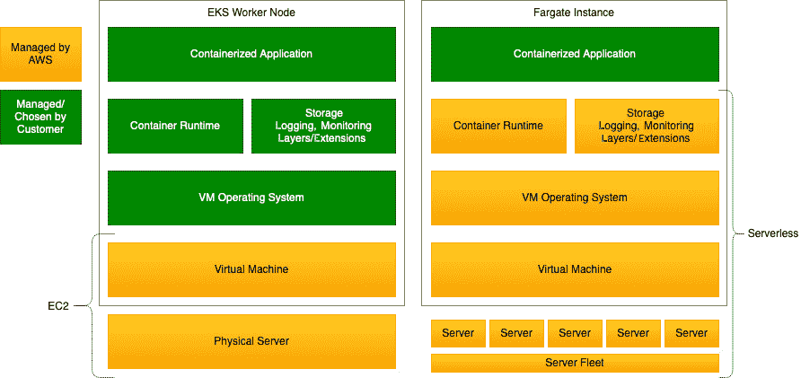
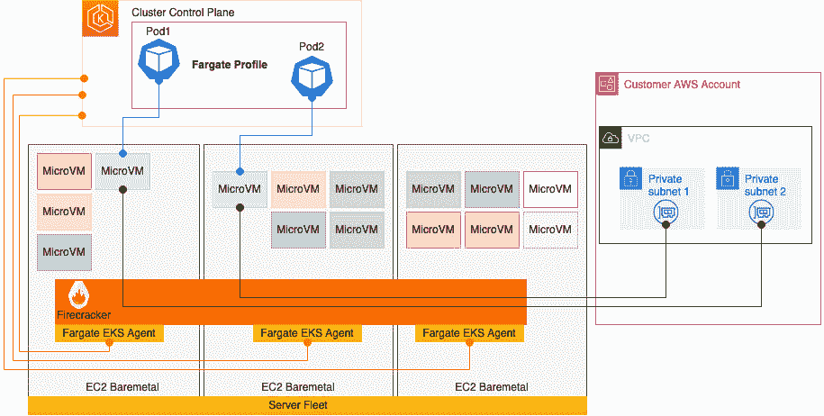
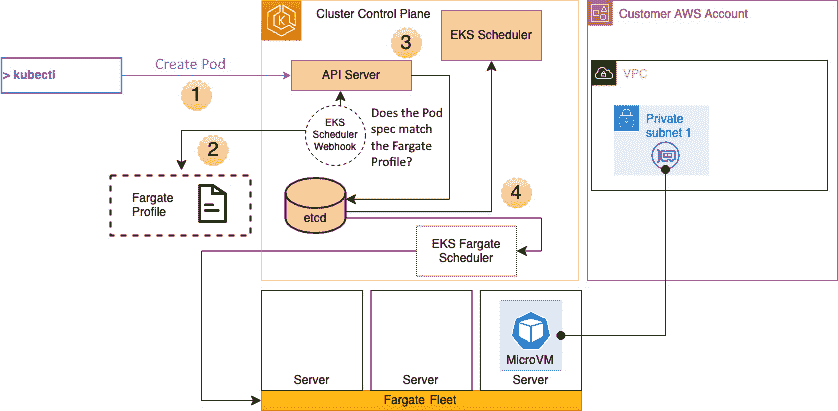

# 第十五章：使用 AWS Fargate

在本书中，我们使用 **弹性计算云**（**EC2**）实例作为我们的 **弹性 Kubernetes 服务**（**EKS**）集群的工作节点，但 **AWS Fargate** 可以作为替代方案来托管 Pods。正如我们稍后会看到的，Fargate 可以为 Pod 提供一个更安全的操作环境，并且通常也更加具有成本效益（但并非总是如此）。

在某些情况下，您可能需要部署一个工作负载/应用程序，该应用程序运行不频繁，内存/CPU 占用较小，并且/或者需要增强的安全性，例如定期创建生产数据库的转储。Fargate 可以满足所有这些需求。在本章中，我们将详细探讨如何以及何时使用 AWS Fargate，以及它如何与 EKS 配合使用，提供 EC2 基础工作节点的替代方案。具体来说，我们将涵盖以下主题：

+   什么是 AWS Fargate，它的定价如何

+   如何在 EKS 中创建 Fargate 配置文件

+   如何将 Pod 部署到 Fargate 实例

+   如何排查常见的 Fargate 问题

# 技术要求

您应该熟悉 YAML、AWS **身份与访问管理**（**IAM**）和 EKS 架构。在开始本章之前，请确保以下内容已到位：

+   您与 EKS 集群 API 端点之间的网络连接

+   您的工作站已安装 AWS `kubectl` 二进制文件

+   您对 AWS 网络和 EC2 有基本了解

# 什么是 AWS Fargate？

AWS Fargate 被开发为 EC2 的替代方案，提供一个 *无服务器*、容器原生的计算解决方案，具有三个关键设计原则：

+   尽可能安全

+   以便可靠并按需扩展

+   成本效益

如果我们比较基于 EC2 的 EKS 工作节点与 Fargate 技术栈（如 *图 15.1* 所示），我们会发现它们非常相似。它们运行在物理服务器上，都有虚拟机操作系统和容器运行时来支持容器化应用程序。关键的区别是 Fargate 是无服务器的，这意味着您无需关心虚拟机操作系统、容器运行时等，因为这些都由 AWS 管理：



图 15.1 – AWS Fargate 与 EC2

另一个主要区别是，Fargate 确实是为小型、突发性或批处理工作负载设计的，不同于传统上用于更稳定、长时间运行工作负载的 EC2。这意味着底层物理计算机群已优化以保持高利用率/密度，这反过来意味着它在操作上更高效，因此对消费者来说，使用它的成本可以更低。

以下工作负载适合使用 Fargate 而不是更传统的 EC2 部署：

+   如果您的生产工作负载较小，偶尔会有突发情况，例如白天的零星网站流量，但晚上几乎没有流量

+   如果你有一个偶尔使用的小型测试/非生产环境，那么 Fargate 可能比一个未充分利用的 EC2 实例更高效。

+   如果你的工作负载由定期运行的任务组成，例如批处理或 cron 作业

另一个需要考虑的因素是 **Firecracker**，这是一个由 AWS 开发并开源的 **虚拟机管理器** (**VMM**)。Firecracker 使用 **MicroVM** 的概念来创建一个小型、安全、隔离的环境，用于运行容器，这些容器可以非常快速地创建或销毁，并提供对 **中央处理单元** (**CPU**)、**随机存取存储器** (**RAM**)、磁盘和网络共享资源分配的精细控制：



图 15.2 – Fargate EKS 架构

Fargate 使用 EC2 Baremetal 实例作为其集群，并通过 Firecracker 在这些实例上为多个租户（客户）创建和管理 MicroVM。Firecracker 确保，尽管单个 Fargate EC2 主机可以支持来自不同 AWS 客户的多个 MicroVM，但它们都通过不同的 **虚拟机** (**VM**) 边界控制进行隔离。

一个 MicroVM 将托管一个 Pod，这些 Pod 不会与其他 Pod 共享底层的内核、CPU 资源、内存资源或 **弹性网络接口** (**ENIs**)。它们通过 Fargate EKS 代理进行编排，使得 K8s 调度器能够将 Pods 调度到 Fargate 集群，并通过 EKS AWS **虚拟私有云** (**VPC**) **容器网络接口** (**CNI**) 连接到客户 VPC 中的私有子网（不支持公共子网）。

K8s 调度器使用 **Fargate 配置文件** 来确定一个 Pod 规格是否满足部署到 Fargate 集群的要求。我们将在后续部分更详细地描述这个过程。

现在我们已经了解了整体架构，让我们来看一下 Fargate 的定价方式。

# 理解 Fargate 定价模型

Fargate 有一个简单的定价模型，基于你使用 MicroVM/Pod 的时长（按秒计费）以及分配给它的 vCPU/RAM 和磁盘。

如果我们首先查看一个 2 CPU/4 GB 内存、30 GB 磁盘的 EC2 实例，并且它 100% 的时间都在运行，那么基于按需定价，以法兰克福地区为例，成本大约为 *$21/月*。

如果我们使用一个 2 CPU/4 GB 内存、30 GB 磁盘的 Fargate Pod，并且每天运行 5 小时，基于法兰克福地区的按需定价，成本大约为 *$10/月*。

一开始我们可以看到，Fargate 的价格不到 EC2 实例的一半！然而，如果我们将 Pod 执行时间从每天 5 小时增加到 10 小时，那么成本将增加到每月 $35，这就比之前贵了不少。此外，请记住，使用 EC2 实例时，我们可以在同一个实例上运行多个 Pods，而不会产生额外费用；而使用 Fargate 时，每个 Pod 将额外收费 $10 或 $35（假设它们配置相同并运行相同的时间）。

从这个例子中你可以看出，虽然 Fargate 的定价模型易于理解，但从纯粹的成本角度来看，使用 Fargate 处理长时间运行的工作负载并不是很有效，但对于突发性、短期的工作负载，它将具有成本效益。然而，如果你考虑到管理和运营 EC2 实例的总成本，而不是 AWS 会管理和修补你的 Fargate 实例，你可能能够围绕 Fargate 建立一个商业案例。

你还需要记住，大多数 EC2 实例并不是 100% 被利用的；在许多情况下，它们的利用率几乎只有 30%。因此，如果你已经拥有一个大型 EC2 实例群（超过 100 个实例），Fargate 可能会为你节省大量费用，因为你可以通过减少 EC2 实例的成本来缓解 Fargate 较高费用的影响。现在我们已经了解了 Fargate 的定价模型，接下来让我们考虑如何配置 EKS 来使用 Fargate。

# 在 EKS 中创建 AWS Fargate 配置文件

理解 AWS Fargate 服务很有趣，但我们在本书中只涵盖了它，主要是为了给你提供一些背景知识。由于 Fargate 是无服务器的，你实际上只需要了解如何让 Kubernetes 调度器与 Fargate 服务通信，创建 MicroVM，连接到网络，并部署 Pod。这一切都是通过 Fargate 配置文件完成的，接下来的章节会详细讨论这个配置文件。

## 理解 AWS Fargate 配置文件的工作原理

在考虑如何将 Fargate 服务与 EKS 集成时，AWS 团队做出了一个有意识的决定，即不要求用户更新现有的 K8s 清单以支持 Fargate。相反，**配置文件**确定了哪些命名空间和/或标签将用于在 Fargate 上托管 Pods，并且在 Pod 定义中不需要进行任何更改。下图展示了这个过程是如何工作的：



图 15.3 – Fargate 配置文件工作流

上图所示的步骤详细如下：

1.  当 API 服务器收到一个 `Pod Create` API 请求时（这可以是一个单独的 Pod 规范，部署的一部分，或其他任何内容），它会触发一个事件，这个事件会被 AWS 在 EKS 控制平面中安装和管理的自定义 webhook 捕获。

1.  这个 webhook 查看 Fargate 配置文件，以确定正在使用的命名空间或标签是否由 Fargate 服务提供。如果匹配，它将更改调度器名称，使用**Fargate 调度器**而不是标准的 K8s 调度器。

1.  现在，API 服务器将带有适当调度器名称的*意图*写入`etcd`，等待被调度。

1.  如果调度器名称已经更改为 Fargate 调度器，那么它最终会被该调度器接管，调度器会负责从 AWS Fargate 集群请求计算资源，并协调创建 MicroVM 并将其附加到客户 VPC 上。Fargate 调度器是 AWS 在 EKS 控制平面中创建和管理的另一个组件。

如你所见，Fargate 配置文件控制了所有的工作原理。那么现在，让我们创建一个并看看它是如何工作的。

## 创建和调整 Fargate 配置文件

创建 Fargate 配置文件的最简单方法是使用`eksctl`。让我们首先使用以下命令创建一个新的命名空间来托管工作负载：

```
$ kubectl create namespace fargate-workload
namespace/fargate-workload created
```

然后，我们可以使用`eksctl`来创建（并验证）Fargate 配置文件，并指定新的命名空间作为 Fargate 的目标（默认情况下，每个集群最多可以有 10 个配置文件）：

```
$ eksctl create fargateprofile --cluster myipv4cluster --name fargate --namespace fargate-workload
2022-12-16 10:42:23deploying stack "eksctl-myipv4cluster-fargate"
…
2022-12-16 10:47:12 created Fargate profile "fargate" on EKS cluster "myipv4cluster"
$ eksctl get fargateprofile --cluster myipv4cluster -o yaml
- name: fargate
  podExecutionRoleARN: arn:aws:iam::112233:role/eksctl-myipv4cluster-farga-FargatePodExecutionRole-1CD7AYHOTBDYO
  selectors:
  - namespace: fargate-workload
  status: ACTIVE
  subnets:
  - subnet-privat1
  - subnet-private2
  - subnet-private3
```

现在配置了配置文件，让我们看看如何使用它。

# 将 Pod 部署到 Fargate 实例

从之前的输出中可以看到，`eksctl`不仅创建了配置文件，还创建了一个执行角色，允许 Fargate Pods 使用 AWS 服务并自动分配 VPC 中的私有子网。

如果我们现在拿出本书中之前使用过的一个清单，并简单地将命名空间更改为`fargate-workload`命名空间并进行部署，我们会看到 Pod 被部署在 Fargate 实例上，而不是 EC2 工作节点上：

```
apiVersion: apps/v1
kind: Deployment
metadata:
  name: simple-web
  namespace: fargate-workload
spec:
  replicas: 1
  selector:
    matchLabels:
      app: simple-nginx-app
  template:
    metadata:
      labels:
        app: simple-nginx-app
    spec:
      containers:
        - name: nginx
          image: nginx
```

如果我们查看使用以下命令部署的 Pod，我们可以看到它运行在 Fargate 上：

```
$ kubectl get po -n fargate-workload -o wide
NAME  READY   STATUS    RESTARTS   AGE   IP  NODE ..
simple-web-12-   1/1     Running   0      11m   192.168.179.65    fargate-ip-192-168-179-65.eu-central-1.compute.internal
```

我们还可以通过以下命令验证 Pod 规范中调度器是否已正确设置，并且 MicroVM 是否已经作为节点注册到我们的集群中：

```
$ kubectl get pods -o yaml -n fargate-workload  simple-web-12 | grep schedulerName.
  schedulerName: fargate-scheduler
$ kubectl get node
……
fargate-ip-192-168-179-65.eu-central-1.compute.internal   Ready    <none>   18m   v1.20.15-eks-14c7a48
ip-192-168-12-212.eu-central-1.compute.internal           Ready    <none>   96d   v1.20.15-eks-ba74326
ip-192-168-63-61.eu-central-1.compute.internal            Ready    <none>   96d   v1.20.15-eks-ba74326
ip-192-168-70-114.eu-central-1.compute.internal           Ready    <none>   96d   v1.20.15-eks-ba74326
```

虽然 Pod 已经创建，但它只能从 VPC 内部访问（它将使用与 EC2 基础工作节点相同的安全组），因此我们可以添加一个 NLB 或 ALB，如在*第十四章*中所述。测试连接到 Fargate 上运行的 Pod 的一种快速方法是使用`curl`命令，以下是一个示例：

```
$ curl 192.168.179.65
<!DOCTYPE html>
<html>
<head>
<title>Welcome to nginx!</title>
…..
</html>
$
```

Fargate 有多个预配置的 vCPU 和内存大小；如果你没有指定 vCPU 和内存组合，那么将使用最小的可用组合（0.25 vCPU 和 0.5 GB 内存）。可以使用`kubectl describe po`命令来验证这一点，以下是一个示例：

```
$ kubectl describe po simple-web-12 -n fargate-workload
Name:                 simple-web-99b67d675-24ptk
Namespace:            fargate-workload
Priority:             2000001000
Priority Class Name:  system-node-critical
Node:                 fargate-ip-1.1.1.1.eu-central-1.compute.internal/192.168.179.65
Start Time:           Fri, 16 Dec 2022 11:46:40 +0000
Labels:               app=simple-nginx-app
                      eks.amazonaws.com/fargate-profile=fargate
                      pod-template-hash=99b67d675
Annotations:          CapacityProvisioned: 0.25vCPU 0.5GB
                      …….
```

如果我们调整初始部署中的 Pod 规格并设置一些限制，它将改变 Fargate 实例的大小。以下代码片段展示了一个使用内存和 CPU 限制的 K8s 清单示例：

```
containers:
        - name: nginx
          image: nginx
          resources:
            limits:
              memory: "2Gi"
              cpu: "2000m"
```

如果我们在更新部署后重新运行 `describe` 命令，我们可以看到配置的容量已经增加：

```
$ kubectl describe po simple-web-688f85f87d-gtxkb -n fargate-workload
Name:                 simple-web-688f85f87d-gtxkb
Namespace:            fargate-workload
Priority:             2000001000
Priority Class Name:  system-node-critical
Node:                 <none>
Labels:               app=simple-nginx-app
                      eks.amazonaws.com/fargate-profile=fargate
                      pod-template-hash=688f85f87d
Annotations:          CapacityProvisioned: 2vCPU 4GB
```

你可以看到，限制和 Fargate 注解/大小并没有完全对齐！这是因为在清单中为内存设置了 2 GiB，但实际分配了 4 GB。这是因为 Fargate 会尝试将清单配置与已定义的 CPU/内存配置匹配，并且会添加一些开销（246 MB 内存）以支持所需的 Kubernetes 组件（`kubelet`、`kube-proxy` 和 `containerd`）。每个 Pod 还将获得 20 GB 的临时存储，可用于缓存数据，但当 Pod 被删除时，这些数据会被删除。

值得注意的是，如果你长时间运行 Pod，AWS 可能会为你的 Pod 打补丁，这可能导致它被驱逐并删除。为了缓解这个问题，你应该使用 **Pod Disruption Budgets**（**PDBs**）来保持一定数量的 Pods 并防止驱逐，如下面的代码片段所示：

```
apiVersion: policy/v1
kind: PodDisruptionBudget
metadata:
  name: fg-pdb
spec:
  minAvailable: 1
  selector:
    matchLabels:
      app: simple-ninx-app
```

重要提示

根据你的 K8s 版本，你可能需要使用 `apiVersion policy/v1beta1` 的 beta 策略。

你可以使用以下命令验证 PDB 是否已设置：

```
$ kubectl get pod disruptionbudgets -n fargate-workload
NAME MIN AVAILABLE  MAX UNAVAILABLE  ALLOWED DISRUPTIONS   AGE
fg-pdb   1               N/A               0              43s
```

虽然 PDB 不能保证你的应用程序的弹性，但它可以在一定程度上确保操作问题不会影响它。由于 AWS 为你运营 Fargate，大多数事情都会无缝发生，但有时也会出现问题。在下一部分，我们将讨论一些常见问题以及如何排查它们。

# 在 Fargate 上排查常见问题

与容量相关的最常见问题是，有时平台资源不足，或者你想要的 CPU/RAM 配合不被支持。这会导致 Pod 状态始终为 **PENDING**。如果是平台问题，简单地等待并稍后重试（大约 15/20 分钟后）可能会解决问题；否则，调整 Pod 规格以支持不同的 CPU/RAM 配合。

如果你在运行 `$ kubectl get nodes` 命令时看到你的 Fargate 节点显示为 `Not Ready`，请确保它们使用的执行角色也已在 `aws-auth` ConfigMap 中配置，以下是一个示例：

```
mapRoles: |
    - groups:
      - system:bootstrappers
      - system:nodes
      - system:node-proxier
      rolearn: <Pod_execution_role_ARN>
      username: system:node:{{SessionName}}
```

你可能会遇到 CoreDNS Pods 一直处于 PENDING 状态的问题；这通常是因为 VPC DNS 没有配置。解决方案是确保你的 VPC 中 `enableDNSHostnames` 和 `enableDNSSupport` 设置为 `True`。

如果你在 Fargate 配置文件中遇到问题，确保目标命名空间和标签在你的集群和 Pod 规格中正确配置。需要考虑一些常见的处理规则：

+   Fargate 调度程序会匹配所有条件，因此，如果在配置文件中使用了命名空间和标签，那么它们必须在清单中同时使用，才能在 Fargate 实例上调度。

+   如果存在多个 Fargate 配置文件且 Pod 匹配多个配置文件，则会使用随机的 Fargate 配置文件进行调度

在本节中，我们了解了 Fargate 的工作原理及其配置方式，并且掌握了一些基本的故障排除技巧。现在，我们将回顾本章的关键学习点。

# 总结

在本章中，我们探讨了 Fargate 是什么以及它是如何工作的。你了解到，Fargate 是 AWS 管理的服务，因此你只需要关注 Fargate 配置文件，并确保正确设置 VPC 网络，必要时设置负载均衡器，这样一切就能正常工作。

我们还探讨了这一技术，并发现 Fargate 在后台使用 Firecracker MicroVM 来提供完全的隔离，即使这些 Pod 位于同一集群中。

我们回顾了 Fargate 配置文件如何用于匹配 Pod 规格标签和配置文件中的命名空间，并将它们分配给 Fargate 调度程序，该调度程序负责与 AWS Fargate 服务进行协调，以在 Fargate MicroVM 上配置您的 Pod，并将其连接到您的 VPC。

接着，我们探讨了如何通过仅匹配 Fargate 配置文件中定义的命名空间和/或标签，使用不做更改的 Pod 或部署清单。我们还了解到，调整清单中的 `Limits` 或 `Requests` 资源将改变 MicroVM 的大小（前提是它与预定义的 CPU/RAM 组合之一相匹配）。

最后，我们回顾了一些 Fargate 常见问题及其解决方法。现在你应该能够描述何时使用 Fargate 来处理 EKS 工作负载，并能够配置 Fargate 配置文件，以便开发人员能够在 Fargate 实例上部署 Pods。

在下一章中，我们将探讨如何使用服务网格来提供更高的安全性或更好的遥测/日志记录。

# 进一步阅读

+   了解 Firecracker 设计：[`github.com/firecracker-microvm/firecracker/blob/main/docs/design.md`](https://github.com/firecracker-microvm/firecracker/blob/main/docs/design.md)

+   了解 Fargate 定价：[`aws.amazon.com/fargate/pricing/`](https://aws.amazon.com/fargate/pricing/)

+   了解 Fargate Pod 配置：[`docs.aws.amazon.com/eks/latest/userguide/fargate-pod-configuration.html`](https://docs.aws.amazon.com/eks/latest/userguide/fargate-pod-configuration.html)
