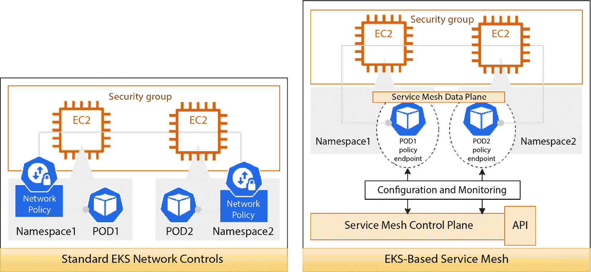

# 第十六章：使用服务网格

到目前为止，我们已经讨论了如何使用 AWS 和 K8s 网络控制（例如安全组和网络策略）来控制应用程序的进出流量。**服务网格**使你能够以更细粒度和一致的方式控制应用程序之间的通信流量，同时提供更好的流量可见性，并且提供诸如加密等附加功能。

随着团队在 EKS 中构建更大、基于微服务的生态系统，涉及成百上千个服务，控制和管理这些服务变成了一项全职工作。使用服务网格简化了这一过程，这意味着所有服务都可以以一致的方式进行管理，而无需每个开发团队修改其代码。在本章中，我们将深入探讨服务网格的工作原理，以**AWS App Mesh**为例。具体来说，我们将涵盖以下内容：

+   探索服务网格及其优势

+   在集群中安装 AWS App Mesh 控制器

+   如何将你的应用程序与 App Mesh 集成

+   使用 AWS Cloud Map 与 EKS 配合

+   排查 Envoy 代理问题

# 技术要求

你应当对 YAML、AWS IAM 和 EKS 架构有所了解。在开始本章之前，请确保满足以下要求：

+   你已经能够访问到 EKS 集群 API 端点

+   你的工作站上已安装 AWS CLI、Docker 和 `kubectl` 二进制文件

+   你对 AWS 和 K8s 网络有所基本了解

本章基于本书中已讨论的许多概念，因此建议你先阅读前几章。

# 探索服务网格及其优势

在*第七章*中，我们回顾了什么是安全组，以及如何使用简单的 P 型规则（源/目标 IP 地址、源/目标端口和协议类型）来控制对工作节点（及其上运行的 Pods）的访问。在*第九章*中，我们探讨了如何使用 K8s 网络策略，通过 K8s 命名空间和标签来控制集群内的流量。

这两种方法的挑战在于它们相对静态，因此随着应用拓扑的变化，应用可能会进行扩展或缩减。例如，IP 地址可能会发生变化，这意味着需要修改配置。此外，随着服务数量的增加，确保配置正确、在多个集群间部署这些配置并监控其操作的运维负担变得越来越复杂和困难。

服务网格通过用一个控制平面替代多个控制点和配置来解决这些问题。控制平面可以在不同的命名空间/Pods（数据平面）中以一致的方式部署策略更改，动态响应应用拓扑的变化，并收集和展示网络流量遥测。大多数服务网格还将通过 API 展示其功能。以下图示展示了服务网格的一般架构：



图 16.1 – 一般服务网格架构

现在让我们探索一些你可以选择的不同数据平面选项。

## 了解不同的数据平面解决方案选项

在选择如何实现服务网格数据平面时，有多个选项可供选择，这些选项提供了在不同命名空间、Pods 等之间一致的控制。这些选项如下：

+   仅使用外部 DNS 服务提供服务发现

+   使用 Linux 内核技术，如**增强的 Berkeley 数据包过滤器**（**eBPF**），来提供流量控制和可见性

+   使用 sidecar 容器控制所有网络流量并提供遥测数据

以下图示展示了这些不同的数据平面选项：


图 16.2 – 服务网格数据平面选项

让我们更详细地了解每个数据平面选项。

### 探索使用 DNS 的服务发现

最简单类型的网格仅提供服务发现功能。这使得在 EKS 集群上运行的 Pods 能够定位在其他集群、其他 AWS 账户/VPC 或本地环境中运行的外部服务。这通常是通过使用`coredns`并将其配置为转发到外部 DNS 服务来实现的。外部 DNS 服务还可以用于注册集群服务，从而让外部用户能够定位到 K8s 集群。这可以通过使用 `external-dns` 来实现，`external-dns` 是一个 K8s 附加组件，它能够将 Kubernetes 资源与外部 DNS 服务同步。该附加组件可以与**Route 53**（标准 AWS DNS 服务）和**Cloud Map**（云服务发现工具）集成。稍后，在*使用 AWS Cloud Map 与 EKS*部分中，我们将探讨如何将 Cloud Map 与 EKS 集成，以提供简单的服务发现解决方案。这种类型的网格不支持任何形式的流量控制或遥测，但在需要将 K8s 服务与 AWS 或本地服务连接时非常有用。

### 探索基于内核的服务网格

提供流量控制或遥测的关键是实现网络过滤器，这些过滤器可以控制和记录流量流动。在今天的 K8s 中，通常是通过 `kube-proxy` 控制 `iptables` 来完成这项工作。当 K8s 资源（Pod、Deployment 和 Service）被部署时，`kube-proxy` 会写入必要的 `iptables`（或 IPVS）规则，以允许流量进出集群，并用正确的 NAT（网络地址转换）地址重写数据包。

`iptables` 的挑战在于它们是在网络速度相对较慢的时候设计的。因此，如果你实现了一个庞大的规则集，它们可能会变得很慢，因为每当进行更改时需要重新创建，而且需要线性评估。在一个大型的 EKS 集群中，你可能有超过 5000 条标准 `iptables` 规则，这些规则大多数是相同的，这会增加延迟。如果再加上复杂的应用规则，可能会严重影响网络栈。

`iptables`，它更加高效且灵活。eBPF 允许你在不改变内核参数的情况下在 Linux 内核中运行用户代码，并且在防火墙和深度数据包检测设备中使用广泛。由于其更高的性能，它在服务网格设计中使用得越来越多，并且与更新的 Kubernetes CNI 实现一起使用，支持部署过滤规则，以满足应用程序的网络连接需求。

本书中我们不会进一步讨论基于 eBPF 的服务网格，因为这是一个仍在发展的领域，但在评估服务网格时，值得考虑这一点。

### 探索基于侧车的服务网格

最常见的服务网格数据平面模式是使用侧车容器，它与应用程序容器部署在同一 Pod 中，并充当代理，控制进出流量，并在服务网格控制平面的监督下进行管理。这种方法的优点是应用程序网络规则被局部化到 Pod 中，不会影响内核，而且侧车可以用来支持增强的功能，如流量加密（互斥 TLS）。

侧车代理可以是自定义镜像，但大多数服务网格使用的是通用代理。**Envoy** ([`www.envoyproxy.io/`](https://www.envoyproxy.io/)) 是一个非常常见的选择，支持 HTTP/HTTPv2 代理、TLS 加密、负载均衡和可观测性（流量遥测）。让我们在下一节中通过研究 AWS App Mesh 来更详细地了解这一模式。

# 了解 AWS App Mesh

有许多不同的服务网格实现方式。我们将重点关注 AWS App Mesh，因为它是一个完全托管的服务，但请注意，其他网格如 Istio、Linkerd 和 Gloo 也可用（如果你想查看社区视角，可以访问[`layer5.io/service-mesh-landscape`](https://layer5.io/service-mesh-landscape)）。AWS App Mesh 提供了跨 Amazon EKS、AWS Fargate、Amazon ECS、Amazon EC2 和 EC2 上 Kubernetes 的一致网络控制，采用基于 Envoy 代理的 sidecar 数据平面。我们将重点讲解 EKS 的使用，但请记住，使用 AWS App Mesh 的主要原因之一是它能够在 AWS 的各种计算服务上提供跨应用的流量控制和可见性。

AWS App Mesh 实现了多个不同的构件来控制和监控应用流量。主要的构件是网格本身。你可以在一个账户中创建多个网格，每个网格代表所有应用/服务所在的逻辑网络边界。通常，你会使用单个网格来*组织*大量相关的服务，这些服务之间相互调用，并作为一个单一的生态系统运行。网格构件是需要首先创建的内容。下图展示了 AWS App Mesh 的主要构件：


图 16.3 – AWS App Mesh 虚拟构件

一旦创建了网格，你将需要为每个 K8s 部署至少创建两个构件：

+   **虚拟节点**是必需的，表示你的 K8s 部署/服务的抽象。它用于通过定义中使用的服务发现方法，将你的 K8s 资源与网格构件链接起来。

+   **虚拟服务**是必需的，它可以指向虚拟节点或虚拟路由器，并供网格中的其他服务用于连接 K8s 服务。

重要提示

一个非常重要的点是，任何使用服务网格的消费者都将使用虚拟服务来访问底层的 K8s 服务，因此，在虚拟服务 `awsName` 键中定义的名称必须能够解析为一个 IP 地址（不管是什么 IP 地址）。如果你的所有服务都在集群中运行，那么你可以创建一个虚拟服务，这样本地的 `CoreDNS` 服务就会返回一个集群服务 IP 地址，之后当客户端/消费者发出 IP 请求时，Envoy sidecar 将进行转换。如果你的服务运行在 AWS 中的其他计算平台（例如 EC2）上，那么你需要集成到一个公共的外部 DNS 中，以便定位 EKS 服务。

AWS App Mesh 还支持两个可选构件：

+   **虚拟路由器**，可用于在服务之间路由流量，对于蓝绿部署等场景非常有用。我们将在开始部署服务时讨论这种构件。

+   **虚拟网关**，可以像 K8s Ingress 一样用于路由和控制南北流量。这种构造将在我们开始部署服务时进行讨论。

现在我们理解了基本构造，让我们来看看如何配置集群以与 AWS App Mesh 配合使用。

# 在集群中安装 AWS App Mesh 控制器

我们将使用 AWS App Mesh 控制器 for K8s（[`github.com/aws/aws-app-mesh-controller-for-k8s`](https://github.com/aws/aws-app-mesh-controller-for-k8s)），它允许我们通过 **K8s 清单**来创建 App Mesh 资源，并自动将 Envoy 代理容器注入到 Pod 中。起点是创建控制器 Pods 所需的命名空间、IAM 角色和服务帐户。命令如下：

```
$ kubectl create ns appmesh-system
$ eksctl create iamserviceaccount --cluster myipv4cluster --namespace appmesh-system --name appmesh-controller --attach-policy-arn  arn:aws:iam::aws:policy/AWSCloudMapFullAccess,arn:aws:iam::aws:policy/AWSAppMeshFullAccess --override-existing-serviceaccounts --approve
…..
454 created serviceaccount "appmesh-system/appmesh-controller"
```

你会注意到，在提供 `AWSAppMeshFullAccess` 角色的同时，我们还提供了 `AWSCloudMapFullAccess` 角色，这将在 *使用 AWS Cloud Map 与 EKS* 章节中讨论。现在我们已经具备了前提条件，可以使用以下命令安装控制器并验证其是否正在运行：

```
$ helm install appmesh-controller eks/appmesh-controller --namespace appmesh-system --set region=eu-central-1 --set serviceAccount.create=false --set serviceAccount.name=appmesh-controller
…..
AWS App Mesh controller installed!
$ kubectl -n appmesh-system get all
NAME  READY   STATUS    RESTARTS   AGE
pod/appmesh-controller-xx   1/1     Running   0          105s
NAME TYPE    CLUSTER-IP     EXTERNAL-IP   PORT(S)   AGE
service/appmesh-controller-webhook-service   ClusterIP   10.100.20.50   <none>        443/TCP   105s
NAME  READY   UP-TO-DATE   AVAILABLE   AGE
deployment.apps/appmesh-controller   1/1     1  1   105s
NAME  DESIRED CURRENT   READY   AGE
replicaset.apps/appmesh-controller-xx   1   1  1       105s
$ kubectl get crds | grep appmesh
….
virtualgateways.appmesh.k8s.aws 2022-12-20T21:45:42Z
virtualnodes.appmesh.k8s.aws    2022-12-20T21:45:42Z
virtualrouters.appmesh.k8s.aws  2022-12-20T21:45:42Z
virtualservices.appmesh.k8s.aws 2022-12-20T21:45:42Z
```

现在我们应该创建网格，它将作为任何服务在网格中传输的网络流量的逻辑边界。以下 K8s 清单将在当前集群区域创建一个名为 `webapp` 的简单网格：

```
apiVersion: appmesh.k8s.aws/v1beta2
kind: Mesh
metadata:
  name: webapp
spec:
  namespaceSelector:
    matchLabels:
      mesh: webapp
```

最后的步骤是将 `AWSAppMeshEnvoyAccess` 策略附加到工作节点的角色，以便所有 Envoy 容器都可以调用 App Mesh API。你可以为每个部署执行此操作，并为每个命名空间创建一个 IRSA。但在本书中，我们将仅更新节点。

现在我们已经配置了网格和工作节点，接下来让我们看看如何部署服务并配置相关的 App Mesh 构造。

# 将应用程序与 AWS App Mesh 集成

在本节中，我们将基于前几章中展示的许多细节，构建并部署一个应用程序，使用标准的 Kubernetes 资源，然后修改它以使用 AWS App Mesh 构造来控制和监控流量。可以从两个维度来考虑这些应用程序流量：来自消费者/用户/互联网的流量，通常称为南北流量；以及来自集群或生态系统中其他服务/应用程序的流量，称为东西流量。下图说明了这些概念：


图 16.4 – 典型的服务网格控制

南北流量通常需要某种身份验证/授权。此类流量的端点通常由 *前端* 服务处理，这些服务提供大量的展示逻辑，并且会聚合或编排跨多个后端服务的请求。东西流量通常来自其他系统（机器对机器），端点由 *后端* 服务提供，后端服务倾向于授权请求并为特定领域（如订单、账户等）提供业务数据。

大多数服务网格专注于保护、控制和监控东西流量，而南北流量则由标准 K8s 服务（例如 K8s Ingress）处理。然而，随着这些网格的发展，它们也开始处理更多的南北流量，取代了这些服务。

在接下来的部分中，我们将部署一个简单的前端/后端应用程序，并使用 K8s Ingress（一个 AWS ALB），然后修改后端以使用 AWS App Mesh（东西流量），用虚拟网关（南北流量）替换前端，并对流量监控和可观察性进行高层次的概述。

## 部署我们的标准应用程序

我们将使用两个基于`curl`的 Pod 来访问我们的 HTTP 服务。应用程序设计和 Python 代码片段显示在下图中。在初始部署中，我们只是假设蓝色和绿色表示不同的服务：


图 16.5 – 示例应用程序

我们将从部署绿色服务开始。

### 部署绿色服务

该服务由两个 Python/FastAPI Pod 的部署组成，这些 Pod 在`8081`端口上公开两个路径；一个 GET `/id`路径，简单地返回`{"id" : "green"}`消息；另一个 GET `/query`路径，简单地返回`{"message" : "hello from green"}`消息：

1.  让我们首先为这些资源创建命名空间。以下清单将在一个单独的命名空间`green`中创建图 16.5 中显示的资源，该命名空间没有应用网格标签：

    ```
    ---
    kind: Namespace
    apiVersion: v1
    metadata:
      name: green
      labels:
        name: green
    ```

1.  现在我们创建一个`Deployment`，它使用已经容器化并推送到私有 ECR 仓库的前端代码（请查看第十一章中的相关说明和工件）：

    ```
    ---
    apiVersion: apps/v1
    kind: Deployment
    metadata:
      namespace: green
      name: green-v1
    spec:
      selector:
        matchLabels:
          app.kubernetes.io/name: green-v1
      replicas: 2
      template:
        metadata:
          labels:
            app.kubernetes.io/name: green-v1
        spec:
          containers:
          - image: 112233.dkr.ecr…/green:0.0.1
            imagePullPolicy: Always
            name: backend
            ports:
            - containerPort: 8081
    ```

重要提示

在*图 16.5*中展示了绿色和蓝色容器镜像中使用的 Python/FastAPI 代码，但为了本练习的目的，任何 Web 服务器都可以使用。

1.  接下来，我们创建一个`ClusterIP`服务，用于在集群内访问绿色服务：

    ```
    ---
    apiVersion: v1
    kind: Service
    metadata:
      namespace: green
      name: green-v1
      labels:
        version: v1
    spec:
      ports:
        - port: 8081
          protocol: TCP
      selector:
        app.kubernetes.io/name: green-v1
    ```

1.  现在，使用以下命令，我们可以看到有一个 K8s 服务，其他 K8s Pod 或服务可以找到并使用它：

    ```
    $ kubectl get svc -n green
    NAME  TYPE   CLUSTER-IP       EXTERNAL-IP   PORT(S)    AGE
    green-v1  ClusterIP   10.100.192.178   <none>  8081/TCP   8h
    ```

既然我们已经有了绿色服务，接下来让我们在以下部分中部署蓝色服务。

### 部署蓝色服务

蓝色服务遵循与绿色服务类似的模型，由两个 Python/FastAPI 容器的部署组成，这些容器在`8080`端口上公开两个路径；一个 GET `/id`路径，简单地返回`{"id" : "blue"}`消息；另一个 GET `/query`路径，简单地返回`{"message" : "hello from blue"}`消息。该服务具有一个`ClusterIP`服务，只能在集群内部使用：

1.  让我们使用以下清单为我们的应用程序创建蓝色命名空间，该命名空间没有应用网格标签：

    ```
    ---
    kind: Namespace
    apiVersion: v1
    metadata:
      name: blue
      labels:
        name: blue
    ```

1.  现在，我们创建引用 ECR 中后端容器的`Deployment`：

    ```
    ---
    apiVersion: apps/v1
    kind: Deployment
    metadata:
      namespace: blue
      name: blue-v1
    spec:
      selector:
        matchLabels:
          app.kubernetes.io/name: blue-v1
      replicas: 2
      template:
        metadata:
          labels:
            app.kubernetes.io/name: blue-v1
        spec:
          containers:
          - image: 112233.dkr.ecr…blue:0.0.1
            imagePullPolicy: Always
            name: blue-v1
            ports:
            - containerPort: 8080
    ```

重要提示

在绿色和蓝色容器镜像中使用的 Python/FastAPI 代码如*图 16**.5*所示，但任何 Web 服务器都可以用于本练习的目的。

1.  最后，我们创建服务`ClusterIP`，它将创建必要的集群 DNS 条目，以便从集群内部访问该服务：

    ```
    ---
    apiVersion: v1
    kind: Service
    metadata:
      namespace: blue
      name: blue-v1
      labels:
        version: v1
    spec:
      ports:
        - port: 8080
          protocol: TCP
      selector:
        app.kubernetes.io/name: blue-v1
    ```

1.  使用以下命令，我们可以看到有一个 K8s 服务，以便其他 K8s 服务/Pods 可以定位并使用它：

    ```
    $ kubectl get svc -n blue
    NAME   TYPE   CLUSTER-IP     EXTERNAL-IP   PORT(S)    AGE
    blue-v1   ClusterIP   10.100.223.120   <none> 8080/TCP   8h
    ```

最后，我们将部署消费者服务，并使用所有原生的非网格资源测试与蓝色和绿色服务的连接性。

### 部署消费者服务

最后，我们将部署消费者服务，该服务由一个单独的 Pod 组成，支持`curl`命令：

1.  使用以下清单将创建如*图 16**.5*所示的资源，在一个单独的命名空间`consumer`中，该命名空间没有应用网格标签：

    ```
    kind: Namespace
    apiVersion: v1
    metadata:
      name: consumer
      labels:
        name: consumer
    ```

1.  现在我们创建一个`Deployment`，它引用从公共 Docker Hub 仓库拉取的`alpine/curl`容器：

    ```
    apiVersion: apps/v1
    kind: Deployment
    metadata:
      namespace: consumer
      name: consumer
    spec:
      selector:
        matchLabels:
          app.kubernetes.io/name: consumer
      replicas: 1
      template:
        metadata:
          labels:
            app.kubernetes.io/name: consumer
        spec:
          containers:
          - image: alpine/curl
            command:
            - sleep
            - "36000"
            imagePullPolicy: IfNotPresent
            ports:
            - containerPort: 22
            name: consumer
          restartPolicy: Always
    ```

1.  我们可以使用以下命令检查 Pod 是否已部署：

    ```
    $ kubectl get po -n consumer
    NAME                    READY   STATUS    RESTARTS   AGE
    consumer-123   1/1     Running   0          13s
    ```

1.  完成了！现在我们可以连接到我们的消费者 Pod，并使用以下命令测试是否可以连接到相关的 K8s 服务：

    ```
    $ kubectl exec -it -n consumer consumer-123 – sh
    / # curl http://green-v1.green:8081/id
    {"id":"green"}
    / # curl http://green-v1.green:8081/query
    {"message":"hello from green"}
    / # curl http://blue-v1.blue:8080/id
    {"id":"blue"}
    / # curl http://blue-v1.blue:8080/query
    {"message":"hello from blue"}
    ```

重要提示

请注意，我们使用了简化的服务表示法`<scv-name>.namespace`，来调用我们在每个命名空间中创建的 K8s 服务。

现在我们已经有了一组正常工作的服务，我们将添加基本的网格组件并再次测试，但这次使用服务网格虚拟服务。

## 添加基本的 AWS App Mesh 组件

我们需要做的第一件事是标记`blue`、`green`和`consumer`命名空间，以确定使用哪个网格，并确认我们希望将 Envoy sidecar 容器自动注入到部署到这些命名空间中的所有 Pods。以下命令展示了如何为示例应用程序完成这一操作：

```
$ kubectl label namespace consumer mesh=webapp
$ kubectl label namespace consumer appmesh.k8s.aws/sidecarInjectorWebhook=enabled
$ kubectl label namespace blue mesh=webapp
$ kubectl label namespace blue appmesh.k8s.aws/sidecarInjectorWebhook=enabled
$ kubectl label namespace green mesh=webapp
$ kubectl label namespace green appmesh.k8s.aws/sidecarInjectorWebhook=enabled
```

重要提示

通常，命名空间标签会在创建命名空间时自动创建；我们现在这样做仅仅是为了在本书中说明这些概念。

下一步是部署 App Mesh 的`VirtualNode`，这是我们重新部署应用程序所必需的。这对于每个需要使用网格的 K8s 部署都必须完成，因为它将允许 Envoy 代理正确配置自己。在这一部分中，我们首先展示了绿色和蓝色服务的配置；消费者服务将在最后配置，因为它引用了这两个服务。

绿色的`VirtualNode`清单在以下片段中显示，并引用了我们在基本应用程序部署过程中创建的`green-v1` K8s 服务。它还创建了一个基本的健康检查，使用`/id`路径，定义了 DNS 作为底层资源的服务发现协议，并使用 K8s 服务的完全限定名称：

```
---
apiVersion: appmesh.k8s.aws/v1beta2
kind: VirtualNode
metadata:
  name: green-v1
  namespace: green
spec:
  podSelector:
    matchLabels:
      app.kubernetes.io/name: green-v1
  listeners:
    - portMapping:
        port: 8081
        protocol: http
      healthCheck:
        protocol: http
        path: '/id'
        healthyThreshold: 2
        unhealthyThreshold: 2
        timeoutMillis: 2000
        intervalMillis: 5000
  serviceDiscovery:
    dns:
      hostname: green-v1.green.svc.cluster.local
```

蓝色的`VirtualNode`清单在以下片段中显示，并引用了`blue-v1` K8s 服务，但与绿色的`VirtualNode`配置方式相同：

```
---
apiVersion: appmesh.k8s.aws/v1beta2
kind: VirtualNode
metadata:
  name: blue-v1
  namespace: blue
spec:
  podSelector:
    matchLabels:
      app.kubernetes.io/name: blue-v1
  listeners:
    - portMapping:
        port: 8080
        protocol: http
      healthCheck:
        protocol: http
        path: '/id'
        healthyThreshold: 2
        unhealthyThreshold: 2
        timeoutMillis: 2000
        intervalMillis: 5000
  serviceDiscovery:
    dns:
      hostname: blue-v1.blue.svc.cluster.local
```

我们现在可以检查虚拟节点是否已在集群中部署，并已在 AWS App Mesh API 中注册，使用以下命令：

```
$ kubectl get virtualnode --all-namespaces
NAMESPACE   NAME  ARN                AGE
blue  blue-v1    arn:aws:appmesh:eu-central-1:112233:mesh/webapp/virtualNode/blue-v1_blue     2m50s
green       green-v1   arn:aws:appmesh:eu-central-1:112233:mesh/webapp/virtualNode/green-v1_green   103s
$ aws appmesh list-virtual-nodes --mesh-name webapp
{
    "virtualNodes": [
        {
….
            "virtualNodeName": "blue-v1_blue",
….
        },
        {
….
            "virtualNodeName": "green-v1_green",
…..}]}
```

注意

使用 AWS CLI 检查资源是否已完全部署到网格中总是值得的，因为有时资源已在 K8s 中部署，但配置不正确，因此不会出现在网格 API 中。

实际的 Deployment 和 Pods 尚未发生变化，因此，如果你列出任何一个命名空间中的 Pods，你会看到原始的 Pods。我们现在可以使用`kubectl rollout`命令重新启动 Deployment，并且会看到`blue`和`green`命名空间中 Pods 的容器数量增加。以下是`blue`命名空间的命令示例：

```
$ kubectl get po -n blue
NAME                      READY   STATUS    RESTARTS   AGE
blue-v1-684cc59d8-5kczs   1/1     Running   0          23h
blue-v1-684cc59d8-nfvf9   1/1     Running   0          23h
$ kubectl rollout restart deployment blue-v1 -n blue
deployment.apps/blue-v1 restarted
$ kubectl get po -n blue
NAME                       READY   STATUS    RESTARTS   AGE
blue-v1-6bdfb49995-8789s   2/2     Running   0          8s
blue-v1-6bdfb49995-zzsw4   2/2     Running   0          10s
```

最后一步是为蓝色和绿色 Pods 添加`VirtualService`资源，因为目前，尽管 Envoy 代理已注入并与`VirtualNode`配置一起进行了配置，但该服务在网格中不可解析。如以下清单所示，`blue`服务的`VirtualService`使用服务名`blue`，但将直接映射到我们之前在`blue`命名空间中创建的`blue-v1`虚拟节点：

```
---
apiVersion: appmesh.k8s.aws/v1beta2
kind: VirtualService
metadata:
  name: blue
  namespace: blue
spec:
  awsName: blue.blue.svc.cluster.local
  provider:
    virtualNode:
      virtualNodeRef:
        name: blue-v1
        namespace: blue
```

如果你还记得，在*理解 AWS App Mesh*部分中，我们提到过`awsName`需要能够通过 DNS 解析。由于此服务完全在 K8s 中运行，我们可以在`blue`命名空间中添加一个名为`blue`的虚拟 K8s 服务，以便能够使用以下清单解析`blue.blue.svc.cluster.local`服务名：

```
---
apiVersion: v1
kind: Service
metadata:
  name: blue
  namespace: blue
  labels:
    app.kubernetes.io/name: blue
spec:
  ports:
  - port: 8080
    name: http
```

`注意

请记住，尽管 DNS 查找会返回与`blue`服务关联的集群 IP 地址，但 Envoy 代理会修改流量，使其能够与底层的`blue-v1`服务进行通信。

部署了`VirtualServices`和虚拟 K8s 服务到两个命名空间后，我们可以使用以下命令检查配置：

```
$ kubectl get virtualservice --all-namespaces
NAMESPACE   NAME    ARN                             AGE
blue   blue    arn:aws:appmesh:eu-central-1:112233:mesh/webapp/virtualService/blue.blue.svc.cluster.local     37s
green       green   arn:aws:appmesh:eu-central-1:112233:mesh/webapp/virtualService/green.green.svc.cluster.local   25s
$ kubectl get svc --all-namespaces
NAMESPACE    NAME     TYPE  CLUSTER-IP       ..
blue  blue     ClusterIP   10.100.217.243   <none>  8080/TCP .
blue  blue-v1  ClusterIP   10.100.50.46     <none>  8080/TCP .
green green    ClusterIP   10.100.100.13    <none>  8081/TCP .
green green-v1 ClusterIP   10.100.51.214    <none>  8081/TCP .
….
```

我们还可以通过`aws appmesh list-virtual-services`命令或控制台查看已创建的虚拟服务，以下图为示例：


图 16.6 – K8s 服务的网格虚拟服务控制台视图

我们现在已经定义了蓝色和绿色服务的所有资源。接下来，我们可以为消费者添加`VirtualNode`并测试与网格服务的连接性。消费者`VirtualNode`的清单如下所示，类似于蓝色和绿色服务的定义；不过，它包含一个后端键，允许它与我们在*部署标准应用程序*部分中创建的`blue`和`green`服务进行通信（这也是我们最后执行此操作的原因）：

```
---
apiVersion: appmesh.k8s.aws/v1beta2
kind: VirtualNode
metadata:
  name: consumer
  namespace: consumer
spec:
  podSelector:
    matchLabels:
      app.kubernetes.io/name: consumer
  listeners:
    - portMapping:
        port: 8082
        protocol: http
  backends:
    - virtualService:
        virtualServiceRef:
          namespace: blue
                     name: blue
    - virtualService:
        virtualServiceRef:
                    namespace: green
                   name: green
  serviceDiscovery:
    dns:
      hostname: consumer.consumer.svc.cluster.local
```

部署`VirtualNode`配置后，我们可以重新部署消费者部署，并使用以下命令检查结果资源：

```
$ kubectl rollout restart deployment consumer  -n consumer
deployment.apps/consumer restarted
$ kubectl get po -n consumer
NAME          READY   STATUS    RESTARTS   AGE
consumer-1122\. 2/2     Running   0          105s
$ aws appmesh describe-virtual-node --virtual-node-name consumer_consumer --mesh-name webapp
{
    "virtualNode": {
        "status": {
            "status": "ACTIVE"
….}
```

我们现在可以`exec`进入我们的消费者 Pod，并使用以下命令测试我们的 App Mesh 服务：

```
$ kubectl exec -it -n consumer consumer-1122  -- sh
Defaulted container "consumer" out of: consumer, envoy, proxyinit (init)
/ # curl -s http://blue.blue.svc.cluster.local:8080/id
{"id":"blue"}
/ # curl -s http://green.green.svc.cluster.local:8081/id
{"id":"green"}
```

你可能会注意到，由于这是一个多容器 Pod，`exec`命令默认执行在应用容器中，在这种情况下是`consumer`，但是你也会看到`envoy`和`init`容器（`proxyinit`）已被注入到原始的 Pod 定义中。我们现在也使用完全限定的 App Mesh 服务名称，例如`blue.blue.svc.cluster.local`，而不是 K8s 服务名称，比如`blue-v1`。

我们现在已经部署了网格并将其集成到我们的应用中。从应用的角度来看，唯一变化的是我们在`curl`命令中使用的服务名称。虽然工作量还是比较大，但在接下来的部分中，我们将看看虚拟路由器如何简化蓝绿部署。

## 在 AWS App Mesh 中使用虚拟路由器

在这个示例中，我们假设`blue`和`green`服务现在是同一个服务的不同版本（蓝绿部署）。我们将创建一个新的服务`myapp`，表示该应用程序，然后在现有的两个虚拟节点之间放置一个虚拟路由器，并最初将所有流量发送到绿色版本。下图说明了这一点：


图 16.7 – 将虚拟路由器添加到我们的服务中

我们需要做的第一件事是创建新的`VirtualRouter`。以下清单创建了一个路由器，并为`/id`路径映射了一个单独的路由，监听 TCP 端口`8085`。`weight`键用于定义流向指定`VirtualNode`的流量权重/百分比。在下面的示例中，我们将所有流量发送到`green-v1`的`VirtualNode`：

```
---
apiVersion: appmesh.k8s.aws/v1beta2
kind: VirtualRouter
metadata:
  name: app-router
  namespace: consumer
spec:
  listeners:
    - portMapping:
        port: 8085
        protocol: http
  routes:
    - name: app-route
      httpRoute:
        match:
          prefix: /id
        action:
          weightedTargets:
            - virtualNodeRef:
                name: green-v1
                namespace: green
              weight: 100
              port: 8081
            - virtualNodeRef:
                name: blue-v1
                namespace: blue
              weight: 0
              port: 8080
```

我们还需要添加`myapp`虚拟服务和虚拟 K8s 服务（用于 DNS 解析）；以下示例清单创建了这两个服务，并引用了我们之前创建的`VirtualRouter`，而不是`VirtualNode`：

```
---
apiVersion: appmesh.k8s.aws/v1beta2
kind: VirtualService
metadata:
  name: myapp
  namespace: consumer
spec:
  awsName: myapp.consumer.svc.cluster.local
  provider:
    virtualRouter:
      virtualRouterRef:
        name: app-router
---
apiVersion: v1
kind: Service
metadata:
  name: myapp
  namespace: consumer
  labels:
    app.kubernetes.io/name: consumer
spec:
  ports:
  - port: 8085
    name: http
```

一旦我们部署了这些资源，我们需要调整消费者`VirtualNode`的规格，通过添加新的后端配置来允许访问这个新服务，如下所示：

```
backends:
    - virtualService:
        virtualServiceRef:
          namespace: blue
          name: blue
    - virtualService:
        virtualServiceRef:
          namespace: green
          name: green
    - virtualService:
        virtualServiceRef:
          name: myapp
```

重要提示

由于`myapp`服务与`consumer`处于同一命名空间，我们不需要添加`namespace`键，但为了清晰起见，你可能会想要添加它。

完成所有部署后，我们现在可以`exec`进入`consumer`并使用以下命令测试我们的新服务：

```
$ kubectl exec -it -n consumer consumer-1122  -- sh
Defaulted container "consumer" out of: consumer, envoy, proxyinit (init)
/ # curl -s http://myapp.consumer.svc.cluster.local:8085/id
{"id":"green"}
/ # curl -s http://myapp.consumer.svc.cluster.local:8085/id
{"id":"green"}
```

如果我们现在调整`VirtualRouter`的`routes`配置中的权重，以便在`blue`和`green`服务之间均匀分配流量，我们可以将流量从`green`服务转移到`blue`服务，如下片段所示：

```
routes:
    - name: app-route
      httpRoute:
        match:
          prefix: /id
        action:
          weightedTargets:
            - virtualNodeRef:
                name: green-v1
                namespace: green
              weight: 50
              port: 8081
            - virtualNodeRef:
                name: blue-v1
                namespace: blue
              weight: 50
              port: 8080
```

现在运行相同的`curl`命令将会从`blue`和`green`服务中返回响应：

```
/ # curl -s http://myapp.consumer.svc.cluster.local:8085/id
{"id":"green"}
/ # curl -s http://myapp.consumer.svc.cluster.local:8085/id
{"id":"blue"}
/ # curl -s http://myapp.consumer.svc.cluster.local:8085/id
{"id":"green"}
/ # curl -s http://myapp.consumer.svc.cluster.local:8085/id
{"id":"blue"}
```

再次强调，这里应用程序唯一的变化是使用的 URL/服务，Envoy 和 AWS App Mesh 负责所有的*魔法*。到目前为止，我们只关注东西向流量；在下一部分，我们将探讨如何通过虚拟网关将该服务暴露到集群外部。

## 在 AWS App Mesh 中使用虚拟网关

`VirtualGateway`用于暴露在网格内运行的服务，并使没有访问 App Mesh 控制平面的外部服务通过配置的 Envoy 代理访问它。它通过部署独立的 Envoy 代理和 AWS `VirtualService`来实现，后者将流量传递到`VirtualRouter`或直接传递到`VirtualNode`。我们将扩展`myapp`服务，使其可以通过`VirtualGateway`从互联网访问。下图说明了这一点：


图 16.8 – 虚拟网关部署

我们需要做的第一件事是创建并标记`internet`命名空间，该命名空间将承载我们的 Ingress 网关和负载均衡器。我们这样做是因为我们在独立模式下托管 Envoy 代理，所以不希望使用会尝试在独立 Envoy 代理上注入 Envoy 代理的命名空间。以下命令说明了如何操作：

```
$ kubectl create namespace internet
$ kubectl label namespace internet gateway=in-gw
$ kubectl label namespace internet mesh=webapp
```

然后，我们可以继续创建`VirtualGateway`，它将在我们刚创建的`internet`命名空间中监听端口`8088`，使用以下清单：

```
---
apiVersion: appmesh.k8s.aws/v1beta2
kind: VirtualGateway
metadata:
  name: in-gw
  namespace: internet
spec:
  namespaceSelector:
    matchLabels:
      gateway: in-gw
  podSelector:
    matchLabels:
      app: in-gw
  listeners:
    - portMapping:
        port: 8088
        protocol: http
```

我们现在可以使用以下清单在`consumer`命名空间中创建`myapp` `VirtualService`：

```
---
apiVersion: appmesh.k8s.aws/v1beta2
kind: GatewayRoute
metadata:
  name: myapp-route
  namespace: internet
spec:
  httpRoute:
    match:
      prefix: "/"
    action:
      target:
        virtualService:
          virtualServiceRef:
            name: myapp
            port: 8085
            namespace: consumer
```

重要提示

我们将使用默认前缀`/`，它会捕获所有流量并将其发送到`myapp` `VirtualService`。

使用以下命令，我们现在可以获取创建的`VirtualGateway`的 ARN，因为在部署独立 Envoy 代理时需要此信息：

```
$ kubectl get virtualgateway --all-namespaces
NAMESPACE   NAME          ARN                   AGE
internet    in-gw   arn:aws:appmesh:eu-central-1:112233:mesh/webapp/virtualGateway/in-gw_internet   7m37s
```

我们现在可以将独立的 Envoy 代理部署到`internet`命名空间。在以下示例清单中，我们使用 AWS Envoy 镜像创建两个副本，并使用`APPMESH_RESOURCE_ARN`环境变量注入前一步中列出的`VirtualGateway`的 ARN：

```
---
apiVersion: apps/v1
kind: Deployment
metadata:
  name: in-gw
  namespace: internet
spec:
  replicas: 2
  selector:
    matchLabels:
      app: in-gw
  template:
    metadata:
      labels:
        app: in-gw
    spec:
      containers:
        - name: envoy
          image: 840364872350.dkr.ecr.eu-central-1.amazonaws.com/aws-appmesh-envoy:v1.24.0.0-prod
          env:
          - name: APPMESH_RESOURCE_ARN
            value: "arn:aws:appmesh:eu-central-1:112233:mesh/webapp/virtualGateway/in-gw_internet"
          - name: ENVOY_LOG_LEVEL
            value: "debug"
          ports:
            - containerPort: 8088
```

重要提示

我们将 Envoy 的日志级别设置为`debug`，仅供信息参考；此设置不应用于任何生产工作负载，因为它会生成非常大的日志，且在完成故障排除后应重置为`info`。所使用的镜像来自公共`appmesh`仓库，您可以通过[`gallery.ecr.aws/appmesh/aws-appmesh-envoy`](https://gallery.ecr.aws/appmesh/aws-appmesh-envoy)访问该仓库。

最后，我们创建基于 NLB 的服务，将 Envoy 代理暴露给互联网。这将使用基于 IP 的方案，并在负载均衡器上暴露端口`80`，该端口将通过目标组中 Pod 的 IP 地址映射到端口`8088`，从而将流量路由到每个 Envoy Pod：

```
---
apiVersion: v1
kind: Service
metadata:
  name: in-gw
  namespace: internet
  annotations:
    service.beta.kubernetes.io/aws-load-balancer-type: external
    service.beta.kubernetes.io/aws-load-balancer-nlb-target-type: ip
    service.beta.kubernetes.io/aws-load-balancer-scheme: internet-facing
spec:
  ports:
    - port: 80
      targetPort: 8088
      protocol: TCP
  type: LoadBalancer
  loadBalancerClass: service.k8s.aws/nlb
  selector:
    app: in-gw
```

重要提示

虽然该服务将 Envoy 代理暴露到互联网，但我们也可以配置服务使用内部 NLB（如果是 HTTP/HTTPS 服务，则使用 ALB），这意味着其他非网格资源可以访问网格服务，但仅限于 AWS 网络或已连接的私有网络。

我们现在可以通过使用`kubectl get svc`命令获取我们刚刚创建的 NLB 的 URL，然后使用`curl`获取 K8s 服务 ID，来测试我们的`myapp`服务是否通过`VirtualGateway`暴露，使用以下命令：

```
$ kubectl get svc -n internet
NAME TYPE  CLUSTER-IP     EXTERNAL-IP     PORT(S)        AGE
in-gw   LoadBalancer   10.100.12.98   k8s-internet-ingw-1122.elb.eu-central-1.amazonaws.com   80:30644/TCP   53m
$ curl -s http://k8s-internet-ingw-1122.elb.eu-central-1.amazonaws.com/id
{"id":"blue"}
$ curl -s http://k8s-internet-ingw-1122.elb.eu-central-1.amazonaws.com/id
{"id":"green"}
```

现在我们已经看到如何使用`VirtualGateway`资源将我们的 AWS App Mesh `VirtualService`暴露到互联网。接下来，我们将回顾如何使用 AWS Cloud Map，一个外部 DNS 服务，来执行与 AWS App Mesh 的服务发现。

# 使用 AWS Cloud Map 与 EKS

AWS Cloud Map 是一个云资源发现工具，因此，与 App Mesh 不同，它没有流量控制或可观察性功能。它仅允许消费者发现云服务（不仅仅是基于 EKS 的服务）。

Cloud Map 在命名空间中操作，因此我们要做的第一件事是创建一个名为`myapp.prod.eu`的新命名空间，稍后我们将使用它。我们可以使用以下 AWS CLI 命令来注册并验证是否已创建该命名空间：

```
$ aws servicediscovery create-private-dns-namespace --name prod.eu --description 'european production private DNS namespace' --vpc vpc-0614a71963e68bc86
{
    "OperationId": "pqrexzv7e5tn7wq64wiph6ztyb4c5ut3-5k7jsu2f"
}
$ aws servicediscovery get-operation  --operation-id pqrexzv7e5tn7wq64wiph6ztyb4c5ut3-5k7jsu2f
{
    "Operation": {
        "Status": "SUCCESS",
        "CreateDate": 1672566290.293,
        "Id": "pqrexzv7e5tn7wq64wiph6ztyb4c5ut3-5k7jsu2f",
        "UpdateDate": 1672566327.657,
        "Type": "CREATE_NAMESPACE",
        "Targets": {
            "NAMESPACE": "ns-pj3fxdidxmcgax7e"
        }
    }
}}
```

我们现在可以使用以下命令创建`myapp`服务：

```
$ aws servicediscovery create-service   --name myapp   --description 'Discovery service for the myapp service'   --namespace-id ns-pj3fxdidxmcgax7e   --dns-config 'RoutingPolicy=MULTIVALUE,DnsRecords=[{Type=A,TTL=300}]'   --health-check-custom-config FailureThreshold=1
{"Service": {
        "Description": "Discovery service for the myapp service",
        ……..
        "NamespaceId": "ns-pj3fxdidxmcgax7e",
        "Arn": "arn:aws:servicediscovery:eu-central-1:076637564853:service/srv-kc6c4f2mqt2buibx",
        "Name": "myapp"
    }
```

要注册我们的 Pods，我们现在需要调整`VirtualNode`定义，以使用 Cloud Map。在之前的`blue-v1`服务中，我们使用了 K8s DNS 名称，并且必须创建一个 K8s 服务来注册该域；请参阅以下代码片段：

```
serviceDiscovery:
    dns:
      hostname: blue-v1.blue.svc.cluster.local
```

我们现在可以调整此设置，以引用 Cloud Map 命名空间和服务，如以下代码片段所示，并重新部署虚拟节点：

```
serviceDiscovery:
    awsCloudMap:
      namespaceName: prod.eu
      serviceName: myapp
```

我们现在可以通过以下命令验证`blue-v1` Pods 是否已将其 IP 注册到我们的 Cloud Map `myapp`服务中：

```
$ kubectl get po -n blue -o wide
NAME  READY   STATUS    RESTARTS   AGE     IP      …..
blue-v1-12   2/2     Running   0  7m35s   192.168.88.141   …
blue-v1-22   2/2     Running   0  7m35s   192.168.42.137   …
$ $ aws servicediscovery list-instances --service-id srv-kc6c4f2mqt2buibx
{
    "Instances": [
        {
            "Attributes": {
                "AWS_INSTANCE_IPV4": "192.168.42.137",
                "AWS_INIT_HEALTH_STATUS": "HEALTHY",
                ….},
        {
            "Attributes": {
                "AWS_INSTANCE_IPV4": "192.168.88.141",
                "AWS_INIT_HEALTH_STATUS": "HEALTHY",
                ….}]}
```

由于我们已将`prod.eu`命名空间连接到我们的 VPC，任何能够访问 VPC 解析器的节点也可以解析此名称，如以下来自其中一台 EC2 工作节点的示例所示：

```
sh-4.2$ dig myapp.prod.eu
<<>> DiG 9.11.4-P2-RedHat-9.11.4-26.P2.amzn2.5.2 <<>> myapp.prod.eu
………
;myapp.prod.eu.                 IN      A
;; ANSWER SECTION:
myapp.prod.eu.          300     IN      A       192.168.88.141
myapp.prod.eu.          300     IN      A       192.168.42.137
…..
```

重要提示

由于我们现在不再在 K8s 中使用 CoreDNS，因此任何引用`VirtualNode`的内容必须现在修改为使用 Cloud Map DNS 条目。这包括任何`VirtualRouter`和/或`VirtualService`。

现在我们已经回顾了如何在 App Mesh 中使用 Cloud Map，让我们通过快速了解如何排查 Envoy 代理问题来结束本章。

# 排查 Envoy 代理问题

如您所见，Envoy 代理在 AWS App Mesh 中扮演着至关重要的角色。因此，能够排查它是一个关键技能。默认情况下，Envoy 日志记录设置为信息级别，而在调试时，第一步就是提高日志记录级别。

如果您能控制 Pod，那么您可以像我们在部署`VirtualGateway`时为*myapp*服务所做的那样，调整`ENVOY_LOG_LEVEL`变量，如以下清单片段所示：

```
          env:
          - name: ENVOY_LOG_LEVEL
            value: "debug"
```

注入到命名空间中的 Pod 会启用 Envoy 管理端口 `9901`，这样我们可以使用 `kubectl port-forward` 命令将本地端口映射到管理端口。以下命令是连接到 `green` 命名空间中 Pod 的示例：

```
$ kubectl port-forward -n green green-v1-cf45dcc99-fbdh7   8080:9901
```

我们将使用 **Cloud9**，这是一个集成的 AWS 开发环境，用于将 Web 浏览器连接到 **Envoy Proxy 管理界面**。以下截图显示了首页：


图 16.9 – Cloud9 IDE 中的 Envoy 管理首页

虽然首页上有很多有趣的数据，但我们希望更改日志级别，以便获得更详细的日志。我们可以通过刚刚设置的端口转发连接来做到这一点，使用以下命令，然后使用 `kubectl logs` 命令来 `get` 或 `–follow` 日志内容：

```
$ curl -X POST http://localhost:8080/logging
active loggers:
  admin: info
  alternate_protocols_cache: info
$ curl -X POST http://localhost:8080/logging?level=debug
active loggers:
  admin: debug
  alternate_protocols_cache: debug
….
$ kubectl logs -n green green-v1-cf45dcc99-fbdh7 envoy
```

重要说明

请记得在前面的命令中指定 `envoy` 容器。

常见的 Envoy 代理问题包括以下内容：

+   后端、`VirtualGateway` 或 `VirtualRouter` 路由配置不正确，导致 Envoy 代理无法看到 URL 请求

+   Envoy 没有 AWS 凭证，或者由于 VPC 网络问题无法连接到 AWS App Mesh 区域端点

+   服务 DNS 解析未配置，既没有使用 K8s 虚拟服务，也没有配置外部 DNS

+   Envoy 无法连接到 App Mesh 控制平面以获取动态配置

`envoy` 日志详细级别较高，所以当你将其从信息级别更改为调试级别时，你将看到很多消息。以下表格描述了一些预期的消息，你可以通过这些消息来判断 `envoy` 是否正常工作。

重要说明

这不是一个详尽的列表，仅列出了你在使用 App Mesh 时常遇到的问题。

| **消息** | **描述** |
| --- | --- |
| [2023-x][34][debug][router] [source/common/router/router.cc:470] [C1988][S225897133909764297] 集群 ‘cds_ingress_webapp_green-v1_green_http_8081’ 匹配 *URL `/id`*[2023-x][34][debug][router] [source/common/router/router.cc:673] [C1988][S225897133909764297] 路由解码头部:‘:authority’, *‘green-v1.green.svc.cluster.local*:8081’‘:path’, `/id` | 此消息显示 Envoy 正在接收到对 `green-v1` 服务端口 `8081` 上 `/id` 路径的请求。 |
| [2023-x][17][debug][config] [./source/common/config/grpc_stream.h:62] 正在建立新的 gRPC 双向流连接到 *appmesh-envoy-management.eu-central-1.amazonaws.com*:443，用于 rpc StreamAggregatedResources(stream .envoy.service.discovery.v3.DiscoveryRequest) 返回 (stream .envoy.service.discovery.v3.DiscoveryResponse); | 此消息显示 Envoy 代理正在连接到 `appmesh` 区域端点。 |
| 2023-x][25][调试][aws] [source/extensions/common/aws/credentials_provider_impl.cc:161] *已获取* 以下 AWS 凭证来自 EC2MetadataService: AWS_ACCESS_KEY_ID=****, AWS_SECRET_ACCESS_KEY=*****, AWS_SESSION_TOKEN=***** | 该消息显示 Pod 获取其凭证以与 AWS API 进行交互。 |
| [2023-x][17][调试][dns] [source/extensions/network/dns_resolver/cares/dns_impl.cc:275] *green-v1.green.svc.cluster.local* 的 DNS 解析已完成，状态为 0 | 此消息显示 Envoy 代理成功解析本地 K8s 服务的 DNS 名称。 |
| [2023-x][1][调试] [AppNet Agent] Envoy 连接检查状态 200, {“stats”:[{“name”:”control_plane.connected_state”,”value”:1}]}[2023-01-01 12:21:35.455][1][调试] [AppNet Agent] 控制平面连接状态已更改为：已连接 | 这显示了 Envoy 代理正在连接到 `appmesh` 控制平面以获取动态配置。 |

表 14.1 – 有用的 Envoy 代理调试消息

现在让我们回顾一下本章的关键学习点。

# 概述

本章中，我们学习了什么是服务网格及其工作原理，然后探讨了 AWS App Mesh 的细节，并查看了它提供的一些服务。我们最初专注于如何使用一个简单的消费者和两个 Web 服务来管理东西向流量，并且在我们的示例中支持蓝绿部署。部署应用程序并使用原生 K8s 服务后，我们配置了服务网格，添加了 `VirtualNode` 和 `VirtualService`，使流量可以通过自动注入并配置到我们应用程序 Pod 中的 Envoy sidecar 容器进行管理。

然后我们使用 `VirtualRouter` 在绿色和蓝色服务之间进行负载均衡，这些服务代表同一服务的不同版本，支持蓝绿部署策略并最小化发布干扰。我们添加了 `VirtualGateway`，这使我们能够通过 NLB 和独立的 Envoy 代理将我们的应用暴露到 EKS 集群外部。

最后，我们探讨了如何将 AWS Cloud Map（一种外部 DNS 服务）集成到 App Mesh 中，以便在集群外进行服务发现，并且不再需要使用 K8s 假服务。我们还研究了如何通过增加日志级别来排查 Envoy 代理的故障，并查看了需要关注的常见问题和消息。现在，你应该能够描述 AWS App Mesh 的一些特性，并配置它与现有的 K8s 和 AWS CloudMap 配合使用。

在下一章中，我们将探讨如何使用 AWS 和第三方开源工具监控 EKS 集群。

# 深入阅读

+   了解外部 DNS 如何与 AWS Cloud Map 配合工作：[`github.com/kubernetes-sigs/external-dns/blob/master/docs/tutorials/aws-sd.md`](https://github.com/kubernetes-sigs/external-dns/blob/master/docs/tutorials/aws-sd.md)

+   了解 Envoy 及其使用方法：[`www.envoyproxy.io/`](https://www.envoyproxy.io/)

+   了解服务网格领域：[`layer5.io/service-mesh-landscape`](https://layer5.io/service-mesh-landscape)

+   排查 AWS App Mesh 问题：[`docs.aws.amazon.com/app-mesh/latest/userguide/troubleshooting.html`](https://docs.aws.amazon.com/app-mesh/latest/userguide/troubleshooting.html)

# 第四部分：高级 EKS 服务网格与扩展

恭喜！现在你已经进入了掌握 EKS 之旅的最后阶段。在倒数第二部分，我们将介绍服务网格及其如何集成到 EKS 中。此外，我们还将进一步探讨高级实践，涵盖可观察性、监控以及工作负载、Pod 和节点组的扩展策略。最后，在本部分结束时，你将掌握自动化工具，并学习如何实施 CI/CD 实践，以简化你在 EKS 上的部署活动。

本节包含以下章节：

+   *第十七章*，*EKS 可观察性*

+   *第十八章*，*扩展你的 EKS 集群*

+   *第十九章*，*在 EKS 上开发*
