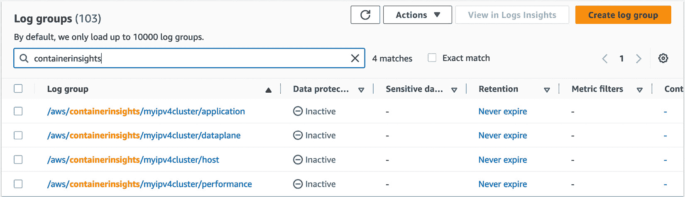
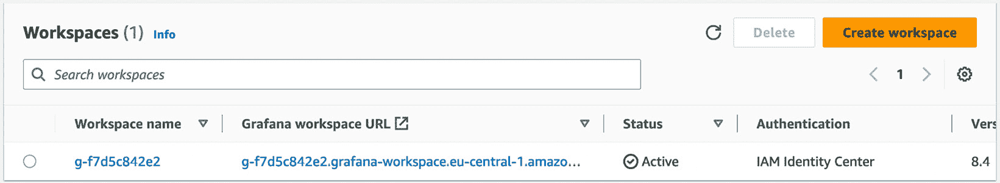

# 第十七章：EKS 可观察性

在本书中，我们已经探讨了如何构建 EKS 集群和部署工作负载。然而，任何 EKS 部署的一个关键部分是可观察性。可观察性是指能够解读来自集群/工作负载的日志和指标，没有它，您无法排查/解决问题或理解容量或性能。可观察性还包括追踪，它允许您在请求穿越不同的 EKS 工作负载（微服务）时进行跟踪，从而简化分布式系统中的故障排除。

在本章中，我们将讨论您可以用来原生监控 AWS 上的集群和工作负载，或使用第三方工具进行监控的工具和技术。我们将涵盖以下主题：

+   使用原生 AWS 工具监控集群和 Pod

+   使用 Prometheus 和 Grafana 的托管服务构建仪表板

+   使用 OpenTelemetry 进行追踪

+   使用 DevOps Guru 进行机器学习

# 技术要求

您应当熟悉 YAML、AWS IAM 和 EKS 架构。在开始本章之前，请确保以下内容：

+   您能够连接到 EKS 集群 API 端点

+   您的工作站上已安装 AWS CLI、Docker 和 `kubectl` 二进制文件，并且您具有管理员权限

# 使用原生 AWS 工具监控集群和 Pod

AWS 部署 Kubernetes（EKS）相较于本地部署 Kubernetes 的一个主要优势在于它已预先集成到 CloudWatch 中，CloudWatch 是 AWS 的主要日志记录和监控平台。使用标准的 EKS 集群，您将自动获得控制平面日志、EC2 工作节点和负载均衡器（网络或应用负载均衡器）日志和指标，以及来自其他 AWS 服务的指标和日志，如数据库、消息队列等。

让我们来看看如何使用标准的 EC2 指标创建一个基本的 CloudWatch 仪表板，以了解我们集群的工作节点。

## 创建基本的 CloudWatch 仪表板

我们将使用 Terraform 创建一个简单的仪表板，显示所有带有特定集群名称标签的实例的聚合视图，并显示第二个仪表板，显示每个独立节点。接下来的代码片段展示了基本结构，一个 `data` 对象（用于检索当前所有 AWS 凭证数据）和一个 `aws_cloudwatch_dashboard` 对象，该对象包含两个其他对象（在下文中展示）：

```
data "aws_caller_identity" "current" {}
resource "aws_cloudwatch_dashboard" "simple_Dashboard" {
  dashboard_name = "EKS-Dashboard"
  dashboard_body = <<EOF
{"widgets": [{widget1},{widget2}]}
EOF }
```

重要说明

您需要用接下来显示的实际代码替换 `{widget1|2}` 标记。

对于第一个小部件，我们将收集两个指标（CPU 和网络流量出）并基于节点组名称进行聚合，使用 `eks:cluster-name` 标签来选择属于我们 `myipv4cluster` 集群的节点：

```
{ "type": "explorer",
  "width": 24,
   "height": 2,
   "x": 0,
   "y": 0,
            "properties": {
                "metrics": [
                    { "metricName": "CPUUtilization",
                        "resourceType": "AWS::EC2::Instance",
                        "stat": "Average"
                    },
                    {. "metricName": "NetworkOut",
                        "resourceType": "AWS::EC2::Instance",
                        "stat": "Average"
                    }],
                "region":"eu-central-1",
                "aggregateBy": {
                    "key": "eks:nodegroup-name",
                    "func": "MAX"
                },
                "labels": [
                    {
                        "key": "eks:cluster-name",
                        "value": "myipv4cluster"
                    }
                ],
                "widgetOptions": {
                    "legend": {
                        "position": "bottom"
                    },
                    "view": "timeSeries",
                    "rowsPerPage": 1,
                    "widgetsPerRow": 2
                },
                "period": 60,
                "title": "Cluster EC2 Instances (aggregated)"
            }}
```

下图显示了 AWS 仪表板中的小部件，按节点组聚合了两个指标；`ipv4mng` 是该集群中唯一的节点组。


图 17.1 – 聚合的 CloudWatch 仪表板小部件

第二个小部件完全相同，但在小部件定义中没有包含 `aggregateBy` 键，因此生成以下可视化，它展示了相同的数据，但同时还显示了各个实例。


图 17.2 – CloudWatch 实例仪表盘小部件

由于 AWS 管理 EKS 控制平面，默认情况下我们看不到 Kubernetes 控制平面指标。接下来，让我们看看如何查看控制平面指标并将其添加到仪表盘中。

## 查看控制平面日志

EKS 集群生成以下集群控制平面日志。每条日志对应 EKS 控制平面的一个特定组件：

+   **审计日志**：这些日志包含一组记录，描述了用户或系统在使用 K8s API 时的操作。它们是了解集群发生了什么、何时发生以及谁导致这一事件的非常有价值的数据来源。

+   **身份验证日志**：这些日志包含一组记录，描述了使用 IAM 凭证对用户和系统进行身份验证的过程，对于更详细地了解谁进行身份验证并使用集群非常有用。

+   **API 服务器日志**：这些日志包含一组记录，描述了不同组件使用的标志，对于理解集群如何被使用和配置非常有用。

+   **控制器日志**：这些日志包含一组记录，描述了集群执行调度等操作时使用的控制循环，对于理解控制平面的运行非常有用。

+   **调度器日志**：这些日志包含一组记录，描述了调度器部署、替换和删除 Pods 及 K8s 资源的操作，对于理解这个关键组件的工作原理非常有用。

更多详细信息可以在 K8s 文档的主要调试和日志记录部分找到，网址：[`kubernetes.io/docs/tasks/debug/`](https://kubernetes.io/docs/tasks/debug/)。

一种典型的最佳实践是为所有集群启用审计和身份验证日志，默认情况下，这些日志会发送到 CloudWatch 日志，可以用于调试、事件调查和取证。检查集群启用了哪些日志的最简单方法是使用 AWS 控制台，并浏览到 Amazon EKS 下的集群。以下是没有启用 API 日志的 **日志记录** 屏幕示例：


图 17.3 – 在 AWS 控制台中验证 EKS 集群日志

我们可以修改集群配置，通过以下命令启用审计和身份验证日志：

```
$ aws eks update-cluster-config --region eu-central-1 --name myipv4cluster --logging
'{"clusterLogging":[{"types":["audit","authenticator"],"enabled":true}]}'
{
    "update": {
        "status": "InProgress",
        "errors": [],
……
        "type": "LoggingUpdate",
        "id": "223148bb-8ec1-4e58-8b0e-b1c681c765a3",
        "createdAt": 1679304779.614}}
```

我们可以使用以下命令验证更新是否成功：

```
$ aws eks describe-update --region eu-central-1 --name myipv4cluster \
    --update-id 223148bb-8ec1-4e58-8b0e-b1c681c765a3
{
    "update": {
        "status": "Successful",
        "errors": [],
…..
        "type": "LoggingUpdate",
        "id": "223148bb-8ec1-4e58-8b0e-b1c681c765a3",
        "createdAt": 1679304779.614
    }}
```

如果现在查看 CloudWatch 服务，在 AWS 控制台中，我们将看到为我们的集群创建了一个新的日志组，我们可以将其用作查询和其他 CloudWatch 功能的数据源。以下是 `myipv4cluster` 日志组的示意图。


图 17.4 – CloudWatch 集群日志组

现在我们有了数据源，即 EKS 控制平面日志，我们可以使用 `aws-auth` ConfigMap 来控制访问 EKS 集群。我们还可以通过 **日志** **洞察** 屏幕上的 **添加到仪表板** 按钮将其添加到我们的简单仪表板中：


图 17.5 – 使用 Log Insights 生成 EKS 审计数据的洞察

重要说明

因为控制平面日志依赖 Amazon CloudWatch 日志来存储数据流、可视化和洞察，因此将会产生额外费用。欲了解更多详细信息，请参考 CloudWatch 定价页面：[`aws.amazon.com/cloudwatch/pricing/`](https://aws.amazon.com/cloudwatch/pricing/)。

默认情况下，CloudWatch 会无限期地保留你的日志，并且它们永远不会过期。这意味着它们不会被删除，除非你手动清理它们。如果 CloudWatch 日志组保留了你不想保存的旧控制平面日志，这可能会增加你的数据存储成本。

为了优化存储成本，有一个小窍门可以通过为每个 CloudWatch 日志组配置保留策略来节省开支。通过设置日志组的保留期限，任何超过保留设置的日志流将在该日志组中自动删除。你可以选择将 EKS 控制平面日志的保留期限设置为从 1 天到 10 年。

你可以按照以下步骤为 CloudWatch 日志组配置日志保留策略：

1.  要查找你的集群的 CloudWatch 日志组，请进入 **CloudWatch** | **日志组** 并搜索你的集群名称。

1.  在 **操作** 下拉菜单中，选择 **编辑保留设置**（以下图为示例）：


图 17.6 – 编辑日志组的保留设置

1.  在下拉菜单中选择日志保留值并保存设置。一个典型的值是保留日志*30 天/1 个月*，然后删除它们，但这取决于你需要日志的用途，因为一些日志可能需要为合规或安全目的存储。

缩小旧的日志流可以确保只保留你真正关心的数据。这是另一个有用的技巧，可以帮助你降低在 Amazon CloudWatch 日志组中存储 EKS 控制平面日志的存储成本。

现在我们已经了解了 EKS 默认提供的功能，接下来我们将探讨如何增加一些内容以提升整体可观测性体验，从控制平面和 Pod 指标及日志开始。

## 探索控制平面和 Pod 指标

Kubernetes 控制平面组件在 `/metrics` 端点上以 Prometheus Metrics 格式公开指标。您可以使用 `kubectl` 或通过 *抓取* `/metrics` 端点来访问这些指标。一个示例是使用 `kubectl` 提取节点数据，并使用 `jq` 工具来格式化数据并筛选到第一个（`0`）节点。在输出的最后，您可以看到 CPU 和 RAM 的节点 `usage` 数据：

```
$ kubectl get --raw "/apis/metrics.k8s.io/v1beta1/nodes" | jq '.items[0]'
{"metadata": {
    "name": "ip-1.2.3.4.eu-central-1.compute.internal",
    "creationTimestamp": "2023-03-18T15:23:51Z",
    "labels": {
      ….
      "failure-domain.beta.kubernetes.io/region": "..1",
    }
  },
  "timestamp": "2023-03-18T15:23:40Z",
  "window": "20.029s",
  "usage": {
    "cpu": "48636622n",
    "memory": "1562400Ki"
  }}
```

我们现在将 AWS `/metrics` 数据以及应用日志安装到 CloudWatch。这是通过安装两个代理程序来完成的，一个是 CloudWatch 代理（用于指标），另一个是 Fluent Bit 或 FluentD（用于日志）。我们将使用 QuickStart 指南，使用 Fluent Bit（这是一种更高效的代理程序）。

首先要做的是授予工作节点访问 CloudWatch API 的权限。我们将把 `CloudWatchAgentServerPolicy` 添加到工作节点的 IAM 策略中。下面显示了一个示例。这将允许任何 CloudWatch 代理或 FluentBit Pods 与 CloudWatch API 进行通信。


图 17.7 – CI 需要的额外权限

一旦我们应用了权限，就可以安装这两个代理程序（CW 和 FluentBit）。

我们现在可以使用此 URL 上显示的说明来安装代理程序：[`docs.aws.amazon.com/AmazonCloudWatch/latest/monitoring/Container-Insights-setup-EKS-quickstart.html`](https://docs.aws.amazon.com/AmazonCloudWatch/latest/monitoring/Container-Insights-setup-EKS-quickstart.html)。接下来将显示配置和输出，我们已修改 `ClusterName` 和 `RegionName` 以匹配我们的集群配置。当我们执行时，CloudWatch 和 FluentBit 代理程序将被安装：

```
$ ClusterName=myipv4cluster
$ RegionName=eu-central-1
$ FluentBitHttpPort='2020'
$ FluentBitReadFromHead='Off'
$ [[ ${FluentBitReadFromHead} = 'On' ]] && FluentBitReadFromTail='Off'|| FluentBitReadFromTail='On'
[$ [ -z ${FluentBitHttpPort} ]] && FluentBitHttpServer='Off' || FluentBitHttpServer='On'
$ curl https://raw.githubusercontent.com/aws-samples/amazon-cloudwatch-container-insights/latest/k8s-deployment-manifest-templates/deployment-mode/daemonset/container-insights-monitoring/quickstart/cwagent-fluent-bit-quickstart.yaml | sed 's/{{cluster_name}}/'${ClusterName}'/;s/{{region_name}}/'${RegionName}'/;s/{{http_server_toggle}}/"'${FluentBitHttpServer}'"/;s/{{http_server_port}}/"'${FluentBitHttpPort}'"/;s/{{read_from_head}}/"'${FluentBitReadFromHead}'"/;s/{{read_from_tail}}/"'${FluentBitReadFromTail}'"/' | kubectl apply -f –
% Total%Received%Xferd Average Speed Time Time Time  Current
100 16784  100 16784    0     0  95087      0 … 95363
…
daemonset.apps/fluent-bit created
```

我们可以使用以下命令验证代理程序的部署：

```
$ kubectl get po -n amazon-cloudwatch
NAME                     READY   STATUS    RESTARTS   AGE
cloudwatch-agent-6zl6c   1/1     Running   0          3m32s
cloudwatch-agent-xp45k   1/1     Running   0          3m32s
fluent-bit-vl29d         1/1     Running   0          3m32s
fluent-bit-vpswx         1/1     Running   0          3m32s
```

### 使用 FluentBit 进行日志记录

现在我们已经启动了代理程序，我们可以查看 CloudWatch 以查看正在生成的日志和指标。首先，如果我们查看 CloudWatch 日志并筛选 `containerinsights`，我们会看到四个新的日志组。下面显示了一个示例：



图 17.8 – CI 创建的新日志组

这些日志从节点日志中提取数据。下表显示了每个主机上使用的节点日志和日志文件。`application` 日志组包含写入 `stdout` 的容器日志。

| `/``aws/containerinsights/Cluster_Name/ application` | `/``var/log/containers` 中的所有日志文件 |
| --- | --- |
| `/``aws/containerinsights/Cluster_Name/ host` | `/``var/log/dmesg`、`/var/log/secure` 和 `/var/log/messages` 中的所有日志文件 |
| `/``aws/containerinsights/Cluster_Name/ dataplane` | `/``var/log/journal` 中的日志，针对 `kubelet.service`、`kubeproxy.service`、`docker.service` |
| `/``aws/containerinsights/Cluster_Name/ performance` | 包含 K8s 性能事件，详细信息请参见 [`docs.aws.amazon.com/AmazonCloudWatch/latest/monitoring/Container-Insights-reference-performance-logs-EKS.html`](https://docs.aws.amazon.com/AmazonCloudWatch/latest/monitoring/Container-Insights-reference-performance-logs-EKS.html) |

表 17.1 – CI 日志组配置

我们使用以下清单创建一个生成日志消息然后自我终止的 Pod：

```
apiVersion: v1
kind: Pod
metadata:
  name: logger
  namespace: logger-app
spec:
  containers:
  - image: busybox
    command: ["/bin/sh"]
    args: ["-c", "for i in `seq 4`; do echo 'Logging Message';done"]
    imagePullPolicy: IfNotPresent
    name: busybox
  restartPolicy: Never
```

我们可以使用以下命令创建命名空间、部署 Pod，并验证它是否生成日志消息：

```
$ kubectl create namespace logger-app
$ kubectl create -f logger.yaml
$ kubectl logs logger -n logger-app
Logging Message
Logging Message
Logging Message
Logging Message
```

如果现在查看 `application` 日志组，您将看到 `logger` Pod 的日志条目，该 Pod 位于 `logger-app` 命名空间中，并在您的某台主机上运行。在接下来的示例中，它是主机 `192.168.32.216`：


图 17.9 – CloudWatch 容器日志输出

从这一点开始，您可以像我们在 *查看控制平面日志* 部分中那样可视化您的日志。您还可以将日志转换为指标，并在我们之前创建的仪表板中进行可视化，或者将它们转发到其他日志服务，如 OpenSearch、Loki 或 Splunk。

### 使用 CloudWatch 的指标

CloudWatch CI 使用指标和日志的组合，通过 FluentBit 和 CloudWatch 代理的数据创建不同的视图和仪表板。最有用的视图之一是地图视图，它提供集群中部署资源的图形化视图，您可以在其上叠加 CPU 或内存热图。下面的示例展示了我们的集群，它显示了我们之前部署的 `logger` Pod，并且所有 CPU 状态均为绿色。


图 17.10 – CI 地图视图

我们可以将视图从地图更改为性能仪表板，深入分析 CPU/RAM 等问题。以下示例显示了按命名空间划分的 CPU、RAM 等的详细信息（每一行）：


图 17.11 – 每个命名空间的 CI 性能

重要提示

CloudWatch CI 是收费的，包括日志存储费用和 CloudWatch 自定义指标费用：[`aws.amazon.com/cloudwatch/pricing/`](https://aws.amazon.com/cloudwatch/pricing/)。

现在我们已经了解了如何使用原生 AWS 工具，接下来让我们看看如何使用一些标准的 K8s 第三方工具。

# 使用托管服务创建 Prometheus 和 Grafana 仪表板

Prometheus 和 Grafana 是 K8s 的事实标准监控工具。Prometheus 是一个从 `/metrics` 端点毕业的项目，可以生成告警并存储/转发数据。Grafana 是一个开源工具，可以可视化指标（时间序列）以及日志和追踪数据（在 *使用 OpenTelemetry 进行追踪* 部分讨论）。Prometheus 和 Grafana 一起提供与 CloudWatch 相当的功能，那么为什么要使用它们呢？

由于 Grafana 是开源的，它被广泛应用于社区，这意味着有很多为它创建的可重用仪表板，它集成了各种数据源（不仅仅是 AWS），并且可以说，它比 CloudWatch 拥有更完整的可视化功能。Prometheus 支持任何类型的健康检查端点，因此可以轻松用于您的应用程序以及一般的 Pod/集群度量。因此，Grafana 和 Prometheus 提供了一种灵活的解决方案，如果运行在 EKS 或 EC2 上，您只需要支付运行费用。这些工具的主要挑战是您需要管理基础设施，并且在某些情况下，需要使用额外的产品来管理度量或日志数据的长期存储。这正是**AWS 托管 Prometheus**（**AMP**）和**AWS 托管 Grafana**（**AMG**）发挥作用的地方，它们提供了灵活性而无需管理的负担。

## 设置 AMP 和 AWS Distro for OpenTelemetry（ADOT）

我们要做的第一件事是创建一个 AMP 来捕获我们的度量数据；AWS 将创建一个区域来存储和查询度量（时间序列数据）。接下来显示的 Terraform 代码将创建一个`myamp`工作区：

```
resource "aws_prometheus_workspace" "myamp" {
  alias = "myamp"
}
```

以下 AWS SDK 命令可用于描述工作区并获取工作区的端点：

```
$ aws amp list-workspaces
{    "workspaces": [{..
            "alias": "myamp",
            "workspaceId": "ws-503025bc-01d5-463c-9157-11",
            "createdAt": 1679741187.4,
            "arn": "arn:aws:aps:eu-central-1:22:workspace/ws-503025bc-..}]
$ aws amp describe-workspace --workspace-id ws-503025bc-01d5-463c-9157-11
{..
        "prometheusEndpoint": "https://aps-workspaces.eu-central-1.amazonaws.com/workspaces/ws-503025bc-01d5-463c-9157-11/",
        "alias": "myamp",
        "workspaceId": "ws-503025bc-01d5-463c-9157-11",
        "arn": "arn:aws:aps:eu-central-1:22:workspace/ws-503025bc-01d5-463c-9157-11",
        "createdAt": 1679741187.4
}}}
```

AMP 可以从两个主要来源摄取度量数据，这些来源又“抓取”来自 Prometheus 启用的端点（例如 K8s 的`/metrics`端点）的度量数据。您可以使用现有的 Prometheus 服务器或**ADOT**来远程写入度量数据到 AMP 工作区。

我们将使用 ADOT，因为它稍后会用于追踪：

1.  我们需要做的第一件事是创建`prometheus`命名空间来托管 ADOT，并创建一个带有 IAM 映射（IRSA）的服务账户。示例命令如下所示：

    ```
    $ kubectl create ns prometheus
    namespace/prometheus created
    $ eksctl create iamserviceaccount --name amp-iamproxy-ingest-role \
    --namespace prometheus --cluster myipv4cluster \
    --attach-policy-arn arn:aws:iam::aws:policy/AmazonPrometheusRemoteWriteAccess \
    --approve --override-existing-serviceaccounts
    …..
    2023-03-25 16:02:19 created serviceaccount "prometheus/amp-iamproxy-ingest-role"
    ```

1.  我们需要安装`cert-manager`（如果尚未安装），因为 ADOT 在操作过程中（如 sidecar 注入）将使用它。所需的命令如下所示：

    ```
    $ kubectl apply -f https://github.com/cert-manager/cert-manager/releases/download/v1.8.2
    …..
    validatingwebhookconfiguration.admissionregistration.k8s.io/cert-manager-webhook created
    $ kubectl get po -n cert-manager
    NAME            READY   STATUS    RESTARTS   AGE
    cert-manager-12-5k4kx    1/1    Running   0          47s
    cert-manager-cainjector-12-kj8w5   1/1  Running       47s
    cert-manager-webhook-12-bptdx      1/1  Running       47s
    ```

1.  我们将把 ADOT 作为附加组件安装，以便简化升级和管理，因此现在需要授予 EKS 附加组件安装 ADOT 的权限，使用以下命令：

    ```
    $ kubectl apply -f https://amazon-eks.s3.amazonaws.com/docs/addons-otel-permissions.yaml
    namespace/opentelemetry-operator-system created
    clusterrole.rbac.authorization.k8s.io/eks:addon-manager-otel created
    clusterrolebinding.rbac.authorization.k8s.io/eks:addon-manager-otel created
    role.rbac.authorization.k8s.io/eks:addon-manager created
    rolebinding.rbac.authorization.k8s.io/eks:addon-manager created
    ```

1.  我们将使用以下命令来部署和验证 ADOT 部署：

    ```
    $ CLUSTER_NAME=myipv4cluster
    $ aws eks create-addon --addon-name adot --addon-version v0.51.0-eksbuild.1 --cluster-name $CLUSTER_NAME
    {"addon": {
            "status": "CREATING",
    ..
            "createdAt": 1679761283.129}}
    $ aws eks describe-addon --addon-name adot --cluster-name $CLUSTER_NAME | jq .addon.status
    "ACTIVE"
    ```

1.  我们现在可以使用以下命令下载并配置 ADOT 部署，修改`REGION`和`prometheusEndpoint`：

    ```
    $ AMP_REMOTE_WRITE_URL=https://aps-workspaces.eu-central-1.amazonaws.com/workspaces/ws-503025bc-01d5-463c-9157-11/api/v1/remote_write
    $ AWS_REGION=eu-central-1
    $ curl -O https://raw.githubusercontent.com/aws-samples/one-observability-demo/main/PetAdoptions/cdk/pet_stack/resources/otel-collector-prometheus.yaml
      % Total    % Received % Xferd  Average Speed   …
    100 12480  100 12480    0     0  …
    $ sed -i -e s/AWS_REGION/$AWS_REGION/g otel-collector-prometheus.yaml
    $ sed -i -e s^AMP_WORKSPACE_URL^$AMP_REMOTE_WRITE_URL^g otel-collector-prometheus.yamls
    ```

1.  最后，我们可以使用我们下载并修改的`otel-collector-prometheus.yaml`清单来安装并验证 ADOT，使用以下命令：

    ```
    $ kubectl apply -f ./otel-collector-prometheus.yaml
    opentelemetrycollector.opentelemetry.io/observability created
    clusterrole.rbac.authorization.k8s.io/otel-prometheus-role created
    clusterrolebinding.rbac.authorization.k8s.io/otel-prometheus-role-binding created
    $ kubectl get all -n prometheus
    NAME     READY   STATUS    RESTARTS   AGE
    pod/observability-collector-123   1/1     Running      110s
    NAME  TYPE  CLUSTER-IP  EXTERNAL-IP   PORT(S)    AGE
    service/observability-collector-monitoring   ClusterIP   10.100.154.149   <none>        8888/TCP   110s
    NAME   READY   UP-TO-DATE   AVAILABLE   AGE
    deployment.apps/observability-collector   1/1 110s
    NAME        DESIRED   CURRENT   READY   AGE
    replicaset.apps/observability-collector-123   1   1 110s
    ```

1.  我们现在已将 ADOT 设置并配置为将度量数据发送到 AMP。我们可以通过 AMS Prometheus API 直接查询，或者通过 Grafana 查询。作为快速检查，我们可以安装并使用`awscurl`（它允许我们使用 AWS 凭证直接调用 API）来测试 AMP 是否接收到度量数据：

    ```
    $ pip3 install awscurl
    Defaulting to user installation because normal site-packages is not writeable
    Collecting awscurl
      Downloading awscurl-0.26-py3-none
    ….
    $ export AMP_QUERY_ENDPOINT=https://aps-workspaces.eu-central-1.amazonaws.com/workspaces/ws-503025bc-01d5-463c-9157-11/api/v1/query
    $ awscurl -X POST --region eu-central-1  --service aps "$AMP_QUERY_ENDPOINT?query=up"  | jq .
    {"status": "success",
      "data": {
        "resultType": "vector",
        "result": [
          {
            "metric": {
              "__name__": "up",
              "app": "cert-manager",
              "app_kubernetes_io_component": "controller",
              "app_kubernetes_io_instance": "cert-manager",
              "app_kubernetes_io_name": "cert-manager",
              "app_kubernetes_io_version": "v1.8.2",
              "instance": "192.168.68.6:9402",
              "job": "kubernetes-pods",
              "kubernetes_namespace": "cert-manager",
              "kubernetes_pod_name": "cert-manager-12-5k4kx",
              "pod_template_hash": "66b646d76"},
            "value": [
              1679763539.307,
              "1"]},
          {
            "metric": {
              "__name__": "up",
    …
           ]}]}}
    ```

重要提示

要访问 Prometheus API，无论是发送度量数据还是进行查询，我们需要通过 NAT 或互联网网关，或者使用 VPC 端点来访问公共的 AWS Prometheus API。

现在我们已经安装了 ADOT 并验证了指标已发送并存储在 Prometheus 中，我们可以看看如何通过 AMG 以图形化方式可视化这些指标。

## 设置 AMG 并创建仪表盘

AMG 需要有一个用户身份存储，这与 AWS IAM 不同。它将通过 AWS 身份中心（AWS Single Sign-On 的继任者）或通过 SAML 进行集成。**安全断言标记语言**（**SAML**）是一种用于认证的开放标准，它将在两个方之间传输认证数据：**身份提供者**（**IdP**）和**服务提供者**（**SP**）。我们将使用**AWS 身份中心**（**AIC**），因为它的设置更简单。通过 AWS 控制台，选择身份中心服务并点击**启用**按钮。接下来的控制台启动屏幕如下所示：


图 17.12 – AWS 身份中心启动屏幕

重要提示

您将被要求创建一个组织，用于对多个账户进行分组和管理。接受此操作后，您还将收到一封电子邮件，您需要验证该邮件，以便创建组织，并最终创建身份中心。

启用 AIC 后，您可以通过控制台点击**添加用户**按钮并输入一些基本信息，如姓名和电子邮件，来添加用户。在验证您的用户电子邮件并设置密码后，您将能够通过 AIC 控制台登录。


图 17.13 – 示例 AIC 用户管理员界面

如果我们点击前面图中显示的用户，我们可以获得该用户的唯一身份标识符（**用户 ID**）。这在以下屏幕截图中显示为**73847832-1031-70a6-d142-6fbb72a512f0**。我们将在接下来的例子中配置 AMG 时使用这个 ID。


图 17.14 – AIC 用户详情

和 AMP 一样，AMG 是围绕工作区组织的。我们需要做的第一件事是为工作区设置 IAM 策略，以便能够与数据源（在我们的例子中是 AMP）进行通信。我们将创建一个 AMG 可以承担的角色，并将 Prometheus 权限附加到该角色。接下来的示例使用了 Terraform：

```
resource "aws_iam_role" "assume" {
  name = "grafana-assume"
  assume_role_policy = jsonencode({
    Version = "2012-10-17"
    Statement = [
      { Action = "sts:AssumeRole"
        Effect = "Allow"
        Sid    = ""
        Principal = {
          Service = "grafana.amazonaws.com"
        }
      },
    ]
  })
}
resource "aws_iam_policy" "policy" {
  name        = "amgadditional"
  path        = "/"
  description = "additional policies"
  policy = jsonencode({
    Version = "2012-10-17"
    Statement = [
      {
        Action = [
          "aps:ListWorkspaces",
          "aps:DescribeWorkspace",
          "aps:QueryMetrics",
          "aps:GetLabels",
          "aps:GetSeries",
          "aps:GetMetricMetadata"
        ]
        Effect   = "Allow"
        Resource = "*"
      },]})}
resource "aws_iam_role_policy_attachment" "amgattachement" {
  role       = aws_iam_role.assume.name
  policy_arn = aws_iam_policy.policy.arn
}
```

现在我们已经拥有了合适的 IAM 权限，允许 AMG 查询 Prometheus，我们可以创建工作区并将之前创建的用户（AIC）指定为管理员。我们将设置认证提供者为 `AWS_SSO`，并配置 Prometheus 和 CloudWatch 的引用。接下来的示例使用了 Terraform：

```
resource "aws_grafana_workspace" "myamg" {
  account_access_type      = "CURRENT_ACCOUNT"
  authentication_providers = ["AWS_SSO"]
  permission_type          = "SERVICE_MANAGED"
  role_arn                 = aws_iam_role.assume.arn
  data_sources              = ["PROMETHEUS","CLOUDWATCH"]
}
resource "aws_grafana_role_association" "admin" {
  role         = "ADMIN"
  user_ids     = ["73847832-1031-70a6-d142-6fbb72a512f0"]
  workspace_id = aws_grafana_workspace.myamg.id
}
```

重要提示

这可能需要几分钟来配置，您需要将 `user_ids` 更改为您在 AIC 中创建的用户 ID。

如果我们现在进入 AWS 中的 AMG 服务，我们将看到新的工作区，点击**Grafana 工作区 URL**下的链接将启动 Grafana 欢迎页面，我们可以使用在前面步骤中创建并关联的 AIC 凭据进行登录。接下来将展示一个示例：



图 17.15 – Grafana 工作区启动屏幕

虽然我们已经配置了 Grafana 服务以支持 Prometheus 和 CloudWatch，但我们需要在 Grafana 中配置数据源才能看到任何指标。第一步是点击左侧边栏中的 AWS 图标，然后点击**数据源**链接。接下来将展示一个示例：


图 17.16 – 选择 AWS 数据源

接下来，选择我们在*设置 AMP 和* *ADOT*章节中使用 Terraform 创建的`myapm`实例：


图 17.17 – 添加 AMP 数据源

由于我们现在有了数据源，我们可以使用开源仪表板；我们将使用 Kubernetes 集群监控（通过 Prometheus），其 ID 为`3119`。如果点击 ID 中的`3119`，然后加载并保存仪表板，接下来将展示一个示例：


图 17.18 – 从 Grafana.com 导入开源仪表板

Grafana 的一个巨大优势是我们可以轻松地使用来自社区的工作成果。在接下来的示例中，我们刚刚导入的仪表板为集群提供了全面的视图，如果需要，我们甚至可以深入查看单个节点。


图 17.19 – Kubernetes 集群仪表板

重要说明

请确保你已选择在本节中我们之前添加的 AMP 实例作为数据源。

现在我们已经了解了如何使用社区仪表板通过 AMG 可视化这些指标，接下来让我们看看如何使用 ADOT 发送应用程序跟踪信息。

# 使用 OpenTelemetry 进行跟踪

**OpenTelemetry** (**OTel**)是一个 CNCF 项目，提供了一种标准方式来发送应用程序跟踪信息。随着你开始构建分布式系统，跟踪变得非常重要，因为你需要能够追踪请求和响应在多个系统中的流转。OTel 提供了一个与供应商无关的工具库，可以用于将跟踪数据转发到后端进行可视化或分析。

在本书中，我们将使用 ADOT 作为跟踪转发器，AWS X-Ray 来分析和可视化跟踪数据。

## 修改我们的 ADOT 配置

由于 X-Ray 是 AWS 服务，我们首先需要修改服务账户权限，以允许它将跟踪数据发送到 X-Ray，因为当前它只有 AMP 权限。如果我们查看当前的`ServiceAccount`，可以得到 IAM 角色`arn`，如下所示：

```
$ kubectl get sa amp-iamproxy-ingest-role -n prometheus -o json
{
    "apiVersion": "v1",
    "kind": "ServiceAccount",
    "metadata": {
        "annotations": {
            "eks.amazonaws.com/role-arn": "arn:aws:iam::112233:role/eksctl-myipv4cluster-addon-iamserviceaccount-Role1-1V5TZL1L6J58X"
….
}
```

然后，我们可以直接将 X-Ray 权限添加到 IAM 角色中，如下图所示。我们将添加 `AWSXRayDaemonWriteAccess` 托管策略，以允许 ADOT 写入跟踪和段。


图 17.20 – 为 ADOT IRSA 添加 X-Ray 权限

我们现在需要修改 ADOT 配置以支持 OTel 和 X-Ray。完整的配置可以在 [`raw.githubusercontent.com/aws-observability/aws-otel-community/master/sample-configs/operator/collector-config-xray.yaml`](https://raw.githubusercontent.com/aws-observability/aws-otel-community/master/sample-configs/operator/collector-config-xray.yaml) 找到，新的接收器、处理器、出口器和管道已添加到 *设置 AMP 和* *ADOT* 部分的 `otel-collector-prometheus.yaml` 文件中：

```
receivers:
      otlp:
        protocols:
          grpc:
            endpoint: 0.0.0.0:4317
          http:
            endpoint: 0.0.0.0:4318
processors:
      batch/traces:
        timeout: 1s
        send_batch_size: 50
exporters:
      awsxray:
        region: eu-central-1
pipelines:
      traces:
        receivers: [otlp]
        processors: [batch/traces]
        exporters: [awsxray]
```

现在我们可以重新部署 ADOT 收集器，或者简单地删除它并重新创建，但如果我们查看日志，就可以看到新元素已经成功启动，我们将看到一个`一切准备就绪`的消息。接下来展示了命令和一些示例输出文本：

```
$ kubectl logs observability-collector-11 -n prometheus
2023/03/26 17:05:54 AWS OTel Collector version: v0.20.0
….
2023-03-26T17:05:54.973Z        info    pipelines/pipelines.go:82       Exporter started.       {"kind": "exporter", "data_type": "traces", "name": "awsxray"}
…
2023-03-26T17:05:54.973Z        info    pipelines/pipelines.go:82       Exporter started.
2023-03-26T17:05:54.974Z        info    pipelines/pipelines.go:102      Receiver is starting... {"kind": "receiver", "name": "otlp", "pipeline": "traces"}
2023-03-26T17:05:54.974Z        info    otlpreceiver/otlp.go:70 Starting GRPC server on endpoint 0.0.0.0:4317   {"kind": "receiver", "name": "otlp", "pipeline": "traces"}
2023-03-26T17:05:54.974Z        info    otlpreceiver/otlp.go:88 Starting HTTP server on endpoint 0.0.0.0:4318   {"kind": "receiver", "name": "otlp", "pipeline": "traces"}
…..
2023-03-26T17:05:54.975Z        info    service/collector.go:128        Everything is ready. Begin running and processing data.
```

对您的应用程序进行 OTel 跟踪仪表化可能是一个复杂的任务，因此它超出了本书的范围。相反，我们将使用 OTel 提供的一个简单的跟踪发射器来探索您可以使用 X-Ray 做些什么。

第一步是创建一个 K8s 命名空间来托管我们的发射器；接下来展示了一个示例：

```
$ kubectl create ns adot
namespace/adot created
```

接下来，我们将下载、修改并部署来自 [`raw.githubusercontent.com/aws-observability/aws-otel-community/master/sample-configs/sample-app.yaml`](https://raw.githubusercontent.com/aws-observability/aws-otel-community/master/sample-configs/sample-app.yaml) 的示例应用程序（发射器）。您需要更改接下来展示的清单中的元素：

```
….
---
apiVersion: apps/v1
kind: Deployment
…
    spec:
      containers:
        - env:
            - name: AWS_REGION
              value: eu-central-1
            - name: LISTEN_ADDRESS
              value: 0.0.0.0:4567
            - name: OTEL_EXPORTER_OTLP_ENDPOINT
              value: http://observability-collector.prometheus:4317
            - name: OTEL_RESOURCE_ATTRIBUTES
              value: service.namespace=adot,service.name=emitter
          image: public.ecr.aws/aws-otel-test/aws-otel-java-spark:1.17.0
…..
```

一旦我们对 `AWS_REGION`、`OTEL_EXPORTER_OTLP_ENDPOINT` 和 `OTEL_RESOURCE_ATTRIBUTES` 环境变量进行了修改，以指向我们修改过的 ADOT 实例，我们可以部署清单并使用接下来展示的命令验证它是否正在运行：

```
$ kubectl create -f sample-app-modified.yaml -n adot
service/sample-app created
deployment.apps/sample-app created
$ kubectl get po -n adot
NAME                         READY   STATUS    RESTARTS   AGE
sample-app-7cbb94b84-ckhdc   1/1     Running   0          8s
```

我们现在需要生成一些流量。幸运的是，OTel 还提供了一个流量生成器，它是一个与示例应用程序位于同一命名空间中的 Pod，并且会向应用程序 API 发出查询，后者又会向 `amazon.com` 发出调用。流量生成器 Pod 中使用的命令如下所示，完整的清单可以从 [`raw.githubusercontent.com/aws-observability/aws-otel-community/master/sample-configs/traffic-generator.yaml`](https://raw.githubusercontent.com/aws-observability/aws-otel-community/master/sample-configs/traffic-generator.yaml) 下载：

```
….
- args:
            - /bin/bash
            - -c
            - sleep 10; while :; do curl sample-app:4567/outgoing-http-call > /dev/null 1>&1; sleep 2; curl ot-sample-app:4567/aws-sdk-call > /dev/null 2>&1; sleep 5; done
```

只要我们没有更改示例应用程序服务的名称，我们就可以保持不变运行。接下来展示的命令将部署流量生成器并开始向示例应用程序 API 发出调用：

```
$ kubectl create  -f traffic-generator.yaml -n adot
service/traffic-generator created
deployment.apps/traffic-generator created
$ kubectl get all  -n adot
NAME                  READY   STATUS    RESTARTS   AGE
pod/sample-app-7cbb94b84-ckhdc    1/1     Running   0    18m
pod/traffic-generator-123-ch4x2   1/1     Running   0    10m
```

如果我们现在进入 AWS 控制台中的 X-Ray 服务，我们将看到一个服务图，显示我们的客户端（流量生成器 Pod）正在调用 `emitter` 服务，而该服务又调用远程 [aws.amazon.com](http://aws.amazon.com) 服务。服务图可以为健康状况提供遥测数据，并将延迟（latency）应用于其上，调整单个环的大小和颜色。服务图为您提供了一种非常便捷的方式来可视化您的服务。下图展示了我们的发射器/流量生成器部署的示例：


图 17.21 – X-Ray 服务图

重要提示

由于客户端（流量生成器）代码没有与 OTel 集成，我们无法看到其延迟，因此我们的追踪从到达发射器服务时开始。

我们可以深入查看单个追踪，查看不同的段，以便故障排除或更详细地理解流量流动。在接下来的示例中，我们可以看到两个请求/响应——来自流量请求的初始请求，`GET /outgoing-http-call`，以及`aws.amazon.com`响应所花费的时间：


图 17.22 – X-Ray 追踪详情

现在我们已经探讨了使用 OTel 和 X-Ray 的追踪，我们可以看看其中一个更高级的服务——DevOps Guru，它使用机器学习模型深入研究 EKS 节点级别的问题。

# 使用机器学习与 DevOps Guru

DevOps Guru 是一项完全托管的服务，利用预训练的机器学习模型来基准化资源，并深入了解其使用情况。由于它是完全托管的，您只需要设置并允许它运行。为此，选择 **Amazon DevOps Guru** 服务并点击 **开始使用** 按钮。我们将选择监控当前账户并分析所有资源的选项，并启用该服务。下一屏幕展示了所选择的选项：


图 17.23 – DevOps Guru 选项

我们还需要告诉 DevOps Guru 需要监控哪些资源，如下图所示：


图 17.24 – DevOps Guru 设置选项

重要提示

您可能需要等待 20 到 90 分钟，等待 DevOps Guru 收集并审核数据。

分析完成后，仪表盘将更新并显示任何发现。在接下来的示例中，您可以看到一个服务视图，显示我们的 EKS 集群是健康的。

生成资源问题很困难，但 DevOps Guru 会检测出具有高内存、CPU 或文件系统利用率的 EKS 主机，以及 Pod 级别的指标，如 CPU/RAM Pod 限制问题，识别出因资源耗尽而可能产生错误的资源。Amazon DevOps Guru 还跟踪容器重启、拉取镜像的问题或应用程序启动问题，有助于识别代码或清单配置不当。

Amazon DevOps Guru 的操作开销非常低，只需启用它并让其运行，而 AWS 还不断增强底层的机器学习模型，以提供更深入的洞察，但它是收费的，所以在使用之前请查看 [`aws.amazon.com/devops-guru/pricing/`](https://aws.amazon.com/devops-guru/pricing/)。


图 17.25 – DevOps Guru 概要仪表盘

在本节中，我们已经了解了 EKS 可观察性，以及如何使用各种 AWS 服务和开源工具更好地洞察集群、节点和应用程序。现在，我们将重新回顾本章的关键学习点。

# 总结

在本章中，我们探讨了收集和分析 EKS 日志、指标和跟踪的不同方式，这通常被称为可观察性。我们首先了解了如何安装日志和指标代理（分别为 fluentBit 和 CloudWatch），这些代理可以轻松集成 AWS CloudWatch 服务和 Container Insights，以提供对数据的详细分析，而无需部署任何监控服务器或软件许可证。

虽然 CloudWatch 提供了一个完整的监控平台，我们还讨论了有些人希望使用开源或非 AWS 服务，以获得更大的灵活性并减少平台锁定。Prometheus 和 Grafana 是开源项目，提供类似于 CloudWatch 的功能，并且有着一个庞大的社区支持，但需要安装和管理。

接下来，我们回顾了如何部署和配置 AMP 和 AMG，以获得这些服务的灵活性，但又没有操作开销，以及如何将 ADOT 部署到集群中，转发 K8s /metrics 数据到 AMP。我们还从 [Grafana.com](http://Grafana.com) 部署了一个社区开发的 K8s 监控仪表盘，能够可视化标准的 K8s 指标，展示了如何轻松构建复杂的可视化。

接着，我们扩展了 ADOT 配置，支持收集 OTel 跟踪信息并将其转发到 AWS X-Ray 服务。我们在 EKS 中部署了一个简单的跟踪发射器和流量生成服务，并查看了 X-Ray 中的服务图和段信息，以帮助我们从流量量、延迟和错误的角度了解小型微服务架构中的流量流动。

最后，我们启用了 Amazon DevOps Guru 来提供更好的分析，且在集群和集群中的节点上零操作开销。

在下一章中，我们将探讨如何通过集群扩展工具和方法提高系统的弹性和性能。

# 进一步阅读

+   EKS 可观察性工具：[`docs.aws.amazon.com/eks/latest/userguide/eks-observe.html`](https://docs.aws.amazon.com/eks/latest/userguide/eks-observe.html)

+   Prometheus 指标格式：[`prometheus.io/docs/instrumenting/exposition_formats/`](https://prometheus.io/docs/instrumenting/exposition_formats/)

+   Prometheus 的更多信息：[`prometheus.io/`](https://prometheus.io/)

+   Python 中的 OpenTelemetry：[`opentelemetry.io/docs/instrumentation/python/`](https://opentelemetry.io/docs/instrumentation/python/)
