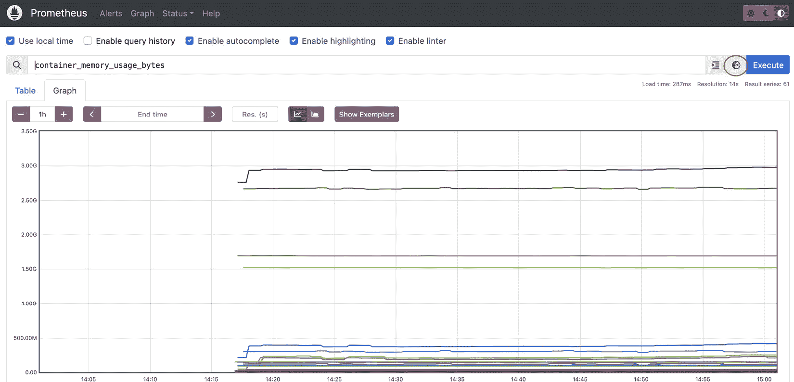

# 第十八章：扩展你的 EKS 集群

在 EKS（以及 K8s）上进行容量规划可能很困难！如果你低估或高估了集群资源，可能无法满足应用程序的需求，或者最终支付的费用比实际需要的要多。困难的原因之一是，很难准确预测应用程序的预期负载。例如，对于一个 Web 应用程序，负载通常是非确定性的，一次成功的营销活动或类似 Amazon Prime Day 的事件可能会使负载增加三倍或四倍。因此，需要某种形式的集群/Pod 扩展策略来应对现代应用程序负载的峰值和低谷。

在本章中，我们将介绍几种常见的策略和工具，这些策略和工具可以与 Amazon EKS 一起使用，并帮助你理解如何优化 EKS 集群以应对负载和成本。具体来说，本章涵盖以下主题：

+   理解 EKS 中的扩展

+   使用集群自动扩展器扩展 EC2 ASG

+   使用 Karpenter 扩展工作节点

+   使用水平 Pod 自动扩展器扩展应用程序

+   使用自定义指标扩展应用程序

+   使用 KEDA 扩展

# 技术要求

读者应当熟悉 YAML、AWS IAM 和 EKS 架构。在开始本章之前，请确保以下几点：

+   你已连接到 EKS 集群的 API 端点

+   已在你的工作站上安装 AWS CLI、Docker 和 `kubectl` 二进制文件，并具有管理员权限

# 理解 EKS 中的扩展

当我们考虑扩展任何系统或集群时，我们通常从两个维度来思考：

+   增加系统或实例的大小，称为垂直扩展

+   增加系统或实例的数量，称为水平扩展

以下图示说明了这些选项。


图 18.1 – 一般的扩展策略

扩展策略与弹性模型密切相关，其中你有一个传统的主备或 N+1 弹性架构，比如关系型数据库。然后，当你增加容量时，通常需要通过增加数据库实例的大小来进行垂直扩展。这是因为系统架构的限制。

在 K8s 中，弹性模型基于多个工作节点托管多个 Pod，通过入口负载均衡器提供一致的入口点。这意味着节点故障应该对系统影响较小。因此，扩展策略主要是水平扩展（向外扩展），虽然你也可以通过垂直扩展 Pods 来应对需求增加，但我们将重点关注水平扩展。

由于 AWS 管理 EKS 控制平面（扩展性和弹性），我们将主要关注数据平面（工作节点）和应用程序资源（Pod/容器）。让我们从高层次探讨支持 EKS 数据平面扩展的技术开始。

## EKS 扩展技术

支持 EKS 扩展的技术涉及三个层次：

1.  支持数据平面扩展的 AWS 技术，如 EC2 **自动扩展组**（**ASGs**）和允许系统与这些 ASGs 交互的 AWS API。

1.  支持扩展和部署 Pods 的 K8s 对象（类型），例如 Deployments。

1.  K8s 调度器和控制器提供了 K8s 对象（2）与 AWS 技术（1）之间的连接，支持在 Pod 和集群级别进行水平扩展。

以下图表展示了这三层技术。


图 18.2 – EKS 扩展技术

让我们详细看看这些层次。

### AWS 技术

在 *第八章**，《管理 EKS 上的工作节点*》中，我们讨论了使用 EC2 ASG 提高系统弹性的方式。当你创建一个 ASG 时，需要指定该组中 EC2 实例的最小数量、最大数量以及期望数量，组会在这些限制范围内进行扩展。调用 EC2 API 可以基于这些调用实现组的扩展和收缩（在一组冷却限制内）。调用 EC2 ASG API 的实体必须做出扩展和收缩的决策。

在 *第十五章**，《与 AWS Fargate 配合使用*》中，我们讨论了如何使用 Fargate 配置文件在 Fargate 实例上创建 Pods。在这种情况下，AWS 负责 Pods 的部署和放置，而 Fargate 服务负责扩展决策，调用方只需请求部署一个或多个 Pods。

### K8s 对象

在本书中，我们使用 K8s 部署来部署和扩展我们的 Pods。实际上，这使用了 **deployments**，它又使用 **ReplicaSets** 根据需要添加/移除新的 Pods，并支持诸如滚动更新等部署策略。K8s 还支持 StatefulSets 和 DaemonSets 进行 Pod 部署。

**StatefulSet** 是一个 K8s 控制器，用于部署 Pods，但它会保证特定的部署顺序，并且 Pod 名称是唯一的，同时还提供存储。**DaemonSet** 也是一个控制器，确保 Pod 在集群的所有节点上运行。

ReplicaSets 和 StatefulSets 都创建 Pods，期望 K8s 调度器能够部署它们。如果调度器判断没有足够的资源——通常是工作节点的 CPU/RAM 或网络端口（**NodePort** 服务）——则 Pod 会保持在 *Pending* 状态。

### K8s 调度器和控制器

K8s 被设计为可扩展的，并且可以通过控制器进行扩展。通过自动扩展，我们可以使用以下列表中的控制器扩展 EKS，稍后我们将详细探讨这些控制器：

+   **K8s 集群自动扩展器**（**CA**）可以根据 K8s 调度器的需求自动扩展 AWS ASGs。

+   **Karpenter** 可以根据 K8s 调度器的需求自动扩展 EC2 实例

+   **K8s 水平 Pod 自动扩展器** (**HPA**) 可以根据自定义指标或 EC2 或 Fargate 实例的 CPU 利用率扩展部署

+   使用 KEDA 集成不同的事件源，通过 HPA 控制触发扩展操作

现在我们已经了解了三个技术层次，接下来深入探讨如何安装和配置不同的控制器和服务，以扩展我们的 EKS 集群。

# 使用集群自动扩展器扩展 EC2 ASG

Kubernetes CA 是 K8s 生态系统的核心部分，用于基于两个主要条件扩展工作节点的进出：

+   如果 Kubernetes 集群中有一个 Pod 因为资源不足错误而处于 `Pending` 状态

+   如果 Kubernetes 集群中的工作节点被 Kubernetes CA 识别为低效使用

下图说明了支持将单个 Pod 放置在 `Pending` 状态并且未被调度的扩展操作的基本流程。


图 18.3 – 高级集群自动扩展器流程

在上面的图示中，我们可以看到以下内容：

1.  CA 正在积极寻找因资源不足而无法调度的 Pod，并处于 `Pending` 状态。

1.  CA 调用 EC2 ASG API 来增加所需的容量，从而在 ASG 中添加一个新节点。需要注意的一点是，节点需要被标记为 `k8s.io/cluster-autoscaler/`，以便 CA 能够发现这些节点及其实例类型。

1.  一旦节点已注册到集群，调度器将把 Pod 调度到该节点。

1.  一旦 Pod 被部署，并且假设 Pod 本身没有问题，状态将变更为 `Running`。

现在我们已经了解了 CA 背后的概念，接下来让我们安装它。

## 在您的 EKS 集群中安装 CA

由于 CA 将与 AWS EC2 API 交互，首先我们需要确保自动扩展器使用的子网已经正确标记。如果您使用的是 `k8s.io/cluster-autoscaler/enabled` 和 `k8s.io/cluster-autoscaler/myipv4cluster`，并已应用于子网，这应该是自动完成的：

```
$ aws ec2 describe-subnets --filters "Name=tag:k8s.io/cluster-autoscaler/enabled,Values=true" | jq -r '.Subnets[].SubnetId'
subnet-05d5323d274c6d67e
subnet-087e0a21855f08fd3
subnet-0dbed7d2f514d8897
$ aws ec2 describe-subnets --filters "Name=tag:k8s.io/cluster-autoscaler/myipv4cluster,Values=owned" | jq -r '.Subnets[].SubnetId'
subnet-05d5323d274c6d67e
subnet-087e0a21855f08fd3
subnet-0dbed7d2f514d8897
```

注意

`myipv4cluster` 是我示例中集群的名称，但您的可能不同。

现在我们已经确认子网已应用正确的标签，可以设置 AWS IAM 策略，并将其与 K8s 服务帐户关联，该服务帐户将由 CA Pods 使用。

注意

最佳实践是添加条件，将策略限制为仅限于它所部署的集群拥有的资源。在我们的案例中，我们将使用前一步中创建/验证的标签。

以下是建议您创建的自动扩展策略：

```
{"Version": "2012-10-17",
    "Statement": [ {
            "Effect": "Allow",
            "Action": [
                "autoscaling:SetDesiredCapacity",
                "autoscaling:TerminateInstanceInAutoScalingGroup"
            ],
            "Resource": "*",
            "Condition": {
                "StringEquals": {
                    "autoscaling:ResourceTag/k8s.io/cluster-autoscaler/enabled": "true",
                    "aws:ResourceTag/k8s.io/cluster-autoscaler/myipv4cluster": "owned"
                }}},
        { "Effect": "Allow",
            "Action": [
                "autoscaling:DescribeAutoScalingInstances",
                "autoscaling:DescribeAutoScalingGroups",
                "autoscaling:DescribeScalingActivities",
                "ec2:DescribeLaunchTemplateVersions",
                "autoscaling:DescribeTags",
                "autoscaling:DescribeLaunchConfigurations",
                "ec2:DescribeInstanceTypes"
            ],
            "Resource": "*"
        }]}
```

我们可以使用以下命令创建策略，并将其与 EKS 服务帐户关联。此外，请注意当前的 EKS 集群版本：

```
$ aws iam create-policy --policy-name AmazonEKSClusterAutoscalerPolicy \
--policy-document file://autoscaler_policy.json
{
    "Policy": {
        "…….}}
$ eksctl create iamserviceaccount  --cluster=myipv4cluster --namespace=kube-system --name=cluster-autoscaler  --attach-policy-arn=arn:aws:iam::112233:policy/AmazonEKSClusterAutoscalerPolicy --override-existing-serviceaccounts --approve
……
2023-05-02 19:31:55 []  created serviceaccount "kube-system/cluster-autoscaler"
$ kubectl version
Client Version: version.Info{Major:"1", Minor:"22+", GitVersion:"v1.22.6-eks-7d68063", GitCommit:"f24e667e49fb137336f7b064dba897beed639bad", GitTreeState:"clean", BuildDate:"2022-02-23T19:32:14Z", GoVersion:"go1.16.12", Compiler:"gc", Platform:"linux/amd64"}
Server Version: version.Info{Major:"1", Minor:"22+", GitVersion:"v1.22.17-eks-ec5523e", GitCommit:"49675beb7b1c90389418d067d37024616a313555", GitTreeState:"clean", BuildDate:"2023-03-20T18:44:58Z", GoVersion:"go1.16.15", Compiler:"gc", Platform:"linux/amd64"}
```

你现在可以下载[`raw.githubusercontent.com/kubernetes/autoscaler/master/cluster-autoscaler/cloudprovider/aws/examples/cluster-autoscaler-autodiscover.yaml`](https://raw.githubusercontent.com/kubernetes/autoscaler/master/cluster-autoscaler/cloudprovider/aws/examples/cluster-autoscaler-autodiscover.yaml)安装清单，并修改以下几行（行号可能会有所不同）。

### 修改自动发现标签（第 165 行）

这将配置自动伸缩器使用我们（或`eksctl`）创建的特定集群标签：

```
node-group-auto-discovery=asg:tag=k8s.io/cluster-autoscaler/enabled,k8s.io/cluster-autoscaler/myipv4cluster
```

### 在自动发现标签行（第 165 行）下添加命令开关

这些开关使自动伸缩器能够更有效地跨可用区进行平衡，并将自动伸缩节点组缩放到零：

```
- --balance-similar-node-groups
- --skip-nodes-with-system-pods=false
```

### 修改容器镜像以与 K8s 服务器版本对齐（第 149 行）

这将使用与集群本身相同的自动伸缩器版本。虽然有更新版本，但最好使用与集群相同的版本：

```
image: registry.k8s.io/autoscaling/cluster-autoscaler:v1.22.2
```

注意

可以使用[`github.com/kubernetes/autoscaler/releases`](https://github.com/kubernetes/autoscaler/releases)页面查找所需的发布版本。

现在我们有了修改后的清单，可以使用以下命令部署自动伸缩器、修补服务帐户并验证其是否在运行：

```
$ kubectl create -f cluster-autoscaler-autodiscover.yaml
….
deployment.apps/cluster-autoscaler created
Error from server (AlreadyExists): error when creating "cluster-autoscaler-autodiscover.yaml": serviceaccounts "cluster-autoscaler" already exists
$ kubectl patch deployment cluster-autoscaler -n kube-system -p '{"spec":{"template":{"metadata":{"annotations":{"cluster-autoscaler.kubernetes.io/safe-to-evict": "false"}}}}}'
$ kubectl get po -n kube-system
NAME                  READY   STATUS    RESTARTS   AGE
aws-node-2wrq6         1/1     Running   0          3d7h
aws-node-blfl2         1/1     Running   0          3d7h
cluster-autoscaler-577 1/1     Running   0          12s
……
```

注意

部署返回错误，因为服务帐户已存在。这不会影响自动伸缩器 Pod 的部署或运行，但意味着如果删除清单，SA 也会被删除。

现在我们已经安装了 CA，接下来测试它是否正常工作。

## 测试集群自动伸缩器

如果我们查看`eksctl`为与集群一起创建的节点组创建的 ASG，我们可以看到所需、最小和最大容量已设置为`5`。


图 18.4 – eksctl 节点组 ASG 容量

如果我们查看集群，可以看到我们已经部署并注册了两个节点。改变 ASG 的最大容量对当前节点没有影响，因为尚未触发任何重新伸缩：

```
$ kubectl get node
NAME            STATUS   ROLES    AGE     VERSION
ip-192-168-18-136.eu-central-1.compute.internal   Ready    <none>   3d8h    v1.22.17-eks-a59e1f0
ip-192-168-43-219.eu-central-1.compute.internal   Ready    <none>   3d8h    v1.22.17-eks-a59e1f0
```

如果我们现在部署一个包含大量副本的清单，我们将看到自动伸缩器将 ASG 扩展以支持 Pods。以下清单将请求 150 个副本/Pods，并导致更多节点被配置：

```
apiVersion: apps/v1
kind: Deployment
metadata:
  name: nginx-deployment
spec:
  selector:
    matchLabels:
      app: nginx
  replicas: 150
  template:
    metadata:
      labels:
        app: nginx
    spec:
      containers:
      - name: nginx
        image: nginx
        ports:
        - containerPort: 80
```

如果我们部署这个清单并使用以下命令监控节点和自动伸缩器，我们可以看到 Pods 从`Pending`状态过渡到`Running`状态，因为 ASG 在伸缩：

```
$ kubectl create -f tester.yaml
$ kubectl get po
NAME       READY   STATUS    RESTARTS   AGE
nginx-deployment-12   0/1     Pending   0          18m
nginx-deployment-13   0/1     Pending   0          18m
….
WAIT 10 MINUTES
$ kubectl get node
NAME          STATUS   ROLES    AGE    VERSION
ip-192-168-18-136.eu-central-1.compute.internal   Ready    <none>   3d8h   v1.22.17-eks-a59e1f0
ip-192-168-34-4.eu-central-1.compute.internal     Ready    <none>   18m    v1.22.17-eks-a59e1f0
ip-192-168-43-219.eu-central-1.compute.internal   Ready    <none>   3d8h   v1.22.17-eks-a59e1f0
ip-192-168-77-75.eu-central-1.compute.internal    Ready    <none>   18m    v1.22.17-eks-a59e1f0
ip-192-168-85-131.eu-central-1.compute.internal   Ready    <none>   18m    v1.22.17-eks-a59e1f0
```

我们可以看到节点已经扩展到 `5`（ASG 配置中设置的最大值），以支持增加的 pod 数量，但一些 pod 仍然会保持 `Pending` 状态，因为没有足够的节点来支持它们，并且自动扩展器不会违反 ASG 容量限制来创建更多节点。如果我们现在删除清单并使用以下命令，我们可以看到 ASG 在节点至少没有需要 10 分钟后（这是默认设置——您可以调整 CA 的扫描时间，但这会增加集群的负载，正如我们稍后将看到的，Karpenter 更适合快速扩展）后会缩减回 2（期望容量）。

```
$ kubectl delete -f tester.yaml
deployment.apps "nginx-deployment" deleted
WAIT AT LEAST 10 MINUTES
$ kubectl get node
NAME             STATUS   ROLES    AGE    VERSION
ip-192-168-34-4.eu-central-1.compute.internal    Ready    <none>   47m   v1.22.17-eks-a59e1f0
ip-192-168-77-75.eu-central-1.compute.internal   Ready    <none>   47m   v1.22.17-eks-a59e1f0
```

注意

原来的旧节点已被移除，剩下了两个新的节点。

如果您想监控自动扩展器的操作，可以使用以下命令：

```
$ kubectl -n kube-system logs -f deployment.apps/cluster-autoscaler
I0502 21:22:59.599092       1 scale_down.go:829] ip-192-168-18-136.eu-central-1.compute.internal was unneeded for 7m2.220392583s
```

使用 ASG 有其优点，但当你想要使用多种不同的实例类型或快速扩展/缩减时，Karpenter 可能提供更多的灵活性。让我们看看如何部署和使用 Karpenter。

# 使用 Karpenter 扩展工作节点

Karpenter ([`karpenter.sh`](https://karpenter.sh)) 是一个为 Kubernetes 构建的开源自动扩展解决方案，旨在在不需要节点或 ASG 的情况下，根据需求波动来构建和移除容量。下图展示了整体流程：


图 18.5 – 高级 Karpenter 流程

在前面的图中，我们可以看到以下内容：

1.  Karpenter 正在积极寻找那些由于资源不足而无法调度的处于 `Pending` 状态的 pod。

1.  Karpenter 控制器将检查这些待处理 pod 的 **资源** **请求**、**节点选择器**、**亲和性** 和 **容忍度**，并为满足 pod 要求的节点进行配置。

1.  一旦节点已注册到集群，调度器将会在该节点上调度 pod。

1.  一旦 pod 部署完成，并且假设 pod 本身没有问题，状态将更改为 **Running**。

现在我们已经了解了 Karpenter 背后的概念，让我们安装并进行测试。

## 在您的 EKS 集群中安装 Karpenter

我们将在现有的托管节点组（ASG）上创建 Karpenter 控制器，但用它来调度工作负载到额外的工作节点上：

1.  为了确保我们的安装成功，我们首先需要设置一些环境变量。我们可以按如下方式进行：

    ```
    $ export CLUSTER_NAME=myipv4cluster
     export AWS_PARTITION="aws"
     export AWS_REGION="$(aws configure list | grep region | tr -s " " | cut -d" " -f3)"
     export OIDC_ENDPOINT="$(aws eks describe-cluster --name ${CLUSTER_NAME} --query "cluster.identity.oidc.issuer" --output text)"
     export AWS_ACCOUNT_ID=$(aws sts get-caller-identity --query 'Account' --output text)
    $ printenv
    …..
    AWS_PARTITION=aws
    CLUSTER_NAME=myipv4cluster
    AWS_REGION=eu-central-1
    AWS_ACCOUNT_ID=111222333
    OIDC_ENDPOINT=https://oidc.eks.eu-central-1.amazonaws.com/id/123455
    ```

注意

修改集群名称以与您的集群对齐。

1.  接下来，我们需要创建一个 AWS IAM 策略，关联到 Karpenter 创建的节点上。这将确保它们拥有正确的 EKS、ECR 和 SSM 权限。我们从一个允许 EC2 实例假设角色的信任策略开始，如下所示：

    ```
    { "Version": "2012-10-17",
      "Statement": [
        {
          "Sid": "",
          "Effect": "Allow",
          "Principal": {
            "Service": "ec2.amazonaws.com"
          },
          "Action": "sts:AssumeRole"
        }]}
    ```

1.  然后我们可以创建一个角色 `KarpenterInstanceNodeRole`，该角色由 Karpenter 创建的节点使用，并引用如下所示的信任策略：

    ```
    $ aws iam create-role --role-name KarpenterInstanceNodeRole     --assume-role-policy-document file://"trust_policy.json"
    ```

1.  然后，我们可以使用以下命令将四个必需的托管策略附加到该角色：

    ```
    $ aws iam attach-role-policy --policy-arn arn:aws:iam::aws:policy/AmazonEKSWorkerNodePolicy --role-name KarpenterInstanceNodeRole
    $ aws iam attach-role-policy --policy-arn arn:aws:iam::aws:policy/AmazonEKS_CNI_Policy --role-name KarpenterInstanceNodeRole
    $ aws iam attach-role-policy --policy-arn arn:aws:iam::aws:policy/AmazonEC2ContainerRegistryReadOnly --role-name KarpenterInstanceNodeRole
    $ aws iam attach-role-policy --policy-arn  arn:aws:iam::aws:policy/AmazonSSMManagedInstanceCore --role-name KarpenterInstanceNodeRole
    ```

1.  我们现在创建用于节点的实例配置文件：

    ```
    $ aws iam create-instance-profile --instance-profile-name "KarpenterNodeInstanceProfile-${CLUSTER_NAME}"
    {
        "InstanceProfile": {
            "Path": "/",
            "InstanceProfileName": "KarpenterNodeInstanceProfile-myipv4cluster",
            "InstanceProfileId": "AIPARDV7UN62ZBGEB7AV4",
            "Arn": "arn:aws:iam::111222333:instance-profile/KarpenterNodeInstanceProfile-myipv4cluster",
            "CreateDate": "2023-05-03T06:55:12+00:00",
            "Roles": []
        }
    }
    ```

1.  然后，我们将之前创建的角色分配给实例配置文件：

    ```
    $ aws iam add-role-to-instance-profile --instance-profile-name "KarpenterNodeInstanceProfile-${CLUSTER_NAME}" --role-name "KarpenterInstanceNodeRole"
    ```

1.  现在我们已经有了 EC2 节点使用的实例配置文件。接下来的任务是创建与 Karpenter pod 关联的 AWS IAM 策略。我们将经历与实例配置文件相似的过程。首先，我们创建信任策略，允许集群的 OIDC 端点承担角色。这将使用我们之前设置的 `OIDC_ENDPOINT` 和 `AWS_ACCOUNT` 环境变量：

    ```
    $ cat << EOF > controller-trust-policy.json
    {
        "Version": "2012-10-17",
        "Statement": [
            {
                "Effect": "Allow",
                "Principal": {
                    "Federated": "arn:aws:iam::${AWS_ACCOUNT_ID}:oidc-provider/${OIDC_ENDPOINT#*//}"
                },
                "Action": "sts:AssumeRoleWithWebIdentity",
                "Condition": {
                    "StringEquals": {
                        "${OIDC_ENDPOINT#*//}:aud": "sts.amazonaws.com",
                        "${OIDC_ENDPOINT#*//}:sub": "system:serviceaccount:karpenter:karpenter"
                    }
                }
            }
        ]
    }
    EOF
    ```

1.  然后，我们使用以下命令，通过信任策略为 Karpenter 控制器创建角色：

    ```
    $ aws iam create-role --role-name KarpenterControllerRole-${CLUSTER_NAME} --assume-role-policy-document file://controller-trust-policy.json
    {"Role": {
            "Path": "/",
            "RoleName": "KarpenterControllerRole-myipv4cluster",
    …..
    ```

1.  以下命令用于创建控制器所需的策略，并再次依赖我们之前设置的环境变量：

    ```
    cat << EOF > controller-policy.json
    {
        "Statement": [
            {
                "Action": [
                    "ssm:GetParameter",
                    "ec2:DescribeImages",
                    "ec2:RunInstances",
                    "ec2:DescribeSubnets",
                    "ec2:DescribeSecurityGroups",
                    "ec2:DescribeLaunchTemplates",
                    "ec2:DescribeInstances",
                    "ec2:DescribeInstanceTypes",
                    "ec2:DescribeInstanceTypeOfferings",
                    "ec2:DescribeAvailabilityZones",
                    "ec2:DeleteLaunchTemplate",
                    "ec2:CreateTags",
                    "ec2:CreateLaunchTemplate",
                    "ec2:CreateFleet",
                    "ec2:DescribeSpotPriceHistory",
                    "pricing:GetProducts"
                ],
                "Effect": "Allow",
                "Resource": "*",
                "Sid": "Karpenter"
            },
            {
                "Action": "ec2:TerminateInstances",
                "Condition": {
                    "StringLike": {
                        "ec2:ResourceTag/karpenter.sh/provisioner-name": "*"
                    }
                },
                "Effect": "Allow",
                "Resource": "*",
                "Sid": "ConditionalEC2Termination"
            },
            {
                "Effect": "Allow",
                "Action": "iam:PassRole",
                "Resource": "arn:${AWS_PARTITION}:iam::${AWS_ACCOUNT_ID}:role/KarpenterInstanceNodeRole",
                "Sid": "PassNodeIAMRole"
            },
            {
                "Effect": "Allow",
                "Action": "eks:DescribeCluster",
                "Resource": "arn:${AWS_PARTITION}:eks:${AWS_REGION}:${AWS_ACCOUNT_ID}:cluster/${CLUSTER_NAME}",
                "Sid": "EKSClusterEndpointLookup"
            }
        ],
        "Version": "2012-10-17"
    }
    EOF
    ```

1.  我们使用在上一步骤中创建的策略来创建将由 Karpenter 控制器使用的 IAM 角色：

    ```
    $ aws iam put-role-policy --role-name KarpenterControllerRole-${CLUSTER_NAME} --policy-name KarpenterControllerPolicy-${CLUSTER_NAME} --policy-document file://controller-policy.json
    ```

1.  我们现在需要为希望 Karpenter 在添加节点时使用的子网添加标签 `karpenter.sh/discovery=myipv4cluster`。我们可以使用 `describe-subnets` 命令来识别哪些子网已经被标记。以下是使用示例：

    ```
    $ aws ec2 describe-subnets --filters "Name=tag:karpenter.sh
    /discovery,Values=myipv4cluster" | jq -r '.Subnets[].SubnetId'
    subnet-05d5323d274c6d67e
    subnet-087e0a21855f08fd3
    subnet-0dbed7d2f514d8897
    ```

注意

我们使用了与自动扩展器相同的子网，但您可以使用不同的子网。

1.  我们还需要使用相同的发现标签 `karpenter.sh/discovery=myipv4cluster` 来标记安全组，以便 Karpenter 节点能够与控制平面和其他节点通信。我们将使用集群的安全组，可以在 **网络** 部分找到：


图 18.6 – 定位集群安全组

我们可以使用以下命令来标记安全组：

```
$ aws ec2 create-tags --tags "Key=karpenter.sh/discovery,Value=${CLUSTER_NAME}" --resources sg-0222247264816d807
$ aws ec2 describe-security-groups --filters "Name=tag:karpenter.sh/discovery,Values=myipv4cluster" | jq -r '.SecurityGroups[].GroupId'
sg-0222247264816d807
```

1.  最后，我们需要编辑 `aws-auth` ConfigMap 以允许 Karpenter 节点角色与 API 服务器进行身份验证。我们需要向 ConfigMap 添加以下配置的新组：

    ```
    mapRoles: |
        - groups:
          - system:bootstrappers
          - system:nodes
          rolearn: arn:aws:iam::123:role/eksctl-myipv4cluster-node
          username: system:node:{{EC2PrivateDNSName}}
        - groups:
          - system:bootstrappers
          - system:nodes
          rolearn: arn:aws:iam::123:role/KarpenterInstanceNodeRole
          username: system:node:{{EC2PrivateDNSName}}
    ```

您可以使用 `$ kubectl edit configmap aws-auth -n kube-system` 命令进行更改。

所有这些准备工作现在意味着我们可以下载并自定义 Karpenter Helm 图表。我们将使用版本 *0.27.3*，这是写作时的最新版本。以下命令可用于设置 Karpenter 版本并根据前面创建的环境变量和 IAM 策略自定义 Helm 图表，并将其保存为 `karpenter.yaml` 清单：

```
$ export KARPENTER_VERSION=v0.27.3
$ helm template karpenter oci://public.ecr.aws/karpenter/karpenter --version ${KARPENTER_VERSION} --namespace karpenter     --set settings.aws.defaultInstanceProfile=KarpenterInstanceNodeRole  --set settings.aws.clusterName=${CLUSTER_NAME}     --set serviceAccount.annotations."eks\.amazonaws\.com/role-arn"="arn:${AWS_PARTITION}:iam::${AWS_ACCOUNT_ID}:role/KarpenterControllerRole-${CLUSTER_NAME}"     --set controller.resources.requests.cpu=1     --set controller.resources.requests.memory=1Gi     --set controller.resources.limits.cpu=1     --set controller.resources.limits.memory=1Gi > karpenter.yaml
```

我们现在需要向 `karpenter.yaml` 文件中添加一些额外的配置。

注意

行号对您来说可能不同。

### 修改亲和性规则（第 482 行）

这将在现有的节点组上部署 Karpenter：

```
- matchExpressions:
              - key: eks.amazonaws.com/nodegroup
                operator: In
                values:
                - ipv4mng
```

然后，我们使用以下命令创建命名空间并添加 Karpenter 自定义资源：

```
$ kubectl create namespace karpenter
namespace/karpenter created
$ kubectl create -f https://raw.githubusercontent.com/aws/karpenter/${KARPENTER_VERSION}/pkg/apis/crds/karpenter.sh_provisioners.yaml
customresourcedefinition.apiextensions.k8s.io/provisioners.karpenter.sh created
$ kubectl create -f https://raw.githubusercontent.com/aws/karpenter/${KARPENTER_VERSION}/pkg/apis/crds/karpenter.k8s.aws_awsnodetemplates.yaml
customresourcedefinition.apiextensions.k8s.io/awsnodetemplates.karpenter.k8s.aws created
```

最后，我们可以使用以下命令部署 Helm 图表并验证部署：

```
$ kubectl apply -f karpenter.yaml
poddisruptionbudget.policy/karpenter created
serviceaccount/karpenter created
secret/karpenter-cert created
configmap/config-logging created
……
validatingwebhookconfiguration.admissionregistration.k8s.io/validation.webhook.karpenter.k8s.aws created
$ kubectl get all  -n karpenter
NAME        READY   STATUS    RESTARTS   AGE
pod/karpenter-fcd8f5df6-l2h6k   1/1     Running   0   43s
pod/karpenter-fcd8f5df6-r2vzw   1/1     Running       43s
NAME   TYPE   CLUSTER-IP  ..
service/karpenter   ClusterIP   10.100.76.202   ..
NAME   READY   UP-TO-DATE   AVAILABLE   AGE
deployment.apps/karpenter   2/2     2         2           43s
NAME          DESIRED   CURRENT   READY   AGE
replicaset.apps/karpenter-fcd8f5df6   2  2    2       43s
```

注意

如果你从头开始跟随本章，你将会部署了 CA 和 Karpenter 控制器。你可以通过以下命令将 CA 禁用，缩放至零：`kubectl scale deploy/cluster-autoscaler -n` `kube-system --replicas=0`。

现在我们已经安装了 Karpenter，接下来让我们测试它是否工作正常。

## 测试 Karpenter 自动扩缩

我们需要做的第一件事是创建一个**Provisioner**及其关联的**AWSNodeTemplate**。**Provisioner**创建 Karpenter 用于创建节点的规则，并定义 Pod 选择规则。至少需要一个 Provisioner 才能使 Karpenter 工作。在下一个示例中，我们将允许 Karpenter 处理以下内容：

+   创建按需 EC2 实例

+   选择实例类型为`c5.large`、`m5.large`或`m5.xlarge`

+   给任何新节点添加`type=karpenter`标签

+   一旦 Pod 空置 30 秒，节点将被取消配置

一旦 CPU 和内存限制达到，Karpenter 也将被限制创建额外的节点。

**AWSNodeTemplate** 用于描述 AWS 特定配置的元素，如子网和安全组。你可以手动配置这些细节，但我们将使用前面章节中创建的发现标签。

以下示例清单可以使用`$ kubectl create -f` `provisioner.yaml`命令进行部署：

```
apiVersion: karpenter.sh/v1alpha5
kind: Provisioner
metadata:
  name: default
spec:
  labels:
    type: karpenter
  requirements:
    - key: karpenter.sh/capacity-type
      operator: In
      values: ["on-demand"]
    - key: "node.kubernetes.io/instance-type"
      operator: In
      values: ["c5.large", "m5.large", "m5.xlarge"]
  limits:
    resources:
      cpu: 1000
      memory: 1000Gi
  providerRef:
    name: default
  ttlSecondsAfterEmpty: 30
---
apiVersion: karpenter.k8s.aws/v1alpha1
kind: AWSNodeTemplate
metadata:
  name: default
spec:
  subnetSelector:
    karpenter.sh/discovery: myipv4cluster
  securityGroupSelector:
    karpenter.sh/discovery: myipv4cluster
```

一旦我们成功部署了`type=karpenter`标签：

```
apiVersion: v1
kind: Namespace
metadata:
  name: other
---
apiVersion: apps/v1
kind: Deployment
metadata:
  name: inflate
  namespace: other
spec:
  replicas: 0
  selector:
    matchLabels:
      app: inflate
  template:
    metadata:
      labels:
        app: inflate
    spec:
      nodeSelector:
        type: karpenter
      terminationGracePeriodSeconds: 0
      containers:
        - name: inflate
          image: public.ecr.aws/eks-distro/kubernetes/pause:3.2
          resources:
            requests:
              memory: 1Gi
```

使用以下命令，我们可以部署之前的清单，验证没有副本存在，并检查是否没有节点具有`type=karpenter`标签：

```
$ kubectl create -f deployment.yaml
namespace/other created
deployment.apps/inflate created
$ kubectl get all -n other
NAME       READY   UP-TO-DATE   AVAILABLE   AGE
deployment.apps/inflate   0/0     0       0       11s
NAME        DESIRED   CURRENT   READY   AGE
replicaset.apps/inflate-11   0         0         0       11s
$ kubectl get node -l type=karpenter
No resources found
```

现在如果我们扩展部署，我们会看到 Pods 处于`Pending`状态，因为没有 EKS 节点满足`Running`状态。以下命令展示了这个流程：

```
$ kubectl scale -n other deployment/inflate --replicas 5
deployment.apps/inflate scaled
$ kubectl get po -n other
NAME                       READY   STATUS    RESTARTS   AGE
inflate-6cc55bfc74-4rfts   0/1     Pending   0          10s
inflate-6cc55bfc74-9kl5n   0/1     Pending   0          10s
inflate-6cc55bfc74-nspbf   0/1     Pending   0          10s
inflate-6cc55bfc74-rq4cn   0/1     Pending   0          10s
inflate-6cc55bfc74-swtmv   0/1     Pending   0          10s
$ kubectl get node -l type=karpenter
NAME     STATUS   ROLES    AGE   VERSION
ip-192-168-55-119.eu-central-1.compute.internal   Ready    <none>   99s   v1.22.17-eks-a59e1f0
$ kubectl get po -n other
NAME                       READY   STATUS    RESTARTS   AGE
inflate-6cc55bfc74-4rfts   1/1     Running   0          2m36s
inflate-6cc55bfc74-9kl5n   1/1     Running   0          2m36s
inflate-6cc55bfc74-nspbf   1/1     Running   0          2m36s
inflate-6cc55bfc74-rq4cn   1/1     Running   0          2m36s
inflate-6cc55bfc74-swtmv   1/1     Running   0          2m36s
```

如果我们现在删除该部署，我们将看到节点被取消配置：

```
$ kubectl delete -f deployment.yaml
namespace "other" deleted
deployment.apps "inflate" deleted
$ kubectl get node -l type=karpenter
NAME           STATUS   ROLES    AGE     VERSION
ip-192-168-55-119.eu-central-1.compute.internal   Ready    <none>   5m57s   v1.22.17-eks-a59e1f0
$ kubectl get node -l type=karpenter
No resources found
```

注意

与 CA 相比，扩展过程要快得多，这是 Karpenter 的一个关键优势。

我们已经专注于使用 CA 或 Karpenter 扩展底层 EKS 计算节点。这两个控制器都会查找由于资源问题而处于`Pending`状态的 Pods，直到现在我们一直在手动创建和扩展 Pods。现在我们将探讨如何使用 HPA 自动扩展 Pods。

# 使用水平 Pod 自动扩缩器扩展应用程序

HPA 是 Kubernetes 的一个组件，允许你根据度量标准（而非手动扩缩命令）来扩展 Pods（通过**Deployment**/**ReplicaSet**）。这些度量由 K8s 度量服务器收集，因此你需要在集群中部署该服务器。以下图示展示了大致流程。


图 18.7 – 高级 HPA 流程

在前面的图示中，我们可以看到以下内容：

1.  HPA 从度量服务器读取指标。

1.  有一个控制循环每 15 秒触发 HPA 读取指标。

1.  HPA 会将这些指标与自动扩缩容配置的期望状态进行比较，并在需要时扩展部署。

现在我们已经了解了 HPA 背后的概念，让我们来配置并测试它。

## 在你的 EKS 集群中安装 HPA

如我们所讨论的，HPA 是 K8s 的一项功能，因此无需安装；然而，它依赖于 K8s Metrics Server。要检查是否安装了 Metrics Server 并提供数据，可以使用以下命令：

```
$ kubectl -n kube-system get deployment/metrics-server
NAME             READY   UP-TO-DATE   AVAILABLE   AGE
metrics-server   1/1     1            1           34h
$ kubectl top pod -n kube-system
NAME                              CPU(cores)   MEMORY(bytes)
aws-node-2tx2g                    3m           38Mi
aws-node-9rhjs                    3m           38Mi
coredns-7b6fd76bcb-6h9b6          1m           12Mi
coredns-7b6fd76bcb-vsvv8          1m           12Mi
kube-proxy-rn96m                  1m           11Mi
kube-proxy-tf8d9                  1m           10Mi
metrics-server-68c56b9d8c-24mng   3m           17Mi
```

如果你没有安装 Metrics Server，可以使用以下命令安装最新版本：

```
$ kubectl apply -f https://github.com/kubernetes-sigs/metrics-server/releases/latest/download/components.yaml
```

现在我们已经安装了 HPA 的先决条件，让我们测试一下它是否正常工作。

## 测试 HPA 自动扩缩容

为了进行测试，我们将使用 K8s 示例部署一个基于 `php-apache` 容器镜像的标准 Web 服务器。然后我们添加 HPA 自动扩缩容配置，使用负载生成器生成负载，推动指标增高，触发 HPA 扩展部署。使用的 K8s 清单文件如下：

```
apiVersion: apps/v1
kind: Deployment
metadata:
  name: php-apache
spec:
  selector:
    matchLabels:
      run: php-apache
  template:
    metadata:
      labels:
        run: php-apache
    spec:
      containers:
      - name: php-apache
        image: registry.k8s.io/hpa-example
        ports:
        - containerPort: 80
        resources:
          limits:
            cpu: 500m
          requests:
            cpu: 200m
---
apiVersion: v1
kind: Service
metadata:
  name: php-apache
  labels:
    run: php-apache
spec:
  ports:
  - port: 80
  selector:
    run: php-apache
```

我们现在可以部署这个清单并添加自动扩缩容配置，以便使用以下命令保持 CPU 利用率在 1-10 个 pod 上大约为 50%：

```
$ kubectl create -f hpa-deployment.yaml
deployment.apps/php-apache created
service/php-apache created
$ kubectl get all
NAME      READY   STATUS    RESTARTS   AGE
pod/php-apache-11-22   1/1     Running   0          57s
NAME     TYPE        CLUSTER-IP    EXTERNAL-IP   PORT(S)   AGE
service/php-apache   ClusterIP   10.1.2.1 <none>  80/TCP   57s
NAME       READY   UP-TO-DATE   AVAILABLE   AGE
deployment.apps/php-apache   1/1     1            1    58s
NAME           DESIRED   CURRENT   READY   AGE
replicaset.apps/php-apache-1122   1         1         1   58s
$ kubectl autoscale deployment php-apache --cpu-percent=50 --min=1 --max=10
horizontalpodautoscaler.autoscaling/php-apache autoscaled
$ kubectl get hpa
NAME    REFERENCE  TARGETS   MINPODS   MAXPODS REPLICAS   AGE
php-apache Deployment/php-apache   0%/50% 1  10   1       19s
```

现在我们已经添加了自动扩缩容配置，我们可以生成一些负载。随着负载下 pod 的 CPU 利用率上升，HPA 将修改部署，进行扩缩容以保持 CPU 利用率在 50%。

注意

你需要多个终端会话来进行这个练习。

在第一个终端会话中，运行以下命令以产生额外的负载：

```
$ kubectl run -i --tty load-generator --rm --image=busybox:1.28 --restart=Never -- /bin/sh -c "while sleep 0.01; do wget -q -O- http://php-apache; done"
If you don't see a command prompt, try pressing enter.
OK!OK!OK!OK!OK!OK!OK!OK!OK!OK!OK!OK!OK!OK!OK!OK!OK!OK!OK!OK!OK!OK!OK!OK!OK!OK!OK!OK!OK!OK!OK!OK!OK!OK!OK!OK!OK!OK!OK!OK!OK!.
```

在第二个终端中，我们可以查看 HPA 的统计数据，会看到随着 HPA 扩展部署以应对增加的负载，副本数会逐渐增加。

你可以看到，`TARGETS`（以下输出中的第三列）随着负载的增加最初高于 50% 的目标，然后当 HPA 增加更多副本时，值逐渐下降，直到在 5 个副本时低于 50% 的目标。这意味着 HPA 不应该再添加更多副本：

```
$ kubectl get hpa php-apache --watch
NAME  REFERENCE   TARGETS  MINPODS   MAXPODS   REPLICAS   AGE
php-apache Deployment/php-apache   119%/50%   1   10  1   10m
php-apache Deployment/php-apache   119%/50%   1   10  3   10m
php-apache Deployment/php-apache   188%/50%   1   10  3   10m
php-apache Deployment/php-apache   88%/50%    1   10  4   11m
php-apache Deployment/php-apache   77%/50%    1   10  4   11m
php-apache Deployment/php-apache   48%/50%    1   10  5   11m
```

如果现在终止在第一个会话中运行的容器，你将看到 HPA 会将部署缩回。接下来显示的 `kubectl get hpa php-apache --watch` 命令的输出，展示了当前负载值降到 0，并且 HPA 将副本数缩减到 1：

```
NAME  REFERENCE  TARGETS    MINPODS   MAXPODS   REPLICAS   AGE
php-apache Deployment/php-apache 119%/50%   1  10  1      10m
php-apache Deployment/php-apache 119%/50%   1  10  3      10m
………………………………………
php-apache Deployment/php-apache 0%/50%  1    10  5     16m
php-apache Deployment/php-apache 0%/50%  1    10  1     16m
```

HPA 可以通过 `metrics.k8s.io` K8s API 端点查询核心指标，并且可以通过 `external.metrics.k8s.io` 或 `custom.metrics.k8s.io` API 端点查询自定义指标。对于更复杂的应用程序，你需要监控的不仅仅是**CPU**和**内存**，所以让我们来看看如何使用自定义指标来扩展我们的应用程序。

# 使用自定义指标进行自动扩缩容

为了能够使用自定义指标，必须满足以下条件：

1.  你的应用程序需要被仪表化以产生指标。

1.  这些指标需要通过 `custom.metrics.k8s.io` 端点暴露。

应用程序开发者或开发团队负责第 1 点，我们将安装并使用 Prometheus 和 Prometheus 适配器来满足第 2 点。下图展示了该解决方案的高级流程。


图 18.8 – HPA 自定义指标的高级流程

让我们简要地看看流程。

1.  安装在你的集群中的 Prometheus 服务器将从你的 Pod 中“抓取”自定义指标。

1.  HPA 将执行以下操作：

    1.  从 Prometheus 适配器上托管的 `custom.metrics.k8s.io` 自定义端点读取指标。

    1.  Prometheus 适配器将从 Prometheus 服务器拉取数据。

1.  HPA 会根据自动扩缩配置的期望状态评估这些指标。该评估将参考自定义指标，例如每秒的 HTTP 请求平均数量，如果需要，HPA 将扩展部署。

现在我们已经了解了 HPA 自定义指标背后的概念，接下来让我们安装先决条件并进行测试。

## 在你的 EKS 集群中安装 Prometheus 组件

我们将首先使用 Helm 在集群中安装一个本地 Prometheus 服务器。接下来代码中展示的第一组命令用于获取最新的 Prometheus 服务器图表：

```
$ kubectl create namespace prometheus
namespace/prometheus created
$ helm repo add prometheus-community https://prometheus-community.github.io/helm-charts
"prometheus-community" has been added to your repositories
$ helm repo update
Hang tight while we grab the latest from your chart repositories…
….....
…Successfully got an update from the "prometheus-community" chart repository
…Successfully got an update from the "stable" chart repository
Update Complete. Happy Helming
```

注意

如果你愿意，也可以使用 AWS 托管的 Prometheus 服务。

我们现在可以安装图表并验证所有 Pod 是否启动，使用以下命令：

```
$ helm upgrade -i prometheus prometheus-community/prometheus     --namespace prometheus     --set alertmanager.persistentVolume.storageClass="gp2",server.persistentVolume.storageClass="gp2"
Release "prometheus" does not exist. Installing it now.
NAME: prometheus
LAST DEPLOYED: Sun May  7 13:16:28 2023
NAMESPACE: prometheus
STATUS: deployed
REVISION: 1
TEST SUITE: None
……….
For more information on running Prometheus, visit:
https://prometheus.io/
$ kubectl get po -n prometheus
NAME          READY   STATUS    RESTARTS   AGE
prometheus-alertmanager-0  1/1     Running   0       19m
prometheus-kube-state-metrics-12  1/1  Running   0 19m
prometheus-prometheus-node-exporter-12 1/1 Running   0    19m
prometheus-prometheus-node-exporter-12  1/1 Running   0   19m
prometheus-prometheus-pushgateway-13   1/1  Running  0    19m
prometheus-server-677fbf6f-14       2/2     Running   0   19m
```

为了验证 Prometheus 是否正常工作，我们可以使用接下来的端口转发命令，然后使用本地浏览器访问 http://localhost:8080：

```
$ kubectl --namespace=prometheus port-forward deploy/prometheus-server 8080:9090
Forwarding from 127.0.0.1:8080 -> 9090
Forwarding from [::1]:8080 -> 9090
```

然后我们可以使用指标浏览器（下图中突出显示的图标）以表格或图形格式获取数据。下图示例展示了 `container_memory_usage_bytes` 指标。



图 18.9 – Prometheus 服务器显示的指标数据

现在我们已经安装并使 Prometheus 服务器实例正常工作，我们可以安装 **podinfo** 应用程序。这是一个小型微服务，通常用于测试，并暴露了多个指标和健康 API。

注意

`podinfo` 至少需要 Kubernetes 1.23，因此请确保你的集群运行的是正确版本。我们还将安装一个 HPA 配置，稍后会替换它。

使用以下命令，我们可以部署 Pod、其服务和 HPA 配置：

```
$ kubectl version help
…
Server Version: version.Info{Major:"1", Minor:"23+", GitVersion:"v1.23.17-eks-0a21954", GitCommit:"cd5c12c51b0899612375453f7a7c2e7b6563f5e9", GitTreeState:"clean", BuildDate:"2023-04-15T00:32:27Z", GoVersion:"go1.19.6", Compiler:"gc", Platform:"linux/amd64"}
$ kubectl create ns podinfo
namespace/podinfo created
$ kubectl apply -k github.com/stefanprodan/podinfo/kustomize -n podinfo
service/podinfo created
deployment.apps/podinfo created
horizontalpodautoscaler.autoscaling/podinfo created
$ kubectl get hpa -n podinfo
NAME  REFERENCE  TARGETS   MINPODS   MAXPODS   REPLICAS   AGE
podinfo   Deployment/podinfo   2%/99%    2   4     2  13m
$ kubectl get po -n podinfo
NAME                       READY   STATUS    RESTARTS   AGE
podinfo-78989955bc-12   1/1     Running   0          35m
podinfo-78989955bc-13   1/1     Running   0          13m
```

如果我们查看 `podinfo` GitHub 仓库中的 `deployment.yaml` 文件，我们可以看到以下两个注解：

```
        prometheus.io/scrape: "true"
        prometheus.io/port: "9797"
```

这意味着 Prometheus 可以自动抓取 `9797` 端口上的 `/metrics` 端点，因此如果我们在 Prometheus 服务器中查看（使用端口转发），我们可以看到从 `podinfo` Pod 中收集的一个指标是 `http_requests_total`，我们将使用它作为自定义指标。如下图所示。


图 18.10 – 在 Prometheus 中查看 podinfo 自定义指标数据

由于我们现在有一个正在运行的 Prometheus 服务器，正在从我们的应用程序（podinfo 部署）收集自定义指标，接下来我们需要通过安装 Prometheus 适配器将这些指标连接到 `custom.metrics.k8s.io` 端点，使用以下命令：

适配器将安装在 Prometheus 命名空间中，并指向本地 Prometheus 服务器和端口。适配器将配置默认的度量标准集进行启动，我们可以通过以下命令查询`custom.metrics.k8s.io`端点来查看这些度量数据：

```
$ helm install prometheus-adapter prometheus-community/prometheus-adapter  --set prometheus.url="http://prometheus-server.prometheus.svc",prometheus.port="80" --set image.tag="v0.10.0" --set rbac.create="true" --namespace prometheusNAME: prometheus-adapter
…..
$ kubectl get po -n prometheus
NAME        READY   STATUS    RESTARTS   AGE
prometheus-adapter-123-chsmv  1/1     Running   0    92s
….
$ kubectl get --raw /apis/custom.metrics.k8s.io/v1beta1 | jq .
{
  "kind": "APIResourceList",
  "apiVersion": "v1",
  "groupVersion": "custom.metrics.k8s.io/v1beta1",
  "resources": [
    {
      "name": "nodes/node_vmstat_pgpgin",
…..
```

配置我们度量标准的最简单方法是替换默认的 `prometheus-adapter` ConfigMap，使用以下显示的配置，该配置仅包含来自 `podinfo` 应用程序通过 `/metrics` 端点导出的 `http_requests_total` 度量的规则：

```
---
apiVersion: v1
kind: ConfigMap
metadata:
  name: prometheus-adapter
  namespace: prometheus
data:
  config.yaml: |
    rules:
    - seriesQuery: 'http_requests_total'
      resources:
        overrides:
          namespace:
            resource: "namespace"
          pod:
            resource: "pod"
      name:
        matches: "^(.*)_total"
        as: "${1}_per_second"
      metricsQuery: 'rate(http_requests_total{namespace="podinfo",app="podinfo"}[2m])'
```

现在我们可以使用之前显示的配置替换 ConfigMap，重新启动**部署**以重新读取新的 ConfigMap，并使用以下命令通过自定义端点查询度量数据：

```
$ kubectl replace cm prometheus-adapter -n prometheus -f cm-adapter.yaml
configmap/prometheus-adapter replaced
$ kubectl rollout restart deployment prometheus-adapter -n prometheus
deployment.apps/prometheus-adapter restarted
$ kubectl get po -n prometheus
NAME     READY   STATUS    RESTARTS   AGE
prometheus-adapter-123-h7ztg  1/1     Running   0    60s
……
$ kubectl get --raw /apis/custom.metrics.k8s.io/v1beta1 | jq .
{
  "kind": "APIResourceList",
  "apiVersion": "v1",
  "groupVersion": "custom.metrics.k8s.io/v1beta1",
  "resources": [
    {
      "name": "pods/http_requests_per_second",
      "singularName": "",
      "namespaced": true,
      "kind": "MetricValueList",
      "verbs": [
        "get"
      ]
    },
    {
      "name": "namespaces/http_requests_per_second",
      "singularName": "",
      "namespaced": false,
      "kind": "MetricValueList",
      "verbs": [
        "get"
      ]}]}
$ kubectl get --raw "/apis/custom.metrics.k8s.io/v1beta1/namespaces/podinfo/pods/*/http_requests_per_second" | jq .
{
  "kind": "MetricValueList",
  "apiVersion": "custom.metrics.k8s.io/v1beta1",
  "metadata": {},
  "items": [
    {
      "describedObject": {
        "kind": "Pod",
        "namespace": "podinfo",
        "name": "podinfo-78989955bc-89n8m",
        "apiVersion": "/v1"
      },
      "metricName": "http_requests_per_second",
      "timestamp": "2023-05-08T22:42:11Z",
      "value": "200m",
      "selector": null
    },
    {
      "describedObject": {
        "kind": "Pod",
        "namespace": "podinfo",
        "name": "podinfo-78989955bc-rnr9c",
        "apiVersion": "/v1"
      },
      "metricName": "http_requests_per_second",
      "timestamp": "2023-05-08T22:42:11Z",
      "value": "200m",
      "selector": null
    }]}
```

现在我们通过自定义指标端点暴露了 `podinfo` 度量数据，我们可以将 HPA 配置替换为使用自定义指标的配置，而不是最初部署时使用的标准 CPU 指标。为此，我们使用以下配置：

```
---
apiVersion: autoscaling/v2beta1
kind: HorizontalPodAutoscaler
metadata:
  name: podinfo
  namespace: podinfo
spec:
  scaleTargetRef:
    apiVersion: apps/v1
    kind: Deployment
    name: podinfo
  minReplicas: 1
  maxReplicas: 10
  metrics:
    - type: Pods
      pods:
        metricName: http_requests_per_second
        targetAverageValue: 10
```

我们可以使用以下命令来替换 HPA 配置并验证其有效性：

```
$ kubectl replace -f hpa-requests.yaml
Warning: autoscaling/v2beta1 HorizontalPodAutoscaler is deprecated in v1.22+, unavailable in v1.25+; use autoscaling/v2 HorizontalPodAutoscaler
horizontalpodautoscaler.autoscaling/podinfo replaced
$ kubectl describe hpa podinfo -n podinfo
Warning: autoscaling/v2beta2 HorizontalPodAutoscaler is deprecated in v1.23+, unavailable in v1.26+; use autoscaling/v2 HorizontalPodAutoscaler
Name:                                  podinfo
Namespace:                             podinfo
Labels:                                <none>
Annotations:                           <none>
CreationTimestamp:                     Sun, 07 May 2023 15:30:19 +0000
Reference:                             Deployment/podinfo
Metrics:                               ( current / target )
  "http_requests_per_second" on pods:  200m / 10
Min replicas:                          1
Max replicas:                          10
Deployment pods:                       1 current / 1 desired
…….
```

现在我们已安装了 HPA 的前提条件，接下来让我们测试它是否正常工作。

## 使用自定义指标测试 HPA 自动扩展

为了进行测试，我们将使用一个简单的镜像，该镜像已安装 `curl`，并反复调用 `podinfo` API，增加请求次数。

注意

本次练习需要多个终端会话。

在第一个终端会话中，运行以下命令以生成负载：

```
$ kubectl run -it load-test --rm --image=nginx -n prometheus – bash
root@load-test:/# curl http://podinfo.podinfo.svc.cluster.local:9898
{
"hostname": "podinfo-78989955bc-zfwdj",
  "version": "6.3.6",
  "revision": "073f1ec5aff930bd3411d33534e91cbe23302324",
  "color": "#34577c",
  "logo": "https://raw.githubusercontent.com/stefanprodan/podinfo/gh-pages/cuddle_clap.gif",
  "message": "greetings from podinfo v6.3.6",
  "goos": "linux",
  "goarch": "amd64",
  "runtime": "go1.20.4",
  "num_goroutine": "9",
  "num_cpu": "2"
}
root@load-test:/# while sleep 0.01; do curl http://podinfo.podinfo.svc.cluster.local:9898; done
……..
```

在第二个终端会话中，我们可以查看 HPA 的统计信息，并看到副本数随着 HPA 扩展部署以应对增加的负载逐渐增加。

以下输出中的第三列`TARGETS`最初较低，但随着更多请求的响应，它会逐渐增加。一旦超过阈值，就会添加更多副本：

```
$ kubectl get hpa -n podinfo --watch
NAME   REFERENCE TARGETS   MINPODS   MAXPODS   REPLICAS   AGE
podinfo Deployment/podinfo   200m/10       1 10  1   31h
podinfo   Deployment/podinfo   216m/10     1 10  1   31h
podinfo   Deployment/podinfo   19200m/10   1 10  1   31h
podinfo   Deployment/podinfo   19200m/10   1 10  2   31h
podinfo   Deployment/podinfo   20483m/10   1 10  2   31h
podinfo   Deployment/podinfo   14868m/10   1 10  2   31h
podinfo   Deployment/podinfo   15744m/10   1 10  3   31h
```

注意

输出中显示的 `m` 字符表示毫单位，意味着每秒 0.1 个请求。

如果你退出第一个终端会话中的循环和容器，HPA 将逐渐缩减回单一副本。虽然这种解决方案有效，但并不适合大型生产环境。在本章的最后部分，我们将探讨如何使用**Kubernetes 事件驱动自动扩展**（**KEDA**）进行 Pod 自动扩展，它支持大型环境，并且可以使用来自外部源的事件或指标。

# 使用 Kubernetes 事件驱动自动扩展（Event-Driven Autoscaling）

KEDA 是一个开源框架，允许你根据指标或事件扩展 K8s 工作负载。我们通过部署 KEDA 操作器来实现这一点，KEDA 操作器管理所有必需的组件，广义上包括以下内容：

+   一个代理，负责根据事件对部署进行上下扩展。

+   一个指标服务器，暴露来自应用程序或外部源的指标。

+   一个**ScaledObject**自定义资源，维护外部源或指标与 K8s 部署之间的映射关系，以及扩展规则。这实际上创建了一个相应的 HPA *Kind*。

+   用于触发 KEDA 操作的内部和外部事件源。

以下图示展示了主要的 KEDA 组件。


图 18.11 – 主要的 KEDA 组件

现在我们已经了解了 KEDA 自定义指标背后的概念，接下来让我们安装并测试它。

## 在 EKS 集群中安装 KEDA 组件

我们将使用在前一个练习中创建的现有 Prometheus 和 podinfo 部署，但我建议首先使用以下命令移除 Prometheus 适配器，以避免调度冲突：

```
$ helm delete prometheus-adapter  --namespace prometheus
release "prometheus-adapter" uninstalled
```

现在，我们可以使用以下命令部署 KEDA 操作器：

```
helm repo add kedacore https://kedacore.github.io/charts
helm repo update
kubectl create namespace keda
helm install keda kedacore/keda --namespace keda –version 2.9.4
$ kubectl get po -n keda
NAME                READY   STATUS    RESTARTS   AGE
keda-operator-123-5cv    1/1     Running   0          7m49s
keda-operator-metrics-apiserver-123   1/1     Running     7m49s
```

注意

由于我们使用的是 K8s 版本 1.23，我们需要安装 2.9 版本。撰写本文时，2.9.4 是最新版本。你可以使用`helm search repo kedacore -l`命令获取最新的 Chart 版本。

我们现在需要部署`ScaledObject`，告诉 KEDA 监控什么（指标名称）、外部源是什么（Prometheus）、扩展什么（podinfo 部署），以及阈值是多少（10）。请注意，在这里显示的示例配置中，我们将`minReplicaCount`设置为`2`，但默认值是`0`：

```
---
apiVersion: keda.sh/v1alpha1
kind: ScaledObject
metadata:
  name: prometheus-scaledobject
  namespace: podinfo
spec:
  scaleTargetRef:
    name: podinfo
  minReplicaCount:  2
  maxReplicaCount:  10
  pollingInterval: 10
  cooldownPeriod:  30
  fallback:
    failureThreshold: 3
    replicas: 2
  triggers:
  - type: prometheus
    metadata:
      serverAddress: http://prometheus-server.prometheus.svc.cluster.local:80
      metricName: http_requests_total
      threshold: '10'
      query: sum(rate(http_requests_total{namespace="podinfo",app="podinfo"}[2m]))
```

我们可以使用以下命令来部署并验证此配置。查看 HPA 配置，我们可以看到两种配置——一个由 KEDA 管理的`keda-hpa-prometheus-scaledobject`，另一个是使用原始 HPA 调度部署的：

```
$ kubectl create -f scaledobject.yaml
scaledobject.keda.sh/prometheus-scaledobject created
$ kubectl get ScaledObject -n podinfo
AME                      SCALETARGETKIND      SCALETARGETNAME    MIN   MAX   TRIGGERS     AUTHENTICATION   READY   ACTIVE   FALLBACK   AGE
prometheus-scaledobject   apps/v1.Deployment   podinfo           2     10    prometheus                    True    True     True       4m25s                    False   False    False
$ kubectl get hpa -n podinfo
NAME    REFERENCE  TARGETS  MINPODS   MAXPODS   REPLICAS   AGE
keda-hpa-prometheus-scaledobject   Deployment/podinfo   200m/10 (avg)   2         10        2          4m42s
podinfo                            Deployment/podinfo   2%/99%  2         4         2          84m
```

现在我们已经安装了 KEDA 并部署了`ACTIVE`扩展配置，接下来让我们测试它是否正常工作。

## 测试 KEDA 自动扩展

为了测试这个，我们将使用一个简单的镜像，并安装 curl 工具，然后反复调用 podinfo API，增加请求次数。

注意

你需要多个终端会话来进行此练习。

在第一个终端会话中，运行以下命令来生成负载：

```
$ kubectl run -it load-test --rm --image=nginx -n prometheus -- bash
root@load-test:/# while sleep 0.01; do curl http://podinfo.podinfo.svc.cluster.local:9898; done
……..
```

在第二个终端会话中，你可以查看 HPA 的统计数据，看到副本数量逐渐增加，随着 HPA 扩展部署以应对增加的负载。

以下输出中的第三列`TARGETS`最初较低，并随着响应请求数量的增加而增高。一旦超过阈值，就会添加更多副本。你会注意到副本数会波动，这是因为，与原生 HPA 不同，KEDA 会动态调整副本数量以满足不断增加的需求。

如果我们将 `minReplicaCount` 保持为 `0`，我们会看到更大的波动。

注意

这突出了使用 KEDA 时的一个关键考虑因素：如果你需要应对波动、不确定的需求，那么 KEDA 是理想的选择。

以下命令将展示 HPA 如何对 pods 进行扩展和收缩：

```
$ kubectl get hpa keda-hpa-prometheus-scaledobject -n podinfo --watch
NAME   REFERENCE  TARGETS  MINPODS   MAXPODS   REPLICAS   AGE
keda-hpa-prometheus-scaledobject   Deployment/podinfo   16742m/10 (avg)   2         10        2          16m
keda-hpa-prometheus-scaledobject   Deployment/podinfo   8371m/10 (avg)   2         10        4          16m
keda-hpa-prometheus-scaledobject   Deployment/podinfo   16742m/10 (avg)   2         10        2          16m
keda-hpa-prometheus-scaledobject   Deployment/podinfo   8371m/10 (avg)    2         10        4          16m
keda-hpa-prometheus-scaledobject   Deployment/podinfo   4961m/10 (avg)    2         10        3          17m
```

如果你退出第一个终端会话中的循环和容器，KEDA 会迅速缩放回 `minReplicaCount` 设置的值。

在本节中，我们探讨了扩展我们的集群及其工作负载的不同方式。现在我们将回顾本章的关键学习点。

# 总结

在本章中，我们探讨了不同的方式来扩展 EKS 计算节点（EC2），以提高弹性和/或性能。我们回顾了集群的不同扩展维度，然后使用标准的 K8s CA 设置了节点组/ASG 扩展。接着我们讨论了 CA 可能需要一些时间来操作，并且只限于 ASGs，如何使用 Karpenter 进行更快速的扩展，无需节点组，意味着你可以配置多种不同的实例类型。我们部署了 Karpenter，并展示了它如何使用不同的实例类型比 CA 更快速地扩展 EC2 基础的工作节点。

一旦我们回顾了如何扩展工作节点，我们就讨论了如何使用 HPA 在工作节点之间扩展 pods。我们首先了解了基本的 HPA 功能，它利用 K8s Metrics Server 来监控 pod 的 CPU 和内存统计数据，根据需要向部署中添加或移除 pods。接着我们考虑到复杂应用通常需要基于不同的特定指标进行扩展，并探讨了如何部署本地 Prometheus 服务器和 Prometheus 适配器，以获取自定义应用指标并通过 K8s 自定义指标端点暴露这些指标，从而根据这些自定义指标扩展我们的部署。

最后，我们回顾了如何使用 KEDA 利用自定义指标或外部数据源来应对波动的需求，并根据这些事件非常快速地扩展或收缩 pods。

在下一章中，我们将探讨如何在 EKS 上开发，涵盖 AWS 工具，如 Cloud9 和 CI/CD 工具，如 Argo CD。

# 进一步阅读

+   EKS 可观察性工具：

[`docs.aws.amazon.com/eks/latest/userguide/eks-observe.html`](https://docs.aws.amazon.com/eks/latest/userguide/eks-observe.html)

+   了解 podinfo：

[`github.com/stefanprodan/podinfo`](https://github.com/stefanprodan/podinfo)

+   使用带有 Prometheus 适配器的托管服务 Prometheus：

[`aws.amazon.com/blogs/mt/automated-scaling-of-applications-running-on-eks-using-custom-metric-collected-by-amazon-prometheus-using-prometheus-adapter/`](https://aws.amazon.com/blogs/mt/automated-scaling-of-applications-running-on-eks-using-custom-metric-collected-by-amazon-prometheus-using-prometheus-adapter/)

+   了解 KEDA：

[`keda.sh/docs/2.10/concepts/`](https://keda.sh/docs/2.10/concepts/)

+   哪个 KEDA 版本支持哪个 K8s 版本？

[`keda.sh/docs/2.10/operate/cluster/`](https://keda.sh/docs/2.10/operate/cluster/)
