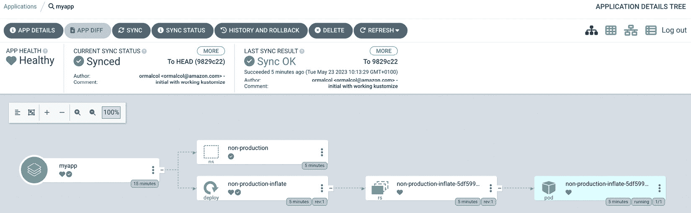

# 第十九章：在 EKS 上开发

在整本书中，我们已经探讨了如何构建 EKS 集群和部署工作负载。在本章中，我们将探讨一些方法，帮助开发人员或 DevOps 工程师通过自动化和 CI/CD 使这些活动更加高效。

在本章中，我们将讨论你可以用来在 AWS 上原生部署和测试集群及工作负载的工具和技术，或者使用第三方工具。我们将涵盖以下内容：

+   不同的 IT 角色

+   使用 Cloud9 作为你的集成开发环境

+   使用 EKS 蓝图和 Terraform 构建集群

+   使用 CodePipeline 和 CodeBuild 构建集群

+   使用 Argo CD、Crossplane 和 GitOps 部署工作负载

# 技术要求

你应该熟悉 YAML、AWS IAM 和 EKS 架构。在开始本章之前，请确保以下几点：

+   你可以访问到你的 EKS 集群 API 端点

+   AWS CLI、Docker 和`kubectl`二进制文件已安装在你的工作站，并且你拥有管理员权限

# 不同的 IT 角色

在我们探讨支持开发的技术之前，首先需要考虑谁将负责在你的组织或团队中部署 EKS 集群或应用/工作负载。下图展示了你可能在典型企业中找到的 IT 职能组，这通常被称为云操作模型，包括以下内容：

+   构建应用的**应用工程师**

+   操作和支持应用的**应用运维**

+   构建中间件、网络、数据库等的**平台工程师**

+   操作和支持基础设施及中间件的**平台运维**


图 19.1 – 云操作模型功能架构

许多组织现在采用 DevOps 模型，将**应用工程**和**应用运维**结合在开发团队中，秉持“*你构建，你运维*”的理念。这也可以包括平台工程，但通常网络和数据库等传统 IT 运维团队仍然存在，他们必须与应用团队协作。

近年来，平台工程团队也开始出现，他们负责工程和支持开发者/DevOps 工程师使用的部分基础设施，例如 EKS、数据库、消息系统和 API。该团队的口号是“*你编写代码和测试，我们负责所有其余的工作*”。

具体使用哪种模型，以及各个团队的职责分配，实际上取决于你的组织。然而，在本节的其余部分，我们将使用*DevOps 工程师*来指代负责应用工程/运维的角色，*平台工程师*来指代负责 EKS 集群和支持基础设施（如数据库或网络）的角色。

让我们探讨如何与 AWS 环境进行交互，以构建、部署和测试平台和应用服务。

# 使用 Cloud9 作为集成开发环境

Cloud9 是一个简单的 **集成开发环境** (**IDE**)，运行在 EC2 上，类似于其他 IDE，例如微软的 Visual Studio Code、Eclipse 或 PyCharm。它可以被平台工程师或开发人员使用。虽然 Cloud9 没有那些 IDE 那样的可扩展性，但它也有一些优势，如下所示：

+   它运行在您账户中的 EC2 上，这使得您可以与私有资源进行通信，例如私有 EKS 集群，而无需网络访问

+   您可以使用 AWS 系统管理器会话管理器连接到您的实例，它只需要 IAM 权限和对 AWS 控制台的访问权限

+   由于这是一个 EC2 实例，您可以为实例分配所需权限的角色，这些凭证会自动刷新且不会过期（这在配置集群时非常有用，因为集群配置可能需要一些时间）

+   它提供了一个集成的 AWS 工具包，用于简化与 S3 和 Lambda 等资源的交互

+   您可以在实例上运行 Docker 容器并预览 HTTP，如果您的容器或代码使用的是 `8080`、`8081` 或 `8082` 端口的 localhost 地址

+   最近，它已与 Amazon CodeWhisperer 集成，CodeWhisperer 使用机器学习并可以为 Python 和 Java 等语言生成代码

在本书的开发过程中，我广泛使用了 Cloud9，因为它简单且安全，但您当然可以使用任何 IDE。在本节的其余部分，我们将讨论如何设置和使用 Cloud9 为 EKS 开发。

# 创建并配置您的 Cloud9 实例

我们将使用以下 Terraform 代码来创建一个 Cloud9 实例，允许 `myuser_arn` 本地定义的用户使用它，并将其连接到 `subnet_id` 中定义的子网。由于我们将连接类型定义为 `CONNECT_SSM`，因此只要该子网可以通过私有端点或 NAT 网关与 AWS SSM API 建立连接，它就可以是私有的：

```
data "aws_region" "current" {}
locals {
  myuser_arn = "arn:aws:sts::123:myuser"
}
resource "aws_cloud9_environment_ec2" "k8sdev" {
  name = "k8sdev"
  instance_type = "t3.medium"
  connection_type = "CONNECT_SSM"
  description = "cloud9 K8s development environment"
  subnet_id = "subnet-123"
  owner_arn = local.myuser_arn
}
data "aws_instance" "cloud9_instance" {
  filter {
    name = "tag:aws:cloud9:environment"
    values = [
    aws_cloud9_environment_ec2.k8sdev.id]
}}
```

注意

请注意，您可以根据自己的支付能力修改 `instance_type`，因为虽然 Cloud9 本身不收费，但托管它的 EC2 实例是收费的

一旦 Terraform 代码完成，您可以使用 AWS 控制台，浏览到 **Cloud9** | **环境** 标签页，并使用 **打开** 链接启动 EC2 实例并在浏览器中通过 SSM 会话启动 IDE。以下截图展示了这个过程。


图 19.2 – 启动 Cloud9 SSM 会话

默认情况下，Cloud9 将使用 AWS 管理的临时凭证，这些凭证具有有限的权限，可以通过以下链接查看：[`docs.aws.amazon.com/cloud9/latest/user-guide/security-iam.html#auth-and-access-control-temporary-managed-credentials-supported`](https://docs.aws.amazon.com/cloud9/latest/user-guide/security-iam.html#auth-and-access-control-temporary-managed-credentials-supported)。这些凭证无法让你完全与 AWS 平台互动。我们将创建一个具有`AdministratorAccess`权限的角色，关闭 Cloud9 实例中的管理临时凭证，然后将这个新角色与托管 Cloud9 IDE 的 EC2 实例关联。

接下来展示的是角色描述，它与`ec2.amazonaws.com`服务有明确的信任关系。你可以按照以下链接中的过程来配置你的 Cloud9 实例：[`catalog.us-east-1.prod.workshops.aws/workshops/c15012ac-d05d-46b1-8a4a-205e7c9d93c9/en-US/15-aws-event/cloud9`](https://catalog.us-east-1.prod.workshops.aws/workshops/c15012ac-d05d-46b1-8a4a-205e7c9d93c9/en-US/15-aws-event/cloud9)。


图 19.3 – 一个示例 IAM 角色

注意

为简便起见，我们只添加了`AdministratorAccess`策略。理想情况下，你应该根据最小权限原则，定制 Cloud9 的权限，以满足所需的最低权限。

我们可以使用以下命令在 Cloud9 终端会话中验证角色是否已附加：

```
$ aws sts get-caller-identity
{"UserId": "343242342:i-12",
    "Account": "1122334455",
    "Arn": "arn:aws:sts::1234:assumed-role/cloud9-k8sdev/i-12" }
```

现在我们需要安装必要的工具；由于 Cloud9 自带了 AWS CLI、Python 和 Docker，但我们仍然需要安装`kubectl`等工具。你可以手动安装这些组件，但 AWS 提供了一个方便的脚本，作为 Cloud9 工作坊的一部分（如前述 URL 所示），所以我们将使用这个脚本来安装必要的工具，包括`kubectl`和 AWS **云开发工具包**（**CDK**）。相关命令如下：

```
$ wget https://jiwony-seoul-public.s3.ap-northeast-2.amazonaws.com/cloud9-prereq.sh
--2023-05-11 16:12:15--  https://jiwony-seoul-public.s3.ap-northeast-2.amazonaws.com/cloud9-prereq.sh
…….
$ sh cloud9-prereq.sh
Upgrading awscli
Requirement already up-to-date: awscli in
Complete!
---------------------------
You successfully installed all the required tools to your workspace
$  kubectl version --short
Flag --short has been deprecated, and will be removed in the future. The --short output will become the default.
Client Version: v1.27.1
Kustomize Version: v5.0.1
The connection to the server localhost:8080 was refused - did you specify the right host or port?
$ cdk version
2.78.0 (build 8e95c37)
****************************************************
*** Newer version of CDK is available [2.79.1]   ***
*** Upgrade recommended (npm install -g aws-cdk) ***
****************************************************
```

我们还将安装/升级`terraform`，因为我们稍后将在本节中使用它，安装命令如下：

```
$ sudo yum install -y yum-utils
$ sudo yum-config-manager --add-repo https://rpm.releases.hashicorp.com/RHEL/hashicorp.repo
$ sudo yum -y install terraform
```

我们还可以添加在本书早期章节中使用的`eksctl`，可以通过以下命令进行安装：

```
$ ARCH=amd64
$ PLATFORM=$(uname -s)_$ARCH
$ curl -sLO "https://github.com/weaveworks/eksctl/releases/latest/download/eksctl_$PLATFORM.tar.gz"
$ tar -xzf eksctl_$PLATFORM.tar.gz -C /tmp && rm eksctl_$PLATFORM.tar.gz
$ sudo mv /tmp/eksctl /usr/local/bin
$ eksctl version
0.140.0
```

最后，我们将设置默认区域，以便所有使用 SDK 的工具都能使用我们指定的区域：

```
$ aws configure
AWS Access Key ID [None]:
AWS Secret Access Key [None]:
Default region name [None]: eu-central-1
Default output format [None]:
```

现在，我们的 Cloud9 实例已经配置完毕。接下来，我们将使用它来通过 EKS 蓝图部署集群。

# 使用 EKS 蓝图和 Terraform 构建集群

在本书中，我们主要使用`eksctl`来构建我们的集群，并利用附加组件来简化标准组件的升级，例如 VPC CNI 插件或 kube-proxy。我们还部署了其他软件，如 Prometheus 和 KEDA（*第十八章*）。EKS 蓝图为你提供了一种构建具有预设方案的集群的方法，这些操作软件已经部署好。这简化了 DevOps 工程师平台的工作，他们可以使用蓝图反复构建适用于不同环境和/或团队的集群，几乎不需要任何额外努力。

EKS Blueprint 集群是使用 AWS CDK 构建的，AWS CDK 是一套库和构造，允许你使用标准编程语言（如 TypeScript 或 Python）创建和部署复杂的 CloudFormation 模板。最近，AWS 发布了 Terraform 版 EKS Blueprints，我们将在接下来的章节中使用它来创建一个可以供开发者用来部署应用程序的集群。

你可以按照阶段性的方法来开发集群配置。以下图表展示了推荐的方法。


图 19.4 – EKS 蓝图开发生命周期

在接下来的章节中，我们将逐步走过开发生命周期的每个阶段，下载、版本化并定制我们的蓝图代码。

## 定制和版本化 Terraform 的 EKS Blueprints

我们要做的第一件事是使用我们的 Cloud9 实例，在 `CodeCommit` 中创建一个符合 Git 的仓库，以存储我们的 Terraform 代码版本。以下命令可以用来创建仓库、克隆它并为我们的工作创建一个新分支：

```
$ aws codecommit create-repository --repository-name cluster-tf --repository-description "repository for TF Blueprint" --tags Team=devops --region eu-central-1
{
        "……..
        "cloneUrlHttp": "https://git-codecommit.eu-central-1.amazonaws.com/v1/repos/cluster-tf",
…}}
$ git clone https://git-codecommit.eu-central-1.amazonaws.com/v1/repos/cluster-tf
Cloning into 'cluster-tf'...
warning: You appear to have cloned an empty repository.
$ cd cluster-tf
(master) $ git checkout -b initial
Switched to a new branch 'initial'
```

在我们的 `cluster-tf` 目录中，我们将基于在 [`github.com/github/gitignore/blob/main/Terraform.gitignore`](https://github.com/github/gitignore/blob/main/Terraform.gitignore) 找到的模板创建一个新的 `.gitignore` 文件（你也可以创建自己的）。

### 设置基础变量和提供程序

要使用 Terraform 蓝图模块，我们需要配置关键的 Terraform 资源，例如使用的提供程序和数据源。让我们从提供程序开始，它们是 Terraform 的基础“引擎”，将 Terraform 资源转换为在 AWS 或 K8s 中实际部署的对象。以下配置保存在我们克隆仓库目录中的 `providers.tf` 文件中：

```
terraform {
  required_version = ">= 1.0.1"
  required_providers {
    aws = {
      source  = "hashicorp/aws"
      version = ">= 4.47"
    }
    kubernetes = {
      source  = "hashicorp/kubernetes"
      version = ">= 2.10"
    }
    helm = {
      source  = "hashicorp/helm"
      version = ">= 2.4.1"
    }
    kubectl = {
      source  = "gavinbunney/kubectl"
      version = ">= 1.14"
    }
  }
}
```

我们还将创建一个 `data.tf` 文件，用于获取当前 AWS 凭证、区域和该区域的可用区：

```
data "aws_caller_identity" "current" {}
data "aws_region" "current" {}
data "aws_availability_zones" "available" {
  state = "available"}
```

我们还将创建一个 `local.tf` 文件，保持基础配置，包括集群名称和版本。集群名称是从仓库路径中派生的，但对于生产使用，你可能需要使用 `locals int` 变量，并在构建时填充它们：

```
locals {
  name            = basename(path.cwd)
  region          = data.aws_region.current.name
  cluster_version = "1.24"
  vpc_cidr = "172.31.0.0/16"
  azs      = slice(data.aws_availability_zones.available.names, 0, 3)
  node_group_name = "mgmt-nodegroup"
  tags = {
    Blueprint  = local.name
    GithubRepo = "github.com/aws-ia/terraform-aws-eks-blueprints"
  }
}
```

我们现在可以运行以下命令，用提供程序初始化 Terraform 并将初始代码推送到我们的 **CodeCommit** 仓库：

```
(initial)$ terraform init
Initializing the backend...
Initializing provider plugins...
- Finding hashicorp/aws versions matching ">= 4.47.0"...
- Finding hashicorp/kubernetes versions matching ">= 2.10.0"...
…..
(initial)$ git add .
(initial)$ git commit -m "initial commit with providers and configuration"
….
(initial)$ git push --set-upstream origin initial
Enumerating objects: 8, done.
Counting objects: 100% (8/8), done.
…..
branch 'initial' set up to track 'origin/initial'.
(initial)$
```

现在我们已经存储了提供程序和基础配置，我们可以使用它来创建一个 VPC 并将其标记为 EKS 使用。

### 创建 EKS VPC

你的集群需要一个现有的 VPC 用于 EKS 集群。我们将使用接下来的代码创建一个新的 VPC，但你也可以修改 *创建 EKS 集群* 部分中的代码，使用一个已有的 VPC，并跳过这一步：

```
module "vpc" {
  source  = "terraform-aws-modules/vpc/aws"
  version = "3.16.0"
  name = local.name
  cidr = local.vpc_cidr
  azs  = local.azs
  public_subnets  = [for k, v in local.azs : cidrsubnet(local.vpc_cidr, 8, k)]
  private_subnets = [for k, v in local.azs : cidrsubnet(local.vpc_cidr, 8, k + 10)]
  enable_nat_gateway   = true
  create_igw           = true
  enable_dns_hostnames = true
  single_nat_gateway   = true
  manage_default_network_acl    = true
  default_network_acl_tags      = { Name = "${local.name}-default" }
  manage_default_route_table    = true
  default_route_table_tags      = { Name = "${local.name}-default" }
  manage_default_security_group = true
  default_security_group_tags   = { Name = "${local.name}-default" }
  public_subnet_tags = {
    "kubernetes.io/cluster/${local.name}" = "shared"
    "kubernetes.io/role/elb"              = "1"
  }
  private_subnet_tags = {
    "kubernetes.io/cluster/${local.name}" = "shared"
    "kubernetes.io/role/internal-elb"     = "1"
  }
    tags = local.tags
}
```

我们还将创建一个 `outputs.tf` 文件，用于存储新创建的 VPC 的 ID，该 ID 可以在我们使用以下代码创建 EKS 集群时使用：

```
output "vpc_id" {
  description = "The id of the new VPC"
  value       = module.vpc.vpc_id
}
```

我们现在可以验证代码是否正确，创建 VPC，并使用以下命令保存最终代码：

```
(initial)$ terraform init
Initializing the backend...
Downloading registry.terraform.io/terraform-aws-modules/vpc/aws 3.16.0 for vpc...
….
Terraform has been successfully initialized!
(initial)$ terraform plan
….
Plan: 23 to add, 0 to change, 0 to destroy.
Changes to Outputs:
  + vpc_id = (known after apply)
…
(initial)$ terraform apply --auto-approve
data.aws_region.current: Reading...
data.aws_caller_identity.current: Reading...
Apply complete! Resources: 23 added, 0 changed, 0 destroyed.
Outputs:
vpc_id = "vpc-0d5fb4e92b71eb9e6"
(initial)$ git add .
(initial)$ git commit -m "added vpc and deployed"
….
create mode 100644 vpc.tf
create mode 100644 outputs.tf
(initial) $ git push
Enumerating objects: 4, done.
…
```

注意

Terraform 将其状态存储在状态文件`terraform.tfstate`中。目前，它将被保存在本地仓库目录中，并被 Git 忽略（由于`.gitignore`文件）。我们将在本章稍后讨论管理此文件的策略。

现在我们有了一个新的 VPC，我们将使用 EKS 蓝图来配置并部署一个引用新 VPC 的 EKS 集群。

### 创建 EKS 集群

我们现在将使用 Blueprint 模块创建一个 EKS 集群；我们将使用 4.31.0 版本，这是目前写作时的最新版本。以下是`main.tf`文件中的示例配置。这将创建在我们之前创建的 VPC 中的集群，并且只包含标准的 K8s 服务：

```
provider "aws" {
  region = "us-east-1"
  alias  = "virginia"
}
provider "kubernetes" {
  host                   = module.eks_blueprints.eks_cluster_endpoint
  cluster_ca_certificate = base64decode(module.eks_blueprints.eks_cluster_certificate_authority_data)
  token                  = data.aws_eks_cluster_auth.this.token
}
provider "helm" {
  kubernetes {
    host                   = module.eks_blueprints.eks_cluster_endpoint
    cluster_ca_certificate = base64decode(module.eks_blueprints.eks_cluster_certificate_authority_data)
    token                  = data.aws_eks_cluster_auth.this.token
  }
}
provider "kubectl" {
  apply_retry_count      = 10
  host                   = module.eks_blueprints.eks_cluster_endpoint
  cluster_ca_certificate = base64decode(module.eks_blueprints.eks_cluster_certificate_authority_data)
  load_config_file       = false
  token                  = data.aws_eks_cluster_auth.this.token
}
module "eks_blueprints" {
  source = "github.com/aws-ia/terraform-aws-eks-blueprints?ref=v4.31.0"
  cluster_name    = local.name
  vpc_id             = module.vpc.vpc_id
  private_subnet_ids = module.vpc.private_subnets
  cluster_version = local.cluster_version
  managed_node_groups = {
    mg_5 = {
      node_group_name = local.node_group_name
      instance_types  = ["m5.large"]
      subnet_ids      = module.vpc.private_subnets
    }
  }
  tags = local.tags
}
```

注意

在之前显示的`eks blueprints`模块中，我们使用`ref`关键字来指示我们将调用哪个版本的蓝图模块；这可能会根据蓝图发布计划而有所变化。

我们需要为集群部署配置一些额外的数据源，包括一个位于其他区域的`eu-east-1`。以下是`eks-data.tf`文件中创建的示例配置：

```
data "aws_eks_cluster" "cluster" {
  name = module.eks_blueprints.eks_cluster_id
}
data "aws_eks_cluster_auth" "this" {
  name = module.eks_blueprints.eks_cluster_id
}
# To Authenticate with ECR Public in eu-east-1
data "aws_ecrpublic_authorization_token" "token" {
  provider = aws.virginia
}
```

我们还需要在`eks-output.tf`文件中配置一个额外的输出，如下所示，以便可以通过 Cloud9 实例手动与集群交互：

```
output "configure_kubectl" {
  description = "run the following command to update your kubeconfig"
  value       = module.eks_blueprints.configure_kubectl }
```

现在我们已经完成了所有配置，可以使用以下命令验证代码是否正确，创建 EKS 集群，并保存代码：

```
(initial)$ terraform init
Initializing the backend...
Initializing modules...
Downloading git::https://github.com/aws-ia/terraform-aws-eks-blueprints.git?ref=v4.31.0 for eks_blueprints...
- eks_blueprints in .terraform/modules/eks_blueprints
….
Terraform has been successfully initialized!
(initial)$ terraform plan
….
Plan: 32 to add, 0 to change, 0 to destroy.
Changes to Outputs:
  + vpc_id = (known after apply)
  + configure_kubectl = (known after apply)
(initial)$ terraform apply --auto-approve
data.aws_region.current: Reading...
data.aws_caller_identity.current: Reading...
…
Apply complete! Resources: 32 added, 0 changed, 0 destroyed.
…
Outputs:
configure_kubectl = "aws eks --region eu-central-1 update-kubeconfig --name cluster-tf"
vpc_id = "vpc-0d5fb4e92b71eb9e6"
(initial) $ aws eks --region eu-central-1 update-kubeconfig --name cluster-tf
Added new context arn:aws:eks:eu-central-1:123:cluster/cluster-tf to /home/ec2-user/.kube/config
(initial) $ kubectl get node
NAME   STATUS   ROLES    AGE     VERSION
ip-172-31-10-122.eu-central-1.compute.internal   Ready    <none>   2m52s   v1.24.11-eks-a59e1f0
ip-172-31-11-172.eu-central-1.compute.internal   Ready    <none>   2m48s   v1.24.11-eks-a59e1f0
ip-172-31-12-210.eu-central-1.compute.internal   Ready    <none>   2m49s   v1.24.11-eks-a59e1f0
(initial) $ git add .
(initial) $ git commit -m "deployed working cluster"
[initial dbf80aa] deployed working cluster
 5 files changed, 182 insertions(+)
 create mode 100644 README.md
 create mode 100644 eks-data.tf
 create mode 100644 eks-ouputs.tf
 create mode 100644 main.tf
 (initial) $ git push
Enumerating objects: 9, done.
….
To https://git-codecommit.eu-central-1.amazonaws.com/v1/repos/cluster-tf
   c5319f4..dbf80aa  initial -> initial
```

注意

请注意，部署集群可能需要最多 15 分钟的时间。

现在我们有了一个可用的集群，我们可以允许不同的用户、角色或团队访问。

### 将用户/团队添加到您的集群

目前，只有与您用于运行 terraform 的凭证相关的 role/identity 才能访问您的集群。因此，我们将添加一个新的管理员到集群，然后添加一个租户。

在`main.tf`文件中，您可以添加一个`map roles`部分，这将为集群添加一个作为管理员的单一角色：

```
map_roles = [
    {
      rolearn  = "arn:aws:iam::${data.aws_caller_identity.current.account_id}:role/Admin"
      username = "admin-role"
      groups   = ["system:masters"]
    }
  ]
```

注意

您需要将 role/admin 替换为帐户中的适当角色。请记住，如果在应用配置后 Terraform 使用的 IAM 凭证未包含在配置中，Terraform 可能会失去访问集群的权限，从而无法执行 K8s API 操作，例如修改`aws-auth`配置映射。

对于租户/用户，我们将创建一个新的`locals`文件`locals-team.tf`，但您可能希望使用变量。以下是针对两个团队（平台团队和应用程序团队）的示例：

```
locals {
platform_admins = ["arn:aws:iam::123:role/plat1"]
app_team_1 = ["arn:aws:iam::123:role/dev1"]
}
```

注意

您需要使用有效的用户帐户 ARN 或`[data.aws_caller_identity.current.arn]`。

我们现在需要修改集群的 `main.tf` 文件，并添加以下代码片段 `platform_teams`，为一组平台团队用户提供集群管理员访问权限。这将创建一个具有集群访问权限的新 IAM 角色，并允许分配给平台团队的用户列表承担该角色并获得管理员访问权限：

```
  platform_teams = {
    admin = {
      users = local.platform_admins
    }}
```

在 `main.tf` 文件中，我们还可以添加一个租户 DevOps 或应用程序团队并设置限制，这也将创建一个命名空间：

```
application_teams = {
    alpha = {
      "labels" = {
        "appName"     = "alpha",
        "projectName" = "project-alpha",
        "environment" = "dev"
      }
      "quota" = {
        "pods"            = "15",
        "services"        = "10"
      }
      users         = [local.app_team_alpha]
    }}
```

我们现在可以执行常规的 Terraform `plan` 和 `apply` 命令来部署这些更改，授予对本地文件中列出的 ARN 的访问权限，并使用我们的标准 Git 命令将更改提交到我们的代码库。以下是主要命令的示例：

```
(initial) $ terraform plan
module.eks_blueprints.module.aws_eks.module.kms.data.aws_partition.current: Reading...
module.eks_blueprints.data.aws_region.current: Reading...
….
Plan: 9 to add, 3 to change, 0 to destroy..
(initial) $ terraform apply --auto-approve
odule.eks_blueprints.module.aws_eks.module.kms.data.aws_partition.current: Reading...
Note: Objects have changed outside of Terraform
…
Apply complete! Resources: 2 added, 1 changed, 0 destroyed.
Outputs:
configure_kubectl = "aws eks --region eu-central-1 update-kubeconfig --name cluster-tf"
vpc_id = "vpc-0d5fb4e92b71eb9e6"
(initial) $ kubectl get ns
NAME              STATUS   AGE
alpha             Active   10m
..
(initial) $ kubectl get ResourceQuota -n alpha
NAME     AGE   REQUEST                      LIMIT
quotas   10m   pods: 0/15, services: 0/10
```

如果你想查看每个团队需要配置的 `kubectl` 命令，可以将以下配置添加到 `outputs.tf` 文件：

```
output "platform_team_configure_kubectl" {
  description = "Configure kubectl for Platform Team"
  value       = try(module.eks_blueprints.teams[0].platform_teams_configure_kubectl["admin"], null) }
output "alpha_team_configure_kubectl" {
  description = "Configure kubectl for each Application Team "
  value       = try(module.eks_blueprints.teams[0].application_teams_configure_kubectl["alpha"], null) }
```

现在我们已经为平台工程团队和应用开发团队设置了正确的访问权限，我们可以部署多个插件。

### 将蓝图添加到您的集群

正如我们在前面的章节中看到的，部署像 AWS 负载均衡器控制器或 Karpenter 这样的工具可能需要相当多的工作。蓝图将 EKS 插件概念扩展到其他工具，并可以利用 EKS 插件或 ArgoCD 来部署这些软件。当前支持的插件可以在 [`aws-ia.github.io/terraform-aws-eks-blueprints/add-ons`](https://aws-ia.github.io/terraform-aws-eks-blueprints/add-ons) 找到。

我们将部署 ArgoCD，这是一个 GitOps 部署工具（在 *使用 ArgoCD、Crossplane 和 GitOps 部署工作负载* 章节中会更详细讨论），然后 ArgoCD 将部署（大部分）其他插件。

我们首先要做的是在我们的代码库中创建一个 `locals-blueprints.tf` 文件，文件内容如下所示。这将告诉 ArgoCD 在哪里查找不同的 Helm 图表来部署插件：

```
locals {
 addon_application = {
    path               = "chart"
    repo_url           = "https://github.com/aws-samples/eks-blueprints-add-ons.git"
    add_on_application = true }}
```

下一步是部署 `argodCD` 并告诉它要部署哪些插件。请注意，蓝图插件模块是有意见的，因此一些插件，如 AWS CSI 驱动程序，将直接作为 EKS 插件部署（并将作为插件显示），而其他插件将由 `argoCD` 处理。

我们将直接部署 `argoCD` 和 AWS EBS CSI 驱动程序，然后 Argo CD（`argoCD`）将部署以下内容：

+   AWS 负载均衡器控制器

+   Fluent Bit 用于日志记录

+   用于标准度量的度量服务器

+   Karpenter 用于自动扩展

+   Crossplane（稍后讨论）用于基础设施即代码

以下代码片段将作为 `blueprints.tf` 使用：

```
module "kubernetes_addons" {
  source = "github.com/aws-ia/terraform-aws-eks-blueprints?ref=v4.31.0/modules/kubernetes-addons"
  eks_cluster_id     = module.eks_blueprints.eks_cluster_id
  enable_argocd         = true
  argocd_manage_add_ons = true
  argocd_applications = {
    addons    = local.addon_application}
  argocd_helm_config = {
    set = [{ name  = "server.service.type"
        value = "LoadBalancer" }]}
  enable_aws_load_balancer_controller  = true
  enable_amazon_eks_aws_ebs_csi_driver = true
  enable_aws_for_fluentbit             = true
  enable_metrics_server                = true
  enable_Crossplane                    = true
  enable_karpenter                     = true }
```

以下命令可以用于执行以下操作：

+   部署 Terraform 更新

+   验证 EKS 中的插件是否都已成功部署：

```
(initial) $ terraform init
Downloading git::https://github.com/aws-ia/terraform-aws-eks-blueprints.git?ref=v4.31.0 for kubernetes_addons...
….
(initial) $ terraform plan module.eks_blueprints.module.aws_eks.module.kms.data.aws_partition.current: Reading...
module.eks_blueprints.data.aws_region.current: Reading...
….
Plan: 29 to add, 0 to change, 0 to destroy.
(initial) $ terraform apply --auto-approve
odule.eks_blueprints.module.aws_eks.module.kms.data.aws_partition.current: Reading...
Note: Objects have changed outside of Terraform
…
Apply complete! Resources: 29 added, 0 changed, 0 destroyed.
Outputs:
configure_kubectl = "aws eks --region eu-central-1 update-kubeconfig --name cluster-tf"
vpc_id = "vpc-0d5fb4e92b71eb9e6"
(initial) $ aws eks list-addons --cluster-name cluster-tf
{"addons": [
        "aws-ebs-csi-driver"]}
```

我们现在可以获取 ArgoCD 的详细信息并访问它，以查看其他插件的详细信息，使用以下命令：

```
(initial) $ kubectl get deploy -n argocd
NAME                 READY   UP-TO-DATE   AVAILABLE   AGE
argo-cd-argocd-applicationset-controller   1/1  1 1 82m
argo-cd-argocd-dex-server                  1/1  1 1 82m
argo-cd-argocd-notifications-controller    1/1  1 1 82m
argo-cd-argocd-repo-server                 2/2  2 2 82m
argo-cd-argocd-server                      2/2  2 2 82m
argo-cd-redis-ha-haproxy                   3/3  3 3 82m
(initial) $ export ARGOCD_SERVER=`kubectl get svc argo-cd-argocd-server -n argocd -o json | jq --raw-output '.status.loadBalancer.ingress[0].hostname'`
(initial) $ echo https://$ARGOCD_SERVER
https://1234-453293485.eu-central-1.elb.amazonaws.com
(initial) $ kubectl -n argocd get secret argocd-initial-admin-secret -o jsonpath="{.data.password}" | base64 -d
Myinteretsingp355word
```

我们现在可以浏览到 ArgoCD URL，并使用前面显示的详细信息登录，查看其他插件的状态：


图 19.5 – ArgoCD 应用程序/附加组件状态

注意

请确保您已经将所有更改推送到 `CodeCommit` 仓库，并使用 `terraform destroy` 命令销毁了集群。销毁 VPC 和网络组件可能需要一些时间。

修改和升级遵循类似的模式；修改 Terraform 代码后，使用 Terraform 的 `plan` 和 `apply` 命令来升级或重新配置集群、节点组、访问权限和蓝图。

现在我们已经使用 Terraform 手动创建（和销毁）了资源，让我们来看一下如何使用 AWS CI/CD 工具来自动化集群的测试和部署。

# 使用 CodePipeline 和 CodeBuild 来构建集群

到目前为止，我们已经通过运行 Terraform 的 `plan` 和 `apply` 命令手动完成了部署。CodeBuild 是 AWS 的一项服务，作为 CI 构建服务器，同时也部署我们的 Terraform 配置。CodePipeline 自动化了端到端的发布管道，并基于对 CodeCommit 等代码库的提交，依次执行构建、测试和部署阶段。

我们需要做的第一件事是调整 Terraform 代码，以支持将状态存储在 S3 存储桶中。这是必要的，因为默认情况下，Terraform 会使用本地存储来存储其状态，而 CodeBuild 是一个临时环境，因此在构建之间该状态将会丢失。Terraform 依赖于状态文件来确定需要添加、修改或删除的内容。我们只需将下面显示的后端配置代码添加到之前创建的 `providers.tf` 文件中即可。我们不需要指定任何详细信息，因为这将在 Terraform `init` 阶段动态配置：

```
terraform {
…
  backend "s3" {}
```

注意

一旦修改了代码，请将更改提交到您的代码库。

接下来我们需要做的是将 `buildspec.yml` 文件添加到我们代码库的 `root` 目录中。此文件由 CodeBuild 用于运行构建/部署命令。`buildspec` 文件是一个特定格式的文件，包含多个阶段：

+   在 *安装* 阶段，安装 **Terraform** 和 **jq** 的最新版本。

+   在 *预构建* 阶段，运行 `terraform init` 并配置它使用 S3 存储桶和特定区域的前缀，使用环境变量，还要运行 Terraform `validate` 命令作为基本测试。

+   在 *构建* 阶段，可以根据环境变量中指定的操作，运行 Terraform 的 `plan`、`apply` 或 `destroy` 命令。

下面是 `buildspec.yml` 文件的一个示例：

```
version: 0.2
env:
  exported-variables:
    - BuildID
    - BuildTag
phases:
  install:
    commands:
      - yum update -y
      - yum install -y yum-utils
      - yum-config-manager --add-repo https://rpm.releases.hashicorp.com/AmazonLinux/hashicorp.repo
      - yum -y install terraform jq
      - terraform version
  pre_build:
    commands:
      - echo creating S3 backend for bucket ${TFSTATE_BUCKET} region ${TFSTATE_REGION} prefix ${TFSTATE_KEY}
      - cd "$CODEBUILD_SRC_DIR"
      - terraform init -input=false -backend-config="bucket=${TFSTATE_BUCKET}" -backend-config="key=${TFSTATE_KEY}" -backend-config="region=${TFSTATE_REGION}"
      - terraform validate
  build:
    commands:
      - echo running command terraform ${TF_ACTION}
      - cd "$CODEBUILD_SRC_DIR"
      - terraform ${TF_ACTION} -input=false
```

一旦修改了代码，请将更改提交到您的代码库。

由于我们现在已经配置了 Terraform 后端，并且拥有一个 CodeBuild 用于构建/部署资源的 `buildspec` 文件，我们需要创建并配置构建项目。

## 设置 CodeBuild 项目

使用 AWS 控制台，导航到 AWS CodeBuild 服务并添加一个新的构建项目。填写 **项目名称** 和 **描述** 字段，如下图所示：


图 19.6 – CodeBuild 项目配置

在 `CodeCommit` 仓库和分支中，Terraform 代码和 `buildspec` 文件位于其中，如下图所示：


图 19.7 – CodeBuild 源代码配置

在**环境**面板的第一部分，将构建环境定义为标准的 Linux 环境，如下图所示：


图 19.8 – CodeBuild 环境配置

保持服务角色设置为创建新服务角色，并保持 **Buildspec** 面板原样（如下所示）。然后，点击屏幕底部的 **创建构建项目**（未显示）：


图 19.9 – CodeBuild buildspec 配置

您需要配置以下环境变量，这些变量由 `buildspec` 文件使用：

+   **TFSTATE_BUCKET** 指向现有的 S3 存储桶名称

+   **TF_ACTION** 将执行并 **apply -auto-approve**，但可以更改为 **destroy** 或 **plan** 操作

+   `cluster/cluster-tf/terraform.tfstate` 的值

+   **TFSTATE_REGION** 指向正确的区域


图 19.10 – CodeBuild 环境变量

配置好环境变量后，点击 **创建** **构建项目**。

注意

为项目创建的构建项目服务角色需要添加相关的 IAM 权限，以允许 Terraform 代码创建资源。

我们还应该将代码构建中明确使用的服务角色添加到 `main.tf` 代码中的 `map_role` 部分，如下所示：

```
{rolearn  = "arn:aws:iam::${data.aws_caller_identity.current.account_id}:role/service-role/codebuild-terra-test-service-role"
      username = "admin-role"
      groups   = ["system:masters"] }
```

注意

将 `service-role` 名称替换为您的 CodeBuild 项目使用的名称，并提交您的更改到仓库。

现在，我们已经创建了一个指向我们的仓库和分支的项目，并且有一个特定的 `buildspec.yml` 文件，它提供了我们部署 Terraform 配置所需的命令。


图 19.11 – CodeBuild 启动构建下拉菜单

一旦构建开始，您可以查看日志并查看任何错误，但它最终会完成，然后您可以查看构建历史。如果查看下图所示的示例，您可以看到部署 Terraform 仅花费了 30 分钟多一点，并且成功完成。


图 19.12 – CodeBuild 构建历史记录屏幕

如果我们查看 S3 存储桶，我们可以看到我们在 `TFSTATE_KEY` 环境变量中定义的前缀和 `terraform.tfstate` 文件。


图 19.13 – S3 Terraform 状态文件

为了触发构建任务，我们需要点击 **开始构建** 按钮，或使用 CodeBuild API。接下来，我们将看看如何使用 CodePipeline 在代码更改时触发构建。

注意

在继续之前，你应该删除 Terraform 创建的资源，可以手动删除，也可以通过将构建任务的 `TF_ACTION` 改为 `destroy -auto-approve` 然后重新运行构建任务来删除。

## 设置 CodePipeline

当我们设置 CodePipeline 时，我们将配置两个阶段——一个 *源* 阶段，引用我们的 CodeCommit 仓库，其中包含 Terraform 和 `buildspec` 文件，和一个 *构建* 阶段，引用我们的 CodeBuild 项目。以下截图展示了一个示例：


图 19.14 – CodePipeline 阶段

我们将配置源阶段，使用我们的 CodeCommit 仓库和我们将用于代码的分支详细信息，并保留默认的更改检测和输出工件。这意味着当我们做出更改（提交）时，我们将触发一个 CloudWatch 事件，并在下一阶段使用它。以下是 CodeCommit 配置的示例：


图 19.15 – 一个 CodePipeline 源阶段配置片段

然后我们需要配置我们的构建阶段，使其指向我们在正确区域中的现有 CodeBuild 项目。以下是 CodeBuild 配置的示例：


图 19.16 – 一个 CodePipeline 构建阶段配置片段

现在，当我们进行提交时，CodePipeline 会检测到它并触发 CodeBuild 运行我们之前创建的构建项目。我们可以看到下面的示例中，提交 ID 和消息被显示为触发器：


图 19.17 – 一个成功的管道运行

注意

由于源代码现在由 CodePipeline 生成，并且在 Terraform 代码中，我们将使用仓库的文件路径，并看到一个名为 `src`（这是 CodePipeline 生成的目录名称）的集群被构建。我们应该使用变量或本地值来改变 Terraform 生成集群名称的方式。

现在我们已经快速回顾了如何使用 CodePipeline 和 CodeBuild 根据代码的更改构建我们的集群，接下来我们来看如何使用 ArgoCD 和 Crossplane 以类似的方式部署 EKS 工作负载。

# 使用 ArgoCD、Crossplane 和 GitOps 部署工作负载

在上一节中，我们使用 CodePipeline 根据提交和 CodePipeline 配置将更改部署到我们的 AWS 环境。

**GitOps** 是实现 **持续部署**（**CD**）的一种方式，用于同时部署容器化应用程序和基础设施，但更侧重于自服务和开发人员体验。这意味着开发人员不仅可以使用 Git 仓库来存储、版本控制、测试和构建他们的代码，还可以对他们的基础设施代码进行同样的操作，同时部署两者。

本章将使用两个开源项目——**ArgoCD**，这是一个部署工具，它会持续轮询我们的应用程序仓库以查找变化，以及**K8s API**来部署它们。Crossplane 允许我们使用自定义的 Kubernetes 资源来构建支持我们应用程序的基础设施资源，如数据库。ArgoCD 可以使用 Helm 来部署和修改（补丁）K8s 资源或 Kustomize。**Kustomize** 使你能够轻松定制 K8s 清单文件，并且也可以直接通过 **kubectl** 工具使用。使用的架构如下所示。


图 19.18 – GitOps 架构

我们将使用通过 Terraform BluePrint 创建的集群，该集群已安装并运行 ArgoCD，因此我们将从 ArgoCD 仓库配置开始。

## 设置我们的应用程序仓库

我们将创建并克隆一个名为 `myapp` 的新 CodeCommit 仓库，使用在 *为 Terraform 定制和版本控制 EKS 蓝图* 部分中显示的相同命令，将仓库创建并克隆到我们的 Cloud9 实例中。

我们还应该在本地环境中安装 Kustomize 进行本地测试，使用以下命令：

```
(master) $ curl -s "https://raw.githubusercontent.com/kubernetes-sigs/kustomize/master/hack/install_kustomize.sh"  | bash
kustomize installed to /..
(master) $ kustomize version
v5.0.3
```

现在我们已经安装了仓库和 **Kustomize** 工具，可以设置一般结构。我们将使用暂停容器镜像，并根据环境调整命名空间、副本数和内存请求大小。

我们将使用两个清单文件，这些文件一旦创建，只有在添加或删除资源时才需要更改。`namespace.yaml` 文件将定义命名空间；示例如下：

```
apiVersion: v1
kind: Namespace
metadata:
  name: app
```

`deployment.yaml` 文件将定义暂停容器的部署。示例如下：

```
apiVersion: apps/v1
kind: Deployment
metadata:
  name: inflate
  namespace: app
spec:
  replicas: 0
  selector:
    matchLabels:
      app: inflate
  template:
    metadata:
      labels:
        app: inflate
    spec:
      containers:
        - name: inflate
          image: public.ecr.aws/eks-distro/kubernetes/pause:3.2
          resources:
            requests:
              memory: 1Gi
```

接下来，我们将创建 `base` 目录和 `kustomize.yaml` 文件，这些文件将引用前面的模板，并使用 `kubectl create -k` 命令进行部署的干运行。命令如下所示：

```
(master) $ mkdir base
(master) $ cd base
(master) $ touch namespace.yaml
(master) $ touch deployment.yaml
(master) $ touch kustomization.yaml
(master) $ kubectl create -k . --dry-run=client
namespace/app created (dry run)
deployment.apps/inflate created (dry run)
```

我们已经讨论了命名空间和部署文件，但 `kustomize.yaml` 文件也被 Kustomize 用来了解它需要部署或修改（补丁）哪些资源。示例如下：

```
apiVersion: kustomize.config.k8s.io/v1beta1
kind: Kustomization
resources:
  - namespace.yaml
  - deployment.yaml
```

由于此文件是在基础目录中创建的，它仅引用两个没有修改的清单文件。接下来我们将创建两个覆盖文件，分别调整这些文件在非生产和生产环境中的值：

```
(master) $ mkdir -p ../overlays/production
(master) $ mkdir -p ../overlays/non-production
(master) $ touch ../overlays/production/kustomization.yaml
(master) $ touch ../overlays/non-production/kustomization.yaml
(master) $ touch ../overlays/non-production/deployment.yaml
master) $ touch ../overlays/production/deployment.yaml
```

非生产环境的 `kustomize.yaml` 文件如下所示，它将调整命名空间以及 `non-production-` 前缀应用到所有资源：

```
resources:
- ../../base
apiVersion: kustomize.config.k8s.io/v1beta1
kind: Kustomization
namespace: non-production
namePrefix: non-production-
patches:
- path: deployment.yaml
```

它还引用了本地目录中的 `deployment.yaml` 文件，该文件将基模板中的副本数增加到 `1`，并添加了新的限制和请求：

```
apiVersion: apps/v1
kind: Deployment
….
spec:
  replicas: 1
……
      containers:
        - name: inflate
…….
          resources:
            limits:
              memory: 1250Mi
            requests:
              memory: 1250Mi
```

当我们运行 `kubectl create -k` 命令时，这些更改将与基础清单合并并部署。以下命令将部署并验证我们针对非生产环境的自定义内容：

```
(master) $ pwd
../myapp/overlays/non-production
(master) $ kubectl create -k .
namespace/non-production created
deployment.apps/non-production-inflate created
(master) $ kubectl get all -n non-production
NAME     READY   STATUS    RESTARTS   AGE
pod/non-production-inflate-123   1/1     Running   0  13s
NAME  READY   UP-TO-DATE   AVAILABLE   AGE
deployment.apps/non-production-inflate   1/1     1    1 13s
NAME    DESIRED   CURRENT   READY   AGE
replicaset.apps/non-production-inflate-12   1 1 1 13s
(master) $ kubectl get po non-production-inflate-123 -n non-production -o json | jq -r '.spec.containers[].resources'
{
  "limits": {
    "memory": "1250Mi"
  },
  "requests": {
    "memory": "1250Mi"
  }
```

现在，我们可以将配置复制到 `./overlays/production` 目录，修改前缀和命名空间为 `production`，将限制和请求更改为 `2Gi`，副本数更改为 `3`。我们现在可以将这些更改提交到我们的仓库，并且我们知道，如果从生产或非生产的 `overlays` 目录运行 `Kustomize` 命令，我们将为每个环境获得略有不同的配置。

下一步是配置 ArgoCD 来部署这些资源。

## 设置 ArgoCD 应用程序

**ArgoCD** 使用 *应用程序* 概念，代表一个 Git 仓库。根据应用程序的配置，ArgoCD 将轮询该仓库，在我们的情况下，使用 Kustomize 添加、修改或删除资源。

ArgoCD 不支持 AWS IAM 角色，因此它将使用 SSH 凭证来轮询仓库。所以，我们需要为具有访问 `codecommit` 仓库权限的 CI/CD 用户配置 SSH 凭证。我们将使用以下链接中的说明：[`docs.aws.amazon.com/codecommit/latest/userguide/setting-up-ssh-unixes.html`](https://docs.aws.amazon.com/codecommit/latest/userguide/setting-up-ssh-unixes.html) 来创建 SSH 密钥，并将其添加到具有 CodeCommit 权限的用户中。一旦我们拥有 SSH 密钥 ID，我们可以执行以下操作：

+   安装并配置 ArgoCD 客户端

+   为 ArgoCD 添加一个秘密，用于连接到仓库

+   添加我们的应用程序并检查部署

以下命令将安装 ArgoCD 客户端：

```
(master) $ sudo install -m 555 argocd-linux-amd64 /usr/local/bin/argocd
(master) $ rm argocd-linux-amd64
(master) $ argocd version
argocd: v2.7.2+cbee7e6
  BuildDate: 2023-05-12T14:06:49Z
  GitCommit: cbee7e6011407ed2d1066c482db74e97e0cc6bdb
  GitTreeState: clean
  GoVersion: go1.19.9
  Compiler: gc
  Platform: linux/amd64
FATA[0000] Argo CD server address unspecified
```

接下来，我们将配置必要的环境变量以连接到我们的环境；以下是示例，但你应该根据自己的环境添加相关细节：

```
ARGOCD_SERVER=$(kubectl get svc argo-cd-argocd-server -n argocd -o json | jq --raw-output '.status.loadBalancer.ingress[0].hostname')
(master) $ ARGOCD_PWD=$(kubectl -n argocd get secret argocd-initial-admin-secret -o jsonpath="{.data.password}" | base64 - (master) $ GITOPS_IAM_SSH_KEY_ID=APKARDV7UN6242ZX
(master) $ AWS_DEFAULT_REGION=eu-central-1
Admin:~/environment/myapp (master) $ APP_REPO_NAME=myapp
(master) $ GITOPS_REPO_URL=ssh://${GITOPS_IAM_SSH_KEY_ID}@git-codecommit.${AWS_DEFAULT_REGION}.amazonaws.com/v1/repos/${APP_REPO_NAME}
(master) $ echo $GITOPS_REPO_URL > ./argocd_repo_url
(master) $ cat ./argocd_repo_url
ssh://APKARDV7UN6242ZX@git-codecommit.eu-central-1.amazonaws.com/v1/repos/myapp
(master) $ argocd login $ARGOCD_SERVER --username admin --password $ARGOCD_PWD --insecure
'admin:login' logged in successfully
Context 'a4e22bc700a154a13af063e8abe72c22-1646159678.eu-central-1.elb.amazonaws.com' updated
```

现在，我们可以使用以下命令将仓库和 SSH 密钥添加到 ArgoCD：

```
(master) $ argocd repo add $(cat ./argocd_repo_url) --ssh-private-key-path ${HOME}/.ssh/argocd --insecure-ignore-host-key --upsert --name myapp
Repository 'ssh://APKARDV7UN6242ZX@git-codecommit.eu-central-1.amazonaws.com/v1/repos/myapp' added
(master) $ argocd repo list
TYPE  NAME  INSECURE  OCI LFS  CREDS  STATUS  MESSAGE  PROJECT
git   myapp  ssh://APKARDV7UN6242ZX@git-codecommit.eu-central-1.amazonaws.com/v1/repos/myapp  true      false  false  false  Successful
```

我们可以设置应用程序，使用仓库和私钥来部署资源。我们将其指向非生产叠加层，以便它使用位于该位置的 Kustomize 配置：

```
(master) $ argocd app create myapp --repo $(cat ./argocd_repo_url) --path overlays/non-production --dest-server https://kubernetes.default.svc --sync-policy automated --self-heal --auto-prune
application 'myapp' created
(master) $ argocd app list | grep myapp
argocd/myapp  https://kubernetes.default.svc   default  Synced     Healthy  Auto-Prune  <none>      ssh://APKARDV7UN6242ZX@git-codecommit.eu-central-1.amazonaws.com/v1/repos/myapp  overlays/non-production
(master) $ kubectl get all -n non-production
NAME     READY   STATUS    RESTARTS   AGE
pod/non-production-inflate-22   1/1     Running   0    24s
NAME      READY   UP-TO-DATE   AVAILABLE   AGE
deployment.apps/non-production-inflate   1/1  1  1    25s
NAME   DESIRED   CURRENT   READY   AGE
replicaset.apps/non-production-inflate-22   1  1  1     25s
```

如果我们查看 Argo CD 的 UI，我们可以看到应用程序是健康的，组件已经部署，并且 ArgoCD 将继续同步它们，因为我们对底层的 CodeCommit 仓库进行了更改。



图 19.19 – ArgoCD 中 myapp 应用程序的状态

现在，我们有一个可以持续由 Argo CD 部署的应用程序。我们可以看到如何将基础设施资源添加到同一仓库，并让 Crossplane 为其提供服务。

## 使用 Crossplane 添加 AWS 基础设施

在本书中，我们展示了如何添加 K8s 资源并使用 K8s 控制器，如 AWS 负载均衡器控制器，来创建 AWS 资源，如网络负载均衡器或应用负载均衡器。Crossplane 可以看作是 AWS 资源的通用控制器。

我们将使用我们通过 Blueprints 创建的集群，但用最新版本替换 Crossplane 部署。因此，我们将安装 helm，然后使用它来部署 Crossplane 图表：

```
$ curl -fsSL -o get_helm.sh https://raw.githubusercontent.com/helm/helm/main/scripts/get-helm-3
$ chmod 700 get_helm.sh
$ ./get_helm.sh
$ helm repo add Crossplane-stable https://charts.Crossplane.io/stable
$ helm install Crossplane --create-namespace --namespace Crossplane-system Crossplane-stable/Crossplane
```

注意

在部署之前，您可能需要删除`Crossplane-system`命名空间。

现在我们已经安装了最新版本的 Crossplane，我们需要配置提供程序及其相关权限。

### 设置我们的 Crossplane AWS 提供程序

由于 Crossplane 将在 AWS 中创建资源，它需要一个角色/权限来执行此操作。我们将从创建一个 IRSA 角色开始，将其映射到我们的集群，并赋予它管理员角色。相关命令如下所示：

```
$ account_id=$(aws sts get-caller-identity --query "Account" --output text)
$ oidc_provider=$(aws eks describe-cluster --name src --region $AWS_DEFAULT_REGION --query "cluster.identity.oidc.issuer" --output text | sed -e "s/^https:\/\///")
$ cat > trust.yaml <<EOF
{ "Version": "2012-10-17",
  "Statement": [
    {
      "Effect": "Allow",
      "Principal": {
        "Federated": "arn:aws:iam::${account_id}:oidc-provider/${oidc_provider}"
      },
      "Action": "sts:AssumeRoleWithWebIdentity",
      "Condition": {
        "StringLike": {
          "${oidc_provider}:sub": "system:serviceaccount:Crossplane:system:provider-aws-*"
        }}}]}
EOF
$ aws iam create-role --role-name bespoke-Crossplane --assume-role-policy-document file://trust.json --description "Crossplane IRSA role"
{
    "Role": {
        "Path": "/",
        "RoleName": "bespoke-Crossplane",
        "RoleId": "AROARDV7UN62754DFZQBL",
        "Arn": "arn:aws:iam::112233:role/bespoke-Crossplane",
….
$ aws iam attach-role-policy --role-name bespoke-Crossplane --policy-arn=arn:aws:iam::aws:policy/AdministratorAccess
```

现在，我们有了一个信任我们集群的 OIDC 提供程序并具有创建 AWS 资源权限的角色。接下来，我们需要配置 Crossplane 部署来使用它。可以使用以下清单来配置提供程序和控制器：

```
apiVersion: pkg.Crossplane.io/v1alpha1
kind: ControllerConfig
metadata:
  name: aws-config
  annotations:
    eks.amazonaws.com/role-arn: arn:aws:iam::112233:role/bespoke-Crossplane
spec:
  podSecurityContext:
    fsGroup: 2000
  args:
    - --debug
---
apiVersion: pkg.Crossplane.io/v1
kind: Provider
metadata:
  name: provider-aws
spec:
  package: xpkg.upbound.io/upbound/provider-aws:v0.27.0
  controllerConfigRef:
    name: aws-config
```

我们可以使用以下命令部署 AWS 提供程序：

```
$ kubectl create -f Crossplane-provider.yaml
controllerconfig.pkg.Crossplane.io/aws-config created
provider.pkg.Crossplane.io/provider-aws created
$ kubectl get providers
NAME  INSTALLED   HEALTHY   PACKAGE             AGE
provider-aws   True        True      xpkg.upbound.io/upbound/provider-aws:v0.27.0   52m
```

一旦提供程序是*健康*的，我们可以通过添加提供程序配置并将凭证插入方法定义为 IRSA 来完成配置。这是 `upbound` AWS 提供程序的区别之一——它使用不同的 API 和 IRSA 源密钥：

```
apiVersion: aws.upbound.io/v1beta1
kind: ProviderConfig
metadata:
  name: provider-aws
spec:
  credentials:
    source: IRSA
```

我们可以使用以下命令部署此清单文件：

```
$ kubectl create -f ub-config.yaml
providerconfig.aws.upbound.io/provider-aws created
```

由于我们启用了调试日志记录，可以使用以下命令查看提供程序的日志，以确认所有配置和 AWS 权限是否已正确设置：

```
$ kubectl get po -n Crossplane-system
NAME  READY   STATUS    RESTARTS      AGE
Crossplane-12     1/1     Running   1 (57m ago)   66m
Crossplane-rbac-manager-12    1/1     Running   0   66m
provider-aws-12   1/1     Running   1 (58m ago)   60m
$ k logs provider-aws-12 -n Crossplane-system
….
1.6848748355755348e+09  DEBUG   provider-aws    Reconciling     {"controller": "providerconfig/providerconfig.aws.upbound.io", "request": "/provider-aws"}
```

注意

对于生产配置，您应该禁用调试日志记录，因为它非常冗长，并且会生成大量数据。

### 创建基础设施资源

现在我们已经有了一个工作中的 Crossplane AWS 提供程序，我们实际上可以配置一个 AWS 资源。我们将配置一个带有一些基本配置的 S3 桶。以下清单将创建一个名为`myapp-Crossplane-bucket637678`的 S3 桶，并使用我们在上一步创建的 AWS 提供程序：

```
apiVersion: s3.aws.upbound.io/v1beta1
kind: Bucket
metadata:
  name: myapp-Crossplane-bucket637678
spec:
  forProvider:
    region: eu-central-1
  providerConfigRef:
    name: provider-aws
```

我们可以使用以下命令来部署并验证桶：

```
$ kubectl create -f Crossplane-us3.yaml
bucket.s3.aws.upbound.io/myapp-Crossplane-bucket637678 created
$ kubectl get bucket
NAME   READY   SYNCED   EXTERNAL-NAME                   AGE
myapp-Crossplane-bucket637678   True    True     myapp-Crossplane-bucket637678   15s
$ aws s3 ls | grep Crossplane
2023-05-23 20:57:39 myapp-Crossplane-bucket637678
$ kubectl get  bucket myapp-Crossplane-bucket637678 -o json | jq .status.atProvider.arn
"arn:aws:s3:::myapp-Crossplane-bucket637678"
```

此清单可以添加到我们的应用程序仓库，并修改相关的 `kustomize.yaml` 文件。这意味着，作为 DevOps 工程师或开发人员，我们不仅可以配置应用程序，还可以配置任何支持的基础设施。如果您想使用 ArgoCD 部署 Crossplane 资源，请参阅此链接：https://docs.Crossplane.io/v1.10/guides/argo-cd-Crossplane/。

尽管这是一个较长的章节，但我只是触及了开发 EKS 的表面，但希望您已经掌握了足够的信息，可以进一步探索！

在本节中，我们探讨了如何在 EKS 上开发，使用多种 AWS 服务和开源工具来自动化集群构建、部署和测试应用。现在，我们将回顾本章的关键学习点。

# 总结

在这一章中，我们首先考虑了需要在 EKS 上进行开发的多种角色，从传统开发者到 DevOps 或平台工程师。这些角色需要类似但不同的需求来完成工作，因此在进行 EKS 开发时，考虑操作模式是非常重要的。

接下来，我们了解了如何使用 IDE 开发基础设施/应用代码，以及 AWS Cloud9 如何提供一个简单且安全的界面来在 EKS 上执行这些操作。然后我们创建了一个 `CodeCommit` 仓库，并使用 Terraform 命令部署它。这创建了一个完整的 EKS 集群，位于新的 VPC 中，并自动配置了一系列应用和插件。

然后我们探讨了平台/DevOps 工程师如何使用 `buildspec.yaml` 文件自动化部署/测试 EKS 集群，我们通过 `CodeCommit` 分支实现了此过程的自动化。此外，我们还探讨了 DevOps 工程师或开发者如何使用 ArgoCD/Kustomize 自动化 K8s 清单文件的自定义和部署。

最后，我们探讨了如何通过使用 Crossplane 将 AWS 基础设施资源集成到我们的应用程序仓库中，并通过 K8s 清单和自定义资源在 AWS 中创建一个 S3 存储桶。

在最后一章中，我们将讨论如何排查常见的 EKS 问题。

# 深入阅读

+   在无头模式下使用 Cloud9：

https://aws.amazon.com/blogs/devops/how-to-run-headless-front-end-tests-with-aws-cloud9-and-aws-codebuild/

+   开始使用 Terraform 的 EKS 蓝图：

[`aws-ia.github.io/terraform-aws-eks-blueprints/getting-started/`](https://aws-ia.github.io/terraform-aws-eks-blueprints/getting-started/)

+   创建安全的 AWS CI/CD 管道：

https://aws.amazon.com/blogs/devops/setting-up-a-secure-ci-cd-pipeline-in-a-private-amazon-virtual-private-cloud-with-no-public-internet-access/

+   在 AWS 上使用 GitOps：

[`aws.amazon.com/blogs/containers/gitops-model-for-provisioning-and-bootstrapping-amazon-eks-clusters-using-Crossplane-and-argo-cd/`](https://aws.amazon.com/blogs/containers/gitops-model-for-provisioning-and-bootstrapping-amazon-eks-clusters-using-crossplane-and-argo-cd/)

# 第五部分：克服常见的 EKS 挑战

本节的目标是提供更多关于排查常见 EKS 问题的细节。

本节包括以下章节：

+   *第二十章**，排查常见问题*
