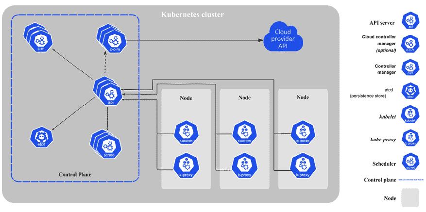
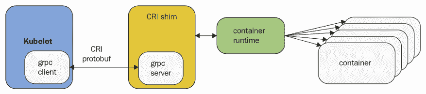
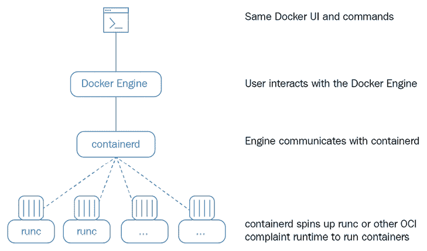

# 第一章：理解 Kubernetes 架构

用一句话来说，Kubernetes 是一个平台，用于编排容器化应用程序的部署、扩展和管理。你可能已经读过 Kubernetes 的相关内容，甚至可能在某个副项目或工作中使用过它。但要真正理解 Kubernetes 是什么，如何有效使用它，以及最佳实践是什么，远远不止这些。

Kubernetes 是一个庞大的开源项目和生态系统，包含了大量的代码和功能。Kubernetes 起源于 Google，但加入了 **云原生计算基金会** (**CNCF**)，现在成为了基于容器的应用程序领域的事实标准。根据 2021 年 CNCF 调查，96% 的组织在使用或评估 Kubernetes。

在本章中，我们将打下充分利用 Kubernetes 潜力所需的基础。我们将从理解什么是 Kubernetes，什么不是 Kubernetes，以及容器编排究竟意味着什么开始。然后，我们将介绍 Kubernetes 的重要概念，这些概念将构成我们贯穿全书的词汇。接下来，我们将深入探讨 Kubernetes 的架构，看看它是如何为用户提供各种功能的。之后，我们将讨论 Kubernetes 如何以通用的方式支持多种容器运行时。

我们将讨论的主题包括：

+   什么是 Kubernetes？

+   Kubernetes 不是

+   理解容器编排

+   Kubernetes 概念

+   深入研究 Kubernetes 架构

+   Kubernetes 容器运行时

在本章结束时，你将对容器编排、Kubernetes 解决的问题、Kubernetes 设计和架构的基本理念，以及它支持的不同运行时引擎有一个扎实的理解。

# 什么是 Kubernetes？

Kubernetes 是一个涵盖了大量服务和功能的庞大平台，且这些服务和功能还在不断增长。其核心功能是调度容器中的工作负载到你的基础设施中，但它不仅仅停留在这一点。以下是 Kubernetes 带来的其他一些功能：

+   提供身份验证和授权

+   调试应用程序

+   访问和获取日志

+   滚动更新

+   使用集群自动扩展

+   使用水平 Pod 自动扩展器

+   复制应用程序实例

+   检查应用程序健康状况和就绪性

+   监控资源

+   负载均衡

+   命名和服务发现

+   分发秘密

+   挂载存储系统

我们将在本书中详细介绍所有这些功能。此时，只需吸收并欣赏 Kubernetes 为你的系统带来的巨大价值。

Kubernetes 拥有广泛的功能，但同样重要的是要理解 Kubernetes 明确不提供的内容。

# Kubernetes 不是

Kubernetes 不是 **平台即服务** (**PaaS**)。它不强制规定很多重要方面，这些方面由你或在 Kubernetes 之上构建的其他系统（例如 OpenShift 和 Tanzu）来处理。例如：

+   Kubernetes 不要求特定的应用类型或框架

+   Kubernetes 不要求特定的编程语言

+   Kubernetes 不提供数据库或消息队列

+   Kubernetes 不区分应用和服务

+   Kubernetes 没有点击部署的服务市场

+   Kubernetes 不提供内建的函数即服务解决方案

+   Kubernetes 不强制要求日志、监控和告警系统

+   Kubernetes 不提供 CI/CD 管道

# 理解容器编排

Kubernetes 的主要责任是容器编排。那意味着确保所有执行各种工作负载的容器都能在物理或虚拟机上被调度运行。容器必须根据部署环境和集群配置的约束进行高效打包。此外，Kubernetes 还必须时刻监控所有运行的容器，并替换死掉的、无响应的或其他不健康的容器。Kubernetes 提供了许多更多的功能，你将在接下来的章节中学习到。在这一节中，重点是容器及其编排。

## 物理机器、虚拟机器和容器

一切从硬件开始并以硬件结束。为了运行工作负载，你需要一些真实的硬件资源。这包括实际的物理机器，具备一定计算能力（CPU 或核心）、内存以及一些本地持久存储（旋转磁盘或 SSD）。此外，你还需要一些共享的持久存储，并通过网络将所有这些机器连接起来，使它们能够互相发现并通信。此时，你可以在物理机器上运行多个虚拟机，或者停留在裸金属层级（不使用虚拟机）。Kubernetes 可以部署在裸金属集群（真实硬件）上，也可以部署在虚拟机集群上。Kubernetes 反过来可以直接在裸金属或虚拟机上编排它所管理的容器。理论上，Kubernetes 集群可以由裸金属和虚拟机的混合组成，但这并不常见。还有许多更为深奥的配置，具有不同级别的封装，例如运行在另一个 Kubernetes 集群的命名空间中的虚拟 Kubernetes 集群。

## 容器的优势

容器代表了大型复杂软件系统开发和运维的真正范式转变。与传统模型相比，以下是容器的一些优点：

+   敏捷应用创建和部署

+   持续开发、集成和部署

+   开发与运维的职责分离

+   开发、测试、预生产和生产环境的一致性

+   云和操作系统的分发可移植性

+   以应用为中心的管理

+   资源隔离

+   资源利用率

## 云中的容器

微服务是现代大规模系统的主流架构。其核心思想是将系统拆分成小的服务，每个服务有明确的责任，管理自己的数据，并通过明确的 API 与其他微服务进行通信。

容器是打包微服务的理想选择，因为它们不仅提供了微服务的隔离，而且非常轻量化，在部署多个微服务时，你不会像虚拟机那样增加过多的开销。这使得容器非常适合云部署，因为为每个微服务分配一台完整的虚拟机会导致成本过高。

如今，所有主要的云服务提供商，如 Amazon AWS、谷歌的 GCE 和微软的 Azure，都提供容器托管服务。许多其他公司也加入了 Kubernetes 的阵营，提供托管的 Kubernetes 服务，包括 IBM IKS、阿里云、DigitalOcean DKS、Oracle OKS、OVH 托管 Kubernetes 和 Rackspace KaaS。

谷歌的 GKE 始终基于 Kubernetes。AWS 的**弹性 Kubernetes 服务**（**EKS**）是在原有的 AWS ECS 编排解决方案基础上增加的。微软 Azure 的容器服务曾经基于 Apache Mesos，但后来转向 Kubernetes，推出了**Azure Kubernetes 服务**（**AKS**）。你始终可以在所有云平台上部署 Kubernetes，但它并未与其他服务深度集成。然而，在 2017 年底，所有云服务提供商都宣布了对 Kubernetes 的直接支持。微软推出了 AKS，AWS 发布了 EKS。此外，还有各种其他公司提供托管的 Kubernetes 服务，如 IBM、Oracle、Digital Ocean、阿里巴巴、腾讯和华为。

## 牲畜与宠物

在过去，当系统还很小的时候，每台服务器都有一个名字。开发人员和用户清楚地知道每台机器上运行的软件是什么。我记得，在我工作的许多公司中，我们曾经花费几天时间讨论如何为我们的服务器命名。例如，作曲家和希腊神话中的人物是常见的命名主题。那时一切都非常温馨。你像对待心爱的宠物一样对待你的服务器。当一台服务器“死掉”时，那可是个大危机。每个人都急忙去找另一台服务器，搞清楚死掉的服务器上运行了什么，如何让它在新服务器上重新工作。如果服务器存储了一些重要数据，那么希望你有最新的备份，也许你还能够恢复它。

显然，这种方法是无法扩展的。当你拥有数十或数百台服务器时，你必须开始像对待牲畜一样对待它们。你考虑的是整体，而不是个体。你可能仍然有一些“宠物”，比如你的 CI/CD 机器（尽管托管的 CI/CD 解决方案变得越来越普遍），但你的 Web 服务器和后端服务就只是牲畜。

Kubernetes 将“养牛”模式发挥到极致，并且完全负责将容器分配到特定的机器上。大多数时候，你无需与单独的机器（节点）交互。这种方式最适合无状态工作负载。对于有状态的应用，情况稍有不同，但 Kubernetes 提供了一种名为 StatefulSet 的解决方案，我们稍后将讨论。

在本节中，我们介绍了容器编排的概念，并讨论了主机（物理或虚拟）与容器之间的关系，以及在云中运行容器的好处。最后，我们讨论了“养牛”与“宠物”的区别。在接下来的章节中，我们将进一步了解 Kubernetes 的世界，并学习它的概念和术语。

# Kubernetes 概念

在本节中，我们将简要介绍许多重要的 Kubernetes 概念，并为你提供一些背景信息，解释它们为何需要以及它们如何相互作用。目标是让你熟悉这些术语和概念。稍后，我们将看到这些概念如何被组织到 API 组和资源类别中，以实现卓越的功能。你可以将这些概念视为构建块。一些概念，例如节点和控制平面，作为一组 Kubernetes 组件来实现。这些组件处于不同的抽象层次，我们将在专门的章节 *Kubernetes 组件* 中详细讨论它们。

这是 Kubernetes 架构图：



图 1.1：Kubernetes 架构

## 节点

节点是一个单独的主机。它可以是物理机或虚拟机。它的工作是运行 pods。每个 Kubernetes 节点都运行多个 Kubernetes 组件，如 kubelet、容器运行时和 kube-proxy。节点由 Kubernetes 控制平面管理。节点是 Kubernetes 的“工蜂”，肩负着所有繁重的工作。过去它们被称为 **minions**。如果你阅读一些旧文档或文章，不要感到困惑，minions 就是节点。

## 集群

集群是由一组主机（节点）组成，它们提供计算、内存、存储和网络资源。Kubernetes 使用这些资源来运行构成系统的各种工作负载。请注意，整个系统可能由多个集群组成。稍后我们将详细讨论这一多集群系统的高级用例。

## 控制平面

Kubernetes 的控制平面包括多个组件，如 API 服务器、调度器、控制器管理器和可选的云控制器管理器。控制平面负责集群的全局状态、Pod 的集群级调度和事件处理。通常，所有控制平面组件都设置在同一台主机上，尽管这并非必需。在考虑高可用性场景或非常大的集群时，您可能希望具备控制平面的冗余性。我们将在第三章“高可用性和可靠性”中详细讨论高可用性集群。

## Pod

Pod 是 Kubernetes 中的工作单位。每个 Pod 包含一个或多个容器（可以将其视为一个容器容器）。Pod 被调度为一个原子单位（所有容器运行在同一台机器上）。Pod 中的所有容器共享相同的 IP 地址和端口空间；它们可以使用 localhost 或标准的进程间通信进行通信。此外，Pod 中的所有容器可以访问托管 Pod 的节点上的共享本地存储。容器默认不会访问本地存储或任何其他存储，必须显式地将存储卷挂载到 Pod 内的每个容器中。

Pods 是 Kubernetes 的一个重要特性。通过像 supervisord 这样的主进程可以在单个容器内运行多个应用程序，但这种做法通常不被推荐，原因如下：

+   **透明性**：使得 Pod 内的容器对基础设施可见，使得基础设施能够为这些容器提供服务，如进程管理和资源监控。这为用户提供了许多便利。

+   **解耦软件依赖关系**：各个容器可以独立进行版本控制、重建和重新部署。Kubernetes 可能将来甚至支持对单个容器的实时更新。

+   **易用性**：用户无需运行自己的进程管理器，不必担心信号和退出码的传播等问题。

+   **效率**：由于基础设施承担了更多责任，容器可以更加轻量化。

Pods 提供了管理紧密相关的容器组的出色解决方案，这些容器相互依赖并需要在同一主机上协作以完成其目的。重要的是要记住，Pod 被视为临时的、可丢弃的实体，可以随意丢弃和替换。每个 Pod 都有一个**唯一 ID**（**UID**），因此如果有必要，仍然可以区分它们。

## Label

标签是键值对，用于通过选择器将一组对象组合在一起，通常是 pods。这对于其他多个概念非常重要，例如副本集、部署和服务，这些概念处理动态对象组并需要识别组的成员。对象与标签之间存在一个 NxN 的关系。每个对象可以有多个标签，每个标签也可以应用于不同的对象。

标签在设计上有一定的限制。每个对象上的标签必须具有唯一的键。标签键必须符合严格的语法要求。请注意，标签专门用于标识对象，而不是用来附加任意的元数据到对象上。注解就是用于这个目的（见*注解*部分）。

## 标签选择器

标签选择器用于根据标签选择对象。基于相等性的选择器指定键名和值。对于值的相等或不等，有两个运算符：`=`（或`==`）和`!=`。例如：

```
role = webserver 
```

这将选择所有具有该标签键和值的对象。

标签选择器可以有多个用逗号分隔的要求。例如：

```
role = webserver, application != foo 
```

基于集合的选择器扩展了功能，允许基于多个值进行选择：

```
role in (webserver, backend) 
```

## 注解

注解允许你将任意的元数据与 Kubernetes 对象关联。Kubernetes 只会存储注解并使它们的元数据可用。注解键的语法与标签键有类似的要求。

根据我的经验，对于复杂的系统，你总是需要这样的元数据，而 Kubernetes 能够识别这种需求并且开箱即用，提供这种元数据，这样你就不必自己创建单独的元数据存储和映射对象。

## 服务

服务用于将某些功能暴露给用户或其他服务。它们通常包含一组 pods，通常通过标签来标识。你可以拥有提供对外部资源访问的服务，或者直接在虚拟 IP 层控制的 pods。原生的 Kubernetes 服务通过便捷的端点暴露。注意，服务在第 3 层（TCP/UDP）上运行。Kubernetes 1.2 添加了 Ingress 对象，它提供对 HTTP 对象的访问——稍后我们会详细讲解。服务通过两种机制之一进行发布或发现：DNS 或环境变量。服务可以通过 Kubernetes 在集群内进行负载均衡。但开发人员可以选择自己管理负载均衡，尤其是对于使用外部资源或需要特别处理的服务。

IP 地址、虚拟 IP 地址和端口空间涉及许多复杂的细节。我们将在*第十章*《探索 Kubernetes 网络》中深入讨论它们。

## 卷

Pod 使用的本地存储是临时性的，在大多数情况下随着 Pod 一起消失。有时这正是你需要的，如果目标仅仅是让节点中的容器之间交换数据，但有时也很重要数据能存活超过 Pod，或者需要在 Pod 之间共享数据。卷的概念正是为此而生。卷的本质是一个包含某些数据的目录，它被挂载到容器中。

有多种卷类型。最初，Kubernetes 直接支持多种卷类型，但现代扩展 Kubernetes 卷类型的方法是通过 **容器存储接口**（**CSI**），我们将在*第六章*，*管理存储*中详细讨论。大多数原本内置的卷类型将被淘汰（或正在淘汰中），并由通过 CSI 提供的外部插件取代。

## 副本控制器与副本集

副本控制器和副本集都管理通过标签选择器标识的一组 Pod，并确保始终有指定数量的 Pod 处于运行状态。它们之间的主要区别在于，副本控制器通过名称匹配来测试成员资格，而副本集可以使用基于集合的选择。副本集是首选，因为它是副本控制器的超集。我预计副本控制器在某个时候会被弃用。Kubernetes 保证无论何时你在副本控制器或副本集中指定了要运行的 Pod 数量，它都能保持一致。如果由于宿主节点或 Pod 本身的问题，数量下降，Kubernetes 会启动新的实例。请注意，如果你手动启动了 Pod 并超过了指定数量，副本集控制器会终止一些多余的 Pod。

副本控制器曾经是许多工作流的核心，例如滚动更新和运行一次性任务。随着 Kubernetes 的发展，它引入了许多这些工作流的直接支持，提供了专门的对象，如 **Deployment**、**Job**、**CronJob** 和 **DaemonSet**。稍后我们会详细介绍它们。

## StatefulSet

Pod 会不断地创建和销毁，如果你关心它们的数据，可以使用持久化存储。这很好。但有时你希望 Kubernetes 管理分布式数据存储，如 **Cassandra** 或 **CockroachDB**。这些集群存储会将数据分布到唯一标识的节点上。你不能通过普通的 Pod 和服务来建模这一点。这时就引入了 **StatefulSet**。如果你还记得之前我们提到过“宠物与牲畜”的比喻，以及为什么“牲畜”是更好的选择。那么，StatefulSet 就位于两者之间。StatefulSet 确保（类似于 ReplicaSet）任何时候都有给定数量的实例并且它们具有唯一的身份。StatefulSet 的成员具有以下特点：

+   稳定的主机名，可在 DNS 中使用

+   一个有序索引

+   稳定存储与有序索引和主机名相关联

+   成员按顺序被优雅地创建和终止

StatefulSet 可以帮助进行节点发现，并且能够安全地添加或删除成员。

## Secret

Secrets 是包含敏感信息的小对象，例如凭证和令牌。默认情况下，它们以明文形式存储在 etcd 中，通过 Kubernetes API 服务器访问，并可以作为文件挂载到需要访问它们的 Pod 中（使用专用的 secret 卷，这些卷依赖于常规数据卷）。同一个 secret 可以挂载到多个 Pod 中。Kubernetes 本身为其组件创建 secrets，你也可以创建自己的 secrets。另一种方法是将 secrets 作为环境变量使用。请注意，Pod 中的 secrets 始终存储在内存中（挂载的 secret 的情况下是 tmpfs），以提高安全性。最佳实践是启用静态加密以及使用 RBAC 进行访问控制。我们将在后续章节详细讨论这一点。

## 名称

Kubernetes 中的每个对象都有一个 UID 和一个名称。名称用于在 API 调用中引用对象。名称应最多包含 253 个字符，并且只能使用小写字母数字字符、连字符 (-) 和点 (.)。如果删除一个对象，可以使用相同的名称创建另一个对象，但 UID 必须在整个集群生命周期内唯一。UID 是由 Kubernetes 生成的，因此你无需担心它。

## 命名空间

命名空间是一种隔离形式，允许你将资源进行分组并应用策略。它也是名称的作用域。相同类型的对象在一个命名空间内必须有唯一的名称。默认情况下，一个命名空间中的 Pod 可以访问其他命名空间中的 Pod 和服务。

请注意，也有一些集群范围的对象，如节点对象和持久卷，它们不属于任何命名空间。Kubernetes 可以将来自不同命名空间的 Pod 调度到同一节点上运行。同样，来自不同命名空间的 Pod 也可以使用相同的持久存储。

在多租户场景中，当需要完全隔离命名空间时，通过适当的网络策略和资源配额可以在一定程度上实现这一目标，以确保正确的访问控制和物理集群资源的分配。然而，通常来说，命名空间被认为是一种较弱的隔离形式，针对严格的多租户场景，虚拟集群等解决方案更加适用，后者将在*第四章*，*Kubernetes 安全性*中讨论。

我们已经涵盖了 Kubernetes 的大多数主要概念，还有一些我简单提到过。在接下来的章节中，我们将继续深入探讨 Kubernetes 架构，了解其设计动机、内部机制和实现，甚至看看源代码。

# 深入了解 Kubernetes 架构

Kubernetes 有非常宏大的目标。它旨在管理和简化跨多个环境和云服务提供商的分布式系统的编排、部署和管理。它提供了许多功能和服务，这些功能和服务应该能够在所有这些多样化的环境和使用案例中工作，同时在发展中保持足够简单，让普通人也能使用。这是一个艰巨的任务。Kubernetes 通过遵循清晰明确的高层设计和深思熟虑的架构来实现这一点，这种架构促进了可扩展性和插件化。

Kubernetes 最初有许多硬编码或环境感知的组件，但现在的趋势是将它们重构为插件，并保持核心小巧、通用和抽象。

在本节中，我们将像剥洋葱一样逐步剖析 Kubernetes，从各种分布式系统设计模式及其如何得到 Kubernetes 支持开始，然后讲解 Kubernetes 的表面部分，也就是它的 API 集，接着看看构成 Kubernetes 的实际组件。最后，我们将快速浏览源代码树，以便更好地了解 Kubernetes 本身的结构。

在本节结束时，你将对 Kubernetes 的架构和实现有一个扎实的理解，并明白为什么做出某些设计决策。

## 分布式系统设计模式

所有成功的（正常工作的）分布式系统都是相似的，借用托尔斯泰在《安娜·卡列尼娜》中的话说。也就是说，为了正常运作，所有设计良好的分布式系统必须遵循一些最佳实践和原则。Kubernetes 不仅仅想成为一个管理系统，它还希望支持并促进这些最佳实践，并为开发者和管理员提供高层服务。让我们来看看一些被称为设计模式的内容。我们将从单节点模式开始，比如 sidecar、ambassador 和 adapter，然后再讨论多节点模式。

### Sidecar 模式

Sidecar 模式是指在 pod 中与主应用容器共同部署另一个容器。应用容器不会知道 sidecar 容器的存在，只会继续执行自己的工作。一个很好的例子是中央日志代理。主容器可以将日志输出到 stdout，但 sidecar 容器会将所有日志发送到中央日志服务，在那里与整个系统的日志汇总在一起。使用 sidecar 容器而不是将中央日志功能添加到主应用容器中的好处是巨大的。首先，应用程序不再承担中央日志的负担，这可能是一件麻烦事。如果你想升级或更改中央日志策略，或者切换到全新的提供商，你只需更新 sidecar 容器并重新部署即可。你的应用容器不会改变，因此你不会不小心破坏它们。Istio 服务网格使用 sidecar 模式将代理注入到每个 pod 中。

### Ambassador 模式

使者模式是将远程服务表现得像本地服务，并可能执行一些策略的模式。使者模式的一个很好的例子是，如果你有一个 Redis 集群，其中一个主节点用于写入，多个副本用于读取。一个本地使者容器可以充当代理，将 Redis 显示给主应用容器，通过 localhost 提供服务。主应用容器只需连接到 `localhost:6379`（Redis 的默认端口），但它连接到运行在同一 pod 中的使者容器，后者过滤请求，并将写请求发送到真正的 Redis 主节点，将读取请求随机发送到一个读取副本。就像 sidecar 模式一样，主应用根本不知道发生了什么。这在与真实的本地 Redis 集群进行测试时非常有帮助。此外，如果 Redis 集群的配置发生变化，只需要修改使者，主应用仍然保持不知情。

### 适配器模式

适配器模式的目的是将主应用容器的输出标准化。考虑一个逐步推出的服务：它可能会生成与先前版本不兼容的报告格式。其他使用该输出的服务和应用尚未升级。一个适配器容器可以与新的应用容器一起部署在同一个 pod 中，并将它们的输出调整为符合旧版本，直到所有消费者都升级完成。适配器容器与主应用容器共享文件系统，因此它可以监视本地文件系统，每当新应用写入内容时，它会立即进行适配。

### 多节点模式

之前描述的单节点模式都是通过在单个节点上调度 pod 直接由 Kubernetes 支持的。多节点模式涉及在多个节点上调度 pod。像领导者选举、工作队列和散点收集这样的多节点模式不被 Kubernetes 直接支持，但通过将 pod 组合成具有标准接口的方式来实现它们是 Kubernetes 中可行的方法。

### 电平触发的基础设施与协调

Kubernetes 的核心是控制循环。它不断监控自身并纠正问题。基于电平触发的基础设施意味着 Kubernetes 有一个期望状态，并不断朝着该状态努力。例如，如果一个副本集的期望状态是 3 个副本，而它降到 2 个副本，Kubernetes（作为 Kubernetes 的 **ReplicaSet** 控制器部分）会注意到并努力恢复到 3 个副本。与此不同的边缘触发方法是基于事件的。如果副本数量从 2 个减少到 3 个，则创建一个新的副本。这种方法非常脆弱，并且有许多边界情况，特别是在分布式系统中，像副本进出这样的事件可能同时发生。

在深入了解 Kubernetes 架构后，让我们研究 Kubernetes API。

## Kubernetes API

如果你想了解系统的功能以及它能提供什么，你必须非常关注其 API。API 提供了你作为用户可以使用系统的全面视图。Kubernetes 通过 API 组为不同的目的和受众暴露了多组 REST API。一些 API 主要供工具使用，而一些则可以直接供开发者使用。API 的一个重要方面是它们在不断发展。Kubernetes 开发者通过尽量扩展（添加新对象和新字段到现有对象）来保持可管理性，同时避免重命名或删除现有对象和字段。此外，所有 API 端点都有版本标识，并且通常还带有 alpha 或 beta 标注。例如：

```
/api/v1
/api/v2alpha1 
```

你可以通过 kubectl CLI、客户端库或直接通过 REST API 调用访问 API。我们将在*第四章*，*保护 Kubernetes*中探讨详细的认证和授权机制。如果你拥有适当的权限，你可以列出、查看、创建、更新和删除各种 Kubernetes 对象。现在，让我们简单浏览一下 API 的表面区域。

探索 API 的最佳方式是通过 API 组。一些 API 组默认启用，其他组可以通过标志启用/禁用。例如，要禁用`autoscaling/v1`组并启用`autoscaling/v2beta2`组，可以在运行 API 服务器时设置`--runtime-config`标志，方法如下：

```
--runtime-config=autoscaling/v1=false,autoscaling/v2beta2=true 
```

请注意，云中的托管 Kubernetes 集群不允许你为 API 服务器指定标志（因为它们由云服务提供商管理）。

### 资源类别

除了 API 组，另一种有用的 API 分类方式是按功能划分。Kubernetes API 非常庞大，将其拆分成不同的类别可以帮助你在探索过程中更加得心应手。Kubernetes 定义了以下资源类别：

+   **Workloads**：用于在集群上管理和运行容器的对象。

+   **发现与负载均衡**：用于将工作负载暴露给外界，作为外部可访问的、负载均衡的服务的对象。

+   **配置和存储**：用于初始化和配置应用程序的对象，以及持久化容器外部数据的对象。

+   **Cluster**：定义集群自身配置的对象；这些对象通常仅由集群操作员使用。

+   **元数据**：用于配置集群内其他资源行为的对象，例如用于扩展工作负载的**HorizontalPodAutoscaler**。

在以下小节中，我们将列出属于每个组的资源及其对应的 API 组。这里不会指定版本，因为 API 会快速从 alpha 到 beta 到**GA**（**通用可用性**），从 V1 到 V2 等等。

#### 工作负载资源类别

工作负载类别包含以下资源及其对应的 API 组：

+   **容器**：核心

+   **CronJob**：批处理

+   **ControllerRevision**：应用程序

+   **DaemonSet**：应用程序

+   **Deployment**：应用程序

+   **HorizontalPodAutoscaler**: autoscaling

+   **Job**: batch

+   **Pod**: core

+   **PodTemplate**: core

+   **PriorityClass**: scheduling.k8s.io

+   **ReplicaSet**: apps

+   **ReplicationController**: core

+   **StatefulSet**: apps

控制器在 Pod 内创建容器。Pod 执行容器，并提供必要的依赖项，例如共享或持久化存储卷，以及注入到容器中的配置或秘密数据。

这是其中一个最常见操作的详细描述，获取所有命名空间中所有 Pods 的列表作为 REST API：

```
GET /api/v1/pods 
```

它接受各种查询参数（均为可选）：

+   `fieldSelector`: 指定一个选择器，通过其字段来缩小返回对象的范围。默认行为是包括所有对象。

+   `labelSelector`: 定义一个选择器，通过对象的标签来筛选返回的对象。默认情况下，所有对象都会被包含。

+   `limit`/`continue`: `limit`参数指定在列表调用中返回的最大响应数量。如果有更多的项目可用，服务器会在列表元数据中设置`continue`字段。这个值可以与初始查询一起使用来获取下一组结果。

+   `pretty`: 设置为`'true'`时，输出格式为人类可读的方式。

+   `resourceVersion`: 设置请求可提供的资源版本的约束。如果未指定，默认值为未设置。

+   `resourceVersionMatch`: 确定在列表调用中如何应用`resourceVersion`约束。如果未指定，默认值为未设置。

+   `timeoutSeconds`: 为列表/监视调用指定超时持续时间。无论是否有活动或非活动，这都限制了调用的持续时间。

+   `watch`: 启用对描述资源的变化进行监控，并返回一个连续的通知流，通知内容包括新增、更新和删除。必须指定`resourceVersion`参数。

#### 发现与负载均衡

集群中的工作负载默认仅在集群内可访问。要使其可在外部访问，需要使用`LoadBalancer`或`NodePort`服务。然而，对于开发目的，内部可访问的工作负载可以通过 API 服务器使用“kubectl proxy”命令进行访问：

+   `Endpoints`: `core`

+   `EndpointSlice`: `discovery.k8s.io/v1`

+   `Ingress`: `networking.k8s.io`

+   `IngressClass`: `networking.k8s.io`

+   `Service`: `core`

#### 配置与存储

动态配置和无需重新部署的秘密管理是 Kubernetes 的基石，也是运行复杂分布式应用程序在 Kubernetes 集群上的关键。秘密和配置不会嵌入到容器镜像中，而是存储在 Kubernetes 的状态存储中（通常是 etcd）。Kubernetes 还提供了许多抽象层来管理任意存储。以下是一些主要资源：

+   `ConfigMap`: `core`

+   `CSIDriver`: `storage.k8s.io`

+   `CSINode`: `storage.k8s.io`

+   `CSIStorageCapacity`: `storage.k8s.io`

+   `Secret`: `core`

+   `PersistentVolumeClaim`: `core`

+   `StorageClass`：`storage.k8s.io`

+   `Volume`：`core`

+   `VolumeAttachment`：`storage.k8s.io`

#### 元数据

元数据资源通常作为它们所配置资源的子资源出现。例如，限制范围是在命名空间级别定义的，并且可以指定：

+   命名空间内 pod 或容器的计算资源使用范围（最小值和最大值）。

+   命名空间内每个 `PersistentVolumeClaim` 的存储请求范围（最小值和最大值）。

+   命名空间内特定资源的资源请求与限制之间的比例。

+   命名空间内计算资源的默认请求/限制，这些会在运行时自动注入到容器中。

大多数情况下，你不会直接与这些对象交互。元数据资源非常多。你可以在此处找到完整的列表：[`kubernetes.io/docs/reference/generated/kubernetes-api/v1.24/#-strong-metadata-apis-strong-`](https://kubernetes.io/docs/reference/generated/kubernetes-api/v1.24/#-strong-metadata-apis-strong-)。

#### 集群

集群类别中的资源是为集群操作员设计的，而非开发人员。这个类别也有很多资源。以下是一些最重要的资源：

+   `Namespace`：`core`

+   `Node`：`core`

+   `PersistentVolume`：`core`

+   `ResourceQuota`：`core`

+   `Role`：`rbac.authorization.k8s.io`

+   `RoleBinding`：`rbac.authorization.k8s.io`

+   `ClusterRole`：`rbac.authorization.k8s.io`

+   `ClusterRoleBinding`：`rbac.authorization.k8s.io`

+   `NetworkPolicy`：`networking.k8s.io`

现在我们了解了 Kubernetes 如何通过 API 组和资源类别组织并公开其能力，接下来我们来看它是如何管理物理基础设施并与集群状态保持同步的。

## Kubernetes 组件

一个 Kubernetes 集群有多个控制平面组件用于控制集群，还有运行在每个工作节点上的节点组件。让我们了解这些组件及其如何协同工作。

### 控制平面组件

控制平面组件可以全部运行在一个节点上，但在高度可用的设置或非常大的集群中，它们可能会分布在多个节点上。

#### API 服务器

Kubernetes API 服务器暴露了 Kubernetes 的 REST API。由于它是无状态的，并且将所有数据存储在 etcd 集群中（或者像 k3s 这样的 Kubernetes 发行版中的其他数据存储），它可以轻松进行水平扩展。API 服务器是 Kubernetes 控制平面的体现。

#### etcd

etcd 是一个高度可靠的分布式数据存储。Kubernetes 使用它来存储整个集群的状态。在小型、短暂的集群中，etcd 的单个实例可以与所有其他控制平面组件一起运行在同一个节点上。但对于更大的集群，通常会有一个 3 节点甚至 5 节点的 etcd 集群，以实现冗余和高可用性。

#### Kube 控制器管理器

Kube 控制器管理器是多个管理器集合的二进制文件。它包含副本集控制器、Pod 控制器、服务控制器、端点控制器等。所有这些管理器通过 API 监视集群状态，它们的工作是将集群引导到期望的状态。

#### 云控制器管理器

在云环境中运行时，Kubernetes 允许云服务提供商集成他们的平台，以便管理节点、路由、服务和存储卷。云提供商的代码与 Kubernetes 代码交互。它替代了部分 Kube 控制器管理器的功能。使用云控制器管理器运行 Kubernetes 时，必须将 Kube 控制器管理器的标志 `--cloud-provider` 设置为 `external`。这将禁用云控制器管理器接管的控制循环。

云控制器管理器是在 Kubernetes 1.6 中引入的，已经被多个云服务提供商使用，例如：

+   GCP

+   AWS

+   Azure

+   百度云

+   Digital Ocean

+   Oracle

+   Linode

好的，让我们来看一些代码。具体的代码并不重要，目的是让你了解 Kubernetes 代码的样子。Kubernetes 是用 Go 实现的。为了帮助你理解代码，简要说明 Go 的用法：方法名在前，后面跟着方法的参数（括号内）。每个参数是一个由名称和类型组成的对。最后，指定返回值。Go 允许多个返回类型。返回错误对象和实际结果是很常见的。如果一切正常，错误对象将为 nil。

这里是 `cloudprovider` 包的主要接口：

```
package cloudprovider
import (
    "context"
    "errors"
    "fmt"
    "strings"
    v1 "k8s.io/api/core/v1"
    "k8s.io/apimachinery/pkg/types"
    "k8s.io/client-go/informers"
    clientset "k8s.io/client-go/kubernetes"
    restclient "k8s.io/client-go/rest"
)
// Interface is an abstract, pluggable interface for cloud providers.
type Interface interface {
    Initialize(clientBuilder ControllerClientBuilder, stop <-chan struct{})
    LoadBalancer() (LoadBalancer, bool)
    Instances() (Instances, bool)
    InstancesV2() (InstancesV2, bool)
    Zones() (Zones, bool)
    Clusters() (Clusters, bool)
    Routes() (Routes, bool)
    ProviderName() string
    HasClusterID() bool
} 
```

大多数方法返回其他接口及其自己的方法。例如，这里是 `LoadBalancer` 接口：

```
type LoadBalancer interface {
    GetLoadBalancer(ctx context.Context, clusterName string, service *v1.Service) (status *v1.LoadBalancerStatus, exists bool, err error)	
    GetLoadBalancerName(ctx context.Context, clusterName string, service *v1.Service) string
    EnsureLoadBalancer(ctx context.Context, clusterName string, service *v1.Service, nodes []*v1.Node) (*v1.LoadBalancerStatus, error)
    UpdateLoadBalancer(ctx context.Context, clusterName string, service *v1.Service, nodes []*v1.Node) error
    EnsureLoadBalancerDeleted(ctx context.Context, clusterName string, service *v1.Service) error
} 
```

#### Kube 调度器

`kube-scheduler` 负责将 Pod 调度到节点上。这是一项非常复杂的任务，因为它需要考虑多个相互作用的因素，例如：

+   资源需求

+   服务需求

+   硬件/软件政策约束

+   节点亲和性与反亲和性规范

+   Pod 亲和性与反亲和性规范

+   污点与容忍

+   本地存储需求

+   数据本地性

+   截止时间

如果你需要一些默认 Kube 调度器未覆盖的特殊调度逻辑，你可以用自己的自定义调度器替换它。你还可以让自定义调度器与默认调度器并行运行，只调度 Pod 的子集。

#### DNS

从 Kubernetes 1.3 开始，DNS 服务成为标准 Kubernetes 集群的一部分。它作为常规 Pod 调度。每个服务（除去无头服务）都会分配一个 DNS 名称。Pod 也可以分配 DNS 名称。这对于自动发现非常有用。

我们已经涵盖了所有的控制平面组件。接下来，让我们看看每个节点上运行的 Kubernetes 组件。

### 节点组件

集群中的节点需要一些组件与 API 服务器交互，接收要执行的工作负载，并向 API 服务器更新它们的状态。

#### 代理

kube-proxy 在每个节点上进行低级的网络维护。它在本地反映 Kubernetes 服务，并可以进行 TCP 和 UDP 转发。它通过环境变量或 DNS 查找集群 IP。

#### kubelet

kubelet 是节点上 Kubernetes 的代表。它负责与 API 服务器通信，并管理正在运行的 Pod。它包括以下内容：

+   接收 Pod 的规格

+   从 API 服务器下载 Pod 密钥

+   挂载卷

+   运行 Pod 的容器（通过配置的容器运行时）

+   报告节点和每个 Pod 的状态

+   运行容器的存活、就绪和启动探针

在这一节中，我们深入探讨了 Kubernetes 的内部机制，从一个非常高层次的视角探索其架构，支持的设计模式，直到它的 API 以及用于控制和管理集群的组件。在下一节中，我们将快速浏览 Kubernetes 支持的各种运行时。

# Kubernetes 容器运行时

Kubernetes 最初只支持 Docker 作为容器运行时引擎，但现在已经不再是这种情况。Kubernetes 现在支持任何实现了 CRI 接口的运行时。

在这一节中，你将更深入地了解 CRI，并了解一些实现它的运行时引擎。在本节结束时，你将能够做出充分的信息决策，选择适合你用例的容器运行时，并了解在什么情况下你可能会切换或甚至在同一系统中结合多个运行时。

## 容器运行时接口（CRI）

CRI 是一个 gRPC API，包含容器运行时与节点上的 kubelet 集成所需的规范/要求和库。在 Kubernetes 1.7 中，Kubernetes 内部的 Docker 集成被替换为基于 CRI 的集成。这是一个重大变化，开启了多个实现的可能性，可以利用容器领域的进展。kubelet 不需要直接与多个运行时接口交互。相反，它可以与任何符合 CRI 标准的容器运行时进行交互。以下图示说明了流程：



图 1.2：kubelet 和 cri

有两个 gRPC 服务接口`ImageService`和`RuntimeService`，CRI 容器运行时（或 shim）必须实现。`ImageService`负责管理镜像。以下是 gRPC/protobuf 接口（这不是 Go 语言）：

```
service ImageService {
    rpc ListImages(ListImagesRequest) returns (ListImagesResponse) {}
    rpc ImageStatus(ImageStatusRequest) returns (ImageStatusResponse) {}
    rpc PullImage(PullImageRequest) returns (PullImageResponse) {}
    rpc RemoveImage(RemoveImageRequest) returns (RemoveImageResponse) {}
    rpc ImageFsInfo(ImageFsInfoRequest) returns (ImageFsInfoResponse) {}
} 
```

`RuntimeService`负责管理 Pod 和容器。以下是 gRPC/protobuf 接口：

```
service RuntimeService {
    rpc Version(VersionRequest) returns (VersionResponse) {}
    rpc RunPodSandbox(RunPodSandboxRequest) returns (RunPodSandboxResponse) {}
    rpc StopPodSandbox(StopPodSandboxRequest) returns (StopPodSandboxResponse) {}
    rpc RemovePodSandbox(RemovePodSandboxRequest) returns (RemovePodSandboxResponse) {}
    rpc PodSandboxStatus(PodSandboxStatusRequest) returns (PodSandboxStatusResponse) {}
    rpc ListPodSandbox(ListPodSandboxRequest) returns (ListPodSandboxResponse) {}
    rpc CreateContainer(CreateContainerRequest) returns (CreateContainerResponse) {}
    rpc StartContainer(StartContainerRequest) returns (StartContainerResponse) {}
    rpc StopContainer(StopContainerRequest) returns (StopContainerResponse) {}
    rpc RemoveContainer(RemoveContainerRequest) returns (RemoveContainerResponse) {}
    rpc ListContainers(ListContainersRequest) returns (ListContainersResponse) {}
    rpc ContainerStatus(ContainerStatusRequest) returns (ContainerStatusResponse) {}
    rpc UpdateContainerResources(UpdateContainerResourcesRequest) returns (UpdateContainerResourcesResponse) {}
    rpc ExecSync(ExecSyncRequest) returns (ExecSyncResponse) {}
    rpc Exec(ExecRequest) returns (ExecResponse) {}
    rpc Attach(AttachRequest) returns (AttachResponse) {}
    rpc PortForward(PortForwardRequest) returns (PortForwardResponse) {}
    rpc ContainerStats(ContainerStatsRequest) returns (ContainerStatsResponse) {}
    rpc ListContainerStats(ListContainerStatsRequest) returns (ListContainerStatsResponse) {}
    rpc UpdateRuntimeConfig(UpdateRuntimeConfigRequest) returns (UpdateRuntimeConfigResponse) {}
    rpc Status(StatusRequest) returns (StatusResponse) {}
} 
```

作为参数和返回类型使用的数据类型被称为消息，并作为 API 的一部分进行定义。以下是其中之一：

```
message CreateContainerRequest {
    string pod_sandbox_id = 1;
    ContainerConfig config = 2;
    PodSandboxConfig sandbox_config = 3;
} 
```

正如你所看到的，消息可以嵌套在彼此内部。`CreateContainerRequest` 消息有一个字符串字段和另外两个字段，这两个字段本身也是消息：`ContainerConfig` 和 `PodSandboxConfig`。

要了解更多关于 gRPC 和 CRI 的信息，请查看以下资源：

[`grpc.io`](https://grpc.io)

[`kubernetes.io/docs/concepts/architecture/cri/`](https://kubernetes.io/docs/concepts/architecture/cri/)

现在你已经在代码层面上了解了 Kubernetes 所认为的运行时引擎，我们来简要看一下各个独立的运行时引擎。

## Docker

Docker 曾是容器领域的“巨无霸”。Kubernetes 最初设计时仅用于管理 Docker 容器。多运行时功能首次在 Kubernetes 1.3 中引入，CRI 则是在 Kubernetes 1.5 中引入。直到那时，Kubernetes 只能管理 Docker 容器。即使在 CRI 引入后，Kubernetes 源代码中仍保留了 DockerShim，直到 Kubernetes 1.24 才被移除。从那时起，Docker 不再享有任何特别待遇。

如果你在读这本书，我假设你对 Docker 及其所提供的功能非常熟悉。Docker 在全球范围内享有极高的普及度和增长，但也受到许多批评。批评者通常提到以下几个问题：

+   安全性

+   设置多容器应用（尤其是网络）的难度

+   开发、监控和日志记录

+   Docker 容器运行单个命令的限制

+   过快发布未完成的功能

Docker 知道这些批评，并已解决其中的一些问题。特别是，Docker 投资于其 Docker Swarm 产品。Docker Swarm 是一个 Docker 原生的编排解决方案，竞争对手是 Kubernetes。它比 Kubernetes 更易于使用，但功能和成熟度不如 Kubernetes 强大。

从 2016 年 4 月发布的 Docker 1.11 开始，Docker 改变了它运行容器的方式。现在的运行时使用 containerd 和 runC 来运行 **开放容器倡议**（**OCI**）镜像：



图 1.3：Docker 和 OCI

从 Docker 1.12 开始，Swarm 模式原生包含在 Docker 守护进程中，这让一些人感到不满，因为它导致了膨胀和范围蔓延。因此，更多的人转向了其他容器运行时。

2021 年 9 月，Docker 对大型组织要求订阅 Docker Desktop。这一做法并不受欢迎，正如你所料，许多组织纷纷寻找替代方案。Docker Desktop 是 Docker 的客户端分发和 UI，它不影响容器运行时。但它进一步损害了 Docker 在社区中的声誉和善意。

## containerd

containerd 自 2019 年以来已成为 CNCF 毕业项目。现在它是 Kubernetes 容器的主流选择。所有主要云服务商都支持它，并且从 Kubernetes 1.24 开始，它是默认的容器运行时。

此外，Docker 容器运行时也是构建在 containerd 之上的。

## CRI-O

CRI-O 是一个 CNCF 孵化项目。它旨在提供 Kubernetes 与符合 OCI 标准的容器运行时（如 Docker）之间的集成路径。CRI-O 提供以下功能：

+   支持多种镜像格式，包括现有的 Docker 镜像格式

+   支持多种方式下载镜像，包括信任和镜像验证

+   容器镜像管理（管理镜像层、覆盖文件系统等）

+   容器进程生命周期管理

+   满足 CRI 要求的监控和日志记录

+   按 CRI 要求的资源隔离

它目前支持 runC 和 Kata 容器，但任何符合 OCI 标准的容器运行时都可以插入并与 Kubernetes 集成。

## 轻量级虚拟机

Kubernetes 在同一节点上运行来自不同应用程序的容器，分享相同的操作系统。这使得以非常高效的方式运行大量容器成为可能。然而，容器隔离是一个严重的安全问题，曾发生多起特权升级案例，这促使人们对另一种方法产生了浓厚兴趣。轻量级虚拟机提供强大的虚拟机级别隔离，但不像标准虚拟机那样沉重，这使得它们可以作为 Kubernetes 上的容器运行时运行。一些知名的项目包括：

+   AWS Firecracker

+   Google gVisor

+   Kata Containers

+   Singularity

+   SmartOS

在本节中，我们介绍了 Kubernetes 支持的各种运行时引擎，以及向标准化、融合和将运行时支持从核心 Kubernetes 外部化的趋势。

# 总结

在本章中，我们涉及了很多内容。你了解了 Kubernetes 的组织、设计和架构。Kubernetes 是一个用于运行微服务应用的容器编排平台。Kubernetes 集群有一个控制平面和工作节点。容器在 Pods 中运行。每个 Pod 运行在一台物理或虚拟机器上。Kubernetes 直接支持许多概念，如服务、标签和持久存储。你可以在 Kubernetes 上实现各种分布式系统设计模式。容器运行时只需要实现 CRI。支持 Docker、containerd、CRI-O 等。

在*第二章*，*创建 Kubernetes 集群*中，我们将探索创建 Kubernetes 集群的各种方式，讨论何时使用不同的选项，并构建一个本地的多节点集群。

# 加入我们的 Discord 社区！

与其他用户、云专家、作者以及志同道合的专业人士一起阅读本书。

提出问题，提供解决方案给其他读者，通过“问我任何问题”环节与作者交流等等。

扫描二维码或访问链接立即加入社区。

[`packt.link/cloudanddevops`](https://packt.link/cloudanddevops)


