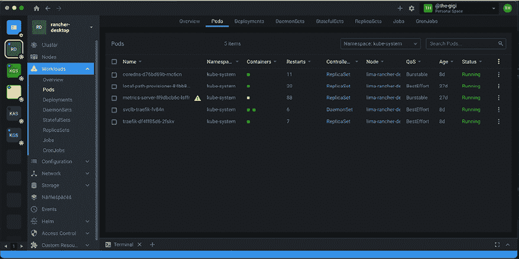

# 第二章：创建 Kubernetes 集群

在上一章中，我们了解了 Kubernetes 的基本概念，它的设计、支持的概念、架构以及支持的各种容器运行时。

从零开始创建 Kubernetes 集群是一项复杂的任务。需要选择多种选项和工具，考虑的因素也很多。在本章中，我们将动手构建一些 Kubernetes 集群，使用 Minikube、KinD 和 k3d。我们还将讨论并评估其他工具，如 Kubeadm 和 Kubespray。我们还会研究本地、云端和裸金属等部署环境。我们将涵盖的主题如下：

+   为你的第一个集群做准备

+   使用 Minikube 创建一个单节点集群

+   使用 KinD 创建一个多节点集群

+   使用 k3d 创建一个多节点集群

+   在云端创建集群

+   从零开始创建裸金属集群

+   审视其他创建 Kubernetes 集群的选项

在本章结束时，你将对创建 Kubernetes 集群的各种选项有一个全面的理解，并掌握支持 Kubernetes 集群创建的最佳工具，同时你还将构建多个集群，包括单节点和多节点集群。

# 为你的第一个集群做准备

在我们开始创建集群之前，我们应该安装一些工具，如 Docker 客户端和 kubectl。如今，最方便的在 Mac 和 Windows 上安装 Docker 和 kubectl 的方法是通过 Rancher Desktop。如果你已经安装了这些工具，可以跳过本节。

## 安装 Rancher Desktop

Rancher Desktop 是一个跨平台的桌面应用程序，让你可以在本地计算机上运行 Docker。它将安装额外的工具，如：

+   Helm

+   Kubectl

+   Nerdctl

+   Moby（开源 Docker）

+   Docker Compose

### macOS 上的安装

在 macOS 上安装 Rancher Desktop 最简便的方法是通过 Homebrew：

```
brew install --cask rancher 
```

### Windows 上的安装

在 Windows 上安装 Rancher Desktop 最简便的方法是通过 Chocolatey：

```
choco install rancher-desktop 
```

### 其他安装方法

有关其他安装 Docker Desktop 的方法，请按照此处的说明进行操作：

[`docs.rancherdesktop.io/getting-started/installation/`](https://docs.rancherdesktop.io/getting-started/installation/)

让我们验证一下`docker`是否已正确安装。输入以下命令，并确保没有错误（如果你安装了与我不同的版本，输出不必完全相同）：

```
$ docker version
Client:
 Version:           20.10.9
 API version:       1.41
 Go version:        go1.16.8
 Git commit:        c2ea9bc
 Built:             Thu Nov 18 21:17:06 2021
 OS/Arch:           darwin/arm64
 Context:           rancher-desktop
 Experimental:      true
Server:
 Engine:
  Version:          20.10.14
  API version:      1.41 (minimum version 1.12)
  Go version:       go1.17.9
  Git commit:       87a90dc786bda134c9eb02adbae2c6a7342fb7f6
  Built:            Fri Apr 15 00:05:05 2022
  OS/Arch:          linux/arm64
  Experimental:     false
 containerd:
  Version:          v1.5.11
  GitCommit:        3df54a852345ae127d1fa3092b95168e4a88e2f8
 runc:
  Version:          1.0.2
  GitCommit:        52b36a2dd837e8462de8e01458bf02cf9eea47dd
 docker-init:
  Version:          0.19.0
  GitCommit: 
```

同时，让我们验证一下 kubectl 是否已正确安装：

```
$ kubectl version
Client Version: version.Info{Major:"1", Minor:"23", GitVersion:"v1.23.4", GitCommit:"e6c093d87ea4cbb530a7b2ae91e54c0842d8308a", GitTreeState:"clean", BuildDate:"2022-02-16T12:38:05Z", GoVersion:"go1.17.7", Compiler:"gc", Platform:"darwin/amd64"}
Server Version: version.Info{Major:"1", Minor:"23", GitVersion:"v1.23.6+k3s1", GitCommit:"418c3fa858b69b12b9cefbcff0526f666a6236b9", GitTreeState:"clean", BuildDate:"2022-04-28T22:16:58Z", GoVersion:"go1.17.5", Compiler:"gc", Platform:"linux/arm64"} 
```

如果没有激活的 Kubernetes 服务器在运行，`Server`部分可能会为空。当你看到这个输出时，可以放心地确认 kubectl 已经准备好使用。

## 认识 kubectl

在我们开始创建集群之前，先来聊聊 kubectl。它是官方的 Kubernetes CLI，能够通过其 API 与 Kubernetes 集群的 API 服务器进行交互。默认情况下，它使用 `~/.kube/config` 文件进行配置，这是一个 YAML 文件，包含元数据、连接信息以及一个或多个集群的身份验证令牌或证书。Kubectl 提供了查看配置和在多个集群之间切换的命令。如果配置文件包含多个集群，你也可以通过设置 `KUBECONFIG` 环境变量或传递 `--kubeconfig` 命令行标志，指定 kubectl 使用不同的配置文件。

下面的代码使用 `kubectl` 命令检查当前活动集群的 `kube-system` 命名空间中的 pods：

```
$ kubectl get pods -n kube-system
NAME                                      READY   STATUS    RESTARTS         AGE
svclb-traefik-fv84n                       2/2     Running   6 (7d20h ago)    8d
local-path-provisioner-84bb864455-s2xmp   1/1     Running   20 (7d20h ago)   27d
metrics-server-ff9dbcb6c-lsffr            0/1     Running   88 (10h ago)     27d
coredns-d76bd69b-mc6cn                    1/1     Running   11 (22h ago)     8d
traefik-df4ff85d6-2fskv                   1/1     Running   7 (3d ago)       8d 
```

Kubectl 很棒，但它并不是唯一的选择。我们来看看一些替代工具。

## Kubectl 替代品 – K9S、KUI 和 Lens

Kubectl 是一个直截了当的命令行工具。它非常强大，但对于一些人来说，它的输出可能难以视觉解析，或者记不住所有的标志和选项。社区开发了许多可以替代（或者更像是补充）kubectl 的工具。在我看来，最好的几个是 K9S、KUI 和 Lens。

### K9S

K9S 是一个基于终端的 UI，用于管理 Kubernetes 集群。它拥有许多快捷键和聚合视图，这些视图通常需要执行多个 kubectl 命令才能完成。

下面是 K9S 窗口的样子：


图 2.1：K9S 窗口

在这里查看：[`k9scli.io`](https://k9scli.io)

### KUI

KUI 是一个为 **CLI**（**命令行界面**）添加图形界面的框架。这是一个非常有趣的概念。KUI 当然专注于 Kubernetes。它让你运行 Kubectl 命令，并将结果以图形方式呈现。KUI 还收集了大量相关信息，并通过标签和详细面板以简洁的方式呈现，便于更深入探索。

KUI 基于 Electron，但它非常快速。

下面是 KUI 窗口的样子：


图 2.2：KUI 窗口

在这里查看：[`kui.tools`](https://kui.tools)

### Lens

Lens 是一个非常精致的应用程序。它同样提供了集群的图形化视图，并允许你在 UI 中执行大量操作，必要时还可以切换到终端界面。我尤其欣赏 Lens 提供的轻松操作多个集群的能力。

下面是 Lens 窗口的样子：



图 2.3：Lens 窗口

在这里查看：[`k8slens.dev`](https://k8slens.dev)

所有这些工具都是本地运行的。我强烈建议你先尝试使用 kubectl，然后再试试这些工具。也许其中某一个正适合你的使用方式。

在本节中，我们介绍了 Rancher Desktop 的安装，介绍了 kubectl，并查看了一些替代方案。现在我们准备创建我们的第一个 Kubernetes 集群。

# 使用 Minikube 创建单节点集群

在本节中，我们将使用 Minikube 创建一个本地单节点集群。本地集群对于开发人员非常有用，尤其是那些希望在提交更改之前，在自己的机器上进行快速的编辑-测试-部署-调试循环的开发人员。本地集群对于 DevOps 和操作员也很有用，尤其是那些希望在不担心破坏共享环境或在云中创建昂贵资源并忘记清理的情况下，进行本地 Kubernetes 测试的人员。虽然 Kubernetes 通常在生产环境中部署在 Linux 上，但许多开发人员使用的是 Windows PC 或 Mac。因此，如果您希望在 Linux 上安装 Minikube，差异不大。


图 2.4：minikube

## Minikube 简介

Minikube 是最成熟的本地 Kubernetes 集群。它运行最新的稳定 Kubernetes 版本，支持 Windows、macOS 和 Linux。Minikube 提供了许多高级选项和功能：

+   LoadBalancer 服务类型 - 通过 minikube tunnel

+   NodePort 服务类型 - 通过 minikube service

+   多个集群

+   文件系统挂载

+   GPU 支持 - 用于机器学习

+   RBAC

+   持久化卷

+   Ingress

+   仪表盘 - 通过 minikube dashboard

+   自定义容器运行时 - 通过 `start --container-runtime` 标志

+   通过命令行标志配置 API 服务器和 kubelet 选项

+   插件

## 安装 Minikube

终极指南在这里：[`minikube.sigs.k8s.io/docs/start/`](https://minikube.sigs.k8s.io/docs/start/)

但是，为了节省您的时间，以下是写作时的最新安装说明。

### 在 Windows 上安装 Minikube

在 Windows 上，我喜欢通过 Chocolatey 包管理器安装软件。如果您还没有安装它，可以在这里获取：[`chocolatey.org/`](https://chocolatey.org/)

如果您不想使用 Chocolatey，请查看上面的终极指南，获取其他方法。

安装 Chocolatey 后，安装过程相当简单：

```
PS C:\Windows\system32> choco install minikube -y
Chocolatey v0.12.1
Installing the following packages:
minikube
By installing, you accept licenses for the packages.
Progress: Downloading Minikube 1.25.2... 100%
kubernetes-cli v1.24.0 [Approved]
kubernetes-cli package files install completed. Performing other installation steps.
Extracting 64-bit C:\ProgramData\chocolatey\lib\kubernetes-cli\tools\kubernetes-client-windows-amd64.tar.gz to C:\ProgramData\chocolatey\lib\kubernetes-cli\tools...
C:\ProgramData\chocolatey\lib\kubernetes-cli\tools
Extracting 64-bit C:\ProgramData\chocolatey\lib\kubernetes-cli\tools\kubernetes-client-windows-amd64.tar to C:\ProgramData\chocolatey\lib\kubernetes-cli\tools...
C:\ProgramData\chocolatey\lib\kubernetes-cli\tools
 ShimGen has successfully created a shim for kubectl-convert.exe
 ShimGen has successfully created a shim for kubectl.exe
 The install of kubernetes-cli was successful.
  Software installed to 'C:\ProgramData\chocolatey\lib\kubernetes-cli\tools'
Minikube v1.25.2 [Approved]
minikube package files install completed. Performing other installation steps.
 ShimGen has successfully created a shim for minikube.exe
 The install of minikube was successful.
  Software installed to 'C:\ProgramData\chocolatey\lib\Minikube'
Chocolatey installed 2/2 packages.
 See the log for details (C:\ProgramData\chocolatey\logs\chocolatey.log). 
```

在 Windows 上，您可以在不同的命令行环境中工作。最常见的环境是 PowerShell 和 **WSL**（**Windows Subsystem for Linux**）。这两种环境都可以使用。某些操作可能需要以管理员模式运行。

至于控制台窗口，近年来我推荐使用官方的 Windows Terminal。您可以通过一条命令安装它：

```
choco install microsoft-windows-terminal --pre 
```

如果您更喜欢使用其他控制台窗口，如 ConEMU 或 Cmdr，也是完全可以的。

我会使用快捷方式让操作更简单。如果您希望跟着操作并将别名复制到您的配置文件中，您可以在 PowerShell 和 WSL 中使用以下内容。

对于 PowerShell，请将以下内容添加到您的 `$profile`：

```
function k { kubectl.exe $args } function mk { minikube.exe $args } 
```

对于 WSL，请将以下内容添加到 `.bashrc`：

```
alias k='kubectl.exe'
alias mk=minikube.exe' 
```

让我们验证 Minikube 是否正确安装：

```
$ mk version
minikube version: v1.25.2
commit: 362d5fdc0a3dbee389b3d3f1034e8023e72bd3a7 
```

让我们使用 `mk start` 创建一个集群：

```
$ mk start
  minikube v1.25.2 on Microsoft Windows 10 Pro 10.0.19044 Build 19044
  Automatically selected the docker driver. Other choices: hyperv, ssh
  Starting control plane node minikube in cluster minikube
  Pulling base image ...
  Downloading Kubernetes v1.23.3 preload ...
    > preloaded-images-k8s-v17-v1...: 505.68 MiB / 505.68 MiB  100.00% 3.58 MiB
    > gcr.io/k8s-minikube/kicbase: 379.06 MiB / 379.06 MiB  100.00% 2.61 MiB p/
  Creating docker container (CPUs=2, Memory=8100MB) ...
  docker "minikube" container is missing, will recreate.
  Creating docker container (CPUs=2, Memory=8100MB) ...
  Downloading VM boot image ...
    > minikube-v1.25.2.iso.sha256: 65 B / 65 B [-------------] 100.00% ? p/s 0s
    > minikube-v1.25.2.iso: 237.06 MiB / 237.06 MiB  100.00% 12.51 MiB p/s 19s
  Creating hyperv VM (CPUs=2, Memory=6000MB, Disk=20000MB) ...
  This VM is having trouble accessing https://k8s.gcr.io
  To pull new external images, you may need to configure a proxy: https://minikube.sigs.k8s.io/docs/reference/networki
ng/proxy/
  Preparing Kubernetes v1.23.3 on Docker 20.10.12 ...
    ▪ kubelet.housekeeping-interval=5m
    ▪ Generating certificates and keys ...
    ▪ Booting up control plane ...
    ▪ Configuring RBAC rules ...
  Verifying Kubernetes components...
    ▪ Using image gcr.io/k8s-minikube/storage-provisioner:v5
  Enabled addons: storage-provisioner, default-storageclass
  Done! kubectl is now configured to use "minikube" cluster and "default" namespace by default 
```

如你所见，即使是默认设置的过程也相当复杂，需要多次重试（自动进行）。你可以通过多种命令行标志来自定义集群创建过程。输入`mk start -h`查看可用的选项。

让我们检查集群的状态：

```
$ mk status
minikube
type: Control Plane
host: Running
kubelet: Running
apiserver: Running
kubeconfig: Configured 
```

一切顺利！

现在让我们停止集群，然后稍后重新启动它：

```
$ mk stop
 Stopping node "minikube" ... 
 Powering off "minikube" via SSH ... 
 1 node stopped. 
```

使用`time`命令重启并测量所需时间：

```
$ time mk start
  minikube v1.25.2 on Microsoft Windows 10 Pro 10.0.19044 Build 19044
  Using the hyperv driver based on existing profile
  Starting control plane node minikube in cluster minikube
  Restarting existing hyperv VM for "minikube" ...
  This VM is having trouble accessing https://k8s.gcr.io
  To pull new external images, you may need to configure a proxy: https://minikube.sigs.k8s.io/docs/reference/networki
ng/proxy/
  Preparing Kubernetes v1.23.3 on Docker 20.10.12 ...
    ▪ kubelet.housekeeping-interval=5m
  Verifying Kubernetes components...
    ▪ Using image gcr.io/k8s-minikube/storage-provisioner:v5
  Enabled addons: storage-provisioner, default-storageclass
  Done! kubectl is now configured to use "minikube" cluster and "default" namespace by default
real    1m8.666s
user    0m0.004s
sys     0m0.000s 
```

这花了稍微超过一分钟。

让我们回顾一下 Minikube 为你背后做了哪些工作。当你从零开始创建集群时，你将需要做很多这些操作。

1.  启动了一个 Hyper-V 虚拟机

1.  为本地机器和虚拟机创建了证书

1.  下载了镜像

1.  设置本地机器与虚拟机之间的网络连接

1.  在虚拟机上运行本地 Kubernetes 集群

1.  配置了集群

1.  启动了所有 Kubernetes 控制平面组件

1.  配置了 kubelet

1.  启用了附加组件（用于存储）

1.  配置了 kubectl 与集群通信

### 在 macOS 上安装 Minikube

在 Mac 上，我建议使用 Homebrew 安装 minikube：

```
$ brew install minikube
Running `brew update --preinstall`...
==> Auto-updated Homebrew!
Updated 2 taps (homebrew/core and homebrew/cask).
==> Updated Formulae
Updated 39 formulae.
==> New Casks
contour                                                        hdfview                         rancher-desktop | kube-system
==> Updated Casks
Updated 17 casks.
==> Downloading https://ghcr.io/v2/homebrew/core/kubernetes-cli/manifests/1.24.0
######################################################################## 100.0%
==> Downloading https://ghcr.io/v2/homebrew/core/kubernetes-cli/blobs/sha256:e57f8f7ea19d22748d1bcae5cd02b91e71816147712e6dcd
==> Downloading from https://pkg-containers.githubusercontent.com/ghcr1/blobs/sha256:e57f8f7ea19d22748d1bcae5cd02b91e71816147
######################################################################## 100.0%
==> Downloading https://ghcr.io/v2/homebrew/core/minikube/manifests/1.25.2
Already downloaded: /Users/gigi.sayfan/Library/Caches/Homebrew/downloads/fa0034afe1330adad087a8b3dc9ac4917982d248b08a4df4cbc52ce01d5eabff--minikube-1.25.2.bottle_manifest.json
==> Downloading https://ghcr.io/v2/homebrew/core/minikube/blobs/sha256:6dee5f22e08636346258f4a6daa646e9102e384ceb63f33981745d
Already downloaded: /Users/gigi.sayfan/Library/Caches/Homebrew/downloads/ceeab562206fd08fd3b6523a85b246d48d804b2cd678d76cbae4968d97b5df1f--minikube--1.25.2.arm64_monterey.bottle.tar.gz
==> Installing dependencies for minikube: kubernetes-cli
==> Installing minikube dependency: kubernetes-cli
==> Pouring kubernetes-cli--1.24.0.arm64_monterey.bottle.tar.gz
  /opt/homebrew/Cellar/kubernetes-cli/1.24.0: 228 files, 55.3MB
==> Installing minikube
==> Pouring minikube--1.25.2.arm64_monterey.bottle.tar.gz
==> Caveats
zsh completions have been installed to:
  /opt/homebrew/share/zsh/site-functions
==> Summary
  /opt/homebrew/Cellar/minikube/1.25.2: 9 files, 70.3MB
==> Running `brew cleanup minikube`...
Disable this behaviour by setting HOMEBREW_NO_INSTALL_CLEANUP.
Hide these hints with HOMEBREW_NO_ENV_HINTS (see `man brew`).
==> Caveats
==> minikube
zsh completions have been installed to:
  /opt/homebrew/share/zsh/site-functions 
```

你可以将别名添加到你的`.bashrc`文件中（类似于 Windows 上的 WSL 别名）：

```
alias k='kubectl'
alias mk='$(brew --prefix)/bin/minikube' 
```

现在你可以使用`k`和`mk`，这样可以减少输入。

输入`mk version`来验证 Minikube 是否正确安装并正常运行：

```
$ mk version
minikube version: v1.25.2
commit: 362d5fdc0a3dbee389b3d3f1034e8023e72bd3a7 
```

输入`k version`来验证 kubectl 是否正确安装并正常运行：

```
$ k version
I0522 15:41:13.663004   68055 versioner.go:58] invalid configuration: no configuration has been provided
Client Version: version.Info{Major:"1", Minor:"23", GitVersion:"v1.23.4", GitCommit:"e6c093d87ea4cbb530a7b2ae91e54c0842d8308a", GitTreeState:"clean", BuildDate:"2022-02-16T12:38:05Z", GoVersion:"go1.17.7", Compiler:"gc", Platform:"darwin/amd64"}
The connection to the server localhost:8080 was refused - did you specify the right host or port? 
```

请注意客户端版本是 1.23。不要担心错误信息。没有集群在运行，所以 kubectl 无法连接任何东西。这是预期中的情况。当我们创建集群时，错误信息将消失。

你可以通过不带参数地输入命令，探索 Minikube 和 kubectl 的可用命令和标志。

在 macOS 上创建集群，只需运行`mk start`。

### 故障排除 Minikube 安装

如果在过程中出现问题，请尝试根据错误信息进行操作。你可以添加`--alsologtostderr`标志，将详细的错误信息输出到控制台。Minikube 执行的所有操作都井井有条地组织在`~/.minikube`目录下。这里是目录结构：

```
$ tree ~/.minikube\ -L 2
C:\Users\the_g\.minikube\
|-- addons
|-- ca.crt
|-- ca.key
|-- ca.pem
|-- cache
|   |-- iso
|   |-- kic
|   `-- preloaded-tarball
|-- cert.pem
|-- certs
|   |-- ca-key.pem
|   |-- ca.pem
|   |-- cert.pem
|   `-- key.pem
|-- config
|-- files
|-- key.pem
|-- logs
|   |-- audit.json
|   `-- lastStart.txt
|-- machine_client.lock
|-- machines
|   |-- minikube
|   |-- server-key.pem
|   `-- server.pem
|-- profiles
|   `-- minikube
|-- proxy-client-ca.crt
`-- proxy-client-ca.key
13 directories, 16 files 
```

如果你没有 tree 工具，可以安装它。

在 Windows 上：`$ choco install -y tree`

在 Mac 上：`brew install tree`

## 查看集群

既然我们已经有了一个正在运行的集群，让我们来看一下集群内部。

首先，让我们`ssh`进入虚拟机：

```
$ mk ssh
                         _             _
            _         _ ( )           ( )
  ___ ___  (_)  ___  (_)| |/')  _   _ | |_      __
/' _ ` _ `\| |/' _ `\| || , <  ( ) ( )| '_`\  /'__`\
| ( ) ( ) || || ( ) || || |\`\ | (_) || |_) )(  ___/
(_) (_) (_)(_)(_) (_)(_)(_) (_)`\___/'(_,__/'`\____)
$ uname -a
Linux minikube 4.19.202 #1 SMP Tue Feb 8 19:13:02 UTC 2022 x86_64 GNU/Linux
$ 
```

很好！它能正常工作。那些奇怪的符号是“minikube”的 ASCII 艺术。现在，让我们开始使用 kubectl，因为它是 Kubernetes 的瑞士军刀，将对所有集群都非常有用。

通过*ctrl*+*D*或输入以下命令断开与虚拟机的连接：

```
$ logout 
```

在我们的旅程中，我们将涵盖许多 kubectl 命令。首先，使用`cluster-info`检查集群状态：

```
$ k cluster-info
Kubernetes control plane is running at https://172.26.246.89:8443
CoreDNS is running at https://172.26.246.89:8443/api/v1/namespaces/kube-system/services/kube-dns:dns/proxy
To further debug and diagnose cluster problems, use 'kubectl cluster-info dump'. 
```

你可以看到控制平面正在正常运行。要查看集群中所有对象的更详细的 JSON 格式视图，输入：`k cluster-info dump`。输出可能会让人觉得有些让人望而生畏，我们可以使用更具体的命令来探索集群。

让我们使用`get nodes`检查集群中的节点：

```
$ k get nodes
NAME       STATUS   ROLES                  AGE   VERSION
minikube   Ready    control-plane,master   62m   v1.23.3 
```

所以，我们有一个名为 minikube 的节点。要获取更多关于它的信息，输入：

```
k describe node minikube 
```

输出非常详细；我会让你自己试一下。

在我们开始让集群工作之前，先检查一下 Minikube 默认安装的附加组件：

```
 mk addons list
|-----------------------------|----------|--------------|--------------------------------|
|         ADDON NAME          | PROFILE  |    STATUS    |           MAINTAINER           |
|-----------------------------|----------|--------------|--------------------------------|
| ambassador                  | minikube | disabled     | third-party (ambassador)       |
| auto-pause                  | minikube | disabled     | google                         |
| csi-hostpath-driver         | minikube | disabled     | kubernetes                     |
| dashboard                   | minikube | disabled     | kubernetes                     |
| default-storageclass        | minikube | enabled   | kubernetes                     |
| efk                         | minikube | disabled     | third-party (elastic)          |
| freshpod                    | minikube | disabled     | google                         |
| gcp-auth                    | minikube | disabled     | google                         |
| gvisor                      | minikube | disabled     | google                         |
| helm-tiller                 | minikube | disabled     | third-party (helm)             |
| ingress                     | minikube | disabled     | unknown (third-party)          |
| ingress-dns                 | minikube | disabled     | google                         |
| istio                       | minikube | disabled     | third-party (istio)            |
| istio-provisioner           | minikube | disabled     | third-party (istio)            |
| kong                        | minikube | disabled     | third-party (Kong HQ)          |
| kubevirt                    | minikube | disabled     | third-party (kubevirt)         |
| logviewer                   | minikube | disabled     | unknown (third-party)          |
| metallb                     | minikube | disabled     | third-party (metallb)          |
| metrics-server              | minikube | disabled     | kubernetes                     |
| nvidia-driver-installer     | minikube | disabled     | google                         |
| nvidia-gpu-device-plugin    | minikube | disabled     | third-party (nvidia)           |
| olm                         | minikube | disabled     | third-party (operator          |
|                             |          |              | framework)                     |
| pod-security-policy         | minikube | disabled     | unknown (third-party)          |
| portainer                   | minikube | disabled     | portainer.io                   |
| registry                    | minikube | disabled     | google                         |
| registry-aliases            | minikube | disabled     | unknown (third-party)          |
| registry-creds              | minikube | disabled     | third-party (upmc enterprises) |
| storage-provisioner         | minikube | enabled   | google                         |
| storage-provisioner-gluster | minikube | disabled     | unknown (third-party)          |
| volumesnapshots             | minikube | disabled     | kubernetes                     |
|-----------------------------|----------|--------------|--------------------------------| 
```

正如你所看到的，Minikube 配载了许多附加组件，但默认仅启用了几个存储相关的附加组件。

## 开始工作

在开始之前，如果你正在运行 VPN，拉取镜像时可能需要关闭它。

我们已经有了一个干净的空集群（当然并非完全空，因为 DNS 服务和仪表板作为 Pod 运行在 kube-system 命名空间中）。现在是时候部署一些 Pod 了：

```
$ k create deployment echo --image=k8s.gcr.io/e2e-test-images/echoserver:2.5 
deployment.apps/echo created 
```

让我们检查一下已经创建的 Pod。`-w` 标志表示监视。每当状态变化时，都会显示新的一行：

```
$ k get po -w
NAME                    READY   STATUS              RESTARTS   AGE
echo-7fd7648898-6hh48   0/1     ContainerCreating   0          5s
echo-7fd7648898-6hh48   1/1     Running             0          6s 
```

要将我们的 Pod 暴露为服务，请输入以下命令：

```
$ k expose deployment echo --type=NodePort --port=8080
service/echo exposed 
```

将服务暴露为 `NodePort` 类型意味着它通过某个端口暴露给主机。但这不是我们在 Pod 上运行的 `8080` 端口。端口会在集群中进行映射。要访问该服务，我们需要集群 IP 和暴露的端口：

```
$ mk ip
172.26.246.89
$  k get service echo -o jsonpath='{.spec.ports[0].nodePort}'
32649 
```

现在我们可以访问回显服务，它返回了大量信息：

```
n$ curl http://172.26.246.89:32649/hi
Hostname: echo-7fd7648898-6hh48
Pod Information:
        -no pod information available-
Server values:
        server_version=nginx: 1.14.2 - lua: 10015
Request Information:
        client_address=172.17.0.1
        method=GET
        real path=/hi
        query=
        request_version=1.1
        request_scheme=http
        request_uri=http://172.26.246.89:8080/hi
Request Headers:
        accept=*/*
        host=172.26.246.89:32649
        user-agent=curl/7.79.1
Request Body:
        -no body in request- 
```

恭喜！你刚刚创建了一个本地 Kubernetes 集群，部署了一个服务，并将其暴露给全世界。

## 使用仪表板检查集群

Kubernetes 有一个非常好用的 Web 界面，当然它是作为服务部署在一个 Pod 中的。仪表板设计精良，提供了集群的高层次概览，并能深入查看单个资源、查看日志、编辑资源文件等。当你想手动查看集群，并且没有像 KUI 或 Lens 这样的本地工具时，它是完美的利器。Minikube 将它作为附加组件提供。

让我们启用它：

```
$ mk addons enable dashboard
    ▪ Using image kubernetesui/dashboard:v2.3.1
    ▪ Using image kubernetesui/metrics-scraper:v1.0.7
  Some dashboard features require the metrics-server addon. To enable all features please run:
        minikube addons enable metrics-server
  The 'dashboard' addon is enabled 
```

要启动它，输入：

```
$ mk dashboard
  Verifying dashboard health ...
  Launching proxy ...
  Verifying proxy health ...
  Opening http://127.0.0.1:63200/api/v1/namespaces/kubernetes-dashboard/services/http:kubernetes-dashboard:/proxy/ in your default browser... 
```

Minikube 会打开一个浏览器窗口，显示仪表板 UI。

这是**工作负载**视图，显示了**部署（Deployments）**、**副本集（Replica Sets）**和**Pod**。


图 2.5：工作负载仪表板

它还可以显示守护进程集、状态集和任务，但我们在这个集群中没有这些。

要删除我们创建的集群，请输入：

```
$ mk delete
  Deleting "minikube" in docker ...
  Deleting container "minikube" ...
  Removing /Users/gigi.sayfan/.minikube/machines/minikube ...
  Removed all traces of the "minikube" cluster. 
```

在本节中，我们在 Windows 上创建了一个本地单节点 Kubernetes 集群，使用 kubectl 探索了一下，部署了一个服务，并尝试了网页 UI。在下一节中，我们将转向多节点集群。

# 使用 KinD 创建多节点集群

在本节中，我们将使用 KinD 创建一个多节点集群。我们还将重复在 Minikube 上部署的回显服务器，并观察其中的差异。剧透警告——一切都会更快且更容易！

## KinD 简介

**KinD** 代表 **Kubernetes in Docker**。它是一个用于创建临时集群（没有持久化存储）的工具。它最初是为运行 Kubernetes 兼容性测试而构建的。它支持 Kubernetes 1.11+。在后台，它使用 `kubeadm` 来启动 Docker 容器作为集群中的节点。KinD 是一个库和命令行工具的结合体。你可以在代码中使用该库进行测试或其他用途。KinD 可以创建具有多个控制平面节点的高可用集群。最后，KinD 是一个符合 CNCF 标准的 Kubernetes 安装工具。如果它被用于 Kubernetes 本身的兼容性测试，它必须符合这个标准。

KinD 启动非常迅速，但它也有一些限制：

+   没有持久化存储

+   目前尚不支持其他运行时，仅支持 Docker

让我们安装 KinD 并开始吧。

## 安装 KinD

必须安装 Docker，因为 KinD 实际上是作为 Docker 容器运行的。如果你安装了 Go，可以通过以下方式安装 KinD CLI：

```
go install sigs.k8s.io/kind@v0.14.0 
```

否则，在 macOS 上输入：

```
brew install kind 
```

在 Windows 上，输入：

```
choco install kind 
```

## 处理 Docker 上下文

您的系统上可能有多个 Docker 引擎，而 Docker 上下文决定了使用哪个。您可能会遇到如下错误：

```
Cannot connect to the Docker daemon at unix:///var/run/docker.sock. Is the docker daemon running? 
```

在这种情况下，检查你的 Docker 上下文：

```
$ docker context ls
NAME              DESCRIPTION                               DOCKER ENDPOINT                                 KUBERNETES ENDPOINT                ORCHESTRATOR
colima            colima                                    unix:///Users/gigi.sayfan/.colima/docker.sock
default *         Current DOCKER_HOST based configuration   unix:///var/run/docker.sock                     https://127.0.0.1:6443 (default)   swarm
rancher-desktop   Rancher Desktop moby context              unix:///Users/gigi.sayfan/.rd/docker.sock       https://127.0.0.1:6443 (default) 
```

用 `*` 标记的上下文是当前上下文。如果你使用 Rancher Desktop，则应将上下文设置为 `rancher-desktop`：

```
$ docker context use rancher-desktop 
```

## 使用 KinD 创建集群

创建集群非常简单。

```
$ kind create cluster
Creating cluster "kind" ...
  Ensuring node image (kindest/node:v1.23.4) 
  Preparing nodes 
  Writing configuration 
  Starting control-plane 
  Installing CNI 
  Installing StorageClass 
Set kubectl context to "kind-kind"
You can now use your cluster with:
kubectl cluster-info --context kind-kind
Thanks for using kind!  
```

创建一个单节点集群需要不到 30 秒。

现在，我们可以使用 kubectl 访问集群：

```
$ k config current-context
kind-kind
$ k cluster-info
Kubernetes control plane is running at https://127.0.0.1:51561
CoreDNS is running at https://127.0.0.1:51561/api/v1/namespaces/kube-system/services/kube-dns:dns/proxy
To further debug and diagnose cluster problems, use 'kubectl cluster-info dump'. 
```

默认情况下，KinD 会将其 kube 上下文添加到默认的 `~/.kube/config` 文件中。当创建大量临时集群时，有时最好将 KinD 上下文存储在单独的文件中，避免让 `~/.kube/config` 文件变得混乱。这可以通过传递 `--kubeconfig` 标志并指定文件路径轻松完成。

因此，KinD 默认创建一个单节点集群：

```
$ k get no
NAME                 STATUS   ROLES                  AGE   VERSION
kind-control-plane   Ready    control-plane,master   4m   v1.23.4 
```

让我们删除它并创建一个多节点集群：

```
$ kind delete cluster 
Deleting cluster "kind" ... 
```

要创建一个多节点集群，我们需要提供一个包含节点规格的配置文件。以下是一个配置文件，它将创建一个名为 `multi-node-cluster` 的集群，包含一个控制平面节点和两个工作节点：

```
kind: Cluster
apiVersion: kind.x-k8s.io/v1alpha4
name: multi-node-cluster
nodes:
- role: control-plane
- role: worker
- role: worker 
```

让我们将配置文件保存为 `kind-multi-node-config.yaml` 并创建集群，将 kubeconfig 存储在自己的文件 `$TMPDIR/kind-multi-node-config` 中：

```
$ kind create cluster --config kind-multi-node-config.yaml --kubeconfig $TMPDIR/kind-multi-node-config
Creating cluster "multi-node-cluster" ...
  Ensuring node image (kindest/node:v1.23.4) 
  Preparing nodes 
  Writing configuration 
  Starting control-plane 
  Installing CNI 
  Installing StorageClass 
  Joining worker nodes 
Set kubectl context to "kind-multi-node-cluster"
You can now use your cluster with:
kubectl cluster-info --context kind-multi-node-cluster --kubeconfig /var/folders/qv/7l781jhs6j19gw3b89f4fcz40000gq/T//kind-multi-node-config
Have a nice day!  
```

对了，成功了！我们在不到一分钟的时间内得到了一个本地的 3 节点集群：

```
$ k get nodes --kubeconfig $TMPDIR/kind-multi-node-config
NAME                               STATUS   ROLES                  AGE     VERSION
multi-node-cluster-control-plane   Ready    control-plane,master   2m17s   v1.23.4
multi-node-cluster-worker          Ready    <none>                 100s    v1.23.4
multi-node-cluster-worker2         Ready    <none>                 100s    v1.23.4 
```

KinD 还很贴心（看到了吗）地允许我们创建具有多个控制平面节点的 **HA**（**高可用**）集群以实现冗余。如果你想要一个具有三个控制平面节点和两个工作节点的高可用集群，你的集群配置文件会非常类似：

```
kind: Cluster
apiVersion: kind.x-k8s.io/v1alpha4
name: ha-multi-node-cluster
nodes:
- role: control-plane
- role: control-plane
- role: control-plane
- role: worker
- role: worker 
```

让我们将配置文件保存为 `kind-ha-multi-node-config.yaml` 并创建一个新的 HA 集群：

```
$ kind create cluster --config kind-ha-multi-node-config.yaml --kubeconfig $TMPDIR/kind-ha-multi-node-config
Creating cluster "ha-multi-node-cluster" ...
  Ensuring node image (kindest/node:v1.23.4) 
  Preparing nodes 
  Configuring the external load balancer 
  Writing configuration 
  Starting control-plane 
  Installing CNI 
  Installing StorageClass 
  Joining more control-plane nodes 
  Joining worker nodes 
Set kubectl context to "kind-ha-multi-node-cluster"
You can now use your cluster with:
kubectl cluster-info --context kind-ha-multi-node-cluster --kubeconfig /var/folders/qv/7l781jhs6j19gw3b89f4fcz40000gq/T//kind-ha-multi-node-config
Not sure what to do next?  Check out https://kind.sigs.k8s.io/docs/user/quick-start/ 
```

嗯……这里有些新变化。现在，KinD 创建了一个外部负载均衡器，并且在加入工作节点之前，会先加入更多的控制平面节点。负载均衡器对于在所有控制平面节点之间分发请求是必要的。

请注意，使用 kubectl 时，外部负载均衡器不会显示为节点：

```
$ k get nodes --kubeconfig $TMPDIR/kind-ha-multi-node-config
NAME                                   STATUS   ROLES                  AGE     VERSION
ha-multi-node-cluster-control-plane    Ready    control-plane,master   3m31s   v1.23.4
ha-multi-node-cluster-control-plane2   Ready    control-plane,master   3m19s   v1.23.4
ha-multi-node-cluster-control-plane3   Ready    control-plane,master   2m22s   v1.23.4
ha-multi-node-cluster-worker           Ready    <none>                 2m4s    v1.23.4
ha-multi-node-cluster-worker2          Ready    <none>                 2m5s    v1.23.4 
```

但是，KinD 有自己的 `get nodes` 命令，在这里你可以看到负载均衡器：

```
$ kind get nodes --name ha-multi-node-cluster
ha-multi-node-cluster-control-plane2
ha-multi-node-cluster-external-load-balancer
ha-multi-node-cluster-control-plane
ha-multi-node-cluster-control-plane3
ha-multi-node-cluster-worker
ha-multi-node-cluster-worker2 
```

我们的 KinD 集群已启动并运行；让我们开始使用它。

## 使用 KinD 进行工作

让我们在 KinD 集群上部署我们的回声服务。它的启动方式相同：

```
$ k create deployment echo --image=g1g1/echo-server:0.1 --kubeconfig $TMPDIR/kind-ha-multi-node-config
deployment.apps/echo created
$ k expose deployment echo --type=NodePort --port=7070 --kubeconfig $TMPDIR/kind-ha-multi-node-config
service/echo exposed 
```

检查我们的服务时，我们可以看到回声服务处于最前面：

```
$ k get svc echo --kubeconfig $TMPDIR/kind-ha-multi-node-config
NAME   TYPE       CLUSTER-IP    EXTERNAL-IP   PORT(S)          AGE
echo   NodePort   10.96.52.33   <none>        7070:31953/TCP   10s 
```

但是，服务没有外部 IP。使用 minikube 时，我们可以通过 `$(minikube ip)` 获取 minikube 节点本身的 IP，并可以结合节点端口来访问服务。但在 KinD 集群中没有这个选项。让我们看看如何使用代理来访问回声服务。

## 通过代理本地访问 Kubernetes 服务

我们将在本书后续部分详细讨论网络、服务以及如何将它们暴露到集群外部。

在这里，我们将只展示如何完成操作，并且暂时保持悬念。首先，我们需要运行 `kubectl proxy` 命令来暴露 API 服务器、Pod 和服务到本地主机：

```
$ k proxy --kubeconfig $TMPDIR/kind-ha-multi-node-config &
[1] 32479
Starting to serve on 127.0.0.1:8001 
```

然后，我们可以通过一个专门设计的代理 URL 来访问回声服务，URL 中包含暴露的端口（`8080`），而不是节点端口：

```
$ http http://localhost:8001/api/v1/namespaces/default/services/echo:7070/proxy/yeah-it-works
HTTP/1.1 200 OK
Audit-Id: 294cf10b-0d60-467d-8a51-4414834fc173
Cache-Control: no-cache, private
Content-Length: 13
Content-Type: text/plain; charset=utf-8
Date: Mon, 23 May 2022 21:54:01 GMT
yeah-it-works 
```

我在上面的命令中使用了 httpie。你也可以使用 curl。要安装 httpie，请按照这里的说明操作：[`httpie.org/doc#installation`](https://httpie.org/doc#installation)。

我们将在*第十章*、*探索 Kubernetes 网络*中深入探讨发生了什么。目前，只需演示如何通过 kubectl proxy 访问我们的 KinD 服务就足够了。

让我们看看我最喜欢的本地集群解决方案——k3d。

# 使用 k3d 创建多节点集群

在这一节中，我们将使用 Rancher 的 k3d 创建一个多节点集群。我们不会重复回声服务的部署，因为它与 KinD 集群相同，包括通过代理访问它。剧透警告——使用 k3d 创建集群比 KinD 更快且更具用户友好性！

## k3s 和 k3d 快速介绍

Rancher 创建了 k3s，这是一个轻量级的 Kubernetes 发行版。Rancher 表示 k3s 比 k8s 少了 5（如果有任何意义的话）。基本的想法是移除大多数人不需要的功能和能力，例如：

+   非默认功能

+   传统功能

+   Alpha 功能

+   内建存储驱动程序

+   内建云提供商

K3s 完全去除了 Docker，改用了 containerd。如果你依赖 Docker，仍然可以将它恢复。另一个重大变化是，k3s 将其状态存储在 SQLite 数据库中，而不是 etcd。对于网络和 DNS，k3s 使用 Flannel 和 CoreDNS。

K3s 还添加了一个简化的安装程序，负责 SSL 和证书的配置。

最终结果令人惊讶——一个单一的二进制文件（小于 40MB），只需要 512MB 的内存。

与 Minikube 和 KinD 不同，k3s 实际上是为生产环境设计的。其主要用途是边缘计算、物联网和持续集成系统。它已经针对 ARM 设备进行了优化。

好的，那是 k3s，但 k3d 又是什么？K3d 将 k3s 的所有优点打包在 Docker 中（类似于 KinD），并添加了一个友好的 CLI 来管理它。

让我们安装 k3d，亲自体验一下。

## 安装 k3d

在 macOS 上安装 k3d 就像这样简单：

```
brew install k3d 
```

在 Windows 上，操作非常简单：

```
choco install -y k3d 
```

在 Windows 上，可以选择将此别名添加到你的 WSL `.bashrc` 文件中：

```
alias k3d='k3d.exe' 
```

让我们看看当前的情况：

```
$ k3d version
k3d version v5.4.1
k3s version v1.22.7-k3s1 (default) 
```

如你所见，k3d 会报告其版本，显示一切正常。现在，我们可以使用 k3d 创建集群。

## 使用 k3d 创建集群

准备好震撼了吗？使用 k3d 创建单节点集群只需不到 20 秒！

```
$ time k3d cluster create
INFO[0000] Prep: Network
INFO[0000] Created network 'k3d-k3s-default'
INFO[0000] Created image volume k3d-k3s-default-images
INFO[0000] Starting new tools node...
INFO[0000] Starting Node 'k3d-k3s-default-tools'
INFO[0001] Creating node 'k3d-k3s-default-server-0'
INFO[0001] Creating LoadBalancer 'k3d-k3s-default-serverlb'
INFO[0002] Using the k3d-tools node to gather environment information
INFO[0002] HostIP: using network gateway 172.19.0.1 address
INFO[0002] Starting cluster 'k3s-default'
INFO[0002] Starting servers...
INFO[0002] Starting Node 'k3d-k3s-default-server-0'
INFO[0008] All agents already running.
INFO[0008] Starting helpers...
INFO[0008] Starting Node 'k3d-k3s-default-serverlb'
INFO[0015] Injecting records for hostAliases (incl. host.k3d.internal) and for 2 network members into CoreDNS configmap...
INFO[0017] Cluster 'k3s-default' created successfully!
INFO[0018] You can now use it like this:
kubectl cluster-info
real    0m18.154s
user    0m0.005s
sys     0m0.000s 
```

没有负载均衡器的情况下，启动时间少于 8 秒！

那么，如何处理多节点集群呢？我们看到 KinD 的速度要慢得多，尤其是在创建具有多个控制平面节点和外部负载均衡器的高可用集群时。

让我们先删除单节点集群：

```
$ k3d cluster delete
INFO[0000] Deleting cluster 'k3s-default'
INFO[0000] Deleting cluster network 'k3d-k3s-default'
INFO[0000] Deleting 2 attached volumes...
WARN[0000] Failed to delete volume 'k3d-k3s-default-images' of cluster 'k3s-default': failed to find volume 'k3d-k3s-default-images': Error: No such volume: k3d-k3s-default-images -> Try to delete it manually
INFO[0000] Removing cluster details from default kubeconfig...
INFO[0000] Removing standalone kubeconfig file (if there is one)...
INFO[0000] Successfully deleted cluster k3s-default! 
```

现在，让我们创建一个包含 3 个工作节点的集群。大约需要 30 秒多一点：

```
$ time k3d cluster create --agents 3
INFO[0000] Prep: Network
INFO[0000] Created network 'k3d-k3s-default'
INFO[0000] Created image volume k3d-k3s-default-images
INFO[0000] Starting new tools node...
INFO[0000] Starting Node 'k3d-k3s-default-tools'
INFO[0001] Creating node 'k3d-k3s-default-server-0'
INFO[0001] Creating node 'k3d-k3s-default-agent-0'
INFO[0002] Creating node 'k3d-k3s-default-agent-1'
INFO[0002] Creating node 'k3d-k3s-default-agent-2'
INFO[0002] Creating LoadBalancer 'k3d-k3s-default-serverlb'
INFO[0002] Using the k3d-tools node to gather environment information
INFO[0002] HostIP: using network gateway 172.22.0.1 address
INFO[0002] Starting cluster 'k3s-default'
INFO[0002] Starting servers...
INFO[0002] Starting Node 'k3d-k3s-default-server-0'
INFO[0008] Starting agents...
INFO[0008] Starting Node 'k3d-k3s-default-agent-0'
INFO[0008] Starting Node 'k3d-k3s-default-agent-2'
INFO[0008] Starting Node 'k3d-k3s-default-agent-1'
INFO[0018] Starting helpers...
INFO[0019] Starting Node 'k3d-k3s-default-serverlb'
INFO[0029] Injecting records for hostAliases (incl. host.k3d.internal) and for 5 network members into CoreDNS configmap...
INFO[0032] Cluster 'k3s-default' created successfully!
INFO[0032] You can now use it like this:
kubectl cluster-info
real    0m32.512s
user    0m0.005s
sys     0m0.000s 
```

让我们验证集群是否按预期工作：

```
$ k cluster-info
Kubernetes control plane is running at https://0.0.0.0:60490
CoreDNS is running at https://0.0.0.0:60490/api/v1/namespaces/kube-system/services/kube-dns:dns/proxy
Metrics-server is running at https://0.0.0.0:60490/api/v1/namespaces/kube-system/services/https:metrics-server:https/proxy
To further debug and diagnose cluster problems, use 'kubectl cluster-info dump'. 
```

这里是各个节点。请注意，只有一个控制平面节点，名为`k3d-k3s-default-server-0`：

```
$ k get nodes
NAME                       STATUS   ROLES                  AGE     VERSION
k3d-k3s-default-server-0   Ready    control-plane,master   5m33s   v1.22.7+k3s1
k3d-k3s-default-agent-0    Ready    <none>                 5m30s   v1.22.7+k3s1
k3d-k3s-default-agent-2    Ready    <none>                 5m30s   v1.22.7+k3s1
k3d-k3s-default-agent-1    Ready    <none>                 5m29s   v1.22.7+k3s1 
```

你可以使用 k3d CLI 停止和启动集群，创建多个集群，列出现有集群。以下是所有命令，欢迎进一步探索：

```
$ k3d
Usage:
  k3d [flags]
  k3d [command]
Available Commands:
  cluster      Manage cluster(s)
  completion   Generate completion scripts for [bash, zsh, fish, powershell | psh]
  config       Work with config file(s)
  help         Help about any command
  image        Handle container images.
  kubeconfig   Manage kubeconfig(s)
  node         Manage node(s)
  registry     Manage registry/registries
  version      Show k3d and default k3s version
Flags:
  -h, --help         help for k3d
      --timestamps   Enable Log timestamps
      --trace        Enable super verbose output (trace logging)
      --verbose      Enable verbose output (debug logging)
      --version      Show k3d and default k3s version
Use "k3d [command] --help" for more information about a command. 
```

你可以自行重复部署、暴露和访问回显服务的步骤。它的工作方式与 KinD 完全相同。

好的，我们已经使用 minikube、KinD 和 k3d 创建了集群。现在，让我们对它们进行比较，这样你就可以决定哪个最适合你。

# 比较 Minikube、KinD 和 k3d

Minikube 是一个官方的本地 Kubernetes 版本，功能非常成熟且全面。不过，它需要虚拟机，安装和启动都比较慢。有时，它的网络会出现问题，唯一的解决方法是删除集群并重新启动。此外，minikube 仅支持单节点。我建议只有在 Minikube 提供 KinD 或 k3d 不支持的某些功能时才使用它。更多信息请查看 [`minikube.sigs.k8s.io/`](https://minikube.sigs.k8s.io/)。

KinD 比 Minikube 快得多，并且用于 Kubernetes 一致性测试，因此它本质上是一个符合标准的 Kubernetes 发行版。它是唯一提供多控制平面节点高可用集群的本地集群解决方案。它还被设计为可以作为库使用，但我觉得这并没有太大吸引力，因为通过代码自动化 CLI 非常容易。KinD 的主要缺点是它是临时性的。我建议如果你在为 Kubernetes 本身做贡献并想要进行相关测试时使用 KinD。更多信息请查看 [`kind.sigs.k8s.io/`](https://kind.sigs.k8s.io/)。

对我来说，K3d 是明显的赢家。速度非常快，支持多个集群以及每个集群中的多个工作节点。轻松停止和启动集群而不会丢失状态。查看 [`k3d.io/`](https://k3d.io/)。

## 荣誉提名 – Rancher Desktop Kubernetes 集群

我使用 Rancher Desktop 作为我的 Docker 引擎提供商，但它还内置了一个 Kubernetes 集群。你无法自定义它，不能有多个集群，甚至同一个集群中也不能有多个节点。但如果你只需要一个本地的单节点 Kubernetes 集群来进行试验，那么`rancher-desktop`集群就适合你。

要使用此集群，请输入：

```
$ kubectl config use-context rancher-desktop
Switched to context "rancher-desktop". 
```

你可以决定为其节点分配多少资源，这在尝试在其上部署大量工作负载时非常重要，因为你只有一个节点。


图 2.6：Rancher Desktop – Kubernetes 设置

在本节中，我们介绍了如何使用 Minikube、KinD 和 K3d 在本地创建 Kubernetes 集群。在下一节中，我们将探讨如何在云端创建集群。

# 在云中创建集群（GCP、AWS、Azure 和 Digital Ocean）

本地创建集群很有趣。它在开发过程中和尝试本地排查问题时也非常重要。但是，最终，Kubernetes 是为云原生应用程序（在云中运行的应用程序）设计的。Kubernetes 不希望知道单个云环境，因为这不具备可扩展性。因此，Kubernetes 有一个云提供商接口的概念。每个云提供商都可以实现此接口，然后托管 Kubernetes。

## 云提供商接口

云提供商接口是一个由 Go 数据类型和接口组成的集合。它定义在一个名为`cloud.go`的文件中，可以在以下位置找到：[`github.com/kubernetes/cloud-provider/blob/master/cloud.go`](https://github.com/kubernetes/cloud-provider/blob/master/cloud.go)。

这是主要界面：

```
type Interface interface {
     Initialize(clientBuilder ControllerClientBuilder, stop <-chan struct{})
    LoadBalancer() (LoadBalancer, bool)
    Instances() (Instances, bool)
    InstancesV2() (InstancesV2, bool)
    Zones() (Zones, bool)
    Clusters() (Clusters, bool)
    Routes() (Routes, bool)
    ProviderName() string
    HasClusterID() bool
} 
```

这非常清晰。Kubernetes 是基于实例、区域、集群和路由来运作的，还需要访问负载均衡器和提供商名称。主要接口主要是一个网关。上面`Interface`接口的大多数方法返回的是其他接口。

例如，`Clusters()`方法返回`Cluster`接口，使用起来非常简单：

```
type Clusters interface {
    ListClusters(ctx context.Context) ([]string, error)
    Master(ctx context.Context, clusterName string) (string, error)
} 
```

`ListClusters()` 方法返回集群名称。`Master()` 方法返回集群控制平面的 IP 地址或 DNS 名称。

其他接口也没有更复杂。整个文件有 313 行（截至编写时），包括大量注释。关键点是，如果你的云环境利用了这些基本概念，实现 Kubernetes 提供商并不太复杂。

## 在云中创建 Kubernetes 集群

在我们查看云服务提供商及其对托管和非托管 Kubernetes 的支持之前，让我们先考虑一下你应该如何创建和维护集群。如果你决定使用一个云服务提供商，并且对使用他们的工具感到满意，那么你就准备好了。所有云服务提供商都允许你通过 Web UI、CLI 或 API 来创建和配置 Kubernetes 集群。然而，如果你更倾向于采用更通用的方法，并希望利用 GitOps 来管理集群，那么你应该研究如 Terraform 和 Pulumi 等基础设施即代码的解决方案。

如果你倾向于在云端部署非托管的 Kubernetes 集群，那么 kOps 是一个强有力的候选方案。请参见：[`kops.sigs.k8s.io`](https://kops.sigs.k8s.io)。

在稍后的*第十七章*，*在生产环境中运行 Kubernetes*，我们将详细讨论多集群配置和管理的话题。这个领域有许多技术、开源项目和商业产品。

现在，让我们来看一下各种云服务提供商。

## GCP

**谷歌云平台**（**GCP**）原生支持 Kubernetes。所谓的 **Google Kubernetes Engine**（**GKE**）是一个基于 Kubernetes 的容器管理解决方案。你无需在 GCP 上安装 Kubernetes，可以使用 Google Cloud API 来创建和配置 Kubernetes 集群。Kubernetes 是 GCP 的内建部分，这意味着它将始终与 GCP 深度集成，并经过充分测试，你不必担心底层平台的变化会破坏云服务提供商的接口。

如果你更倾向于自行管理 Kubernetes，那么你可以直接在 GCP 实例上部署它（或使用 kOps 的 GCP alpha 支持），但我一般不建议这么做，因为 GKE 为你做了很多工作，并且它与 GCP 的计算、网络和核心服务深度集成。

总的来说，如果你计划基于 Kubernetes 构建系统，并且没有在其他云平台上已有现有代码，那么 GCP 是一个可靠的选择。它在成熟度、精致度和与 GCP 服务的深度集成方面处于领先地位，并且通常是第一个更新到 Kubernetes 新版本的云平台。

我在 GKE 上花了很多时间，管理了几十个集群，升级它们并部署工作负载。GKE 毫无疑问是一个生产级的 Kubernetes 解决方案。

### GKE 自动驾驶

GKE 还有一个名为 Autopilot 的项目，它为你管理工作节点和节点池，让你可以专注于部署和配置工作负载。

请参见：[`cloud.google.com/kubernetes-engine/docs/concepts/autopilot-overview`](https://cloud.google.com/kubernetes-engine/docs/concepts/autopilot-overview)。

## AWS

**AWS** 有自己的容器管理服务，称为 ECS，它不是基于 Kubernetes 的。它也有一个托管的 Kubernetes 服务，称为 EKS。你可以在 AWS EC2 实例上自行运行 Kubernetes。我们先来谈谈如何自建 Kubernetes，然后再讨论 EKS。

### 在 EC2 上运行 Kubernetes

AWS 从一开始就是一个支持的云服务提供商。有大量的文档说明如何进行设置。尽管您可以自己配置一些 EC2 实例并使用 kubeadm 创建集群，但我建议使用之前提到的 kOps（Kubernetes 操作）项目。kOps 最初只支持 AWS，通常被认为是最经受考验且功能最丰富的工具，用于在 AWS 上自我配置 Kubernetes 集群（不使用 EKS）。

它支持以下功能：

+   自动化的 Kubernetes 集群 CRUD 操作（适用于 AWS）

+   高可用 Kubernetes 集群

+   使用状态同步模型进行干运行和自动幂等性

+   对 kubectl 插件的自定义支持

+   kOps 可以生成 Terraform 配置

+   基于在目录树中定义的简单元模型

+   简单的命令行语法

+   社区支持

要创建一个集群，您需要进行一些 IAM 和 DNS 配置，设置一个 S3 桶来存储集群配置，然后运行一个命令：

```
kops create cluster \
    --name=${NAME} \
    --cloud=aws \
    --zones=us-west-2a \
    --discovery-store=s3://prefix-example-com-oidc-store/${NAME}/discovery 
```

完整的说明在这里：[`kops.sigs.k8s.io/getting_started/aws/`](https://kops.sigs.k8s.io/getting_started/aws/)。

2017 年底，AWS 加入了 CNCF，并发布了关于 Kubernetes 的两项重要公告：其基于 Kubernetes 的容器编排解决方案（EKS）和按需容器解决方案（Fargate）。

### Amazon EKS

**Amazon 弹性 Kubernetes 服务** (**EKS**) 是一个完全托管且高可用的 Kubernetes 解决方案。它有三个控制平面节点，分别运行在三个 AZ（可用区）。EKS 还会处理升级和补丁管理。EKS 的一个优点是它运行的是标准 Kubernetes。这意味着您可以使用社区开发的所有标准插件和工具。它还为与其他云服务提供商和/或您自己的本地 Kubernetes 集群进行便捷的集群联合打开了大门。

EKS 提供与 AWS 基础设施的深度集成，例如与 Kubernetes **基于角色的访问控制** (**RBAC**) 集成的 IAM 身份验证。

如果您希望直接从自己的 Amazon VPC 访问 Kubernetes 主节点，还可以使用 PrivateLink。通过 PrivateLink，您的 Kubernetes 控制平面和 Amazon EKS 服务终端将作为具有私有 IP 地址的弹性网络接口显示在您的 Amazon VPC 中。

另一个关键部分是一个特殊的 CNI 插件，允许您的 Kubernetes 组件使用 AWS 网络进行相互通信。

EKS 不断改进，亚马逊展示了其致力于保持更新和不断优化的承诺。如果您是 AWS 用户并开始使用 Kubernetes，我建议从 EKS 开始，而不是自行构建集群。

eksctl 工具是一个出色的 CLI，用于创建和管理 EKS 集群以及节点组，以便进行测试和开发。我使用 eksctl 成功创建、删除并向多个 AWS 上的 Kubernetes 集群添加节点。查看 [`eksctl.io/`](https://eksctl.io/)。

### Fargate

**Fargate** 让你可以直接运行容器，无需担心硬件配置。它通过牺牲一些控制权，消除了大量的操作复杂性。在使用 Fargate 时，你将应用程序打包成容器，指定 CPU 和内存需求，定义网络和 IAM 策略，然后即可开始。Fargate 可以在 ECS 和 EKS 上运行。它是无服务器阵营中一个非常有趣的成员，尽管它不像 GKE 的 Autopilot 那样专门为 Kubernetes 定制。

## Azure

**Azure** 曾经有一个基于 Mesos 的 DC/OS 或 Docker Swarm 的容器管理服务来管理你的容器。但你当然也可以使用 Kubernetes。你还可以自己配置集群（例如，使用 Azure 的所需状态配置），然后通过 kubeadm 创建 Kubernetes 集群。kOps 对 Azure 提供了 alpha 级支持，Kubespray 项目也是一个不错的选择。

然而，在 2017 年下半年，Azure 也加入了 Kubernetes 队列，并推出了 **AKS**（**Azure Kubernetes 服务**）。它与 Amazon EKS 类似，尽管其实现略微领先。

AKS 提供 Web UI、CLI 和 REST API 来管理你的 Kubernetes 集群。一旦 AKS 集群配置完成，你可以直接使用 kubectl 及任何其他 Kubernetes 工具。

以下是使用 AKS 的一些好处：

+   自动 Kubernetes 版本升级和补丁

+   简单的集群扩展

+   自愈的托管控制平面（主控节点）

+   成本节省 – 仅为运行代理池节点付费

AKS 还提供与 **Azure 容器实例**（**ACI**）的集成，类似于 AWS Fargate 和 GKE AutoPilot。这意味着不仅是你的 Kubernetes 集群的控制平面是托管的，连同工作节点也是。

## Digital Ocean

Digital Ocean 并不是像 GCP、AWS、Azure 那样的大型云服务提供商，但它确实提供了托管的 Kubernetes 解决方案，并且在全球（美国、加拿大、欧洲、亚洲）都有数据中心。与其他选择相比，它也便宜得多，而成本通常是选择云服务提供商时的决定性因素。使用 Digital Ocean 时，控制平面不收费。除了更低的价格，Digital Ocean 还以简单性著称。

**DOKS**（**数字海洋 Kubernetes 服务**）为你提供了一个托管的 Kubernetes 控制平面（可以实现高可用性）并与 Digital Ocean 的 Droplets（用于节点和节点池）、负载均衡器和块存储卷进行集成。这满足了所有基本需求。你的集群当然符合 CNCF 标准。

Digital Ocean 将负责控制平面以及工作节点上的系统升级、安全补丁和已安装的包。

## 其他云服务提供商

GCP、AWS 和 Azure 是行业领先者，但也有很多其他公司提供托管的 Kubernetes 服务。一般来说，如果你已经与这些云服务提供商有显著的业务联系或集成，我推荐使用它们。

### 从前，在中国

如果你在中国运营并面临特殊的限制和约束，可能应该使用中国的云平台。主要有三家大平台：阿里巴巴、腾讯和华为。

中国的**阿里巴巴**云是云平台领域的后起之秀。它模仿了 AWS，尽管它的英文文档还有待提高。阿里巴巴云通过其 **ACK**（**阿里云容器服务 for Kubernetes**）支持 Kubernetes，并允许你：

+   运行你自己的专用 Kubernetes 集群（你必须创建 3 个主节点并对其进行升级和维护）

+   使用托管的 Kubernetes 集群（你只需要负责工作节点）

+   使用通过 **ECI**（**弹性容器实例**）提供的无服务器 Kubernetes 集群，类似于 Fargate 和 ACI。

ACK 是 CNCF 认证的 Kubernetes 发行版。如果你需要在中国部署云原生应用，ACK 看起来是一个可靠的选择。

查看 [`www.alibabacloud.com/product/kubernetes`](https://www.alibabacloud.com/product/kubernetes)。

腾讯是另一家大型中国公司，拥有自己的云平台并支持 Kubernetes。**TKE**（**腾讯 Kubernetes 引擎**）似乎不如 ACK 成熟。查看 [`intl.cloud.tencent.com/products/tke`](https://intl.cloud.tencent.com/products/tke)。

最后，华为云平台提供 **CCE**（**云容器引擎**），这是一个基于 Kubernetes 构建的服务。它支持虚拟机、裸金属和 GPU 加速实例。查看 [`www.huaweicloud.com/intl/en-us/product/cce.html`](https://www.huaweicloud.com/intl/en-us/product/cce.html)。

### IBM Kubernetes 服务

IBM 正在大力投资 Kubernetes。2018 年底，它收购了 Red Hat。Red Hat 当然是 Kubernetes 世界的主要参与者，构建了基于 Kubernetes 的 OpenShift 平台并为 Kubernetes 做出了 RBAC 的贡献。IBM 拥有自己的云平台，并提供了一个托管的 Kubernetes 集群。你可以通过 $200 的信用额度免费试用，也有免费套餐。

IBM 也参与了 Istio 和 Knative 的开发，因此你可以期待 IKS 与这些技术的深度集成。

IKS 提供与众多 IBM 服务的集成。

查看 [`www.ibm.com/cloud/kubernetes-service`](https://www.ibm.com/cloud/kubernetes-service)。

### Oracle 容器服务

Oracle 也有云平台，并且当然也提供托管的 Kubernetes 服务，具备高可用性、裸金属实例和多可用区支持。

OKE 支持 ARM 和 GPU 实例，并提供一些控制平面选项。

查看 [`www.oracle.com/cloud/cloud-native/container-engine-kubernetes/`](https://www.oracle.com/cloud/cloud-native/container-engine-kubernetes/)。

在这一部分中，我们讨论了云服务商接口，并查看了在不同云服务商上创建 Kubernetes 集群的推荐方式。这个场景仍然很年轻，工具也在迅速发展。我相信很快就会发生融合。Kubeadm 已经成熟，并且成为了许多其他工具在云内外启动和创建 Kubernetes 集群的基础。现在让我们考虑一下，创建裸金属集群需要什么，其中你还得自行配置硬件、低层次的网络和存储。

# 从零开始创建裸金属集群

在前一部分中，我们讨论了如何在云服务商上运行 Kubernetes。这是 Kubernetes 的主要部署方式。但在一些场景下，运行 Kubernetes 在裸金属上也有很强的应用需求，比如在边缘计算上使用 Kubernetes。我们这里不重点讨论托管与本地部署的区别，这是另一个维度。如果你已经在本地管理大量服务器，你就处在最佳位置来做出决策。

## 裸金属的使用场景

裸金属集群确实难以处理，特别是当你自己管理它们时。有些公司提供裸金属 Kubernetes 集群的商业支持，比如 Platform 9，但这些服务尚不成熟。一个稳健的开源选择是 Kubespray，它可以在裸金属、AWS、GCE、Azure 和 OpenStack 上部署工业级的 Kubernetes 集群。

这里有一些适合裸金属的使用场景：

+   **价格**：如果你已经管理了大规模的裸金属集群，在你的物理基础设施上运行 Kubernetes 集群可能会便宜得多

+   **低网络延迟**：如果你必须确保节点之间的低延迟，那么虚拟机的开销可能会过大

+   **合规要求**：如果你必须遵守某些法规，可能就不能使用云服务商

+   **你想完全控制硬件**：云服务提供商给了你许多选项，但你可能有特殊的需求

## 什么时候应该考虑创建裸金属集群？

从零开始创建集群的复杂性是显著的。一个 Kubernetes 集群并不是一个简单的东西。网上有大量关于如何设置裸金属集群的文档，但随着整个生态系统的发展，很多这些指南很快就会过时。

如果你有足够的操作能力去排查堆栈各层次的问题，那么你应该考虑走这条路。大部分问题可能与网络相关，但文件系统和存储驱动也可能会带来麻烦，还可能遇到组件之间的兼容性问题或版本不匹配，比如 Kubernetes 本身、Docker（或者其他运行时，如果你使用它们）、镜像、操作系统、操作系统内核以及你使用的各种插件和工具。如果你选择在裸金属上使用虚拟机，那么你还会增加一层复杂性。

## 理解这个过程

有很多事情需要做。以下是你需要解决的一些问题：

+   实现你自己的云服务商接口或绕过它

+   选择网络模型及其实现方式（CNI 插件、直接编译）

+   是否使用网络策略

+   选择系统组件的镜像

+   安全模型和 SSL 证书

+   管理员凭证

+   组件模板，如 API 服务器、复制控制器和调度器

+   集群服务：DNS、日志、监控和 GUI

我推荐 Kubernetes 网站上的以下指南，以深入了解使用 kubeadm 从零开始创建高可用集群的过程：

[`kubernetes.io/docs/setup/production-environment/tools/kubeadm/high-availability/`](https://kubernetes.io/docs/setup/production-environment/tools/kubeadm/high-availability/)

## 使用 Cluster API 管理裸金属集群

Cluster API（也叫 CAPI）是一个 Kubernetes 子项目，用于大规模管理 Kubernetes 集群。它使用 kubeadm 进行配置。它可以在任何环境中使用提供程序来配置和管理 Kubernetes 集群。在工作中，我们使用它来管理云中的多个集群。但它也有多个提供程序支持裸金属集群：

+   MAAS

+   Equinix metal

+   Metal3

+   Cidero

请参见 [`cluster-api.sigs.k8s.io`](https://cluster-api.sigs.k8s.io)。

## 使用虚拟私有云基础设施

如果您的使用场景属于裸金属用例，但您没有必要的技术人员或不愿意处理裸金属的基础设施挑战，您可以选择使用 OpenStack 等私有云。如果您希望在抽象层次上更进一步，那么 Mirantis 提供了一个建立在 OpenStack 和 Kubernetes 之上的云平台。

让我们回顾一下在裸金属上构建 Kubernetes 集群的一些工具。这些工具中的一些也支持 OpenStack。

## 使用 Kubespray 构建自己的集群

Kubespray 是一个用于部署生产就绪的高可用性 Kubernetes 集群的项目。它使用 Ansible 并可以在大量目标上部署 Kubernetes，例如：

+   AWS

+   GCE

+   Azure

+   OpenStack

+   vSphere

+   Equinix metal

+   Oracle Cloud Infrastructure（实验性）

它也用于在普通裸金属机器上部署 Kubernetes 集群。

它高度可定制，支持多种操作系统节点、多个 CNI 插件用于网络连接，以及多个容器运行时。

如果您想在本地测试，它也可以部署到多节点的 Vagrant 设置中。如果您是 Ansible 的粉丝，Kubespray 可能是一个不错的选择。

请参见 [`kubespray.io`](https://kubespray.io)。

## 使用 Rancher RKE 构建集群

**Rancher Kubernetes Engine**（**RKE**）是一个友好的 Kubernetes 安装器，可以在裸金属和虚拟化服务器上安装 Kubernetes。RKE 旨在解决安装 Kubernetes 的复杂性。它是开源的，并且有很好的文档。您可以在这里查看：[`rancher.com/docs/rke/v0.1.x/en/`](http://rancher.com/docs/rke/v0.1.x/en/)。

## 在裸金属或虚拟机上运行托管 Kubernetes

云服务商不希望仅限于他们自己的云平台。它们都提供了多云和混合云解决方案，让你可以在多个云平台上管理 Kubernetes 集群，并且可以在任何地方使用它们的托管控制平面。

### GKE Anthos

Anthos 是一个全面的托管平台，便于应用程序的部署，涵盖了传统和云原生环境。它使你能够构建和管理全球范围的应用程序队列，同时确保它们之间的操作一致性。

### EKS Anywhere

Amazon EKS Anywhere 提供了一种全新的 Amazon EKS 部署选项，允许你在自己的基础设施上建立和管理 Kubernetes 集群，并获得 AWS 支持。它使你可以在自己的本地基础设施上运行 Amazon EKS Anywhere，利用 VMware vSphere 以及裸金属环境。

### AKS Arc

Azure Arc 包含一系列技术，将 Azure 的安全性和云原生服务扩展到混合云和多云环境。它使你能够在不同位置保护和管理基础设施和应用程序，同时提供熟悉的工具和服务，加速云原生应用的开发。这些应用可以在任何 Kubernetes 平台上部署。

在本节中，我们介绍了创建裸金属 Kubernetes 集群的方法，它可以让你完全控制，但同时也非常复杂，需要大量的精力和知识。幸运的是，已经有多个工具、项目和框架可以为你提供帮助。

# 总结

在本章中，我们进行了实际的集群创建操作。我们使用了 Minikube、KinD 和 k3d 等工具创建了单节点和多节点集群。然后，我们了解了在云服务提供商上创建 Kubernetes 集群的各种选项。最后，我们探讨了在裸金属上创建 Kubernetes 集群的复杂性。当前的局势非常动态，基础组件变化迅速，工具也在不断改进，每种环境都有不同的选项。Kubeadm 现在是大多数安装选项的基石，这对保持一致性和整合工作非常有帮助。虽然在自己的机器上搭建 Kubernetes 集群仍然不是完全简单的事情，但通过一些努力和细致的关注，你可以迅速完成。

我强烈建议考虑将 Cluster API 作为任何环境中集群配置和管理的首选解决方案——无论是托管的、私有云、虚拟机，还是裸金属环境。我们将在*第十七章*《在生产环境中运行 Kubernetes》中深入讨论 Cluster API。

在下一章中，我们将探讨可扩展性和高可用性这两个重要话题。一旦你的集群启动并运行，你需要确保它能保持稳定，即使请求量增加。这需要持续关注，并建立从故障中恢复的能力，同时调整流量变化。

# 加入我们的 Discord 群！

与其他用户、云计算专家、作者以及志同道合的专业人士一起阅读本书。

提问、为其他读者提供解决方案、通过“问我任何问题”环节与作者互动，还有更多内容。

扫描二维码或访问链接立即加入社区。

[`packt.link/cloudanddevops`](https://packt.link/cloudanddevops)


