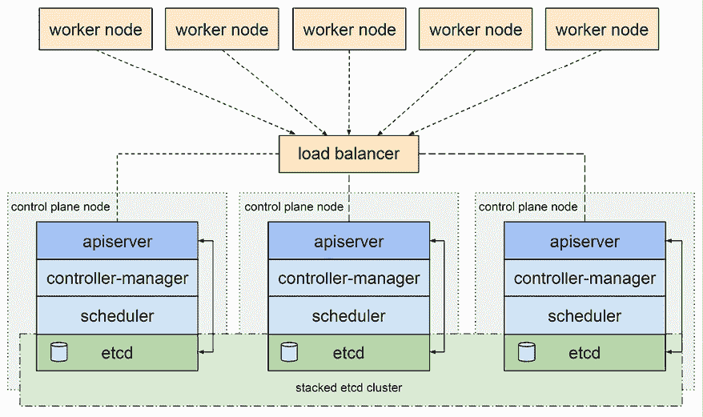
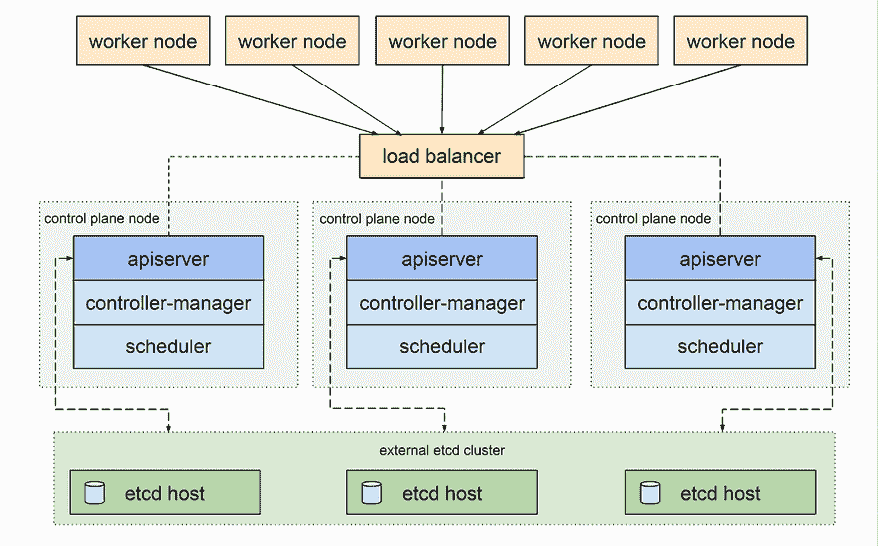
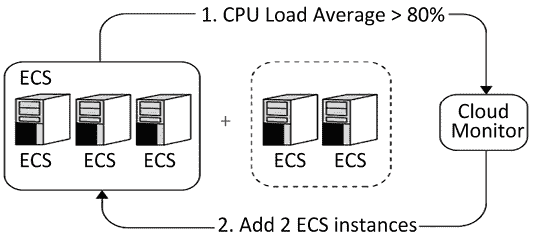
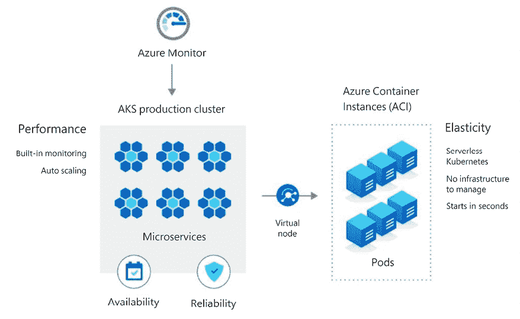
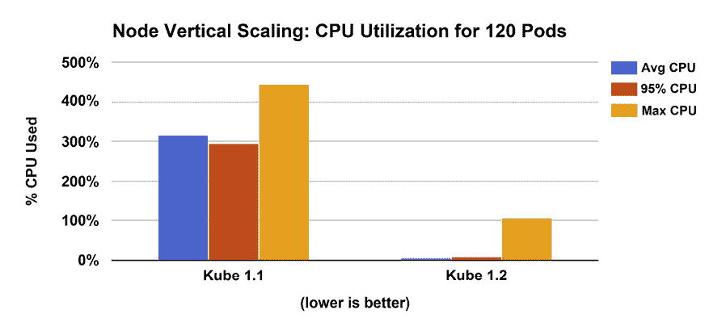
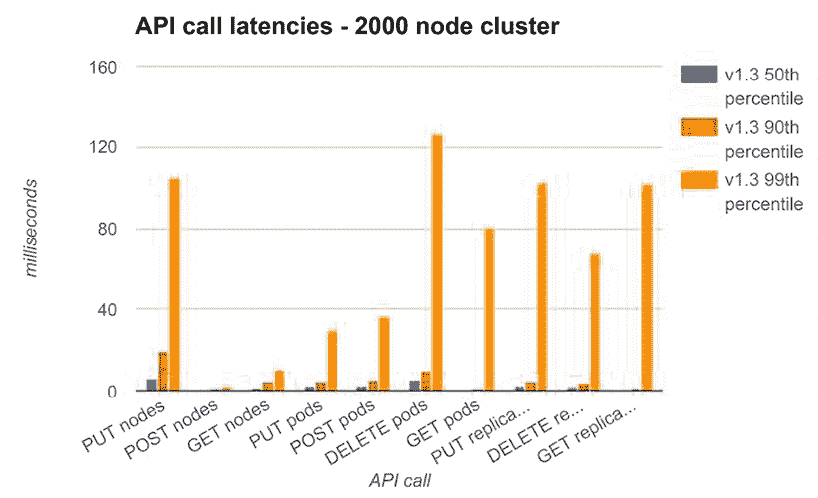
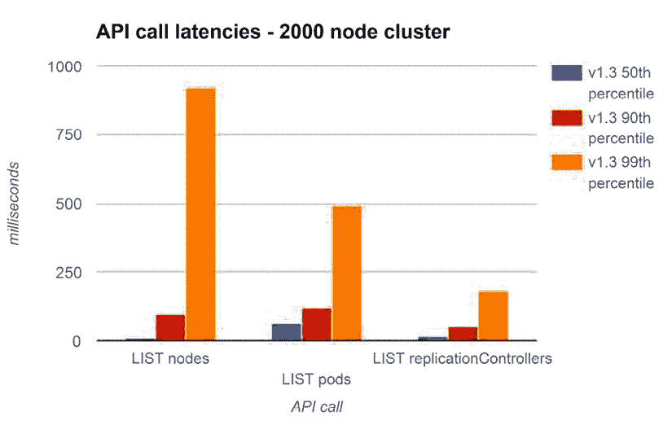
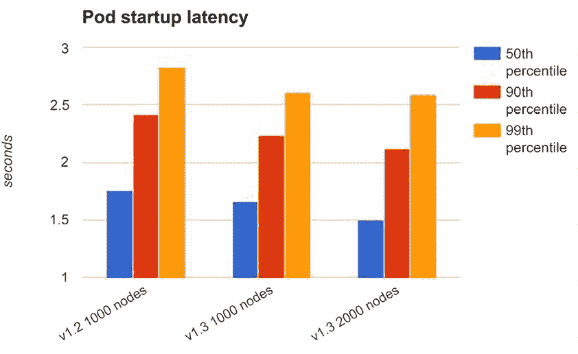
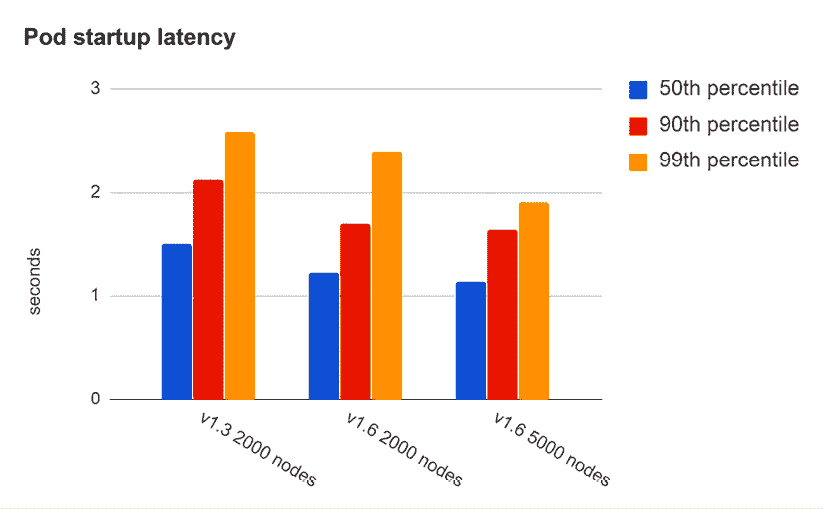

# 3

# 高可用性与可靠性

在*第二章*，*创建 Kubernetes 集群*中，我们学习了如何在不同环境中创建 Kubernetes 集群，尝试了不同的工具，并创建了几个集群。创建 Kubernetes 集群只是故事的开始。一旦集群启动并运行，你需要确保它保持正常运作。

在本章中，我们将深入探讨高可用集群的话题。这是一个复杂的话题。Kubernetes 项目和社区还没有确定一种真正的方式来实现高可用性。高可用 Kubernetes 集群有许多方面，例如确保控制平面在故障面前能够持续运行、保护 etcd 中的集群状态、保护系统数据以及快速恢复容量和/或性能。不同的系统将有不同的可靠性和可用性要求。如何设计和实现一个高度可用的 Kubernetes 集群将取决于这些要求。

本章将探讨以下主要主题：

+   高可用性概念

+   高可用性最佳实践

+   高可用性、可扩展性和容量规划

+   大型集群的性能、成本和设计权衡

+   选择和管理集群容量

+   推动 Kubernetes 的极限

+   在大规模上测试 Kubernetes

在本章结束时，你将理解与高可用性相关的各种概念，并熟悉 Kubernetes 的高可用性最佳实践以及何时使用它们。你将能够使用不同的策略和技术升级实时集群，并能够根据性能、成本和可用性之间的权衡，选择多种可能的解决方案。

# 高可用性概念

在这一部分，我们将通过探索可靠且高度可用的系统的概念和构建模块，开始我们的高可用性之旅。百万（万亿？）美元的问题是，我们如何从不可靠的组件中构建可靠且高度可用的系统？组件会失败，这一点你可以放心。硬件会故障，网络会中断，配置会出错，软件会有 bug，人们会犯错。接受这一点后，我们需要设计一个即使在组件失败时也能保持可靠和高度可用的系统。我们的思路是，从冗余开始，检测组件故障，并快速替换坏掉的组件。

## 冗余

冗余是硬件和软件层面上可靠且高度可用系统的基础。如果一个关键组件发生故障，并且你希望系统继续运行，你必须准备另一个相同的组件。Kubernetes 本身通过复制控制器和副本集来管理你的无状态 Pod。但你的 etcd 集群状态和控制平面组件本身需要冗余，以便在某些组件故障时继续运行。实际操作中，这意味着需要在 3 个或更多节点上运行 etcd 和 API 服务器。

此外，如果你的系统的有状态组件还没有通过冗余的持久化存储进行备份（例如，在云平台上），你需要添加冗余以防止数据丢失。

## 热插拔

热插拔是指在不中断系统的情况下，快速更换一个失败的组件，并尽量减少（理想情况下为零）对用户的影响。如果该组件是无状态的（或者它的状态存储在单独的冗余存储中），那么热插拔一个新组件来替换它很容易，只需将所有客户端重定向到新组件即可。但如果它存储了本地状态，包括内存中的状态，那么热插拔就不是一件简单的事。主要有两种选择：

+   放弃正在进行的事务（客户端将重试）

+   保持热备副本同步（主动-主动）

第一个解决方案要简单得多。大多数系统足够具备弹性来应对故障。客户端可以重试失败的请求，热插拔的组件将为其提供服务。

第二个解决方案更复杂且更脆弱，并且会带来性能开销，因为每个交互都必须复制到两个副本（并且需要确认）。它可能是系统某些关键部分所必需的。

## 领导者选举

领导者选举是分布式系统中常见的模式。你通常有多个相同的组件，它们协作并分担负载，但会选举出一个组件作为领导者，某些操作会通过领导者进行序列化。你可以把带有领导者选举的分布式系统看作是冗余和热插拔的结合体。所有组件都是冗余的，当当前领导者失败或不可用时，会选举出一个新的领导者并进行热插拔。

## 智能负载均衡

负载均衡是将工作负载分配到多个副本上，以处理传入的请求。这对于在负载较重时通过调整副本数量进行扩展和收缩非常有用。当一些副本失败时，负载均衡器会停止向失败或无法访问的组件发送请求。Kubernetes 会配置新的副本，恢复容量，并更新负载均衡器。Kubernetes 提供了出色的设施来支持这一点，通过服务、端点、副本集、标签和入口控制器。

## 幂等性

许多类型的故障可能是暂时性的。这在网络问题或超时过于严格时最为常见。未响应健康检查的组件将被视为不可达，另一个组件将取而代之。原本为假定失败的组件安排的工作可能会发送到另一个组件。但是，原始组件可能仍在工作并完成相同的任务。最终的结果是相同的工作可能会执行两次。要避免这种情况非常困难。为了支持精确一次语义，你需要在开销、性能、延迟和复杂性方面付出很大的代价。因此，大多数系统选择支持至少一次语义，这意味着相同的工作可以多次执行，而不会破坏系统的数据完整性。这个特性称为幂等性。幂等系统即使执行操作多次，也能保持其状态。

## 自愈

当动态系统中的组件发生故障时，通常希望系统能够自我修复。Kubernetes 的副本集就是自愈系统的典型例子。但是，故障可能远远超出 pod 的范围。自愈从自动检测问题开始，接着进行自动修复。配额和限制帮助创建检查与平衡，以确保自动化自愈不会因程序错误或诸如 DDoS 攻击等特殊情况而失控。自愈系统通过重试失败的操作来很好地处理暂时性故障，并且只有在没有其他选项时才会升级故障。一些自愈系统具有回退路径，包括在无法获取最新内容时提供缓存内容。自愈系统尽力优雅降级，并在核心问题修复之前继续工作。

在本节中，我们讨论了构建可靠和高度可用系统所涉及的各种概念。在下一节中，我们将应用这些概念，并演示在 Kubernetes 集群上部署系统的最佳实践。

# 高可用性最佳实践

构建可靠且高度可用的分布式系统是一项复杂的工作。在本节中，我们将检查一些最佳实践，这些最佳实践使基于 Kubernetes 的系统能够在面对各种故障类别时可靠运行并保持可用性。我们还将深入探讨如何构建你自己的高可用集群。然而，由于高可用集群的复杂性以及影响因素的众多，我们这里只提供指导，而不是逐步的构建高可用集群的教程。

请注意，你应该仅在非常特殊的情况下自己构建高度可用的 Kubernetes 集群。有多种强大的工具（通常是建立在 kubeadm 基础上）提供经过实战验证的方法，在控制平面级别创建高度可用的 Kubernetes 集群。你应该充分利用这些工具所投入的所有工作和努力。特别是，云服务提供商提供的托管 Kubernetes 集群具有高度可用性。

## 创建高度可用的集群

为了创建一个高度可用的 Kubernetes 集群，控制平面组件必须具备冗余性。这意味着 etcd 必须作为集群部署（通常跨三个或五个节点），并且 Kubernetes API 服务器必须具有冗余。辅助的集群管理服务，如可观察性堆栈存储，也应当冗余部署。以下图示描绘了一个典型的可靠且高度可用的 Kubernetes 集群，其采用堆叠的 etcd 拓扑结构。这里有多个负载均衡的控制平面节点，每个节点都包含所有控制平面组件以及一个 etcd 组件：



图 3.1：高度可用的集群配置

这并不是配置高度可用集群的唯一方法。例如，你可能更倾向于部署一个独立的 etcd 集群，以优化机器的工作负载，或者如果你需要比其他控制平面节点更高的冗余性来保护你的 etcd 集群。

以下图示展示了一个 Kubernetes 集群，其中 etcd 被部署为外部集群：



图 3.2：etcd 用作外部集群

自托管的 Kubernetes 集群，其中控制平面组件作为 pods 和 stateful sets 部署在集群中，是一种很好的方法，通过将 Kubernetes 应用到 Kubernetes 来简化控制平面组件的可靠性、灾难恢复和自我修复。这意味着一些管理 Kubernetes 的组件本身也由 Kubernetes 来管理。例如，如果某个 Kubernetes API 服务器节点发生故障，其他 API 服务器 pods 会察觉到并启动一个新的 API 服务器。

## 提高节点的可靠性

节点可能会失败，或者某些组件可能会失败，但许多故障是暂时的。基本的保证是确保运行时引擎（Docker 守护进程、Containerd 或任何 CRI 实现）和 kubelet 在故障发生时能够自动重启。

如果你运行的是 CoreOS、基于现代 Debian 的操作系统（包括 Ubuntu >= 16.04），或者任何其他使用 systemd 作为初始化机制的操作系统，那么部署 Docker 和 kubelet 作为自启动守护进程是非常简单的：

```
systemctl enable docker
systemctl enable kubelet 
```

对于其他操作系统，Kubernetes 项目选择了**monit**进程监视器作为高可用性示例，但你可以使用任何你喜欢的进程监视器。主要要求是确保这两个关键组件在发生故障时会自动重启，无需外部干预。

查看此链接：[`monit-docs.web.cern.ch/base/kubernetes/`](https://monit-docs.web.cern.ch/base/kubernetes/)。

## 保护你的集群状态

Kubernetes 集群状态通常存储在 etcd 中（某些 Kubernetes 实现，如 k3s，使用像 SQLite 这样的替代存储引擎）。etcd 集群设计时考虑了超高的可靠性，并且分布在多个节点上。为了确保 Kubernetes 集群的可靠性和高可用性，利用这些功能是至关重要的，确保有多个副本存储集群状态，以防某个副本丢失或不可达。

### 集群化 etcd

你的 etcd 集群应该至少有三个节点。如果需要更高的可靠性和冗余，可以选择五个、七个或任何其他奇数节点。节点数必须是奇数，以便在发生网络分裂时能有明确的多数节点。

为了创建一个集群，etcd 节点应该能够互相发现。实现这一点有多种方法，比如：

+   静态

+   etcd 发现

+   DNS 发现

CoreOS 的 etcd-operator 项目曾是部署 etcd 集群的首选解决方案。不幸的是，该项目已被归档，目前不再积极开发。Kubeadm 使用静态方法来配置 Kubernetes 的 etcd 集群，因此如果你使用任何基于 kubeadm 的工具，你就可以顺利完成。如果你想部署一个高可用的 etcd 集群，建议你遵循官方文档：[`github.com/etcd-io/etcd/blob/release-3.4/Documentation/op-guide/clustering.md`](https://github.com/etcd-io/etcd/blob/release-3.4/Documentation/op-guide/clustering.md)。

## 保护你的数据

保护集群状态和配置固然重要，但更重要的是保护你自己的数据。如果集群状态 somehow 受损，你总是可以从头重建集群（尽管在重建期间集群不可用）。但如果你自己的数据受损或丢失，你就会陷入深深的麻烦。相同的规则依然适用，冗余是王道。虽然 Kubernetes 集群状态是高度动态的，但你的数据可能不那么动态。例如，很多历史数据通常很重要，可以备份并恢复。实时数据可能会丢失，但整个系统可以恢复到较早的快照，并且仅遭受暂时性损坏。

你应该考虑使用 Velero 作为备份整个集群（包括你的数据）的解决方案。Heptio（现在是 VMWare 的一部分）开发了 Velero，它是开源的，并且对于关键系统来说可能是救命稻草。

在这里查看：[`velero.io/`](https://velero.io/)。

## 运行冗余的 API 服务器

API 服务器是无状态的，所有必要的数据都实时从 etcd 集群中获取。这意味着你可以轻松运行多个 API 服务器，而无需在它们之间进行协调。一旦你运行了多个 API 服务器，可以在它们前面放置一个负载均衡器，使客户端对其透明。

## 使用 Kubernetes 运行领导选举

一些控制平面组件，例如调度器和控制器管理器，不能同时有多个实例处于活动状态。这将导致混乱，因为多个调度器会试图将同一个 Pod 调度到多个节点，或者将多个调度请求调度到同一个节点。可以运行多个调度器，并配置它们管理不同的 Pods。实现高可扩展 Kubernetes 集群的正确方法是让这些组件在领导选举模式下运行。这意味着多个实例同时运行，但只有一个处于活动状态，如果它失败，另一个将被选举为领导并接替其位置。

Kubernetes 通过 `–leader-elect` 标志支持此模式（默认值为 `True`）。调度器和控制器管理器可以通过将它们各自的清单复制到 `/etc/kubernetes/manifests` 目录中，作为 Pods 部署。

下面是一个来自调度器清单的代码片段，展示了如何使用该标志：

```
 command:
    - /bin/sh
    - -c
    - /usr/local/bin/kube-scheduler --master=127.0.0.1:8080 --v=2 --leader-elect=true 1>>/var/log/kube-scheduler.log
      2>&1 
```

下面是一个来自控制器管理器清单的代码片段，展示了如何使用该标志：

```
 - command:
    - /bin/sh
    - -c
    - /usr/local/bin/kube-controller-manager --master=127.0.0.1:8080 --cluster-name=e2e-test-bburns
      --cluster-cidr=10.245.0.0/16 --allocate-node-cidrs=true --cloud-provider=gce  --service-account-private-key-file=/srv/kubernetes/server.key
      --v=2 --leader-elect=true 1>>/var/log/kube-controller-manager.log 2>&1
    image: gcr.io/google\_containers/kube-controller-manager:fda24638d51a48baa13c35337fcd4793 
```

还有几个标志可用来控制领导选举。它们都有合理的默认值：

```
 --leader-elect-lease-duration duration     Default: 15s
--leader-elect-renew-deadline duration     Default: 10s
--leader-elect-resource-lock endpoints     Default: "endpoints" ("configmaps" is the other option)
--leader-elect-retry-period duration       Default: 2s 
```

请注意，Kubernetes 不可能像其他 Pods 那样自动重启这些组件，因为它们恰恰是负责重启失败 Pods 的 Kubernetes 组件，因此它们无法在失败时自行重启。必须有一个已准备好的替代实例在运行。

## 使你的暂存环境具备高可用性

高可用性并不是一个简单的配置。如果你花费时间去设置高可用性，那就意味着你的系统有高可用性的业务需求。因此，在将其部署到生产环境之前，你需要测试你的可靠性和高可用性集群（除非你是 Netflix，那里是在生产环境中测试的）。另外，集群中的任何更改在理论上可能会破坏高可用性，而不会影响其他集群功能。关键点是，就像其他任何事情一样，如果你不测试它，就假设它无法正常工作。

我们已经确认你需要测试可靠性和高可用性。最好的方法是创建一个尽可能接近生产环境的暂存环境。这可能会变得很昂贵。这里有几种方法来管理成本：

+   **临时高可用性暂存环境**：只为高可用性测试的期间创建一个大型高可用性集群。

+   **压缩时间**：提前创建有趣的事件流和场景，输入这些数据，并快速模拟各种情况。

+   **将 HA 测试与性能和压力测试结合起来**：在你的性能和压力测试结束时，对系统进行超负荷测试，看看可靠性和高可用性配置如何处理负载。

同时，实践混沌工程并故意在不同层次上引发故障也非常重要，以验证系统是否能够处理这些故障模式。

## 测试高可用性

测试高可用性需要规划和对系统的深入理解。每个测试的目标是揭示系统设计和/或实现中的缺陷，并提供足够的覆盖范围，以便如果测试通过，你可以确信系统按照预期行为运行。

在可靠性、自愈和高可用性的领域，这意味着你需要找到方法来破坏系统并观察它如何自我修复。

这需要几个部分，如下所示：

+   可能故障的全面清单（包括合理的组合情况）

+   对于每一种可能的故障，应该清楚地知道系统应该如何响应。

+   诱发故障的方法

+   一种观察系统反应的方法。

没有哪一部分是微不足道的。根据我的经验，最好的方法是逐步进行，尝试提出相对较少的通用故障类别和通用响应，而不是列出一个详尽的、不断变化的低级故障清单。

例如，一个通用的故障类别是节点无响应。通用的响应可以是重启节点，诱发故障的方法可以是停止节点的虚拟机（如果它是虚拟机），观察应当是，在节点停机期间，系统仍然能够通过标准验收测试正常运行；节点最终恢复，系统恢复正常。你可能还想测试其他很多事情，比如问题是否被记录，是否有相关的警报发送给了正确的人，是否更新了各种统计信息和报告。

但是，要小心过度泛化。在通用的无响应节点故障模式下，一个关键的组成部分是检测节点是否无响应。如果你的检测方法存在缺陷，那么系统将无法做出正确反应。请使用健康检查和就绪检查等最佳实践。

请注意，有时一个故障无法通过单一响应来解决。例如，在我们节点无响应的案例中，如果是硬件故障，那么重启不会有所帮助。在这种情况下，第二线响应就会发挥作用，可能会通过提供新的节点来替代故障的节点。在这种情况下，你不能过于泛化，可能需要为节点上特定类型的 Pods/角色（例如 etcd、master、worker、数据库和监控）创建测试。

如果你有高质量的需求，请准备花费比生产环境更多的时间来设置适当的测试环境和测试。

最后一个重要的观点是尽量保持非侵入性。这意味着理想情况下，您的生产系统不应具有允许关闭其部分或使其配置为在测试中以降低容量运行的测试功能。原因是这会增加系统的攻击面，并且可能会因配置错误而意外触发。理想情况下，您可以在不修改将部署在生产中的代码或配置的情况下控制测试环境。使用 Kubernetes，通常可以轻松地注入具有自定义测试功能的 Pod 和容器，这些功能可以与演示环境中的系统组件交互，但永远不会部署到生产环境中。

Chaos Mesh CNCF 孵化项目是一个很好的起点：[`chaos-mesh.org`](https://chaos-mesh.org)。

在这一部分，我们看了如何确保一个可靠且高可用的集群，包括 etcd、API 服务器、调度器和控制器管理器。我们考虑了保护集群本身和您的数据的最佳实践，并特别关注了启动环境和测试的问题。

# 高可用性、可扩展性和容量规划

高可用系统还必须具备可扩展性。大多数复杂的分布式系统的负载可能会根据一天中的时间、工作日与周末、季节性影响、营销活动以及许多其他因素而显著变化。成功的系统会随着时间推移拥有更多用户并积累更多数据。这意味着集群的物理资源 - 主要是节点和存储 - 也必须随着时间增长。如果您的集群配置不足，它将无法满足所有需求，并且由于请求超时或排队等待而无法提供服务。

这就是容量规划的领域。一种简单的方法是过度配置您的集群。预测需求并确保您有足够的缓冲区以处理活动高峰。但是，这种方法存在几个不足之处：

+   对于高度动态和复杂的分布式系统，即使是大致预测需求也很困难。

+   过度配置是昂贵的。您会在很少或从不使用的资源上花费大量资金。

+   您必须定期重新执行整个过程，因为系统的平均和峰值负载随时间而变化。

+   您必须为使用特定资源的多组工作负载执行整个过程（例如使用高内存节点的工作负载和需要 GPU 的工作负载）。

更好的方法是使用基于意图的容量规划，其中使用高级抽象，系统会相应地调整自己。在 Kubernetes 的环境中，有**水平 Pod 自动伸缩器**（**HPA**），它可以根据工作负载请求的需要增加或减少所需的 Pod 数量。但是，这仅适用于更改分配给不同工作负载的资源比例。当整个集群（或节点池）接近饱和时，您只需增加更多资源。这就是集群自动缩放器发挥作用的地方。它是一个 Kubernetes 项目，在 Kubernetes 1.8 版本中推出。它在云环境中特别有效，可以通过编程 API 提供额外的资源。

当**集群自动缩放器**（**CAS**）确定无法为 Pod 安排节点（处于挂起状态）时，它会为集群提供一个新节点。如果确定集群的节点多于处理负载所需的节点，它还可以从集群中删除节点（缩减）。CAS 默认每 30 秒检查一次挂起的 Pod。仅在低使用率持续 10 分钟后才会删除节点，以避免频繁变动。

CAS 根据 CPU 和内存使用情况做出缩减决策。如果所有运行在节点上的 Pod 的 CPU 和内存请求总和小于节点可分配资源的 50%（默认可配置），则会考虑删除该节点。所有 Pod（除了 DaemonSet Pod）必须是可移动的（某些 Pod 由于调度约束或本地存储等因素无法移动），并且节点不能禁用缩减。

以下是需要考虑的一些问题：

+   即使总 CPU 或内存利用率较低，由于诸如亲和性、反亲和性、污点、容忍度、Pod 优先级、每节点最大 Pod 数量、每节点最大持久卷数量和 Pod 中断预算等控制机制，集群可能仍需要更多节点。

+   除了触发节点扩展或缩减的内置延迟外，从云服务提供商预配新节点还会增加几分钟的额外延迟。

+   有些节点（例如带有本地存储的节点）默认情况下无法删除（需要特殊标注）。

+   HPA 和 CAS 之间的交互可能会有些微妙。

## 安装集群自动缩放器

请注意，您无法在本地测试 CAS。您必须在支持的云服务提供商之一上运行 Kubernetes 集群：

+   AWS

+   BaiduCloud

+   Brightbox

+   CherryServers

+   CloudStack

+   HuaweiCloud

+   外部 gRPC

+   Hetzner

+   Equinix Metal

+   IonosCloud

+   OVHcloud

+   Linode

+   OracleCloud

+   ClusterAPI

+   BizflyCloud

+   Vultr

+   TencentCloud

我已成功在 GKE、EKS 和 AKS 上安装了它。在云环境中使用 CAS 的两个原因如下：

1.  您自行安装了非托管 Kubernetes，并希望从 CAS 中受益。

1.  您正在使用托管的 Kubernetes，但希望修改一些设置（例如更高的 CPU 利用率阈值）。在这种情况下，您需要禁用云服务提供商的 CAS 以避免冲突。

让我们看一下在 AWS 上安装 CAS 的清单。有几种方法可以做到这一点。我选择了多 ASG（自动扩缩组选项），这是最适合生产的。它支持具有不同配置的多个节点组。该文件包含安装集群自动扩缩器所需的所有 Kubernetes 资源。它涉及创建一个服务账户，并授予它各种 RBAC 权限，因为它需要监控整个集群的节点使用情况，并能够对其进行操作。最后，还有一个 Deployment，实际部署集群自动扩缩器镜像，并附带一个命令行，指定应维护的节点范围（最小和最大数量），在 EKS 的情况下，还需要节点组。最大数量非常重要，以防攻击或错误导致集群自动扩缩器不断添加节点，从而失控并造成巨大的账单。完整文件请见：[`github.com/kubernetes/autoscaler/blob/master/cluster-autoscaler/cloudprovider/aws/examples/cluster-autoscaler-multi-asg.yaml`](https://github.com/kubernetes/autoscaler/blob/master/cluster-autoscaler/cloudprovider/aws/examples/cluster-autoscaler-multi-asg.yaml)。

下面是 Deployment 的 pod 模板片段：

```
 spec:
      priorityClassName: system-cluster-critical
      securityContext:
        runAsNonRoot: true
        runAsUser: 65534
        fsGroup: 65534
      serviceAccountName: cluster-autoscaler
      containers:
        - image: k8s.gcr.io/autoscaling/cluster-autoscaler:v1.22.2
          name: cluster-autoscaler
          resources:
            limits:
              cpu: 100m
              memory: 600Mi
            requests:
              cpu: 100m
              memory: 600Mi
          command:
            - ./cluster-autoscaler
            - --v=4
            - --stderrthreshold=info
            - --cloud-provider=aws
            - --skip-nodes-with-local-storage=false
            - --expander=least-waste
            - --nodes=1:10:k8s-worker-asg-1
            - --nodes=1:3:k8s-worker-asg-2
          volumeMounts:
            - name: ssl-certs
              mountPath: /etc/ssl/certs/ca-certificates.crt #/etc/ssl/certs/ca-bundle.crt for Amazon Linux Worker Nodes
              readOnly: true
          imagePullPolicy: "Always"
      volumes:
        - name: ssl-certs
          hostPath:
            path: "/etc/ssl/certs/ca-bundle.crt" 
```

请查看 [`github.com/kubernetes/autoscaler/blob/master/cluster-autoscaler/cloudprovider/aws/examples/cluster-autoscaler-multi-asg.yaml#L120`](https://github.com/kubernetes/autoscaler/blob/master/cluster-autoscaler/cloudprovider/aws/examples/cluster-autoscaler-multi-asg.yaml#L120)。

HPA 和 CAS 的结合提供了一个真正弹性的集群，其中 HPA 确保服务使用适当数量的 pods 来处理每个服务的负载，而 CAS 确保节点的数量与集群的整体负载匹配。

## 考虑垂直 pod 自动缩放器

垂直 pod 自动缩放器是另一个作用于 pods 的自动缩放器。它的作用是根据实际使用情况调整 pods 的 CPU 和内存请求与限制。它通过 CRD 为每个工作负载配置，并具有三个组件：

+   推荐器 - 监控 CPU 和内存使用情况，并为 CPU 和内存请求提供新值的推荐

+   更新器 - 终止那些其 CPU 和内存请求不符合推荐值的受管 pods

+   Admission control webhook - 根据推荐值设置新建或重建 pods 的 CPU 和内存请求

VPA 可以仅在推荐模式下运行，也可以主动调整 pods 的大小。当 VPA 决定调整 pod 大小时，它会驱逐该 pod。重新调度 pod 时，它会根据最新的推荐修改请求和限制。

这是一个定义在推荐模式下的 VPA 自定义资源的示例，针对名为 `awesome-deployment` 的 Deployment：

```
apiVersion: autoscaling.k8s.io/v1beta2
kind: VerticalPodAutoscaler
metadata:
  name: awesome-deployment
spec:
  targetRef:
    apiVersion: "apps/v1"
    kind:       Deployment
    name:       awesome-deployment
  updatePolicy:
    updateMode: "Off" 
```

以下是使用 VPA 时的一些主要要求和限制：

+   需要 metrics server

+   不能将内存设置为低于 250Mi

+   无法更新正在运行的 Pod（因此，更新器会杀死 Pod 以便重新启动它们并使用正确的请求）

+   无法驱逐未由控制器管理的 Pod

+   不建议将 VPA 与 HPA 一起运行

## 基于自定义指标的自动扩展

HPA 默认基于 CPU 和内存指标进行操作。但它可以配置为基于任意自定义指标运行，例如队列深度（例如 AWS SQS 队列）或线程数，这些可能由于并发性成为瓶颈，即使仍有可用的 CPU 和内存。Keda 项目（[`keda.sh/`](https://keda.sh/)）为自定义指标提供了强大的解决方案，而不是从零开始。它们使用基于事件的自动扩展作为一种通用方法。

本节讨论了自动扩展性与高可用性之间的相互作用，并探讨了扩展 Kubernetes 集群和这些集群上运行的应用程序的不同方法。

# 大型集群的性能、成本和设计权衡

在上一节中，我们探讨了为容量规划和自动扩展集群及工作负载提供资源的不同方法。在这一节中，我们将考虑具有不同可靠性和高可用性属性的大型集群的各种选项和配置。当你设计集群时，你需要了解你的选项，并根据组织的需求明智地选择。

我们将讨论的主题包括各种可用性要求，从最佳努力到零停机的“圣杯”。最后，我们将落脚于实际的站点可靠性工程方法。对于每个可用性类别，我们将从性能和成本的角度考虑它的含义。

**可用性要求**

不同的系统对可靠性和可用性有非常不同的要求。此外，不同的子系统也有非常不同的要求。例如，计费系统通常优先级较高，因为如果计费系统宕机，就无法赚取收入。但即使在计费系统内部，如果偶尔无法进行费用争议处理，从业务角度来看，可能也是可以接受的。

## 最佳努力

最佳努力意味着，反直觉地，它根本没有任何保证。如果它有效，那就太好了！如果不起作用——那就算了，你能做什么呢？这种可靠性和可用性水平可能适用于经常变动的内部组件，而使其稳健的努力是不值得的。只要调用不可靠服务的服务或客户端能够处理偶尔的错误或宕机，那么一切都很好。这对于以 beta 版本发布到外部的服务也可能是合适的。

最佳努力模式对开发人员来说是很有利的。开发人员可以快速行动并打破常规。他们不必担心后果，也不需要经过严格的测试和批准过程。最佳努力服务的性能可能优于更稳健的服务，因为最佳努力服务通常可以跳过一些昂贵的步骤，例如验证请求、持久化中间结果和数据复制。但另一方面，更稳健的服务通常会经过大量优化，且其支持硬件已针对工作负载进行了精细调校。最佳努力服务的成本通常较低，因为它们不需要采用冗余，除非运营商忽视了基本的容量规划，导致过度配置。

在 Kubernetes 的背景下，关键问题是集群提供的所有服务是否都是最佳努力模式。如果是这样，那么集群本身就不需要高度可用。您可能只需要一个主节点和一个 etcd 实例，甚至可能不需要部署监控解决方案。这通常仅适用于本地开发集群。即使是多个开发人员共享的开发集群，也应该具有合理的可靠性和稳健性，否则每当集群意外宕机时，所有开发人员都会无所事事。

## 维护窗口

在有维护窗口的系统中，特定时间段被专门用于执行各种维护活动，如应用安全补丁、升级软件、修剪日志文件和数据库清理。有了维护窗口，系统（或子系统）会暂时不可用。通常会计划在非工作时间进行，并且用户通常会提前收到通知。维护窗口的好处在于，您不必担心维护操作会如何与进入系统的实时请求发生冲突。它可以大大简化操作。系统管理员和运营人员喜欢维护窗口，就像开发人员喜欢最佳努力系统一样。

当然，缺点是系统在维护期间会宕机。它可能仅适用于用户活动在特定时间内的系统（例如美国办公时间或仅限工作日）。

使用 Kubernetes，您可以通过将所有传入请求通过负载均衡器重定向到一个网页（或 JSON 响应）来通知用户维护窗口，从而实现维护窗口。

但在大多数情况下，Kubernetes 的灵活性应该允许您进行在线维护。在极端情况下，例如升级 Kubernetes 版本，或者从 etcd v2 切换到 etcd v3，您可能希望依赖维护窗口。蓝绿部署是另一种替代方案。但集群越大，蓝绿部署的替代方案就越庞大，因为您必须复制整个生产集群，这既昂贵又可能导致配额不足等问题。

## 快速恢复

快速恢复是高可用集群的另一个重要方面。总会有某个时刻出现问题。你的不可用时钟开始运行。你能多快恢复正常？**平均恢复时间**（**MTTR**）是一个重要的度量指标，用来跟踪并确保你的系统能够妥善应对灾难。

有时候，这并不是由你决定的。例如，如果你的云服务提供商发生了故障（而你没有实现联合集群，正如我们在*第十一章*《在多个集群上运行 Kubernetes》中将讨论的那样），那么你只能坐等他们解决问题。但最可能的罪魁祸首是最近的部署问题。当然，也存在与时间或日历相关的问题。你还记得 2012 年 2 月 29 日导致微软 Azure 崩溃的闰年 bug 吗？

快速恢复的典型代表当然是蓝绿部署——如果在发现问题时，你仍然保留着前一个版本的运行。但这通常适用于在部署过程中或刚部署后发生的问题。如果一个潜伏的 bug 在部署后几个小时才被发现，那么你可能已经拆掉了蓝色部署，而无法恢复。

另一方面，滚动更新意味着，如果问题早期被发现，那么大部分的 pods 仍会运行之前的版本。

与数据相关的问题可能需要很长时间才能恢复，即使你的备份是最新的，而且恢复程序确实有效（一定要定期测试这一点）。

像 Velero 这样的工具可以帮助你在某些场景中通过创建集群的快照备份来恢复系统，以防出现问题而你不知道如何修复时。

## 零停机

最后，我们来到了零停机系统。没有任何系统能够真正实现零停机。所有系统都会失败，所有软件系统也一定会失败。系统的可靠性通常通过“九个数”来衡量。请参阅[`en.wikipedia.org/wiki/High_availability#%22Nines%22`](https://en.wikipedia.org/wiki/High_availability#%22Nines%22)。

有时故障严重到足以使系统或其中一些服务停机。将零停机视为一种最佳努力的分布式系统设计。你通过提供大量冗余和机制来应对预期的故障，避免系统停机，这样设计就是为了零停机。和往常一样，请记住，即使有零停机的商业需求，也并不意味着每个组件都必须实现零停机。可靠的（在合理范围内）系统可以由高度不可靠的组件构建而成。

零停机的计划如下：

+   **每个层级的冗余**：这是一个必要的条件。你不能在设计中有单点故障，因为当它失败时，整个系统会崩溃。

+   **自动热交换故障组件**：冗余系统的有效性取决于冗余组件在原始组件故障后能否迅速投入使用。一些组件可以分担负载（例如，无状态的 Web 服务器），因此无需显式操作。其他情况下，如 Kubernetes 调度器和控制器管理器，你需要进行领导者选举，以确保集群能够持续运行。

+   **大量的指标、监控和警报来早期发现问题**：即使经过仔细设计，你也可能漏掉一些东西，或者某些隐性假设可能会使你的设计失效。通常，这些微妙的问题会悄悄出现，经过足够关注后，你可能会在它们变成系统崩溃之前发现它们。例如，假设有一个机制可以在磁盘空间超过 90% 时清理旧的日志文件，但由于某种原因，它没有工作。如果你设置了一个磁盘空间超过 95% 时的警报，那么你就能及时发现并防止系统故障。

+   **部署到生产环境前的彻底测试**：全面的测试已被证明是提高质量的可靠方法。为复杂的大型 Kubernetes 集群和庞大的分布式系统进行全面测试是一项艰巨的工作，但你必须进行。你应该测试什么？所有的东西。没错。为了零停机，你需要同时测试应用程序和基础设施。你通过的 100% 单元测试是一个不错的起点，但它们不能让你完全放心地知道，当你在生产 Kubernetes 集群上部署应用时，它仍然会按预期运行。当然，最好的测试是在你生产集群上，进行蓝绿部署或在相同集群上进行的测试。若无法提供一个完全相同的集群，可以考虑建立一个尽可能忠实于生产环境的预发布环境。以下是你应该运行的测试列表。每个测试都应当全面，因为如果你漏掉了某些测试，可能会导致系统故障：

    +   单元测试

    +   验收测试

    +   性能测试

    +   压力测试

    +   回滚测试

    +   数据恢复测试

    +   渗透测试

+   **保留原始数据**：对于许多系统来说，数据是最关键的资产。如果你保留原始数据，就可以在数据损坏或后期处理数据丢失的情况下恢复。这对于实现零停机没有直接帮助，因为重新处理原始数据可能需要一些时间，但它有助于实现零数据丢失，这通常更为重要。这个方法的缺点是原始数据通常比处理后的数据要大得多。一个好的选择是将原始数据存储在比处理数据更便宜的存储介质上。

+   **将感知的正常运行时间作为最后的手段**：好的，系统的某个部分可能已经宕机。你仍然可能能够维持某种程度的服务。在许多情况下，你可能能访问稍微过时的数据，或者允许用户访问系统的其他部分。这不是一个理想的用户体验，但从技术角度来看，系统仍然是可用的。

听起来疯狂吗？很好。零停机的大规模系统确实很难（实际上是不可能的）。微软、谷歌、亚马逊、Facebook 和其他大公司有成千上万的工程师（合计）专门从事基础设施、运营，并确保系统正常运行，这背后是有原因的。

## 网站可靠性工程

SRE 是一种在现实世界中操作可靠分布式系统的方法。SRE 接纳故障，并与**服务水平指标**（**SLIs**）、**服务水平目标**（**SLOs**）和**服务水平协议**（**SLAs**）配合使用。每个服务都有目标，比如 95% 的请求延迟低于 50 毫秒。如果某个服务未能达到其目标，那么团队会集中精力修复问题，然后再回到新功能和能力的开发工作中。

SRE 的魅力在于你可以调整成本和性能的“旋钮”。如果你想在可靠性上投入更多，那么要准备好为此支付更多的资源和开发时间。

## 性能和数据一致性

当你开发或运营分布式系统时，CAP 定理应该始终在你脑海中。CAP 代表一致性、可用性和分区容错：

+   一致性意味着每次读取都能得到最新的写入结果或错误

+   可用性意味着每个请求都会收到一个非错误响应（但响应可能是陈旧的）

+   分区容错意味着即使节点之间的任意数量的消息被丢失或延迟，系统仍然能够继续运行

该定理表明，你最多只能在三者中选择两个。由于任何分布式系统都可能遭遇网络分区，因此在实际操作中，你可以选择 CP 或 AP。CP 意味着为了保持一致性，系统在发生网络分区时将无法提供服务。AP 意味着系统将始终保持可用，但可能并不一致。例如，来自不同分区的读取可能返回不同的结果，因为某个分区没有收到写入操作。

本节我们重点讨论了高可用系统，即 AP。为了实现高可用性，我们必须牺牲一致性。但这并不意味着我们的系统会出现损坏或任意的数据。关键概念是最终一致性。我们的系统可能会稍微滞后，提供一些过时的数据，但最终你会得到预期的结果。

当你开始从最终一致性的角度思考时，它为潜在的显著性能提升打开了大门。例如，如果某个重要的值频繁更新（假设每秒一次），但是你只每分钟发送一次其值，那么你将网络流量减少了 60 倍，并且你平均只有 30 秒的延迟。这是非常显著的，这意味着你可以在相同的资源下，让你的系统处理更多的用户或请求——最多能应付 60 倍的负载。

正如我们之前讨论的，冗余是高可用系统的关键。然而，冗余和成本之间存在张力。在下一节中，我们将讨论如何选择和管理集群容量。

# 选择和管理集群容量

通过 Kubernetes 的水平 pod 自动扩展、DaemonSets、StatefulSets 和配额，我们可以扩展和控制我们的 pods、存储和其他对象。然而，最终我们受到 Kubernetes 集群中可用的物理（虚拟）资源的限制。如果所有节点都在 100% 的容量下运行，你需要为集群添加更多的节点。没有捷径可走，Kubernetes 将无法扩展。另一方面，如果你有非常动态的工作负载，Kubernetes 可以缩小你的 pods，但如果你没有相应地缩小节点，你仍然会为多余的容量付费。在云中，你可以按需停止和启动实例。将它与集群自动扩展器结合使用，可以自动解决计算容量问题。这是理论上的解决方案，但在实践中，总是会有一些细微差别。

## 选择节点类型

最简单的解决方案是选择单一节点类型，该节点类型具有已知的 CPU、内存和本地存储量。但这通常不是最有效且最具成本效益的解决方案。它使得容量规划变得简单，因为唯一的问题是需要多少个节点。每当你添加一个节点时，你就会为集群添加已知数量的 CPU 和内存，但大多数 Kubernetes 集群及其内部组件处理的是不同的工作负载。我们可能有一个流处理管道，其中许多 pods 接收一些数据并在一个地方进行处理。

这种工作负载是 CPU 密集型的，可能需要大量内存，也可能不需要。一些组件，如分布式内存缓存，可能需要大量内存，但 CPU 占用非常少。其他组件，如 Cassandra 集群，需要每个节点附加多个 SSD 硬盘。机器学习工作负载可能会受益于 GPU。此外，云服务提供商提供了抢占实例——这些节点价格更低，但如果其他客户愿意支付正常价格，它们可能会被抢走。

在大规模部署中，成本开始累积，你应该尝试将工作负载与节点配置对齐，这意味着使用多个具有不同节点（实例）类型的节点池。

对于每种类型的节点，您应分配适当的标签，并确保 Kubernetes 将设计在该节点类型上运行的 pods 调度到该节点。

## 选择你的存储解决方案

存储在扩展集群时是一个重要因素。有三种可扩展存储解决方案：

+   自己动手

+   使用你的云平台存储解决方案

+   使用集群外的解决方案

当你自己动手时，你会在你的 Kubernetes 集群中安装某种类型的存储解决方案。它的好处是灵活性和完全控制，但你必须自己管理和扩展它。

当你使用云平台存储解决方案时，你可以获得很多现成的功能，但你会失去控制权，通常会支付更多费用，并且根据服务的不同，你可能会被锁定在那个提供商那里。

当你使用集群外的解决方案时，数据传输的性能和成本可能会大大增加。如果你需要与现有系统集成，通常会使用这个选项。

当然，大型集群可能会有来自所有类别的多个数据存储。这是你必须做出的最关键的决策之一，而且你的存储需求可能会随着时间的推移而发生变化和演变。

## 权衡成本和响应时间

如果钱不是问题，你可以直接为你的集群进行过度配置。每个节点都会拥有最好的硬件配置，你会拥有比处理工作负载所需更多的节点，并且有大量可用存储。但猜猜看？钱永远是个问题！

当你刚开始时，集群的流量不大，你可能会通过过度配置来应对。你可能只运行五个节点，即使大部分时间两个节点就足够了。然而，将一切都乘以 1,000，财务部门的人就会来问你，为什么你有成千上万台闲置的机器和几 PB 的空闲存储。

好吧。所以，你仔细地衡量并优化，每个资源的利用率都达到了 99.99999%。恭喜你，你刚刚创建了一个无法处理任何额外负载或单个节点故障的系统，否则请求就会丢失或响应会延迟。

你需要找到一个折衷方案。了解你的工作负载的典型波动，并考虑拥有过剩容量与减少响应时间或处理能力的成本/收益比。

有时，如果你有严格的可用性和可靠性要求，你可以在系统中建立冗余，然后通过设计过度配置。例如，你希望能够在没有停机时间和没有明显影响的情况下热插拔一个故障的组件。也许你甚至不能失去一个交易。在这种情况下，你会为所有关键组件准备一个实时备份，这额外的容量可以用来在没有特殊操作的情况下缓解临时波动。

## 有效使用多节点配置

有效的容量规划要求你理解系统的使用模式和每个组件可以承受的负载。这可能包括系统内部生成的大量数据流。当你通过指标对典型工作负载有了深入了解后，可以查看工作流以及哪些组件处理哪些部分的负载。然后你可以计算 Pod 的数量及其资源需求。根据我的经验，有些工作负载相对固定，有些工作负载是可以预测变化的（如办公时间与非办公时间的区别），而有些则是完全不可预测的疯狂工作负载。你必须根据每种工作负载进行规划，并设计几种节点配置的方案，以便调度适应特定工作负载的 Pod。

## 受益于弹性云资源

大多数云服务提供商允许你自动扩展实例，这与 Kubernetes 的水平 Pod 自动扩展是完美的互补。如果你使用云存储，它也会在你什么都不做的情况下神奇地增长。然而，你需要注意一些潜在的问题。

### 自动扩展实例

所有大型云服务提供商都已提供实例自动扩展功能。虽然有些细节差异，但基于 CPU 利用率的扩展总是可用的，有时也提供自定义指标。有时，还会提供负载均衡。正如你所看到的，这里与 Kubernetes 有一些重叠。

如果你的云服务提供商没有提供足够的自动扩展控制，并且不支持集群自动扩展器，那么相对容易实现自定义扩展，你可以监控集群的资源使用情况，并调用云 API 来添加或移除实例。你可以从 Kubernetes 中提取指标。下面是一个示意图，展示了如何基于 CPU 负载监控来添加两个新实例：



图 3.3：基于 CPU 的自动扩展

### 留意你的云配额

在与云服务提供商合作时，最令人烦恼的事情之一就是配额。我曾与四个不同的云服务提供商（AWS、GCP、Azure 和阿里云）合作过，且在某些时刻都曾被配额所困扰。配额存在的目的是让云服务提供商进行自己的容量规划（同时保护你免于无意中启动 100 万个你无法支付的实例），但从你的角度来看，它是一个可能绊倒你的因素。试想，你设置了一个像魔法一样运作的完美自动扩展系统，结果当节点数达到 100 时，系统突然无法扩展。你很快发现自己被限制为 100 个节点，于是你提交了支持请求以增加配额。然而，配额请求必须由人工审批，这可能需要一两天时间。在此期间，你的系统无法处理负载。

### 小心管理区域

云平台按照区域和可用区进行组织。在像 GCP 和 Azure 这样的云服务提供商中，区域之间的成本差异可以高达 20%。在 AWS 上，可能会更为极端（30%-70%）。一些服务和机器配置仅在某些区域提供。

云配额也在区域级别进行管理。区域内的数据传输的性能和成本要比跨区域的低得多（通常是免费的）。在规划集群时，您应仔细考虑您的地理分布策略。如果您需要在多个区域运行工作负载，您可能需要就冗余性、可用性、性能和成本做出一些艰难的决策。

### 考虑容器原生解决方案

容器原生解决方案是指云服务提供商提供了一种直接将容器部署到其基础设施中的方式。您无需先配置实例，然后安装容器运行时（如 Docker 守护进程），再部署容器。相反，您只需提供容器，平台负责寻找运行容器的机器。您与容器运行的实际机器完全隔离。

所有主要的云服务提供商现在都提供完全抽象化的实例解决方案：

+   AWS Fargate

+   Azure Container Instances

+   Google Cloud Run

这些解决方案并非专门针对 Kubernetes，但它们可以与 Kubernetes 协同工作。云服务提供商已经提供了托管的 Kubernetes 控制平面，如 Google 的**Google Kubernetes Engine**（**GKE**）、Microsoft 的**Azure Kubernetes Service**（**AKS**）和 Amazon Web Services 的**Elastic Kubernetes Service**（**EKS**）。但是，数据平面（即节点）仍然由集群管理员管理。容器原生解决方案使云服务提供商可以代为管理这些工作。Google Run for GKE、AKS 与 ACI 以及 AWS EKS 与 Fargate 可以管理控制平面和数据平面。

例如，在 AKS 中，您可以配置虚拟节点。虚拟节点并不是由实际的虚拟机支持的。相反，它利用 ACI 在必要时部署容器。只有当集群需要超出常规节点的容量时，您才需要为此付费。与需要配置实际虚拟机支持的节点的集群自动扩展器相比，虚拟节点的扩展速度更快。

以下图示说明了这一突发到 ACI 的方式：



图 3.4：AKS 和 ACI

在本节中，我们探讨了影响您关于集群容量决策的各种因素，以及云服务提供商为您完成繁重工作的解决方案。在接下来的章节中，我们将看看单一 Kubernetes 集群的负载极限。

# 推动 Kubernetes 的极限

在本节中，我们将看到 Kubernetes 团队如何将 Kubernetes 推向极限。这些数字非常具有参考价值，但一些工具和技术，如 Kubemark，极为巧妙，你甚至可以用它们来测试你的集群。Kubernetes 设计支持具有以下特性的集群：

+   每个节点最多支持 110 个 Pods

+   最多 5,000 个节点

+   每个节点最多支持 150,000 个 Pods

+   最多 300,000 个总容器

这些数字只是指导性建议，并不是硬性限制。承载专门工作负载的集群，其部署和运行时模式可能支持不同数量的新 Pods 的进出。

在 CERN，OpenStack 团队实现了每秒 200 万个请求：[`superuser.openstack.org/articles/scaling-magnum-and-kubernetes-2-million-requests-per-second`](http://superuser.openstack.org/articles/scaling-magnum-and-kubernetes-2-million-requests-per-second)。

Mirantis 在其扩展实验室中进行了一次性能和扩展性测试，他们在 500 台物理服务器上部署了 5,000 个 Kubernetes 节点（在虚拟机中）。

OpenAI 将其机器学习 Kubernetes 集群扩展到 Azure 上的 2,500 个节点，并从中获得了一些宝贵的经验教训，例如注意日志代理的查询负载并将事件存储在单独的 etcd 集群中：[`openai.com/research/scaling-kubernetes-to-2500-nodes`](https://openai.com/research/scaling-kubernetes-to-2500-nodes)。

这里还有许多有趣的使用案例：[`www.cncf.io/projects/case-studies`](https://www.cncf.io/projects/case-studies)。

本节结束时，你将欣赏到为了在大规模上改进 Kubernetes 所付出的努力和创造力，你将了解单个 Kubernetes 集群能够达到的极限以及预期的性能，并且你将深入了解一些工具和技术，帮助你评估自己 Kubernetes 集群的性能。

## 提升 Kubernetes 性能和可扩展性

Kubernetes 团队在 Kubernetes 1.6 中非常重视性能和可扩展性。当 Kubernetes 1.2 发布时，它支持 Kubernetes 服务级目标内最多 1,000 个节点的集群。Kubernetes 1.3 将这一数字增加到 2,000 个节点，而 Kubernetes 1.6 将其提升到惊人的 5,000 个节点每个集群。5,000 个节点可以支持非常大的规模，尤其是当你使用大型节点时。但是，当你使用大型节点时，也需要注意每个节点的 Pods 数量指南。需要注意的是，云服务商仍然推荐每个集群最多支持 1,000 个节点。

我们稍后会讨论这些数字，但首先，让我们深入了解 Kubernetes 是如何实现这些令人印象深刻的改进的。

## API 服务器中的读取缓存

Kubernetes 将系统的状态保存在 etcd 中，etcd 非常可靠，尽管速度并不是特别快（尽管 etcd 3 在特定方面提供了巨大的改进，特别是为了支持更大的 Kubernetes 集群）。Kubernetes 的各个组件基于这些状态的快照进行操作，而不依赖于实时更新。这个事实使得可以通过牺牲一些延迟来换取吞吐量。所有的快照以前是通过 etcd 观察进行更新的。现在，API 服务器有一个内存中的读取缓存，用于更新状态快照。这个内存读取缓存是通过 etcd 观察更新的。这些方案显著减少了 etcd 的负载，并提高了 API 服务器的整体吞吐量。

## Pod 生命周期事件生成器

增加集群中的节点数量是水平扩展的关键，但 Pod 密度也至关重要。Pod 密度是 kubelet 在一个节点上可以高效管理的 Pod 数量。如果 Pod 密度较低，那么你就无法在一个节点上运行太多 Pod。这意味着你可能无法从更强大的节点（每个节点的 CPU 和内存更多）中获益，因为 kubelet 无法管理更多的 Pod。另一种选择是迫使开发者妥协设计，创建粒度较大的 Pod，每个 Pod 执行更多的工作。理想情况下，Kubernetes 不应强迫你在 Pod 粒度上做出妥协。Kubernetes 团队对此有着深刻的理解，并投入了大量工作来提高 Pod 密度。

在 Kubernetes 1.1 中，官方（经过测试和宣传的）每个节点支持的 Pod 数量为 30 个。实际上，我在 Kubernetes 1.1 上运行了每个节点 40 个 Pod，但我为此付出了过多的 kubelet 开销，这些开销抢占了 worker pod 的 CPU。在 Kubernetes 1.2 中，这个数字跃升至每个节点 100 个 Pod。以前，kubelet 会在每个 Pod 的自己的 goroutine 中持续轮询容器运行时。这给容器运行时带来了很大的压力，尤其是在性能峰值时，容器运行时会出现可靠性问题，特别是 CPU 利用率方面。解决方案是 **Pod 生命周期事件生成器**（**PLEG**）。PLEG 的工作方式是，它列出所有 Pod 和容器的状态，并将其与先前的状态进行比较。这是针对所有 Pod 和容器进行一次性操作。然后，通过比较当前状态与先前的状态，PLEG 能够知道哪些 Pod 需要再次同步，并仅调用这些 Pod。这个变化导致 kubelet 和容器运行时的 CPU 使用率降低了四倍。它还减少了轮询周期，从而提高了响应能力。

以下图表展示了在 Kubernetes 1.1 和 Kubernetes 1.2 下，120 个 Pod 的 CPU 利用率对比。你可以非常清晰地看到 4 倍的差异：



图 3.5：Kube 1.1 和 Kube 1.2 下 120 个 Pod 的 CPU 利用率

## 使用协议缓冲区序列化 API 对象

API 服务器提供了一个 REST API。REST API 通常使用 JSON 作为其序列化格式，Kubernetes API 服务器也不例外。然而，JSON 序列化意味着需要将 JSON 序列化和反序列化为本地数据结构。这是一个开销较大的操作。在大规模的 Kubernetes 集群中，很多组件需要频繁地查询或更新 API 服务器。所有这些 JSON 解析和组装的成本迅速累积。在 Kubernetes 1.3 中，Kubernetes 团队增加了一种高效的协议缓冲区序列化格式。JSON 格式依然存在，但 Kubernetes 各组件之间的所有内部通信都使用协议缓冲区序列化格式。

## etcd3

Kubernetes 在 1.6 版本中将 etcd2 替换为 etcd3。这是一个重大变化。由于 etcd2 的限制，尤其是在 watch 实现方面，Kubernetes 扩展到 5000 个节点变得不可行。Kubernetes 的可扩展性需求推动了 etcd3 的许多改进，因为 CoreOS 使用 Kubernetes 作为衡量标准。这里讨论了一些重要的改进内容。

### 使用 gRPC 代替 REST

etcd2 提供了一个 REST API，而 etcd3 提供了一个 gRPC API（并通过 gRPC 网关提供 REST API）。gRPC 底层的 HTTP/2 协议可以使用单个 TCP 连接处理多个请求和响应流。

### 使用租约（Leases）代替 TTL

etcd2 使用**生存时间**（**TTL**）作为每个键的过期机制，而 etcd3 使用带 TTL 的租约（Leases），多个键可以共享同一个租约。这大大减少了保持连接的流量。

### Watch 实现

etcd3 的 watch 实现利用了 gRPC 双向流，并保持一个单一的 TCP 连接来发送多个事件，从而将内存占用减少了至少一个数量级。

### 状态存储

使用 etcd3 后，Kubernetes 开始将所有状态存储为协议缓冲区，这消除了大量浪费的 JSON 序列化开销。

## 其他优化

Kubernetes 团队还进行了许多其他优化，例如：

+   优化调度器（这使得调度吞吐量提高了 5 到 10 倍）

+   将所有控制器切换到使用共享信息器的新推荐设计，从而减少了控制器管理器的资源消耗

+   优化 API 服务器中的个别操作（转换、深拷贝和补丁）

+   减少 API 服务器中的内存分配（这对 API 调用的延迟有显著影响）

## 测量 Kubernetes 的性能和可扩展性

为了提高性能和可伸缩性，您需要清楚地了解您想要改进的内容以及如何测量这些改进。您还必须确保在追求性能和可伸缩性的过程中不违反基本的属性和保证。我喜欢性能改进的原因在于它们通常可以免费为您提供可伸缩性改进。例如，如果一个 pod 需要一个节点的 50% CPU 来完成其工作，而您通过提高性能使得该 pod 可以使用 33% CPU 完成相同的工作，那么您突然可以在该节点上运行三个 pod 而不是两个，从而将您的集群总体的可伸缩性提高了 50%（或者将成本降低了 33%）。

### Kubernetes SLOs

Kubernetes 具有**服务级别目标**（**SLOs**）。在尝试提高性能和可伸缩性时，必须遵守这些保证。Kubernetes 对 API 调用的响应时间有一个秒级（99 百分位数）的 SLO。实际上，大多数情况下，它实现了比这个响应时间快一个数量级的更快响应时间。

### 测量 API 响应性

API 具有许多不同的端点。没有简单的 API 响应性数字。每个调用必须单独测量。此外，由于系统的复杂性和分布式特性，更不用说网络问题，结果可能会有很大的波动性。一种可靠的方法是将 API 测量分成单独的端点，然后随时间运行大量测试，并查看百分位数（这是标准做法）。

同样重要的是要使用足够的硬件来管理大量对象。在此测试中，Kubernetes 团队使用了一个带有 32 核心和 120 GB 内存的虚拟机作为主节点。

下图描述了 Kubernetes 1.3 版本中各个重要 API 调用延迟的 50th、90th 和 99th 百分位数。您可以看到，90th 百分位数非常低，低于 20 毫秒。甚至对于`DELETE` pods 操作，99th 百分位数也低于 125 毫秒，对于所有其他操作也低于 100 毫秒：



图 3.6: API 调用延迟

另一类 API 调用是`LIST`操作。这些调用更为昂贵，因为它们需要在大型集群中收集大量信息，组成响应，并发送可能很大的响应。这就是性能改进（例如内存读取缓存和协议缓冲区序列化）的亮点所在。响应时间理所当然地比单个 API 调用要长，但仍远低于一秒（1,000 毫秒）的 SLO：



图 3.7: LIST API 调用延迟

### 测量端到端 pod 启动时间

大规模动态集群中最重要的性能特征之一是端到端的 Pod 启动时间。Kubernetes 一直在创建、销毁和重新调度 Pod。可以说，Kubernetes 的主要功能就是调度 Pod。在下图中，你可以看到，Pod 启动时间比 API 调用的波动性要小。这是合理的，因为很多工作是独立于集群大小的，例如启动一个新的运行时实例。在 Kubernetes 1.2 版本下的 1000 节点集群中，启动一个 Pod 的 99 分位端到端时间不到 3 秒。使用 Kubernetes 1.3 时，启动一个 Pod 的 99 分位端到端时间略高于 2.5 秒。

值得注意的是，尽管时间非常接近，但在 Kubernetes 1.3 中，2000 节点集群的表现稍微优于 1000 节点集群：



图 3.8：Pod 启动延迟 1



图 3.9：Pod 启动延迟 2

在这一部分中，我们研究了 Kubernetes 的极限以及大规模节点集群的性能表现。在下一部分，我们将探讨 Kubernetes 开发者如何在大规模下测试 Kubernetes 的一些创新方法。

# 在大规模下测试 Kubernetes

拥有成千上万节点的集群非常昂贵。即使是像 Kubernetes 这样得到 Google 和其他行业巨头支持的项目，仍然需要找到合理的方式进行测试，而不至于花费过高。

Kubernetes 团队每个版本至少会在一个真实的集群上进行全面测试，以收集真实世界的性能和可扩展性数据。然而，仍然需要一种轻量级且成本较低的方式来实验潜在的改进并检测回归问题。这就是 Kubemark 的作用。

## 介绍 Kubemark 工具

Kubemark 是一个 Kubernetes 集群，运行的是模拟节点，称为空洞节点，用于在大规模（空洞）集群上运行轻量级基准测试。一些在真实节点上可用的 Kubernetes 组件，如 kubelet，被一个空洞 kubelet 替代。空洞 kubelet 模拟了真实 kubelet 的许多功能。空洞 kubelet 并不实际启动任何容器，也不挂载任何卷。但从 Kubernetes 的角度来看——存储在 etcd 中的状态——这些对象是存在的，你可以查询 API 服务器。空洞 kubelet 实际上是一个真实的 kubelet，它注入了一个模拟的 Docker 客户端，后者不执行任何操作。

另一个重要的空洞组件是空洞代理，它模拟了 kube-proxy 组件。它再次使用真实的 kube-proxy 代码，但采用了一个不做任何操作的模拟 proxier 接口，避免了操作 iptables。

### 设置 Kubemark 集群

Kubemark 集群利用了 Kubernetes 的强大功能。要设置一个 Kubemark 集群，请执行以下步骤：

1.  创建一个常规的 Kubernetes 集群，我们可以在其中运行 *N* 个空洞节点。

1.  创建一个专用虚拟机来启动 Kubemark 集群的所有主组件。

1.  在基础 Kubernetes 集群上调度 *N* 个空节点 Pod。这些空节点被配置为与运行在专用虚拟机上的 Kubemark API 服务器进行通信。

1.  通过在基础集群上调度附加 Pod，并配置它们与 Kubemark API 服务器通信来创建附加 Pod。

完整的指南请点击这里：

[`github.com/kubernetes/community/blob/master/contributors/devel/sig-scalability/kubemark-guide.md`](https://github.com/kubernetes/community/blob/master/contributors/devel/sig-scalability/kubemark-guide.md)

### 将 Kubemark 集群与真实世界的集群进行比较

Kubemark 集群的性能与真实集群的性能大致相同。在 Pod 启动的端到端延迟方面，差异可以忽略不计。而在 API 响应性方面，差异较大，但通常小于两倍。然而，趋势完全一致：真实集群上的改进/回归会在 Kubemark 中显示为相似的百分比下降/上升。

# 总结

在本章中，我们探讨了可靠且高度可用的大规模 Kubernetes 集群。这可以说是 Kubernetes 的最佳应用场景。虽然能够编排一个运行少量容器的小型集群是有用的，但它并非必要；然而在大规模集群中，你必须有一个可以信任的编排解决方案，以便它能够随着系统扩展并提供相应的工具和最佳实践。

现在你已经扎实掌握了分布式系统中可靠性和高可用性的概念。你深入探讨了运行可靠且高可用的 Kubernetes 集群的最佳实践。你也了解了 Kubernetes 集群扩展和性能衡量的复杂问题。现在，你能够做出明智的设计决策，选择合适的可靠性和可用性水平，同时考虑它们的性能和成本。

在下一章，我们将讨论 Kubernetes 中的一个重要话题——安全性。我们还将讨论保障 Kubernetes 安全性面临的挑战以及相关风险。我们将全面了解命名空间、服务账户、准入控制、身份验证、授权和加密等内容。

# 加入我们的 Discord 群组！

与其他用户、云计算专家、作者以及志同道合的专业人士一起阅读本书。

提问、为其他读者提供解决方案、通过“问我任何事情”环节与作者交流等等。

扫描二维码或访问链接，立即加入社区。

[`packt.link/cloudanddevops`](https://packt.link/cloudanddevops)


